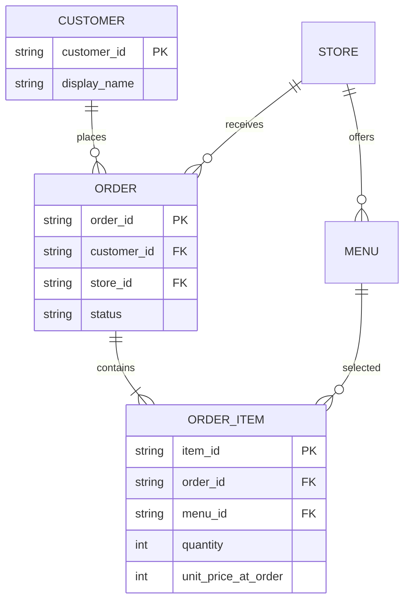
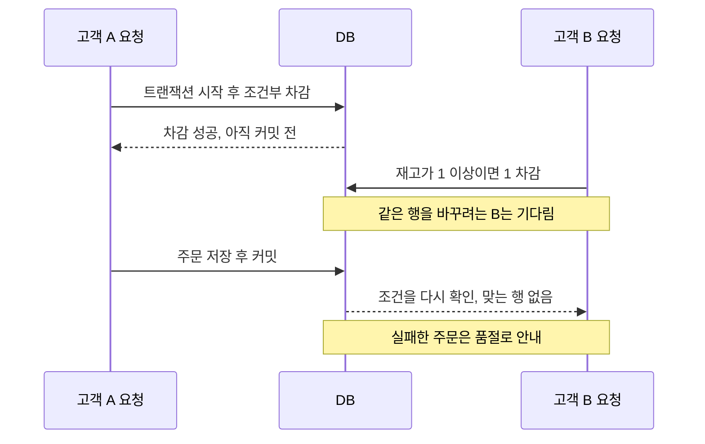
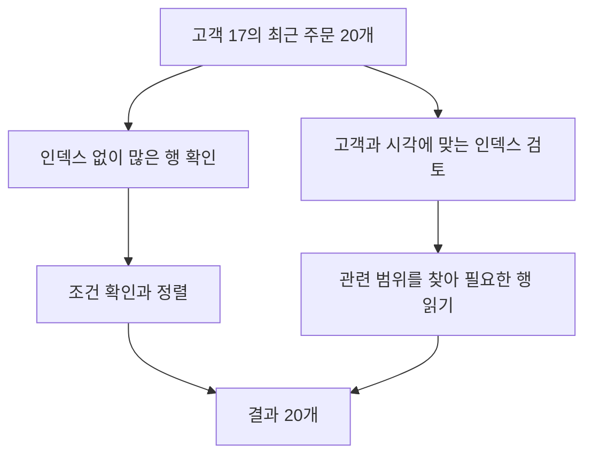
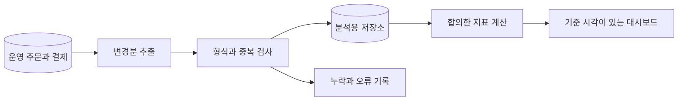

# 주문은 백 건인데, 매출표는 왜 세 가지일까

식당 사장 수진은 주문표를 내려받아 계산했습니다. 운영 담당 지후는 대시보드를 열었습니다. 개발자 민서는 DB에 질의했습니다. 세 사람이 같은 날을 보고 있었는데 금액이 달랐습니다. “컴퓨터가 계산했으니 맞겠죠”라는 말은 더 이상 통하지 않았습니다.

이 글은 가상의 주문 서비스 ‘한끼픽’이 수기 장부를 데이터로 바꾸고, 그 숫자를 믿을 수 있게 만드는 과정을 따라갑니다. 모든 주문과 금액은 설명용 설정입니다. 데이터베이스를 처음 접한다면 ‘무엇을 한 건이라고 부르는가’를 계속 생각하며 읽어 보세요.

## 1. 첫날 — 한 줄에 모든 것을 적었다

첫 장부에는 고객 이름, 메뉴 이름, 가격, 수량, 주문 시각, 가게 주소가 한 줄에 있었습니다. 보기에는 편했습니다. 하지만 같은 고객 이름을 여러 사람이 쓸 수 있었고, 가게 주소를 고치려면 과거 주문의 여러 줄을 바꿔야 했습니다. 어느 줄은 바꾸고 어느 줄은 놓치면 한 가게가 두 주소를 가진 것처럼 보였습니다.

민서는 현실에서 구분해야 하는 대상을 먼저 나눴습니다. 고객, 가게, 메뉴, 주문, 주문 항목입니다. 주문 한 번에 메뉴를 여러 종류 살 수 있으므로 주문과 주문 항목을 분리했습니다. 고객 이름 대신 고객 ID로 연결하고, ID는 사람을 구분하는 내부 식별값으로 사용했습니다.

그림의 CUSTOMER는 고객, ORDER는 주문, MENU는 메뉴, ORDER_ITEM은 주문 항목입니다. PK는 각 행을 구분하는 기본키, FK는 다른 표의 행을 가리키는 외래키를 뜻합니다. 선 끝의 기호는 하나와 여럿의 관계를 나타냅니다. 여기서는 한 주문이 한 가게에 속한다고 정했습니다. 여러 가게의 메뉴를 한 번에 결제하는 서비스를 만들면 이 모델도 다시 검토해야 합니다. ER 도식은 현실의 유일한 정답이 아니라 이 서비스가 어떤 규칙을 선택했는지 나타냅니다.

표를 나누는 이유는 표 수를 늘리기 위해서가 아닙니다. 같은 사실을 여러 곳에 반복해 적다가 서로 달라지는 일을 줄이려는 것입니다. 이렇게 데이터의 중복과 변경 문제를 줄이도록 구조를 정리하는 작업을 정규화라고 부릅니다.

## 2. 둘째 날 — 오늘 가격으로 지난달 주문을 계산했다

수진이 도시락 가격을 올리자 지난달 매출까지 늘어났습니다. 과거 주문을 계산할 때 현재 메뉴 가격을 가져온 탓이었습니다. 민서는 ‘메뉴의 현재 가격’과 ‘주문할 때 합의한 가격’이 다른 사실임을 뒤늦게 깨달았습니다.

주문 항목에는 주문 당시의 단가를 남겼습니다. 메뉴 ID도 유지하지만, 과거 금액을 현재 메뉴 표에서 다시 계산하지 않습니다. 정규화를 배웠다고 같은 숫자가 보이는 모든 칸을 없애면 안 됩니다. 현재 가격과 거래 당시 가격은 의미와 시간이 다릅니다.

| 기록 | 뜻 | 바뀌는 때 |
| --- | --- | --- |
| 메뉴 현재 가격 | 지금 새 주문에 제시하는 가격 | 가게가 메뉴 가격을 변경할 때 |
| 주문 당시 단가 | 그 주문에서 적용한 가격 | 승인된 정정 절차가 있을 때 |
| 수량 | 그 주문 항목의 개수 | 허용된 주문 변경 시 |
| 환불액 | 이미 돌려준 금액 | 환불 처리 시 |

이후 팀은 고객이 실제로 본 금액, 할인 규칙, 최종 결제 금액의 관계도 기록했습니다. 어느 숫자가 틀렸는지 따지려면 계산에 사용한 당시 조건을 알아야 했기 때문입니다. 단지 최종 합계 하나만 저장하면 왜 그 합계가 됐는지 설명하기 어렵습니다.

## 3. 첫 주말 — 마지막 도시락을 두 명이 샀다

도시락이 한 개 남았을 때 두 요청이 동시에 도착했습니다. 둘 다 재고가 1이라고 읽고 주문을 저장했습니다. 읽은 값은 각 순간에 맞았지만 두 요청을 합친 결과는 틀렸습니다. 민서는 재고 확인과 차감을 따로 생각한 것이 문제라는 것을 알았습니다.

팀은 재고가 필요한 수량 이상일 때만 차감하는 조건부 갱신을 사용했습니다. 갱신된 행이 없으면 품절로 처리합니다. 재고 차감과 주문 저장은 같은 DB 트랜잭션으로 묶어 한쪽만 남지 않게 했습니다. 아래는 실제 실행 코드를 모두 보여 주기보다 경쟁 상황의 순서를 단순화한 그림입니다.

트랜잭션을 사용한다는 말만으로 모든 동시 실행 문제가 해결되지는 않습니다. 어떤 읽기와 쓰기를 묶고, 어떤 격리 수준과 잠금·제약을 쓰는지에 따라 결과가 달라집니다. 격리 수준은 동시에 실행되는 트랜잭션이 서로의 변경을 어떻게 보게 할지 정하는 규칙입니다. [PostgreSQL 트랜잭션 격리 문서](https://www.postgresql.org/docs/current/transaction-iso.html)를 참고해 실제 DB의 동작을 확인해야 합니다.

이 팀은 승인된 상태 변경만 허용하는 규칙과 수량이 음수가 되지 않는 제약도 두었습니다. 프로그램 한 곳에 검사 코드를 써 놓는 것과 DB가 잘못된 기록을 거절하게 하는 것은 다른 방어입니다. 누가 다른 경로로 데이터를 바꾸더라도 지켜야 할 규칙은 저장소에서도 확인했습니다.

## 4. 둘째 달 — 조회가 느려지자 모든 열에 인덱스를 달고 싶어졌다

주문이 쌓이자 ‘한 고객의 최근 주문 20개’ 화면이 느려졌습니다. 민서는 DB가 실제로 어떤 경로로 행을 찾는지 실행 계획을 확인했습니다. 요청하는 것은 20개인데 관련 없는 주문을 많이 살펴보고 정렬하고 있었습니다.

인덱스는 특정 조건으로 행을 찾기 위한 보조 구조입니다. 팀은 고객 ID로 범위를 좁히고 주문 시각 순서로 읽는 조회에 맞춰 인덱스를 검토했습니다. [PostgreSQL의 인덱스 설명](https://www.postgresql.org/docs/current/indexes-intro.html)처럼 인덱스가 있더라도 DB는 비용에 따라 다른 읽기 방법을 선택할 수 있습니다. 실제 데이터와 실행 계획으로 효과를 확인해야 합니다.

인덱스를 추가하자 이 조회는 빨라졌지만 저장 때 갱신할 보조 구조도 늘었습니다. 모든 열에 인덱스를 만들면 저장 공간과 쓰기 비용을 지불하면서 사용하지 않는 구조까지 관리하게 됩니다. 팀은 ‘느리다’는 말 대신 조회 조건, 반환 행 수, 실행 시간, 호출 빈도를 같이 기록했습니다. 한 번 빠른 쿼리보다 점심시간 전체에 어떤 부담을 주는지가 중요했습니다.

## 5. 셋째 달 — 세 개의 매출은 서로 다른 질문에 답하고 있었다

이제 첫 장면의 매출표로 돌아옵니다. 민서의 숫자는 주문 접수액이었습니다. 지후의 대시보드는 결제 완료액을 합쳤습니다. 수진은 환불을 뺀 금액을 계산했습니다. 프로그램이 전부 같은 계산을 잘못한 것이 아니라, 서로 다른 숫자에 같은 ‘매출’이라는 이름을 붙였던 것입니다.

팀은 먼저 지표의 문장을 적었습니다. 어느 사건을 기준으로 날짜를 정하는지, 어떤 상태를 포함하는지, 환불이 다음 날 발생하면 어떻게 표시할지 결정했습니다. 아래는 이 이야기의 내부 운영 지표이며 회계 기준을 정의하는 표가 아닙니다.

| 화면 이름 | 포함하는 기록 | 날짜 기준 | 예시 금액 |
| --- | --- | --- | ---: |
| 주문 접수액 | 접수된 주문 | 접수 시각 | 100,000원 |
| 결제 완료액 | 성공한 결제 | 결제 완료 시각 | 90,000원 |
| 당일 결제에서 환불을 뺀 값 | 당일 완료 결제와 당일 환불 | 각 사건 발생 시각 | 80,000원 |

예시에서는 당일 결제 90,000원과 당일 환불 10,000원을 사용했습니다. 환불이 과거 주문에서 발생할 수도 있으므로 이 값이 당일 주문의 최종 수익과 같다고 부르지 않았습니다. 이름이 길어져도 뜻이 분명해야 숫자로 잘못 판단하는 일을 줄일 수 있습니다.

그리고 DB 시각과 화면의 한국 시간 표시를 맞췄습니다. 자정 근처 주문이 서로 다른 날짜에 들어가면 합계가 달라집니다. ‘하루’도 자연스럽게 정해지는 값이 아니라 서비스가 정하고 일관되게 적용해야 하는 기준이었습니다.

## 6. 넷째 달 — 분석을 하다가 주문 서비스가 느려졌다

지후는 매일 여러 달의 주문을 한 번에 집계했습니다. 큰 조회가 주문 저장과 자원을 경쟁하자 분석할수록 점심 주문이 느려졌습니다. 팀은 운영 DB가 지금 주문을 안전하게 처리하는 일과, 분석용 데이터가 과거를 비교하는 일을 나누기로 했습니다.

운영 기록을 추출하고, 형식을 맞추고, 분석용 저장소에 넣는 파이프라인을 만들었습니다. 이때 ‘다시 실행하면 두 배가 되지 않는가’가 중요한 질문이었습니다. 주문 ID와 변경 버전 같은 기준으로 중복을 구분하고, 늦게 들어온 취소나 환불을 반영하도록 했습니다. 처음에는 하루 한 번 배치로 충분했습니다. 모든 통계가 실시간일 필요는 없었습니다.

계보는 한 숫자가 어떤 원본과 변환 과정을 거쳐 왔는지 나타내는 경로입니다. 지후는 합계가 달라지면 대시보드 새로고침만 반복하지 않았습니다. 원본에 사건이 있는지, 추출됐는지, 검사에서 제외됐는지, 지표 조건에 포함되는지를 차례로 확인했습니다.

민서는 원본 건수와 적재 건수만 비교하지 않고 금액 합계와 상태별 건수도 대조했습니다. 건수가 같아도 한 주문이 빠지고 다른 주문이 두 번 들어갔을 수 있기 때문입니다. 데이터 품질은 빈 칸이 없다는 뜻보다 넓었습니다.

## 7. 마지막 장부 — 질문을 바꾸니 숫자가 설명되기 시작했다

수진은 이제 “매출이 얼마예요?”라고만 묻지 않았습니다. “어제 결제 완료액과 어제 처리한 환불을 따로 보여 주세요”라고 말했습니다. 지후는 대시보드에 마지막 반영 시각을 넣었고, 민서는 숫자를 구성하는 주문까지 추적할 수 있게 했습니다.

팀이 얻은 것은 표를 많이 만드는 능력이 아니었습니다. 한 건의 의미를 정하고, 바뀌면 안 되는 기록과 현재 값을 구분하고, 동시에 들어오는 요청을 안전하게 다루고, 계산 과정을 설명하는 능력이었습니다. 데이터를 잘 다룬다는 말은 ‘큰 데이터를 가진다’보다 ‘이 숫자가 왜 이렇게 나왔는지 설명할 수 있다’에 가까워졌습니다.

다음에 숫자가 다른 두 화면을 만나면 어느 쪽이 틀렸다고 먼저 정하지 마세요. 두 화면이 같은 대상, 같은 상태, 같은 기간, 같은 시점의 데이터를 보고 있는지부터 확인해 보세요. 그 질문만으로도 실무의 많은 논쟁이 계산 문제에서 정의 문제로 바뀝니다.
