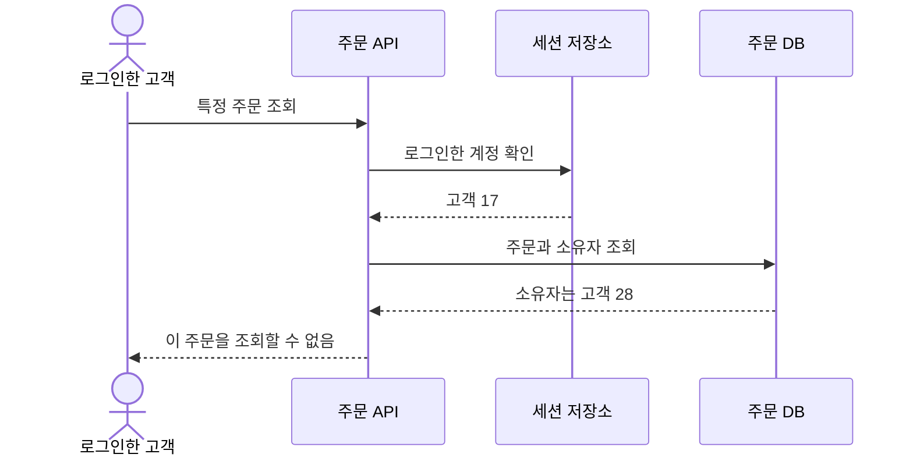
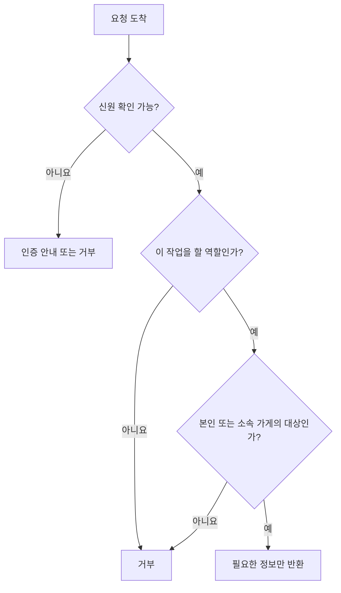
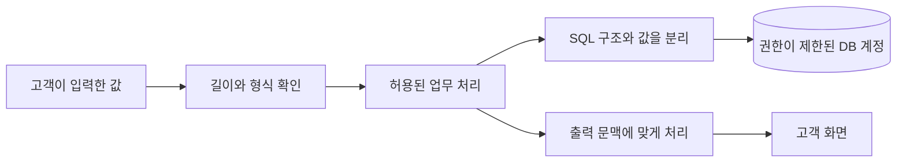
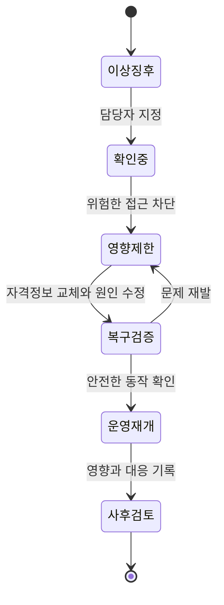

# 로그인은 했는데, 남의 주문이 보였다

신입 개발자 도윤은 자기 주문 화면의 주소 끝 숫자를 바꿔 봤습니다. 시험 계정 두 개를 만들어 확인하던 중이었습니다. 자기 계정으로 로그인했는데 다른 시험 계정의 주문이 열렸습니다. 배포 전 테스트였기에 실제 고객 피해는 없었지만, 팀은 일정을 멈추고 원인을 찾았습니다.

가상의 주문 서비스 ‘한끼픽’이 로그인 기능부터 보안 사고 대응까지 준비하는 이야기입니다. 인물과 사건은 교육용 설정입니다. 공격 방법을 재현하기보다 어떤 신뢰 가정이 틀렸고 서비스가 무엇을 확인해야 하는지를 따라갑니다.

## 1. 첫 주 — 로그인 성공을 모든 허가로 착각했다

개발자 민서는 로그인한 사람에게만 주문 화면을 열어 줬습니다. 하지만 로그인은 “누구인가”를 확인하는 인증이고, 그 주문을 볼 수 있는지는 “무엇을 해도 되는가”를 확인하는 인가입니다. 둘은 다른 질문입니다.

서버는 주문 번호로 기록을 찾은 뒤 요청자의 계정과 주문 소유자를 비교하지 않았습니다. 화면에 남의 주문으로 가는 버튼이 없다는 사실은 접근 통제가 아니었습니다. 사용자는 화면에 마련된 버튼 밖에서도 요청을 보낼 수 있습니다. 팀은 서버에서 요청마다 대상과 권한을 확인하도록 바꿨습니다. [OWASP 인가 지침](https://cheatsheetseries.owasp.org/cheatsheets/Authorization_Cheat_Sheet.html)은 기본 거부와 요청마다의 권한 검증을 강조합니다.

주문 번호를 길고 추측하기 어렵게 바꾸는 것은 노출을 줄이는 데 도움을 줄 수 있습니다. 하지만 소유자 확인을 대신하지는 않습니다. 번호를 우연히 알거나 다른 경로로 전달받아도 권한이 없다면 기록이 열리지 않아야 합니다.

## 2. 둘째 주 — 사장님 권한도 하나로 묶을 수 없었다

수진은 자기 가게의 주문을 확인해야 했고 아르바이트생은 오늘 조리할 메뉴만 알면 됐습니다. 그런데 처음 만든 관리자 화면은 모든 가게와 모든 기간의 주문을 보여 줬습니다. 팀은 편하게 개발하려고 큰 권한 하나를 만들어 둔 상태였습니다.

보안 담당 역할을 맡은 지후는 “업무를 끝내려면 정확히 무엇이 필요한가”를 물었습니다. 이름표에 ‘관리자’라고 적는 것만으로는 부족했습니다. 어떤 가게에 속하는지, 어떤 작업을 하는지, 어느 기간을 조회하는지도 확인했습니다.

| 역할 | 필요한 작업 | 허용하지 않는 작업 |
| --- | --- | --- |
| 고객 | 본인 주문 조회와 허용된 취소 | 다른 고객 주문 조회 |
| 주방 담당 | 소속 가게의 조리 목록·상태 변경 | 전체 고객 정보 내려받기 |
| 가게 운영자 | 소속 가게의 주문·메뉴 관리 | 다른 가게 데이터 변경 |
| 고객지원 | 승인된 문의의 최소 정보 확인 | 이유 없는 전체 주문 탐색 |

필요한 만큼만 권한을 주는 것을 최소 권한이라고 합니다. 팀은 권한을 주는 절차뿐 아니라 퇴사·이동 때 회수하는 절차도 만들었습니다. 오늘 필요한 권한이 다음 달에도 필요하리라는 보장은 없기 때문입니다.

## 3. 셋째 주 — 입력값을 명령으로 취급하지 않았다

가게 검색을 만들던 도윤은 고객이 입력한 글자를 SQL 문장에 그대로 이어 붙였습니다. 이 방식에서는 입력이 단순한 검색어가 아니라 DB 명령의 일부로 해석될 여지가 생깁니다. SQL 주입은 이런 경계가 무너지는 문제입니다.

팀은 SQL 구조와 사용자 값을 따로 전달하는 매개변수화된 질의를 사용했습니다. 입력 길이와 허용 형식도 검사했지만, 특정 문자 몇 개를 지우는 방식으로 SQL 구조 보호를 대신하지 않았습니다. [OWASP SQL 주입 방지 지침](https://cheatsheetseries.owasp.org/cheatsheets/SQL_Injection_Prevention_Cheat_Sheet.html)의 준비된 질의 설명을 확인했습니다.

검색 결과를 HTML에 보여 줄 때도 경계가 필요했습니다. 사용자 입력을 화면 코드로 해석하지 않고 텍스트로 표시해야 했습니다. 입력을 받아들이는 순간의 검사와 결과를 출력하는 문맥에 맞춘 처리는 별개입니다. 팀은 “검사한 입력이니까 어디에 붙여도 안전하다”는 가정을 버렸습니다.

DB 계정도 서비스에 필요한 읽기·쓰기만 할 수 있게 했습니다. 입력 처리에 실수가 생기더라도 모든 테이블과 관리 기능을 마음대로 사용하지 못하게 하려는 것입니다. 하나의 방어가 완벽하다고 믿기보다 경계를 여러 곳에서 확인했습니다.

## 4. 첫 달 말 — 비밀번호를 잊었다는 문의가 들어왔다

수진이 고객 비밀번호를 찾아 달라고 요청했습니다. 민서는 원래 비밀번호를 보여 줄 수 없도록 저장했다고 설명했습니다. 비밀번호는 복호화해 돌려줄 목적으로 보관하지 않고, 비밀번호용 해시 알고리즘과 사용자별 솔트를 사용해 검증 가능한 형태로 저장합니다. 솔트는 같은 비밀번호라도 저장 결과가 그대로 같아지는 것을 막기 위해 더하는 값입니다.

팀은 직접 암호 알고리즘을 만들지 않았습니다. 유지되는 라이브러리를 사용하고 당시 [OWASP 비밀번호 저장 지침](https://cheatsheetseries.owasp.org/cheatsheets/Password_Storage_Cheat_Sheet.html)에 따라 알고리즘과 비용 설정을 검토했습니다. 비밀번호 재설정은 짧은 유효기간과 한 번 사용 제한이 있는 토큰으로 새 비밀번호를 정하게 했습니다. 원래 비밀번호를 알려 주는 기능은 만들지 않았습니다.

로그인 성공 뒤의 세션 ID도 중요했습니다. 세션을 훔치면 비밀번호를 몰라도 그 사용자인 것처럼 요청할 수 있기 때문입니다. 팀은 HTTPS, 쿠키의 보안 속성, 세션 만료·폐기, 로그인 뒤 세션 ID 갱신을 점검했습니다. 쿠키를 자동 전송하는 인증에서는 CSRF처럼 사용자가 의도하지 않은 요청을 보내게 하는 문제도 따로 대비했습니다. [OWASP 세션 관리 지침](https://cheatsheetseries.owasp.org/cheatsheets/Session_Management_Cheat_Sheet.html)은 세션을 인증과 연결된 중요한 자격정보로 다룹니다.

## 5. 둘째 달 — 정상 비밀번호로 비정상적인 일이 벌어졌다

한 시험 계정으로 짧은 시간에 많은 주문을 조회하는 요청이 나타났습니다. 팀은 로그인을 통과했다는 이유만으로 정상 사용이라고 단정하지 않았습니다. 계정 탈취, 자동화된 오용, 잘못 만든 내부 프로그램 모두 가능한 원인이었습니다.

이상 행동을 발견하려면 기록이 필요했지만 모든 내용을 로그에 넣지는 않았습니다. 요청 ID, 대상 ID, 결과, 시각, 필요한 보안 이벤트를 남기고 비밀번호·세션 원문·결제 비밀값은 제외했습니다. 로그에 접근할 사람과 보관 기간도 정했습니다. 공격을 찾으려고 만든 로그가 새로운 개인정보 노출 통로가 될 수 있기 때문입니다.

| 관측 신호 | 단정하면 안 되는 것 | 먼저 할 확인 |
| --- | --- | --- |
| 로그인 실패 급증 | 전부 공격이라고 단정 | 배포 오류·사용자 영향과 함께 확인 |
| 한 계정의 대량 조회 | 계정 주인이 범인이라고 단정 | 세션·요청 범위·권한·기기 변화 확인 |
| 권한 거부 증가 | 차단했으니 끝이라고 단정 | 성공한 요청과 이전 노출 가능성 확인 |
| 응답 시간 증가 | 무조건 공격이라고 단정 | 트래픽 변화와 내부 병목 비교 |

팀은 중요 관리 계정에 추가 인증을 적용하고, 과도한 시도에 속도 제한을 뒀습니다. 속도 제한은 정상 사용자를 과하게 막을 수도 있으므로 고객지원 경로와 조정 기준을 함께 만들었습니다. 보안 기능을 켰다는 사실보다 무엇을 막았고 누가 불편해졌는지를 확인했습니다.

## 6. 셋째 달 — 사고 대응을 처음부터 끝까지 연습했다

지후는 모의 훈련을 열었습니다. “관리자 세션이 유출됐다고 가정합시다. 첫 10분에 무엇을 하나요?” 민서는 서버부터 끄겠다고 했고, 수진은 가게 주문이 전부 멈추는지 물었습니다. 누구도 답을 혼자 정할 수 없었습니다.

팀은 영향 범위를 확인하는 사람, 접근을 제한하는 사람, 기록을 보존하는 사람, 사용자 안내를 맡는 사람을 나눴습니다. 모든 증거를 지우며 급히 복구하면 무엇이 유출됐는지 조사하기 어려울 수 있습니다. 반대로 분석이 끝날 때까지 노출을 방치해서도 안 됩니다. 확인한 사실과 아직 모르는 것을 구분하며 차단과 조사를 함께 진행했습니다.

보안 사고의 외부 신고나 통지 여부는 실제 사건·계약·적용 법규에 따라 별도 판단해야 합니다. 이 글의 훈련 절차가 그 의무를 대신하지는 않습니다. 여기서 팀이 연습한 것은 확인 없이 피해가 없다고 말하지 않고, 복구와 설명의 책임자를 분명히 하는 일이었습니다.

## 7. 다시 시험 계정으로 — 작은 거부가 큰 피해를 막았다

도윤은 처음과 같은 시험을 반복했습니다. 자기 계정으로 다른 시험 계정의 주문을 요청하자 서버가 거부했습니다. 고객지원 계정도 이유 없는 전체 조회를 할 수 없었고, 권한이 회수된 직원 계정의 세션은 더 이상 통하지 않았습니다.

팀은 이 검사를 배포 전에 다시 실행하도록 남겼습니다. 새 화면을 만들 때도 서버가 누구의 어떤 기록을 다루는지 확인했습니다. 보안은 마지막에 보안 제품을 붙이는 한 번의 작업이 아니라, 새 기능이 생길 때마다 신뢰 경계를 다시 확인하는 과정이 됐습니다.

처음 문제는 주소 끝의 숫자 하나였습니다. 하지만 해법은 숫자를 감추는 것보다 깊었습니다. 신원과 권한을 나누고, 데이터를 최소한만 보여 주고, 입력을 코드와 구분하고, 의심스러운 행동을 찾아 대응할 수 있어야 했습니다. 독자가 다음 화면을 만들 때 던질 질문도 여기서 시작합니다. “이 요청을 보낸 사람에게 이 대상과 행동을 허용해도 되는가?”
