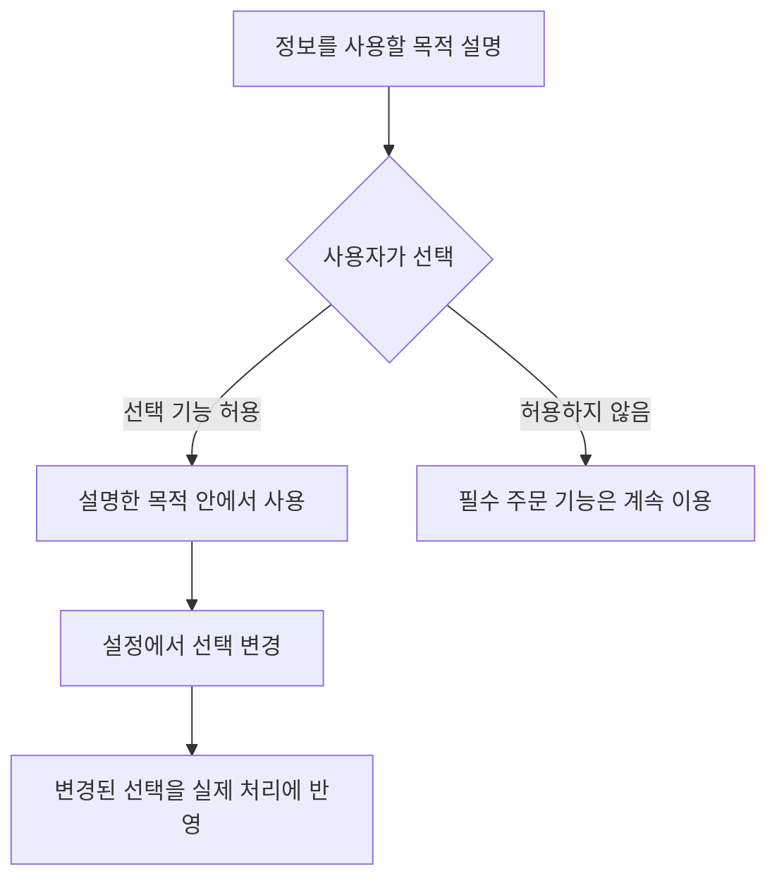
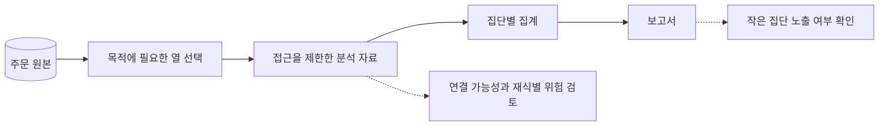
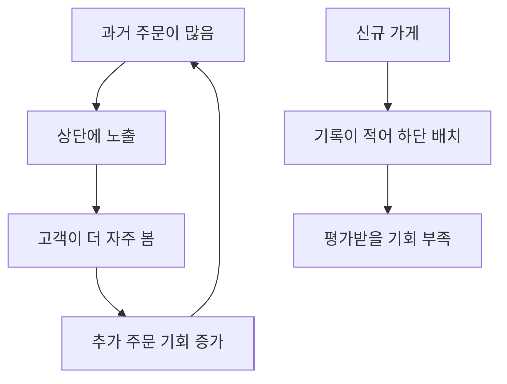
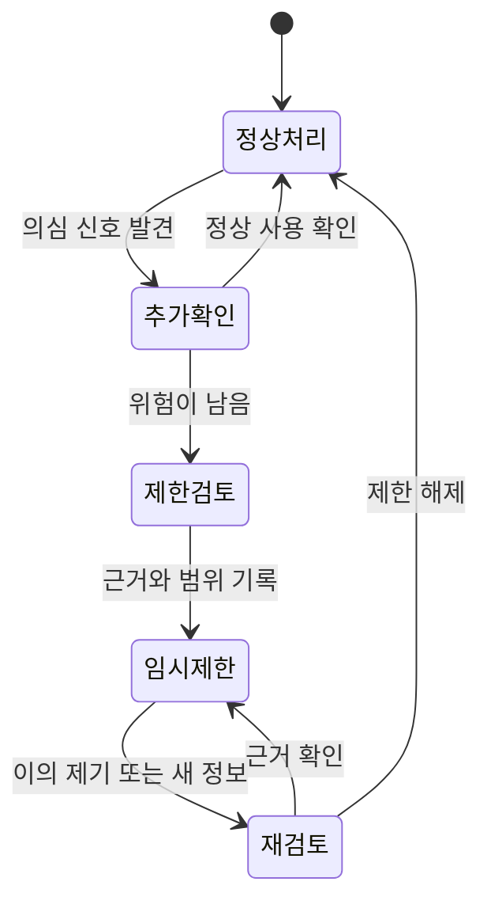

# 편리하게 만들었는데, 누군가에게는 불리해졌다

한끼픽 팀은 새 추천 기능을 축하했습니다. 많이 팔린 가게를 맨 위에 올리자 전체 클릭 수가 늘었습니다. 그런데 새로 입점한 사장님이 물었습니다. “아직 주문이 없어서 아래에 있고, 아래에 있어서 주문이 없는데 저는 언제 올라가나요?”

가상의 주문 서비스 ‘한끼픽’이 편리함과 성장만 보고 놓쳤던 사람들을 발견하는 이야기입니다. 인물·사건·수치는 가상 설정입니다. 특정 법률의 준수 여부를 판정하는 글이 아니라, 서비스를 설계하고 운영할 때 누구에게 어떤 영향을 주는지 판단하는 연습입니다.

## 1. 첫 주 — 언젠가 쓸 것 같아서 전부 모으려 했다

기획자 하린은 가입 화면에 생년월일, 성별, 주소, 직업을 넣었습니다. “나중에 추천할 때 쓸 수 있잖아요.” 개발자 민서는 주문 기능에 무엇이 필요한지 되물었습니다. 매장 수령 서비스라면 배달 주소는 당장 필요하지 않았습니다. 나중에 도움이 될지도 모른다는 이유와 현재 서비스를 위해 필요하다는 이유는 달랐습니다.

팀은 수집할 정보마다 사용 목적과 보관 이유를 적었습니다. 수령 알림에 필요한 연락 수단과 음식 취향 분석에 쓰고 싶은 정보는 분리했습니다. 정보를 많이 모으면 분석 기회뿐 아니라 노출·오용·설명 책임도 함께 늘어납니다. [ACM 윤리강령](https://www.acm.org/binaries/content/assets/about/acm-code-of-ethics-and-professional-conduct.pdf)은 사생활 존중과 피해 방지, 정직성을 함께 다룹니다.

| 정보 | 제안한 목적 | 팀의 선택 |
| --- | --- | --- |
| 연락 수단 | 주문 문제와 수령 안내 | 필요한 범위와 보관 기간 결정 |
| 배달 주소 | 언젠가 배달 기능에 사용 | 매장 수령 단계에서는 수집하지 않음 |
| 생년월일 전체 | 연령별 추천 | 현재 필요가 분명하지 않아 제외 |
| 주문 기록 | 주문 처리와 문의 대응 | 접근 범위와 보관·삭제 절차 구분 |

민서는 “안 모으면 유출될 기록도 줄어요”라고 말했습니다. 다만 이미 주문을 처리한 사실을 무조건 즉시 지우는 것도 답은 아니었습니다. 문의·정산·적용되는 보관 의무 등 실제 필요를 확인해 목적별 기간과 접근 제한을 정해야 했습니다. 최소 수집은 필요한 일을 못 하게 하자는 말이 아니라 필요를 설명하지 못하는 수집부터 멈추자는 판단이었습니다.

## 2. 둘째 주 — 동의 버튼은 있었지만 선택은 어려웠다

마케팅 알림 동의는 큰 초록 버튼으로, 거절은 작은 회색 글자로 보였습니다. 하린은 디자인일 뿐이라고 생각했습니다. 사용자 시험에서 몇 사람은 주문하려면 광고에도 동의해야 하는 줄 알았습니다. 화면이 사용자의 오해를 이용하고 있었던 것입니다.

팀은 주문 안내와 광고 안내를 구분하고 선택의 결과를 평이하게 썼습니다. 거절해도 주문을 할 수 있다면 실제로 그렇게 동작하는지 확인했습니다. 설정을 바꾸는 곳도 찾기 쉽게 만들었습니다. 한 번 ‘동의’를 받았다는 기록만으로 사용자가 이해했다고 단정하지 않았습니다.

이 흐름은 모든 수집에 같은 법적 근거를 적용한다는 뜻이 아닙니다. 팀이 만든 선택 기능에서 거절과 철회가 형식만 존재하지 않도록 확인한 과정입니다. 법적 문구를 붙이는 것과 사람에게 의미 있는 선택을 주는 것은 구별해서 살펴야 합니다.

## 3. 첫 달 — 이름을 지웠으니 익명이라고 생각했다

지후는 주문 분석 파일에서 이름과 연락처를 삭제했습니다. 대신 고객마다 같은 내부 ID, 주문 시각, 가게, 메뉴가 남았습니다. 팀은 이 파일을 ‘익명 데이터’라고 불렀습니다. 하지만 같은 ID의 행동을 계속 이어 볼 수 있었고 다른 정보와 결합하면 개인을 알아볼 가능성도 남았습니다.

민서는 파일 이름부터 바꿨습니다. 직접 이름을 지운 것과 재식별 가능성이 충분히 낮아졌다는 판단은 다릅니다. 분석에 꼭 필요한 열만 남기고, 개인별 추적이 필요 없는 보고서는 집계해서 만들었습니다. 표본이 아주 작은 집단의 결과도 조심해서 다뤘습니다.

가게에 주는 보고서에는 다른 가게의 고객 목록이 필요하지 않았습니다. 마케팅 업체에 원본을 넘기는 것이 편하더라도, 그 업체가 어디까지 사용하고 언제 지우는지 통제할 수 있는지 먼저 확인했습니다. 파일을 전달한 뒤 책임도 함께 사라지는 것은 아니었습니다.

## 4. 둘째 달 — 인기순이 인기를 더 만들었다

추천은 지난 주문 수가 많은 가게를 위에 보여 줬습니다. 위에 있는 가게는 더 많이 보였고 더 많은 주문을 얻었습니다. 하린은 이를 고객의 선호라고 읽었지만, 고객이 볼 기회 자체가 다르다는 사실을 놓쳤습니다.

팀은 기존 가게와 신규 가게를 나누어 노출 수, 클릭 수, 주문 수를 봤습니다. 전체 클릭이 늘었다는 지표 하나로 모두에게 더 좋은 추천이라고 말하지 않았습니다. 가게의 조리 가능 수량과 고객의 거리·수령 시간도 고려했습니다. 상단 노출을 돈으로 산 경우에는 광고임을 알아볼 수 있게 구분했습니다.

신규 가게를 무조건 위에 올리는 것도 모든 고객에게 좋은 해결은 아닙니다. 팀은 일부 영역에서 새로운 가게를 탐색할 기회를 주고, 품절·거리·수령 가능 시간 같은 기본 조건을 먼저 확인했습니다. 목표는 모든 가게의 결과를 똑같게 만드는 것이 아니라, 노출 방식이 만든 차이를 관측하고 설명할 수 있게 하는 것이었습니다.

| 함께 볼 사람 | 좋아질 수 있는 점 | 불리해질 수 있는 점 | 확인할 자료 |
| --- | --- | --- | --- |
| 고객 | 맞는 메뉴를 빨리 찾음 | 선택 범위가 좁아짐 | 만족도·재검색·취소 |
| 기존 가게 | 주문 증가 | 처리량 초과 | 지연·품절·불만 |
| 신규 가게 | 발견될 기회 | 기록 부족으로 계속 뒤로 밀림 | 노출 기회와 전환 |
| 운영팀 | 전체 지표 향상 | 소수의 피해를 놓침 | 집단별 결과와 이의 제기 |

## 5. 셋째 달 — “부정 사용자”라는 표시가 사람을 막았다

할인 악용을 줄이려고 같은 기기에서 여러 계정을 쓰면 자동 차단하는 규칙을 만들었습니다. 시험 운영 중 공용 기기를 쓰는 이용자가 정상 주문을 거절당했습니다. 규칙에 걸렸다는 사실은 부정행위를 확정하는 증거가 아니었습니다.

팀은 의심 신호와 최종 판단을 나눴습니다. 위험도가 낮은 경우에는 추가 확인을 요청하고, 중대한 제한에는 사람이 검토하는 경로를 뒀습니다. 고객에게는 이의를 제기할 방법과 확인에 필요한 최소 정보를 안내했습니다. 악용을 돕는 세부 탐지 규칙을 전부 공개하지 않더라도, 무엇이 제한됐고 어떻게 검토를 요청할 수 있는지는 설명할 수 있었습니다.

이의 제기를 받은 직원에게는 제한을 풀 권한과 판단 근거가 필요했습니다. 문의 창만 만들고 아무도 결정을 바꿀 수 없다면 실질적인 구제 경로가 아닙니다. 팀은 잘못 막은 사례를 모아 규칙을 수정하고, 수정 뒤에도 같은 집단이 반복해서 막히는지 확인했습니다.

## 6. 넷째 달 — 작은 글자 때문에 주문을 못 한 사람이 있었다

새 화면은 보기에는 깔끔했습니다. 하지만 확대하면 버튼이 가려졌고 키보드만 사용하는 고객은 오류가 난 입력칸을 찾기 어려웠습니다. 팀은 이것을 소수 사용자만의 취향으로 넘기지 않았습니다. 같은 일을 할 수 있는 기회가 화면의 사용 방식 때문에 달라졌습니다.

입력칸에 분명한 이름을 붙이고 오류를 색상만으로 표시하지 않았습니다. 키보드 순서와 초점 표시, 확대했을 때의 배치도 확인했습니다. [W3C의 접근 가능한 폼 안내](https://www.w3.org/WAI/tutorials/forms/)는 라벨·안내·검증 메시지를 다룹니다. 팀은 문서 확인과 별도로 실제 사용 방식으로 주문을 끝까지 해 봤습니다.

하린은 접근성을 나중에 여유가 생기면 할 작업으로 두었던 것을 돌아봤습니다. 디자인이 끝난 뒤의 부가 기능으로 취급하면 같은 기능을 다른 방식으로 사용하는 사람을 처음부터 놓칠 수 있었습니다. 팀의 완료 기준에 키보드와 확대 확인이 들어갔습니다.

## 7. 다섯째 달 — 책임질 사람이 있는 기능만 남겼다

팀은 새 기능을 검토할 때 사용자 이익만 적지 않았습니다. 어떤 정보가 필요한지, 누가 불리해질 수 있는지, 잘못된 결과를 누가 바로잡는지 함께 적었습니다. 추천 결과가 나쁘면 모델 탓, 차단이 틀리면 규칙 탓으로 돌리지 않기로 했습니다. 그 기능을 선택해 운영하는 팀의 책임이 남기 때문입니다.

회의는 조금 길어졌지만 뒤늦게 놀라는 일은 줄었습니다. 새로운 가게가 묻는 질문, 공용 기기 사용자의 이의 제기, 키보드 사용자의 실패가 제품을 고치는 자료가 됐습니다. 전체 숫자가 좋아도 그 안에서 누가 어떤 경험을 하는지 살펴볼 이유가 생겼습니다.

윤리적인 설계는 누구에게도 문제가 없는 완벽한 버튼을 찾는 일이 아니었습니다. 이익과 부담을 드러내고, 설명할 수 있는 선택을 하며, 잘못됐을 때 바꿀 통로를 남기는 일이었습니다. 당신이 다음 기능을 맡는다면 마지막으로 한 사람을 떠올려 보세요. 평균 지표 안에서 잘 보이지 않지만 그 기능의 영향을 받는 사람입니다.
