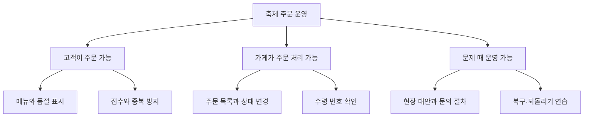
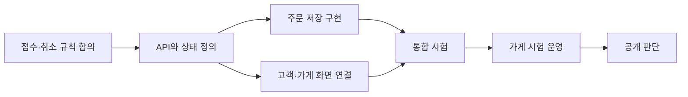
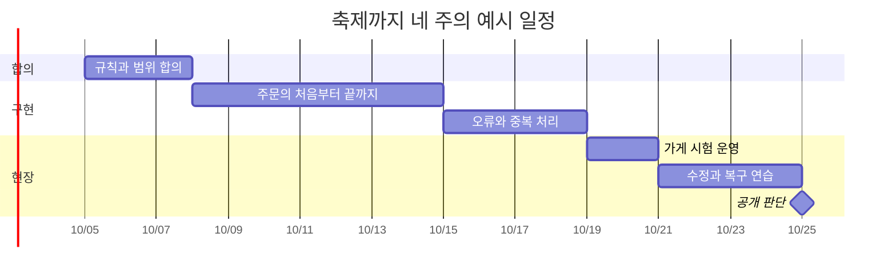
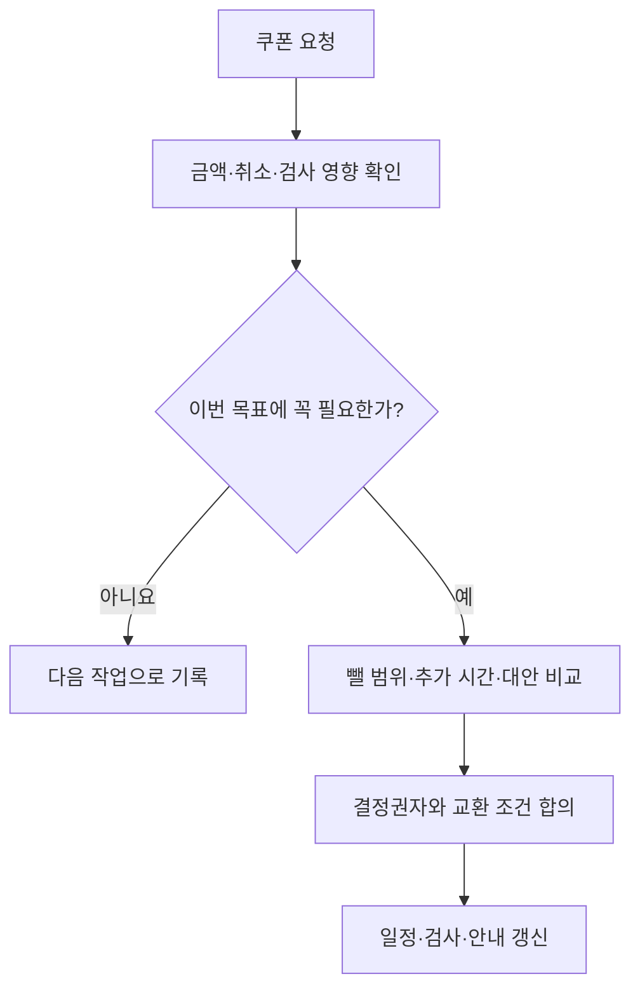

# 축제는 금요일인데, 기능은 아직 월요일에 있었다

축제까지 네 주. 한끼픽 팀은 할 일 목록을 보며 낙관했습니다. 화면 다섯 개, 결제 연결, 관리자 페이지, 통계. 각자 맡으면 충분해 보였습니다. 둘째 주가 끝날 때 화면은 대부분 완성됐지만 실제 주문은 한 건도 끝까지 처리되지 않았습니다.

가상의 식당 주문 서비스를 학교 축제에 맞춰 공개하는 프로젝트 이야기입니다. 인물·일정·예산은 학습용 설정입니다. 여기서 프로젝트는 정해진 목표를 일정과 자원 안에서 달성하기 위해 모인 한시적 작업입니다. 달력에 종료일을 쓰는 것과 종료일에 사용할 수 있는 결과를 만드는 것은 다릅니다.

## 1. 첫 월요일 — “축제 때 쓴다”를 같은 뜻으로 만들었다

기획자 하린은 축제에서 쓰면 성공이라고 말했습니다. 개발자 민서는 앱이 열리는 상태를 생각했고, 식당 사장 수진은 주문·취소·수령과 문의 대응까지 가능해야 한다고 생각했습니다. 운영 담당 지후는 인터넷이 끊겼을 때의 방법도 필요하다고 했습니다.

팀은 목표를 실제 행동으로 적었습니다. 축제 기간 한 가게에서 메뉴를 선택해 주문하고, 가게가 확인하고, 수령 번호로 전달할 수 있어야 합니다. 결제는 이번에는 현장 결제로 제한했습니다. 온라인 결제를 못 만들어서 숨긴 것이 아니라, 외부 승인과 환불 검증까지 마감 안에 준비할 수 있는지를 보고 범위를 정한 것입니다.

| 이번 공개에 필요한 것 | 뒤로 미룬 것 | 이유 |
| --- | --- | --- |
| 메뉴·품절·주문 접수 | 개인화 추천 | 주문을 끝내는 데 필수 아님 |
| 가게 확인·수령 번호 | 여러 가게 통합 장바구니 | 첫 운영 범위는 한 가게 |
| 취소 규칙·오류 안내 | 온라인 결제·자동 환불 | 외부 연동과 검증 범위 축소 |
| 현장 대안·문의 담당 | 장기 분석 대시보드 | 행사 중 운영이 우선 |

범위를 줄였다는 말을 문서에만 남기지 않았습니다. 수진과 담당 교사가 무엇을 기대하면 안 되는지까지 이해하도록 확인했습니다. 기능을 빼도 성공 조건을 달성할 수 있는지 합의해야 범위 조정이 됩니다.

## 2. 첫 수요일 — 사람별 할 일이 아니라 결과별로 쪼갰다

첫 작업표는 ‘민서 개발’, ‘도윤 화면’, ‘지후 운영’이었습니다. 누구나 바빴지만 무엇이 끝났는지 알기 어려웠습니다. 팀은 사용자에게 전달할 결과를 나누고, 그 결과를 만드는 작업을 붙였습니다. 큰 일을 빠뜨리지 않도록 나눈 구조를 WBS, 작업 분해 구조라고 부릅니다.

‘주문 접수’에는 화면만 들어가지 않았습니다. 저장 규칙, 중복 방지, 오류 안내, 실제 DB 검사까지 묶었습니다. 작업을 쪼개는 목적은 작은 칸을 많이 만드는 것이 아니라 완성된 결과에 무엇이 필요한지 드러내는 것이었습니다.

팀은 하나의 주문이 끝까지 흐르는 얇은 기능부터 만들기로 했습니다. 모든 화면을 먼저 완성한 뒤 마지막 날 연결하면 시스템 사이의 오해를 늦게 발견할 수 있기 때문입니다. 디자인이 덜 예뻐도 실제 접수부터 수령까지 한 번 통과시키는 것이 우선이었습니다.

## 3. 둘째 월요일 — 네 사람이 있어도 네 배 빨라지지 않았다

도윤은 주문 API가 정해지기를 기다렸고, 민서는 취소 정책을 기다렸습니다. 수진은 아직 질문을 받지 못했습니다. 작업 시간이 아니라 결정이 연결을 막고 있었습니다. 하린은 일정을 날짜 목록에서 의존 관계로 다시 그렸습니다.

팀은 가장 늦게 끝나면 전체 마감을 밀어내는 경로를 확인했습니다. 그 경로의 작업을 서둘러야 하는데, 관계없는 화면 꾸미기에 사람을 더 붙여도 마감은 앞당겨지지 않을 수 있습니다. 일정 관리가 사람에게 계속 빨리 하라고 말하는 일이 아닌 이유였습니다.

아래 일정은 네 주짜리 가상 계획입니다. 날짜는 작업 사이의 여유와 겹침을 보여 주기 위한 것입니다. 기간을 적었다고 반드시 그날 끝난다는 보장은 없으므로 팀은 며칠마다 실제 결과를 확인했습니다.

## 4. 둘째 금요일 — 아직 일어나지 않은 문제를 적었다

지후는 행사장 무선망이 불안할 수 있다고 말했습니다. 하린은 “일어나면 그때 고치자”고 답하려다가 멈췄습니다. 행사 중에 새 통신망을 마련할 수 있을까요? 발생 가능성과 영향, 대비에 걸리는 시간을 같이 봐야 했습니다.

아직 일어나지 않았지만 목표를 흔들 수 있는 일은 위험이고, 이미 주문이 안 들어오는 상태는 현재 해결해야 할 문제입니다. 팀은 두 목록을 분리했습니다. 위험마다 신호, 책임자, 대응 방법을 적고 일부는 실제로 시험했습니다.

| 위험 | 미리 볼 신호 | 준비한 대응 | 담당 |
| --- | --- | --- | --- |
| 현장 네트워크 불안 | 시험 장소의 연결 끊김 | 현장 주문 전환과 중복 대조 절차 | 지후 |
| 조리량보다 주문이 많음 | 시간대별 접수량 증가 | 수량 제한·접수 중지 안내 | 수진 |
| 핵심 개발자 부재 | 인수인계 없는 작업 | 실행·배포·복구 절차 공유 | 민서 |
| 변경 요청이 계속 추가 | 완료되지 않은 필수 작업 증가 | 필수 범위와 교환 조건 재확인 | 하린 |

현장 주문으로 전환한다고 적는 것만으로 준비가 끝나지 않았습니다. 종이 주문과 온라인에 이미 저장된 주문을 어떻게 대조할지 연습해야 했습니다. 같은 손님에게 도시락을 두 번 만들지 않으려면 전환 시점과 마지막 확인 번호가 필요했습니다.

## 5. 셋째 화요일 — “이것도 간단하죠?”라는 요청이 왔다

담당 교사가 쿠폰 기능을 요청했습니다. 민서는 버튼 하나를 추가하는 작업이 아니라 적용 조건, 중복 사용, 금액 계산, 취소 뒤 복원까지 필요하다고 설명했습니다. 하린은 무조건 거절하는 대신 현재 목표와 일정에 미치는 영향을 적었습니다.

팀은 세 선택을 비교했습니다. 다른 기능을 빼고 쿠폰을 넣기, 공개를 늦추기, 이번에는 직원이 현장에서 할인하고 시스템 쿠폰은 다음에 만들기. 축제 날짜는 바꿀 수 없었고 첫 운영의 성공 조건은 안정적인 주문이었으므로 세 번째를 선택했습니다. 수기로 할인한 기록을 남기는 방법도 함께 정했습니다.

변경 관리는 아이디어를 막는 절차가 아니었습니다. 새로운 약속을 넣으면서 기존 약속이 어떻게 바뀌는지 숨기지 않는 과정이었습니다. 요청자도 영향을 알면 ‘그냥 추가’ 대신 선택에 참여할 수 있었습니다.

## 6. 넷째 월요일 — 90% 완료보다 한 번의 실제 주문이 중요했다

팀원들은 각 작업이 90% 끝났다고 말했습니다. 하지만 수진이 직접 주문을 받아 보니 품절 처리 위치를 찾지 못했고, 취소된 주문도 조리 목록에 남았습니다. 코드를 많이 쓴 비율과 사용 가능한 결과는 달랐습니다.

팀은 완료 기준을 구체화했습니다. 정상 흐름뿐 아니라 품절·중복·취소·연결 끊김을 확인하고, 운영자가 절차를 수행할 수 있어야 완료로 보았습니다. [Scrum Guide](https://scrumguides.org/scrum-guide.html)의 완료 정의와 점검·적응 원칙을 참고했지만, 이 프로젝트가 특정 방법론을 그대로 따르는 것으로 포장하지 않았습니다.

시험 운영에서 나온 모든 제안을 마지막 주에 넣지는 않았습니다. 주문 안전과 운영을 막는 문제를 우선 고치고, 꾸미기와 편의 기능은 따로 남겼습니다. 일정 여유는 놀 시간이 아니라 실제 환경에서 드러난 차이를 수정할 시간이었습니다.

## 7. 축제 전날 — 만들던 사람이 없어도 운영할 수 있게 했다

민서는 지후에게 배포와 복구 절차를 넘겼습니다. 지후가 직접 실행해 보니 설명에 없는 환경 설정이 있었습니다. 문서를 읽는 것만으로는 찾지 못할 빈틈이었습니다. 팀은 한 번도 해 보지 않은 사람이 절차를 따라 할 수 있을 때까지 수정했습니다.

공개 판단에는 기능 목록 외에도 문의 담당, 접수 중지 방법, 되돌릴 버전, 백업 복원 확인, 현장 대안을 포함했습니다. 각 항목을 담당자가 확인하고 준비되지 않은 부분을 숨기지 않았습니다. “아마 될 것”과 “시험해서 확인함”을 다른 표시로 남겼습니다.

## 8. 축제 다음 날 — 끝났다는 말 뒤에 인계가 남았다

축제에서 주문은 처리됐지만 프로젝트가 자동으로 끝난 것은 아니었습니다. 남은 문의와 정산, 시험 계정 정리, 데이터 보관, 다음 운영 담당자를 확인했습니다. 팀은 어떤 선택이 도움이 됐고 어떤 가정이 틀렸는지 적었습니다. 사람을 탓하기보다 다음번에 더 일찍 발견할 방법을 찾았습니다.

하린은 첫날의 작업표를 다시 봤습니다. 그때는 기능이 몇 개 남았는지를 셌습니다. 이제는 무엇이 누구의 일을 가능하게 하고, 어떤 의존 관계와 위험 때문에 늦어질 수 있는지를 봤습니다. 프로젝트 관리는 일정표를 완벽하게 예언하는 일이 아니라, 불확실한 일을 함께 확인하고 약속을 계속 조정하는 일이었습니다.
