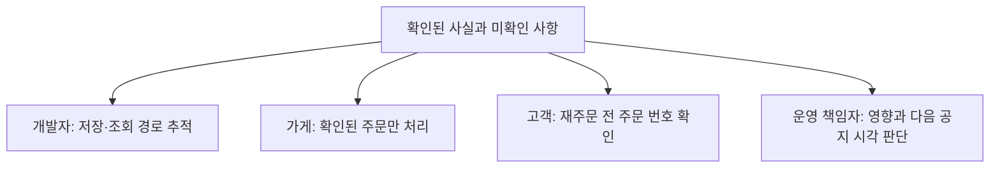
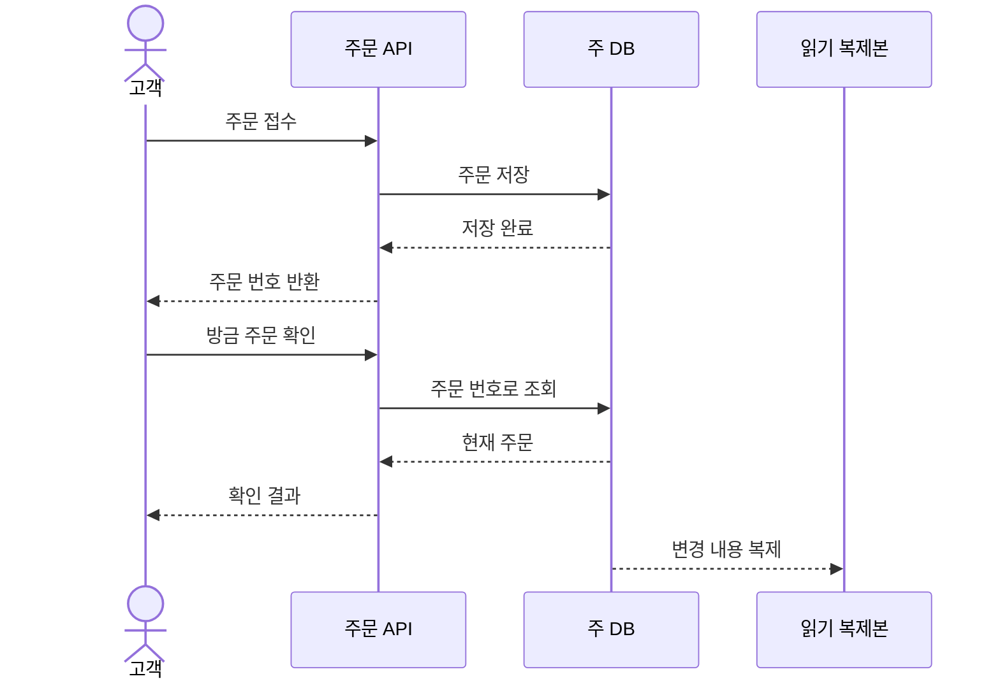
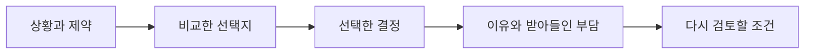
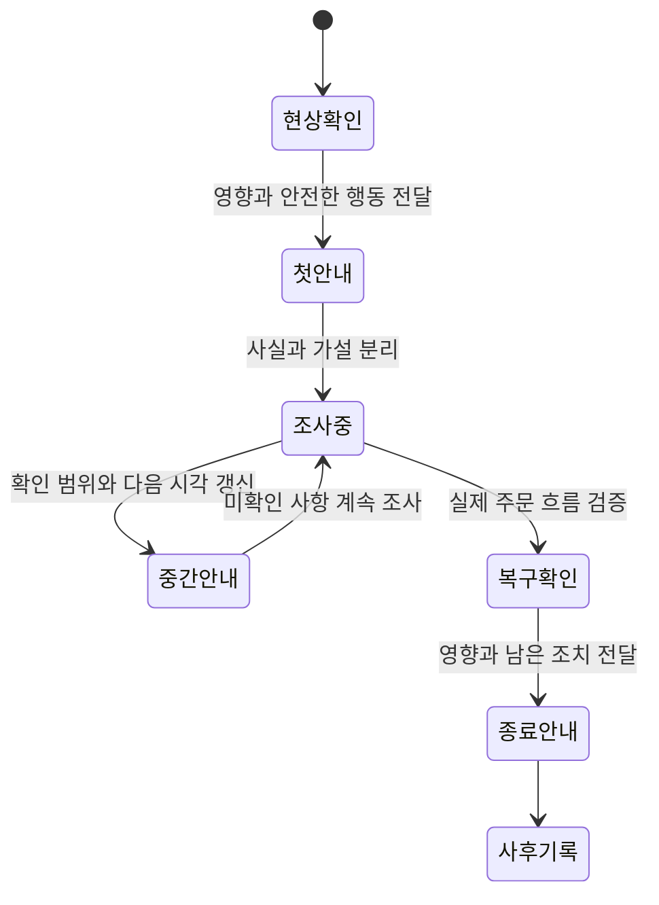

# “서버가 이상해요”라는 메시지로는 아무도 움직일 수 없었다

점심시간, 한끼픽 단체 대화방에 메시지가 올라왔습니다. “서버가 이상해요. 빨리 확인 부탁드립니다.” 개발자 민서는 서버 상태를 봤고, 운영 담당 지후는 가게에 전화했으며, 기획자 하린은 고객에게 무엇을 말할지 기다렸습니다. 다들 움직였지만 같은 문제를 보고 있는지는 몰랐습니다.

가상의 주문 서비스에서 말과 문서가 실제 행동을 바꾸는 과정을 따라갑니다. 사건과 시간은 설명용 설정입니다. 테크니컬 커뮤니케이션은 어려운 기술을 멋있게 표현하는 일이 아니라, 독자가 상황을 이해하고 필요한 판단과 행동을 할 수 있게 만드는 일입니다.

## 1. 첫 메시지 — 평가를 관측으로 바꿨다

‘이상하다’는 말에는 증상이 없었습니다. 주문 화면이 안 열리는지, 저장이 안 되는지, 주방에만 안 보이는지 알 수 없었습니다. 민서는 다시 질문해야 했습니다. 지후가 고객 화면을 확인한 뒤 메시지를 고쳤습니다.

> “12시 03분부터 고객 주문 완료 화면은 뜨지만 가게 주문 목록에 일부 주문이 안 보입니다. 현재 확인한 시험 주문은 O-31, O-32입니다. 재주문은 안내하지 않았습니다. 주문 저장 여부와 목록 조회를 나누어 확인해 주세요.”

이제 민서는 어떤 경로를 추적할지 알았습니다. 아직 원인을 모르므로 ‘DB 고장’이라고 쓰지 않았습니다. 발생 시각, 관측한 현상, 확인 범위, 이미 한 조치, 필요한 다음 행동이 들어갔습니다. [Google SRE의 문제 해결 설명](https://sre.google/sre-book/effective-troubleshooting/)도 관측을 바탕으로 가설을 세우고 확인하는 접근을 다룹니다.

| 모호한 표현 | 독자가 다시 물어야 하는 것 | 바꾼 표현 |
| --- | --- | --- |
| 서버가 이상해요 | 무엇이 어떻게 다른가? | 주문 완료 뒤 가게 목록에 일부 주문이 안 보임 |
| 자주 발생해요 | 언제, 몇 번인가? | 12:03 이후 확인한 시험 주문 2건에서 재현 |
| 아마 DB 문제예요 | 사실인가 추측인가? | 저장과 조회 중 어느 단계인지 확인 중 |
| 빨리 해 주세요 | 누가 무엇을 해야 하는가? | 민서는 저장 여부, 지후는 영향 가게 확인 |

문장을 길게 만드는 것이 목표는 아니었습니다. 다음 질문을 줄이는 데 필요한 정보를 넣는 것이었습니다. 반대로 고객 연락처나 결제 비밀값처럼 조사에 필요 없는 정보는 대화방에 붙이지 않았습니다.

## 2. 같은 날 — 개발자와 사장님에게 같은 설명을 보내지 않았다

민서는 복제 지연이 원인일 수 있다고 봤습니다. 기술 대화방에는 요청 ID와 조회 경로를 남겼지만 수진에게 “리드 레플리카 lag입니다”라고 말하지 않았습니다. 수진이 필요한 것은 용어의 발음이 아니라 지금 조리해도 되는 주문과 고객에게 할 안내였습니다.

하린은 같은 사실을 독자의 행동에 맞춰 나눴습니다. 사실 자체를 바꾸는 것이 아니라 필요한 상세 수준을 달리했습니다. 원인을 확정하지 않았다는 점은 어느 버전에도 유지했습니다.

| 독자 | 필요한 설명 | 요청할 행동 |
| --- | --- | --- |
| 개발자 | 주문은 저장됐는지, 어느 조회가 늦는지 | 요청 ID로 단계별 기록 대조 |
| 가게 | 목록 반영이 늦는 주문이 있음 | 확인된 번호 기준으로 처리, 중복 확인 |
| 고객 | 접수됐어도 목록 반영이 늦을 수 있음 | 반복 주문 대신 주문 번호로 문의 |
| 책임자 | 확인한 영향 범위와 아직 모르는 부분 | 운영 제한·지원 인력·공지 결정 |

지후는 안내를 보낸 뒤 “이해하셨죠?”라고만 묻지 않았습니다. 수진에게 지금 주문 O-31이 오면 어떻게 처리할지 말해 달라고 했습니다. 수진의 답에서 중복 주문 위험을 이해했는지 확인할 수 있었습니다. 설명을 전달한 것과 상대가 같은 행동을 떠올린 것은 달랐습니다.

## 3. 다음 주 — 그림 한 장으로 같은 요청을 따라갔다

장애가 지나자 도윤은 문서에 서버 상자를 여러 개 그렸습니다. 보기에는 그럴듯했지만 화살표에 뜻이 없었습니다. 요청인지 응답인지, 동기 호출인지 사건 전달인지 구분되지 않았습니다. 팀은 한 가지 질문만 답하는 그림으로 다시 만들었습니다. “주문 저장 뒤 바로 조회하면 어디로 가는가?”

세로 방향은 시간의 흐름이고, 가로 방향은 참여자입니다. 그림은 모든 서버 배치를 보여 주지 않습니다. 요청 한 번의 순서를 보여 줍니다. 글에는 왜 주문 직후 조회를 주 DB로 보내는지, 어떤 조회는 복제본을 써도 되는지를 설명했습니다. 그림과 문장이 서로 다른 질문을 맡게 했습니다.

팀은 화살표를 추가할 때마다 뜻을 말로 읽어 봤습니다. “API가 주 DB에 주문을 저장한다.” 읽을 수 없는 화살표는 대체로 설명이 빠져 있거나 불필요했습니다. 도식은 생각을 대신하지 않았지만, 빠진 생각을 드러내는 데 도움이 됐습니다.

## 4. 둘째 주 — API 문서는 성공 예시만으로 부족했다

화면 담당 도윤은 주문 API가 항상 주문 번호를 돌려주는 줄 알았습니다. 품절 응답을 받자 화면이 멈췄습니다. 민서는 오류 형식을 보냈다고 생각했지만 실제 문서에는 정상 응답 하나만 있었습니다.

API는 프로그램 사이의 약속입니다. 어떤 입력을 보내고 어떤 결과를 받을지, 실패와 재시도 때 무엇을 해야 하는지 합의해야 합니다. 팀은 내부의 모든 구현을 노출하는 대신 호출자가 행동을 결정하는 데 필요한 계약을 적었습니다.

| 상황 | 응답에 담을 의미 | 화면의 행동 |
| --- | --- | --- |
| 접수 성공 | 주문 번호와 현재 상태 | 접수 화면 표시 |
| 품절 | 처리되지 않았음과 이유 | 메뉴 선택으로 안내 |
| 같은 요청 키의 재시도 | 이미 처리한 주문 결과 | 새 주문을 만들었다고 표시하지 않음 |
| 같은 키에 다른 내용 | 요청 키 재사용 오류 | 자동 재시도 중지, 새 시도 확인 |
| 응답을 받지 못함 | 처리 여부를 아직 모름 | 같은 요청 키로 확인·재시도 정책 적용 |

특히 통신 시간 초과는 주문 실패와 같지 않습니다. 서버가 저장한 뒤 응답만 유실됐을 수 있습니다. 이 차이를 문서에 쓰지 않으면 화면은 고객에게 다시 주문하라고 안내할 수 있습니다. 좋은 오류 설명은 코드 번호를 나열하는 데서 끝나지 않고 안전한 다음 행동을 알려 줍니다.

## 5. 셋째 주 — 왜 그렇게 했는지 기억이 사라졌다

새로 합류한 개발자는 주문 직후 조회도 복제본으로 보내자고 제안했습니다. 주 DB 부담을 줄일 수 있다는 타당한 이유였습니다. 하지만 팀은 이전 장애 때문에 그 경로를 의도적으로 남겨 둔 상태였습니다. 결정 결과만 코드에 있고 이유는 대화방 깊숙이 묻혀 있었습니다.

민서는 짧은 결정 기록을 만들었습니다. 이를 ADR, 아키텍처 결정 기록이라고 부를 수 있습니다. 중요한 것은 약자가 아니라 당시 상황, 비교한 대안, 선택 이유, 부작용, 다시 검토할 조건을 남기는 것입니다.

기록에는 “주문 직후 확인은 주 DB에서 읽는다. 고객이 방금 한 주문을 못 보는 혼란을 줄인다. 주 DB 읽기 부담은 남는다. 부담이 목표를 넘으면 다른 일관성 보장 방법을 검토한다”라고 썼습니다. ‘최적의 구조’라고 단정하지 않았습니다. 당시 조건에 맞춘 선택임을 남겨야 다음 사람이 존중하면서도 바꿀 수 있습니다.

## 6. 넷째 주 — 장애 공지에서 추측을 사실처럼 쓰지 않았다

다시 조회 지연이 발생했습니다. 이번에는 하린이 첫 공지를 맡았습니다. “일부 주문 목록 반영이 늦습니다. 접수 상태를 확인 중이며 반복 주문을 피하고 주문 번호로 문의해 주세요. 다음 안내는 12시 30분에 드리겠습니다.” 원인과 복구 시각을 아직 모르므로 약속하지 않았습니다.

팀은 조사하는 사람과 외부에 전달하는 사람을 나눴습니다. [Google SRE의 사고 관리 설명](https://sre.google/sre-book/managing-incidents/)은 지휘·운영·소통 역할을 분리하는 접근을 다룹니다. 한끼픽은 작은 팀이므로 한 사람이 여러 역할을 맡을 수 있었지만, 누가 현재 공지를 책임지는지는 분명히 했습니다.

예정 시각에 새로운 사실이 없어도 조사가 계속된다는 안내와 다음 확인 시각을 보냈습니다. 침묵하면 고객은 문제가 끝났는지 방치됐는지 알 수 없습니다. 복구 뒤에는 그래프가 정상이라는 이유만으로 종료하지 않고 실제 주문 조회를 확인했습니다. ‘기술 조치 완료’와 ‘사용자 기능 복구’를 나눠 본 것입니다.

## 7. 다음 달 — 문서를 읽지 않은 사람이 아니라 못 움직이는 문서를 찾았다

지후가 휴가를 가기 전 운영 절차를 도윤에게 넘겼습니다. 도윤은 첫 단계부터 막혔습니다. ‘관리 화면에서 확인’이라고 돼 있었지만 어떤 화면인지, 어떤 권한이 필요한지 없었습니다. 지후에게는 당연한 정보가 처음 하는 사람에게는 없었습니다.

둘은 문서를 따라 실제로 수행하며 목적, 시작 조건, 단계, 정상 결과, 실패했을 때의 분기, 연락할 역할을 채웠습니다. 운영 비밀번호를 문서에 쓰는 대신 승인된 접근 절차를 가리켰습니다. 화면이 바뀌면 누가 문서를 갱신하는지도 정했습니다. 작성일만 있는 문서보다 유지할 책임자가 있는 문서가 오래 쓸 수 있었습니다.

## 8. 마지막 메시지 — 설명의 성공은 독자의 다음 행동에 있었다

처음의 ‘서버가 이상해요’는 거짓말은 아니었습니다. 하지만 누구도 그 문장만으로 안전하게 행동할 수 없었습니다. 팀이 배운 것은 모든 문서를 길게 쓰는 방법이 아니라 독자의 다음 판단에 필요한 사실을 골라 연결하는 방법이었습니다.

민서는 기술 설명을 쓴 뒤 세 가지를 확인했습니다. 독자가 모를 용어를 풀었는가, 새 이야기가 왜 나오는지 앞에서 설명했는가, 읽고 나서 무엇을 해야 하는지 알 수 있는가. 글과 UML, 표가 이 질문에 답하지 못하면 더 넣기보다 다시 구성했습니다.

다음에 당신이 메시지를 보낼 때 마지막 문장을 잠깐 미뤄 보세요. 상대가 이 글만 보고 같은 화면과 상황을 떠올릴 수 있는지 생각해 보세요. 그 짧은 확인이 다시 묻는 시간을 줄이고, 잘못된 행동을 막고, 팀이 같은 문제를 풀게 만듭니다.
