<!-- PDF page: 001 -->

# IT 비즈니스와 윤리

TOPCIT

ESSENCE Ver. 3

**비즈니스영역**

05 IT비즈니스와 윤리

---

<!-- PDF page: 002 -->

*원본 빈 페이지.*

---

<!-- PDF page: 003 -->

TOPCIT

ESSENCE Ver. 3

**비즈니스영역**

05 IT 비즈니스와 윤리

---

<!-- PDF page: 004 -->

TOPCIT 에센스는 TOPCIT을 준비하는 응시생들에게 학습자료를 제공하기 위해 발행되었습니다.
더 나아가 실무중심의 ICT관련 지식을 습득하고자 하는 학습자들이 자기주도적 학습을 위한 자원으로 활용할 수 있기를 바랍니다.

이 책의 내용에 대한 추가 지원과 문의는 TOPCIT 홈페이지 또는 홈페이지에 안내된 이메일을 이용해 주시기 바랍니다.

TOPCIT 에센스의 내용 중 일부는 집필진의 주관적인 의견이 반영되어 있으며, 해당 의견은 TOPCIT 사업단의 공식적인 입장이 아님을 밝혀둡니다.

| 구분 | 기관 |
| --- | --- |
| 주관부처 | 과학기술정보통신부 |
| 주관기관 | 정보통신기획평가원 |
| 참여기관 | 한국생산성본부 |
| 펴낸 곳 | TOPCIT 사업단 |

| 판 | 발행일 |
| --- | --- |
| 1판 | 2014. 12. 10. |
| 2판 | 2016. 02. 26. |
| 3판 | 2020. 02. 26. |

TOPCIT 에센스의 저작권은 과학기술정보통신부에 있으며 모든 내용의 무단전재와 복제를 금합니다.

---

<!-- PDF page: 005 -->

TOPCIT

ESSENCE Ver. 3

**비즈니스영역**

05 IT 비즈니스와 윤리

---

<!-- PDF page: 006 -->

TOPCIT

ESSENCE Ver. 3

---

<!-- PDF page: 007 -->

**비즈니스영역**

05 IT 비즈니스와 윤리

---

<!-- PDF page: 008 -->

**CONTENTS**

| 목차 | 교재 쪽수 |
| --- | ---: |
| **I. IT 비즈니스 개념** | **14** |
| **01 IT 비즈니스 개념요약** | **16** |
| 가) IT 비즈니스의 정의 | 17 |
| 나) 비즈니스와 IT의 연계 | 18 |
| **02 IT 비즈니스 생태계** | **19** |
| 가) IT 비즈니스와 하이프 사이클 | 19 |
| 나) IT 생태계 | 20 |
| 다) IT 비즈니스 생태계 구성요소 | 21 |
| **03 IT 비즈니스를 위한 IT 자원과 관리활동** | **22** |
| 가) IT 자원의 개념 | 22 |
| 나) IT 자원의 역할 | 22 |
| 다) IT 비즈니스를 위한 관리활동 및 구조 | 23 |
| **04 IT 비즈니스 가치사슬** | **24** |
| 가) 가치사슬 개요 | 24 |
| 나) 가치사슬 모델과 IT의 전사적 접목 | 25 |
| 다) 가치사슬 모델과 IT 전문기업 | 25 |
| 라) 가치사슬 모델의 확대 | 25 |
| **II. IT 비즈니스 전략** | **27** |
| **01 학습내용 요약** | **29** |
| **02 IT 비즈니스 전략수립** | **29** |
| 가) 전략수립의 개념 | 29 |

---

<!-- PDF page: 009 -->

| 목차 | 교재 쪽수 |
| --- | ---: |
| 나) 전략수립의 구성요소 | 29 |
| 다) 전략수립 프로세스 | 31 |
| **03 IT 비즈니스 환경분석** | **33** |
| 가) 외부 환경분석 | 33 |
| 나) 내부 환경분석 | 34 |
| 다) 내부 및 외부 통합 환경분석 | 36 |
| **III. IT 비즈니스 계획수립의 이해** | **38** |
| **01 학습내용 요약** | **40** |
| **02 IT 거버넌스** | **40** |
| 가) IT 거버넌스(Governance)의 개념 | 40 |
| 나) IT 거버넌스 프레임워크 | 41 |
| 다) IT 거버넌스 프로세스 | 42 |
| 라) IT 거버넌스 주요 관심영역 | 42 |
| **03 EA의 개념** | **43** |
| 가) EA(Enterprise Architecture)의 개요 | 43 |
| 나) EA 개념도 및 구성요소 | 44 |
| 다) EA 프레임워크 | 45 |
| **04 ISP의 개념** | **45** |
| 가) ISP(Information Strategic Planning)의 개요 | 45 |
| 나) ISP의 구축절차 | 46 |
| 다) ISP 구축 주요 산출물 | 47 |

---

<!-- PDF page: 010 -->

**CONTENTS**

| 목차 | 교재 쪽수 |
| --- | ---: |
| **IV. IT 비즈니스 도입의 이해** | **49** |
| **01 학습내용 요약** | **51** |
| **02 IT 비즈니스 도입 프로세스** | **51** |
| 가) IT 비즈니스 발주프로세스 | 51 |
| 나) 소프트웨어 도입 프로세스, ISO/IEC 12207 | 52 |
| 다) 테일러링 프로세스 | 54 |
| **03 IT 비즈니스 도입 방식** | **54** |
| **04 IT 비즈니스 아웃소싱 서비스** | **55** |
| 가) IT 비즈니스 아웃소싱의 개요 | 55 |
| 나) 도입 프로세스 | 56 |
| 다) 아웃소싱의 형태 | 56 |
| 라) 아웃소싱 도입에 따른 고려사항 | 56 |
| **V. IT 비즈니스 프로세스의 이해** | **58** |
| **01 학습내용 요약** | **61** |
| **02 IT 비즈니스 프로세스 수행을 위한 구성요소** | **61** |
| 가) 사람 및 조직 | 61 |
| 나) 업무 프로세스 | 62 |
| **03 IT 비즈니스 프로세스 사례** | **62** |
| **04 IT 비즈니스 프로세스 수행방법** | **64** |
| 가) IT 비즈니스 프로세스 관리 | 64 |

---

<!-- PDF page: 011 -->

| 목차 | 교재 쪽수 |
| --- | ---: |
| 나) IT 비즈니스 프로세스 정보관리 | 65 |
| **05 IT 비즈니스 프로세스 개선기법** | **67** |
| 가) BPR의 이해 | 67 |
| 나) PI의 이해 | 68 |
| 다) 6시그마의 이해 | 70 |
| 라) 트리즈의 이해 | 72 |
| 마) 서브퀄의 이해 | 73 |
| 바) SPC의 이해 | 74 |
| **VI. IT 비즈니스 서비스 이해하기** | **76** |
| **01 학습내용 요약** | **78** |
| **02 IT 비즈니스 범용 업무지원시스템** | **78** |
| 가) 엔터프라이즈 솔루션(Enterprise Solution) | 78 |
| 나) 엔터프라이즈 솔루션의 종류 | 79 |
| 다) 비즈니스 전략과 엔터프라이즈 솔루션 | 80 |
| 라) ERP의 이해 | 80 |
| 마) SCM의 이해 | 83 |
| 바) CRM의 이해 | 85 |
| 사) PLM의 이해 | 88 |
| **03 IT 비즈니스 의사결정 지원시스템** | **90** |
| 가) EDW의 이해 | 90 |
| 나) DSS의 이해 | 92 |
| 다) BI의 이해 | 94 |
| **04 IT 서비스관리의 이해** | **96** |

---

<!-- PDF page: 012 -->

**CONTENTS**

| 목차 | 교재 쪽수 |
| --- | ---: |
| 가) IT 서비스관리의 개요 | 96 |
| 나) ITIL의 이해 | 97 |
| 다) SLA의 이해 | 100 |
| 라) SLM(Service Level Management) | 101 |
| **VII. IT 비즈니스 성과평가 이해하기** | **103** |
| **01 학습내용 요약** | **105** |
| **02 재무적 성과평가 기법** | **105** |
| 가) 재무적 성과평가의 개요 | 105 |
| 나) 재무적 성과평가 기법의 종류 | 105 |
| **03 균형 성과평가 기법** | **106** |
| 가) BSC의 개요 | 106 |
| 나) BSC의 구성요소 | 106 |
| 다) BSC의 4가지 관점 | 107 |
| **04 IT 분야 균형 성과평가 기법** | **108** |
| 가) IT-BSC의 개요 | 108 |
| 나) IT-BSC의 구성요소 | 108 |
| **05 핵심 성과지표 관리** | **109** |
| 가) KPI의 개요 | 109 |
| 나) KPI 수립 절차 | 109 |
| 다) KPI 도출 시 유의사항 | 109 |
| **06 목표관리 체계** | **110** |

---

<!-- PDF page: 013 -->

| 목차 | 교재 쪽수 |
| --- | ---: |
| 가) MBO의 주요관점 | 110 |
| 나) MBO를 기업에서 도입하는 이유 | 110 |
| 다) MBO의 구성요소 | 110 |
| **VIII. IT 비즈니스 환경변화와 대응** | **112** |
| **01 IT 비즈니스 환경변화의 흐름** | **114** |
| 가) IT 비즈니스 환경변화의 이해 | 114 |
| **02 IT 비즈니스 환경변화에 따른 기업의 대응기법** | **115** |
| 가) IT 비즈니스 혁신 활동 | 115 |
| 나) IT 비즈니스 통합과 확산 | 119 |
| **IX. IT 비즈니스 최신 서비스** | **124** |
| **01 최신 웹 및 모바일 서비스** | **126** |
| 가) 최신 웹 기술 | 126 |
| 나) 모바일 서비스 | 129 |
| **02 스마트 비즈니스 인프라** | **133** |
| 가) 융합 인프라 | 133 |
| 나) 스마트 인프라 | 140 |
| **03 IT 비즈니스 최신 서비스** | **150** |
| 가) SW중심 IT 비즈니스 최신 서비스 | 150 |
| 나) HW중심 IT 비즈니스 최신 서비스 | 157 |

---

<!-- PDF page: 014 -->

**CONTENTS**

| 목차 | 교재 쪽수 |
| --- | ---: |
| **X. IT 비즈니스 관련 직업윤리** | **163** |
| **01 직업윤리의 개념 이해** | **165** |
| 가) 직업윤리의 개념 | 165 |
| 나) IT 비즈니스 직업윤리 | 167 |
| **02 IT 비즈니스 관련 윤리 원칙 및 강령** | **168** |
| 가) ICT 기술 관련 윤리 강령 | 168 |
| **XI. 개인정보보호** | **173** |
| **01 개인정보의 이해** | **175** |
| 가) 개인정보의 개념 | 175 |
| 나) 개인정보보호 관련 국내 유관 법령 | 180 |
| 다) 개인정보보호 관련 국외 정책 | 180 |
| **02 개인정보 침해 사전/사후 대응 방법** | **183** |
| 가) 개인정보처리자 사전 대응 방안 | 183 |
| 나) 개인정보처리자 사후 대응 방안 | 187 |
| **XII. 저작권과 산업재산권 보호** | **189** |
| **01 지식재산권의 이해** | **191** |
| 가) 지식재산권의 정의 | 191 |
| 나) 지식재산권의 유형 | 191 |
| **02 저작권의 이해** | **191** |
| 가) 저작권의 정의와 분류 | 191 |

---

<!-- PDF page: 015 -->

| 목차 | 교재 쪽수 |
| --- | ---: |
| **03 산업재산권과 신지식재산권의 이해** | **196** |
| 가) 산업재산권의 개념 | 196 |
| 나) 신지식재산권의 개념과 유형 | 198 |
| **04 부정경쟁방지 및 영업비밀보호의 이해** | **198** |
| 가) 부정경쟁방지의 개념 | 198 |
| **XII. IT 비즈니스 최신 서비스의 윤리적 이슈** | **201** |
| **01 IT 비즈니스 최신 서비스 주요 윤리 이슈** | **203** |
| 가) 최신 서비스 윤리 이슈 | 203 |

---

<!-- PDF page: 016 -->

## I. IT 비즈니스 개념

### 최근 동향 및 주요 이슈

과거의 IT를 바라보는 실무현장의 시선은 비즈니스 프로세스를 진행하는데 있어 보조 역할에 지나지 않았다. 하지만 오늘날 사용자들의 라이프 스타일이 디지털 기술과 밀접하게 연관되면서 기업의 비즈니스 프로세스에도 IT가 적극적으로 융합되는 변화를 맞고 있다. 이런 관점에서 IT 비즈니스의 개념뿐만 아니라, IT 비즈니스와 관련된 IT 생태계와 IT 가치사슬을 이해할 필요가 있다.

### 학습 목표

1. IT 비즈니스의 개념과 특성에 대해 설명할 수 있다.
2. IT 비즈니스의 생태계에 대해 설명할 수 있다.
3. 비즈니스에 투입되는 IT 자원과 활동의 이해를 통해 비즈니스 가치사슬에 대해 설명할 수 있다.

### 핵심 키워드

IT 비즈니스 개념, IT 비즈니스 생태계, IT 비즈니스 가치사슬

---

<!-- PDF page: 017 -->

### 실무 미리보기

2014년 9월 19일 오전 미국 뉴욕증시에서는 중국의 전자상거래 업체인 알리바바가 상장되었다. 놀라운 일은 상장된 당일에 알리바바의 주가가 공모가 대비 38% 상승하면서 기업의 시장가치는 2314억달러(241조 6,000억원)가 되었고, 알리바바의 대주주인 작은 체격의 마윈 사장은 단숨에 250억달러(26조원)의 재산가가 되면서 중국 제1의 부자가 되었다.

1999년 마윈은 친구 17명과 함께 그의 아파트에서 중국의 중소기업 제품을 전세계 기업에 판매하는 온라인 쇼핑몰 '알리바바'를 창업했다. 알리바바는 2000년 소프트뱅크의 손정의에게 2천만달러의 투자를 받으면서 고속 성장을 시작하였다. 기업대상(B2B) '알리바바'에 이어 개인대상(C2C) 온라인 쇼핑몰 '타오바오', 부유층 고객을 위한 온라인 백화점 '티몰', 전자결제 서비스 '알리페이' 등을 차례로 창립하였다. 이제 알리바바 그룹은 세계에서 가장 앞서가는 온라인 쇼핑몰 및 핀테크 기업집단이 되었다.

알리바바는 IT 비즈니스 분야에서 손꼽히는 성공모델이다. 이미 중국 시장을 선점하고 있던 세계적인 기업 이베이를 물리치고 알리바바가 성공한 핵심성공요소(CSF)는 무엇인가?

첫째, 알리바바 온라인 쇼핑몰에서는 거래 수수료가 없다. 수익은 광고와 검색 서비스 등에서 올린다. 둘째, 광활한 중국 영토에서 어느 곳이나 1~2일에 배송되는 혁신적 물류시스템을 구축하였으며, '알리페이' 서비스에 의해 불확실한 중국의 전자상거래를 거래 당사자가 신뢰할 수 있는 거래채널로 만들었다. 셋째, 고객의 요구를 적극 지원하였다. 중국 고유의 인터넷 쇼핑에서 구매결정 전에 채팅으로 흥정하는 '채팅 구매' 관행을 지원하였다. 넷째, 최고경영자 마윈의 비전과 전략이 조직 구성원 전원의 열정적인 참여와 추진력을 만들어 냈다.

앞에서 살펴본 바와 같이 알리바바는 성공하는 기업 조직이 가져야 할 가격, 품질, 고객친화적 서비스 등 3가지 경쟁력을 탁월한 방법으로 제공하고 있다. 그리고 가장 중요한 것은 경영자의 비전과 전략이 조직의 역량을 잘 이끌어 나갔다는 점이다. IT 비즈니스에서 전략이 왜 중요한지 그 이유를 잘 보여주는 사례이다.

---

<!-- PDF page: 018 -->

### 01 IT 비즈니스 개념요약

[그림 1] IT 비즈니스 수명주기 및 상호관계도

<table>
<tr><th>IT 비즈니스 전략</th><th>IT 비즈니스 계획수립</th><th rowspan="4">환경변화<br>IT 비즈니스 환경변화의 흐름<br>IT 비즈니스 환경변화에 따른 기업의 대응기법</th></tr>
<tr><td>IT 비즈니스 전략수립<br>IT 비즈니스 환경분석</td><td>IT 거버넌스<br>엔터프라이즈 아키텍처<br>정보화 전략계획</td></tr>
<tr><td colspan="2">IT 비즈니스 도입<br>IT 비즈니스 도입 프로세스 / IT 비즈니스 도입방식 / IT 비즈니스 아웃소싱 서비스</td></tr>
<tr><td>IT 비즈니스 프로세스<br>IT 비즈니스 프로세스 수행방법<br>IT 비즈니스 프로세스 개선기법</td><td>IT 비즈니스 서비스<br>IT 비즈니스 범용 업무지원시스템<br>IT 비즈니스 의사결정 지원시스템<br>IT 서비스관리</td></tr>
<tr><td colspan="3">IT 비즈니스 성과평가<br>재무적 성과평가 / 균형 성과평가 / 핵심 성과지표 / 목표관리 체계</td></tr>
<tr><td colspan="3">IT 비즈니스 최신 서비스<br>최신 웹 및 모바일 서비스 / 스마트 비즈니스 인프라 / IT 비즈니스 최신 서비스</td></tr>
</table>

<!-- 도식의 상자 안 문구를 표로 전사했다. 원본의 배경 화살표 배치는 생략했다. -->

IT 비즈니스는 전략과 계획수립을 통하여 IT 비즈니스 도입을 위한 단계로 진행된다. IT 비즈니스 도입과 맞물려 IT 비즈니스 프로세스가 구동되며, 프로세스의 결과물로 기업의 이윤을 창출할 수 있는 IT 비즈니스 서비스가 탄생된다. 이러한 일련의 사이클은 기업 비즈니스와 IT(Information Technology)의 접목을 통하여 순환적으로 이루어지며 지속적인 성과평가를 통해서 IT 비즈니스의 방향성을 수정하거나 개선한다.

기업의 경영환경은 정치, 경제, 사회, 문화, 기술 등의 변화에 민감하게 반응하며 최적화되어 기업가치 극대화를 위하여 발전하게 된다. IT는 기업 경영 최적화의 핵심요소로서, 최신 기술이 적용된 서비스와 접목하며 IT 비즈니스의 방향성을 확보하게 된다.

IT 비즈니스를 효율적으로 계획하고 구현하여 성과를 얻으려면 우선 IT 비즈니스의 개념을 명확하게 수립하여야 한다. 따라서, 본 장에서는 먼저 IT 비즈니스의 개념이 무엇이며, 어떻게 진화하여 왔는지 소개한다. 이어서 IT 신기술 하이프 커브에 의해 영향을 받는 IT 비즈니스 환경에서 서로 협력하고 서로 경쟁하는 콘텐츠(C), 플랫폼(P), 네트워크(N), 디바이스(D), 보안(S) 산업으로 이루어진 IT 생태계와 IT 생태계에서 창출되는 IT 가치사슬에 대하여 소개한다.

---

<!-- PDF page: 019 -->

#### 가) IT 비즈니스의 정의

IT 비즈니스는 기업의 궁극적인 비즈니스 목표를 달성하기 위해 다양한 프로세스에 IT를 접목하여 전략적으로 전개하는 모든 활동을 의미한다.

20세기 기업에서 컴퓨터는 전산실 중심으로 사용되었으며 기업의 일반 업무환경에서는 매우 제한적으로 활용되었다. 하지만 1990년대 이후부터 컴퓨터 기술의 발달과 웹 기술의 대중화가 이루어지면서 컴퓨터는 일반 업무환경에서 점진적으로 활용의 폭이 확대되기 시작했다.

이러한 컴퓨터 기술의 대중화는 21세기에 접어들어 산업 전반에 IT가 접목되면서 더욱 가속화되었다. 이 시기부터 대중들의 라이프 스타일이 디지털 중심으로 전환되기 시작했으며, 산업 전반에 걸쳐 비즈니스 프로세스의 중심에 IT가 핵심 역할을 담당하기 시작했다. 즉, 기업에서 업무에 부분적으로 컴퓨터를 활용한다는 개념이 아닌, 전사적인 관점에서 IT가 기업의 의사결정 과정에 핵심 역할을 담당하기 시작한 것이다.

2005년 이후부터 'IT 비즈니스'라는 개념이 IT가 중심이 된 상품을 판매하는 기업들을 중심으로 산업현장에서 본격적으로 거론되고 인식되기 시작했다. 2010년 이후 기업들의 비즈니스 프로세스에 IT 접목이 급속도로 확장되면서 IT 비즈니스의 개념은 기업의 경쟁우위를 확보하기 위해 비즈니스 프로세스에 IT가 밀접하게 결합되는 구조로 발전되었다. 특히 기업의 의사결정자들은 급변하는 경영환경에서 양질의 정보를 확보하려면 비즈니스와 IT 접목이 매우 중요하다는 것을 인식하기 시작했다. [그림 2]는 IT 비즈니스의 개념이 어떻게 발전되어 왔는지 설명하고 있다.

[그림 2] IT 비즈니스 개념의 발전

<!-- 두 도표의 순서는 문서 순서로 고정한다. Mermaid의 ~~~는 A~E 배치용 비가시 연결이며 업무 관계를 추가하지 않는다. -->

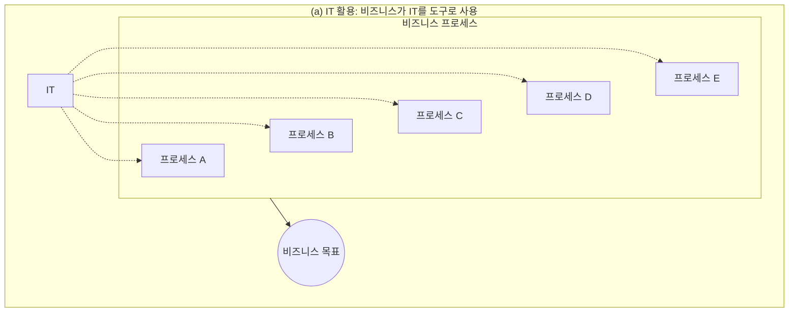

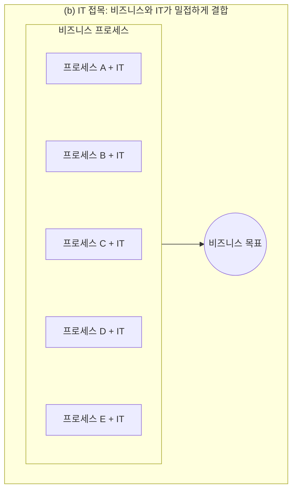

---

<!-- PDF page: 020 -->

#### 나) 비즈니스와 IT의 연계

IT 비즈니스에서 IT는 단순한 도구 또는 지원 기능이 아니라 비즈니스 전략목표 및 프로세스와의 상호의존성이 극대화된 개념으로 자리잡아가고 있다. 이러한 상호의존성의 극대화는 기업의 비즈니스 모델의 경쟁력을 강화할 뿐 아니라 새로운 비즈니스 가치의 창출에도 큰 역할을 담당한다. [그림 3]은 기업 비즈니스와 IT 시스템 간의 상호의존성을 나타낸다.

[그림 3] 기업 비즈니스와 IT 시스템 간의 상호의존성

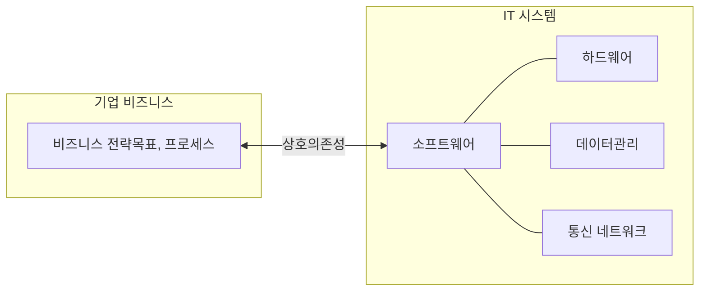

IT 비즈니스에서 비즈니스와 IT의 연계(alignment)는 IT 응용프로그램, IT 인프라, 그리고 IT 조직이 비즈니스 전략과 비즈니스 프로세스를 지원 및 구현하는 수준으로 정의된다.

비즈니스와 IT의 전략적 연계 모델은 [그림 4]와 같이 비즈니스와 IT의 연계성을 이차원 도표로 나타낸다. 여기서 전략적 적합성 차원은 비즈니스 환경에 대한 외부 초점 및 관리 구조에 대한 내부 초점으로 구분되며, 기능적 통합성 차원은 비즈니스와 IT를 구분한다.

[그림 4] 비즈니스와 IT의 전략적 연계

| 전략적 적합성 / 기능적 통합성 | 비즈니스 | IT |
| --- | --- | --- |
| 외부 | 비즈니스 전략 | IT 전략 |
| 내부 | 조직 인프라 및 프로세스 | IT 인프라 및 프로세스 |

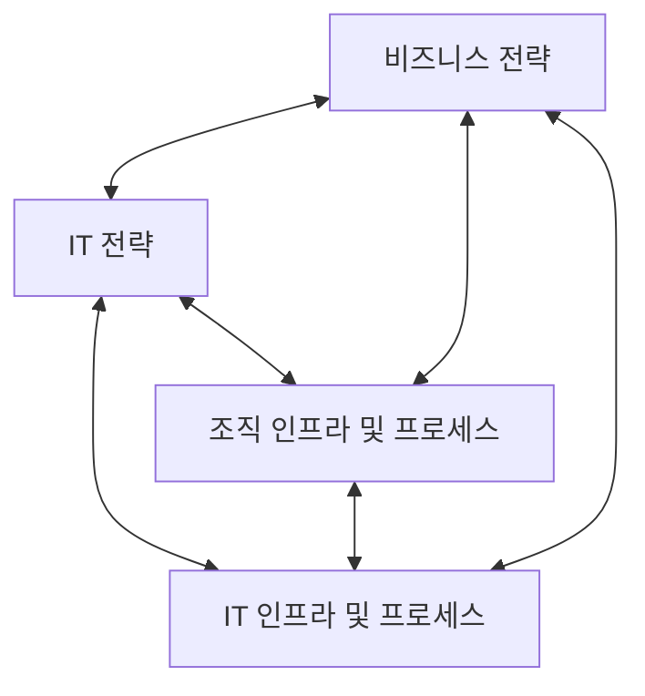

이 모델은 전략적 연계를 달성하기 위해 비즈니스 전략, IT 전략, 조직 인프라 및 프로세스, IT 인프라 및 프로세스 등 서로 조화된 4개의 영역을 정의하며, 이들 영역은 각각 고유의 범위, 능력, 거버넌스, 인프라, 프로세스, 기술 등의 구성요소를 갖는다.

---

<!-- PDF page: 021 -->

### 02 IT 비즈니스 생태계

#### 가) IT 비즈니스와 하이프 사이클

최근 IT 비즈니스의 혁신을 가져온 IT 기술환경의 변화를 살펴보자. IT 분야의 신기술이 갖는 산업 경제적 가치와 영향에
대한 기대수준의 변화를 시간에 따라 보여주는 것이 가트너에서 매년 발표하는 하이프 사이클(Hype Cycle)이다.
하이프 사이클에서 태동기(Innovation Trigger)는 신기술이 처음 출현하여 기대받기 시작하는 시기이다. 그 후 기대수
준이 점점 높아지다가 신기술이 갖는 실제 가치보다 크게 과장되면서 거품이 최고조에 달하는 거품기(Peak of Inflated
Expectations)에 이르게 된다. 거품제거기(Trough of Disillusionment)는 이러한 거품이 꺼지는 시기이며, 이 시기를 지나면
기대수준이 다시 완만한 증가 추세를 보이는 재조명기(Slope of Enlightenment)를 거쳐 최종적으로 안정적으로 가치를 창
출하는 안정적인 생산기(Plateau of Productivity)로 이행한다.

[그림 5] 2018년 Gartner Hype Cycle

<!-- 생략: 곡선 위 기술별 위치와 표식으로 구성된 Gartner Hype Cycle 도표 -->

하이프 사이클은 최근 이슈가 되고 있는 기술뿐만 아니라 기술이 가진 속성으로 인하여 미래에 어떠한 세상이 펼쳐질 수
있는지를 알 수 있게 해준다. 하이프 사이클에서 제시하는 기술의 흐름을 이해하고 이를 IT 비즈니스에 접목할 수 있다면
기업의 성장에 많은 도움이 될 것이다.

---

<!-- PDF page: 022 -->

#### 나) IT 생태계

IT 기술은 다양한 기술들이 서로 경쟁과 상생 작용을 주고받는 하나의 거대한 생태계를 만들며 발전하고 있다. [그림 6]은
이러한 IT 생태계를 나타낸 것이다.
1980년대 개인용 컴퓨터와 통신 네트워크 기반의 정보혁명을 거쳐 2000년대 이후 모바일 기기와 스마트폰 기반의 무선
인터넷, 전화, 컴퓨팅 등이 융합된 스마트 혁명이 진행되고 있다. 스마트 혁명은 IT 산업의 융 • 복합화를 가속시켰을 뿐만
아니라 타 산업에도 영향을 미치게 되어 전반적인 산업의 스마트화를 촉진하였다.
이로 인해 IT 기술은 교육, 자동차, 국방, 건설, 해양조선, 의료 등 다양한 분야에서 응용되고 있으며, 센서 및 네트워크
기술의 발전에 따른 사물통신(M2M, Machine to Machine)은 사물인터넷(IoT, Internet of Things)을 거쳐 만물인터넷(IoE,
Internet of Everything)으로 확대되고 있다. IT 기술에 의하여 인간-인간, 인간-사물, 사물-사물이 연결되면서 인간, 사물,
공간, 데이터, 서비스가 모두 함께 연결되는 초연결사회로 발전하고 있다.
[그림 6] IT 산업의 CPNDS 생태계와 ICBM 핵심기술

| IT 생태계(C-P-N-D-S) | 구성 |
| --- | --- |
| 콘텐츠(C) | 게임, 음원, 영상, E-book |
| 플랫폼(P) | Apple, Google, Facebook, E-book |
| 네트워크(N) | SK텔레콤, KT, LG |
| 디바이스(D) | 스마트폰, 태블릿, PC, 매킨토시 |
| 보안(S) | DDos대응, 공격탐지, PIMS, ISMS |

핵심기술(ICBM): IoT, Cloud, Big Data, Mobile

<!-- 원본의 핵심기술 묶음에서 IT 생태계 각 요소로 향하는 화살표는 표에서 생략 -->

초연결사회는 콘텐츠(Contents), 플랫폼(Platform), 네트워크(Network), 디바이스(Device), 보안(Security) 등으로 구성되는 IT
생태계에 큰 영향을 미치고 있다. IT 생태계의 중심이 하드웨어인 디바이스로부터 플랫폼과 콘텐츠로 이동하면서 소프트웨어가 더욱 중요해지고 있으며, 전통 주력산업 및 금융 • 의료 등에서 스마트 모바일 기반 IT 융합이 확산된다.
3D프린팅, 무인운행차량 등 기존 시장을 무너뜨리는 파괴적 혁신이 IT 생태계를 주도하며, 개방형 혁신을 통한 경쟁력 확
보와 수요 맞춤형 비즈니스 모델이 확산된다. 이와 같은 초연결사회를 실현하는 핵심기술은 사물인터넷(IoT), 클라우드 컴
퓨팅(Cloud Computing), 빅데이터(Big Data), 모바일(Mobile)로 구성되는 ICBM 기술이다.
[표 1]은 IT 패러다임의 변화 관점에서 IT 기술환경 및 IT 경쟁방식의 변화를 HW에서 SW 플랫폼, IT 융합에서 스마트융합,
ICBM 기반 초연결사회, IT 기술환경의 급격한 변화, IT 비즈니스 경쟁의 변화 등 다섯 가지로 정리한 것이다.
〈표 1〉 IT 패러다임의 변화

| 구분 | 주요내용 |
| --- | --- |
| HW에서 SW 플랫폼으로 | • IT 생태계가 디바이스(HW)에서 플랫폼·콘텐츠(SW)로 이동<br>• SW와 플랫폼이 부가가치 창출의 핵심-국가산업의 핵심 성장 동력 |
| IT 융합에서 스마트융합으로 | • 전통 주력산업 및 금융·의료 등에서 스마트 모바일 기반 IT 융합 확산<br>• 핀테크가 IT 융합의 새로운 블루오션으로 부상 |

---

<!-- PDF page: 023 -->

| 구분 | 주요내용 |
| --- | --- |
| ICBM 기반 초연결사회로 | • ICBM 기반 초연결사회 진전과 경제성장 기회 부상<br>-사물인터넷(I), 클라우드(C), 빅데이터(B), 모바일(M) |
| IT 기술환경의 급격한 변화 | • 현실세계와 가상세계를 결합한 가상현실의 실감환경 기술<br>• 3D프린팅, 무인운행차량 등 기존 시장을 무너뜨리는 파괴적 혁신 |
| IT 비즈니스 경쟁의 변화 | • 창의적 IT 중소·벤처기업이 성장 주도<br>• 개방형 혁신을 통한 경쟁력 확보와 수요 맞춤형 비즈니스 모델 확산 |

#### 다) IT 비즈니스 생태계 구성요소

IT 생태계를 구성하는 콘텐츠, 플랫폼, 네트워크, 디바이스, 보안의 5가지 요소에 대한 특징을 살펴보면 다음과 같다.

〈표 2〉 IT 비즈니스 생태계 구성요소

| 구성요소 | 주요특징 |
| --- | --- |
| 콘텐츠(C) | 모바일 기술의 발전은 모바일 콘텐츠의 이용 확대를 야기 함<br>• 스마트폰 중심의 컴퓨팅 능력을 갖춘 모바일 환경은 이용자가 시간 및 공간에 제한되지 않고 다양한 콘텐츠를 사용하도록 환경을 제공<br>• 이용자들은 음악 및 영상뿐만 아니라 전자책, 기타 자료 등을 모바일 환경에서 쉽게 이용할 수 있고, 모바일 이용자를 주 고객으로 한 새로운 방식의 콘텐츠 유통 생태계가 부각됨 |
| 플랫폼(P) | IT 서비스 플랫폼은 단일 사업자의 개별 서비스로부터 다수 사업자가 함께 참여하는 공통 플랫폼으로 발전하고 있음<br>• 폐쇄형에서 개방형으로 변화<br>• 서비스 플랫폼 자체구축 및 자체제공에서, 소수의 공통 플랫폼을 통해 다수 사업자가 서비스를 제공하는 추세로 변화<br>• 애플과 구글, 카카오 등은 자사의 서비스 프레임워크에 다수 사업자들이 참여하는 플랫폼 개념으로 발전 |
| 네트워크(N) | 스마트폰과 함께 태블릿PC, 스마트TV 등에 의해 시작된 스마트 혁명이 네트워크 트래픽을 질적 및 양적으로 팽창시키고 있음<br>• 스마트 홈과 스마트 카 등 차세대 스마트 서비스는 다양한 유형의 대용량 트래픽 유발<br>• 초연결사회에서 이용되는 다양한 사물인터넷 기기 및 센서들도 방대한 양의 데이터 트래픽을 생성하고 있음 |
| 디바이스(D) | 웨어러블 기기가 시장에 출시되면서 디바이스 업체 간 경쟁의 심화와 함께 협력도 강화되는 추세<br>• 삼성전자의 갤럭시 기어와 같은 시계형 제품과 구글 글래스와 같은 형태의 고글형 제품이 상업적으로 활성화<br>• 스마트폰이나 태블릿PC 등의 스마트기기와 연동 강화 추세 |
| 보안(S) | IT 사이버 위협의 고도화 및 지능화로 피해범위가 확산되고 주요 국가 기반시설의 IT 활용 증대로 인한 위협이 증가<br>• 정보통신망과 컴퓨터시스템을 무력화시키는 사이버테러, 정치적·사회적 목적으로 컴퓨터시스템에 침입하여 해킹하거나 시스템을 파괴하는 핵티비즘(hacktivism) 등 지속적인 사이버 표적 공격(APT, Advanced Persistent Threat)의 위협 증가<br>• 신종 악성 해킹공격 대응은 기존 사후 탐지기반의 보안기술에서 사전예방 및 실시간 처리 위주의 보안기술 개발로 바뀌어가는 추세 |

---

<!-- PDF page: 024 -->

### 03 IT 비즈니스를 위한 IT 자원과 관리활동

#### 가) IT 자원의 개념

IT 자원은 IT 비즈니스를 영위하기 위해 활용되는 인력 및 프로세스, 소프트웨어, 하드웨어 등을 통합하여 설명하는 개념
으로 IT 지원시스템과 관리체계를 포함하고 있다.
IT 지원시스템에는 ERP(Enterprise Resource Management), SCM(Supply Chain Management), PLM(Product Lifecycle
Management) 등과 같이 IT 비즈니스를 지원하거나 관리하는 체계를 말하며, 관리체계에는 대표적으로 ITSM(Information
Technology Service Management)이 있다.
IT 자원은 IT 비즈니스와 직접적인 연관 관계를 유지하며 지속적으로 발전하고 있으며 기술과 시대의 흐름에 따라 IT 비즈니스의 성과를 극대화하는 방향으로 변화하고 있다.
IT 자원을 관리하기 위한 체계를 IT 자원 관리시스템이라고 하며 IT 비즈니스를 지원하기 위한 솔루션, 제품, 프로세스 등
을 체계적으로 관리 및 통제한다. IT 자원 관리시스템은 자원의 계획, 개발, 적용, 운영 및 관리와 폐기에 이르기까지 IT
자원 수명주기(Lifecycle)에 기반하여 활용되며 IT 자원에 대한 명세서와 IT 비즈니스 적용에 따른 성과관리 등을 체계적으
로 관리한다.

#### 나) IT 자원의 역할

IT 자원을 IT 비즈니스에 활용하면 다양한 효과를 도출할 수 있으나 3가지 관점으로 효과를 요약할 수 있다.
[그림 7] IT 자원의 역할


##### ① 생산효율성 증대

많은 기업들이 IT 자원을 활용하여 생산효율성을 극대화하고 있다. 예를 들어 국내 대부분의 대형 마트들은 실시간으로 고객의 구매 상황을 모니터링하고 이를 통해 그들의 재고관리를 실시간으로 진행하고 있으며, 이는 실시간으로 고객의 구매
패턴을 분석하는 프로세스로 연결된다. 이러한 생산효율성 추구는 기업의 매출을 극대화하며, 경쟁우위 확보에 매우 큰 역
할을 담당하고 있다.
대표적으로 월마트의 경우, 상품공급자들이 월마트 데이터 웨어하우스에 직접 접근할 수 있도록 한 리테일링크(RetailLink)
시스템을 활용하여 매장의 단위 면적당 28달러 이상의 매출액을 올리고 있다. 비슷한 시기에 타 소매업체들의 단위 면적
당 12달러의 매출액과 비교해 보면 2배 이상의 효과를 얻고 있다.

##### ② 새로운 비즈니스 가치 창출

21세기 들어 IT 자원을 통한 새로운 비즈니스 가치가 창출된 사례가 증가하고 있다. 애플은 아이튠즈 뮤직스토어를 만들어
오프라인 음반 유통 구조를 완전히 변화시켰다. 새로운 온라인 음원 유통 구조는 새로운 비즈니스 가치를 창출하였고 이
것은 오늘날 애플 기업의 성장을 이끈 가장 큰 요인 중의 하나로 평가 받고 있다.

---

<!-- PDF page: 025 -->

또한, 전자상거래도 새로운 비즈니스 가치 창출의 대표적인 사례이다. IT를 통한 가상의 온라인 시장은 지금까지 존재해 온
전통적인 상거래의 개념을 변화시켜 오픈마켓 및 소셜커머스 등 다양한 상거래 비즈니스 가치를 창출시켜 나가고 있다.

##### ③ 글로벌 비즈니스 확산

오늘날 많은 기업들은 그들의 생존과 번영을 위해서 새로운 시장의 개척과 글로벌 비즈니스를 추구하고 있다. IT 자원을
활용한 글로벌 협업 환경은 그동안 로컬 비즈니스에 머물렀던 기업들에게 새로운 시장을 제시해 주고, 기존의 글로벌 비즈니스를 추구하기 위해 필요했던 비용과 인력 그리고 시간에 대한 전통적 관점을 변화시켰다.
예를 들어 화상회의 시스템 구축은 급변하는 비즈니스 환경에서의 의사결정 신속성과 효율성을 확보해 주었고, 인트라넷
시스템을 통한 시간과 공간의 제약이 없는 정보 교류는 글로벌 비즈니스에서 큰 경쟁우위를 가져다 주었다.

#### 다) IT 비즈니스를 위한 관리활동 및 구조

IT 비즈니스의 순환적 관리활동은 계획(Plan), 실행(Do), 점검(Check), 시정조치(Action)로 이루어진 전통적인 PDCA 관리
사이클을 따른다. 계획(P) 단계에서는 기회 및 문제 식별, IT 비즈니스의 목표/범위의 설정, 비즈니스와 IT 간 연계 아래 IT
비즈니스 계획을 수립한다.
실행(D) 단계에서는 IT 비즈니스를 설계 및 구현하고 실행 데이터를 수집한다.
점검(C) 단계에서는 IT 비즈니스 실행결과 분석, 비즈니스와 IT의 성과지표 모니터링 및 연계성 검증 등을 수행한다.
시정조치(A) 단계에서는 필요한 개선사항 식별, IT 비즈니스를 지원하기 위한 IT의 조정/변경 등을 거쳐 다시 계획(P) 단계
로 진입함으로써 순환 과정을 반복하게 된다.
[그림 8] IT 비즈니스의 순환적 관리

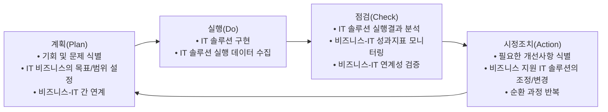

IT 비즈니스의 순환적 관리구조는 [그림 8]과 같다. IT 비즈니스에서 비즈니스(프로세스)가 성과를 올리도록 IT 서비스와 IT
인프라는 운영을 지원한다. IT 비즈니스 관리에서는 IT 부문의 운영지원 서비스 품질과 조직의 비즈니스 성과로부터 새로
운 IT-비즈니스 성과지표를 도출하여 IT 부문으로 전달하며, 이러한 목표달성을 지원하기 위한 결정 지원, 조정, 투자 등
을 제공한다.

---

<!-- PDF page: 026 -->

[그림 9] IT 비즈니스의 관리 및 통제 구조

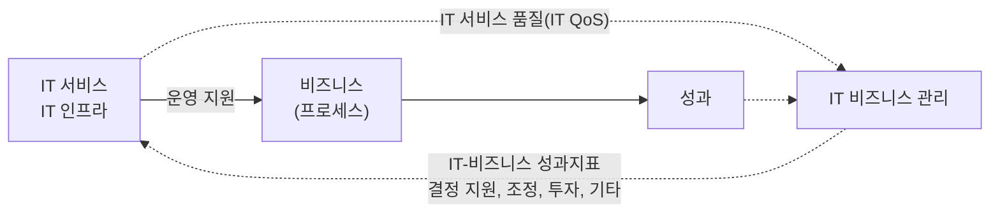

### 04 IT 비즈니스 가치사슬

#### 가) 가치사슬 개요

가치사슬 모델은 기업 조직의 궁극적인 방향성을 가치(Value)라는 개념으로 설정하고 이를 위한 기업 조직의 구조를 체
계적으로 제안한 것으로서, 가치사슬 모델은 오늘날까지 기업의 비즈니스 활동을 분석하는 데 매우 중요한 경영이론으로
인식되고 있다. 또한 가치사슬 모델은 각 기업의 경쟁우위를 활동 관점에서 분석하고 이해하는 데 매우 중요한 프레임워크를 제공할 뿐 만 아니라, 이 모델에서 제안하고 있는 주요활동과 지원활동 개념은 기업 조직구조의 중요한 참고기준이
되고 있다.
비즈니스 가치사슬에는 전통적 제조기업과 전자상거래 기업에 대한 두 가지 개념으로 접근할 수 있다. 전통적 제조기업
의 영리 및 비영리적 관점에서 궁극적인 목적을 달성하기 위해 기업의 주요활동인 입고물류, 운영(생산), 출고물류, 마케팅 및 판매, 서비스 등과 지원 활동인 기업인프라, 인사 관리, 기술 개발, 구매 활동 등이 어떻게 구성되고 전개되어야 하
는지 설명하고 있다. 전자상거래 기업의 가치사슬에는 비즈니스 프로세스를 전자적으로 해결함으로써 비즈니스의 효율
성과 효과성을 높이고 있다. 주요활동은 전자조달, 무재고 생산, 제3자 물류, 네트워크 판매, 온라인 서비스 등이며, 지원활동은 통합 정보플랫폼 및 네트워크 인프라 구축, 인터넷 고용, 온라인 협력업체 관리 등이다.

[그림 10] 비즈니스 가치사슬

| 구분 | 지원활동 | 주요활동 | 결과 |
| --- | --- | --- | --- |
| (a) 전통적 제조기업 | 기업 인프라<br>기술 개발<br>인사 관리<br>구매 활동 | 입고 물류 → 운영(생산) → 출고 물류 → 마케팅 & 판매 → 서비스 | 부가가치 |
| (b) 전자상거래 기업 | 통합 정보 플랫폼 및 네트워크 인프라 구축<br>인터넷 고용, 훈련 등<br>온라인 협력업체 관리 | 전자 조달 → 무재고 생산 → 제3자 물류 → 네트워크 판매 → 온라인 서비스 | 부가가치 |

---

<!-- PDF page: 027 -->

2000년대 중반 이전까지 기업에서는 주요활동과는 별도로 IT와 관련된 활동이나 부서는 지원활동을 하는 백오피스 관점
에서 인식하였다. 그러나 본격적으로 IT 전문기업이 출현하고 기존의 기업들이 IT의 접목을 급속화했던 2000년대 이후부
터 가치사슬 모델에서의 IT 및 IT 관련 부서의 역할 모델에 대한 인식에도 변화가 오기 시작했다. 특히 2010년 이후 IT 비즈니스 관점에서의 가치사슬 모델에 대한 인식의 변화는 급속화되었으며, 이러한 변화는 크게 두 가지 관점에서 거론되
고 있다.

#### 나) 가치사슬 모델과 IT의 전사적 접목

가치사슬 모델의 요소인 주요활동과 지원활동 전반에 IT가 전사적으로 적용된다. 이는 IT가 기존의 백오피스(back office)
관점의 역할에 그치는 것이 아니라 주요활동 전반에 걸쳐 IT가 핵심요인으로 접목 및 활용되고 있는 것을 의미한다.
대표적인 사례로 대형마트의 경우 IT 없이 가치사슬 모델에서 주요활동으로 구분한 5개의 활동들이 정상적으로 혹은 경쟁력 있게 전개될 것이라 생각할 수 없을 것이다. 실시간으로 재고와 제품 정보를 확인하고 고객의 성향과 지역 특성을
반영한 분석 결과로 제품을 진열하며, 고객의 구매 이력을 실시간으로 수집하는 환경의 대형마트 담당자들은 이 질문에
대하여 단호하게 아니라고 대답할 것이다. 즉 가치사슬 모델에서 규정한 모든 주요활동들이 IT를 기반으로 실행되는 상황
에서 위의 질문은 현재 기업들의 가치사슬 모델과 IT 융합에 대한 새로운 인식을 시사하고 있다. 대형마트 사례 외에도 오
늘날 굴뚝산업으로 불리는 타 산업들의 여러 유사 사례들도 동일한 상황이라고 말할 수 있다.

#### 다) 가치사슬 모델과 IT 전문기업

기업의 비즈니스 모델이 e-비즈니스 혹은 인터넷 비즈니스인 경우 IT와 분리하여 주요활동과 지원활동으로 설명하기 힘
들다. 예를 들어 아마존닷컴은 주요활동과 지원활동 모두 IT 기반으로 전개되고 있는 대표적인 사례이다. 우리나라의 인
터파크가 비슷한 사례로 꼽힌다. 즉 IT 기반으로 시작한 기업들은 가치사슬 모델에서 말하는 주요활동과 지원활동을 분
리하여 인식할 수 없다는 것이다. 이와 같은 경우 전통적으로 인식해 온 가치사슬 모델에 대한 새로운 인식의 접근이 필요하다.

#### 라) 가치사슬 모델의 확대

위에서 설명한 두 가지 관점은 IT 비즈니스를 설명할 때 언급한 두 가지 관점과 연결되어 있다고 볼 수 있다. IT 비즈니스
를 이해할 때, IT가 비즈니스 프로세스에 전사적으로 접목되고 있는 현상과 IT를 주요 비즈니스로 활용하는 현상 두 관점
으로 바라볼 수 있는 것처럼 가치사슬 모델도 위의 두 가지 관점에서 해석될 수 있다. 따라서 오늘날 대부분의 기업이 IT
비즈니스를 추진하고, 이를 통해 경쟁우위 확보를 해 나가고 있는 상황에서 전통적인 가치사슬 모델에 대한 이해도 IT 비즈니스 관점에서 확장할 필요성이 있다.
이러한 인식의 확장은 또 다른 관점에서 학계와 산업현장에서 다양한 이슈를 생산하고 있다. 그동안 당연하게 인식되어
온 업무 프로세스들이 IT의 전사적 접목으로 인해 기업의 구조적인 변화를 동인하고 있는 것이다. 예를 들어 인트라넷 정보시스템을 통해 의사결정과정에서 불필요한 프로세스의 제거나, 그동안 일부 계층에 집중되었던 양질의 정보가 구성원
전반에 공급되면서 기업의 구조가 수평적 구조로 변화되어 나가는 사례 등이 대표적이다. 즉 IT가 단순히 가치사슬 모델
의 활동들에 접목되는 수준이 아닌 전반적인 기업 조직의 구조화 및 경쟁우위에 영향을 미치는 가치사슬 모델 개념으로
인식의 변화가 확산되고 있다.

---

<!-- PDF page: 028 -->

**[참고 및 추천 자료]**

[1] 윤종록, “2016년 이러닝 산업 실태 조사 보고서”, 지식경제부, 정보통신산업진흥원, 2017.

[2] 김정동, 손지성, 백두권, “소셜커머스의 성장과 상품 추천 기술”, 한국멀티미디어학회, 한국멀티미디어학회지, 제17권, 제1호, 2013. 3.

[3] 이승주, “경영전략 실천 매뉴얼”, 서울: 시그마컨설팅그룹, 2006.

[4] Anderson, M., Brusa, J., Price, J., and Sims, “Turning ”Like” to ”buy”: Social Media Emerges as a Commerce channel”, NY: Booz & Company Inc., 2011.

[5] Cassidy, A., A Practical Guide to Information Systems Strategic Planning, 2nd Edition, Auerbach Publications, 2006.

[6] Dahlberg, T., and Lahdelma, P., “IT governance maturity and IT outsourcing degree: an exploratory study.” System Sciences, 2007. HICSS 2007. 40th Annual Hawaii International Conference on. IEEE, 2007.

[7] Gates, L.P., Strategic Planning with Critical Success Factors and Future Scenarios: An Integrated Strategic Planning Framework, Technical Report CMU/SEI-2010-TR-037, CMU/SEI, November 2010.

[8] Laudon, K.C., and Laudon, J.P., “Management Information Systems”, 12th Edition, NJ: Pearson Education, 2011.

[9] Silvius, A.J.G, “Business & IT Alignment in theory and practice.” Proceedings of the 40th Hawaii International Conference on System Sciences, IEEE, 2007.

[10] Ward, J., and Peppard, J., Strategic Planning for Information Systems, 3rd Edition, John Wiley & Sons, 2002.

[11] Gatner's Hype Cycle 2018, https://www.gartner.com/smarterwithgartner/5-trends-emerge-in-gartner-hype-cycle-for-emerging-technologies-2018/

---

<!-- PDF page: 029 -->

## II. IT 비즈니스 전략

### 최근 동향 및 주요 이슈

기업의 IT 비즈니스 전략은 주어진 내부 및 외부 환경의 제약조건 아래에서 기업의 사명과 목적을 달성하기 위하여 가장 효과적인 방법을 찾는 과정이다. 특히 최근 비즈니스 프로세스에 IT가 접목된 IT 비즈니스에 있어서
올바른 전략을 수립하는 것은 매우 중요하다. 또한 IT 비즈니스의 영역이 확장되어 핵심적인 비즈니스 프로세스
가 IT와 접목하게 되면서 IT 비즈니스 전략수립과 전략수립을 위한 환경분석 방법에 대한 관심이 높아지고 있다.
이 절에서는 IT 비즈니스를 위한 전략수립의 필수요소인 현재모델과 미래모델, 그리고 추진전략 등을 단계적으로 소개한다. 아울러 SWOT분석을 비롯한 다양한 IT 비즈니스 환경분석 방법을 소개한다.

### 학습 목표

1. IT 비즈니스 전략을 설명할 수 있다.
2. IT 비즈니스 전략수립을 위한 비즈니스 환경분석 모델을 설명할 수 있다.

### 핵심 키워드

IT 비즈니스 전략수립, IT 비즈니스 환경분석

---

<!-- PDF page: 030 -->

### 실무 미리보기

1990년대 중반, 미국의 Dell 컴퓨터는 자사가 컴퓨터산업의 가치사슬 위에서 매우 강력한 경쟁력을 갖게 해 줄
비즈니스 전략을 수립하기 위해 SWOT 분석을 수행했다. Dell 컴퓨터는 고객에게 직접 판매하는 것과 제조 비
용을 절감하기 위한 컴퓨터 및 관련 부품의 설계에 강점을 갖고 있다는 것을 알았다. 또한 지역 컴퓨터 대리점
들과 관계가 없다는 약점을 인정했다. Dell 컴퓨터는 당시 훨씬 더 강력한 브랜드 인지도와 품질에 대한 뛰어난
명성을 갖고 있는 Compaq과 IBM 등 경쟁사들로부터 위협에 직면하고 있었다. Dell 컴퓨터는 고객이 컴퓨터에
대한 지식이 풍부해지고 Dell 컴퓨터의 영업사원에게 컴퓨터의 사양에 대해 질문하지 않아도 자신이 원하는 것
을 정확하게 지정할 수 있다는 점을 주목하고 기회를 발견했다. 또한 인터넷을 잠재적인 마케팅 도구로 보았다.
Dell 컴퓨터의 SWOT 분석 결과는 다음과 같다.
| 구분 | 분석 결과 |
| --- | --- |
| 강점(S) | • 소비자에게 직접 판매한다.<br>• 경쟁사보다 낮은 가격을 유지한다. |
| 약점(W) | • 지역 컴퓨터 대리점들과 협력 관계가 없다 |
| 기회(O) | • 소비자의 원스톱(One-Stop) 쇼핑 욕구<br>• 소비자는 자신이 구매하려는 것을 잘 알고 있다.<br>• 인터넷은 강력한 마케팅 도구가 될 수 있다. |
| 위협(T) | • 경쟁사는 Dell 컴퓨터보다 강력한 브랜드를 갖고 있다<br>• 경쟁사는 지역 컴퓨터 대리점들과 강력한 관계를 갖고 있다 |

SWOT 분석이 끝난 후, Dell 컴퓨터가 취한 IT 비즈니스 전략은 모든 SWOT 구성요소를 반영한 것이었다.
Dell 컴퓨터는 전화로 고객 맞춤형 컴퓨터를 주문 받아 조립하여 판매하였으며, 이러한 주문 접수 및 판매
작업은 최종적으로는 인터넷에서 이루어지게 되었다. Dell 컴퓨터는 자신의 강점을 극대화하는 한편, 자신
의 약점인 취약한 지역 컴퓨터 대리점 네트워크에 의존하지 않도록 전략을 수립하였다. Compaq과 IBM에
의해 발생하였던 브랜드와 품질에서의 위협은 모든 컴퓨터들이 각각 해당 구매자를 위해 고객 맞춤식으
로 주문 조립되는 높은 품질을 제공하는 Dell 컴퓨터의 능력에 의해 완화되었다.

---

<!-- PDF page: 031 -->

### 01 학습내용 요약

IT 비즈니스 전략단계는 IT 비즈니스 전략수립, IT 비즈니스 환경분석 두 부분으로 이루어진다. IT 비즈니스 전략수립에서는 먼
저 일반적인 전략수립의 개념과 구성요소, 전략수립 프로세스를 설명한다.
IT 비즈니스 환경분석에서는 외부 환경분석과 내부 환경분석 그리고 외부와 내부 환경분석을 함께 분석하는 통합 환경분석
순으로 설명한다.
외부 환경분석에는 거시적 외부환경을 정치 • 경제 • 사회 • 기술적인 측면에서 분석하는 PEST기법과 미시적 외부환경을 공
급자 및 구매자의 협상력과 경쟁강도 등 5가지 요소로 IT 비즈니스의 경쟁우위를 분석하는 5-Forces 산업구조분석법을 설명한다. 또한 마케팅 및 경쟁 시장분석에 사용되는 4P와 3C 기법을 함께 설명한다.
내부 환경분석에서는 조직의 핵심 역량을 공유가치, 전략, 시스템 등 영문자 S로 시작하는 7가지 요소로 나누어 분석하는 맥
킨지 7S 기법을 중심으로 설명하고, 통합 환경분석은 외부 시장 환경과 내부적 요인을 동시에 분석하는 SWOT 분석기법과 IT
비즈니스의 성장성과 시장 점유율을 기반으로 추진 전략을 선택하는 BCG 매트릭스를 함께 설명하였다.

### 02 IT 비즈니스 전략수립

IT 비즈니스의 환경은 항상 변화하고 있으므로 IT 비즈니스의 목표를 달성하기 위해서는 지속적으로 IT 비즈니스 전략 목표를
관리해야 한다. 아울러, IT 비즈니스 전략의 목적은 조직과 비즈니스를 환경에 맞추어 최적화함으로써 조직의 생존과 비즈니스의 달성 확률이 증가하도록 하는 것이다.

#### 가) 전략수립의 개념

전략수립은 조직의 사명(Mission)을 달성하기 위한 전략을 정의하는 과정이다. 기업 전략은 현재 상태의 설명과 분석을
포함하며, 변화에 대한 방향을 제시한다. 전략수립은 단위 수준의 조직 전략과 직접 연계되어야 한다. 전략수립의 산출물
은 최상위 수준의 전략과 여기에 영향을 미치는 조직의 환경이나 의도를 명시한 전략계획 문서이다. 전략계획은 세부 작
업을 수행하기 위한 중요한 근거일 뿐만 아니라 엔터프라이즈 아키텍처(EA, Enterprise Architecture), 프로세스 개선, 위험
관리, 포트폴리오 관리 등 전사적 활동에 대한 기본 방향을 제공한다.
기업 상태와 추진 전략을 달성하기 위한 하위 목표와 절차는 기업의 계층 수준에 맞추어 설정될 수 있다. 예를 들면, 기업
전략을 이용하여 관리자가 중간 전략과 중간 목표를 설정하면, 생산직 직원은 중간 전략을 이용하여 자신의 하위 목표를
설정할 수 있다.

#### 나) 전략수립의 구성요소

전략을 수립하기 위한 다양한 접근 방식이 존재한다. 전형적인 전략수립 단계는 기업의 현재 상태를 분석하고, 미래 목표
를 제시하며, 목표 모델에 도달하기 위한 추진전략을 수립한다. 전략수립의 주요 구성요소는 다음과 같다.

---

<!-- PDF page: 032 -->

〈표 3〉 전략수립의 구성요소

| 구성요소 | 설명 |
| --- | --- |
| 기본정보 | 기업의 사명과 목적/목표, 그리고 정량적 성과 등 |
| 현재상태 모델 | 현재 기업의 내부/외부 환경, 비즈니스 원칙과 가치를 사명 관점에서 설명 |
| 미래목표 모델 | 미래 기업이 성취하고자 하는 비전과 목표 |
| 추진 전략 | 기업의 목적, 목표, 사명을 달성하기 위한 경로 |

일반적인 전략수립에서는 기업 모델로서 현재 상태(As-Is) 모델의 분석과 미래 목표(To-Be) 모델의 수립이 제시되며, 이러한 기업 모델 사이의 전환 및 이행을 구현하기 위한 추진전략이 제공된다. 전략수립 구성요소 간의 관계를 나타내면 다
음 그림과 같다.

[그림 11] 전략수립 구성요소 간의 관계

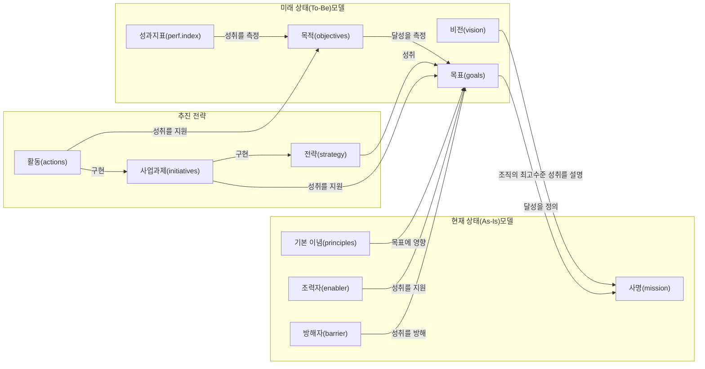

##### 사명(Mission)

기업의 사명은 기업의 목적 또는 주요 사업이다. 사명은 기업이 자신의 이익을 위하여 무엇을 하는지 설명하며, 시간적으로 제한되지 않은 목표이다.

##### 비전(Vision)

기업이 추구하는 이상적인 미래 모습이다. 비전은 사명의 성공적인 수행으로 얻어진다. 기업의 비전은 영감의 원천이며,
기업의 능력을 확장시킨다.

##### 목표(Goals)

사명의 달성을 지원하는 측정 가능한 높은 수준의 목표이다.

---

<!-- PDF page: 033 -->

##### 목적(Objectives)

목표 달성을 나타내는 특정되고 정량화된 낮은 수준의 목표이다.

##### 기본 이념(Principles)

기업이 목표 달성 방법의 선택에 고려할 제약사항을 명시한다. 기본 이념은 기업의 핵심 가치를 나타내며 기업의 전략을
형성하는 데 사용된다.

##### 조력자(Enablers)

목표와 목적을 달성하려는 기업의 능력을 촉진하는 외부 환경과 기업의 강점이다.

##### 방해자(Barriers)

목표와 목적을 달성하려는 기업의 능력을 방해하는 외부 환경과 기업의 약점이다.

##### 전략(Strategy)

기업이 사명, 목표, 목적을 달성하기 위한 접근방법이다. 전략은 기업의 비전을 지원하며, 조력자, 방해자, 기본 이념에 의
해 영향 받는다.

##### 전략계획(Strategic Plan)

전략계획 수립 활동으로 얻어지는 문서이다. 전략계획은 기업 전략과 기업 전략에 영향을 미치는 요소를 설명한다.

##### 사업과제(Initiatives)

전략을 실행하는 특정한 활동의 집합이다.

##### 활동(Actions)

목표와 목적을 달성하기 위한 구체적인 절차이다. 일반적으로 활동은 담당자를 배정하고 일정상 제약이 존재한다.

##### 성과지표(Performance Index)

각 목표에 대한 성과 목표치를 설명한다.

#### 다) 전략수립 프로세스

전략수립 프로세스는 전략적 분석, 전략적 선택, 전략적 구현 및 관리, 피드백 등으로 이루어진다. 먼저 전략적 분석에서
기업의 기본 정보를 조사하며 현재 상태(As-Is) 모델을 분석하고, 전략적 선택에서 미래 목표(To-Be) 모델과 목표 모델에
도달하기 위한 추진전략을 수립한다. 전략적 구현 및 관리에서 전략을 구현하고 운영하며 필요한 경우 전략 계획의 적절
한 변경을 실시한다.

[그림 12] 전략수립 프로세스

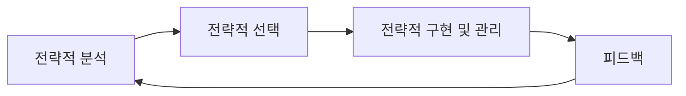

---

<!-- PDF page: 034 -->

##### ① 전략적 분석

전략적 분석의 목적은 기업의 비즈니스 의사결정을 위한 정보를 수집하는 것이다. 내부 환경은 기업이 통제할 수 있으므
로 개선이 가능하지만, 외부 환경은 기업이 일반적으로 통제하기 어려우므로 적응 전략이 필요하다.

###### 외부 환경분석

기업을 둘러싼 주변 환경과 외부 여건에 대한 분석이다.
- (거시적 환경) 정치, 경제, 사회, 기술 등에 의해 설정되는 환경으로서 영향을 미치는 범위가 여러 산업 전반에 걸쳐 확
대될 수 있다.
- (미시적 환경) 기업이 속한 산업 환경으로서 자원 획득 및 제품 판매 등에서 경쟁이 발생하므로 일반적인 경쟁환경이
라고 부른다.

###### 내부 환경분석

기업의 내부 요소와 내부 프로세스, 자원, 조직 등을 대상으로 분석하며 기업 내부 변화요소에 집중한다.

###### 통합 환경분석

- 기업의 외부 환경요인과 내부 환경요인을 종합적으로 분석하여 내/외부가 연계된 통합적 분석 결과를 도출한다.
- 기업 내부 환경의 장점(S, Strong)과 단점(W, Weakness), 그리고 기업 외부 환경의 기회(O, Opportunity)와 위협(T,
Threat)에 대한 분석을 종합한 것이 SWOT 분석이다.

##### ② 전략적 선택

전략적 선택은 전략적 분석에서 수집한 정보로부터 미래의 기업을 위한 가장 적절한 행동 방향을 선택하는 것이다. 만일
전략적 분석 단계에서 얻어진 정보에 누락 또는 결함이 존재한다면 기업의 전략적 선택이 적절한지 판단할 수 없다. 따라
서 전략적 선택은 앞서 이루어진 전략적 분석 결과의 검토로부터 시작된다.
만일 이 과정이 순조롭게 이루어지면 기업이 채택 가능한 일련의 전략적 방향에 대한 선택적 대안의 목록이 얻어진다. 이
들 각 대안들은 핵심 이슈들에 대하여 각각 독특한 해결방법과 함께 서로 다른 자원 요구사항을 갖는 것이 보통이다.
각 대안들은 합리적으로 수립된 평가기준에 따라 평가가 이루어지고, 최종적으로 가장 적절한 대안이 전략적 방향으로 선
택된다.

##### ③ 전략적 구현 및 관리

전략적 구현 및 관리는 선택된 전략적 대안을 실제로 적용하고 운영하는 것이다.
이 단계에서는 전략의 실행과 함께 기업 자원 기반의 타당성, 기업 문화와 구조의 준비 상태, 전략 구현을 위한 변경 관리,
전략 구현 경로 및 개발 방법론의 결정, 기업 내 운영조직의 전략 추진 준비 상태, 기업의 내부 또는 외부의 이해 관계자에
대한 영향 등의 관리적 이슈를 발생시킨다.
한편, 전략의 진행 상황은 지속적으로 모니터링 되며, 피드백(Feedback) 경로를 통하여 구현 단계에서 분석단계로 전달된
다. 전략의 진행 상황은 기업의 내부 환경 또는 외부 환경에 영향을 미칠 수 있다.
또한 전략적 분석이 끝난 후 발생한 예상치 못한 사건에 의해 내부 환경 또는 외부 환경이 바뀔 수도 있다. 따라서 선택된
전략적 방향이 여전히 유효함을 보장하기 위해 전략적 분석의 검토가 필요하다.

---

<!-- PDF page: 035 -->

### 03 IT 비즈니스 환경분석

#### 가) 외부 환경분석

##### ① PEST 분석

거시적 외부환경분석기법으로서 PEST 분석은 정치(Political), 경제(Economic), 사회(Social) 및 기술(Technological)의 기회
요인과 위협 요인의 영향을 분석하는 도구이다. PEST 분석에서는 제품과 비즈니스 서비스가 진출하려는 목표 시장으로서
국가나 지역의 특성에 대한 브레인스토밍을 사용한다. 아래의 표는 PEST 분석 항목 사례를 나타낸 것이다.
〈표 4〉 PEST 분석과 세부 항목 사례

| 구분 | 분석 항목 |
| --- | --- |
| 정치(P) | 정부의 종류와 안정성, 사회의 고용 법제, 규제와 규제 완화 동향, 조세 정책, 무역 및 관세, 확률이 높은 정치 환경의 변화, 환경·소비자 보호법 등 |
| 경제(E) | 현재와 미래의 경제 성장, 실업과 노동 공급, 인플레이션 및 금리, 인건비, 세계화의 영향, 가처분 소득과 소득 분배 수준, 경제 환경의 변화 등 |
| 사회, 문화(S) | 인구 증가율과 나이, 교육, 인구의 건강, 사회적 유동성 및 이러한 태도, 고용 시장의 자유와 직업에 대한 태도, 인구의 고용 형태, 사회적 금기 등 |
| 기술환경(T) | 신기술의 영향, 인터넷의 영향, 통신 비용 절감 및 원격 작업, 연구 개발 활동, 기술 이전의 효과 등 |

PEST 분석은 앞에서 살펴본 4개의 요소와 함께 법적 요소(Legal)와 환경적 요소(Environmental)를 포함하여 PESTLE 또는
PESTEL로 확장하여 사용하기도 한다.

##### ② 5 Forces 분석

기업이 속한 산업 구조를 분석하는 미시적 외부 환경분석 기법인 5 Forces 분석 기법은 제품 또는 비즈니스 서비스에 관
한 기업의 경쟁우위 확보를 위한 전략을 수립할 때 사용된다. 이 모델에서는 다음과 같은 다섯 가지 관점에서 해당 산업의
구조를 분석한다.
[그림 13] 마이클 포터의 5 Force 분석

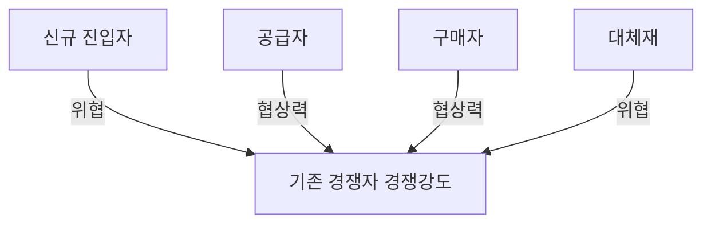

---

<!-- PDF page: 036 -->

###### 기존 경쟁자의 경쟁강도

제품 차별화를 통한 시장 선점, 시장에 투입되는 고정비용과 산업의 성장율, 설비과잉과 교체비용 등

###### 공급자의 협상력

공급자의 물량비중 및 공급자의 시장 점유율, 기술적 우위, 공급제품의 중요도 등

###### 구매자의 협상력

구매자의 가격 민감도, 구매력에 따른 구매비중, 구매자의 중요도 등

###### 신규 진입자의 위협

진입장벽, 제품 차별화, 신규 진입자의 자금력, 시장 점유율에 따른 시장 잠식도, 인지도 등

###### 대체재의 위협

소비자 욕구의 변화, 대체재의 가격 경쟁력, 대체재의 효과, 대체에 따른 영향도 등
마이클 포터가 제안한 5 Force 분석은 산업구조 분석 모델의 한 종류이다. 1979년 HBR 논문에서 5가지 요인이 산업 구조를
이룬다고 보고 5가지 요인에 대한 면밀한 분석을 통하여 위협에 대해서 능동적으로 대응할 수 있음을 말하고 있다.

##### ③ 3C 와 4P 분석법

기업이 속한 산업의 시장 분석에 사용되는 미시적 외부 환경분석기법으로서, 3C와 4P는 제품과 비즈니스 서비스의 마케팅 및 경쟁시장 환경분석에 널리 사용된다.

- 3C—고객(Customer), 자사(Company), 경쟁사(Competition)

- 4P-제품(Product), 가격(Price), 장소(Place), 촉진(Promotion)

3C는 고객분석과 자사분석, 그리고 경쟁사분석의 3개 축으로 이루어 진다. 고객분석에서는 고객 타겟, 제품 포지셔닝, 고객 수요 계층 등을 파악하여 시장규모 및 시장 성장률을 분석한다.
자사분석에서는 SWOT분석기법과 연계하여 기업 내/외부 환경과 강점 및 약점을 분석하여 기업의 목표와 전략수립에 활
용한다.
경쟁사분석은 현재의 경쟁자 및 잠재적 경쟁자를 도출하기 위하여 시장분석과 경쟁자의 재무와 포트폴리오 등을 활용하
여 분석하게 된다.
4P는 제품, 가격, 판매장소, 판매촉진의 4개 영역을 분석한다. 제품분석에서는 제품의 디자인, 상표, 특징, 브랜드파워, 성
능, 품질 등을 분석하고, 가격분석에서는 제품가격, 할인조건, 가격에 따른 수요, 타제품 가격 비교, 가격 유연성 등을 분석한다.
판매장소에서는 판매지역, 유통과 물류, 재고비중 등을 분석하며 판매촉진에서는 광고와 프로모션, 마케팅, 고객과의 커뮤니케이션 전략 등을 분석한다.

#### 나) 내부 환경분석

##### ① 7S 분석법

내부 환경분석에 사용되는 7S 모형은 컨설팅그룹인 매킨지(McKinsey)에서 만든 내부 환경분석 기법이다. 기업의 핵심 구성요소를 파악하고 이를 통하여 기업을 진단하는 접근방법으로 기업의 핵심 역량요소를 다음과 같이 영문자 S로 시작하
는 7개 항목으로 측정한다.

---

<!-- PDF page: 037 -->

[그림 14] 7S 분석법

| 원문 도식 위치 | 구성요소 |
| --- | --- |
| 중앙 | Super-ordinate Goals (Shared Values) |
| 위 | Strategy |
| 왼쪽 위 | Skills |
| 오른쪽 위 | Structure |
| 왼쪽 아래 | Style |
| 오른쪽 아래 | Systems |
| 아래 | Staff |

<!-- 생략: 그림 14의 겹치는 연결선 배치. 연결 관계를 추정하지 않고 원문 노드와 위치만 전사함. -->

###### Shared Values(공유가치)

기업 또는 조직 구성원이 공유하고 있는 이념과 미션에 대한 분석, 조직 내에서 특히 강조하고 있는 가치를 찾아내고 구성
원들에게 충분히 공유되고 있는지 확인

###### Strategy(전략)

기업의 목표와 비전에 따른 전략 분석. 전략을 수행하기 위한 예산, 조직, 인력 등의 적정성 여부 분석

###### System(시스템)

주요 의사결정과 구성원을 관리하기 위한 프로세스 또는 시스템(기법) 분석. 시스템의 범주에는 제도, 규칙 등을 모두 포함함

###### Structure(조직구조)

기업의 전략을 수행하기 위한 조직의 형태와 구성원 구조를 분석. 나아가 조직 간 역할 분담과 협업체계 등을 분석

###### Staff(구성원)

구성원의 역량, 자질, 전문성을 분석. 구성원의 장점과 약점과 구성원의 역량 발휘 환경을 포함하여 분석

###### Style(스타일)

기업의 경영 및 운용 스타일 분석. 전략 수행을 위한 리더십, 경영 스타일 등 조직문화를 분석

###### Skill(관리기술)

조직 운영 및 관리에 대한 스킬 분석. 기업 운영에 필요한 구성원의 역량과 역량을 발휘할 수 있는 조직의 핵심 역량 분석
7S는 기업의 하드웨어적인 요소와 소프트웨어적인 요소를 함께 고려하여 분석한다. 개별 요소는 상호 유기적으로 영향을 주
고 있기 때문에 한 가지 요소가 부족하게 되면 다른 요소에 직접적 또는 간접적으로 영향을 미치게 된다. 따라서, 7S를 복합
적으로 관리하여 기업의 목표를 달성할 수 있도록 하여야 한다.

---

<!-- PDF page: 038 -->

#### 다) 내부 및 외부 통합 환경분석

##### ① SWOT 분석

SWOT 분석은 일반적으로 기업의 마케팅 활동에서 전략을 수립할 때 주로 활용되어 왔다. 대학에서도 마케팅 관련 교과목
에서 SWOT 분석 사례 중심으로 많은 학습을 진행하고 있다. 하지만 오늘날 SWOT 분석은 마케팅 활동 영역을 초월해 다
양하게 활용되고 있으며, 특히 기업의 전체적인 전략수립 관점에서도 중요한 분석 프레임으로 활용되고 있다.
SWOT 분석은 해당 기업의 핵심 제품 및 서비스와 관련된 외부 시장 환경의 기회요인과 위협요인을 분석함과 동시에 내
부적으로 장점과 약점을 분석하여 매트릭스화 하는 프레임이다. 이렇게 프레임된 매트릭스를 통하여 기업의 전략적 방향성을 통찰할 수 있는 중요한 근거가 되기 때문에 오늘날 많은 기업들이 환경조사 방법론으로 활용하고 있다.

[그림 15] SWOT 분석 프레임워크

<table>
<tr><th colspan="2">전략적 방향</th><th>S(강점)<br>• 요인 1<br>• 요인 2<br>• 요인 3</th><th>W(약점)<br>• 요인 1<br>• 요인 2<br>• 요인 3</th></tr>
<tr><th>O(기회)</th><td>• 요인 1<br>• 요인 2<br>• 요인 3</td><td>SO전략</td><td>WO전략</td></tr>
<tr><th>T(위협)</th><td>• 요인 1<br>• 요인 2<br>• 요인 3</td><td>ST전략</td><td>WT전략</td></tr>
</table>

오늘날 기업 IT 비즈니스 환경에서 SWOT 분석이 새롭게 관심을 받고 있는 이유는 이 매트릭스를 통한 전략적 방향성을
수립하는데 있어 비즈니스 인텔리전스의 역할이 매우 중요해졌기 때문이다. 2000년대 진입 시기만 하더라도 SWOT 분석
은 데이터를 중심으로 한 각 영역의 분석 결과보다 추상적인 통찰력의 의견을 중심으로 매트릭스 전략을 도출하였다.
따라서 실질적인 SWOT 분석의 가치가 다소 과소평가되어 왔던 것이 사실이다. 아무래도 분석을 진행하는 주체가 개인의
통찰력 중심으로 추상적인 의견을 매트릭스로 연결하다 보니 실행 측면으로 연결되기보다는 이론적으로 거쳐가는 단계적
분석 방법론으로 인식된 측면이 많았다. 물론 데이터 기반 없이도 이렇게 분석을 진행해 볼 수 있다는 측면은 또 다른 장
점이 될 수 있지만 기업의 생존과 관련된 전략수립 및 전개 입장에서는 아무래도 비즈니스 프로세스의 실행전략과 접목되
기에는 괴리가 존재했던 것이 사실이다.
그런데 IT 비즈니스가 기업의 정착되는 과정에서 비즈니스 인텔리전스의 확산과 사례들이 SWOT 분석의 가치를 새롭게
인식시키고 있다. 즉 SWOT 분석의 매트릭스 전략수립에 가공된 질 높은 정보가 뒷받침 되면서 이전과는 다르게 객관적이
고도 미래 지향적인 SWOT 분석 결과들이 도출되기 시작한 것이다.
이러한 비즈니스 인텔리전스 기반의 SWOT 분석을 통한 전략수립은 마케팅 주요활동 영역뿐 아니라 기업의 전체적인 프로세스 관점에서도 큰 영향을 미치고 있다. 참고로 오늘날 많은 기업들의 SWOT 분석 사례를 살펴보면 매트릭스 조합이
나오기까지 이전과는 상상할 수 없는 데이터의 양이 분석 및 지원되고 있으며, 특히 계량화된 수치 데이터는 여러 가지 각
도에서 분석되어 제공되고 있다. 결국 이러한 객관화된 데이터의 지원은 양뿐만 아니라 질적으로도 품질이 보장되기 때문
에 SWOT 분석을 통한 각각의 전략수립 품질도 높아지고 있는 추세이다.

---

<!-- PDF page: 039 -->

##### ② BCG 매트릭스

BCG 매트릭스(성장성-점유율 매트릭스는 컨설팅기업인 보스톤컨설팅그룹(BCG)에서 제안된 시장 분석기법으로서 마케팅 및 판매 계획 중인 기업의 제품과 비즈니스 서비스의 포트폴리오의 평가에 사용된다. 이것은 외부 환경에 속하는 시장
성장성과 내부 환경에 속하는 시장 점유율이라는 2차원 지표로 제품과 비즈니스 서비스를 평가한다. 평가 결과 얻어지는
제품의 유형은 개(Dog), 물음표(?), 스타(*), 현금 젖소(Cash Cow) 등 4 가지 유형으로서 다음 그림과 같다.
[그림 16] BCG 매트릭스의 구성

| 시장 성장성 / 시장 점유율 | 낮음 | 높음 |
| --- | --- | --- |
| 높음 | 물음표(?)<br>낮은 점유율과 높은 성장성<br>→ 점유율 높일 투자 필요 | 스타(*)<br>높은 점유율과 높은 성장성<br>→ 지속적인 투자 필요 |
| 낮음 | 개(Dog)<br>낮은 점유율과 낮은 성장성<br>→ 사업을 철수한다 | 현금 젖소(Cash Cow)<br>높은 점유율과 낮은 성장성<br>→ 적은 투자로 높은 현금흐름 |

BCG 매트릭스는 제품과 비즈니스 서비스의 포트폴리오 평가에 사용되며, 단일 기업 또는 기업내의 부서를 평가 할 수도
있다.

**[참고 및 추천 자료]**

[1] 윤종록, “2016년 이러닝 산업 실태 조사 보고서”, 지식경제부, 정보통신산업진흥원, 2017.

[2] 김정동, 손지성, 백두권, “소셜커머스의 성장과 상품 추천 기술”, 한국멀티미디어학회, 한국멀티미디어학회지, 제17권, 제1호, 2013.

[3] 이승주, “경영전략 실천 매뉴얼”, 서울: 시그마컨설팅그룹, 2006.

[4] Anderson, M., Brusa, J., Price, J., and Sims, “Turning ”Like” to ”buy”: Social Media Emerges as a Commerce channel”, NY: Booz & Company Inc., 2011.

[5] Cassidy, A., A Practical Guide to Information Systems Strategic Planning, 2nd Edition, Auerbach Publications, 2006.

[6] Dahlberg, T., and Lahdelma, P., “IT governance maturity and IT outsourcing degree: an exploratory study.” System Sciences, 2007. HICSS 2007. 40th Annual Hawaii International Conference on. IEEE, 2007.

[7] Gates, L.P., Strategic Planning with Critical Success Factors and Future Scenarios: An Integrated Strategic Planning Framework, Technical Report CMU/SEI-2010-TR-037, CMU/SEI, November 2010.

[8] Laudon, K.C., and Laudon, J.P., “Management Information Systems”, 12th Edition, NJ: Pearson Education, 2011.

[9] Silvius, A.J.G, “Business & IT Alignment in theory and practice.” Proceedings of the 40th Hawaii International Conference on System Sciences, IEEE, 2007.

[10] 이경호, “조직진단 7S 모형(7S Model)”, 한국행정학회, 2014.

---

<!-- PDF page: 040 -->

## III. IT 비즈니스 계획수립의 이해

### 최근 동향 및 주요 이슈

IT 비즈니스의 계획은 기업의 비전, 목표, 추진전략과 수행과제를 이해한 상태에서 출발하며, 그 첫 단추가 엔터프라이즈 아키텍처(EA, Enterprise Architecture) 구축이다. 또한, IT 부문의 정보시스템을 구축하기 위한 계획으
로 정보화전략계획(ISP, Information Strategy Planning)이 있다.
이러한 흐름의 중심에는 IT 거버넌스(IT Governance)가 자리잡고 있으며, IT 거버넌스를 통하여 IT 비즈니스의
통제체계를 수립하게 된다.
EA를 도입한 기업에서는 EA의 지속적인 현행화 관리가 필요함에 따라 EAMS(Enterprise Architecture
Management System)를 도입하여 기업의 전략과 IT 비즈니스와의 간격(Gap)을 좁히기 위하여 노력하고 있다.
최근 공공부문의 발주에서는 요구사항에 대해 기능점수 산출이 가능한 수준의 상세명세를 제안요청서(RFP)에
기재하고 있고, 이러한 상세명세를 도출하기 위하여 단위업무에 대한 ISP를 수행하는 경우가 많다.

### 학습 목표

1. IT 거버넌스를 설명할 수 있다.
2. 엔터프라이즈 아키텍처(EA)를 설명할 수 있다
3. 정보화전략계획(ISP)을 설명할 수 있다.

### 핵심 키워드

IT 거버넌스, 엔터프라이즈 아키텍처(EA), 정보화전략계획(ISP)

---

<!-- PDF page: 041 -->

### 실무 미리보기

A사는 금융업을 주력으로 하고 있는 기업이다. 기업 역량이 점점 확대됨에 따라, 기업규모가 증가하였고, 각 부
서단위 또는 팀 단위의 소규모 시스템이 여기저기 구축되기 시작하였다. 이로 인하여 중복개발과 난개발이 유
발되고 투입한 예산에 비하여 정보화 성과는 미미한 수준이었다.
전사적으로 중복개발과 난개발을 방지하고 비즈니스와 정보시스템의 유기적 결합을 위하여, 계획(Planning) 기
반 정보화 전략수립의 필요성을 느끼고, EA(Enterprise Architecture)를 도입하기로 결정하였다. 현행 업무프로세스에 대한 점검과 BPR(Business Process Reengineering)을 수행하고 각 이해관계자에 대한 업무, 어플리케이션, 데이터, 기술영역에 대한 중장기 계획을 수립하였다.
또한, 각 부문단위 별로 정보화전략 마련을 위한 ISP(Information Strategy Planning)를 수립하고, ISP 수립 시 EA
의 현행화 정보를 참조하여 중복개발과 난개발을 방지할 수 있도록 계획하였다. ISP 도입 이후에 개별 시스템에
대한 상세한 요구사항 도출이 가능해졌고, 사업범위, 일정, 예산 등의 산정과 집행을 효율적으로 적용, 검증할
수 있는 체계가 마련되었다.

---

<!-- PDF page: 042 -->

### 01 학습내용 요약

IT 비즈니스는 전략수립으로부터 시작되어 계획수립 단계로 넘어오게 된다. IT 비즈니스 계획수립 단계에서는 대표적으로
EA(Enterprise Architecture)와 ISP(Information Strategic Planning)를 수행하게 된다. 이는 IT 비즈니스를 거시적 관점에서 계획
하기 위한 방안의 하나로써, 기업의 IT 비즈니스 도입에 따른 중복개발과 난개발을 방지하는 역할을 한다.
IT 거버넌스는 EA와 ISP 수행에 따른 통제수단을 제공하며, IT 비즈니스 전략(Strategy)과 IT 가치(IT Value)에 대한 연결고
리를 확보한다. 또한, 위험요소 관리(Risk Management), 자원 관리(Resource Management), 성과평가 관리(Performance
Measurement) 체계를 제공한다.
IT 거버넌스에서는 IT 거버넌스의 개념과 프레임워크를 설명하고, IT 거버넌스 주요 관심영역을 소개하였다. 그리고, EA에서는
EA의 개념과 구성요소를 설명하고, EA 프레임워크를 소개하였다. 또한, ISP에서는 ISP의 개념과 구축절차 및 ISP 구축에 따른
주요 산출물을 소개하였다.
이러한 IT 비즈니스 계획수립 단계에서 생성한 계획들은 IT 비즈니스 도입과 비즈니스 프로세스 운용, 그리고 IT 비즈니스
서비스로 확산되어 IT 비즈니스 성과평가로 이어지게 된다.

### 02 IT 거버넌스

#### 가) IT 거버넌스(Governance)의 개념

IT 거버넌스는 기업 지배구조와 같이 IT 부문에서 통제 및 관리 체계를 갖추는 것이 목적이다. 다시 말해서, IT 자원을 기업의
목표와 전략에 연계하여 경영목표 달성에 기여하는 한편, 역할과 책임을 정의하여 IT의 성과 및 위험을 관리하는 통제관리 체
계를 갖추는 것이 IT 거버넌스이다. IT 거버넌스를 구체적으로 표현하면 다음과 같이 정의할 수 있다.

〈표 5〉 IT 거버넌스의 정의

| 구분 | 정의 |
| --- | --- |
| IT Governance Institute의 정의 | 이사회와 경영진의 책임 아래 수행되는 기업 거버넌스의 일부로서 IT가 조직의 전략과 목표를 유지하고 확장할 수 있게 하는 리더십, 조직구조, 프로세스로 구성됨 |
| 가트너의 정의 | IT를 바람직하게 사용할 수 있도록 의사결정 권한과 책임을 정립하는 것 |
| 엔트루 컨설팅 파트너즈의 정의 | 조직의 전략과 목표에 부합하도록 IT와 관련된 리소스 및 프로세스를 통제 및 관리하는 체계 |

---

<!-- PDF page: 043 -->

#### 나) IT 거버넌스 프레임워크

IT 거버넌스에서는 IT와 기업의 경영목표를 전략적으로 연계시킴으로써 IT의 가치가 기업의 사업적 성과를 얻는 데 기여
하도록 하며 IT 운영을 위한 위험관리와 핵심 IT 자원의 관리를 통해서 IT 자원에 대한 역할과 책임을 명확하게 규정함으
로써 IT 통제에 대한 신뢰성과 투명성을 확보하도록 IT 거버넌스를 구성한다.
다음 그림은 IT 거버넌스 프레임워크로 널리 알려진 COBIT 5(Control Objectives for Information and Related Technology
5)에서 제공하는 거버넌스 프레임워크 참조모델이다. 참조모델에서는 기업의 거버넌스 프로세스와 관리 프로세스를 분할
하여 구성하고 있다.
[그림 17] IT 거버넌스 참조모델 COBIT 5

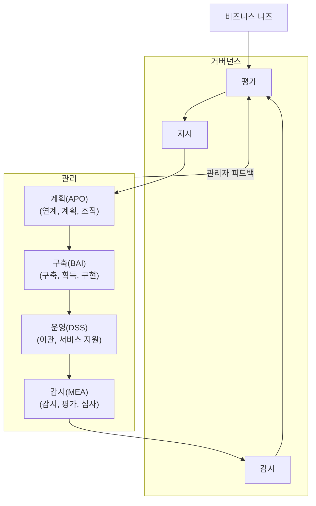

##### ① 거버넌스 영역

각각 평가(E), 지시(D), 감시(M) 등의 실무절차를 갖는 5개의 프로세스로 구성됨

- EDM 1. 거버넌스의 프레임워크와 측정 기준의 수립

- EDM 2. 이익 제공

- EDM 3. 위험 최적화

- EDM 4. 자원의 최적화

- EDM 5. 이해관계자의 투명성

##### ② 관리 영역

계획(APO), 구축(BAI), 운영(DSS), 감시(MEA) 등 4개의 프로세스 영역으로 구성됨

- 계획(APO) 단계: 연계, 계획

- 구축(BAI) 단계: 구축, 획득, 구현

- 운영(DSS) 단계: 이관, 서비스 지원

- 감시(MEA) 단계: 감시, 평가, 심사

IT 거버넌스 프레임워크는 국제표준인 ISO/IEC 38500과 연결되어 있으며 이 표준 또한, 기업의 IT 활용을 평가(Evaluate),
지휘(Direct), 감시(Monitoring)하는데 필요한 원칙과 프레임워크를 동시에 제공하고 있다.

---

<!-- PDF page: 044 -->

#### 다) IT 거버넌스 프로세스

IT 거버넌스 프로세스는 계획 단계, 운영 단계, 평가 단계, 피드백 등으로 구성된다.
[그림 18] IT 거버넌스 프로세스

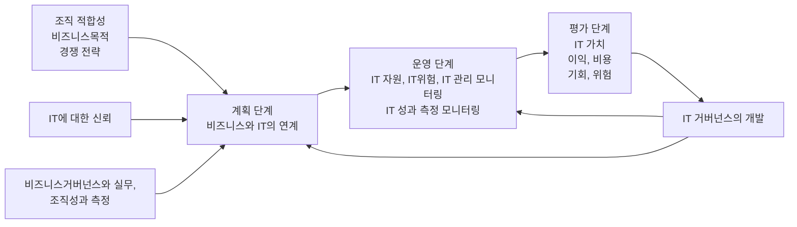

##### ① 계획 단계

비즈니스와 IT의 연계는 기업이 비즈니스와 IT를 연계 및 정렬하고 IT 목표를 설정하며, IT에 관련된 활동, 자원 사용, 위험
관리, 거버넌스 구조, 성과측정 등을 조직화하는 원칙에 대한 구조, 활동, 관련 메커니즘을 포함한다.

##### ② 운영 단계

IT 자원, IT 위험, IT 관리에 대한 모니터링은 기업이 IT 자원, IT 위험 및 IT 관리를 감시하도록 지원하는 구조, 활동, 관련 메
커니즘을 포함한다. IT 성과 측정 모니터링은 기업이 IT 자원, IT 위험, IT 관리 성과에 대한 목표치를 설정하고 이들 목표의
성취도를 측정하도록 지원하는 구조, 활동, 관련 메커니즘을 포함한다.

##### ③ 평가 단계

IT 가치는 비즈니스에 제공할 미래의 비즈니스 기회, 이익과 비용에 의해 평가되며, 전략적, 경제적, 위험 관리, 기술적, 사
회적, 그리고 품질 이익 등이 포함된다. IT 가치는 IT가 지원하는 비즈니스 기회에서 비즈니스의 위험 비용 및 잠재적인 기
타 위험 비용을 차감한 것이다.

##### ④ 피드백 단계

피드백 정보의 평가와 우선순위화된 필요에 따라 IT 거버넌스와 활동을 개선하도록 시정조치를 수행하여 기업이 IT 거버넌스 프로세스와 관련 실무를 개선하는 구조, 활동, 관련 절차를 포함한다.

#### 라) IT 거버넌스 주요 관심영역

IT 거버넌스는 5개의 주요 관심영역을 가지고 있다. IT 거버넌스가 핵심적으로 바라보고 있는 영역은 기업의 전략과 연결
되고 그 전략이 IT 가치와 어떻게 접목되어 활용되는지를 관찰한다. 또한 기업의 리스크 요소에 대한 관리 및 자원에 대
한 관리, 그리고 활동에 따른 성과평가 체계를 포함하고 있다.

---

<!-- PDF page: 045 -->

〈표 6〉 IT 거버넌스 관심영역

| 관심영역 | 특징 | 연계기법 |
| --- | --- | --- |
| 전략연계(Strategic Alignment) | 기업의 전략에 대한 연계와 최적의 의사결정 방향성 제시 | EA |
| IT 가치제공(IT Value Delivery) | 개별 비즈니스 프로세스와 IT의 접목 최적화를 통한 IT 비즈니스의 목표 달성 지원 | 기간계 시스템<br>IT Compliance |
| 리스크관리(Risk Management) | IT 비즈니스 연속성 확보를 위한 리스크 요소 관리 | DRS, BCP |
| 자원관리(Resource Management) | IT 비즈니스 요구사항에 민첩하게 대응하기 위한 IT 자원에 대한 체계적 관리 | ITAM |
| 성과평가(Performance Measurement) | IT 비즈니스에서 유발되는 활동(Action)에 대한 IT 중심의 성과평가 체계 | BSC<br>IT ROI |

### 03 EA의 개념

#### 가) EA(Enterprise Architecture)의 개요

##### ① EA의 정의

EA는 그 이름에서도 알 수 있듯이 기업 아키텍처를 말한다. 기업의 전략적인 목표와 정보자원 관리 목표를 도달하기 위하여 기업의 IT 비즈니스 관계를 이해관계자들이 이해하기 쉽도록 설명한 기업의 청사진이다.
“전사아키텍처는 기업 및 업무 활동과 정보기술 간의 관계를 현재 모습과 향후 추구할 모습을 별도로 정의한 청사진”-미
국 예산관리국(OMB, Office of Management and Budget)

##### ② 필요성

기업들은 급변하는 기업 경영환경에 대응하기 위하여 정보시스템을 적극적으로 도입하고 있으나, 전체적 시각에서 계획
없이 도입된 정보시스템은 중복과 협업불가라는 어려움에 직면하게 되었다. 정보시스템을 지속적으로 도입하지만 기업의
이윤은 늘지 않는 이른바 "IT 생산성 패러독스”1에 빠지는 것이다.
이러한 원인은 여러 가지가 있을 수 있으나, 대부분은 기업의 비즈니스와 IT를 전체적인 시각에서 이해관계자2들이 이해하
기 쉽도록 설명하는 체계가 없기 때문이다.
이러한 이유로 EA가 필요하며, EA는 기업 비즈니스 전체에 대한 시각(View)을 제공함과 동시에 정보자원 간의 긴밀한 협
력관계3를 만들어준다.

<sup>1</sup> IT에 대한 투자가 증가함에도 기업, 산업 및 국가 수준의 생산성이 비례해서 증가하지 않고 오히려 감소하는 현상

<sup>2</sup> 기업내부를 보면 경영자(Planner), 관리자(Owner). 설계자(Designer), 개발자(Builder)로 구분할 수 있음

<sup>3</sup> 기업의 정보자원을 관리하는 체계를 IRM(Information Resource Management)이라고 하며, EA에게는 정보자원에 대한 속성을 제공함

---

<!-- PDF page: 046 -->

#### 나) EA 개념도 및 구성요소

##### ① EA의 개념도

EA 구축은 기업 비즈니스 전략으로부터 시작된다. 기업 비즈니스 전략은 IT 전략과 융합하게 되고, 그 융합된 결과물로 EA
가 탄생하게 된다.
[그림 19] EA의 개념도

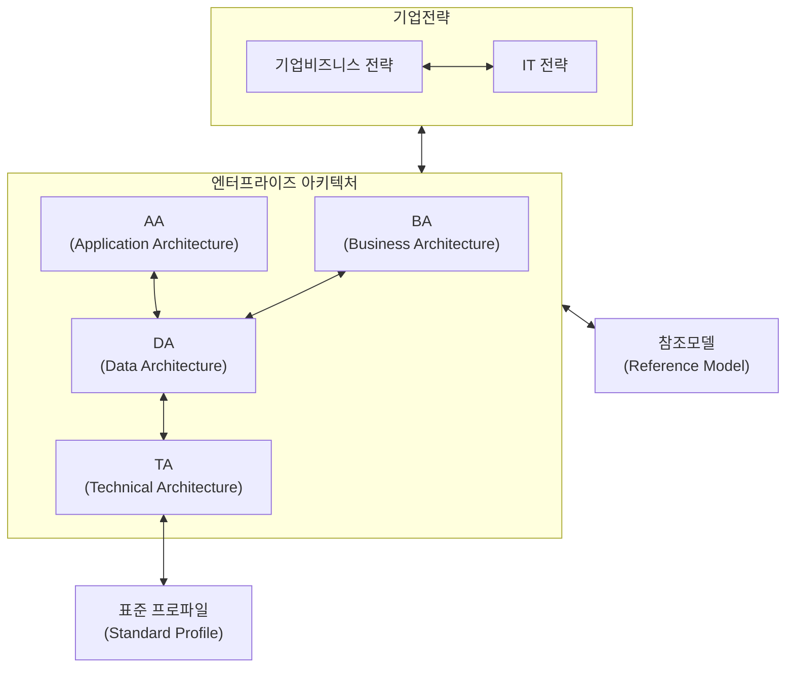

##### ② EA의 구성요소

EA는 IT 거버넌스의 통제체계를 위임 또는 상속받는다. 더 정확하게 표현하자면 EA수립 자체가 IT 거버넌스 행위이며, IT
거버넌스의 통제수단이다.
EA의 핵심 구성요소로는 IT 거버넌스 이 외에 업무아키텍처(BA), 응용아키텍처(AA), 데이터아키텍처(DA), 기술아키텍처
(TA)로 구분된다. 표준프로파일(SP)는 기술아키텍처의 하부구조로서, 기술명세에 대한 상세 스펙을 정의한 것이라고 이해
하면 된다.

〈표 7〉 EA의 구성요소

<table>
<tr><th>구성요소</th><th>특징</th><th>연관참조모델</th></tr>
<tr><td>IT 거버넌스(IT Governance)</td><td>• IT가 기업의 비즈니스 목표와 Align이 되도록하는 프로세스, 조직의 관리 방법</td><td>COBIT<br>COSO</td></tr>
<tr><td>업무아키텍처(BA)(Business Architecture)</td><td>• 경영전략 및 비즈니스 환경분석을 기반으로 Activity를 통해서 사람, 프로세스, 정보를 체계적으로 디자인하고 상호 연관성을 수립</td><td>성과참조모델(PRM)</td></tr>
<tr><td>응용아키텍처(AA)(Application Architecture)</td><td>• 업무에 필요한 정보를 도출하고, 조작 관리하는 활동에 대해 식별하고 정의하는 단계. 어플리케이션 실현에 필요한 기능, 적용업무의 속성과 환경을 정의하는 표준서 작성</td><td>서비스컴포넌트참조모델(SRM)</td></tr>
<tr><td>데이터아키텍처(DA)(Data Architecture)</td><td>• 비즈니스 모델에서 정의된 활동에 필요한 자료를 파악하고 정의<br>• 모든 정보와 데이터 구조, 데이터 간의 상호관계 등을 파악하여 데이터 모델을 설계</td><td>데이터참조모델(DRM)</td></tr>
<tr><td>기술아키텍처(TA)(Technical Architecture)</td><td>• 비즈니스, 데이터 어플리케이션을 지원하는 인프라와 기타 테크놀로지 선정기준과 이들이 지원하는 기술적 서비스 구조 정의</td><td rowspan="2">기술참조모델(TRM)</td></tr>
<tr><td>Standard Profile</td><td>• 기술아키텍처(TA)에 대한 세부 기술명세서를 정의<br>예) 자바아키텍처 버전: JDK 2.0</td></tr>
</table>

---

<!-- PDF page: 047 -->

개별 아키텍처에 대하여 연관된 참조모델이 있는데 순서대로 성과참조모델(PRM), 서비스컴포넌트참조모델(SRM), 데이터
참조모델(DRM) 끝으로 기술참조모델(TRM)로 구성된다. 참조모델은 기업에서 EA를 구축하고자 할 때 동종업계 또는 유사
업종의 선진사례를 참조할 수 있도록 하여 EA 구축에 길잡이 역할을 하게 된다. 범정부 EA의 경우에도 범정부 EA 참조모
델이 있어서, 이것을 참조하여 개별 부처별로 EA를 구축해 나가게 된다.
참고로, 범정부 EA에는 위의 4개 아키텍처 외에 보안아키텍처가 하나 더 추가되어 있다.

#### 다) EA 프레임워크

대표적인 EA 프레임워크로는 자크만 프레임워크(Zachman Framework), TOGAF(The Open Group Architecture),
FEAF(Federal Enterprise Architecture Framework) 등이 있다. 자크만 프레임워크는 EA 수립 시 가장 많이 참조하는 프레임워크이고, The Open Group에서 만든 TOGAF는 기업 간 상호운용성에 초점을 맞추어 개발한 개방형 프레임워크이
다. 또한 FEAF는 미국의 정보 CIO Council에 의해 자크만 프레임워크, Spewak 등의 도움으로 1998년 개발된 프레임워크이다.
〈표 8〉 EA 프레임워크의 종류

| EA 프레임워크 | 설명 |
| --- | --- |
| 자크만 프레임워크 | • EA 수립 시 가장 많이 사용하는 프레임워크이며 VIEW와 Perspective(관점)를 이용하여 매트릭스 형태로 정의되어 있다.<br>• 5가지 Perspective: Planner, Owner, Designer, Builder, Subcontractor<br>• 각 관점을 따르는 6가지 묘사 방법: Data, Function, Network, People, Time, Motivation |
| TOGAF | • 아키텍처 개발 방법(ADM) 사이클, 기술참조모델(TRM), 표준 요약 정보를 모아놓은 DB인 SIP(표준 정보 기반)로 구성되어 있으며 빌딩 블록 정의에 의한 접근 방식으로 구성 단위의 문제 해결하는 구조로 되어 있다. |
| FEAF | • 8개의 구성 요소와 4단계의 점진적 진행구조로 되어 있으며 자크만 프레임워크의 모델 내용을 모두 관리하고 있다.<br>• 자크만 프레임워크에 준거한 상호관계인 다섯 가지 참조 모델을 규정(BRM, PRM, DRM, SRM, TRM) 하고 있으며, 일본의 EA 프레임워크의 기반이다.<br>• 프레임워크에는 각 세그먼트 별 접근법 채택, AS-IS, TO-BE의 갭 분석을 통한 이행 계획과 프로세스를 포함한다. |

### 04 ISP의 개념

#### 가) ISP(Information Strategic Planning)의 개요

ISP는 의미 그대로 해석하자면 정보화 전략 계획이다. 일반적으로 통칭하여 ISP수립이라고 표현한다.
ISP는 기업, 조직의 중장기 비전 및 목표, 경영계획을 지원하기 위한 정보시스템 및 정보관리 체계에 대한 비전을 제시한
다. 즉 정보시스템을 구축하면서 기업의 장기적인 목적 등을 지원하기 위한 정보시스템의 구축 방향성에 대한 밑그림을
그리는 계획이라고 생각하면 된다.

---

<!-- PDF page: 048 -->

#### 나) ISP의 구축절차

ISP를 구축하기 위해서는 기업의 내/외부환경분석 및 정보환경분석을 먼저 수행하게 된다. 기업의 환경분석에는 SWOT,
5-Force, 7S, 4C 등의 분석기법을 주로 활용한다. 또한 정보환경분석에서는 기술동향이나 신기술 적용분석 등을 수행하
여 사업의 목적과 배경에 부합되는 기술요건에 대한 세밀한 분석을 하게 된다.
다음 단계로는 기업현황을 분석하는 단계이다. 기업현황 분석에서 가장 중요하게 확인하는 사항은 업무절차(Business Process)이다. 현재 수준의 업무절차에 대한 상세분석을 통하여 기업 및 조직에서 발생하는 다양한 활동변수를 발견할
수 있다.
아울러, 기업내부에 산재한 정보시스템을 분석하고, 이해관계자의 요구사항 도출 및 개선과제를 도출하는 것도 이 단계
에서 해야 하는 중요한 과업이다. 또한, 동종업계나 유사업계의 선진사례를 벤치마킹함으로써 누락되거나 왜곡된 정보를
어느 정도 바로잡을 수 있다.

〈표 9〉 ISP 기본 구성 내용⁴

<table>
<tr><th colspan="2">대상업무</th><th rowspan="2">세부내용</th></tr>
<tr><th>단계</th><th>활동</th></tr>
<tr><th rowspan="6">환경분석</th><td>경영환경분석</td><td>대내외 업무환경파악을 통해 기회 및 위협요소 도출<br>CSF와 OIR(Official Information Required) 도출</td></tr>
<tr><td>정보기술 환경분석</td><td>정보기술 추세를 검토하여 정보기술 발전방향 분석, 신정보기술 적용 가능성 분석 및 정보화 요구사항을 도출</td></tr>
<tr><td>업무분석</td><td>조직의 역할 및 업무체계를 분석하여 이를 근간으로 현행 조직과 업무체계상의 문제점 및 개선 요구사항을 도출</td></tr>
<tr><td>정보시스템분석</td><td>현행 정보시스템 및 정보자원관리/운영 현황을 분석하여 정보시스템 문제점 및 개선사항을 도출</td></tr>
<tr><td>벤치마킹</td><td>업무 및 정보시스템 관점에서의 벤치마킹</td></tr>
<tr><td>차이분석</td><td>선진사례의 업무프로세스 요건 및 정보인프라 요건을 도출하고 기 도출된 정보화 요건과의 차이를 분석하여 과제의 보완작업 및 개선방향 설정</td></tr>
<tr><th rowspan="6">미래 모델설계</th><td>미래업무 프로세스 설계</td><td>바람직한 미래 프로세스 모형 및 신 업무 프로세스 정립 등 프로세스 개선방안 수립</td></tr>
<tr><td>정보전략수립</td><td>정보화 비전, 목표, 단계별 실행 전략 등을 수립하고 정보시스템 구축 원칙과 정보시스템에 적용할 기술 요건 및 정보관리 전략을 수립</td></tr>
<tr><td>정보시스템구조 설계</td><td>전략적 정보시스템 구축을 위한 이상적인 응용서비스/정보기술 기반 구조를 정립</td></tr>
<tr><td>정보관리체계수립</td><td>정립된 정보시스템을 효율적으로 운용할 수 있는 정보자원관리 체계를 정리</td></tr>
<tr><td>업무프로세스 개선계획수립</td><td>미래 프로세스 모형에 기초한 업무프로세스 수립</td></tr>
<tr><td>정보시스템 구축계획 수립</td><td>전략적 모형을 구축하기 위한 실행전략을 수립 추진체계 및 실행일정, 정보화 투자예산 산정 및 투자효과 분석</td></tr>
<tr><th rowspan="4">정보 시스템 상세규모</th><td>개발용역비</td><td>이행과제별 개발비 등 상세 규모의 산정</td></tr>
<tr><td>장비구입비</td><td>SW구매, HW구매 등 항목별 규격, 수량, 금액 내역</td></tr>
<tr><td>운영유지보수</td><td>구축 이후 운영 및 유지보수와 폐기에 이르는 제반비용</td></tr>
<tr><td>기능점수도출</td><td>실제 구축하는데 필요한 기능점수를 산정</td></tr>
<tr><th rowspan="2">타당성 분석</th><td>타당성분석</td><td>경제적 타당성 분석(B/C, NPV 등)</td></tr>
<tr><td>대안분석</td><td>규모·비용조정, 사업추진방식 등에 따른 대안분석(최소2개 이상)</td></tr>
</table>

<sup>4</sup> 정보화전략계획(ISP)수립 공통가이드, 한국정보화진흥원, 2018.

---

<!-- PDF page: 049 -->

기업의 환경과 현황에 대한 분석 결과는 ISP 수립의 마지막 단계에서 개선방향과 개선된 업무절차, 정보화 계획 수립의
중요한 자원(Resource)이 된다.

#### 다) ISP 구축 주요 산출물

ISP 구축절차에는 단계별 수행활동이 있고, 수행활동의 결과로써 산출물이 만들어지게 된다.
ISP 수행에서 활용할 수 있는 일반적인 산출물 목록 예시는 아래와 같다.
〈표 10〉 ISP 단계별 산출물(예시)

<table>
<tr><th>단계</th><th>산출물</th><th>개요</th></tr>
<tr><td>기업환경분석</td><td>경영환경 분석서</td><td>기업의 전략적 방향설정, 환경분석</td></tr>
<tr><td rowspan="2">기업현황분석</td><td>현행 프로세스 분석서</td><td>업무프로세스, 조직단위의 문제점 및 개선점 분석</td></tr>
<tr><td>IT 현황 분석서</td><td>정보시스템의 문제점 및 개선점 분석</td></tr>
<tr><td rowspan="2">정보화 전략 계획 수립</td><td>정보화 목표 모델 정의서</td><td>분석 내용을 토대로 새로운 정보모델을 개발</td></tr>
<tr><td>To-Be 업무시스템 구축 마스터 플랜</td><td>정보전략계획의 완성<br>프로젝트 정의 및 우선순위 부여</td></tr>
</table>

실제 ISP 과업을 수행하다 보면 훨씬 다양하고 복잡한 산출물을 작성하게 된다. 그러나, 가장 중요한 것은 미래모형에 대
한 프로세스와 목표도달을 위한 방법(Activity)를 제시하는 것이다. 그러한 내용들이 산출물에 충분히 포함되어야 한다.
ISP를 앞서 설명한 EA와 비교하여 보면, ISP는 EA의 범위 안에서 EA보다 미시적인 계획을 다루게 된다. 다음의 표에서
설명한 범위 영역을 보면 EA에 대비한 ISP의 범위는 정보화 전략에 초점이 맞춰져 있음을 알 수 있다.
〈표 11〉 ISP와 EA 개념 비교표

| 구분 | ISP | EA |
| --- | --- | --- |
| 목적 | • 경영전략과 정보화 전략 연계 및 새로운 정보기술 반영 | • 비즈니스와 정보 자원 간의 유연한 융합에 대한 청사진 |
| 범위 | • 전사, 서비스 또는 부서 대상 정보화 전략 | • 전사의 기술(ITA), 비즈니스(BA), 응용애플리케이션(AA), 데이터(DA) 등의 아키텍처 |
| 주요 활동 | • 경영환경분석(조직, 유관기관 및 고객 특성 분석 등)<br>• 최근 정보기술 동향 분석<br>• 업무 분석(조직 내부 활동과 현행 프로세스 분석)<br>• 정보 시스템 구조 분석<br>• 정보전략 및 정보관리체계 수립<br>• 미래업무 프로세스 및 정보 시스템 구조 설계<br>• To-Be 로드맵 수립 | • ITA 방향 및 지침 수립<br>• 참조모델(BRM, SRM, DRM, TRM/SP, PRM) 수립<br>• AS-IS 아키텍쳐(BA, AA, DA, TA, SA) 분석<br>• TO-BE 아키텍쳐(BA, AA, DA, TA, SA) 수립<br>• 이행계획 수립<br>• ITA 관리체계수립 |
| 주요 산출물 | • 경영환경 분석 및 정보기술 동향 분석 보고서<br>• 업무/정보시스템 분석 보고서 IT 비전 및 전략<br>• 이행과제 및 로드맵 | • 전사 아키텍처 비전, 원칙, 아키텍처 매트릭스<br>• 현행 및 목표 아키텍처(BA, AA, DA, TA, SA)<br>• 목표 아키텍처로의 이행계획 |

다시 말하자면, ISP는 EA의 목표 아키텍처 구조하에 경영전략과 IT의 방향성이 일치될 수 있도록 최신 정보기술을 반영하
여 수립한다. 따라서 경영환경의 변화에 민감하게 반응하고 유연성을 확보할 수 있어야 하며, 지속적 현행화를 통하여 신
속하게 이행과제를 적용하고 조직 전체에 로드맵이 공유될 수 있도록 관리하여야 한다.

---

<!-- PDF page: 050 -->

**[참고 및 추천 자료]**

[1] 정희연, 비즈니스와 IT의 융합, 이담북스, 2010.

[2] 정보통신산업진흥원, 정보시스템 마스터플랜(SMP) 방법론, 2009.

[3] 신철, 노경하, 알기 쉬운 정보화전략계획 ISP, 미래와 경영, 2011.

[4] 신동익, 엔터프라이즈 아키텍처 개요, 에프앤가이드, 2012.

[5] 강정배 외 5명, 정보처리기술사 이론과 전략, 한국생산성본부, 2011.

[6] 정보화전략계획(ISP)수립 공통가이드, 한국정보화진흥원, 2018.

[7] "http://www.gartner.com/”, Gartner, 2018년 10월 5일 최종접근

[8] "http://ko.wikipedia.org”, wikipedia 2018년 10월 5일 최종접근

[9] 소프트웨어 공학센터, 소프트웨어 인사이트, NIPA 2009.

[10] "https://en.wikipedia.org/wiki/Enterprise_Architect_(software)”, wikipedia 2018년 10월 7일 최종접근

---

<!-- PDF page: 051 -->

## IV. IT 비즈니스 도입의 이해

### 최근 동향 및 주요 이슈

기업 입장에서 IT 비즈니스를 도입하기 위해서, 기업 내부에서 직접 개발하는 인하우스(In-House) 개발방식과
IT 아웃소싱(Outsourcing) 방식을 두고 고민하는 것은 오래된 과제이다.
또한, IT 아웃소싱을 도입하고자 할 때 패키지 제품을 활용할 것인지 처음부터 시스템을 개발하는 방식을 적용
할 것인지에 대한 선택에도 어려움이 많다.
이러한 이유로, 어떤 방법이 기업의 환경변화에 적극적으로 대응하고 지속적 영위와 발전에 도움이 될 수 있는
지를 놓고 IT 비즈니스 도입마다 고민이 깊어진다.
기업 경쟁력을 강화하기 위해서 IT 비즈니스 도입을 위한 절차마련은 필수적 요소로 인식되고 있으며 IT 비즈니스 도입의 끝에는 정보시스템 구축이 있다. 따라서 정보시스템 구축을 위한 다양한 표준과 시스템 운용을 위한
체계적 조직구조와 프로세스가 있어야 IT 비즈니스 도입의 효과를 극대화할 수 있다.

### 학습 목표

1. IT 비즈니스 도입 프로세스와 도입 방식을 설명할 수 있다.
2. IT 비즈니스 아웃소싱을 설명할 수 있다.

### 핵심 키워드

IT 비즈니스 도입 방식, IT 비즈니스 도입 절차, IT 비즈니스 아웃소싱

---

<!-- PDF page: 052 -->

### 실무 미리보기

행정자치부의 2010년 자체 실태 조사에 따르면 과도한 과업변경으로 인하여 추가비용 발생률이 중앙행정기관
4.4%, 지자체 15.3%로 정보시스템 구축에 대한 기획과 설계가 부실하다는 지적이 제기되었다.
공공부문에서 IT 비즈니스를 성공적으로 도입하기 위하여 상세RFP 발행과 PMO제도 등을 법으로 마련하고 있
으나, 여전히 정보시스템 도입에 대한 인식과 전문성이 부족하여 위와 같은 현상이 발생하고 있다.
최근, 정부에서는 무책임한 과업변경을 방지하고 발주기관 • 원청업체 • 하도급으로 이어지는 부당하도급 구조
를 근절하고자 “분할발주프로세스”를 도입하기 위해서 노력 중이다.
분할발주프로세스는 크게 보면 IT 비즈니스 도입 시 기획/설계, 그리고 구축/개발을 분할하자는 의미이다. 기획/설계 단계에서는 정보화전략계획(ISP)의 요구사항을 더 상세화한 요건정의분석, 즉 정보시스템 마스터플
랜(ISMP)과 기본설계(논리적 설계)를 수행하고, 구축/개발 단계에서는 상세설계(물리적 설계)와 시스템개발
(Coding) 및 테스트를 수행한다.
분할발주프로세스 도입은 기대와 동시에 우려의 목소리도 크다. 그럼에도 불구하고 IT 비즈니스 도입과 관련하
여 계획과 설계를 보다 더 꼼꼼하고 체계적으로 할 수 있는 환경을 만든다는 것에는 시사점이 있다. 이러한 환
경은 소프트웨어의 비가시성을 극복하고 요구사항의 잦은 변경이 IT 비즈니스 도입에 중요한 장애요소가 된다
는 것을 인식하는 좋은 계기가 될 것으로 예상된다.

---

<!-- PDF page: 053 -->

### 01 학습내용 요약

IT 비즈니스 도입은 IT 비즈니스 전략과 계획에 따라 실시하게 된다. 기업의 조직규모와 대외환경의 변화 등에 맞추어 비즈니스 도입 방식과 절차를 마련하게 되며, 기업의 비핵심 영역 또는 프로세스에 대해서는 IT 아웃소싱을 고려하게 된다.
IT 비즈니스 도입 절차에서는 발주프로세스와 ISO/IEC 12207의 소프트웨어개발 생명주기를 활용한다. 이는 IT의 핵심가치는
소프트웨어로 구현되기 때문이며 소프트웨어개발의 성공여부가 IT 비즈니스 도입에 중요한 열쇠이기 때문이다.
IT 아웃소싱은 외부의 전문자원을 활용할 수 있어 기업의 경쟁력 향상에 큰 도움이 되지만 업무적, 기술적 종속(Lock-in)의 문
제는 몇 가지 제도적 보완을 통하여 해결해야 할 숙제이다.

### 02 IT 비즈니스 도입 프로세스

IT 비즈니스를 도입하기 위한 절차로는 기업의 발주프로세스가 기본적으로 활용된다. 발주의 주체는 요구사항을 발행하는 부
서나 담당자이며 개발의 주체는 주로 기업 내부의 전산부서 또는 외부 아웃소싱 전문가로 구성된다.
또한, 소프트웨어 도입에 따른 라이프사이클(SDLC, Software Development Lifecycle) 관리는 ISO/IEC 12207에 정의된 표준 절차를 따르게 된다.

#### 가) IT 비즈니스 발주프로세스

IT 비즈니스 발주프로세스는 발주자의 활동 및 작업을 정의하고 있으며 시스템 또는 소프트웨어나 서비스를 도입하기 위
한 일련의 과정을 말한다.
또한, 발주 대상에 대한 개념정의 및 요구사항 상세화를 시작으로 제안요청서 준비, 제안서 평가 및 계약, 공급자 관리를
거쳐 목표 산출물에 대한 인수까지의 활동을 포괄한다.

[그림 20] IT 비즈니스 발주프로세스

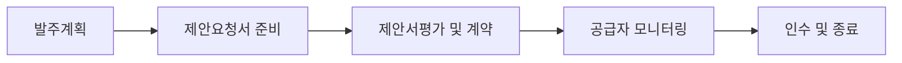

기업은 IT 비즈니스 발주프로세스를 이용함으로써 정보시스템 도입에 따른 발주자와 공급자의 활동을 정의하고 정보화
사업의 성공률을 제고할 수 있다.
그리고 발주자와 공급자 간의 의사소통을 위한 공통 수단을 제공하고 IT 비즈니스 도입의 가시성을 제공하여 예측 가능
한 절차를 제공한다.

---

<!-- PDF page: 054 -->

〈표 12〉 발주프로세스 예시 상세설명

| 프로세스 | 주요수행활동 | 산출물 |
| --- | --- | --- |
| 발주계획 | • 발주대상시스템에 대한 정의<br>• 요구사항 정의 및 요구사항 상세화<br>• 발주계획서 작성 | • 발주계획서<br>• 현황분석서 및 요구사항 정의서<br>• 발주계획서 |
| 제안요청서 준비 | • 제안요구사항 문서화<br>• 제약조건 정의<br>• 공급자 선정절차 및 기준 수립 | • 제안요청서<br>• 계약조건정의서<br>• 공급자 평가 기준표 |
| 제안서평가 및 계약 | • 입찰공고 및 제안서 평가<br>• 공급자선정 및 계약협상<br>• 계약체결 | • 입찰공고서<br>• 제안서평가결과서<br>• 계약서 |
| 공급자 모니터링 | • 사업수행계획서 검토 및 승인<br>• 공급자 계약 이행 점검 | • 사업수행계획서<br>• 계약이행 점검결과서 |
| 인수 및 종료 | • 인수담당자 선정 및 인수준비<br>• 검사 및 인수시험<br>• 인수 및 사업종료 | • 인수계획서<br>• 시험결과보고서(성능평가보고서)<br>• 인수 및 사업종료보고 |

#### 나) 소프트웨어 도입 프로세스, ISO/IEC 12207

ISO/IEC 12207은 소프트웨어 도입 라이프사이클을 정의한 국제표준으로서, 체계적인 소프트웨어 획득, 공급, 개발, 운영,
유지보수단계에 대한 표준 공정을 제공한다.
ISO/IEC 12207은 3개의 주요프로세스와 각 프로세스마다 세부프로세스로 구성되어 있다.
ISO/IEC 12207은 다양한 형태의 소프트웨어 도입 및 개발에 적용될 수 있는 프로세스와 활동, 그리고 세부 업무(Task)를
정의하고 있으나 산출물의 명칭, 형식, 내용은 별도로 규정하지 않는다. 따라서, SPICE(Software Process Improvement
and Capability dEtermination) 또는 CMMI(Capability Maturity Model Integration)와 함께 활용하면 What뿐만 아니라 How에
대해서도 습득할 수 있다.

##### ① 기본생명주기 프로세스

기본생명주기 프로세스는 5개의 세부프로세스로 구성되어 있으며 소프트웨어 수명주기 프로세스에 참여하는 이해관계자
를 지원한다.

〈표 13〉 기본생명주기 프로세스의 세부프로세스

| 프로세스 | 설명 |
| --- | --- |
| 획득(Acquisition) | • 소프트웨어 획득자의 활동을 정의<br>• 시스템, 산출물, 서비스 획득 활동 정의 |
| 공급(Supply) | • 소프트웨어 공급자의 활동을 정의<br>• 획득자에게 공급하는 공급자 중심 |
| 개발(Development) | • 소프트웨어 개발자의 활동을 정의<br>• 소프트웨어 산출물을 정의, 개발조직 활동 정의 |
| 운영(Operation) | • 운영 서비스를 제공하는 운영자의 활동을 정의 |
| 유지보수(Maintenance) | • 유지보수 서비스를 제공하는 유지보수자의 활동을 정의 |

---

<!-- PDF page: 055 -->

##### ② 지원생명주기 프로세스

지원생명주기 프로세스는 8개의 세부프로세스로 구성된다. 다른 프로세스를 지원하는 역할을 수행하며 소프트웨어 산출물의 품질과 성공에 관여한다.

〈표 14〉 지원생명주기 프로세스의 세부프로세스

| 프로세스 | 설명 |
| --- | --- |
| 문서화(Documentation) | • 수명주기 프로세스 기간에 생산되는 산출물에 대한 기록활동 정의 |
| 구성관리(Configuration Management) | • 구성관리활동 및 구성내용에 대한 정의 |
| 품질보증(Quality Assurance) | • 요구사항 일치성 및 계획준수 등의 품질활동을 정의 |
| 검증(Verification) | • 개발자관점에서 소프트웨어 산출물을 검증하는 활동을 정의 |
| 확인(Validation) | • 사용자관점에서 소프트웨어 산출물을 확인하는 활동을 정의 |
| 합동검토(Joint Review) | • 통합적으로 진행상황과 산출물을 평가하기 위한 활동을 정의 |
| 감사(Audit) | • 계획 및 계약에 적합한지 여부를 점검하기 위한 활동을 정의 |
| 문제해결(Problem Resolution) | • 기본생명주기 프로세스에서 발견된 문제를 분석하고 제거하기 위한 활동을 정의 |

##### ③ 조직생명주기 프로세스

조직생명주기 프로세스는 4개의 세부프로세스로 구성된다. 특정한 프로젝트나 정보시스템 도입계약에 귀속되지 않고 사업전반에 걸쳐 생명주기 프로세스의 하부구조(Underlying Structure)를 설정하고 구현하기 위한 프로세스이다.

〈표 15〉 조직생명주기 프로세스 세부프로세스

| 프로세스 | 설명 |
| --- | --- |
| 관리(Management) | • 프로젝트관리를 포함하는 기본적인 관리활동을 정의 |
| 기반구조(Infrastructure) | • 생명주기 프로세스의 기반구조를 설정하고 정의 |
| 개선(Improvement) | • 프로세스에 참여하는 이해관계자 또는 조직이 수행하는 개선활동을 정의 |
| 훈련(Training) | • 훈련된 요원을 제공하기 위한 기본활동을 정의 |

---

<!-- PDF page: 056 -->

#### 다) 테일러링 프로세스

위의 주요 프로세스 이외에도 테일러링5 프로세스가 있다. 테일러링 프로세스는 테일러링을 수행하기 위한 기본적인 활
동을 정의한다. 즉, 생명주기 프로세스에서 적용하지 않거나 불필요하다고 인식되는 활동 및 작업을 제거하는 프로세스
이다.
테일러링 프로세스는 일반적으로 소프트웨어 개발방법론의 최적화로 알려져 있으나, 본 절에서는 소프트웨어 도입과 관
련된 부분을 설명하고자 한다.
소프트웨어를 도입하고자 할 때, 내부 및 외부 요구사항의 변화에 따라 도입 절차, 기법, 산출물 등을 최적화할 필요성이
있다. 이런 경우는 주로 단위 프로젝트 수행 시에 많이 발생하게 되는데 테일러링을 통하여 최적의 소프트웨어 도입 환경
을 구성할 수 있다.
〈표 16〉 테일러링 프로세스 주요 고려사항

| 고려사항 | 설명 |
| --- | --- |
| SW도입 성격 | 업무 영역(ex, 금융, 통신 등), 이해관계자 등 고려<br>• 소프트웨어 도입 목표 및 방향성 수립 |
| 일정과 범위 | 도입의 범위, 인터페이스 영역, 수행일정 등 고려<br>• 방법론, 산출물 등 선정 |
| 내/외부 환경 | 관련 법규 및 제도, IT Compliance 등 환경 고려<br>• 보안사항 적용 범위, 내/외부 환경 대응 전략 등 수립 |
| 적용기술 | 소프트웨어 적용 프레임워크 및 기반 기술 고려<br>• 프레임워크 선정, 속성, 활용도 점검 및 적용 기반기술 선정 |

### 03 IT 비즈니스 도입 방식

IT 비즈니스를 도입하는 방식으로 크게 인하우스(In House) 개발과 패키지(Package) 도입으로 구분할 수 있다. 인하우스 개발
은 사내의 보유인력을 활용하여 사용자의 요구사항을 충실히 반영할 수 있는 장점이 있고, 패키지 도입은 표준화된 선진 프로세스를 받아들여 자연스러운 업무개선을 유도할 수 있는 장점이 있다.

#### ① 인하우스 개발의 특징

기업내부의 요구사항에 적합한 정보시스템을 자체인력으로 구축 및 개발하는 형태이다. 시스템 도입에 따른 노하우
(Know-How)가 축적되는 반면 상대적으로 도입비용 증가와 성공에 대한 불확실성이 내포된다.

#### ② 패키지 도입의 특징

IT 비즈니스에 대한 선진사례를 손쉽게 접목할 수 있는 방법이다. 많은 테스트와 도입검증을 거친 시스템을 도입함으로써
상대적으로 성공에 대한 불확실성을 제거할 수 있다. 도입기간이 짧고 도입비용이 상대적으로 저렴하나, 유지보수 비용은
증가될 가능성이 있다.

<sup>5</sup> Tailoring의 원래의 의미는(양복)재단의 용어이나, 소프트웨어 분야에서는 최적화의 의미로 해석된다.

---

<!-- PDF page: 057 -->

〈표 17〉 인하우스 개발과 패키지 도입 비교표

| 구분 | 인하우스 개발 | 패키지 도입 |
| --- | --- | --- |
| 목적 | • 기업내부의 상세요구사항을 적극적으로 반영 | • 선진프로세스 및 사례를 활용 |
| 인력 | • 사내보유인력 중심 활용 | • 패키지 전문가 활용 |
| 종속성 | • 기업내부의 노하우 축적 | • 기술적 종속관계 형성 |
| 장점 | • 도입에 따른 사용자 요구사항을 충분히 만족시킬 수 있다.<br>• 사내정보 및 업무프로세스에 대한 주요 정보보호가 가능하다.<br>• 도입범위를 손쉽게 조절 가능하다. | • 구축기간과 비용이 상대적으로 적게 든다.<br>• 표준화된 프로세스 도입으로 자연스러운 업무프로세스 혁신이 가능하다.<br>• 선진 경영 프로세스를 접목할 수 있다. |
| 단점 | • 상대적 구축비용이 많이 든다.<br>• 상대적으로 업무개선의 폭이 좁다. | • 사내의 주요 정보가 외부에 노출될 가능성이 있다.<br>• 요구사항과 별개로 사내 업무프로세스의 변경이 필요하다. |

IT 비즈니스 입장에서 인하우스 개발과 패키지 도입에는 각각 장점과 단점이 있다. 그럼에도 불구하고 두 가지 방식 중 하나
를 선택해서 진행하는 경우가 많으나, 하이브리드(Hybrid) 방식으로 도입하는 경우도 자주 있다.
즉, 전체적인 도입 방식은 인하우스 개발을 적용하되 부분에 적용되는 요소 기술들은 패키지 제품을 도입하여 적용한다. 이러한 방식은 비용을 절감하고 IT 비즈니스 도입 시 발생할 수 있는 위험요소를 줄여주는데 도움이 된다.

### 04 IT 비즈니스 아웃소싱 서비스

#### 가) IT 비즈니스 아웃소싱의 개요

기업은 변화되는 내/외부의 환경에 민첩하게 대응하기 위하여 여러 가지 전략을 활용하게 된다. 특히, 자사의 경쟁우위가
확실시되는 업무영역 및 프로세스에 대해서는 지속적으로 개선 • 발전시키면서 경쟁우위를 보다 더 공고히 하고 비전략적인 영역이거나 취약한 프로세스에 대해서는 외부의 우수한 자원을 활용하기도 한다.
이러한 이유로 기업의 가치사슬(Value Chain) 상의 활동 중 경쟁우위가 있거나 중요한 업무영역인 경우는 자사에서 수
행하고 비전략적 부문과 상대적 열세인 업무영역에 대하여 외부의 전문가나 전문업체에 위탁(조달)하는 것을 아웃소싱
(Outsourcing)이라고 하는데, IT 부문을 활용하는 것을 IT 비즈니스 아웃소싱이라고 한다.
IT 비즈니스 아웃소싱은 IT 자원, IT 관리, 운영 등을 외부에 위탁하고 기업은 핵심 업무에 주력할 수 있도록 하여 경쟁우위를 지속적으로 유지하게 한다.

---

<!-- PDF page: 058 -->

#### 나) 도입 프로세스

[그림 21] IT 비즈니스 아웃소싱 도입 프로세스 개념도

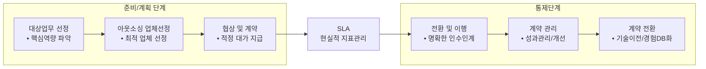

아웃소싱을 도입하기 위해서는 먼저 자사의 핵심역량을 파악하여 위탁할 대상업무를 선정하는 것으로 시작된다. 대상
업무가 선정되면 업체를 선정하고 협상과 계약을 하게 되는데, 이 때 중요한 것은 서비스 수준에 대한 명확한 지표관리
및 합의6 가 필요하다.

#### 다) 아웃소싱의 형태

IT 비즈니스 아웃소싱의 형태는 크게 4개로 구분된다.
〈표 18〉 IT 비즈니스 아웃소싱의 형태

| 형태 | 설명 |
| --- | --- |
| 전체 아웃소싱(Total Outsourcing) | IT 기능 전체를 하나의 벤더에게 전부 위탁하는 형태이며 책임소재가 명확하고 업무효율성을 증대할 수 있으나 경쟁부재에 따른 독점적 문제가 부각될 수 있다. |
| 선택적 아웃소싱(Selective Outsourcing) | 선택된 기능 또는 업무단위를 여러 벤더에게 위탁하는 형태이며 경쟁으로 인한 가격과 품질측면의 향상을 기대할 수 있으나 문제발생 시 책임소재에 대한 문제와 고객의 요구사항이 정확하게 전달되는 것에 어려움이 있다. |
| IT 자회사 아웃소싱(IT subsidiary company Outsourcing) | IT 전문법인을 별도로 설립하고 아웃소싱하는 형태이며, 동료의식으로 인한 단결과 의사소통향상을 기대할 수 있다. 그러나 관련비용이 증가할 수 있고, 수익성이 확보되지 않았을 경우 모회사에게도 위험요소로 작용할 수 있다. |
| 코 소싱(Co-Sourcing) | IT 기획 및 전략과 IT 서비스 수행을 분리하는 형태로 급변하는 환경에 대응하기 유리한 형태이고 Total Outsourcing의 문제점을 부분적으로 해결할 수 있다. 다만, 전략과 수행의 갭(Gap)이 발생할 경우 다양한 조율이 필요할 수 있다. |

#### 라) 아웃소싱 도입에 따른 고려사항

IT 아웃소싱을 추진하고자 할 때 다양한 문제점을 만나게 된다. 이러한 문제점을 해결하기 위하여 다음과 같은 고려사항
을 확인할 수 있다.
IT 아웃소싱을 수행할 시에는 아웃소싱 벤더(업체)에 대한 지속적 관리가 필요하고, 관리를 위한 표준으로 eSCM7과 ISO/
IEC20000 등의 표준을 활용할 수 있다.

<sup>6</sup> 서비스 수준에 대한 명확한 지표관리 및 합의를 SLA(Service Level Agreement)라고 한다.

<sup>7</sup> eSCM: eSourcing Capability Model

---

<!-- PDF page: 059 -->

- 자사의 중요한 기업정보가 유출되지 않도록 보안체계를 마련함과 동시에 서비스 품질이 확보될 수 있도록 서비스 수준에 대한 관리와 변경사항에 대한 지속적 모니터링이 필요하다.
- 기업의 특정 업무영역이 아니라 비즈니스 프로세스를 전체 또는 일부를 아웃소싱하여 협업하고자 할 경우에는 BPO(Business Process Outsourcing)8를 도입 운영할 필요가 있다.

〈표 19〉 아웃소싱 도입 시 문제점 및 고려사항

| 구분 | 관리부문 | 계약부문 | 운영부문 |
| --- | --- | --- | --- |
| 문제점 | • 위탁업체 통제력약화<br>• 업체 의존도 심화<br>• 상호 분쟁 발생<br>• 관리비용 증가 | • 범위와 R&R 불명확<br>• 비용 산정의 불명확성<br>• 가점과 제재 이행에 어려움 | • 기업정보 보안문제<br>• 노하우 축적 어려움<br>• 요구사항 이행 미흡 |
| 고려사항 | • IT 거버넌스를 이용하여 통제체계 마련<br>• BSC 관점의 평가<br>• 표준을 이용한 업체 평가체계 마련(eSCM, ISO20000 등) | • SLA를 이용한 수준 협약과 관리<br>• 변경관리 방안 마련<br>• 체계적 비용산정기법의 도입 | • 보안교육 및 보안통제체계 마련<br>• 기술이전 등의 프로세스 마련<br>• 서비스 품질 점검체계 마련 |

**[참고 및 추천 자료]**

[1] 이경희, 한국기업의 R&D 아웃소싱과 성과, KEIT. 2011.

[2] 지식경제부 산업연구원, 지식서비스 아웃소싱-운영전략편: 성공기업들의 생존방법, 이담북스, 2010.

[3] 심기보, 실무자를 위한 소프트웨어 발주관리, 어드북스, 2006.

[4] "http://www.software.kr/um/um05/um0506/um050603/um05060301.do”, SW사업 관리감독에 관한 일반기준 2018.

[5] "https://en.wikipedia.org/wiki/ESCM_(eSourcing_Capability_Model)”. wikipedia 2018.

[6] "https://en.wikipedia.org/wiki/ISO/IEC_20000”, wikipedia 2018.

<sup>8</sup> BPO(Business Process Outsourcing): BPO 모델에 대해서는 가트너의 BPO 모델을 참고하기 바란다.

---

<!-- PDF page: 060 -->

## V. IT 비즈니스 프로세스의 이해

### 최근 동향 및 주요 이슈

IT 비즈니스 프로세스에서는 기업의 환경변화에 신속하게 대응할 수 있도록 최적화하는 것이 중요하다. 프로세스라는 것은 처음 도입(Setup)한 이후에 시간이 지날수록 최적화 단계를 거치게 되는데, 이 때 기업을 둘러싼 주
변 환경변화가 최적화 요인으로 중요하게 작용한다.
IT 비즈니스 프로세스를 지속적으로 개선하기 위해서는 프로세스 병목현상에 대한 모니터링이 중요하고, 이를
바로잡기 위해서는 BPR(Business Process Reengineering) 또는 PI(Process Innovation) 기법을 활용한다.
BPR 또는 PI를 수행할 때 가장 어려운 점은 기업의 구성원의 이해와 설득이다. 프로세스를 운용하는 주체도 사
람이고 프로세스 혁신의 대상도 사람이기 때문이다. 따라서 지속적인 설득과 기업의 성장을 함께할 수 있는 분
위기를 만드는 것이 중요하다.

### 학습 목표

1. IT 비즈니스 프로세스의 구성요소를 설명할 수 있다
2. IT 비즈니스 프로세스 개선기법을 설명할 수 있다.

### 핵심 키워드

BPM, BAM, BRE, ILM, IRM, BRP, PI, 6시그마, 트리즈, 서브퀄, SPC

---

<!-- PDF page: 061 -->

### 실무 미리보기

BPR 사례: 정보기술 기반, 스타벅스의 새로운 경영전략
<!-- 생략: 스타벅스 로고 -->

1971년 미국 워싱턴 주 시애틀에서 개점한 스타벅스는 세계에서 가장 큰 다국
적 커피전문점으로 64개국에서 총 23,187개의 매장을 운영하고 있다. 나라별
로 미국에 12,973개, 캐나다에 1,550개, 일본에 1,088개, 한국에 544개 등의 매
장을 가지고 있다. 스타벅스는 독특한 경험, 고급 전문 커피와 음료수, 친근한
직원, 친근감을 주는 커피숍 인테리어 등으로 타 커피전문점과는 다른 차별성
을 제공하여 독보적인 위치를 차지하였다.

하지만 2008년부터 시작된 경제 침체에 의해 스타벅스도 2008년 말 매출액이 50퍼센트 이상 감소하였다. 스타
벅스는 이러한 시장 변화를 비즈니스를 새롭게 변화시킬 수 있는 발판으로 삼아 회사의 비즈니스 프로세스를
무선기술과 모바일 디지털 플랫폼으로 통합하였다. 그 일환으로 비즈니스 프로세스 개선을 위해 고객 분석을
수행하였는데, 그 결과 고객들의 3분의 1 이상이 적극적인 스마트폰 사용자임을 알 수 있었다. 이에 따라, 먼저
스마트폰 앱을 이용한 요금 지불 기술을 도입하여 고객들이 선불카드나 충전형 카드로 대금 지불이 가능하도
록 통합하였다. 또한 매장 방문 고객들이 무료 와이파이를 정기적으로 사용하는 것에 착안하여 '스타벅스 디지
털 네트워크를 야후와 제휴 개설하여, 콘텐츠 포탈 기능을 통해 고객들에게 월스트리트 저널의 무료 구독이나
아이튠즈 무료 다운로드 등의 콘텐츠 서비스를 제공하였다. 또한 내부적으로는 바리스타가 커피를 만들기 위해
구부릴 필요가 없게 하고 커피가 완성될 때까지 기다리며 소모되는 시간을 최소화하고, 음료수를 만들기 위해
사용하는 시간을 줄이는 방법 등으로 효율적 비즈니스 프로세스를 만드는 작업에 노력하였다. 이를 위해 토요
타 생산방식의 린 기술에 대한 자문을 위해 린 팀(Lean Team)도 구성하였다. 또한 무선 기술은 내부 직원의 업
무효율성을 극대화하기 위해 스마트 워크 환경을 구성하여 전국 어느 매장에서도 업무를 볼 수 있는 환경을 구
성하였다. 이를 통해 지역 담당 관리자의 매장방문시간을 약 25% 증가시킬 수 있었다. 스타벅스의 최고 경영자
인 하우드 슐츠는 “우리가 달성한 비용절감의 대부분은 새로운 방식의 운영과 고객서비스로부터 왔다”라고 말
한다. 이와 같은 성공적인 변화를 바탕으로 스타벅스는 수익성을 회복하고 지속적인 성장을 할 수 있었다.

<!-- PDF page: 062 -->

### 실무 미리보기

PI의 사례: 근로복지공단, 새로운 시대를 열다.
2010년부터 2011년까지 근로복지공단은 대대적인 프로세스 혁신(PI) 프로젝트를 추진하여 선진 행정체계를 구
축하였다. 프로세스 혁신(PI)은 단순한 시스템 도입이나 교육만으로 불가능하고 조직을 구성하는 경영진에서부
터 직원까지 전사적인 차원의 공감대를 형성하고 선진사례(Best Practices)를 조직 프로세스에 적용하면서 내재
화하여야 성공할 수 있다. 이러한 이유로 보수적인 공공기관에서 프로젝트 혁신(PI)을 수행하기란 여간 어려운
일이 아니다. 하지만 근로복지공단의 체계적인 프로젝트관리와 활용으로 공공기관에서는 보기 드문 성공사례
로 타 기관에 벤치마킹 대상이 되고 있다.

근로복지공단은 '프로세스 혁신을 통한 업무효율화'를 목표로 한정된 인력으로 대국민 서비스 품질을 높이기
위해 업무효율성 향상을 목표로 프로세스 혁신(PI)를 추진하였다. 우선 개선사항을 논의하여 효율화하는 작업
을 시작하였고, AS-IS 프로세스 진단 컨설팅을 시작으로 업무별 End—to—End 프로세스를 파악, 이 중 프로세스
혁신(PI)이 필요한 프로세스를 선정하였다. 현업의 요구사항을 식별하고 도출하여 BPM, 프로세스 기반 지식관
리시스템(PKMS), 경영정보전시(EID) 시스템 등을 구축하였다. 핵심 프로세스 50개 중 25개의 시스템화가 진행
되었고, 이는 프로세스 혁신(PI)을 수행하였을 때 효과가 큰 프로세스가 중심이 되었다. 불필요한 절차는 없애고
간소화하여 대국민 서비스를 개선하는데 집중하였다. 프로세스 혁신(PI)은 프로세스 확립-모니터링-개선활동
-프로세스 확립의 체계를 중심으로 지속적으로 진행하였다. 프로세스 혁신(PI)을 통해 업무처리 시 법령이나
질의 회신 등의 정형지식과 판례, 심사결정서 등의 참고지식을 조회하면서 사용자가 입력한 정보의 가장 근접
한 지식이 제시되도록 하였고, 이에 따라 정보가 축적될수록 그 효과는 배가 되었다. 또한 경영진은 모든 사업
부의 경영계획과 공단 핵심정보를 한 눈에 파악하여 신속하게 경영전략을 수정하여 리스크를 감소시킬 수 있었
다.

<!-- 생략: 건물 사진 -->

<!-- PDF page: 063 -->

### 01 학습내용 요약
IT 비즈니스 프로세스는 IT 비즈니스의 핵심적인 실행도구들의 집합이며 기업이 지속적으로 활동을 영위하기 위한 절차이다.

IT 비즈니스 프로세스는 사람과 조직, 그리고 업무프로세스로 나뉘어지며 기업경영의 핵심 구성요소와 민감하게 연동한다.

IT 비즈니스 프로세스는 프로세스를 관리하기 위한 BPM(Business Process Management)과 프로세스 병목현상을 모니터링
하는 BAM(Business Activity Monitoring), 비즈니스 프로세스 업무 규칙을 관리하는 BRE(Business Rule Engine)와 프로세스의
혁신도구인 BPR/PI로 이루어져 있다.

이러한 IT 비즈니스 프로세스 도구들은 상호 유기적인 관계를 이루어 지속적 개선을 하게 되며 비즈니스 프로세스 개선의 가
치(Value)는 기업의 내/외부 환경변화에 민첩하게 대응할 수 있는 체계를 만들어 주어 기업의 경쟁력을 향상시키는 중요한 역
할을 하게 된다.
### 02 IT 비즈니스 프로세스 수행을 위한 구성요소
(비즈니스 모델) 기업의 가치 창출을 위해 조직의 구조, 프로세스, 시스템을 유기적으로 통합하여 실현하는 전략적 청사진을
비즈니스 모델(Business Model)이라고 한다. 이러한 IT 비즈니스 모델은 고객, 주문, 인프라, 사업 타당성 분석 등의 비즈니스 핵
심 영역을 기반으로 기업의 가치 증진을 가져오게 된다.

(비즈니스 실행) 급변하는 비즈니스 환경에 기민하게 대응하려면 기업의 핵심 비즈니스 프로세스가 조직 간 통합되어 기업이
생존하는데 필요한 유연성을 높일 수 있어야 한다. 또한 핵심역량, 재무, 인적자원 등의 기업이 운영하는데 필요한 기본 자산
들을 관리해야 하며 신속하게 의사결정을 할 수 있는 인프라도 갖추고 있어야 한다. 이처럼 기업은 비즈니스 실행에 필요한
기본적인 요소를 가지고 있는데, 조직을 구성하는 사람, 업무 흐름을 관리하기 위한 업무 시스템, 기업 경영을 관리 할 수 있
는 여러 가지 툴 등이 있다.
#### 가) 사람 및 조직
기업의 구성원인 조직에 참여하는 사람들과 일의 분업과 통합, 연계를 목적으로 주어진 기능을 수행하는 조직은 IT 비즈
니스를 실행하는 핵심요소이다.

조직이란 두 사람 이상이 의식적으로 만든 활동 또는 체계로 의사소통, 봉사, 협동하려는 의지 및 공동의 목적을 달성하
기 위한 대내외적인 균형과 효과성 및 능률성 유지가 중요하다.

즉 조직은 기능과 책임의 분담을 통해 합의된 목적 달성을 효율화하기 하기 위한 인적 배치를 의미한다.

<!-- PDF page: 064 -->

#### 나) 업무 프로세스
기업(Enterprise)은 제품 생산이나 서비스 제공을 통해 이윤을 추구하는 것을 목적으로 하는 정형화된 조직으로, 생산 원
가 보다 높은 가격으로 제품을 판매하는 조직을 말한다.

또한 기업은 목표 달성을 위하여 다양한 비즈니스 규칙에 의해 정의된 상호 관련 있는 비즈니스 기능(또는 활동)의 집합
체로 볼 수 있는데, 여기서 비즈니스 규칙이란 어떤 기능을 언제, 어떻게, 누가 어떤 순서로 무엇을 이용하는 지를 뜻하며
비즈니스 규칙, 즉 프로세스는 조직의 관리나 업무수행 역량, 가치 창출 등에 큰 영향을 미치게 된다.

이렇듯 기업에서 작업을 조직화하는 방법을 설명하는 단계와 업무를 업무 프로세스(Business Process)라고 하며, 제조 및
생산, 영업 및 마케팅, 재무, 인적자원 관리 등 일반적인 기업의 기능별 업무 프로세스의 예를 들어보면 다음과 같다.
〈표 20〉 기업의 기능과 비즈니스 프로세스의 관계


| 기업의 기능 | 비즈니스 프로세스 |
| --- | --- |
| 제조 및 생산 | 제품 조립<br>품질 검사<br>자재 명세서 생성<br>발주 및 조달관리<br>생산계획 관리<br>BOM관리 |
| 영업 및 마케팅 | 고객 식별<br>고객 제품관리<br>견적관리<br>제품 판매<br>물류관리<br>선납/차용관리 |
| 재무/회계 | 채권 생성<br>지급 처리<br>재무제표 생성<br>결산<br>세금계산서 발행<br>원가관리 |
| 인적자원관리 | 채용<br>발령<br>근태관리<br>직원 복지 관리<br>성과 평가<br>급여관리 |


### 03 IT 비즈니스 프로세스 사례
[그림 22]는 프로세스 복합기를 판매하는 회사의 일반적인 서비스 프로세스를 도식화한 것이다
사용하던 복합기에 문제가 생겨 고객센터로 서비스를 요청하면, 고객센터에서는 방문이 필요하다고 판단될 경우 담당 서비스
사원을 배정하고, 업무를 배정 받은 서비스 사원은 고객과 통화하여 증상을 확인한 후 방문 일정을 협의한다.

<!-- PDF page: 065 -->

유상서비스

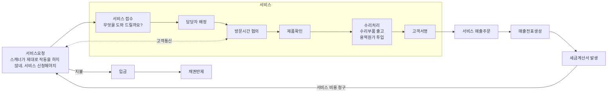

업무흐름: 실선 화살표 / 의사소통: 점선 화살표

범례: 서비스, 회계, 자재, 매출

[그림 22] IT 비즈니스 프로세스 사례

그러면 서비스 사원은 약속된 시간에 고객을 방문하여 제품의 상태를 확인한 후 수리 활동을 수행하고, 작업을 완료한 후 최
종적으로 고객에게 서명을 받아 작업완료에 대한 확인을 받게 된다. 유상 수리인 경우에는 고객에서 수리 대금을 청구하게
되는데 이는 기업에서의 매출이 생성되게 되는 것이다.

한편, 매출 금액과 용역에 대한 수수료를 정산하여 매출을 확정하면 세금계산서가 발행되고 고객에게 세금계산서가 전달되며
고객은 세금계산서를 수령하고 이를 근거로 대금 지불을 진행하게 된다.

고객에게 회수 받아 입금된 돈은 입금처리 프로세스를 통해 기발행된 매출 채권을 반제하여 정산처리하게 된다. 이러한 일련
의 프로세스가 서비스 활동을 통한 고객 서비스 제공과 기업 이익 창출이라는 2가지 활동을 가능하게 한다. 유상으로 서비스
를 진행함에 있어 관련되는 프로세스는 서비스, 회계, 자재, 매출(영업) 업무 도메인이 된다.

이러한 비즈니스 프로세스는 고정되어 있는 것도 있지만 대부분 변화하는 비즈니스 환경에 유연하게 개선되고 적응해야 한
다. 지속적으로 낭비요소와 병목 구간을 확인하고 신속한 업무 처리를 수행할 수 있는 환경을 보장해 줘야 하는 것이다.

<!-- PDF page: 066 -->

### 04 IT 비즈니스 프로세스 수행방법
#### 가) IT 비즈니스 프로세스 관리
IT 비즈니스 프로세스 관리의 핵심 기법은 BPM이다. BPM은 비즈니스 프로세스를 최적화하고 자동화한다. BAM은 비즈
니스 프로세스에서의 병목현상을 발견하고 관리하기 위한 기법이며, BRE는 비즈니스 프로세스의 흐름을 지정하고 관리
하는 역할을 하는 비즈니스 룰 엔진이다.
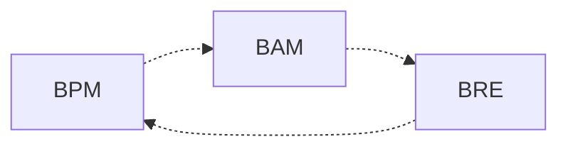


[그림 23] IT 비즈니스 프로세스 관리 개념도
##### ① BPM의 이해
BPM(Business Process Management)은 IT 비즈니스 프로세스에 연관된 사람, 정보자원, 업무의 흐름을 통합적으로 관리
하고 최적화, 자동화하는 기법을 말한다. 또한, IT 비즈니스 프로세스를 수행하기 위한 중요한 수단이며, 프로세스 관리가
얼마나 최적화되어 있는지가 경영성과로 직결될 수 있으므로 체계적 관리 기법이 필요하다. BPM은 경영환경변화를 민첩
하게 지원하여야 하며, 비즈니스 프로세스 변경에 능동적으로 대응할 수 있도록 설계되어야 한다.
〈표 21〉 BPM 설계단계


| 설계단계 | 주요수행활동 |
| --- | --- |
| 프로세스정의 | 핵심프로세스 대상을 정의하고 규칙을 발견한다.<br>프로세스를 분석하고 측정방법을 정의한다. |
| 프로세스실행, 운영 | 프로세스를 정의된 기준에 따라 실행하고 운영 관리한다.<br>사람과 사람, 시스템과 사람, 시스템과 시스템이 연계되도록 관리한다. |
| 모니터링, 통제 | 업무수행완료 시점, 수준, 수행과정 등에 대하여 모니터링을 수행한다.<br>프로세스 진행사항을 실시간으로 모니터링하고 기록 및 이력관리를 한다. |
| 프로세스 개선 | 프로세스 수행에 대한 KPI를 확인하고 비교 분석한다.<br>개선을 위한 시뮬레이션을 수행한다.<br>실행과 개선을 반복한다. |


##### ② BAM의 이해
BAM(Business Activity Monitoring)은 IT 비즈니스 프로세스를 최적화하기 위하여 프로세스를 실시간 모니터링하고 위험요
소를 사전에 인지하여 프로세스 상의 병목현상을 발견, 통제하기 위한 기법이다.

BAM은 실시간 분석을 위하여 확장된 BI(Business Intelligence) 기법을 함께 사용하기도 하며 BPM을 대상으로 프로세스 흐름을 모니터링하고 관리한다.

<!-- PDF page: 067 -->

〈표 22〉 BAM 기반기술


| 기반기술 | 설명 |
| --- | --- |
| 통합기술 | 주요 어플리케이션 간의 통합관리기술<br>EAI(Enterprise Application Integration) 활용 |
| BI (Business Intelligence) | 주요 업무 프로세스의 지표를 분석 |
| DW (Data Warehouse) | 집계, 통계분석을 통하여 업무 프로세스의 위험요소를 발견 |
| BPM | 프로세스상에서 비즈니스 이벤트를 분석하고 프로세스를 개선 |
| 시스템인프라 | 네트워크 및 통합시스템 관리<br>데이터수집, 분석, 가시화, 이벤트처리 등을 시스템으로 처리 |


##### ③ BRE의 이해
BRE(Business Rule Engine)는 기업의 복잡한 업무규칙, 프로세스 흐름 등을 정형화하여 프로세스를 효과적으로 관리, 자
동화, 최적화하기 위한 기법이며 IT 비즈니스 프로세스에서 처리하는 정보의 양이 많아지고, 프로세스 흐름이 복잡해지면
서 룰(Rule) 기반으로 관리할 필요성이 대두되었고 서비스 향상 및 비용절감 측면에서 필요하였다. 이런 이유로, BRE를 활
용하게 되면, 프로세스 변화관리에 능동적으로 대응할 수 있고, 프로세스 운영에 소요되는 비용을 절감할 수 있다.
〈표 23〉 BRE의 구성요소


| 구성요소 | 설명 |
| --- | --- |
| Rule Manager | 비즈니스 룰을 개발 및 관리하며 프로세스 라이프사이클을 관리한다.<br>비즈니스 룰을 저장할 저장소를 관리한다. |
| Rule Service | 룰 엔진의 서버역할을 수행하며 프로세스 간 인터페이스를 제공한다.<br>개발되어 반영된 룰을 배포하고 서비스 제공 역할을 한다. |
| Rule Monitoring | 프로세스 개선 활동 지원 및 비즈니스 룰 성능튜닝을 지원한다.<br>분석 및 통계기능을 제공한다. |
| Rule Repository | 비즈니스 룰을 저장하기 위한 저장소이다. |


#### 나) IT 비즈니스 프로세스 정보관리
IT 비즈니스 프로세스가 복잡해지고 기업의 내 외부 환경변화에 빠르게 대응하기 위해서 프로세스 상에서 발생하는 데이
터에 대한 체계적 관리가 필요하게 되었다. 프로세스에서 유발되는 데이터에 대한 관리는 크게 데이터에 대한 생명주기
관리(ILM, Information Lifecycle Management)와 정보자원관리(IRM, Information Resource Management)로 구분할 수 있다.
##### ① ILM의 이해
ILM(Information Lifecycle Management)은 데이터 또는 정보가 생명주기에 따라 가치가 달라지는 것에 대응하여 저장매체
를 분리하여 관리하는 일련의 프로세스이다.

데이터가 지속적으로 증가할수록 데이터 관리비용이 상대적으로 증가하게 되는데, 이에 반하여 데이터는 생명주기에 따
라 가치가 변하게 된다. 따라서 데이터 관리비용을 절감하고 데이터를 체계적으로 관리하기 위해서 ILM을 도입하게 된다.

<!-- PDF page: 068 -->

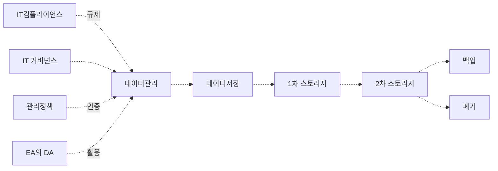

[그림 24] ILM의 개념도

ILM의 구성요소는 기업의 데이터관리 정책과 데이터를 관리하는 기술요소로 구분할 수 있다.
〈표 24〉 ILM의 구성요소


| 구분 | 구성요소 | 역할 |
| --- | --- | --- |
| 관리정책 | IT 거버넌스 | 데이터의 생성, 보관, 폐기 등의 가이드라인 제공 |
| 관리정책 | IT 컴플라이언스 | 법률, 제도, 정책 등의 기준 제공 |
| 관리정책 | 기업데이터 관리정책 | EA⁹의 DA¹⁰ 체계 및 데이터 운영 정책 |
| 기술요소 | 1차 스토리지 | 활용도와 가치가 높고 반복 사용하는 경우 고성능 고가 스토리지 활용 |
| 기술요소 | 2차 스토리지 | 활용도와 가치가 상대적으로 낮아 저성능 저가 스토리지 활용 |
| 기술요소 | 데이터 아카이빙 | 주기적으로 데이터를 보관할 수 있게 하는 기술이며 시스템이 자동으로 처리한다. |
| 기술요소 | 백업 | 테이프 라이브러리 또는 저가형 디스크를 활용하여 백업정책에 따라 별도 보관 |


##### ② IRM의 이해


IRM(Information Resource Management)은 IT 자원들의 효율적인 통합관리가 목적이다. 효율적인 통합관리라고 하는 것은
IT 자원에 대한 중복투자를 막고 투자대비 효율성을 높이는 것으로 인력, IT 장비, 자금, 산출물 등 모든 관련 IT 자원을 관
리하는 것을 말한다.

기업의 정보시스템 규모와 복잡성이 지속적으로 증가하고 있고 체계적인 정보자원 관리가 점차 필요하게 됨에 따라 정보
화 기획, 개발, 성과평가 등 정보화 절차 전반에 공통의 기준과 관리체계를 위하여 IRM이 필요하게 되었다.

IRM은 EA에게 정보자원에 대한 체계를 알려주고, EA는 IRM에게 전사 자원 체계 및 참조체계에 대한 가이드라인을 제시한
다. 즉, IRM과 EA는 상호 보완 관계이다.
9 EA: Enterprise Architecture
10 DA: Data Architecture, EA의 구성요소 중 데이터 아키텍처를 담당

<!-- PDF page: 069 -->

〈표 25〉 EA와 연관된 IRM 프로세스


| 프로세스 | 주요수행활동 | 산출물 |
| --- | --- | --- |
| 정보자원관리계획 | 정보자원관리에 대한 목표 및 전략수립과 경영진의 적극적 참여유도 계획을 수립한다. | 정보자원관리 계획서 |
| 조직체계 정립 | 아키텍처 팀 구성 및 위원회 구성<br>Chief 아키텍트 선정 | 팀구성도<br>업무분장도 |
| 아키텍처 수립 | AS-IS/TO-BE 아키텍처 수립<br>아키텍처 전환계획 수립 | 아키텍처 분석서<br>전환계획서 |
| 아키텍처 활용 | 투자계획 및 통제적용<br>정보자원 개발 및 운용에 활용한다 | 활용가이드라인 |
| 아키텍처 유지관리 | 지속적으로 아키텍처를 현행화 관리한다.<br>아키텍처와 정보자원간의 연계 평가를 수행한다. | 정보자원 활용결과 보고서 |
| 정보자원관리 수행평가 | 정보자원관리 수행 성과 평가를 실시한다.<br>지속적으로 개선을 위한 개선방안을 도출한다. | 정보자원관리 활용 분석, 평가서 |


### 05 IT 비즈니스 프로세스 개선기법
비즈니스 프로세스 개선은 급변하는 경영 환경 속에서 경쟁력 확보를 위해 필수 수단으로 인식되고 있다. 어느 기업이나 시
장 환경에 신속하게 대응하고 경쟁사보다 나은 가격 경쟁력을 갖추고자 조직을 구조화하여 효율성을 극대화하고 새로운 비
즈니스 모델이나 서비스 개발을 위해 기술 혁신에 주력한다. 이러한 비즈니스 목표를 실현하기 위해 기업은 여러 가지 혁신
기법들을 적용하여 개선하고자 노력한다. 이러한 노력에도 불구하고 많은 기업들이 시장 경쟁력이 약화되고 경제적 손실을
가져 오는 경우가 많은데 이는 기업의 규모나 구성원이 크면 클수록 관리하기 힘들어지고 실제 수행하는 업무 방식은 비현실
적이거나 비효율적인 요소들이 곳곳이 존재하기 때문이다. 아래에 소개된 BPR이나 PI와 같은 혁신 기법이나 6시그마 등과 같
은 관리 요소들이 비즈니스 프로세스를 개선할 수 있는 수단으로 전략적으로 활용되고 있다.
#### 가) BPR의 이해
BPR(Business Process Reengineering)은 1990년에 MIT의 마이클 해머 교수의 논문에서 처음 소개되었으며, 일본이나 한
국, 대만 등 아시아 국가의 제품이 미국 시장에 진출하면서 미국 상품이 시장 경쟁력을 상실하게 된 데에서 시작되었다.

경쟁력 저하의 원인을 분석해 보니 미국 상품이 제품 경쟁력에서 뒤처진 건 아니었지만 가격이나 품질 면에서 떨어지고
있다는 것을 주목하였으며, 소비자가 원하는 가치를 제공하기 위해 전체 업무 프로세스에 대해 관심을 가졌고 이를 해결
하기 위해 BPR을 제시하였다.
##### ① BPR의 개념
BPR은 비용, 품질, 서비스, 신속성 등의 경영 성과지표의 극적인 개선을 위해 비즈니스 프로세스를 근본적으로 재설계하
는 기법이다. 이러한 BPR은 크게 4가지 측면에서 특성을 가진다.
- 첫 번째는 '근본적인'이다. 기업의 가장 기본적인 문제를 다루고 업무를 무슨 목적을 바탕으로 수행하는지, 현재 문제는
무엇인지, 기업 활동에 있어서의 비효율적인 요소들을 밝히는 활동을 수행한다.
- 두 번째는 '제로베이스'로 불리는 영점출발이다. 기존의 업무 방식이나 프로세스를 완전히 버리고 과감하게 새로운 업무

<!-- PDF page: 070 -->

수행 방식을 설계하는 것이다.
- 세 번째는 '극적인 개선' 이다. 오직 확실한 혁신이 필요한 경우에 사용하고 점진적 개선보다는 획기적으로 대폭적인 개
선을 뜻한다.
- 네 번째는, '프로세스’다. BPR의 대상은 주로 업무 프로세스로 조직에 주어진 과업을 해결하기 위해 직무나 근로자, 조직
구조에 의지하지 않고 프로세스 중심적인 사고를 통해 문제해결을 시도하는 것이다. 즉, 비즈니스 가치를 이끄는 프로세
스를 조직에 내재화하는 것이 목적이다.
##### ② BPR 수행절차
〈표 26〉 BPR 수행절차


| 수행절차 | 설명 |
| --- | --- |
| 기업 목표설정 | 기업 비전과 프로세스 재설계의 목적 설정<br>원가절감, 시간절약, 업무 개선, 품질 증대 등 |
| 대상 프로세스 선정 | 주요 프로세스 식별 및 영역 설정<br>전략적 평가, 우선순위 식별 |
| 현행 프로세스 이해 | 선정된 프로세스의 이해 및 현재 작업 방식 확인<br>프로세스 성취도 평가 |
| 프로세스 목표설정 | 프로세스로 개선하고자 하는 목표를 설정<br>기업 비전과 목표와 연계 |
| 개선 프로세스 설계 | 설정된 프로세스 목표를 달성하기 위한 신 프로세스 설계 |
| 변화 모형 개발 | 개선 프로세스의 프로토타입 설계와 시범 운영<br>조직과 기술의 저항, 문제점 개선하여 조정 |
| 구현 | 현행 프로세스에서 개선 프로세스로의 전환<br>위험 부담 최소화 전략 |
| 운영 | 새로운 프로토타입을 운영하고 품질 경영으로 이행 |


#### 나) PI의 이해

##### ① PI의 개념


PI(Process Innovation)란 기업의 업무 프로세스, 조직, IT 등 기업 활동의 전 부분에 걸쳐 불필요한 요소들을 제거하고, 효
과적인 업무 프로세스를 재구축하여, 기업 가치를 극대화하는 경영 환경 개선 활동이다.

PI는 BPR과 유사하지만 미국의 데이븐 포트가 1993년 논문 ‘프로세스 혁신’을 발표하면서 소개되었다. BPR 기법에 정보기
술 통합 구축을 좀 더 강조한 것이 PI라고 이해하면 되겠다.

PI는 현재의 업무처리 방식과 정보 및 물류, 가치의 흐름을 고객 지향적으로 개선하여 기업 환경변화에 대응할 수 있는 구
조 확립을 목표로 하고 있으며, 국제적으로는 마이클 해머가 사용한 BPR이라는 용어를 많이 사용하나 국내에서는 삼성전
자가 최초로 PI라는 용어를 사용하고 포스코에서 PI 기반의 ERP 구축을 비즈니스 프로세스 개선을 위한 전략으로 채택하
면서 BPR보다는 광의의 의미로 많이 사용되고 있다.
##### ② PI의 수행절차 사례
일반적으로 PI는 실행 수단으로 정보기술의 구축과 연계되어 진행된다. ERP와의 접목을 통해 급진적으로 업무를 개선하

<!-- PDF page: 071 -->

는 것이 대표적인 사례이다. PI는 제도 및 프로세스에 대한 개선을 수행하고 이를 통해 정보화계획을 수립한 후, ERP든
CRM이든 실행 수단으로서의 계획된 항목을 실현하는 시스템을 구축하는 단계로 전개된다.
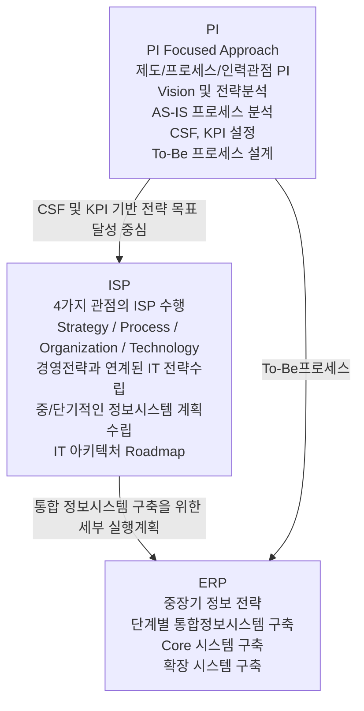

[그림 25] PI의 수행절차 사례

PI와 ERP의 관계를 보면 PI를 먼저 수행하여 제도/프로세스/인력 관점의 개선과 데이터와 프로세스의 통합을 위한 기반을
마련하고, 이어 통합 시스템을 구축하는 절차로 진행된다.
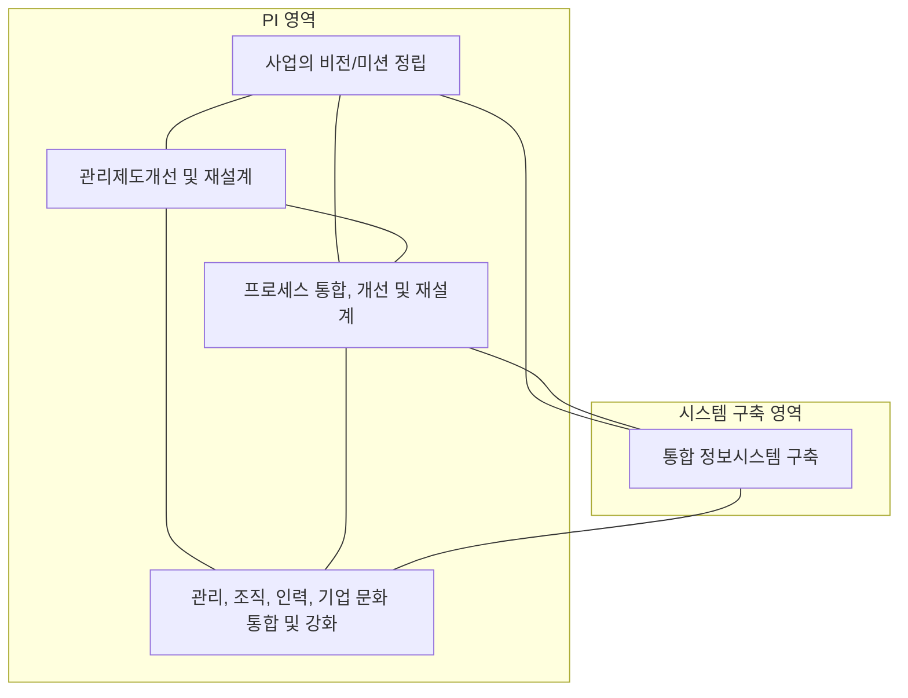

[그림 26] PI와 ERP의 관계

PI를 통하여 IT 비즈니스 혁신은 2가지 측면에서 접근할 수 있는데, PI를 통해 ERP를 도입하는 방법이 있고, ERP를 통해
급진적인 PI를 실현하는 방법도 있다. 각 기업의 상황에 맞게 전략적으로 도입 계획과 방향을 수립하여야 한다.

<!-- PDF page: 072 -->

##### ③ PI와 변화관리
프로세스를 혁신적으로 개선하고 나면 바뀐 프로세스에 조직이 적응하는 기간이 필요하다. 이 경우 조직의 생산성이 급속
하게 떨어지게 되는데, PI 프로젝트의 성공과 조직의 생산성 저하를 최소화하기 위해서는 프로젝트 수행 단계별로 기대,
저항, 불안, 의욕 등을 효과적으로 관리해야 한다.
[그림 27] PI의 변화관리

<!-- 생략: 그림 27 / 성과 변화 곡선 -->

혁신활동의 계획수립 및 수행 시 겪는 변화: 분석 설계 → Implementation 단계 → 안정화

높은 기대 / 실망 / 저항 / 모색 / 의욕, 높은 에너지 / 순응, 중간 에너지 / 성공적인 변화관리 / 덜 성공적인 변화지원 / 실패한 변화관리


| 주요성공요소 | 주요장애요인 |
| --- | --- |
| 최고경영층의 강력한 후원<br>전사적 공감대(변화의 필요성) 형성<br>현재 상황과 목표에 적합한 기법 선택<br>명확한 목표 및 계획에 따른 실천<br>유능한 내/외부 인력 활용 | 변화에 대한 조직원의 저항<br>최고경영층의 이해 및 지원부족<br>비현실적인 기대감<br>정보시스템 및 프로세스 개선 미비<br>부적절한 추진 팀의 구성 및 권한 부족 |


PI가 효율적으로 수행되기 위해서는 기업의 모든 임직원들이 변화에 대한 비전을 일관되게 숙지하고 공유되어야 하며, 변
화를 정착시키는데 필요한 활동들과 자원들을 조직화하고 전략을 수립해야 하며, CEO의 강력한 리더십과 적극적인 참여
도 반드시 필요하다. 리더는 변화의 완결을 독려하고 활동에 책임을 지며 이해관계자들의 적극적인 참여를 독려해야 한
다. 또한, 경영비전을 실현시키고 새로운 환경에서 효과적으로 업무를 수행할 수 있는 개인과 팀의 역량 또한 증가시켜야
한다.

PI의 변화관리에 성공하여야 비로소 PI도 안정적으로 정착할 수 있다. 조직의 변화에 대한 적응력이 결국 프로젝트의 성패
를 결정하게 되는 것이다.
#### 다) 6시그마의 이해
##### ① 6시그마의 개요
6시그마(6-Sigma)는 미국 모토로라가 1987년에 개발한 품질혁신 운동으로 100만개의 제품 중 3.4개 이하의 불량률을 목
표로 하고 있으며, 경영의 비효율성의 원인을 분석하고 수치화하여 6시그마 수준의 품질을 목표로 하는 경영혁신 활동이
다. 6시그마는 통계적 측도(Statistical Measurement)와 경영전략(Business Strategy), 그리고 일하는 방식의 전환(Philosophy)
을 중요한 3개의 축으로 보고 있다.
##### ② 6시그마의 특징
프로세스 혁신에 대한 통계적 측정을 중요하게 보고 계량화 및 객관적인 측정을 수행한다.

특정 부서, 팀, 영역에 국한되지 않고 경영전반의 전사적 프로세스 혁신 활동이다.
- 6시그마의 궁극적인 목적은 Value Chain의 끝에 있는 고객만족도와 고객가치 향상이다.
- 조직의 구성원이 모두 참여하여 지속적인 개선을 수행하는 열정적인 조직문화를 지향한다.

<!-- PDF page: 073 -->

##### ③ 6시그마의 계층
〈표 27〉 6시그마 계층


| 계층 | 자격 및 역할 |
| --- | --- |
| 챔피온 (Champion) | (자격) 기업의 임원으로 지도력을 갖춘 사람<br>(역할) 6시그마의 철학과 비전제시, 개념전파, 실행진두지휘, 자원제공 |
| 마스터 블랙벨트 (Master Black Belt) | (자격) 실무와 지식을 겸비한 사람<br>(역할) 블랙벨트, 그린벨트 교육, 6시그마 개념과 기법 전파 |
| 블랙벨트 (Black Belt) | (자격) 과장 및 대리급으로 통계적 지식 및 활용 가능한 사람<br>(역할) 6시그마 프로젝트 운영, 그린벨트 이하 교육 |
| 그린벨트 (Green Belt) | (자격) 업무지식과 경험이 충분한 사람<br>(역할) 6시그마 프로젝트 활용요원, 6시그마 기법의 실무적용 |


##### ④ 6시그마 수행방법론


6시그마 수행방법론은 설계부문과 제조부문으로 구분된다. 설계부문에서는 DMADV 방법론을 사용하고, 제조부문에서는
DMAIC 방법론을 사용하게 된다. 또한, 설계부문은 오류와 결함방지에 초점이 있으며, 제조부문에서는 결함 감소 및 재발
방지에 초점이 있다.
〈표 28〉 6시그마 수행방법론


| 구분 | 설명 |
| --- | --- |
| 설계부문 (DMADV) | 1.0 Define → 2.0 Measure → 3.0 Analyze → 4.0 Design → 5.0 Verify<br>핵심요구사항들과 고객의 기대사항을 능가하기 위한 프로세스 설계이며 오류와 결함 방지에 초점이 있음<br>새로운 제품이나 프로세스의 개발, 기존제품이나 프로세스를 재설계 함<br>— (Define) 사용자의 요구사항에 부합하는 디자인 활동의 목표 수립<br>— (Measure) 품질에 결정적 영향을 끼치는 요소 선별<br>— (Analyze) 디자인 가능성을 평가하고 최고의 디자인 개발을 위한 분석<br>— (Design) 세부사항, 디자인 최적화, 디자인 검증을 계획함<br>— (Verify) 디자인에 대한 시험작동, 제품개발 프로세스 적용 등에 대한 검증 |
| 제조부문 (DMAIC) | 1.0 Define → 2.0 Measure → 3.0 Analyze → 4.0 Improve → 5.0 Control<br>제조 및 생산, 양산활동에서 요구되는 결함 감소에 중점을 두고 반복적으로 개선함<br>이미 존재하는 제품이나 프로세스를 개선함<br>— (Define) 문제정의, 목표설정, CTQ(Critical to Quality) 도출<br>— (Measure) 측정항목선정, 측정방법 확립 및 현재 상태 파악<br>— (Analyze) 도출된 문제의 인과관계를 분석하고 근본원인 파악<br>— (Improve) 근본원인 제거 및 개선을 위한 최적 방안 도출<br>— (Control) 재발방지 및 지속적 개선상태 유지, 개선효과 분석 |

<!-- PDF page: 074 -->

#### 라) 트리즈의 이해
##### ① 트리즈의 개요
트리즈(TRIZ)는 구 소련 겐리히 알츠슐러(Genrich Altshuller)에 의해 제창된 발명문제의 해결을 위한 체계적 방법론이다.11
겐리히 알츠슐러는 1940년대 구 소련 해군에서 특허를 심사하는 업무를 수행하면서, 발명에는 어떤 공통의 법칙과 패턴이
있음을 발견하였다. 전 세계 특허 150만건 중에서 창의적인 특허 5만 건을 추출 분석한 결과 4가지의 중요한 발견을 하였
으며, 그 내용은 다음의 표와 같다.
〈표 29〉 4가지 중요한 발견


| 발견 | 설명 |
| --- | --- |
| 발명문제의 정의 | 발명문제는 적어도 한 개 이상의 모순을 가지고 있다. |
| 발명의 수준 | 발명은 5가지 수준이 있다. |
| 발명의 유형 | 발명의 유형에는 40가지의 원리가 있다. |
| 기술 시스템 진화유형 | 기술 시스템의 진화 유형에는 8가지 법칙이 있다. |


##### ② 트리즈 모순의 유형


트리즈는 모순의 유형을 물리적 모순과 기술적 모순으로 구분하고 있으며 물리적 모순은 주로 분리의 원리(Separation
Principle)를 통해 해결하고, 기술적 모순은 40가지 발명 원리(40 inventive Principles)와 76가지 표준 해결책(76 Standard
Solutions), 8가지 기술 시스템 진화법칙(Law of Technology Evolution), 자연과학의 각종 효과(Effects) 등을 통해서 해결
한다.
〈표 30〉 모순의 유형


| 구분 | 물리적 모순 | 기술적 모순 |
| --- | --- | --- |
| 의미 | Physical Contradiction<br>한 개의 변수가 상호 다른 값을 동시에 가져야 하는 경우 | Technical Contradiction<br>두 가지 변수 특성이 서로 상충되는 경우 |
| 해결방법 | 시간 분리(Separation in Time)<br>공간 분리(Separation in Space)<br>전체와 부분 분리(Separation in Scale)<br>조건 분리(Separation in Condition) | 40가지 발명 원리(40 inventive Principles)<br>모순행렬(Contradiction Matrix) |


##### ③ 트리즈를 경영기법에 활용하는 방법


트리즈는 공학분야뿐만 아니라 경영분야에서도 효율성을 인정 받고 있다. 또한 많은 연구 및 다양한 응용 사례가 지속적
으로 발굴되고 있다.
11 출처: 위키백과, TRIZ

<!-- PDF page: 075 -->

〈표 31〉 트리즈를 활용한 경영기법


| 구분 | 활용기법 |
| --- | --- |
| 경영지원 | 경영상의 어려움과 모순을 신속하게 해결<br>비용과 시간을 절약하고 공학적 기법으로 접근 |
| 혁신지원 | 타협을 지양하고 근본 문제 해결을 목적으로 함<br>근본 문제를 해결함으로써 혁신성 확보 |
| 사고적경영 | Think Process를 내재화한 경영기법 발굴<br>합리적 의사결정체계와 프로세스를 지원 |
| 융합경영 | 다양한 분야의 융합에 의한 시너지를 유발 |


#### 마) 서브퀄의 이해

##### ① 서브퀄의 개요


서브퀄(SERVQUAL)은 사용자의 서비스 기대품질과 기업의 서비스 제공품질 수준과의 차이(gap)를 분석하는 기법이다.
- 서브퀄은 5가지 차원을 기초로 사용자가 중요하게 생각하는 서비스 속성의 상대적 중요도를 고려하며, 우선 순위에 따
른 서비스를 제공할 수 있다.
- Parasuraman, Zeithaml, Berry 등에 의해서 1985년도 제안되었다.
##### ② 서브퀄의 5가지 차원
서브퀄은 유형성, 신뢰성, 반응성, 확신성, 공감성의 5가지 차원으로 구성된다.
〈표 32〉 서브퀄의 5가지 차원


| 구성차원 | 내용 |
| --- | --- |
| 유형성 (Tangibles) | 물리적인 시설, 장비, 복장, 외형, 장비 등 |
| 신뢰성 (Reliability) | 계약된 서비스를 수행할 수 있는 서비스 기업의 역량 |
| 대응성 (Responsiveness) | 서비스 제공과 고객에 대한 대응과 관련한 태도, 행위, 의지 |
| 확신성 (Assurance) | 조직 구성원의 지식과 예절, 신뢰와 확신 전달능력 |
| 공감성 (Empathy) | 서비스 기업이 고객에게 기울이는 관심과 노력, 배려 |


서브퀄의 5가지 차원은 10개 항목으로 세분화하여 조사 및 평가에 활용되고 있다.
- 유형성(Tangibles): 물리적 시설, 장비, 직원, 자료의 외향
- 신뢰성(Reliability): 약속한 서비스를 믿을 수 있고 정확하게 수행하는 능력
- 대응성(Responsiveness): 사용자를 기꺼이 돕고 신속한 서비스를 제공하려 하는 것
- 숙련성(Competence): 필요한 기술 소유 여부와 서비스를 수행할 지식소유 여부
- 예절(Courtesy): 일선 근무자의 정중함, 존경, 배려, 친근함
- 신용도(Credibility): 서비스 제공자의 신뢰성, 정직성
- 안정성(Feel Secure): 위험, 의심의 가능성이 없는 것

<!-- PDF page: 076 -->

- 접근가능성(Access): 접촉 가능성과 접촉 용이성
- 의사소통(Communication): 사용자들이 이해하기 쉬운 언어로 이야기 하는 것, 사용자의 말에 귀 기울이는 것
- 고객이해(Understanding the Customer): 사용자의 욕구를 알기 위해 노력하는 것
#### 바) SPC의 이해
##### ① SPC의 개요
SPC(Statistical Process Control)는 통계적 공정관리라고도 하며, 통계적 자료와 분석기법(S, Statistical) + 주어진 품질규격
과 공정의 능력상태(P, Process) + 원하는 상태로 제품 생산(C, Control)을 의미하는 합성어이다.

- SPC는 공정의 개선을 반복적으로 수행하고 만족스러운 제품이 높은 생산성을 확보할 수 있도록 하는 관리기법이다.
- SPC는 불량의 원인을 공학적으로 분석할 수 있게 하여 최적의 대책을 합리적으로 수립할 수 있게 한다.
##### ② SPC의 효과
SPC는 품질산포가 적고 보다 균일한 품질의 제품을 생산하도록 하는 것이 목표이다. 따라서 SPC적 관리를 통하여 공정변
동(Process Variation)을 줄여나가면 각 공정이 안정될 것이고, 그것은 결국 무결점(Zero Defect) 제품을 생산할 수 있는 기
반이 된다. SPC를 통하여 고품질의 제품을 생산할 수 있고, 제품 생산성을 향상시키며 원가절감에 크게 기여하여 기업의
이익창출에 중요한 역할을 하게 된다.
##### ③ SPC의 구성요소
〈표 33〉 SPC 구성요소


| 구성요소 | 설명 |
| --- | --- |
| 변동 | 제품의 품질특성의 하나로 어떤 기준값을 중심으로 산포되어 있는 값 또는 그 값의 흐름을 말한다.<br>주로 우연원인(Common Cause)¹², 가피원인(Assignable Cause)¹³으로 변동이 발생하게 된다. |
| 공정관리 및 공정능력 | 변동을 줄이기 위한 관리 능력<br>우연원인 및 가피원인을 반복적으로 제거하여 제품규격의 허용오차 범위 내에서 관리할 수 있도록 한다. |
| 산포 및 통계 | 우연원인 및 가피원인으로 유발된 변동의 흐름을 도식화한 것을 말한다.<br>최소한의 산포를 만드는 것이 중요한 목표이고, 목표를 달성하기 위해서는 우연원인을 지속적으로 관리하고 가피원인을 제거하여야 한다. |


위의 구성요소 이외에도 변동분석을 위한 통계적 데이터 수집이 필요하며 주로 작업일지, Check List, 검사기기 데이터 등
을 활용한다.

또한, SPC 분석을 위하여 관리도(Control Chart), 히스토그램, 산점도(Scatter Plot), 파레토(Pareto), 원인-결과 다이어그램
(Cause-Effect Diagram) 등의 통계기법들을 활용한다.
12 우연원인(Common Cause): 엄격하게 품질관리를 하더라도 불가피하게 변동을 유발하는 원인. 작업자 숙련도, 작업환경 변화 등으로 유발
되며 우연원인에 의해서만 품질변동이 존재하는 경우는 “통계적 관리”에 있다고 표현한다.
13 가피원인(Assignable Cause): 可避原因, 일반적이지 않은 원인이며 보통 때와는 다른 의미가 있고 산발적으로 발생하여 품질 변동을 일으
키는 원인. 작업자의 부주의, 생산설비 이상, 불량자재 투입 등

<!-- PDF page: 077 -->

### 참고 및 추천 자료

[1] 한관희, 비즈니스 프로세스 관리, 한경사, 2013.

[2] 랄프 스미스, 비즈니스 프로세스 경영과 BSC, 네모북스, 2011.

[3] Business process reengineering, wikipedia, 2018.

[4] methods zeithaml servqual ko, 12manage, 2018.

[5] TRIZ, TRIZ, 2018.

[6] 한국트리즈협회, 2018.

[7] 6시그마자격인증원, 2018.

[8] SERVQUAL, wikipedia, 2018.

<!-- PDF page: 078 -->

## VI. IT 비즈니스 서비스 이해하기
### 최근 동향 및 주요 이슈
IT 비즈니스 서비스를 제공함에 있어 가장 중요한 것은 서비스 품질이다. 품질은 고객의 눈높이, 즉 고객의 요구
수준에서 나온다. 따라서 IT 비즈니스 서비스를 제공하고자 한다면 고객의 요구수준을 정확하게 이해하는 것이
급선무이다.

IT 비즈니스 서비스는 복잡하게 얽혀있다. 내가 속한 기업을 중심으로 고객이 있고 협력업체(공급자)가 있다. 때
로는 협력업체가 중요한 고객이 될 수도 있다. 따라서 Value Chain에 소속된 다양한 이해 관계자와 자사 솔루션
의 연결과 통합적 분석이 반드시 필요하다.

과거에는 IT 비즈니스 서비스를 제공하기 위한 시스템이 단편적으로 끊어져 운용되었지만, 최근에는 구매 • 생
산 • 판매 • 사후관리의 사이클이 하나로 연결된 프로세스로 운용되는 추세이다.

따라서 협력업체의 서비스 품질이 곧 자사의 서비스 품질이기 때문에 서비스의 시작과 끝까지 지속적인 품질관
리가 필요하며 이를 위해서 기업 내부의 혈관과 같은 범용 시스템 간의 정보의 흐름을 체계적으로 관리할 필요
성이 있다.
### 학습 목표
1. IT 비즈니스를 위한 범용 업무지원시스템을 설명할 수 있다.
2. 비즈니스 가치 극대화를 위한 의사결정 지원시스템에 대해 설명할 수 있다.
3. IT 서비스관리를 설명할 수 있다.
### 핵심 키워드
엔터프라이즈 솔루션, ERP, SCM, CRM, PLM, EDW, DSS, BI, ITIL, SLA, SLM

<!-- PDF page: 079 -->

### 실무 미리보기

<!-- 생략: 대시보드 화면 / 세부 수치 판독 불가 -->
K사는 규모가 있는 무역회사로서, 고객과 함께 성장하는 e—Trade 세계일류 기업을 지향하고 있다. K사는 IT
자원에 대한 효율적인 유지보수 품질 향상과 안정적 인프라 운영 및 선진 운영 프로세스 적용 등의 목적으로
ITSM(IT Service Management)를 도입하기로 결정하였다.

K사는 ITSM에 대한 Global 표준을 활용하기 위하여 ITIL(IT Infrastructure Library) 기반의 프로세스, 서비스 수준,
인력 등에 대한 내용을 다음과 같은 기준으로 적용하였다.
- ITIL 기반의 프로세스 적용으로 ITSM 운영 효율성 제고
- 서비스 수준에 대한 투명한 관리 및 실시간 모니터링
- 효과적인 협력업체 관리를 통한 고품질의 서비스 유지
- 적극적인 장애예방 전략 확보 및 실시간 주요 Log 감시 및 분석
또한, ITSM의 가시화를 위하여 이벤트/성능관리, 구성관리, 장애관리, 보고서 관리와 Help Desk의 운영관리 부
문에 대하여 대시보드(Dashboard)를 도입하였다. 대시보드에서는 각 서버들의 장애현황이 심각도 및 유형별로
보고되고 개별 이벤트에 대한 신속한 인지기능을 제공하고 있어서, IT 서비스 제공에서 발생할 수 있는 여러 가
지 상황을 신속하게 인지하고 대응할 수 있는 체계를 제공하고 있다.

이에 따라, K사는 IT 서비스 제공 중에 발생하는 장애에 대하여 장애 발생과 동시에 장애 처리자에게 전달되어
신속한 조치가 가능하게 되었고, 발생한 장애에 대한 이력정보(Knowledge DB)를 관리하여 동일한 장애에 대한
재발 방지대책을 수립할 수 있게 되었다. 그리고, 시스템에 의한 SLM(Service Level Management)가 가능하게
되어 서비스 수준에 대한 종합적 평가와 고객과의 신뢰 형성에 큰 도움이 되었다.

<!-- PDF page: 080 -->

### 01 학습내용 요약
IT 비즈니스 서비스는 기업의 업무를 지원하는 범용 업무지원시스템과 의사결정권자의 의사결정을 지원하는 시스템, 그리고
IT 서비스를 체계적으로 관리할 수 있는 관리기법인 ITSM(IT Service Management)으로 이루어져 있다.

범용 업무지원시스템은 기업의 자원을 통합 계획하는 ERP(Enterprise Resource Planning)와 협력사와의 물류를 체계적
으로 관리하는 SCM(Supply Chain Management), 고객의 욕구를 분석하여 고객과의 관계를 긴밀하게 유지할 수 있는
CRM(Customer Relationship Management)을 중심으로 구성된다.

의사결정 지원시스템은 기업의 내/외부 데이터를 수집하여 분석할 수 있는 EDW(Enterprise Data Warehouse)가 중심이 되어
의사결정지원을 위한 BI(Business Intelligence)와 DSS(Decision Support System)로 이루어져 있다.

IT 서비스관리인 ITSM은 ITIL(IT Infrastructure Library)을 활용하여 IT 서비스 전반의 프로세스와 수행활동을 정의한다. 또한
ISO/IEC 20000과 같은 국제표준과 연계되어 IT 서비스의 품질을 개선하고 향상시킬 수 있으며, 서비스 수준에 대한 정의와
서비스 수준관리가 우선적으로 선행되어야 사용자가 만족할 수 있는 IT 서비스를 제공할 수 있다.
### 02 IT 비즈니스 범용 업무지원시스템
#### 가) 엔터프라이즈 솔루션(Enterprise Solution)
IT 비즈니스는 기업의 경쟁력 확보와 지속적인 혁신을 가능하게 하는 핵심 요소이며 과거에는 단순히 비즈니스 활동을
지원하는 도구였지만 오늘날은 극심한 경쟁 환경 속에서 살아남기 위한 도구로서 중요한 역할을 담당하고 있다.

기업형 컴퓨터가 처음 소개된 80년대 초반 이후 현재까지 약 30여 년의 짧은 역사 동안 컴퓨팅 파워의 비약적인 성장과
기업 업무에의 활용방식에 대한 많은 사례들이 이제는 정형화된 해결책, 즉 솔루션으로 발전하게 되었다.
- 엔터프라이즈 솔루션이란 기업에서 기본적으로 수행해야 하는 관리활동들을 지원하고 비즈니스 환경에서 경쟁우위를
확보할 수 있도록 업무효율성을 극대화하는 정보시스템을 통칭하는 용어이다.
- 엔터프라이즈 솔루션은 정보시스템이 제공하는 기능보다는 정의하게 될 비즈니스 프로세스와 활동에 따라 그 가치와
효용성이 달라지게 된다.
- 엔터프라이즈 솔루션은 광의의 개념으로 사전 준비에 해당하는 IT 기획, 실제 체계를 IT 시스템으로 구축하게 되는 업무
영역별 솔루션, 그리고 구축된 IT 시스템을 직접 운영하는 유지보수까지 포괄한다.

이와 같이 엔터프라이즈 솔루션은 기업의 업무효율성을 극대화하는데 초점이 맞춰져 있다. 업무효율성은 생산성 향상으
로 직결되고, 기업의 경쟁력 강화에 중요한 역할을 한다. 이러한 엔터프라이즈 솔루션의 주요 역할을 정리하면 다음의 표
와 같다.

<!-- PDF page: 081 -->

〈표 34〉 엔터프라이즈 솔루션의 주요 역할


| 주요 역할 | 내용 |
| --- | --- |
| 비즈니스 운영의 최적화 | 기업의 이익 극대화를 위해 비즈니스 운영에 대한 시간을 단축하고 비용 절감 수단으로 활용 |
| 비즈니스 프로세스 혁신 | 업무 프로세스의 혁신을 위한 구현도구(enabler)역할을 수행. 비즈니스 프로세스 재구축을 위해 필수적으로 동반 |
| 품질개선 | 기업이 정보기술을 활용하여 제품 품질을 개선 활동 수행<br>판매 데이터와 고객 관련 데이터를 기반으로 품질 개선 항목 도출 |
| 고객/공급사 관계 강화 | 고객과의 관계관리를 통해 충성고객을 확보하고 공급사와 지속적으로 관계를 개선하여 원가 감축과 제품공급을 원활하게 수행 |
| 의사결정의 질 개선 | 경영관리자가 의사결정을 하는데 필요한 실시간 시장 데이터의 접근이 가능하게 하여 적시에 적절한 의사결정을 할 수 있도록 정보 제공 |
| 경쟁우위 확보 | 기업 운영의 탁월성, 신규 제품 및 비즈니스 모델의 개발, 고객/공급사 관계 강화, 의사결정 개선 등 비즈니스 목표 달성 가능성 증대 |
| Time to Market 단축 | CAD/CAM 등의 기술을 통해 제품설계 시간 단축 및 IT 기반의 엔지니어링 프로세스 혁신으로 시장 초기 선점 가능 |


#### 나) 엔터프라이즈 솔루션의 종류
기업 활동에 필요한 다양한 솔루션들은 그 목적과 용도에 맞게 적절하게 이용되고 활용되어야 한다. 대표적인 엔터프라
이즈 솔루션을 몇 가지 살펴보면, 우선, 기업의 전체 자원을 최적화하고 분배하여 적절하게 배치하여 운영할 것인가에 대
한 방법을 제공해 주는 전사적 자원관리(ERP, Enterprise Resource Management)가 있다.
<!-- 생략: 그림 28 / 원래 영역 배치와 연결선 -->

재무/기업 전략관리 / 인적자원관리 / R&D / 구매 / 제조 / 마케팅·영업 / 서비스


| 구분 | 설명 |
| --- | --- |
| ERP | 전사적 자원의 최적 운영을 위한 기업 내 제반 기능들의 통합된 관리 체계 |
| EIS | 경영정보를 효과적으로 통합, 문제점을 분석하여 신속한 의사결정을 지원하는 정보관리체계 |
| HRM | 채용, 조직배치, 교육, 승진 및 퇴직 등 전반적인 인적자원 관리 활동을 지원하는 정보체계 |
| KM | 조직원의 지식 자원을 수집하고, 이를 생성/활용하는 일련의 활동 및 이를 지원/관리하는 정보체계 |
| PLM | 기업 내/외부에서 제품의 개발 및 제품 정보의 협업적 활용을 지원하는 제품 중심의 정보체계 |
| SCM | 고객의 주문에서 자재의 조달, 생산 및 배송까지 Supply Chain 전반에 걸친 제품 및 서비스, 정보의 흐름을 통합관리하고 Business Process를 최적화하는 정보체계 |
| CRM | 고객에 대한 정확한 이해를 바탕으로 고객이 원하는 제품과 서비스를 적기에 제공함으로써 기업이미지 및 브랜드 가치를 향상시키는 일련의 Process 및 정보체계 |


[그림 28] 엔터프라이즈 솔루션의 종류


원재료를 어떻게 적정수량만큼 구매하여 이를 제품 군으로 분류하고 고객이 필요로 하는 시점에 생산하여 배송까지 전체
구매, 생산, 물류에 이르는 공급망 전체를 통합적으로 관리하는 공급망 관리 시스템(SCM, Supply Chain Management)이
있다.

<!-- PDF page: 082 -->

고객에 대한 분석도 기업에 있어서는 매우 중요한 경쟁 요소이기 때문에 적절하게 고객의 니즈를 분석하고 고객에 대
한 서비스를 강화, 추가적 가치제공을 위해 고객 관계를 강화하는 해결책으로 고객 관계 관리시스템(CRM, Customer
Relationship Management) 이 있다.
#### 다) 비즈니스 전략과 엔터프라이즈 솔루션
엔터프라이즈 솔루션은 고객과의 커뮤니케이션, 제품 관리, 프로세스 통합 측면에서 유기적으로 연계되어 기업이 비즈니
스 전략을 효율적으로 수행하여 목표 달성을 이를 수 있도록 통합적으로 관리되어야 한다.

기업의 주변 환경은 시시각각 급변하고 있고 민첩하게 대응하여 생존하여야 하는 과제를 늘 안고 있다. 따라서, 환경변화
에 맞추어 전략의 수립과 변화가 불가피하고 전략적 목표에 부합하는 엔터프라이즈 솔루션의 도입은 필연적이다.

기업에서 요구하는 엔터프라이즈 솔루션은 수없이 많다. 다만, 대부분의 기업에서 어떠한 형태로든 도입하거나 구현하여
야 하는 솔루션은 몇 가지로 정의할 수 있다. 또한, 기업이 성장함에 따라 IT 컴플라이언스(Compliance)의 요구사항에 맞
추어 필연적으로 도입할 수 밖에 없는 경우도 있다.
<!-- 생략: 그림 29 / 비즈니스 전략 간 다중 연결선 -->

KM (Knowledge Management)


| Enterprise Solution |  |
| --- | --- |
| 공급망 관리–SCM | 비즈니스 파트너와의 협업 |
| 고객 관계 관리–CRM | 고객과의 커뮤니케이션 |
| 제품 수명주기 관리–PLM | 제품정보 |
| 전사적 자원관리–ERP | 프로세스 통합 |
| 전략적 기업 경영–SEM | 주주가치의 극대화 |
| 개인 포털–EP |  |

비즈니스 전략: 프로덕트 리더십(Product Leadership), 운영효율(Operational Excellence), 고객 친밀감(Customer Intimacy)

[그림 29] 비즈니스 전략 수행을 위한 엔터프라이즈 솔루션 개요도

위의 그림은 비즈니스 전략과 엔터프라이즈 솔루션의 상호관계를 표현하고 있다. 엔터프라이즈 솔루션은 각각의 쓰임새와 목
적에 따라 전략 항목(Strategy Item)과 연계된다. 바꾸어 말하면 전략과 전략의 세부 항목에 맞도록 엔터프라이즈 솔루션을 도
입하는 것이다.
#### 라) ERP의 이해
##### ① ERP의 정의
ERP(Enterprise Resource Planning)는 전사적 자원관리를 위한 솔루션으로 기업의 다양한 경영자원을 하나의 체계로 통합
하여 기업 생산성을 극대화하는 시스템이다.
- 기업의 주요업무 프로세스를 통합적으로 연계 관리하고 정보를 공유함으로써 전사적인 업무효율을 극대화하는 것을 목
표로 한다.

- 다양한 부분의 업무를 통합적으로 지원하여 업무 부분 간 유기적인 연동을 통해 데이터의 효과적인 공유와 조직의 유연
성 향상에 기여한다.

<!-- PDF page: 083 -->

〈표 35〉 ERP의 특징


| 특징 | 내용 |
| --- | --- |
| 통합성 | 연관관계가 있는 업무끼리 완벽한 연결을 통해 재무 및 회계, 제조 및 생산, 판매 및 마케팅, 서비스 등 기업의 전 업무가 작업의 중복 없이 통합되도록 설계 |
| 유연성 | 사용자 정의 방식으로 구성되어 개개의 기업과 사용자가 업종 고유의 업무를 설정을 통해 유연하게 사용할 수 있도록 손쉽게 구성 |
| 개방성 | 국제적으로 인정된 표준에 맞게 설계되고 다양한 플랫폼과 하드웨어, 소프트웨어와 통합 연계할 수 있도록 개방된 구조를 지향 |
| 국제성 | 다국적 기업이 사용가능하도록 다양한 언어를 지원하고 국가별 다른 조세사항이나 주소관리 체계, 화폐 등의 Local 정보를 관리할 수 있도록 설계 |


##### ② ERP의 구성


구매, 생산, 물류, 마케팅, 판매, 서비스, 재무, 회계, 인사에 이르는 기업을 구성하는 대부분의 업무기능은 상호 간의 유기
적인 연계와 자원배분의 균형을 이를 수 있도록 구성되어 있다.

예를 들어, 고객이 주문을 하면 이를 영업담당자가 ERP시스템에 입력하고 확정된 주문은 제품을 얼마에 어디로 언제까지
배송해야 한다는 정보를 필요 부서에 전달하면 마찬가지로 그 주문을 충족하기 위해 원재료는 언제 얼마나 어느 가격에
구매 하는지에 대한 정보를 필요부서에 전달하게 된다. 해당 주문을 위해 공장에서는 일정에 맞춰 생산하고, 생산된 결과
는 또다시 ERP 시스템에 입력되어 배송부서로 연계되고 고객이 원하는 기간 내에 배송하게 된다.

이러한 작업들이 유기적으로 이루어질 수 있는 환경을 ERP 시스템이 제공하는 것이다.
<!-- 생략: 그림 30 / 원형 배치와 연결선 -->

Enterprise Resource Planning


| 구성 | 업무 |
| --- | --- |
| Customer Relationship Management | 고객관리<br>프로모션관리<br>견적관리 |
| Supply Chain & Vender Management | 구매관리<br>물류관리<br>배송관리 |
| Projects And HR Management | 인사관리, 교육관리<br>출장관리, 급여관리<br>근태관리 |
| Manufacturing Production & Service Management & Delivery | 생산관리, 자재관리<br>가격관리, 판매관리<br>주문관리, 서비스관리 |
| Finance and Accounting | 채권관리, 자금관리<br>원가관리, 총계정원장<br>수익성분석 |


| 구분 | 내용 |
| --- | --- |
| 통합 비즈니스 프로세스 | 다양한 비즈니스 프로세스 지원<br>업무 모듈들의 상호 유기적인 연결 |
| 통합 데이터 베이스 | 전사적 차원의 통합 데이터베이스<br>여러 분야의 비즈니스 프로세스에 의해 공유 |
| 업무처리 메뉴얼과 표준 제공 | 다양한 경영기법의 도입<br>표준 업무 프로세스 기반<br>업무 재설계(BPR) 기능 |


[그림 30] ERP의 구성

##### ③ ERP 구축절차


ERP 구축은 단순히 시스템 도입 측면이 아니라 전사 업무 혁신의 개념에서 접근해야 하며 기업의 기존 업무를 분석하여
문제점과 개선 포인트를 도출하고 프로세스혁신(PI) 활동을 통해 급진적인 변화를 꾀하여 전사적으로 통합되고 일관된 업
무처리 기준과 관점을 가질 수 있도록 업무 활동부터 혁신해야 한다. 이를 위해 ERP 구축 프로젝트는 CEO의 적극적인 지
지와 전사차원에서 이루어져야 성공할 수 있다. 일반적인 ERP 구축 프로세스를 살펴보면 다음과 같다.

<!-- PDF page: 084 -->

〈표 36〉 ERP의 구축 프로세스


| 구축단계 | 내용 |
| --- | --- |
| 프로젝트 착수 | 프로젝트 계획서 작성<br>품질보증 계획서 작성 |
| 분석 | 현행 프로세스 분석<br>미래 프로세스 분석<br>갭 분석<br>갭(GAP) 대응방안<br>모듈 교육, 제공언어 교육 등의 패키지 교육<br>프로세스 설정, 기능(Function) 설정, 마스터 데이터 설정<br>인터페이스 정의 및 프로토타이핑 작성 |
| 설계 | 추가 개발 설계<br>데이터 코드 설계<br>테스트 계획 수립<br>인터페이스 설계<br>구현 |
| 개발 | 기능 개발<br>단위시험 실시<br>회귀시험 실시: 기존모듈과 신규개발 모듈과의 연계 테스트<br>외부 연계(인터페이스) 통합테스트 |
| 구현 | 데이터 컨버전<br>시스템 사용교육<br>시범운영 |


##### ④ ERP 구축전략


ERP 구축을 위한 접근 방법은 대표적으로 ERP 시스템에서 제공하는 모든 모듈과 기능을 기업의 전 사업장이 동시에 도
입하는 방식인 빅뱅(Big Bang) 방식과 ERP 시스템의 모듈을 기능적으로 분리하여 일부 모듈에만 적용하는 방식인 기능별,
단계별 접근방식, 각 사업장별로 ERP 시스템의 구축을 먼저 수행하고 안정화되면 수평 전개하는 방법으로 사업장별 단계
별 접근 방법이 있다.
〈표 37〉 ERP의 구축전략


| 방식 | 내용 | 장점 | 단점 |
| --- | --- | --- | --- |
| 빅뱅방식 | ERP의 모든 모듈 및 기능을 기업에서 필요로 하는 모든 영역에 동시에 도입하는 방식 | 패키지 자체의 통합성 구현이 용이함 | 프로젝트 범위가 크므로 프로젝트관리가 다소 어려움 |
| 기능별, 단계별 접근방식 | ERP 모듈을 기능별, 단계적으로 구축하는 방식 | 단계적으로 적용하므로 사업장 변화에 대한 반발이 적음 | 기존 시스템과의 연계를 위한 추가 프로그램을 개발하여야 함 |
| 사업장별 접근방식 | ERP 모듈을 사업장별, 단계적으로 구축하는 방식 | 단계별 투입인력의 재활용으로 인력 활용도가 좋음 | 프로젝트 기간 장기화 문제 및 업무중복 발생 가능성 높음 |

<!-- PDF page: 085 -->

ERP 솔루션에는 외산 제품과 국산 제품이 있고, 구축 전략에 따라 인하우스로 개발하는 경우도 있다. 외산 제품은 SAP
ERP, Oracle ERP가 대표적이며, 국산 제품은 영림원 ERP 및 더존 ERP가 대표적인 제품이다. 상용 ERP 제품을 도입하는
것은 ERP 표준프로세스를 활용할 수 있는 것이 큰 장점이지만 기업의 환경에 최적화된 맞춤개발은 다소 어려울 수 있다.

또한, ERP 도입에 주의하여야 할 것은 ERP 도입 기업이 IFRS(International Financial Reporting Standards)¹⁴, 즉 국제회계기
준을 적용 받는지 여부도 판단하여야 한다.
#### 마) SCM의 이해
##### ① SCM의 개념
SCM(Supply Chain Management)은 공급망 관리 솔루션을 의미한다. SCM을 이해하려면 공급망(Supply Chain)에 대한 이
해가 필요하다. 공급망이란, 제품을 생산하기 위한 원자재의 수급에서부터 생산과정, 유통망을 통해 최종 고객에게 전달될
때까지의 모든 과정을 의미한다.

공급망의 가장 큰 문제는 공급 사슬을 거슬러 오르며 의사결정이 이루어져 수요 변동이 급속하게 확대되는 현상인 채찍
효과(Bullwhip Effect)이다. 즉, 제품에 대한 최종 소비자의 수요에 조그마한 변동이 생기면 그 변동량이 소매업체, 도매업체,
제조업체, 부품 공급업체 등 공급망의 위로 올라갈수록 그 변동폭이 커지게 되는 현상을 의미한다.
```mermaid
flowchart RL
    A["소비자 (consumer)"] -->|Sales| B["소매업체 (retailer)"] -->|Order| C["도매업체 (wholesaler)"] -->|Order| D["제조업체 (manufacturer)"]
```

채찍효과(Bullwhip Effect): 공급사슬 상류(upstream)로 갈수록 주문량의 변동이 증가

<!-- 생략: 그림 31 / 시간에 따른 주문량 곡선 -->

[그림 31] 공급망의 채찍 효과(Bullwhip Effect)

위 그림에 제시된 것처럼 소비자의 구매수량이 늘어나게 되면 소매상이 도매상에게 10을 주문할 경우 도매상은 제조업체
에게 만약을 위해 12개를 주문하게 되고 제조업체는 만약을 대비하여 15개를 제조하는 현상으로, 공급망에는 과다한 재고
가 존재하게 되고 불필요한 인력과 시설투자로 공급망 전체의 자원을 낭비하게 된다.

이렇게 시장의 수요가 공급망의 상부 단계로 전달될수록 각 단계별 수요가 왜곡되어 변동성이 증가되면 최종 원자재를 공
급하는 업체의 위험이 증가되게 된다. 이는 공급망 전체의 수요 불균형으로 인해 과잉주문, 과잉재고, 과잉투자 등 공급망
전체의 비효율성을 심각하게 증가시킨다. 따라서, 공급망 관리란 이러한 채찍효과를 해소하고 공급망 전체의 낭비를 제거
14 IFRS: 기업의 회계 처리 기준에 대해서 국제 통용성을 확보하기 위하여 국제회계기준위원회에서 공표한 국제회계기준

<!-- PDF page: 086 -->

하여 효율을 극대화시키고자 하는 전략이다.

좀 더 상세히 설명하자면, 공급망의 주체들이 서로 협력하여 자재, 자금과 정보를 통합 관리하여 공급자에서부터 구매, 제
조, 분배, 유통을 거쳐 최종 소비자에게 이르는 모든 재화 및 서비스, 가치의 흐름을 연계하고 통합하여 리드타임을 단축하
고 불확실성을 줄여 변동성을 감소시키기 위한 활동이다. 이러한 활동들을 지원하고 공급망 상에 발생하는 문제점을 해결
하는 것이 SCM의 목표이다.

제품 생산에서 유통에 이르는 전체 프로세스에 걸쳐 협력업체와의 정보 공유, 협업 등을 통해 재고관리 등 공급망 의사결
정에 있어 최적화를 추구하는 경영기법이다.
<!-- 생략: 그림 32 / 세부 문구와 복잡한 공급망 연결 도식 -->

[그림 32] 공급망 관리 개념도


공급망 관리(SCM)를 실현하기 위해서는 공급망 계획(SCP: Supply Chain Planning)과 공급망 실행(SCE: Supply Chain
Execution) 측면의 기능이 요구된다.
##### ② SCM의 기능
SCM은 공급망 계획과 공급망 실행, 공급망 가시화의 기능을 가지고 있다. 이러한 3가지의 기능은 순환구조를 가지고 있
어서 업무환경의 변화에 따라 기능 개선이 가능한 구조이다.
〈표 38〉 공급망 관리의 기능


| 기능 | 내용 |
| --- | --- |
| 공급망 계획 (Supply Chain Planning) | 수요예측, 글로벌 생산계획, 수송/배송계획, 분배할당계획 등 공급사슬의 일상적 운영을 위한 최적화된 계획 수립 |
| 공급망 실행 (Supply Chain Execution) | 창고, 제품 수송/배송관리, 주문관리, 유통관리 등 주로 현장 물류의 효율화와 바코드, RFID 등 디지털 도구와 인터페이스를 통해 현장 물류 관리 |
| 공급망 가시화 (Supply Chain Visibility) | 공급망을 모니터링하는 기능으로 공급망 전반에 걸쳐 비용, 성과 및 서비스 측면에서 운영 상태의 이상 유무를 식별하고 개선안을 도출하여 사전에 예방 기능 제공 |

<!-- PDF page: 087 -->

##### ③ SCM과 ERP의 비교
SCM과 ERP는 기업 내부에서 활용하는 중요한 업무지원시스템의 한 부분이다. ERP에 대비한 SCM의 중요한 특징은 물류와
유통관리에 있다. 최근의 ERP에서는 SCM의 일부 프로세스를 포함하는 경우가 있으나 상세한 흐름은 SCM에서 관리된다.
〈표 39〉 SCM과 ERP의 비교


| 구분 | 공급망 관리(SCM) | 전사적 자원관리(ERP) |
| --- | --- | --- |
| 주요 관점 | 계획 수립 및 의사결정 | 업무 프로세스 중심 |
| 데이터 처리 | 프로세스 중심 | 트랜잭션 중심 |
| 주요 기능 | 수요 예측, 주문 관리/계획, 물류관리, 창고관리 등 | 구매, 생산, 자재, 재무, 회계, 영업, 인사 등 |
| 업종 | 제조, 유통이 주요 시장 | 제조, 공공, 금융 등의 전 업종 |
| 업체 규모 | 영세 제조업체의 경우에도 재고를 줄여 도입효과 가능 | 주로 대기업위주로 운영되며 중소기업의 경우 도입 시 효과(ROI)를 고려하여야 함 |
| 도입 효과 | 판매 기회에 맞는 생산 수요 예측이 가능하고 재고관리에 효과적 | 업무 프로세스 단축, 인건비 감소 |


##### ④ SCM의 도입효과


SCM을 가장 성공적으로 도입한 기업인 델 컴퓨터는 공급망 관리를 도입한 후 고객, 델, 부품 공급사 간의 정보를 실시간
으로 연계하고 재고량이 공급망 관리 전 8주분에서 적용 후 12~15일분으로 줄어들게 되었다고 한다.
- 이처럼 공급망 관리의 도입은 수송 배송 역량을 증가시키고 재고를 감소시켜 물류 비용을 줄여주고 철저한 납기 관리로
고객 주문처리 시간을 단축하여 고객만족도를 향상시킬 수 있다.
- 또한 업무의 표준화와 제품 납기, 수주 처리 시간을 단축하여 자금 흐름의 효율성을 향상시킬 수 있다.
#### 바) CRM의 이해
CRM(Customer Relationship Management)은 고객관계관리를 말한다. 고객들의 성향과 요구사항을 미리 파악하여 고객이 원
하는 제품을 만들고 마케팅 전략을 개발하기 위한 경영 전략 체계이다.

오늘날 고객은 제품 및 서비스 정보에 대한 고객 지식이 확대되고 고객의 기대 수준 및 고객 이탈이 증가하기 때문에 기업은
고객 중심적 기업 구조와 다양한 고객 접점 채널 확보, 수익성 높은 고객관리 등 새로운 경영전략을 수립해야 한다.

이를 위해 고객들의 행동패턴, 소비패턴 등의 분석이 필요하고 최근에는 빅데이터 분석과 같이 기업이 내 외부 데이터를 통
합하여 시장과 고객에 대해 분석하여 인사이트를 제공하는 작업이 필요하다.
```mermaid
flowchart LR
    subgraph 가망고객
        A[목표시장]
    end
    subgraph 반응고객
        B[응답고객]
    end
    subgraph 구매고객
        C[신규고객]
        D[고부가가치 고객]
        E[잠재가치 고객]
        F[저부가가치 고객]
    end
    subgraph 이탈고객
        G[자율적 이탈고객]
        H[강제적 이탈고객]
    end
    A --> B --> C --> E
    D --> G
    D --> H
    E --> G
    E --> H
    F --> G
    F --> H
```

[그림 33] 기업 고객의 라이프사이클

<!-- PDF page: 088 -->

- 기업이 목표로 하고 있는 시장의 고객의 그룹인 가망 고객 중 제품에 관심을 보이는 반응고객을 대상으로 기업은 집중
적으로 마케팅이나 프로모션을 진행하여 신규 고객 창출의 기회를 얻게 된다
- 제품을 구매한 고객 또한, 고객 충성도에 따라 부가가치가 높은 고객을 전략적으로 관리하기 위해 성격이나 유형, 관심
도 등 다양한 관점과 기준으로 분류하고 최적화된 서비스와 마케팅을 수행할 수 있도록 시스템을 갖추는 것이 필요하다.
- 이를 통해 기업은 개별 거래에 의해 발생하는 일시적 수익성보다는 고객 라이프사이클 전체에서 발생하는 총 가치인 고
객 평생가치(Lifetime Value)를 극대화하는 전략을 수립해야 하는데 이것이 CRM의 목표인 것이다.
##### ① CRM의 정의
가트너(Gartner)에서 정의한 CRM은 '수익성 높은 고객과의 관계를 창출하고 지원함으로써 기업 매출을 최적화하고 고객기
반을 확충하는 전략’이다. 즉, 기업 전반의 고객 데이터와 기업 내/외부의 고객 관련 데이터를 통합하여 분석하고 이를 다
양한 고객 접점에 제공하여 기업과 고객이 상호작용하는데 활용하는 경영기법이다. 이는, 고객에 대한 정확한 이해를 바탕
으로 고객이 원하는 제품과 서비스를 지속적으로 제공하여 고객 평생가치를 극대화하여 수익성을 높일 수 있는 통합된 프
로세스인 것이다.
##### ② CRM의 분류
CRM은 프로세스 관점에 따라 기업이 고객과 발생한 다양한 데이터를 수집하고 의미 있는 정보로 분석하여 제공하는 분
석 CRM과 이를 바탕으로 마케팅, 서비스, 영업 활동이 주축이 되는 운영 CRM, 다양한 채널을 통해 고객과 상호작용을 하
는 협업CRM으로 분류된다.
```mermaid
flowchart LR
    subgraph A[분석 CRM]
        A1[운영 DB 1] --> D[Data Warehouse]
        AN[운영 DB n] --> D
        D --- M[Marketing Data Mart]
        D --- S[Sales Data Mart]
        D --- V[Service Data Mart]
        M --- J(( ))
        S --- J
        V --- J
        J --> X[Vertical Apps]
        J --> Y[OLAP]
        J --> Z[Data Mining Tool]
    end
    subgraph B[운영 CRM]
        E[ERP] <--> J2(( ))
        SC[SCM] <--> J2
        R[거래선] <--> J2
        J2 <--> MA[Marketing Automation]
        J2 <--> SA[Sales Automation]
        J2 <--> SV[Service Automation]
    end
    subgraph C[협업 CRM]
        C1[콜 센터]
        C2[모바일/SMS]
        C3[서비스센터]
        C4[FFA]
        C5[...]
    end
    A <--> B
    A <--> C
    B <--> C
```

[그림 34] CRM의 분류

CRM을 분류에 따라 구분을 나누어 둔 것은 어디까지나 이해를 돕기 위한 것이고, CRM이 최종적으로 바라보는 영역은 고
객이다. 고객을 정확하게 이해하기 위해서 데이터 분석이 필요하고 업무지원시스템의 도움도 필요하다. 또한, 고객과의 다
양한 접점(Channel)도 필요하게 된다.

다음의 표는 이러한 CRM의 속성들을 분류별로 비교하여 설명한 것이다.

<!-- PDF page: 089 -->

〈표 40〉 CRM 분류 비교


| 구분 | 운영 CRM | 분석 CRM | 협업CRM |
| --- | --- | --- | --- |
| 개념 | 고객접점에서 고객 관리 지원<br>고객접점에서 마케팅 및 고객서비스<br>연결, Front Office영역, 비즈니스 프로세스 및 업무지원을 위한 통합 자동화 기능 제공 | 운영업무에서 발생하는 데이터를 이용하여 마케팅 분석과 판매 분석 작업 지원<br>DW와 필수적으로 연계 | 고객과의 접촉 채널 지원<br>고객과 기업, 기업 내의 조직 간에 업무 일원화와 커뮤니케이션을 목적으로 상호연관 서비스 지원 |
| 구성요소 | 마케팅 정보관리<br>캠페인 관리 시스템<br>SFA(Sales Force Automation)<br>고객 서비스 시스템 | 전사적 DW 구축<br>Data Mining<br>OLAP | 콜센터(Call Center)<br>Mobile 협업 시스템<br>eCRM |
| 고려사항 | 채널별 프로세스의 통합, 고객 접촉 이력의 통합관리<br>Business 기능 신속한 구현<br>Back Office와의 연계를 통합적으로 제공 | 고객의 요구(Needs)를 파악하기 위한 분석방법 및 기술 제공<br>지식 베이스 구축 및 데이터 신뢰성 확보가 관건 | Channel의 다양화<br>모든 채널이 일관된 서비스를 제공 |


##### ③ CRM 시스템 구성


CRM은 고객의 접점으로부터 정보가 시작되고 고객의 접점에서 정보가 종료된다. 이러한 정보의 흐름 속에 업무지원시스
템에서 생성된 정보가 활용되고 업무 프로세스가 함께 동작하게 된다
<!-- 생략: 그림 35 / 복잡한 다중 연결선 -->


| 구분 | 내용 |
| --- | --- |
| 고객 | 거래선, 소비자, 협력업체, 사내고객, 기타 |
| Channel | 영업사원 활동<br>Customer Center: 주문/수주, 고객대응, 정보접수등록, 정보 F/B<br>E-Business |
| 처리 유형 | 고객관리<br>주문/배송<br>SFA: 영업기획, 고객관리, 영업성과분석<br>마케팅: 시장분석, 마케팅기획, 수행<br>고객 서비스: 불만/Claim, 개선/제안, 문의<br>DW: Data Mart, OLAP, Data Mining |
| Fedd/Back | CRM Hub<br>C/C Feedback<br>TCC<br>CS전담 처리부서<br>ERP<br>거래선, 소비자, 협력업체, 사내고객, 기타 |

정보 수집 / 정보 분석 / 정보 활용

[그림 35] CRM 시스템의 구성도

CRM에서 고객 접점은 중요한 의미를 가진다. 접점 즉, 채널은 고객의 VoC(Voice of Customer)를 수집하고 내부 프로세스
로부터 도출된 결과를 고객에게 전달한다. 따라서 CRM의 구성요소를 파악하고자 할 때 고객 접점인 채널을 먼저 분석하
는 것이 좋다. 그리고, 정보 분석과 정보 활용을 위한 순서로 파악을 하게 되면 CRM의 구성요소를 쉽게 이해 할 수 있다.

<!-- PDF page: 090 -->

〈표 41〉 CRM 시스템의 구성요소


| 구성요소 | 내용 |
| --- | --- |
| 고객 데이터 웨어하우스 | 고객에 대한 정보를 보관하는 데이터 저장소로, CRM의 각 구성요소들은 데이터 웨어하우스로부터 필요한 정보를 추출·갱신·추가 |
| OLAP, 데이터 마이닝 | OLAP, 데이터 마이닝은 데이터 웨어하우스 정보를 활용하여 고객에 대한 다양한 분석과 도출된 지표 간의 상관관계를 조사하여 고객화 작업에 대한 의사결정을 지원 |
| 캠페인 시스템 | 고객의 요구사항에 대하여 맞춤형 서비스를 제공하고 이익을 창출할 수 있도록 비즈니스 방향을 제안하는 시스템 |
| 채널 시스템 | 1:1 또는 1:N의 다양한 마케팅을 지원하기 위한 시스템<br>콜센터(Call Center), 이메일 DM(Direct Mail)발송 등의 기법 활용 |
| SFA | 영업기획, 고객관리 및 영업성과분석을 주목적으로 고객에 대한 정보를 활용하고 영업사원의 활동을 지원하는 시스템 |
| 고객 서비스 시스템 | VoC(Voice Of Customer)를 활용하여 대고객 서비스 지원 및 제품 유지보수(A/S) 등에 활용하는 시스템 |


##### ③ CRM의 도입 효과


CRM의 도입으로 기업은 고객과의 관계를 개선하고 고객 이탈을 방지하여 고객의 충성도(Loyalty)를 높일 수 있다. 또한,
고객의 성향을 분석하여 고품질의 서비스를 제공하고 연계 판매와 상향 판매를 촉진할 수 있으며 제품과 서비스 등에서
차별화된 정책을 통해 대고객 경쟁우위를 확보할 수 있다.
〈표 42〉 CRM 도입효과


| 항목 | 도입 효과 |
| --- | --- |
| 마케팅 기회 분석 | 신규고객 유치 및 기존 고객의 활성화<br>수익 및 고객 평생 가치(LTV) 증대<br>고객 라이프 사이클 기반의 효과적 마케팅 활동 수행 |
| 마케팅 관리 | 시장변화 및 고객의 요구에 맞는 상품 개발<br>상품에 대한 시장 반응 및 결과 보완 |
| 고객 서비스 | 고객 충성도(Loyalty) 증대<br>고객만족도 관리<br>고객 서비스 관리 |
| 고객채널 관리 | 고객 요구에 맞는 최적 채널 제공<br>고객 관리 비용 최소화 |


#### 사) PLM의 이해


PLM(Productive Lifecycle Management)은 제품 생명주기 관리 솔루션이다. 제품 설계도부터 최종 제품 생산에 이르는 전
체과정을 일관적으로 관리해 제품 부가가치를 높이고 원가를 줄이는 생산/설계 프로세스다. PLM에는 제품 수명주기와
관련된 제품정보 데이터 및 관리서버 시스템과 다수의 클라이언트 시스템의 네트워크 시스템 등이 제공된다.
##### ① PLM의 정의
기업에서 생산/제조하는 제품 라이프사이클(Lifecycle) 전반에 걸쳐 도면/문서, CAD/CAM 정보, 부품 기본정보, 설계변경,
프로세스 정보 등 제품에 관련된 정보를 통합 관리하는 지원체계를 의미한다.

<!-- PDF page: 091 -->

##### ② PLM의 구성
최근의 PLM은 제품의 기획에서부터 판매 이후의 사후 서비스까지 포함하는 개념으로 설명하고 있다. 제품을 기획하고 판
매하기까지 제품 단위로 전체의 사이클을 관리하는 것은 PLM의 핵심적 역할이지만 이 목표를 달성하기 위해서 다른 업
무지원 시스템의 유기적 지원은 필수 요건이다. 따라서, PLM의 구성요소를 이해하기 위해서는 제품의 전체 생명주기(Life
cycle)의 흐름을 상상해보는 것도 도움이 된다.
<!-- 생략: 그림 36 / 다중 연결선 및 CAD 화면 -->

PLM System


| 단계 | 내용 |
| --- | --- |
| 상품 기획 단계 | 고객요구사항, RFP/RFI<br>상품 발의<br>상품 기획서<br>Model Code<br>Product Code<br>FG Code |
| 개발 계획 단계 | 제품개발계획<br>공정개발계획<br>제품 개발 계획서 |
| 개발 구현 단계 | 도면, 기술문서<br>ITEM Master<br>ECR, ECN<br>E-BOM<br>Pre M-BOM<br>CAD 시스템 |


| 연계 | 내용 |
| --- | --- |
| Groupware | 결재요청 |
| EDMS | 신규등록문서 |
| ERP | 신규부품 / ERP I/F / 신규부품<br>ITEM, M BOM |
| MES | 신규부품 / ERP I/F / 신규부품<br>ITEM, M BOM |
| 협력업체 | 도면/문서 업무연락 |


[그림 36] PLM의 구성도


위의 PLM 구성도에서 제시된 프로세스에서 주요한 구성요소를 도출하여 설명하면 다음과 같다.
〈표 43〉 PLM 구성요소


| 구성요소 | 설명 |
| --- | --- |
| 프로젝트관리 | 제품개발을 위한 일정관리, 산출물관리, TASK 관리 |
| 도면관리 | 도면승인/정보관리, 도면 Revision 관리, 도면 Viewer 제공 |
| 설계변경관리 | ECR/ECN 프로세스관리, 변경 유형별 관리, 부품 Revision 관리 |
| BOM관리 | CAD 연계, BOM Revision 관리, EBOM/MBOM 생성/승인 |
| 기술문서관리 | 기술문서 등록/수정, Revision 관리, 문서 및 관련 정보 연계, 승인/결재 |
| 제품정보관리 | 모델/제품/상품코드 관리, 제품사양관리, 관련 산출물 관리 |
| 보안관리 | 문서/도면 암호화, 유출방지, 보안 레벨 설정, DRM/DLP |


##### ③ PLM의 동향


협업 중심으로 이루어지는 제품개발 활동을 효율적으로 관리하기 위해 1990년대부터 각 엔지니어링 조직 및 시스템별 설
계 정보를 관리하기 위한 간단한 저장소를 운영하게 되었다.
- 개발해야 하는 제품과 프로젝트들이 늘어나고 관리가 어렵게 되자 분산되어 있던 기준 정보들의 통합이 필요하게 되었다.

<!-- PDF page: 092 -->

- 집중화된 시스템에서 아이템과 제품 설계에 필요한 기준 정보가 되는 BOM(Bill Of Material)의 관리, 개발프로세스 표준화,
워크플로우(Work Flow) 기반의 변경관리 기능 등이 포함되어 제품개발의 효율성을 극대화할 수 있게 되었다.
- 최근에는 전사 관점에서 기준정보 관리를 위해 ERP나 MDM(Master Data Management) 솔루션과의 연계를 기반으로 통
합하는 추세이며 향후 외부 데이터까지 연계되어 소셜 PLM영역까지 확대될 전망이다.
### 03 IT 비즈니스 의사결정 지원시스템
기업이 비즈니스와 관련된 의사결정을 수행하기 위해서는 기업의 내/외부 정보를 필요로 하며 정보의 수집, 분석 및 처리는
합리적 의사결정을 위한 필수 요소이다. 범용 업무지원시스템에서 발생한 수많은 데이터는 수작업으로 분석하여 의미 있는
결과를 도출하기에 많은 어려움이 따르는데 특히, 제한된 시간 안에 의사결정을 수행해야 하는 경우가 많고 최근에는 비즈니
스 환경이 급변하면서 불확실성도 높아져 복잡한 분석을 수행해야 하는 경우가 빈번해져 의사결정 지원을 위한 시스템의 요
구가 증대되고 있다.

이러한 의사결정을 지원할 수 있는 대표적인 정보시스템은 의사결정 지원시스템과 비즈니스 인텔리전스 시스템을 들 수 있
는데 여기서 의사결정시스템은 기업의 투자 수익률의 분석, 손익분기점 등 계량적인 분석을 필요로 하는 의사결정에 사용되
고 비즈니스 인텔리전스 시스템은 비즈니스 데이터의 탐색, 추출 및 분석을 통해 기업운영환경을 모니터링하고 변경을 감지
하여 기민하게 대응할 수 있도록 제공해 준다.

두 시스템을 알아보기에 앞서, 기업 데이터 분석의 근간이 되는 전사 데이터 저장소인 데이터 웨어하우스(EDW) 개념부터 알
아보도록 하자.
#### 가) EDW의 이해
##### ① EDW의 정의
EDW(Enterprise Data Warehouse)란 기업 내/외부 데이터를 통합하여 주제별로 사용자의 정보분석 요구사항을 신속하게
충족시키는 시스템으로 기업의 정보 기반이 되는 인프라를 구축하고 전사적인 영역으로 확장한 개념이다.
- 초기에는 기업 내부 데이터 중심으로 정의되었으나 최근 기업 내/외부 정보를 통합하는 예측 시스템의 기반 요소로 발
전하고 있다.
##### ② EDW 필요성
일관적인 관점을 구성하려면 기업은 보유하고 있는 데이터와 필요한 외부 데이터를 전사적 관점에서 통합하고 마스터 정
보로 관리해야 한다.

급속하게 변화하는 비즈니스 환경은 전사적 관점의 정보를 다양한 사용자 계층을 위한 다양한 분석 정보를 산출하여 비즈
니스 환경변화에 따른 사용자 요구 변화에 신속하게 대응하고 기업이 전략적 선택을 할 수 있도록 예측 기능이 필요하게
되었다. 또한, 기업의 정보자원을 유기적으로 통합하고 관리체계를 정비하며 데이터의 중복 방지를 위한 시스템 재설계가
필요하다.
##### ③ EDW 특징
EDW는 사용자의 목적이 분명한 가운데 만들어진다. 이 개념은 주제 중심이라고 하는 중요한 특징을 설명하는 것이며,
EDW를 도입하면 기업 내/외부의 필요 데이터가 한 곳으로 집중되고 통합된다. 그리고 시간 순서로 적재되고 활용되며 한

<!-- PDF page: 093 -->

번 저장된 데이터는 특별한 사유가 없는 한 소멸되거나 변경되지 않는다. 이러한, EDW의 특징을 상세히 설명하면 다음과
같다.
〈표 44〉 EDW의 특징


| 특징 | 설명 |
| --- | --- |
| 주제 지향적(Subject Oriented) | 분석하고자 하는 데이터를 일상적인 트랜잭션을 처리하는 주제 중심으로 시스템을 구조화 |
| 통합성(Integrated) | 기업의 내부·외부 데이터를 추출하여 표준화하고 통합화<br>서로 다른 형식의 데이터 표현에 대하여 데이터 추출 시 일관된 형식으로 표현되도록 관리 |
| 시계열성(Time Variant) | 데이터가 일정 기간 정확성을 유지하면서, 날짜, 주, 월과 같은 시점 별 요소 반영 |
| 비 휘발성(Non-volatile) | 분석의 일관성을 유지하기 위하여 정상적으로 기록되면 변경되지 않는 성질<br>저장된 데이터는 읽기 전용으로 존재하며 특별한 규칙이나 이벤트가 없는 한 삭제되지 않음 |


##### ④ EDW 구성


EDW는 업무지원시스템이 운영 중에 생성하는 데이터를 수집하고 변환 및 적재하는 활동으로 시작하여 요구사항에 부합
하는 데이터를 분석하고 가시화하여 의사결정 지원에 도움을 줄 수 있도록 구성된다. 거시적 관점에서는 이러한 모든 프
로세스를 EDW라고 하며 미시적 관점에서는 데이터를 저장하는 저장소를 EDW라고 표현하기도 한다.
<!-- 생략: 그림 37 / 복잡한 연결 및 차트 -->

Data Source → Data Acquisition → Data Warehouse → Data Delivery → Data Consumption


| 구분 | 내용 |
| --- | --- |
| Operational Systems | Customer Type = “Retailer”<br>Customer Type = “Wholesale”<br>Customer Type = “Internal” |
| Data Acquisition | Extract, Load, Transform<br>Customer Type = “Retailer”<br>Data Quality, Data Survivorship<br>Master Data: Customer, Product, Hierarchy<br>Data Governance<br>Match, Merge Standardise |
| Data Warehouse | EDW |
| Data Delivery | Data Marts |
| Data Consumption | BI Solutions |


[그림 37] EDW 개념도


위의 그림에서 보는 바와 같이 기업의 운영계(Legacy) 시스템에서 트랜잭션 데이터를 추출하여 저장소에 저장하고 분석
된 데이터는 정보로서 가치를 가지며 BI Solutions에 의하여 가시화된다.

<!-- PDF page: 094 -->

#### 나) DSS의 이해
##### ① DSS의 개념
DSS(Decision Support System)는 의사결정을 지원하는 시스템으로 의사결정과정에서 의사결정권자에게 상호 대화식으로
정보지원을 제공하는 시스템이다.
- 의사결정권자에게 데이터와 분석모형을 사용하여 반구조적 및 비구조적 문제를 대화식으로 해결할 수 있도록 지원해
주는 시스템이다.

- DSS의 핵심요소는 기업 내/외부의 데이터와 계량적 데이터의 가공을 위한 분석모델로 이들은 의사결정에 있어 중요한
역할을 수행한다.
##### ② DSS의 특징
DSS는 비구조적 문제를 대화식 방법을 통해서 해결할 수 있는 것이 핵심이다. 대화식이란 사용자가 원하는 다양한 관점
에 대응하여 표현 또는 설명할 수 있다는 의미로 분석된 데이터를 어떻게 표현하는가에 초점이 맞춰져 있다.
〈표 45〉 DSS의 특징


| 특징 | 설명 |
| --- | --- |
| 비구조적 문제 해결 | 주로 최고경영자 및 중간관리자들이 담당하는 비구조적이고 반구조적인 문제 해결을 지원하기 위한 목적 |
| 사용하기 편한 사용자 인터페이스 | 사용자가 쉽게 사용할 수 있도록 상호 대화식 인터페이스를 채택하여 사용자 인터페이스 개선 |
| 의사결정의 효과성 제고 | 의사결정과정의 효율성이 아니라 최적의 해결방안을 도출하도록 의사결정과정의 효과성 제고에 초점 |
| 모델과 DB 지원 | 복잡한 문제 해결에 도움이 될 수 있도록 재무/통계 모델, 시뮬레이션 기능, 통계적 기법 및 분석 도구 제공 |


##### ③ DSS의 구성


DSS의 구성도를 살펴보면 자료시스템과 모델시스템, 그리고 지식시스템은 상호작용을 통하여 사용자에게 필요한 정보를
제공한다.

<!-- PDF page: 095 -->

```mermaid
flowchart TB
    A["자료시스템<br>자료<br>데이터베이스<br>데이터베이스 관리시스템"] <--> B["모델시스템<br>모델<br>모델베이스<br>모델베이스 관리시스템"]
    A <--> C["지식시스템<br>지식<br>지식베이스<br>지식베이스 관리시스템"]
    B <--> C
    A <--> D[사용자 인터페이스]
    B <--> D
    C <--> D
    D <-->|상호작용 interaction| E[사용자]
```

[그림 38] DSS의 구성도

사용자는 사용자 인터페이스를 통해 주로 지식시스템으로 의사결정에 필요한 정보를 얻는다. 또한, 모델시스템 관리와 데
이터베이스 관리를 위하여 각각 해당 시스템에 접근하여 업무를 수행하게 된다.
〈표 46〉 DSS의 구성요소


| 구성요소 | 설명 |
| --- | --- |
| 데이터베이스 관리시스템 | 의사결정을 위한 기본 데이터로 기업의 재무데이터, 회계데이터, 매출/마케팅 데이터, 생산, 인적자원 데이터 등 모든 기업 활동에 의해 생성된 데이터 |
| 모델베이스 관리시스템 | 유사한 유형의 문제를 일관성 있게 해결할 수 있도록 개발된 분석 도구로 계량된 모델들이 복잡한 계산을 수행하여 문제 해결의 효율성과 정확성을 높여주는 역할 수행<br>통계모델, 예측모델, 선형계획모델, 시뮬레이션모델 등이 있음 |
| 지식베이스 관리시스템 | 정성적인 정보를 제공하는 역할로 계량화하기 어려운 비구조적인 의사결정 문제를 지원 |
| 사용자 인터페이스 관리시스템 | 사용자 인터페이스는 의사결정자와 의사결정자지원시스템 사이에 이루어지는 모든 의사소통의 형태를 포함하는 창구로 유연성, 성능, 편리함을 보장 |


##### ④ DSS 데이터 모델


DSS에서의 데이터 모델은 데이터와 함께 의사결정권자가 데이터를 분석하는 틀을 제공하여, 합리적인 의사결정을 할 수
있도록 지원한다. 데이터 모델 유형은 다양한 알고리즘에 의하여 생성되며 지속적으로 개선 개발되고 있다. 최근에는 인공
지능(AI)을 활용한 예측부분에 초점을 맞추어 진화하고 있으며 모델 유형도 다변화되고 있는 추세이다.

<!-- PDF page: 096 -->

〈표 47〉 DSS 데이터 모델유형


| 모델유형 | 설명 |
| --- | --- |
| 시나리오 분석 (What-if Analysis) | 결정된 해결방안과 관련하여 일부 변수의 변화가 다른 변수에 미치는 영향을 분석하여 불확실한 미래 상황에 대한 가정을 테스트하는 용도로 사용 |
| 민감도 분석 (Sensitivity Analysis) | 입력변수와 결과변수로 구성된 등식 모형에서 한두 개의 변수에 대한 변화로 인해 나머지 변수들이 어떤 영향을 받는지 관찰하는 방법 |
| 목표변수 역추적 (Goal-seeking) | 목표치를 설정하고 목표치를 달성할 수 있는 관련 변수 값을 찾는 분석 방법 |
| 최적화 분석 (Optimization Analysis) | 특정 제약식이 주어졌을 때 하나 이상의 목표 변수 최적 값을 구하는 방법 |


#### 다) BI의 이해

##### ① BI의 개념


BI(Business Intelligence)는 기업의 데이터와 정보를 요약, 분석, 활용하여 기업 경영에 필요한 의사결정의 질 제고 및 성과
향상을 도모하는 일련의 프로세스이다. DSS가 의사결정권자를 위한 시스템이고 전통적 개념의 의사결정 지원시스템이라
면 BI는 전사적 사용자를 위해서 도입되는 의사결정 지원시스템이다.
- 협의로는 기업의 데이터와 정보를 요약 분석, 활용하여 기업 경영에 필요한 의사결정의 질을 높이고 성과 향상을 도모하
는 시스템을 의미한다.
- 인텔리전스의 의미는 원하는 목표를 달성하는데 필요한 지침을 얻을 수 있도록 주어진 사실 간의 상호관계를 이해하는
능력이다(IBM, 한스 룬, 1958)
- 오늘날의 BI는 DSS에서 진화하였다는 의견이 지배적인데, DSS을 근간으로 1980년대 말부터 데이터 웨어하우스, OLAP,
BI와 같은 분석 기술들이 개발되기 시작하였다.
##### ② BI의 구성
<!-- 생략: 그림 39 / 화면 캡처와 복합 구성도 -->


| 구분 | 내용 |
| --- | --- |
| 입력 | Web Service Messaging: ESB<br>Applications (Legacy & Custom)<br>Data Base & Files<br>SaaS Providers & Partners<br>RSS & Social Activity |
| Feed & Connectors | Feed, Connector |
| Dashboards |  |
| Apps | KPI Builder, Process Visibility, ... |
| Analytics — Correlation | Patterns, Join, Sequence Matching, Real Time |
| Analytics — Function | Aggregation, Numeric, Data Time, Ordering |
| Analytics — Analysis | Time Series, Moving Avg’s & Trends, Predictive, Multi-Dimensional |
| BPMS | Policy Manager<br>BPM & Workflow |
| Big Data Framework or Data Warehouse | Event Capture<br>Analytics, Time Series<br>Event Retrieval & Queries<br>Offline Analysis |


[그림 39] BI 구성도

<!-- PDF page: 097 -->

BI는 OLTP(Online Transaction Processing)의 데이터의 일관성 및 정합성을 유지하기 위해 데이터의 추출, 가공을 수행하
는 ETL(Extraction, Transformation, Load) 기능을 제공한다. 물론 이러한 기능들은 앞서 설명한 EDW에도 포함된 구성들이
며, 구성요소에서 알려진 바와 같이 데이터를 수집하고 분석하고 가시화하는 일련의 프로세스와 의사결정을 지원하기 위
한 기능들이 하나의 유기적 관계를 유지하고 있음을 이해할 필요가 있다.

BI는 데이터를 저장하는 데이터 웨어하우스(Data Warehouse), 관점 적용 및 다차원 분석이 가능한 데이터 마트(Data Mart)
로 구성되고 가시화를 위한 각종 도표와 시뮬레이션, 통계분석, 예측 등을 수행할 수 있는 분석 툴과 데이터 마이닝 도구, 대
시보드 등으로 구성된다.

또한, 의사결정권자에게 요약된 표준 보고서로 작성된 주요 경영지수에 대한 분석 결과를 시각적으로 보여주고 현업 담당
자에게는 다차원 분석 도구인 OLAP을 통하여 전문화 분석이 가능하도록 지원해 준다.
##### ③ BI의 유형
BI는 3개의 영역으로 구분하여 유형을 설명할 수 있다. 즉, 기업의 목적과 전략을 표현하는 전략 BI, 데이터 분석 중심의 분
석 BI, 그리고 업무담당자의 일상적 운영 중심의 운영 BI가 그것이다. 이러한 BI의 유형을 상세하게 정리하면 다음과 같다.
〈표 48〉 BI의 유형


| 구분 | 전략 BI | 분석 BI | 운영 BI |
| --- | --- | --- | --- |
| 주요비즈니스 초점 | 장기적 기업의 목표와 목적을 달성함 | 데이터 분석: 기업 목표 달성에 관한 정보와 보고서 산출 | 일상적 운영을 관리함 |
| 주요 사용자 | 최고경영자, 의사결정권자 | 업무관리자, 분석가 | 업무담당자, 운영자 |
| 측정치 | 전략 계획에 대한 피드백, 추적 | 전략 집행에 대한 피드백, 추적, 분석 | 관리자가 자신의 비즈니스 프로세스 성과에 대한 통찰을 확보하도록 개인화 |
| 기간 | 월간, 분기별, 연간 | 일간, 주간, 월간 | 즉시, 하루 중 |
| 데이터 유형 | 과거, 예측적 | 과거, 예측적 모델링 | 현재/근사실시간 |


##### ④ BI 대시보드


BI의 기능 중 주요 요소인 대시보드는 직관적인 판단을 내릴 수 있도록 한다.

이는 기업의 주요 계량화된 척도 및 성과 지표의 현황을 한 눈에 보여주는 데이터 시각화 툴이다. 대시보드를 통해 매출,
원가, 이익 등의 지표와 다양한 부분의 위험 수준을 한 화면에 정리하여 의사결정자가 주목해야 하는 영역을 쉽게 보여줌
으로써 신속한 의사결정을 수행하는데 도움을 준다.
<!-- 생략: 그림 40 / 대시보드 화면 -->

[그림 40] BI 대시보드 예시

<!-- PDF page: 098 -->

일반적으로 대시보드의 화면 구성은 사용자에 맞게 커스터마이징이 쉽고 실시간 데이터를 분석하거나 스프레드시트와 같은
툴과도 쉽게 연동되도록 지원한다.
### 04 IT 서비스관리의 이해
#### 가) IT 서비스관리의 개요
일반적으로 IT 서비스관리는 ITSM(IT Service Management)으로 통칭된다. 실무적으로 ITSM은 IT 서비스에 대한 체계적
관리와 서비스 품질을 보증하는 수단으로써 시스템화되어 활용되고 있다
```mermaid
flowchart TB
    A["ITIL<br>IT Infrastructure Library"] -. IT 서비스의 Best Practice 제공 .-> B["ITSM<br>IT Service Management"]
    O["IT 아웃소싱 Outsourcing"] --- B
    C["SLM<br>Service Level Management"] -. 수준관리 .-> D["SLA<br>Service Level Agreement"]
    D -. 서비스 수준협약 .-> B
    D -. 수준통제 .-> E["CSR<br>Customer Service Request"]
    E -. 요구사항제출 .-> B
```

[그림 41] IT 서비스관리 기술의 상관관계도

- ITSM은 IT 서비스의 표준 모델(Best Practice)인 ITIL(IT Infrastructure Library)를 활용하고 있고, 기업 간 거래형태에 따라 IT
아웃소싱으로 진행될 수 있다.
- IT 서비스가 실현되기 위해서는 서비스 수준에 대한 협약(SLA)이 필요하다.
- 협약된 SLA는 IT 서비스 품질의 측정기준이며 SLM을 활용하여 체계적 관리를 수행한다.
- IT 서비스에 대한 업무요청은 CSR(Customer Service Request) 프로세스를 활용한다.

ITSM은 IT 서비스의 표준 모델(Best Practice)인 ITIL(IT Infrastructure Library)을 활용하고 있고, 기업 간 거래형태에 따라 IT
아웃소싱으로 진행되기도 한다.

또한, 하나의 IT 서비스가 실현되기 위해서는 서비스 수준에 대한 협약(SLA)을 해야 하고 협약된 SLA는 IT 서비스 품질의
측정기준이며 베이스라인이 된다. 따라서 이 기준의 수립과 관리가 중요하다 하겠다.

상호 간 IT 서비스에 대한 서비스 수준이 결정되면 그 수준에 맞추어 IT 서비스를 제공하게 되고, 이용자의 IT 서비스에 대
한 요청 업무는 CSR(Customer Service Request) 프로세스를 활용한다.

IT 서비스관리와 연관된 대표적인 표준으로는 eSCM과 ISO/IEC20000이 있다. 이 표준은 모두 ITIL에 그 뿌리를 두고 있다.
- eSCM(eSourcing Capability Model)은 서비스 제공자가 고객에게 IT 서비스를 제공하기 위해 품질과 역량을 객관적으로
평가하는 국제적인 품질평가모델이며 비즈니스 전단계에서 IT 서비스 이행 지침을 제시하고 있다.

<!-- PDF page: 099 -->

- ISO/IEC 20000은 IT 서비스관리 분야에서 실질적인 국제표준이자 인증규격으로 활용되던 BSI(영국표준협회)의 BS15000
인증을 개편하여 IT 서비스관리 활동에 대한 요건을 명확히 정의한 국제표준이다.
#### 나) ITIL의 이해
##### ① ITIL의 정의
ITIL(IT Infrastructure Library)은 1980년대 후반 영국 정부기관인 CCTA(Central Computer & Telecommunications Agency)에
서 공공기관 사용자들을 위해 개발한 IT 관리에 대한 지침서로 IT 서비스관리 업계의 모범사례를 집대성한 IT 서비스관리
프레임워크이며, IT 서비스관리에 대한 표준지침을 제공하고 있다.

또한, 복잡하게 구성되어 있는 IT 서비스 체계를 명확하고 투명하게 확인할 수 있도록 프로세스를 제공하여 기업 비즈니스
목표를 달성할 수 있도록 한다.
##### ② ITIL의 역사
ITIL은 영국 정부에서 관리하는 지적 소유물이며 등록상표이지만, 전 세계 IT 서비스관리에 사실상 표준(de-facto
standards)으로 통용되고 있다.
- 버전 1: 1980년대 영국 정부의 CCTA(중앙컴퓨터통신부)에서 IT에 대한 의존성에 대응하기 위하여 표준적인 참고문헌을
개발하였다. 이 버전에서는 IT 서비스의 전문분야에 대한 여러 권의 서적을 모아서 출판하였다.
- 버전 2: 2000년~2001년 사이에 ITIL 버전 2가 발표되었으며, ITIL v2 용어집이 출판되었다.
- 버전 3: 영국 재무부 산하 OGC에서 2007년에 발표하였으며 이는 ITIL 2007판이라고 알려져 있다. 2011년 7월 기존의 ITIL
2007판을 개선하여 ITIL 2011판을 출판하였다. 이 때부터 ITIL의 소유권은 영국 정부에 속하게 되었다.
##### ③ ITIL v2 프로세스
ITIL v2의 핵심 구성요소는 크게 서비스제공(Service Delivery)과 서비스지원(Service Support)의 두 영역으로 구성된다.
〈표 49〉 ITIL v2의 구성요소
<table>
<thead><tr><th>영역</th><th>구성프로세스</th><th>주요활동</th></tr></thead>
<tbody>
<tr><td rowspan="5">서비스 제공<br>(Service Delivery)</td><td>서비스 수준 관리<br>(Service Level Management)</td><td>SLA에 따른 서비스 품질 관리</td></tr>
<tr><td>용량 관리<br>(Capacity Management)</td><td>자원 소요 예측, 트랜잭션 부하 관리</td></tr>
<tr><td>가용성 관리<br>(Availability Management)</td><td>업무 연속성 확보 계획 및 통제</td></tr>
<tr><td>재무 관리<br>(Financial Management)</td><td>정량적 비용 및 수익관리</td></tr>
<tr><td>IT 서비스 연속성 관리<br>(Service Continuity Management)</td><td>재난 및 재해복구 관리</td></tr>
</tbody></table>

<!-- PDF page: 100 -->

<table>
<thead><tr><th>영역</th><th>구성프로세스</th><th>주요활동</th></tr></thead>
<tbody>
<tr><td rowspan="6">서비스 지원<br>(Service Support)</td><td>서비스 데스크<br>(Service Desk)</td><td>인시던트 및 문제(Problem)에 대한 접수, 문의사항 처리</td></tr>
<tr><td>인시던트 관리<br>(Incident Management)</td><td>장애 수준 평가 관리</td></tr>
<tr><td>문제 관리<br>(Problem Management)</td><td>문제해결을 위한 긴급 조치</td></tr>
<tr><td>변경 관리<br>(Change Management)</td><td>서비스수준, 프로그램 변화 관리</td></tr>
<tr><td>구성 관리(형상 관리)<br>(Configuration Management)</td><td>형상항목(CI)에 대한 관리</td></tr>
<tr><td>릴리즈 관리<br>(Release Management)</td><td>배포 승인된 제품에 대한 출시관리</td></tr>
</tbody></table>

이 외에도 비즈니스의 영속성 관리 및 파트너쉽과 아웃소싱 영역 등을 다루는 "The Business Perspective”와 네트워크 서
비스관리와 오퍼레이션 관리, 컴퓨터 설치 및 접근 및 시스템 관리 등의 영역을 다루는 "ICT Infrastructure Management”가
있다.
##### ④ ITIL v3 프로세스
ITIL v3은 ITIL v2에서 부족한 부분인 IT 거버넌스를 지원하고 IT 서비스관리를 비즈니스 전 영역으로 확장한 비즈니스 가치
모델로 탄생하였다.
<!-- 생략: 그림 42 / 서비스 라이프사이클 원형 그림과 책 사진 -->

ITIL Version 3

- Lifecycle Approach
- 전 영역의 Continual Service Improvement
- Value for Services
- Service Portfolio
- Service Design
- Service Knowledge Management

참여사: Accenture, Carnegie melon University, ITEMS Ltd, Fox IT, ConnectSphere, Guillemot Rock, Hewlett Packard, Pink Elephant


| 구분 | 내용 |
| --- | --- |
| Service Strategy | Generation, Financial, Portfolio, Demand |
| Service Design | Catalogue, Service Level, Availability, Capacity, Continuity, Supplier |
| Service Transition | Change, Asset & Configuration, Release and Deployment, Test & Validate |
| Service Operation | Event, Incident, Problem, Technology, Access |
| Continual Service Improvement | Service Lifecycle Improvement, 7Steps |


[그림 42] ITIL Version 3 Overview


ITIL v3는 v2의 서비스지원 영역과 서비스제공 영역의 프로세스를 강화하고 ISO/IEC20000의 Requirement Process를 포함
하였으며 라이프사이클 관점의 비즈니스 연계 기준의 전략과 IT 서비스 라이프사이클 개선에 목표를 두고 있다.

<!-- PDF page: 101 -->

〈표 50〉 ITIL v3 프로세스


| 프로세스 | 구성내용 | 주요활동 |
| --- | --- | --- |
| 서비스 전략 (Service Strategy) | IT 서비스 전략 계획 수립<br>IT 서비스 조직 및 관계 정의<br>IT 투자관리<br>경영진의 관리 목표 및 방침 전파<br>인적자원관리<br>외부 요구사항의 준수 | 기획 및 조직<br>고객에 대한 이해<br>경쟁 및 투자 우선순위 지정 |
| 서비스 설계 (Service Design) | 요구사항 분석을 통한 합의 및 문서화<br>서비스 솔루션 설계<br>대안 솔루션 평가 및 선호솔루션 구매 | 도입 및 구축<br>요구사항 및 어플리케이션, 시스템, 프로세스를 고려한 설계 |
| 서비스 이행 (Service Transition) | 릴리즈 계획 및 준비<br>구축, 테스트 및 서비스 파일럿<br>전환계획수립 및 준비<br>전환, 적용 및 폐기<br>서비스 전환검토 및 종료 | 운영 및 지원<br>전환계획<br>서비스 검증 및 시험 |
| 서비스 운영 (Service Operation) | 모니터링 및 통제<br>고객요청처리 및 의사소통관리<br>이벤트, 인시던트, 문제관리<br>서비스 성과 지표관리<br>전략/설계/이행단계에의 참여 | 모니터링<br>관리의 효율성<br>안정성, 접근관리 |
| 지속적 서비스 개선 (Continual Service Improvement) | 서비스 리포트 분석 및 트랜드 파악<br>성과평가 및 서비스성과의 베이스라인 수립<br>서비스개선 프로그램 수행<br>전략/설계/이행단계로의 피드백 | 지속적 서비스 개선<br>PDCA¹⁵ Model 수행<br>서비스 보고 및 측정 |


ITIL v3는 5개의 프로세스 영역으로 구성되어 있다. 서비스 전략→서비스 설계→서비스 이행→서비스 운영→지속적 서비
스 개선의 5단계 프로세스가 계속적이고 반복적으로 사이클 형태로 순환하게 된다. 특히, ITIL v2에서 부족한 부분이었던
성과평가(ROI)를 강화하고 그 결과를 다시 서비스 전략에 반영함으로써 기업의 IT 서비스 역량을 한층 더 강화할 수 있도
록 한 것이 특징이다.
##### ⑤ ITIL v2와 v3의 비교
〈표 51〉 ITIL v2와 v3의 비교


| 비교항목 | Version 2 | Version 3 |
| --- | --- | --- |
| Library | 총 8권(Core Service Support Delivery) | 총 5권 및 추가(Introduction & Dic) |
| Process | 1개의 Function + 10개의 Process | 5 Major Process |
| Usage | Best Practice<br>ISO20000 Guideline(Part II) | Best Practice<br>Framework + Standard 확장<br>ISO20000 개정 진행 |
| Key Point | IT Service Management Library<br>Best Practice 모음집<br>Service Level Management 중심의 서비스 관리 체계 | More Library, Best Practice 모음집<br>Business Value 중심의 IT Service Asset 제공(IT Governance)<br>Lifecycle Approach<br>Continual Service Improvement |


15 PDCA: Plan-Do-Check-Action의 사이클 모델

<!-- PDF page: 102 -->

| 비교항목 | Version 2 | Version 3 |
| --- | --- | --- |
| Restrictions & ITIL Version 3 Improvement | IT 서비스 전 영역의 지원 부족<br>비즈니스 연계 부족(성과, 지표, 프로세스)<br>IT Governance 제시 부족(연계, 모델)<br>현재 프로세스와 Gap(SOA, BSM 등) | IT Service Lifecycle 제시<br>Business Value Driven IT service 제시<br>IT Strategy와 IT 서비스 설계, 이행, 개선 모델<br>현재 사용중인 SOA, BRM, IT 운영 프로세스 연계 |


#### 다) SLA의 이해


IT 서비스를 제공하는 기업과 고객 간의 서비스 품질문제는 서비스를 제공하는 기간 동안 민감하게 관심을 가지는 영역
이다. 그러므로 IT 서비스를 제공하는 측과 이용하는 측 사이의 서비스 수준에 대한 명확한 가이드라인이 필요하다.

IT 서비스 공급기업과 고객 간의 서비스 적정수준에 대하여 서비스의 범위, 항목, 형태, 성능, 측정방법, 가격 등에 대한
협약을 SLA(Service Level Agreement)라고 하고, 이를 지속적으로 모니터링하고 변경 • 관리하는 체계를 SLM(Service
Level Management)라고 한다.
```mermaid
flowchart LR
    A["SOW<br>Statement of Work<br>업무정의서 작성<br>서비스 영역에 대한 정의서"] -.-> B["SLA<br>Service Level Agreement<br>IT 서비스에 대한 수준 협약<br>수준에 대해 정량적 지표 수립"] -.-> C["SLM<br>Service Level Management<br>IT 서비스 수준에 대한 성과관리<br>IT 서비스에 대한 변경관리 및 개선"]
```

[그림 43] SLA와 SLM의 상호 흐름도

SOW(Statement Of Work)는 SLA의 세부적인 서비스 및 작업 내용을 규정한 작업명세서로서 프로젝트관리에서는 요구사항을
기술한 작업명세서로도 사용된다.
##### ① SLA 도입 시 효과
- 원활한 의사소통: 서비스 수요자와 공급자 간의 의사소통 도구로 활용
- 갈등 방지: 서비스 수준에 대한 기대차이를 좁히고, 해결 근거를 마련
- 객관적 평가: 서비스 품질에 대한 객관적이고 정량적 평가 가능
- 지속적 통제: 서비스 관리에 대한 통제체계를 제공
##### ② SLA의 구성요소 및 항목별 지표
SLA는 서비스 수준관리 지표에 대한 서비스 목표수준을 수립하고 목표에 대한 성과측정기준을 마련하고 서비스 수준에
대한 보고체계를 가지고 있다.
〈표 52〉 SLA의 구성요소


| 구성요소 | 설명 |
| --- | --- |
| 서비스 수준관리 지표 (Service Level Metrics) | 서비스 제공 영역별 서비스 수준을 정량적으로 파악하기 위한 성과지표 |
| 서비스 목표 수준 (Service Level Objectives) | 서비스 수준 관리 지표별 목표치 및 최소치를 제시하고 미달 시에는 패널티 부과, 초과 달성 시에는 인센티브 부과 등의 기준 마련 |
| 서비스 성과측정 기준 (Service Level Measurements) | 정의된 서비스 수준관리지표를 정량적으로 측정하기 위한 방법(측정구간, 측정주체, 측정주기 등을 포함한다) |

<!-- PDF page: 103 -->

| 구성요소 | 설명 |
| --- | --- |
| 서비스 수준 보고 (Service Level Reports) | 서비스 수준에 대한 의사소통체계로서의 보고 형식 및 보고 방법 |


그리고, SLA에서 표현되는 항목별 지표를 예를 들어 설명하면 다음과 같다. 특히, 지표로 제시된 항목들은 서비스 수준 항목
또는 형상항목(CI, Configuration Item)16으로도 불린다.
〈표 53〉 SLA의 항목별 지표 예시


| 항목 | 지표예시 |
| --- | --- |
| 응용시스템 | CSR적기처리율, 프로그램 변경 및 증감률, 시스템 응답속도 및 시간, 장애건 수 등 |
| 하드웨어 | 시스템가동률, 백업 준수율, 장애처리율, 시스템 장애건 수, 장애처리절차 준수율, 거래 특성 별 거래건 수, 월별 디스크 사용현황관리 등 |
| 네트워크 | 회선 장애율, 네트워크 장비 및 회선 가용성, 네트워크 가동률, 네트워크 문제해결 준수율 등 |
| 서비스 데스크 | 콜처리율, 유형별/업무별 처리건 수, 콜대기율, 헬프데스크 시스템 가용률, 데스크 인력 근태 등 |
| 보안 | 사용자 IT 요청 즉시 처리율, 고객 프로파일 정확도, 보안교육 실시회수, 개인정보보호를 위한 점검회수 등 |
| 전략기획 | 제안권고 안의 제출회수, 정보화 교육의 계획 준수율 등 |


#### 라) SLM(Service Level Management)
SLM은 ITIL의 핵심프로세스 중 하나이다. SLM을 활용함으로써 고객과 합의된 품질 수준의 서비스가 제공되는 것을 보장
함으로써 고객 신뢰 증진 및 서비스 수준향상을 위한 프로세스를 관리할 수 있다.
```mermaid
flowchart LR
    subgraph S["SLM<br>서비스 수준 측정<br>서비스 수준 보고<br>SLO 측정 및 위약관리"]
        A[고객] <-->|서비스 계약| B[IT 서비스 제공기업]
        B -->|서비스 제공| A
    end
    C[eSCM] -->|인증| S
    D[ITIL] -->|관리체계| S
```

〈그림 44〉 SLM의 개념 및 범위

SLM은 SLA의 내용(SLO, Service Level Objectives)을 관리하고, SLA의 위배여부를 알려주는 기능을 제공한다. 따라서 IT
서비스 수준을 관리하기 위해서는 SLM 도입이 필수적이라고 할 수 있다.
16 형상항목(CI, Configuration Item): CI(Configuration Item)의 경우 CMDB(Configuration Management DataBase)에서 저장, 변경, 관리된다.

<!-- PDF page: 104 -->

〈표 54〉 SLM의 구성요소


| 구성요소 | 개념 |
| --- | --- |
| Service Catalog | 서비스 전체 목록을 설명한 메타데이터(문서) |
| SLA | Service Level Agreement<br>IT 서비스 수준에 대한 상호 협약한 계약 문서 |
| SLO | Service Level Objectives<br>SLA에서 체결된 IT 서비스 항목들 |
| OLA | Objectives Level Agreement<br>내부 조직 간 의사소통 및 관리를 효율적으로 수행하기 위해 서비스 공급자 내부 부서 간의 교환 합의서 |
| Service Quality Plan | 합의된 서비스 수준의 보장을 위해 필요한 모든 내용을 기술한 내부 계획서 |
| Service Report | 주기적으로 서비스 수준 위반 여부 검토 |
| SLM엔진 | 서비스 수준을 관리하는 과정에서 서비스 수준 관리 지표 별 측정치를 산출하고 보고서 작성 자동화 기능 등과 실시간 정보 서비스 모니터링을 수행하는 자동화 엔진 |


SLA와 SLM을 운영할 시에는 수립한 서비스 수준에 대한 평가기준이 구체적이고 정량적이며 객관적이어야 하고 평가기준은
반드시 검증단계를 거쳐야 하며 베이스라인에 대한 설정과 변경관리가 원활하게 이루어질 수 있도록 하여야 한다.

또한, 각 항목별 책임사항을 명확하게 하여 분쟁에 사전 대비하며 신뢰성 있는 서비스 수준관리 자동화 관리 툴을 활용하는
것이 업무수행에 많은 도움이 될 것이다.
### 참고 및 추천 자료

[1] 류중경, e-Business 성공을 위한 ERP(CRM, SCM) 시스템 개발방법, 정익사, 2011.

[2] 김두경, ERP 시스템 활용과 CRM의 이해, 사이버출판사, 2008.

[3] 이재식, “공급사슬관리(SCM)의 핵심성공요인과 추진유형이 기업의 경영성과에 미치는 영향”. 학술논문, 동국대학교, 2009.

[4] 도남철, PLM 이해와 응용, 생능, 2014.

[5] 김현명 외 6명, IT 서비스관리(ITSM)의 개념 및 활용 사례, itSMF Korea, 2012.

[6] ITIL, wikipedia, 2018.

[7] IT service management, wikipedia, 2018.

[8] SLA, wikipedia, 2018.

<!-- PDF page: 105 -->

## VII. IT 비즈니스 성과평가 이해하기
### 최근 동향 및 주요 이슈
IT 비즈니스 성과평가는 IT가 기업의 성장에 얼마나 공헌하였는가를 평가하는 절차이다. 과거에는 재무적 관점
중심으로 IT 비즈니스 성과평가를 수행하였기 때문에 IT가 기업 및 조직의 이익에 기여한 결과를 수치로 쉽게
환산 가능하였으나 모든 부분을 올바르게 평가하지는 못하였다.

최근에는 IT 비즈니스의 성과가 재무적 영역뿐만 아니라 기업 이미지 제고 및 조직 구성원의 사기와 만족도 향
상 등의 비재무적 영역까지도 평가함으로써 통합적 성과평가를 확대하고 있는 추세이다.

IT 비즈니스 성과평가에서 항상 고민하여야 하는 것은 개개인의 성과목표와 기업의 성과목표가 일치할 수 있도
록 노력하여야 한다는 점이다. 이를 위해서는 조직 구성원 간의 의사소통이 무엇보다 중요하고 하향식 목표수
립과 상향식 목표수립이 조화롭게 운용될 수 있도록 다양한 기법들을 활용할 필요가 있다.
### 학습 목표
IT 비즈니스 성과평가의 종류와 기법을 설명할 수 있다.
### 핵심 키워드
재무적 성과평가, BSC, IT-BSC, KPI, MBO

<!-- PDF page: 106 -->

### 실무 미리보기
<!-- 생략: 특허청 로고 -->
특허청은 특허행정의 품질향상과 고객지향적 행정서비스 제공의 토대를 마
련하기 위해 '지식재산을 효과적으로 보호하고 활용을 촉진하여 기술혁신과
지식창출환경을 조성’한다는 미션과 ‘ 특허행정의 혁신을 통한 지식재산강국
의 실현'이라는 비전을 바탕으로 공공기관이라는 특성을 고려하고, 공익성과
수익성의 상충관계를 감안하여 5대 전략목표를 도출하였다. 그리고 이를 개인의 업무목표까지 성과중심으로
연계하는 BSC 체계를 확립하였다(2005년).
특허청의 BSC시스템 개발 추진은 크게 3단계로 진행되었다. 먼저 2004년 하반기에 1단계로 조직단위 성과관리
모델을 구축하였다. 특허청의 임무와 비전, 전략목표를 정립하고 이를 달성하기 위한 핵심성공요인(19개) 및 핵
심성과지표(32개)를 도출하여 특허청 전략체계를 정립('04. 11. 26.) 하였고, 전략 체계도를 토대로 전략목표와 연
계하여 각 국/과 단위에서 추진할 성과목표와 핵심 성공요인, 핵심 성과지표를 도출('04. 12. 21.)하였으며, 이를
계약 내용으로 기관장과 실/국장 간, 실/국장과 과장 간 1년 단위 직무성과계약('04. 12.28.)을 체결하였다.
2단계로는 2005년 상반기에 조직단위의 BSC 설계에 연이어 개인단위 성과관리모델을 구축하였다. 조직지표를
개인에게 배부하고, 조직성과 평가점수를 개인평가 점수에 반영하는 방법으로 조직단위의 성과를 개인단위의
성과체계에 밀접히 연계시키고, 개인단위의 직무목표 달성과 동기부여를 할 수 있는 개인실적 및 역량평가체계
를 개발('05. 4. 30.)하였다. 동시에 성과중심의 인사운영 기반 마련을 위해 성과평가 결과를 승진, 성과급 등 보
상체계와의 연계를 강화하는 방안으로 마련하였다.

그리고 3단계로 2005년 4월 1일부터 정보시스템 구축작업을 진행하여 6월 말에 완료하였다. 통합적인 성과관
리가 가능하도록 성과관리체계를 최적의 솔루션으로 구현하여 전략실행 상황을 상시 모니터링하고 신속한 대
응이 가능하도록 전략운영체계를 구축하였다.

<!-- PDF page: 107 -->

### 01 학습내용 요약
IT 비즈니스를 수행하기 위해서는 비즈니스 전략에 따라 IT 투자가 동시에 진행되어야 하며 IT 투자에 대한 효과분석은 IT 비
즈니스 성과평가와 연결된다.

IT 비즈니스 성과평가는 크게 재무적 성과평가와 균형 성과평가로 나누어질 수 있다. 재무적 성과평가는 재무적 이익을 분석
하는 것으로서 재무적 투자에 대한 성과를 정량적으로 평가하는 기법이다. 또한 균형 성과평가는 재무적 평가가 놓칠 수 있
는 정성적 요소를 보완하여 비재무적 관점에도 관심을 가질 수 있도록 한다.

목표 달성도를 측정하는 지표인 핵심성과지표(KPI, Key Performance Indicator)를 설정하고 기업 구성원의 개인 능력개발에
대한 목표를 설정하는 목표관리체계(MBO, Management By Objective)를 활용하여 IT 비즈니스 성과평가에 대한 명확한 지표
를 개발할 수 있다.
### 02 재무적 성과평가 기법
#### 가) 재무적 성과평가의 개요
재무적 성과평가는 전통적인 성과평가지표이며 재무지표를 중심으로 평가한다. 따라서 화폐라는 공통단위를 사용하고
있으며 성격이 다른 제품이나 서비스를 정량적 단위로 평가하기 때문에 정량적 성과평가라고도 한다.
- 재무적 성과평가를 활용하는 이유는 주주나 기업의 경영자는 구체적인 생산 프로세스보다 그 결과인 재무에 보다 더 관
심이 많기 때문이며, 모든 경영상태를 한눈에 이해하기 편리하기 때문이다.
- 재무지표는 결과지향적인 성격이 강하므로 결과를 달성하기 위한 과정을 무시하는 경향이 있어 조직 구성원에게 동기
를 부여하는 효과가 미흡할 수 있다.
- 재무지표는 추상적인 회계수치이므로 기업의 모든 조직원에게 의미를 정확하게 전달하기에는 어려움이 따른다.
#### 나) 재무적 성과평가 기법의 종류
재무적 성과평가의 대표적 기법으로는 투자자본수익율(ROI), 순현재가치(NPV), 내부수익율(IRR), 투자회수기간(PP)이 있
으며, 이러한 기법들은 재무적 성과평가의 각 시점별, 기간별 성과평가에서 활용할 수 있다.
〈표 55〉 재무적 성과평가 기법의 종류


| 기법 | 설명 |
| --- | --- |
| ROI | 투자수익률, Return On Investment<br>총 비용 대비 순 효과의 비율<br>투자 타당성 평가에 활용<br>투자에 따른 순이익에 소요되는 시간을 알 수 없음 |
| NPV | 순 현재가치, Net Present Value<br>화폐의 할인율을 고려하여 현재 화폐가치로 나타낸 비용과 효과 사이의 관계를 표현<br>정확한 미래 순이익 규모 및 시간에 따른 화폐가치를 반영<br>회수기간에 따른 리스크는 별도로 고려해야 함 |

<!-- PDF page: 108 -->

| 기법 | 설명 |
| --- | --- |
| IRR | 내부수익률, Internal Return Rate<br>현금흐름에 대비하여 투자에 따른 발생수익<br>리스크 감소여부를 판단하기 위한 연 단위의 기대 수익 규모를 표현<br>투자의 규모와 투자금액 회수기간은 고려하지 않음 |
| PP | 회수기간, Payback Period<br>누적효과가 누적비용을 초과하여 손익분기점에 도달할 때까지의 시간<br>흑자전환 시점 또는 가시적 성공전환 시점 표현<br>수익의 규모가 아닌 수익발생시점만을 보여줌 |


### 03 균형 성과평가 기법
#### 가) BSC의 개요
균형 성과평가 기법은 BSC(Balanced Score Card)라고 한다. BSC는 재무적 성과뿐만 아니라 비재무적 성과영역까지 평
가함으로써 균형적인 성과를 관리하는 기법이며 하버드 경영대학원 Robert Kaplan 교수와 David Norton 컨설턴트가
1992년 Havard Business Review에 소개하였다.
- 전통적인 성과 관리체계가 재무적 지표에 한정되어 조직의 전략을 체계적으로 수행하는데 어려움이 있어 비재무적 평
가도 함께 고려할 필요성이 대두되었다.
- 지표 간의 균형성과 전략의 구체화 및 연계성 그리고 조직 내 의사소통을 위한 도구로서 BSC를 활용한다.
〈표 56〉 BSC의 특징


| 구분 | 설명 |
| --- | --- |
| 지표 간의 균형성 | 재무관점 외의 다양한 관점별 접근이 가능<br>단기와 장기에 대한 균형적 시각 제공<br>선행지표와 후행지표 간의 균형 제공 |
| 전략의 구체화 | KPI를 통한 전략의 구체성 확보<br>부분 최적화가 아닌 전사 최적화를 도모 |
| 전략의 연계성 | 올바른 방향과 실현가능성을 갖춘 전략 연계<br>전략 간 인과관계를 반영하고 집중과 선택을 통한 핵심전략 연계 |
| 조직 내 의사소통 도구 | 구체적인 KPI를 이용하여 조직 내 실행력 확보<br>수직적/수평적 조직의 공통된 언어로 작용 |


#### 나) BSC의 구성요소


BSC는 4개 관점(Perspective)을 중심으로 성과 평가를 수행하면서 기업의 목표를 관리하고 목표를 성공시키기 위한 요소
를 함께 내포하고 있어 균형 잡힌 성과 평가를 가능하게 한다.

<!-- PDF page: 109 -->

〈표 57〉 BSC의 구성요소


| 구성요소 | 설명 |
| --- | --- |
| 관점 | Perspective<br>재무, 고객, 프로세스, 학습과 성장 관점 |
| CSF | Critical Success Factor<br>비전과 전략의 성공적인 달성을 위해 꼭 성공시켜야 하는 요소 |
| 전략맵 | Strategy Map<br>BSC상의 CSF들 간의 인과관계를 나타내주는 그림으로 조직이 가치를 창출하는 방법을 표현 |
| KPI | Key Performance Indicator<br>CSF의 수준과 성공여부를 측정 및 관리하는 방법을 표현한 지표 |


#### 다) BSC의 4가지 관점


BSC는 재무 관점(Financial), 고객 관점(Customer), 프로세스 관점(Process), 학습과 성장 관점(Growth and Innovation)의 4
가지 관점으로 이루어져 있으며 재무적 시각과 비재무적 시각을 동시에 관리한다.
```mermaid
flowchart TB
    A[비전과 전략] --> B[재무관점]
    A --> C[고객관점]
    A --> D[내부 프로세스 관점]
    A --> E[학습/성장관점]
    B --- F["핵심성공요인<br>CSF, Critical Success Factor"]
    C --- F
    D --- F
    E --- F
    F --> G["핵심성과지표<br>KPI, Key Performance Indicator"]
```

[그림 45] BSC의 4가지 관점

4가지 관점은 상호 유기적으로 연결되어 관리된다. 예를 들어 신제품 개발은 학습과 성장 관점에서 관리하고 제품품질과
생산효율 개선은 내부 프로세스 관점에서, 고객만족과 납기준수와 같은 지표는 고객관점에서 관리된다. 또한 주주 배당
이익 영역은 재무적 관점에서 관리된다.
〈표 58〉 BSC의 4가지 관점 상세 설명


| 관점 | 주요항목 | 주요지표 |
| --- | --- | --- |
| 재무적 관점 | 매출액, 순이익, 원가절감<br>재무적인 평가 | 현금흐름, 재고 및 채권<br>영업 이익률 |
| 고객 관점 | 고객의 충성도 제고<br>고객만족도 향상 | 고객만족도, 적시 공급률 |
| 내부프로세스 관점 | 프로세스 최적화<br>프로세스 병목현상 제거 | 프로세스 Cycle Time<br>제품 단위별 원가 |
| 학습과 성장 관점 | 구성원의 학습 노력도<br>역량증진에 대한 성과측정 | 직원 만족도<br>신제품 개발건 수 |

<!-- PDF page: 110 -->

### 04 IT 분야 균형 성과평가 기법
#### 가) IT-BSC의 개요
IT-BSC(IT-Balanced Score Card )는 IT 분야의 투자성과평가에 BSC의 개념을 도입하여 IT가 기업의 전략적 목표달성에
기여하도록 하는 성과관리 도구이다.

기업활동에 있어 IT가 차지하는 비중이 증대됨에 따라 IT 투자에 대한 체계적 평가방법이 필요하고 전통적인 투자평가방
법인 재무기반 평가로는 무형적 IT 투자에 대한 계량화가 어려워 IT-BSC를 도입하게 되었다.
#### 나) IT-BSC의 구성요소
```mermaid
flowchart TB
    A[IT의 비전과 전략] <--> B[기업에의 공헌도 관점]
    A <--> C[사용자 관점]
    A <--> D[운영프로세스 관점]
    A <--> E[미래지향적 관점]
    B <--> C
    B <--> D
    C <--> E
    D <--> E
```

[그림 46] IT-BSC의 4가지 관점

IT-BSC는 4가지 관점의 구성요소를 가지고 있으며 기업의 BSC와 연계되어 있다. 즉, 지표 간 인과 관계가 형성되어 있
으며 결과가 상호 공유되는 구조이다. IT-BSC와 BSC는 재무적 지표와도 최종 연결됨에 따라 경영자의 의사결정에 도움
을 줄 뿐만 아니라 IT 분야의 성과평가에서 균형잡힌 시각을 제공한다.
〈표 59〉 IT—BSC의 관점별 BSC 연계 구조


| 관점 | 측정대상 | BSC 연계 |
| --- | --- | --- |
| 기업에의 공헌도 | IT 투자로부터 기업의 가치를 창출 | 재무적 관점 |
| 사용자 관점 | IT 서비스 공급자 및 사용자의 가치를 극대화 | 고객 관점 |
| 운영프로세스 관점 | IT 제품 및 서비스를 효율적으로 제공 | 내부프로세스 관점 |
| 미래지향적 관점 | 지속적 발전을 위한 IT 서비스 제공 및 기술개발 지원 | 학습과 성장 관점 |

<!-- PDF page: 111 -->

### 05 핵심 성과지표 관리
#### 가) KPI의 개요
KPI(Key Performance Indicator)는 핵심 성과지표를 말하며, 조직의 핵심 성공요소인 CSF(Critical Success Factor)를 반영
하여 정량화한 지표이다. 이러한 지표는 목표 달성도를 측정하는데 활용된다. 따라서, KPI는 조직의 목표를 정확하게 반
영할 수 있어야 하고 조직의 목표 달성에 중요한 요소들에 한정되어 선정되어야 하며 KPI는 경쟁에서의 승리를 결정하는
요소(Means or Determinants)이며 선택된 전략의 성공에 관련된 요소(Ends or Results)이다. 일반적으로 조직과 구성원에
게 설정된 KPI는 성과평가의 중요한 지표가 되므로 어떠한 KPI가 선정되었느냐에 따라 구성원의 행동양식이 달라질 수
있다.
#### 나) KPI 수립 절차
올바른 KPI는 조직의 비전과 목적에 부합되고 전략적 동인을 반영하며, 조직의 구성원이 동일한 목적과 전략을 향해서 나
아갈 수 있도록 하여야 한다. 따라서 특정 영역에 국한되지 아니하고 조직 전반에 걸친 기준을 제시할 수 있어야 하며 도
출된 KPI는 체계적 검증절차를 거쳐 조직의 전략과 목표에 부합될 수 있도록 하여야 한다.
〈표 60〉 KPI 수립 절차


| 단계 | 주요활동 | 산출물 |
| --- | --- | --- |
| KPI 영역 정의 | 조직전반 또는 운영단위의 성격규명<br>참여자 선정 | KPI 수립 계획서<br>조직도 |
| 자료의 수집 | 중요서류의 수집, 검토<br>인터뷰 질문 개발<br>인터뷰 계획 수립 및 실시 | 인터뷰 질문서<br>KPI 포트폴리오 |
| 분석 | 활동 설명문 작성<br>연관도(Affinity) 분석<br>주제개발 | 업무-KPI 연관분석도 |
| KPI 도출 | KPI 도출<br>KPI 정제 및 분류, 통합 | KPI 목록 |
| KPI 검증 | 비교 기준 설정<br>비교 매트릭스 개발<br>연관 관계 비교<br>타겟(Target) 설정 | KPI 검증 매트릭스 |


#### 다) KPI 도출 시 유의사항

##### ① KPI는 기업 경영진의 전략적 지원이 필요
KPI는 기존 프로세스와는 별도로 조직 전체의 극적인 성과를 이끌어 낼 수 있도록 프로세스화하여야 하며 중간관리자로
구성된 Task Force에 위임하지 말고 경영진의 전략적 비전을 반영할 수 있도록 적극적 참여가 필요하다.
##### ② 참조모델은 활용하되 모방 금지
우수한 다른 기업의 KPI라고 하더라도 기업마다 목표와 전략이 다르므로 해당 기업의 전략에 부합하는 KPI를 생성하여야
한다.

<!-- PDF page: 112 -->

##### ③ KPI의 도출은 지속적인 개선의 과정

균형 잡힌 KPI를 시작으로 단계적으로 성숙된 KPI로 발전할 수 있도록 추진하는 것이 바람직하며 기업 환경의 변화에 민첩하게 대응할 수 있도록 수정 가능하게 관리되어야 한다.

### 06 목표관리 체계

#### 가) MBO의 주요관점

MBO(Management By Objective)는 목표관리 체계를 말한다. MBO는 개인의 직무성과와 능력향상을 위하여 목표를 설정하고 달성과정을 통제하고 관리하기 위한 경영관리 기법이다.

- MBO는 기업의 구성원이 스스로의 결정을 통하여 정량적으로 측정이 가능한 수준의 목표를 설정한다

- MBO는 Bottom-UP 방식으로 달성목표를 설정하기 때문에, 구성원이 설정한 목표가 기업의 목표와 반드시 일치하지는 않으나 목표설정 시 상급자와 협의를 거치기 때문에 개개인의 목표 달성이 기업의 목표 달성에 충분한 영향을 준다.

#### 나) MBO를 기업에서 도입하는 이유

MBO는 조직의 목표에 대한 명확한 인식을 기반으로 시작하며 개개인의 목표달성에 대한 책임을 갖도록 한다. 또한 능동적으로 목표달성을 위하여 노력하기 때문에 조직관리의 효율성과 능률성이 확보된다.

〈표 61〉 MBO를 기업에서 도입하는 이유

| 이유 | 설명 |
| --- | --- |
| 목표연계 | 기업의 전체목표와 개별목표를 체계적으로 연계시켜 개인과 기업의 업무능력을 개선하기 위한 목적 |
| 동기부여 | 기업 구성원들이 자발적이고 창의적으로 목표를 설정하고 이를 달성하려고 노력하는 과정에서 기업 목표달성에 대한 동기가 부여됨 |
| 조직통합 | 개개인이 능력을 개발하고 직무성과를 향상함으로써 기업 구성원이 한 방향으로 나아갈 수 있는 기반을 제공함 |

그러나, 기업이 MBO를 위한 목표의 설정과 지침을 제공하지 않아 MBO에서 설정한 목표가 기업의 목표에 반드시 일치하지 않을 가능성이 있어 협의과정을 통하여 조정할 필요가 있다. 또한, 구성원 상호 목표 간에 이해가 상충하고 갈등을 유발할 소지가 있으므로 도입 시 주의할 필요가 있다.

#### 다) MBO의 구성요소

MBO는 목표의 설정 과정에서부터 상급자와 하급자의 참여를 유도한다. 따라서 MBO는 기업의 전략에 부합할 수 있도록 상호작용할 수 있도록 한다. 또한, 기업의 목표에 구성원의 MBO가 부합될 수 있도록 독려하고 평가를 통하여 지속적인 피드백이 필요하다.

<!-- PDF page: 113 -->

〈표 62〉 MBO 구성요소

| 구성요소 | 설명 |
| --- | --- |
| 목표의 설정 (Setting of Objectives) | • Setting of Objectives<br>• 측정 가능하고 구체적이며 달성 가능해야 함<br>• 매년 지속적으로 개선되는 방향으로 수립하여야 함<br>• 조직의 목표와 능력범위 내에서 설정하여야 함 |
| 참여 (Participation) | • Participation<br>• 목표설정과 수행과정에서 구성원 간에 상호작용이 있어야 함<br>• 특히, 상급자(관리자)와 협의과정을 거쳐야 함 |
| 피드백 (Feedback) | • Feedback<br>• 목표와 평가가 상호 연계될 수 있어야 함<br>• 개인의 직무수행을 지속적으로 개선할 수 있도록 모니터링하는 평가기간 전 과정을 거쳐 이루어져야 함 |

### 참고 및 추천 자료

[1] 랄프 스미스, 비즈니스 프로세스 경영과 BSC, 네모북스, 2011.

[2] David P. Norton, “균형성과 관리지표 BSC”, 한언, 2014.

[3] 12manage, 2018. <!-- 원본 URL 생략 -->

[4] 위키피디아, 2018. <!-- 원본 URL 생략 -->

[5] 온라인비즈, 2018. <!-- 원본 URL 생략 -->

[6] 위키피디아, 2018. <!-- 원본 URL 생략 -->

[7] 고미현, 공희경, 김태성, “균형성과표를 이용한 기업 정보보호 수준 평가에 대한 연구”, Telecommunications Review, 제19권 6호, 2009.

[8] “Balanced Scorecard for Information Security Introduction”, Microsoft TechNet, 2007.

<!-- PDF page: 114 -->

## VIII. IT 비즈니스 환경변화와 대응

### 최근 동향 및 주요 이슈

최근 IT 비즈니스 환경은 스마트 모바일 기반으로 급속하게 변화하고 있다. 이러한 변화는 과거에 IT가 비즈니스를 지원하는 역할을 수행하였다면 현재의 IT는 비즈니스를 선도하는 위치에서 다양한 비즈니스 모델의 핵심 서비스로 자리잡고 있다. 모바일, 오픈소스, 소셜 서비스가 클라우드, 빅데이터, IoT, AI 등의 기반 인프라와 결합되면서 비즈니스 환경변화를 점점 가속화시키고 있다.

### 학습 목표

1. IT 비즈니스 환경변화의 흐름을 설명할 수 있다.

2. IT 비즈니스 환경변화에 대응하기 위한 기업 활동을 설명할 수 있다.

### 핵심 키워드

파괴적 혁신, 크라우드 소싱, 오픈 이노베이션, 비즈니스 플랫폼, API 경제, 서비타이제이션

<!-- PDF page: 115 -->

### 실무 미리보기 아마존의 배송을 책임지는 로봇 ‘키바’

전 세계 109곳에 달하는 배송 센터를 운용하고 있는 거대 공룡 그룹 아마존은 Kiva라는 창고 로봇을 통해 물류센터 비용을 20%나 절감하였다. 아마존은 배송센터에 로봇을 배치하겠다는 계획을 세우고, 지난 2012년 7억 7,500만 달러에 키바 시스템을 인수하였다. 지난 2년 동안 배치된 로봇 수는 1만 5000대를 넘어 최대 9,900억 원대에 달하는 인건비를 절감할 수 있었다. IT 기술을 이용하여 업무효율을 극대화한 대표적인 사례이다.

<!-- 생략: 창고 로봇 사진 및 키바 로봇 부위별 사진 설명 -->

<!-- PDF page: 116 -->

### 01 IT 비즈니스 환경변화의 흐름

#### 가) IT 비즈니스 환경변화의 이해

##### ① 급변하는 IT 비즈니스 환경

```mermaid
flowchart LR
 A["경영환경<br>경기침체/저성장<br>글로벌 불균형<br>글로벌 보호주의 확산"] --> B["기업영향 — 수요측면<br>구매력 감소, 가치소비 확산<br>선진국 성장여력 약화<br>기술기반의 신사업 발굴 기회 축소"]
 A --> C["기업영향 — 공급측면<br>글로벌 비용 구조 변화 (중국, 인도의 임금상승 등)<br>선진국 일자리 창출 요구 확산"]
```

[그림 47] 경영환경의 변화

오랜 글로벌 경제 침체와 저성장으로 글로벌로 진출한 많은 기업들이 어려움을 겪고 있다. 특히 내수성장이 둔화되고 해외 직접투자가 증가하면서 기업이 부담해야 하는 비용은 늘어나는 반면 시장 개방과 환율 불안 등으로 기업 비즈니스 환경은 점점 더 복잡해지고 있다. 이러한 상황을 극복하기 위해 대기업의 경우 글로벌 소싱을 확대하고 제조기업의 경우 서비스업으로 진출하는 등의 다양한 전략을 펼치고 있다.

##### ② IT 비즈니스 환경변화의 특징

비즈니스 환경변화에 대응하기 위해 기업들은 전문화/모듈화/대형화/국제화/네트워크화를 통해 새로운 비즈니스 모델을 통해 시장 경쟁우위 확보를 위해 사업을 다각화하고 있다. 또한 IT 기술의 급속한 발달과 스마트 시대의 도래에 따라 비즈니스 패러다임 변화를 촉진시키고 있다.

IT의 끊임 없는 진화, 소비패턴의 변화, 플랫폼의 다양화, 기업의 혁신 요구가 증대되는 등 기업 경영활동의 대내외 환경변화가 가속화되고 있다.

오프라인 기업의 온라인시장 진출, 모바일 비즈니스 활성화, 융합 비즈니스의 등장 등 사업 경계와 영역 제한이 사라져 비즈니스 채널이 다각화되어 온라인시장을 통해 기업은 다양한 고객을 만날 수 있는 기회를 확보하였고 시너지 효과로 창출하였다. 또한, SNS 기반의 스마트 쇼핑, 1인 인터넷 기업 및 크라우드 소싱의 활성화 등 소비 트렌드를 반영한 신개념의 비즈니스들이 등장하였다. 고객지향적 마케팅이 활발해지고 무료서비스 제공이 활성화되고 사회 공헌 비즈니스 등 지속 가능한 경영활동을 위한 가치 지향적 비즈니스 또한 확산되고 있다.

<!-- PDF page: 117 -->

| IT의 진화 | 소비패턴 변화 | 플랫폼의 확대 | 기업의 혁신 |
| --- | --- | --- | --- |
| 온라인화, 지능화 융·복합화 등 기술적 특징의 빠른 변화 | 개인화, 맞춤화 등 세분화된 소비 트렌드 확산 | 단일 플랫폼에서 통합 플랫폼 양방향 소통으로 확대 | 기술중심·양적 확산에서 감성중심·질적 향상으로 비즈니스의 가치지향화 |
| ↓ | ↓ | ↓ | ↓ |
| 비즈니스 채널의 다양화 | 신개념 비즈니스 등장 | 비즈니스 수익 모델 진화 | 가치 지향적 비즈니스 확산 |
| 인터넷, 모바일 활성화 융합 비즈니스 등장 | 스마트 쇼핑, 1인 기업 및 클라우드 소싱 활성화 | 인터넷, 모바일 광고 급부상, 크로스 미디어 시대 도래 | 고객 지향적 마케팅 활발, 사회공헌 비즈니스 확산 |

↓

Smart Device · Market Driven · Attention Getter · Real Time · Target Market

[그림 48] 비즈니스 환경변화와 트랜드

스마트 사회가 가져온 비즈니스 트렌드 변화는 매우 빠르게 진행되고 있으며 기업은 이러한 트렌드 변화에 적극적으로 반응하여 고객에게 다양한 제품과 서비스를 제공할 수 있도록 IT 비즈니스의 역량을 강화할 수 있도록 노력할 필요가 있다.

### 02 IT 비즈니스 환경변화에 따른 기업의 대응기법

#### 가) IT 비즈니스 혁신 활동

##### ① 파괴적 혁신

침체되고 저성장하고 있는 비즈니스 시장을 돌파할 모멘텀으로 파괴적 혁신이 주목 받고 있다. 파괴적 혁신(Disruptive Innovation)이란 기존의 시장을 파괴하고 새로운 시장을 창출하는 기법으로, 기술혁신 • 가격파괴 등으로 시장을 선도하거나 기존의 선도 기업을 뛰어 넘는 비즈니스 전략을 의미한다.

파괴적 혁신은 기존 산업의 경쟁 질서를 바꾸고 타 산업에 영향을 미치며, 소비자의 행동이나 사고를 변화시켜 새로운 시장과 사업을 창출하는 혁신 기술이다. 파괴적 혁신은 2000년대 후반에 등장한 스마트폰이 기존의 휴대폰 시장을 빠르게 재편한 것처럼 기존 기술의 성과를 순식간에 넘어서는 잠재력을 가지고 있다.

파괴적 혁신을 이해하려면 기존의 존속적 혁신을 이해해야 한다. 존속적 혁신이란, 시장의 핵심고객을 만족시키고 유지하기 위해 기존 제품을 지속적으로 개선하는 전략으로 점진적인 개선을 통해 높은 가치를 높은 가격에 제공하는 것을 목표로 한다. 이에 반해 파괴적 혁신은 기능의 단순화, 편리성 등을 통해 저가의 품질 좋은 제품을 만들어 틈새 시장을 공략하는 전략이다.

<!-- PDF page: 118 -->

[그림 49] 존속적 혁신과 파괴적 혁신의 관계

<!-- 생략: 성능·시간 축의 혁신 곡선 그래프 -->

즉, 파괴적 혁신이 목표로 하는 시장은 초과만족17 고객으로 고객이 사용 또는 흡수할 수 있는 성능은 한계를 가진다는 주장에서 대두되었다. 초과만족 고객은 사용하지 않는 고급 기능에 대한 비용지불에 대해 호의적이지 않다.

파괴적 혁신은 로엔드 파괴와 신시장 파괴의 대표적인 2가지 접근 방법이 존재한다. 로엔드 파괴란 기존 시장의 제품에 대해 초과만족을 가진 고객의 불만을 해소하고, 고객의 만족 수준에 딱 들어맞는 저가 상품을 통해 시장에 진입하는 전략이다.

[그림 50] 파괴적 혁신의 방법

<!-- 생략: 성능·시간·미개척 신시장 축의 파괴적 혁신 그래프 -->

신시장 파괴는 시장에 나와 있는 제품을 의식적으로 사용하지 않는 非 고객 또는 불만 고객을 타깃으로 하며, 새로운 기술의 혁신적인 제품을 출시함으로써 기존 선도기업이 잠식한 시장의 틈새 공략 전략이다.

17 초과만족: 고객이 원하는 기능보다 훨씬 높은 수준의 품질 또는 기능을 제품에 반영하여 고객이 그 기능을 활용 못함에도 불구하고 높은 비용을 지불하는 현상

<!-- PDF page: 119 -->

로엔드 파괴적 혁신은 기존 과잉 서비스를 받고 있는 고객을 타겟으로 하며 새로운 공정 및 재무적인 접근법을 활용하는 데 낮은 이익과 높은 자산 활용의 결합으로 사업 성공에 필요한 할인 가격을 고객에게 제공한다. 신시장 파괴적 혁신의 경우 낮은 성능이지만 단순성, 편의성을 강조하여 기존의 제품 구입 비용이나 기술 접근이 어려웠던 비 소비자를 대상으로 하며 낮은 판매 단가와 소량 생산을 통해 수입을 올리는 사업 모델이다.

대표적인 파괴적 혁신 사례인 스마트폰 시장이 휴대폰 시장을 재편한 것을 살펴 보면 기존 산업 측면에서는 음성 서비스 중심에서 데이터 서비스 중심으로 이동되었고 휴대폰 단말의 하드웨어 중심의 산업이 플랫폼 기반 시장 구조로 변화되었다. 또한 타 산업 영역을 보면, 스마트폰에 탑재된 고성능의 기능이 기존의 MP3, 디지털 카메라, 게임기, 내비게이션, 태블릿 PC 등의 시장을 잠식하였다.

또한 앱스토어, 위치기반 서비스, SNS, 소셜 커머스, 소셜 게임, 빅데이터, 스마트 서비스 등 다양한 신시장 및 비즈니스 모델을 창출하였다. 이와 같이 파괴적 혁신을 이루기 위해서는 파괴적 혁신을 이끄는 핵심기술이 필요하다. 최근 주목받고 있는 파괴적 혁신을 이끄는 최신 기술은 다음과 같다.

〈표 63〉 파괴적 혁신을 위한 최신 기술

<table>
<tr><th>분야</th><th>기술</th><th>내용</th><th>예상변화</th></tr>
<tr><td rowspan="2">전자/통신</td><td>웨어러블 컴퓨터</td><td>신체나 의복에 착용하여 자유롭게 사용할 수 있는 컴퓨터 기기</td><td>• 섬유산업이 하이테크화<br>• 기기 의존형 헬스케어 확대</td></tr>
<tr><td>3D프린팅</td><td>3차원 설계도에 따라 소재를 한 층씩 쌓거나 제조하는 방법으로 입체 형태로 프린팅 하는 기술</td><td>• 개인 맞춤형 제조 확대<br>• 나노·생명·우주항공 분야에 활용</td></tr>
<tr><td rowspan="1">서비스</td><td>상황 인식 기술</td><td>사용자 상황(행위/생체신호/이력/환경)에 맞게 적절한 기능을 자동 수행</td><td>• 타겟 마케팅 정교화·세분화<br>• 사전에 예측·대응하는 패러다임 변화 가속화</td></tr>
<tr><td rowspan="1">자동차</td><td>자율 주행 자동차</td><td>운전자 조작 없이 차량 스스로 위치와 상황을 감지해 속도 및 조향 제어</td><td>• 효율적 도로 인프라 구축<br>• 사고 감소로 보험·병원 축소<br>• 렌탈 서비스의 확산</td></tr>
<tr><td rowspan="1">소재</td><td>초경량 소재</td><td>마이크로래티스 등 가벼우면서도 강한 소재</td><td>• 항공우주분야에서 운송수단으로 응용 분야 확대<br>• 에너지 절감, 가격 하락 전망</td></tr>
<tr><td rowspan="1">바이오/의료</td><td>유전자 치료제</td><td>질병의 원인인 비정상 유전자를 정상 유전자로 대체하여 질병을 완치</td><td>• 의료비 지불 기준의 변화<br>• 예방형 건강보험 출시<br>• 미용·항노화 산업 활성화</td></tr>
<tr><td rowspan="1">에너지</td><td>포스트 배터리</td><td>구부림(flexible), 고밀도(금속공기), 저가격(금속이온) 전지</td><td>• 웨어러블 디바이스 성장<br>• IoT 기기 산업 확산<br>• 전기차·전력저장 시스템 저변 확대</td></tr>
</table>


파괴적 혁신은 기술 혁신의 한계를 극복하게 해주고 미래 산업을 재편할 수 있는 전략으로 목표 기술과 응용 분야를 명확하게 하고 외부 지원을 적극 활용하여 시장 기회를 선점할 수 있도록 기반을 마련해야 한다.

##### ② 크라우드 소싱

크라우드 소싱(Crowdsourcing)은 대중(Crowd)과 외부자원활용(Outsourcing)의 합성어로 기업활동의 전 과정에 소비자 또는 대중이 참여할 수 있게 개방하고 참여자의 기여로 기업의 활동이나 수익이 향상되면 그 수익을 참여자와 공유하는 방법이다.

최근 SNS의 발달로 기업들이 소셜 네트워크를 많이 이용하고 있는 추세인데 이러한 대중과의 소통 채널을 기반으로 대중

<!-- PDF page: 120 -->

의 힘을 이용하여 아이디어를 창출하는 활동이 크라우드 소싱이다.

델(Dell)사의 경우 블로그를 개설하여 소비자들이 비즈니스 기술을 직접 교환할 수 있도록 하여 1년 반 만에 1만 개의 아이디어를 수집하는데 성공하였다. 이처럼 크라우드 소싱은 인터넷을 통해 기업의 이슈사항을 해결할 수 있는 참신한 아이디어를 검증된 고급 전문가 집단에게 도움을 얻거나 시간과 노동력을 절감할 수 있다. 최근에는 크라우드 소싱 서비스는 전문 기술중개 업체를 통해 다양한 크라우드 소싱을 진행하여 선순환 구조를 기반으로 생태계를 구성하고 있다.

```mermaid
flowchart LR
 A["솔루션 수요자<br>(기업·공공기관)"] -->|문제제시·문제 포스팅 비용| B[기술 중개 업체]
 B -->|해결방안 제공| A
 A -->|해결 시 보상금| B
 B -->|인터넷에 문제 제시| C["솔루션 공급자<br>(전 세계 과학자, 문제 해결 전문가 등)"]
 C -->|해결방안 제시| B
 B -->|해결 방안 채택자 보상금 전달| C
```

[그림 51] 크라우드 소싱 비즈니스 모델

또한 정보기술의 급격한 발달과 크라우드 소싱이 맞물려 사업 성공의 핵심요소 떠오르고 있다. 제조 생산과 서비스 과정에 소비자나 대중이 직접 참여해 더 나은 제품이나 서비스를 만들고 그 이익을 기업과 참여자가 공유하여 잠재적인 소비자들의 창조적인 아이디어를 상대적으로 저렴한 비용에 얻을 수 있다. 크라우드 소싱을 통해 기업은 급변하는 시장의 소비자에 대한 통찰력을 확보할 수 있고 얼리어답터들의 성공을 통해 필요성을 확인할 수 있기 때문에 크라우드 소싱의 기업 활용은 더욱 늘어날 전망이다.

##### ③ 오픈 이노베이션

오픈 이노베이션(Open Innovation)이란 기업의 주요활동 중 연구, 개발, 제품화의 과정에서 외부의 기술이나 지식, 아이디어, 또는 전문가와의 공유를 통해 개선 비용은 줄이고 비즈니스 성공 가능성을 높이는 기업혁신 방법론이다. 과거 연구&개발(R&D)은 외부와의 협력보다는 기업 내부의 연구인력이나 기술의 역량을 높이고 효율화하는 방법으로 접근하였고 개발 결과물에 대해서는 철저하게 보안을 유지하였다.

이러한 기업 활동은 급변하는 시장 환경에 대응하기엔 한계가 있었고 시시각각 변하는 소비자의 요구를 만족시키며 적기에 제품을 출시하기가 더욱더 어려워졌다. 또한 전통적인 R&D 방식은 투자 규모는 커지지만 성공 확률은 떨어지고 부담해야 하는 위험은 더욱 커진다는 문제를 안고 있어 당면한 문제를 해결하기 위해 기업의 제품혁신이나 신규 비즈니스 모델을 개발하는 경우 필요한 아이디어나 기술 등을 내부에서뿐만 아니라 외부 전문가나 핵심역량을 보유한 기관, 조직과 연계하여 신규 제품이나 서비스를 개발하려는 움직임이 활발해졌다.

최근 벤처 및 중소기업, 연구소, 대학 등 기술 개발의 원천이 다양해지고 잠재적 기술의 폭이 넓어지고 있고 네트워크 인프라의 발전으로 외부와의 비즈니스 연계가 더 큰 가치를 만들 수 있는 시대가 도래하여 기업 외부로부터의 개선이 더욱 가속화되고 있다.

<!-- PDF page: 121 -->

| 기존 R&D 방식 | 오픈 이노베이션 |
| --- | --- |
| 내부기술 → 시장 | 외부 기술 기반<br>내부 기술 기반<br>외부기술의 유입<br>내/외부 벤처관리<br>라이선스·스핀오프·매각<br>다른 기업의 시장<br>기존시장<br>새로운 시장 |

<!-- 생략: 그림 52 / 오픈 이노베이션 깔때기 내부의 기술별 유입·유출 경로와 시장별 분기 곡선. 위 표에는 원문 표기만 전사함. -->

[그림 52] 기존 R&D 방식과 오픈 이노베이션의 비교

오픈 이노베이션은 크게 내향형 오픈 이노베이션과 외향형 오픈 이노베이션으로 구분되는데, 내향형은 기업이 연구, 개발, 상업화 과정에서 외부의 기업이나 연구소, 대학 등으로부터 지식이나 아이디어 등을 얻는 것을 의미하고, 외향형은 기업이 자신이 가지고 있는 지식이나 아이디어를 외부에 보내서 다른 비즈니스 모델을 통해 상업화하는 것을 의미한다. 내향형 개방에는 기술구매, 공동연구, 위탁연구, 합작벤처 설립, 벤처 투자, 기업 인수 등의 유형이 있고, 외향형 개방에는 기술 판매나 분사(스핀오프) 등의 유형이 대표적이다.

IT 기술의 발달로 융합이 본격화되고 융합을 통한 새로운 제품의 개발 속도가 기존보다 훨씬 빨라져 기업이 자체적인 R&D 만으로 시장의 변화속도를 따라가기가 힘들게 되었다. 기술 및 경영 구조 변화에 따라 혁신 역량을 강화하기 위해 오픈 이노베이션 역량이 기업의 향후 성장에 큰 영향을 미칠 것으로 전망된다.

#### 나) IT 비즈니스 통합과 확산

##### ① 비즈니스 플랫폼

플랫폼(Platform)이란 다양한 상품을 생산하거나 판매하기 위해 공통적으로 사용하는 기본 구조를 의미한다. 최근 비즈니스 시장에서 기업 생태계 간의 경쟁이 치열해져 기업 생태계의 경쟁우위를 확보하기 위한 핵심 전략으로 플랫폼의 역할이 증대되고 있다.

이는 상품과 서비스의 복합도가 높아지고 공급자와 소비자 간 네트워크 효과가 커지면서 경쟁의 양상이 기업 간 경쟁에서 기업 생태계 경쟁으로 변화하고 있는 것이다. 플랫폼은 참여 기업의 가치를 창출하고 전달하는 기반이자 매개체 역할을 수행하며 기업 생태계의 운명을 좌우한다. 이러한 비즈니스 플랫폼의 주요 기능은 다음과 같다.

<!-- PDF page: 122 -->

〈표 64〉 비즈니스 플랫폼의 주요 기능

| 구분 | 설명 |
| --- | --- |
| 교류 촉진 | 다양한 이해관계자들에게 연결 가능한 장소를 제공하여 관심도가 높은 이해관계자들 사이의 교류를 촉진 |
| 비용 감소 | 개별 처리에 소요되는 시간과 비용이 드는 기능을 플랫폼이 제공하여 비용 감소 |
| 신뢰감 향상 | 플랫폼 브랜드가 실제 사용자에게 안심감과 신뢰감을 부여 |
| 제3의 서비스 제공 | 방송, 잡지, 신문 등 콘텐츠 제공을 통한 광고와 소비자의 접점을 창출하거나 이질적 그룹의 교류를 위한 제3의 서비스 제공 |

플랫폼의 중요성은 애플과 노키아의 사례를 통해 알 수 있다. 노키아는 애플보다 스마트폰 시장에 먼저 진출했음에도 플랫폼의 경쟁력이 애플에 밀려 경쟁우위에서 밀려났다.

노키아의 운영체제인 심비안은 업무 용도에만 치중한 어플리케이션에 기능을 맞추어서 개발환경이 복잡해지고 개발자의 진입장벽을 높여 확산되지 못하였으나 애플의 iOS의 경우 엔터테인먼트 기능을 부각시키고 손쉽게 어플리케이션을 제공할 수 있게 앱스토어 기반의 온라인 콘텐츠 중심의 선순환 생태계를 제공하여 많은 개발자들의 참여를 유발하였다.

즉, 플랫폼이 생태계의 이해관계자들이 생산하는 가치를 서로 보완해 줄 수 있도록 연결시켜 주는 매개체 역할을 수행하였다. 기업에서 비즈니스 경쟁 우위를 확보하기 위해 구축하는 비즈니스 플랫폼은 다음 그림에서 제시된 것처럼 제품 플랫폼, 고객 플랫폼, 거래 플랫폼 등 3가지로 분류할 수 있다.

<table>
<tr><th>유형</th><th>제품 플랫폼</th><th>고객 플랫폼</th><th>거래 플랫폼</th></tr>
<tr><td>정의</td><td>다양한 최종 제품을 생산하는데 활용되는 공통 부분</td><td>기업이 목표로 하는 핵심 고객 집단</td><td>외부 공급자와 거래 관계를 맺는 인프라</td></tr>
<tr><td>활용 목적</td><td>비용절감 (추가적인 모델 개발 및 생산 비용의 하락)</td><td>수입증대 (판매 품목 다양화로 매출 증대)</td><td>산업주도 (고객 고착화, 협력관계를 통한 세력확장)</td></tr>
<tr><td>범위</td><td colspan="2">기업 내부</td><td>기업 외부</td></tr>
<tr><td>잠재력</td><td colspan="3"><!-- 생략: 플랫폼 잠재력/활용도 곡선 --></td></tr>
<tr><td>사례</td><td>노키아 (시리즈 C, E, N, X 등 10개 내외의 플랫폼 사용, 2009년 80여 개의 모델로 4억 3000만 대의 휴대폰 생산)</td><td>웅진코웨이 (1998년 정수기 렌탈 서비스를 도입하여 방문서비스 네트워크를 구축, 이후 공기청정기, 비데 등으로 품목 확대)</td><td>애플 (아이튠스 스토어를 활용하여 외부의 콘텐츠 업체로부터 음악 1,400만 곡, 앱 30만 개 확보)</td></tr>
</table>


[그림 53] 비즈니스 플랫폼의 종류¹⁸

제품 플랫폼은 다양한 최종 제품을 생산하는데 활용되는 공통 부분을 플랫폼화 한 것으로, 목적은 비용절감이고 고객 플랫폼은 기업이 목표로 하는 핵심 고객 집단으로 수익 증대를 꾀할 수 있다. 마지막으로 거래 플랫폼은 외부 공급자와 거래 관계를 가지는 인프라로 고객 고착화, 협력 관계를 통해 플랫폼을 기반으로 산업을 주도할 수 있다.

많은 기업들은 자신들이 보유한 플랫폼을 기반으로 다양한 비즈니스 모델을 창출하고 안정적인 비즈니스 생태계를 구축하고자 노력하고 있다. 이에 비즈니스 모델 확장과 함께 플랫폼 시장규모는 지속적으로 커지고 성장도 가속화될 전망이다.

18 자료: SERI, “성장의 화두, 플랫폼”

<!-- PDF page: 123 -->

##### ② API 경제

기업의 내부 비즈니스 자산 또는 서비스를 웹API(Application Programming Interface)의 형태로 3rd Party에 공개하여 새로운 자산의 생성 및 소비를 통해 추가적인 비즈니스 가치를 창출하는 활동을 API 경제(API Economy)라고 한다.

API 공개 데이터가 새로운 비즈니스가 되는 시대에 효과적으로 시장 대응을 하려면 조립 가능한 비즈니스 모델을 모든 채널에 적용하고 운영과 비즈니스의 민첩성을 향상시켜야 한다. 즉, API를 통해 플랫폼에 상관없이 다양한 어플리케이션들이 연결될 수 있는 환경이 제공되게 된다. 스마트폰 등을 통해 제품을 검색하거나 구매하는 소비자의 성향과 구매 패턴이 빅데이터로 쌓이면 이를 API를 통해 공개하고 각 사가 축적한 마케팅 데이터를 공동 이용하는 형태로 발전된다.

또한 앱 개발자들은 API 공개 데이터를 비즈니스 자산으로 활용하여 새로운 앱 등을 구축해서 소비자에게 다양한 맞춤형 서비스를 제공할 수 있게 된다. E*Trade는 2010년부터 자사의 주식거래 서비스를 API화하여 파트너사에 공개하였고, 파트너 기업은 이용자를 대신하여 판매 주문이나 포트폴리오 접근이 가능하게 되었다.

그리고 E*Trade는 고객이 자사 사이트에 접속하지 않더라도 타 채널을 통해 자사 서비스를 이용할 수 있도록 제공하여 서비스 품질을 높이고 안정된 서비스를 제공하고 있다.

미국의 아마존, 트위터, 구글 등의 IT 기업들도 자사의 데이터 및 서비스를 API로 공개하여 수익을 창출하고 있다. 빅데이터, 클라우드 서비스, 소셜API, BaaS(Backend as a Service) 등을 기반으로 기업의 핵심 자산인 API를 비즈니스 생태계를 통해 공유함으로 내/외부의 효율 극대화와 새로운 수익창출을 기대할 수 있다. 하지만 API를 만들어 관리한다는 것은 쉽지 않은데 API를 제공하더라도 계정, 인증, 보안 등의 필수적인 기본관리를 수행해야 하고 기업들이 제공하는 API가 점점 많아지고 다양해지고 있기 때문에 이에 대한 체계적인 관리도 요구된다.

```mermaid
flowchart LR
 A["Business Assets<br>기업의 공개 가능한 서비스"] --- B["Web APIs<br>비즈니스 자산에 상용 액세스를 제공"]
 B --- C["Developers<br>API를 사용하여 App을 개발"]
 C --- D["Apps<br>API를 통해 백엔드 서비스 사용"]
 D --- E["End Users<br>비즈니스 자산 기반의 App 사용으로 매출 증대"]
 E -->|최적화: 고객으로부터 얻은 인사이트 기반| A
```

[그림 54] API 가치사슬

API를 비즈니스 모델로 활용하려면 API의 가치사슬을 이해해야 한다. 즉, 기업의 데이터 및 서비스는 API를 통해 공개되고 3rd Party 개발자들은 이 오픈 API를 활용하여 혁신적인 어플리케이션을 만든다. 이에 API를 제공하는 기업은 API를 직접 사용하는 3rd Party 개발자들의 요구사항과 어플리케이션 사용자의 니즈까지 이해해야 한다.

더 나아가 기업 내부적으로는 공개된 API를 모니터링하고 관리할 수 있는 체계를 갖추어야 하고, 외부 개발자들이 API를 쉽게 이해하고 사용할 수 있도록 정형화된 문서나 개발자가 소통할 수 있는 사이트를 제공할 수 있어야 한다.

스마트폰과 태블릿, 스마트 워치에 이르기까지 다양한 모바일 기기들이 우리 일상에 깊숙이 자리잡고 있는 시점에 기업들은 전략적인 API 관리를 통해 다양한 고객 접점을 관리할 수 있어야 한다.

<!-- PDF page: 124 -->

##### ③ 서비타이제이션

서비타이제이션(Servitization)이란 제품이 고객경험 라이프사이클 전반에 걸쳐 지속적으로 가치를 제공할 수 있는 서비스 번들로 진화하는 근본적인 비즈니스 모델의 변화를 의미한다. 즉, 기업의 매출 창출이 자산의 가용성, 신뢰성 및 성능에 직접 연결된 서비스를 기반으로 시장경쟁 체계가 변화함을 뜻한다. 특히, 제품판매 중심의 기존의 제조분야에서 이러한 현상은 가속화될 것으로 예상된다.

기존의 상품판매 모델이 서비스 모델로 변화하고 제품 자체만으로 시장에서 차별화가 힘들어짐에 따라 많은 기업들이 소프트웨어와 제품을 결합한 서비스화를 통해 차별화를 모색하고 있다. 제품의 서비타이제이션을 위한 소프트웨어 모델 유형은 크게 3가지로 접근할 수 있다.

〈표 65〉 제품의 소프트웨어 융합모델

| 모델유형 | 설명 |
| --- | --- |
| 상품중심 모델 | 판매 위주의 모델 자체는 크게 변하지 않으면서 서비스 요소를 강화한 모델 |
| 사용량 기반 모델 | 제품을 생산한 업체가 소유권은 가지고 있으면서 제품의 사용권만 판매하는 모델 |
| 부가 판매 지향 모델 | 제품 판매 후에도 제품을 기반으로 다양한 부가 서비스를 판매하는 모델 |

변화하는 환경에 유연하게 대응하고 서비타이제이션을 통해 시장의 경쟁 우위를 확보하기 위해 많은 기업들이 소프트웨어 융합 역량을 강화시키고 있다. 소프트웨어 융합 역량은 제품의 가치와 기업 성과를 좌우하는 핵심 요소가 자리 매김하고 있다.

다양한 기업에서 제품과 소프트웨어를 융합하여 비즈니스 모델을 최적화하고 빠르게 변화하는 소비 환경에 대응하고 있다.

〈표 66〉 주요 기업의 제품과 서비스 융합 사례¹⁹

<table>
<tr><th>산업</th><th>기업</th><th>내용</th></tr>
<tr><td rowspan="3">전자</td><td>애플</td><td>아이튠즈, 앱스토어를 통한 서비스 생태계 구축</td></tr>
<tr><td>제록스</td><td>복사기 제조업체에서 문서 관리 시스템 회사로 변화</td></tr>
<tr><td>필립스</td><td>의료서비스 사업을 위해 헬스와치(2006년) 등을 인수</td></tr>
<tr><td rowspan="1">자동차</td><td>GM</td><td>텔레매틱스 서비스를 제공하는 자회사 온스타에 550만 명의 가입자 확보</td></tr>
<tr><td rowspan="1">중공업</td><td>캐터필러</td><td>GPS를 통한 원격관리시스템으로 굴삭기의 상태와 이력을 분석하고 부품 교체, 연비향상, 불법사용 감시 등의 서비스 제공</td></tr>
<tr><td rowspan="1">건설</td><td>빈치</td><td>전체 매출의 14%에 불과한 공항/도로/주차장 운영 서비스 사업이 영업이익의 56%를 차지</td></tr>
</table>


기업은 고객의 정황 이해를 바탕으로 고도의 기술을 활용하여 고객에게 새로운 가치를 제공할 수 있어야 한다. 또한 소프트웨어 융합 역량을 강화하기 위해 전통적인 산업 간의 경계를 허물고 관련 외부업체와의 협력을 확대하며 전문인력을 확보하여 융합 전담조직을 구성하여 변화하는 환경에 효과적으로 대응할 수 있는 전략을 수립해야 한다.

19 자료: 산업연구소, 서비스화를 통한 국내 주력산업의 신 성장전략, 2008.

<!-- PDF page: 125 -->

### 참고 및 추천 자료

[1] 제이 새밋, “부의 추월이 일어나는 파괴적 혁신”, 한국경제신문, 2017.

[2] 김대호 외, “ICT생태계”, 커뮤니케이션북스, 2014.

[3] 유재훈, “대중의 지혜를 내 것으로 크라우드소싱에 성공하려면”, LG Business Insight Weekly 포커스, 2010.

[4] 송영화 외, “제조업 혁신을 위한 제품-서비스 융합형 서비타이제이션 활성화 방안”, 하이테크마케팅그룹, 2015.

[5] 김연성 외, “현실로 다가온 연결과 공유의 사업전략 서비타이제이션”, 문우사, 2017..

[6] 디지털데일리, 2018. <!-- 원본 URL 생략 -->

[7] LG CNS, 2018. <!-- 원본 URL 생략 -->

[8] 전자신문, 2018. <!-- 원본 URL 생략 -->

[9] Wikipedia, 2018. <!-- 원본 URL 생략 -->

[10] 디지털데일리, 2018. <!-- 원본 URL 생략 -->

<!-- PDF page: 126 -->

## IX. IT 비즈니스 최신 서비스

### 최근 동향 및 주요 이슈

IT 네트워크와 인프라 및 관련 기술이 급속하게 발달하면서 IT 산업의 혁명이 아니라 전체 산업 전반으로 IT 기반의 혁신이 이루어지고 있다. 기존의 제품들은 IT 기술과의 융합을 통해 새로운 가치를 지닌 제품으로 재탄생하고 개발 초기에 주목받지 못했던 기술들이 다양한 기술의 접목으로 현실화되고 재조명받는 사례가 늘고 있다. 공공 서비스는 스마트 인프라를 중심으로 관리 효율성을 극대화할 수 있게 되었고 산업계는 융/복합 서비스와의 결합으로 새로운 제품들을 쏟아내고 있다. 이러한 시장의 변화와 패러다임 시프트를 IT 비즈니스 최신 서비스와 기술을 기반으로 이해할 수 있어야 한다.

### 학습 목표

1. 최신 웹 및 모바일 서비스에 대해 설명할 수 있다.

2. 융/복합 비즈니스 서비스에 대해 설명할 수 있다.

3. 스마트 인프라에 대해 설명할 수 있다.

4. IT 비즈니스 최신 서비스에 대해 설명할 수 있다.

### 핵심 키워드

① HTML5, SNS, 반응형/적응형 웹, 오픈 API, 시멘틱 웹, OSS(오픈소스소프트웨어)

② MEAP(모바일엔터프라이즈어플리케이션플랫폼), MDM(모바일디바이스관리시스템), 모바일커머스, LBS(위치기반서비스)

③ 사물인터넷(IoT), 클라우드 컴퓨팅 서비스, 가상화 서비스, 블록체인, 스마트 시티, 스마트 그리드, 스마트 교육, 스마트 헬스케어

④ 오픈데이터, 링크드 데이터, 인공지능(AI), 핀테크, 빅데이터, O2O, O4O(Online for Offline), 가상화폐, 3D 프린팅, 자율주행 자동차, 스마트 머신, 웨어러블 디바이스, 드론

<!-- PDF page: 127 -->

### 실무 미리보기 인간의 수천년 학습을 이겨낸 인공지능 “알파고”

2016년 3월 9일부터 3월 15일까지 벌어진 이세돌 9단과 알파고의 딥마인드 챌린지 매치는 인공지능이 인간의 학습능력을 월등히 능가할 수 있음을 보여준 충격적인 사건이었다. 10여년 간 세계바둑계의 1인자였으며, 당시에도 바둑계 최강자 중 한 명이었던 이세돌 9단을 2014년부터 개발을 진행하였던 알파고가 승리하였다는 것은 몇천 년간 진행된 인간의 학습능력을 단 몇 개월이면 인공지능이 극복할 수 있음을 보여주었던 것이다.

〈알파고와 이세돌 9단의 1번기 – 186수 알파고 불계승〉

<!-- 생략: 바둑 기보 -->

<!-- PDF page: 128 -->

### 01 최신 웹 및 모바일 서비스

#### 가) 최신 웹 기술

##### ① HTML5

일반적으로 스마트폰이나 PC를 통해 특정한 서비스나 프로그램을 활용하기 위해서는 별도의 프로그램을 인스톨하여 사용하여야 한다. 대표적인 메신저 프로그램인 카카오톡은 PC기반, 안드로이드 기반, iOS기반 카카오톡이 따로 존재하며 각 OS에 따라 별도의 프로그램을 설치해야 서비스 이용이 가능하다. 그러나, HTML5를 활용하면 별도의 앱이나 프로그램을 각각 설치할 필요없이 Web 브라우저를 통해 바로 사용할 수 있다. 워드 프로세서나 게임 등은 HTML5의 도움으로 설치 없이 활용 가능한 수준이다.

HTML5 표준은 기존의 HTML 표준의 한계를 극복하기 위한 차세대 HTML 표준으로 별도의 플러그인 없이 동영상 및 음성, 2차원 그래픽의 처리 등 리치 웹 응용을 구현할 수 있도록 해준다. 기존의 마크업 언어 이상의 기능으로 기존의 HTML의 한계로 인해 유행처럼 번졌던 플러그인과 Active X 컨트롤의 문제들을 CSS3, JavaScript API를 통한 기능 확장과 결합을 통해 극복할 수 있게 되었다.

HTML5는 호환성, 실용성, 상호 운영성, 보편적 접근성의 디자인 원칙을 가지고 설계되었고, 표준의 내용은 문서 구조와 마크업 표준, API 표준으로 구성되어 있다. HTML5 표준은 시맨틱 마크업 부분과 API 부분으로 나누어 보면, 시맨틱 마크업 부분은 기존 HTML4보다 훨씬 더 명확하게 의미 표현이 가능하도록 26개 정도의 새로운 마크업이 추가되었고, 이를 통해 검색 엔진 등 웹의 콘텐츠를 기반으로 하는 다양한 서비스나 응용은 개선된 기능을 제공할 수 있게 되었다. API의 경우 웹기반의 응용 개발을 지원하기 위해 웹 폼, 캔버스, 웹 소켓 등 다양한 기능들이 추가되었다. HTML5의 경우 같은 기능을 지원할 때 HTML4에 비해 훨씬 적은 JavaScript 코드를 사용함으로 네트워크 속도에 민감한 모바일 환경에서의 사용이 유리하다. 최근 기업 비즈니스 솔루션들이 확장성과 효율성을 극대화하기 위해 HTML5기반 환경으로 전환에 대한 관심이 증대되고 전환하는 사례가 늘어나고 있다.

##### ② 반응형 웹(Responsive Web)/적응형 웹(Adaptive Web)

태블릿 PC, 스마트폰 등 모바일 단말 사용이 급속히 늘어나면서 모바일 웹에 대한 관심이 증가되고 있다. 사용자들은 동일한 웹 콘텐츠를 데스크톱이나 모바일 기기에 상관없이 동일한 품질의 서비스를 제공받고 싶어 한다. 하지만 모바일 기기의 화면 크기의 제약사항, 단말기 기능 속성에 따른 다양한 환경에서 동일한 품질의 서비스를 제공하기란 쉽지가 않았고 모바일 단말에 최적화된 웹을 모두 개발하는 것도 불가능한 일이다. 이러한 문제를 해결하기 위한 시도로 반응형 웹 (Responsive Web)이 등장하게 되었다.

반응형 웹이란 웹 디자인의 한 접근방법으로 데스크톱이나 모니터부터 모바일 폰까지 많은 종류의 기기에서 최적의 사용 환경을 제공하는 것을 의미한다. 즉, 어떤 환경에서도 그 환경에 적합하도록 사이즈가 변환되어 사용자가 보기 용이하게 만든 웹인 것이다. 최근에는 모바일 퍼스트 트렌드가 확산됨에 따라 일반 웹 사용자보다 모바일 웹 사용자가 훨씬 많아졌고 이에 따라 모바일 환경의 제약사항인 스크린 크기, 네트워크 속도 및 품질, 사용하는 모드 등을 중심으로 일반 웹 페이지의 불필요한 요소들을 최소화시켜 모바일 웹이 제공해야 할 기능에 집중하게 한다. 반응형 웹은 주로 레이아웃과 스타일 변화에 초점을 맞추고 있지만 모바일 퍼스트 관점에서 컨텐츠를 재구성하는 반응형 웹도 존재한다.

<!-- PDF page: 129 -->

[그림 55] 동일한 컨텐츠로 다양한 구현되는 반응형 웹

<!-- 생략: 화면 크기에 따른 반응형 웹 배치 예시 -->

반응형 웹과 더불어 웹 사이트가 다양한 화면 크기에서 원활한 정보를 제공하기 위한 기술로 적응형 웹 기술도 주목받고 있다. 적응형 웹은 서버나 클라이언트에서 웹에 접근한 디바이스를 체크하여 디바이스에 최적화된 이미지를 사용하여 빠른 속도로 모바일에서 웹 사이트를 이용할 수 있는 기술로 주목받고 있다.

##### ③ 시맨틱 웹(Semantic Web)

구조화된 데이터를 정의하고 구축(Ontology)하고 구축된 데이터 간의 연결(Link Data)을 통하여 지능적 자료처리와 지식의 축적 활용이 가능한 웹을 시맨틱 웹이라고 정의한다.

HTML언어로 웹 문서만을 표기하는 웹은 자원을 표현하는데 한계가 존재하고, 웹 문서 들의 관계가 설정되지 않아 컴퓨터가 시맨틱을 이해하지 못하며, 모든 객체들을 URL만으로 인식하기에는 문제점이 존재하여 분산된 웹의 정보를 효율적으로 사용하고, 정보의 홍수 속에서 의미있는 데이터를 추출하고, 웹에서 급증하는 데이터의 구조화 및 해석의 방법으로 시맨틱 웹이 발전하게 되었다.

〈표 67〉 시맨틱 웹의 활용

| 분야 | 내용 | 활용 예 |
| --- | --- | --- |
| 전자상거래 | ebXML과 같은 전자상거래 Framework와 연계 | e-Commerce, e-Catalog |
| Data Mining | 웹 전체를 대상으로 하는 웹 마이닝 | e-CRM, e-MarketPlace |
| 지식처리 | Agent 이용 대량의 지식 축적 및 분배 | Topic Map, Taxonomy |
| 웹 서비스 | 기업의 비즈니스 서비스 컴포넌트 연계 | UDDI, Registry |

##### ④ SNS(Social Network Service)

SNS(Social Network Service)는 사용자들이 Network를 기반으로 알고 지내던 사람들과의 관계를 지속적으로 이어 나갈 수 있도록 지원하거나 혹은 새로운 관계를 맺을 수 있도록 지원하는 서비스를 뜻한다. 초창기 SNS들은 웹사이트에 온라인 커뮤니티의 형태로 시작되었는데, 1985년에 시작된 "The Well", 1994년도에 서비스를 시작한 "Theglob.com" 등이 초창기 커뮤니티 형태로 서비스를 제공하던 SNS의 효시라고 볼 수 있다.

<!-- PDF page: 130 -->

〈표 68〉 SNS의 대표적인 기능

| 구분 | 설명 |
| --- | --- |
| 관계 맺기 | Following 하기/친구 맺기 등 사용자들 간의 관계를 정의하고 SNS에서 제공하는 기능에 접근할 수 있도록 하는 기본 기능 |
| 프로필(Profile) | 출신 지역, 졸업 학교, 관심사/취미, 직업, 회사 등 사용자 자신을 표현할 수 있는 정보의 등록 기능 |
| 커뮤니케이션 | 사용자 간 채팅, 쪽지, 이메일, 화상 채팅 등 커뮤니케이션 기능 |
| 콘텐츠 생산 | 사진, 동영상, 메시지, 글 등 서비스를 활용하여 사용자가 콘텐츠를 생산할 수 있도록 지원하는 기능 |
| 네트워크 활용 | 사용자 프로필, 사용자의 콘텐츠 등을 외부에 추천/배포하는 등 네트워크를 활용할 수 있는 기능 |

SNS 사이트 중 가장 많은 이용자수를 확보하고 있는 Facebook의 월 이용자 수는 약 20억 명(2017. 9.)이며, WhatsApp이 13억 명 수준의 이용자를 확보하고 있다.

| SNS | 월 이용자 수(백만 명) |
| --- | ---: |
| Facebook | 2,061 |
| Facebook Messenger | 1,300 |
| WhatsApp | 1,300 |
| WeChat | 963 |
| QQ | 850 |
| Instagram | 700 |
| QZone | 606 |
| Tumblr | 368 |
| Sina Weibo | 361 |
| Twitter | 328 |
| Baidu Tieba* | 300 |
| Skype* | 300 |
| Viber | 260 |
| Snapchat** | 255 |
| LINE* | 214 |
| Pinterest | 200 |
| YY | 122 |
| LinkedIn | 106 |
| Telegram* | 100 |

[그림 56] 주요 SNS 월 이용자 수(2017년 9월 기준, 단위 백만 명)

주: *는 최근 1년 간 업데이트 되지 않은 수치

자료: STATISTA(2017. 9.)

##### ⑧ Open API(Open Application Programming Interface)

Open API는 개발자 혹은 사용자들에게 접근 권한을 제공하여 누구라도 사용할 수 있도록 공개된 API로 서비스를 제공받고 소비하는 수준을 넘어서 포털 사이트 혹은 특정 사이트에서 제공하는 API를 활용하여 사용자들이 자신의 서비스를 개발하고 이를 이용하게 해주는 API를 뜻한다.

###### Open API의 특징

- 사용자는 공개된 API를 이용하여 사이트의 기능 활용

- 여러 API를 연동하여 새로운 서비스 구축 가능

- Mashup 사이트²⁰ 등장의 핵심 요소

20 Mashup 사이트–Microsoft, Google, Yahoo, 아마존 등이 제공하는 상품정보, 지도정보 등의 API를 활용하여 이들 기능에 독자적인 사용자 인터페이스를 융합하여 새로운 서비스를 제공하는 사이트

<!-- PDF page: 131 -->

- 단순히 서비스를 이용하는 사용자 관점에서 서비스 제공자로의 전환

〈표 69〉 Open API의 구성요소

| 구분 | 설명 |
| --- | --- |
| Open 대상 | API가 사용자에게 제공하는 서비스(날씨, 교통, 공공정보, 지도 등) |
| Open 방법 | 서버: XML, SOAP, Blogging API<br>Client: XML, Javascript, DOM, XMLHttpRequest, AJAX 등 |


###### REST(REpresentational State Transfer) API

Open API로 현재 가장 많이 활용되고 있는 기술이 REST API이다.

REST API는 2000년에 HTTP의 주요 저자 중 한 사람인 Roy Fielding이 웹(HTTP)의 우수성을 적절하게 활용할 수 있도록 발표한 네트워크 기반 아키텍처이다. REST는 ROA(Resource Oriented Architecture)를 따르는 웹 서비스 아키텍처로 HTTP URI + HTTP Method로 구성되어 있다. 대상자원의 명시를 위해 HTTP URI를 사용하고, 해당 자원에 대한 행위의 지정은 HTTP Method를 활용한다.

〈표 70〉 REST API Method 예시

| Method | 역할 |
| --- | --- |
| POST | 해당 리소스를 생성한다. |
| GET | 해당 리소스를 조회하여 정보를 가져온다. |
| PUT | 해당 리소스를 수정한다. |
| DELETE | 해당 리소스를 삭제한다. |

#### 나) 모바일 서비스

##### ① 위치기반 서비스(Location Based Service)

위치기반 서비스는 2010년 이후 급속한 성장을 하고 있는 스마트폰 시장과 함께 성장하고 있으며 위치 정보와 커머스, 엔터테인먼트가 결합되어 다양한 서비스로 진화하고 있다. 모바일 빅뱅으로 인해 위치 측위가 가능한 단말의 보급이 확산되고 스마트 단말의 위치 측위 플랫폼 개방으로 위치기반서비스(LBS)가 빠르게 발전하였다. 스마트폰의 경우 기지국인 Cell-ID, GPS, Wi-Fi 등을 기반의 위치 측위 기술과 모션센서 기반의 정밀 추측 항법을 이용한 위치 측위 메커니즘을 결합하고 Google Map, Apple Map 등의 지도를 기반으로 종합적으로 활용이 가능하다. 이러한 기술이 소셜 네트워크 서비스, 증강 현실, 모바일 게임 및 광고 등의 다양한 서비스와 연계되어 그 활용성이 극대화되고 있다. 네트워크 기반 위치 측위 기술은 다음과 같다.

<!-- PDF page: 132 -->

〈표 71〉 네트워크 기반의 위치 측위 기술

| 구분 | 설명 |
| --- | --- |
| Cell ID/Sector ID | 기지국의 위치값과 기지국과 단말기 간의 거리 등을 측정하여 위치를 계산하는 방식 |
| AoA(Angle of Arrival) | 2개의 이상의 기지국 위치값과 각 기지국과 단말기 간의 도달각 정보를 측정하여 위치 계산하는 방식 |
| TDoA (Time difference of Arrival) | 3개 이상의 기지국 위치값과 각 기지국과 단말기 간의 도달시간 정보를 측정하여 위치 계산하는 방식 |
| Fingerprint/Pattern Matching | 기지국 신호의 전파강도와 기지국의 위치값에 대한 정보를 활용하여 단말기의 위치를 계산하는 방식 |

IT 기술의 발전과 이동통신기술의 발전에 따라 위치 측위 방식도 변화하였는데 2G시대에는 단순한 기지국 셀(Cell)기반의 측위에서 3G시대의 GPS(Global Positioning System) 기반으로 이루어졌으나 4G시대에서는 기지국의 높은 오차범위의 단점과, GPS의 장애물이 많은 지역 및 실내에서는 측위가 힘든 단점을 보완하여 오차범위가 좁아 정확도가 가장 뛰어나고, AP가 설치되어 있는 곳이라면 위치 측위가 가능한 Wi-Fi(Wireless-Fidelity) 순으로 발전을 거듭하고 있다.

##### ② 모바일 커머스(Mobile Commerce, M—Commerce)

모바일은 "Anytime”, "Anywhere”, "Any Device”의 3대 특징을 가지며, 이러한 특징을 기반으로 커머스, 엔터테인먼트, 커뮤니케이션, 검색, 위치 정보 등의 모바일 비즈니스를 지원한다.

모바일 커머스(M-Commerce, Mobile Commerce)는 스마트폰이나 태블릿, 스마트 패드 등 모바일 디바이스를 활용하여 제품이나 서비스, 정보 등을 거래하는 모바일 비즈니스이다

〈표 72〉 M-Commerce와 E-Commerce 비교

| 구분 | E-Commerce | M-Commerce |
| --- | --- | --- |
| 네트워크 | • 고정 네트워크<br>• 고속 회선<br>• 풍부한 어플리케이션<br>• 안정적 통신 품질 | • 이동성 네트워크<br>• 상대적 저속 회선<br>• 보다 단순한 사용자 경험 제공<br>• 상대적으로 불안정한 통신 품질 |
| 단말 | • 큰 화면<br>• 많은 메모리<br>• 고속 처리<br>• 편리한 입출력 장치 | • 상대적으로 작은 화면<br>• 적은 메모리<br>• 저속 처리<br>• 불편한 입출력 장치 |
| 기타 | • 가정이나 사무실 위치<br>• 개인용 혹은 공용 | • 위치파악 필요<br>• 개인용 |

〈표 73〉 모바일 커머스 주요 기술

| 기술 | 설명 | 세부 기술 |
| --- | --- | --- |
| 무선 통신 | • 선이 없이 음성/데이터/영상 정보 등을 송수신할 수 있는 서비스 | • GSM, IMT-2000, 3G, 4G(LTE), 5G |
| 모바일 시큐리티 | • 인증, 비밀성, 무결성, 부인 방지 등 핵심적인 보안기능 요구 | • 암호화 기반 보안<br>• 공개키 기반 보안 |
| 모바일 지불 | • 거래 당사자 간 직접 지불<br>• 거래 당사자 사이 은행 뱅킹 시스템에 의한 지불<br>• 거래 당사자 사이 제3의 독립기관을 통한 지불 유형 | • 간편결제<br>• 전자 지갑 |

<!-- PDF page: 133 -->

| 기술 | 설명 | 세부 기술 |
| --- | --- | --- |
| 모바일 응용서버 | • 유선 통신 환경뿐 아니라 무선 통신 환경에서도 이용할 수 있는 여러 응용 서비스를 쉽게 개발하고 운영할 수 있는 소프트웨어 플랫폼 | |

##### ③ MEAP(Mobile Enterprise Application Platform)

모바일 엔터프라이즈 어플리케이션 플랫폼(MEAP)은 단말 환경의 다양성에 대응하고 다수의 어플리케이션들이 공유하여 재활용하기 위한 플랫폼을 뜻한다.

- MEAP 필요성은 재활용성과 비용절감이 핵심 요소라고 할 수 있다. 다양한 스마트폰 OS/스마트폰 하드웨어/통신사 환경에 대한 코드 재활용성 제공

플랫폼 공유를 통해 서비스를 위한 인프라, 미들웨어에 대한 중복투자 방지

다양한 단말기에 대한 모바일 화면 개발 지원

테스트와 연동을 위한 지원

```mermaid
flowchart LR
 subgraph MEAP
  Develop --> Integrate --> Deploy --> Manage --> Develop
 end
```

[그림 57] MEAP 개념도

###### MEAP의 구성

MEAP은 모바일 개발/실행/운영의 라이프사이클을 커버하기 위하여 통합개발환경(IDE), 미들웨어 역할의 실행환경 프레임워크, 기존시스템 통합을 위한 표준 인터페이스, 보안 및 기기관리를 위한 단말관리(MDM)로 구성된다.

〈표 74〉 MEAP 구성요소

<table>
<tr><th>구분</th><th>구성요소</th><th>내용</th></tr>
<tr><th rowspan="2">개발환경</th><td>통합개발환경</td><td>• 프로젝트 구성, 코딩, 테스팅을 위한 시뮬레이터</td></tr>
<tr><td>Mobile Framework</td><td>• One Source Multi Use를 위한 메타(추상화) 계층 제공</td></tr>
<tr><th rowspan="3">실행환경</th><td>배포관리</td><td>• 모바일 앱의 배포 및 버전 관리</td></tr>
<tr><td>실행 프레임워크</td><td>• 플랫폼 및 단말에 독립적인 코드에 대한 실행 기능(일종의 미들웨어 역할), Device API연동 wrapper 제공</td></tr>
<tr><td>백 엔드 통합 인터페이스</td><td>• 기존 어플리케이션과 표준 인터페이싱 및 재사용</td></tr>
<tr><th rowspan="2">운영환경</th><td>MDM(Mobile Device Management)</td><td>• 단말기 관리, 단말 어플리케이션 관리, 보안 관리, 접근 제어 및 단말 분실관리</td></tr>
<tr><td>서비스 운영 및 관리</td><td>• 통합 인터페이스 모니터링 및 관리</td></tr>
</table>

<!-- PDF page: 134 -->

##### ④ MDM(Mobile Device Management)

MDM은 기업 업무에서 활용되는 다양한 모바일 디바이스와 애플리케이션을 효율적으로 관리해주는 솔루션으로 OTA(휴대폰 무선전송기술, Over The Air)를 활용하여 언제 어디서나 모바일 디바이스를 관리할 수 있는 시스템이다(단, 디바이스가 Power on 상태여야 한다).

〈표 75〉 MDM 주요기능

| 기능 | 설명 |
| --- | --- |
| 디바이스 관리 | Mobile Device에 대한 정보수집/ 배포관리(모바일 기기 ID 식별) |
| 사용등록 및 추적관리 | 모바일 기기에 대한 등록/승인/회수 기능<br>분실/도난 시 모바일 기기 사용중지 가능 |
| 보안정책 수립 및 적용 | 조직 내부의 Active Directory에 모바일 디바이스를 조인하여 그룹정책을 이용한 보안정책 수립 및 정책적용 |
| 소프트웨어 배포 | 디바이스 관리 서버를 통해 소프트웨어 배포 |

[그림 58] MDM 구성도

<!-- 생략: 그림 58 / 장비·서버 아이콘과 복합 네트워크 배치 -->

〈표 76〉 MDM 구성요소 및 역할

| 구성요소 | 역할 |
| --- | --- |
| MDM Gateway Server | • DMZ나 Screened subnet에 위치하며 사내 네트워크와 Mobile Device 간의 인증 연결<br>• Direct Push Update 등 통신을 위한 Gateway 역할 |
| MDM Device Management Server | • Mobile Device에 대해 관리 및 운영의 역할<br>• 그룹정책 및 소프트웨어 배포 등의 기능적 허브 역할<br>• 사내 다른 인프라 서버들과의 통신 역할 |
| MDM Enrollment Server | • 인증이 요청되거나 철회된 Mobile Device에 대한 권한 부여, 이때 OTP를 통한 Device 인증을 시도 |
| Databases | • MDM Device Management Server와 MDM Enrollment Server의 Mobile Device 관리, 구성, 작업, 설정을 하기 위한 데이터베이스를 저장 |

###### MDM의 기대효과

MDM을 도입하여 기업은 다양한 서비스 연동, PC 수준으로의 관리와 보안 업무 연속성 보장, 보다 편리한 원격지원 및 트러블 슈팅, 다양한 OS/언어/시스템을 지원하여 유연성 및 확장성을 기대할 수 있다.

<!-- PDF page: 135 -->

### 02 스마트 비즈니스 인프라

#### 가) 융합 인프라

##### ① 사물지능통신(Machine to Machine)

사물지능통신(M2M, Machine to Machine)이란 기계 간의 통신을 의미하며 기계와 연동되는 네트워크, 플랫폼 및 정보를 결합하여 사물의 상태를 모니터링하고 상황을 제어하며 정보를 제공하는 서비스를 의미한다. 네트워크 통신망을 이용하여 사람이나 지능화된 기기에게 사물 정보를 제공하거나 사람이나 지능화된 기기가 사물의 상태를 제어하기 위해 활용된다.

대표적인 M2M 서비스 유형은 다음과 같다.

통신, IT 기술을 결합하여 원격지의 기기/사람/환경 등의 상태정보를 확인할 수 있도록 연결하는 제반 솔루션

| 구분 | 서비스 예시 |
| --- | --- |
| 원격검침 | 가스미터, 사용량 검침, 수도, 전력 미터링 |
| 원격제어 | 가전제어, 주차장관리, 기계제어 |
| 운행관리 | 택시, 트럭 운행관리, 도난방지 |
| 원격감시 | 보안, 무인서비스 관리 |
| 배송관리 | 배송추적, 국제물류, 설치, 도착 정보 |


| 적용대상: 고정된 산업시설 → 사람 | |
| --- | --- |
| 산업용 AMR | 배전/변압기/배관 |
| 개인용 AMR | APT/가정용 AMR |
| 환경 – SoC | 지자체 자산관리<br>교통/소방/방재<br>상하수/지하수<br>대기/수질 |
| 기계설비운영 | 전기설비/자동화 |
| 자산관리 | 보안, 자판기 |
| m-POS | 무선 신용카드 결제 |
| Simple Monitoring | 냉장/수족관/농산물 창고 |
| 텔레매틱스 | 자가용<br>대중교통<br>대리운전<br>중장비/어선 |
| 실버/키즈 서비스 | |

[그림 59] 사물지능통신 서비스 유형과 시장 현황

이러한 사물지능통신의 인프라가 확산된 배경에는 3가지 이유가 있다. 첫째, 무선 네트워크의 확대이다. 무선 네트워크의 커버리지 및 안정적인 품질 보장이 사물지능통신의 확산을 촉진했다. 둘째, 통신 모듈 가격의 하락과 보급 확산이다. 통신 모듈 시장은 연 30% 이상 성장하고 있지만 가격은 점차 하락하고 있어 시장 보급이 급속이 늘어나고 있다. 셋째, 센서 가격 하락이다. 시장이 확대될수록 센서 기술은 고도화되지만 그 가격은 하락하고 있어 센싱 기반 서비스를 제공하는 업체들이 다양한 서비스를 저비용으로 제공할 수 있게 되었다. 이러한 센서들은 단순 모니터링에서 고장 및 사고감지, 자산관리, 고객사용량관리 정보까지 그 활용영역이 확대되고 있다.

일반적으로 사물지능통신 기기는 이동통신 칩셋을 이용하여 모듈을 만들고 그 모듈을 이용하여 기기를 만들어 가는 과정으로 구성된다. 사물지능통신 기기는 칩셋과 모듈을 이용해 구성되는데 크게 센서/입출력장치, 처리장치, 통신모듈의 세가지 부분으로 나누어 진다.

<!-- PDF page: 136 -->

| 구분 | 구성 | 설명 |
| --- | --- | --- |
| Device | 칩셋 ⊂ 모듈 ⊂ 터미널 ⊂ 사물 Product | 목적에 맞는 단말 구현 및 응용확산을 위해 표준화된 모듈 생산필요 |
| Network | CDMA · WCDMA/HSDPA · Wibro · Other | 현재 사물지능통신서비스 2G, 3G망 기반으로 제공하고 있으며, 범 국가적 대용량 서비스 제공을 위해 서비스 접속 규격 및 공통 플랫폼 개발 필요 |
| Application | 식별체계 · 사물통신 플랫폼 · 사물통신 서비스 · 정보자원 관리(보안) | 공공/민간이 사용 가능한 사물지능통신 서비스를 위해 식별체계 및 보안 등 요구 |

[그림 60] 사물지능통신 서비스 구성요소

입출력 장치를 통해 습득한 데이터를 처리장치에서 통신 모듈로 전송하는 방식으로 구성된다. 처리장치에서 통신 모듈로 보내는 방식에는 RS-232 혹은 USB를 연결해 처리하고 있다. 사물지능통신에 적용되는 기술은 서비스 레이어를 중심으로 서비스에 필요한 기술을 정의하고 하위 계층에서 그런 정의에 맞도록 전형적인 Top-down 방식의 접근을 하고 있다. 이러한 접근 방식은 공용화나 표준화를 저해하여 시장 활성화에 방해가 될 수 있기 때문에 시장 확산을 위해 사물지능통신 기반 환경의 표준화가 반드시 필요하다.

##### ② 사물인터넷(IoT, Internet of Things)

사물지능통신(M2M)의 확산으로 사물과 사물 간의 통신 뿐만 아니라 사람, 사물, 공간 등 모든 것들이 인터넷으로 연결되어 모든 것들에 대한 정보가 생성 • 수집되고 공유 • 활용되는 환경인 사물인터넷(IoT) 시대가 도래하였다. 사물인터넷에 대한 최근의 대중적 관심의 폭발과는 달리, 사물인터넷의 아이디어는 이미 오래전부터 현실화되어 있었다. 다만 기술적인 발전수준, 경제적 조건 등이 복합적으로 작용하여 사물인터넷이 단계적으로 확산/발전하고 있다. 최근 사물지능통신, 사물인터넷 그리고 만물인터넷까지 모든 것이 연결된 사회를 지칭하는 용어들이 유행처럼 확산되어 그 경계를 명확히 하는 건 어려운 실정이다. 사물지능통신과 사물인터넷의 접근 방법의 차이점은 연결을 어떤 수단으로 하느냐이다. 사물지능통신은 앞서 언급한 것처럼 각 도메인 산업에 특화되어 발전되어 왔다. 이러한 사물지능통신 기술을 보편적인 통신 네트워크 기술인 인터넷을 통해 연결하여 보다 다양하고 능동적인 서비스를 구현하고자 하는 노력이 사물인터넷인 것이다. 다양한 관점이 많지만 서비스 사례로 구분해 보면 [그림 61]과 같은 대표적인 사례들로 구분할 수 있다.

<!-- PDF page: 137 -->

```mermaid
flowchart TB
 subgraph A[만물인터넷 IoE]
  A1["클라우드<br>빅데이터<br>프로세스<br>커넥트 카<br>스마트 그리드<br>스마트 워터 그리드<br>GPS, LBS, GIS 등"]
  subgraph B[사물인터넷 IoT]
   B1["모바일<br>센서네트워크<br>RFID<br>콘텐츠<br>2차원 바코드<br>NFC/아이비콘<br>D2D"]
   subgraph C[사물통신 M2M]
    C1["물류<br>자판기<br>바코드 POS<br>원격 검침기<br>주차장<br>교통신호<br>CCTV 등"]
   end
  end
 end
```

[그림 61] 사물통신, 사물인터넷, 만물인터넷 서비스 사례

세계 사물인터넷은 도입기 또는 성장 초기에 위치해 있지만 2022년까지 연 평균 20% 이상 성장하여 1조 2000억 달러에 이를 것으로 전망되고 물리적인 세상과 디지털이 만들어낸 세상 사이의 거래 비용을 감소시켜 새로운 가치를 창출해줄 것이며 결국 사물인터넷을 통해 기존 산업의 생산성이 향상되고 새로운 시장이 창출될 것으로 기대하고 있다. 이러한 사물인터넷은 연결을 중시하는 시장의 욕구와 기술 혁신은 언제, 어디서나 정보 접근이 가능하도록 모바일 중심의 네트워크 구축으로 변화를 촉진시킨다. 연결속도의 증가, 다양한 모바일 기기 및 연결 기술 등의 확산은 기존보다 훨씬 많은 데이터를 생산 • 공유하는 계기를 마련하여 빅데이터 처리 분석 산업까지 확대되고 있다. 또한 시장의 상품 지식에 대한 축적, 활용 증대, 연결 과정 등을 통해 기존 공급자보다 수요자 중심으로 시장 변화를 촉진시키고 있으며, 이는 미래 기술, 제품 등의 개발 방향에 큰 영향을 미치게 될 것으로 보인다.

사물인터넷 산업 성장을 위해 기대되는 기능들은 최적화 기능, 업종을 초월한 다른 사회 인프라와의 복합화, 사회 인프라의 운용관리 기능 등 개인의 편리성보다는 사회 인프라의 효율 향상이나 에코 대응 등 사회적인 이익 증대에 기여할 수 있을 것이다.

##### ③ 클라우드 컴퓨팅(Clouding Computing)

네트워크, 서버, 스토리지, 서비스 어플리케이션 등 IT 자원을 소유하지 않고 필요시 인터넷을 통해 서비스 형태로 이용하는 컴퓨팅 방식을 클라우드 컴퓨팅(Cloud Computing)이라고 한다. 이는 언제 어디서나 보다 저렴하고 향상된 양질의 IT 서비스를 제공할 수 있음을 의미한다. 클라우드 컴퓨팅의 개념은 각 단체별로 다양하게 정의되나 가트너에서는 클라우드 컴퓨터를 인터넷 기술을 활용하여 다수의 고객들에게 높은 수준의 확장성을 가진 자원들을 서비스로 제공하는 컴퓨팅의 한 형태라 정의하였고 포레스터 리서치에서는 표준화된 IT 기반 기능들이 IP를 통해 제공되며, 언제나 접근이 허용되고 수요의 변화에 따라 가변적이며, 사용량이나 광고에 기반한 과금 모형을 제공하며 웹 또는 프로그램적인 인터페이스를 제공하는 컴퓨팅이라 하였다.

클라우드 컴퓨팅은 신기술이 아니라 이전부터 IT 업계에 보편화되어 있던 개념이었는데 전 세계적인 경기 불황의 여파로 기업들이 비용절감으로 위해 클라우드 컴퓨팅에 관심을 보이기 시작하면서 시장의 이슈로 떠오르게 되었다. 클라우드 컴퓨팅은 큰 의미로 렌탈 비즈니스의 한 형태라고 볼 수 있다. 초기의 ASP와 서버 호스팅 사업에서 가상화 기술이 발전하면서 서로 다른 공간에 위치한 IT 리소스를 하나의 시스템으로 통합하여 서비스할 수 있게 되었다.

<!-- PDF page: 138 -->

이러한 클라우드 컴퓨팅의 특징은 다음과 같다.

〈표 77〉 클라우드 컴퓨팅의 특징

| 구분 | 설명 |
| --- | --- |
| 온디멘드 (On-Demand) | 고객의 요구 사항을 동적으로 충족할 수 있으며, 고객은 최소의 인프라 투자 비용으로 인프라를 구축 |
| 확장성 (Scalability) | 확장 축소가 가능하며 자원이 필요할 때마다 사용하고 필요 없게 되면 다시 반납 |
| 광범위 네트워크 액세스 (Broad Network Access) | 네트워크상에서 가용되고, 이 기종의 Thick 또는 Thin 클라이언트 플랫폼들의 사용을 촉진시키는 기본적인 메커니즘을 통해 액세스 |
| 리소스 풀링 (Resource Pooling) | • 클라우드 서비스 제공자의 컴퓨팅 자원들은 여러 다른 고객을 지원하기 위하여, 다중 소유 방식으로 풀링<br>• 각기 다른 물리적이고 가상화된 자원들은 고객의 필요를 충족하기 위하여 동적으로 할당 및 분해되고 사용 |
| 측정되는 서비스 (Measured Service) | • 서비스되는 형태(스토리지, 프로세싱, 대역폭, 활성화된 유저 계정)를 축약적으로 측정하여 자동으로 자원을 조절하고 사용<br>• 자원 사용은 모니터, 통제되고 서비스를 제공하는 주체나 서비스를 제공받는 유저에게 투명하게 보고되어 관리 |

클라우드 컴퓨팅은 네트워크, 하드웨어, 솔루션, 어플리케이션을 포괄하는 IT 분야와 직접적으로 관계를 가지고 있으며 상호작용을 하고 있다. 클라우드 컴퓨팅의 이해 관계자들은 크게 세 그룹으로 구분할 수 있는데, 첫째, 클라우드 서비스 제공업체를 위해 하드웨어, 솔루션, 어플리케이션 등을 제공하는 벤더(Vendor)이다. 둘째, 사용자들에게 클라우드 서비스를 제공하는 업체(Providers)로 대표적으로 아마존, 세일즈포스닷컴, 구글 등이 있다. 셋째, 클라우드 서비스를 실제 이용하는 사용자(User)로 개인 사용자나 기업 사용자 등 다양한 사용자들이 있다. 사용자들은 서비스 제공업체에게 필요한 만큼 빌려서 사용하고 서비스 부하에 따라서 실시간 확장성을 지원받으며, 사용한 만큼의 비용을 지불할 수 있는 서비스를 제공받는다.

이러한 클라우드 서비스는 다음과 같은 기술로 구성된다.²¹

- 클라우드 클라이언트는 클라우드 경량 단말 플랫폼 기술, 클라우드–모바일 기술, 클라우드 푸시 에이전트 등 클라우드 컴퓨팅 서비스 활용을 위한 기술

- 클라우드 서비스 및 응용은 클라우드 컴퓨팅의 다양한 서비스 및 응용이 어플리케이션 또는 소프트웨어 형태로 서비스가 제공되기 위한 기술

- 클라우드 플랫폼은 사용자가 쉽게 서비스를 만들 수 있도록 필요한 기본 기능을 제공하는 플랫폼을 서비스 형태로 제공하는 클라우드 컴퓨팅 기술

- 클라우드 인프라는 서버, 스토리지, 네트워크 등의 자원을 사용자에게 서비스 형태로 제공하는 클라우드 기술

21 자료: TTA, ICT Standardization Strategy Map, 2011.

<!-- PDF page: 139 -->

| 계층 | 구성 | 기술 |
| --- | --- | --- |
| 클라우드 클라이언트 | | • 클라우드 클라이언트<br>• 모바일 클라우드 |
| 클라우드 서비스/응용 | Domain Specific Service (Business Service)<br>SaaS · PaaS · IaaS · NaaS | • 스마트 클라우드<br>• 클라우드 SLA<br>• 클라우드 상호운용성 |
| 클라우드 플랫폼 | SaaS/PaaS/IaaS/NaaS 플랫폼<br>공통 플랫폼 (과금/인증/…) | • 클라우드 보안<br>• 클라우드 서비스 플랫폼 API<br>• 센서 클라우드 플랫폼<br>• 대규모 데이터 분산 병렬 처리<br>• 클라우드 메타데이터 관리 |
| 클라우드 인프라 | 가상화 · 분산컴퓨팅 · …… · 자원관리 | • 가상화: 입출력 장치, 컴퓨팅 시스템, 스토리지<br>• 관리: 클라우드 네트워크 자원, 클라우드 스토리지, 클라우드 시스템 |
| | BCN · IPv6 / 케이블 · 지상파 / Cellular · WLAN | |

[그림 62] 클라우드 서비스 계층도²²

클라우드 컴퓨팅은 차세대 컴퓨팅의 세부 분야로 클라우드 보안, 클라우드 클라이언트, 클라우드 플랫폼 가상화 등을 중심으로 표준화가 진행되어 다양한 클라우드 서비스 간 상호 호환이 가능하게 하고 서비스를 이용하는데 있어 필요한 품질 지표를 관리하는 가이드 라인도 제정하여 시장 활성화를 위해 중점적으로 추진하고 있다.

##### ④ 클라우드 컴퓨팅 서비스

클라우드 서비스 모델은 IT 자원의 성격에 따라 크게 세가지 형태로 구분할 수 있다.

- SaaS(Software as a Service)

- PaaS(Platform as a Service)

- IaaS(Infrastructure as a Service)

SaaS는 구글의 Gmail이나 MS Office 365와 같이 어플리케이션을 인터넷 및 웹 브라우저를 통해 서비스로 제공하여 어플리케이션의 기능을 이용할 수 있는 서비스로 클라우드 컴퓨팅 중에서도 최상위 계층에 해당한다. PaaS는 기업이 웹 어플리케이션 등을 개발하고 실행하기 위한 환경을 서비스 형태로 제공하는 것을 의미하는데, 이를 제공하기 위해 개발 기술을 모듈화, 표준화하여야 하고, 사례로는 세일스포스닷컴의 Force.com, 구글의 Google App Engine 등이 있다. IaaS는 기업에 많이 서비스되는 형태로 서버, 스토리지, 네트워크를 가상화 환경으로 만들어 필요에 따라 자원을 사용할 수 있게 해주는 서비스이다. IaaS 서비스를 제공하기 위해서는 대규모 데이터센터의 서버 구축 및 운용 능력, 자본력, 풍부한 전력 환경 등이 필요하다. 대표적으로는 아마존 EC2와 S3가 있으며, 가비아에서 서비스하는 클라우드 호스팅 등이 있다.

클라우드 서비스를 배치방식으로 분류하면 퍼블릭(Public) 클라우드, 프라이빗(Private) 클라우드, 하이브리드(Hybrid) 클라

22 자료: TTA, ICT Standardization Strategy Map, 2011.

<!-- PDF page: 140 -->

우드로 구분할 수 있다.

- 퍼블릭 클라우드(Public Cloud)

- 프라이빗 클라우드(Private Cloud)

- 하이브리드 클라우드(Hybrid Cloud)

퍼블릭 클라우드는 인터넷상으로 여러 사용자들에 의해 공유되는 서비스를 의미하고 클라우드 서비스 제공자가 서비스를 제공하고 관리 책임을 가진다. 프라이빗 클라우드는 한 기업이나 기관에 의해 인트라넷상에서 배타적으로 사용되는 IT 환경으로 기업 및 기관에 의해 통제되고 관리되는 형태이다. 하이브리드 클라우드는 퍼블릭 클라우드 서비스의 장점과 프라이빗 클라우드의 장점을 포함하여 확장성을 가지면서도 특수 목적성도 만족할 수 있도록 병행 사용하는 형태의 클라우드 서비스이다.

클라우드 컴퓨팅은 IT 관리자의 간섭 없이 사용자가 직접 용이하게 구매, 설계, 설치가 가능하고 IT 자원을 공유하여 사용함으로써 효율성을 높이고 IT 자원의 보유에 따른 비용을 절감할 수 있어 다양한 형태의 서비스와 결합되어 새로운 비즈니스 모델로 진화하고 있다.

##### ⑤ 가상화

가상화(virtualization)는 컴퓨터에서 컴퓨터 리소스의 추상화를 일컫는 용어로 “물리적인 컴퓨터 리소스의 특징을 다른 시스템, 응용 프로그램, 최종 사용자들이 리소스와 상호작용하는 방식으로부터 감추는 기술”로 정의할 수 있다. 단일 물리 리소스를 다중 논리 리소스로 만들어 내거나, 혹은 다중의 물리 리소스들을 단일 논리 리소스로 만들어 낼 수 있는 기술을 뜻한다.

###### 애플리케이션 가상화

사용자의 PC에 개별적으로 설치되어 있는 애플리케이션을 가상화를 통해 제공하여 사용자는 필요한 애플리케이션을 자신의 PC에서 매번 설치하지 않고도, 즉시 사용 가능

###### 데스크톱 가상화

서버-사이드 데스크톱 가상화는 사용자의 데스크톱에서 Windows Vista, Windows 7 등의 이기종의 또 다른 데스크톱을 가상으로 소유가 가능하게 함

클라이언트-사이드 데스크톱 가상화는 PC 안의 이기종의 가상 데스크톱을 운영 가능하도록 함

데스크톱 가상화를 통한 개인 작업 공간과 회사 작업 공간의 분리가 가능해짐

###### 서버 가상화

데이터센터 내의 수십 대의 물리적인 서버 워크로드들을 몇 대의 가상 서버로 통합 집적(Consolidation)하여 물리적인 상면 비용, 관리적인 측면의 비용, Green IT 측면의 전력량을 포함한 서버 자원 활용도를 증가시킬 수 있음

###### 스토리지 가상화

필요로 하는 스토리지 공간 대신 Thin-Provisioning이라는 기술을 통해 초기 필요 최소 공간만을 가상으로 할당하여 서비스 구현이 가능하도록 함. 또한, 이기종의 스토리지 시스템을 통합 • 사용할 수 있는 환경을 제공

###### 네트워크 가상화

Hardware Appliance형태로 존재해 왔던 L2, L3, L7 스위치, 네트워크 방화벽, 보안 장비들을 가상 머신으로 구현하고, 네트워크 자원들이 하나의 공유된 물리적인 환경에서도 내부적으로는 가상화를 통해 분리되어 동작하게 함

###### 가상화의 기능

가상화는 공유, 단일화, 에뮬레이션, 절연의 4가지 기본 기능을 포함한다.

<!-- PDF page: 141 -->

〈표 78〉 가상화의 기능

| 기능 | 설명 | 사례 |
| --- | --- | --- |
| 공유 (Sharing) | • 다수의 많은 가상 자원들이 하나의 동일한 물리적 자원에서 사용되는 기능<br>• 물리적 자원의 일부분을 가상화된 자원마다 할당하거나 혹은 물리적 자원에 대하여 타임 쉐어링 기법으로 공유하는 방식으로 사용됨 | • 논리적 파티셔닝(LPARs)<br>• 가상머신(VM)<br>• 가상디스크<br>• 가상LAN(VLANs) |
| 단일화 (Aggregation) | • 공유의 반대되는 가상화 개념으로 가상자원은 여러 개의 물리적 자원들에 걸쳐 존재함, 외견상 전체 용량을 증가시키고 전체적인 관점에서 활용과 관리를 단순화시켜 줄 수 있음 | • 스토리지 가상화 |
| 에뮬레이션 (Emulation) | • 물리적 자원에는 존재하지 않았으나, 가상 자원에는 어떤 기능들이나 특성들이 처음부터 존재했던 것처럼 보이는 기능 | • iSCSI<br>• 가상 테이프 스토리지 |
| 절연 (Insulation) | • 가상화된 자원들과 물리적 자원들 간의 상호 맵핑은 가상화 자원들 또는 가상화 자원들을 사용하는 사용자들에게 아무런 영향을 미치지 않으면서 물리적 자원들이 교체될 수 있도록 해주는 기능으로 투명한 변경(Transparent Change)으로 불리기도 하며, 장애방지(Failure Proof)의 효과 | • 다중디스크를 사용하는 RAID 스토리지 컨트롤러 |

##### ⑥ 블록체인 서비스

최근 몇 년에 걸친 암호화폐 Bitcoin의 급등으로 Bitcoin의 핵심기술인 블록체인에 대한 관심이 급등하였다. 블록체인은 분산 네트워크 기반의 탈 중앙화 개념으로 P2P 방식으로 데이터를 블록으로 정의하여 분산네트워크 상에서 저장하여 체인을 구성하는 분산 원장 네트워크 기술이다.

###### 블록 체인의 특징

기존 거래방식과 달리 거래 원장 데이터들이 블록 단위로 네트워크상의 모든 노드들에 기록되어 관리되고 검증됨

```mermaid
flowchart LR
 subgraph A[기존 거래 방식]
  A1(( )) --> A0[중개기관]
  A2(( )) --> A0
  A3(( )) --> A0
  A4(( )) --> A0
 end
 subgraph B[블록체인 방식]
  B1(( )) --- B2(( ))
  B2 --- B3(( ))
  B3 --- B4(( ))
  B4 --- B1
  B1 --- B3
  B2 --- B4
 end
```

[그림 63] 블록체인 거래방식

###### 탈 중앙화

네트워크상의 모든 노드들이 협력하여 중앙 서버(중앙집중적 3자) 없이 무결성을 시스템 자체가 증명하고 보증한다.

<!-- PDF page: 142 -->

###### 보안성 향상

네트워크상의 모든 노드들 중 과반수 이상 노드의 동의를 얻어야 거래가 인정돼 보안성 향상

###### 거래내역 투명성

참여하는 네트워크상 모든 노드들이 장부를 공유하여 거래 기록이 모두 투명하게 공개된다.

###### 안정성 향상

네트워크 분산 구조이므로 참여한 일부 노드상에 비정상적인 에러 혹은 오류가 발생하여도 복구가 손쉽게 가능하다.

###### 경제성 향상

중앙 서버가 존재하지 않아 집중 관리 비용과 금융거래 비용 절감이 가능하다.

###### 개인정보보호

중앙 시스템의 해킹이나 시스템 오류로 인한 개발 정보의 수집 • 보안 • 유출 부담이 감소된다.

```mermaid
flowchart LR
 A["1. A가 B에게 송금희망"] --> B["2. 거래정보는 블록으로 온라인에서 생성"]
 B --> C["3. 해당 블록은 네트워크상의 참여자들에게 전송"]
 C --> D["4. 참여자들은 거래정보의 유효성을 상호 검증"]
 D --> E["5. 거래정보 검증 완료된 블록은 체인에 등록"]
 E --> F["6. A는 B에게 송금완료"]
```

[그림 64] 블록체인 거래 개념도

블록체인 네트워크의 모든 노드들이 블록 생성 및 검증을 함께 담당하고, 반수 이상의 노드가 인정을 해야 거래가 인정되므로 임의로 수정하거나 조작이 불가능하다.

#### 나) 스마트 인프라

##### ① 스마트 시티

스마트 시티에 대한 많은 뉴스와 관심이 집중되고 있다. 스마트 시티란 “도시에 ICT • 빅데이터 등 신기술을 접목하여 각종 도시문제를 해결하고, 삶의 질을 개선할 수 있는 도시모델”이라고 정의할 수 있다.²³ 스마트 시티는 노후화되고 있는 도시와 부족한 에너지, 환경 오염과 범죄 등 전 세계 도시에서 겪고 있는 문제들을 해결할 수 있는 대안으로 각광받고 있으며, 이러한 스마트 시티의 건설을 위하여 인공지능, 빅데이터, 5G 이동통신 등의 최신 기술을 활용하여 “스마트 교통”, “스마트 환경”, “공공안전”, “생활복지”, “스마트 에너지” 서비스 등을 도시민에게 제공하려는 스마트 인프라의 대표적인 개념이다.

23 국토교통부 참조

<!-- PDF page: 143 -->

스마트시티 서비스 개요도

| 구분 | 서비스 |
| --- | --- |
| 교통 | 스마트 파킹<br>V2I 자율주행차 운행 고도화<br>스마트 신호체계 및 교통관리<br>MaaS Mobility as a service |
| 환경 | 상수 수질 및 수량 관리 서비스<br>대기오염 예측 서비스<br>폐기물 관리 서비스<br>친환경 수자원 이용 및 관리 |
| 공공안전 | 사고 및 범죄 긴급구난<br>재해재난 예측 및 대응<br>시설물 통합관리 |
| 에너지 | AMI기반 스마트 에너지 관리<br>BEMS 빌딩 통합 에너지 관리<br>가스/폐열 연계 스마트그리드(CHP)<br>디지털 마켓플레이스 |
| 생활복지 | 독거노인 토탈케어<br>스마트홈 네트워크 지원<br>장애인 이동성 보장 |
| 경제 | 디지털 마켓플레이스<br>크라우드소싱 포털 |

SERVICE LAYER / DATA HUB LAYER / INFRASTRUCTURE LAYER

<!-- 생략: 도시 입체 배치 및 아이콘 -->

출처: 4차산업혁명위원회, 도시혁신 및 미래성장동력 창출을 위한 스마트시티 추진전략, 2018.1

##### ② 스마트 그리드

스마트 그리드는 기존 전력망에 IT 기술을 결합하여 실시간으로 전력 수급 상황을 관찰 및 통제하여 전력 생산 및 소비를 최적화하는 차세대 전력 시스템을 의미한다. 기존의 전력 시스템은 중앙 집중형 발전으로 전력 생산자가 수요자에게 일방적으로 전력을 공급하는 방식이어서 최대 소비량을 기준으로 발전소를 건립하지만 수요 변동에 따른 탄력적 운영이 불가하여 효율성이 낮았다. 하지만 스마트 그리드를 통해 전력 공급자는 전력 수급에 따라 탄력적으로 전력 가격을 설정하여 공급 조절이 가능해지고 전력 수요자는 실시간으로 누적 전력 사용량과 전력 가격을 확인할 수 있어 효율적인 전력 소비가 가능해진다. 또한 스마트 그리드 도입을 통해 풍력, 조력, 태양광 등 전력 공급의 안정성이 낮은 신재생 에너지를 전력 수요가 높을 때 높은 가격으로 판매할 수 있게 된다.

현재 전력망과 스마트 그리드를 비교해 보면 다음과 같은 차이점을 가진다.

〈표 79〉 현재 전력망과 스마트 그리드 비교²⁴

| 구분 | 현재 전력망 | 스마트 그리드 |
| --- | --- | --- |
| 발전 | 중앙 집중형 | 분산형 |
| 통제시스템 | 아날로그 | 디지털 |
| 고장진단 | 불가능 | 자가진단 |
| 고장복구 | 수동 복구 | 반자동 복구 및 자동 치유 |
| 설비 점검 | 수동 | 원격 |
| 통신 | 단방향 | 양방향 |
| 전력공급원 | 중앙전원(화석연료, 원자력 중심) | 분산전원(신재생 에너지 증가) |

24 자료: NIPA, 박찬국, 스마트 그리드 도전과제와 추진방향, 2009.

<!-- PDF page: 144 -->

| 구분 | 현재 전력망 | 스마트 그리드 |
| --- | --- | --- |
| 제어시스템 | 국지적 제어 | 광범위한 제어 |
| 가격정보 | 제한적(월 1회 총액) | 실시간 정보 열람 가능 |
| 요금제 | 사실상 고정 가격제 | 실시간 변동 가격제 |
| 전력수요 | 급변(수요 의존) | 거의 일정(가격 의존) |

스마트 그리드는 에너지 효율 향상 및 신재생 에너지 등 분산전원 확대를 통해 온실 가스를 감축시키고 자발적 에너지 절약을 유도하며 전력의 품질과 신뢰도를 향상시켜준다.

스마트 그리드의 특징은 다음과 같다.

- 소비자들의 적극적인 참여 가능

- 다양한 발전 방식과 저장 옵션을 지원

- 새로운 제품, 서비스 및 시장을 창출

- 높은 전력 품질 제공

스마트 그리드는 소비자가 에너지 사용현황에 대한 정보를 제공받아 자신들이 전기를 사용하고 구매하는 방식을 고쳐 나감으로써 에너지 절감을 실천하고 소비자들에게 전력 소비에 대한 선택권을 부여해 준다. 또한, 기존의 중앙 집중화된 대규모 전력 발전 방식뿐 아니라 신재생 에너지를 통한 분산 발전과 연계할 수 있다.

```mermaid
flowchart TB
 A["스마트그리드 애플리케이션<br>재생에너지통합 · 전기 저장 · V2G(Vehicle to Grid)<br>상황인지를 통한 전력망 모니터링/관리 · 스마트 계량 · 전력수요 관리"] <--> B
 subgraph P[스마트그리드 플랫폼]
  B["분산형, 지능형 전력망 관리<br>(Energy Intelligence, Security, Unified Control Plane)"] <--> C["지능형 장치, 양방향 통신, 고급제어시스템"]
 end
```

[그림 65] 스마트 그리드 구성도²⁵

스마트 그리드를 구성하는 기술은 크게 스마트 그리드 플랫폼과 스마트 그리드 어플리케이션으로 나누어 볼 수 있다. 지능형 장치, 양방향 통신, 고급 제어 시스템을 갖추어 분산형, 지능형 전력망 관리 플랫폼을 갖추고 있고 이 플랫폼 위에서 재생 에너지 통합, 전기자동차 충전방식 지능화, 스마트 계량, 전력망 모니터링, 수요 반응과 같은 어플리케이션을 가동할 수 있도록 구성된다. 지능형 저장장치는 현재의 상태를 모니터링 하기 위한 전자 센서와 계측장치를 갖추고 있고 기기 자체의 기본적 의사결정을 위한 디지털 지능 장치를 갖추고 있다.

스마트 그리드에 필요한 IT 요소 기술은 전력망에 IT 인프라가 접목되어 공급과 수요 등 양방향의 실시간 정보 교환을 통

25 자료: TTA, ICT Standardization Strategy Map, 2011.

<!-- PDF page: 145 -->

해 에너지 효율의 최적화와 에너지 소비를 유도한다. 따라서, 스마트 그리드는 전력 제공을 넘어 다양한 부가 서비스를 제공함으로써 새로운 제품, 서비스, 시장을 창출할 수 있도록 개방형 시스템 네트워크와 프로토콜이 적용되고 통신 인프라는 지능형 전자기기 간의 단대단 서비스를 제공하고 전력 공급을 안전하고 신뢰성 있게 유지될 수 있도록 해야 한다. 또한 다양한 인터페이스에 대한 상호 호환성을 지원할 수 있도록 표준화에 기반한 개발이 필수적으로 요구된다.

##### ③ 마이크로 그리드

마이크로 그리드는 스마트 그리드를 연장한 개념이다. 미국 에너지국(Department Of Energy, DOE)은 마이크로 그리드 (Micro Grid)를 “명확히 정의된 전기적 범위 안에서 상호 연결된 '수용가'와 '분산 에너지 자원(Distributed Energy Resource, DER)'의 그룹으로 계통에 대하여 하나의 제어 가능한 개체(entity)이며, 계통으로부터 연결 및 독립이 가능하다”라고 정의하였다.

즉, 지역적으로 건설된 전력망을 의미하며, 전기 사용자와 풍력, 태양광 등의 분산 에너지 자원을 연결한 것이다. 기존 전력과 독립적으로 동작하는 전력의 자급자족이 가능하고 필요시 연계할 수 있는 전력망을 뜻한다. 국내에서는 제주도 스마트 그리드 단지, 가파도, 마라도, 울릉도 등 도서 지방을 중심으로 마이크로 그리드 실증 작업을 진행 중이다.

[그림 66] 한국전기안전원 내부 마이크로 그리드 시스템 개념도²⁶

<!-- 생략: 마이크로 그리드 발전설비 및 전력망 공간 배치 -->

##### ④ 스마트 워터 그리드

기록적인 폭우로 인한 홍수와 때아닌 가뭄 등 물의 관리와 관련된 기후변화로 인하여 ICT 기술을 이용한 물의 관리 기술인 스마트 워크 그리드에 대한 관심이 높아지고 있다. 스마트 워터 그리드는 인간에게 필수 불가결한 물과 상수도 및 하수도의 관리를 위하여 ICT 기술을 도입한 물의 생산과 수송, 사용한 물의 처리 및 재이용 등 전 분야에서 정보화와 지능화를 구현하기 위한 기술이다.

26 한국전기연구원 홈페이지 참조

<!-- PDF page: 146 -->

[그림 67] 스마트 워터 그리드 개념도²⁷

<!-- 생략: 물 저장 및 수처리 설비 입체 배치 -->

###### 스마트 워터 그리드 등장배경²⁸

스마트 워터 그리드는 클라우드 컴퓨팅의 확산, 지능형 검침 인프라 보급 확산, 기후변화의 영향과 글로벌 물 산업에 대한 관심이 높아지면서 등장을 하게 된다.

〈표 80〉 스마트 워터 그리드 등장 배경

| 구분 | 설명 |
| --- | --- |
| 클라우드 컴퓨팅 확산 | 자동으로 검침되는 모든 정보들을 클라우드에 저장하여 문제 발생 시 자동으로 해결 가능한 시스템 개발 가능<br>양방향으로 형성된 네트워크를 기반으로 공급자와 수요자가 정보를 공유하여 효율적인 업무 수행 가능 |
| 지능형 검침 인프라 보급 | 원격 모니터링 기술을 활용한 자동검침기술을 이용하여 상하수도의 사용량 정보를 실시간으로 획득 가능함. 이에 따라 공급자와 수요자는 요금 산정과 물사용량 절감이 보다 쉽게 가능 |
| 기후변화의 영향 | 급격한 기후변화로 인한 수자원 분야의 농업용수 부족, 하천유량 변동으로 수자원 개발/운영 불확실성 증대, 가뭄/홍수의 피해 증가 예상 |
| 글로벌 물산업 시장동향 | 글로벌 인구의 증가와 개발도상국들의 산업화에 따른 물수요 증가로 인하여 수자원 공급에 관심이 높아짐 |

###### 스마트 워터 그리드 주요 기술

스마트 워터 그리드를 위한 주요 기술들로는 수자원 확보/분배 기술, 실시간 물 수급 관리 자동화 기술, 첨단 ICT 융합 물관리 기술을 들 수 있다.

##### ⑤ 스마트 교통

스마트 교통은 차량과 차량, 차량과 주변 기지국과 인프라, 차량과 교통 관제 서버 등 교통 관련 주체들의 정보교환을 통해 교통 안전을 향상시키고 교통 흐름의 효율 향상과 사용자 편의성을 제공하는 지능형 교통서비스이다.

27 스마트워터그리드 연구단 홈페이지 참조

28 출처: 수자원관리를 위한 스마트워터그리드 기술 동향과 전망, 국가환경정보센터, 2016.11.

<!-- PDF page: 147 -->

[그림 68] 스마트 교통서비스 분류

| 스마트교통 서비스 분류 | |
| --- | --- |
| V2V(Vehicle) | 차량 ↔ 차량 |
| V2I(Infra) | 차량 → 노변기지국 ↔ 백엔드 서버 |
| V2N(Network) | 백엔드 서버 ↔ 모바일 디바이스 |
| 스마트카 구성요소 분류 | 인포테인먼트 · 통신 · 차체 · 동력 및 샤시 · 진단 및 유지보수 |
| | 3rd party 제품 |

<!-- 생략: 스마트카 장비 아이콘과 복합 연결 배치 -->

〈출처: 스마트교통 사이버 보안 가이드, 과학기술정보통신부, 2018. 5.〉

###### V2V 서비스

V2V 서비스는 교통의 주체인 차량들이 주변의 차량과 무선 통신을 통해 서로 정보를 교환하는 서비스이다. 이 서비스를 통해 차량들은 위치 정보와 교통흐름 정보, 도로 운행 정보 등의 메시지를 송/수신한다. 주요한 서비스로는 노변정보 및 장애물 알림서비스, 도로공사 알림서비스, 교차로 신호정보 알림서비스, 주변차량 정보 알림서비스, 긴급차량 접근 알림서비스 등이 있다.

V2V 서비스

- 노변정보 및 장애물 알림 서비스

- 도로 공사 알림 서비스

- 교차로 신호정보 알림 서비스

- 주변 차량 정보 알림 서비스

- 긴급 차량 접근 알림 서비스

```mermaid
flowchart LR
 A["V2V(Vehicle) · 통신"] <-->|BSM · WAVE 통신| B["V2V(Vehicle) · 통신"]
```

[그림 69] V2V 서비스

###### V2I 서비스

V2I 서비스는 교통의 주체인 차량들과 교통을 지원하는 인프라와의 통신을 의미한다. OBU(On Board Unit)가 장착된 차량이 노변의 기지국과 WAVE(Wireless Access in Vehicular Environments) 통신 혹은 4G LTE/5G 통신을 통해 메시지를 송수신한다. 노변의 기지국은 교통관제 센터 등에 설치된 Back-end 서버와 연결되어 차량에서 전송 받은 차량의 상태정보, 위치정보, 운행 정보를 송수신한다. 센터 시스템은 다수의 차량 및 기지국을 통해 전송 받은 정보들을 취합 및 분석하여 기

<!-- PDF page: 148 -->

지국에게 통합 교통정보, 도로교통 상황 등을 전송하고 기지국은 다시 차량들에게 전송한다. V2I 서비스의 사례로는 실시간 교통정보 수집 및 제공 서비스, 통행료 징수 서비스, 노변정보 및 장애물 알림 서비스, 도로공사 알림 서비스 보호구역 알림 서비스 등이 있다.

V2I 서비스

- 실시간 교통정보 수집 및 제공

- 통행료 징수 서비스

- 노변정보 및 장애물 알림 서비스

- 도로 공사 알림 서비스

- 교차로 신호정보 알림 서비스

- 보호 구역 알림 서비스

- 보행자 알림 서비스

```mermaid
flowchart LR
 A["V2I(Infra) · 통신"] -->|PVD · WAVE 통신| B[노변기지국]
 B -->|WSA, RTCM, Map, SPaT, RTCM 등 · WAVE 통신| C[통신]
 B -->|PVD · 광통신망| D[백엔드 서버]
 D -->|RTCM, Map data, TIM 등 · 광통신망| B
```

[그림 70] V2I 서비스

###### V2N 서비스

V2N 서비스는 교통의 주체인 차량이 연결된 네트워크를 통하여 클라우드나 인터넷상의 서버, 모바일 디바이스와 상호 통신을 수행하는 서비스를 의미한다. TCU(Telecommunication Control Unit)는 차량에 장착되어 백엔드 서버와의 통신을 진행하며, 백엔드 서버는 모바일 기기와 통신하여 사용자에게 정보를 제공하고 차량을 제어하는 서비스를 제공한다.

| 텔레매틱스를 통한 서비스 | 3rd party 제품을 통한 서비스 |
| --- | --- |
| • 원격 제어 서비스<br>• 원격 진단 서비스<br>• OTA 서비스<br>• e-Call 서비스<br>• 모바일 디바이스 연동 서비스 | • 차량 진단 서비스<br>• 운전자 상태 파악 서비스<br>• 카 쉐어링 서비스<br>• 차량 위치 추적 서비스<br>• 전자 지불 서비스 |

[그림 71] V2N 서비스

<!-- 생략: V2N(Network) 백엔드 서버·모바일 디바이스·통신·진단 및 유지보수·3rd party 제품 간 이동통신망/유선 연결/근거리통신 장비 배치 -->

<!-- PDF page: 149 -->

###### 커넥티드 카 서비스

커넥티드 카는 텔레매틱스 기술이 이동통신의 발전과 클라우드 서비스의 확산에 따라 발전하고 있는 자율주행 자동차의 핵심 기술이다. 커넥티드 카는 자동차와 주변환경, 인프라 등의 연결성을 바탕으로 교통정보 서비스, 자동차 내 음악 서비스, 정보 서비스 등의 다양한 서비스를 대중들에게 제공할 수 있다.

커넥티드 카가 제공 가능한 서비스로는 증강현실을 이용한 정보제공 서비스, 전방 도로 상황을 인지하여 안전한 차량 운행을 보조 해주는 서비스와 운전자의 대응이 필요 없는 완전 자율주행과 자동주차 등을 예로 들 수 있다.

##### ⑥ 스마트 교육

첨단 디지털 환경의 발달로 인한 사회의 변화에서 교육환경과 관련한 사항은 비혼족의 증가, 출산율의 지속적인 하락, 개인의 다양성 존중 시대, 급속한 고령화의 진행 등으로 볼 수 있다. 이러한 사회의 변화에 대응하기 위하여 정부는 교육정보화 기본계획과 함께 스마트 교육 추진 전략을 수립하였다.

```mermaid
flowchart LR
 S[학생] -.-> D
 S -.-> M
 S -.-> T
 C[교사] -.-> M
 C -.-> A
 C -.-> T
 H[학교] -.-> M
 H -.-> R
 H -.-> T
 subgraph SMART["SMART — 공부하는 방법"]
  D["Self-directed<br>자기주도적으로"]
  M["Motivated<br>흥미롭게"]
  A["Adaptive<br>내 수준과 적성에 맞는"]
  R["Resource free<br>풍부한 자료와"]
  T["Technology embedded<br>정보기술을 활용하여"]
 end
```

[그림 72] 스마트 교육 개념도

정부의 스마트교육 추진은 1997년부터 시작된 기초연구를 기반으로 2006년 디지털 교과서 프로토타입이 개발되었으며, 2007년에는 교육부가 국어, 영어, 수학 과목의 교과서를 디지털 교과서로 개발하여 상용화를 논의하였다. 그 후 2011년에 “스마트 교육 추진 전략”을 제안하고 새로운 정책으로 스마트 교육을 진행하고 있다.

##### ⑦ 스마트 교실

스마트 교육에서 프로젝트 빔, TV, 대형 스마트 액정, 전자칠판, 무선인터넷 기기 등을 구비하여 새로운 교육방식을 연구하는 “스마트 교실”은 “디지털 교과서”와 더불어 스마트 교육의 중요 요소이다. 교육의 질을 책임지는 교사들은 다양한 프로그램들을 이용한 수업을 디지털 교실에서 디지털 기기들을 활용하여 진행할 수 있다.

〈표 81〉 스마트교육의 수업방법 및 활용도구

| 수업 방법 | 설명 |
| --- | --- |
| 제작 | 파워포인트, 한글, 구글앱스, 티쳐메이커, 렉토라, e-교과서 저작툴, 무비메이커(동영상 제작), PDF 문서제작, SNS, 에버노트, 프레지(Prezi), 기존 CD 활용 |
| 검색 | 네이버, 구글, IP-TV, 파스텔(fastel), 유튜브 |
| 분석 | 파스텔(fastel), 구글 문서도구 |
| 발표 | 클래스팅, 트위터, 미러링(전체), LMS 솔루션, 구글 문서도구, SNS, 메신저, 전자칠판 |
| 평가 | 파스텔(fastel), 구글 문서도구, 학습 퀴즈 |

<!-- PDF page: 150 -->

| 수업 방법 | 설명 |
| --- | --- |
| 공유 | 파스텔(fastel), 클래스팅, 구글 문서도구 |
| 커뮤니케이션 | SNS, LMS 메시지 기능, 트위터, 페이스북, 구글 드라이버, 클래스팅, 학급홈페이지 게시판 |

출처: 테크놀로지 기반 연구학교 실태조사 연구, 한국교육학술정보원, 2013.

###### 디지털 교과서

디지털 교과서는 종이 교과서에 있는 내용을 디지털화하고 동영상과 인터랙티브한 기능, 자동채점 기능 등을 추가했다. 예를 들어 액체, 고체, 기체 간의 분자운동의 영상을 보여주거나 스크롤을 움직이면 지구에서부터 우주까지 모습을 관찰하도록 만들었다.

##### ⑧ 스마트 헬스케어

스마트 헬스케어는 디지털 디바이스와 IT 기기를 지칭하는 스마트, 그리고 의료서비스를 지칭하는 헬스케어가 접목된 분야이다. 스마트 헬스케어는 향후 사물인터넷과 클라우드 컴퓨팅, 빅데이터, 인공지능 등 4차 산업혁명의 핵심 기술들과 접목되어 큰 발전을 이룰 것으로 예상된다. 따라서 스마트 헬스케어의 서비스를 재해석해 보면 소비자 혹은 환자의 측정된 데이터가 존재하고, 이를 빅데이터 분석 등의 기법을 활용하여 분석하는 전문기업이 수집 및 분석하고, 이에 대한 결과물을 기반으로 의료기관이 소비자에게 서비스를 제공하는 개념이라고 볼 수 있다.

```mermaid
flowchart LR
 A[소비자] --> B["바이오 R&D 기업, 진단기업"]
 A --> C["헬스클럽, 운동시설"]
 A --> D["측정 디바이스+헬스케어 앱<br>PC, 모바일 디바이스"]
 A --> E[의료기관]
 B --> F[통신/데이터 플랫폼 기업]
 C --> F
 D --> F
 E --> F
 F --> G[건강 상담&컨설팅 기업]
 F --> H[의약/진단기기/웨어러블 기기 기업]
 G -->|원격/대면 건강관리| A
 H -->|원격/대면 의료| A
```

자문 및 치료 / 데이터 생성 / 데이터 수집·분석

[그림 73] 스마트 헬스케어 구조²⁹

###### 스마트 헬스케어 산업의 성장요인

- 무선이동통신과 모바일 디바이스의 기술진보와 사용자 증가

- 빅데이터를 통한 분석의 중요성 및 초연결 사회로의 진입

- 출산율 하락, 급속한 고령화 사회로의 진입, 새로운 질병과 만성병의 지속적인 증가

- 문화와 경제의 발전으로 인한 의료 서비스 수요 증가

29 출처: ETRI 미래전략연구소

<!-- PDF page: 151 -->

〈자료〉 The Digital Health Hype Cycle 2017 November 15, 2017.

[그림 74] 디지털 헬스케어 Hype Cycle 2017

<!-- 생략: 디지털 헬스케어 기술별 Hype Cycle 곡선 위치 -->

###### 스마트 헬스케어 주요 분야

스마트 헬스케어 분야에서의 기술 우위 확보와 협력의 확보를 위해서는 스마트 헬스케어의 각 분야를 담당할 주요 분야별로 열린 생태계로의 조성이 필요하다. 스마트 헬스케어의 주요 분야를 살펴보면, 메디컬 기기, 웨어러블 기기 분야, 원격 의료 분야, 빅데이터 분야, 계약관리 분야 등이 있다.

〈표 82〉 스마트 헬스케어 주요분야

| 부문 | 내용 |
| --- | --- |
| 디지털 메디컬 기기 | 질병 진단 혹은 치료, 예방을 위한 제품 디지털 진단을 포함하는 개념 |
| 디지털 테라피 | 치료분야에서 특정한 임상적 결과를 달성하기 위한 제품 (예: 당뇨, 천식관리를 위한 SW) |
| 웨어러블 | 소비자용으로 개발된 생체 신호 측정 장비 |
| 원격의료 | 원거리에서 제공되는 헬스케어 서비스 원격환자 모니터링을 포함하는 개념 |
| 분석 & 빅데이터 | 다양한 종류의 데이터를 결합 및 분석 |
| 기타 | 헬스케어 소비자 계약 등 |

출처: ‘디지털 헬스케어’ 글로벌 각축전, iPnomics, 2016년 3월

###### 스마트 헬스케어 주요 핵심기술

스마트 헬스케어를 위한 주요 핵심 기술들은 “건강정보 측정기술”, “맞춤형 진단 및 현장진단 기술”, “개방형 건강관리 플랫폼 기술”, “원격 건강관리 서비스 기술” 등으로 나누어진다.

<!-- PDF page: 152 -->

### 03 IT 비즈니스 최신 서비스

#### 가) SW중심 IT 비즈니스 최신 서비스

##### ① 인공지능(AI, Artificial Intelligence)

근래 들어 인공지능을 활용한 서비스가 활발하게 대두되고 있다. 구글 번역, 바이두, 네이버 번역 서비스 등의 번역 서비스는 AI기술 중 인공신경망 알고리즘을 활용하여 대중들이 자신이 사용하지 않는 언어를 번역할 수 있도록 서비스하고 있으며, 카카오의 꽃 검색, 네이버의 스마트 렌즈, 구글 렌즈 등은 대표적인 “머신비전”이라고 통칭되는 AI 이미지 분류 기능을 활용한 서비스이다. 또한, 사용자가 듣고 있는 음악을 판별하여 알려주는 “음악 서비스”, 사진의 워터마크를 지우는 “워터마크 지우기 서비스”, 자신이 그린 그림을 이모티콘처럼 바꿔주는 “오토 드로우” 서비스 등은 AI를 활용하여 생활 속에서 활용 가능한 서비스이다.

인공지능이란 존 매카시(John McCarthy)가 1956년 미국 Dartmouth 학술회의에서 “기계를 인간 행동의 지식에서와 같이 행동하게 만드는 것”이라고 주장한 개념을 초기 개념으로 볼 수 있다. 현재 인공지능의 개념은 컴퓨터나 시스템 등이 인간의 지능(인지/추론/학습 등)을 따라서 수행하도록 만드는 방법론 혹은 실현가능성 등을 연구하는 기술이라고 본다.

###### 인공지능 기술

인공지능 기술은 일반성, 방대성, 부정확성, 지식 이용 등과 함께 추론의 기능도 특징으로 가지고 있으며, 최근 대표적인 인공지능 기술로는 “패턴 인식”, “머신 러닝(기계학습)”, “딥 러닝” 등이 있다.

###### 패턴 인식(Pattern Recognition)

인공지능에서 패턴 인식은 입력된 값을 기반으로 한 기준에 의하여 학습 데이터 집합을 다수 그룹으로 분류하는 것을 뜻한다. 패턴 인식은 학습의 단계와 인식의 두가지 단계가 존재한다.

학습 단계는 패턴들을 구분할 수 있는 핵심 정보를 추출한다. 이를 위해 주어진 데이터 집합을 활용하여 패턴의 특성을 분석한다.

학습에서 발견된 패턴들의 핵심 정보를 이용하여 인식 단계에서는 주어진 데이터를 기인식된 패턴으로 분류하고 인식한다.

```mermaid
flowchart LR
 A[학습 데이터 집합] --> C["전처리<br>(Pre-processing)"]
 B[Test 데이터] --> C
 C --> D["특징 추출<br>(Feature Extraction)"]
 D --> E["학습<br>(Learning Classifier)"]
 E --> F["결정경계<br>(Decision Boundary)"]
 F --> G["분류/인식<br>(Classification/Recognition)"]
 D --> G
 G --> H[인식 결과]
```

[그림 75] 패턴 인식 과정³⁰

30 출처: 박혜영, 이관용, “패턴 인식과 기계학습”

<!-- PDF page: 153 -->

###### 머신 러닝 or 기계학습(Machine Learning)

머신 러닝은 컴퓨터의 학습을 위한 알고리즘을 개발하는 분야이며, “환경과의 상호작용에 기반한 경험적인 데이터로부터 스스로 성능을 향상시키는 시스템을 연구하는 과학과 기술”31 이라고 정의할 수 있다.

머신러닝은 일반적으로 ① 교사학습(Supervised Learning) ② 비교사학습(Unsupervised Learning) ③ 반 교사학습(Semi-Supervised Learning)으로 구분한다.

〈표 83〉 머신러닝 알고리즘 분류

<table>
<tr><th>구분</th><th>알고리즘</th><th>내용</th></tr>
<tr><th rowspan="5">교사학습</th><td>회귀분석</td><td>주어진 데이터와 선택된 학습모델에 의해 얻어진 예측값 간 오차를 최소화하기 위한 반복적인 과정을 수행하면서 데이터들 간의 관계를 모델링함</td></tr>
<tr><td>의사결정나무</td><td>데이터의 속성에 따라 나무형태의 의사결정 학습모델을 생성하고 반복을 통하여 주어진 문제에 대한 최종 결정을 도출함</td></tr>
<tr><td>인공신경망</td><td>생물의 신경망 구조와 기능을 모방한 알고리즘 입력층, 중간 연결층, 결과 출력층의 구조로 각 Layer의 노드들을 상호연결하는 가중치를 갱신하여 결과를 출력함</td></tr>
<tr><td>베이지안 방법</td><td>군집과 예측문제를 풀기 위해 특성들 사이의 독립을 가정하는 베이즈 정리를 확장/적용한 알고리즘</td></tr>
<tr><td>서포트 벡터 머신</td><td>최적의 결정 경계를 찾기 위해 마진을 이용하여 학습의 목적함수를 정의함</td></tr>
<tr><th rowspan="2">비교사학습</th><td>군집화</td><td>주어진 데이터 간의 유사성을 최대로 하는 군집 생성을 통해 데이터를 분류하는 방법</td></tr>
<tr><td>차원축소</td><td>군집화와 유사하게 데이터의 고유구조를 식별하지만 차원축소의 목적은 원 정보보다 낮은 차원의 데이터로 요약하거나 표현하는 것</td></tr>
<tr><th rowspan="2">반교사학습</th><td>예측과 분류</td><td>반교사학습, 교사학습 알고리즘은 종종 군집화 알고리즘과 결합(군집화 알고리즘 참조).</td></tr>
<tr><td>기대값 최대화</td><td>관측되지 않은 잠재변수에 의존하는 확률모델에서 최대가능 혹은 최대사후확률을 갖는 매개변수를 찾는 반복적인 알고리즘</td></tr>
</table>

###### 딥 러닝(Deep Learning)

최근 인공지능 분야의 급속한 발전의 핵심은 딥 러닝이다. 딥 러닝은 머신 러닝의 한 분야이며, 인간의 신경망 이론을 기반으로 다수의 노드로 구성된 신경망으로 정보의 전달과 처리를 수행하는 인공신경망(Artificial Neural Networks, ANN)이며, 인간이 문제를 해결하는 방법과 유사하게 문제를 해결하는 방식이다.

〈표 84〉 딥 러닝의 특징

| 특징 | 내용 |
| --- | --- |
| 특징추출 위한 전 처리과정 | 기존의 전 처리과정과 특징추출 과정으로 분리되어 있었던 두가지 과정을 특징 추출을 위한 전처리 과정으로 전체 학습 프로세스에 포함하여 통합 |
| 복잡한 데이터 정보 자동 추출 | 영상 데이터 등과 같이 차원수가 크고 복잡도가 높은 데이터의 경우 전 처리과정에서의 정보 소실 가능성 높았음 |
| 높은 수준 추상화 작업에 효율적 | 다량의 데이터 혹은 복잡한 자료들 속에서 핵심 내용 혹은 기능을 요약하는 추상화 과정에 효율성이 높고 시뮬레이션 크기를 늘릴수록 대량의 데이터 흡수 능력이 향상됨 |

출처: 인공지능(AI) 개요 및 기술 동향, 금융보안원, 2016년 8월.

31 장병탁, 차세대 기계학습 기술, 정보과학회지 제25권 제3호, 2007.

<!-- PDF page: 154 -->

##### ② 빅데이터 활용

구글에서 서비스하고 있는 "Flu Trends”는 빅데이터를 활용하여 대중에게 서비스하고 있는 대표적인 서비스이다. 사람들이 감기가 의심될 때, 감기나 독감 등을 검색 한다는 데 착안하여 2008년부터 검색 정보와 위치를 바탕으로 감기 및 독감 트렌드를 서비스하고 있다. 또한, 카드사들은 자사 고객들의 소비 및 행동 데이터를 분석하여 마케팅과 상품 개발, 상품 추천에 활용하고 있다.

빅데이터는 기존의 데이터 저장 방식과 관리 방식 그리고 분석 방식으로 처리하기 어려울 정도로 큰 규모의 자료로 일반적인 데이터베이스로 관리가 가능한 범위를 넘어서는 규모의 데이터를 뜻한다. 빅데이터는 규모, 종류, 변동성의 3Vs(volume, variety, velocity)가 모두 대규모이기 때문에 기존의 방식을 통한 수치화가 난해하며, 비정형이거나 비계량 변수들도 포함하므로, 모집단의 추세나 특성을 통계적인 분석으로 분석이 어려우며, 시각화를 통하여 표기하는 경우가 많다.

〈표 85〉 빅데이터 특징

| 구분 | 특성 |
| --- | --- |
| 데이터 크기 | • Peta byte 이상의 데이터<br>• 백만/수십억의 사용자<br>• 수백억/수조의 데이터 레코드 |
| 데이터 구조 | • 비구조화된 비정형 데이터<br>• 대용량 분산 데이터<br>• 평범한 스키마 구조와 단순한 데이터 상관관계 |
| 데이터 종류 | • 시간과 관련된 데이터 다수<br>• Mission Critical한 데이터 사례, 시스템/이벤트 로그, 센서 데이터, SNS 데이터, 웹 마이닝 데이터 등 |

##### ③ 핀테크(FinTech)

핀테크(FinTech)는 Financial(금융)과 Technology(기술)의 합성어로 전통적인 금융산업과 IT 기술이 융합되어 제공되는 결제, 송금, 자산관리, 클라우드 펀딩, 대출 등의 서비스를 의미한다.

원래는 금융기관 전용 서비스를 개발하는 대규모 벤더를 가리키는 용어였지만 최근 금융 관련 스타트업의 여러 서비스를 나타내는 용어로 사용하고 있다.

전통적인 금융기관들은 오프라인 점포를 중심으로 강력한 보안 시스템 및 제도권 기관들과의 데이터베이스 연계로 보안 및 신뢰성을 확보해 왔고 결제 서비스에서는 신용카드 업체들이 조기에 시장을 선점하여 결제 시장을 주도해 왔다. 하지만 최근 등장한 핀테크 기업들은 스마트폰 위주의 모바일 단말기에 기반한 서비스, 빅데이터 분석을 통한 재무관리 및 신용 리스크 평가 등을 통해 기존 금융기관 보다 현저히 낮은 비용으로 서비스를 제공할 수 있게 되었다. 또한 결제 서비스에서도 스마트폰을 활용한 접근성과 편의성, 보안성을 기반으로 서비스를 제공하고 있다.

핀테크 서비스의 부각 이유는 다음과 같다.

- 모바일 서비스의 대중화와 함께 응용해서 개발이 가능한 오픈소스 발전과 클라우드 기술의 대두, 금융 소비자들의 새로운 금융 서비스 요구가 스타트 업 발전 촉진

- 인터넷 기반 서비스로 초기 투자 비용이 적고 인건비를 절약할 수 있어 부담 없이 핀테크 개발에 투자

- 빠르고 값싼 금융 서비스가 기존 은행보다 저렴한 수수료 때문에 소비자들이 모바일 금융 거래로 몰리면서 많은 기업들이 핀테크 발전에 주목

핀테크 서비스의 결제와 송금 영역은 플랫폼의 확장성에 기반한 모객 및 사용 접근성에서, 대출 및 투자 관련 업무는 소셜 데이터와 빅데이터를 통한 높은 예측성에서 기존 금융 산업에 큰 위협으로 작용할 수 있다. 특히, 결제 및 송금 서비스는 이용 빈도가 높고 플랫폼 성격이 강해 신규 업체들이 다른 금융 서비스로의 진출을 위해 활용될 가능성도 높다. 실제 알리바바의 경우 결제 서비스인 알리페이를 기반으로 다양한 금융 관련 서비스를 제공하고 있다.

<!-- PDF page: 155 -->

PayPal / Alipay.com / KakaoPay

구매자의 금융 정보를 판매자에게 제공하지 않아 안전한 금융 거래 가능

페이팔이나 알리페이의 경우 전자 화폐 서비스를 제공하나 국내 대부분의 핀테크 서비스는 결제 대행 서비스로 제공

[그림 76] 핀테크 비즈니스 사례

<!-- 생략: PayPal 결제 화면과 구매자·판매자 거래 배치 -->

핀테크의 핵심은 편리함, 간편함, 간소화이며 IT 서비스를 제공하는 비금융권 기업들이 막강한 IT 기술로 무장하여 금융 서비스를 제공하는 시대로 금융 패러다임이 변화하고 있음을 보여주고 있다. 이러한 핀테크 서비스의 유형을 살펴보면 다음과 같다.

〈표 86〉 핀테크 서비스 유형

| 구분 | 설명 |
| --- | --- |
| 지급 결제 서비스 | 간편하게 송금을 하거나 결제를 할 수 있는 기능을 제공하는 것으로 일반적으로 신용카드, 은행계좌 등과 연동하여 송금 서비스를 제공 |
| 전자화폐 | 비트코인처럼 각 국가에서 화폐로 교환 가능하고 전세계에서 통용되는 화폐로 지불 결제가 가능한 가상화폐 서비스 |
| 대출 서비스 | 투자자와 대출을 원하는 사람을 서로 연결해 주는 서비스로 금융기관의 대출이 가진 한계점을 극복하는 서비스 |
| 금융 소프트웨어 | 빅데이터 분석 및 특유의 알고리즘, 인공지능 등을 통해 금융의 편의성을 증대 시켜주는 서비스 |

최근 해외의 핀테크 산업은 급속도로 성장하고 있지만, 국내의 핀테크 산업은 모바일 지급결제 서비스, P2P 대출 서비스 등을 중심으로 등장하긴 했지만 산업이 아직 활성화되지 못하였다. 국내 핀테크 산업은 금융기관의 제휴 없이 독자적으로 할 수 있는 사업이 적고, 금융 관련 규제가 많아 활성화에 많은 어려움이 있다. 정부는 불필요한 규제를 없애고 필요한 규제는 강화하고 공정하게 집행하여 핀테크 산업이 활성화되어 부가가치를 생산할 수 있도록 해야 한다.

##### ④ O2O(online to offline) 와 O4O(Online for Offline)

O2O는 마트나 백화점 등 오프라인 상점에서 제품을 확인하고 동일한 제품을 온라인에서 구입하는 현상인 쇼루밍 (Showrooming) 현상의 반대 현상이다. 즉, 온라인을 통해 돈을 지불하고 오프라인에서 서비스 혹은 제품을 받는 서비스를 뜻한다.

<!-- PDF page: 156 -->

〈표 87〉 O2O 서비스 사례

| 사례 | 설명 |
| --- | --- |
| 배달의 민족 | • 모바일 앱이나 온라인을 통하여 주문 및 결제를 진행하고 오프라인에서 음식을 받는 서비스. 가장 대표적인 O2O 서비스 |
| 카카오 택시 | • 모바일 앱을 통해 택시를 예약하고 오프라인에서 실제 택시에 탑승하는 서비스 |
| 와홈 | • 온라인에서 결제를 진행하고 방 및 집 청소 서비스를 받는 서비스 |

###### O4O(Online for Offline)

[그림 77] O4O를 보여준 아마존 고

<!-- 생략: 아마존 고 매장 사진 -->

O4O의 의미는 “오프라인을 위한 온라인”이다. 이는 온라인에서 오프라인으로의 영역을 확대한다는 의미를 담고 있으며, 또한 온라인에서 고객에게 제공하던 가치를 기반으로 오프라인 사업을 운영하여 시장 혁신을 주도한다는 뜻을 가지고 있다.

아마존 고는 O4O의 가치와 의미를 충격적으로 알려준 사례이다. 왜 단순히 식료품과 잡화를 판매하는 오프라인 마트인 아마존 고가 오프라인 마트 시장에 충격적으로 다가왔나? 아마존 고를 이용하기 위해서는 고객은 우선 앱을 실행하여 체크인을 하면 된다. 그리고 물건을 들고 나오면 된다. 아마존 고는 고객이 들고나온 제품을 고객의 계정 정보를 통하여 자동으로 결제를 수행하고 영수증을 고객에게 배송한다. 물론, 고객은 아마존 고 이용 이전에 아마존 프라임에 가입되어 있어야 한다.

고객은 계산을 위해 계산대 줄을 서서 기다릴 필요가 없고 물건들을 계산대 위에 올려놓고 다시 담는 과정을 거치지 않아도 된다. 이는 온라인 기업이 자신의 장점을 고객의 편의성을 위해 사용하는 O4O의 명확한 사례이다.

##### ⑤ 가상화폐(virtual currency 또는 virtual money)

최근 몇 년간 비트코인과 이더리움 등의 암호화폐(crypto currency)의 급등으로 인하여 암호화폐에 대한 관심이 뜨겁다. 비트코인과 이더리움 등은 암호화폐로 불리는 것이 개념의 정의에서 정확하나 일반적으로 가상화폐로 불리고 있으며, 여기에서는 암호화폐 대신 가상화폐를 사용한다.

<!-- PDF page: 157 -->

〈표 88〉 디지털 화폐, 가상화폐, 암호화폐 개념³²

| 디지털화폐 | 가상화폐 | 암호화폐 |
| --- | --- | --- |
| Digital Currency<br>전자적 형태로 표시된 모든 화폐(법정 화폐 발행여부와 무관) | Virtual Currency<br>디지털 화폐 중 법정화폐 금액으로 표시되지 않은 화폐(마일리지 등) | Crypto Currency<br>분산화된 가상화폐로 암호화 기술을 이용, 유효성을 인증하는 방식 |

가상화폐(virtual currency 또는 virtual money)의 정의는 실물 지폐 혹은 동전 등이 없이 네트워크 내의 가상의 공간에서 전자적인 형태로 사용되는 디지털 화폐 또는 전자화폐를 말한다.

유럽중앙은행(ECB), 미국 재무부, 유럽은행감독청에서 내린 정의에 따르면, 가상화폐란 정부에 의해 통제 받지 않는 디지털 화폐의 일종으로 개발자가 발행 및 관리하며 특정한 가상 커뮤니티에서만 통용되는 결제수단을 뜻하며, 대부분의 암호화폐는 디지털 화폐이면서 가상화폐로 볼 수 있다.

〈가상화폐와 현금 및 전자화폐의 비교〉

| 구분 | 현금 | 전자화폐 | 가상화폐(디지털통화) |
| --- | --- | --- | --- |
| 발행기관 | 중앙은행 | 금융기관, 전자금융업자 | 없음 |
| 발행규모 | 중앙은행 재량 | 법정통화와 1:1교환 | 알고리즘에 의해 사전 결정 |
| 거래기록 및 승인 | 불필요 | 발행기관 및 청산소 | 분산원장 이용 P2P 네트워크 |
| 화폐단위 | 법정통화 | 법정통화와 동일 | 독자적인 화폐단위 |
| 법정통화와 교환 여부 | – | 발행기관이 교환을 보장 | 가능하나 보장되지 않음 |
| 법정통화와의 교환가격 | – | 고정 | 수요 공급에 따라 변동 |
| 사용처 | 모든 거래 | 가맹점 | 참가자 |

[출처] 김동섭, 2016, “분산원장 기술과 디지털통화의 현황 및 시사점”, 한국은행, 지급결제조사자료.

###### 가상화폐의 가치 증가 이유

비트코인 등 대부분의 가상화폐는 최종 발행량이 고정되고, 대량의 연산을 통한 블록의 생성 방식을 유지하게 되면 채굴을 위한 물리적 자원의 소모로 인하여 희소성이 발생한다. 또한, 가상화폐는 해당 가상화폐를 여러 사람들이 동시에 보유하는 것으로 가치가 증가하게 되는 네트워크 효과가 발생한다. 가상화폐의 가치는 희소성과 네트워크 효과로 인하여 가치가 증가하게 되는 현상이 발생한다. 물론, 가상화폐의 가치가 희소성과 네트워크 효과 두가지 만으로 설명할 수는 없다.

###### 가상화폐의 본질은 화폐인가?

화폐의 중요한 기능은 “가치 저장”, “교환 가능”, “가치의 척도”의 3가지이다. 비트코인 등 가상화폐의 경우 가격변동성이 아주 심하여 “가치의 척도” 기능을 수행할 수 없어 진정한 화폐로의 가치를 인정받지 못하고 있다. 또한 가상화폐가 기존의 법정화폐를 대체할 수 없다는 것이 대다수 전문가들의 의견이다. 그러나, 가상화폐는 지급결제수단 이상의 서비스를 제공할 수 있다는 것이 “이더리움”의 등장으로 검증되었으며, 가상화폐가 제공하는 지급결제 및 타 서비스의 가치가 오르게 되면 가상화폐 자체의 가격이 상승하는 측면이 있음을 알아야 한다.

###### 주요 가상화폐

가상페는 전세계적으로 현재 1,100 종이 넘게 등록 및 거래되고 있다. 단 비트코인과 이더리움이 시가총액 기준으로 가상화폐 가치의 70% 이상을 차지하고 있다.

32 출처: 대신증권

<!-- PDF page: 158 -->

〈표 89〉 주요 가상화폐 현황

| 가상화폐 | 개발 | 설명 |
| --- | --- | --- |
| 비트코인 | 2009 | • 최초의 분산원장 기반의 가상화폐<br>• 블록들을 일렬로 엮은 폐쇄적인 구조를 통해 거래 장부로만 사용 가능<br>• 거래 소요시간 10분 |
| 이더리움 | 2014 | • 폐쇄적인 블록체인 구조를 유기적인 형태로 개선<br>• 가상화폐 기능 외 스마트 계약, 서비스 등 다양한 서비스로 확장 가능<br>• 거래시간 10초 |
| 리플 | 2009 | • 은행 간 이체서비스에 중점을 두고 개발<br>• 저렴한 결제 서비스를 제공하며 즉시 정산 체결 시스템으로 위험도 낮음<br>• 코인 환전 시 최적의 환율을 찾아서 환전이 진행되어 수수료 비용 절감이 가능하여 외환 거래가 많은 은행이나 기업에서 도입 |
| 라이트코인 | 2011 | • 비트코인과 기술적 측면 유사<br>• 비트코인의 단점인 느린 전산 속도를 보완하여 최대 채굴량과 거래 속도를 약 4배 가량 개선 |

##### ⑥ 링크드 데이터(Linked data)

링크드 데이터는 웹상에 존재하는 데이터를 개별 URI(Uniform Resource Identifier)로 식별하고, 각 URI에 링크 정보를 부여함으로써 상호 연결된 웹을 지향하는 모형이다.

〈표 90〉 링크드 데이터의 4가지 원칙

| 원칙 | 설명 |
| --- | --- |
| URI의 사용 | • 링크드 데이터는 웹문서의 위치를 나타내는 URL 중심의 식별체계를 지양. 즉, 개별 문서에 존재하는 개별 객체에 각각 URI를 부여 |
| HTTP URI의 사용 | • URI 중에서 HTTP 프로토콜을 통해 접근할 수 있는 URI를 제안. 이는 링크드 데이터에 대한 접근성을 강화하려는 목적 |
| RDF의 사용 | • RDF와 같이 트리플 모형으로 구조화된 데이터를 사용. 웹의 데이터를 정형화된 구조로 나타내고, 연계하는 목적 |
| 링크정보의 부여 | • 링크정보를 부여하여 링크정보를 통해 웹에 존재하는 데이터의 연결에 편의성을 부여하기 위한 목적 |

###### Linked Data의 유용성

링크드 데이터는 데이터의 재사용이 가능하고, 중복을 감소시킬 수 있으며, 상호 운영성을 극대화하여 데이터의 통합을 이룰 수 있다. 또한 데이터를 통해 부가가치를 창출하고 네트워크 효과를 통해 확장을 이룰 수 있다.

<!-- PDF page: 159 -->

〈표 91〉 링크드 데이터의 유용성

| 유용성 | 설명 |
| --- | --- |
| 데이터의 재사용 가능 | • 나의 데이터가 아니더라도, URI를 이용하여 이용 가능 |
| 데이터의 중복 감소 | • 내가 원하는 데이터의 존재여부를 확인 가능하여 불필요한 데이터 중복 문제 해결 가능 |
| 데이터의 상호 운용성 극대화 및 데이터의 통합 | • 시맨틱 웹 표준으로 발행되어 하나의 데이터베이스처럼 질의하고 이용 |
| 데이터의 부가가치 창출 | • 데이터에 대한 자유로운 접근 및 이용이 가능하여 데이터를 이용한 메시업 가능 |
| 네트워크 효과 | • 데이터의 연결을 통하여 새로운 데이터로의 확장이 가능한 데이터 네트워크 효과 가속화 가능 |

###### Open Data

Open Data는 누구나 자유롭게 사용하고 재사용하여 재배포할 수 있는 데이터를 의미하며, 다음의 조건을 만족하여야 한다.

〈표 92〉 Open Data 설명

| 구분 | 설명 |
| --- | --- |
| 가용성과 접근성 (Availability and Access) | • 데이터는 인터넷을 통한 다운로드가 가능해야 함<br>• 합리적 비용으로 원천데이터의 변환/신규 저작물 생산이 가능해야 함<br>• 데이터는 편리하게 수정 가능한 형태로 제공해야 함 |
| 재사용과 재배포 (Reuse and Redistribution) | • 데이터는 다른 데이터셋과 조합하여 사용하는 것을 포함한 재사용 및 재배포가 가능한 형태여야 함 |
| 모두의 참여 (Universal Participation) | • 모든 사람이 사용, 재사용, 재배포할 수 있어야 함<br>• 예를 들어 “상업적”, “비상업적” 이용에 대한 제한 혹은 특정목적(교육용 등)을 위한 이용의 제한 등이 없어야 함 |

출처: Open Knowledge Foundation, 2012.

#### 나) H/W중심 IT 비즈니스 최신 서비스

##### ① 3D프린팅

3D프린터란 3D로 디자인된 정보를 입력 받아 입체적인 형태로 출력하는 것으로 디지털로 된 도면을 이용해 간편하게 입체적인 물건을 만들어내는 프린팅 방식이다. 분말, 액체, 고체(실, 와이어, 펠릿)와 같은 형태의 특정 물질을 한 층씩 쌓아 올려 3차원 형태의 입체물을 제조하는 것으로 적층 제조라고도 불린다.³³

<!-- 생략: 단추 2.0 제품 및 사용 사진 -->

33 자료: 한국디자인진흥원, 3D프린팅은 어떻게 소비 문화를 바꾸는가, 2014.

<!-- PDF page: 160 -->

제조업계가 3D프린팅을 주목하는 이유는 3D프린팅의 제작 방식이 맞춤형 다품종 소량 생산에 적합하기 때문이다. 3D프린팅은 소비자의 다양한 욕구를 만족시킬 수 있도록 제조 환경을 개선하여 빠르고, 간편하게 소비자의 요구대로 맞춤화가 용이하고 소비자가 직접 상품을 만들 수 있게 1인 제조환경을 제공한다. 또한 제품생산의 주체가 다양해지고 제조방식과 유통에 있어서도 개인과 소규모 제조사들의 비중이 커짐에 따라 상품화를 위한 재가공 산업도 함께 발전하게 된다. 지금까지 제조와 소비는 분리된 영역이었으나 3D프린팅을 통해 소비와 제조의 경계가 무너지고 생활 속의 민감한 욕구를 만족시킬 수 있게 된 것이다. 다음 사례는 단추 2.0이라는 제품인데 이어폰을 사용하다 보면 자주 이어폰 줄이 엉켜 불편할 때가 많은 점을 착안해 측면에 홈이 있는 단추를 3D프린터로 출력하여 개선한 모델이다.

이처럼 3D프린팅 상품을 쉽게 접할 수 있는 시대를 살아가는 소비자는 이전과는 다른 소비 형태를 보이게 된다. 기업이 만든 상품을 단순히 구매하는 것으로 그치지 않고 적극적으로 요구사항에 대해 주문하고 직접 만들기도 하면서 제품 생산 과정에 개입하는 정도를 확대시켜 나가게 될 것이다.

앞서 언급한 대로 3D프린팅은 다품종 소량생산과 개인 맞춤형 제작이 용이한 산업으로 규모의 경제와 저임 노동비 우위를 가진 전통적인 방식과는 다른 형태의 생산/유통/소비 방식을 만들고 있다. 기존 제조 공정의 경우 대량 생산에 유리하고 단순 형상의 제품 제작이 용이한 반면 3D프린팅 제조 공정의 경우 다품종 소량생산에 유리하고 1개의 장비로 다양한 제품을 생산한다.

3D프린팅은 제품을 만드는 공정은 다음과 같은 순서로 이루어진다.

- 제품을 설계하는 모델링 공정

- 디지털화된 모델을 적층하여 입체물을 만드는 프린팅 공정

- 출력물의 표면을 연마하거나 염색하는 후처리 공정

3D프린팅을 위해 필요한 3D모델 데이터는 3D스캐너를 사용하여 사물의 형태를 3D스캔하거나 3D모델링 프로그램을 통해 원하는 모델을 설계한다. 이러한 3D모델 데이터는 출력 단계에 앞서 슬라이서(Slicer)라는 프로그램을 통해 여러 개의 얇은 층으로 나누어진 데이터로 변환된다. 슬라이서로 변환된 데이터가 3D프린터로 보내지면 재료를 쌓거나 굳히는 등의 방법으로 잘게 나누어진 얇은 단면들을 쌓아 나가는 과정을 통해 입체로 된 출력물이 만들어진다. 최종적으로 출력물을 지탱하기 위해 만들어지는 지지대를 제거하거나 표면을 덮고 있는 분말을 털어내거나 출력물을 굳히기 위해 접착 용액에 담그는 등 다양한 후처리 공정 과정을 거쳐 최종 제품을 만들어 낸다.

3D프린팅의 각 단계별 공정을 수행하기 위해서는 다양한 기술들이 요구되는데 분야별 요소기술은 다음과 같다. 모델링 공정에서는 물체를 스캔하거나 디자인하여 데이터로 변환하는 기술이 필요하다. 프린팅 공정은 원료를 데이터 분석에 따른 위치에 맞게 분사하고 이를 경화시키기 위해 필요한 에너지원을 제어하는 난이도 높은 기술을 필요로 한다. 소재분야는 프린팅 공정에서 사용되는 기술의 방식과 수요 산업에서 필요로 하는 제품에 맞추어 개발이 필요하며 고부가가치를 창출하는 합금, 바이오 소재 위주의 연구가 진행되고 있다.

현재 3D프린팅 산업은 여러 가지 기술적 측면에서 제한적인 성능을 보이고 있으나 신기술 개발, 재료 물질의 발전 및 핵심 특허권 만료 등의 긍정적 요인들로 인해 수년 내 빠른 속도의 발전이 예상되고 있다.

##### ② 웨어러블 디바이스

2009년 아이폰 출시 이후 폭발적인 증가세를 보였던 스마트폰 시장은 이제 성숙기에 접어들고 있다. 현재 시점에서 스마트폰을 대체할 수 있을 것으로 예상되는 차세대 모바일 기술은 웨어러블 디바이스(Wearable Device)이다. 웨어러블 디바이스는 사람의 신체에 부착하여 편리하게 사용할 수 있도록 제작된 다양한 형태의 장치를 의미한다. 단순히 액세서리처럼 전자기기를 몸에 착용하는 것이 아니라 사용자의 신체의 가장 가까운 위치에서 사용자와 소통할 수 있는 전자기기로 휴대성, 사용 편의성, 환경 적응성 측면에서 기존 디바이스와 차별화되는 기능을 제공한다. 피트니스 및 웰빙, 헬스케어 및 의료, 제조업 및 군사, 인포테인먼트 등 다양한 분야에서 활용 범위를 확장시켜가고 있다.

웨어러블 디바이스는 기존의 액세서리형에서 향후 인체에 부착하는 신체 부착형, 직물과 일체화된 의류 일체형, 생체 진화

<!-- PDF page: 161 -->

적 회로를 활용한 생체 이식형 등 다양한 형태로 발전하고 있다.

다양한 웨어러블 디바이스의 유형은 다음과 같다.

〈표 93〉 웨어러블 디바이스의 종류³⁴

| 구분 | 정의 및 특징 | 핵심 기술 |
| --- | --- | --- |
| 액세서리형 | • 시계과 같은 착용형 장치 적용<br>• 초소형/저전력 시스템 활용 인체공학적 디자인으로 착용감 한계 극복 | • 초소형 센서 및 고용량 배터리<br>• 저전력, 고성능 SoC<br>• 플렉서블, 박막형 투과형 디스플레이 및 인터렉션 기술 |
| 의류 일체형 | • 직물에 일체화된 시스템 활용<br>• 유연한 직물 회로보드 적용<br>• 의복/생활 섬유 제품과의 일체화 | • 전도성 실, 섬유, 직물 기술<br>• 직물 회로보드 및 패키징 기술<br>• 접착형 전자 소자 |
| 신체 부착형 | • 피부 부착형 시스템 활용<br>• 유연한 고분자 회로보드 적용 피부 일체화 구현 | • 고분자 회로보드 및 전자 소자 패키징 기술<br>• 안테나 및 통신 기술<br>• 소재 및 탈부착 기술 |
| 생체 이식형 | • 생체에 전자장치 이식<br>• 생체 친화적 회로보드 활용<br>• 생체 일체화 구현 | • 생체 센서 기술<br>• 전자문신, 캡슐 형태의 개발<br>• 저전력 기술/소형화 기술 |

최근 사물인터넷 확산을 기반으로 인간 • 사물 • 기기 등 연결 대상과 범위가 기하급수적으로 확장되면서 사용자를 네트워크와 항상 연결시키는 웨어러블 디바이스의 중요성이 강조되고 있다. 사용자의 두 손을 자유롭게 사용자가 바라보는 곳과 존재하는 곳에 항상 위치하는 웨어러블 디바이스의 역할은 점점 더 중요해질 것이며 기존에 수집하기 힘들었던 데이터의 수집도 가능해질 것이다. 이에 따라 맞춤화된 개인 콘텐츠 제작이 가능해지면서 새로운 서비스 제공도 가능해질 것으로 예상된다. 웨어러블 디바이스가 당면한 문제점은 짧은 배터리 수명으로 항시 착용의 가치를 제공하는데 한계를 가지며 작은 디스플레이 크기에서 구현 가능한 콘텐츠는 제한적이라는 점, 또한 디바이스의 획기적 기능이 미흡하고 킬러 콘텐츠나 서비스가 미비한 점 등이다. 하지만 최근 확산되고 있는 사물인터넷, 클라우드 컴퓨팅, 빅데이터, 모바일 등과 융합한다면 웨어러블 디바이스가 핵심 가치를 창출할 수 있을 것이다. 웨어러블 디바이스의 센싱 기능을 활용하여 빅데이터 수집과 활용에 이용하고 웨어러블 디바이스를 통해 수집된 데이터를 클라우드 컴퓨팅 기반의 빅데이터 분석을 통해 사용자에게 맞춤형 서비스를 제공할 수 있다. 또한, 사물인터넷과 연계한 스마트 홈 서비스와 O2O 커머스, 스마트 자동차 서비스 등 다양한 비즈니스 모델로 새로운 시장을 형성하고 확대할 수 있을 것으로 기대된다.

##### ③ 자율주행 자동차

자율주행 자동차는 “운전자의 개입없이 자동차 스스로 주변환경을 인식하여 자율적으로 주행하며 위험 인식 등을 수행하여 스스로 안전 주행이 가능한 자동차”로 정의된다. 즉, 정확하게는 Software, AI, 통신, 센서기술 등 첨단 ICT 기술과의 융 • 복합하여 운전자의 주행조작을 최소화하고 안전하게 주행이 가능한 자동차를 지칭한다.

자율주행 자동차의 등장배경은 아래와 같다.

- 첨단 ICT 기술의 차량 적용이 가능하도록 IT 업체와 자동차 업계 간 협력 가속화

- 안전성과 편리성의 향상을 위한 전장부품 및 텔레매틱스 시장의 급속한 성장

- 네트워크 및 인터넷 기술의 향상으로 자동차가 새로운 모바일 공간으로 인식되어 운전자에 새로운 UX 제공 가능

34 자료: NIPA 박찬국, 스마트 그리드 도전과제와 추진방향, 2009.

<!-- PDF page: 162 -->

〈표 94〉 자율주행 자동차 단계

<table>
<tr><th>구분</th><th>설명</th><th>세부 기능</th></tr>
<tr><td>비자동 (No Automation)</td><td>• 운전자가 항상 상황을 모니터링 하고 브레이크, 속도조절, 조향 등 안전에 민감한 기능을 제어</td><td>• 운전가가 인식/판단/제어를 수행해야 하는 전통적 자동차</td></tr>
<tr><td>기능제한 자동 (Function-Specific Automation)</td><td>• 운전자가 정상적인 주행 혹은 충돌 임박 상황에서의 일부 기능을 제외한 자동차 제어권을 소유</td><td rowspan="2">• 주행에 필요한 정보를 제공하고 경고 및 제어를 통해 안전주행 및 주차 등을 지원하는 센서기반 운전자 보조시스템</td></tr>
<tr><td>조합제한 자동 (Combined-Specific Automation)</td><td>• 어떤 주행 환경에서 두 개 이상의 제어 기능이 조화롭게 작동, 단 운전자가 여전히 모니터링 및 안전에 책임을 지고 자동차 제어권을 소유</td></tr>
<tr><td>제한된 자율주행 (Limited Self-Driving Automation)</td><td>• 특정 교통 환경에서 자동차가 모든 안전 기능 제어<br>• 자동차가 모니터링 권한을 갖되 운전자 제어가 필요한 경우 경보 신호를 제공하고 운전자가 간헐적으로 제어</td><td>• 자동운전도로와 같은 기반 인프라가 갖춰진 도로에서만 자율주행이 가능한 인프라 연계형 자율주행</td></tr>
<tr><td>완전 자율주행 (Full Self-Driving Automation)</td><td>• 자동차가 모든 안전 기능을 제어하고 상태 모니터링<br>• 운전자는 목적지, 운행을 입력<br>• 자율주행 시스템이 안전 운행에 대해 책임</td><td>• 로봇 개념의 스마트 카: 특정 코스를 차량이 자율적으로 주행하여 목적지까지 이동</td></tr>
</table>

출처: SAE(미국자동차공학회, Society of Automotive Engineers)

###### 자율주행 자동차 주요기술

자율주행 자동차는 정보의 획득 및 이용을 통한 안전주행을 목적으로 하여 인식, 판단, 조작 기술이 필요하며, AUTOSAR, RTOS, 기능안전 기술 등 다양한 기술이 융합된다.

##### ④ 스마트 머신(Smart Machine)

애플의 시리나 구글의 구글 홈 등 사용자가 물어보는 질문에 대하여 답변을 주는 음성 인식 머신, 의료 진단이나 약의 사용에 대하여 가이드를 주는 의료 어드바이저, 공장에서 사람을 대신하여 물건을 조립하는 로봇 등이 주변에서 확인 가능한 스마트 머신이다.

스마트 머신은 “자율적으로 행동하며, 지능과 자기학습기능을 갖추어 상황에 따라 스스로 판단하여 적응하고, 지금까지 인간 외에는 할 수 없다고 생각했던 작업을 실행하는 기계”라고 정의하고 있다.³⁵

스마트 머신

| | |
| --- | --- |
| 자율화 | 스스로 학습하고 독자적으로 룰을 생성하여 상황을 판단, 최적의 선택이나 판단하는 것 |
| 자동화 | 정해진 방법을 정해진 대로 확실히 수행함 |
| | 자율주행 자동차 · 음성비서 · 전문가 어드바이저 · 로봇 |
| | 빅데이터 · 클라우드 · 인공지능 |

[그림 78] 스마트 머신 개념도

35 출처: 가트너

<!-- PDF page: 163 -->

###### 스마트 머신의 발전방향

스마트 머신은 클라우드와 빅데이터, 인공지능의 발전을 따라서 스스로 학습하고 독자적으로 규칙을 만들고 가설을 만들어 검증하고 상황에 대한 인식 및 최적의 해결 방안을 만들어내는 실질적인 스마트 머신으로 발전해 나가고 있다.
즉, 사람의 능력 부족으로 인하여 진행하지 못하던 일들을 대신해 주는 시대가 다가오는 것이다. 방대한 의료자료와 법률 및 판결 결과를 바탕으로 최적의 해석과 판단 기준을 제시하고, 노약자의 근육이나 인지능력을 보완하여 일상생활을 보완해주는 역할을 수행하는 시대가 오고 있는 것이다.

##### ⑤ 드론(Drone)

드론은 무선전파의 유도에 의해 비행하는 비행기나 헬리콥터 모양의 무인항공기로 정의된다.
드론은 최초 군사용 목적으로 개발되어 2차 세계대전 직후에 유인 항공기를 표적용으로 재활용하기 위해 개발되었으나, 최근 민간 분야로 점차 적용되는 추세이며, GPS나 영상기술 등의 조합을 통해 다양한 분야에서 활용이 가능하다.

###### 드론의 장점

드론은 인간의 능력으로 도달할 수 없는 지하세계 혹은 심해 탐험이나 유해가스 및 방사선으로 접근이 어려운 곳에 인간을 대신하여 접근 가능하며, 무인 조종으로 비행체 스스로 주위 환경을 인식 및 판단하여 운행 가능한 자율조정이 가능하다. 또한, 이동의 제약이 없어 다양한 분야에서 활용이 가능하다.

〈표 95〉 드론의 활용

| 주요 기술 | 설명 |
|---|---|
| 물류 | • 아마존 16km 범위 내 30분 이내 배달서비스 상용화 예정<br>• 도미노피자의 라지크기의 피자 2개 시험배달 성공 |
| 정보통신 | • 페이스북, 무인기를 와이파이 공유기처럼 사용해 오지에 인터넷 연결구상 |
| 재난현장 | • '글로벌호크' 후쿠시마 원전 내 발전소 내부 등 정보수집<br>• '글로벌호크' 아이티 대지진, 필리핀 태풍 피해복구 등 지원 |
| 치안 | • 미국 시애틀 경찰, 범죄차량 추적 및 마약수사 등에 활용 |
| 교통정보 | • 르노, 교통 정체 정보 및 도로 위 장애물에 드론 활용 자동차 선보임 |
| 영화 및 방송 | • '멀티콥터'로 영화촬영, 스포츠 중계 등에 활용 |

<!-- PDF page: 164 -->

### 참고 및 추천 자료

[1] “스마트 그리드의 이해와 전망, KB금융지주경영연구소, 2012.

[2] “3D프린팅은 어떻게 소비문화를 바꾸는가”, 한국디자인진흥원, 2013.

[3] “웨어러블 디바이스 기반의 창조경제 활성화 전략,” 한국정보화진흥원, 2014.

[4] 정성일, “웨어러블 디바이스 혁명”, 딜로이트 컨설팅, 2014.

[5] “2017년 12월 및 연간 온라인쇼핑 동향”, 통계청, 2018.

[6] 박희영, “우리나라 온라인 커머스 시장 동향”, 2017.

[7] “블록체인 산업과 디지털콘텐츠 활용 방안”, NIPA, 2018.

[8] “스마트교육 추진 전략 실행계획”, 교육과학기술부, 2011.

[9] “스마트헬스케어의 현재와 미래”, 삼정KPMG경제연구원, 2018.

[10] “인공지능(AI) 개요 및 기술 동향”, 금융보안원, 2016.

[11] “가상화폐의 진화, ICO의 확산과 규제”, KB금융지주경제연구소, 2018.

[12] 길성원, “블록체인과 가상화폐 시장의 동향 및 시사점, NIPA, 2017.

[13] “4차 산업혁명 핵심 융합사례 스마트시티 개념과 표준화 현황”, TTA, 2018.

<!-- PDF page: 165 -->

## X. IT 비즈니스 관련 직업윤리

### 최근 동향 및 주요 이슈

IT 기술의 발달은 현대 사회의 모든 산업 전반에 걸쳐 급격한 변동을 야기하고 있으며 현대 생활의 편의성, 효율성을 극대화시키고 있다. 특히 IT 기술이 만들어내는 서비스들은 사용자의 편의와 이익을 우선하여 동작하도록 개발되고 있지만 소프트웨어의 지능성과 자율성이 증가함에 따라 이에 대한 오용, 남용, 악용에 대한 부작용과 위험이 더불어 증가하고 있으며 소프트웨어 개발자의 윤리적 책임에 대한 중요성도 높아지고 있다. 이러한 상황에서 IT 비즈니스 관련 개발자들의 직업윤리를 이해할 수 있어야 한다.

### 학습 목표

1. IT 비즈니스 종사자의 직업윤리를 설명할 수 있다.

2. IT 비즈니스 관련 직업윤리의 원칙 및 강령을 설명할 수 있다.

### 핵심 키워드

직업윤리, 윤리, 근로윤리, 공동체윤리, 윤리와 법

<!-- PDF page: 166 -->

### 실무 미리보기

지난 2018년 3월, 국내 드럼세탁기 모터 설계도면을 중국으로 유출한 일당이 경찰에 붙잡혔다. 이들은 국내 업체가 10년 동안 수백억 원을 투자하여 개발한 드럼세탁기 모터 도면을 1억 6,000만 원의 현금과 주택, 차량을 받고 넘긴 것으로 드러났다.

경남지방경찰청 국제범죄수사대에 따르면 부정경쟁방지 및 영업비밀보호에 관한 법률 위반 혐의로 2명을 구속하고 이들과 함께 기술유출을 도운 3명은 불구속 입건했다.
이들 중 A 씨는 2015년 1월께 드럼세탁기 고효율 모터를 제조·생산하는 광주의 한 중견기업 중국 현지법인 연구소장으로 재직하던 중 전체 생산 기종의 설계도면과 제조 관련 핵심 기술자료가 저장된 노트북을 들고 중국 업체로 이직한 혐의를 받고 있다. 또 같은 기업의 생산기술부 연구원으로 재직하던 B 씨는 2015년 2월께 퇴사하면서 생산설비 설계도면 및 검사자료 등 관련 파일 5,918개를 몰래 빼내 나갔다.
이 밖에 같은 회사에 근무하던 3명도 생산설비 설계도면 등을 빼돌려 A·B 씨에게 전달한 혐의를 받고 있다.

이에 대해 이태희 김해중부경찰서 수사과 경사는 '기술이나 제도는 시간이 지날수록 고도로 발달되고 개선된 반면 여전히 제자리걸음을 하고 있는 것이 있다. 바로 직업윤리이다.'라고 말하면서 안전사고의 근본적인 발생 원인은 결국 직업윤리가 실종된 개인의 잘못인 경우가 대부분이라고 설명한 바 있다.

[출처: 기사인용 - 이투데이, 연합뉴스, SBS, 매일경제, 경남매일신문, 2018. 03. 06.]

<!-- PDF page: 167 -->

### 01 직업윤리의 개념 이해

#### 가) 직업윤리의 개념

##### ① 직업윤리의 정의

직업윤리란 직업을 가진 사람들이 직업에 종사하는 과정에서 지켜야 마땅히 할 행동 규범을 의미한다.
많은 현대인들은 직장이라는 특정 조직에 소속되어 직업활동을 함으로써 자아를 실현할 뿐만 아니라 사회의 공동생활에 참여하면서 타인들과 관계를 맺고 상호작용을 한다. 이때 직업이라는 특수상황에서 요구되는 개인의 마음가짐, 직업관, 일에 대한 태도 및 관련 행위, 상호관계 등에 적용될 수 있는 규범 및 기준이 바로 직업윤리라고 할 수 있다.
규범적인 측면에서 직업윤리는 직업생활을 하면서 사람과 사람 사이에 지켜야 할 윤리적 규범들, 공동 행동의 규칙으로 이루어진 규범들 그리고 하지 말아야 하는 해악 행위, 즉 비윤리적인 행동들을 제약하는 규범들로 이루어진다.

직업윤리의 하위 요소는 근로윤리와 공동체윤리로 구분된다.³⁶

<table>
<tr><th colspan="2">구분</th><th>내용</th></tr>
<tr><td rowspan="3">근로윤리</td><td>근면성</td><td>• 직장생활에 있어 부지런하고 꾸준한 자세를 유지하고 있는가?</td></tr>
<tr><td>정직성</td><td>• 직장생활에 있어 속이거나 숨김이 없이 참되고 바르게 행동하는가?</td></tr>
<tr><td>성실성</td><td>• 맡은 업무에 있어서 자신의 정성을 다하여 처리하는가?</td></tr>
<tr><td rowspan="4">공동체윤리</td><td>봉사정신</td><td>• 자신의 이해를 먼저 생각하기보다는 국가, 기업 또는 남을 위하여 애써 일하는 자세를 가졌는가?</td></tr>
<tr><td>책임의식</td><td>• 주어진 업무 또는 하기로 하고 맡은 업무는 어떠한 일이 있어도 하는 자세를 가졌는가?</td></tr>
<tr><td>준법성</td><td>• 직장에서 정해진 규칙이나 규범 등을 지키고 따르는가?</td></tr>
<tr><td>직장예절</td><td>• 직장생활과 대인관계에서 절차에 맞는 공손하고 삼가는 말씨와 몸가짐을 가졌는가?</td></tr>
</table>

##### ② 직업윤리의 중요성

직업윤리는 도덕적 가치를 기반으로 자아를 실현하면서 직업인으로서의 책임과 의무를 다하기 위해 필요하며 공동의 이익을 추구하는 공동생활에서 협력을 위해 반드시 갖추어야 할 요건이다.
직업윤리가 중요한 이유는 직업활동이 개인 차원에 국한되지 않고 기업과 사회 전체의 질서와 발전에도 중요한 영향을 미치기 때문이다. '이윤보다 윤리가 200년 기업 만든다.'라는 말처럼 윤리는 경제 행위에서 신뢰성을 보장하고 경쟁력으로 이어지는 중요한 요소이다.
만일 직업윤리 수준이 낮은 경우 개인은 자기의 이익만 우선하면서 다른 사람을 배려하지 않게 된다. 또 직업생활에 필요한 협력과 상호작용이 잘 이루어지지 않게 되며 나아가 직업과 관련된 조직의 신뢰성이 결여되고 사회의 질서가 무너지게 될 수도 있다. 이는 국가경쟁력과 경제발전의 문제와 직결될 수 있다. 따라서 직업윤리는 직업인 개인을 위해서도 필요하며 기업의 신뢰도와 사회의 질서와 발전 그리고 직업 자체의 발전을 위해서도 필요하다.
다음은 모든 직업인에게 일반적으로 요구되는 직업윤리 수준을 스스로 알아볼 수 있는 체크리스트이다. 본인의 평소 행동을 잘 생각해 보고, 행동과 일치하는 것에 체크한 후 확인해보도록 한다.

36 한국산업인력공단, NCS 국가직무능력표준 직업윤리 워크북, 2016.

<!-- PDF page: 168 -->

〈표 96〉 직업윤리 진단 체크리스트³⁷

| 문항 | 그렇지 않은 편이다. | 보통인 편이다. | 그런 편이다. |
|---|---|---|---|
| 1. 나는 사람과 사람 사이에 지켜야 할 도리를 지킨다. | 1 | 2 | 3 |
| 2. 나는 시대와 사회상황이 요구하는 윤리규범을 알고 적절히 대처한다. | 1 | 2 | 3 |
| 3. 나는 직업은 나의 삶에 있어서 큰 의미가 있다고 중요하다고 생각한다. | 1 | 2 | 3 |
| 4. 나는 업무를 수행하는 중에는 개인으로서가 아니라 직업인으로서 지켜야 할 역할을 더 중요하게 생각한다. | 1 | 2 | 3 |
| 5. 나는 내가 세운 목표를 달성하기 위해 규칙적이고 부지런한 생활을 유지한다. | 1 | 2 | 3 |
| 6. 나는 직장생활에서 정해진 시간을 준수하며 생활한다. | 1 | 2 | 3 |
| 7. 나는 이익이 되는 일보다는 옳고 유익한 일을 하려고 한다. | 1 | 2 | 3 |
| 8. 나는 일을 하는데 있어 이익이 되더라도 윤리규범에 어긋나는 일은 지적하는 편이다. | 1 | 2 | 3 |
| 9. 나는 조직 내에서 속이거나 숨김없이 참되고 바르게 행동하려 노력한다. | 1 | 2 | 3 |
| 10. 나는 지킬 수 있는 약속만을 말하고 메모하여 지키려고 노력한다. | 1 | 2 | 3 |
| 11. 나는 내가 맡은 일을 존중하고 자부심이 있으며, 정성을 다하여 처리한다. | 1 | 2 | 3 |
| 12. 나는 건전한 직장생활을 위해 검소한 생활자세를 유지하고 심신을 단련하는 편이다. | 1 | 2 | 3 |
| 13. 나는 내 업무보다 다른 사람의 업무가 중요할 때, 다른 사람의 업무도 적극적으로 도와주는 편이다. | 1 | 2 | 3 |
| 14. 나는 평소에 나 자신의 이익도 중요하지만, 국가, 사회, 기업의 이익도 중요하다고 생각하는 편이다. | 1 | 2 | 3 |
| 15. 내가 속한 조직에 힘들고 어려운 일이 있으면 지시받기 전에 자율적으로 해결하려고 노력하는 편이다. | 1 | 2 | 3 |
| 16. 내가 속한 조직에 주어진 업무는 제한된 시간까지 처리하려고 하는 편이다. | 1 | 2 | 3 |
| 17. 나는 속한 조직에서 책임과 역할을 다하며, 자신의 권리를 보호하기 위해 노력한다. | 1 | 2 | 3 |
| 18. 나는 업무를 수행함에 있어 조직의 규칙과 규범에 따라 업무를 수행하는 편이다. | 1 | 2 | 3 |
| 19. 나는 조직생활에 있어서 공과 사를 구별하고 단정한 몸가짐을 하는 편이다. | 1 | 2 | 3 |
| 20. 나는 질책보다는 칭찬이나 격려 등의 긍정적인 언행을 더욱 하는 편이다. | 1 | 2 | 3 |

37 한국산업인력공단, NCS 국가직무능력표준 직업윤리 워크북, 2016.

<!-- PDF page: 169 -->

체크리스트의 문항별로 자신이 체크한 결과를 아래 표를 이용하여 해당하는 개수를 적어보고 '그렇지 않은 편이다'로 체크한 항목을 유의하여 확인한다.

〈표 97〉 답안 체크리스트

<table>
<tr><th>문항</th><th>수준</th><th>개수</th><th>구분</th></tr>
<tr><td rowspan="3">1~4번</td><td>그렇지 않은 편이다.</td><td></td><td rowspan="3">직업윤리</td></tr>
<tr><td>보통인 편이다.</td><td></td></tr>
<tr><td>그런 편이다.</td><td></td></tr>
<tr><td rowspan="3">5~12번</td><td>그렇지 않은 편이다.</td><td></td><td rowspan="3">근로윤리</td></tr>
<tr><td>보통인 편이다.</td><td></td></tr>
<tr><td>그런 편이다.</td><td></td></tr>
<tr><td rowspan="3">13~20번</td><td>그렇지 않은 편이다.</td><td></td><td rowspan="3">공동체윤리</td></tr>
<tr><td>보통인 편이다.</td><td></td></tr>
<tr><td>그런 편이다.</td><td></td></tr>
</table>

#### 나) IT 비즈니스 직업윤리

##### ① IT 비즈니스 종사자의 직업윤리

직업윤리는 크게 두 가지로 구분된다. 하나는 직업인에게 보편적으로 요구되는 직업 일반의 윤리와 특정한 직업이 가지는 사회 역할의 입장에서 가지는 특수 윤리다.
IT 비즈니스 영역은 다양한 기술들이 서로 경쟁과 상생하며 거대한 생태계를 이루어가면서 빠르게 발전해가고 있으며 전 세계를 통해 모든 사람들의 삶의 질에 직접적으로 영향을 미치고 있다. 그러나 ICT산업 종사자 및 소프트웨어 개발자의 직업윤리 의식의 부재로 인한 안전사고나 정보보안 사고, 사이버 범죄 등이 빈번하게 나타나고 있으며, 그로 인한 부정적 영향이 확대되고 사회적 손실이 증가됨에 따라 IT 비즈니스 종사자의 직업윤리 의식의 필요성과 중요성이 강조되고 있는 상황이다.
IT 비즈니스 영역 전반을 포괄하는, 세계적으로 공통된 직업윤리 규범은 마련되어 있지 않다. 다만 개별 전문기관이나 기업의 내부 행동 강령에서 IT 비즈니스에서 중요시 되는 규범들을 찾아볼 수 있다.
ACM(미국컴퓨터학회)의 윤리 강령 및 전문적 행동 강령이나 IEEE-CS(국제전기전자기술자협회-컴퓨터과학분야)의 소프트웨어 엔지니어링 행동 규범, NSPE(미국기술사협회) 공학윤리헌장 등이 대표적인 예이다.
이들 강령에서 공통적으로 나타나는 윤리 규범은 지능정보화 사회의 IT 기술의 의존도가 높아지면서 더욱 요구되는 것으로 공공의 안전과 개발자로서 기술 구현에 대해 가져야 하는 도덕적 책임감, 그리고 프라이버시 보호와 정보보호 의식 등이다.

##### ② 소프트웨어 개발자를 위한 직업윤리

프로그래머이자 소프트웨어 개발 컬럼니스트인 피트 구들리프는 프로그래머의 윤리 의식을 강조하면서 다음과 같이 '윤리적 프로그래머를 위한 선언문'을 제시한다.³⁸

38 Pete Goodliffe, “Becoming a Better Programmer”, O'Reilly Media, 2014.

<!-- PDF page: 170 -->

〈윤리적 프로그래머로서 해를 끼치지 않을 것에 대한 맹세〉

- 나는 개인적인 이득을 위해 그리고 작업상의 이득을 위해 코드나 비즈니스에 해를 끼치지 않겠다고 맹세한다.

- 나는 최선을 다해 할당된 업무를 충실히 수행하며, 팀 내에서도 적절히 조화를 이룰 것이다.

- 나는 다른 사람들을 진실하게 대할 것이며, 프로젝트와 팀을 최대한 효율적이고 가치 있게 만드는 방향으로 일할 것이다.

또한, 프로그래머로서 윤리성을 갖추었는지 확인하기 위해서 다음의 질문들을 체크해보도록 하고 있다.

1. 자신 스스로 윤리적인 프로그래머라고 생각하는가?
윤리적인 프로그래머와 윤리적인 사람 사이에는 차이점이 있는가?

2. 소프트웨어를 만들 줄 모르는 사람들을 희생시켜서 은행가들에게 엄청난 부를 창출하게 해주는 소프트웨어를 만드는 것이 윤리적인가? 거래의 관행이 합법적인지 아닌지에 따라 차이가 있는가?

3. 귀사의 사용 제품에 부가적인 공개의무가 요구되는 GPL 코드를 사용하고 있음에도 불구하고 자신이 작성한 코드에 대한 공개를 보류함으로써 라이센스 조항의 의무를 이행하지 않는 경우 어떻게 해야 하는가?
회사의 코드를 공개하여 라이센스 조건을 충족해야 하는가? 또는 GPL 코드를 대신할 비공개 소스를 대안으로 대체하도록 요청해야 하는가? 제품이 이미 배송된 경우 내부 고발자가 되어 라이센스 위반을 신고해야 하는가? 당신의 고용 보장이 그 사실에 대해 입다물고 있는 데 달려 있다면 어떻게 할 것인가?

4. 다른 프로그래머의 비윤리적인 행동을 알게 되면 어떻게 해야 하는가? 프로그래머가 동료, 친구, 추천을 요청받은 사람, 또는 만나본 적은 있지만 함께 일해보지 않은 코더(coder)인 경우 대답은 어떻게 달라지는가?

5. 소프트웨어 특허는 윤리적 프로그래밍의 세계에 어떻게 부합하는가?

6. 소프트웨어 개발에 대한 열정은 윤리적 문제에 얼마나 관심을 갖는지에 영향을 미치는가? 열정적인 프로그래머는 직업적인 코더보다 더 윤리적으로 행동할까?

소프트웨어 개발자는 자신이 개발한 코드가 어떻게 쓰이게 될지, 또 그 결과가 어떤 잠재적인 위험성을 가지고 있는지 완벽하게 파악하기는 어렵다. 또 급하게 돌아가는 업무 환경에서 무엇이 옳고 그른지를 일일이 파악하기란 쉽지 않다. 이러한 환경에서 직업윤리 의식은 직업에 대한 사명감과 책임감을 부여하고 도덕적인 딜레마의 상황에서 판단의 지침을 제시 할 수 있다.

### 02 IT 비즈니스 관련 윤리 원칙 및 강령

#### 가) ICT 기술 관련 윤리 강령

##### ① ACM(미국컴퓨터학회)의 윤리 강령

- ACM의 윤리강령(Code of Ethics and Professional Practice)으로 크게 일반원칙(7), 전문가 책임(9), 전문 리더십 원칙(7), 강령준수(2)로 이루어져 있으며 사회적 책임감과 전문 리더십을 강조한다.

1조: 일반 윤리 원칙

1.1 모든 사람이 컴퓨터 기술의 당사자임을 알고 사회와 인류복지(human wellbeing)에 기여한다.

1.2 피해(harm)를 피한다.
실수로 인해, 혹은 의도치 않게 피해를 발생시킨 경우, 책임을 져야 하는 자들은 피해를 되돌리거나 최대한 복구시키기 위해 반드시 노력해야 한다.

<!-- PDF page: 171 -->

바로 피해로 이어질 수 있는 시스템 리스크의 징조가 보이면 그 즉시 알리는 것이다.

1.3 정직하고, 신뢰감을 주어야 한다.

1.4 공정(fair)하고 차별하지 않도록 행동한다.

1.5 새로운 아이디어, 발명품, 창작물, 컴퓨팅 산물을 생산하는 데 필요한 일들을 존중한다.(◀ 이전 윤리강령의 6, 7번을 통합하여 더 보편적으로 기술함) 저작권, 영업기밀, 특허권, 라이선스, 직무발명, 오픈소스(상업용, 개인용)

1.6 프라이버시(privacy)를 존중한다.

1.7 기밀(confidentiality)을 유지한다.

2조: 전문가의 책임

2.1 전문적인 작업을 할 때 과정과 제품 모두에서 높은 품질을 달성하도록 노력해야 한다.

2.2 전문 역량, 행동, 윤리적 실천에 관하여 높은 기준(standard)을 유지한다.

2.3 전문적인 업무와 관련이 있는 규정들을 알고 존중한다.

2.4 적합한 전문 견해(professional view)를 받아들이고 또한 제공한다.

2.5 발생 가능한 위험 분석을 포함하여 컴퓨터 시스템 및 그 영향력에 대하여 포괄적이며 철저한 평가를 제공한다.

2.6 전문 역량(competence)을 발휘할 수 있는 분야에서만 일한다.(◀추가)

2.7 컴퓨터와 관련 기술 및 그 결과에 대하여 대중의 인식과 이해를 증진시킨다.

2.8 컴퓨터 및 통신 자원은 허가를 받은 경우나 공익과 관련된 경우에만 접근해야 한다.

2.9 철저히 그리고 유용하게 안전한 시스템이 되도록 설계하거나 구현한다.(◀추가) 사고나 악의에 의한 남용, 조작, 마비 상황에 대해서도 미리 대비

3조: 전문적 리더십의 원칙 (◀추가)

3.1 전문가로서 컴퓨터 관련 업무를 수행할 때마다 공익(public good)을 핵심가치로 둔다.
공익과 사람을 먼저 생각한다.

3.2 조직 및 그룹 구성원들에게 사회적 책임(social responsibility)을 분명하게 알리고 이를 받아들이도록 격려하며 그 이행 여부를 평가한다.

3.3 일하는 삶의 수준이 향상되도록 인력과 자원을 관리한다.

3.4 윤리강령의 원칙을 반영하는 정책과 절차를 분명히 하고 적용하며 지원한다.

3.5 조직 및 그룹의 구성원들이 전문가로서 성장할 수 있도록 기회를 제공한다.

3.6 시스템을 수정하거나 폐기할 때는 주의를 기울인다.

3.7 사회기반시설로 통합되는 시스템에 대해서는 특별한 주의를 기울인다.
예: SNS, Cloud

4조: 강령 준수

4.1 강령에 나온 원칙들을 지지하고 증진하며 존중해야 한다.

4.2 윤리강령을 위반하면 ACM 회원으로서 부적합함을 인식한다.

##### ② NSPE(미국기술사협회)의 엔지니어 윤리 강령(Code of Ethics for Engineering)

NSPE의 엔지니어 윤리 강령은 엔지니어가 가져야 하는 윤리 기준으로서 엔지니어 직무를 수행함에 있어서 대중, 고객, 고용주를 위해 윤리적으로 행동해야 하는 기준을 제시한다.
또한, 엔지니어가 제공하는 서비스는 정직, 불편부당성, 공정함, 평등의 원칙에 부합해야 하며 대중들의 건강, 안전, 복지를 위해 수행되어야 한다고 설명한다.

<!-- PDF page: 172 -->

강령은 전문, 기본규범, 실천규정, 전문가로서의 의무, 집행위원회 성명으로 구성되어 있으며, 그 중에서 기본 규범은 다음과 같다.³⁹

엔지니어는 자신의 직무상 의무를 수행할 때,

1. 대중의 건강, 안전, 복지를 가장 중요하게 생각한다.

2. 자신이 할 수 있는 영역의 서비스만을 한다.

3. 객관적이고 신뢰할 수 있는 공적 발언을 한다.

4. 전문인으로서 고용주나 고객에 대한 믿을만한 대리인 또는 수탁자로 행동한다.

5. 기만적인 행위를 하지 않는다.

##### ③ ACM/IEEE-CS의 소프트웨어 엔지니어 윤리 강령(Software Engineering Code of Ethics and Professional Practice)

소프트웨어 엔지니어 윤리 강령은 ACM(미국컴퓨터학회)와 IEEE-CS(국제전기전자기술자협회-컴퓨터과학분야)가 공동 태스크 포스가 권장하고 소프트웨어 교육 및 실습을 위한 표준으로 공동으로 승인한 강령이다.
소프트웨어 엔지니어는 상업, 산업, 정부, 의학, 교육, 엔터테인먼트 및 사회에서 중심적이고 성장하는 역할을 하고 있는 컴퓨터를 사용하여 교육, 분석, 사양, 설계, 개발, 인증, 유지 보수 및 소프트웨어 시스템의 테스트에 참여한다. 소프트웨어 엔지니어는 선을 행하거나 해를 입히거나 다른 사람들이 선을 행하거나 해를 입히는 데 영향을 줄 수 있는 직업인이다.
소프트웨어 엔지니어 윤리 강령은 소프트웨어 엔지니어 직업을 가진 사람들에게 소프트웨어 엔지니어링을 유익하고 존경받는 직업으로 만들기 위해 노력하고, 대중의 건강, 안전 및 복지를 위해 헌신할 것을 강조한다.
소프트웨어 엔지니어 윤리 강령은 요약본 버전에서 다음과 같은 8가지 윤리적 원칙을 제시한다.40

1. 공공성: 소프트웨어 엔지니어는 공공의 이익에 부합하도록 행해야 한다.

2. 고객 및 고용주: 소프트웨어 엔지니어는 공공의 이익을 위하면서 동시에 자신의 고객 및 고용자의 이익을 극대화하기 위해 행해야 한다.

3. 제품: 소프트웨어 엔지니어는 제품의 제작과 수정에 있어서 가능한 가장 높은 기준을 충족하도록 해야한다.

4. 심사: 소프트웨어 엔지니어는 전문적인 판단에 있어서 무결성과 독립성을 유지해야 한다.

5. 관리: 소프트웨어 엔지니어링 관리자 및 리더는 소프트웨어 개발 및 유지보수 관리에 대해 윤리적으로 접근하고 이를 장려해야 한다.

6. 전문성: 소프트웨어 엔지니어는 공익에 부합하는 방식으로 전문직으로서의 청렴함과 평판을 향상시켜야 한다.

7. 동료: 소프트웨어 엔지니어는 함께 일하는 동료들에게 공정해야 하며, 지지해주어야 한다.

8. 자신: 소프트웨어 엔지니어는 전문성을 위해 평생 학습에 참여해야 하며 전문적인 실행에 대해 윤리적으로 접근하고 이를 장려해야 한다.

##### ④ 정보시스템감사통제협회(ISACA)의 직업윤리 강령

ISACA는 정보시스템 감사 직무와 관련하여 전문적이고 개인적인 행위에 대한 지침을 직업윤리 강령을 통해 제시한다.41

1. 감사, 통제, 보안 및 위험관리를 위한 기업 정보 시스템 및 기술을 효과적으로 관리 운영하기 위해 적절한 표준, 절차 및 통제 기능의 구현을 지원하고 이러한 표준, 절차 및 통제 기능의 준수를 촉진해야 한다.

39 NSPE, Code of Ethics for Engineers.

40 ACM/IEEE-CS, Software Engineering Code.

41 ISACA, Code of Professional Ethics.

<!-- PDF page: 173 -->

2. 전문적 표준에 따라 객관적이고 성실하며 전문가적 주의로 임무를 수행해야 한다.

3. 높은 수준의 행위와 품격을 유지하고, 해당 직업 또는 협회의 신뢰를 떨어뜨리지 않으며, 합법적인 방법으로 관련 당사자의 이익을 위해 일해야 한다.

4. 사법 당국에 의해 공개가 요구되지 않는 한 활동 과정에서 습득한 정보의 프라이버시와 기밀을 유지해야 한다. 이러한 정보는 개인적인 목적으로 사용하거나 부적절한 대상에게 공개할 수 없다.

5. 해당 분야에서 경쟁력을 유지하고 필요한 기술, 지식 및 능력을 사용하여 경쟁할 수 있을 것으로 합리적으로 예상되는 활동만을 수행하는데 동의해야 한다

6. 공표되지 않으면 결과의 보고를 왜곡시킬 수 있는 모든 중요한 사실의 공개를 포함하여 수행 작업의 결과를 적절한 대상에게 통보하여야 한다.

7. 감사, 통제, 보안 및 위험관리를 포함한 기업 정보 시스템 및 기술을 관리 운영하는 데 대하여 이해를 증진하기 위한, 이해 관계자의 전문가 교육을 지원해야 한다.

##### ⑤ 대한전기학회(KIEE)의 직업윤리 강령42

대한전기학회는 전기공학에 관련된 학술 및 기술의 진흥과 발전을 도모하는 기관으로 전기공학기술 분야의 전문인에 대한 윤리강령을 제시한다.

[전문]
대한전기학회 회원은 전기공학기술이 삶의 질을 향상시키고, 생활환경에 큰 영향을 주는 것을 인식하고, 우리의 이웃 및 자연과 더불어 사는 조화로운 삶을 중요하게 보는 한국의 문화 전통을 소중히 여긴다. 전문인으로서 높은 윤리 의식을 가지고 권위, 명예, 위엄을 지킬 수 있도록 정직하고 공정하게 행동하며 고용주, 고객 및 대중을 신의로 대한다. 이를 위해 아래와 같이 다짐한다.

1. 사회적 책임 우리는 전문적 지식으로 사회 발전과 세계 평화에 이바지하고, 공공의 안전과 안녕에 부합하도록 의사 결정을 내리며, 이 결정에 대한 사회적 책임을 진다.

2. 신의의 원칙 공익에 해가 되지 않는 한, 사업이나 직업상 취득한 정보에 대하여 비밀을 지켜 자신이 속한 단체나 고용주에게 신의를 지킨다.

3. 이해상충에 대한 대처 업무를 수행하는 데 이해상충이 발생할 때는 업무적 판단에 영향을 줄 수 있는 모든 이해 관계를 공개하고 이를 객관적으로 다룬다.

4. 정직한 자료 사용 공학적 자료에 근거하여 정직하고 성실하게 결론을 도출하거나 주장을 제시하고 허위자료를 사용하거나 표절을 하지 않는다.

5. 법령 준수 업무와 관련된 법령, 규약, 계약 및 표준 등을 철저히 지키고 어떤 형태의 뇌물도 거부한다.

6. 지식재산권 존중 저작권 및 특허권 등 타인의 지식재산권을 존중하고 타인의 업적을 공정하게 밝힌다.

7. 공정성의 원칙 자신의 기술적 성과에 대한 공정한 평가를 수용하고 잘못이 발견되면 바로 고친다. 타인의 기술적 성과를 공정히 평가한다.

<!-- 원문 각주 42: 링크 생략 -->

<!-- PDF page: 174 -->

8. 공평성의 원칙 업무를 수행하는데 성별, 인종, 나이, 지역 및 교육 배경, 신체 또는 정신 장애에 대한 편견과 차별을 거부한다.

9. 전문분야 발전에 기여 자신의 직업적인 지식, 기술 및 전문성을 개발하여 자신이 속한 전문 분야를 발전시키는 데 기여한다.

10. 친환경기술 및 지속가능기술을 확산하는 노력 친환경기술과 지속가능기술의 필요성을 충분히 인식하고 지구의 생산력을 보존하고 회복시키기 위해 필요한 노력을 기울인다.

### 참고 및 추천 자료

[1] 한국직업능률개발원, 한국인의 직업의식 및 직업윤리, 2014.

[2] 김기홍 • 이지연 • 정윤경, 한국인의 직업윤리에 관한 연구, 한국직업능력개발원, 1999.

[3] 한국산업인력공단, NCS 국가직무능력표준 직업윤리 워크북, 2016.

[4] 노동부, 재직 근로자의 직업윤리 의식조사, 2006.

[5] Pete Goodliffe, "Becoming a Better Programmer”, p.243–252, O’Reilly Media, 2014.

[6] NSPE, Code of Ethics for Engineers.

[7] ACM/IEEE-CS, Software Engineering Code.

[8] ISACA, Code of Professional Ethics.

[9] 김명주, 인공지능(로봇)에 대한 공급자 관점의 윤리(정보문화포럼 정책연구보고서), 2016.

<!-- PDF page: 175 -->

## XI. 개인정보보호

### 최근 동향 및 주요 이슈

IT 비즈니스와 관련하여 네트워크 정보, 생체정보, 위치정보 등 다양한 개인정보가 등장하고 여러 산업분야에서 개인정보가 유통되면서 취급 • 관리의 중요성이 증대되고 있다. 이제 개인정보는 단순한 정보가 아니라 기업과 국가의 자산이 되고 있지만 무단이용, 관리부주의에 의한 유출, 내부 유출, 해킹 등에 의해 유출 사고가 발생 하고 있다. 이러한 문제는 기업 이미지의 훼손과 기업 경영의 손실로 이어지고 나아가 국가 브랜드 하락으로 이어질 수 있는 상황으로 이어지는 실정이다. 따라서 IT 비즈니스 종사자로서 반드시 알아두어야 하는 개인정보의 개념과 중요성에 대해 익히도록 한다.

### 학습 목표

1. 개인정보의 개념과 유형에 대해 설명할 수 있다.

2. 개인정보 관련 정책에 대해 설명할 수 있다.

### 핵심 키워드

개인정보, 비식별정보, GDPR

<!-- PDF page: 176 -->

### 실무 미리보기

지난해 숙박앱을 해킹한 해커가 같은 시기 다른 8개 업체의 개인정보 290만 건을 유출한 것으로 드러났다. 유출된 개인정보는 홈페이지 접속 아이디는 물론, 이름, 생년월일, 이메일, 휴대전화번호, 주소, 여권번호 등이었으며, 일부 업체에서는 숙박예약정보 3백23만 9천210 건과 회원정보 17만 8천625 건, 이용자 기준(중복 제거) 97만 1천877명의 개인정보가 유출된 것으로 파악되었다. 또 유출된 숙박이용내역을 악용해 협박 • 음란문자 4천 817 건이 발송되기도 하였다.
방통위는 '정보통신망 이용촉진 및 정보보호 등에 관한 법률'(정보통신망법)에서 정한 접근통제, 접속기록 보존, 암호화, 유효기간제 등 개인정보보호조치 규정 다수를 위반해 '매우 중대한 위반행위'에 해당한다고 보고 과징금을 부과한 바 있다.
국내 기업에서 개인정보 유출이 적발된 사례는 다음과 같다.

| 발생 | 위반 유형 | 유출(피해) 건수 | 유출(피해)자 수 | 행정제재 결과 |
|---|---|---|---|---|
| '17. 3월 | 해킹에 의한 개인정보 유출 | 총 341만 건<br>※ 숙박예약정보 324만 건<br>※ 회원정보 17만 건 | 97만 명 | • 과징금 3억 100만원<br>• 과태료 2,500만원<br>• 시정 및 공표명령<br>• 임원징계 권고 |
| '16. 8월 | 개인정보 제3자 제공 위반 | 총 18만 건<br>※ 롯데 등 3개 손보사에 개인정보 제공 | 2만 9천명 | • 과징금 1억 8,000만원<br>• 과태료 2,000만원<br>• 시정명령 |
| '16. 5월 | 해킹에 의한 개인정보 유출 | 총 2,540만 건<br>※ 개인회원 1,416만 건 | 총 2,051만 명<br>※ 개인 1,033만 명<br>※ 휴면 1,018만 명 | • 과징금 44억 8,000만원<br>• 과태료 2,500만원<br>• 시정 및 공표명령 |

<!-- PDF page: 177 -->

### 01 개인정보의 이해

#### 가) 개인정보의 개념

##### ① 개인정보의 정의

개인정보는 이름, 주소, 전화번호, 주민등록번호 등 특정한 개인을 식별할 수 있는 정보로 ㉠살아 있는 ㉡개인에 관한 ㉢정보로서 ㉣개인을 알아볼 수 있는 정보이다. 또한 해당 정보만으로는 특정 개인을 알아볼 수 없더라도 ㉤다른 정보와 쉽게 결합하여 알아볼 수 있는 정보를 포함한다.
개인정보보호법 제2조 “개인정보”란 살아 있는 개인에 관한 정보로서 성명, 주민등록번호 및 영상 등을 통하여 개인을 알아볼 수 있는 정보(해당 정보만으로는 특정 개인을 알아볼 수 없더라도 다른 정보와 쉽게 결합하여 알아볼 수 있는 것을 포함한다)를 말한다.
정보통신망법 제2조 “개인정보”란 생존하는 개인에 관한 정보로서 성명, 주민등록번호 등에 의하여 특정한 개인을 알아볼 수 있는 부호·문자 • 음성 • 음향 및 영상 등의 정보(해당 정보만으로는 특정 개인을 알아볼 수 없어도 다른 정보와 쉽게 결합하여 알아볼 수 있는 경우에는 그 정보를 포함한다)를 말한다.
개인정보의 유형과 그 구체적인 예를 살펴보면 〈표 98〉과 같다.

〈표 98〉 개인정보의 예

| 유형 | 개인정보의 예 |
|---|---|
| 인적사항 | • 성명, 주민등록번호, 주소, 본적지, 전화번호 등 연락처, 생년월일, 출생지, 이메일 주소, 가족관계 및 가족구성원 정보 등 |
| 신체적 정보 | • (신체정보) 얼굴, 지문, 홍채, 음성, 유전자정보, 키, 몸무게 등<br>• (의료·건강정보) 건강상태, 진료기록, 신체장애, 장애등급, 병력 등 |
| 정신적 정보 | • (기호·성향정보) 도서·비디오 등 대여기록, 잡지구독정보, 물품구매내역, 웹사이트 검색내역 등<br>• (내면의 비밀 등) 사상, 신조, 종교, 가치관, 정당·노조 가입여부 및 활동내역 등 |
| 재산적 정보 | • (개인금융정보) 소득, 신용카드번호, 통장계좌번호, 동산·부동산 보유내역, 저축내역 등<br>• (신용정보) 신용평가정보, 대출 또는 담보설정 내역, 신용카드 사용내역 등 |
| 사회적 정보 | • (교육정보) 학력, 성적, 출석상황, 자격증 보유내역, 상벌기록, 생활기록부 등<br>• (법적정보) 전과·범죄 기록, 재판 기록, 과태료 납부내역 등<br>• (근로정보) 직장, 고용주, 근무처, 근로경력, 상벌기록, 직무평가기록 등<br>• (병역정보) 병역여부, 군번, 계급, 근무부대 등 |
| 기타 | • 전화통화내역, 웹사이트 접속내역, 이메일 또는 전화메시지, 기타 GPS 등에 의한 위치정보 등 |

다음의 경우는 개인정보에 해당하지 않는다.

㉠ 사망한 자, 법인, 단체 또는 사물 등에 관한 정보는 개인정보에 해당하지 않음

㉡ 여럿이 모여서 이룬 집단의 통계값 등은 개인정보에 해당하지 않음

㉢ 정보의 종류, 형태, 성격, 형식 등에 관하여는 특별한 제한이 없음

㉣ 특정개인을 알아보기 어려운 정보는 개인정보가 아님

<!-- PDF page: 178 -->

㉤ '다른 정보와 쉽게 결합하여'란 결합 대상이 될 다른 정보의 입수 가능성이 있어야 하고, 또 다른 정보와의 결합 가능성이 높아야 함을 의미

##### ② 개인정보 처리 주요 용어

개인정보 처리와 관련한 주요 용어는 다음과 같다.

〈표 99〉 개인정보 처리 관련 용어

| 정보 주체 | 수집·처리되는 정보에 의하여 알아볼 수 있는 사람으로서 해당 정보의 주체가 되는 사람을 의미 |
|---|---|
| 처리 | 개인정보의 수집, 생성, 기록, 저장, 보유, 가공, 편집, 검색, 출력, 정정, 복구, 이용, 제공, 공개, 파기, 기타 이와 유사한 모든 행위 |
| 개인정보 파일 | 개인정보를 쉽게 검색할 수 있도록 일정한 규칙에 따라 체계적으로 배열하거나 구성한 개인정보의 집합물 |
| 개인정보 처리자 | 업무를 목적으로 개인정보 파일을 운영하기 위해 스스로 또는, 다른 사람을 통해 개인정보를 처리하는 공공 기관, 법인, 단체, 사업자, 개인 등을 의미 |
| 개인정보 처리방침 | 개인정보를 처리하고 있는 사업자/단체의 개인정보 처리기준 및 보호조치 등을 문서화하여 공개하는 것으로 개인정보의 처리 목적, 개인정보 처리 및 보유기간, 처리하는 개인정보의 항목, 제3자 제공에 관한 사항, 위탁에 관한 사항, 개인정보보호 책임자 등을 필수적으로 기재함 |
| 개인정보 유출 | 개인정보 유출이란 다음과 같은 상황에 해당하는 경우를 의미함<br>① 개인정보가 포함된 서면, 이동식 저장장치, 휴대용 컴퓨터 등을 분실하거나 도난당한 경우<br>② 개인정보가 저장된 데이터베이스 등 개인정보처리시스템에 정상적인 권한이 없는 자가 접근한 경우<br>③ 개인정보처리자의 고의 또는 과실로 인해 개인정보가 포함된 파일 또는 종이문서, 기타 저장매체가 권한이 없는 자에게 잘못 전달된 경우<br>④ 그 밖에 권한이 없는 자에게 개인정보가 전달되거나 개인정보처리시스템 등에 접근을 허용한 경우 |
| 개인정보 노출 | 일반 인터넷 이용자가 해킹 등 특별한 방법을 사용하지 않고 정상적으로 인터넷을 이용하면서 다른 사람의 개인정보를 취득할 수 있도록 인터넷상에서 관련 정보가 방치되어 있는 경우 |
| 개인정보 접근권한 | 개인정보취급자가 개인정보처리시스템에 접근하여 개인정보를 열람, 기록, 정정, 삭제 등을 수행할 수 있는 권한을 의미함 |

개인정보보호법에 적시된 개인정보보호 기본 사항은 다음과 같다.

〈표 100〉 개인정보보호 기본 사항

| 개인정보보호법 적용 대상 | 공공·민간 부문의 모든 개인정보 처리자 |
|---|---|
| 보호 범위 | 컴퓨터 등에 의해 처리되는 정보뿐만 아니라 종이 문서에 기록된 수기 문서 포함 |
| 주민 등록 번호 등 고유식별정보의 처리 | 원칙적으로 처리 금지(정보 주체의 동의 또는 법령의 근거가 있는 경우 예외) 단, 고유식별정보를 처리하는 경우에는 그 고유식별정보가 분실·도난·유출·위조·변조 또는 훼손되지 아니하도록 대통령령으로 정하는 바에 따라 암호화 등 안전성 확보에 필요한 조치를 하여야 함 |
| 유출 통지 | 개인정보 유출에 대한 통지를 의무화 |
| 분쟁 조정 | 집단 분쟁 조정 제도 도입, 단체 소송 도입 |
| 위원회 | 대통령 소속 개인정보보호 위원회 |

<!-- PDF page: 179 -->

##### ① 개인정보 처리절차

개인정보보호법에서 규정하고 있는 개인정보 처리단계별 의무사항은 [그림 79]과 같다.

처리단계 / 개인정보보호법령 규정

```mermaid
flowchart TB
    A[수집 이용] --> B[저장 관리] --> C[제공 위탁] --> D[파기]
    A --- A1["개인정보 수집·이용<br>개인정보 수집의 제한 [필요 최소한의 정보수집 등]<br>민감정보 및 고유식별정보 처리제한"]
    B --- B1["인터넷상 주민번호 이외의 회원가입 방법 제공<br>영상정보처리기기 설치·운영, 개인정보처리방침 공개<br>개인정보 보호책임자 지정<br>개인정보 안전성 확보조치"]
    C --- C1["개인정보의 제3자 제공, 목적외 이용제공 금지<br>개인정보 처리위탁, 영업양도 등 개인정보 이전"]
    D --- D1[개인정보 파기]
    E["권리 보장<br>벌칙 및 경과조치"] --- E1["개인정보 유출통지·신고 및 개인정보 침해신고<br>개인정보 열람, 정정·삭제, 처리정지권<br>개인정보 분쟁조정위원회 및 집단분쟁조정<br>권리침해 중지 단체소송"]
```

[그림 79] 개인정보 처리 절차

개인정보처리시스템을 기획, 개발·구축하려는 경우 다음과 같은 개인정보보호 수칙을 준수하여 개발하여야 한다.

국가에서는 기업이나 공공기관이 개인정보를 수집하거나 제3자에게 제공하고자 할 때 고객으로부터 받는 동의서의 가이드라인을 제공하고 있다.⁴³

기업은 수집하고자 하는 개인정보의 항목과 목적, 보유기간, 민감정보 처리내역, 제3자 제공내역, 동의 거부권의 내용 등을 가이드라인에 기초하여, 이용자가 한눈에 알아볼 수 있게 정리해서 제공해야한다.

43 개인정보보호종합지원포털, '개인정보 수집·제공 동의서 가이드라인'

<!-- PDF page: 180 -->

**개인정보 수집·제공 동의서 작성 가이드라인**

<table>
<thead><tr><th>동의서 작성절차 및 유의사항</th><th>관계법령</th></tr></thead>
<tbody>
<tr><th colspan="2">Ⅰ 준비 단계</th></tr>
<tr><th colspan="2">① 업무처리에 필요한 개인정보 파악</th></tr>
<tr><td>○ 처리하고자 하는 업무에 꼭 필요한 최소한의 개인정보는 어떤 것들이 있는지 파악합니다.<br>※ A업무 처리 시(예시): 성명, 전화번호, 이메일, 주소, 성별, 나이</td><td>개인정보 보호법(이하 '법') 제16조제1항</td></tr>
<tr><td>○ 고유식별정보나 민감정보는 일반 개인정보와 구분하여 처리하여야 하므로 처리하고자 하는 개인정보 중에 고유식별정보나 민감정보가 있는지 확인해야 합니다.<br>* 고유식별정보: 주민등록번호, 운전면허번호, 여권번호, 외국인등록번호<br>** 민감정보: 사상·신념, 노동조합·정당의 가입·탈퇴, 정치적 견해, 건강, 성생활 등에 관한 정보, 유전정보, 범죄경력자료 등</td><td>법 제23조, 제24조</td></tr>
<tr><th colspan="2">② 개인정보의 보유기간 확인</th></tr>
<tr><td>○ 개인정보 처리방침이나 관련 법령 등을 통해 수집·이용할 개인정보의 보유기간을 확인합니다.<br>○ 일시적인 개인정보 수집·이용 등 보유기간이 따로 명시되어 있지 않다면 업무의 특성을 고려하여 필요최소한의 보유기간을 설정하시면 됩니다.</td><td>법 제21조, 제30조</td></tr>
<tr><th colspan="2">③ 수집·이용에 정보주체의 동의가 필요한지 확인</th></tr>
<tr><td>○ 개인정보를 수집·이용하기 위해서는 다음 중 어느 하나에 해당하지 않는다면 반드시 정보주체의 동의를 받아야 합니다.<br><br>&lt;&lt;동의 없이 개인정보 수집·이용이 가능한 경우&gt;&gt;<br>1. 법률에 특별한 규정이 있거나 법령상 의무 준수를 위해 불가피한 경우<br>2. 공공기관이 법령 등에서 정하는 소관업무 수행을 위해 불가피한 경우<br>3. 정보주체와의 계약의 체결 및 이행을 위해 불가피하게 필요한 경우<br>4. 정보주체 또는 법정대리인이 의사표시를 할 수 없는 상태에 있거나 주소불명 등으로 사전 동의를 받을 수 없는 경우로서 명백히 정보주체 또는 제3자의 급박한 생명, 신체, 재산의 이익을 위하여 필요하다고 인정되는 경우<br>※ 이 경우 당해 사유가 해소된 때에는 개인정보의 처리를 즉시 중단하고, 정보주체에게 개인정보 수집·이용한 사실, 그 사유와 이용내역을 통지<br>5. 개인정보처리자의 정당한 이익을 달성하기 위하여 필요한 경우로서 명백하게 정보주체의 권리보다 우선하는 경우</td><td>법 제15조 제1항</td></tr>
<tr><td>○ 민감정보 또는 고유식별정보를 처리하기 위해서는 정보주체의 별도 동의가 필요합니다. 다만, 법령에서 민감정보 또는 고유식별정보의 처리를 요구하거나 허용하는 경우에는 동의를 받지 않고 개인정보의 수집·이용이 가능합니다.<br>* 주민등록번호는 법률·대통령령·국회규칙·대법원규칙·헌법재판소규칙·중앙선거관리위원회 규칙·감사원규칙에 근거가 있거나 정보주체 또는 제3자의 급박한 생명, 신체, 재산의 이익을 위하여 명백히 필요한 경우에만 수집·이용 가능</td><td>법 제23조, 제24조, 제24조의2</td></tr>
<tr><td>○ '정보통신서비스 제공자'인 경우에는 『정보통신망 이용 촉진 및 정보보호에 관한 법률』 제22조제2항에 따라 다음의 어느 하나에 해당하는 경우에는 동의 없이 개인정보를 수집·이용할 수 있습니다.<br><br>&lt;&lt;동의 없이 개인정보 수집·이용이 가능한 경우&gt;&gt;<br>1. 정보통신서비스 제공에 관한 계약 이행을 위해 필요한 개인정보로서 경제적·기술적인 사유로 통상적인 동의를 받는 것이 뚜렷하게 곤란한 경우<br>2. 정보통신서비스의 제공에 따른 요금정산을 위하여 필요한 경우<br>3. 다른 법률에 특별한 규정이 있는 경우</td><td>정보통신망법 제22조</td></tr>
<tr><td>○ 수집·이용하고자 하는 개인정보의 정보주체가 만14세 미만의 아동인 경우에는 해당 아동의 법정대리인의 동의를 받아야 합니다.</td><td>법 제22조 제5항</td></tr>
<tr><th colspan="2">④ 개인정보의 제3자 제공 여부 파악</th></tr>
<tr><td>○ 제3자에게 제공하려는 개인정보 있는지 파악합니다.<br>○ 이 경우 다음의 사항을 확인해야 합니다.<br><br>&lt;&lt;제3자 제공시 확인사항&gt;&gt;<br>1. 개인정보를 제공받는 자<br>2. 개인정보를 제공받는 자의 개인정보 이용 목적<br>3. 제공하는 개인정보 항목<br>4. 개인정보를 제공받는 자의 개인정보 보유 및 이용기간<br>5. 동의를 거부할 권리가 있다는 사실 및 동의 거부에 따른 불이익이 있는 경우에는 그 불이익의 내용</td><td>법 제17조 제1항</td></tr>
<tr><td>○ 개인정보를 제3자에게 제공하기 위해서는 정보주체의 별도의 동의가 필요합니다. 다만, 다음 각 호 어느 하나의 수집목적 범위에서 제공하는 경우 정보주체의 동의 없이도 가능합니다.</td><td>법 제17조 제1항</td></tr>
</tbody>
</table>

[그림 80] 개인정보 동의서 작성 가이드라인

##### ② 공공기관 개인정보보호 관리수준 진단

개인정보보호 수준 향상을 위해 중앙부처, 광역자치단체, 지방공기업 등 국내 공공기관을 대상으로 실시하는 “공공기관 개인정보보호 관리수준 진단”이 있다. 국가는 이와 관련한 매뉴얼을 제공하고 있으며 국가 차원에서 공공기관의 개인정보보호 관리체계 및 침해예방 활동 등을 진단하고 기관평가에 반영하여 개인정보보호 수준의 향상을 유도하고 있다.
2018년 발행된 매뉴얼에 제시된 “공공기관 개인정보보호 관리수준 진단 항목”을 살펴보면 개인정보보호에서 가장 중요한 요소들이 무엇인지를 알 수 있다.

<!-- PDF page: 181 -->

**2018년 공공기관 개인정보보호 관리수준 진단 항목**

**Ⅰ 진단 지표 및 가중치(3개 분야, 12개 지표, 24개 항목)**

<table>
<thead><tr><th>분야</th><th>진단지표</th><th colspan="4">가중치</th><th>진단항목</th></tr></thead>
<tbody>
<tr><th colspan="2">총계</th><td colspan="4">100</td><td></td></tr>
<tr><th rowspan="4">관리체계 구축 및 운영 (25)</th><td>1. 개인정보 보호 기반마련</td><td colspan="2">4</td><td colspan="2">6</td><td>1.1. 개인정보 보호를 위한 전담조직과 인력을 구성·운영하고 있는가?<br>1.2. 개인정보 보호 활동을 수행하는데 필요한 예산을 반영하고 있는가?</td></tr>
<tr><td>2. 개인정보 처리 업무 위탁에 따른 개인정보 보호</td><td colspan="2">10</td><td colspan="2">-</td><td>2.1. 개인정보 처리업무 위탁 현황을 파악하고 법 의무사항을 문서화 하고 있는가?<br>2.2. 개인정보 처리업무를 위탁한 후 수탁자 대상 교육 및 감독을 이행하고 있는가?</td></tr>
<tr><td>3. 개인정보 보호 교육 추진</td><td colspan="2">4</td><td colspan="2">8</td><td>3.1. 교육대상별(개인정보 보호책임자, 개인정보 보호담당자, 개인정보취급자/일반직원) 연간 개인정보 보호 교육 계획이 수립되어 있는가?<br>3.2. 교육대상별(개인정보 보호책임자, 개인정보 보호담당자, 개인정보취급자/일반직원) 개인정보 보호 교육이 이행되고 있는가?</td></tr>
<tr><td>4. 개인정보 보호 책임자의 역할 수행</td><td colspan="2">7</td><td colspan="2">11</td><td>4.1. 개인정보 보호책임자가 관리·감독 등 역할을 이행하고 있는가?<br>4.2. 개인정보 보호 수준 향상을 위한 개인정보 보호책임자 주도 실적이 있는가?</td></tr>
<tr><th rowspan="4">보호대책 수립 및 이행 (30)</th><td>5. 개인정보 수집</td><td>7</td><td>12</td><td>9</td><td>17</td><td>5.1 필요 최소한의 개인정보를 수집하고 있는가?<br>5.2 개인정보 수집·제공 등 처리에 대한 동의절차를 잘 이행하고 있는가?</td></tr>
<tr><td>6. 개인정보의 목적 외 이용·제공 절차 운영</td><td>5</td><td>9</td><td>7</td><td>13</td><td>6.1. 개인정보의 목적 외 이용·제공에 대비하기 위한 목적 외 이용·제공 절차서를 수립하고 있는가?<br>6.2. 목적 외 이용·제공 절차서를 개인정보취급자에게 전파하고, 목적 외 이용·제공 절차를 준수하고 있는가?</td></tr>
<tr><td>7. 개인정보 영향 평가 수행</td><td>13</td><td>-</td><td>14</td><td>-</td><td>7.1. 개인정보 영향평가 대상 여부를 파악하고 있는가?<br>7.2. 개인정보 영향평가 계획을 수립·이행하였는가?</td></tr>
<tr><td>8. 영상정보처리기기 설치 및 운영</td><td>5</td><td>9</td><td>-</td><td>-</td><td>8.1. 영상정보처리기기 운영·관리 방침을 수립·공개하며, 법 의무사항이 모두 반영되어 있는가?<br>8.2. 개인영상정보에 대한 이용·제공·열람·파기 내역을 대장에 기록하고, 관리하는가?</td></tr>
<tr><th rowspan="4">침해대책 수립 및 이행 (45)</th><td>9. 개인정보 유·노출 방지 조치</td><td>10</td><td>16</td><td>15</td><td>25</td><td>9.1. 홈페이지 및 개인정보처리시스템의 개인정보 유·노출 방지를 위한 체계를 구축·운영하고 있는가?<br>9.2. 업무용 컴퓨터, 모바일 기기 등에 대한 개인정보 유·노출 방지를 위한 체계를 구축·운영하고 있는가?</td></tr>
<tr><td>10. 개인정보 침해 대응 및 재해·재난 대응 절차 수립</td><td>7</td><td>13</td><td>10</td><td>20</td><td>10.1. 개인정보 침해사고 발생에 대응하기 위한 절차서를 수립하여 전파하고 있는가?<br>10.2. 재해·재난 발생에 대응하기 위한 절차서를 수립하여 전파하고 있는가?</td></tr>
<tr><td>11. 개인정보처리 시스템의 안전한 이용 및 관리</td><td>18</td><td>-</td><td>20</td><td>-</td><td>11.1. 개인정보처리시스템의 접근권한 관리 정책을 수립·이행하고 있는가?<br>11.2. 개인정보처리시스템의 접속기록에 대한 점검 및 후속 조치를 이행하고 있는가?</td></tr>
<tr><td>12. 고유식별정보의 처리 제한</td><td>10</td><td>16</td><td>-</td><td>-</td><td>12.1. 고유식별정보의 처리 현황을 파악하고 있는가?<br>12.2. 고유식별정보 암호화를 이행하였는가?</td></tr>
</tbody>
</table>

[그림 81] 공공기관 개인정보보호 관리수준 진단 항목

- 민감정보: 사상, 신념, 노동조합·정당의 가입·탈퇴, 정치적 견해, 건강 등에 관한 정보, 유전자정보, 범죄 경력 등 더 넓은 개념의 개인정보

- 고유식별정보: 주민등록번호, 여권번호, 운전면허의 면허번호, 외국인등록번호 등으로 정보주체를 알아볼 수 있도록 하는 식별 정보

- 개인정보 영향평가: 개인정보파일의 신규 도입과 변경으로 개인정보 침해가 우려되는 경우에 대해 위험요인의 분석, 개선사항 등을 도출하기 위해 실시하는 평가 제도

- 영상정보처리기기: 일정한 공간에 지속적으로 설치되어 사람 또는 사물의 영상 등을 촬영하거나 이를 유·무선망을 통하여 전송하는 장치로서 대통령령으로 정하는 장치를 의미. 영상정보처리기기 운영자는 다음과 같은 내용이 포함된 영상정보처리기기 운영·관리 방침을 마련하고, 이를 공개하여야 함(법 제25조, 시행령 제25조)

<!-- PDF page: 182 -->

〈개인영상정보 관리대장 필수항목〉

①이용·제공·열람·파기 구분 ②일시 ③파일명/형태 ④담당자 ⑤목적/사유 ⑥이용·제공받는 제3자/열람 등 요구자 ⑦이용·제공 근거 ⑧이용·제공 형태 ⑨기간

#### 나) 개인정보보호 관련 국내 유관 법령

개인정보보호와 관련하여 법령 별 개인정보 처리를 비교해보면 다음과 같다.

〈표 101〉 국내 개인정보보호 관련 유관 법률

| 구분 | 정보통신 | 개인정보보호 일반 |
|---|---|---|
| 소관법령 | • 정보통신망 이용촉진 및 정보보호 등에 관한 법률 | • 개인정보보호법 |
| 적용범위 | • 정보통신서비스 제공자가 이용자 개인정보 수집 시 | • 개인정보처리자가 정보주체 개인정보 수집 시 |
| 적용대상 | • 정보통신서비스 제공자 등<br>• 방송사업자, 수탁자 | • 오프라인 사업자/근로자, 비영리단체(협회 등), 공공기관 등 모든 개인정보처리자 |
| 수집 | • 수집목적 등 고지 및 사전동의 획득 후 수집<br>• 주민등록번호 수집 제한 | • 수집목적 등 고지 및 사전동의 획득 후 수집<br>• 주민등록번호 수집 제한 |
| 이용/제공 | • 목적 외 이용 및 동의 없는 제3자 제공 금지 | • 목적 외 이용 및 동의 없는 제3자 제공 금지 |

#### 다) 개인정보보호 관련 국외 정책

##### ① OECD 프라이버시 가이드라인(Privacy Guidelines)⁴⁴

OECD 프라이버시 가이드라인은 개인정보의 국제유통과 프라이버시 보호에 관한 가이드라인으로 1980년 국가 간 개인정보 이전을 위한 가이드라인으로 제정되었다. 그 이후 개인정보 수집과 관리에 대해 국제사회의 의견을 반영하여 개정되었으며 현재 세계 각국의 개인정보 관련 법률 및 지침 개발을 위한 기초 자료로 활용되고 있다.

| 수집 제한의 원칙 | • 개인정보의 수집에 제한이 있어야 하며, 수집 시 정보주체의 동의가 있어야 함<br>• 적법하고 공정한 방법에 의해 수집되어야 함 |
|---|---|
| 정보 정확성의 원칙 | • 개인정보는 이용 목적에 부합되는 것이어야 함<br>• 그 목적에 필요한 한도 내에서 정확하고 안전하며 최신의 것으로 갱신되어야 함 |
| 목적 명시의 원칙 | • 개인정보의 이용 목적이 명시되어야 함<br>• 개인정보의 이용은 명시된 수집목적 내에서 이용되어야 함 |
| 이용 제한의 원칙 | • 명시된 이 외의 목적으로 공개되거나 이용될 수 없음<br>• 정보주체의 동의 또는 법률에 의해 허가된 경우에는 가능함 |
| 안전성 확보의 원칙 | • 개인정보는 침해, 파기, 변경 등에 대해 적절한 안전조치에 의해 보호되어야 함 |
| 공개의 원칙 | • 개인정보 처리에 대해 공개방침이 있어야 함<br>• 그 방법으로써 개인정보 관리자의 신원 및 주소 등을 용이하게 확인할 수 있도록 해야 함 |
| 개인 참여의 원칙 | • 개인정보의 주체는 자신의 정보에 대해 확인할 권리, 정보의 삭제 및 정정, 수정할 권리를 가짐 |
| 책임의 원칙 | • 정보관리자는 개인정보보호를 위해 원칙들에 대한 실행 조치를 준수할 책임이 있음 |

44 공식 명칭은 개인정보의 국제유통과 프라이버시 보호에 관한 가이드라인(Recommendation Concerning Guidelines Governing the Protection of Privacy and Transborder Flows of Personal Data)이다.

<!-- PDF page: 183 -->

##### ② EU의 GDPR 개인정보보호 규정(General Data Protection Regulation)

GDPR은 유럽 의회에서 유럽 시민들의 개인정보보호를 강화하기 위해 만든 통합 규정이다.
2016년 유럽 의회에서 공표되었으며(Regulation(EU) 2016/679), 약 2년 간의 유예 기간을 가진 후 2018년 5월 25일부터 EU 각 회원국에서 시행되었다. 유럽연합(EU) 시민의 데이터를 활용하는 경우 GDPR을 준수해야 한다. 예를 들어, 유럽 내 사업장이 없다고 하더라도 유럽연합(EU)에 거주하는 주민에게 물품 • 서비스를 제공하는 기업이라면 모두 GDPR의 규정을 준수해야 한다. 또한 기업이 개인정보 권리를 침해한 경우 72시간 이내에 감독기구 등에 알려야 하도록 하고 있다.
GDPR의 주요내용은 개인정보 처리에 대한 적용 대상의 확대(개인정보를 처리하는 모든 기업이 대상), 정보주체의 권리 강화, 정보관리자 책임강화, 개인정보의 국외 이전의 원칙적인 금지, 개인정보 처리 시 처리설계 단계에서부터 정보보호를 위한 조치 실행 등이다.
GDPR에서는 개인정보를 처리하는 과정에 관여하는 3개의 주체를 정보주체, 컨트롤러, 프로세서로 정의한다.

- 정보주체(Data Subject): 개인정보를 생성하고, 자신이 생성한 개인정보에 대한 권리를 가지는 '살아있는 자연인'을 의미

- 컨트롤러(Controller): 개인정보 처리에 책임을 지는 주체로 개인정보의 종류에 따라 제어하고 처리 목적을 결정하며 처리 수단 등을 담당합니다. 같은 데이터라 하더라도 처리 목적이 다르다면 컨트롤러가 구분될 수 있습니다.

- 프로세서(Processor): 컨트롤러를 대신하여 개인정보의 처리를 위임 받은 개인 또는 법인, 공공기관 등을 의미하며 컨트롤러가 지시한 대로 개인정보를 처리

<table>
<tr><th colspan="2">전문 (Recital) 173개</th></tr>
<tr><th>본문 11장(Chapter) 99개 조항(Article)</th><td>제1장 일반규정 (General Provisions)<br>제2장 원칙 (Principles)<br>제3장 정보주체의 권리 (Rights of the Data Subject)<br>제4장 컨트롤러와 프로세서 (Controller and Processor)<br>제5장 제3국 및 국제기구로의 개인정보 이전 (Transfer of Personal Data to Third Countries or International Organizations)<br>제6장 독립적인 감독기구 (Independent Supervisory Authorities)<br>제7장 협력 및 일관성 (Co-operation and Consistency)<br>제8장 구제책, 책임, 처벌 (Remedies, Liability and Sanctions)<br>제9장 특정 정보처리 상황에 관한 규정 (Provisions Relating to Specific Data Processing Situations)<br>제10장 위임법률 및 시행법률 (Delegated Acts and Implementing Acts)<br>제11장 최종규정 (Final Provisions)</td></tr>
</table>

[그림 82] GDPR 체계도⁴⁵

EU의 GDPR은 잊힐 권리와 데이터 이동권 등을 새롭게 보장함으로써 기존 데이터보호지침에 비해 정보주체의 권리를 강화하고, EU 시민의 데이터를 해외로 이전하는 것을 엄격하게 제한하고 있다.
GDPR에서 정보주체의 권리 보장을 위한 주요 항목은 다음과 같다.

45 한국인터넷진흥원, 우리 기업을 위한 「유럽 일반 개인정보보호법」 안내서, 2017.

<!-- PDF page: 184 -->

- 정보를 제공받을 권리(the right to be informed)

- 열람권(the right of access)

- 정정권(the right to rectification)

- 삭제권(the right to erasure)

- 처리 제한권(the right to restrict processing)

- 데이터 이동권(the right to data portability)

- 처리 거부권(the right to object)

- 자동화된 결정 및 프로파일링 관련 권리(rights in relation to automated decision making and profiling)

삭제권(삭제요청권)은 기존 GDPR 초안의 잊힐 권리(the right to forgotten)에서 명칭이 바뀐 것으로 삭제권와 데이터 이동권은 정보주체의 권리를 강화시키는 항목에 해당된다.
자동화된 결정 및 프로파일링 관련 권리는 마케팅의 일환으로 개인의 직업, 취미, 위치 등이 자동 수집 • 처리되어 활용되는 경우에 대해 데이터 주체자인 사용자에게 고지, 활용 여부 결정 및 거부할 수 있는 권리 등에 대한 것이다.

**GDPR 과징금 부과 및 산정 기준**

〈GDPR: 유럽 일반개인정보보호법〉

- 위반의 성격, 중대성 및 지속 기간

- 위반의 의도성 또는 태만 여부

- 정보주체의 피해를 경감하기 위한 컨트롤러·프로세서의 조치

- 기술적•조직적 보호조치를 고려한 컨트롤러 • 프로세서의 책임 수준

- 컨트롤러 •프로세서가 이전에 범했던 관련 법규의 위반 여부

- 위반을 해결하기 위한 감독기구와의 협조 수준

- 위반으로 인해 영향을 받게 되는 개인정보의 종류

- 컨트롤러•프로세서의 위반 통지 여부

- 동일한 사안에 대한 감독기구의 명령이 부과된 바가 있는지 여부

- 승인된 행동 강령 또는 인증 메커니즘의 준수 여부

- 위반으로 인해 직간접적으로 얻은 금전적 이익 또는 회피한 손실

*GDPR 규정을 위반하는 경우, 사안의 경중에 따라 최대 전 세계 매출액의 4% 또는 2000만 유로 중 높은 금액의 과징금 부과

자료: 한국인터넷진흥원(KISA)

BUSINESS watch

[그림 83] GDPR 과징금 산정기준46

##### ③ 미국 소비자 프라이버시 권리 장전⁴⁷

- 개인의 통제권(Individual Control): 개인정보에 대해 정보주체가 가지는 통제권

46 한국인터넷진흥원, EU 개인정보보호 정책 현황, 2018

47 미국 백악관, “Consumer Privacy Bill of Rights”

<!-- PDF page: 185 -->

- 투명성(Transparency): 정보 접근에 대한 투명성

- 상황에 대해 알 권리(Respect for Context): 기업이 정보를 수집·이용·공개하는 행위에 대해 상황과 이유를 알 권리

- 보안(Security): 개인정보에 대한 보안 강화

- 접근성 및 정확성(Access and Accuracy): 정보주체로서 개인정보에 접근할 권리 및 정확성의 확보

- 정보 수집(Focused Collection): 기업이 수집하고 보유하는 개인정보에 대한 정보주체로서의 권리

- 책임(Accountability): 수집 기관의 법안 준수와 그에 따른 조치

### 02 개인정보 침해 사전/사후 대응 방법

#### 가) 개인정보처리자 사전 대응 방안

##### ① 개인정보의 기술적/관리적 보호

| 관리적 보호 | • 개인정보 처리를 위한 내부 관리계획을 수립하고 시행<br>• 개인정보를 일반 데이터보다 접근이 어렵도록 통제<br>• 개인정보에 대한 접근권한을 차등으로 부여<br>• 개인정보처리자가 변경된 경우 지체 없이 개인정보 처리시스템의 접근권한을 변경 또는 말소(내역을 기록하고 최소 3년 간 보관) |
|---|---|
| 기술적 보호 | • 네트워크를 통한 접근 통제 및 보안조치<br>• 접근통제(침입방지/탐지/차단) 시스템 설치·운영<br>• 개인정보 DB의 암호화 적용<br>• 접속기록의 보관 및 위·변조방지<br>• 보안프로그램 설치 및 운영 |

| | 개인정보의 특성 | 개인정보 침해원인 | 개인정보 침해발생 |
|---|---|---|---|
| 개인 | • 개인정보 제공은 사이버 활동의 필수 요건<br>• 개인정보를 자산, 재화로 인식 | • 타인 정보 사용에 대한 욕구 (익명성)<br>• 웹2.0 등장으로 인한 정보의 공개 공유 증가(블로그, UCC, P2P) | • 주민번호 등 개인정보 도용<br>• 고객정보 해킹 및 음성적 거래<br>• P2P 등에서의 개인정보 노출 |
| 기업 | • 타겟 마케팅, CRM 활용<br>• 개인정보 확보는 경쟁력의 핵심 | • 인식 및 관리 부주의<br>• 주민번호 수집 관행화<br>• 통신시장 포화, 시장 경쟁 과열 | • 주민번호 등 개인정보 노출<br>• 내부 직원 및 영업점에의 유출<br>• 개인정보의 불법 수집 및 제공 |
| 공공 | • 서비스 고도화로 정보활용 증가<br>• 개인정보의 수집, 활용 형태가 민간 기업과 유사하게 진행 | • 인식 및 관리 부주의<br>• 서비스 효율화를 위해 개인정보의 무단 활용을 문제 삼지 않는 풍토 | • 개인정보의 노출<br>• 내부 취급자에 의한 유출 |

[그림 84] 개인, 기업, 공공분야별 개인정보의 특성과 침해원인⁴⁸

##### ② 개인정보 비식별 조치

데이터 분석 등을 위해 정보를 처리하려는 사업자 등은 해당 정보가 개인정보인 경우 비식별 조치를 한 후 관리해야 한다.
비식별 조치란 특정한 개인을 식별할 수 없도록 개인을 식별할 수 있는 요소에 대해 가명 처리, 총계 처리, 삭제, 범주화, 데이터 마스킹 등의 대체 방법으로 개인정보를 가공함으로써 비식별화하는 것을 의미한다.

48 정보보호뉴스, KISA, 2008. 7.

<!-- PDF page: 186 -->

```mermaid
flowchart LR
    subgraph AB[" "]
    A["1단계 (사전 검토)<br>개인정보 (식별정보)"] --> B["2단계 (비식별 조치)<br>비식별 조치 (개인식별 요소 제거)"]
    end
    B --> C{"3단계 (적정성 평가)<br>비식별 적정성 평가 (K-익명성)"}
    C -->|YES 적정| D["4단계 (사후 관리)<br>비식별 정보"]
    C -->|NO 부적정| AB
```

그 자체로 특정 개인을 알아볼 수 있는 정보 (다른 정보와 쉽게 결합하여 특정 개인을 알아볼 수 있는 정보 포함)

개인정보가 아닌 것으로 추정 (단, 다른 정보와 결합하여 재식별되지 않도록 필수적인 관리조치는 이행)

[그림 85] 개인정보 비식별화 단계

- 식별자 조치 기준: 정보집합물에 포함된 식별자는 원칙적으로 삭제 조치. 다만, 데이터 이용 목적상 반드시 필요한 식별자는 비식별 조치 후 활용

〈예시〉 속성자

| 개인 특성 | • 성별, 연령(나이), 국적, 고향, 시·군·구명, 우편번호<br>병역여부, 결혼여부, 종교, 취미, 동호회·클럽 등<br>• 흡연여부, 음주여부, 채식여부, 관심사항 등 |
|---|---|
| 신체 특성 | • 혈액형, 신장, 몸무게, 허리둘레, 혈압, 눈동자 색깔 등<br>• 신체검사 결과, 장애유형, 장애등급 등<br>• 병명, 상병(傷病)코드, 투약코드, 진료내역 등 |
| 신용 특성 | • 세금 납부액, 신용등급, 기부금 등<br>• 건강보험료 납부액, 소득분위, 의료 급여자 등 |
| 경력 특성 | • 학교명, 학과명, 학년, 성적, 학력 등<br>• 경력, 직업, 직종, 직장명, 부서명, 직급, 전 직장명 등 |
| 전자적 특성 | • 쿠키정보, 접속일시, 방문일시, 서비스 이용 기록, 접속로그 등<br>• 인터넷 접속기록, 휴대전화 사용기록, GPS 데이터 등 |
| 가족 특성 | • 배우자·자녀·부모·형제 등 가족 정보, 법정대리인 정보 등 |

[그림 86] 개인정보 예시 식별자

- 속성자 조치 기준: 정보집합물에 포함된 속성자도 데이터 이용 목적과 관련이 없는 경우에는 원칙적으로 삭제. 희귀병명, 희귀경력 등의 속성자는 구체적인 상황에 따라 개인 식별 가능성이 매우 높으므로 엄격한 비식별 조치 필요

<!-- PDF page: 187 -->

〈예시〉 식별자

- 고유식별정보(주민등록번호, 여권번호, 외국인등록번호, 운전면허번호)

- 성명(한자·영문 성명, 필명 등 포함)

- 상세 주소(구 단위 미만까지 포함된 주소)

- 날짜정보: 생일(양·음력), 기념일(결혼, 돌, 환갑 등), 자격증 취득일 등

- 전화번호(휴대전화번호, 집전화, 회사전화, 팩스번호)

- 의료기록번호, 건강보험번호, 복지 수급자 번호

- 통장계좌번호, 신용카드번호

- 각종 자격증 및 면허 번호

- 자동차 번호, 각종 기기의 등록번호&일련번호

- 사진(정지사진, 동영상, CCTV 영상 등)

- 신체 식별정보(지문, 음성, 홍채 등)

- 이메일 주소, IP 주소, Mac 주소, 홈페이지 URL 등

- 식별코드(아이디, 사원번호, 고객번호 등)

- 기타 유일 식별번호: 군번, 개인사업자의 사업자 등록번호 등

[그림 87] 개인정보 예시 식별자

- 비식별 조치 방법: 가명처리, 총계처리, 데이터 삭제, 데이터 범주화, 데이터 마스킹 등 여러 가지 기법을 단독 또는 복합적으로 활용. 각각의 기법에는 이를 구현할 수 있는 다양한 세부기술이 있으며, 데이터 이용 목적과 기법별 장·단점 등을 고려하여 적절한 세부기술을 선택·활용

〈예시〉 비식별 조치 방법

| 처리기법 | 예시 | 세부기술 |
|---|---|---|
| 가명처리 (Pseudonymization) | • 홍길동, 35세, 서울 거주, 한국대 재학<br>→ 임꺽정, 30대, 서울 거주, 국제대 재학 | ① 휴리스틱 가명화<br>② 암호화<br>③ 교환 방법 |
| 총계처리 (Aggregation) | • 임꺽정 180cm, 홍길동 170cm, 이콩쥐 160cm, 김팥쥐 150cm<br>→ 물리학과 학생 키 합: 660cm, 평균키 165cm | ④ 총계처리<br>⑤ 부분총계<br>⑥ 라운딩<br>⑦ 재배열 |
| 데이터 삭제 (Data Reduction) | • 주민등록번호 [식별번호 생략]<br>→ 90년대 생, 남자<br>• 개인과 관련된 날짜정보(합격일 등)는 연단위로 처리 | ⑧ 식별자 삭제<br>⑨ 식별자 부분삭제<br>⑩ 레코드 삭제<br>⑪ 식별요소 전부삭제 |
| 데이터 범주화 (Data Suppression) | • 홍길동, 35세 → 홍씨, 30~40대 | ⑫ 감추기<br>⑬ 랜덤 라운딩<br>⑭ 범위 방법<br>⑮ 제어 라운딩 |
| 데이터 마스킹 (Data Masking) | • 홍길동, 35세, 서울 거주, 한국대 재학<br>→ 홍○○, 35세, 서울 거주, ○○대학 재학 | ⑯ 임의 잡음 추가<br>⑰ 공백과 대체 |

[그림 88] 비식별 조치 방법

<!-- PDF page: 188 -->

〈예시〉 비식별 조치 기법 적용

원본데이터

<!-- 주민등록번호 값은 개인정보 기록 제한에 따라 생략 -->

| 주민등록번호 | 성별 | 입원날짜 | 연령 | 병명 |
|---|---|---|---|---|
| [식별번호 생략] | 남 | 2015/06/23 | 39 | 독감 |
| [식별번호 생략] | 남 | 2015/10/01 | 31 | 독감 |
| [식별번호 생략] | 여 | 2014/01/21 | 45 | 고혈압 |
| [식별번호 생략] | 여 | 2014/09/23 | 39 | 고혈압 |
| [식별번호 생략] | 남 | 2015/04/16 | 33 | 간염 |
| [식별번호 생략] | 여 | 2014/11/11 | 30 | 간염 |

비식별 데이터

**① 데이터 삭제(주민등록번호)**

| 주민등록번호 | 성별 | 입원날짜 | 연령 | 병명 |
|---|---|---|---|---|
| | 남 | 2015/06/23 | 39 | 독감 |
| | 남 | 2015/10/01 | 31 | 독감 |
| | 여 | 2014/01/21 | 45 | 고혈압 |
| | 여 | 2014/09/23 | 39 | 고혈압 |
| | 남 | 2015/04/16 | 33 | 간염 |
| | 여 | 2014/11/11 | 30 | 간염 |

**② 데이터 마스킹(주민등록번호, 입원날짜), 총계처리(평균 연령)**

| 주민등록번호 | 성별 | 입원날짜 | 연령 | 병명 |
|---|---|---|---|---|
| `7*****-1******` | 남 | 2015/**/** | 35 | 독감 |
| `8*****-1******` | 남 | 2015/**/** | 35 | 독감 |
| `7*****-2******` | 여 | 2014/**/** | 35 | 고혈압 |
| `7*****-2******` | 여 | 2014/**/** | 35 | 고혈압 |
| `8*****-1******` | 남 | 2015/**/** | 35 | 간염 |
| `8*****-2******` | 여 | 2015/**/** | 35 | 간염 |

[그림 89] 비식별 조치 기법 적용 〈예〉

##### ③ 개인정보보호 관리체계

개인정보보호를 위해 개인정보보호 관리체계를 갖추고 체계적·지속적으로 보호 업무를 수행하는지에 대해 심사하여 기준 만족 시 인증을 부여하는 ISMS-P 인증제도가 있다.
'전기통신사업자'와 '전기통신사업자의 전기통신역무를 이용하여 정보를 제공하거나 정보의 제공을 매개하는 자' 중 다음 〈표 102〉에 해당하는 모든 자(정보통신망법 제47조 제2항)는 의무대상에 해당된다.

〈표 102〉 의무 대상자 기준

<table>
<thead><tr><th>구분</th><th>의무대상자 기준</th></tr></thead>
<tbody>
<tr><td>ISP</td><td>「전기통신사업법」 제6조 제1항에 따른 허가를 받은 자로서 서울특별시 및 모든 광역시에 정보통신망 서비스를 제공하는 자</td></tr>
<tr><td>IDC</td><td>「정보통신망법」 제46조에 따른 집적정보통신시설 사업자</td></tr>
<tr><td rowspan="3">다음의 조건 중 하나라도 해당되는 자</td><td>연간 매출액 또는 세입이 1,500억 원 이상인 자 중에서 다음에 해당하는 경우<br>• 「의료법」 제3조의4에 따른 상급종합병원<br>• 직전연도 12월 31일 기준으로 재학생 수가 1만 명 이상인 「고등교육법」 제2조에 따른 학교</td></tr>
<tr><td>정보통신서비스 부문 전년도(법인인 경우에는 전 사업연도를 말한다) 매출액이 100억 원 이상인 자</td></tr>
<tr><td>전년도 직전 3개월 간 정보통신서비스 일일평균 이용자 수가 100만 명 이상인 자</td></tr>
</tbody>
</table>

<!-- PDF page: 189 -->

또한 의무대상자 기준에는 해당하지 않으나 자발적으로 정보보호 및 개인정보보호 관리체계를 구축·운영하는 기업·기관은 임의신청자로 분류되어 자율적으로 신청하여 인증심사를 받을 수 있다.

기관 및 기업이 개인정보보호 관리체계를 갖추고 체계적·지속적으로 보호 업무를 수행하는지에 대해 객관적으로 심사하여 기준 만족 시 인증을 부여합니다.

```mermaid
flowchart LR
    subgraph S["1. 관리체계 수립 및 운영 (16개)"]
    A[1.1 관리체계 기반 마련] --> B[1.2 위험관리] --> C[1.3 관리체계 운영] --> D[1.4 관리체계 점검 및 개선] --> A
    end
    E["2. 보호대책 요구사항 (64개)"] --> S
    F["3. 개인정보 처리단계별 요구사항 (22개)"] --> S
```

**1. 관리체계 수립 및 운영 (16개)**

| 2. 보호대책 요구사항(64개) | 3. 개인정보 처리단계별 요구사항(22개) |
|---|---|
| 2.1 정책, 조직, 자산관리<br>2.2 인적보안<br>2.3 외부자 보안<br>2.4 물리 보안<br>2.5 인증 및 권한관리<br>2.6 접근통제<br>2.7 암호화 적용<br>2.8 정보시스템 도입 및 개발보안<br>2.9 시스템 및 서비스 운영관리<br>2.10 시스템 및 서비스 보안관리<br>2.11 사고 예방 및 대응<br>2.12 재해복구 | 3.1 개인정보 수집 시 보호조치<br>3.2 개인정보 보유 및 이용 시 보호조치<br>3.3 개인정보 제공 시 보호조치<br>3.4 개인정보 파기 시 보호조치<br>3.5 정보주체 권리보호 |

[그림 90] 개인정보보호 관리체계

#### 나) 개인정보처리자 사후 대응 방안

##### ① 개인정보 유출 대응

개인정보가 유출된 경우(1천 명 이상인 경우에는 필수의무사항-개인정보보호법 제34조 동법 시행령 제39조) 정보주체에게 즉시 알리고, 사실확인, 홈페이지 차단, 비밀번호변경 공지 등 초동 조치를 신속히 해야 한다.
또한 유출 피해자는 분쟁조정위원회에 집단분쟁조정 또는 법원에 권리침해단체소송을 제기할 수 있으므로 철저히 대비하도록 한다.

##### ② 개인정보 유출 통지

일정 규모 이상의 개인정보가 유출된 경우 행정안전부와 한국인터넷진흥원(KISA) 등 전문기관에 신고하여 피해 확산 방지 및 복구 기술을 지원받도록 되어있다.

〈표 103〉 개인정보 유출 통지

| 신고대상 | 1천 명 이상의 정보주체에 관한 개인정보가 유출된 경우 |
|---|---|
| 신고시기 | 5일 이내(정보주체에 대한 통지 및 조치결과 신고) |
| 신고방법 | 1) 전자우편, 팩스, 인터넷 사이트를 통해 유출사고 신고 및 신고서 제출<br>2) 시간적 여유가 없거나 특별한 사정이 있는 경우: 전화를 통하여 통지내용을 신고한 후, 유출신고서를 제출할 수 있음 |
| 신고내용 | 기관명, 통지여부, 유출된 개인정보 항목·규모, 유출 시점·경위, 유출피해 최소화 대책·조치 및 결과, 정보주체가 할 수 있는 피해 최소화 방법 및 구제절차, 담당부서·담당자 연락처 등 |

<!-- PDF page: 190 -->

〈표 104〉 국내 기업 개인정보 유출 적발내역

| 발생 | 위반 유형 | 유출(피해) 건 수 | 유출(피해)자 수 | 행정제재 결과 |
|---|---|---|---|---|
| '17. 3월 | 해킹에 의한 개인정보 유출 | 총 341만 건<br>※ 숙박예약정보 324만 건<br>※ 회원정보 17만 건 | 97만 명 | • 과징금 3억 100만원<br>• 과태료 2,500만원<br>• 시정 및 공표명령<br>• 임원징계 권고 |
| '16. 8월 | 개인정보 제3자 제공 위반 | 총 18만 건<br>※ 롯데 등 3개 손보사에 개인정보 제공 | 2만 9천 명 | • 과징금 1억 8,000만원<br>• 과태료 2,000만원<br>• 시정명령 |
| '16. 5월 | 해킹에 의한 개인정보 유출 | 총 2,540만 건<br>※ 개인회원 1,416만 건<br>※ 휴면회원 1,124만 건 | 총 2,051만 명<br>※ 개인 1,033만 명<br>※ 휴면 1,018만 명 | • 과징금 44억 8,000만원<br>• 과태료 2,500만원<br>• 시정 및 공표명령 |
| '15. 9월 | 해킹에 의한 개인정보 유출 | 195만 건 | 195만 명 | • 과징금 1억 200만원<br>• 과태료 1,500만원<br>• 시정명령 |
| '15. 5월 | 개인정보 목적 외 이용<br>※ 외국인 선불폰 무단 개통 | 87만 건 | 15만 명 | • 과징금 3억 6,000만원<br>• 시정 및 공표명령 |

##### ③ 개인정보보호의 필요성

- 개인정보가 정보 기술과 결합하여 사용되는 공공 및 민간 서비스 출현

- 공공 기관 전자 민원 서비스, 교육, 금융, 정보 통신, 의료, 엔터테인먼트 등 개인정보가 단순한 정보가 아닌 기업의 자산이 됨

- 개인정보가 유출될 경우 불법 매매와 명의 도용으로 범죄와 사기에 악용될 수 있음

- 개인정보 침해 사고 증가 및 유출 피해자들의 집단 소송 발생으로 기업 경영의 손실이 야기됨

- 개인정보의 보호가 국가 및 사회 안전, 기업 발전의 필수 요소가 됨

- 개인정보와 프라이버시 보호가 세계적 트렌드가 되면서 대한민국 성장 동력

- 산업에서도 개인정보보호 문제가 중요한 이슈가 됨

- 세계 각국과 FTA 체결로 국가 간 개인정보 교류 증대

- 개인정보 문제는 공공 행정의 신뢰성 및 국가 브랜드에 영향을 미침

### 참고 및 추천 자료

[1] OECD Privacy Guidelines, 2013.

[2] 윤재석, OECD 프라이버시 가이드라인 개정 현황 및 향후 전망, 정보통신산업진흥원, 2012.

[3] The White House, “Consumer Privacy Bill of Rights”, 2012.

[4] 윤미선 외, 인터넷윤리자격지도사, 엔아이컴즈, 2016.

<!-- PDF page: 191 -->

## XII. 저작권과 산업재산권 보호

### 최근 동향 및 주요 이슈

지식재산에 대한 권리는 지적 활동으로 인해 발생하는 모든 재산권과 산업 발전을 목적으로 하는 산업재산권, 문화 창달을 목적으로 하는 저작권으로 이루어지며, 최근 경제 • 사회 또는 문화의 변화나 과학기술의 발전에 따라 새로운 분야에서 다양한 지식재산들도 출현되고 있다.
지식재산은 기업 자산에서 중요한 요소로 지식재산의 거래는 폭발적으로 증가하고 있다. 따라서 IT 비즈니스 현장에서 반드시 알아두어야 할 지식재산권에 대해 학습함으로써 지식재산권 보호의 중요성을 이해할 수 있도록 한다.

### 학습 목표

1. 저작권과 저작권 침해 예방에 대해 설명할 수 있다.

2. 지식재산권, 산업재산권에 대해 대해 설명할 수 있다.

### 핵심 키워드

지식재산권, 저작권, 저작재산권, 산업재산권, 신지식재산권, 업무상 저작물, 소프트웨어 저작권, 부정경쟁방지, 영업비밀보호, 특허권

<!-- PDF page: 192 -->

### 실무 미리보기

기업의 영업비밀이 유출되면, 경쟁사가 유출된 영업비밀로 손쉽게 제품을 생산하고 가격 덤핑을 하게 되며, 이로 인해 기업의 경영위기가 초래되고 기업 간 경쟁이 경쟁이 격화될 수 있다.
특허청이 2017년 국내 616개 기업을 대상으로 국내 기술유출 사고 동향 및 실태를 조사한 결과를 보면, 영업비밀 유출 경로의 67.4%(중복응답)는 임직원 이직에 의한 것이었으며, 영업비밀의 유출 주체도 내부인에 의한 경우가 81.4%(중복응답)였다.
영업비밀보호제도가 있어도 활성화되지 못한 이유는 영업비밀과 관련돼 있는 기업 내 임직원들이 영업비밀을 규정하고 있는 부정경쟁방지법의 제반 내용 자체를 정확히 모르고 있는 경우가 많기 때문이라는 분석이다.
'부정경쟁방지 및 영업비밀보호에 관한 법률’ 제2조 제2호에서는 '공공연히 알려져 있지 아니하고 독립된 경제적 가치를 가지는 것으로서 합리적인 노력에 의해 비밀로 유지된 생산방법, 판매방법, 그 밖에 영업활동에 유용한 기술상 또는 경영상의 정보’를 '영업비밀'이라고 정의하고 있다.
영업비밀을 침해했을 경우는 형사처벌을 받는다. 국내 유출의 경우 5년 이하의 징역, 국외 유출은 10년 이하의 징역에 처해질 수 있다. 징역형과 함께 벌금형도 받는다. 이 뿐만 아니라 실제로 영업비밀이 유출되지 않았어도 예비 음모죄, 미수죄 등의 처벌이 가능하다.
기업이 기술을 보호하기 위한 보안기술을 강화하더라도 영업비밀은 사람에 의해 유출되기 때문에 이에 대한 대비가 필요한 상황이다.

[출처: 기사인용–중기이코노미, 2018. 12. 10]

<!-- PDF page: 193 -->

### 01 지식재산권의 이해

#### 가) 지식재산권의 정의

지식재산권이란 법령 또는 조약 등에 따라 인정되거나 보호되는 지식재산에 관한 권리를 의미한다. 인간의 창조적 활동 또는 경험 등에 의하여 창출되거나 발견된 지식 • 정보 • 기술, 사상이나 감정의 표현, 영업이나 물건의 표시, 생물의 품종이나 유전자원(遺傳資源), 그 밖에 무형적인 것으로서 재산적 가치가 실현될 수 있는 것 등이 해당된다.

#### 나) 지식재산권의 유형

지식재산권은 크게 다음의 3가지 유형으로 구분된다.

- 저작권: 학문의 연구결과나 문예창작물에 대해 인정되는 배타적 권리

- 산업재산권: 산업재산권은 새로운 산업적 발명이나 실용적인 고안 또는 상품의 형태나 상표의 고유성에 대하여 인정되는 권리

- 신지식재산권: 신지식재산권은 경제 • 사회 또는 문화의 변화나 과학기술의 발전에 따라 새로운 분야에서 출현하는 지식재산에 대한 권리

### 02 저작권의 이해

#### 가) 저작권의 정의와 분류

##### ① 저작권의 정의

저작권이란 저작물을 창작한 자에게 발생되는 권리로 일반적으로 법에 의하여 저작물의 저작자에게 부여하는 배타적인 권리를 말한다. 저작권은 저작물을 창작한 때부터 발생하며 무방식 주의로서 저작물에 대하여 형식요건이나 등록절차를 갖추지 않아도 자동적으로 그 저작권이 발생된다.
저작권은 크게 저작인격권, 저작재산권, 저작인접권으로 구분되며, 이 중 저작자의 권리인 저작권은 저작인격권과 저작재산권으로 분류할 수 있다.
인격권의 경우 저작자 명예와 인격을 보호하기 위한 것으로 비금전적인 권리이며 양도가 불가능하다(일신전속성). 인격권에는 공표권, 성명표시권 및 동일성유지권이 있다.
저작재산권은 저작자의 재산과 관련된 것으로 금전적인 권리이며 양도가 가능하다.
재산권에는 복제권, 공연권, 방송권, 전송권, 전시권, 배포권, 2차적저작물작성권이 있다.
저작재산권자는 다른 사람에게 그 저작물의 이용을 허락할 수 있으며 이에 따라 저작물 이용의 허락을 받은 자는 허락 받은 이용방법 및 조건의 범위에서 자유롭게 그 저작물을 이용할 수 있다. 또 이용허락을 받은 저작물이라 하더라도 저작재산권자의 동의 없이 다른 사람에게 양도할 수 없으므로 저작물 이용에 유의해야 한다.
한편, 저작인접권이란 실연자, 음반제작자 및 방송사업자 등 인접자의 권리를 통칭한다.
저작인접권은 각 인접권자에게 다른 권리가 부여되며, 보통 저작물을 활용하여 부가가치를 창출하는 2차적 권리이기 때문에 저작권자에게 보다 제한적인 권리가 주어진다.

<!-- PDF page: 194 -->

〈표 105〉 저작권과 저작인접권

| 저작 인격권 | • 저작자가 자신의 저작물에 대해 가지는 인격적·정신적 권리<br>• 비금전성, 일신전속성(저작자에게만 귀속되는 권리로 타인에게 양도되지 않는 속성)<br>• 공표권, 성명 표시권, 동일성 유지권 |
|---|---|
| 저작 재산권 | • 저작자가 저작물의 이용에 관해 갖게 되는 재산적 권리<br>• 금전적 권리, 타인에게 양도 가능한 권리<br>• 복제권, 공연권, 공중 송산권, 전시권, 배포권, 대여권, 2차적저작물작성권 |
| 저작 인접권 | • 법령에서 규정하는 실연/음반/방송이 가지는 권리<br>– 실연자: 성명 표시/동일성 유지/복제/배포/대여/공연/방송/전송권/일신전속성 등<br>– 음반 제작자: 복제/배포/대여/전송권 등<br>– 방송 사업자: 복제/공연/동시 중계 방송권 |

만일 실제로 저작물을 창작한 사람이 누구인지를 알기 어려운 경우에는 다음의 기준에 어느 하나에 해당하는 경우 저작자로 추정한다(「저작권법」 제8조 제1항).

- 저작물의 원본이나 그 복제물에 저작자로서의 실명 또는 이명(예명·아호·약칭 등을 말함)으로서 널리 알려진 것이 일반적인 방법으로 표시된 자

- 저작물을 공연 또는 공중 송신하는 경우에 저작자로서의 실명 또는 저작자의 널리 알려진 이명으로서 표시된 자

위의 어느 하나에 해당하는 저작자의 표시가 없는 저작물의 경우에는 발행자·공연자 또는 공표자로 표시된 자가 저작권을 가지는 것으로 추정한다(「저작권법」 제8조 제2항).

〈표 106〉 저작권 관련 용어

| 저작권 관련 용어 |
|---|
| • “공연”이란 저작물 또는 실연·음반·방송을 상연·연주·가창·구연·낭독·상영·재생, 그 밖의 방법으로 공중에게 공개하는 것을 의미 |
| • “공중송신”이란 저작물, 실연·음반·방송 또는 데이터베이스를 공중이 수신하거나 접근하게 할 목적으로 무선 또는 유선통신의 방법에 의해 송신하거나 이용에 제공하는 것을 의미 |
| • “발행”이란 저작물 또는 음반을 공중의 수요를 충족시키기 위해 복제·배포하는 것 |
| • “공표”란 저작물을 공연, 공중송신 또는 전시, 그 밖의 방법으로 공중에게 공개하는 경우와 저작물을 발행하는 경우를 의미 |

##### ② 저작물의 유형

저작물이란 인간(즉, 저작자)의 사상 또는 감정을 표현한 창작물을 의미한다.
저작권은 독창성과 외부성이 있는 저작물을 창작한 경우에만 성립되며 저작원이 인정되는 저작물의 유형은 다음과 같다.

〈표 107〉 저작원 인정 유형

| 구분 | 내용 |
|---|---|
| 어문저작물 | • 소설·시·논문·강연·연설·각본 등의 저작물<br>• 단순히 서적, 잡지, 팜플렛 등뿐만 아니라, 문자화된 저작물과 연술 등과 같은 구술적인 저작물이 모두 어문저작물에 포함됨 |
| 음악저작물 | • 클래식, 팝송, 가요 등 음악에 속하는 모든 저작물 |
| 연극저작물 | • 연극, 무용, 무언극 등과 같이 인간의 사상이나 감정을 신체의 동작으로 표현한 것 |
| 미술저작물 | • 회화, 서예, 조각, 공예, 응용미술저작물 등 형상 또는 색채에 따라 미적으로 표현된 것 |

<!-- PDF page: 195 -->

| 구분 | 내용 |
|---|---|
| 건축저작물 | • 건축물을 건축하기 위한 설계도, 모형 그리고 건축된 건축물이 해당됨 |
| 사진저작물 | • 사진작가의 사상·감정을 창작적으로 표현한 것으로 독창적이면서도 미적인 요소를 갖춘 것 |
| 영상저작물 | • 영화나 드라마처럼 연속적인 영상이 수록된 창작물로서 기계 또는 전자장치에 의하여 재생하거나 볼 수 있는 것 |
| 도형저작물 | • 지도, 도표, 약도, 모형 그 밖에 도형에 의해 표현되는 것 |
| 컴퓨터프로그램저작물 | • 특정한 결과를 얻기 위해 컴퓨터 등 정보처리능력을 가진 장치 내에서 직접 또는 간접으로 사용되는 일련의 지시나 명령으로 표현되는 창작물 |
| 2차적저작물 | • 원저작물을 번역·편곡·변형·각색·영상제작 그 밖의 방법으로 작성한 창작물을 말하며, 이는 독자적인 저작물로서 보호됨 |
| 편집저작물 | • 편집물로서 그 소재나 구성 부분의 저작물성 여부와 관계없이 소재의 선택 또는 배열에 창작성이 있는 저작물<br>• 논문, 수치, 도형, 그 밖의 자료의 집합물로서 이를 정보처리장치를 이용하여 검색할 수 있도록 체계적으로 구성한 것(데이터베이스)을 포함함 |

##### ③ 업무상저작물

업무상저작물이란 법인 • 단체 그 밖의 사용자(이하 “법인 등”이라 함)의 기획 하에 법인 등의 업무에 종사하는 자가 업무상 작성하는 저작물을 의미한다.49 법인 등의 명의로 공표(컴퓨터프로그램 저작물은 제외)되는 업무상저작물의 저작자는 계약 또는 근무규칙 등에 달리 정한 것이 없는 경우에는 그 법인 등이 저작자가 된다.⁵⁰ 법인 등이 업무상저작물의 저작자가 되기 위해서는 다음의 요건을 모두 갖추어야 한다(한국저작권위원회 상담사례집).

- 법인 등이 저작물의 작성을 기획한 것이어야 한다.

- 법인 등의 업무에 종사하는 사람에 의하여 작성된 것이어야 한다.

- 업무상 작성하는 저작물이어야 한다.

- 법인 등의 명의로 공표되는 것이어야 한다.

- 계약 또는 근무 규칙에 다르게 정한 내용이 없어야 한다.

##### ④ 소프트웨어 저작권

소프트웨어산업진흥법 제2조에 의하면, “소프트웨어”란 에서 컴퓨터, 통신, 자동화 등의 장비와 그 주변장치에 대하여 명령 • 제어 • 입력 • 처리 • 저장 • 출력 • 상호작용이 기능하게 하는 지시 • 명령(음성이나 영상정보 등을 포함)의 집합과 이를 작성하기 위하여 사용된 기술서(記述書)나 그 밖의 관련 자료라고 정의하고 있다.
소프트웨어 저작물이란 컴퓨터프로그램과 프로그램에 대해 기술 어문 저작물을 총칭하는 것으로 소프트웨어 저작물은 프로그램 언어(C, 자바 등), 프로토콜, 알고리즘, 소스코드와 목적코드(소스코드를 컴파일한 것), ⑤프로그램의 구조 • 배열방법 등으로 이루어진다. 이때 소스코드와 목적코드, 프로그램 구조 • 배열은 저작권으로 보호받지만, 프로그램 작성을 위한 프로그램 언어, 프로토콜, 알고리즘 등은 보호의 대상에서 제외된다. 즉, 소프트웨어를 작성한 결과물은 저작권으로 보호받지만, 프로그램의 작성을 위한 프로그램 언어나 프로토콜, 알고리즘 등은 저작권 보호 대상에서 제외되는 것이다.
소프트웨어는 저작권에 의해 소프트웨어 저작자만이 소프트웨어를 사용 • 복제 • 배포 • 수정할 수 있는 권리를 갖게 된다.
만일 소프트웨어 저작자가 다른 사람에게 일정한 행위를 할 수 있는 권한을 부여한다면, 이러한 것을 '라이선스(License, 이용허락권)'라고 한다. 소프트웨어 라이선스 계약은 계약의 목적, 정의조항, 실시권의 설정, 계약 기간, 기록의 보관, 로열

49 저작권법, 제2조 제31호

50 저작권법, 제9조

<!-- PDF page: 196 -->

티 등에 대한 기본적인 내용을 기준으로 상세한 규정을 담을수록 분쟁 발생 시 해결의 기준을 명확히 할 수 있게 된다.

##### ⑤ 오픈소스 소프트웨어 저작권

오픈소스 소프트웨어(OSS, Open Source Software)는 소스코드가 공개되어 있는 소프트웨어로 자유롭게 사용/복제/배포/ 수정을 할 수 있는 소프트웨어를 의미한다. 대표적으로는 아파치 웹서버, FireFox 웹브라우저, Linux 커널 등이 있다.
오픈소스는 상용 소프트웨어처럼 라이선스에 대한 대가를 지불하지 않고 비교적 자유롭게 사용이 가능하지만, 오픈소스 라이선스도 저작권 등 지적재산권으로 보호받기 때문에 지켜야 할 의무사항들을 이행하도록 되어있다.
대표적인 오픈소스 소프트웨어 라이선스는 다음과 같다.

〈표 108〉 오픈소스 소프트웨어 라이선스

| BSD (Berkeley Software Distribution License) | • 버클리의 캘리포니아대학에서 배포하는 라이선스<br>• 허용 범위가 넓고 소스코드 공개의무 사항 없음<br>• 소프트웨어를 배포하는 경우 저작권 표시, 보증책임이 없음 |
|---|---|
| Apache License 2.0 | • 아파치 소프트웨어 재단에서 자체적으로 제작<br>• 소스코드 공개의무 사항 없음<br>• 아파치 라이선스 소스코드를 수정해 배포하는 경우 아파치 라이선스 버전 2.0을 꼭 포함시키고 아파치 재단에서 만든 소프트웨어임을 밝혀야 함 |
| GPL 2.0/3.0 (GNU General Public License 2.0/3.0) | • 자유소프트웨어재단(FSF)에서 만든 자유 소프트웨어 라이선스<br>• 가장 많은 오픈소스 소프트웨어가 채택하고 있음<br>• 의무사항들은 타 라이센스에 비해 엄격한 편 |
| GNU LGPL 2.1 (GNU Lesser GPL 2.1) | • 라이브러리에 사용하기 위해 GPL과는 별도로 만든 라이선스로 GPL의 카피레프트 조항을 적용하지 않으며 소스코드 제공의무도 없음<br>• 단순한 라이브러리와 모듈로의 링크를 허용 |
| MPL (Mozilla Public License) | • 모질라 공용 허가서로 Netscape 브라우저의 소스코드를 공개하기 위해 개발<br>• 소스코드와 실행파일의 저작권을 분리하여 실행파일은 독점 라이선스로 배포할 수 있음 |

대부분의 오픈소스 라이선스는 다음과 같은 기본 사항들을 요구한다.

- 개발자 또는 기여자에 관한 사항과 저작권에 관한 사항을 제품에 표시하거나 포함할 것

- 소스코드를 수정한 경우 수정한 사람, 수정 일자 등 수정에 관한 정보를 포함할 것

- 소프트웨어 배포 시 해당 라이선스의 사본을 함께 첨부하여 오픈소스에 관한 라이선스 정보를 제공할 것

오픈소스 라이선스의 종류에 따라 어떤 라이선스는 동일한 라이선스로 재배포하는 카피레프트(Copyleft)를 요구하기도 한다.
카피레프트 조항이 포함되어 있는 경우 소프트웨어 배포 시 소스코드까지 함께 배포하도록 하고 있다.
오픈소스 라이선스별 특징을 살펴보면 다음과 같다.

<!-- PDF page: 197 -->

〈표 109〉 오픈소스 라이선스별 특징 비교⁵¹

| 라이선스 이름 | 복제, 배포, 수정의 권한 허용 | 배포 시 라이선스 사본첨부 | 저작권 고지사항 또는 Attribution 고지사항 유지 | 배포 시 소스코드 제공의무와 범위 | 조합저작물 작성 및 타 라이선스 배포허용 | 수정내용 고지 | 명시적 특허 라이선스의 허용 | 라이선스가 특허소송 제기 시 라이선스 종료 | 이름, 상표, 상호에 대한 사용제한 | 보증의 부인 | 책임의 제한 |
|---|---|---|---|---|---|---|---|---|---|---|---|
| BSD | O | | O | | O | | | | O | O | O |
| Apache License 2.0 | O | O | O | | O | O | O | O | O | O | O |
| GPL 2.0 | O | O | O | 전체코드 | 조건부 | | | | | O | O |
| GPL 3.0 | O | O | O | 전체코드 | | O | O | O | | O | O |
| GNU LGPL 2.1 | O | O | O | 2차 저작물 | O | O | O | O | | O | O |
| MPL | O | O | O | 파일단위 | O | O | O | O | O | O | O |

##### ⑥ 저작권법으로 보호받지 못하는 저작물

다음의 저작물은 저작권법에서 보호받지 못하는 저작물로 분류된 것으로 저작권 이용 허락 없이 이용이 가능한 경우에 해당된다.

- 헌법·법률·조약·명령·조례 및 규칙

- 국가 또는 지방자치단체의 고시·공고·훈령 그 밖에 이와 유사한 것, 또는 이에 대하여 국가 또는 지방자치단체가 작성한 편집물 또는 번역물

- 법원의 판결·결정·명령 및 심판이나 행정심판절차 그 밖에 이와 유사한 절차에 따른 의결·결정 등

- 사실의 전달에 불과한 시사보도

##### ⑦ 저작권 보호기간

다음에 해당하는 저작물의 종류에 따른 보호기간이 만료된 저작물은 저작자의 이용허락을 받지 않고 자유롭게 이용할 수 있다(「저작권법」 제39조부터 제41조까지).

〈표 110〉 저작권 종류별 보호기간

<table>
<thead><tr><th>저작물의 종류</th><th>만료기간 산정 기산점</th><th>보호기간</th></tr></thead>
<tbody>
<tr><td>단독저작물</td><td>• 저작자 사망 해의 다음 해</td><td rowspan="4">70년</td></tr>
<tr><td>공동저작물</td><td>• 최후 저작자 사망 해의 다음 해</td></tr>
<tr><td>무명 또는 이명 저작물(작자 미상)</td><td>• 저작물 공표해의 다음해</td></tr>
<tr><td>업무상 저작물</td><td>• 저작물 공표해의 다음해</td></tr>
</tbody>
</table>

51 한국저작권위원회, 오픈소스SW 라이선스 종합정보시스템

<!-- PDF page: 198 -->

업무상 저작물의 저작재산권은 공표한 때부터 70년 간 존속한다(「저작권법」 제41조 본문).
다만, 창작한 때부터 50년 이내에 공표되지 않은 경우에는 창작한 때부터 70년 간 존속한다(「저작권법」 제41조 단서).
공동저작물의 저작재산권은 맨 마지막으로 사망한 저작자의 사망 후 70년 간 존속한다(「저작권법」 제39조제2항).
무명 또는 널리 알려지지 않은 이명이 표시된 저작물의 저작재산권은 공표된 때부터 70년 간 존속한다(「저작권법」 제40조 제1항 본문).

##### ⑧ 저작권 등록의 개념

저작권 등록이란 저작자의 성명 등 저작물에 관한 일정한 사실관계와 법률관계를 저작권 등록부라는 공적인 장부에 등재하여 국민에게 공시하는 것을 의미한다.
저작자는 다음의 사항을 등록할 수 있다.

- 저작자의 실명 • 이명(공표 당시에 이명을 사용한 경우에 한함) • 국적 • 주소 또는 거소

- 저작물의 제호 • 종류 • 창작 연월일

- 공표의 여부 및 맨 처음 공표된 국가 • 공표 연월일

- 2차적저작물의 경우 원저작물의 제호 및 저작자

- 저작물이 공표된 경우에는 그 저작물이 공표된 매체에 관한 정보

- 등록권리자가 2명 이상인 경우 각자의 지분에 관한 사항

저작권을 등록하려고 할 때는 다음의 서류를 한국저작권위원회에 제출해야 한다.

- 저작권등록신청서(컴퓨터프로그램저작물의 경우에는 프로그램등록신청서)

- 저작권등록신청명세서(컴퓨터프로그램저작물의 경우에는 프로그램등록신청명세서)

- 등록과 관련한 복제물이나 그 내용을 알 수 있는 도면 • 사진 등의 서류 또는 전자적 기록매체(컴퓨터프로그램저작물의 경우에는 프로그램 복제물을 수록한 전자적 기록매체 1부). 프로그램 내용의 일부만으로 창작사실을 입증할 수 있는 경우에는 일부를 발췌하여 제출할 수 있으며, 이 경우 컴퓨터에 의해 변환되기 전의 프로그램 언어로 표시된 것을 제출

- 등록사유를 증명하는 서류(등록내용에 대하여 증명이 필요한 경우에 한정)

- 저작자 • 저작인접권자 • 데이터베이스제작자 • 상속인 • 등록권리자 또는 등록의무자가 2인 이상인 경우에는 그 저작자 • 저작인접권자 • 데이터베이스제작자 • 상속인 • 등록권리자 또는 등록의무자 목록

- 저작물 • 저작인접물 • 데이터베이스를 대량으로 등록하는 경우에는 그 저작물 • 저작인접물 • 데이터베이스 목록

- 한국저작권위원회는 저작권 등록을 한 경우 등록신청인에게 저작권 등록증을 발급해야 한다(「저작권법」 제55조 제4항, 「저작권법 시행령」 제28조 제1항, 「저작권법 시행규칙」 제8조 제1항 및 별지 제25호 서식).

### 03 산업재산권과 신지식재산권의 이해

#### 가) 산업재산권의 개념

##### ① 산업재산권의 정의와 유형

산업재산권은 산업상 보호 가치가 있는 권리를 모두 포함하는 것으로 주로 특허권(特許權), 실용신안권(實用新案權), 디자인권, 상표권을 의미한다.

<!-- PDF page: 199 -->

〈표 111〉 산업재산권 유형별 내용

| 유형 | 내용 |
|---|---|
| 특허권 | • 고도한 발명에 대한 권리<br>• 제조방법, 생산방법 등의 방법적인 것은 특허로만 출원할 수 있음<br>• 특허출원 전에 국내 또는 국외에서 공지(公知)되었거나 공연(公然)히 실시된 발명, 반포된 간행물에 게재되었거나 전기통신회선을 통하여 공중(公衆)이 이용할 수 있는 발명은 특허 출원이 되지 않음<br>• 특허권의 존속기간은 특허출원일로부터 20년 |
| 상표권 | • 자기의 상품(서비스 또는 서비스의 제공에 관련된 물건)과 타인의 상품을 식별하기 위하여 사용하는 표장에 대한 권리<br>• 표장: 기호, 문자, 도형, 소리, 냄새, 홀로그램·동작 또는 색채 등으로 상품을 표시하는 모든 표시. 상호도 상표로 등록이 가능<br>• 서비스표권: 학원(學院), 식당(食堂) 등 서비스업종을 나타내는 표시를 대상으로 함, 홈페이지 도메인도 서비스표로 등록할 수 있음<br>• 서비스표와 등록된 도메인 중 서비스표(상표)가 우선함<br>• 상표권과 서비스표권은 10년마다 갱신등록을 함으로써 사실상 영구적으로 사용할 수 있음 |
| 디자인권 | • 물품 및 글자체의 형상·모양·색채 또는 이들을 결합한 것으로서 시각을 통하여 미적 감각을 일으키게 하는 디자인에 대한 권리<br>• 디자인권의 존속기간은 디자인권설정등록일로부터 20년 |
| 실용신안권 | • 실용신안권은 특허권보다는 기술수준이 다소 낮은 것으로 실용적인 고안을 보호하는 권리<br>• 기존제품의 형상(形狀)·구조(構造) 등을 개선하여 실용성을 높인 경우에 실용신안으로 출원<br>• 실용신안권의 존속기간은 실용신안등록출원일로부터 10년 |

##### ② 산업재산권의 취득

산업재산권은 특허청에 등록을 함으로써 취득된다.
등록에는 선출원주의가 적용되며, 등록을 한 나라에 한하여 보호되므로 각국에 별도로 출원해야지만 권리가 인정된다(특허법 제38조, 실용신안법 제8조, 디자인법 제16조, 상표법 제9조).
산업재산권은 창작자에게 일정 기간 독점적 • 배타적 권리를 부여하는 대신 그 기간이 지나면 누구나 이용할 수 있도록 하여 기술진보와 산업발전을 추구하도록 하는 것에 목적을 두고 있으므로 각 권리에 대한 존속기간이 지나면 누구나 이용할 수 있게 된다.

##### ③ 산업재산권 위반 사례 및 처벌

〈사례〉

- 제품에 적용되지 않은 특허 등록(출원) 번호를 표시하거나, 존재하지 않는 특허 등록(출원)번호를 표시

- 특허출원이 완료되지 않은 상태에서 특허출원 중인 제품에 대해 특허표시를 하거나, 특허제품으로 표시

- 특허표시와 혼동하기 쉬운 표시를 하는 행위

- 실용신안, 디자인 또는 상표로 등록된 것에 대해 특허표시를 하거나, 특허제품으로 표시하는 행위

- 등록을 하지 아니한 상표 또는 상표등록출원을 하지 아니한 상표를 등록상표 또는 등록

- 출원상표인 것 같이 상품에 표시하는 행위

- 영업용 광고 • 간판 • 표찰 • 상품의 포장 또는 기타 영업용 거래서류 등에 허위 상표를 표시하는 행위

- 국내 및 국외의 저명한 출원 상표를 도용하는 행위

- 실용신안등록출원 중이 아닌데도 불구하고, 실용신안등록 출원표시를 하거나, 실용신안등록출원제품으로 표시하는 행위

- 디자인등록된 것이 아닌 물품, 디자인등록출원 중이 아닌 물품 또는 그 물품의 용기나 포장에 디자인등록 표시 또는 디자인등록 출원표시를 하거나 이와 혼동하기 쉬운 표시를 하는 행위

<!-- PDF page: 200 -->

〈처벌〉

- 지식재산권 허위표시를 한 자는 3년 이하의 징역 또는 2천만 원 이하의 벌금에 처하도록 규정(특허법 제228조 실용신안법 제48조, 상표법 제95조 디자인보호법 제222조)

- 지식재산권 허위표시죄는 비친고죄에 해당되어 피해자가 아닌 제3자도 검찰 및 경찰에 형사 고발이 가능

#### 나) 신지식재산권의 개념과 유형

##### ① 산업재산권의 정의와 유형

특허권, 저작권 등의 전통적인 지식재산권 범주로는 보호가 어려운 컴퓨터 프로그램, 유전자조작동식물, 반도체설계, 인터넷, 캐릭터산업 등과 관련된 지적재산권을 신지식재산권이라고 한다.
신지식재산권은 다음과 같은 유형이 있다.

- 산업저작권: 컴퓨터프로그램, 인공지능, 데이터베이스 등

- 첨단산업재산권: 반도체집적회로 배치설계, 생명공학 분야

- 정보재산권: 영업비밀, 멀티미디어 등

세계무역기구 WTO는 신지식재산권의 범위를 문학 • 예술적 및 과학적 작품, 연출 • 예술가의 음반 및 방송, 인간 노력의 모든 분야에서의 발명, 과학적 발명, 산업디자인, 등록 상표 • 서비스 마크 • 상호 및 기타 명칭, 부정경쟁방지에 대한 보호 등에 관한 권리와 공업, 과학, 문학 또는 예술분야의 지적 활동에서 발생하는 기타 모든 권리 등으로 정하고 있다.

### 04 부정경쟁방지 및 영업비밀보호의 이해

#### 가) 부정경쟁방지의 개념

##### ① 부정경쟁행위의 개념

“부정경쟁방지 및 영업비밀보호”란 국내에 널리 알려진 타인의 상표 • 상호(商號) 등을 부정하게 사용하는 등의 부정경쟁행위와 타인의 영업비밀을 침해하는 행위를 방지하는 것이다.
부정경쟁행위란 다음에 해당하는 행위를 말한다.

- 국내에 널리 인식된 타인의 성명, 상호, 상표, 표지⁵² 등과 동일하거나 비슷한 것을 사용하거나 이러한 것을 사용한 상품을 판매 • 수입 • 수출하는 행위

- 상품이나 그 광고에 의하여 또는 공중이 알 수 있는 방법으로 거래상의 서류 또는 통신에 거짓의 원산지 표지를 하거나 이러한 표지를 한 상품을 판매 • 수입 • 수출하는 행위

- 타인의 상품을 사칭(詐稱)하거나 상품 또는 그 광고에 상품의 품질, 내용, 제조방법, 용도 또는 수량을 오인하게 하는 선전 또는 표지를 하거나 이러한 방법이나 표지로서 상품을 판매 • 수입 • 수출하는 행위

- 다음의 어느 하나의 나라에 등록된 상표 또는 이와 유사한 상표에 관한 권리를 가진 자의 대리인이나 대표자이었던 자가 정당한 사유 없이 해당 상표를 그 상표의 지정상품과 동일하거나 유사한 상품에 사용하거나 그 상표를 사용한 상품을 판매 • 수입 • 수출하는 행위

  - 「공업소유권의 보호를 위한 파리 협약」 당사국

52 표지: 상품 판매 • 서비스 제공방법 또는 간판 • 외관 • 실내장식 등 영업제공 장소의 전체적인 외관을 포함

<!-- PDF page: 201 -->

  - 세계무역기구 회원국

  - 「상표법 조약」의 체약국

- 정당한 권원이 없는 자가 다음의 어느 하나의 목적으로 국내에 널리 인식된 타인의 성명, 상호, 상표, 그 밖의 표지와 동일하거나 유사한 도메인이름을 등록 • 보유 • 이전 또는 사용하는 행위

  - 상표 등 표지에 대하여 정당한 권원이 있는 자 또는 제3자에게 판매하거나 대여할 목적

  - 정당한 권원이 있는 자의 도메인이름의 등록 및 사용을 방해할 목적

  - 그 밖에 상업적 이익을 얻을 목적

- 타인이 제작한 상품의 형태를 모방한 상품을 양도 • 대여 또는 이를 위한 전시를 하거나 수입 • 수출하는 행위

- 사업제안, 입찰 공모 등 거래교섭 또는 거래과정에서 경제적 가치를 가지는 타인의 기술적 또는 영업상의 아이디어가 포함된 정보를 그 제공목적에 위반하여 자신 또는 제3자의 영업상 이익을 위하여 부정하게 사용하거나 타인에게 제공하여 사용하게 하는 행위

##### ② 영업비밀의 개념

영업비밀이란 공공연히 알려져 있지 아니하고 독립된 경제적 가치를 가지는 것을 의미한다. 기업에서 합리적인 노력에 의하여 비밀로 유지된 생산방법, 판매방법, 그 밖에 영업활동에 유용한 기술 또는 경영에 관한 정보를 의미한다.
영업비밀은 다음과 같은 성립요건에 의해 이루어진다.

- 비공지성: 해당 정보가 외부로 공개적으로 알려지지 않은 상태이어야 함

- 경제적유용성: 영업활동에 유용한 기술 또는 경영상의 정보로, 해당 정보 자체로 독립된 경제적 가치가 있어야 함

- 비밀관리성: 해당 정보가 합리적인 노력(비밀 표시 및 고지, 접근방법 제한, 비밀준수의무부과 등)에 의해 비밀로 관리되어야 함. 누구나 접근이 가능하며 모두에게 알려진 기술은 영업비밀에 해당되지 않게 됨

또한 영업비밀 침해행위란 다음에 해당하는 행위를 말한다.

- 절취, 기망, 협박, 그 밖의 부정한 수단으로 영업비밀을 취득하는 행위. 또는 그 취득한 영업비밀을 사용하거나 공개(비밀을 유지하면서 특정인에게 알리는 것을 포함)하는 행위

- 영업비밀을 취득한 후에 그 영업비밀에 대하여 부정취득행위가 개입된 사실을 알거나 중대한 과실로 알지 못하고 그 영업비밀을 사용하거나 공개하는 행위

- 계약관계 등에 따라 영업비밀을 비밀로서 유지하여야 할 의무가 있는 자가 부정한 이익을 얻거나 그 영업비밀의 보유자에게 손해를 입힐 목적으로 그 영업비밀을 사용하거나 공개하는 행위

〈소프트웨어 개발 과정에서 영업비밀 침해행위와 관련한 판례〉

1. 영업비밀 침해행위 판례

- 다른 원시 코드를 기반으로 새로운 기능만 추가한 경우

- 프로그램 코드 역분석(역공학, reverse engineering)을 하여 실질적으로 유사한 프로그램을 개발 • 제작 • 판매한 경우(저작권법 제 101조의 4)

- 계약서에 역분석 금지조항 및 역분석 방지를 위한 기술보호조치무력화에 대해 금지 조항 등이 규정되어 있음에도 이를 어기고 역분석을 한 경우

2. 영업비밀 침해행위에 해당하지 않는 판례

- 소프트웨어를 개발한 프로그래밍 언어 및 구현 방법이 완전히 다른 경우

- 정당한 방법으로 적법하게 구입한 프로그램에 대해 프로그램 호환에 필요한 정보를 쉽게 얻을 수 없는 상황에서 호환에 필요한 정보를 얻기 위한 목적으로 코드 역분석을 한 경우(저작권법 제101조의 4)

<!-- PDF page: 202 -->

### 참고 및 추천 자료

[1] 한태인, “이러닝의 효과성”, 이러닝학회논문지, vol. 10, no. 22, 2006.

[2] C. K. Kim, “Effect of gamma rays on plasma”, IEEE Trans. Electron. Devices, vol. ED-11, Jan. 1995.

[3] 한태인, “이러닝 품질관리의 효과성 연구”, 박사학위논문, 고려대학교, 2000.

[4] 백형선, “E-magazine의 디자인 비교연구”, 석사학위논문, 단국대학교, 2011.

[5] 한태인, 이러닝 유러닝, 서울: 한독산학, 2010.

[6] Mayer, Multimedia Learning, NY: Cambridge press, 2008.

[7] 구글맵, 2010.

<!-- PDF page: 203 -->

## XII. IT 비즈니스 최신 서비스의 윤리적 이슈

### 최근 동향 및 주요 이슈

IT 산업의 혁명으로 산업계는 융/복합 서비스와의 결합으로 새로운 제품과 서비스들이 개발되고 있다. 그러나 최신 제품과 서비스를 이용함에 있어서 기술 역량은 향상되고 있는 반면 그에 비해 윤리 의식의 부재와 윤리에 대한 이해의 부족으로 안전사고, 정보유출, 사생활 침해 등 여러 역기능 문제들이 증가되고 있는 실정이다. 또한 이러한 역기능들은 IT 비즈니스의 발전을 저해하는 요인이 된다. 따라서 IT 비즈니스 서비스의 발전을 지속하기 위해서 각 서비스 분야의 윤리 이슈들을 점검하고 올바른 윤리 의식을 확립하도록 해야 한다.

### 학습 목표

1. IT 비즈니스 최신 서비스의 윤리적 이슈에 대해 설명할 수 있다.

2. IT 비즈니스 최신 서비스에서의 윤리적 준수 사항에 대해 설명할 수 있다.

### 핵심 키워드

클라우드 컴퓨팅 윤리, 자율주행 자동차 윤리, 빅데이터 윤리 이슈, 인공지능 윤리, 드론 윤리

<!-- PDF page: 204 -->

### 실무 미리보기

2016년 6월 과학 학술지 〈사이언스〉에 실린 '자율주행차의 사회적 딜레마’라는 제목의 논문에서는 자율주행 자동차에 대한 설문 조사를 진행했다.
질문은 다음과 같았다.
주행 중 브레이크가 고장 난 자율주행차가 있다. 그대로 달릴 경우 보행자 5명을 치게 되고 핸들을 꺾으면 보행자 1명을 치게 된다. 자율주행차에는 핸들을 꺾는 판단을 하는 프로그램이 있지만, 핸들을 꺾어서 다치게 되는 사람이 보행자가 아닌 자동차 탑승자인 경우 자율주행차는 보행자와 탑승자 사이에서 누구를 보호해야 하는가?
이 설문 조사에서 대다수의 사람(78%)이 다수의 보행자를 보호하는 것이 더 윤리적이라고 답했다. 그런데 흥미로운 것은 그 다음 질문이었다.
'그렇다면 자동차 탑승자보다 보행자의 안전을 우선시하는 자율주행차를 구입하겠는가?'라는 질문에 대해서 대다수의 사람은 그런 차를 구입하지 않겠다고 답한 것이다. 이성적 판단으로는 대다수의 보행자가 우선이지만 그 자동차 탑승자가 자신이거나 혹은 가족인 경우에는 어김없이 딜레마에 빠지고 마는 것이다.
이러한 윤리적 딜레마는 4차 산업혁명 시대에 있어서 피할 수 없는 난제로 등장하고 있다.
따라서 최신 기술에 대한 윤리 이슈를 통해 기술이 주는 혜택과 기술의 오용으로 생길 수 문제를 살펴봄으로써 기술의 안전한 이용에 대해 이해하도록 한다.

[출처: 기사인용–에스콰이어, 2018.10.]

<!-- PDF page: 205 -->

### 01 IT 비즈니스 최신 서비스 주요 윤리 이슈

#### 가) 최신 서비스 윤리 이슈

##### ① 인공지능(AI, Artificial Intelligence) 윤리 이슈

지능형 로봇의 등장과 제품과 서비스의 지능화 현상은 4차 산업혁명 시대를 구축하면서 지능정보사회로의 전환을 이루게 했다. 인공지능과 로봇기술에서 윤리적 이슈는 크게 인공지능(로봇)의 정체성과 인간과의 관계에 대한 도덕적, 철학적인 윤리와 인공지능을 개발하여 소비자에게 보급하는 개발과 활용에 참여하는 전문인들에 요구되는 실천적 윤리에 대한 것이다.
인공지능 윤리와 관련하여 다음과 같이 주요한 발표가 진행되어왔다.

- 2010년 영국 EPSRC(Engineering & Physical Sciences Research Council)가 로봇윤리(Principles of Robots) 제시: 전체 인공지능 이슈를 설계자(designer), 구축자(builder), 사용자(user) 측면에서 제시

- 2016년 10월 미국 NSTC(국가과학기술위원회)에서 '인공지능의 미래를 대비하다'라는 제목하에 인공지능 보고서 발표⁵³: 인공지능을 중요 경제 성장동력으로 발전시키기 위한 정부의 역할 강조, 인공지능으로 야기될 수 있는 미래 이슈에 대한 국가적, 사회적인 공감을 형성

- 2016년 12월 IEEE(국제전기전자기술자협회)가 '윤리적으로 조율된 설계'(Ethically Aligned Design)를 발표: 인공지능과 자동시스템을 개발할 때 처음부터 윤리적 측면을 고려하여 설계할 것을 강조, 설계자와 공급자가 가져야 할 책임성, 투명성, 인식제고, 개인정보보호, 고용문제 등을 다룸

- 2016년 12월 일본 총무성이 'AI 개발 가이드라인 수립을 위한 주요 논점’을 발표: 인공지능 개발자가 준수해야 할 투명성, 이용자 지원, 제어 가능성, 보안확보, 안전보호, 개인정보보호, 윤리, 책무성 등 8개의 대원칙 제시

- 2017년 1월 미국 FLI(Future of Life Institute)가 '아실로마 인공지능 23원칙'을 발표⁵⁴: 인공지능을 개발할 때 지켜야 할 23개 원칙에 대해 인공지능학자, 미래학자 및 산 • 학 • 연 관계자 2000여 명이 인공지능 윤리의 키워드인 안전성, 투명성, 책임성, 사생활 보호, 이익의 공유, 인공지능 무기경쟁 방지 등에 서명

- 2017년 2월 유럽연합(EU)이 '로봇법 가이드라인’을 발표: 로봇 개발과 관련된 모든 개발자와 연구자, 설계자는 로봇을 기획, 설계, 구현할 때 인간의 존엄을 우선적으로 생각하며 개인의 프라이버시를 존중하고 인간의 안전을 최우선으로 고려 하여 행동할 것을 권고

인공지능 개발자는 사업자의 주문을 받아 인공지능(로봇)에 대한 기획과 설계를 진행하는 개인 또는 기업으로서 기존의 IT 개발자와는 차별된 윤리적 지침을 따라야 한다는 이슈가 있다. 그 이유는 인공지능이 사람과의 상호작용에 따라 성능의 영향을 받을 뿐만 아니라 그 행동을 예측하기 어렵기 때문에 인공지능 자체의 특성과 보안측면에서 기존의 소프트웨어보다 난해하기 때문이다. 인공지능 개발자가 따라야하는 윤리 지침은 다음과 같다.⁵⁵

1. 사업자의 발주에 충실하고 정확하고 명료하며 공정하게 설계, 개발한다.

2. 인공지능(로봇)에 대한 품질인증과정을 거친 후 사업자에게 공급한다.

3. 제품에 대한 책임감을 견지하며 지속적인 업그레이드를 제공한다.

53 보고서에서 발표된 7개의 주제는 다음과 같다.

① 공공에서의 인공지능 응용, ② 인공지능 활용 • 확산을 위한 연방정부의 역할, ③ 인공지능과 규제, ④ 연구개발과 인력 양성, ⑤ 자동화의 경제적 영향, ⑥ 공정성 및 안전 통제, ⑦ 국제협력, 사이버 보안과 국방 등

54 이 원칙은 인공지능 개발 및 활용에 대한 원칙에 대한 국제 규범을 제시한 것으로 평가되고 있다. 여기에는 물리학자인 스티븐 호킹, 구글 딥 마인드 CEO인 데미스 하사비스, 미래학자 레이 커즈와일, 테슬라모터스 CEO 엘론 머스크 등 AI 공학자, 미래 학자 및 AI 관련 산학연 관계자들이 참여하였다.

55 김명주, 인공지능(로봇)에 대한 공급자 관점의 윤리(정보문화포럼 정책연구보고서), 2016.

<!-- PDF page: 206 -->

4. 오작동에 대한 대비책을 미리 마련하여 제품 안에 제공한다.

5. 글로벌 표준설계와 구현을 최대한 준수하고 지식을 공유한다.

6. 고객을 대할 때 정직하고 편견없이 대하며 사회와 국가는 물론 글로벌 공동체의 법률 준수, 타인의 지식재산을 존중하는 등 보편적인 사회적 책무성을 이행한다.

〈표 112〉 인공지능 공급자 윤리와 이와 유사한 전문직업 윤리와의 비교

<table>
<thead><tr><th>공급자</th><th>공급자 윤리 항목</th><th>IEEE<br>(국제전기전자기술자협회)</th><th>NSPE<br>(미국기술사협회)</th><th>ACM<br>(미국컴퓨터학회)</th><th>KIEE<br>(대한전기학회)</th></tr></thead>
<tbody>
<tr><td rowspan="4">사업자</td><td>1) 소비자의 권리를 인지하고 이를 최대한 만족시켜야 한다.</td><td>②이해충돌회피</td><td></td><td>⑦프라이버시<br>⑧비밀존중</td><td>②신의<br>③이해상충 대처</td></tr>
<tr><td>2) 인공지능(로봇)의 자율성 수준에 대한 사회적 논의에 기여한다.</td><td></td><td></td><td></td><td></td></tr>
<tr><td>3) 인공지능(로봇)으로 인한 사회적 문제에 대해 책임을 공유한다.</td><td>⑤기술이해증진</td><td></td><td></td><td>①사회적 책임</td></tr>
<tr><td>4) 선한 의도(명확한 용도와 목적)를 가지고 개발자에게 발주한다.</td><td>⑨해악금지</td><td>⑤기만행위금지</td><td>①복지기여<br>②해악금지</td><td></td></tr>
<tr><td rowspan="6">개발자</td><td>1) 사업자의 발주에 충실하고 정확하고 명료하며 공정하게 설계, 개발한다.</td><td>④뇌물거부<br>⑦공정평가<br>⑧공평대면</td><td>④고용주 및 고객책임</td><td>③정직신뢰<br>④공정</td><td>⑦공정성의원칙<br>⑧공평성의 원칙</td></tr>
<tr><td>2) 인공지능(로봇)에 대한 품질인증 과정을 거친 후 사업자에게 공급한다.</td><td></td><td></td><td></td><td></td></tr>
<tr><td>3) 제품에 대한 책임감을 견지하며 지속적인 업그레이드를 제공한다.</td><td>①안전건강복지</td><td>①안전건강복지</td><td></td><td>④정직한 자료사용</td></tr>
<tr><td>4) 오작동에 대한 대비책을 미리 마련하여 제품 안에 제공한다.</td><td>①안전건강복지</td><td>①안전건강복지</td><td></td><td></td></tr>
<tr><td>5) 글로벌 표준설계와 구현을 최대한 준수하고 지식을 공유한다.</td><td>⑤기술이해증진<br>⑥활동조건</td><td>②활동조건</td><td></td><td></td></tr>
<tr><td>6) 보편적인 사회적 책무성을 이행한다.</td><td>③정직<br>④뇌물거부<br>⑨해악금지<br>⑩동료협력</td><td>③공적발언신중<br>⑥동료협력</td><td>⑤재산권<br>⑥지식재산</td><td>⑤법령준수<br>⑥지식재산<br>⑨전문분야 발전기여<br>⑩친환경</td></tr>
</tbody>
</table>

인공지능(로봇)의 정체성과 인간과의 관계에 대한 윤리적 관점에서 가장 기초가 되는 것은 아시모프(Isaac Asimov)의 로봇공학 3원칙이다.
로봇공학 3원칙은 로봇이라면 반드시 지켜야 하는 로봇의 행동을 규제하는 원칙을 의미하는 것으로 인공지능 로봇의 정체성과 기능, 인간과의 관계에 대한 윤리적 관점을 제시한다.
아시모프는 1942년 저술한 SF단편 〈런어라운드(Runaround)〉에서 로봇공학 원칙을 처음 소개한 이후, 1950년에 발간한 로봇 3연작 『아이 로봇(I Robot)』을 통해 로봇공학 3원칙을 제시하였다.
로봇공학 '3원칙'이란 로봇의 제작 단계에서 인공지능 로봇에 입력시키는 '명령'으로 인공지능 개발자가 지켜야 할 윤리가 아니라 개발될 인공지능 자체가 내부에 갖추어야 할 '모럴코드(moral code)'를 의미한다. 그 3가지 명령-3원칙들은 다음과 같다.

<!-- PDF page: 207 -->

| 아시모프 로봇공학 3원칙 |
|---|
| • 제 1원칙: 로봇은 인간(a human being)에게 해를 입혀서는 안 된다. 그리고 위험에 처한 인간을 방관해서도 안 된다. |
| • 제 2원칙: 제 1원칙에 위배되는 것이 아닌 한, 로봇은 인간(a human being)의 명령(orders)에 복종해야 한다(그러나 2원칙보다 1원칙이 더 우선한다). |
| • 제 3원칙: 제 1원칙과 제 2원칙에 위배되지 않는 한, 로봇은 로봇 자신을 지켜야(protection)한다(그러나 1원칙, 2원칙이 더 우선이 되어야 한다). |

아시모프는 이후 1984년 “로봇은 인류(humanity)에게 해를 끼쳐서는 안되며 위험에 처한 인류를 방관해서도 안된다”라는 원칙을 추가하여 4개의 법칙으로 개정하였다.
미국 FLI(미래연구소)에서 발표한 아실로마 인공지능 23원칙(Asilomar AI Principles)⁵⁶은 크게 세 가지 이슈로 구분되어 있다.
1~5번은 연구관련 이슈(Research Issues), 6~18번은 윤리와 가치 이슈(Ethics and Values), 19~23번 항목은 장기적 이슈(Longer-term Issues)로 구성되어 있다.

〈표 113〉 아실로마 AI원칙

<table>
<thead><tr><th>구분</th><th>원칙</th><th>설명</th></tr></thead>
<tbody>
<tr><td rowspan="5">연구이슈</td><td>연구목표</td><td>지향하는 바가 없는 지능이 아닌 인간에게 유익한 지능을 개발</td></tr>
<tr><td>연구비 지원</td><td>AI의 유익한 사용을 보장하기 위한 기금을 수반</td></tr>
<tr><td>과학-정책 관계</td><td>AI 연구자와 정책입안자 사이의 건설적이고 건전한 교류</td></tr>
<tr><td>연구 문화</td><td>연구자와 개발자 간 협력, 신뢰, 투명성 문화 조성</td></tr>
<tr><td>경쟁 회피</td><td>AI 시스템을 개발하는 팀들은 안전기준에 대한 질 낮은 해결책을 피하기 위해 적극적으로 협력</td></tr>
<tr><td rowspan="13">윤리와 가치</td><td>안전</td><td>AI 시스템은 작동 수명기간 전반에 걸쳐 안전하고 안정적이며, 어떤 경우에 적용/구현이 가능한지 검증할 수 있어야 함</td></tr>
<tr><td>장애 투명성</td><td>AI 시스템이 손상을 입히는 경우 그 이유를 확인할 수 있어야 함</td></tr>
<tr><td>사법적 투명성</td><td>사법적 의사결정에 자율시스템이 개입할 경우 권한 있는 인간 기관이 감사하고, 감사 당국에 만족할 수 있는 설명 제공</td></tr>
<tr><td>책임성</td><td>시스템 설계자와 제조자는 AI의 이용, 오용, 행동, 도덕적 영향력에서 이해관계자이며 이에 대한 책임과 기회를 가짐</td></tr>
<tr><td>가치의 준수</td><td>고도로 자율적인 AI 시스템은 작동하는 동안 목표와 행동이 인간의 가치와 부합되도록 설계되어야 함</td></tr>
<tr><td>인간의 가치</td><td>인간의 존엄, 권리, 자유 및 문화적 다양성의 이상에 적합하도록 설계, 운용되어야 함</td></tr>
<tr><td>개인정보보호</td><td>AI 시스템에 데이터 분석, 활용 권한 부여 시, 사람은 그 데이터에 접근, 관리 통제할 수 있는 권리를 가져야 함</td></tr>
<tr><td>자유와 프라이버시</td><td>개인데이터에 대한 AI를 적용하더라도 사람의 실제 또는 스스로 인지하는 자유를 부당하게 침해해서는 안됨</td></tr>
<tr><td>이익의 공유</td><td>AI 기술은 가능한 많은 사람에게 이로움을 줘야 함</td></tr>
<tr><td>공동의 번영</td><td>AI에 의해 만들어진 경제적 번영은 인류 모두에게 혜택(이익)이 돌아가도록 공유되어야 함</td></tr>
<tr><td>인간 통제</td><td>인간은 AI 시스템에 의사결정의 위임할지 여부/방법을 선택하며 인간이 선택한 목표를 달성하도록 함</td></tr>
<tr><td>사회 전복 방지 (비전복)</td><td>고도화된 AI 시스템을 통제함으로써 생기는 힘은 건강한 사회를 지향하는 사회적, 시민적 절차를 뒤집는 것이 아니라 존중하고 개선</td></tr>
<tr><td>인공기능 군비 경쟁</td><td>치명적인 자동 무기에 대한 군비 경쟁은 피함</td></tr>
</tbody>
</table>

56 Futureoflife, Asilomar AI Principles

<!-- PDF page: 208 -->

<table>
<tbody>
<tr><td rowspan="5">장기적 이슈</td><td>능력 경계</td><td>일치된 합의가 없는 상태에서 미래 AI 능력의 상한선에 대한 강력한 가정은 피함</td></tr>
<tr><td>중요성</td><td>고도화된 AI는 지구 생명의 역사에 중대한 변화가 가능하므로 관심과 지원을 계획하고 관리함</td></tr>
<tr><td>위험 요소</td><td>AI 시스템이 초래하는 치명적이거나 실존적인 위험은 예상되는 영향에 맞게 계획을 세워 대비하고 위험을 완화하기 위한 노력을 기울임</td></tr>
<tr><td>반복적인 자기 개선</td><td>AI 시스템은 스스로 발전하거나 자가복제를 반복적으로 할 수 있게 설계되기 때문에 양적/질적 급속한 증가가 가능. 따라서 엄격한 안전 및 통제 조치를 받음</td></tr>
<tr><td>공동의 선</td><td>초지능은 오로지 널리 공유되는 윤리적 이상을 위해서 발전해야 하며, 하나의 국가나 조직이 아닌 모든 인류의 이익을 위해 개발되어야 함</td></tr>
</tbody>
</table>

##### ② 빅데이터 윤리 이슈

빅데이터는 4차 산업혁명 시대에서 데이터는 산업 성장의 핵심으로 제품과 서비스를 위한 정보를 만들어냄으로써 이윤 창출과 기술 혜택을 가져온 기술이다. 그러나 빅데이터가 윤리적 중립성을 잃어버리게 되면 해로운 데이터를 만들어낼 수 있게 된다. 따라서 빅데이터는 수집 및 관리, 이용, 폐기 등 처리 및 관리 시스템의 전 과정에서 윤리적인 방법으로 운영되어야 한다.
빅데이터 관련 윤리 이슈로는 다음과 같은 것이 있다.

- 빅데이터 관리 시스템의 윤리적인 운영, 빅데이터 관리 시스템의 악용 방지

- 수집 단계의 데이터 접근 통제, 데이터의 안전한 저장 및 관리, 익명화/암호화 데이터의 처리, 개인정보 침해 정보 생성 방지, 안전한 데이터 폐기

- 특정 개인의 사상 • 신념, 정치적 견해 등 민감정보 빅데이터 생성 제한

- 분석된 정보의 목적 외 사용 금지, 분석된 정보의 무단 이용 방지

- 개인정보 오남용 방지, 개인정보 유출 방지

- 빅데이터의 소유권 및 권리에 대한 정책 운영

- 빅데이터 생성자 및 사용자에 대한 규제

- 빅데이터를 단순히 영리목적만을 위해 사용하는 문제에 대한 고려(건강불평등 해소, 공공의료시스템 강화, 학술연구 등 을 위해 활용하는 것이 아닌 단순 영리목적의 빅데이터 사용을 지양)

최근 클라우데라(Cloudera, Inc.)는 빅데이터 기술의 진화와 데이터의 윤리적 사용법에 대해 발표하면서 데이터가 악용되지 않도록 할 수 있는 4개의 핵심 원칙을 다음과 같이 발표한 바 있다.⁵⁷

- 조직과 개인 간에 데이터가 어떻게 사용될 것인지에 대한 기대치의 조정

- 데이터 관리를 위한 모범 사례의 수립

- 경계의 설정

- 감독 및 규제는 정부 또는 업계 주도로 할 수 있으며 스스로 규제 가능

빅데이터에서 개인정보를 다루기 위한 기준이 되는 지침으로 「개인정보 비식별 조치 가이드라인」이 있다. 이는 빅데이터에서 다루는 개인정보가 안전하게 보호될 수 있도록 개인정보 비식별 조치에 관한 기준을 제시하며, 개인정보를 적정하게 비식별 조치하여 이용 및 제공하려는 사업자가 반드시 준수해야 할 조치 기준이다.

〈빅데이터 활용을 위한 비식별 단계별 조치사항〉

- (사전 검토) 개인정보에 해당하는지 여부를 검토 후, 개인정보가 아닌 것이 명백한 경우 법적 규제 없이 자유롭게 활용

- (비식별 조치) 정보집합물(데이터 셋)에서 개인을 식별할 수 있는 식별자를 전부 또는 일부

57 [출처] 기사인용: “클라우데라 주최 '빅데이터 기술의 진화와 데이터의 윤리적 사용' 발표 기자간담회”, 인용일: 2018. 12. 12.

<!-- PDF page: 209 -->

삭제하거나 대체하는 등의 방법을 활용. 개인을 알아볼 수 없도록 하는 조치

정보집합물에 포함된 속성자도 데이터 이용 목적과 관련이 없는 경우에는 원칙적으로 삭제

- (적정성 평가) 다른 정보와 쉽게 결합하여 개인을 식별할 수 있는지를 「비식별 조치 적정성 평가단」을 통해 평가

- (사후관리) 비식별 정보 안전조치, 재식별 가능성 모니터링 등 비식별 정보 활용 과정에서 재식별 방지를 위해 필요한 조치 수행

  - 관리적 보호조치: 비식별 정보파일에 대한 관리 담당자 지정, 비식별 조치 관련 정보공유금지, 이용 목적 달성시 파기 등의 조치가 필요함

  - 기술적 보호조치: 비식별 정보파일에 대한 접근통제, 접속기록 관리, 보안 프로그램 설치 • 운영 등의 조치 필요

  - 비식별 정보 유출 시 보호조치: 유출 원인 분석 및 추가 유출 방지를 위한 관리적 • 기술적 보호조치, 유출된 비식별 정보의 회수 • 파기

##### ③ 자율주행 자동차의 윤리 이슈

자율주행 자동차는 외부환경의 정보를 수집하는 기술, 차량간, 차량과 도로 인프라간의 통신 기술, 그리고 고도의 정보처리 기술과 우수한 알고리즘이 집약되어 있다.
자율주행 자동차는 센서로부터 모은 정보를 클라우드에 저장하고 빅데이터로 분석하여 최적의 경로를 찾아 운행해 가는 것으로, 사용자 측면에서 사고율을 줄여주기 때문에 안정성을 제공하고, 사용자가 운전에만 집중해야 하는 시간을 단축시켜주는 등 편리함과 효율성을 제공한다.
그러나 최근 한 기업에서 자율주행 자동차를 해킹하여 원격 조정하는 모습이 인터넷에 등장한 사건처럼 해킹에 의한 원격 제어 공격과 악성코드 감염에 의한 정보유출 등의 문제가 관련 이슈로 떠오르고 있다. 자율주행 자동차와 관련한 주요 윤리 이슈는 다음과 같다.

- 자율주행 자동차가 가진 윤리적 딜레마(사고발생 시 대처 방법 및 사고 주체 논란)

- 자율주행 자동차 자체의 안전성 문제(차량 경로의 보행자, 장애물 발견에 대한 대응, 탑승자 보호 및 안전)

- 해킹으로 인한 원격제어 공격 및 가용성 위협

- 해킹으로 인한 생명 및 재산 손실에 대한 위협, 사용자 정보의 실시간 노출 문제

- 이동경로, 주소 등 차량 내 센서 및 컴퓨터로 수집된 개인정보 유출로 인한 프라이버시 침해

- 자율주행 자동차가 타인을 감시하는 무인 이동체로 악용될 가능성 및 타인의 프라이버시 침해

##### ④ 드론(Drone) 관련 윤리 이슈

최근 드론 관련 산업이 4차 산업혁명을 대표하는 분야로 떠오르면서 드론 산업의 투자와 연구가 활발히 진행되고 있으며 드론 이용 교육과 전문인력 양성을 위한 교육도 마련되는 등 교육계에서도 드론이 이슈가 되고 있다.
최근 드론은 취미나 단순 촬영용으로만 국한되지 않고 택배, 산불 감시, 농약 배포 등 산업용으로도 사용되고 있다. 드론이 실시간 명령 시스템, 감시 시스템, 고화질 영상 촬영 및 공유, 자율주행 등에 활용될 수 있어서 그 활용은 전 산업으로 확산 될 전망이다.

드론의 활용 증대와 더불어 드론 추락사고나 건물과의 충돌 사고, 비행 금지 구역에서의 비행 등 여러 사고들도 증가되고 있는 추세다.

<!-- PDF page: 210 -->

드론 사고 주요 일지

- 2012년 5월 10일 북한으로 추정되는 사이버공격으로 인천 송도서 드론 추락

- 2013년 8월 영국 해군 잠수함 생산공장 상공에 드론 출몰

- 2014년 10월 5일 프랑스 원자력발전소 7곳에 드론 충돌

- 2015년 1월 26일 미국 백악관 건물에 드론 충돌<br>4월 22일 일본 총리 관저에 방사능 물질 실은 드론 추락<br>6월 23일 이탈리아 두오모성당과 드론 충돌<br>7월 10일 미국 센트럴코네티컷주립대 기계공학과 학생이 총 쏘는 드론 제작<br>7월 26일 미국 맨스필드 교도소 상공에 마약 실은 드론 출현<br>7월 29일 부산 해수욕장 감시용 드론 해상 추락

- 2016년 4월 17일 A320영국 항공기, 드론과 충돌

[그림 91] 드론 사고 일지⁵⁸
드론의 보급화가 본격화되면서 드론 사고도 계속해서 증가되고 있는 실정이다.
드론의 추락과 충돌 사고는 물론, 해킹, 사생활 침해 사고 등이 빈번하게 일어나고 있다. 드론을 해킹하여 원격 조정을 방해하거나, 드론 내 촬영된 정보를 해킹하는 사건들도 등장하고 있다. 실례로 미국의 전투용 드론에 대한 정보가 해커에게 유출되어 인터넷 암시장에서 거래된 바 있으며, 드론의 해킹으로 드론 내에 저장되어 있던 한 국가의 주요 정보 동영상이 유출된 사례도 있다. 드론에 의해 개인의 사생활 관련 영상이 불법 촬영되고 수집/전송됨으로써 개인정보 침해 사례도 증가되고 있다.
따라서 드론 운용에 앞서 드론 관련 규정과 윤리적 지침을 이해함으로써 드론 사용이 안전하게 이루어지도록 해야한다.

〈드론 사용을 위해 고려되어야 할 윤리적 지침들〉

- 충돌 사고 방지: 인명, 대물 충돌의 위험 방지 및 충돌 시 피해를 최소화

- 해킹 방지 및 보안 강화: 보안 기능이 없는 드론은 해킹과 전파 방해에 취약함, 해킹에 의해 정보 유출이 되지 않도록 해야함

- 악의적 사용 금지: 드론이 무기로 사용되거나 테러 등에 사용되지 않도록 해야 함, '몰카'의 도구가 되지 않도록 함

- 사생활 침해 및 개인정보 유출 방지: 드론에 의한 타인의 공적 • 사적 생활과 관련된 정보를 임의로 수집/전송하는 것을 금지, 개인정보 주체의 동의 없이 개인정보 주체를 식별할 수 있도록 촬영하는 것과 개인의 위치정보가 수집되는 것을 방지, 드론에 의해 타인의 자유와 권리가 침해되지 않도록 방지

- 도난 방지: 드론의 도난에 의한 정보 유출 방지

- 규정 준수와 정책 이해: 국가별 드론 규정 준수, 지역별 드론 정책을 이해하고 이에 준하게 드론을 운용함

- 조작 및 안전 교육: 드론 조작에 대한 안전 교육을 통해 안전사고 발생 위험을 방지, 안전사고 발생 시 대응 방법 및 책임 소재를 확실하게 이해할 수 있도록 함

58 출처: 주간조선 기사, “[뉴스 인 뉴스] 사고뭉치 드론 규제 완화도 좋지만…”, 2016. 06. 06.

<!-- PDF page: 211 -->

국내외 주요국의 드론 주요 정책은 다음과 같다.

〈표 114〉 국내외 드론 주요 운영정책 비교

| 구분 | 운영 정책 |
|---|---|
| 한국 | • 상업용 드론은 반드시 신고<br>• 운용 시간은 일출과 일몰 사이 주간에만 가능(일몰 후부터 일출 전까지의 야간의 비행금지)<br>• 비행고도는 150m 미만으로 제한<br>• 드론을 이용한 낙하물 투하 금지 |
| 미국 | • 최대 55파운드(25kg) 미만으로 제한<br>• 운용 시간은 일출과 일몰 사이 주간에만 가능<br>• 드론은 조종사 또는 관찰자의 시야 내에서 운용되어야 함<br>• 비행고도는 지면으로부터 최대 500피트(152m), 최대 속도는 100mph(87노트, 최고속도 약 160km) 이하로 제한<br>• 최소 17세 이상만 조종 가능 |
| 유럽연합(EU) | • 통일된 드론 규제 법률은 없으나 EU 회원국들이 자체 규칙을 수립하도록 함<br>• 2019년부터 모든 드론에 대해 전자등록을 의무화<br>• EU 전역의 드론 규칙은 최소 330파운드(136kg)의 무게를 규제<br>• 프랑스: 무게 25kg을 기준으로 드론의 운영 장소, 용도 등을 세분화함<br>• 독일: 25kg을 동일하게 기준으로 적용. 타인의 사적 인물에 대한 촬영은 허가하되 공개는 금지<br>• 오스트리아: 인물에 대한 인식 가능한 수준의 촬영 자체를 금지 |
| 동남아시아 | • 대부분 개인의 사생활 보호와 안전, 군사정보 보호를 위해 드론 비행을 강력하게 규제, 드론의 사전 등록 필수<br>• 태국: 드론은 시야 내에서 보이는 높이까지 90m 이하만 비행. 주간에만 비행 가능하며 야간에는 금지. 2kg 이상의 드론은 사전 허가 필요<br>• 필리핀: 주간에만 비행 가능. 7kg 이상의 드론은 사전 허가 필요<br>• 베트남: 규정이 매우 강력함. 드론 이용 시 베트남 국방부 승인을 받아야 하며, 승인을 받지 못한 비행은 비행 금지 |

##### ⑤ 트롤리 딜레마(Trolley dilemma)

자율주행 자동차, 드론 등이 가진 윤리적 딜레마와 관련한 윤리학에서의 사고 실험으로 영국의 윤리 철학자인 필리파 푸트가 제시한 트롤리 딜레마(Trolley dilemma)가 있다. 트롤리 딜레마는 브레이크가 고장난 트롤리 기차가 달리는 상황에서 기차가 가고 있는 레일 위에 있는 5명의 인부와 기차의 방향과 다른 레일 위에 있는 다른 1명의 인부 중 어떤 사람을 희생시켜야 하는 것이 도덕적으로 허용되는지에 관한 실험이다. 이러한 문제 상황은 자율주행 자동차 사고 시 불가피한 상황에서 운전자와 보행자 중 누구를 보호할지와 관련하여 인용되고 있다.

〈표 115〉 트롤리 딜레마 사례

| 구분 | 정의 | 연관 기술 |
|---|---|---|
| 사례 1 | 드론 조작 병사는 수백 수천 명의 사람을 죽일 수 있는 포탄을 쏠 때도 감성적 판단이 개입할 여지가 없어졌고, 오로지 명령을 수행했을 뿐이라는 데에 윤리적 갈등을 미루어버림 | 무기로서의 드론 제어 |
| 사례 2 | 자율주행 자동차의 제어문제<br>고속이동 차량 앞에 다수의 사람 등장(어린아이 포함), 회피 어려우며 회피 시 운전자 사망위험 큼. 차량은 전방의 다수의 사람과 운전자 중 희생자를 골라야 함 | 자율주행 자동차의 긴급상황 제어 |

<!-- PDF page: 212 -->

##### ⑥ 클라우드 컴퓨팅(Clouding Computing) 윤리 이슈

〈클라우드 컴퓨팅 서비스 제공자 지침〉59

- 클라우드 컴퓨팅서비스 제공자는 이용자 정보를 보호하고 신뢰할 수 있는 클라우드 컴퓨팅서비스를 제공하도록 노력하여야 한다.

- 클라우드 컴퓨팅서비스 제공자는 클라우드 컴퓨팅서비스의 품질 • 성능 및 정보보호 수준을 향상시키기 위하여 노력하여야 한다.

- 클라우드 컴퓨팅서비스 제공자는 침해사고 발생, 이용자 정보 유출, 사전예고 없이 서비스 중단이 발생한 때에는 지체 없이 그 사실을 해당 이용자에게 알려야 한다.

- 클라우드 컴퓨팅서비스 제공자는 이용자 정보를 제3자에게 제공하거나 서비스 제공 목적 외의 용도로 이용할 경우에는 다음 각 호의 사항을 이용자에게 알리고 동의를 받아야 한다.

- 클라우드 컴퓨팅서비스 제공자는 이용자와의 계약이 종료되었을 때에는 이용자에게 이용자 정보를 반환하여야 하고 클라우드 컴퓨팅서비스 제공자가 보유하고 있는 이용자 정보를 파기하여야 한다.

- 클라우드 컴퓨팅서비스 제공자는 사업을 종료하려는 경우에는 그 이용자에게 사업 종료 사실을 알리고 사업 종료일 전까지 이용자 정보를 반환하여야 하며 클라우드 컴퓨팅서비스 제공자가 보유하고 있는 이용자 정보를 파기하여야 한다.

〈클라우드 컴퓨팅서비스 제공자 개인정보보호 수칙〉⁶⁰

- 데이터가 저장되는 서버의 국가 위치, 적용 받는 개인정보 관련 법규, 고객이 저장한 데이터에 대한 처리 방침 명확히 고지

- 명확하게 정의된 접근 제어 기능 구비

- 신뢰할 수 있는 제3자로부터 주기적으로 개인정보보호 기본 정책 및 표준의 이행 여부를 점검 받고 고객에게 결과 제공

- 고객 데이터에 임의적으로 접근하지 않고 불가피하게 접근해야 할 경우 접근 사유 등 제시

- 개인정보 및 고객 데이터 보호 조직 운영, 내부 관리 계획 수립 • 시행

- 고객이 저장한 개인정보 관련 자료의 임의적 이용, 변조, 훼손하지 않기

- 고객이 서비스 해지 시 고객 데이터 완전 삭제

- 개인정보 분쟁 발생 시 문의할 수 있는 문의처 및 처리 절차 공지, 개인정보

- 분쟁 발생 시 신속히 피해 구제

### 참고 및 추천 자료

[1] 한국, 「항공안전법」, 「항공안전법시행령」

[2] 미국연방항공청(FAA), 소형무인항공기(UAS) 규정권고안 개요(Summary of Major Provisions of Proposed Part 107), 2015.

[3] 한국표준협회, 드론 해외기술규제 가이드, 2018.

[4] 필리핀 민간항공관리국

[5] 이원영, 이상우, 테크홀릭, “드론은 산업의 미래를 어떻게 바꾸는가”, 한스미디어, 2015.

[6] 동아 드론인터랙티브, 국내외 드론 정책, 2018.

59 클라우드 컴퓨팅 발전 및 이용자 보호에 관한 법률

60 KISA 온라인 개인정보보호 포털, 클라우드서비스 제공자 개인정보보호 수칙

<!-- PDF page: 213 -->

<!-- 원본 빈 페이지: 본문 없음 -->
