<!-- PDF page: 001 -->

# 소프트웨어 개발

TOPCIT

ESSENCE Ver. 3

기술영역

01 소프트웨어 개발

<!-- PDF page: 002 -->

<!-- 빈 페이지 -->

<!-- PDF page: 003 -->

TOPCIT

ESSENCE Ver. 3

기술영역

01 소프트웨어 개발

<!-- PDF page: 004 -->

TOPCIT 에센스는 TOPCIT을 준비하는 응시생들에게 학습자료를 제공하기 위해 발행되었습니다.
더 나아가 실무중심의 ICT관련 지식을 습득하고자 하는 학습자들이 자기주도적 학습을 위한 자원으로 활용할 수 있기를 바랍니다.

이 책의 내용에 대한 추가 지원과 문의는 TOPCIT 홈페이지 또는 홈페이지에 안내된 이메일을 이용해 주시기 바랍니다.

TOPCIT 에센스의 내용 중 일부는 집필진의 주관적인 의견이 반영되어 있으며, 해당 의견은 TOPCIT 사업단의 공식적인 입장이 아님을 밝혀둡니다.

| 구분 | 기관 |
| --- | --- |
| 주관부처 | 과학기술정보통신부 |
| 주관기관 | 정보통신기획평가원 |
| 참여기관 | 한국생산성본부 |
| 펴낸곳 | TOPCIT 사업단 |

<!-- 연락처 제외: 프로젝트 지침 -->

| 구분 | 발행일 |
| --- | --- |
| 1판 발행일 | 2014. 12. 10. |
| 2판 발행일 | 2016. 02. 26. |
| 3판 발행일 | 2020. 02. 26. |

TOPCIT 에센스의 저작권은 과학기술정보통신부에 있으며 모든 내용의 무단전재와 복제를 금합니다.

<!-- PDF page: 005 -->

TOPCIT

ESSENCE Ver. 3

기술영역

01 소프트웨어 개발

<!-- PDF page: 006 -->

TOPCIT

ESSENCE Ver. 3

<!-- PDF page: 007 -->

기술영역

01 소프트웨어 개발

<!-- PDF page: 008 -->

| 목차 | 책 쪽수 |
| --- | ---: |
| CONTENTS |  |
| I. 소프트웨어 공학 개요 | 16 |
| 01 소프트웨어 공학의 배경과 목적 | 18 |
| 가) 소프트웨어 공학 소개 | 18 |
| 나) 소프트웨어 공학 배경 | 18 |
| 다) 소프트웨어 공학의 4가지 중요요소 | 19 |
| 02 소프트웨어 개발 생명주기 | 19 |
| 가) 정의 | 19 |
| 나) 목적 | 20 |
| 다) 소프트웨어 생명주기 선정 | 20 |
| 라) 소프트웨어 생명주기 모델 종류 | 20 |
| 03 소프트웨어 개발 방법론 | 22 |
| 가) 소프트웨어 개발 방법론의 필요성 | 22 |
| 나) 소프트웨어 개발 방법론 비교 | 22 |
| 다) 소프트웨어 개발 단계 | 23 |
| 04 애자일 개발 방법론 | 24 |
| 가) 애자일 방법론 종류 | 24 |
| 나) 애자일 개발 방법론-XP | 24 |
| 다) 스크럼(SCRUM) | 26 |
| II. 소프트웨어 재사용 | 28 |
| 01 소프트웨어 재사용 | 30 |
| 가) 소프트웨어 재사용(Reuse) 개요 | 30 |
| 나) 소프트웨어 재사용의 대상 | 30 |

<!-- PDF page: 009 -->

| 목차 | 책 쪽수 |
| --- | ---: |
| 다) 소프트웨어 재사용의 원칙 | 31 |
| 라) 실무에서 재사용 구현의 문제점 | 31 |
| 마) 소프트웨어 재사용의 장애요인 및 대책 | 31 |
| 바) 재사용 적용 시 고려사항 | 32 |
| 사) 소프트웨어 재사용의 효과 | 32 |
| 02 역공학 | 32 |
| 가) 역공학의 정의 | 32 |
| 나) 역공학이 필요한 경우 | 33 |
| 다) 역공학의 장점 | 33 |
| 라) 역공학의 종류 | 33 |
| III. 자료구조와 알고리즘 | 34 |
| 01 자료구조(Data Structure) | 36 |
| 가) 정의 | 36 |
| 나) 분류 | 36 |
| 다) 스택과 큐 | 37 |
| 라) 트리와 그래프 | 38 |
| 마) 자료구조의 선택 기준 | 39 |
| 바) 자료구조의 활용 | 40 |
| 02 알고리즘(Algorithm) | 40 |
| 가) 알고리즘 개요 | 40 |
| 나) 알고리즘 분석 기준 | 40 |
| 다) 알고리즘 표현 방법 | 41 |
| 라) 알고리즘 성능 분석 | 41 |
| 마) 정렬 알고리즘 | 42 |

<!-- PDF page: 010 -->

| 목차 | 책 쪽수 |
| --- | ---: |
| CONTENTS |  |
| 바) 검색 알고리즘 | 46 |
| 사) 그래프 탐색 알고리즘 | 47 |
| 아) 최소 신장 트리(Minimum Spanning Tree) | 48 |
| IV. 소프트웨어 설계 원리와 구조적 설계 | 50 |
| 01 소프트웨어 설계 원리 | 52 |
| 가) 추상화(Abstraction) | 52 |
| 나) 정보 은닉(Information Hiding) | 52 |
| 다) 단계적 정제(Stepwise Refinement) | 52 |
| 라) 모듈화 | 53 |
| 마) 구조화 | 53 |
| 02 응집도(Cohesion)와 결합도(Coupling) | 53 |
| 가) 응집도 | 53 |
| 나) 결합도 | 54 |
| 03 구조적 설계 방법 | 56 |
| 가) 변환흐름 중심 설계(Transform Flow-Oriented Design) | 56 |
| 나) 트랜잭션흐름 중심 설계(Transaction Flow —Oriented Design) | 58 |
| V. 소프트웨어 아키텍처 설계 | 60 |
| 01 소프트웨어 아키텍처 설계 | 62 |
| 가) 소프트웨어 아키텍처 개요 | 62 |
| 나) 소프트웨어 아키텍처 설계 절차 | 62 |
| 02 소프트웨어 아키텍처 스타일 | 63 |

<!-- PDF page: 011 -->

| 목차 | 책 쪽수 |
| --- | ---: |
| 가) 저장소 구조 | 63 |
| 나) MVC(Model - View—Controller) 구조 | 63 |
| 다) 클라이언트-서버 모델 | 63 |
| 라) 계층 구조 | 63 |
| 03 소프트웨어 아키텍처 설계 표현 방법 | 64 |
| 가) 컨텍스트(Context) 모델 | 64 |
| 나) 컴포넌트 다이어그램 | 64 |
| 다) 패키지 다이어그램 | 64 |
| VI. 객체 지향 설계 | 65 |
| 01 객체 지향 분석과 모델링 개념 | 67 |
| 02 객체 지향 설계와 원리 | 68 |
| 가) 객체와 클래스 | 69 |
| 나) 캡슐화(Encapsulation) | 69 |
| 다) 상속(Inheritance) | 69 |
| 라) 다형성(Polymorphism) | 69 |
| 03 정적 모델링과 동적 모델링 | 70 |
| 가) 정적 모델링 | 70 |
| 나) 동적 모델링 | 70 |
| 04 디자인 패턴(Design Pattern) | 71 |
| 가) 디자인 패턴 개념 | 71 |
| 나) 대표적인 디자인 패턴 | 72 |

<!-- PDF page: 012 -->

CONTENTS

| 목차 | 책 쪽수 |
| --- | ---: |
| VII. 사용자 인터페이스(UI)/사용자 경험(UX) 설계 | 81 |
| 01 사용자 인터페이스(User Interface) 개요 | 83 |
| 가) 일관성 필요 | 83 |
| 나) 사용자 중심 설계 | 83 |
| 다) 피드백 | 83 |
| 라) 파괴적인 행동에 대한 확인 | 83 |
| 02 사용자 경험(User Experience) 개요 | 83 |
| 가) 사용자 경험(UX)과 사용자 인터페이스(UI)의 차이점 | 83 |
| 03 UI/UX 설계도구 | 84 |
| 가) MAKE-아이디어를 제품으로 전환 | 84 |
| 나) Check-사용자 분석 및 대응방법 확인 | 84 |
| 다) Think-시장의 피드백 지속확인 | 84 |
| VIII. 프로그래밍 언어와 개발환경 | 85 |
| 01 프로그래밍 언어의 개요 | 87 |
| 가) 프로그래밍 언어 개념 | 87 |
| 나) 인터프리터 언어 | 87 |
| 다) 컴파일러 언어 | 88 |
| 02 주요 프로그래밍 언어의 특징 | 89 |
| 가) C언어 | 89 |
| 나) C++ 언어 | 89 |
| 다) Java 언어 | 90 |
| 라) Python 언어 | 90 |

<!-- PDF page: 013 -->

| 목차 | 책 쪽수 |
| --- | ---: |
| 마) JavaScript 언어 | 90 |
| 03 소프트웨어 개발 프레임워크 | 91 |
| 가) 소프트웨어 개발 프레임워크 개념 | 91 |
| 나) 스프링 프레임워크 | 91 |
| 다) 전자정부 표준프레임워크 | 92 |
| 04 통합개발환경(IDE) | 94 |
| 가) 통합개발환경(IDE) 개념 | 94 |
| 나) CI(Continuous Integration) | 94 |
| 다) 소프트웨어 빌드(Software Build) | 95 |
| 라) 일일 빌드(Daily Build) 및 동작 테스트 | 95 |
| 마) 소프트웨어 배포 | 95 |
| IX. 소프트웨어 테스팅과 리팩토링 | 97 |
| 01 테스팅 개념 및 프로세스 | 99 |
| 가) 테스팅 개념 | 99 |
| 나) 테스팅 프로세스 | 99 |
| 다) 테스트 설계 | 100 |
| 02 테스팅 유형 및 기법 | 101 |
| 가) 테스팅 유형 | 101 |
| 나) 테스팅 기법 | 102 |
| 03 리팩토링 | 103 |
| 가) 리팩토링 개념 | 103 |
| 나) 코드스멜(Code Smell) 개념 | 104 |

<!-- PDF page: 014 -->

| 목차 | 책 쪽수 |
| --- | ---: |
| CONTENTS |  |
| 다) 대표적인 리팩토링 기법 | 104 |
| X. 소프트웨어 요구관리 | 106 |
| 01 요구사항 관리 | 108 |
| 가) 요구사항 관리의 정의 | 108 |
| 나) 요구사항 관리의 중요성 | 108 |
| 다) 요구사항 관리의 목적 | 108 |
| 라) 요구사항 관리 공정 | 108 |
| 마) 요구사항 관리 원칙 | 109 |
| 02 요구사항 명세 | 109 |
| 가) 요구사항 명세 기법 | 109 |
| 나) 요구사항 명세 원칙 및 주요 내용 | 109 |
| 03 요구사항 변경 및 추적 관리 | 111 |
| 가) 요구사항 추적성 개요 | 111 |
| XI. 소프트웨어 형상관리 | 113 |
| 01 소프트웨어 형상관리의 개요 | 115 |
| 가) 형상관리(Software Configuration Management)의 정의 | 115 |
| 02 형상관리 개념도 및 구성 요소 | 116 |
| 가) 형상관리의 개념도 | 116 |
| 나) 형상관리의 구성요소 | 116 |
| 03 형상관리 활동 | 117 |

<!-- PDF page: 015 -->

| 목차 | 책 쪽수 |
| --- | ---: |
| 가) 형상관리 활동 | 117 |
| 나) 형상관리의 효과 | 117 |
| 다) 형상관리 고려사항 | 117 |
| 04 형상관리 도구 | 118 |
| 가) 형상관리 도구 | 118 |
| 나) 서브버전(Subversion, SVN) | 118 |
| 다) 분산형 저장소(Git) | 118 |
| 라) TFS(Team Foundation Server) | 119 |
| XII. 소프트웨어 유지관리 | 120 |
| 01 소프트웨어 유지보수의 개념과 유형 | 122 |
| 가) 소프트웨어 유지보수의 정의 | 122 |
| 나) 소프트웨어 유지보수의 목적 | 122 |
| 다) 소프트웨어 유지보수의 종류 | 122 |
| 02 소프트웨어 유지보수 활동 | 123 |
| 가) S/W 유지보수 절차 | 123 |
| 나) 소프트웨어 유지보수 조직 유형 | 123 |
| XIII. 오픈소스 소프트웨어 동향 | 125 |
| 01 오픈소스 소프트웨어 개념 | 127 |
| 가) 오픈소스 소프트웨어 정의 | 127 |
| 나) 오픈소스 소프트웨어 라이선스 정의 | 127 |
| 02 오픈소스 소프트웨어 라이선스 | 127 |

<!-- PDF page: 016 -->

CONTENTS

| 목차 | 책 쪽수 |
| --- | ---: |
| 가) 오픈소스 소프트웨어 라이선스 적용범위 | 127 |
| 나) 오픈소스 소프트웨어 라이선스 비교 | 128 |
| 다) 오픈소스 소프트웨어 라이선스 활용을 위한 고려사항 | 129 |
| XIV. 소프트웨어 개발 동향 | 131 |
| 01 소프트웨어 개발도구와 프로그래밍 언어의 기술 동향 | 133 |
| 가) 소프트웨어 개발도구의 기술 동향 | 133 |
| 나) 프로그래밍 언어 기술 동향 | 133 |
| 02 개발프레임워크와 소프트웨어 아키텍처 기술 동향 | 134 |
| 가) 소프트웨어 개발도구의 기술 동향 | 134 |
| 나) 소프트웨어아키텍처 기술 동향 | 135 |

<!-- PDF page: 017 -->

<!-- 장식·반복 머리말·꼬리말만 있는 페이지 -->

<!-- PDF page: 018 -->

## I. 소프트웨어 공학 개요

### 최근 동향 및 주요 이슈

미국 IT 분야 리서치 전문업체 Gartner의 2015년 6월 발표에 의하면, 2014년 세계 소프트웨어 시장 규모는 1조 2,692억 달러이고, 전체 ICT시장에서 소프트웨어가 차지하는 비중이 해마다 증가하고 있고 모든 산업이 '스마트화', '빅데이터화'되면서 모든 산업에 소프트웨어의 영향력이 급속도로 커지고 있다. 따라서, 최근 스마트 IT 환경에서 체계적인 소프트웨어의 개발과 관리는 시스템의 품질과 개발 생산성의 제고를 결정하는 중요한 요인이 되고 있다.

### 학습 목표

1. 소프트웨어의 특성과 문제점을 설명할 수 있다.
2. 소프트웨어공학의 배경과 목적을 설명할 수 있다.
3. 소프트웨어 개발 프로세스 모델에 대해 설명할 수 있다.

### 핵심 키워드

소프트웨어의 특성<br>
소프트웨어 생명주기<br>
요구사항분석, 설계, 구현, 테스팅<br>
소프트웨어 요구관리, 소프트웨어 유지관리, 소프트웨어 형상관리, 소프트웨어 품질관리

<!-- PDF page: 019 -->

### 실무 미리보기 소프트웨어 개발과 관리 역량을 확보하지 못하면?

“소프트웨어가 세상을 집어삼키고 있다."

이는 현재 기업들의 상황을 정확히 묘사하고 있다. 4차 산업혁명으로 대변되는 지능정보사회로 접어들면서 소프트웨어가 디지털 변혁을 위한 핵심 동인으로 떠올랐으며, 기업들은 소프트웨어를 활용해 이전에는 없던 새로운 비즈니스 모델을 만들며 업계를 긴장시키고 있다. 우버, 에어비앤비 등이 차량이나 호텔 하나 보유하고 있지 않으면서도 세계 최대의 운송 서비스 업체와 숙박 서비스 업체로 등극한 것이 이를 방증한다. 이에 전 세계 많은 기업들이 디지털 비즈니스를 위한 소프트웨어 역량 강화에 나서고 있다. 그 여파가 어느 정도냐 하면 제조 기업인 GE와 금융기업인 골드만삭스 등도 스스로를 소프트웨어 기업이라 칭할 정도다. 이처럼 높아진 소프트웨어의 위상은 우리 주변에서도 쉽게 찾아볼 수 있다. 가장 대표적인 사례가 인공지능(AI)이다. 수년 전 구글 딥마인드가 세상에 선보인 '알파고'는 소프트웨어의 힘이 어디까지 발전할 수 있을지를 가늠해 볼 수 있는 중요한 척도가 됐다. 이제 AI는 우리 생활에서 커뮤니케이션, 교육, 쇼핑, 엔터테인먼트, 차량관리 등 다양한 분야에 활용되면서 사람의 삶을 윤택하게 만들어주고 있다.


최근 전 세계적으로 연구개발이 활발히 진행되고 있는 자율주행도 소프트웨어 영역이다. 그동안 자동차 • 전장 산업은 제조업의 꽃이라 불릴 정도로 기계공학적인 요소가 강했지만, 이제는 절반 이상이 소프트웨어 코드로 구성될 정도다. 특히 자율주행 기술이 가미되면서 소프트웨어화가 더욱 가속되고 있다.


문제는 이처럼 중요한 소프트웨어의 쓰임새가 늘어나는데, 그에 따른 소프트웨어 품질 관리 및 생산성 제고가 제대로 되고 있는지에 대한 여부다. 특히 자율주행과 같이 사람의 생명이나 재산에 직결되는 부분에서도 소프트웨어 사용이 늘어나고 있는 만큼 그 기능이 올바르게 동작하도록 확인하는 것은 반드시 필요하다. 그러나 소프트웨어 품질까지 고려하지 못하고 있는 것이 국내 소프트웨어 업계의 현실이다. 예를 들어, 스마트폰의 보급에 힘입어 사용이 늘어나고 있는 모바일 앱은 한 사람만 쓰는 것이 아니라 동시다발적으로 여러 명이 앱의 기능을 호출하는 구조이기에 서비스 효율을 높이기 위한 방안을 강구하면서 의도치 않은 결함을 만들어 내기도 한다.


이처럼 소프트웨어는 필연적으로 결함을 가질 수밖에 없는 구조임에도 불구하고 국내 소프트웨어 업계에서는 예산 및 인력 부족을 이유로 이를 간과하는 경향이 크다. 그럴 수밖에 없는 업계 입장도 이해는 간다. 품질에 신경을 쓰게 되면 소프트웨어 개발 기간과 비용이 늘어나는 것은 당연하기 때문이다. 소프트웨어 제값받기의 어려움, 개발자 부족, SI 프로젝트성 개발 문화 등 오랫동안 지적돼 온 고질적인 병폐가 해소되지 못하고 있는 것도 이 같은 현상을 더욱 심화시키고 있다. [출처] “소프트웨어 중심 시대, 품질 강화는 필수” - https://blog.naver.com/rsupport/221358144195


과거의 소프트웨어 개발은 프로그래머의 경험에 의존한 비체계적 진행으로도 정상적인 프로젝트 진행이 가능했다면, 오늘날 수백 명의 개발자가 참여하는 대규모 프로젝트에서 발생하는 의사소통문제, 오랜 개발 시간이 소요되기 때문에 발생하는 일정 및 비용 관리 문제, 모호하고 복잡한 요구사항에 대한 변경 등 많은 문제들에 직면한다. 따라서, 좋은 품질과 높은 생산성의 소프트웨어를 개발하기 위해서는 체계적인 소프트웨어의 개발과 관리 방법에 대한 이해와 역량 제고가 반드시 필요하다.

<!-- PDF page: 020 -->

### 01 소프트웨어 공학의 배경과 목적

#### 가) 소프트웨어 공학 소개

다기능화 및 대규모화 되는 소프트웨어를 성공적으로 개발하기 위해서는 요구사항 분석에서부터 유지보수에 이르기까지 전 과정에 걸쳐 예상되는 어려움을 해결하기 위한 체계적인 관리와 효율적 업무 수행을 지원해 주는 기술, 기법 등을 제공하는 소프트웨어 공학 기술의 적용이 무엇보다 필요하다. 효과적인 소프트웨어 공학 기술 적용을 위해서는 체계적인 업무 방식 및 흐름의 정의와 이를 적용할 수 있는 프로세스(Process), 전문적인 지식을 갖춘 조직 및 인력(People)의 구성, 정의된 업무 방식과 조직인력이 효율적으로 운영되기 위한 기반 인프라 기술(Technology)의 3가지 핵심 요소를 균형 있고, 조화롭게 갖추고 이를 유지하기 위한 지속적인 노력이 필요하다.

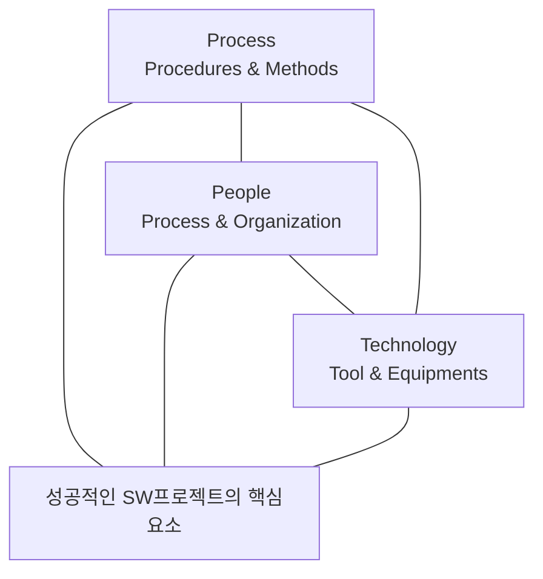

#### 나) 소프트웨어 공학 배경

소프트웨어 공학의 변천사를 보면 1950년대는 소프트웨어 개발 프로젝트를 위해 하드웨어 공학과 유사한 소프트웨어 공학 개념이 도입되기 시작하였지만 1960년대에 소프트웨어에 대한 수요가 급증하고 이를 구현하는 인력들의 경험과 능력, 수적인 부족이 원인이 되어 “소프트웨어의 위기(Crisis)”가 발생하면서 본격적으로 소프트웨어 공학이 도입되었다. 이어 1970년대는 소프트웨어에 대한 수요가 급증하면서 소프트웨어 개발 인력이 부족하게 되었으며, 이를 해결하기 위해 소프트웨어 전공자들이 아닌 비전공자들을 대거 투입하게 되고, 이러한 인력들은 소프트웨어 개발 시 소프트웨어가 쉽게 수정될 수 있다는 점으로 인해 선코딩-후수정하는 접근방식을 택하게 되었다. 하지만 선코딩-후수정에 대한 부작용으로 많은 결함들이 발견되면서 구조적 또는 정형적 기법들이 발생하였으며, 분석, 설계, 구현 등을 순차적으로 진행하는 폭포수 모델을 개발하여 사용하기 시작하였다. 하지만 정형적 기법은 일반 소프트웨어 개발자들이 사용하기에는 사용성이 떨어지며, 폭포수 모델은 비용이 많이 소요되고, 진척도가 떨어진다는 점을 인식한 1980년대에는 재사용성을 높여 효율적으로 소프트웨어를 개발하기 위해 소프트웨어 개발 생산성을 높이기 위한 방법들을 연구하였다. 1990년대에는 시장에서 경쟁우위를 선점하기 위해 제품의 시장출시 시간을 단축해야 했다. 이로 인해 소프트웨어 개발 생산성에 대한 연구가 활성화

<!-- PDF page: 021 -->

되었으며, 폭포수 모델에서 요구사항, 설계 및 구현 등을 동시에 진행할 수 있는 동시공학(Concurrent Engineering)에 집중한 모델을 활용하였다. 소프트웨어를 둘러싼 시장 환경이 급속하게 변화하기 시작한 2000년대에는 이러한 급속한 변화에 효과적으로 대응하기 위해 애자일 방법론이 본격적으로 도입되었다.

#### 다) 소프트웨어 공학의 4가지 중요요소

소프트웨어 공학은 “소프트웨어의 개발, 운용, 유지보수 등의 생명주기 전반을 체계적이고 서술적이며 정량적으로 다루는 학문”이라고 정의되고 있다. 소프트웨어 공학의 4가지 중요 요소는 아래와 같으며, 이 4가지 요소를 통해 고품질의 소프트웨어를 생산하고 주어진 비용과 일정에 딜리버리가 가능하다.

##### ① 방법

- 방법은 프로젝트 계획 수립과 추정, 시스템과 소프트웨어 분석, 자료구조, 프로그램 구조, 알고리즘, 코딩, 테스팅, 유지 관리와 같은 작업들로 구성

- 종종 특수한 언어 중심(예: 객체 지향 방법) 또는 그래프 표기법을 도입

- 소프트웨어 품질에 대한 일련의 평가 기준을 도입

##### ② 도구

- 어떤 일을 수행할 때 생산성 혹은 일관성을 목적으로 사용하는 방법들을 자동화나 반자동화시켜 놓은 것을 일컬음

- 소프트웨어 개발 생명주기 상에서 수많은 도구(예, 요구 관리 도구, 모델링 도구, 형상관리 도구, 변경 관리 도구)가 존재

- 도구들이 통합되어 하나의 도구가 생성한 정보를 다른 도구가 사용할 수 있을 때, 소프트웨어 개발을 지원하는 시스템으로 설정

##### ③ 절차

- 절차는 방법과 도구를 결합하여, 그것으로 하여금 소프트웨어를 합리적이고 적시에 개발할 수 있도록 함

- 절차는 적용된 방법들, 요구되는 결과물(문서, 보고서, 등), 품질을 보증하고 변경을 조정하게 도와주는 제어들, 그리고 소프트웨어 관리자들이 진행을 평가하게 해주는 마일스톤 등의 순서를 정의함

##### ④ 사람

- 소프트웨어 공학에서는 많은 것(수립, 개선, 유지 등)들이 사람과 조직에 의해서 움직이기 때문에 사람에 대한 의존성이 상대적으로 큼

- 다른 공학의 상황보다 훨씬 다양한 이슈들이 생기기 때문에 소프트웨어 개발을 일목요연하게 공학적으로 정리한다는 것은 현실적으로 불가능

### 02 소프트웨어 개발 생명주기

#### 가) 정의

- 사용자 환경 및 문제점 이해에서 시작하여 운용/유지 보수에 이르기까지의 모든 과정을 의미하며, 일반적인 소프트웨어 생명주기는 [타당성 검토 → 개발 계획 → 요구사항 분석 → 설계 → 구현 → 테스트 → 운용 → 유지보수]의 활동으로 구성된다.

<!-- PDF page: 022 -->

#### 나) 목적

- 프로젝트 비용 산정과 개발 계획 수립, 기본 골격 구성

- 용어의 표준화

- 프로젝트 관리

#### 다) 소프트웨어 생명주기 선정

- 기업에서 프로젝트의 개발 프로세스를 테일러링하는데 중요한 활동

- 시스템 개발의 리스크와 불확실성 및 이에 대한 이해를 바탕으로 수행

- 선택한 모델은 프로젝트에 존재하는 리스크/불확실성을 최소화시킬 수 있어야 함

- 폭포수 모델, 프로토타입(Prototype) 모델, 진화(Evolutionary) 모델, 점증적(Incremental) 모델 등이 대표적인 생명주기 모델임

#### 라) 소프트웨어 생명주기 모델 종류

- 생명주기 모델이 프로젝트에 적용 가능한 모든 생명주기 모델을 설명하고 있는 것은 아니다. 단지 가장 많이 사용되는 생명주기 모델의 예일뿐이다. 또한, 프로젝트의 특성에 따라 생명주기 모델을 변경하여 사용할 수도 있다.

##### ① V 모델

- 본 모델은 프로젝트 관리자와 개발자에게 프로젝트 수행 동안 어떤 활동이 수행되어야 하는지 명확하게 보여주고 있다. 또한, 소프트웨어 개발에 대해 잘 알지 못하는 고객을 이해시키는 것이 용이하다.

- 시스템의 요구사항이 모두 식별되고 명확할 때 이상적인 생명주기 모델이다.

- 요구사항이 명확하지 않더라도 V 모델은 사용 가능하다. 그러나 프로젝트의 추정, 계획 및 이에 대한 확약은 요구사항을 분석하고 식별하는 단계에만 국한된다. 즉, V 모델을 적용한 상세 계획은 요구사항이 모두 식별되고 명확해졌을 때 최종적으로 완성된다. 요구사항이 명확하지 않을 경우, 프로젝트 초기 계획은 고객이 기대하는 시작/종료일, 주요 리스크, 가정 사항, 의존 관계, 요구사항이 모두 식별되고 명확해지는 예상 날짜 등을 포함하여 기술해야 한다. 표준 통신 프로토콜을 구현하는 프로젝트는 V 모델이 잘 적용될 수 있는 전형적인 프로젝트의 예이다. 이러한 V모델은 다음과 같은 특징을 갖는다.

- 프로젝트에 적용, 관리하기가 용이하다.

- 개발 활동의 시작/종료 조건 및 프로젝트를 효과적으로 관리할 수 있는 척도 등이 명확하게 정의될 수 있다.

- 프로젝트의 검증 및 확인(Verification and Validation)을 강조하는 모델이다. 즉, 요구사항 분석, 설계와 같은 개발 활동과 테스트 활동이 어떻게 연관 관계가 있는지를 잘 설명하고 있으며, 전체 개발 주기동안 개발 활동과 이에 해당하는 테스트 활동이 병행되어 진다.

- 이를 통해 테스트 동안 결함이 발견되었을 경우, 개발 활동의 어느 단계를 재 수행되어야 하는지 알 수 있다.

##### ② VP 모델(V Model with Prototyping)

- 프로토타이핑은 시스템에 대한 이해 또는 리스크, 불확실성 요소와 같은 이슈를 해결하기 위해 시스템 혹은 시스템의 일부분을 빠르게 개발하는 방법으로 무엇이 필요하고 무엇이 개발되어야 하는지에 대한 개발자와 고객이 공통적인 이해를 이끌어낼 수 있다. 프로토타이핑은 폭포수 모델 혹은 V 모델 등의 개발 단계에 적용될 수 있으며, 독립적인 생명주기 모델로 사용될 수도 있다.

- V 모델에 프로토타이핑(Prototyping) 기법을 추가함으로써 프로젝트의 불확실성 요소나 리스크를 줄일 수 있다. 프로젝트의 불확실성 요소 혹은 리스크라는 것은 요구사항 단계에서의 요구사항 구현 가능성 여부, 설계 단계에서의 시스템 성

<!-- PDF page: 023 -->

능 검증 여부, 새로운 도구의 도입 및 외주 개발 시스템의 위험 요소 등을 포함한다. 프로토타이핑 기법은 다음 두 가지 접근방법으로 수행될 수 있다.

○ **접근방법 1:** 적용 가능한 해결책을 조사하고 이를 적용해 본다. 이는 해결하려는 문제가 명확하지 않을 때 적용 가능한 접근방법이다. 예를 들어, 새로운 장치의 사용자 인터페이스를 구현하는 경우, 시스템의 성능 향상을 위한 방안을 찾는 경우, 에러 혹은 결함 관리의 경우, 본 접근방법을 사용할 수 있다.

- 일반적인 수행 활동 절차는 다음과 같다.

- 불확실성 요소를 정의한다.

- 해결책을 찾고, 이를 적용하기 위한 방법을 정의한다.

- 해결책을 적용해 본다(반복 수행될 수 있음).

- 적용 결과를 통해 불확실성 요소의 원인을 찾는다.

○ **접근방법 2:** 여러가지 선택 가능한 해결책을 열거하고, 정해진 기준에 따라 이를 평가한다. 이는 적용하려는 해결책에 리스크나 불확실성 요소가 존재하는 경우에 적당한 접근방법이다. 예를 들어, 특정 기능에 대한 미들웨어를 선택해야 하는 경우, 여러 환경 요소에 대한 설계의 성능을 고려해야 하는 경우, 본 접근방법을 사용할 수 있다.

- 일반적인 수행 활동 절차는 다음과 같다.

- 불확실성 요소를 정의한다.

- 선택 가능한 해결책을 열거하고, 선택 기준을 정의한다.

- 선택 기준에 따라 해결책을 평가한다.

- 가장 적합한 해결책을 선택한다.

##### ③ 점증적 모델(Incremental Model)

- 점증적 모델은 시스템 개발 시간을 줄일 필요가 있을 경우 유용한 모델이다. 예를 들어, 고객이 원하는 날짜까지 모든 기능을 가진 시스템의 구현이 매우 어렵지만, 그때까지 동작하는 시스템을 개발해야 하는 경우에 적합한 모델이다. 즉, 핵심이 되는 부분을 먼저 개발하여 동작 가능하게 만든 후, 나머지 기능을 구현하는 방식이다.

- 시스템은 몇 번의 기능 확장을 통해 개발된다. 각 단계의 시스템 버전은 몇 가지 제한된 기능에 한해서 동작하게 되며, 추후 시스템 버전에서는 이전 버전의 기능은 물론 추가된 기능까지 포함된 시스템이 개발된다. 물론 마지막 시스템 버전은 모든 기능이 구현된 시스템이다.

- 또한 대부분의 요구사항이 정의되어 있지만 시간이 지남에 따라 개선 여지가 있는 경우에 유용한 모델이다.

- 본 모델은 개발 초기의 외부 인터페이스(H/W and S/W)에 대한 리스크를 줄이는데 유용하게 적용될 수 있다.

- 각 기능 확장 개발 단계의 요구사항이 대체적으로 명확하기 때문에 V 모델 및 VP 모델 모두 적용 가능하다.

##### ④ 진화 모델(Evolutionary Model)

- 진화 모델 또한 점증적 모델과 같이 시스템 개발 시간을 줄일 필요가 있을 경우 유용한 모델이다. 하지만, 점증적 모델과는 달리 전체 시스템에 대한 개발 단계가 여러 번 반복된다. 각 시스템은 사용자에게 모든 기능을 제공한다.

- 하나의 시스템이 개발되어 사용되면서 변경 사항이 도출되고, 이 변경사항은 다음 시스템 개발에 반영된다.

- 변경사항은 기능에 대한 변경, 사용자 인터페이스에 대한 변경, 신뢰성, 성능향상 등의 비기능적 사항에 대한 변경을 포함한다. 시스템 명세가 전체적으로 불분명할 경우, 또 제품의 개선이 지속적으로 요구되는 경우에 적합한 모델이다.

- 실무에서는 보통 점증적 모델과 조합해서 사용하는 경우가 많다. 즉, 새로운 시스템 버전에서는 기존 기능이 향상됨과 동시에 새로운 기능이 추가될 수 있다. 이러한 혼합 모델은 다음과 같은 특징을 갖는다.

<!-- PDF page: 024 -->

- 시스템이 완전한 기능을 갖추고 있지 않을지라도 시스템에 대한 초기 교육이 가능하다. 시스템에 대한 초기 교육을 받고 사용함으로써 시스템에 익숙해질 수 있고, 실무에 필요한 개선사항을 도출할 수 있다. 이를 통해 실무에 필요한 시스템 구축이 가능하다.

- 개발 기간의 단축으로 인한, 시스템의 조기 사용으로 경쟁력이 강화될 수 있다.

- 시스템이 여러 번에 걸쳐 개발되기 때문에 시스템의 예상치 못한 문제 도출 및 조기 수정이 가능하다.

- 전문 분야별로 나누어 시스템을 개발할 수 있다. 예를 들어, 텍스트 기반의 사용자 인터페이스에서 그래픽 기반의 사용자 인터페이스로 기능 향상을 시키는 프로젝트일 경우 사용자 인터페이스가 전문 분야인 개발팀이 맡아서 수행할 수 있다.

### 03 소프트웨어 개발 방법론

소프트웨어 개발 방법론의 특징은 개발 단계를 각각 정의하고 각 단계별 수행활동, 산출물, 검증절차, 산출물, 완료 기준을 정의하고, 개발 계획, 분석, 설계 및 구현의 수행 단계에 대해 정형화된 방법과 절차, 지원 도구를 정의한다.

#### 가) 소프트웨어 개발 방법론의 필요성

① 개발 경험의 축적 및 재활용을 통한 개발 생산성을 향상

② 효과적인 프로젝트 관리

③ 공식 절차와 산출물을 제시하고 표준용어를 통일하여 의사소통 수단 제공

④ 각 단계별 검증과 승인된 종료를 통해 일정 수준의 품질 보증

#### 나) 소프트웨어 개발 방법론 비교

〈표 1〉 소프트웨어 개발 방법론

<table>
<tbody>
<tr>
<td>구분</td>
<td>구조적 방법론</td>
<td>정보공학 방법론</td>
<td>객체 지향 방법론</td>
<td>CBD 방법론</td>
</tr>
<tr>
<td>개요</td>
<td>업무활동 중심의 방법론</td>
<td>데이터 중심의 방법론</td>
<td>객체, 클래스 간의 관계를<br>식별하여 설계모델로<br>변환하는 방법론</td>
<td>재사용이 가능한<br>컴포넌트의 개발/상용<br>컴포넌트들을 조합하는<br>방법론</td>
</tr>
<tr>
<td>기본<br>원리</td>
<td>- 추상화<br>-구조화<br>- 단계적 상세화<br>-모듈화</td>
<td>- 정보전략계획<br>- 업무영역분석<br>- 업무시스템설계<br>- 시스템구축</td>
<td>-요건정의<br>- 객체 지향 분석<br>(객체모델링, 동적모델링,<br>기능모델링)<br>- 객체 지향 설계<br>- 테스트/배포</td>
<td>- 요구분석<br>- 분석(아키텍처 정의,<br>유스케이스모델링)<br>-설계<br>-개발<br>- 구현(릴리스,교육)</td>
</tr>
<tr>
<td>특징</td>
<td>- 분할과 정복의 원칙<br>- 프로그램 로직중심<br>- 컨트롤 가능한 모듈로<br>구조화</td>
<td>- 기업업무 지원시스템<br>지원방법론<br>- 데이터모델 중시<br>- 프로그램 로직은<br>데이터구조에 종속<br>(CRUD)<br>- 전사적 통합데이터모델</td>
<td>- 프로그램 단위는 객체<br>- 데이터와 로직 통합<br>- 고도의 모듈화<br>- 상속에 의한 재사용 분석<br>- 설계간 갭(gap) 없음</td>
<td>- 객체방법론의 진화<br>- 인터페이스 중시<br>- 인터페이스의 구현은<br>컴포넌트<br>- 블랙박스 재사용 지향</td>
</tr>
</tbody>
</table>

<!-- PDF page: 025 -->

<table>
<tbody>
<tr>
<td>구분</td>
<td>구조적 방법론</td>
<td>정보공학 방법론</td>
<td>객체 지향 방법론</td>
<td>CBD 방법론</td>
</tr>
<tr>
<td>주요<br>산출물</td>
<td>- 도메인 분석서<br>- 데이터흐름도<br>- 구조도<br>- 프로그램사양서</td>
<td>- 도메인분석서<br>- ERD<br>- 기능차트<br>- 어플리케이션구조도<br>- 프로그램사양서<br>- 테이블정의서/목록</td>
<td>- 비즈프로세스/개념도<br>- 다이어그램<br>(유스케이스,시퀀스,<br>클라스, 컴포넌트 등)</td>
<td>- 비즈프로세스/개념도<br>- 다이어그램<br>(유스케이스,시퀀스,<br>클라스, 컴포넌트 등)<br>- 재사용계획서<br>- .Net, EJB</td>
</tr>
<tr>
<td>지원<br>도구</td>
<td>Teamwork, SA</td>
<td>Cool Gen, SA</td>
<td>Rose, SA, Palstic</td>
<td>Cool Joe, Together</td>
</tr>
<tr>
<td>주요<br>지원<br>언어</td>
<td>COBOL, C, VB, PASCAL</td>
<td>COBOL, C, VB, PASCAL</td>
<td>C++, JAVA, VB</td>
<td>원칙적으로 개발언어 무관</td>
</tr>
</tbody>
</table>

#### 다) 소프트웨어 개발 단계

소프트웨어 개발 활동은 소프트웨어 생명주기에 따라 정의된다.

##### ① 요구사항 분석

- 소프트웨어 개발에 있어서 가장 어려운 부분은 무엇을 개발할 것인가를 정확히 결정하는 것

- 소프트웨어 요구분석은 소프트웨어 개발의 실제적인 첫 단계로 사용자의 요구에 대하여 이해하는 단계

- 전체 개발 과정에서 개발 비용을 감소시킬 수 있는 결정적인 단계

- 초기에 요구사항을 잘 분석하여 정의하고 관리하기 위해 투자한다면 전체 소프트웨어 개발 기간과 비용의 초과, 품질 저하를 미연에 방지할 수 있음

##### ② 설계

- 소프트웨어 요구분석 과정을 개념적인 단계라 한다면, 설계 과정은 물리적 실현의 첫 단계

- 시스템 설계는 서브 시스템들로 이루어지는 시스템 구조를 결정, 서브 시스템들은 하드웨어나 소프트웨어 등의 구성요소에게 할당

- 설계는 품질에 직접적인 영향을 줌

- 설계가 제대로 되지 않으면 시스템의 안정감 저하

- 안정감 없는 시스템은 유지보수도 어려움

##### ③ 구현

- 소프트웨어 구현 단계의 목표는 설계 명세를 기반으로 요구사항을 만족할 수 있도록 프로그래밍 하는 것

- 프로그램은 상세 설계나 사용자 지침서에 기술된 것과 일치하도록 코딩해야 함

- 구현 단계에서 가장 중요한 작업 중 하나는 코딩 표준을 정하고, 이를 기반으로 명확하게 코드를 작성하는 것

##### ④ 테스팅

- 시스템이 정해진 요구를 만족하는지, 예상과 실제 결과가 어떤 차이를 보이는지에 대해 수동 또는 자동화된 방법을 동원하여 검사하고, 평가하는 일련의 과정을 의미함

- 소프트웨어 품질 보증을 위한 마지막 단계로 소프트웨어의 품질을 확보하기 위해 결함을 찾아내는 일련의 작업

- 개발한 소프트웨어의 품질에 대한 평가와 품질 향상을 위한 수정 작업 등이 포함

<!-- PDF page: 026 -->

### 04 애자일 개발 방법론

#### 가) 애자일 방법론 종류

애자일 선언문이 나온 이후로 다양한 애자일 방법론이 등장하게 된다. 이 중에서 특히 세계적으로 널리 채택된 애자일 방법론은 스크럼과 익스트림 프로그래밍(XP)이다. 초창기에는 XP를 주로 사용하였지만 스크럼이 점차 인기를 끌면서 최근에는 일반적으로 스크럼과 XP를 함께 사용한다. 최근에는 도요타 시스템의 린 생산방식을 소프트웨어 개발에 적용하자는 린 소프트웨어 개발 방법론이 급부상하고 있고 주로 스크럼과 함께 사용된다.

주요 애자일 방법론은 다음과 같다.

- 스크럼(Scrum), 켄 슈와버/제프 서덜랜드

- 익스트림 프로그래밍(eXtreme Programing, XP), 켄트 벡/에릭 감마

- 린(Lean) 소프트웨어 개발방법론, 메리 포펜딕/톰 포펜딕

- 애자일 UP(Agile Unified Process, AUP), 스콧 앰블러

#### 나) 애자일 개발 방법론-XP

##### ① XP 개요

XP(eXtreme Programming)는 1990년대 후반 켄트 벡(Kent Beck)을 중심으로 여러 엔지니어들이 프로젝트를 진행하며 얻었던 교훈을 기반으로 정립된 방법론이다. 보통 중소규모 개발 조직에 적합한 경량화된 개발방식이다. XP의 경우 테스트 주도 개발(TDD), 일일빌드(Daily Build), 지속적인 통합(Continuous Integration) 등 개발 테크닉과 연관된 부분이 많기 때문에 종종 '방법론'으로서 규정짓는 것에 대해 논란이 되기도 한다. 국내에서는 작은 규모의 개발 팀을 중심으로 기법 중 일부를 적용하는 사례가 일반적이다. 또한 XP만을 고집하기 보다는 스크럼과 같은 추가적인 애자일 개발 방법을 함께 적용하는 사례가 늘어나고 있다. XP를 적용함에 있어서 그 가치(Value)와 그 가치를 달성하기 위한 실천법(Practice)으로 구성되며, 이 두 가지의 균형을 유지하기 위한 원칙(Principle)이 필요하다. XP는 반복적 개발방법론의 일종이다. 프로젝트 수행 과정에 여러 번의 반복이 있으며 테스트 결과에 따라 반복적으로 업무를 수행한다.

##### ② XP 개발절차 및 용어

XP 개발절차는 다음 그림과 같이 수행된다.

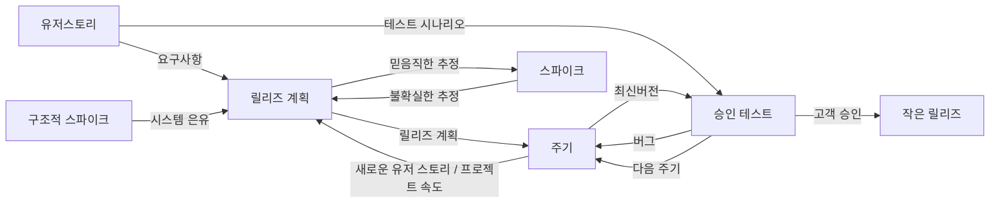

<!-- PDF page: 027 -->

- 유저 스토리: 요구사항 수집, 의사소통의 도구를 말하고 기능단위의 필요한 내용을 간단하게 기재한다.

- 스파이크: 어려운 요구사항 혹은 잠재 솔루션을 고려한 간단한 프로그램으로서, 사용자 스토리의 신뢰성을 증대, 기술 문제의 위험을 감소하는 목적이 있다.

- 릴리즈 계획: 전체 프로젝트에 대한 배포 계획을 수립하여 하나의 반복을 1~3주로 나누고 반복들을 균일하게 유지한다.

- 승인 테스트: 릴리즈 전 인수 테스트로서 고객이 직접 수행한다.

- 작은 릴리즈: XP 주기의 마지막 단계이고 소규모로 빈번하게 배포하면 고객에게 여러 이득을 조기에 제공할 수 있다.

##### ③ XP 가치

XP에서는 기본적으로 다섯 가지 가치를 제안한다.

- 의사소통: 팀 단위 소프트웨어 개발에서 가장 중요한 것은 의사소통이며, 실패한 프로젝트에서 볼 수 있는 전형적인 현상은 커뮤니케이션 오류이다. 고객, 개발자, 관리자들 간의 의사소통을 통해 문제를 해결하고 팀 빌딩을 강화해야 한다.

- 단순성: “가능한 한 가장 단순한 것은 무엇인가?”는 물음을 늘 갖는다. 불필요한 복잡성을 제거하여 설계를 단순하고 명확하도록 유지한다.

- 피드백: 어제의 산출물이나 가치가 오늘 무용지물이 되는 변화의 흐름 속에서 완전성을 추구하는 것보다 점진적인 개선이 효과적이다. 팀이 다를 수 있는 한도 내에서 최대한 빨리, 최대한 많은 피드백을 만들어 개선에 활용한다.

- 용기: 가능한 한 빨리 변경된 사항을 반영하여 고객에게 인도한다는 정신 아래 요구사항 및 기술 변경에 용감하게 대처해야 한다. 문제를 적극적으로 해결하려는 용기는 단순함을 추구하고 구체적으로 제시하려는 용기는 피드백을 강화한다.

- 존중: 앞의 4가지 뒤에 숨어있는 가치로 팀에 속한 다른 사람들을 중요하게 여기지 않고 프로젝트를 제대로 할 수는 없다. (출처: 대한민국 개발자 희망보고서)

##### ④ XP의 실천방법

XP는 5가지 가치 외에 12가지 〈표 2〉와 같은 12가지 실천 방법을 제시한다.

〈표 2〉 XP 기본 실천 방법

<table>
<thead><tr><th>구분</th><th>실천방법</th><th>설명</th></tr></thead>
<tbody>
<tr><td rowspan="7">개발</td><td>단순한 설계(Simple design)</td><td>현재의 요구사항을 만족시키도록 가능한 한 단순하게 설계함</td></tr>
<tr><td>테스트 기반 개발(Test-Driven Development)</td><td>코드를 작성하기 전에 테스트부터 작성하고 테스트 도구를 사용하여 자동화하라.</td></tr>
<tr><td>리팩토링(Refactoring)</td><td>코드의 중복과 복잡성을 제거하여 기존코드의 디자인을 향상시켜라.</td></tr>
<tr><td>코딩 표준(Coding Standard)</td><td>효과적인 의사소통을 위해 코딩 표준을 만들어라.</td></tr>
<tr><td>짝 프로그래밍(Pair Programming)</td><td>두 명의 개발자가 한 컴퓨터 앞에 앉아서 같이 개발 작업을 진행하라.</td></tr>
<tr><td>코드 공유(Collective Code Ownership)</td><td>팀의 모든 개발자가 소스코드에 대해 공동책임을 져서 언제든, 누구라도 코드를 수정해서 더 좋게 만들 수 있게 하라.</td></tr>
<tr><td>지속적인 통합(Continuous Integration)</td><td>작업이 끝날 통합 작업을 수행하라.</td></tr>
<tr><td rowspan="3">관리</td><td>계획 게임(Planning Game)</td><td>프로젝트 전체 계획과 주기 계획을 비즈니스와 기술적인 측면을 고려하여 세우고 실행과 피드백을 통해 업데이트를 유지하라.</td></tr>
<tr><td>작은 릴리스(Small Release)</td><td>실행 가능한 모듈을 가능한 한 빨리 배포하여 고객이 수시로 소프트웨어가 어떻게 돌아가는지 볼 수 있게 하라.</td></tr>
<tr><td>메타포(Metaphor)</td><td>시스템에 대한 전체 모습을 이해하기 쉬운 그림과 스토리로 표현하라.</td></tr>
<tr><td rowspan="2">환경</td><td>주당 40시간 작업(40 Hours/week)</td><td>품질의 유지를 위해 일주일에 40시간 이상 일하지 마라.</td></tr>
<tr><td>현장 고객(On-site Customer)</td><td>실제 시스템을 사용할 고객이 개발 현장에 상주하게 하라.</td></tr>
</tbody>
</table>

<!-- PDF page: 028 -->

#### 다) 스크럼(SCRUM)

##### ① 스크럼 개요

스크럼은 프로젝트 관리를 위한 애자일 방법론으로서 추정 및 조정 기반의 경험적 관리기법의 대표적인 형태이다. 1986년 타케우지&노나카 교수가 HBR에 기고한 “The New Product Development Game”이라는 기사를 그 기원으로 본다. 이후 1995년에 켄 슈와버와 제프 서덜랜드가 이 방법을 소프트웨어 개발에 소개하면서 스크럼이라 부르게 되었다. 스크럼에는 〈표 3〉과 같이 크게 3가지 역할자가 있다.

〈표 3〉 스크럼 역할자 유형

| 역할 | 설명 |
| --- | --- |
| 제품 책임자<br>(Product Owner) | 제품 기능목록에 해당하는 제품 백로그(Product Backlog)를 만들고 우선순위를 조정하거나 새로운 항목을 추가하는 일을 관리한다.<br>스프린트 계획 수립 시점에는 핵심 역할을 담당하지만 스프린트 시작 후에는 가능한 팀의 운영에 관여하지 않는 것을 권장한다. |
| 스크럼 마스터<br>(Scrum Master) | 팀의 업무를 방해하는 요소 제거에 노력한다. 원칙과 가치를 지키면서 팀이 개발을 진행할 수 있도록 지원한다. |
| 스크럼 팀<br>(Scrum Team) | 일반적으로 스크럼 팀은 최소 5명에서 최대 9명으로 구성된다. 사용자 스토리를 사용하여 한 스프린트 동안에 개발할 기능을 도출한다. |

##### ② 스크럼 프로세스

스크럼 프로세스는 다음과 같은 3가지 구성 요소를 갖는다.

- 스프린트(Sprint): 달력기준 1~4주 단위의 반복개발기간을 가리킨다.
- 3가지 미팅: 일일 스크럼, 스프린트 계획, 스프린트 리뷰
- 3가지 산출물: 제품 백로그, 스프린트 백로그, 소멸 차트

3가지 산출물은 〈표 4〉와 같이 정리할 수 있다.

〈표 4〉 스크럼 프로세스 산출물

| 역할 | 설명 |
| --- | --- |
| 제품 백로그 | 제품에 담고자 하는 기능의 우선순위를 정리한 목록. 고객을 대표하여 제품 책임자가 주로 우선순위를 결정한다. 제품 백로그에 정의된 기능을 사용자 스토리라고 한다. 사용자 업무량에 대한 추정은 주로 스토리 포인트라는 기준을 이용한다. |
| 스프린트 백로그 | 하나의 스프린트 동안 개발할 목록으로 사용자 스토리와 이를 완료하기 위한 작업을 과업(task)으로 정의한다. 각각의 과업의 크기는 시간 단위로 추정한다. |
| 소멸 차트 | 개발을 완료하기까지 남은 작업량을 보여주는 그래프, 각 이터레이션 별로 남아있는 작업량을 스토리 포인트라는 것으로 나타낸 것이다. |

스크럼 프로세스의 3가지 미팅은 〈표 5〉와 같이 정리할 수 있다.

〈표 5〉 스크럼 프로세스 산출물

| 역할 | 설명 |
| --- | --- |
| 스프린트 계획 | 각 스프린트에 대한 목표를 세우고 제품 백로그로부터 스프린트에서 진행할 항목을 선택한다.<br>각 항목에 대한 담당자를 배정하고 태스크 단위로 계획을 수립한다. |
| 일일 스크럼 | 매일 진행하는 15분 간의 프로젝트 진행상황을 공유하는 회의이다. 모든 팀원이 참석하며 매일매일 각자가 한 일, 할 일, 문제점 등을 이야기한다. |

<!-- PDF page: 029 -->

<table>
<tbody>
<tr>
<td>역할</td>
<td>설명</td>
</tr>
<tr>
<td>스프린트 리뷰</td>
<td>스프린트 목표를 달성했는지 작업 진행과 결과물을 확인하는 회의이다. 스크럼 팀은 스프린트 동안<br>작업한 결과를 참석자들에게 데모하고 피드백을 받는다. 가능하면 해당 스프린트 동안 진행된 모든<br>작업에 대한 데모를 진행하고 고객이 참여하는 것이 좋다. 이 때, 스크럼 마스터는 스프린트 동안<br>잘된 점, 아쉬웠던 점, 개선할 사항 등을 찾기 위한 회고를 진행할 수 있다.</td>
</tr>
</tbody>
</table>

##### ③ 스크럼 특징

스크럼의 특징은 다음과 같다.

- 투명성: 프로젝트가 현재 어떤 상태인지 계획대로 진행되고 있는지 어떤 문제점을 가지고 있는지 정확히 파악하는 건 어려운 일이다. 스크럼은 스크럼 회의, 소멸차트, 스프린트 리뷰와 같은 기법을 이용해서 프로젝트의 상태나 문제점을 효과적으로 파악할 수 있다.

- 타임박싱: 스크럼을 진행하는데 들어가는 시간을 제한함으로써 프로젝트 진행에만 집중하는 것이 가능해진다. 일일 스크럼은 매일 15분의 제한된 시간에 진행되며, 스프린트 리뷰는 매 이터레이션 마다 주기적으로 진행된다.

- 커뮤니케이션: 스크럼에서는 팀원 간 커뮤니케이션을 원활하게 하기 위해서 많은 노력을 기울인다. 일일 스크럼에서 개발자들이 갖고 있는 문제점을 공유하고 플래닝 포커를 사용하여 사용자 스토리의 구현 난이도, 시간을 토론하는 절차는 팀원 간의 커뮤니케이션을 원활하게 해주는 스크럼의 특징 중 하나이다.

- 경험주의 모델: 스크럼은 고유의 프로세스 모델을 가지고 있지만 많은 기법들이 프로젝트에 참여하고 있는 개개인의 경험을 중요시한다. 프로젝트별로 고유한 상황과 특징을 가지고 있기 때문에 기존의 정형화된 프로세스로는 이런 프로젝트 상황을 따라가기 어렵다. 스크럼은 기본적인 구조만 동일할 뿐 실제로 팀마다 달라지는 것을 인정한다.

<!-- PDF page: 030 -->

## II. 소프트웨어 재사용

### 최근 동향 및 주요 이슈

국제적인 기업일수록 소프트웨어 재사용의 비율이 점차 높아 지는 걸 알 수 있다. 소프트웨어 재사용은 과거의 검증된 지식을 활용하여 개발, 유지보수 하고자 하는 소프트웨어로서 짧은 기간에 재생산할 수 있어 생산성 및 품질 향상을 통한 원가절감을 유발할 수 있는 매우 효과적인 수단이기 때문에 많은 기업들이 재사용률을 높이기 위한 고민을 많이 하고 있다.

### 학습 목표

1. 소프트웨어 재사용의 개념, 목적, 대상, 현실 적용방안, 효과, 고려사항 등을 이해한다.

2. 역공학의 개념, 필요한 이유, 장점, 고려사항에 대해 이해한다.

### 핵심 키워드

재사용, 역공학<br>
코드 재사용, 소프트웨어 표준화<br>
소프트웨어 유지보수

<!-- PDF page: 031 -->

### 실무 미리보기 재사용 문화 조성을 위한 제도 정착

소프트웨어 개발 과정에 재사용을 도입하는 것은 개발 부서의 인식과 문화에 대한 전환이 필요하다. 이를 위해서는 개발자들의 사고에 대한 전환이 요구되며, 또한 조직적인, 제도적인 측면에서의 문화 조성이 요구된다. 이러한 제도 정착을 위해서는 다음과 같은 사항들이 실천되어야 할 것이다.

- 재사용 관리 조직의 구성: 재사용 기반의 소프트웨어 개발 방식을 정착화시키기 위해 재사용에 대한 관리 조직이 필요하다. 이들 관리 조직에서는 재사용에 관련된 절차 및 표준을 도입, 제정하고 재사용성을 높이기 위한 방침을 제정, 실천한다.

- 재사용에 대한 교육: 조직 내의 재사용에 대한 분위기를 고조시키기 위해 재사용에 대한 교육을 정기적으로 실시한다. 이들 교육은 개발자뿐 만 아니라 프로젝트의 관리자와 조직의 관리자를 모두 포함하여 실시해야 하며, 교육 내용적인 측면에서도 관리자를 위한 교육과 개발자를 위한 교육 등을 구분하여 실시한다.

- 재사용성을 높이기 위한 보상 제도의 도입: 재사용이란 도입 초기에 매우 불편하게 여겨질 수 있다. 따라서 제도적으로 재사용성을 높이기 위한 방안이 강구되어야 하는데, 대표적인 것이 재사용에 대한 인센티브 제도의 도입이다.

- 재사용 컴포넌트에 대한 신뢰성의 확보: 개발자들에게 재사용 컴포넌트에 대한 신뢰성을 확보하기 위해서는 개발자의 인식 전환과 함께, 재사용 라이브러리에서 관리되는 컴포넌트에 대한 충분한 신뢰성 보장, 그리고 적합한 컴포넌트를 찾을 수 있도록 지원하는 방안들이 필요하다.

<!-- PDF page: 032 -->

### 01 소프트웨어 재사용

#### 가) 소프트웨어 재사용(Reuse) 개요

소프트웨어 재사용은 기존의 소프트웨어 또는 소프트웨어 지식을 활용해, 새로운 소프트웨어를 구축하는 일이다. 재사용가능한 소프트웨어나 소프트웨어 지식은 재사용가능한 자산이다. 자산에는 설계, 요구명세, 검사, 아키텍처 등도 포함된다.

##### ① 소프트웨어 재사용 배경

- 소프트웨어 위기로 인한 품질 및 생산성 저하

- 소프트웨어 개발의 자동화 기술 발달로 CASE 도구 사용 확대

- 소프트웨어 개발 표준화 준수 및 품질확보 노력

##### ② 소프트웨어 재사용 정의

- 소프트웨어 재사용이란 사용 소프트웨어 개발관련 지식(기능, 모듈, 구성 등)을 표준화하여 개발 생산성을 높이기 위하여 반복적으로 사용하기에 적합하도록 구성하는 방법

- 기존 개발 기능, 성능 및 품질을 인정받았던 소프트웨어의 전체 또는 일부분을 다시 사용하여 신규 개발되는 소프트웨어의 품질과 생산성 및 신뢰성을 높이고 개발 일정 및 비용을 감소시켜 주는 대응방안

- 기존 개발 모듈이나 프로그램, 산출물 등을 동일한 응용 분야, 서로 다른 응용업무, 혹은 서로 다른 기업 간에 다시 사용하거나 일부 수정 후 재사용할 수 있는 개념

##### ③ 소프트웨어 재사용의 목적

| 목표 | 내용 |
| --- | --- |
| 신뢰성 | 기능, 안정, 속도 등의 사전 성능 검증됨 |
| 확장성 | 검증된 기능 기반으로 upgrade 용이 |
| 생산성 | 비용, 시간 위험 등 전체적 개발 프로세스 향상 |

#### 나) 소프트웨어 재사용의 대상

소프트웨어 재사용을 활용할 수 있는 대상은 다양하다.

##### ① 일반적인 지식

- 환경 정보: 교육 및 활용을 통해 얻어진 지식

- 외부 지식: 개발 및 특정분야의 참여를 통해 쌓은 지식

##### ② 설계 정보

- 기본설계(System Architecture)

- 상세설계(System Design)

##### ③ 데이터 정보

- 시스템 데이터(System Data)

- 시험 사례(Test Cases)

<!-- PDF page: 033 -->

##### ④ 프로그램 코드

- 모듈(Module)

- 프로그램(Program)

##### ⑤ 기타

- 투자 대 효과 분석정보(Cost Benefit Analysis )

- 사용자 지침서(User Documentation )

- 타당성 조사방법 및 결과(Feasibility Studies )

- 프로토타입(Prototype)

- 인력(People)

#### 다) 소프트웨어 재사용의 원칙

① 범용성(Generality): 특정 응용분야만이 아닌 일반적으로 활용될 수 있는 정도이어야 한다.

② 모듈성(Modularity): 정보은닉과 추상화의 원칙으로 최소한의 결합도 및 최대한의 응집력을 갖도록 하는 특성이 있어야 한다.

③ 하드웨어 독립성: 가능한 실행 하드웨어 기종과 무관해야 한다.

④ 소프트웨어 독립성: OS 또는 DBMS와는 무관하게 운영해야 한다.

⑤ 자기문서화(Self Documentation): 모듈의 정확한 기능, 용법, 인터페이스를 기술한다.

⑥ 일반성(Commonality): 많은 개발자들에게 공통적으로 필요하고 사용 가능해야 한다.

⑦ 신뢰성(Reliability): 품질을 믿고 사용할 수 있어야 한다.

#### 라) 실무에서 재사용 구현의 문제점

- 공통으로 사용할 수 있는 소프트웨어 모듈을 발견하기가 어렵다.

- 소프트웨어의 표준화가 부족하다.

- 소프트웨어 모듈의 내부 인터페이스 요구사항의 이해가 곤란하다.

- 변경으로 인한 부차적 영향으로 이해가 곤란하다.

- 재사용을 위한 소프트웨어 부품은 개발비가 더 들 수 있다.

- 재사용의 효익은 오랜 시간이 경과 후 나타난다.

- 현존하는 소프트웨어 부품에서 재사용 부품의 추출이 비현실적이다.

#### 마) 소프트웨어 재사용의 장애요인 및 대책

##### ① 소프트웨어 재사용의 장애요인

- 관리자와 개발 담당자들의 거부 반응

- 재사용 기술적용의 동기 결여

- 소프트웨어 표준화의 부재

- 사회적 또는 법적 장애

##### ② 소프트웨어 재사용의 장애요인 제거 대책

- 기술적 방안

  - 새로운 설계 및 개발 방법론의 활용

<!-- PDF page: 034 -->

- 재사용 소프트웨어 라이브러리의 구축

- 자동화 도구(CASE)의 활용

- 관리, 제도적 방안

- 보상제도의 확립

- 능동적인 경영전략

- 조직의 변화

#### 바) 재사용 적용 시 고려사항

- 생산성의 향상이 가능한 재사용

- 체계화된 재사용 기반의 소프트웨어 개발 프로세스

- 재사용 문화 조성을 위한 제도 정착

- 초기 투자를 통한 재사용 환경의 구축

- 지속적인 라이브러리의 개선 및 보강

- 도구(tool)의 지원이 있는 재사용

- 소프트웨어 생산성 평가 및 척도

- 재사용 컴포넌트에 대한 정보 집합의 관리

- 소프트웨어의 재사용 대상 산출물<br>Architecture, Source Code, Data, Designs, Documents, Estimates(templates) Human Interfaces, Plans, Requirements, Test Cases

- 하향식/상향식 개발 접근법

- 재사용 컴포넌트에 대한 Granularity

#### 사) 소프트웨어 재사용의 효과

- 소프트웨어 생산의 TCO 절감

- 높은 품질의 소프트웨어 생산을 위한 공유 및 활용효과

- 시스템 개발에 대한 정보공유 및 타 프로젝트의 산출물 공유

- 시스템 구조와 좋은 시스템 구축방법에 대한 교육적 효과

### 02 역공학

#### 가) 역공학의 정의

역공학이란 소프트웨어 공학의 한 분야로 이미 만들어진 시스템을 역으로 추적하여 처음의 문서나 설계기법 등의 자료를 얻어 내는 일을 말한다. 이것은 시스템을 이해하여 수정하는 소프트웨어 유지보수 단계에 수행하는 일련의 활동이다. 즉, 소프트웨어 생명주기의 마지막 단계에서 얻어지는 프로그램 또는 문서 등을 이용하여 생명주기 초기 단계의 산출물에 해당하는 정보 또는 문서를 만들어 내는 일로서 설계부터 순차적으로 수행하는 순공학에 상대되는 개념을 역공학이라 한다. 이러한 역공학의 개념은 아래의 Input과 output의 흐름을 통해서 이해할 수 있다.

<!-- PDF page: 035 -->

〈표 6〉 역공학의 Input/Output

<table>
<tbody>
<tr>
<td>Input</td>
<td>Output</td>
</tr>
<tr>
<td>원시코드, 목적코드, 작업절차, 라이브러리 등 입출력 형태의<br>자료, 문서</td>
<td>구조도, 자료 흐름도, 제어 흐름 그래프, 개체 관계도</td>
</tr>
</tbody>
</table>

#### 나) 역공학이 필요한 경우

- 기 가동중인 시스템의 유지보수가 어려운 경우

- 변경이 빈번하여 시스템 효율이 저하된 경우

- 파일 시스템으로 개발된 업무를 관계형 데이터베이스로 재구축 하려는 경우

- 기본 메인 프레임을 다운사이징 하는 경우

#### 다) 역공학의 장점

- 상용화되거나 기 개발된 소프트웨어의 분석을 도와줌

- 기존 시스템의 자료와 정보를 설계 수준에서 분석할 수 있어 유지 보수성을 향상

- 기존 시스템 정보를 Repository에 보관하여 CASE의 사용을 용이하게 함

#### 라) 역공학의 종류

- 역공학의 종류는 논리역공학과 자료역공학으로 구분하여 설명할 수 있다.

〈표 7〉 역공학의 종류

<table>
<tbody>
<tr>
<td>종류</td>
<td>설명</td>
</tr>
<tr>
<td>논리역공학</td>
<td>원시코드로부터 정보를 추출하여 물리적 설계 정보저장소에 저장<br>물리적 설계정보를 얻어내는 역할 수행</td>
</tr>
<tr>
<td>자료역공학</td>
<td>기존 데이터베이스를 수정하거나 새로운 데이터베이스 관리시스템으로 전이하는 역할 수행</td>
</tr>
</tbody>
</table>

<!-- PDF page: 036 -->

## III. 자료구조와 알고리즘

### 학습 목표

1. 자료구조의 정의와 분류에 대하여 설명하고, 선형/비선형구조를 활용할 수 있다.

2. 알고리즘의 역할을 이해하고 상황에 따라 적합한 알고리즘을 선택할 수 있다.

### 핵심 키워드

배열, 리스트, 스택, 큐, 데크, 트리, 그래프<br>
알고리즘의 정의, 알고리즘 성능분석, 정렬/탐색 알고리즘

<!-- PDF page: 037 -->

### 실무 미리보기

2003년 미국 북동부의 대 정전 사태가 발생했다. 이 정전 사태로 미국 7개 주와 캐나다 1개 주가 암흑 천지로 변했다. 그 원인을 파악해 본 결과 멀티프로세스 방식에서 발생하는 XA/21시스템 내의 소프트웨어의 오류, 즉 '경쟁상태(Race Condition, 교착상태의 한 종류)'로 인한 것이었다. 오류는 XA/21 시스템 내의 어떤 두 프로그램이 같은 데이터 구조를 동시에 쓰기 접근을 해서 발생했다. 이로 인해 데이터 구조가 손상되었고 그 결과 이상을 알리는 알람프로세서가 무한 루프에 빠져 더 이상 알람을 처리하지 못했고, 알람 처리가 실패했다는 사실도 알리지 못하는 상태가 되고 말았다. 알람대기열(Queue)은 무제한으로 늘어났고, 30분 후 모든 가용 메모리를 다 소비해버린 것이다. 이 시점에서 메인 서버가 죽었고, 장애조치로 백업서버가 메인서버가 되었으나 백업서버 역시 무제한으로 늘어나는 큐를 감당하지 못한 탓에 장애가 발생했다.

위 사례는 자료구조나 알고리즘 등 소프트웨어 기반 기술을 잘 이해하지 못하고 개발된 소프트웨어가 치명적인 오류를 발생시켜 실생활에 엄청난 피해를 준 대표적인 사례이다.

프로그래밍에서 데이터를 구조적으로 표현하는 방식인 자료구조는 데이터를 편리하게 접근하고, 변경을 위해 데이터를 저장하거나 조직화하는 방법을 제시한다. 알고리즘은 어떤 값을 입력받아 해결하고자 하는 문제를 해결한 후 출력하기 위한 잘 정의된 계산과정을 의미한다.

예를 들어, 블록으로 집을 짓는 경우를 생각해보자. 집의 구조나 형태에 따라 여러 블록 중 재질, 색깔, 모양 등이 주어진 설계도에 가장 적절한 블록을 선택하여 쌓아야만 원하는 최적의 집을 지을 수 있다. 그러나, 이보다 우선인 것은 각 블록들이 가지는 재질 및 특징을 제대로 이해하고 다양한 활용 방안들을 알고 있어야 한다. 블록을 특성에 맞도록 적재적소에 사용하지 못하면 완성된 집도 부실할 수 밖에 없기 때문이다. 자료구조와 알고리즘은 이러한 블럭과 같다. 정보시스템의 빠른 발전에 부흥하는 다양한 기반기술들이 제공되고 있다. 따라서, 소프트웨어를 개발할 때 가장 적절한 자료구조와 알고리즘들을 채택하여 적용함으로써 주어진 환경에 최적인 고품질의 소프트웨어를 기대할 수 있다.

자료구조는 코딩의 효율성 측면에서 중요한 기술로 주어진 문제 해결 방법을 구현하기 위해 어떤 자료구조가 적절한지 조금 더 쉽게 선택할 수 있도록 한다. 알고리즘은 주어진 문제를 처리시간 및 기억장소 사용 등을 고려하여 효율적으로 처리할 수 있도록 해준다.

<!-- PDF page: 038 -->

### 01 자료구조(Data Structure)

#### 가) 정의

자료구조(Data Structure)란 자료를 컴퓨터의 기억장치 내에 저장하는 방법으로 다양한 자료를 효율적으로 표현하고 활용할 수 있도록 자료의 특성과 사용 용도를 고려하여 조직적, 체계적으로 정의한 것이다.

#### 나) 분류

자료구조는 크게 선형구조와 비선형구조로 나눌 수 있다. 선형구조는 자료가 일렬로 연결되어 있는 형태로 구성하는 방법이고 비선형구조는 자료의 구성이 계층구조나 망구조의 특별한 형태를 띠는 구조이다.

〈표 8〉 자료구조의 분류

<table>
<tbody>
<tr>
<td>분류</td>
<td>설명</td>
</tr>
<tr>
<td>선형구조(Linear)</td>
<td>원시코드로부터 정보를 추출하여 물리적 설계 정보저장소에 저장<br>물리적 설계자료들이 직선 형태로 나열되어 자료들 간의 순서를 고려한 구조로 전후/인접/선후 자료들<br>간의 1:1 관계로 나열됨<br>종류로는 배열, 선형리스트, 연결리스트, 스택, 큐, 데크 등이 있음<br>정보를 얻어내는 역할 수행</td>
</tr>
<tr>
<td>비선형구조(Nonlinear)</td>
<td>한 자료 뒤에 여러 개의 자료들이 존재하는 구조로 인접/전후 자료들 간의 1:다 또는 다:다 관계로<br>배치됨<br>종류로는 트리와 그래프 등이 있음</td>
</tr>
</tbody>
</table>

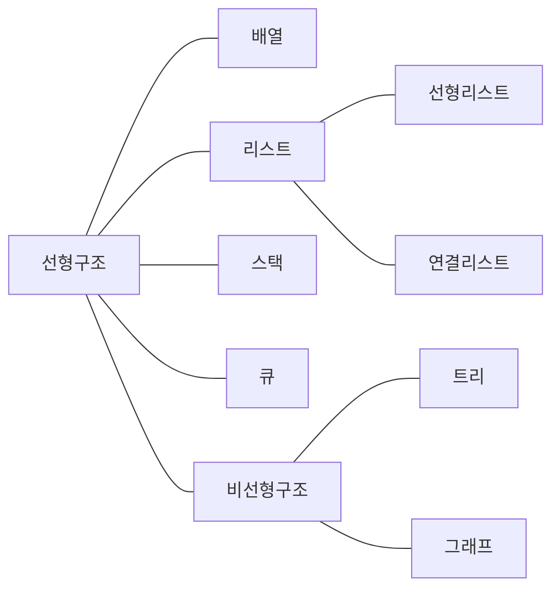

[그림 1] 자료구조의 분류

〈표 9〉 순차자료구조와 연결자료구조의 비교

<table>
<tbody>
<tr>
<td>구분</td>
<td>순차자료구조</td>
<td>연결자료구조</td>
</tr>
<tr>
<td>메모리 저장 방식</td>
<td>메모리저장 시작위치부터 빈자리 없이 자료를<br>순서대로 연속적으로 저장하는 방식</td>
<td>메모리에 저장된 물리적 위치나 순서에 상관없이<br>링크에 의해 논리적인 순서를 표현하는 방식</td>
</tr>
<tr>
<td>논리/물리 순서 일치 여부</td>
<td>논리적인 순서와 물리적인 순서가 일치하는<br>방식</td>
<td>논리적 순서와 물리적 순서가 일치하지 않음</td>
</tr>
</tbody>
</table>

<!-- PDF page: 039 -->

<table>
<tbody>
<tr>
<td>구분</td>
<td>순차자료구조</td>
<td>연결자료구조</td>
</tr>
<tr>
<td>연산특징</td>
<td>삽입 • 삭제 연산을 해도 빈자리가 없기 때문에<br>자료가 순서대로 연속하여 저장</td>
<td>삽입 • 삭제 연산으로 논리적인 순서가 변경되어도<br>링크정보만 변경되어 물리적 순서는 변경되지 않음</td>
</tr>
<tr>
<td>프로그램 기법</td>
<td>배열을 이용한 구현</td>
<td>포인터를 이용한 구현</td>
</tr>
</tbody>
</table>

#### 다) 스택과 큐

##### ① 스택(Stack)

스택은 선형리스트의 하나로 데이터가 입력된 순서로 기억공간에 저장되어 출력 시 가장 나중에 쌓인 데이터가 가장 먼저 출력을 하게 되는 자료구조이다. 즉, 스택에 저장된 원소는 top으로 정한 곳에서만 접근이 가능하여 top 위치에서만 원소를 삽입하고 마지막에 삽입한 원소는 맨 위에 쌓여 있다가 가장 먼저 출력되게 된다.

<!-- 생략: 그림 2 스택의 개념도 / 용기 모양과 곡선 화살표. 원문의 문구와 입력 순서는 아래 표로 유지 -->

스택(Stack): 엑세스(삽입/삭제), LIFO(Last-In-First-Out)

| 위치 | 자료 |
| --- | --- |
| top | 마지막에 입력한 자료(가장 최근 자료) |
| 맨 아래 | 첫 번째로 입력한 자료(가장 오래된 자료) |

| 데이터 입력 순서 → |  |  |
| --- | --- | --- |
|  |  | 데이터 [2] |
|  | 데이터 [1] | 데이터 [1] |
| 데이터 [0] | 데이터 [0] | 데이터 [0] |

[그림 2] 스택의 개념도

스택의 연산의 종류는 다음과 같다.

- top(): 스택의 맨 위에 있는 데이터 값을 반환한다.

- push(): 스택에 데이터를 삽입한다.

- pop(): 스택에서 데이터를 삭제하여 반환한다.

- isempty(): 스택에 원소가 없으면 true 값을 반환하고 있으면 false 값을 반환한다.

- isfull(): 스택에 원소가 없으면 false 값을 반환하고 있으면 true 값을 반환한다.

##### ② 큐(Queue)

스택과 유사하게 삽입과 삭제의 위치가 제한되어 있지만 스택과는 달리 데이터가 삽입되는 곳과 삭제되는 곳이 다른 자료구조이다. 큐는 뒤에서만 삽입되고 앞에서는 삭제만 할 수 있는 구조로 삽입된 순서대로 원소가 나열되어 가장 먼저 삽입한 원소는 맨 앞에 있다가 가장 먼저 삭제된다.

<!-- PDF page: 040 -->

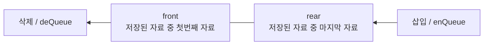

[그림 3] 큐의 개념도

큐의 연산 종류는 다음과 같다.

- enQueue: 큐에 데이터를 삽입한다. rear를 움직여 큐의 공간을 확보한 후 데이터를 삽입한다.

- deQueue: 큐에서 데이터를 삭제한다. front를 움직여 가장 오래된 데이터를 다음 번째 데이터로 넘기게 된다.

##### ③ 스택과 큐의 연산 비교

〈표 10〉 스택과 큐에서의 삽입과 삭제 연산비교

<table>
<thead><tr><th>항목</th><th colspan="2">삽입연산</th><th colspan="2">삭제연산</th></tr>
<tr><th>자료구조</th><th>연산자</th><th>삽입위치</th><th>연산자</th><th>삭제위치</th></tr></thead>
<tbody><tr><td>스택</td><td>push</td><td>top</td><td>pop</td><td>top</td></tr>
<tr><td>큐</td><td>enQueue</td><td>rear</td><td>deQueue</td><td>front</td></tr></tbody>
</table>

#### 라) 트리와 그래프

##### ① 트리(Tree)

원소들 간에 계층관계를 가지는 계층형 자료 구조로 상위원소에서 하위 원소로 내려가면서 확장되는 나무 모양의 구조를 가지고 있으며 원소들 간에 1:다 관계를 가진다. 트리의 시작노드를 루트노드(root node)라고 하고 노드를 연결하는 선을 간선(edge)이라고 한다. 같은 부모 노드를 가진 자식 노드들을 형제노드(sibling node)라고 하고 부모노드와 연결된 간선을 끊었을 때 생성되는 트리를 서브트리(subtree)라고 한다.

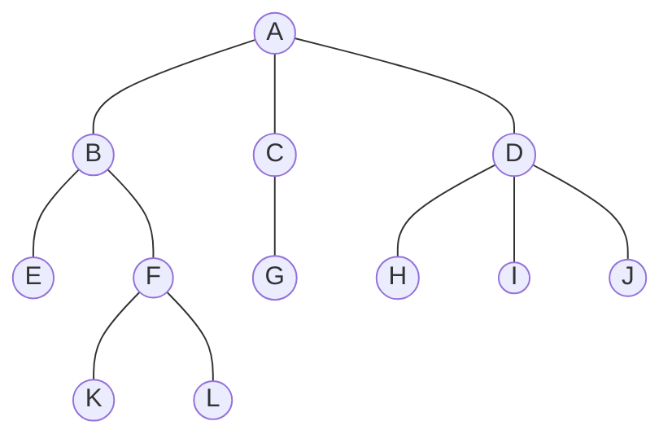

| 구분 | 노드 |
| --- | --- |
| 루트레벨 0 | A |
| 레벨 1 | B, C, D |
| 레벨 2 | E, F, G, H, I, J |
| 레벨 3 | K, L |
| 단말노드 | E, G, H, I, J, K, L |

[그림 4] 트리 개념도

<!-- PDF page: 041 -->

##### ② 그래프(Graph)

연결되어 있는 원소 사이의 다:다 관계를 표현하는 자료구조로 객체를 나타내는 정점(vertex)과 객체를 연결하는 간선 (edge)의 집합이다. 그래프 자료구조는 전기회로분석, 최단거리 검색, 인공지능 등과 같이 여러가지 복잡한 문제들을 그래프로 나타내어 그래프이론을 기반으로 문제를 해결하는 경우가 많다.

〈표 11〉 그래프 종류

| 종류 | 설명 |
| --- | --- |
| 무방향 그래프 | 그래프의 정점 사이에 방향성이 없는 선으로 연결된 그래프 |
| 방향 그래프 | 연결선이 방향성을 지니는 그래프로 정점에 쌍으로 나타난 정점의 순서가 중요한 그래프 |
| 완전 그래프 | 그래프의 각 정점에서 다른 모든 정점을 연결하여 최대로 많은 간선 수를 가진 그래프 |
| 가중 그래프 | 그래프의 정점을 연결하는 간선에 가중치(weight)를 할당한 그래프 |

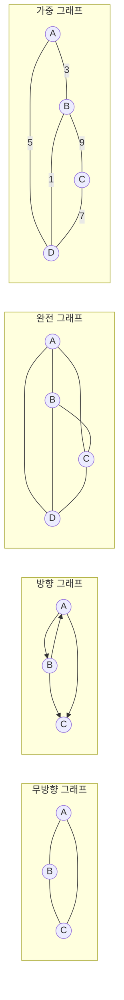


그래프는 수행하는 기능이나 응용 방법에 따라 다양한 구현방법으로 메모리 내 표현된다.

- 인접행렬(Adjacency Matrix): 순차 자료구조를 이용한 그래프 구현 방식으로 행렬에 대한 2차원 배열을 사용하여 그래프의 두 정점을 연결한 간선의 유무를 행렬로 저장하는 방식

- 인접리스트(Adjacency List): 연결 자료구조를 이용한 그래프 구현방식으로 각 정점에 대한 인접 정점들을 연결하여 만든 단순 연결 리스트로 각 정점의 차수만큼 노드를 연결하는 방식

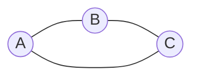

[인접행렬]

|  | A | B | C |
| --- | --- | --- | --- |
| A | 0 | 1 | 1 |
| B | 1 | 0 | 1 |
| C | 1 | 1 | 0 |

[인접리스트]

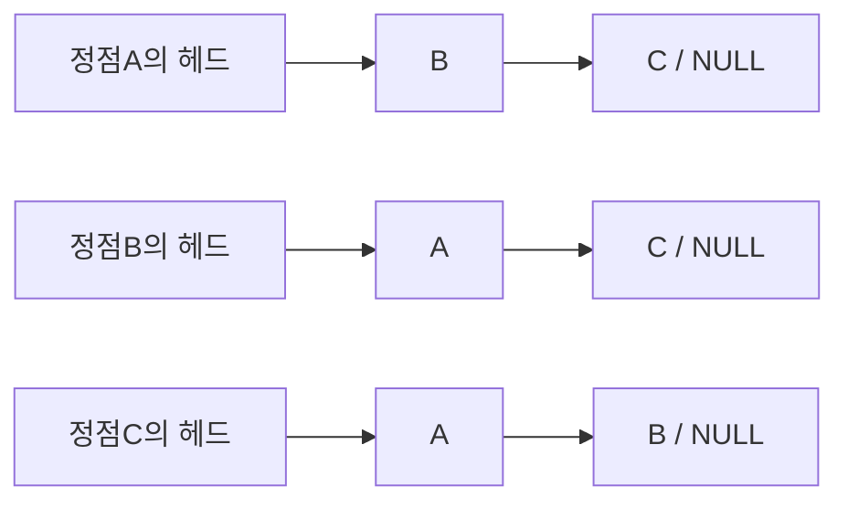

[그림 5] 그래프의 구현방법

#### 마) 자료구조의 선택 기준

① 자료의 처리 시간

② 자료의 크기

<!-- PDF page: 042 -->

③ 자료의 활용 빈도

④ 자료의 갱신 정도

⑤ 프로그램의 용이성

#### 바) 자료구조의 활용

데이터의 정렬(Sort), 검색(Search), 파일 편성 및 인덱스 등에서 주로 활용된다. 자료구조별 활용 분야를 정리하면 다음과 같다.

① 리스트: 배열의 구현, DBMS 인덱스, 탐색이나 정렬과 같은 문제 등

② 스택(Stack): 인터럽트 처리, 재귀 프로그램의 순서 제어, 서브루틴의 복귀 번지 저장, 후위(Postfix) 표기법으로 표현된 수식의 연산, 텍스트 에디터 Undo 기능 등

③ 큐(Queue): 운영체제의 작업 스케줄링, 대기 행렬의 처리, 비동기 데이터 교환(파일I/O, Pipes, Sockets), 키보드 버퍼 이용, 스풀(Spool) 운용 등

④ 데크(Deque): 스택과 큐의 장점만 활용한 자료구조로 스택과 큐 관련 분야에서 활용

⑤ 트리: 탐색이나 정렬과 같은 문제, 문법의 파싱, 허프만 코드, 결정 트리, 게임 등

⑥ 그래프: 컴퓨터 네트워크(근거리 통신망, 인터넷, 웹 등), 전기회로 분석, 이항 관계, 연립 방정식 등

### 02 알고리즘(Algorithm)

#### 가) 알고리즘 개요

##### ① 알고리즘의 정의

알고리즘이란 주어진 문제를 해결하기 위한 일련의 처리 절차를 단계적으로 기술한 것으로 문제 해결 방법을 추상화하여 단계적 절차를 논리적으로 기술해 놓은 명세서이다. 알고리즘의 목표는 단순히 원하는 결과를 얻을 수 있는 알고리즘이 아닌, 처리시간이나 기억장소 사용 측면에서 효율적인 알고리즘을 개발하는 것이다.

##### ② 알고리즘의 조건

〈표 12〉 알고리즘의 조건

<table>
<tbody>
<tr>
<td>조건</td>
<td>설명</td>
</tr>
<tr>
<td>입력(Input)</td>
<td>알고리즘 수행에 필요한 자료가 외부에서 0개 이상 입력으로 제공될 수 있어야 한다.</td>
</tr>
<tr>
<td>출력(Output)</td>
<td>알고리즘 수행 후 하나 이상의 결과를 출력해야 한다.</td>
</tr>
<tr>
<td>명확성(Definiteness)</td>
<td>수행할 작업의 내용과 순서를 나타내는 알고리즘의 각 처리 단계의 명령어들은 명확하게 명세되어야 한다.</td>
</tr>
<tr>
<td>유한성(Finiteness)</td>
<td>알고리즘은 수행 후에 반드시 종료되어야 한다.</td>
</tr>
<tr>
<td>효과성(Effectiveness)</td>
<td>알고리즘의 모든 명령어들은 기본적이며 실행이 가능해야 한다.</td>
</tr>
</tbody>
</table>

#### 나) 알고리즘 분석 기준

##### ① 정확성(Correctness)

알고리즘이 타당한 입력에 대해서 유한 시간 내에 올바른 결과를 산출하는가를 판단한다.

<!-- PDF page: 043 -->

##### ② 작업량(Amount of Work Done)

알고리즘을 수행하는데 걸리는 수행 횟수를 나타내며, 전체 알고리즘에서 기본으로 포함되는 일반 연산을 제외하고 흐름의 핵심이 되는 중요한 연산들만으로 작업량을 측정한다.

##### ③ 기억 장소 사용량(Amount of Space Used)

알고리즘이 수행되는 동안 데이터와 정보 등을 저장하기 위해 필요한 컴퓨터 메모리의 사용량을 의미한다.

##### ④ 최적성(Optimality)

“어떤 알고리즘이 최적이다”라고 하는 것은 알고리즘을 적용할 시스템의 사용 환경(수행량, 메모리 사용량 등)을 고려할 때 그 알고리즘보다 더 적합한 알고리즘이 없다는 것을 의미한다.

##### ⑤ 단순성(Simplicity)

알고리즘의 표현이 얼마나 이해하기 쉽게 명확하게 작성되었는지를 의미한다. 알고리즘이 단순하면 알고리즘의 정확성을 증명하는 것과 프로그램의 작성 및 디버깅이 수월하다.

#### 다) 알고리즘 표현 방법

〈표 13〉 알고리즘 표현 방법

| 표현 방법 | 설명 |
| --- | --- |
| 자연어 기술 | 일상적으로 사용하는 말이나 글을 이용하여 표현하는 방법으로 알고리즘을 표현 |
| 순서도 표현 | 순서도(Flowchart)나 NS(Nassi-Shneiderman)차트와 같은 그래픽적인 방법으로 알고리즘 표현 |
| 의사코드<br>(Pseudo Code) | 자연어 기술방법보다 간략한 알고리즘을 프로그래밍 언어와 유사한 형태로 작성한 코드로 알고리즘 표현 |

#### 라) 알고리즘 성능 분석

알고리즘의 성능 분석은 실행에 필요한 공간 측면에서 분석하는 공간 복잡도와 실행에 소요되는 시간 측면에서 분석하는 시간 복잡도를 추정하여 일반적인 평가를 한다.

##### ① 공간 복잡도

알고리즘을 프로그램으로 실행하여 완료하기까지 필요한 총 저장 공간을 의미하며 고정 공간량과 가변 공간량의 합으로 구할 수 있다.

공간 복잡도 = 고정 공간량 + 가변 공간량

- 고정 공간량: 프로그램, 변수 및 상수들과 같이 프로그램의 크기나 입출력 횟수에 상관없이 고정적으로 필요한 저장 공간

- 가변 공간량: 프로그램의 수행과정에서 사용하는 자료와 변수들을 저장하는 공간과 함수 실행에 관련된 정보를 저장하는 공간

##### ② 시간 복잡도

알고리즘을 프로그램으로 실행하여 완료하는 데 걸리는 시간으로 컴파일시간과 실행시간의 합으로 구한다.

시간 복잡도 = 컴파일시간 + 실행시간

<!-- PDF page: 044 -->

- 컴파일시간: 프로그램 특성과 관련이 적은 고정적인 시간으로 일단 컴파일이 되면 프로그램의 수정이 일어나지 않는 한 일정하게 유지

- 실행시간: 프로그램의 실행시간으로 컴퓨터의 성능 등에 의존하므로 실제 정확한 실행시간을 측정하기 보다는 명령문의 실행 빈도수를 구하여 계산

알고리즘 간의 비교 시에는 주로 실행 시간을 사용하며 시간 복잡도로 나타낼 빅-오(Big Oh) 표기법¹을 사용하여 O(n)로 표기한다. 알고리즘에 따라 logn, n, nlogn, n², n³, 2ⁿ 등의 실행 시간 함수가 있다. 문제 해결을 위해 다수의 알고리즘을 작성하고 각각의 실행 시간 함수를 구하여 가장 작은 값의 시간 복잡도를 갖는 알고리즘을 선택하는 것이 좋다.

〈표 14〉 실행시간 함수에서 n값의 변화에 따른 실행 빈도 수의 계산

| logn | < | n | < | nlogn | < | n² | < | n³ | < | 2ⁿ |
| --- | --- | --- | --- | --- | --- | --- | --- | --- | --- | --- |
| 0 | | 1 | | 0 | | 1 | | 1 | | 2 |
| 1 | | 2 | | 2 | | 4 | | 8 | | 4 |
| 2 | | 4 | | 8 | | 16 | | 64 | | 16 |
| 3 | | 6 | | 24 | | 64 | | 512 | | 256 |
| 4 | | 16 | | 64 | | 256 | | 4096 | | 65536 |
| 5 | | 32 | | 160 | | 1024 | | 32768 | | 4294967296 |

〈표 15〉 알고리즘 복잡도

| 복잡도 표기 | 설명 |
| --- | --- |
| O(1) | 상수형, 입력 크기와 무관하게 바로 해를 구함 |
| O(log<sub>N</sub>) | 로그형, 입력 자료를 나누어 그 중 하나만 처리 |
| O(N) | 선형, 입력 자료를 차례로 하나씩 모두 처리 |
| O(Nlog<sub>N</sub>) | 분할과 합병형, 자료를 분할하여 각각 처리하고 합병 |
| O(N²) | 제곱형, 기본연산 loop 구조가 2중인 경우 |
| O(N³) | 세제곱형, 기본연산 loop 구조가 3중 경우 |
| O(2ⁿ) | 지수형, 가능한 해결방법 모두를 다 검사하며 처리 |

#### 마) 정렬 알고리즘

##### ① 정렬의 분류

정렬은 정렬 장소에 따라 내부정렬(Internal Sort)과 외부정렬(External Sort)로 분류할 수 있다. 정렬 방법은 사용하는 시스템의 특성, 데이터의 양과 상태, 정렬에 필요한 기억 공간 및 실행 시간 등의 조건을 고려하여 선택한다.

- 내부정렬: 소량의 데이터에 대해 주기억 장치에 올려서 정렬하는 방식으로 정렬 속도는 빠르나 주기억 장치의 용량에 의해 정렬할 수 있는 데이터의 양이 제한됨

- 외부정렬: 대량의 데이터에 대해 보조 기억 장치에서 정렬하는 방식으로 대량의 데이터를 몇 개의 서브 파일로 나누어 내부 정렬을 한 후 보조기억장치에서 정렬된 각 서브 파일들을 병합하는 방식으로 속도가 느림.

1 빅-오 표기법으로 표현하는 방법은 먼저 실행 빈도수를 구하여 실행 시간 함수를 찾고, 이 함수의 값에 가장 큰 영향을 주는 n에 대한 항을 선택하여 계수는 생략하고 O의 오른쪽 괄호 안에 표시한다.

<!-- PDF page: 045 -->

##### ② 내부 정렬 알고리즘의 분류

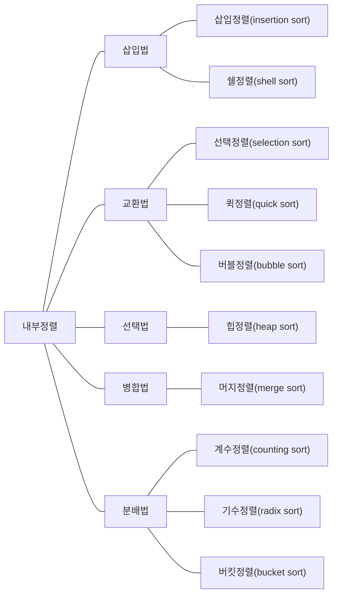

[그림 6] 내부정렬의 분류

<!-- PDF page: 046 -->

##### ③ 내부 정렬 알고리즘의 수행시간 비교

〈표 16〉 내부 정렬 알고리즘의 수행시간 비교

<table>
<thead><tr><th rowspan="2">정렬방법</th><th rowspan="2">설명</th><th colspan="3">수행시간</th><th rowspan="2">추가 메모리</th></tr>
<tr><th>최악</th><th>평균</th><th>최선</th></tr></thead>
<tbody>
<tr><td>삽입정렬</td><td>- 데이터가 정렬되어 있다고 가정하고 값을 해당 위치에 삽입하여 정렬하는 방법</td><td>O(n²)</td><td>O(n²)</td><td>O(n)</td><td>없음</td></tr>
<tr><td>쉘정렬</td><td>- 주어진 자료 리스트를 특정 매개변수 값의 길이를 갖는 부파일(subfile)로 쪼개서, 각 부파일에서 삽입정렬을 수행</td><td>O(nlog<sub>2</sub>n)</td><td>O(n<sup>1.5</sup>)</td><td>O(n)</td><td>없음</td></tr>
<tr><td>선택정렬</td><td>- 최소값을 찾아 왼쪽으로 이동시키는데 데이터의 크기(개수)만큼 반복하여 정렬하는 방법</td><td>O(n²)</td><td>O(n²)</td><td>O(n²)</td><td>없음</td></tr>
<tr><td>퀵정렬</td><td>- 분할 정복(Divide and Conquer)의 방식으로 고안된 정렬 방법으로 먼저 임의의 기준을 선택하여 그 기준보다 작은 값을 왼쪽에, 큰 값을 오른쪽에 위치시킨 후 다시 임의의 기준을 선택하여 왼쪽과 오른쪽을 반복하여 나누어 가며 정렬하는 방법<br>- 재귀호출(recursive call)을 사용</td><td>O(n²)</td><td>O(nlogn)</td><td>O(nlogn)</td><td>없음</td></tr>
<tr><td>버블정렬</td><td>- 인접한 데이터 간에 교환이 계속해서 일어나면서 정렬이 이루어지는 방법</td><td>O(n²)</td><td>O(n²)</td><td>O(n²)</td><td>없음</td></tr>
<tr><td>힙정렬</td><td>- 최대 힙 트리나 최소 힙 트리를 구성해 정렬을 하는 방법</td><td>O(nlogn)</td><td>O(nlogn)</td><td>O(nlogn)</td><td>없음</td></tr>
<tr><td>머지정렬</td><td>- 분할정복방법을 사용하는데 데이터의 크기를 반으로 계속 나누고 이를 정렬하면서 다시 합치는 방법</td><td>O(nlogn)</td><td>O(nlogn)</td><td>O(nlogn)</td><td>있음</td></tr>
<tr><td>기수정렬</td><td>- 데이터의 낮은 자리 수부터 비교하여 정렬해 가는 방법</td><td>O(dn)</td><td>O(dn)</td><td>O(dn)</td><td>있음</td></tr>
</tbody>
</table>

<!-- PDF page: 047 -->

선택정렬은 가장 간단한 정렬 알고리즘 중 하나로 배열 A[1…n]에서 가장 큰 원소를 찾아 배열의 맨 끝자리에 있는 A[n] 자리를 바꾸는 정렬 방법이다.

```text
selectionSort (A[ ], n)
{
  for last ← n downto 2 {
    A[1…last] 중 가장 큰 수 A[k]를 찾는다.
    A[k] ↔ A[last];
  }
}
```

for 루프는 정렬할 배열의 크기를 하나씩 줄이는 역할로 맨 처음 배열의 크기가 n에서 시작하여 다음 루프에서는 n-1이 되고 지속적으로 작아지게 된다.

|  |  | 배열 |
| --- | --- | --- |
|  | 정렬할 배열이 주어짐 | 8, 31, 48, 73, 3, 65, 20, 29, 11, 15 |
| 첫 번째 루프 | 가장 큰 수를 찾는다(73). | 8, 31, 48, **73**, 3, 65, 20, 29, 11, 15 |
| 첫 번째 루프 | 73을 맨 오른쪽 수(15)와 자리 바꾼다. | 8, 31, 48, 15, 3, 65, 20, 29, 11, **73** |
| 두 번째 루프 | 맨 오른쪽 수를 제외한 나머지에서 가장 큰 수를 찾는다(65). | 8, 31, 48, 15, 3, **65**, 20, 29, 11, 73 |
| 두 번째 루프 | 65를 맨 오른쪽 수(11)와 자리 바꾼다. | 8, 31, 48, 15, 3, 11, 20, 29, **65**, 73 |
|  | 맨 오른쪽 수를 제외한 나머지에서 가장 큰 수를 찾는다(48). | 8, 31, **48**, 15, 3, 11, 20, 29, 65, 73 |

[그림 7] 선택정렬 알고리즘 예시

<!-- PDF page: 048 -->

##### ④ 버블정렬

선택정렬처럼 제일 큰 원소를 끝자리로 옮기는 작업을 반복하지만 제일 큰 원소를 오른쪽으로 옮길 때 왼쪽에 이웃한 수를 비교하면서 순서가 제대로 되어 있지 않으면 자리를 바꾸어 진행하는 정렬알고리즘이다.

```text
bubbleSort (A[ ], n)
{
  for last ← n downto 2 {
    for i ← 1 to last -1
      if (A[i] > A[i + 1]) then A[i] ↔ A[i + 1];
}
```

<!-- 원문 코드의 닫는 중괄호 개수를 그대로 유지 -->

|  | 배열 |
| --- | --- |
| 정렬할 배열이 주어짐 | 3, 31, 48, 73, 8, 11, 20, 29, 65, 15 |
| 왼쪽부터 시작해 이웃한 쌍들을 비교해 나간다. | 3, 31, 48, 73, 8, 11, 20, 29, 65, 15 |
| 순서대로 되어있지 않으면 자리를 바꾼다. | 3, 31, 48, **8, 73**, 11, 20, 29, 65, 15 |
|  | 3, 31, 48, 8, **11, 73**, 20, 29, 65, 15 |
| ⋮ | ⋮ |
|  | 3, 31, 48, 8, 11, 20, 29, 65, **15, 73** |
| 맨 오른쪽 수(73)를 대상으로 제외한다. | 3, 31, 48, 8, 11, 20, 29, 65, 15, **73** |

[그림 8] 버블정렬 알고리즘 예시

#### 바) 검색 알고리즘

##### ① 검색 알고리즘 개요

데이터 집합에서 원하는 항목을 효율적으로 찾는 기법으로 데이터의 정렬 여부에 따라 순차검색(Linear Search)과 제어검색(Control Search)으로 구분할 수 있다. 또한, 특정 함수에 따라 키 값을 계산하여 데이터를 검색하는 해싱도 있다. 따라서, 자료구조의 형태 및 자료의 배열 상태를 고려하여 최적의 탐색 방법을 선택해야 한다.

##### ② 검색 알고리즘의 분류

〈표 17〉 검색 알고리즘의 분류

| 분류방법 | 데이터정렬 | 종류 | 내용 및 특징 |
| --- | --- | --- | --- |
| 선형 검색<br>(Linear Search) | x | 선형 탐색<br>(Linear Search) | • 처음부터 마지막까지 순서대로 각 레코드를 비교하면서 찾아가는 방법<br>• 프로그램 작성이 용이<br>• 파일의 크기가 커질수록 탐색시간이 증가<br>• 가장 간단하고 직접적인 검색 방법<br>• 평균비교횟수: (n+1)/2, 평균검색시간: O(n) |

<!-- PDF page: 049 -->

<table>
<thead><tr><th>분류방법</th><th>데이터정렬</th><th>종류</th><th>내용 및 특징</th></tr></thead>
<tbody>
<tr><td rowspan="5">제어 검색<br>(Control Search)</td><td rowspan="5">○</td><td>이진탐색<br>(Binary Search)</td><td>• 상한값(F)과 하한값(L)을 설정하고 그 중간값(M)을 구한 후 키와 중간값을 계속 비교하면서 검색하는 방법<br>• 파일의 탐색 대상을 ½씩 줄여가면서 탐색하므로 효율적임<br>• 레코드 수가 많을 수록 효과적임(최악의 경우라도 비교횟수는 평균횟수보다 한 번 더 많음)<br>• 평균검색시간: O(log₂n)</td></tr>
<tr><td>피보나치탐색<br>(Fibinacci Search)</td><td>• 피보나치 순열을 이용하여 서브 파일을 형성해 가면서 검색하는 방법<br>• 이진검색은 나눗셈을 이용하나, 피보나치 검색은 덧셈과 뺄셈만으로 검색이 가능하므로 속도가 빠름<br>• 평균검색시간: O(log₂n)</td></tr>
<tr><td>보간탐색<br>(Interpolation Search)</td><td>• 탐색 대상이 있을 것으로 예상되어지는 위치를 선택하여 찾아가는 방식으로 이후 그 위치에서 선형 탐색을 함<br>• 사전이나 전화번호부, 색인명 등과 같은 탐색에 이용<br>• 평균적으로 O(log(n))의 성능</td></tr>
<tr><td>블록탐색<br>(Block Search)</td><td>• 전체 데이터를 일정한 개수의 블록으로 구분하고 찾기를 원하는 데이터가 속한 블록을 결정한 후에 해당 블록 내의 키 값을 순차적으로 검색하는 방법<br>• 효율적인 블록의 크기는 √n<br>• 프로그램 작성과 갱신이 쉬움<br>• 평균적으로 O(log(n))의 성능</td></tr>
<tr><td>이진트리탐색<br>(Binary Tree Search)</td><td>• 이진 트리를 이용하는 검색방법<br>• 평균적으로 삽입/검색/삭제 모두 O(log(n))의 성능</td></tr>
<tr><td>특정 함수를 이용하여 접근하는 방식</td><td>x</td><td>해싱(Hashing)</td><td>• 해싱함수를 이용하여 데이터가 저장되어 있는 주소를 직접 계산하여 찾아가는 검색방법<br>• 삽입과 삭제가 빈번한 자료에 적합함</td></tr>
</tbody>
</table>

#### 사) 그래프 탐색 알고리즘

##### ① 그래프 탐색(Graph Search)

그래프의 가장 기본적인 연산으로 하나의 정점에서 시작하여 그래프에 있는 모든 정점을 한 번씩 방문하여 처리하는 연산이다. 도로망에서 특정 도시에서 다른 도시로 갈 수 있는지 여부나 전자회로에서의 단자 연결 여부 등 해결해야 하는 많은 문제들이 단순히 그래프 노드를 탐색하는 것으로만 해결되는 경우가 많다. 그래프 탐색 방법에는 깊이 우선 탐색(depth first search)과 너비 우선 탐색(breadth first search) 방법이 있다.

##### ② 깊이 우선 탐색(DFS, Depth First Search)

시작 정점의 한 방향으로 갈수 있는 경로가 있는데까지 깊이 탐색해가다 더 이상 갈 곳이 없으면 마지막 갈림길 간선이 있는 정점으로 되돌아와 다른 방향의 간선으로 탐색을 계속 반복하여 목표 노드를 찾을 때까지 정점을 방문하는 방법이다. 마지막 갈림길 간선의 정점으로 되돌아가 깊이 우선 탐색을 반복해야 하므로 후입선출 구조의 스택을 사용한다. 시작 노드에서 목표노드까지의 가장 짧은 거리를 처음에 찾는 것을 보장할 수 없지만 현재 경로상의 노드들만 기억하기 때문에 저장 공간의 수요가 적고 목표노드가 깊은 단계에 있는 경우 신속하게 목표를 찾을 수 있고 구현이 용이하다.

<!-- PDF page: 050 -->

<!-- 생략: 그림 9 / 겹치는 순회·복귀 화살표. 원본의 노드·트리 간선·색상 구분을 유지 -->

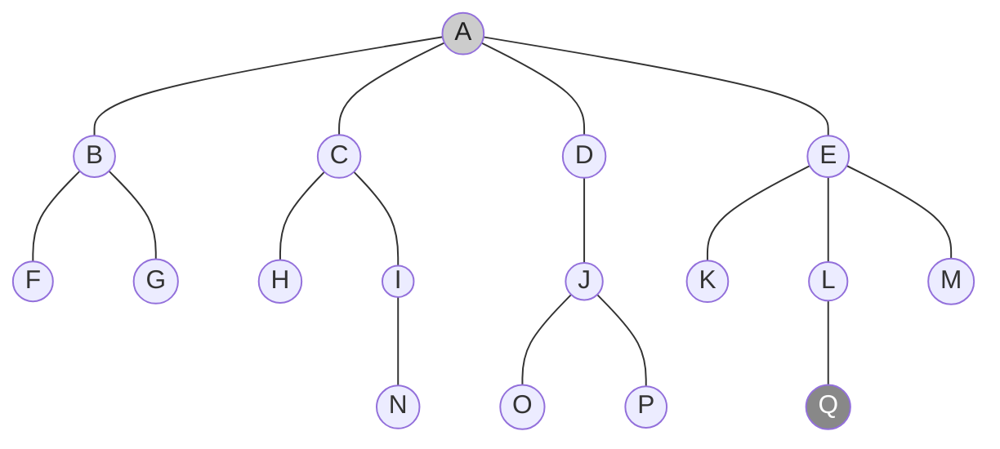

[그림 9] 깊이 우선 탐색 예시

##### ③ 너비 우선 탐색(BFS, Breadth First Search)

하나의 시작 정점을 방문한 후 인접한 노드를 먼저 탐색하는 방법으로 시작 정점으로부터 가까운 정점을 먼저 방문하고 멀리 떨어져 있는 정점을 나중에 방문하는 탐색 방법이다. 너비 우선 탐색의 경우 어떤 노드를 방문했었는지 여부를 반드시 검사해야 하고 방문한 노드들을 차례대로 꺼낼 수 있는 자료 구조인 큐를 사용한다.

<!-- 생략: 그림 10 / 겹치는 순회·복귀 화살표. 원본의 노드·트리 간선·색상 구분을 유지 -->


[그림 10] 너비 우선 탐색 예시

#### 아) 최소 신장 트리(Minimum Spanning Tree)

##### ① 최소 신장 트리(Minimum Spanning Tree) 소개

신장트리(Spanning Tree)는 무방향 가중치 그래프 내 모든 정점을 포함하고 서로 연결되어 있는 트리의 특수한 형태로 사이클을 포함해서는 안되는 트리이다. 신장 트리는 구성하는 가중치의 합이 최소인 신장 트리를 최소 신장 트리라고 한다. 최소 신장 트리를 구현하는 대표적인 알고리즘은 크루스칼(Kruskal) 알고리즘과 프림(Prime) 알고리즘이 있다.

##### ② 크루스칼(Kruskal) 알고리즘

정점에 연결된 간선 가운데 가중치가 최소인 간선를 선택하고 추가된 간선이 사이클을 만드는지 체크하는 방식으로 처리

<!-- PDF page: 051 -->

한다. 가중치가 가장 낮은 간선을 선택한 후 정점과 연결이 되어 있지 않더라도 가중치가 작은 간선을 순서대로 선택하는 방법이다.

##### ③ 프림(Prime) 알고리즘

분석대상 그래프에서 임의의 한 정점을 선택하여 각 반복과정마다 그때까지 구성된 최소 신장 트리 부분에 방문하지 않은 새로운 정점과 간선을 선택하여 확장해나가는 방법이다.

[참고 및 추천 자료]

[1] 이지영, "C로 배우는 자료구조”, 서울, 한빛미디어, 2011.

[2] 이상진, “열혈강의 자료구조”, 프리렉, 2010.

<!-- PDF page: 052 -->

## Ⅳ. 소프트웨어 설계 원리와 구조적 설계

### 최근 동향 및 주요 이슈

이제 세계는 무한 품질 경쟁시대에 접어들었고 소프트웨어도 그 예외가 될 수 없다. 소프트웨어 설계는 소프트웨어의 품질과 밀접한 관계를 가지고 있다. 요구사항 분석에 대한 노력도 좋은 설계를 위한 과정이라 볼 수 있다. 분석 및 설계 단계에서 품질 관리와 예방 활동을 강화할수록 소프트웨어의 실패 비용을 크게 줄일 수 있게 된다.

### 학습 목표

1. 설계 시 고려되어야 하는 소프트웨어 설계 원리의 종류와 내용을 설명할 수 있다.

2. 모듈 설계평가 기준인 응집도(Cohesion)와 결합도(Coupling)의 개념을 설명할 수 있다.

3. 구조적 설계방법을 이해하고, 설계한 내용을 표현할 수 있다.

### 핵심 키워드

분할, 추상화, 정보은닉, 단계적 정제, 모듈화, 구조화<br>
응집도, 결합도<br>
변환 중심 설계, 트랜잭션 중심 설계, 구조도(Structure Chart)

<!-- PDF page: 053 -->

### 실무 미리보기 잘못된 소프트웨어 설계로 인한 로켓폭발

소프트웨어는 요구사항 분석으로부터 컴퓨터월드로 추상화되는 설계과정을 진행하게 되는데, 설계에 정의되는 수많은 변수와 그들이 활용하게 되는 변수형, 오류값으로 인한 예외사항들에 대한 처리방안을 포함토록 해야 한다. 소프트웨어의 설계적 결함은 경계값 분석등과 같은 테스트를 반복하는 과정에서 제거되기도 한다. 또한, 만약의 사태에 대비한 데이터와 서버의 이중화 구성 또한 이를 안정적으로 지원할 수 있도록 설계되어야 안정적으로 수행할 수 있는 것이다.

1996년 6월 4일 발사과정에서 폭발한 아리안 5호의 경우는 처리 변수형 불일치로 인한 예외사항 설계와 이중화에 대한 설계고려가 불충분함에 의한 사고라고 볼 수 있다.

설계된 처리변수형은 16비트형 정수인데 반해 64비트 실수형이 입력됨에 따라 이에 대한 정수형 변환과정에서 발생한 예외처리가 설계에 충분히 반영되지 못하여 오버플로우가 발생하였다. 이로 인해 중앙제어 컴퓨터에 해당 고도, 속도 정보 등을 보내지 못하게 되었다.

한쪽 SRI-2가 장애상황으로 진입하게 된 시점에 이중화 되어있는 SRI-1이 활성화 되어야 하나 동일한 아키텍쳐로 설계된 사항으로 동일한 입력값 발생상황에서는 어떠한 효과도 발생할 수 없게 되었고, 결국 엔진 노즐 각도 및 추진력 등의 제어를 상실하게 된 아리안 5호는 궤도를 잃고 폭발하게 되었다.

아리안 5호는 후에 밝혀진 내용에 따르면 SRI의 부하 최대 목표치 80%를 충족하기 위하여 7개 중 3개의 예외 처리를 생략했다는 사실이 있었고, 이로 인해 전적인 책임을 소프트웨어 개발 쪽에 지울 수 없었다고 한다. 결국 고품질의 소프트웨어 설계는 설계자체로 보장된다고 볼 수 없으며, 개발 및 테스트 과정에서 최대한 높은 테스트 범위를 보장하는 케이스가 활용되고 이를 통한 예상치 못한 결함이 보완되고, 이를 통해 설계 보완 과정이 반복되어야 높은 품질의 소프트웨어가 완성될 수 있을 것이다.

<!-- PDF page: 054 -->

### 01 소프트웨어 설계 원리

소프트웨어 설계 단계에서 사용자의 요구사항을 지속적으로 분할하여 문제영역의 복잡성을 줄여나가야 하며, 이를 통해 얻어진 결과는 역할단위의 독립성과 의존성을 고려하여 적절한 그룹으로 재조합되어야 한다. 이를 분할과 정복(Divide and Conquer)이라는 기본적 설계원리로 표현하기도 한다. 시스템을 분할하여 생각하면 복잡한 문제도 해결하기 쉬울 뿐 아니라 기능을 분할하거나 사용자 인터페이스를 논리적으로 분할하면 보다 쉬운 해결 방법을 찾을 수 있다.

일반적으로 상위레벨에서 분할한 시스템 구성 요소를 서브시스템(Subsystem)이라 부르며, 독립적으로 기능을 수행할 수 있고 컴파일 될 수 있는 프로그램 구성요소를 일컫는다. 서브시스템은 시스템의 구조상에서 상위 레벨에서의 분할을 의미한다.

시스템 설계자(디자이너)는 문제를 서브시스템으로 분할하고 추후 여러 개발자 및 디자이너들이 서로 다른 서브시스템을 독립적으로 개발할 수 있도록 한다. 이러한 분할 과정의 명확성은 서로 다른 개발자들에 의해 개발될 서브시스템들이 추후 원만히 통합되어 전체 시스템이 작동될 수 있도록 하기 위함이다.

#### 가) 추상화(Abstraction)

추상화는 큰 흐름을 잃지 않으면서 점차적으로 문제영역에 접근하기 위해 상세한 수준의 구현을 고민하기 보다 상위 수준에서 제품의 구현을 먼저 생각하는 것을 의미한다. 추상화를 통해 우리의 관심 분야가 아니거나 필수적이 아닌 세부적인 것은 생략해주기 때문에 다루기가 쉽고 필수적인 것만을 표현하게 된다. 추상화는 엔지니어링 전 과정에서 이루어지는 중요한 원리이며, 엔지니어링이란 추상화가 높은 단계에서 낮은 단계로 이동되는 과정이다. 추상화의 유형은 자료(Data) 추상화, 제어(Control) 추상화, 과정(Procedure) 추상화로 나누어 볼 수 있다.

시스템을 분할하며 컴포넌트(또는 모듈)가 어떻게 서로 상호 작용하는지, 외부에 나타나는 동작을 아는 것은 컴포넌트 내부의 상세한 구현 방법을 아는 것에 우선한다. 즉 컴포넌트의 구현 방법을 과감히 생략하고 외부 인터페이스에 초점을 맞추는 것이 추상화 개념이다.

#### 나) 정보 은닉(Information Hiding)

정보 은닉이란 각 모듈의 내부 내용을 감추고 인터페이스를 통해서만 메시지를 전달할 수 있도록 하는 개념으로 내부 정보 접근을 제한하여 한 모듈 또는 하부 시스템이 다른 모듈의 구현에 영향을 받지 않게 설계되는 것을 의미한다. 예를 들어 설계 과정에 변경이 발생하는 경우 그 영향이 최소한의 모듈들에만 미치도록 하는 것이다. 모듈이 외부와의 인터페이스에 의해 정의되며, 모듈의 내부 구조나 진행 과정을 포함하는 상세 정보는 타 모듈에 감추어져 있다면 정보가 은닉되어 있는 것이다. 정보 은닉은 모듈들 사이의 독립성을 유지시켜 준다.

정보 은닉은 반드시 정보 은닉 메커니즘을 갖추고 있는 프로그래밍 언어를 이용해야만 가능한 것은 아니고 소프트웨어를 설계하는 기본적인 원칙이라 할 수 있으며 시스템 설계에 있어 정보 은닉 개념은 구성 요소 간의 독립성을 유지시켜준다는 점에서 중요하다. 모듈 서로 간의 내부 구조를 감추어 주고(추상화), 서로의 내부 구조를 알 필요가 없이 오직 정해진 인터페이스로만 서로 소통한다. 만약 한 모듈에 수정이 요구되는 경우 모듈 내부의 자료 구조와 이에 접근하는 동작들에만 수정을 국한시킴으로써 변화에 쉽게 적응할 수 있고 유지보수를 용이하게 해나갈 수 있게 하는 기반을 제공한다.

#### 다) 단계적 정제(Stepwise Refinement)

단계적 정제는 프로그램의 구조에서 점차 모듈에 대한 세부 사항으로 내려가며 구체화된다. 정제 과정에서 추상화의 수준은 낮아지며 각 기능은 분해되어 해결방안을 제시하게 된다. 정제는 많은 노력을 들이는 과정이며, 세부적인 묘사를 가능하게 함으로써 시스템의 구현을 가능하게 한다.

설계는 높은 추상화 단계에서 낮은 추상화 단계로 가는 단계적 정제 과정이며, 문제기술에서 요구사항 분석, 설계, 프로그래밍으로 이어지는 엔지니어링의 흐름도 단계적 정제 과정이라 볼 수 있다. 구조적 분석기법에서 시스템을 하나의 큰 프로세스로 시작하여 점점 쪼개져 세부기능을 수행하는 작은 프로세스들로 나누어 가는 과정도 단계적 정제이다.

<!-- PDF page: 055 -->

#### 라) 모듈화

모든 공학 분야에서 시스템을 구성 요소로 나누어 접근하는 경우가 대부분이다. 소프트웨어의 경우 이 구성 요소를 대표하는 것이 모듈(Module)이라 할 수 있다. 소프트웨어의 모듈은 프로그래밍 언어로 표현하면 흔히 서브루틴(Subroutine), 프로시저(Procedure), 함수(Function) 등으로 부른다. 시스템을 모듈화할 때는 하향식 접근 방법을 사용하여 기능 단위로 쪼개어 나가는 것이 일반적이며, 이 경우 모듈들 사이의 제어 계층이 나타나게 된다. 또한, 모듈화는 시스템을 지능적(Intelligently)으로 관리할 수 있도록 해 주며, 복잡도(Complexity)의 문제를 해결해 준다. 즉 크고 복잡한 문제를 해결하기 위해 문제를 작은 단위인 모듈로 분할하여 정복(Divide and Conquer)하게 된다. 모듈화는 시스템의 유지 보수와 수정을 용이하게 해 준다. 그러나 모듈의 수가 증가하면 상대적으로 각 모듈의 크기는 감소하며 모듈들 사이의 상호 교류가 증가하여, 시스템의 성능이 떨어지고 과부하(Overload) 현상이 나타나게 된다. 따라서 어떻게 역할별 모듈 간 간섭을 최소화하고 목적에 집중하여 효과적으로 역할을 수행토록 할 것인가가 중요한 모듈평가의 기준이 된다.

#### 마) 구조화

소프트웨어 시스템의 구조화는 분할 과정에 의해 얻어질 수 있으며, 이는 앞에서 언급한 분할하여 정복하는 개념과 연관되어 있다. 분할 과정은 앞의 요구사항 분석 과정에서 일차로 이루어졌으며, 설계 단계에서 더욱 세분화되어 나타나게 된다. 시스템의 중요 요소나 기능을 찾아내어 분할해 나가는 것은 분석가의 임무이며, 분석의 결과를 구조화시키는 것은 설계자의 임무이다. 시스템을 어떻게 분할해 나갈 것인가는 간단한 문제가 아니며 어떻게 분할하면 좋을지에 대한 완벽한 가이드라인은 없다. 그러나 시스템의 특성을 파악하여 기존 시스템들의 경험과 가이드라인을 활용할 수 있다. 기존 시스템들을 살펴보면 시스템의 특성에 따라 몇 가지의 구조적인 틀이 있다. 이러한 틀을 이용하면 유사한 특성을 가진 시스템을 만들고자 할 때 노력과 시간을 절약할 수 있다.

### 02 응집도(Cohesion)와 결합도(Coupling)

좋은 설계를 명확히 정의 내리기란 쉽지가 않다. 좋은 설계는 효율적으로 프로그램을 할 수 있게 해주는 설계라 할 수도 있고, 소프트웨어의 진화 문제를 잘 해결할 수 있도록 변화에 쉽게 적응할 수 있도록 도움을 주는 설계라 정의할 수도 있다. 좋은 설계가 이루어졌다고 인식되기 위해서는 설계 결과인 설계 문서가 읽기 쉽고 이해하기 쉽게 만들어져야 하며, 시스템에 변화가 주어졌을 때 그 영향이 국소화(Localize)되어야 한다.

기능적 독립성을 극대화하고 모듈들 사이의 결합을 줄이는 것이 유지보수를 쉽게 할 수 있는 우수한 설계의 원칙이라 할 수 있다. 객체 지향 설계 기법도 결국 독립성을 최대화할 수 있어 설계의 품질을 높여주는 설계 방법이다. 이 절에서는 설계 단계에서 품질에 영향을 미치는 요소들인 응집도(Cohesion), 결합도(Coupling)에 대하여 살펴보자.

#### 가) 응집도

응집도는 모듈 내부가 얼마나 강한 연관성으로 뭉쳐져 있는가를 나타내는 모듈 성숙도의 측정치이다. 즉, 모듈 내의 각 구성 요소들이 공통의 목적을 달성하기 위하여 서로 얼마나 관련이 있는지 연관 정도를 나타내는 것이다. 응집도는 모듈 안의 구성 요소들이 어울리는 정도를 나타내며, 구성 요소들을 묶어주는 시멘트(Cement)이다. 모듈내의 모든 요소들이 단일 기능을 수행하고 그 상위 모듈을 위해 수행되는 기능적 응집도가 가장 높은 응집도이며, 아무 관련없는 처리 요소들로 모듈이 형성되는 우연적 응집도가 가장 낮은 응집도이다.

또한 응집도는 모듈이 하나의 임무를 수행하는 정도를 나타내는 것으로 모듈의 독립성을 측정하는 또 다른 척도이다. 따

<!-- PDF page: 056 -->

라서 모듈 내부 요소들 사이의 응집도가 증가하도록 설계하는 것이 바람직하며, 모듈이나 시스템의 구성 요소는 하나의 논리적 기능을 수행하거나 하나의 논리적 엔터티(Entity, 모델의 구성요소)를 나타내는 것이 바람직하다. 이런 경우 일반적으로 외부와의 상호 교류가 최소화될 수 있다. 모듈의 응집도를 높이면 모듈 사이의 낮은 결합도를 얻을 수 있으며, 이와 반대로 낮은 응집도는 높은 결합도를 발생시킬 수 있다. 소프트웨어를 설계할 때 모듈들은 높은 응집도를 갖고, 모듈들 사이의 결합도가 낮게 하는 것이 바람직하다. 응집도의 종류에는 기능적 응집도, 순차적 응집도, 교환(통신)적 응집도, 절차적 응집도, 시간적 응집도, 논리적 응집도, 우연적 응집도가 있으며 응집도의 정도는 다음과 같다.

<table>
<tbody>
<tr>
<td>기능적<br>응집도</td>
<td>순차적<br>응집도</td>
<td>교환적<br>응집도</td>
<td>절차적<br>응집도</td>
<td>시간적<br>응집도</td>
<td>논리적<br>응집도</td>
<td>우연적<br>응집도</td>
</tr>
</tbody>
</table>

응집도 강함 ← - - - - - - - → 응집도 약함

[그림 11] 응집도의 종류와 정도

##### ① 기능적 응집도(Functional Cohesion)

- 모듈 내부의 모든 기능 요소들이 단일 문제와 연관되어 수행될 경우의 응집도

##### ② 순차적 응집도(Sequential Cohesion)

- 모듈 내 하나의 활동으로부터 나온 출력 데이터를 그 다음 활동의 입력 데이터로 사용할 경우의 응집도

##### ③ 교환(통신)적 응집도(Communication Cohesion)

- 동일한 입력과 출력을 사용하여 서로 다른 기능을 수행하는 구성 요소들이 모였을 경우의 응집도

##### ④ 절차적 응집도(Procedural Cohesion)

- 모듈이 다수의 관련 기능을 가질 때 모듈 안의 구성 요소들이 그 기능을 순차적으로 수행할 경우의 응집도

##### ⑤ 시간적 응집도(Temporal Cohesion)

- 특정 시간에 처리되는 몇 개의 기능을 모아 하나의 모듈로 작성할 경우의 응집도

##### ⑥ 논리적 응집도(Logical Cohesion)

- 유사한 성격을 갖거나 특정 형태로 분류되는 처리 요소들로 하나의 모듈이 형성되는 경우의 응집도

##### ⑦ 우연적 응집도(Coincidental Cohesion)

- 모듈 내부의 각 구성 요소들이 서로 관련 없는 요소로만 구성된 경우의 응집도

#### 나) 결합도

모듈들은 다른 모듈들과 연관 관계를 가진다. 결합도(Coupling)는 모듈 사이의 상호 연관성의 복잡도를 일컫는다. 모듈들 사이의 상호 교류가 많고 서로의 의존이 많을수록 모듈들 사이의 결합도는 높아지게 된다. 특히 인터페이스가 정확히 설정되어 있지 않거나 기능이 정확히 나누어져 있지 않을 때 불필요한 인터페이스가 나타나 모듈 사이의 의존도는 높아지고 결합도는 증가하게 된다.

<!-- PDF page: 057 -->

결합도는 프로그램 요소들 사이의 상호 연관성을 표시하여 주는 방법이며, 모듈의 독립성 및 응집도와 밀접한 관계를 가지고 있다. 만약 두 모듈이 서로 옆에 있건 없건 완벽하게 기능을 수행하는 경우라면 이들은 서로 완전히 독립적이라 할 수 있으며 이는 서로 상호 교류가 전혀 없음을 의미한다. 모듈 간 매개변수로 통신하는 자료결합이 가장 이상적인 결합으로 가장 약한 결합도를 갖게 되며, 한 모듈이 다른 모듈의 내부 기능 및 자료를 직접 참조 또는 수정하는 내용 결합은 가장 강한 결합도로서 피해야 한다.

결합도가 높을수록 한 모듈을 독립적으로 변경하기 어렵고, 이렇게 한 모듈의 변경이 다른 모듈에 미치는 영향도가 클 것으로 파문 효과(Ripple Effect)를 일으키게 된다. 파문 효과가 클수록 시스템을 유지보수하기 어려워진다. 파문 효과는 하나에 영향이 생겼을 때 다른 많은 것에 영향을 끼치는 것이며, 시스템 개발에 이러한 현상이 나타나면 많은 사람들에게 어려움을 안겨준다.

따라서 소프트웨어 설계 시 최대한 결합도를 낮추는 것이 필요하다. 모듈들이 변수를 공유하여 사용하거나 제어 정보를 교류하는 경우 모듈 사이의 결합도가 증가하게 된다. 프로그래밍을 배우면서 가능하면 전역 변수(Global Variable)를 사용하지 않고 매개 변수를 사용하여 프로그래밍하라고 배운 것도 이러한 이유(결합도 낮추기) 때문이다. 결합도의 종류에는 자료 결합도, 스탬프 결합도, 제어 결합도, 외부 결합도, 공통 결합도, 내용 결합도가 있으며 결합도의 정도는 다음과 같다.

<table>
<tbody>
<tr>
<td>자료<br>결합도</td>
<td>스탬프<br>결합도</td>
<td>제어<br>결합도</td>
<td>외부<br>결합도</td>
<td>공통<br>결합도</td>
<td>내용<br>결합도</td>
</tr>
</tbody>
</table>

결합도 약함 ← - - - - - - - → 결합도 강함

[그림 12] 결합도의 종류와 정도

##### ① 자료 결합도(Data Coupling)

- 자료 결합도는 모듈 간의 인터페이스가 자료 요소로만 구성될 때의 결합도이다.

- 어떤 모듈이 다른 모듈을 호출하면서 매개 변수나 인수로 데이터를 넘겨주고, 호출받은 모듈은 받은 데이터에 대한 처리 결과를 다시 돌려주는 것이다.

- 자료 결합도는 모듈 간의 내용을 전혀 알 필요가 없는 상태로써 한 모듈의 내용을 변경하더라도 다른 모듈에는 전혀 영향을 미치지 않는 가장 바람직한 결합도이다.

##### ② 스템프(검인) 결합도(Stamp Coupling)

- 스탬프 결합도는 모듈 간의 인터페이스로 배열이나 레코드 등의 자료 구조가 전달될 때의 결합도이다.

- 두 모듈이 동일한 자료 구조를 조회하는 경우의 결합도이며 자료 구조의 어떠한 변화, 즉 포맷이나 구조의 변화는 그것을 조회하는 모든 모듈 및 변화되는 필드를 실제로 조회하지 않는 모듈에까지도 영향을 미치게 된다.

##### ③ 제어 결합도(Control Coupling)

- 제어 결합도는 한 모듈에서 다른 모듈로 논리적인 흐름을 제어하는 데 사용하는 제어 요소(Function Code, Switch, Tag, Flag)가 전달될 때의 결합도이다.

- 상위 모듈이 하위 모듈의 상세한 처리 절차를 알고 있어 이를 통제하는 경우나 처리 기능이 두 모듈에 분리되어 설계된 경우에 발생한다.

##### ④ 외부 결합도(External Coupling)

- 외부 결합도는 어떤 모듈에서 외부로 선언한 데이터(변수)를 다른 모듈에서 참조할 때의 결합도이다.

<!-- PDF page: 058 -->

- 참조되는 데이터의 범위를 각 모듈에서 제한할 수 있다.

##### ⑤ 공통(공유) 결합도(Common Coupling)

- 공통 결합도는 공유되는 공통 데이터 영역을 여러 모듈이 사용할 때의 결합도이다.

- 공통 데이터 영역의 내용을 조금만 변경하더라도 이를 사용하는 모든 모듈에 영향을 미치므로 모듈의 독립성을 약하게 만든다.

##### ⑥ 내용 결합도(Content Coupling)

- 내용 결합도는 한 모듈이 다른 모듈의 내부 기능 및 그 내부 자료를 직접 참조하거나 수정할 때의 결합도이다.

- 한 모듈에서 다른 모듈의 중간으로 분기되는 경우에도 내용 결합도에 해당된다.

### 03 구조적 설계 방법

기능 모델링 기법인 구조적 분석(Structured Analysis)의 결과를 구조적 설계(Structured Design)로 옮기는 과정을 자료흐름 중심 설계라 한다. 구조적 방법을 적용하는 경우 설계 초기 단계에서는 시스템을 논리적으로 분할하여 모듈화하게 되고, 위에서 아래로 정제하여 나아감으로 하향식(Top-down)으로 세분화하는 작업이 이루어진다.

자료흐름을 나타내기 위해 구조적 분석 과정에서 사용하는 표기법은 '버블차트(Bubble Chart)' 또는 자료흐름도(DFD: Data Flow Diagram)라고도 부른다. 구조적 분석기법에서 사용하는 자료흐름도(DFD)가 논리적인 관점에서 자료흐름과 기능을 기술한다고 하면, 구조적 설계에서 사용하는 구조도표(Structure Chart)는 소프트웨어의 구조와 설계를 구체적으로 나타내는 데 사용된다.

구조도표는 프로그램 구조를 나타내는 데에 많이 사용하는 표기법이다. 실제로

구조도표는 프로그램 구조를 나타내는 것은 물론 다른 내용들도 포함하고 있다. 구조도표는 모듈들 사이의 자료와 제어의 흐름을 보여주며, 반복(Iteration), 선택(Selection)과 같은 프로그램 제어 구조를 나타낸다.

구조도표는 모듈 간의 자료와 제어 정보의 교환, 주요 루프, 의사 결정 등을 보여 주며, 설계 단계에서 모듈체계와 모듈들 사이의 상호교류 내용을 나타내 주는 모델이다. 구조도표에서 데이터 흐름과 제어 흐름의 구별은 다음과 같다. 데이터는 계산에 사용되어 새로운 데이터를 생성하거나 이를 변형시키는 데 사용된다. 그러나 제어는 계산에 직접 사용되지 않는 대신 계산의 순서나 조건을 나타내 준다. 프로그래밍에서 흔히 사용하는 플래그(Flag)는 “ON”, “OFF”의 값을 가지며 조건의 발생을 암시하거나 경계를 구분하기 위해 사용하는 제어 신호이다.

구조적 설계는 요구사항 명세서를 설계 문서로 바꾸는 데 필요한 가이드라인을 제시하고 있다. 이러한 변환은 시스템의 정보 흐름 유형에 의하여 결정된다. 정보 흐름을 크게 변환기초(Transform Based), 트랜잭션기초(Transaction Based)라는 두 가지 종류로 나눌 수 있다. 분석에서 설계로 이동하며 요구사항 명세서에 나타나 있는 이들 두 가지 유형의 특성을 이용하여 설계 문서를 만든다.

#### 가) 변환흐름 중심 설계(Transform Flow—Oriented Design)

변환흐름 중심 설계는 정보를 받아들여 가공 처리한 후 그 결과에 외부세계에 출력하는 시스템을 이에 합당한 컴퓨터 구조로 매핑시키는 기법이다. 이 기법은 시스템을 구성요소들로 분할시켜 주며 기본적인 기능을 수행하는 모듈들과 모듈들 사이의 계층구조를 생성한다. 변환흐름 중심은 시스템을 3가지로 나눌 수 있다. 첫 번째 부분은 입력을 받아들여 시스템에서 사용할 수 있는 데이터로 정제하는 일을 수행한다. 두 번째는 데이터를 가공 처리하는 기능을 담당한다. 계산을 수행 하는 대부분의 프로세스들이 이 범주에 들어간다고 할 수 있다. 세 번째 부분은 가공 처리된 정보를 받아 적당한 출력물로

<!-- PDF page: 059 -->

변환시켜 출력한다. 이렇게 시스템을 크게 세 가지로 나누어 입력을 담당하는 프로세스들을 묶은 것을 입력흐름(Incoming Flow), 입력된 정보를 가공 처리하는 프로세스들을 묶어 변환중심(Transform Center), 가공 처리된 정보를 출력하는 프로세스들의 묶음을 출력흐름(Outgoing Flow)이라 한다.

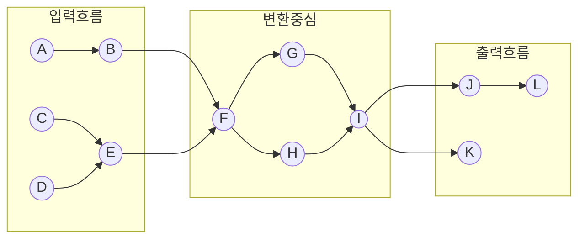

[그림 13] 자료흐름도의 입력 출력 경계

이제 자료흐름 중심의 프로그램 구조를 만들기 시작한다. 변환에 기초한 프로그램 구조를 만들기 위해 필요로 하는 가이드라인은 자료흐름도의 입력흐름, 변환중심, 출력흐름을 규명하는 것에 기초하고 있다. 자료흐름도에서 구조도표로의 매핑은 가이드라인에 의해 이루어진다. 변환흐름 중심의 자료흐름도에서 최상위의 프로그램 구조를 만들면 3가지의 구성요소를 발견할 수 있다. 이들은 다음과 같다.

- 입력을 처리하는 입력 제어 모듈

- 변환을 처리하는 변환 제어 모듈

- 출력을 처리하는 출력 제어 모듈

입력 제어 모듈은 하위계층의 모듈들로부터 입력 데이터를 받아들여 상위계층의 모듈에 보내며, 필요하면 입력 데이터를 정제한 후 상위계층에 전달한다. 출력 제어 모듈은 상위계층으로부터 출력 데이터를 받아 하위계층의 모듈들에게 보낸다. 이 모듈도 필요하면 출력흐름을 정제한 후 하위계층의 모듈에게 전달한다.

시스템의 복잡도에 따라 제어 모듈의 수가 변할 수 있으며 변환중심의 복잡도에 따라 변환을 처리하는 제어 모듈의 수가 결정될 수 있다. 변환에 기초한 간단한 프로그램 구조는 다음과 같다.

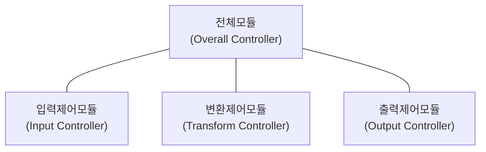

[그림 14] 변환흐름에 기초한 상위 수준 프로그램 구조

<!-- PDF page: 060 -->

#### 나) 트랜잭션흐름 중심 설계(Transaction Flow —Oriented Design)

트랜잭션이란 자료나 제어 시그널 등이 어떠한 행위를 유발시키는 것을 말한다. 트랜잭션흐름에 의한 설계는 들어온 입력을 여러 갈래의 출력흐름으로 쪼갤 수 있는 경우에 가능하다. 트랜잭션은 입력값을 평가하고 그 결과에 따라 여러 출력 경로 중 하나를 따라 흘러간다. 이 경우 정보흐름의 중심을 트랜잭션 중심(Transaction Center)이라고 한다. 다음 그림은 이러한 특성을 나타내고 있으며 버블 T는 트랜잭션 중심이다.

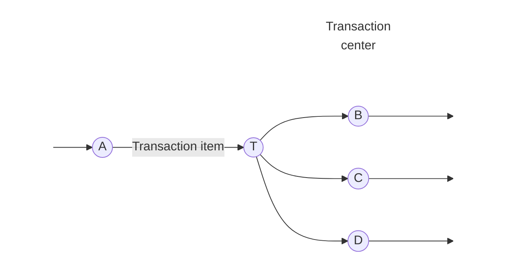

Mutally exclusive action paths

[그림 15] 트랜잭션 흐름

만약 자료흐름도가 트랜잭션흐름을 가지고 있는 경우 트랜잭션 중심이 어디 있는가를 규명하는 일이 선행되어야 한다. 트랜잭션 중심은 트랜잭션을 입력으로 받아들여 여러 출력 버블로 연결되어 있는 모습을 한 버블이다. 따라서 트랜잭션 중심은 하나의 입력 경로와 여러 출력 경로를 가지고 있다. 각 동작 경로(출력 경로)는 여러 버블로 구성될 수 있으며, 변환 흐름이나 트랜잭션흐름을 가질 수 있다.

이를 바탕으로 트랜잭션에 기초한 프로그램 구조를 만든다. 이 구조는 세 구성 요소로 이루어져 있다.

- 트랜잭션 중심으로 작용하는 모듈

- 입력을 받아들이는 모듈

- 각 동작 경로에 해당하는 하나 이상의 모듈

트랜잭션에 기초한 프로그램 구조는 다음 그림에 나타나있다.

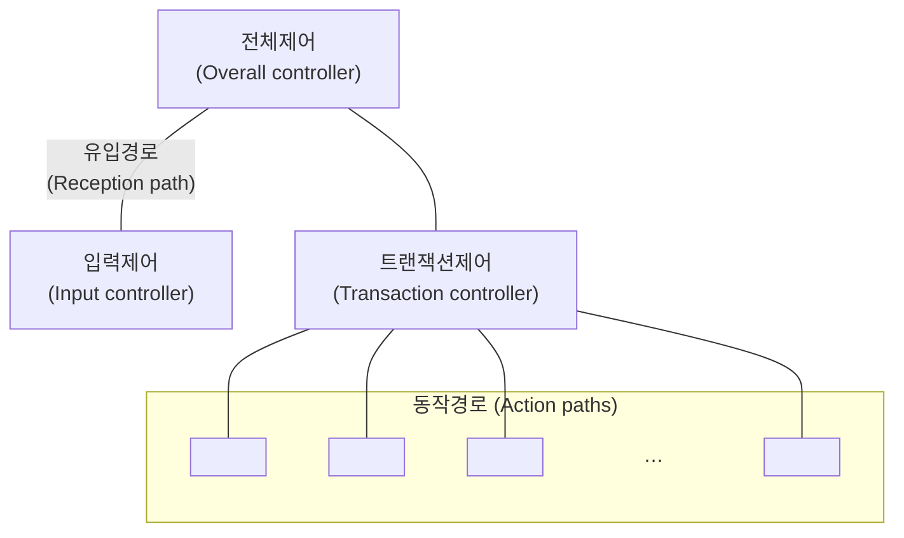

[그림 16] 트랜잭션에 기초한 프로그램 구조

<!-- PDF page: 061 -->

### [참고 및 추천 자료]

[1] 최은만, “소프트웨어 공학”, 서울: 정익사, 2007.

[2] 윤청, “소프트웨어 공학”, 경기: 생능출판사, 2014.

[3] 고석하, 송정유, “소프트웨어 프로젝트 관리”, 경기: 생능출판사, 2007.

[4] 삼성SDS기술사회, “핵심정보통신기술총서 소프트웨어공학”, 서울: 한울아카데미, 2014.

[5] 김종하, “역사 속의 소프트웨어 오류”, 경기: 에이콘출판주식회사, 2014.

<!-- PDF page: 062 -->

## V. 소프트웨어 아키텍처 설계

### 최근 동향 및 주요 이슈

최근 소프트웨어 아키텍처는 정보기술의 변화를 효과적으로 반영하고 적시에 고품질의 소프트웨어를 가장 효과적으로 개발하기 위하여 기초적이고 유용한 핵심적인 역할로 부각되고 있다. 아키텍처 설계는 설계 프로세스의 초기에 시스템이 어떻게 구성되는지, 구성 요소들 사이에 어떻게 상호 작용하는지 규명하는 과정이며, 시스템의 복잡도를 관리하기 위해 필수적으로 요구되는 단계이다.

### 학습 목표

1. 소프트웨어 아키텍처(SA, Software Architecture)의 기본 개념과 구성 요소를 열거할 수 있다.

2. 대표적인 소프트웨어 아키텍처 유형들에 대하여 설명할 수 있다.

3. 소프트웨어 아키텍처 설계 표현 방법을 설명할 수 있다.

### 핵심 키워드

모듈, 컴포넌트와 커넥터, 서브시스템, 프레임워크<br>
저장소 구조, MVC(Model—View-Controller)구조, 클라이언트-서버 모델, 계층구조, 파이프 필터 구조<br>
컨텍스트(Context) 모델, 컴포넌트(Component) 다이어그램, 패키지(Package) 다이어그램, 배치(Deployment) 다이어그램

<!-- PDF page: 063 -->

### 실무 미리보기 소프트웨어 아키텍트의 역할

- Creating Vision(비전 제시자)

만들고자 하는 제품에 대한 전문적인 시각과 경험을 통해 요구사항과 제약사항을 잘 파악하고 현행화된 기술에 대한 이해도를 높여야 한다. 아키텍트는 개발하고자 하는 소프트웨어의 틀을 완성하는 역할로써 창의력이 중요하며, 정리된 내용을 바탕으로 한 전달력이 필요하다.

- Key Technical Consultant(기술 자문가)

전문성에 기인하여 개발조직에 대한 기술적인 영역의 조언을 주는 존재라고 볼 수 있다. 디자인 패턴 및 개발 프레임워크 등의 적절한 선정이 소프트웨어 제품의 특성에 맞는 품질을 갖도록 하는 최초 단계임으로 매우 중요하며, 이를 위한 지속적인 지식의 현행화 및 역량개발이 필요하다.

- Makes Decisions(의사 결정자)

아키텍트는 결국 소프트웨어 제품 개발에 대한 설계 팀을 리딩하며 전체 설계에 영향을 미치는 중요한 영역들에 대한 결정을 한다. 이를 위해 제품이 사용되거나 적용되는 도메인에 대한 지식의 함양도 중요한 요소로 정의된다.

최근 애자일 개발 등과 같이 상황에 맞는 적절한 의사결정이 신속히 내려지고 평가되어야 하는 관점에서 역할이 중요해지고 있다.

- Coaches(코치)

두 번째 기술 자문가 수준의 역할과 유사한 부문으로써 정의된 아키텍쳐에 대한 교육과 이에 대한 개선처리 및 피드백 등을 담당한다. 기술적 리더로서의 코칭 역할은 다양한 스폰서쉽에 의해 발휘되고 입지 또한 견고해진다.

- Coordinates(조정자)

설계 통합성을 유지하고 이를 보장하기 위해 다양한 프로젝트 참여자 간의 이견을 조정하고 중재해야 한다. 이러한 요소는 프로젝트가 중요한 위험요인으로 확대된 경우 기술적인 입장에서 이를 중재할 사람이 필요하며 이를 위한 권위 있는 기술적 중재자가 아키텍트라고 볼 수 있다. 따라서, 기술적 역량 외에도 원만한 의사소통 역량도 매우 중요하다.

- Implements(구현가)

새로운 기술을 도입할 경우 설계단계부터 영향도를 평가해야 하고, 프로토타입을 통해 구현가능성을 평가하기도 한다. 개발자로부터 기술과 경험을 높여 아키텍트로 성장해 가는 과정이 일반적이다.

- Advocates(대변가)

지속적인 새로운 아키텍처를 평가하고 도입, 지속적인 투자에 대한 근거를 제공해야 한다. 이를 통해 기술역량 및 아키텍처 고도화를 지속해야 한다.

(출처: Applied Software Architecture)

<!-- PDF page: 064 -->

### 01 소프트웨어 아키텍처 설계

#### 가) 소프트웨어 아키텍처 개요

소프트웨어 아키텍처는 소프트웨어 개발에 직간접적으로 영향을 미치고 복잡도를 높이는 다양한 요소들을 체계적으로 다루기 위한 개발 대상 소프트웨어의 청사진이라고 볼 수 있다. 소프트웨어 아키텍처 정의는 다양하게 표현이 가능하다. Booch는 소프트웨어 구조에 대한 중요한 의사결정의 집합으로 아키텍처를 정의하였고, Myron Ahn은 모듈, 프로세스, 데이터, 이들의 구조, 구성 요소들 간의 관계, 이러한 구성요소와 관계가 어떻게 확장 및 수정이 될 수 있는지, 사용하는 기술은 무엇으로 이루어져 있으며 소프트웨어 아키텍처를 통해 시스템의 유연성과 성능 및 시스템을 어떻게 구현하고 수정할 수 있는지를 판단할 수 있다[4]고 했다. 이러한 소프트웨어 아키텍처는 의사소통 수단 및 프로젝트 초기 의사결정 도구로 활용되며, 시스템 전체 구조 및 개발 프로젝트 조직 결정 시 참조되기도 한다.

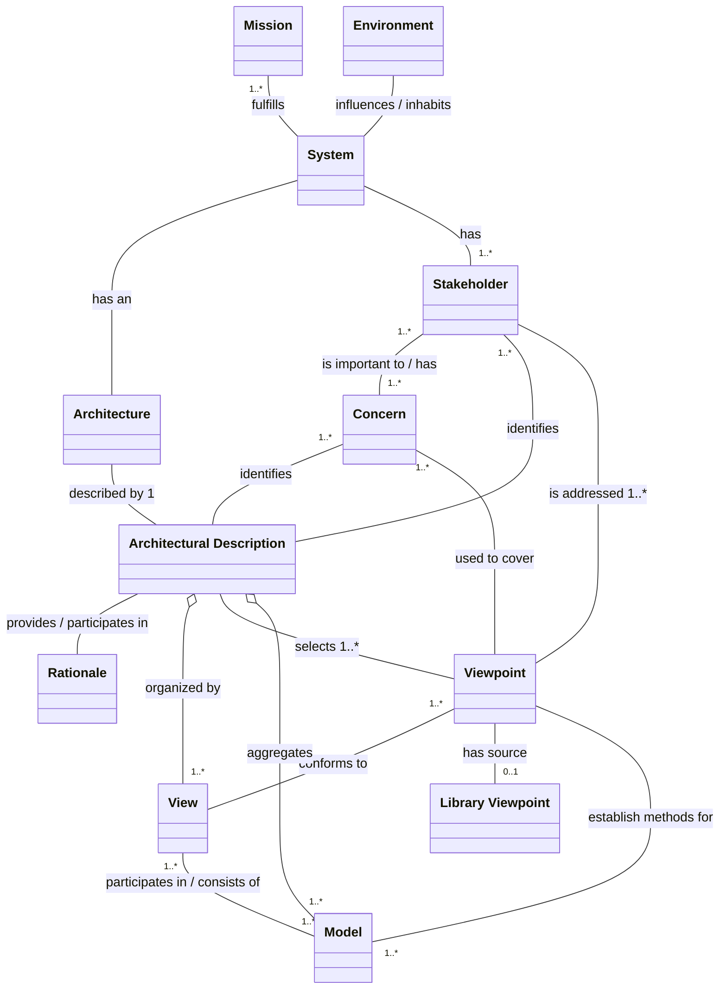

[그림 17] 소프트웨어 아키텍처 구성요소(IEEE-1471)

#### 나) 소프트웨어 아키텍처 설계 절차

소프트웨어 아키텍처 설계는 요구사항분석, 아키텍처 분석 및 설계, 아키텍처 검증 및 승인 절차로 진행된다.

요구사항은 제안요청서, 인터뷰, 회의 등을 통해 구체적으로 파악되며 기능 및 비기능 요구사항을 분류하고 명세하게 된다. 아키텍처 분석은 품질요소를 식별하고 이의 우선순위를 결정해야 하며, 아키텍처 설계시점에 아키텍처 스타일과 후보 아키텍처를 도출하여 진행하게 된다. 이렇게 정리된 아키텍처는 평가 및 상세화를 거쳐 최종 승인되게 된다.

설계의 초기 단계에서는 사용자의 요구사항을 만족시킬 수 있도록 시스템의 구조를 설정해야 한다. 문제를 해결하기 위해서는 시스템을 분할하는 것이 바람직한데, 시스템을 분할하여 생각하면 복잡한 문제도 해결하기 쉽다. 기능을 분할하거나 사용자 인터페이스를 논리적으로 분할하면 보다 쉬운 해결 방법을 찾을 수 있다.

일반적으로 상위레벨에서 분할한 시스템 구성 요소를 서브시스템(Subsystem)이라 부른다. 서브시스템은 일반적으로 자료와 제어구조를 포함하며, 독립적으로 기능을 수행할 수 있고 컴파일 될 수 있는 프로그램 구성요소를 일컫는다. 또한 서브

<!-- PDF page: 065 -->

시스템은 어떠한 서비스 또는 기능을 제공하는가에 의해 구별된다.

프레임워크(Framework)는 서브시스템 설계 시 반복적으로 아키텍처 설계에 반영할 수 있는 지식을 모아 놓은 지원 단위이다. 프레임워크는 구체적인 서브시스템을 만들기 위해 확장될 수 있는 일반 구조를 나타내며, 프레임워크는 구체적인 구현 방법 등을 제공함으로써 설계 추상화의 수준을 높여준다.

아키텍처 설계는 시스템의 요구사항을 만족시키기 위해 시스템 구성을 설정하는 프로세스이다. 요구사항 분석 과정의 결과를 이용하여 프로그램 구조상에 있는 각 구성 요소(모듈)들 사이의 관계를 기술한다. 구조 설계의 주목적은 모듈화된 프로그램 구조를 개발하는 것이며, 모듈 사이의 제어 및 인터페이스를 나타내는 것이다.

### 02 소프트웨어 아키텍처 스타일

소프트웨어 개발 시 나타나는 대표적인 아키텍처 유형들에 대하여 살펴보자.

#### 가) 저장소 구조

한 서브시스템에서 데이터를 생성하고 다른 서브시스템들이 데이터를 사용하는 경우 시스템에서 사용되는 모든 공유 데이터를 한 곳에 보관하여 모든 서브시스템들이 데이터를 공유할 수 있도록 만든 구조이다. 공유 저장소 구조는 다량의 데이터를 공유하는데 적합한 방식이다.

#### 나) MVC(Model - View-Controller) 구조

MVC 구조는 GUI 설계에 많이 활용되는 프레임워크로 한 객체의 여러 가지 표현이 서로 상호 작용하도록 지원하는 접근법으로 한 객체의 표현이 수정되면 다른 모든 표현도 따라서 갱신된다. 이런 방법을 통해 수정이 단순화되며 재사용이 수월해질 수 있다.

#### 다) 클라이언트-서버 모델

클라이언트-서버 모델은 서버와 클라이언트의 집합으로 구성되는 모델이다. 서비스를 요구하는 클라이언트와 서비스를 제공하는 서버로 구성되어 있으며, 여러 클라이언트 인스턴스가 있을 수 있다. 일반적으로 클라이언트-서버 모델은 분산 시스템으로 구현되어 네트워크 시스템을 효과적으로 이용할 수 있다.

#### 라) 계층 구조

시스템을 여러 계층으로 구성하며, 각 계층은 특정 서비스를 제공하는 것으로 정의될 수 있다. 계층 구조를 적용하면 문제 해결이 쉬워진다는 장점을 갖고 있다. 문제가 발생하는 경우 각 층마다 단계적으로 확인하면 되고, 장비가 표준화되어 상호 호환이 가능하다. 국제표준기구인 ISO에서 개발한 네트워크 프로토콜의 OSI(Open System Interconnection) 7계층 구조는 대표적인 계층 구조의 예이다.

<!-- PDF page: 066 -->

### 03 소프트웨어 아키텍처 설계 표현 방법

#### 가) 컨텍스트(Context) 모델

요구사항 분석 초기 시스템과 외부 환경의 경계를 정해야 한다. 컨텍스트 다이어그램은 분할되기 이전의 시스템을 하나의 큰 프로세스로 이해한 것이다. 이 모델은 우리가 개발해야 할 시스템의 영역을 기술하고, 시스템과 외부 환경과의 경계를 결정하며, 외부와의 인터페이스를 제시하여 시스템의 입출력 데이터를 보여준다.

이 모델은 시스템과 외부 환경과의 인터페이스에 초점을 맞춘다. 분석 초기에, 분석가는 사용자와 시스템이 상호 어떠한 데이터를 주고받으며 어떠한 상호 교류가 일어나는지에 우선 초점을 맞추어야 한다. 시스템의 경계가 확립되면 이를 실현시키기 위해 시스템의 내부에 대한 분석이 이루어진다. 이는 시스템을 개발하는 데 있어서 목표에 대한 우선순위를 부여하는 것과 같다.

#### 나) 컴포넌트 다이어그램

소프트웨어 개발 속도와 생산성을 높이기 위해 다른 분야와 같이 잘 만들어진 부품을 사다가 조립(Plug—in)하여 만들 수 있도록 재사용 가능한 부품을 컴포넌트(Component)라고 부른다. 이 기술의 근간을 이루는 것은 결국 재사용성 (Reusability)이며, 재사용 기술은 가능한 한 이미 검증된 부분을 다시 사용함으로써 소프트웨어 개발 속도와 생산성을 높이고자 하는 가속 기술인 것이다.

컴포넌트가 다른 시스템이나 외부 장치와 통신하고 협동해야 한다. 컴포넌트가 상호 연동을 보장받기 위해 컴포넌트의 구현, 문서화 등에 대한 표준이 정의되어야 한다. 컴포넌트의 결합은 컴포넌트를 조립하는 프로세스이며, 순차적 결합, 계층적 결합, 부가적 결합 등의 유형이 존재한다.

#### 다) 패키지 다이어그램

다수의 사용자를 위해 개발된 상업용 소프트웨어를 패키지라 부르며, 서브시스템이 패키지의 모습으로 나타나는 경우가 흔하다. 패키지로 정의되면 패키지 내부의 자세한 사항을 외부에 감추어 패키지 사이의 의존 관계를 최소화할 수 있다. 서브시스템을 구성하는 패키지는 기능적으로 관련 있는 클래스들을 모아 놓은 것이다.

패키지 다이어그램은 서브시스템들 사이의 의존 관계를 나타낸 것으로 높은 수준의 추상화된 서브시스템을 나타내어 소프트웨어 아키텍처를 표현하는데 적합하다. 서브시스템들 사이의 연관 관계가 최소화되도록 서브시스템을 분할하면 객체 사이의 의존을 최소화하고 복잡도를 줄일 수 있다.

### [참고 및 추천 자료]

[1] 최은만, “소프트웨어 공학”, 서울: 정익사, 2007.

[2] 윤청, “소프트웨어 공학”, 경기: 생능출판사, 2014.

[3] 고석하, 송정유, “소프트웨어 프로젝트 관리”, 경기: 생능출판사, 2007.

[4] 삼성SDS기술사회, “핵심정보통신기술총서 소프트웨어공학”, 서울: 한울아카데미, 2014.

[5] 랜소머빌, 권기태 옮김, “소프트웨어 공학(제8판)”, 경기: 홍릉과학출판사, 2008.

[6] Christine Hoffmeister, Robert Nord, “Applied Software Architecture”, Addison-Wesley Professional, 2011.

[7] 송재하, 박성운, “아키텍트의 길”, 월간 마이크로소프트웨어, 2002.

<!-- PDF page: 067 -->

## Ⅵ. 객체 지향 설계

### 학습 목표

1. 객체 지향 분석과 모델링의 개념을 이해할 수 있다.

2. 객체 지향 설계 개념과 원리를 설명할 수 있다.

3. 정적 및 동적 모델링을 수행하고 UML(Unified Modeling Language)로 표현할 수 있다.

4. 디자인 패턴의 개념과 대표적인 패턴을 열거할 수 있다.

### 핵심 키워드

유스케이스, 시퀀스 다이어그램, 액티비티 다이어그램<br>
객체, 클래스, 캡슐화, 상속, 다형성, 연관, 집합<br>
클래스, 속성, 관계, 연관, 오퍼레이션, 클래스 다이어그램<br>
인터랙션 다이어그램(순서 다이어그램, 커뮤니케이션 다이어그램), 상태 다이어그램, 액티비티 다이어그램<br>
싱글톤 패턴, 팩토리 메소드 패턴, 파사드(façade) 패턴 , 스트래티지 패턴

<!-- PDF page: 068 -->

### 실무 미리보기 객체 지향 설계 5원칙 SOLID

- SRP(the Single Responsibility Principle, 단일 책임의 원칙)

하나의 클래스는 하나의 method만을 갖게 됨에 따라 수정에 대한 이유는 한가지가 되어야 한다. 그러나, 실제 환경에서는 문제가 복잡하고 거대화 됨에 따라 사용은 어려운 문제가 되며, 유틸리티와 같은 형태로 적용하는 것이 좋다.

- OCP(the Open Closed Principle, 개방 폐쇄의 원칙)

하나의 클래스는 수정에는 폐쇄되어 있고, 확장에는 개방되어 있어야 한다. 이는 객체 지향의 대표적인 특징인 다형성과 추상화에 관련된 내용이며, 기능 개선 시 직접적인 수정보다는 상속을 통한 개선이 이루어지는 것이 좋다. 또한, 로직 변경 가능여부를 고려한 추상화 클래스 구현이 되어야 한다.

- LSP(the Liskov Subsitution Principle, 리스코프 치환의 원칙)

상속을 위한 설계 중에서 가장 중요한 원칙으로 상속을 하게 되는 경우 IS-A 관계가 성립하기 때문에 지켜져야 하는 원칙이다. 즉, 하위클래스는 언제나 상위클래스로 참조가 가능한 상속과 관련된 원칙이다.

- ISP(the Interface Segregation Principle, 인터페이스 분리의 원칙)

노출된 객체의 인터페이스를 통해 객체 간 커뮤니케이션이 일어나는데 이 노출 방법에 대한 원칙으로 사용자 별로 다른 방식의 인터페이스를 제공토록 설계해야 한다. 일반사용자와 관리자에게 주어지는 인터페이스는 달라야 함을 예로 생각해 볼 수 있다.

- DIP(the Dependency Inversion Principle, 의존성 역전의 원칙)

사용하는 클래스와 사용되는 클래스가 있을 때 사용되는 클래스의 인터페이스가 변경될 경우 사용하는 클래스도 변경부분에 대한 확인을 해야 하는 의존성을 갖게 된다. 사소한 부분이라도 수정이 발생될 경우 이에 대한 완전성과 무결성에 대한 보장은 어려운 것이 현실이다. 따라서, 이러한 변경 가능성을 최소화하기 위하여 인터페이스를 통한 추상화를 통해 최대한 느슨하게 설계하자는 원칙이다.

<!-- PDF page: 069 -->

### 01 객체 지향 분석과 모델링 개념

객체 지향은 주어진 문제영역을 실세계 안에 존재하는 객체의 집합으로 보고 객체들 사이의 상호작용을 나타낸 것이다. 이는 실세계를 바라보는 관점과 동일하게 컴퓨터 세계로 문제영역을 옮기는 가상화 과정으로 이해되며, 이를 통한 객체의 재사용성을 높이고 참여자의 이해도를 높이는 장점이 있다. 객체 지향 분석기법은 3가지 관점(정보, 동적, 기능 관점)을 단계적으로 적용하여 소프트웨어에 요구되는 객체(또는 클래스)를 찾아내고, 객체의 속성과 동작을 밝히는 작업이다. 객체 지향 개발 방법은 분석, 설계, 프로그래밍으로 이어지는 전체 소프트웨어 개발과정에 동일한 방법론 및 표현기법을 적용할 수 있는 장점이 있다.

##### ① 모델링이란?

모델링이란 대상 시스템의 성능 또는 동작과정 분석을 위하여 이를 간단히 도식화하거나 그 시스템의 특징을 수학적으로 표현하는 과정이다. 우리는 실세계를 이해하기 위해 표현해야 하고 모델링은 실세계의 표현을 가능하게 한다.

모델링을 통해 다양한 관점에서 소프트웨어의 모습(View)을 제공하고 소프트웨어의 요구사항을 파악할 수 있어야 한다. 모델링의 결과는 요구사항 명세서의 핵심 부분이 되며 프로젝트의 다음 단계 진행을 위한 정보를 제공한다. 모델링의 결과는 사용자와 개발자 사이 대화의 도구로 사용되며, 프로젝트 초기 단계에서 필요한 요구사항을 뽑아내고 개발 단계(설계, 구현, 시험 포함)에 필요한 시스템의 윤곽과 골격을 파악하는데 많은 도움을 제공한다.

##### ② 모델링의 세가지 관점

소프트웨어는 바라보는 관점(View)에 따라 모습이 달라지고 용도도 달라진다. 소프트웨어를 바라보는 관점은 다음과 같이 세가지 관점으로 표현될 수 있다.

〈표 18〉 모델링의 3관점

<table>
<tbody>
<tr>
<td>관점</td>
<td>내용</td>
</tr>
<tr>
<td>기능 관점(Function Viewpoint)</td>
<td>기능 모델은 소프트웨어가 어떠한 기능을 수행하는가의 관점에서 시스템을 기술함<br>기능 모델은 주어진 입력에 대하여 어떤 결과가 나오는가를 보여주는 관점이며, 연산과<br>제약조건 묘사</td>
</tr>
<tr>
<td>동적 관점(Dynamic Viewpoint)</td>
<td>소프트웨어의 동작과 제어에 초점을 맞추어 시스템의 상태(State)와 상태를 변하게 하는<br>원인들(사건, 시간 등)을 묘사함</td>
</tr>
<tr>
<td>정보 관점(Information Viewpoint)</td>
<td>소프트웨어의 정적인 정보구조를 포착하는 경우 사용되며, 시스템에 사용되는 정보<br>객체를 찾아내고, 이들 객체의 특성, 객체들 사이의 관계와 연관성 규명함</td>
</tr>
</tbody>
</table>

##### ③ 유스케이스(Use Case)

객체 지향 분석을 위해 많이 알려져 있는 유스케이스 기법을 활용하면 고객과 시스템 개발자 사이에 의사소통을 원활히 해주며, 고객의 요구사항을 알아내는데 효과적이다. 유스케이스는 프로젝트의 다양한 이해관계자인 고객, 프로젝트 관리자, 개발자, 설계자 등에게 많은 혜택을 제공할 수 있다. 유스케이스 기법을 활용하여 고객의 적극적인 참여를 유도할 수 있고 고객의 요구사항을 빠르게 파악함으로써 시스템의 기능적인 요구를 프로젝트 초기에 결정하고 그 결과를 문서화할 수 있다.

유스케이스 기법은 이해 관계자를 찾아내고, 이해 관계자의 역할에 따라 동질성 있는 집단으로 분류하여 이를 행위자 또는 액터(Actor)로 분류한다. 각 행위자는 시스템에 대하여 각기 다른 관점(View)과 용도를 가진다. 이를 바탕으로 각 행위자의 시스템에 대한 용도라 할 수 있는 유스케이스(Use Case)를 식별한다. 유스케이스란 각 행위자가 어떤 용도(쓰임새)로 시스템을 사용하는가를 나타내는 “사용 예”에 해당한다. 각 유스케이스는 특정 행위자가 어떤 기능이나 임무를 달성하기

<!-- PDF page: 070 -->

위한 시나리오의 집합이다.

이러한 각 유스케이스에 대하여 시나리오를 작성한다. 시나리오는 사건의 흐름과 과정을 나타내며 시스템과 행위자들이 주고 받는 정보뿐만 아니라 상호 작용이 발생하는 상황, 환경, 배경 등을 포함할 수 있다. 유스케이스 기법은 사용자와 시스템의 상호 작용을 나타내고 시스템이 무엇을 수행하는가에 대해서 명확하게 표현할 수 있어 사용자의 요구사항을 검증하는데 활용된다.

##### ④ 정보 모델링

유스케이스 시나리오를 바탕으로 행위자와 시스템이 주고받는 정보들을 찾아낼 수 있다. 이들을 활용하여 시스템 내부에 저장되고 관리되어야 하는 정보를 밝히는 정보 모델링을 수행하고 그 결과를 UML(Unified Modeling Language)의 클래스 다이어그램(Class Diagram)으로 나타낸다. 정보 모델링을 통해 시스템에서 요구되는 기본적인 클래스를 식별하고, 클래스 사이의 연관성을 클래스 사이의 관계를 통해서 밝혀내고, 각 클래스의 속성을 찾아낸다. 일반적으로 이 단계에서 클래스와 클래스 내부의 속성 및 클래스들 사이의 관계만 표현된 클래스 다이어그램을 얻어낼 수 있다.

##### ⑤ 동적 모델링

앞에서 정보 모델링을 수행하여 시스템을 구성하는 클래스의 속성 및 관계를 클래스 다이어그램으로 나타내었다. 이를 바탕으로 동적 분석을 수행하는 방법을 살펴본다. 동적 분석은 시스템을 구성하는 객체의 상태나 동작의 변화 혹은 객체들 사이의 상호 작용에 관심을 두고 클래스들의 오퍼레이션을 찾는 과정이다.

UML의 경우 시퀀스 다이어그램(Sequence Diagram)을 사용하여 객체들 사이의 상호 작용을 밝혀내고 이를 통해 각 클래스의 오퍼레이션을 도출한다. 시퀀스 다이어그램은 각각의 유스케이스에 대해서 작성하는 것이 일반적이다. 유스케이스 시나리오가 시스템을 블랙박스로 보고 작성한 것이라면, 시퀀스 다이어그램은 유스케이스 시나리오를 더욱 확장하여 시스템 내부의 객체들이 상호 작용하는 과정까지 나타낸 것이다.

##### ⑥ 기능 모델링

시퀀스 다이어그램에서 도출한 사건(오퍼레이션)을 수행하기 위해 다양한 기능을 수행해야 할 경우들이 있다. 이 기능들은 내부적으로 복잡한 로직을 담고 있으며, 그 안에서 더 작은 규모의 오퍼레이션으로 표현될 수 있다. 액티비티 다이어그램(Activity Diagram)은 오퍼레이션 안에서 이루어지는 여러 로직들을 활동으로 표현함으로써, 잠재적이고 새로운 오퍼레이션을 도출할 수 있도록 한다. 액티비티 다이어그램은 클래스 내의 이벤트 처리과정을 정확히 이해하기 위해 사용되는 다이어그램으로, 복잡한 프로세스의 처리과정을 이해하거나 클래스의 추가적인 오퍼레이션을 식별하는데 사용된다.

### 02 객체 지향 설계와 원리

객체 지향 분석 과정에서 클래스 다이어그램으로부터 시퀀스 다이어그램, 더 나아가 액티비티 다이어그램까지 작성하여 요구사항 분석이 수행되었다. 일반적으로 요구사항 분석은 고객 관점의 개념적(Conceptual) 차원에서 기술하고 어떻게(How to) 저장되는지의 물리적인(Physical)면은 나타내지 않는다.

객체 지향 설계 단계에서는 객체 지향 분석 과정에서 밝혀진 사용자 요구사항을 어떻게 소프트웨어의 모습으로 나타낼 것인가에 초점을 맞춘다. 설계 단계에서는 구현에 관한 세부사항을 제시하여 요구사항이 물리적으로 실현 가능하도록 구체적인 방법을 정한다. 객체 지향 설계는 객체 지향 분석에서 사용하였던 표기법을 다시 사용하여 큰 변환 과정 없이 설계할 수 있다는 장점을 가지고 있다.

<!-- PDF page: 071 -->

#### 가) 객체와 클래스

클래스는 유사한 객체들의 모임이다. 객체는 독립적으로 존재하는 실세계의 사물(Thing), 객체(Object)를 나타내며 그 예로 김철수(직원의 예), 서울(장소의 예) 등이 있다. 각 객체는 특정 속성(Attribute)의 모임에 의해 기술되며 속성값들에 의하여 다른 객체와 구별된다. 예를 들어 김철수는 주민등록번호 “830425-1XXXXXX”, 생년월일 “83년 4월 25일” 등의 속성과 속성값을 가진다.

한 시스템 안에는 유사한 속성을 갖는 집합들이 있다. 대학에는 많은 학생들이 있으며 이들 학생들은 유사한 정보를 가진다. 이들 학생들은 같은 속성을 공유하고(예: 학번, 전공, 성적 등) 각 학생(객체)은 각 속성의 고유값을 가진다. 이때 같은 속성을 가지는 객체들의 집합을 클래스(Class)라 한다. 즉, 클래스의 인스턴스가 객체이다. 예를 들어 학생이라는 클래스에 속한 “김철수”, “이영희” 객체는 같은 속성(학번, 전공, 성적)을 공유하고 “김철수”는 학번 “925462”, 전공 "CS”, 성적 “3.8”을, “이영희”는 학번 “956234”, 전공 "Math”, 성적 “4.2”의 고유 속성값을 가진다.

시스템에 요구되는 데이터의 특성을 규명할 경우에는 각각의 객체들을 기술하는 것보다 묶어진 클래스를 기술하는 것이 편리하다. 이렇게 비슷한 객체를 묶는 작업을 분류화(Classification)라 하며 분류화를 통해 묶여진 객체들은 같은 종류의 속성, 제약조건 및 동작의 유형을 공유한다.

#### 나) 캡슐화(Encapsulation)

설계 목표는 이해하기 쉽고 수정이 쉬운 소프트웨어를 만드는 것이며, 높은 독립성을 갖고 있는 모듈들을 설계하는 것이 그 기본이라 할 수 있다. 소프트웨어의 경우 이를 구성하고 있는 요소들이 독립성을 가지고 기능을 수행할 때 성숙된 모습을 나타낸다. 소프트웨어 구성 요소의 기능적 독립성은 모듈화 과정과 정보 은닉 개념에서 나타나는 부산물이다. 모듈의 기능적 독립성은 단위 모듈의 처리 완전성을 높이고 타 모듈과의 처리 종속성을 최소화할 때 극대화 될 수 있다.

객체 지향 개발 방법의 중요한 개념 중의 하나인 캡슐화(Encapsulation)는 정보 은닉을 통한 추상화, 독립성 향상을 얻을 수 있는 방법이며, 속성과 오퍼레이션을 함께 묶어 보호하려는 방법이다. 객체 지향 언어들은 캡슐화를 지원하여 주는 기능이 언어에 포함되어 있다.

#### 다) 상속(Inheritance)

각 클래스는 고유의 속성과 오퍼레이션을 가지고 있으며, 여러 클래스에 공통된 속성과 오퍼레이션 또한 존재할 수 있다.

클래스 사이에 유사성이 존재할 때 이 유사성을 모아 하나의 새로운 클래스를 정의 내리는 것을 일반화라 한다. 예를 들어 ‘교수’와 ‘학생’이라는 클래스는 공통의 속성(예: 주민등록번호, 이름, 주소, 전화번호)을 가지고 있다. 이 때 교수와 학생을 묶어 하나의 일반화된 클래스 ‘사람’을 정의 내릴 수 있다. 이 경우 ‘학생’과 ‘교수’를 ‘사람’의 하위 클래스(Subclass)라 부르고, 사람은 학생과 교수의 상위 클래스(Superclass)라 한다.

이 경우 상위 클래스인 ‘사람’은 하위 클래스인 ‘학생’과 ‘교수’의 공통적인 속성과 오퍼레이션을 가지며, 하위 클래스인 ‘학생’과 ‘교수’는 각각 하위 클래스 간의 공유되지 않는 속성과 오퍼레이션을 갖는다. 일반화를 통해 나타나는 중요한 특성은 상위 클래스에 하위 클래스의 공통적인 속성과 오퍼레이션을 표시하고, 상위 클래스의 정보가 하위 클래스에 상속 (Inheritance)된다는 것이다. 일반화를 통해 나타나는 상속은 클래스의 정의를 단순화시키고, 기존에 정의되어 있는 클래스를 이용하여 새로운 클래스를 쉽게 정의할 수 있도록 해 준다.

#### 라) 다형성(Polymorphism)

객체 지향의 특징 중 하나는 다형성(Polymorphism)이다. 폴리모피즘이라고도 불리는 다형성은 동일한 이름의 오퍼레이션이라도 클래스에 따라 다르게 동작하는 것을 말하며, 하나의 함수 이름이나 연산자가 여러 목적으로 사용될 수 있는 것을 의미한다. 객체 지향에서의 다형성은 주로 상속 관계에서 사용되어 상위 클래스에 정의된 하나의 오퍼레이션에 대해 각 하위 클래스가 가지고 있는 고유한 방법으로 응답할 수 있도록 유연성을 제공한다. 다형성은 상위 클래스를 통하여 하위 클래스의 메소드(Method: 메시지에 따라 실행시킬 일련의 작업순서)를 호출할 수 있도록 하는 개념으로 상위클래스에서 정의된 메소드를 하위클래스에서 재정의하는 오버라이딩(Overriding)과 매개변수 타입 및 개수를 달리하여 메소드를 다중

<!-- PDF page: 072 -->

정의하는 오버로딩(Overloading)으로 분류하기도 한다.

메시지를 보내는 측에서는 단지 상위 클래스의 오퍼레이션을 호출하며, 이때 객체가 어떤 타입(하위 클래스)인지 알 필요가 없고, 실행 시간(Run Time)에 객체의 타입에 따라서 자동적으로 하위 클래스의 적합한 동작이 결정된다. 실행 시간(Run Time)에 하위 클래스의 객체를 통해 동작이 정해지는 것을 동적 바인딩(Run—time Binding)이라 한다. 다형성과 동적 바인딩은 디자인 패턴을 이해하기 위한 필수 개념이라 할 수 있다.

### 03 정적 모델링과 동적 모델링

#### 가) 정적 모델링

정적 모델링은 앞에서 설명한 정보 모델링과 같은 개념이며, 시간의 개념이 개입되지 않은 객체의 정적인 정보를 밝히는 것이다. 정보 모델링은 시스템에 사용되는 데이터베이스의 구조를 알아내어 데이터를 기술한다. 정보 모델은 시스템에 요구되는 기본적인 객체를 찾아내고 객체의 속성, 객체들 사이의 연관성을 나타내는 관계(Relationship)로 구성된다.

UML의 클래스 다이어그램은 시스템의 정적인 정보구조를 나타내는 정보 모델로서, 시스템에 필요한 클래스들과 이들 사이의 관계를 나타내는데 사용된다. 각 클래스는 해당 객체의 특성을 나타내는 여러 가지 속성들과 오퍼레이션으로 구성된다. 클래스, 클래스의 속성, 클래스들 간의 관계를 찾아내기 위해서는 선행 단계에서 작성된 문서들을 활용할 수 있는데, 문제 기술서나 유스케이스 시나리오가 클래스 도출에 사용될 수 있다.

#### 나) 동적 모델링

앞에서 정적 모델링을 사용하여 시스템을 구성하는 클래스를 찾아내고 클래스의 속성과 관계를 식별하였다. 이번 정적 분석의 결과를 토대로 동적 모델링을 수행하는 방법을 알아보자. 정적 모델링은 말 그대로 시스템의 정적인 구조에 초점을 두는 반면, 동적 모델링은 시스템을 구성하는 객체의 상태나 동작의 변화 혹은 객체들 사이의 상호 작용에 관심을 두고 클래스들의 오퍼레이션을 찾는 과정이다.

동적 모델링은 객체들 사이의 상호 작용을 통해 클래스의 오퍼레이션을 도출한다. 클래스의 오퍼레이션은 다른 객체의 메시지에 의해 요청된 기능을 수행하기 위해 정의되는 것이다. 객체들의 상호 작용을 나타내기 위해 일반적으로 UML의 시퀀스 다이어그램(Sequence Diagram)을 사용한다. 시퀀스 다이어그램은 시간의 흐름에 따라 객체들이 주고받는 메시지의 전달 과정을 강조하고, 컬레보레이션 다이어그램은 객체들 사이의 협력 관계 및 메시지 변화를 표현하는 다이어그램으로 이 두 다이어그램을 인터랙션 다이어그램이라고도 한다.

액티비티 다이어그램은 클래스 내의 이벤트 처리과정을 정확히 이해하기 위해 사용되는 다이어그램으로, 복잡한 프로세스의 처리과정을 이해하거나 클래스의 추가적인 오퍼레이션을 식별하는데 사용된다. 유스케이스별로 일어나는 활동과 활동간의 의존성을 이해하는데 도움을 줄 수 있다. 또한 특정 객체가 가지는 오퍼레이션이 내부적으로 복잡한 구조로 이루어져있을 때 UML의 액티비티 다이어그램(Activity Diagram)을 사용하여 표현할 수 있다.

이러한 UML 다이어그램을 기능모델, 정적모델, 동적모델로 구분하면 아래와 같다.

〈표 19〉 UML 다이어그램

| 모델구분 | 다이어그램 | 내용 |
| --- | --- | --- |
| 기능모델 | 유스케이스 다이어그램<br>(Use Case Diagram) | 액터와 시스템을 사용하는 다양한 경우, 즉 유스케이스의 관계를 구조적으로 표현 |

<!-- PDF page: 073 -->

<table>
<thead><tr><th>모델구분</th><th>다이어그램</th><th>내용</th></tr></thead>
<tbody>
<tr><td rowspan="4">정적모델</td><td>클래스 다이어그램<br>(Class Diagram)</td><td>시스템을 구성하는 클래스, 인터페이스 사이의 구조적 연관관계를 표현</td></tr>
<tr><td>객체 다이어그램<br>(Object Diagram)</td><td>특정 시점 객체들의 구조적 상태를 표현</td></tr>
<tr><td>컴포넌트 다이어그램<br>(Component Diagram)</td><td>컴포넌트 구조사이의 관계 표현</td></tr>
<tr><td>배치 다이어그램<br>(Deployment Diagram)</td><td>소프트웨어, 하드웨어, 네트워크를 포함한 실행 시스템의 물리 구조를 표현</td></tr>
<tr><td rowspan="5">동적모델</td><td>시퀀스 다이어그램<br>(Sequence Diagram)</td><td>시스템 외부 이벤트를 처리하기 위해 시스템 내부 객체 간에 주고받는 동적 메시지를 시간의 흐름에 따라 표현</td></tr>
<tr><td>컬레보레이션 다이어그램<br>(Collaboration Diagram)</td><td>시퀀스 다이어그램과 동일한 내용을 객체 상호 관계의 관점에서 표현</td></tr>
<tr><td>액티비티 다이어그램<br>(Activity Diagram)</td><td>시스템 내부의 활동 흐름을 표현</td></tr>
<tr><td>상태차트 다이어그램<br>(Statechart Diagrm)</td><td>시스템 내부의 상태 전이를 표현</td></tr>
<tr><td>패키지 다이어그램<br>(Package Diagram)</td><td>클래스나 유스케이스 등을 포함한 여러 모델 요소들을 그룹화해 패키지를 구성하고 패키지들 사이의 관계를 표현</td></tr>
</tbody>
</table>

### 04 디자인 패턴(Design Pattern)

#### 가) 디자인 패턴 개념

옷에 쓰이는 그런 패턴의 이야기가 정확히 이야기하면 소프트웨어 디자인 패턴이다. 디자인 패턴에 대해서 정의하면 디자인 패턴(소프트웨어 생략)이라는 것은 “소프트웨어 설계의 특정한 맥락에서(in a context) 반복해서 해결해야 할 문제 (recurring problem)에 대해서 일반적이고 재사용이 가능한 해결 방법”이다. 디자인 패턴은 다양한 상황에서 사용할 수 있는 문제를 해결하는 방법에 대한 설명이거나 견본이라고 할 수 있으며 프로그래머가 구현해야 하는 모범사례들을 공식화 하고 있으며 일반적으로 클래스나 객체 간의 상호작용이나 관계를 보여 준다.

목적(Purpose)에 따른 구분 →<br>
범위(Scope)에 따른 구분 ↓

| | 생성 | 구조 | 행위 |
| --- | --- | --- | --- |
| 클래스 | - Factory Method | - Adaptor(class) | - Interpreter<br>- Template Method |
| 객체 | - Abstract Factory<br>- Builder<br>- Prototype<br>- Singleton | - Abstract(object)<br>- Bridge<br>- Composite<br>- Decorator<br>- Façade<br>- Flyweight<br>- Proxy | - Chain of Responsibility<br>- Command<br>- Interpreter<br>- Mediator<br>- Memento<br>- Observer<br>- State<br>- Strategy<br>- Visitor |

[그림 18] 디자인패턴 분류

<!-- PDF page: 074 -->

디자인 패턴은 목적과 범위에 따라 [그림 18]과 같이 분류할 수 있다. 디자인 패턴은 목적에 따라서 '생성패턴', '구조패턴', '행위패턴'으로 나눌 수 있다.

① 생성패턴(creation pattern): 객체의 생성과정에 관여하는 패턴

② 구조패턴(structural pattern): 클래스나 객체의 합성에 관한 패턴

③ 행위패턴(behavioral pattern): 클래스나 객체들이 상호작용하는 방법과 책임을 분산하는 방법을 정의하는 패턴

그리고 범위(scope)에 따른 디자인 패턴을 구분할 수 있다. 범위에 따라 패턴을 주로 클래스에 적용하는지 아니면 객체에 적용하는 지를 구분할 수 있다.

④ 클래스패턴(class pattern): 클래스와 서브 클래스 간의 관련성을 다루는 패턴. 관련성은 주로 상속이며 컴파일 타임에 정적으로 결정한다.

⑤ 객체패턴(object pattern): 객체 관련성을 다루는 패턴으로서 런타임에 변경할 수 있으며 동적인 성격을 갖는다.

#### 나) 대표적인 디자인 패턴

반복적 코드 사용에 대한 재활용 편의를 높이고 복잡한 코드를 쉽게 관리하기 위해 옆 그림의 디자인 패턴들을 사용하여 소프트웨어 개발을 효과적으로 한다.

〈표 20〉 대표적인 디자인 패턴과 문제유형

<table>
<thead><tr><th>대분류</th><th>문제 유형(사용 목적)</th><th>관련 디자인 패턴</th></tr></thead>
<tbody>
<tr><td rowspan="5">객체 생성을 위한 패턴</td><td>제품군(Product Family)별 객체 생성</td><td>Abstract Factory</td></tr>
<tr><td>부분 생성을 통한 전체 객체 생성</td><td>Builder</td></tr>
<tr><td>대행 함수를 통한 객체 생성</td><td>Factory Method</td></tr>
<tr><td>복제를 통한 객체 생성</td><td>Prototype</td></tr>
<tr><td>최대 N개까지로 객체 생성을 제한</td><td>Singleton</td></tr>
<tr><td rowspan="7">구조 개선을 위한 패턴</td><td>기존 모듈 재사용을 위한 인터페이스 변경</td><td>Adapter</td></tr>
<tr><td>인터페이스와 구현의 명확한 분리</td><td>Bridge</td></tr>
<tr><td>객체 간의 부분-전체 관계 형성 및 관리</td><td>Composite</td></tr>
<tr><td>객체의 기능을 동적으로 추가, 삭제</td><td>Decorator</td></tr>
<tr><td>서브시스템의 명확한 구분 정의</td><td>Façade</td></tr>
<tr><td>작은 객체들의 공유</td><td>Flyweight</td></tr>
<tr><td>대리 객체를 통한 작업 수행</td><td>Proxy</td></tr>
<tr><td rowspan="11">행위 개선을 위한 패턴</td><td>수행 기능 객체로까지 요청 전파</td><td>Chain of Responsibility</td></tr>
<tr><td>수행할 작업의 일반화를 통한 조작</td><td>Command</td></tr>
<tr><td>간단한 문법에 기반한 검증 및 작업 처리</td><td>Interpreter</td></tr>
<tr><td>동일 자료형의 여러 객체 순차 접근</td><td>Iterator</td></tr>
<tr><td>M:N 객체 관계를 M:1로 단순화</td><td>Mediator</td></tr>
<tr><td>객체의 이전 상태 복원 또는 보관</td><td>Memento</td></tr>
<tr><td>One Source Multiple Use</td><td>Observer</td></tr>
<tr><td>객체 상태 추가 시 행위 수행의 원활한 변경</td><td>State</td></tr>
<tr><td>동일 목적의 여러 알고리즘 중 선택해서 적용</td><td>Strategy</td></tr>
<tr><td>알고리즘의 기본 골격 재사용 및 상세 구현 변경</td><td>Template method</td></tr>
<tr><td>작업 종류의 효율적 추가, 변경</td><td>Visitor</td></tr>
</tbody>
</table>

<!-- PDF page: 075 -->

##### ① 객체 생성패턴

- Abstract Factory 패턴

- 정의: 서로 밀접하게 관련된 객체들 또는 별로 연관되지 않는 객체들의 패밀리(Family)를 생성할 때 그들의 클래스가 무엇인지 구체적으로 알 필요 없이 해당하는 객체를 생성할 수 있는 인터페이스를 제공

- 장점: 클라이언트 코드가 어떤 종류의 객체인지 구체적으로 알 필요 없이 특정 객체를 생성하여 실제 사용할 때 적용 새로운 제품군을 생성하려고 할 경우 기존 소스코드와는 독립적으로 새로운 제품군을 추가하는 것이 가능

- 단점: 제품군에 새로운 제품 추가 시, 모든 Factory 클래스를 수정해야 하는 번거로움 발생

- 사용 예제: 각 시스템이나 운영체제 별로 다르게 구성해야 할 필요가 있는 컴파일러 등의 개발 시

- Builder 패턴

- 정의: 반환된 객체들이 단순히 기본 출력 객체의 상속 대상이 아닌 출력 객체의 서로 다른 조합으로 구성된 완전히 다른 사용자 인터페이스 일 때 사용

- 장점: 서로 다른 표현 방식을 가지는 객체를 동일한 방식으로 생성하는 것이 가능

- 단점: 새로운 객체의 생성은 용이하나, 객체의 각 구성부를 수정하는 것은 대단히 번거롭다.

- 사용 예제: 한글을 입력하면 각국 언어로 번역이 되어 결과가 출력되는 번역기 system 개발 시

- Factory Method 패턴

- 정의: 객체를 생성하되, 직접 객체 생성자를 호출해서 객체를 생성하는 것이 아니라 대행 상수를 통해 간접적으로 객체를 생성하는 방식

- 장점: 생성되는 객체에 무관하게 동일한 형태로 프로그래밍이 가능하다. 따라서 유연하고 확장성이 있다.

- 단점: 생성할 객체의 종류가 달라질 때마다 새로운 하위 클래스를 정의해야 한다는 점

- 사용 예제: OS에서 해당 프로그램의 더블클릭시, OS에 의해 해당 프로그램이 구동되는 과정

- Prototype 패턴

- 정의: 객체를 생성함에 있어, 기존 객체를 복제해서 객체를 생성하는 방식.

- 장점: 객체를 생성해주기 위해 별도의 클래스를 제작할 필요가 없다. 구동시간에 객체를 추가 및 삭제할 수 있다.

- 단점: 생성될 객체들의 자료형인 클래스들이 모두 Clone() 멤버 함수를 구현해야 한다.

- 사용 예제: MS Visio 같은 그래픽 편집기 등의 제작 시

- Singleton 패턴

- 정의: 클래스의 객체를 최대 N개 이하로 고정하고 싶을 시 사용

- 장점: 클래스의 객체 수 관리 용이

- 사용 예제: 단일 객체만이 필요한 device manager 등이 객체 관리 시

- Singleton 예제 클래스 다이어그램

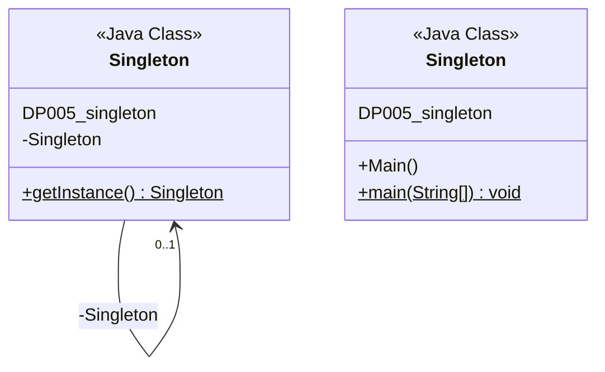

<!-- PDF page: 076 -->

- Singleton.java-인스턴스가 1개만 있는 클래스

```java
package DP005_singleton;

public class Singleton {
    private static Singleton singleton = new Singleton();
    // 외부에서 접근하지 못하도록 private, 한 프로그램에서 모두 사용할 수 있도록 으로 static
    private Singleton() { // 외부에서 생성하지 못하게 생성자의 접근제한자를 private으로 선언
        System.out.println("인스턴스가 생성되었습니다.");

    }
    public static Singleton getInstance() {
        return singleton; //생성된 Singleton 인스턴스를 반환
    }
}
```

- Main.java-Main()메소드가 있는 테스트용 클래스

```java
package DP805_singleton;

public class Main {
    public static void main(String[ ] args) {
        System.out.println("Start.");
        Singleton obj1 = Singleton.getInstance(); //인스턴스 반환받는다.
        Singleton obj2 = Singleton.getInstance(); //인스턴스 반환받는다.

        if(obj1 == obj2){ //obj1과 obj2가 참조하는 값은 같다.
            System.out.println("obj1과 obj2는 같은 인스턴스입니다.");
        }else{
            System.out.println("obj1과 obj2는 틀린 인스턴스입니다.");
        }
        System.out.println("End.");

    }
}
```

##### ② 구조패턴

- Adapter 패턴

- 정의: 클래스가 갖는 프로그래밍 인터페이스를 다른 클래스의 프로그래밍 인터페이스로 변화시킴. 하나의 프로그램에서 서로 관련이 없는 클래스들을 함께 일하도록 만들고 싶을 때 Adapter 패턴을 사용

- 장점: 새로운 클래스, 해당 클래스의 기능 추가가 간편

- Bridge패턴

- 정의: 개발자가 클라이언트의 코드 내용을 변경하지 않고도 구현 내용을 바꾸거나 대체할 수 있도록 클래스의 인터페이스와 구현 내용을 분리시킨 것

- 장점: 인터페이스와 구현의 분리. 실행 시간에 구현 객체 교환 및 설정 가능. #ifdef~#endif 구문을 대체할 수 있음

- Composite패턴

- 정의: 디렉토리와 파일을 합해서 디렉토리 엔트리로 취급하듯이 특정 객체들과 그것들을 포함하는 객체들을 동일하게 다룰 수 있게 해주는 패턴

<!-- PDF page: 077 -->

- 장점: 기본 객체와 구성 객체를 특별히 구별하지 않고 소스코드를 작성할 수 있기 때문에 편리

- Decorator 패턴

- 정의: 특정 객체에게 동적으로 기능을 추가하거나 추가했던 기능을 삭제하기 위해 사용되는 클래스 구조

- 장점: 객체에 기능 추가 시 매우 간편하고 유연함

- Façade패턴

- 정의: 여러 개의 클래스들이 밀접한 관계를 가지고 있으며 전체적으로 하나의 역할을 수행할 때, 그 역할을 대표하기 위한 클래스를 정의하고 외부 client들이 일일이 각 클래스를 직접 다루지 않더라도 대표 클래스를 통하여 원하는 기능을 제공받을 수 있도록 만든 방식

- 장점: 복잡한 서브 시스템에 대해 간단한 interface 제공 가능, 객체들 간의 의존 관계를 계층화시켜 복잡하거나 회귀적인 의존관계 제거

- Façade 클래스 다이어그램

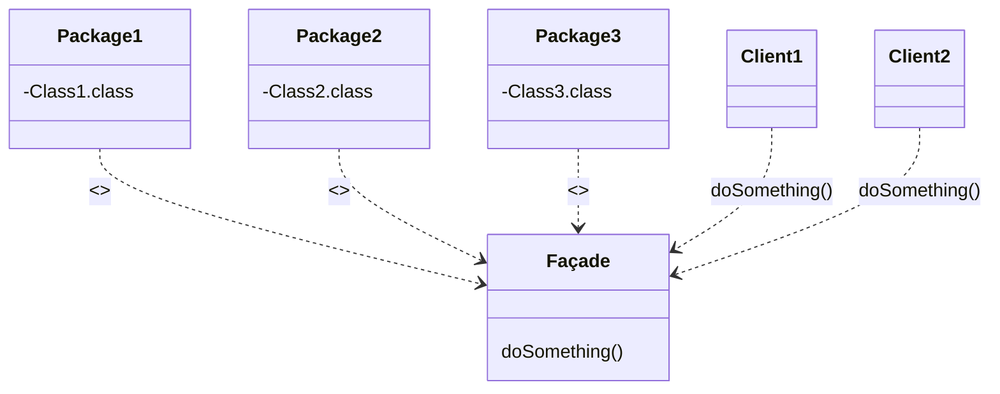

<!-- Façade의 doSomething()에 연결된 원문 코드 주석. 원문에 닫는 중괄호는 없다. -->
```java
doSomething() {
    Class1 c1 = new Class1();
    Class2 c2 = new Class2();
    Class3 c3 = new Class3();
    c1.doStuff(c2);
    c3.setX(c1.getX());
    return c3.getY();
```

- Java 소스 코드

아래 Java 코드 예제는 사용자(you)가 파사드(컴퓨터)를 통해 컴퓨터 내부의 부품(CPU, HDD) 등을 접근한다는 내용의 추상적인 예제

<!-- PDF page: 078 -->

<!-- 원문 예제의 주석 종결 누락과 start Computer, cpu, jump 표기를 그대로 옮겼다. -->
```java
/* Complex parts */

class CPU {
    public void freeze() { ... }
    public void jump(long position) { ... }
    public void execute() { ... }
}

class Memory {
    public void load(long position, byte[ ] data) {
        ...
    }
}

class HardDrive {
    public byte[ ] read(long lba, int size) {
        ...
    }
}

/* Façade /

class Computer {
    public void start Computer() {
        CPU cpu = new CPU();
        Memory memory = new Memory();
        HardDrive hardDrive = new HardDrive();
        cpu.freeze();
        memory. load(BOOT_ADDRESS, hardDrive.read(BOOT_SECTOR, SECTOR_SIZE));
        cpu, jump (BOOT_ADDRESS);
        cpu.execute();
    }
}

/* Client */

class You {
    public static void main(String[ ] args) throws ParseException {
        Computer facade = /* grab a facade instance */;
        facade.start Computer();
    }
}
```

- Flyweight 패턴

- 정의: 정보를 공유하기 위해 공유 가능한 정보와 그렇지 않은 정보를 분리하고 공유 가능한 정보를 개체 형태로 정의해서 정보 공유를 수행하는 형태의 설계

- 장점: 저장 공간 감소 및 다수의 객체 다루기 용이

- Proxy 패턴

- 정의: Proxy 패턴은 복잡하거나 생성하는 데 시간이 걸리는 객체를 좀더 간단한 객체로 나타내기 위해 사용되는 패턴. 객체를 생성하는 일이 자원 소모나 시간 소요라는 점에서 소비가 클 경우 Proxy 패턴은 개발자가 이런 객체를 실제로 필요로 할 때까지 해당 객체의 생성 작업을 늦춤

<!-- PDF page: 079 -->

##### ③ 행위 패턴

- Chain of Responsibility 패턴

- 정의: 객체들 간의 관계에 의해 체인을 구성해 두고 특정 객체에게 요청이 전달될 경우, 해당 객체가 요청을 처리하지 못하면 체인 상에 있는 다른 객체에게 요청을 대신 처리하게 하는 방식의 설계

- 장점: 시스템의 결합도를 낮춤. 객체들 간의 책임을 보다 유연하게 분산

- 단점: 요청이 걸리는 시간과 처리 여부가 부정확하므로, 실시간 시스템과 같이 시간 예측이 중요한 경우 사용하지 않는 것이 좋음

- Command 패턴

- 정의: Chain of Responsibility 패턴이 클래스의 체인 안에서 요청 내용을 전달하는 반면, command 패턴은 특정 객체에만 요청 내용을 전달한다. 이것은 객체 안의 특정 처리 작업에 대한 요청 내용을 포함하며, 해당 요청 내용을 알려진 public 인터페이스로 전달

- 장점: callback 함수에 대한 객체 지향적 대안이 될 수 있음. Undo 및 Redo 기능을 지원하고자 할 때 유용

- Interpreter 패턴

- 정의: 비교적 간단한 문법에 대해 문법 자체를 클래스로 정의해서 문법 검사와 함께 필요한 기능도 별도의 자료구조 없이 효율적으로 수행할 수 있게 만들어주는 클래스 구조

- 장점: 문법의 변경이나 확장의 용이, 문법 구현의 용이

- Iterator 패턴

- 정의: 객체의 내부구조에 신경 쓰지 않고 표준적인 인터페이스를 이용한 데이터의 리스트나 컬렉션을 통하여 이동하는 것을 허용

- Mediator 패턴

- 정의: 클래스들이 직접적으로 M:N의 관계를 맺고 있어 복잡할 때, 중재 클래스를 도입해서 클래스 간의 직접적인 관계를 끊고, 복잡한 M:N의 관계를 M:1로 전환시켜 줄 수 있는 클래스 구조

- 장점: 클래스 간의 결합도 감소

- Memento 패턴

- 정의: 객체의 상태 정보를 별도의 클래스로 정의하고, 리스트 자료구조에 그 클래스의 객체를 필요한 시점마다 저장해 두었다가 특정 시점에서 객체의 상태 복원을 쉽게 할 수 있도록 만든 클래스 구조

- Observer 패턴

- 정의: 하나의 object 상태가 변할 때, 관련된 object들이 자동으로 notified and updated되기 위한 object들 간의 one-to-many dependency가 되도록 설계

<!-- PDF page: 080 -->

- Observer 패턴 클래스 다이어그램

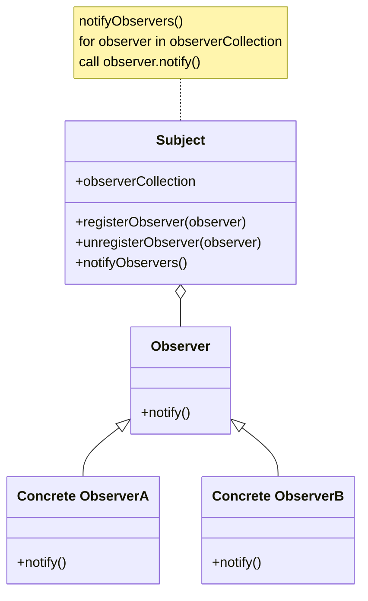

- Java 소스 코드 예제

<!-- 원문의 package/import 병합, Event Source 공백, setChanged; 및 catch 여는 괄호 누락을 그대로 옮겼다. -->
```java
/* 파일명: Event Source. java */

package obs import java.util. Observable; // 이 부분이 옵저버에게 신호를 보내는 주체입니다.
import java.io. BufferedReader;
import java.io.IOException;
import java.io.InputStreamReader;

public class Event Source extends Observable implements Runnable
{
    public void run()
    {
        try
        {
            final InputStreamReader isr = new InputStreamReader( System. in );
            final BufferedReader br = new BufferedReader ( isr );
            while ( true )
            {
                final String response = br.readLine();
                setChanged;
                notifyObservers( response );
            }
        }
        catch (IOException e)
            e.printStackTrace();
        }
    }
}
```

<!-- PDF page: 081 -->

<!-- 원문 예제의 V2974, import 종결 콜론, 소문자 string, Event Source 공백, evsrc/evSrc 불일치를 보존했다. -->
```java
/* V2974: ResponseHandler.java */

package obs;

import java.util. Observable;
import java.util. Observer: /* 여기가 옵저버 */

public class ResponseHandler implements Observer
{
    private String resp;
    public void update (Observable obj, Object arg)
    {
        if (arg instanceof String)
        {
            resp = (string) arg;
            System.out.println("₩nReceived Response: "+ resp );
        }
    }
}
```

```java
/* 파일명: myapp.java */
/* 여기서부터가 프로그램 시작점 */

package obs;

public class MyApp
{
    public static void main(String args[ ])
    {
        System.out.print ln("Enter Text >");

        // 이벤트 발행 주체를 생성함 - stdin으로부터 문자열을 입력받음
        final Event Source evsrc = new Event Source();

        // 옵저버를 생성함
        final ResponseHandler respHandler = new ResponseHandler();

        // 옵저버가 발행 주체가 발행하는 이벤트를 구독하게 함
        evSrc.addObserver( respHandler );

        // 이벤트를 발행시키는 쓰레드 시작
        Thread thread = new Thread(evSrc);
        thread.start();
    }
}
```

- State 패턴

- 정의: 어떤 객체의 내부 상태가 계속 추가될 가능성이 있을 때, 새로운 상태의 추가도 쉽도록 만들어 주고, 추가된 상태를 포함해서 객체의 상태 변화 시, 기존 소스코드 변경 없이 행위 수행 변경이 가능하도록 객체 상태 정보를 클래스 상속 구조로 정의해서 사용하는 방식

- 장점: 객체 내부에서 상태값을 비교하는 문장을 없애준다. 정보의 일관성 유지를 돕는다.

- Strategy 패턴

- 정의: 알고리즘의 성격을 변경할 수 있도록 설정하여 가장 적합한 성격을 선정할 수 있는 방법을 제공하게 함

<!-- PDF page: 082 -->

- 장점: 원하는 알고리즘의 선택 용이, 기존의 코드를 수정하지 않고 새로운 알고리즘 적용 가능

- Template Method 패턴

- 정의: 상속 관계를 이용하면 구체적인 구현은 다르나 큰 틀에서 알고리즘의 기본 골격이 동일한 경우, 동일한 기본 골격을 상위 클래스에서 하나의 모듈로 작성, 관리할 수 있게 되는 것

- Visitor 패턴

- 정의: 새로운 종류의 작업을 쉽게 추가할 수 있고, 객체 여러 개에 대해서도 다양한 작업을 불편 없이 수행할 수 있게 작업 대상과 작업 항목을 분리해서 클래스 구조로 정의한 것

### [참고 및 추천 자료]

[1] 최은만, “소프트웨어 공학”, 서울: 정익사, 2007.

[2] 윤청, “소프트웨어 공학”, 경기: 생능출판사, 2014.

[3] 고석하, 송정유, “소프트웨어 프로젝트 관리”, 경기: 생능출판사, 2007.

[4] 삼성SDS기술사회, “핵심정보통신기술총서 소프트웨어공학”, 서울: 한울아카데미, 2014.

[5] Gamma, E, et al., “Design Patterns: Elements of Reusable Object-Oriented Software,” 1994.

<!-- PDF page: 083 -->

## Ⅶ. 사용자 인터페이스(UI)/사용자 경험(UX) 설계

### 최근 동향 및 주요 이슈

사용자 인터페이스는 컴퓨터 시스템의 가장 중요한 요소 중 하나이며, 최근 사용자 중심 기획 및 설계 등 사용자 만족 개선에 중요한 요인으로 사용자 인터페이스의 중요성이 날로 증가하고 있다.

### 학습 목표

1. 사용자 인터페이스 설계 원리를 이해하고 적용할 수 있다.

2. 인간-컴퓨터 상호작용(HCI, Human Computer Interaction)에 대해 설명할 수 있다.

3. GUI(Graphic User Interface)의 구성요소를 이해하고, 이를 적절히 활용할 수 있다.

### 핵심 키워드

UI/UX<br>
HCI(Human Computer Interaction)<br>
GUI(Graphic User Interface)

<!-- PDF page: 084 -->

### 실무 미리보기 제대로 설계되지 않은 UX로 인해 인명피해도 발생할 수 있다.

소프트웨어가 직접적으로 인간의 생명에 영향력을 미치는 의료기기분야에서는 의료기기의 사소한 결함이 살상 이라는 엄청난 결과를 초래할 수 있기 때문에 어느 분야보다도 민감할 수 밖에 없다. 일반인들은 의료기기의 물리적 장비결함과 사용자 조작실수 중 어떤 것이 더욱 치명적인 결과를 낼 것인가에 대한 질문에 대부분 기기의 물리적 결함이라고 답변하지만, 복잡한 조작 방식 등으로 인한 사용자 실수가 더욱 큰 위험을 갖는다. 예를 들어 심장제세동기의 패드 부착위치가 직관적으로 설명되어있지 못할 경우 응급 조치가 아무런 효과를 발휘할 수 없거나 또는 정반대의 결과로 진행될 가능성이 높아지게 된다. 이런 사항들이 UX의 중요성을 증명하는 사항들이라고 볼 수 있다.

<!-- 사진 생략: 심장제세동기 패드 부착 위치 안내 사진. -->

70년대 초 개발된 방사선 치료장비 테락(Therac)25의 결함으로 인해 과다 방사선에 노출된 환자가 사망한 의료사고를 분석한 자료를 보면 기기의 물리적 세팅 및 관리자 콘솔에 의한 처방전 처리의 별도작업으로 인한 불편을 해결한 업그레이드 과정에서 잘못 설계된 오류메시지 출력으로 인해 1985년 7월 온타리오(캐나다) 암재단 방사선 치료과정에서 과다피폭을 입은 환자가 11월 사망하는 사고가 발생한 사실을 찾아볼 수 있다. 원인은 결국 방사선 치료사가 테락25의 알 수 없는 오류 메시지(동일 메시지 뒤에 숫자로 구분하는 형태로 명확히 구분불가)에 무감각해진 상태였고, 이로 인해 기기의 비정상 중단을 5회 반복하면서 환자를 치료하는 과정에서 환자는 과다한 방사선에 노출되게 된 것이다.

최근 스마트폰을 활용한 모바일 비즈니스에서는 제한된 화면의 정보를 활용하여 고객의 사용성을 최대화하고 이를 통한 고객확보 및 매출 확대 등을 추가하는 기업이 많아지고 있으며, 보다 고객중심의 가치 있는 서비스를 제공하기 위하여 UI/UX의 많은 고민과 이를 위한 전문가 조직을 보유한 회사들이 증가하고 있는 상황이다.

<!-- PDF page: 085 -->

### 01 사용자 인터페이스(User Interface) 개요

인터페이스(Interface)란 단어는 원래 단어의 구성이 의미하는 대로 두 물체 사이에(Inter) 서로 접촉(Face)하는 부분을 말한다. 사용자 인터페이스는 사용자와 시스템이 정보를 주고 받는 상호 작용이 잘 이루어지도록 하는 장치 혹은 소프트웨어를 의미하며, 소프트웨어의 창과 같다. 예를 들어 특정 소프트웨어를 사용하기 위해 사용자가 키보드나 마우스를 이용하여 명령을 입출력 하거나 메뉴를 선택하는 것도 사용자 인터페이스에 해당한다. 인터페이스 설계는 다음과 같은 점에 중점을 두어 진행되어야 한다.

#### 가) 일관성 필요

사용자 인터페이스는 일관성 있게 만들어야 한다. 그러나 일반적으로 큰 시스템을 개발하는 경우 여러 사람이 사용자 인터페이스를 설계, 구현하게 됨에 따라 일관성을 유지하기가 어렵다. 사용자 인터페이스가 일관성을 가지기 위해 개발 이전에 사용자 인터페이스에 대한 표준안을 만들어야 하며, 개발 후에도 이를 점검하여 오류를 수정하여야 한다.

#### 나) 사용자 중심 설계

사용자 인터페이스는 사용자를 위한 것이기 때문에 사용자를 중심으로 설계되어야 한다. 사용자가 인터페이스를 제어할 수 있도록 만드는 것이 요구된다. 사용자 인터페이스의 “입력 및 출력 언어”를 사용자가 쉽게 배울 수 있도록 설계하여야 한다.

#### 다) 피드백

사용자 인터페이스는 의미 있는 피드백을 제공하여야 한다. 사용자가 잘못 버튼을 누르거나 잘못된 연산을 수행하고자 할 때 자신의 잘못을 쉽게 파악할 수 있도록 해주어야 한다.

#### 라) 파괴적인 행동에 대한 확인

사용자가 자료 또는 파일을 지우려고 하면 이를 실행에 옮기기 전에 확인할 필요가 있다. 가능하면 사용자가 심각한 오류를 유발시킬 수 없도록 설계한다. 되살리기(Undo) 기능도 유용한 방법 중 하나이다.

### 02 사용자 경험(User Experience) 개요

사용자 경험(User Experience)은 사용자의 환경을 개선하려는 설계자의 사고와 행동이다. 사용자가 어떤 시스템, 서비스를 통해 목적을 이루려 할 때 느끼는 경험, 감정, 지각, 태도, 반응의 종합적인 경험을 말하고, 사용자를 위해 편리한 화면 설계와 환경을 연구하고 서비스를 기획하는 과정이다.

#### 가) 사용자 경험(UX)과 사용자 인터페이스(UI)의 차이점

사용자 경험(User Experience, 이하 UX)은 안 보이는 것을 연구하는 것이고 사용자 인터페이스(User Interface, 이하 UI)는 그것을 보이게 만드는 구체화 작업을 말한다. 또한 UX는 사용자가 느끼는 느낌, 태도, 행동이고 UI는 사용자가 인터페이스를 직접 대면하는 환경으로 구분할 수 있다. UX는 사용자의 경험에 대한 통계에 기반을 둔 개선 연구이면서, UI는 그 개선 연구를 실제화하는 것이라고 볼 수 있다. 즉, UX는 보이는 것에 대한 경험을 말하고, UI는 사용자에게 보이는 인터페이스 그 자체를 의미한다.

<!-- PDF page: 086 -->

UI/UX의 차이점은 간단하게 정리하면 다음과 같다.

| UX | UI |
| --- | --- |
| 과정 | 결과 |
| 그릇 | 음식 |
| 기획 | 디자인 |
| 감성 | 이성 |

### 03 UI/UX 설계도구

사용자 및 설계자의 생각과 아이디어를 정리하고 시각화, 개발된 서비스를 분석하고 사용자 테스트, 그리고 이들의 업무 효과를 개선할 수 있거나 가속화할 수 있는 대표적인 UI/UX 도구를 정리하였다.

#### 가) MAKE-아이디어를 제품으로 전환

① 팀운영 및 관리(Organizing Information)-GitHub, Trello

② 와이어프레임(Wire-frames)-Microsoft Visio, moqups

③ 프로토타이핑(Prototyping)-Adobe Photoshop, ketch3

#### 나) Check-사용자 분석 및 대응방법 확인

① 시각적 분석(Visual Analytics)-Beusable, Clicktale

② 분석과 매트릭스(Analytics & Metrics)-Google Analytics, Mixpanel

③ AB테스팅(AB Testing)-Google Optimize, Optimizely

④ 행위기록(Record Users)-Beusable, hotjar

#### 다) Think-시장의 피드백 지속확인

① 사용자 모집(Recruiting Users)-Pivot Planet, Clarity

② 온라인설문(Online Surveys)-Polldaddy, hotjar

③ 사용자 피드백(Capture In-Site Feedback)-LiveChat, mouseflow

④ 원격테스팅(Testing Layouts Remotely)-Chalkmark, UsabilityHub

### [참고 및 추천 자료]

[1] 최은만, “소프트웨어 공학”, 서울: 정익사, 2007.

[2] 윤청, “소프트웨어 공학”, 경기: 생능출판사, 2014.

[3] Roger Pressman, “Software Engineering”, NY: McgrawHill, 2013.

[4] 김종하, “역사 속의 소프트웨어 오류”, 경기: 에이콘출판주식회사, 2014.

[5] 뷰저블, “웹사이트 사용자의 UX 분석”, 2017.

<!-- PDF page: 087 -->

## VIII. 프로그래밍 언어와 개발환경

### 최근 동향 및 주요 이슈

최근 모바일/클라우드 상의 소프트웨어 개발 및 앱 개발의 유행으로 Java 및 C 계열의 언어 사용이 기업에서 대세가 되고 있지만 이미 과거부터 꾸준히 프로그래밍의 양대산맥으로 인식되고 있는 언어이면서 개발자들에게 가장 많이 선택되어 사용되어 왔다. 또한 이들 언어는 타 프로그래밍 언어 습득 시 기본이 되면서, 다양한 비즈니스 분야에 사용되는 언어이기 때문에 관련 기술을 먼저 습득하는 것이 중요하다.

### 학습 목표

1. 프로그래밍 언어(비구조적 언어, 구조적 언어, 객체 지향 언어)의 특성을 설명할 수 있다.

2. 주요 프로그래밍 언어(C, C++, Java, Python, JavaScript)의 특징을 비교할 수 있다.

3. 소프트웨어 개발 프레임워크를 이해하고 그 종류를 설명할 수 있다.

4. 통합개발환경(IDE)을 이해하고 설명할 수 있다.

### 핵심 키워드

프로그래밍 언어, 컴파일러, 인터프리터<br>
코드재사용<br>
소프트웨어 개발프레임워크, 스프링프레임워크, 전자정부 표준프레임워크<br>
통합개발환경

<!-- PDF page: 088 -->

### 실무 미리보기

##### 프로그래밍 언어의 선택

실제 기업환경에서의 제품이나 서비스 개발을 위한 프로그래밍 언어의 선택 기준은 다양하게 결정된다. 하드웨어, OS환경, 도입솔루션, 업무특성, 최신 개발언어 적용, 개발가능 인력현황 등이 이러한 기준에 속한다. 다만, 아무리 활용성이 높은 개발언어라 할지라도 개발 가능인력이 극소수이며 인건비가 과도하게 높게 파악될 경우에는 대체 언어를 선택하기도 하는 것이 현실이다.

예를 들어 배치성 업무가 매우 많은 시스템을 구축하는 프로젝트에서 모든 구현을 Java로 선택했다면 아마도 해당 프로젝트는 배치 성능향상이라는 매우 치열한 문제에 부딪히게 될 가능성이 높게 되며, 속도 향상만을 위해 C언어를 선택했다면 아마도 생산성과 매우 치열한 테스트 커버리지 문제에 부딪히게 될 가능성이 높다.

따라서, 많은 프로젝트는 과거 경험을 토대로 선택하게 되며, 동일 프로젝트 내에서도 다양한 언어와 아키텍쳐가 적용되는 것이 현실이다. 다양한 분야에서 모바일 서비스가 거의 필수화 되는 최근 개발 프로젝트에서는 특히 그 복잡함과 다양함이 매우 증가하게 된다.

##### 소프트웨어 개발 프레임워크와 통합개발환경(IDE)

오늘날 소프트웨어 개발자는 다양한 언어와 다른 버전의 컴파일러를 사용하는 전세계의 다양한 개발자들과 협업하며, 코드를 신규 작성하거나 10년도 넘은 오래된 라이브러리를 활용한 소프트웨어를 유지보수해야 할지도 모른다. 빠르게 변하고 있는 비즈니스 환경에 적응하기 위해 협업 방식, 고객지원 방식, 코딩 방식들이 변화하고 있으며, 지속적인 통합(Continuous Integration) 환경 기반의 통합 개발 환경을 구축하여 적시에 서비스를 제공할 수 있도록 지원한다. 프레임워크는 실행환경, 개발환경, 운영환경, 관리환경으로 구성되며 모듈화되고 재사용성을 극대화하여 개발 생산성을 향상시키고 소프트웨어 품질을 높일 수 있는 다양한 라이브러리를 제공한다.

<!-- PDF page: 089 -->

### 01 프로그래밍 언어의 개요

#### 가) 프로그래밍 언어 개념

프로그래밍 언어란 사용자가 보다 친숙한 언어, 즉 일상적으로 사용하는 언어와 비슷한 언어를 가지고 프로그램을 짤 수 있게 하도록 한 것을 말한다. 즉, 사람이 컴퓨터와 소통할 수 있게 하려면 프로그래밍 언어를 사용해야 한다. 그리고 프로그래밍 언어마다 작성된 프로그램을 기계어로 번역해 주는 고유의 번역기인 컴파일러, 인터프리터가 있어 컴퓨터가 언어들을 이해할 수 있도록 한다.

또한, 프로그래밍 언어마다 쓰이는 용도가 달라 각 영역에서 적절한 프로그래밍 언어를 사용하여 원하는 생산성 및 품질을 확보하는 것이 필요하다.

〈표 21〉 저급언어와 고급언어

<table>
<tbody>
<tr>
<td>구분</td>
<td>설명</td>
<td>대표적인 언어</td>
</tr>
<tr>
<td>저급언어<br>(Low-Level<br>Lanaguage)</td>
<td>기계 중심적인 언어로 실행 속도가 빠르고 기계마다 다른 코드를<br>가짐<br>컴퓨터가 이해하기 쉬운 이진법으로 이루어진 기계어와 기계어에<br>대응되도록 만든 어셈블리어가 있음<br>컴퓨터 기종 간 호환성이 없음</td>
<td>기계어(Machine Lanaguage),<br>어셈블리어(Assembly Language)</td>
</tr>
<tr>
<td>고급언어<br>(High-Level<br>Language)</td>
<td>사람이 이해하기 쉬운 자연어에 가깝게 만들어져 저급언어에<br>비해 프로그래밍하기 쉽고 가독성과 생산성이 높음<br>특정 기계와 관계없이 독립적으로 프로그램을 만들 수 있고<br>컴파일러나 인터프리커에 의해 저급언어로 변환됨</td>
<td>포트란(FORTRAN), 코볼(COBOL),<br>베이식(BASIC), C, C++, 자바(Java),<br>파이썬(Python)</td>
</tr>
</tbody>
</table>

프로그래밍 언어는 0과 1로만 작성되어 하드웨어가 직접 이해할 수 있는 기계어와 기계어를 간단한 문자로 표현한 어셈블리어가 있다. 기계어와 어셈블리어를 저급언어라고 한다. 하지만, 현실적으로 사람이 기계어나 어셈블리어로 직접 프로그램을 작성하기가 어려워 이를 해결하고자 고급언어가 만들어졌다. 대표적인 고급언어인 C, C++, 자바, 파이썬 등 사람이 일상 언어와 기호를 사용해 프로그램을 작성할 수 있도록 해준다.

〈표 22〉 프로그래밍 언어 사용 영역

<table>
<thead><tr><th>영역</th><th>주요 프로그래밍 언어</th></tr></thead>
<tbody>
<tr>
<td>플랫과학기술(수치계산용)</td>
<td>FORTRAN, ALGOL60</td>
</tr>
<tr>
<td>비즈니스용</td>
<td>COBOL</td>
</tr>
<tr>
<td>인공지능용</td>
<td>LISP, PROLOG</td>
</tr>
<tr>
<td>시스템 프로그래밍용</td>
<td>PL/S, BLISS, ALGOL, C/C++, Java</td>
</tr>
<tr>
<td>특수목적용</td>
<td>GPSS(시뮬레이션을 위한 언어)</td>
</tr>
</tbody>
</table>

#### 나) 인터프리터 언어

인터프리터는 중간과정 없이 원시 프로그램을 직접 저급 언어로 바꾸면서 동시에 실행한다. 고급 언어를 중간 코드까지만 번역하고 번역된 코드를 소프트웨어 인터프리터로 실행하여, 기계어 프로그램이 만드는 것이 아니라, 각 중간 코드의 기능에 해당되는 서브루틴을 호출하면서 수행한다. LISP, PROLOG등이 인터프리터 언어이다.

<!-- PDF page: 090 -->

인터프리터 과정

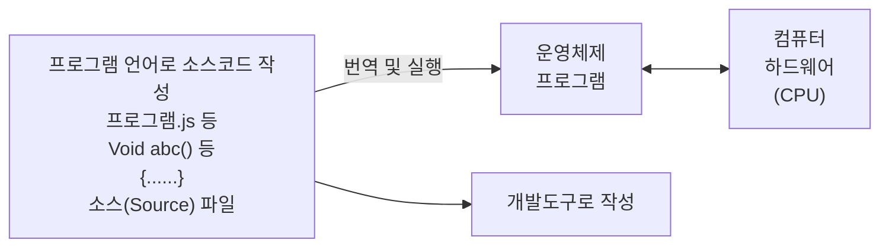

임시기억장치에 우선 로드함

[그림 19] 인터프리터 과정

##### ① 인터프리터 언어 장점

- 실행을 위해 완전한 기계어 번역을 기다리지 않고 필요 시 마다 실행

- 프로그램이 실행될 때까지 원시 언어 형태를 유지하므로 메모리 절약

##### ② 인터프리터 언어 단점

- 재실행 시 매번 원시 프로그램을 디코딩(Decoding)하여 소요 시간 많음

#### 다) 컴파일러 언어

컴파일은 어느 특정 언어를 동등한 의미를 갖는 다른 언어로 바꾸는 것을 의미한다. 컴파일러에 의해 고급 언어를 저급 언어인 기계어로 번역하여 객체 모듈(Object Module)을 만들고, 이 모듈을 링크, 로드하여 실행시키는 것이다. FORTRAN, PASCAL, C/C++등이 컴파일러 언어이다.

컴파일 과정

```mermaid
flowchart LR
 S["프로그램 언어로<br>소스코드 작성<br>메신저.C 등<br>Void abc() 등<br>{......}<br>소스(Source) 파일"] -->|번역| B["실행 가능한<br>프로그램 생성<br>메신저.exe 등<br>바이너리(Binary) 파일"]
 S --> TOOL["개발도구로 작성"]
 B --> SAVE["저장"]
 B -->|실행| OS["운영체제<br>프로그램"]
 OS <--> CPU["컴퓨터<br>하드웨어<br>(CPU)"]
```

임시기억장치에 우선 로드함

[그림 20] 컴파일 과정

##### ① 컴파일러 언어 장점

- 번역된 목적 코드(Object Code) 저장 가능

- 컴파일 한 후 바로 재실행이 가능

- 재사용 프로그램인 경우, 한번 컴파일 한 후에는 빠르게 재실행에 따라 실행시간 단축

<!-- PDF page: 091 -->

##### ② 컴파일러 언어 단점

- 기계어로 변환하는데 많은 시간 소요

- 한 줄의 원시 프로그램이 때로는 몇 백 줄의 기계어로 번역되어 메모리 낭비 발생

### 02 주요 프로그래밍 언어의 특징

#### 가) C언어

##### ① C언어 소개

C언어는 1970년대 UNIX 운영체제를 위해 AT&A의 벨 연구소에서 일하던 데니스 리치(Dennis Richie)에 의해 탄생하였고, 컴퓨터 언어 중 C언어를 모티브 삼은 언어가 대부분이며 iOS(아이폰), 안드로이드와 같은 현재 유명한 운영체제들은 C언어로 대부분 구성되어 있다.

##### ② C언어 특징

- 실행속도가 빠르고 효율적인 메모리 관리 용이

- 표기법이 간결하여 문단으로 기능 구현 가능

- 절차지향적인 언어: 프로그램 실행이 정해진 순서에 따라 진행

- 배열과 메모리 등을 고려한 프로그램이 필요하여 Java에 비해 어려움

- 실행환경 및 기계 변경 시 인식이 어려움

#### 나) C++ 언어

##### ① C++ 언어 소개

C++는 C의 대부분의 특징을 포함하고 있어서 시스템 프로그래밍에 적합하고 클래스, 연산자 중복, 가상 함수 등의 특징이 있어 객체 지향 프로그래밍에 적합하다.

객체 지향형 프로그래밍 기법을 이용하여 소프트웨어를 개발하면, 소프트웨어의 재사용성, 확장성 및 유지보수성이 높아지기 때문에 대형 프로그램 작성에 좋고, 프로그램의 가독성(Readability)이 좋다.

##### ② C++ 언어의 특징

- 객체 지향 특성: C언어에서 객체 지향 프로그래밍을 지원하는 언어로 발전된 언어로서 객체 지향 특성을 잘 반영하고 있다.

- 캡슐화와 자료 은닉 측면: C++의 특징인 클래스는 캡슐화된 형태로 잘 사용되는데, 실제 내부 작동 구조는 은닉된다. 따라서 사용자는 클래스가 어떻게 동작하는지는 알 필요 없고 어떻게 쓰는지만 알면된다.

- 상속성과 재사용성 측면: C++는 상속성을 통해 재사용성을 가진다. 상속이란 여러 클래스의 공통된 특징을 하나의 클래스로 만들고 이를 확장하여 새로운 클래스를 만들어 가는 과정을 말한다. 상속성을 통해 프로그램의 재사용성을 높여주며 소프트웨어의 생산성을 향상시킬 수가 있다.

- 다형성 측면: 하나의 이름에 여러 형태를 띄는 것을 말한다. 예를 들어 '홍길동'이라는 사람은 직장에서 열심히 일하는 직장인이지만, 야간학원에서는 열심히 강좌를 하는 강사이기도 하다.

<!-- PDF page: 092 -->

#### 다) Java 언어

##### ① Java 언어 소개

1991년부터 선마이크로시스템즈사의 제임스 고슬링은 가전 제품을 제어하는 단순하고 버그 없는 프로그래밍 언어 Java를 개발하기 시작하였다. 초기에는 C++언어로 시작하였고 C++의 여러 문제점을 개선한 언어였으나 가전제품 회사들의 관심밖에 있다가 1995년 WWW라는 인터넷의 보급 확산으로 핫자바(Hot Java)에 의해 인터넷에 응용되면서 애플릿(Applet) 이라는 강력한 출력 형태가 인기를 끌게 되었다. Java 언어는 작고 단순한 구조로서 효율적으로 변화되어 실행되고, 기존 언어에서 에러의 원인이 되는 여러 기능들이 보완됨으로써 장점을 인정받았다. Java는 현재 앱, 모바일 등에 가장 많이 사용하는 대중적인 프로그래밍 언어가 되었고, 지금은 가전제품 및 안드로이드의 어플리케이션을 만들 때 Java 언어를 사용하여 개발하기에 이르렀다.

##### ② Java 언어의 특징

- C++언어로 부터 나온 Java는 C/C++언어와 문법적으로 유사

- C++의 복잡성을 단순화

- 항상 자동 가비지 콜렉션을 수행

- 객체 지향적. 객체개념을 적용하는 완벽한 객체 지향적 언어

- Java 프로그램은 자바 가상머신에 의해 실행됨으로 플랫폼에 독립적

#### 라) Python 언어

##### ① Python 언어 소개

1990년 Guido Van Rossum에 의해 개발된 인터프리터 언어로 자주 사용하는 영어 키워드로 사용하여 가독성이 좋고 높은 생산성을 가진 객체 지향적 대화형 언어이다. 주로 Django라는 오픈소스 기반의 웹 프레임워크를 기반으로 웹 프로그래밍 언어로 사용하거나 최근에는 빅데이터 분석이나 인공지능 프로그램 개발에 많이 활용되고 있다.

##### ② Python 언어의 특징

- 동적 타이핑(dynamic typing)으로 실행 시간에 자료형을 확인

- 문법이 쉽고 영어 구분과 유사하여 사용하기 쉬움

- 단일 이벤트 루프를 사용하여 비동기식 코드 작성에 유리

- 멀티패러다임 프로그래밍 언어(절차적 언어 지원, 함수형 프로그래밍 언어, 객체 지향 프로그램밍 지원)

#### 마) JavaScript 언어

##### ① JavaScript 언어 소개

객체 기반의 스크립트 프로그래밍 언어로 웹 브라우저 내에서 주로 사용하며, 다른 응용 프로그램의 내장 객체에도 접근할 수 있는 기능을 가지고 있다. 또한 Node.js와같은 런타임 환경과 같이 서버 사이드 네트워크 프로그래밍에도 사용되고 있다.

##### ② JavaScript 언어의 특징

- 간단하게 코딩을 짜고 프로그래밍을 구현할 수 있지만, 보안에 취약할 수 있음

- 오픈 소스로 운영되기 때문에 개발자들 간의 공유가 활발하여 확장성 및 활용도 높음

- 별도의 컴파일 과정이 필요하지 않아 쉽게 배울 수 있는 언어임

- 최근에는 Angular.js, D3.js, Node.js, React.js 등의 자바스크립트 관련 라이브러리나 프레임워크가 개발자들 사이에서 활용도가 점차 높아짐

<!-- PDF page: 093 -->

### 03 소프트웨어 개발 프레임워크

#### 가) 소프트웨어 개발 프레임워크 개념

소프트웨어 개발 프레임워크란 효율적인 정보시스템 개발을 위한 코드 라이브러리, 인터페이스 규약, 설정정보 등의 집합으로 소프트웨어 구성에 필요한 기본 뼈대를 제공한다. 개발자는 이를 기반으로 어플리케이션 상위 기능(비즈니스 로직 등)을 확장하여 어플리케이션을 완성할 수 있는 제어의 역전 개념이 적용된 대표적인 기술이다.

즉, 소프트웨어를 개발할 때 처음부터 하나하나 개발하는 것이 아니라 화면에 표현되거나, 데이터를 처리하는 방식, 외부 모듈과 인터페이스하는 방식 등을 미리 구조화된 도구와 라이브러리 등을 제공하여 개발자가 손쉽게 소프트웨어를 개발할 수 있는 환경을 제공한다.

소프트웨어 개발 프레임워크는 소프트웨어의 특정 문제를 해결하기 위한 상호 협력관계의 클래스와 인터페이스들의 집합으로 개발하면서 발생하게 되는 통합성과 일관성을 해결하고 개발자들의 코딩 작업을 줄여주고 개발 생산성을 높여준다.

또한 개발자들을 상향 평준화시켜 일정 수준 이상의 품질을 보장해 주고 검증된 기술 기반으로 신규 개발로 인한 위험성도 감소시켜 준다.

소프트웨어 개발 프레임워크의 사용시 이점은 다음과 같다.

〈표 23〉 소프트웨어 개발 프레임워크 사용시 이점

<table>
<tbody>
<tr>
<td>장점</td>
<td>설명</td>
</tr>
<tr>
<td>코드 품질 향상</td>
<td>반복적인 코딩 작업 시 실수하기 쉬운 부분을 선 정의하여 처리, 코드 작성과정에서 발생하는 버그를<br>최소화하여 코드 품질 향상</td>
</tr>
<tr>
<td>개발 생산성 증대</td>
<td>컴포넌트, 통신처리방식, 데이터처리 방식 등 개발에 필요한 다양한 기능을 미리 제공하여 개발<br>생산성을 극대화시킴</td>
</tr>
<tr>
<td>유지보수성 향상</td>
<td>담당자가 변경되거나 사용자 환경 변화에 적응하기 위해 구조적이고 체계화된 개발 환경으로 분석<br>및 수정이 편리</td>
</tr>
<tr>
<td>신규시스템 위험 감소</td>
<td>검증된 기술과 표준화된 구조 기반 서비스를 재사용하여 신규 시스템의 위험을 감소시킴</td>
</tr>
</tbody>
</table>

#### 나) 스프링 프레임워크

##### ① 스프링 프레임워크 소개

자바 플랫폼을 위한 오픈소스 어플리케이션 프레임워크로 자바기반의 엔터프라이즈 어플리케이션 개발 시 포괄적으로 사용할 수 있는 기반 구조를 제공하고 동적인 웹 어플리케이션 개발에 필요한 여러 가지 서비스를 제공한다. 안정성과 유연성이 입증되어 전자정부 표준개발 프레임워크의 핵심 근간으로 활용되고 있다.

##### ② 스프링 프레임워크 특징

스프링 프레임워크는 POJO(Plain Old Java Object)로 불리는 경량 컨테이너를 사용하여 자바 객체의 생성, 소멸과 같은 라이프 사이클을 관리하며, 설정 파일이나 어노테이션을 통해 객체 간의 의존관계를 설정하는 DI(Dependency Injection)를 통해 객체 간의 느슨한 결합을 보장한다. AOP(Aspect-Oriented Programming)를 통해 로깅이나 보안, 트랜잭션 등 핵심 비즈니스 로직과는 상관이 없으나 다수 모듈에서 공통적으로 사용하는 기능을 분리하여 실행시 조합할 수 있도록 지원한다. 또한 JDBC, MyBatis, Hibernate, JPA 등 데이터베이스 라이브러리를 제공하고 JMS, 메일, 스케줄링과 같이 엔터프라이즈 어플리케이션을 개발하는데 필요한 다양한 API 연동할 수 있도록 지원한다.

<!-- PDF page: 094 -->

##### ③ 스프링 프레임워크의 구성

<table>
<tbody>
<tr><td rowspan="2"><strong>Spring AOP</strong><br>Source-level<br>metadata<br>AOP infrastructure</td><td><strong>Spring ORM</strong><br>Hibernate support<br>iBats support<br>JDO support</td><td><strong>Spring Web</strong><br>Web ApplicationContext<br>Mutipart resolver<br>Web utlities</td><td rowspan="2"><strong>Spring Web MVC</strong><br>Web MVC<br>Framework<br>Web Views<br>JSP/Velocity<br>PDF/Export</td></tr>
<tr><td><strong>Spring DAO</strong><br>Transaction infrastructure<br>JOBC support<br>DAO support</td><td><strong>Spring Context</strong><br>Application context<br>UI support<br>Validation<br>JNDL EJB support and<br>remodeling<br>Mail</td></tr>
<tr><td colspan="4"><strong>Spring Core</strong><br>Supporting utlities<br>Bean container</td></tr>
</tbody>
</table>

〈표 24〉 스프링 프레임워크 구성요소

| 구성요소 | 설명 |
| --- | --- |
| Spring Core | 스프링의 핵심부분으로 기능과 설정을 분리하기 위한 IoC 기능이 구현된 BeanFactory를 제공한다 |
| Spring Context | Core와 같이 스프링의 기본 기능으로 스프링 기반에서 구현된 기능 객체(Bean)들에 대한 접근 방법을 제공한다. |
| Spring DAO | JDBC에 대한 추상화 계층으로 ORM 프레임워크와 통합되어 트랜잭션 관리 기능을 향상시킨다. |
| Spring ORM | 객체/관계 맵핑을 위한 JDO, 하이버네이트, iBatis 등과 같은 통합을 위한 패키지로 객체 관계형 모델을 지원한다. |
| Spring AOP | 로깅, 보안, 트랜잭션 등과 같은 횡단 관심사의 분리로 유지보수성과 변경 용이성을 지원한다. |
| Spring Web | 일반적인 어플리케이션 개발에 필요한 기본 기능을 제공하고 웹 워크나 스트럿츠와의 통합을 위해 사용되는 패키지이다. |
| Spring WebMVC | 스트럿츠와 같은 일반적인 WAF 기능을 스프링 버전으로 구현하고 있는 패키지이다. |

#### 다) 전자정부 표준프레임워크

##### ① 전자정부 표준프레임워크 소개

자바기반의 시스템 개발 • 운영 시 필요한 기본 기능들을 표준화하여 미리 구현해 둔 공공사업용 표준개발프레임워크로 민간과 정부에서 필요한 다양한 소프트웨어 개발에 기반이 되는 환경(실행 • 개발 • 관리 • 운영)과 공통모듈을 미리 구현하여 제공한 것이다. 개발자는 표준프레임워크가 제공하는 기반 환경 위에서 공통모듈을 재사용하고 각 서비스의 고유한 기능만을 자체 개발하여 시스템 구축이 가능하다.

##### ② 전자정부 표준프레임워크의 목적과 특징

공공사업에 적용되는 개발 프레임워크의 표준 정립을 통해 응용 소프트웨어 표준화, 품질 및 재사용성 향상을 목적으로 한다.

- 전자정부 서비스 품질향상

- 정보화 투자 효율성 향상

- 대 • 중 • 소기업이 동일한 개발 기반 위에서 공정한 경쟁

<!-- PDF page: 095 -->

〈표 25〉 전자정부 표준프레임워크의 특징

<table>
<tbody>
<tr>
<th>특징</th><th>설명</th></tr>
<tr><td>개방형 표준준수</td><td>오픈소스 기반의 공개된 기술 활용으로 특정 사업자에 대한 종속성 배제</td>
</tr>
<tr>
<td>상용 솔루션 연계</td>
<td>다양한 사용 솔루션과 연계가 가능한 표준을 제시하여 상호 운영성을 보장</td>
</tr>
<tr>
<td>국가적 표준화 지향</td>
<td>민 • 관 • 학계로 구성된 자문위원회를 통해 국가적 차원의 소프트웨어 개발 표준화 수행</td>
</tr>
<tr>
<td>변화 유연성</td>
<td>구성 항목들을 모듈화하여 교체가 용이하고 인터페이스 기반 연동을 통해 모듈 간<br>변경영향도 최소화</td>
</tr>
</tbody>
</table>

##### ③ 전자정부 표준프레임워크 구성

<table>
<thead><tr><th>개발환경</th><th>실행환경</th><th>관리환경</th><th>운영환경</th></tr></thead>
<tbody>
<tr><td>구현도구<br>배포도구<br>테스트도구<br>형상관리도구</td><td>화면처리<br>업무처리<br>데이터처리<br>연계통합<br>공통기반<br>모바일 화면처리<br>배치처리</td><td rowspan="2">서비스 요청관리<br>변경관리<br>현황관리<br>표준관리</td><td rowspan="2">모니터링 도구<br>운영관리 도구<br>배치운영 도구</td></tr>
<tr><td>모바일 디바이스 API 개발도구</td><td>모바일 디바이스 API 개발도구</td></tr>
<tr><td colspan="2">ⓗ하이브리드앱</td><td></td><td></td></tr>
</tbody>
</table>

[그림 21] 전자정부 표준프레임워크 구성요소

웹 기반 정보화 시스템 구축 시 필요로하는 어플리케이션 아키텍처, 기본 기능 및 공통컴포넌트를 제공하기 위해 실행환경, 개발환경, 운영환경, 관리환경과 공통컴포넌트로 구성되어 있다.

〈표 26〉 전자정부 표준프레임워크의 구성요소

<table>
<tbody>
<tr>
<td>구성요소</td>
<td>설명</td>
</tr>
<tr>
<td>실행환경</td>
<td>전자정부 업무 프로그램 개발 시 필요한 화면, 서버 프로그램, 데이터 개발, 배치처리 기능 개발을<br>표준화가 용이하도록 지원하는 응용프로그램 환경</td>
</tr>
<tr>
<td>개발환경</td>
<td>데이터 개발도구, 테스트 자동화도구, 코드검사도구, 템플릿 프로젝트 생성도구, 공통컴포넌트 조립도구,<br>서버환경관리 도구, 배치템플릿 프로젝트 생성도구, 배치작업파일 생성도구 등 업무 프로그램 개발에<br>필요한 환경</td>
</tr>
<tr>
<td>운영환경</td>
<td>실행환경에서 운영되는 서비스를 관리하고 운영하기 위한 환경(모니터링, 배포, 관리 시스템 등)<br>배치환경을 운영하기 위한 환경(배치실행, 스케줄링, 결과모니터링 등)</td>
</tr>
<tr>
<td>관리환경</td>
<td>개발 프레임워크 및 공통 서비스를 각 개발 프로젝트에 배포하고 관리하기 위한 모듈</td>
</tr>
<tr>
<td>공통컴포넌트</td>
<td>전자정부 사업에서 응용소프트웨어 개발 시 공통으로 활용하기 위한 재사용 가능한 개발 컴포넌트의<br>집합</td>
</tr>
</tbody>
</table>

<!-- PDF page: 096 -->

### 04 통합개발환경 (IDE)

#### 가) 통합개발환경(IDE) 개념

통합개발환경(IDE, Integrated Development Environment)은 코딩, 디버깅, 컴파일, 배포 등 프로그램 개발에 관련된 모든 작업을 하나의 소프트웨어 안에서 처리하는 환경을 제공하는 개발용 소프트웨어이다. 전통적인 개발환경에서는 컴파일러, 텍스트 편집기, 디버거, 원격 서버 액세서 등의 기능을 위해 별도 소프트웨어를 사용하였으나 통합개발환경에서는 이들을 하나의 도구로 묶어 대화형 인터페이스를 기반으로 제공한다. 다양한 프로그래밍 언어를 지원하는 대중적인 통합개발환경으로는 비주얼 스튜디오, 이클립스, XCode 등이 있다.

〈표 27〉 통합개발환경(IDE) 구성요소

<table>
<tbody>
<tr>
<td>구성요소</td>
<td>설명</td>
</tr>
<tr>
<td>편집기</td>
<td>프로그래밍을 위해 코드를 입력하고 편집하는 도구</td>
</tr>
<tr>
<td>빌드도구</td>
<td>프로그래밍 언어로 작성한 코드를 기계가 인식할 수 있는 코드로 변환하기 위한 컴파일러, 인터프린터,<br>링커와 같은 도구</td>
</tr>
<tr>
<td>디버거</td>
<td>프로그램을 실행시키면서 오류를 찾아내기 위한 도구</td>
</tr>
<tr>
<td>프로젝트 관리</td>
<td>팀 간 현업시스템을 제공하여 프로젝트를 관리할 수 있는 도구</td>
</tr>
</tbody>
</table>

#### 나) CI(Continuous Integration)

##### ① CI(Continuous Integration) 개념

지속적인 통합(CI, Continuous Integration)은 여러 명으로 구성된 팀이 작업한 결과를 자주 통합하는 소프트웨어 개발 활동으로 각 개발자는 자동화된 빌드 및 테스트를 수행한 후, 코드 변경 사항을 중앙 저장소에 주기적으로 병합하는 방식을 말한다. 적어도 하루에 한 번 이상, 매일 여러 번 수행되는 통합은 자동화된 빌드에 의해 통합 시 발생하는 오류는 없는지 가능한 빨리 확인하고 검증되게 된다.

소프트웨어 공학 관점에서의 CI는 소프트웨어 개발이 수행되는 동안 지속적인 품질 제어(Quality Control)를 실행하는 것으로 모든 개발을 완료 후에 품질제어를 수행하는 고전적인 품질관리 방법을 대체하여 소프트웨어의 품질향상과 배포 시 소요되는 시간을 최소화하는데 그 목적이 있다.

##### ② CI(Continuous Integration) 필요성

- 빌드에 대한 형상관리

- 개발자가 개발 활동에만 집중할 수 있는 환경 제공

- 코드 통합 시 발생하는 문제점을 사전에 발견하여 처리

- 잦은 배포를 기반으로 자주 피드백을 얻는 개발 프로세스(애자일기법 등) 지원

<!-- PDF page: 097 -->

##### ③ CI(Continuous Integration)의 구성

```mermaid
flowchart LR
 CODE["Source Code"] -->|SCM Commit| SCM[("Source Control<br>Repository")]
 subgraph CI["Continuous Integration Server"]
 W["Project<br>Work space"] --> B[Build] --> T[Test] --> P[Package] --> D["Deploy/<br>Publish"]
 CONF[("Project<br>Configuration")] --> B
 REPO[("Deliverable<br>Repository")] --> P
 B --> R["Reporting & Notifications"]
 T --> R
 P --> R
 D --> R
 end
 SCM -->|SCM Artifacts| W
 REPO <--> TARGET[("Deployment<br>Target")]
```

[그림 22] CI(Continuous Integration) 구성도

CI(Continuous Integration)를 수행하기 위해서는 일일빌드를 수행할 수 있는 CI서버가 요구되며 이는 최소한 하나 이상의 접근 가능한 소스코드 저장소, 빌드 스크립트 세트 및 빌드절차, 빌드된 아티팩트(Artifacts)용 테스트 스윗트가 필요하다.

#### 다) 소프트웨어 빌드(Software Build)

소프트웨어 빌드란 소스 코드 파일을 컴퓨터에서 실행할 수 있는 독립 소프트웨어 가공물로 변환하는 과정을 말하거나 그에 대한 결과물을 이르는 말이며, 소프트웨어 품질보증 활동 중 하나이고, 일일 빌드는 통합위험 감소, 저품질 방지, 초기 결함 분석, 진척상황 모니터링, 개발자 사기 증진을 촉진한다.

#### 라) 일일 빌드(Daily Build) 및 동작 테스트

- 소프트웨어 제품을 매일 전체적으로 다시 컴파일하고, 기본 동작을 검증하기 위해 필요한 일련의 테스트를 거치는 공정이다.

- 일일 빌드는 소프트웨어 통합 실패, 낮은 품질, 낮은 프로젝트 가시성과 같은 리스크를 줄이고 시간을 절약하여 프로젝트 효율성을 높이면서 고객 만족도를 높일 수가 있다.

- 일일 빌드와 동작 테스트는 모든 프로젝트에서 활용할 수 있고 큰 프로젝트, 작은 프로젝트, 운영체제, 기성품 소프트웨어, 비즈니스 시스템 모두가 이에 해당한다.

#### 마) 소프트웨어 배포

소프트웨어 배포는 사용할 소프트웨어 시스템을 만드는 모든 행위를 지칭하고, 배포 프로세스는 그들 사이에 가능한 전환과 함께 상호 활동으로 구성되어 있다. 이러한 활동은 제작자 입장 또는 소비자 입장, 모두에서 발생할 수 있다. 배포는 모든 소프트웨어 시스템에 고유하기 때문에, 각 활동 내의 정확한 절차를 정의하기 어렵다. 따라서, “배포”는 고객이나 사용자의 특정 요구 사항이나 특성에 따라 정의할 수 있는 일반적인 절차로 해석되어야 한다. 소프트웨어 배포 종료 및 활동에는 릴리스, 설치 및 활성화, 비활성화, 적응, 업데이트, 빌트인, 버전추적, 삭제, 은퇴 등이 있다.

<!-- PDF page: 098 -->

### [참고 및 추천 자료]

[1] 김종훈, “소프트웨어 세상을 여는 컴퓨터 과학”, 서울: 한빛아카데미, 2018.

[2] 이일민, “토비의 스프링 3.1”, 서울: 에이콘출판사, 2012.

[3] 크레이그 월즈, “스프링 인 액션”, 서울: 제이펍, 2015.

[4] NIA, “표준프레임워크 적용가이드”, 서울: 한국정보화진흥원, 2014.

[5] 표준프레임워크 포털, www.egovframe.go.kr, 서울: 한국정보화진흥원

<!-- PDF page: 099 -->

## Ⅸ. 소프트웨어 테스팅과 리팩토링

### 최근 동향 및 주요 이슈

최근 소프트웨어 개발 시 소프트웨어 테스팅의 노력이나 비용의 비중은 점차적으로 증가하고 있다. 또한 최근 IT 기업에서는 소프트웨어 테스팅을 전문적으로 하는 QA(Quality Assurance) 팀이나 부서를 두어 운영하고 있을 정도로 중요성을 인식하고 있다.

### 학습 목표

1. 테스팅에 대한 개념을 설명하고 테스트 케이스 설계 방법을 비교할 수 있다.

2. 테스트 레벨(유형)과 목적을 설명할 수 있다.

3. 소프트웨어 리팩토링에 대한 개념과 주요 리팩토링 활동을 설명할 수 있다.

### 핵심 키워드

테스팅 프로세스, 테스팅 유형<br>
명세기반 기법, 구조기반 기법, 경험기반 기법<br>
화이트박스 테스팅, 블랙박스 테스팅<br>
소프트웨어 코드스멜과 리팩토링

<!-- PDF page: 100 -->

### 실무 미리보기 소프트웨어 테스팅의 필요성 및 기업의 현실

2005년 3월 T-Money 버스 단말기 소프트웨어 장애로 인한 무상 승차 하루 손실액 5억원<br>
2007년 10월 도요타 자동차 '캠리' 급 발진 사망 사고로 16억달러 배상-캠리의 ECM의 펌웨어 결함<br>
2009년 8월 한국 첫 우주발사체 나로호 발사 연기-압력 측정과 관련된 자동발사 장치 소프트웨어상의 결함

위의 사건은 우리가 과거에 접해본 소프트웨어 장애 사례이고 많은 사람들이 알고 있는 사건이기도 하다. 소프트웨어는 우리 일상 생활에서 너무 깊이 접하고 있고, 기업의 존망, 개인의 생명 등의 중요성과 직결되어 있다.

그럼 소프트웨어가 중요함에도 불구하고 왜 장애가 발생하는지 의문점을 가지게 된다. 소프트웨어 테스팅은 누구든지 잘 안다고 생각하지만 현실에 봉착 하였을 때 많은 문제점이 발생하게 되어 소프트웨어 테스팅이 기대만큼 잘 실행되지 않는다. 현재 기업의 현실은 계약 자체의 불합리성, 고객 요구사항의 변덕 및 갑질, 조직차원의 지원 한계, 현실성 없는 절차와 서류작업, 수많은 보고 및 회의 그에 따른 보고서 등에 의해 많은 문제점이 발생하게 된다. 보다 구체적으로 소프트웨어 테스팅이 기업에서 힘든 점을 보면 아래와 같다.

- 전체 개발비의 40%, 많게는 60% 이상이 소프트웨어 테스팅 비용에 소요된다는 것과 테스팅이 중요하다는 것은 잘 알려진 사실이지만 소프트웨어 개발 관련자들은 고정 업무만으로도 버거워 테스팅에는 시간과 관심을 크게 두지 못하는 것이 현실이고 단위테스팅 이외 테스팅에 적극적으로 관심을 갖는 개발자 또한 많지 않다.

- 개발 자체가 실제 소요되는 일정보다 짧은 기간 동안 부족한 인력과 리소스로 진행되고 있기 때문에 테스팅에 대한 투자를 고려하기가 쉽지 않다.

- 테스트 업무를 하고 있는 테스터가 테스팅에 대해 너무 단편적으로만 알고 있다.

- 테스팅 기법에 대한 정확한 이해 없이 테스팅을 진행한다.

- 의사결정권자 또는 매니저들의 테스팅에 대한 인식이 부족하다. 의식 있는 테스트 엔지니어들이 사명감을 가지고 테스팅을 진행하려고 해도 임원들이 그 중요성을 이해하지 못하고 제동을 거는 경우가 있다.

[출처: 소프트웨어 테스팅을 제약하는 요소 http://eunguru.tistory.com/158]

현실적으로 대기업을 제외하고는 서비스 운영팀이나 개발팀 자체적으로 테스트 업무를 병행하고 있는 게 현실이다. 채널이나 업무량은 증가하는데 인원은 한정되어 있으니, 테스트 기간이 줄어들게 되고 그러면 불완전한 서비스가 출시된다. 결국엔 유지보수 비용이 증가하게 된다.

- 테스팅을 기업의 투자가 아닌 불필요하고 부가적인 비용으로 보고 있다.

하지만, 최근 소프트웨어가 전통적인 영역을 점차 탈피해 IoT, Big Data, 모바일, 클라우드 등에 의해 전방위(가전, 무선단말기, 산업기기, 의료기기, 등)로 확산되고 있고, 기업에서는 개발 및 운영의 효율성 제고를 점점 중요시하고, 소프트웨어 품질에 대한 인식이 높아지고 사용자들이 기대하는 수준이 높아지면서, 기업에서는 체계적인 소프트웨어 테스팅에 대한 필요성이 증가하고 있고, 이에 따라 투자, 전문 인력채용, 자동화 도구, 프로세스 정립 등이 이루어 지고 있다.

<!-- PDF page: 101 -->

### 01 테스팅 개념 및 프로세스

#### 가) 테스팅 개념

테스팅이란 어플리케이션 또는 시스템의 동작과 성능, 안정성이 사용자나 고객이 요구하는 수준을 만족하는지 확인이나 검증하기 위해 결함을 발견하는 방법이다. 테스팅의 일반적인 원리는 다음과 같다.

##### ① 결함의 존재성을 밝히는 활동

테스팅 활동은 결함이 존재함을 밝히는 활동임. 소프트웨어의 무결함을 증명하는 것은 거의 불가능하다.

##### ② 완벽한 테스팅은 불가능

매우 간단한 프로그램일지라도 모든 경우에 대해 테스트를 하는 것은 불가능하다.

##### ③ 테스팅은 개발 초기에 시작

개발기간을 단축하고 결함 예방 활동이 가능하며 궁극적으로 비용감소로 이어진다.

##### ④ 살충제 패러독스

동일한 살충제를 계속 뿌리면 벌레들도 결국 내성이 생기고 살충제는 더 이상 효과를 발휘하지 못하는 것에서 생긴 용어이고 테스트 활동 역시 동일한 테스트가 반복적으로 수행된다면 결국 해당 테스트로는 더 이상 새로운 버그를 찾아내지 못한다.

##### ⑤ 테스팅은 정황(Context)에 의존적

각 분야마다 접근하는 방법은 물론 우선 순위, 심각도 등도 달라진다.

##### ⑥ 오류-부재의 궤변

개발된 시스템이 사용자의 필요와 기대에 부응하지 못한 채 쓸모가 없다면 결함을 찾고 수정하는 과정은 아무 의미 없다.

#### 나) 테스팅 프로세스

테스팅은 다양한 구성 요소를 포함하는 프로세스를 중심으로 조정하고 관리되어야 한다. 테스트 프로세스와 해당 프로세스의 주요 활동은 다음과 같다.

〈표 28〉 테스팅 프로세스의 주요 활동

<table>
<thead><tr><th>프로세스</th><th>주요활동</th></tr></thead>
<tbody>
<tr>
<td>테스트 계획과 통제</td>
<td>• 테스트 목적/목표 설정 및 대상 연구<br>• 테스트 전력개발 및 리스크 분석<br>• 전략수립 및 테스트 완료 조건</td>
</tr>
<tr>
<td>테스트 분석과 설계</td>
<td>• 테스트 베이시스 검토<br>• 테스트 상황/요구사항/데이터 식별<br>• 테스트 기법 할당<br>• 테스트 용이성(Testability) 평가<br>• 테스트 환경 구축</td>
</tr>
</tbody>
</table>

<!-- PDF page: 102 -->

<table>
<thead><tr><th>프로세스</th><th>주요활동</th></tr></thead>
<tbody>
<tr>
<td>테스트 구현과 실행</td>
<td>• 테스트 케이스 명세화: 우선순위 선정, 데이터 생성, 프로시저 작성<br>• 선행 테스팅<br>• 테스팅 실행 및 결과기록<br>• 기대결과와 비교</td>
</tr>
<tr>
<td>완료 조건의 평가와 리포팅</td>
<td>• 완료조건의 달성 여부 확인<br>• 최초테스트 보고서 작성</td>
</tr>
<tr>
<td>테스트 마감 활동</td>
<td>• 산출물 확인, 테스트웨어 보관<br>• 테스트 프로세스 평가</td>
</tr>
</tbody>
</table>

#### 다) 테스트 설계

##### ① 테스트 설계 개요

테스트 설계는 테스트 케이스를 도출하고 수행하여 테스트 대상이 어느 수준까지 테스팅이 되었는지 보장하기 위해 사용된다. 테스트 설계 진행 방식은 테스트 조직의 구성, 테스팅과 개발 프로세스의 성숙도, 시간적 제약, 테스트 참여 인원 등 테스팅 정황(Context)에 의해 달라지게 된다. 테스트 분석과정에서 테스트 조건을 식별하기 위해 테스트 베이시스를 분석하고 도출된 테스트 조건을 기반으로 테스트 설계 기법을 활용, 테스트 케이스와 테스트 데이터를 설계하고 명세하게 된다.

##### ② 테스트 케이스의 구성

테스트 케이스는 입력값의 묶음, 실행사 사전 조건, 수행절차, 기대 결과, 실행 후 조건 등으로 구성되며 특정 테스트 조건을 확인하기 위해 작성된다.

〈표 29〉 테스트 케이스 구성항목

<table>
<thead><tr><th>구성항목</th><th>내용</th></tr></thead>
<tbody>
<tr>
<td>테스트케이스 ID</td>
<td>테스트케이스를 식별하기 위한 번호나 식별자</td>
</tr>
<tr>
<td>테스트케이스명</td>
<td>테스트 내용을 간단 명료하게 표현한 설명</td>
</tr>
<tr>
<td>사전조건</td>
<td>테스트 수행에 필요한 구동환경이나 테스트 데이터 등 사전 조건에 대한 정보</td>
</tr>
<tr>
<td>테스트 수행절차</td>
<td>구체적인 테스트 수행 단계로 최대 7단계 이내로 작성</td>
</tr>
<tr>
<td>기대결과</td>
<td>테스트 수행 후 의도한 대로 동작 했는지 판단하는 근거</td>
</tr>
<tr>
<td>결과(합격/불합격)</td>
<td>테스트 케이스의 수행 결과</td>
</tr>
<tr>
<td>추적성</td>
<td>테스트 케이스와 관련된 요구사항 및 적용된 기법 등에 대한 정보</td>
</tr>
<tr>
<td>중요도</td>
<td>시간적 제약이 있을 경우 테스트 대상을 선별하기 위한 기준</td>
</tr>
<tr>
<td>비고</td>
<td>테스트 케이스 작성 의도 및 목적 등에 대한 관련 내용 기술</td>
</tr>
</tbody>
</table>

##### ③ 테스트 케이스 설계 기법

테스트 설계 기법은 테스트 설계의 근원(Origin) 즉, 테스트 베이시스를 어느 것을 참조하였느냐의 기준으로 명세 기반 기법, 구조 기반 기법, 경험 기반 기법으로 분류할수 있다.

<!-- PDF page: 103 -->

〈표 30〉 테스트 케이스 설계 기법

<table>
<thead><tr><th>구분</th><th>기법</th><th>설명</th></tr></thead>
<tbody>
<tr><td rowspan="6">명세 기반 기법</td><td>동등 분할<br>(Equivalence Partitioning)</td><td>동등하게 분할된 영역에서 대표값으로 수행하도록 테스트 케이스를 설계하는 기법</td></tr>
<tr><td>경계값 분석<br>(Boundary Value Analysis)</td><td>동등 분할의 경계 부분에 해당되는 입력값에서 결함이 발견될 확률이 높기 때문에<br>경계값까지 포함하여 테스트 케이스를 설계하는 기법</td></tr>
<tr><td>페어와이즈 조합 테스팅<br>(Pairwise Testing)</td><td>테스트에 필요한 각 값들이 다른 값들과 최소한 한번씩은 조합을 이루게 테이블을<br>만들고, 그에 따라 테스트를 수행하도록 설계하는 기법</td></tr>
<tr><td>결정테이블 테스팅<br>(Decision Table Testing)</td><td>테스트 케이스가 결정 테이블에 표시된 입력값과 자극(원인)의 조합을 테스트하도록<br>설계하는 기법</td></tr>
<tr><td>상태전이 테스팅<br>(State Transition Testing)</td><td>상태 전이도(State Transition Diagram)를 기반으로 이벤트, 액션, 활동, 상태, 상태전이<br>사이의 관계를 설계하는 기법</td></tr>
<tr><td>유스케이스 테스팅<br>(Use Case Testing)</td><td>시스템이 유스케이스로 모델링 되어있을 때, 유스케이스에서 테스트 케이스를<br>도출하는 기법</td></tr>
<tr><td rowspan="3">구조 기반 기법</td><td>제어흐름 테스팅<br>(Control Flow Testing)</td><td>컴포넌트나 시스템을 통해 실행될 때 모든 가능한 이벤트 흐름(경로)구조를 테스트할<br>수 있게 설계하는 기법</td></tr>
<tr><td>커버리지 테스팅<br>(Coverage Testing)</td><td>시스템 또는 소프트웨어의 구조가 테스트 스위트(Test Suite)에 의해 테스트된 정도인<br>커버리지를 달성하기 위해 테스트 케이스를 설계하는 기법</td></tr>
<tr><td>최소비교 테스팅<br>(Elementary Comparison<br>Testing)</td><td>변형 조건/결정(Modified Condition/Decision)개념을 사용하여 입력값의 조합을<br>테스트하도록 테스트 케이스를 도출하는 테스트 설계 기법</td></tr>
<tr><td rowspan="2">경험 기반 기법</td><td>탐색적 테스팅<br>(Exploratory Testing)</td><td>테스터가 테스트를 수행하면서 테스트 설계를 능동적으로 제어하고, 새롭고 보다<br>나은 테스트를 설계하기 위해 테스트를 수행하는 동안 얻은 정보를 활용하는<br>비공식적인 테스트를 설계하는 기법</td></tr>
<tr><td>분류 트리 기법<br>(Classification Tree Method)</td><td>분류 트리로 표현된 테스트 케이스를 입력 및 출력 도메인의 대표값을 조합하여<br>수행하도록 설계하는 기법</td></tr>
</tbody>
</table>

### 02 테스팅 유형 및 기법

#### 가) 테스팅 유형

여러가지 레벨에 따라 〈표 31〉과 같이 여러 유형이 존재하고 각 유형에서 테스트를 수행하는 주체, 테스팅 목적, 테스트 환경 등을 고려하는 것이 원칙이다.

```mermaid
flowchart LR
 subgraph A[테스트 생성 과정]
 A1[요구사항 분석]
 A2[기능명세 분석]
 A3[테스트 설계]
 A4[테스트 구현]
 end
 subgraph B[테스트 수행 과정]
 B1[인수 테스트]
 B2[시스템 테스트]
 B3[통합 테스트]
 B4[단위 테스트]
 end
 A1 <-.-> B1
 A2 <-.-> B2
 A3 <-.-> B3
 A4 <-.-> B4
```

[그림 23] 테스트 레벨의 유형

<!-- PDF page: 104 -->

소프트웨어 테스팅은 개발 단계와 대응되는 테스트 활동의 묶음인 테스트 레벨별로 각각의 테스트 계획 및 전략을 필요로 한다. 테스트 레벨별 목표와 테스트 케이스를 도출해 내는데 참조되는 개발 산출물인 테스트 베이시스, 테스트 대상, 테스트 접근법, 테스트 수행 주체 또는 조직 등 상세한 사항들을 정의해야 한다.

〈표 31〉 테스트 유형

<table>
<tbody>
<tr>
<td>테스트 유형</td>
<td>목적</td>
<td>수행주체</td>
<td>환경</td>
</tr>
<tr>
<td>인수 테스트</td>
<td>요구사항과의 일치성 확인</td>
<td>사용자</td>
<td>사용자 환경</td>
</tr>
<tr>
<td>시스템 테스트</td>
<td>실제 환경과 유사한 환경에서<br>전체적 기능 • 비기능적 테스트<br>확인</td>
<td>테스트 조직</td>
<td>실제 사용자 환경과 유사한<br>환경</td>
</tr>
<tr>
<td>통합 테스트</td>
<td>단위 모듈 간의 인터페이스에서<br>결함 발견</td>
<td>개발 조직 또는 테스트 조직</td>
<td>개발 환경 또는 테스트 환경</td>
</tr>
<tr>
<td>단위 테스트</td>
<td>단위 모듈 내의 결함 발견</td>
<td>개발 조직</td>
<td>개발 환경</td>
</tr>
</tbody>
</table>

#### 나) 테스팅 기법

테스팅 기법은 크게 화이트박스 테스팅과 블랙박스 테스팅 기법이 있다. 각각의 특징은 다음과 같다.

##### ① 화이트박스 테스팅

- 구조적 또는 코드기반 테스트라고 한다.

- 단위 테스팅에서 주로 사용되고, 테스트가 가능한 소프트웨어(모듈, 프로그램, 객체, 클래스 등) 내에서 결함을 찾고 해당 기능을 검증하는 것이다. 소스코드를 활용하여 제어흐름(Control Flow) 테스팅, 조건/결정(Condition/Decision) 커버리지 테스팅, 최소비교 테스팅 등을 수행한다.

- 통합 테스팅 시에도 구조적 접근법을 사용하여 적용될 수도 있다.

- 구현된 소스코드 내부 구조를 분석하여 미리 정의된 오류를 찾아내는 정적분석과 프로그램의 실행을 통하여 실제 상황에서 발생 가능한 오류를 찾아내는 동적분석으로 구분한다.

- 대표적인 화이트박스 테스트의 기법 종류는 아래와 같다.

〈표 32〉 화이트박스 테스트 기법

<table>
<tbody>
<tr>
<th>구분</th><th>내용</th></tr>
<tr><td>구조적 기법</td><td>프로그램의 논리적인 복잡도를 측정하여 평가한다.</td>
</tr>
<tr>
<td>루프 테스트</td>
<td>프로그램의 루프 구조에 제한하여 실시하는 방법이다.</td>
</tr>
</tbody>
</table>

##### ② 블랙박스 테스팅

- 기능 또는 명세기반 테스트라고 한다.

- 주로 시스템 테스팅에서 사용되고 기능 및 비기능 요구사항을 모두 검증한다. 기능적 요구사항은 명세기반으로 검증하고, 비기능적 요구 사항의 시스템 테스팅은 성능, 가용성, 보안성, 등의 비기능 적인 테스트를 정의된 스펙/명세에 기반하여 수행한다.

- 요구사항 명세대로 소프트웨어가 작동하는지에 초점이 맞추어진 테스팅이다.

- 소프트웨어 모듈/컴포넌트나 시스템의 내부구조를 참조하지 않고 요구사항 명세 및 외부와의 인터페이스 기반으로 기능 • 비기능 테스팅을 수행한다.

- 대표적인 블랙박스 테스트의 기법 종류는 아래와 같다.

<!-- PDF page: 105 -->

〈표 33〉 블랙박스 테스트 기법


<table>
<tbody>
<tr><th>구분</th><th>내용</th></tr>
<tr>
<td>동등 분할 기법</td>
<td>• 다양한 입력 조건의 테스트 사례들을 선정하여 테스트<br>예) 1~100 범위에서 x &lt; 0, 0, x, 100, x &gt; 100으로 구분하여 테스트</td>
</tr>
<tr>
<td>경계값 분석 기법</td>
<td>• 경계값을 기준으로 결과의 정확성을 테스트<br>예) 1~100 범위에서 x=0, x=100, x=-1, x=200 등으로 테스트</td>
</tr>
<tr>
<td>원인/결과 그래프기법</td>
<td>• 입력값이 출력값에 미치는 영향을 그래프로 표현하여 오류검출</td>
</tr>
<tr>
<td>오류 예측 기법</td>
<td>• 간과할 수 있는 오류들을 감각과 경험으로 검출하는 기법<br>예) 입력값 없이 확인하거나, 텍스트 입력란에 숫자 입력</td>
</tr>
</tbody>
</table>

### 03 리팩토링

#### 가) 리팩토링 개념

##### ① 리팩토링 개요

리팩토링이란 외부에서 보는 프로그램 동작은 변경하지 않고 프로그램 내부 구조를 개선하는 것이다. 즉, 소프트웨어의 외부적 기능은 수정하지 않고 내부적 구조 및 관계를 단순화하여 소프트웨어의 유지 보수성을 향상시켜 품질을 높이는 활동인 것이다. 리팩토링의 정의에서 중요한 내용은 다음 두가지이다.

- 리팩토링을 수행해도 외부에서 보는 프로그램의 동작은 변하지 않는다.

- 리팩토링을 수행하면 프로그램 내부 구조가 개선된다.

리팩토링을 수행하는 이유는 다음과 같다.

- 오류발견과 디버깅을 용이하게 한다.

- 소프트웨어 요구사항 변경에 효과적 대응 가능

- 복잡한 코드의 단순화 및 소스코드의 가독성 향상

- 프로그램 생산성 및 품질 향상

##### ② 리팩토링 시점 및 수행 절차

- 처음 코드를 작성할 때는 그냥 작성, 두 번째 비슷한 작업 역시 중복으로 작성, 세 번째 비슷한 작업할 때 리팩토링을 하게되는 규칙에서 보듯이 리팩토링은 진행 시점의 결정이 중요하다.

- 일반적으로 리팩토링은 코드에 새로운 기능을 추가하는 시간이 비효율적일 때, 추가가 쉽지 않은 형태의 디자인 변경, 버그를 수정해야 할 때, 코드 검토를 할 때 주로 수행한다.

- 리팩토링 수행 절차

〈표 34〉 리팩토링 수행 절차

<table>
<tbody>
<tr>
<td>대상 선정</td>
<td>유지보수, Inspection, XP 방법론 적용</td>
</tr>
<tr>
<td>조직 구성</td>
<td>멘토 역할의 선임자와 복합 구성</td>
</tr>
<tr>
<td>수행 통제</td>
<td>변경 관리, 형상관리 수행, CCB 통제</td>
</tr>
<tr>
<td>수행 기법</td>
<td>디자인 패턴, AOP 수행</td>
</tr>
<tr>
<td>테스트</td>
<td>단위/통합 테스트, 회귀 테스트</td>
</tr>
<tr>
<td>결과 정리</td>
<td>문서화, 현행화, 운용 시스템 적용</td>
</tr>
</tbody>
</table>

<!-- PDF page: 106 -->

- 리팩토링은 소규모 변경(단일 리팩토링) 후 동작여부를 테스트하고 작동할 경우 다음 리팩토링 단계로 전진하고, 작동하지 않을 경우는 문제를 해결하고 리팩토링한 것을 Undo하여 시스템이 작동되도록 유지한다.

#### 나) 코드스멜(Code Smell) 개념

##### ① 코드스멜의 개념

코드스멜은 읽기 어렵거나 중복된 로직을 가진 프로그램처럼 개발자가 이해하거나 유지보수하기 어려워 리팩토링의 대상이 되는 코드를 의미한다. 코드스멜은 이해하기 어렵거나 수정이 어려운 부분, 확장하기 어려운 부분으로 코드를 읽을 때 이해하기 어렵다고 느껴진다면 리팩토링을 검토해 봐야한다.

##### ② 코드스멜의 종류

<table>
<tbody>
<tr>
<th>종류</th>
<th>설명</th>
</tr>
<tr>
<td>중복된 코드</td>
<td>기능이나 데이터 코드가 중복되어 작성되어 있다.</td>
</tr>
<tr>
<td>너무 긴 메소드</td>
<td>메소드의 내부가 너무 길다.</td>
</tr>
<tr>
<td>방대한 클래스</td>
<td>한 클래스에 너무 많은 속성과 메서드가 존재한다.</td>
</tr>
<tr>
<td>과다한 매개변수</td>
<td>메소드가 받는 매개변수의 개수가 너무 많다.</td>
</tr>
<tr>
<td>두 가지 이유로 수정되는<br>클래스</td>
<td>한 클래스의 메드가 2가지 이상의 이유로 수정되면, 그 클래스는 한가지 종류의 책임만을<br>수행하지 않는다.</td>
</tr>
<tr>
<td>여러 클래스를 동시에 수정</td>
<td>특정 클래스를 수정하면 그때마다 관련된 여러 클래스들 내에서 자잘한 변경을 수행해야 한다.</td>
</tr>
<tr>
<td>데이터 뭉치</td>
<td>합쳐서 다뤄야 할 데이터가 한 클래스에 있지 않다.</td>
</tr>
<tr>
<td>기본 타입 집착</td>
<td>클래스를 만들지 않고 int 같은 기본 타입만 사용한다.</td>
</tr>
<tr>
<td>스위치 문</td>
<td>switch문이나 if 문으로 동작을 나눈다.</td>
</tr>
<tr>
<td>게으른 클래스</td>
<td>클래스가 하는 역할이 별로 없다.</td>
</tr>
<tr>
<td>의심스러운 일반화</td>
<td>'언젠가 이런 확장을 하겠지'라고 너무 일반화한다.</td>
</tr>
<tr>
<td>클래스 인터페이스 불일치</td>
<td>클래스 인터페이스(API)가 적절하지 않다.</td>
</tr>
<tr>
<td>불완전한 라이브러리 클래스</td>
<td>기존 라이브러리 클래스를 사용하기 어렵다.</td>
</tr>
<tr>
<td>평행상속</td>
<td>하위 클래스를 만들면 클래스 계층의 다른 곳에도 하위 클래스를 만들어야 한다.</td>
</tr>
<tr>
<td>주석</td>
<td>코드의 모자란 부분을 설명하기 위한 자세한 주석이 붙어 있다.</td>
</tr>
</tbody>
</table>

#### 다) 대표적인 리팩토링 기법

<table>
<thead><tr><th colspan="2">리팩토링 기법</th><th>설명</th></tr></thead>
<tbody>
<tr><td rowspan="2">메소드 정리</td><td>Extract Method</td><td>그룹으로 함께 묶을 수 있는 코드 조각이 있을 때 코드의 목적이 잘 드러나도록<br>메소드 이름을 지어 별도의 메소드로 뽑아내는 작업</td></tr>
<tr><td>Replace Parameter with<br>Method</td><td>객체가 메소드를 호출한 다음, 결과를 다른 메소드에 매개변수로 넘기고 있으면<br>수신자가 그 메소드를 호출하도록 하는 작업</td></tr>
<tr><td rowspan="3">객체 간 기능 이동</td><td>Extract Class</td><td>두 개의 클래스가 해야할 일을 하나의 클래스가 하고 있는 경우 새로운 클래스를<br>만들어 관련있는 필드와 메소드를 예전 클래스에서 이전</td></tr>
<tr><td>Extract Subclass</td><td>어떤 클래스가 일부 인스턴스에 의해서만 사용되는 기능을 가지고 있다면<br>인스턴스만 사용하는 기능을 담당하는 서브클래스를 만드는 작업</td></tr>
<tr><td>Extract Interface</td><td>여러 클라이언트가 한 클래스의 인터페이스의 동일한 부분집합을 사용하고 있다면<br>부분집합을 인터페이스로 뽑아내는 방법</td></tr>
<tr><td>이름</td><td>Rename Method</td><td>타입이 내장되어 있는 이름은 타입에 연관되지 않으면서 의도를 잘 전달할 수 있는<br>이름으로 변경</td></tr>
<tr><td rowspan="2">추측성 일반화</td><td>Inline Method</td><td>메소드의 본문이 메소드 이름만큼 명확하다면 해당 본문을 메소드를 호출하는<br>호출자 안으로 옮기고 메소드를 삭제</td></tr>
<tr><td>Collapse Hierarchy</td><td>수퍼클래스와 서브클래스가 별로 다르지 않다면 하나로 통합하는 방법</td></tr>
</tbody>
</table>

<!-- PDF page: 107 -->

<table>
<tbody>
<tr><th colspan="2">리팩토링 기법</th><th>설명</th></tr>
<tr>
<td rowspan="3">중복</td><td>Replace Magic Number<br>with Symbolic Constant</td>
<td>특별한 의미를 갖는 숫자 리터럴이 있을 경우 상수를 만들어 의미가 잘 드러나도록<br>이름을 짓고 숫자를 상수로 대체하는 방법</td>
</tr>
<tr>
<td>Pull Up Field</td>
<td>두 서브 클래스가 동일한 필드를 가지고 있다면 그 필드를 수퍼 클래스로 옮기는 작업</td>
</tr>
<tr>
<td>Pull Up Method</td>
<td>동일한 일을 하는 메소드를 여러 서브클래스에서 가지고 있다면 해당 메소드를<br>수퍼클래스로 옮기는 작업</td>
</tr>
</tbody>
</table>

### [참고 및 추천 자료]

[1] Ian Sommerville, “소프트웨어공학(SOFTWARE ENGINEERING)", 서울: 홍릉과학출판사, 2006.

[2] Kelley, Al 외 1명, "A book on C: programming in C”, 서울: 홍릉과학출판사, 2000.

[3] Behrouz A Forouzan, 김진 옮김, "C++ 프로그래밍을 통한 컴퓨터의 이해”, 서울: 인터비전, 2004.

[4] 삼성SDS기술사회, “핵심정보통신기술총서 소프트웨어공학”, 서울: 한울아카데미, 2014.

[5] 권원일 외 5명, “개발자도 알아야할 소프트웨어 테스팅 실무 제3판”, 서울: STA, 2011.

[6] 유키 히로시, “자바로 배우는 리팩토링 입문”, 서울: 길벗, 2017.

<!-- PDF page: 108 -->

## X. 소프트웨어 요구관리

### 최근 동향 및 주요 이슈

소프트웨어 개발의 전체 생명주기에서 가장 기본적이고 중요한 프로세스이고, 효율적인 요구사항의 관리를 위한 각종 기법과 도구들이 개발되고 있다.

### 학습 목표

1. 소프트웨어 요구관리 개념과 프로세스에 대하여 설명할 수 있다.

2. 요구사항 추적관리와 변경관리 활용을 위한 프로세스를 설명할 수 있다.

### 핵심 키워드

- 요구사항 관리 프로세스
- 요구사항 명세 기법
- 요구사항 변경 관리

<!-- PDF page: 109 -->

### 실무 미리보기

**프로젝트 실패의 원인 중 대부분이 요구사항 관리에 의해 발생**

글로벌 시장 조사기관인 Standish Group의 자료를 보면 해외 IT 프로젝트 실패 항목들 중 50%가 요구사항 관리와 관련되어 있고, 프로젝트 전체 비용 중 70~80%가 요구사항 관리 실패로 인한 재작업 비용이라고 한다. 위의 Standish Group의 데이터는 해외 프로젝트뿐만 아니라 국내 프로젝트에도 적용되는 데이터이기도 하다. 이러한 결과의 주요 원인을 2가지로 정리하면 아래와 같다.

- 불충분한 요구사항의 정의 및 의사소통: 제한된 자원과 일정으로 인해 개발 초기 프로세스에서 요구사항의 본질을 올바르게 파악하지 못하는 것과 이해당사자간의 불완전한 대화

- 변경관리의 부실: 고객의 요구사항이나 개발 산출물에 대한 변경 시 해당 내용의 변경으로 인해 발생할 수 있는 영향이나 연관성 등을 고려하지 않음

[출처: 국내 요구사항 관리 시장의 현재와 나아갈 방향-전자신문]

<!-- PDF page: 110 -->

### 01 요구사항 관리

#### 가) 요구사항 관리의 정의

요구사항 공학(Requirements Engineering)은 크게 요구사항 개발과 요구사항 관리로 나눌 수 있다. 무엇을 할 것인가를 정의하는 요구사항 개발과 하기로 정의된 요구사항이 제대로 반영되어 진행되는지를 확인하며, 최초 요구사항 변경에 대한 지속적인 관리를 수행하는 것이 요구사항 관리이다.

#### 나) 요구사항 관리의 중요성

적절한 요구사항 관리는 다양한 이해 관계자 간에 효과적인 의사소통의 수단을 제공하고, 프로젝트 초반부터 체계적인 요구관리로 납기지연 및 예산초과를 방지할 수 있으며, 사용자 요구 명세 수행 및 관리를 가능하게 한다.

#### 다) 요구사항 관리의 목적

요구사항 관리는 고객의 관점에서 고객의 요구를 정확히 파악하여 만족시키며, 제한된 일정과 기간 내에 품질 높은 소프트웨어를 생산하는 것을 목적으로 한다.

#### 라) 요구사항 관리 공정

아래의 그림은 전체 소프트웨어 개발 생명주기 상에서 해당하는 요구사항 관리 활동을 설명하고 있다.

```mermaid
flowchart LR
 subgraph ALL[요구공학의 총체적인 활동]
 subgraph DEF[SW 요구 정의 활동]
 A((SW 요구추출)) --> B((SW 요구분석)) --> C((요구명세 및 검증))
 end
 subgraph CHANGE[SW 요구 변경 관리]
 D((SW 아키텍처)) --> E((SW 설계/구현)) --> F((SW 테스트))
 end
 C --> D
 end
```

[그림 24] 요구사항 관리활동

아래의 표는 요구사항 관리 공정의 세부 활동과 해당 산출물에 대해 설명하고 있다.

〈표 35〉 요구사항 관리활동 상세

<table>
<tbody>
<tr>
<td>공정</td>
<td>설명</td>
<td>산출물</td>
</tr>
<tr>
<td>요구사항 추출</td>
<td>• 비즈니스 요구사항 정의<br>• 참여자 식별<br>• 초기 요구사항 추출</td>
<td>Candidate Requirement</td>
</tr>
<tr>
<td>요구사항 분석</td>
<td>• 후보 요구사항 모델링<br>• 요구사항 우선순위 선정<br>• 요구사항 협의</td>
<td>Agreed Requirement</td>
</tr>
</tbody>
</table>

<!-- PDF page: 111 -->

<table>
<tbody>
<tr>
<td>공정</td>
<td>설명</td>
<td>산출물</td>
</tr>
<tr>
<td>요구사항 명세</td>
<td>• 요구사항 명세 기준 정의, 명세서 작성<br>• 요구사항 추적성 관련 정보 저장</td>
<td>Formal Requirement</td>
</tr>
<tr>
<td>요구사항 검증</td>
<td>• 요구사항 명세서 검토, 용어 검증, Baseline 설정</td>
<td>Baselined Requirement</td>
</tr>
<tr>
<td>요구사항 변경관리</td>
<td>• 요구사항 변경제어, 추적성 제어, 버전제어(이력관리)</td>
<td>Consistent Requirement</td>
</tr>
</tbody>
</table>

#### 마) 요구사항 관리 원칙

요구사항을 관리하는데 있어서의 원칙은 아래와 같다.

- 고객가치기반의 요구 우선 순위 부여, 이해관계자의 요구사항에 대한 동의 획득

- 요구 시스템의 정확한 목표 식별(기대 관리/범위 관리)

- 요구사항 변경관리 위원회(CCB, Change Control Board) 운영을 통한 요구 변경의 영향 분석 및 변경 단계별 베이스라인 (Baseline) 설정

### 02 요구사항 명세

요구사항은 명세 기법에 의해 정의가 되어야 하고, 요구사항 명세 시, 원칙을 고려하여 정의해야 올바른 명세가 정의될 수 있다.

#### 가) 요구사항 명세 기법

요구사항 명세 기법은 명세 방식에 따라 정형 명세와 비정형 명세로 구분될 수 있다.

〈표 36〉 요구사항 명세 기법

<table>
<thead><tr><th>분류</th><th>명세 기법</th><th>설명</th></tr></thead>
<tbody>
<tr><td rowspan="2">정형 명세</td><td>VDM</td><td>• Vienna Development Method<br>• 상태 기반의 그래픽 명세 방법</td></tr>
<tr><td>수학적 기반 기술</td><td>• 명세 개발 및 체계적 시스템 검증 프레임워크 제공</td></tr>
<tr><td rowspan="5">비정형 명세</td><td>FSM</td><td>• Finite State Machine<br>• 입력 신호에 의한 상태 전이 표현</td></tr>
<tr><td>SADT</td><td>• Structured Analysis and Design Technique<br>• 그래픽 기반의 구조적 분석 모델</td></tr>
<tr><td>Usecase</td><td>• 사용자 기반의 모델링</td></tr>
<tr><td>Decision Table</td><td>• 의사결정을 위한 확률과 사례 표기</td></tr>
<tr><td>ER 모델링</td><td>• Entity 관계 표현</td></tr>
</tbody>
</table>

#### 나) 요구사항 명세 원칙 및 주요 내용

IEEE(Institute of Electrical and Electronics Engineers)에서는 권장하는 소프트웨어 요구사항 명세의 내용과 품질에 대해서 설명하고 여러가지 요구사항 개요 샘플을 제공하고 있으며, 아래의 요구사항 명세 원칙은 품질 점검의 기준으로 활용할 수 있다.

<!-- PDF page: 112 -->

〈표 37〉 요구사항 명세 원칙

<table>
<tbody>
<tr><th>원칙</th><th>설명</th></tr>
<tr>
<td>검증성</td>
<td>• 요구 명세는 증명 가능</td>
</tr>
<tr>
<td>수정성</td>
<td>• 요구사항은 수정 가능</td>
</tr>
<tr>
<td>명확성</td>
<td>• 요구 명세는 이해당사자별 명확히 제시</td>
</tr>
<tr>
<td>정확성</td>
<td>• 요구 명세는 정확히 기술</td>
</tr>
<tr>
<td>추적성</td>
<td>• 요구사항은 근원, 원리가 추정 가능</td>
</tr>
<tr>
<td>일관성</td>
<td>• 요구 명세는 요구사항 간에 충돌이 없어야 함</td>
</tr>
<tr>
<td>완전성</td>
<td>• 기능성, 성능 및 제약사항 등 모든 중요한 내용이 문서화</td>
</tr>
<tr>
<td>해석성</td>
<td>• 요구사항: 해석의 일관성 제공</td>
</tr>
<tr>
<td>이해성</td>
<td>• 이해 당사자 간에 이해가 용이 해야 함</td>
</tr>
</tbody>
</table>

아래의 표는 IEEE에서 표준으로 정의하고 있는 요구사항 명세서 주요 내용을 설명하고 있다. 요구사항 명세서 작성의 목차와 내용으로 참고될 수 있다.

〈표 38〉 요구사항 명세서


<table>
<tbody>
<tr><th>목차</th><th>설명</th></tr>
<tr>
<td>1. 개요</td>
<td rowspan="4">• 소프트웨어의 일반적인 소개<br>• SW요구 명세 목적 기술<br>• SW요구 명세를 읽는 관계자<br>• SW 목적, 제한사항, 특징, 이익, 사업전략, 공동목표와의 관계<br>(SW 대략적 설명)</td>
</tr>
<tr><td>1.1 목적</td></tr><tr><td>1.2 관련부서 / 관계자</td></tr><tr><td>1.3 개발 범위</td></tr>
<tr>
<td>2. 전체 개관</td>
<td></td>
</tr>
<tr>
<td>2.1 프로젝트 개요</td>
<td>SW의 기원, 기존 시스템 대체, 독립적 제품 여부 등을 기술</td>
</tr>
<tr>
<td>2.2 Product Function</td>
<td>Function List만 기술하고 4장에서 상세 기술</td>
</tr>
<tr>
<td>2.3 사용자 특성</td>
<td>• 사용자 특징 기술(경험, 교육 정도, 성향 등)<br>• 사용자별 사용 빈도 기술</td>
</tr>
<tr>
<td>2.4 소프트웨어 운영 환경</td>
<td>SW 동작할 HW 환경, OS, SW 환경 등을 기술</td>
</tr>
<tr>
<td>2.5 Decision과 배포</td>
<td>• HW 제약사항, 메모리 제약사항, 특정기술사용, 다국어 지원, 보안<br>• 디자인 규약, 프로그래밍 규약</td>
</tr>
<tr>
<td>2.6 가정과 의존성</td>
<td>이 소프트웨어에 영향을 주는 가정<br>(외주 컴포넌트에 대한 의존성, 다른 프로젝트 컴포넌트의 의존성 기술)</td>
</tr>
<tr>
<td>2.7 데이터 요구사항</td>
<td>사용자 관점에서의 기능별 Input/Output 데이터</td>
</tr>
<tr>
<td>2.8 사용 시나리오</td>
<td>이 시스템을 설명할 수 있는 사용자 관점의 시나리오</td>
</tr>
<tr>
<td>3. 인터페이스</td>
<td></td>
</tr>
<tr>
<td>3.1 사용자 인터페이스</td>
<td>Sample Screen Image, 표준 버튼, 표준 에러 메시지, Keyboard Short-cut 등</td>
</tr>
<tr>
<td>3.2 하드웨어 인터페이스</td>
<td>프로토콜 교류, 시스템의 HW 컴포넌트와 SW제품의 상호작용</td>
</tr>
<tr>
<td>3.3 소프트웨어 I/F</td>
<td>다른 SW컴포넌트에서 이 SW로 출입하는 데이터나 메시지 정의</td>
</tr>
<tr>
<td>4. 기능 요구사항</td>
<td rowspan="2">• 목차 2에서 나열한 Function에 대해 상세요구사항 기술<br>• Purpose: Function의 목적/이유<br>• Inputs: Function으로 들어오는 데이터<br>(Validation Check, 오류조치사항)<br>• Outputs: Function에서 나오는 데이터<br>(프로세스 에러 메시지, 파라미터 범위, Form, Shape, 거리, 볼륨 출력)</td>
</tr>
<tr><td>4.1 〈Function Name〉</td></tr>
</tbody>
</table>

<!-- PDF page: 113 -->

<table>
<tbody>
<tr>
<th>목차</th><th>설명</th>
</tr>
<tr>
<td>5. 비기능 요구사항</td>
<td></td>
</tr>
<tr>
<td>5.1 성능 요구사항</td>
<td>접속 유저수, 반응시간, 파일/테이블 사이즈, 단위시간당 발생 트랜잭션수</td>
</tr>
<tr>
<td>5.2 보안 요구사항</td>
<td>데이터 및 통신 암호화, 접근제어, 권한관리 등</td>
</tr>
<tr>
<td>5.3 SW품질 요구사항</td>
<td>가용성, 유연성, 상호호환성, 유지보수성, 이식성, 신뢰성, 사용성 등<br>SW 품질요구사항 기술</td>
</tr>
<tr>
<td>5.4 비즈니스룰</td>
<td>운영 룰, 개인/조직이 SW로 업무를 진행할 때 규격들<br>CBP(Current Biz Process)와 FPM(Future Process Model)</td>
</tr>
</tbody>
</table>

### 03 요구사항 변경 및 추적 관리

#### 가) 요구사항 추적성 개요

일단 요구사항 베이스라인이 설정되고 프로젝트가 진행되면, 요구사항에 대한 변경이 필연적으로 발생하게 된다. 요구사항 변경관리는 요구사항의 베이스라인을 기준으로 발생된 모든 변경을 공식적으로 통제하기 위한 프로세스이다. 프로젝트 진행 과정에서 발생하는 요구사항 변경에 대해 공식적인 변경 통제와 추적 등의 활동으로 변경에 대한 일관성과 무결성을 제공한다. 요구사항의 변경은 아래와 같은 이유로 오류가 발생하게 된다.

- 요구사항의 에러, 충돌, 불일치

- 참여자의 시스템에 대한 새로운 이해 및 지식 증가

- 시스템 환경 및 조직의 변화

- 기술적, 시간적, 비용적 문제 발생

위와 같은 오류를 줄일 수 있는 방법은 요구사항의 추적성을 정의하고 구성하는 것이다. 요구사항을 추적한다는 의미는 요구사항 문서 단위의 추적을 의미하는 것이 아니라, 요구사항 문서내의 개별 문장 단위의 요구사항 추적을 의미한다. 개별 문장 단위의 추적성 개념은 아래의 그림을 참조하면 쉽게 이해할 수 있다.

마케팅 요구사항 · 시스템 요구사항 · 서브시스템 요구사항 · 상세설계 요구사항

<!-- 원본 그림은 네 문서의 개별 문장 사이 연결선을 보여 주는 화면이다. 내부 문장은 원본에서도 판독할 수 없어 생략했다. 문장별 연결 관계를 임의의 문서 간 화살표로 대체하지 않았다. -->

[그림 25] 문장 단위의 추적성 사례

<!-- PDF page: 114 -->

만약 위와 같이 개발 산출물들 내부의 개별 요구사항들 간에 추적성이 부여되어 있는 경우에는 마케팅 요구사항이 어떻게 시스템 요구사항에 반영되었으며, 어떤 서브 시스템에 할당되어 설계에 반영되었는지를 명확히 알 수 있다. 또한 사용자의 변경 요청에 따른 마케팅 요구사항의 변경으로 인한 추가 개발 공수에 대한 추정은 얼마나 될지, 설계 요구사항의 일부를 개발자가 임의로 변경을 하고자 할 때 상위 요구사항들에 어떤 영향을 미칠 것인지, 또는 중간 단계에서 누락된 요구사항의 식별이 가능하게 된다.

요구사항 추적 관리는 요구사항 단위로 관리가 되어야 효과적이다. 추적 관리가 필요한 모든 문서 산출물 내의 개별 요구 사항 단위로 추적 관리가 될 때 얻을 수 있는 가치는 다음과 같이 요약할 수 있다.

- 상위 요구사항의 누락 방지를 통한 재작업 감소

- 추적성 확보를 통해 개별 요구사항 품질 증가(명확성, 추적 가능성, 테스트 가능성 등)

- 변경에 따른 영향 분석

- 다양한 부서/업체 간의 효과적인 협업

- 테스트 케이스와의 추적성 확보를 통한 테스트 커버리지 확보 및 제품 품질 증가

- 각종 변경관리를 통한 산출물 간의 일관성 확보

- 변경에 따른 잘못된 의사소통의 감소로 인한 생산성 증대

### [참고 및 추천 자료]

[1] 최은만, “소프트웨어공학”, 서울: 정익사, 2007.

[2] 송영재, 김귀정, 변정우, 서영종, 최한용, 한정수, “소프트웨어공학(객체 지향 모델링과 CBD중심)”, 경기: 이한출판사, 2004.

<!-- PDF page: 115 -->

## XI. 소프트웨어 형상관리

### 최근 동향 및 주요 이슈

소프트웨어 형상관리가 품질에 미치는 중요한 요소로 인식되면서 기업에서 소프트웨어 형상관리의 중요성이 점차 대두되고 있다. 형상관리를 위한 CASE 도구들의 사용이 중요시되고 있으며, 분산환경 기반의 대규모 개발에서는 형상관리가 이슈화 되고 있다.

### 학습 목표

1. 소프트웨어 형상관리의 개념과 활동에 대하여 설명할 수 있다.

2. 소프트웨어 형상관리 도구를 활용할 수 있다.

### 핵심 키워드

소프트웨어 형상, 소프트웨어 형상관리 요소, 변경 제어 절차

버전관리 도구, 형상관리 도구

<!-- PDF page: 116 -->

### 실무 미리보기

**소프트웨어를 형상관리해야 하나요?**

#### 어느 개발팀의 이야기

약 3개월 기한으로 시작한 프로젝트는 2개월 하고도 반이나 지났지만 도통 끝이 보이지 않는다. 프로젝트 관리자이자 아키텍트를 맡고 있는 고 과장은 하루하루가 마음 졸임의 연속이다. 처음 시작할 때만 해도 비교적 작은 규모의 시스템이었기 때문에 3개월 정도면 무난하리라 생각했다. 그래서 별다른 관리 체계도 만들지 않고 인원도 4명이라 그저 얼굴보고 이야기하면서 개발하면 되리라 생각했다.

하지만 프로젝트가 점점 수렁에 빠져드는 듯한 느낌을 받기 시작한 것은 약 1개월 정도가 지나서였다. 갑자기 어느 팀원이 건강상의 이유로 회사를 퇴사해 버리고 그가 맡은 업무는 전부 중지되어 버렸다. 부랴부랴 사람을 수소문해서 채워 놨지만 제대로 된 문서 하나 만들어 놓지 않았기 때문에 몇 명 되지도 않는 팀에서 한 명을 뽑아 신입 팀원의 교육을 3일간 맡아야 했다.

이런 일이 있은 후에 부랴부랴 고 과장은 당장 필요한 요구사항에 관한 산출물과 설계 산출물을 작성하기 시작했다. 물론 이런 산출물의 작성 기간은 프로젝트 기간에 들어있지 않았기 때문에 프로젝트 지연을 막고자 거의 1주일간 밤샘 작업을 해야만 했다.

문서작업 후 어느 정도 프로젝트가 잘 굴러가나 싶었는데 더 심각한 문제는 약 2개월 정도가 지난 다음에 나타났다. 주요 기능과 프레임워크를 개발하고 난 뒤 고객에게 시연해야 하는 시기가 되어 바쁘게 준비를 하고 있었다. 그런데 팀에 마가 끼었는지 한 팀원의 컴퓨터가 바이러스에 감염되어 그 안에 있던 모든 소스코드와 각종 스크립트가 한 순간에 날아가 버렸다.

산출물을 한군데 관리하지 않고 문서 종류만 중앙 파일 서버에 관리한 채 각자의 소스코드는 개별 PC에 저장해 놓고 개발하는 형태로 진행했던 것이 화근이었다. 그때 까지만 해도 각자의 소스코드를 파일 서버에 올리는 것은 각 개발자의 부지런함에 맡겨 놓고 있던 실정이었다. 바이러스에 감염되어 소스코드를 전부 잃어버린 개발자는 그 중에서 가장 부지런하지 않던 사람이었다.

그나마 파일 서버에 올려 놨던 가장 최근의 소스코드를 받아 새로 만드느라 또다시 철야 근무를 하며 며칠을 보냈고 고객의 신뢰는 점점 없어지고 있었다.

시스템이 고객사로 인도되기 시작하면서부터 다양한 요구사항들이 쇄도하고 개발팀은 그 요구사항에 맞춰 그때그때 소스코드를 수정해 나가기 시작했다.

그런데 문제는 시간이 지남에 따라 각 고객사별로 소프트웨어의 버전이 차이가 나면서 어떤 고객사의 요구사항이 어떤 버전인지 도저히 알 수 없는 지경에 이르게 되었다. 소스코드가 점점 누더기로 변해 갔고 이전에는 없었던 버그가 하나 둘씩 나타나기 시작했다. 그저 매일같이 소스코드 한 줄 한 줄 따라가며 끔찍한 디버깅 작업을 끝도 없이 해야 했다.

만약 형상관리의 분기와 병합, 베이스라인, 베이스라인 프로모션(baseline promotion), 변경 추적과 형상 감사와

<!-- PDF page: 117 -->

같은 개념을 알고 활용했다면 변경에 대한 요청에 체계적으로 대응하여 매일같이 새롭게 등장하는 버그와 씨름하지 않았을지 모른다.

부가적으로 수행해야 할 활동이 늘어나긴 하지만 분명 그 이상의 효과를 볼 수 있다.

지금까지 형상관리를 하지 않고 별다른 문제없이 개발을 끝냈다면 분명 운이 좋은 경우라 할 수 있지만 아마 이런 경우를 한두 번씩 겪었으리라 생각된다. 만약 고 과장의 팀이 프로젝트를 시작하면서 간단하게나마 소프트웨어 개발 프로세스를 정립하고 프로젝트 상황에 맞게 형상관리 계획을 세웠으면 어떠했을까? 아마 이런 어이없는 일이 일어날 확률은 많이 줄어들었을 것이다.

결론적으로 형상관리는 소프트웨어 개발을 확실하게 도와준다. 부가적으로 수행해야 할 활동이 늘어나긴 하지만 분명 그 이상의 효과를 볼 수 있다.

[출처: SW변경이 품질 좌우한다-ZDNet]

### 01 소프트웨어 형상관리의 개요

#### 가) 형상관리(Software Configuration Management)의 정의

소프트웨어 형상관리(SCM, Software Configuration Management)는 소프트웨어의 개발 과정에서 소프트웨어의 변경사항을 관리하기 위해 개발된 일련의 활동이다. 소프트웨어 형상관리는 소프트웨어 변경의 원인을 찾아 컨트롤하며 적절히 변경되고 있는지 확인하여 관련 담당자에게 통보하는 작업이고, 소프트웨어 개발의 전 단계에 적용되는 활동으로, 개발뿐만 아니라 유지보수 단계에서 수행되면서 소프트웨어 개발의 전체 비용을 감소시키고, 개발 과정에 있는 많은 리스크 요인이 최소화되도록 보증하는 것을 목적으로 한다.

여기서 형상(Configuration)이란 소프트웨어 개발 단계의 과정에서 만들어지는 프로그램, 프로그램을 설명하는 문서, 데이터 등을 통칭하는 말이다. 소프트웨어 형상관리는 소프트웨어 개발 과정에서 만들어지는 각종 산출물들을 체계적으로 관리하고자 하는 관리 기법이다. 즉, 소프트웨어 개발 시점부터 유지보수가 이루어지는 단계까지 발생되는 모든 구성 요소들의 변경 이력에 관련된 행동들에 대한 관리라고 말할 수 있다.

<!-- PDF page: 118 -->

아래의 표는 형상관리가 안될 경우에 발생하는 일반적인 문제점을 설명하고 있다.

〈표 39〉 형상관리 필요 배경

<table>
<tbody>
<tr><th>문제원인</th><th>내용</th></tr>
<tr>
<td>가시성 미흡</td>
<td>소프트웨어는 무형의 산출물이므로 가시성이 없음</td>
</tr>
<tr>
<td>컨트롤 어려움</td>
<td>눈에 보이지 않는 소프트웨어 개발에 대한 컨트롤이 현실적으로 어려움</td>
</tr>
<tr>
<td>추적성 미흡</td>
<td>소프트웨어 개발 전체 과정에 대한 추적의 어려움</td>
</tr>
<tr>
<td>감시의 미비</td>
<td>가시성 미흡 및 추적의 어려움으로 프로젝트 관리를 지속적으로 하기 어려움</td>
</tr>
<tr>
<td>끊임없는 변경</td>
<td>끊임없는 사용자의 요구사항</td>
</tr>
</tbody>
</table>

### 02 형상관리 개념도 및 구성 요소

#### 가) 형상관리의 개념도

아래의 그림은 형상관리의 전체 활동과 상호 관계를 개념적으로 설명하고 있다.

```mermaid
flowchart TB
 subgraph ACT[형상관리활동]
 A[형상식별] --> B[형상통제] --> C[형상감사] --> D[형상기록]
 end
 L[Library 관리] <--> R[Repository]
 L <--> M[Meta Data]
 M <--> R
 R <--> D
 CCB[CCB] <-->|변경승인, 변경확인| AL[변경허용]
 AL --> EX[변경실시]
 R <--> EX
 TOOL[통합 CASE, OO CASE, 지능형 CASE]
 R <--> TOOL
 EX <--> TOOL
```

[그림 26] 형상관리 개념도

#### 나) 형상관리의 구성요소

아래 표는 형상관리를 구성하고 있는 주요 항목들을 설명하고 있다.

〈표 40〉 형상관리 구성요소

<table>
<tbody>
<tr><th>구성요소</th><th>내용</th></tr>
<tr>
<td>기준선(Baseline)</td>
<td>각 형상 항목들의 기술적 통제시점, 모든 변화를 통제하는 시점의 기준</td>
</tr>
<tr>
<td>형상항목(Configuration Item)</td>
<td>소프트웨어 생명주기 중 공식적으로 정의되어 기술되는 기본 대상</td>
</tr>
</tbody>
</table>

<!-- PDF page: 119 -->

<table>
<tbody>
<tr><th>구성요소</th><th>내용</th></tr>
<tr>
<td>형상물(Configuration Product)</td>
<td>소프트웨어 개발 생명주기 중 공식적으로 구현되는 형체가 있는 실현된<br>형상관리의 대상<br>기술문서, 하드웨어 제품, 소프트웨어 제품</td>
</tr>
<tr>
<td>형상정보(Configuration Information)</td>
<td>형상정보 = 형상항목 + 형상물</td>
</tr>
</tbody>
</table>

### 03 형상관리 활동

#### 가) 형상관리 활동

형상관리 활동은 형상식별, 통제, 감사, 기록으로 구성되어 있고, 아래 표에서 상세히 설명하고 있다.

〈표 41〉 형상관리 활동

<table>
<tbody>
<tr>
<td>활동</td>
<td>내용</td>
</tr>
<tr>
<td>형상식별</td>
<td>• 형상관리 대상 구분, 관리 항목에 대한 번호 부여<br>• 형상 항목 식별목표: 문서 구조를 명료하고 예측 가능한 모습으로 정의, 정보기록에 의해 추적, 관리를<br>용이하게 함<br>• 형상항목 식별내용: 제품/각종문서/형상항목 번호</td>
</tr>
<tr>
<td>형상컨트롤</td>
<td>• 소프트웨어 형상 변경 요청을 검토 승인하여 정의된 베이스라인에 반영 할 수 있도록 컨트롤<br>• 변경 요구관리/변경제어/형상관리 조직의 운영 및 개발업체, 외주업체에 대한 형상 통제 지원</td>
</tr>
<tr>
<td>형상감사</td>
<td>• 소프트웨어 베이스라인의 무결성 판단 수단<br>• 성공적인 형상감사는 소프트웨어 베이스라인을 성공적으로 설정<br>• 베이스라인 변경 시 요구사항과 일치 여부 검토<br>• 검증(Verification), 확인(Validation)</td>
</tr>
<tr>
<td>형상기록</td>
<td>• 소프트웨어 형상 및 변경 관리에 대한 각종 현황 및 수행 결과를 기록하고, 데이터베이스에 의한 관리를<br>하여 보고서를 작성하는 기능</td>
</tr>
</tbody>
</table>

#### 나) 형상관리의 효과

형상관리 활동을 소프트웨어 개발 및 관리에 적용하게 되면 아래 표와 같은 효과를 얻을 수 있다.

〈표 42〉 형상관리 효과

<table>
<tbody>
<tr><th>구분</th><th>내용</th></tr>
<tr>
<td>관리자 측면<br>(운영자)</td>
<td>• 프로젝트의 체계적이고 효과적인 관리의 기준 제공<br>• 프로젝트의 통제 용이<br>• 프로젝트의 가시성 확보와 추적성 보장<br>• 품질 보증을 위한 베이스라인 제시</td>
</tr>
<tr>
<td>개발자 측면</td>
<td>• 소프트웨어 변경에 따른 영향 최소화, 관리의 용이<br>• 소프트웨어 품질보증 기법<br>• 소프트웨어의 적절한 변경 관리 가능<br>• 유지 보수성 향상</td>
</tr>
</tbody>
</table>

#### 다) 형상관리 고려사항

- 효율적인 형상관리를 위해서는 다음과 같은 사항을 고려해야 한다.

<!-- PDF page: 120 -->

- 적절한 운영 조직 구성, 관리 전문 도구의 활용

- 지속적인 관리와 관리 기준 필요, 이에 따른 문제 해결 방안 필요

- 소규모 프로젝트일수록 형상관리 정도를 적절히 테일러링

- 형상관리 항목을 정하고 모든 변경 사항은 공식적인 합의에 의해 실시

- 운영중인 소프트웨어의 변경은 신중하게 진행

### 04 형상관리 도구

소프트웨어 개발에 있어서, 소스코드의 관리는 중요한 포인트 중의 하나이다. 다양한 버전의 이력관리와 변경관리, 팀원 간의 협업을 위해서는 소스 코드를 저장 및 관리할 수 있는 시스템이 필요하고, 이를 VCS(Version Control System) 또는 SCM(Source Code Management) System이라고 한다.

소프트웨어 형상관리 시스템의 흐름을 살펴보면, 처음에는 로컬에서 파일시스템 기반으로 공유 폴더 등을 이용해 버전 업데이트 등을 실행하는 형상관리를 했다. 이후 네트워크 기반의 Client/Server 타입의 관리 시스템이 사용되기 시작하면서 분산형 관리가 유행하고 있다. 각 타입 별 형상관리 도구를 살펴보면 아래와 같다.

#### 가) 형상관리 도구

아래 표는 대표적인 형상관리 도구의 종류와 적용 기술, 특징을 설명하고 있다. 대표적인 오픈 소스 형상관리 도구인 서브버전과 Git, 상용 도구인 마이크로소프트사의 TFS(Team Foundation Server)에 대해 다음 장부터 설명한다.

〈표 43〉 형상관리도구

<table>
<tbody>
<tr>
<td>구분</td>
<td>도구</td>
<td>비고</td>
</tr>
<tr>
<td>Folder 공유</td>
<td>RCS, SCCS</td>
<td></td>
</tr>
<tr>
<td>Client/Server</td>
<td>Subversion(SVN), CVS, Perforce,<br>ClearCase, TFS</td>
<td>중앙 저장소</td>
</tr>
<tr>
<td>분산 저장소</td>
<td>Git, Mercurial, Bitkeeper, SVK, Darcs</td>
<td>분산 저장소 제공<br>Offline 개발 작업 다수일 경우 유리</td>
</tr>
</tbody>
</table>

#### 나) 서브버전(Subversion, SVN)

서브버전(Subversion)은 오픈 소프트웨어 버전 관리 시스템이다. 명령형 인터페이스에서 사용하는 명령어를 따서 "SVN” 이라고 줄여서 부르기도 한다. 제한이 있던 CVS를 대체하기 위해 2000년부터 콜랩넷에서 개발되었다.

현재는 아파치 최상위 프로젝트로서 전 세계 개발자 커뮤니티와 함께 개발되고 있다. 서브버전은 서버-클라이언트 모델을 따른다. 서버는 작업하는 컴퓨터 내에 둘 수도 있고, 전산망에 연결된 별도의 컴퓨터에 두고 사용할 수도 있다. 서브버전 같은 중앙 집중형 저장소(Centralized Version Control System) 시스템은 다수의 클라이언트가 중앙 서버로부터 파일을 Check-out하여 사용한다.

#### 다) 분산형 저장소(Git)

Git과 같은 분산형 저장소(Distributed Version Control System) 시스템은 클라이언트가 마지막 Snapshot을 직접 다운받지 않고 저장소 전부를 복제한다. 서버에 문제가 생기면 클라이언트의 카피본으로 서버를 복원할 수 있다. 분산형 저장소는 소스코드가 하나의 중앙 서버에만 저장되는 것이 아니라, 다수의 서버나 다수의 개발자 local PC에 저장될 수 있으며, 각

<!-- PDF page: 121 -->

각이 소스 코드 저장소(Source Repository)가 된다. 각 저장소에 저장되는 소스 코드는 같은 버전의 코드가 아니라 제각기 다른 Branch에 코드가 저장된다. 즉 서버 A에는 Branch A, B, C 버전이, 서버 B에는 Branch A, C, D버전과 같이 다른 Branch 버전을 저장할 수 있다. 즉 각 저장소에 Branch 버전이 모두 틀리고, 소스 코드를 접근해서 가지고 오는 장소도 모두 다르기 때문에, 시스템 자체에서는 마스터 버전의 개념이 없다.

#### 라) TFS(Team Foundation Server)

팀 파운데이션 서버(Team Foundation Server, TFS)는 소스 코드 관리(팀 파운데이션 버전 제어), 보고, 요구 사항 관리, 프로젝트 관리(애자일 소프트웨어 개발, 폭포수 모델), 자동화된 빌드, 랩 관리, 테스트 및 출시 관리 기능을 제공하는 마이크로소프트의 제품이다. TFS는 수많은 통합 개발 환경의 백엔드로 쓸 수 있으나 마이크로소프트 비주얼 스튜디오나 이클립스(윈도 및 비 윈도 플랫폼)의 백엔드로 사용할 때 최상의 이점을 제공하도록 설계되어 있다. TFS는 SQL 서버를 기반으로 한 통합 저장소이다. 개발 팀이 효과적인 협업을 할 수 있도록 소스 코드, 산출물, 개발 활동 등 개발 팀의 소프트웨어 개발 활동과 관련된 모든 정보를 저장하게 된다.

### [참고 및 추천 자료]

[1] 최은만, “소프트웨어공학”, 서울: 정익사, 2007.

[2] 송영재, 김귀정, 변정우, 서영종, 최한용, 한정수, “소프트웨어공학(객체 지향 모델링과 CBD중심)”, 경기: 이한출판사, 2004.

<!-- PDF page: 122 -->

## XII. 소프트웨어 유지관리

### 최근 동향 및 주요 이슈

IT 기업의 어플리케이션 생명주기 비용 중 60%가 소프트웨어 유지보수 단계에 집중되어 있다. 이에 따라, 체계적인 소프트웨어 유지보수에 대한 관심이 높아지고 있으며, 체계적인 관리를 통해 소프트웨어의 실제 활용 기간을 늘리고, 고품질의 소프트웨어를 얻기 위한 활동이 활발히 이루어지고 있다.

### 학습 목표

1. 소프트웨어 유지보수의 개념과 유형에 대하여 설명할 수 있다.

2. 소프트웨어 유지보수의 활동과 프로세스에 대하여 설명할 수 있다.

### 핵심 키워드

- 소프트웨어 유지보수 개념
- 소프트웨어 유지보수 프로세스

<!-- PDF page: 123 -->

### 실무 미리보기

**소프트웨어 유지보수가 필요하나요?**

전체 소프트웨어 공정 비용 중 60%가 유지보수 비용이고 그중 60%가 기능 강화에 드는 비용이다. 나머지는 17% 오류 수정 , 18%는 다른 플랫폼 지원들을 위해 드는 적응성 유지비용, 그리고 마지막 5%는 리팩토링 비용이라고 한다.

```mermaid
pie showData
 "리팩토링" : 5
 "오류수정" : 17
 "적응성 유지비용" : 18
 "유지보수" : 60
```

소프트웨어 유지보수는 개발이 완료되어 사용 중에 있는 소프트웨어를 환경적응, 오류수정, 성능향상 등을 위하여 계속하여 수정, 보완하는 것이다. 유지보수를 적게 하기 위해서는 개발 당시의 시스템이 중요하며 환경변화에 유연하게 적응하도록 개발되어야 한다.

소프트웨어를 개발한 후 사용자가 사용하기 시작하면서부터 최종적으로 폐기할 때까지 여러가지 이유로 계속하여 수정하고 보완하는 일이 발생한다. 소프트웨어는 사람들의 의식이나 행동방법과 직결되는 시스템이기 때문에 이를 잘 유지보수하지 않으면 그 생명력을 잃게 되는 즉, 사용할 수 없게 되는 특성이 있다.

따라서 유지보수는 초기의 개발보다 더 중요한 일이며, 소요되는 노력과 비용도 더 많이 든다.

[출처: 두산백과]

<!-- PDF page: 124 -->

### 01 소프트웨어 유지보수의 개념과 유형

#### 가) 소프트웨어 유지보수의 정의

소프트웨어 유지보수는 SDLC(Software Development Life Cycle)의 마지막 단계로 소프트웨어의 생명을 연장시키는 운영 중심의 작업 단계이고, 오류의 수정, 원래의 요구를 정정, 기능과 수행력을 증진시키는 일련의 작업을 말한다. 소프트웨어가 고객에게 납품된 후 결함의 제거, 성능향상, 변화된 환경에 적응하도록 처리하는 일련의 모든 소프트웨어 공학적 작업이다.

#### 나) 소프트웨어 유지보수의 목적

소프트웨어 유지보수의 목적은 크게 소프트웨어의 성능 개선 및 하자보수에 있다. 또한 새로운 환경에서 동작할 수 있도록 이식 및 수정과 오류를 예방하는 데 있다. 위에서도 언급을 하였지만 다음과 같은 이유들로 인하여 소프트웨어 유지보수는 소프트웨어 생명주기의 효율성에 있어 매우 중요한 단계이다.

- 소프트웨어 개발 및 유지 전체 예산에서 기존 개발 비용보다 유지보수 비용이 현격히 증가

- 소프트웨어 복잡화에 따라 문서화 등의 관리업무가 증가

- 개발 기간에 비해 사용 기간이 길기 때문에 관리의 중요성이 강조됨

- 용역 개발보다 패키지 개발이 확산됨에 따라 유지보수 부문이 증가됨

#### 다) 소프트웨어 유지보수의 종류

소프트웨어 유지보수는 사유, 시간, 대상에 따라 분류될 수 있으며, 해당 분류 기준에 따라 계약이 진행되는 경우도 있다.

〈표 44〉 소프트웨어 유지보수의 분류

<table>
<thead><tr><th>분류기준</th><th>종류</th><th>내용</th></tr></thead>
<tbody>
<tr><td rowspan="3">사유에 의한 유지보수</td><td>수정유지보수(Collective)</td><td>오류로 인한 유지보수, 처리, 수행, 구현, 오류 식별</td></tr>
<tr><td>적응유지보수(Adaptive)</td><td>데이터 환경과 인프라 환경 변화 적응을 위한 처리</td></tr>
<tr><td>완전화유지보수(Perfective)</td><td>새로운 기능추가, 변경, 품질을 위한 유지보수</td></tr>
<tr><td rowspan="3">시간에 의한 유지보수</td><td>계획유지보수(Scheduled)</td><td>주기적 유지보수</td></tr>
<tr><td>예방유지보수(Preventive)</td><td>예방차원의 유지보수</td></tr>
<tr><td>응급유지보수(Emergent)</td><td>유지보수의 사후 승인 필요 시</td></tr>
<tr><td rowspan="3">대상에 의한 유지보수</td><td>데이터/프로그램 보수</td><td>데이터의 Conversion 등 필요 시 처리</td></tr>
<tr><td>문서화 유지보수</td><td>문서 표준의 변경이나 기타 필요 시 처리</td></tr>
<tr><td>시스템 유지보수</td><td>시스템의 유지보수</td></tr>
</tbody>
</table>

<!-- PDF page: 125 -->

### 02 소프트웨어 유지보수 활동

#### 가) S/W 유지보수 절차

소프트웨어 유지보수는 일반적으로 아래와 같은 순서로 진행된다.

〈표 45〉 유지보수 절차


<table>
<tbody>
<tr><th>유지보수 절차</th><th>내용</th></tr>
<tr>
<td>현행 S/W이해</td>
<td>• 프로그램 구조 분석, 변수/자료구조, 응용분야, 업무지식</td>
</tr>
<tr>
<td>요구사항 분석</td>
<td>• 유지보수 유형, 전략수립(수정/신규)<br>• 변경 프로그램 등 대상 파악</td>
</tr>
<tr>
<td>영향범위 파악 및 수정</td>
<td>• S/W 변경으로 인한 기존 기능 영향<br>• 프로그램 변경, 수정</td>
</tr>
<tr>
<td>테스트/유지보수</td>
<td>• 문서수정, 형상관리, 유지보수 수행</td>
</tr>
</tbody>
</table>

위의 유지보수 순서에서 중요한 활동인 “요구사항 분석”은 유지보수 요구가 얼마나 현 시스템에 영향을 미치는지를 신속히 파악하는데 있다. 영향 범위 파악은 기존 시스템에 있는 소프트웨어가 얼마나 유지보수 용이성을 이미 확보하였는지에 따라서 용이해질 수도 있고, 위의 예제와 같이 엄청난 노력이 필요하기도 하다. 유지보수 용이성은 소프트웨어 유지보수의 난이도를 나타내는 특성이고 아래와 같은 종류가 있다.

- 이용 용이성: 어플리케이션이나 프로그램이 얼마나 이해하기 용이한가를 나타내는 특성

- 수정 용이성: 어플리케이션이나 프로그램을 수정하는데 얼마나 용이한가를 나타내는 특성

- 시험 용이성: 어플리케이션이나 프로그램의 정확성을 보여주는 과정이 얼마나 용이한가를 나타내는 특성

따라서, 소프트웨어 개발 시에 아래와 같은 유지보수 용이성을 개선시키는 체계적인 활동을 하게 되면 향후에 환경이 변화하더라도 사용자 또는 고객의 요구사항을 지속적으로 충족시키면서, 급격히 증가하는 유지보수 비용에 경제적으로 대응할 수 있다.

- 분석활동(Analysis Activities): 고객의 요구사항과 제약사항을 결정하며 개발하려는 제품의 타당성을 밝힘

- 표준 및 지침(Standard and Guidelines): 소프트웨어 유지보수가 용이하도록 다양한 종류의 표준 및 지침 제정

- 설계 활동(Design Activities): 명확성, 모듈성, 변경 용이성을 강조하여 활용함

- 구현 활동(Implementation Activities): 표준 구조와 코딩 스타일을 적용해야 함

- 보조 문서(Supporting Documents): 유지보수 활동에 필요한 지침서와 테스트 설명서가 필요함

#### 나) 소프트웨어 유지보수 조직 유형

IEEE/EIA 12207은 유지보수 담당자를 유지보수 활동을 수행하는 조직으로 정의 내리고 있으며, 종종 개발자와 구별하기 위해, 유지보수 활동을 수행하는 개개인을 일컫기도 한다. 유지보수 담당자는 해당 소프트웨어에 대해서 개발자가 보유하고 있는 지식에서 많은 것을 배울 수 있다. 개발자와 만나거나 유지보수 담당자가 초기부터 참여하면 유지보수에 드는 노력을 줄이는데 도움이 될 수 있다. 어떤 경우에는 소프트웨어 엔지니어가 다른 업무로 옮겨갔거나 연락이 닿지 않기 때문에, 유지보수 담당자는 한층 더 곤혹스러워지기도 한다. 유지보수 담당자는 개발된 제품(예: 코드 또는 문서)을 인계 받아 즉시 지원하며 소프트웨어의 전 라이프사이클에 걸쳐 점진적으로 이를 진화/유지해야 한다.

아래의 표는 일반적인 유지보수 단계의 활동 별 다양한 주체를 나타내고 있다. 각 활동 주체는 해당 유지보수 활동을 수행

<!-- PDF page: 126 -->

하고 책임을 지고 있다. 유지보수 관리 위원회는 변경 내용에 대해 유지보수 여부 최종 승인 또는 반려를 진행하고, 실행된 변경 내용에 대해서도 검토 및 승인을 최종적으로 진행한다.

〈표 46〉 소프트웨어 유지보수 활동별 주체

<table>
<tbody>
<tr>
<td>단계</td>
<td>활동</td>
<td>활동 주체</td>
</tr>
<tr>
<td>요청</td>
<td>• MRF(Modification Request Form) 작성<br>• CR(Change Request) 작성</td>
<td>사용자, 고객</td>
</tr>
<tr>
<td>분석</td>
<td>• 유지보수 유형 분류, 심각성 판단<br>• 유지보수 요청 내용 분석, 영향도 분석<br>• 유지보수 우선순위 결정</td>
<td>분석자</td>
</tr>
<tr>
<td>승인</td>
<td>• 분석 내용에 따라 유지보수 진행 여부 승인<br>• 유지보수 실행에 대한 승인</td>
<td>유지보수 관리 위원회</td>
</tr>
<tr>
<td>실행</td>
<td>• 유지보수 대상에 대한 유지보수 실행<br>• 소프트웨어 변경 보고서(SCR) 작성<br>• 관련 문서 변경</td>
<td>유지보수 담당자</td>
</tr>
</tbody>
</table>

아래의 표는 소프트웨어 유지보수 조직의 유형을 설명하고 있다. 가장 많이 적용되는 유형은 어플리케이션 분야에 따른 조직으로 볼 수 있으며, 해당 조직 유형은 응용업무에 대한 지식이 필요한 분야에 주로 적용되고 있다.

〈표 47〉 소프트웨어 유지보수 조직 유형

<table>
<tbody>
<tr><th>유형</th><th>내용</th></tr>
<tr>
<td>작업의 형태에 따른 조직</td>
<td>• 사용자의 요구를 분석하고 시스템을 설계, 구현하고 테스트<br>• 각 팀은 서로 분리된 책임과 역할 수행<br>• 프로그래밍 지식과 기술에 대해 전문화되나, 분석가와 프로그래머 간 조정 비용 필요</td>
</tr>
<tr>
<td>애플리케이션 분야에 따른 조직</td>
<td>• 응용 애플리케이션에 따라서 조직을 분류<br>• 응용지식의 개발에 대해 전문성을 가짐</td>
</tr>
<tr>
<td>생명주기에 따른 조직</td>
<td>• 개발과 유지보수로 조직을 구분<br>• 개발과 유지보수 기술의 전문화<br>• 개발/유지보수 조직 간 조정 비용 필요</td>
</tr>
</tbody>
</table>

### [참고 및 추천 자료]

[1] 최은만, “소프트웨어공학”, 서울: 정익사, 2007.

[2] 송영재, 김귀정, 변정우, 서영종, 최한용, 한정수, “소프트웨어공학(객체 지향 모델링과 CBD중심)”, 경기: 이한출판사, 2004.

<!-- PDF page: 127 -->

## XIII. 오픈소스 소프트웨어 동향

### 최근 동향 및 주요 이슈

최근 소프트웨어 개발동향은 누가 신속히 개발해 시장에 빠르게 내놓는지가 기업의 경쟁력 강화로 이어지고 있으며, 판매시기(Time to Market)가 아닌 서비스 시기(Time to Service)가 핵심요소로 부각되고 있다. 이러한 환경에서는 독점 소프트웨어에 의존한 개발방법으로는 빠른 대응이 어려우며 여러 기술을 사용할 수 있는 오픈소스 소프트웨어를 통한 소프트웨어 개발과 필요성이 점차 확대되고 있다.

### 학습 목표

1. 오픈소스 소프트웨어의 개념과 라이선스에 대하여 설명할 수 있다.

2. 오픈소스 소프트웨어 라이선스 준수사항을 이해하고 활용할 수 있다.

### 핵심 키워드

오픈소스 소프트웨어 개념, 오픈소스 소프트웨어 라이선스

오픈소스 소프트웨어 라이선스 준수사항

<!-- PDF page: 128 -->

### 실무 미리보기

**오픈소스 소프트웨어 관리가 필요하나요?**

오픈소스 소프트웨어(SW) 활용이 증가하면서 라이선스 관리 필요성도 커지고 있다. 라이선스 분쟁으로 기업 이미지뿐 아니라 금전적 손해를 입을 수 있기 때문이다. 특히 4차 산업혁명 시대를 맞아 오픈소스 SW 활용은 더욱 증대될 전망이어서 분쟁 요인 확대 등이 우려된다.

오픈소스 SW는 소스코드가 공개돼 있어 이를 활용한 기술 • 제품 개발 시 시간 단축, 비용 절감, 기술 종속성 탈피 등이 장점으로 꼽힌다. 다만 누구나 사용할 수 있어도 기술이나 제품 개발에 사용해 제3자에게 배포할 경우 등에는 주어진 라이선스를 따라야 한다.

지난해 국내 SW업체 한글과컴퓨터는 오픈소스 라이선스 위반 혐의로 미국 아티펙스사로부터 저작권 침해 소송을 당하는 일을 겪었다. 한컴이 아티펙스가 개발해 GPL 라이선스로 배포한 '고스트스크립트(PDF 변환 라이브러리)'를 '한글 프로그램'에 탑재해 판매하는 과정에서 라이선스를 어겼다는 이유에서다. 아티펙스는 미국 캘리포니아 법원에 소송을 제기했고, 한컴은 기각을 요청했으나 받아 들여지지 않았다. 결국 한컴은 합의금을 주고 이를 마무리했다.

정보통신산업진흥원(NIPA) 관계자는 "GPL 코드의 무단 사용에 따른 기업 이미지 하락과 금전적 손실이 확인된 사건”이라며 “오픈소스 SW 라이선스 준수의 심각성을 다시 한번 확인할 수 있는 사례”라고 말했다.

오픈소스 라이언스 분쟁이 늘어나는 이유는 '오픈소스는 공짜'라는 잘못된 인식 탓에 체계적으로 도입 • 관리하지 못하기 때문이다. 게다가 오픈소스 라이선스 종류는 2천 가지가 넘을 정도로 복잡하다. NIPA 조사 결과 2016년 국내 중소 기업의 라이선스 위반율은 약 37%에 달했다.

이런 가운데 앞으로 사물인터넷(IoT), 인공지능(AI), 빅데이터, 클라우드 등 신기술 분야에서 오픈소스 활용은 더욱 늘어날 것으로 보여 오픈소스 라이선스 관리체계를 갖추는 것이 시급하다는 지적이다.

오픈소스를 활용하는 기업과 공공기관은 거버넌스를 구축하고, 라이선스 분석 • 검증 툴(tool)을 활용하는 등의 대응이 요구된다.

[출처: 아이뉴스24, 잘못 썼다간 악몽, 오픈소스 활용 '줄타기']

<!-- PDF page: 129 -->

### 01 오픈소스 소프트웨어 개념

#### 가) 오픈소스 소프트웨어 정의

오픈소스 소프트웨어는 사용하기 위한 라이선스 비용이 없으며 소스코드가 공개되어 있어 제작자의 권리를 지키면서 누구나 자유롭게 사용 • 복제 • 수정할 수 있는 소프트웨어이다.

1980년 소프트웨어 산업이 발전하기 시작하면서 지적재산권 및 라이선스 계약을 통하여 소프트웨어 사용 • 수정 등에 제한을 가하는 움직임이 나타나게 된다. 소프트웨어에 제한을 가하려는 흐름에 반대하고 자유 사용의 권리를 지키기 위하여 리차드 스톨만은 자유소프트웨어재단(Free Software Foundation, FSF)을 설립하여 자유소프트웨어(Free Software)운동을 전개한 것이 오픈소스 소프트웨어의 기원이 되었다.

국내에서는 FSF(Free Software Foundation)의 자유소프트웨어(Free Software)를 포함하여 사용되고 있으나, 자유소프트웨어는 사용자의 자유를 중시하는 의미를 추구하며 오픈소스 소프트웨어는 소프트웨어를 “더 좋게” 만드는 방법의 의미로 공동연구를 위해 소스코드는 반드시 공유되는 사상을 추구하고 있다.

오픈소스 소프트웨어의 활성화와 인증을 담당하는 OSI(Open Source Initiative)가 1998년 결성되면서 오픈소스 소프트웨어라는 용어가 널리 사용되었으며, OSI는 라이선스가 지켜야 할 최소한의 기준을 정의(Open Source Definition, OSD)해 놓고 OSI가 인증한 오픈소스 소프트웨어는 OSI의 인증마크를 부여한다.

대표적인 오픈소스 소프트웨어는 서버 소프트웨어 아파치웹서버, PHP, MySQL, Hadoop, Openstack 등과 개발도구 Eclipse, gdb 등과 운영체제 Linux 등이 있다.

#### 나) 오픈소스 소프트웨어 라이선스 정의

오픈소스 소프트웨어 라이선스는 오픈소스 개발자와 이용자 간에 사용 방법 및 조건의 범위를 명시한 계약을 말한다. 오픈소스 소프트웨어가 제작자의 권리를 지키며 사용되는 소프트웨어로 오픈소스 개발자가 만들어 놓은 조건은 범위에 따라 해당 소프트웨어를 사용해야한다. 해당 조건을 위반할 경우에는 라이선스 위반 및 저작권 침해로 이에 대한 법적 책임을 져야한다.

대표적인 라이선스로는 GPL(General Public License), LGPL(Lesser General Public License), BSD(Berkeley Software Distribution), MPL(Mozilla Public License) 등의 라이선스가 있으며, 이런 오픈소스 라이선스를 만들어서 운영하는 이유는 법의 테두리 안에서 소스코드의 공개를 강제할 수 있도록 하기 위한 것이다.

### 02 오픈소스 소프트웨어 라이선스

#### 가) 오픈소스 소프트웨어 라이선스 적용범위

라이선스 분류를 이해하기 전에 오픈소스 소프트웨어의 사용범위에 적용되는 범위에 대한 이해가 필요하다. 오픈소스 소프트웨어는 내부에서 사용할 경우에는 의무사항의 적용을 받지 않고, 외부에 배포 및 판매할 경우에 한하여 의무사항이 적용을 받게 된다.

<!-- PDF page: 130 -->

```mermaid
flowchart LR
 subgraph USE[사용]
 COPY[복제]
 MODIFY[수정]
 end
 subgraph RANGE[범위]
 INTERNAL[내부 사용]
 DISTRIBUTE["배포(판매)"]
 end
 subgraph DUTY[의무사항]
 D1[공개범위]
 D2[공개방법]
 D3[양립성]
 D4[특허 무효]
 D5[고지의무]
 end
 USE --> RANGE
 INTERNAL -->|×| DUTY
 DISTRIBUTE -->|○| DUTY
```

[그림 27] 오픈소스 소프트웨어 라이선스 의무사항

#### 나) 오픈소스 소프트웨어 라이선스 비교

오픈소스 소프트웨어 라이선스는 무료 이용가능, 배포 허용가능, 소스코드 취득 가능, 소스코드 수정가능의 공통적인 특징이 있으며 2차 저작물 재공개 의무와 독점적 소프트웨어와 결합가능여부에는 각각의 라이선스별 차이가 있다.

가장 엄격한 라이선스는 GPL이며 독점적 소프트웨어와의 결합이 불가능한 조건을 명시하고 있다. GPL에서는 독점 소프트웨어 코드와 GPL 코드를 결합한 프로그램을 배포할 경우 해당 독점 소프트웨어 코드도 공개해야 하므로 결합이 불가능하다.

##### ① GPL(GNU General Public License) 2.0

GPL 2.0은 현재 가장 많은 오픈소스 소프트웨어가 채택하고 있는 라이선스이다. 자유소프트웨어재단(Free Software Foundation, FSF)에서 만들고 배포되었으며, 다른 오픈소스 소프트웨어 라이선스에 비해 매우 엄격한 편으로 주요 준수사항은 아래와 같다.

- 소프트웨어 배포 시 저작권 표시와 GPL에 의한 배포와 해당 GPL소프트웨어에 대해서는 보증 책임이 없다는 사실을 명시해야 한다.

- 소프트웨어를 수정하거나 새로운 소프트웨어를 링크(Static과 Dynamic linking 모두)시키는 경우 GPL에 의해 소스코드를 공개해야 한다.

- 자신의 특허를 구현한 프로그램을 GPL로 배포하는 경우에는 그 프로그램을 GPL조건에 따라 이용하는 이용자에게 특허 에 대한 사용료를 받을 수 없다.

##### ② GPL(GNU General Public License) 3.0

기본적인 내용은 GPL 2.0과 비슷하지만 GPL 3.0에서는 DRM(Digital Rights Management, 저작권을 보호하기 위한 기술 및 서비스) 관련 내용, 소프트웨어 특허문제, 양립성 문제 등이 추가되었다. 주요 준수사항은 아래와 같다.

- GPL 3.0의 소스코드를 사용자 제품에 포함시키거나 혹은 그와 함께 배포하는 경우에는 해당 소스에 설치정보를 함께 제공해야 한다.

- DRM과 관련하여 각국의 법률에 의해 보호되는 이익을 포기해야 한다. - 특허와 관련하여 원래의 소스코드를 개선하여 배포한 기여자의 경우 자신이 기여한 부분에 대해서는 비차별적이고 특허 사용료가 없다는 내용의 라이선스를 제공해야 한다.

<!-- PDF page: 131 -->

##### ③ LGPL(Lesser General Public License)

LGPL은 일부 라이브러리에 대하여 GPL보다 소스코드의 공개정도를 다소 완화된 형태로 사용할 수 있도록 만든 라이선스이다. GPL과 같은 엄격한 라이선스를 적용하게 되면, 라이브러리를 사용하는 소프트웨어의 소스코드를 공개해야하기 때문에 상용소프트웨어 개발자들은 오픈소스라이브러리의 사용을 꺼려할 것이다. 즉 LGPL은 전략적인 차원에서 사용을 장려하기 위해 만든 라이선스로 볼 수 있다. 주요 준수사항은 아래와 같다.

- LGPL라이브러리에 응용프로그램을 링크시킬(Static과 Dynamic Linking 모두) 경우 해당 응용프로그램의 소스를 공개할 필요가 없다.

- 특허의 경우 GPL과 동일하다.

##### ④ BSD(Berkeley Software Distribution) License

BSD 라이선스는 소프트웨어의 소스코드를 공개하지 않아도 되는 대표적인 공개 소프트웨어 라이선스이다. BSD라이선스의 허용범위가 넓은 이유는 BSD라이선스로 배포되는 프로젝트가 미국정부에서 제공한 재원으로 운영되었기 때문이며, 이는 소프트웨어에 대한 대가를 미국 국민의 세금으로 미리 지불했기 때문에 사람들에게 그들이 원하는 방식으로 소프트웨어를 사용하거나 만들 수 있도록 허가한 것이다. 주요 준수사항은 아래와 같다.

- 소프트웨어를 배포하는 경우 저작권 표시, 보증책임이 없다는 내용을 표시해야 한다.

- 수정 프로그램에 대한 소스코드의 공개를 요구하지 않기 때문에 상용소프트웨어에 무제한 사용이 가능하다.

##### ⑤ Apache License

아파치 라이선스(Apache License)는 아파치 웹서버를 포함한 아파치 재단(Apache Software Foundation, ASF)의 모든 소프트웨어에 적용되는 라이선스로 BSD라이선스와 비슷하여 소스코드 공개 등의 의무가 발생하지 않는다. 주요 준수사항은 아래와 같다. - "Apache"라는 이름에 대한 상표권을 침해하지 않아야 한다.

- 소프트웨어를 배포하는 경우 저작권 표시, 보증책임이 없다는 내용을 표시해야 한다.

- 아파치 라이선스로 배포되는 코드가 GPL 3.0으로 배포되는 코드와 결합하는 것이 가능해졌다.

- 수정프로그램에 대한 소스코드의 공개를 요구하지 않기 때문에 상용 소프트웨어에 무제한 사용이 가능하다.

##### ⑥ MPL(Mozilla Public License)

MPL은 Netscape 브라우저의 소스코드를 공개하기 위해 개발된 라이선스로 공개하여야 할 소스코드의 범위를 좀 더 명확하게 정의하고 있다. MPL 코드 자체의 수정부분은 다시 MPL에 의해 배포가 필요하지만, 다른 코드와 결합되거나 새로운 코드가 작성된 경우에는 공개하여야 할 의무가 발생하지 않는다. 주요 준수사항은 아래와 같다.

- 소프트웨어를 배포하는 경우 저작권 표시, 보증책임이 없다는 표시 및 MPL에 의해 배포된다는 사실을 명시해야 한다.

- MPL 코드를 수정한 부분은 다시 MPL에 의해 배포되어야 한다.

- MPL 코드와 다른 코드가 결합된 경우, MPL코드를 제외한 결합 프로그램에 대한 소스코드는 공개할 필요가 없다.

#### 다) 오픈소스 소프트웨어 라이선스 활용을 위한 고려사항

개별기업에서 오픈소스 소프트웨어 라이선스를 활용하기 위해서는 오픈소스 소프트웨어의 장 • 단점을 명확히 이해한 상태에서 활용 여부 및 방향을 결정해야 한다.

주요 장점은 아래와 같다.

- 웹 상에서 무료로 다운로드 및 소스코드수정 • 재배포가 가능한 특징으로 초기 개발 비용이 적게 요구된다.

- 최신 기술 정보 및 문제점과 해결책이 커뮤니티를 통해 공유되므로 기술발전 속도가 빠르고 유연한 개발이 가능하다.

- 주로 오픈 포맷 또는 프로토콜을 사용하기 때문에 서로 다른 소프트웨어 간 상호 연동성이 보장된다.

- 개발과정에서 수많은 우수한 개발자가 참여하기 때문에 독점 프로그램에 비해 비교적 안정적이다.

<!-- PDF page: 132 -->

주요 단점은 아래와 같다.

- 상용 프로그램에 비해 체계적인 문서를 갖고 있지 못한 단점이 있다.

- 자발적 참여를 바탕으로 웹 상에서 자유롭게 개발되는 특징으로 개발 로드맵이 체계적이지 않다. 오픈소스 소프트웨어 활용을 위해서는 해당 소프트웨어의 향후 개발 계획 등의 고려가 필요하다.

- 일반적으로 특허에 대한 사용료 없이 배포할 것을 요구하고 있다.

### [참고 및 추천 자료]

[1] 정보통신부, 컴퓨터프로그램보호위원회, “오픈소스SW라이선스 가이드”, 2007.

<!-- PDF page: 133 -->

## XIV. 소프트웨어 개발 동향

### 최근 동향 및 주요 이슈

최근 소프트웨어는 빠른 개발과 자원의 효율적 활용을 바탕으로 한 비즈니스 리딩에 대한 요구의 증가로 품질과 개발생산성 향상을 위한 새로운 기술이 지속적으로 등장하고 있다. 이러한 트랜드 이해를 위해 신속한 개발을 지원하는 개발도구, 프로그래밍 언어, 개발프레임워크의 동향 및 독립적인 배포가 가능하고 확장성이 뛰어난 마이크로서비스 등과 같은 소프트웨어아키텍처 동향에 대한 이해가 필요하다.

### 학습 목표

1. 소프트웨어 개발도구와 프로그래밍 언어의 기술 동향에 대하여 설명할 수 있다.

2. 개발프레임워크와 소프트웨어아키텍처의 기술 동향에 대하여 설명할 수 있다.

### 핵심 키워드

소프트웨어 개발도구, 프로그래밍언어, 개발프레임워크, 소프트웨어아키텍처

<!-- PDF page: 134 -->

### 실무 미리보기

**소프트웨어 개발의 효율성이 필요하나요?**

세계 노동시장에서 우리나라 노동자의 업무생산성은 선진국과 비교할 때 매우 낮은 것으로 나타나고 있다. IT 업계도 마찬가지다. 효율성을 높이기 위해 IT 업계에서는 나름대로 오래전부터 노력해 왔다. 기술 발전과 함께 점점 방대해지고 복잡하지는 시스템을 개발하기 위해서는 개발생산성이 뒤따라야 만했다. 이런 노력의 결과로 RAD, 애자일(agile)이나 CBD, OOP 및 다양한 CASE Tool, 더불어 수많은 플랫폼과 프레임워크들이 나왔다.

급변하는 시대에 적합하게 사용할 수 있는 도구들이 계속해서 개발된 것이다. 헤아릴 수 없이 많은 이런 도구들의 중심엔 '효율의 문제'가 자리하고 있었다. 높은 생산성을 확보하고 품질을 향상시키고 프로젝트를 정해진 기간 내에 완료하기 위해서는 효율성이 중요했다. 위에서 언급한 도구들의 등장으로 소프트웨어 개발에 있어 어느 정도의 생산성과 품질을 확보할 수 있었다.

[출처: IT DAILY, “주52시간 근무제 시행, SI프로젝트의 효율적인 개발 방법의 필요성]

<!-- PDF page: 135 -->

### 01 소프트웨어 개발도구와 프로그래밍 언어의 기술 동향

#### 가) 소프트웨어 개발도구의 기술 동향

##### ① 클라우드 기반의 통합개발환경 부각

통합개발환경은 코딩, 디버그, 컴파일, 배포 등 프로그램 개발과 관련된 모든 작업을 하나의 프로그램 개발환경에서 지원하는 소프트웨어이며, 오픈소스와 글로벌 IT 기업의 빠른 개발 수요를 만족시키는 개발도구로 부각되어 빠른 속도로 진화 발전하고 있다. 최근에는 Codenvy, 구름IDE, Cloud9 등 어디에서나 개발이 가능하며, 통합개발 프로그램 설치가 필요 없는 클라우드 기반으로 발전하고 있다.

##### ② 소프트웨어 개발도구와 ALM(Application Lifecycle Management) 통합

개발을 지원하는 성능관리도구, 요구사항관리도구, 이슈관리도구 등이 특정 목적과 특정 단계의 관리가 주목적이었던 도구였지만, 클라우드 등장에 따른 인프라의 복잡성과 더 빠르고 신속한 IT 서비스를 요구하는 시장 환경으로 개발/테스트/ 운영을 포괄하는 도구로 진화하고 있다. 성능관리도구의 경우 애플리케이션 지연예방과 성능향상이 주요 목적이었다면, 최근에는 변경된 코드 감지 및 변경관리가 지원되며 빌드/배포까지 포괄적인 지원이 가능한 ALM과 통합되고 있다.

#### 나) 프로그래밍 언어 기술 동향

##### ① 자바스크립트(JavaScript)의 확장버전 타입스크립트(TypeScript)

자바스크립트는 세계에서 가장 인기 있고 강력한 프로그래밍 언어 중 하나이며, 페이지에 일부 효과를 추가하고, 게임, 애니메이션, 드롭 다운 메뉴를 만들고 웹 인터페이스를 효과적으로 제어하여 웹 페이지를 대화식으로 만드는 데 자주 사용된다. 이 프로그래밍 언어는 기본적으로 Front-end 개발에 유용하며, 모든 웹 사이트 중 88%에서 사용되고 있다.

최근 자바스크립트의 확장버전으로 타입스크립트가 부각되고 있다. 타입스크립트는 2012년 Microsoft에서 만든 오픈소스 프로젝트로 Angular의 기본언어로 사용되고 있다.

- 타입스크립트 주요 특징

  - 자바스크립트의 확장버전으로 자바스크립트의 기능을 포함하고 있음

  - 컴파일 시점에 타입체크가 일어나는 '정적타입' 언어임

  - 모든 브라우저 및 환경에 쉽게 컴파일 되어 유용함

  - 모든 것이 클래스 또는 구성요소이기 때문에 코드 작성 및 학습이 쉬움

  - 대형 응용프로그램에도 적용가능

##### ② 자바(Java)9 버전

자바는 객체 지향적 프로그래밍 언어로 웹개발에 가장 많이 사용되고 있는 프로그래밍 언어이다. 최근 출시된 자바9 버전에 새로운 기능이 약 90가지 정도 포함되었다.

- 자바9의 주요 특징

  - 모듈화 강화로 소형 디바이스 등에도 최적화가 가능하며 자바의 확장성과 성능이 향상됨

  - AOT(Ahead Of Time) 컴파일 기능으로 가상시스템에서 실행하기 전에 네이티브 코드로 컴파일 되는 기능으로 응용프로그램의 시작 시간을 개선함

  - 컴파일 전에 프로그램에 대한 피드백을 받을 수 있는 REPL(Real Eval Print Loop) 지원

<!-- PDF page: 136 -->

##### ③ 코틀린(Kotlin)

코틀린은 안드로이드 스튜디오를 제작한 JetBrain이 개발한 함수형 언어로 2017년 구글에서 안드로이드 공식 프로그래밍 언어로 채택하면서 급부상한 언어 중 하나다. 간단하면서도 성능이 뛰어나기 때문에 안드로이드 기반의 개발을 위한 최적의 환경을 제공하고 있다.

- 코틀린의 주요 특징

  - 기존의 안드로이드 API와 호환되면서 간결한 문법으로 앱을 개발할 수 있음

  - 자바와 매우 유사하기 때문에 자바 개발자는 빠르고 쉽게 활용

##### ④ 스위프트(Swift)

스위프트는 애플에서 iOS, macOS, watchOS, tvOS 등 애플 제품용 애플리케이션을 개발하기 위한 프로그래밍 언어로 자사의 플랫폼 위에서 좀 더 쉽고 빠르게 개발이 가능하도록 지원하기 위하여 만들어졌다.

- 스위프트의 주요 특징

  - 코딩과정이 단순하여 개발이 용이하면서도 성능은 뛰어남

  - 대화식이며 빠르게 이해가능

### 02 개발프레임워크와 소프트웨어 아키텍처 기술 동향

#### 가) 소프트웨어 개발도구의 기술 동향

##### ① 앵귤러4(Angular4)

구글에서 만들어 유지관리는 자바스크립트 프레임워크로 단일 페이지 응용프로그램에 사용되며 HTML DOM을 확장하여 사용자의 처리 요청에 신속하게 응답한다.

앵귤러는 SPA(Single Page Application) 프레임워크로 웹페이지 실행 시 해당 페이지의 주소를 바꾸지 않으면서도 동적으로 View 페이지를 불러와 사용하는 것을 말한다.

- 앵귤러4의 주요 특징

  - 작은 응용 프로그램을 만들 때 도움이 되는 타입스크립트 2.1로 작성됨

  - 단순한 정적 웹페이지가 아닌 프로그램 로직 및 백엔드 바인딩 기능 지원

##### ② 리액트(React.js)

리액트는 페이스북에서 페이스북 웹개발에 사용하기 위해 만든 자바스크립트 라이브러리이다. Backbone.js와 앵귤러와 같이 웹의 개발에 필요한 웹프론트 프레임워크의 기능을 제공하고 있다. 웹페이지가 자주 변화하는 대규모 애플리케이션 구축에 유용하다.

- 리액트의 주요 특징

  - JSX(JavaScript XML)라는 기존의 XML을 허용하는 자바스크립트 확장 문법으로 자바스크립트 내 마크업 코드(Markup Code) 작성을 지원함

  - UI(User Interface)를 구성하는 개별적인 뷰단위로 Component 지원

  - Virtual DOM을 통한 데이터 처리

##### ③ 익스프레스(Express.js)

익스프레스는 웹과 모바일 애플리케이션 개발에 필요한 최적의 기능을 제공하고 작고 유연한 Node.js의 웹 애플리케이션

<!-- PDF page: 137 -->

프레임워크이다. 익스프레스는 Node.js를 위한 빠른 웹개발이 가능하도록 지원한다.

Node.js는 구글의 크롬V8 자바스크립트 엔진을 활용한 이벤트기반의 백엔드(Back-end) 서버 개발언어이다.

- 익스프레스의 주요 특징

  - 템플릿에 전달된 인자에 따라 HTML 페이지 동적View가 가능하도록 처리

  - 자바스크립트 코드로 작성된 미들웨어 구조 지원을 통해 필요한 기능을 결합하여 사용

#### 나) 소프트웨어아키텍처 기술 동향

##### ① 마이크로서비스 아키텍처(Microservice Architecture)

마이크로서비스 아키텍처는 하나의 큰 애플리케이션을 여러 개의 작은 서비스 단위로 나누어 개별적인 데이터 저장소를 보유하고 독립된 실행환경을 구축함으로써 서비스 단위로 독립적인 개발, 빌드, 테스트, 배포, 모니터링, 라우팅, 확장이 가능한 아키텍처이다.

빠른 비즈니스 변화에 대응이 가능하며 단시간에 배포 및 손쉽게 개선 및 변경이 가능하다.

- 마이크로서비스 아키텍처 주요 특징

  - 서비스를 작은 크기로 나누고 독립적으로 개발 함으로써 높은 개발생산성 제공

  - 전체 배포가 아닌 서비스단위 배포를 통한 배포의 유연성

  - 서비스 단위로 독립 확장을 통해 정교한 시스템 확장 가능

##### ② 도커(Docker)

가상머신처럼 독립적이고 격리된 공간을 제공하는 리눅스 컨테이너(Linux Container, LXC) 기술을 자동화하여 쉽게 사용할 수 있게 지원하는 오픈소스 플랫폼이다. 닷 클라우드(현, 도커)라는 기업이 최초로 기술지원을 시작하였으며, 구글은 '쿠베르네테스(Kubernetes)' 라는 오픈소스 프로젝트로 기업용 도커 구성을 위해 준비 중이다.

도커는 서버 가상화를 지원하는 하이퍼바이저 기반의 가상화보다 훨씬 가볍게 가상화 환경을 구성할 수 있으며, 개발 언어나 툴에 상관없이 애플리케이션을 개발할 수 있다.

- 도커의 주요 특징

  - 컨테이너를 활용해 개발된 애플리케이션의 패키지, 배포 및 관리가 용이함

  - 이미지를 사용해 컨테이너 실행에 필요한 파일과 설정값 등을 포함

  - 인프라의 요구사항과 관련 없이 간단하고 빠른 개발 구성

  - 다중 클라우드 플랫폼 지원

### [참고 및 추천 자료]

[1] LEA KARAM, "THE LATEST TRENDS IN THE TECHNOLOGY INDUSTRY IN 2018”, 소프트웨어공학”, Apiumhub.

[2] LG CNS블로그, “마이크로서비스아키텍처”, LG CNS.

<!-- PDF page: 138 -->

<!-- 빈 페이지 또는 장식만 있는 페이지 -->

<!-- PDF page: 139 -->

<!-- 빈 페이지: 브라우저 인쇄 머리말·꼬리말만 있어 생략 -->
