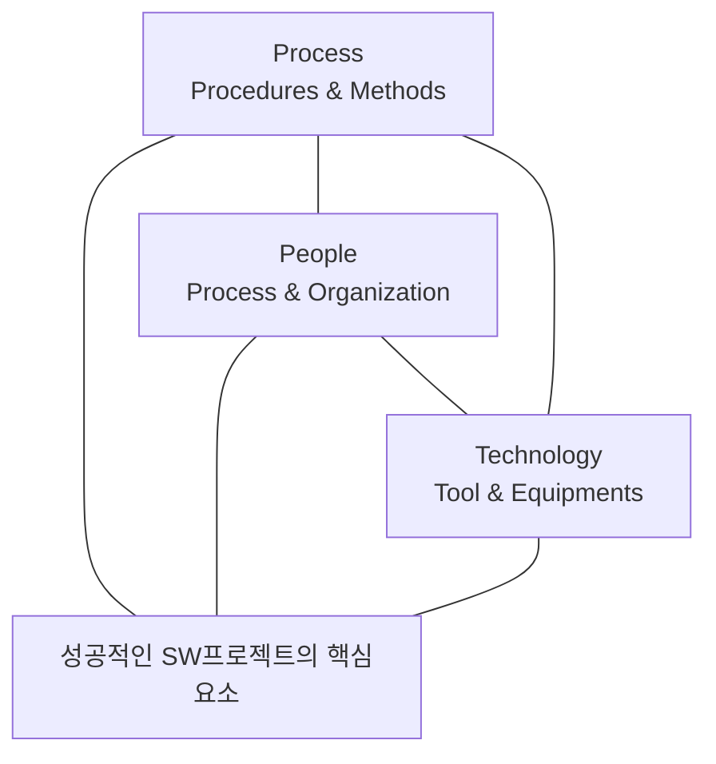

<!-- PDF page: 020 -->

### 01 소프트웨어 공학의 배경과 목적

#### 가) 소프트웨어 공학 소개

다기능화 및 대규모화 되는 소프트웨어를 성공적으로 개발하기 위해서는 요구사항 분석에서부터 유지보수에 이르기까지 전 과정에 걸쳐 예상되는 어려움을 해결하기 위한 체계적인 관리와 효율적 업무 수행을 지원해 주는 기술, 기법 등을 제공하는 소프트웨어 공학 기술의 적용이 무엇보다 필요하다. 효과적인 소프트웨어 공학 기술 적용을 위해서는 체계적인 업무 방식 및 흐름의 정의와 이를 적용할 수 있는 프로세스(Process), 전문적인 지식을 갖춘 조직 및 인력(People)의 구성, 정의된 업무 방식과 조직인력이 효율적으로 운영되기 위한 기반 인프라 기술(Technology)의 3가지 핵심 요소를 균형 있고, 조화롭게 갖추고 이를 유지하기 위한 지속적인 노력이 필요하다.

#### 나) 소프트웨어 공학 배경

소프트웨어 공학의 변천사를 보면 1950년대는 소프트웨어 개발 프로젝트를 위해 하드웨어 공학과 유사한 소프트웨어 공학 개념이 도입되기 시작하였지만 1960년대에 소프트웨어에 대한 수요가 급증하고 이를 구현하는 인력들의 경험과 능력, 수적인 부족이 원인이 되어 “소프트웨어의 위기(Crisis)”가 발생하면서 본격적으로 소프트웨어 공학이 도입되었다. 이어 1970년대는 소프트웨어에 대한 수요가 급증하면서 소프트웨어 개발 인력이 부족하게 되었으며, 이를 해결하기 위해 소프트웨어 전공자들이 아닌 비전공자들을 대거 투입하게 되고, 이러한 인력들은 소프트웨어 개발 시 소프트웨어가 쉽게 수정될 수 있다는 점으로 인해 선코딩-후수정하는 접근방식을 택하게 되었다. 하지만 선코딩-후수정에 대한 부작용으로 많은 결함들이 발견되면서 구조적 또는 정형적 기법들이 발생하였으며, 분석, 설계, 구현 등을 순차적으로 진행하는 폭포수 모델을 개발하여 사용하기 시작하였다. 하지만 정형적 기법은 일반 소프트웨어 개발자들이 사용하기에는 사용성이 떨어지며, 폭포수 모델은 비용이 많이 소요되고, 진척도가 떨어진다는 점을 인식한 1980년대에는 재사용성을 높여 효율적으로 소프트웨어를 개발하기 위해 소프트웨어 개발 생산성을 높이기 위한 방법들을 연구하였다. 1990년대에는 시장에서 경쟁우위를 선점하기 위해 제품의 시장출시 시간을 단축해야 했다. 이로 인해 소프트웨어 개발 생산성에 대한 연구가 활성화
