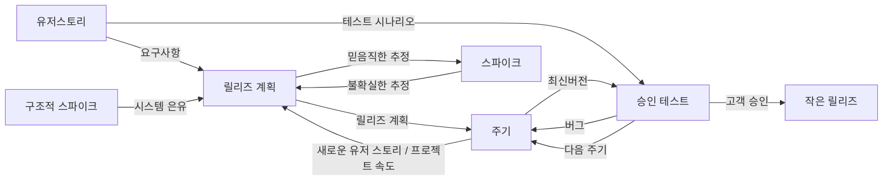

<!-- PDF page: 026 -->

### 04 애자일 개발 방법론

#### 가) 애자일 방법론 종류

애자일 선언문이 나온 이후로 다양한 애자일 방법론이 등장하게 된다. 이 중에서 특히 세계적으로 널리 채택된 애자일 방법론은 스크럼과 익스트림 프로그래밍(XP)이다. 초창기에는 XP를 주로 사용하였지만 스크럼이 점차 인기를 끌면서 최근에는 일반적으로 스크럼과 XP를 함께 사용한다. 최근에는 도요타 시스템의 린 생산방식을 소프트웨어 개발에 적용하자는 린 소프트웨어 개발 방법론이 급부상하고 있고 주로 스크럼과 함께 사용된다.

주요 애자일 방법론은 다음과 같다.

- 스크럼(Scrum), 켄 슈와버/제프 서덜랜드

- 익스트림 프로그래밍(eXtreme Programing, XP), 켄트 벡/에릭 감마

- 린(Lean) 소프트웨어 개발방법론, 메리 포펜딕/톰 포펜딕

- 애자일 UP(Agile Unified Process, AUP), 스콧 앰블러

#### 나) 애자일 개발 방법론-XP

##### ① XP 개요

XP(eXtreme Programming)는 1990년대 후반 켄트 벡(Kent Beck)을 중심으로 여러 엔지니어들이 프로젝트를 진행하며 얻었던 교훈을 기반으로 정립된 방법론이다. 보통 중소규모 개발 조직에 적합한 경량화된 개발방식이다. XP의 경우 테스트 주도 개발(TDD), 일일빌드(Daily Build), 지속적인 통합(Continuous Integration) 등 개발 테크닉과 연관된 부분이 많기 때문에 종종 '방법론'으로서 규정짓는 것에 대해 논란이 되기도 한다. 국내에서는 작은 규모의 개발 팀을 중심으로 기법 중 일부를 적용하는 사례가 일반적이다. 또한 XP만을 고집하기 보다는 스크럼과 같은 추가적인 애자일 개발 방법을 함께 적용하는 사례가 늘어나고 있다. XP를 적용함에 있어서 그 가치(Value)와 그 가치를 달성하기 위한 실천법(Practice)으로 구성되며, 이 두 가지의 균형을 유지하기 위한 원칙(Principle)이 필요하다. XP는 반복적 개발방법론의 일종이다. 프로젝트 수행 과정에 여러 번의 반복이 있으며 테스트 결과에 따라 반복적으로 업무를 수행한다.

##### ② XP 개발절차 및 용어

XP 개발절차는 다음 그림과 같이 수행된다.

