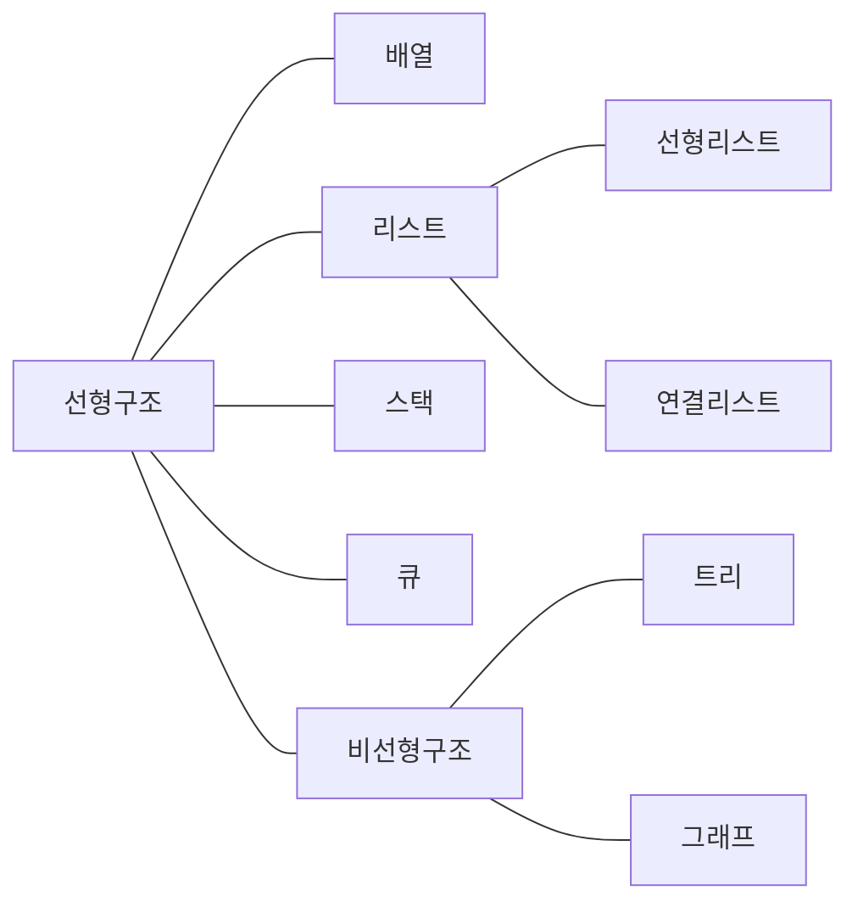

<!-- PDF page: 038 -->

### 01 자료구조(Data Structure)

#### 가) 정의

자료구조(Data Structure)란 자료를 컴퓨터의 기억장치 내에 저장하는 방법으로 다양한 자료를 효율적으로 표현하고 활용할 수 있도록 자료의 특성과 사용 용도를 고려하여 조직적, 체계적으로 정의한 것이다.

#### 나) 분류

자료구조는 크게 선형구조와 비선형구조로 나눌 수 있다. 선형구조는 자료가 일렬로 연결되어 있는 형태로 구성하는 방법이고 비선형구조는 자료의 구성이 계층구조나 망구조의 특별한 형태를 띠는 구조이다.

〈표 8〉 자료구조의 분류

<table>
<tbody>
<tr>
<td>분류</td>
<td>설명</td>
</tr>
<tr>
<td>선형구조(Linear)</td>
<td>원시코드로부터 정보를 추출하여 물리적 설계 정보저장소에 저장 물리적 설계자료들이 직선 형태로 나열되어 자료들 간의 순서를 고려한 구조로 전후/인접/선후 자료들 간의 1:1 관계로 나열됨 종류로는 배열, 선형리스트, 연결리스트, 스택, 큐, 데크 등이 있음 정보를 얻어내는 역할 수행</td>
</tr>
<tr>
<td>비선형구조(Nonlinear)</td>
<td>한 자료 뒤에 여러 개의 자료들이 존재하는 구조로 인접/전후 자료들 간의 1:다 또는 다:다 관계로 배치됨 종류로는 트리와 그래프 등이 있음</td>
</tr>
</tbody>
</table>

[그림 1] 자료구조의 분류

〈표 9〉 순차자료구조와 연결자료구조의 비교

<table>
<tbody>
<tr>
<td>구분</td>
<td>순차자료구조</td>
<td>연결자료구조</td>
</tr>
<tr>
<td>메모리 저장 방식</td>
<td>메모리저장 시작위치부터 빈자리 없이 자료를 순서대로 연속적으로 저장하는 방식</td>
<td>메모리에 저장된 물리적 위치나 순서에 상관없이 링크에 의해 논리적인 순서를 표현하는 방식</td>
</tr>
<tr>
<td>논리/물리 순서 일치 여부</td>
<td>논리적인 순서와 물리적인 순서가 일치하는 방식</td>
<td>논리적 순서와 물리적 순서가 일치하지 않음</td>
</tr>
</tbody>
</table>
