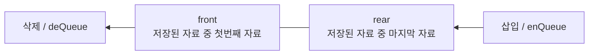
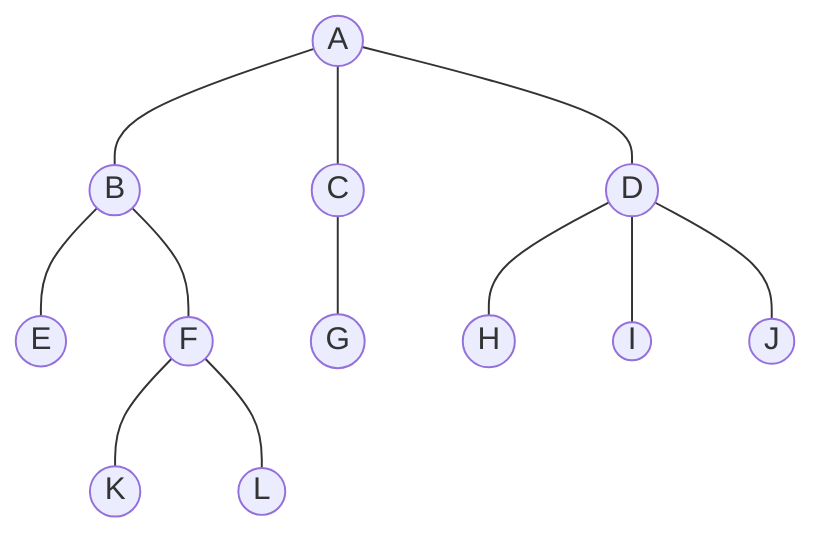

<!-- PDF page: 040 -->

[그림 3] 큐의 개념도

큐의 연산 종류는 다음과 같다.

- enQueue: 큐에 데이터를 삽입한다. rear를 움직여 큐의 공간을 확보한 후 데이터를 삽입한다.

- deQueue: 큐에서 데이터를 삭제한다. front를 움직여 가장 오래된 데이터를 다음 번째 데이터로 넘기게 된다.

##### ③ 스택과 큐의 연산 비교

〈표 10〉 스택과 큐에서의 삽입과 삭제 연산비교

<table>
<thead><tr><th>항목</th><th colspan="2">삽입연산</th><th colspan="2">삭제연산</th></tr>
<tr><th>자료구조</th><th>연산자</th><th>삽입위치</th><th>연산자</th><th>삭제위치</th></tr></thead>
<tbody><tr><td>스택</td><td>push</td><td>top</td><td>pop</td><td>top</td></tr>
<tr><td>큐</td><td>enQueue</td><td>rear</td><td>deQueue</td><td>front</td></tr></tbody>
</table>

#### 라) 트리와 그래프

##### ① 트리(Tree)

원소들 간에 계층관계를 가지는 계층형 자료 구조로 상위원소에서 하위 원소로 내려가면서 확장되는 나무 모양의 구조를 가지고 있으며 원소들 간에 1:다 관계를 가진다. 트리의 시작노드를 루트노드(root node)라고 하고 노드를 연결하는 선을 간선(edge)이라고 한다. 같은 부모 노드를 가진 자식 노드들을 형제노드(sibling node)라고 하고 부모노드와 연결된 간선을 끊었을 때 생성되는 트리를 서브트리(subtree)라고 한다.

| 구분 | 노드 |
| --- | --- |
| 루트레벨 0 | A |
| 레벨 1 | B, C, D |
| 레벨 2 | E, F, G, H, I, J |
| 레벨 3 | K, L |
| 단말노드 | E, G, H, I, J, K, L |

[그림 4] 트리 개념도
