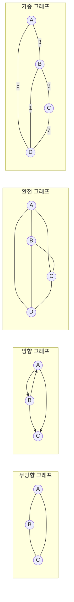
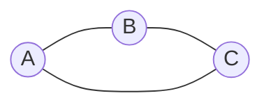
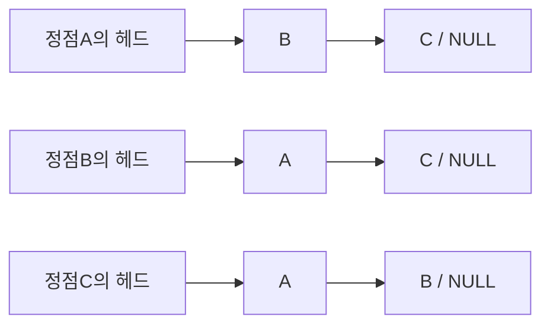

<!-- PDF page: 041 -->

##### ② 그래프(Graph)

연결되어 있는 원소 사이의 다:다 관계를 표현하는 자료구조로 객체를 나타내는 정점(vertex)과 객체를 연결하는 간선 (edge)의 집합이다. 그래프 자료구조는 전기회로분석, 최단거리 검색, 인공지능 등과 같이 여러가지 복잡한 문제들을 그래프로 나타내어 그래프이론을 기반으로 문제를 해결하는 경우가 많다.

〈표 11〉 그래프 종류

| 종류 | 설명 |
| --- | --- |
| 무방향 그래프 | 그래프의 정점 사이에 방향성이 없는 선으로 연결된 그래프 |
| 방향 그래프 | 연결선이 방향성을 지니는 그래프로 정점에 쌍으로 나타난 정점의 순서가 중요한 그래프 |
| 완전 그래프 | 그래프의 각 정점에서 다른 모든 정점을 연결하여 최대로 많은 간선 수를 가진 그래프 |
| 가중 그래프 | 그래프의 정점을 연결하는 간선에 가중치(weight)를 할당한 그래프 |

그래프는 수행하는 기능이나 응용 방법에 따라 다양한 구현방법으로 메모리 내 표현된다.

- 인접행렬(Adjacency Matrix): 순차 자료구조를 이용한 그래프 구현 방식으로 행렬에 대한 2차원 배열을 사용하여 그래프의 두 정점을 연결한 간선의 유무를 행렬로 저장하는 방식

- 인접리스트(Adjacency List): 연결 자료구조를 이용한 그래프 구현방식으로 각 정점에 대한 인접 정점들을 연결하여 만든 단순 연결 리스트로 각 정점의 차수만큼 노드를 연결하는 방식

[인접행렬]

|  | A | B | C |
| --- | --- | --- | --- |
| A | 0 | 1 | 1 |
| B | 1 | 0 | 1 |
| C | 1 | 1 | 0 |

[인접리스트]

[그림 5] 그래프의 구현방법

#### 마) 자료구조의 선택 기준

① 자료의 처리 시간

② 자료의 크기
