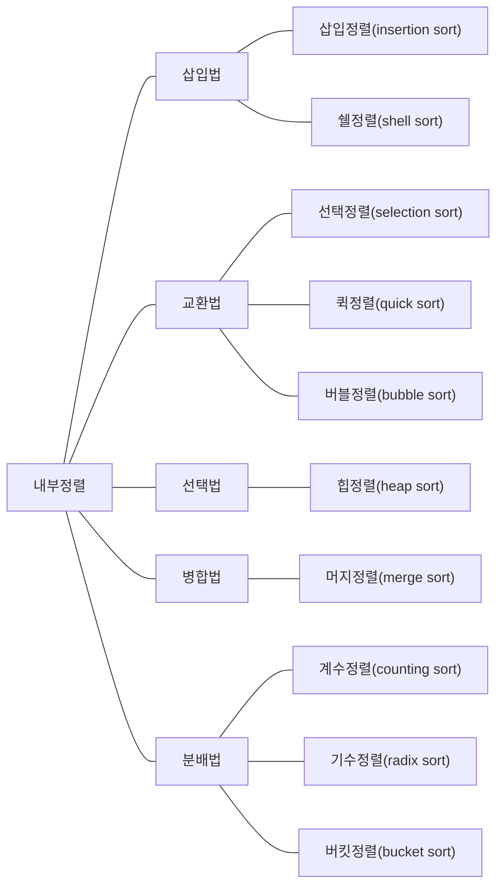

<!-- PDF page: 045 -->

##### ② 내부 정렬 알고리즘의 분류

```mermaid
flowchart LR
    R["내부정렬"] --- I["삽입법"]
    R --- X["교환법"]
    R --- S["선택법"]
    R --- M["병합법"]
    R --- D["분배법"]
    I --- IS["삽입정렬(insertion sort)"]
    I --- SH["쉘정렬(shell sort)"]
    X --- SE["선택정렬(selection sort)"]
    X --- Q["퀵정렬(quick sort)"]
    X --- B["버블정렬(bubble sort)"]
    S --- H["힙정렬(heap sort)"]
    M --- ME["머지정렬(merge sort)"]
    D --- C["계수정렬(counting sort)"]
    D --- RA["기수정렬(radix sort)"]
    D --- BU["버킷정렬(bucket sort)"]
```

[그림 6] 내부정렬의 분류
