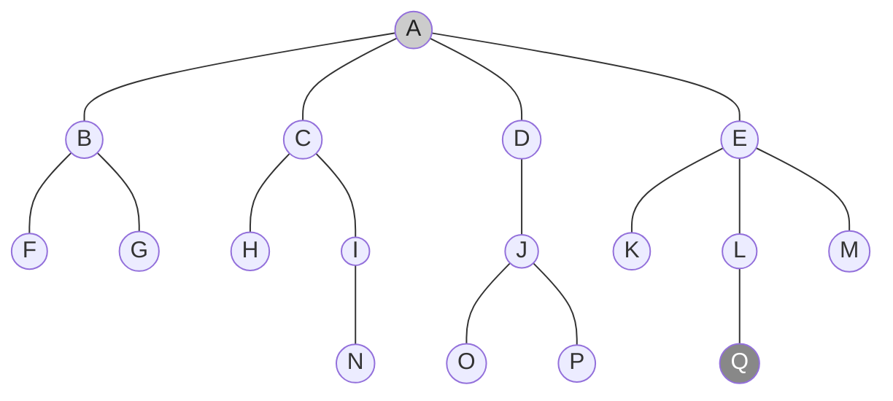

<!-- PDF page: 050 -->

<!-- 생략: 그림 9 / 겹치는 순회·복귀 화살표. 원본의 노드·트리 간선·색상 구분을 유지 -->

[그림 9] 깊이 우선 탐색 예시

##### ③ 너비 우선 탐색(BFS, Breadth First Search)

하나의 시작 정점을 방문한 후 인접한 노드를 먼저 탐색하는 방법으로 시작 정점으로부터 가까운 정점을 먼저 방문하고 멀리 떨어져 있는 정점을 나중에 방문하는 탐색 방법이다. 너비 우선 탐색의 경우 어떤 노드를 방문했었는지 여부를 반드시 검사해야 하고 방문한 노드들을 차례대로 꺼낼 수 있는 자료 구조인 큐를 사용한다.

<!-- 생략: 그림 10 / 겹치는 순회·복귀 화살표. 원본의 노드·트리 간선·색상 구분을 유지 -->

[그림 10] 너비 우선 탐색 예시

#### 아) 최소 신장 트리(Minimum Spanning Tree)

##### ① 최소 신장 트리(Minimum Spanning Tree) 소개

신장트리(Spanning Tree)는 무방향 가중치 그래프 내 모든 정점을 포함하고 서로 연결되어 있는 트리의 특수한 형태로 사이클을 포함해서는 안되는 트리이다. 신장 트리는 구성하는 가중치의 합이 최소인 신장 트리를 최소 신장 트리라고 한다. 최소 신장 트리를 구현하는 대표적인 알고리즘은 크루스칼(Kruskal) 알고리즘과 프림(Prime) 알고리즘이 있다.

##### ② 크루스칼(Kruskal) 알고리즘

정점에 연결된 간선 가운데 가중치가 최소인 간선를 선택하고 추가된 간선이 사이클을 만드는지 체크하는 방식으로 처리
