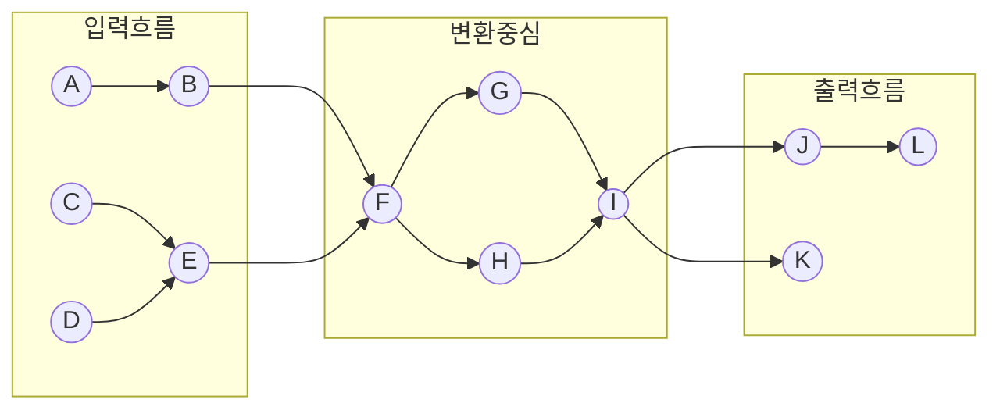
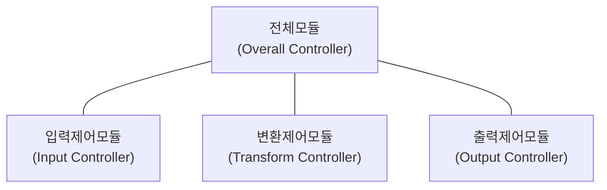

<!-- PDF page: 059 -->

변환시켜 출력한다. 이렇게 시스템을 크게 세 가지로 나누어 입력을 담당하는 프로세스들을 묶은 것을 입력흐름(Incoming Flow), 입력된 정보를 가공 처리하는 프로세스들을 묶어 변환중심(Transform Center), 가공 처리된 정보를 출력하는 프로세스들의 묶음을 출력흐름(Outgoing Flow)이라 한다.

[그림 13] 자료흐름도의 입력 출력 경계

이제 자료흐름 중심의 프로그램 구조를 만들기 시작한다. 변환에 기초한 프로그램 구조를 만들기 위해 필요로 하는 가이드라인은 자료흐름도의 입력흐름, 변환중심, 출력흐름을 규명하는 것에 기초하고 있다. 자료흐름도에서 구조도표로의 매핑은 가이드라인에 의해 이루어진다. 변환흐름 중심의 자료흐름도에서 최상위의 프로그램 구조를 만들면 3가지의 구성요소를 발견할 수 있다. 이들은 다음과 같다.

- 입력을 처리하는 입력 제어 모듈

- 변환을 처리하는 변환 제어 모듈

- 출력을 처리하는 출력 제어 모듈

입력 제어 모듈은 하위계층의 모듈들로부터 입력 데이터를 받아들여 상위계층의 모듈에 보내며, 필요하면 입력 데이터를 정제한 후 상위계층에 전달한다. 출력 제어 모듈은 상위계층으로부터 출력 데이터를 받아 하위계층의 모듈들에게 보낸다. 이 모듈도 필요하면 출력흐름을 정제한 후 하위계층의 모듈에게 전달한다.

시스템의 복잡도에 따라 제어 모듈의 수가 변할 수 있으며 변환중심의 복잡도에 따라 변환을 처리하는 제어 모듈의 수가 결정될 수 있다. 변환에 기초한 간단한 프로그램 구조는 다음과 같다.

[그림 14] 변환흐름에 기초한 상위 수준 프로그램 구조
