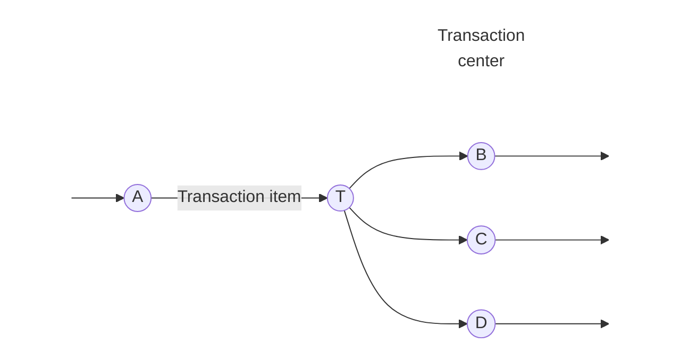
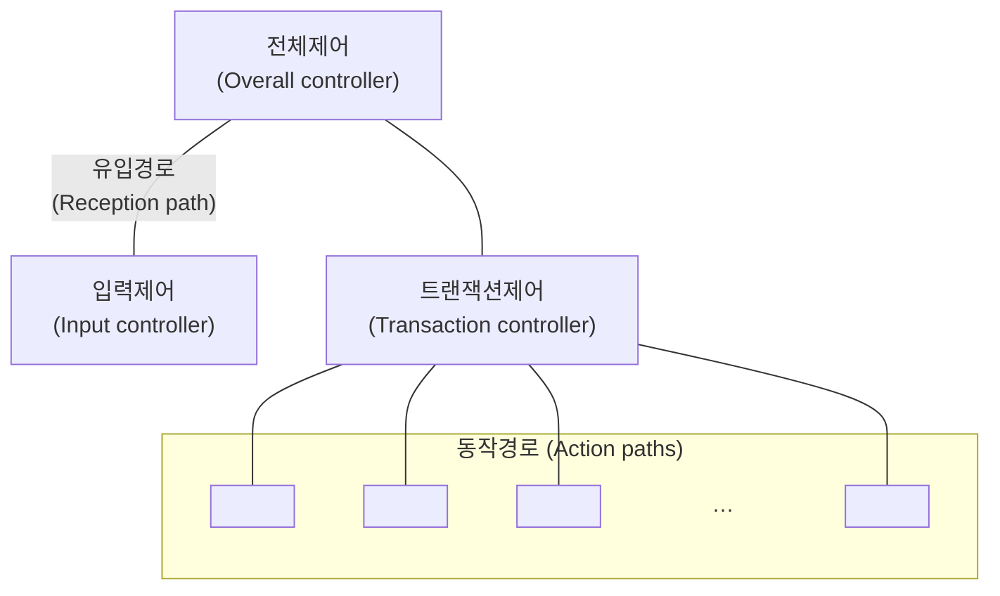

<!-- PDF page: 060 -->

#### 나) 트랜잭션흐름 중심 설계(Transaction Flow —Oriented Design)

트랜잭션이란 자료나 제어 시그널 등이 어떠한 행위를 유발시키는 것을 말한다. 트랜잭션흐름에 의한 설계는 들어온 입력을 여러 갈래의 출력흐름으로 쪼갤 수 있는 경우에 가능하다. 트랜잭션은 입력값을 평가하고 그 결과에 따라 여러 출력 경로 중 하나를 따라 흘러간다. 이 경우 정보흐름의 중심을 트랜잭션 중심(Transaction Center)이라고 한다. 다음 그림은 이러한 특성을 나타내고 있으며 버블 T는 트랜잭션 중심이다.

Mutally exclusive action paths

[그림 15] 트랜잭션 흐름

만약 자료흐름도가 트랜잭션흐름을 가지고 있는 경우 트랜잭션 중심이 어디 있는가를 규명하는 일이 선행되어야 한다. 트랜잭션 중심은 트랜잭션을 입력으로 받아들여 여러 출력 버블로 연결되어 있는 모습을 한 버블이다. 따라서 트랜잭션 중심은 하나의 입력 경로와 여러 출력 경로를 가지고 있다. 각 동작 경로(출력 경로)는 여러 버블로 구성될 수 있으며, 변환 흐름이나 트랜잭션흐름을 가질 수 있다.

이를 바탕으로 트랜잭션에 기초한 프로그램 구조를 만든다. 이 구조는 세 구성 요소로 이루어져 있다.

- 트랜잭션 중심으로 작용하는 모듈

- 입력을 받아들이는 모듈

- 각 동작 경로에 해당하는 하나 이상의 모듈

트랜잭션에 기초한 프로그램 구조는 다음 그림에 나타나있다.

[그림 16] 트랜잭션에 기초한 프로그램 구조
