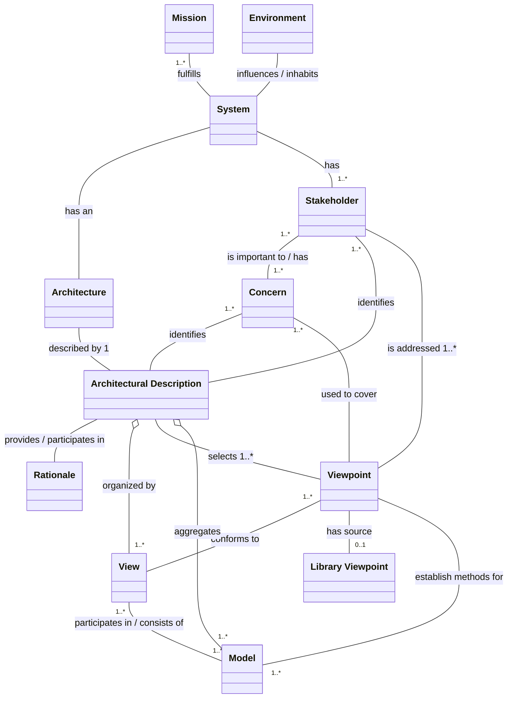

<!-- PDF page: 064 -->

### 01 소프트웨어 아키텍처 설계

#### 가) 소프트웨어 아키텍처 개요

소프트웨어 아키텍처는 소프트웨어 개발에 직간접적으로 영향을 미치고 복잡도를 높이는 다양한 요소들을 체계적으로 다루기 위한 개발 대상 소프트웨어의 청사진이라고 볼 수 있다. 소프트웨어 아키텍처 정의는 다양하게 표현이 가능하다. Booch는 소프트웨어 구조에 대한 중요한 의사결정의 집합으로 아키텍처를 정의하였고, Myron Ahn은 모듈, 프로세스, 데이터, 이들의 구조, 구성 요소들 간의 관계, 이러한 구성요소와 관계가 어떻게 확장 및 수정이 될 수 있는지, 사용하는 기술은 무엇으로 이루어져 있으며 소프트웨어 아키텍처를 통해 시스템의 유연성과 성능 및 시스템을 어떻게 구현하고 수정할 수 있는지를 판단할 수 있다[4]고 했다. 이러한 소프트웨어 아키텍처는 의사소통 수단 및 프로젝트 초기 의사결정 도구로 활용되며, 시스템 전체 구조 및 개발 프로젝트 조직 결정 시 참조되기도 한다.

[그림 17] 소프트웨어 아키텍처 구성요소(IEEE-1471)

#### 나) 소프트웨어 아키텍처 설계 절차

소프트웨어 아키텍처 설계는 요구사항분석, 아키텍처 분석 및 설계, 아키텍처 검증 및 승인 절차로 진행된다.

요구사항은 제안요청서, 인터뷰, 회의 등을 통해 구체적으로 파악되며 기능 및 비기능 요구사항을 분류하고 명세하게 된다. 아키텍처 분석은 품질요소를 식별하고 이의 우선순위를 결정해야 하며, 아키텍처 설계시점에 아키텍처 스타일과 후보 아키텍처를 도출하여 진행하게 된다. 이렇게 정리된 아키텍처는 평가 및 상세화를 거쳐 최종 승인되게 된다.

설계의 초기 단계에서는 사용자의 요구사항을 만족시킬 수 있도록 시스템의 구조를 설정해야 한다. 문제를 해결하기 위해서는 시스템을 분할하는 것이 바람직한데, 시스템을 분할하여 생각하면 복잡한 문제도 해결하기 쉽다. 기능을 분할하거나 사용자 인터페이스를 논리적으로 분할하면 보다 쉬운 해결 방법을 찾을 수 있다.

일반적으로 상위레벨에서 분할한 시스템 구성 요소를 서브시스템(Subsystem)이라 부른다. 서브시스템은 일반적으로 자료와 제어구조를 포함하며, 독립적으로 기능을 수행할 수 있고 컴파일 될 수 있는 프로그램 구성요소를 일컫는다. 또한 서브
