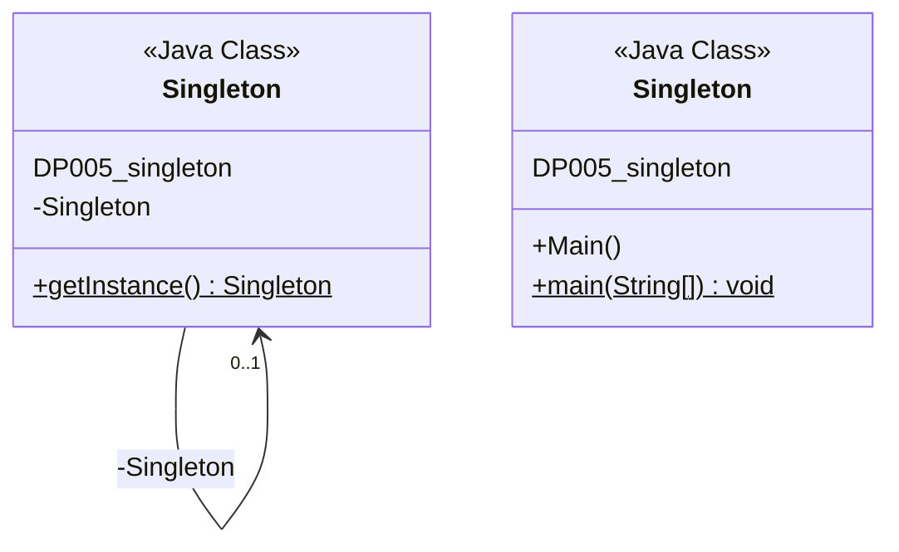

<!-- PDF page: 075 -->

##### ① 객체 생성패턴

- Abstract Factory 패턴

- 정의: 서로 밀접하게 관련된 객체들 또는 별로 연관되지 않는 객체들의 패밀리(Family)를 생성할 때 그들의 클래스가 무엇인지 구체적으로 알 필요 없이 해당하는 객체를 생성할 수 있는 인터페이스를 제공

- 장점: 클라이언트 코드가 어떤 종류의 객체인지 구체적으로 알 필요 없이 특정 객체를 생성하여 실제 사용할 때 적용 새로운 제품군을 생성하려고 할 경우 기존 소스코드와는 독립적으로 새로운 제품군을 추가하는 것이 가능

- 단점: 제품군에 새로운 제품 추가 시, 모든 Factory 클래스를 수정해야 하는 번거로움 발생

- 사용 예제: 각 시스템이나 운영체제 별로 다르게 구성해야 할 필요가 있는 컴파일러 등의 개발 시

- Builder 패턴

- 정의: 반환된 객체들이 단순히 기본 출력 객체의 상속 대상이 아닌 출력 객체의 서로 다른 조합으로 구성된 완전히 다른 사용자 인터페이스 일 때 사용

- 장점: 서로 다른 표현 방식을 가지는 객체를 동일한 방식으로 생성하는 것이 가능

- 단점: 새로운 객체의 생성은 용이하나, 객체의 각 구성부를 수정하는 것은 대단히 번거롭다.

- 사용 예제: 한글을 입력하면 각국 언어로 번역이 되어 결과가 출력되는 번역기 system 개발 시

- Factory Method 패턴

- 정의: 객체를 생성하되, 직접 객체 생성자를 호출해서 객체를 생성하는 것이 아니라 대행 상수를 통해 간접적으로 객체를 생성하는 방식

- 장점: 생성되는 객체에 무관하게 동일한 형태로 프로그래밍이 가능하다. 따라서 유연하고 확장성이 있다.

- 단점: 생성할 객체의 종류가 달라질 때마다 새로운 하위 클래스를 정의해야 한다는 점

- 사용 예제: OS에서 해당 프로그램의 더블클릭시, OS에 의해 해당 프로그램이 구동되는 과정

- Prototype 패턴

- 정의: 객체를 생성함에 있어, 기존 객체를 복제해서 객체를 생성하는 방식.

- 장점: 객체를 생성해주기 위해 별도의 클래스를 제작할 필요가 없다. 구동시간에 객체를 추가 및 삭제할 수 있다.

- 단점: 생성될 객체들의 자료형인 클래스들이 모두 Clone() 멤버 함수를 구현해야 한다.

- 사용 예제: MS Visio 같은 그래픽 편집기 등의 제작 시

- Singleton 패턴

- 정의: 클래스의 객체를 최대 N개 이하로 고정하고 싶을 시 사용

- 장점: 클래스의 객체 수 관리 용이

- 사용 예제: 단일 객체만이 필요한 device manager 등이 객체 관리 시

- Singleton 예제 클래스 다이어그램

