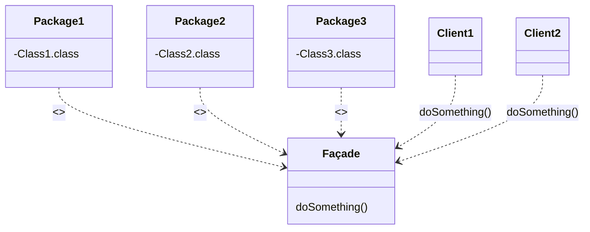

<!-- PDF page: 077 -->

- 장점: 기본 객체와 구성 객체를 특별히 구별하지 않고 소스코드를 작성할 수 있기 때문에 편리

- Decorator 패턴

- 정의: 특정 객체에게 동적으로 기능을 추가하거나 추가했던 기능을 삭제하기 위해 사용되는 클래스 구조

- 장점: 객체에 기능 추가 시 매우 간편하고 유연함

- Façade패턴

- 정의: 여러 개의 클래스들이 밀접한 관계를 가지고 있으며 전체적으로 하나의 역할을 수행할 때, 그 역할을 대표하기 위한 클래스를 정의하고 외부 client들이 일일이 각 클래스를 직접 다루지 않더라도 대표 클래스를 통하여 원하는 기능을 제공받을 수 있도록 만든 방식

- 장점: 복잡한 서브 시스템에 대해 간단한 interface 제공 가능, 객체들 간의 의존 관계를 계층화시켜 복잡하거나 회귀적인 의존관계 제거

- Façade 클래스 다이어그램



<!-- Façade의 doSomething()에 연결된 원문 코드 주석. 원문에 닫는 중괄호는 없다. -->
```java
doSomething() {
    Class1 c1 = new Class1();
    Class2 c2 = new Class2();
    Class3 c3 = new Class3();
    c1.doStuff(c2);
    c3.setX(c1.getX());
    return c3.getY();
```

- Java 소스 코드

아래 Java 코드 예제는 사용자(you)가 파사드(컴퓨터)를 통해 컴퓨터 내부의 부품(CPU, HDD) 등을 접근한다는 내용의 추상적인 예제
