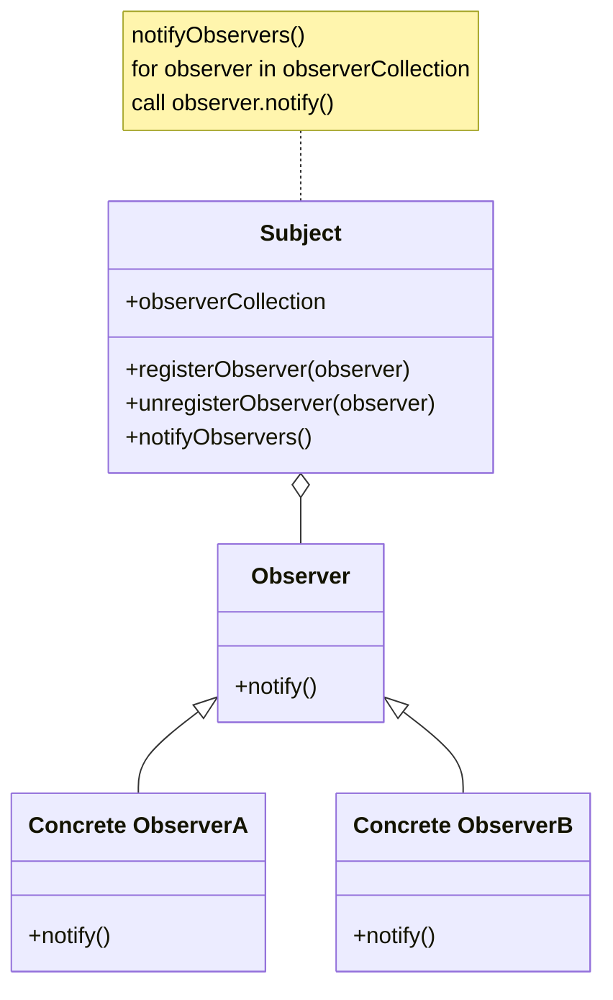

<!-- PDF page: 080 -->

- Observer 패턴 클래스 다이어그램



- Java 소스 코드 예제

<!-- 원문의 package/import 병합, Event Source 공백, setChanged; 및 catch 여는 괄호 누락을 그대로 옮겼다. -->
```java
/* 파일명: Event Source. java */

package obs import java.util. Observable; // 이 부분이 옵저버에게 신호를 보내는 주체입니다.
import java.io. BufferedReader;
import java.io.IOException;
import java.io.InputStreamReader;

public class Event Source extends Observable implements Runnable
{
    public void run()
    {
        try
        {
            final InputStreamReader isr = new InputStreamReader( System. in );
            final BufferedReader br = new BufferedReader ( isr );
            while ( true )
            {
                final String response = br.readLine();
                setChanged;
                notifyObservers( response );
            }
        }
        catch (IOException e)
            e.printStackTrace();
        }
    }
}
```
