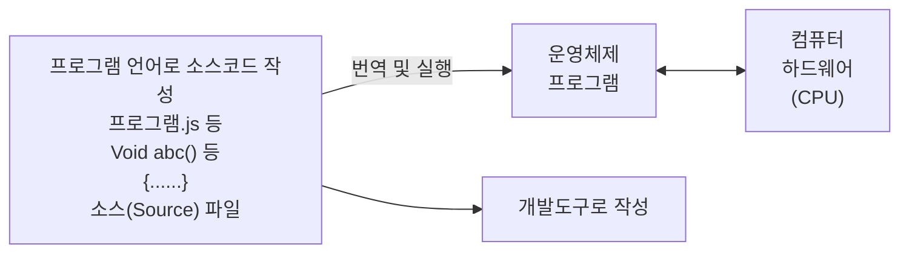
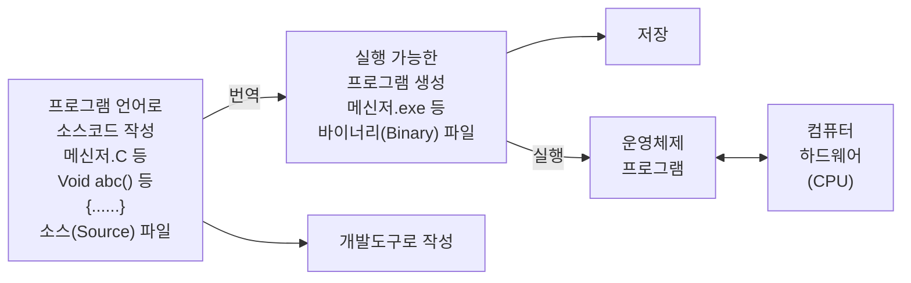

<!-- PDF page: 090 -->

인터프리터 과정

임시기억장치에 우선 로드함

[그림 19] 인터프리터 과정

##### ① 인터프리터 언어 장점

- 실행을 위해 완전한 기계어 번역을 기다리지 않고 필요 시 마다 실행

- 프로그램이 실행될 때까지 원시 언어 형태를 유지하므로 메모리 절약

##### ② 인터프리터 언어 단점

- 재실행 시 매번 원시 프로그램을 디코딩(Decoding)하여 소요 시간 많음

#### 다) 컴파일러 언어

컴파일은 어느 특정 언어를 동등한 의미를 갖는 다른 언어로 바꾸는 것을 의미한다. 컴파일러에 의해 고급 언어를 저급 언어인 기계어로 번역하여 객체 모듈(Object Module)을 만들고, 이 모듈을 링크, 로드하여 실행시키는 것이다. FORTRAN, PASCAL, C/C++등이 컴파일러 언어이다.

컴파일 과정

임시기억장치에 우선 로드함

[그림 20] 컴파일 과정

##### ① 컴파일러 언어 장점

- 번역된 목적 코드(Object Code) 저장 가능

- 컴파일 한 후 바로 재실행이 가능

- 재사용 프로그램인 경우, 한번 컴파일 한 후에는 빠르게 재실행에 따라 실행시간 단축
