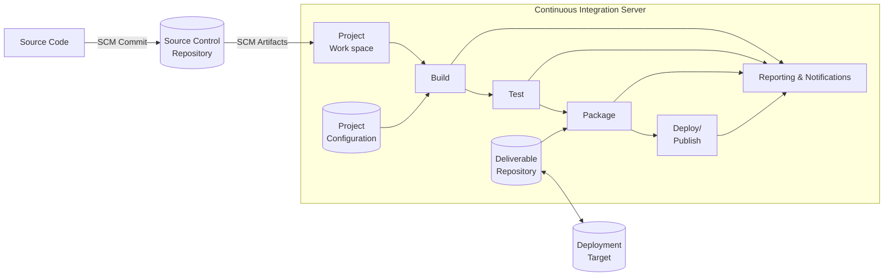

<!-- PDF page: 097 -->

##### ③ CI(Continuous Integration)의 구성

[그림 22] CI(Continuous Integration) 구성도

CI(Continuous Integration)를 수행하기 위해서는 일일빌드를 수행할 수 있는 CI서버가 요구되며 이는 최소한 하나 이상의 접근 가능한 소스코드 저장소, 빌드 스크립트 세트 및 빌드절차, 빌드된 아티팩트(Artifacts)용 테스트 스윗트가 필요하다.

#### 다) 소프트웨어 빌드(Software Build)

소프트웨어 빌드란 소스 코드 파일을 컴퓨터에서 실행할 수 있는 독립 소프트웨어 가공물로 변환하는 과정을 말하거나 그에 대한 결과물을 이르는 말이며, 소프트웨어 품질보증 활동 중 하나이고, 일일 빌드는 통합위험 감소, 저품질 방지, 초기 결함 분석, 진척상황 모니터링, 개발자 사기 증진을 촉진한다.

#### 라) 일일 빌드(Daily Build) 및 동작 테스트

- 소프트웨어 제품을 매일 전체적으로 다시 컴파일하고, 기본 동작을 검증하기 위해 필요한 일련의 테스트를 거치는 공정이다.

- 일일 빌드는 소프트웨어 통합 실패, 낮은 품질, 낮은 프로젝트 가시성과 같은 리스크를 줄이고 시간을 절약하여 프로젝트 효율성을 높이면서 고객 만족도를 높일 수가 있다.

- 일일 빌드와 동작 테스트는 모든 프로젝트에서 활용할 수 있고 큰 프로젝트, 작은 프로젝트, 운영체제, 기성품 소프트웨어, 비즈니스 시스템 모두가 이에 해당한다.

#### 마) 소프트웨어 배포

소프트웨어 배포는 사용할 소프트웨어 시스템을 만드는 모든 행위를 지칭하고, 배포 프로세스는 그들 사이에 가능한 전환과 함께 상호 활동으로 구성되어 있다. 이러한 활동은 제작자 입장 또는 소비자 입장, 모두에서 발생할 수 있다. 배포는 모든 소프트웨어 시스템에 고유하기 때문에, 각 활동 내의 정확한 절차를 정의하기 어렵다. 따라서, “배포”는 고객이나 사용자의 특정 요구 사항이나 특성에 따라 정의할 수 있는 일반적인 절차로 해석되어야 한다. 소프트웨어 배포 종료 및 활동에는 릴리스, 설치 및 활성화, 비활성화, 적응, 업데이트, 빌트인, 버전추적, 삭제, 은퇴 등이 있다.
