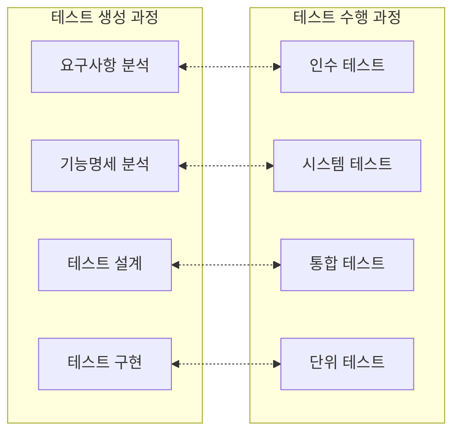

<!-- PDF page: 103 -->

〈표 30〉 테스트 케이스 설계 기법

<table>
<thead><tr><th>구분</th><th>기법</th><th>설명</th></tr></thead>
<tbody>
<tr><td rowspan="6">명세 기반 기법</td><td>동등 분할 (Equivalence Partitioning)</td><td>동등하게 분할된 영역에서 대표값으로 수행하도록 테스트 케이스를 설계하는 기법</td></tr>
<tr><td>경계값 분석 (Boundary Value Analysis)</td><td>동등 분할의 경계 부분에 해당되는 입력값에서 결함이 발견될 확률이 높기 때문에 경계값까지 포함하여 테스트 케이스를 설계하는 기법</td></tr>
<tr><td>페어와이즈 조합 테스팅 (Pairwise Testing)</td><td>테스트에 필요한 각 값들이 다른 값들과 최소한 한번씩은 조합을 이루게 테이블을 만들고, 그에 따라 테스트를 수행하도록 설계하는 기법</td></tr>
<tr><td>결정테이블 테스팅 (Decision Table Testing)</td><td>테스트 케이스가 결정 테이블에 표시된 입력값과 자극(원인)의 조합을 테스트하도록 설계하는 기법</td></tr>
<tr><td>상태전이 테스팅 (State Transition Testing)</td><td>상태 전이도(State Transition Diagram)를 기반으로 이벤트, 액션, 활동, 상태, 상태전이 사이의 관계를 설계하는 기법</td></tr>
<tr><td>유스케이스 테스팅 (Use Case Testing)</td><td>시스템이 유스케이스로 모델링 되어있을 때, 유스케이스에서 테스트 케이스를 도출하는 기법</td></tr>
<tr><td rowspan="3">구조 기반 기법</td><td>제어흐름 테스팅 (Control Flow Testing)</td><td>컴포넌트나 시스템을 통해 실행될 때 모든 가능한 이벤트 흐름(경로)구조를 테스트할 수 있게 설계하는 기법</td></tr>
<tr><td>커버리지 테스팅 (Coverage Testing)</td><td>시스템 또는 소프트웨어의 구조가 테스트 스위트(Test Suite)에 의해 테스트된 정도인 커버리지를 달성하기 위해 테스트 케이스를 설계하는 기법</td></tr>
<tr><td>최소비교 테스팅 (Elementary Comparison Testing)</td><td>변형 조건/결정(Modified Condition/Decision)개념을 사용하여 입력값의 조합을 테스트하도록 테스트 케이스를 도출하는 테스트 설계 기법</td></tr>
<tr><td rowspan="2">경험 기반 기법</td><td>탐색적 테스팅 (Exploratory Testing)</td><td>테스터가 테스트를 수행하면서 테스트 설계를 능동적으로 제어하고, 새롭고 보다 나은 테스트를 설계하기 위해 테스트를 수행하는 동안 얻은 정보를 활용하는 비공식적인 테스트를 설계하는 기법</td></tr>
<tr><td>분류 트리 기법 (Classification Tree Method)</td><td>분류 트리로 표현된 테스트 케이스를 입력 및 출력 도메인의 대표값을 조합하여 수행하도록 설계하는 기법</td></tr>
</tbody>
</table>

### 02 테스팅 유형 및 기법

#### 가) 테스팅 유형

여러가지 레벨에 따라 〈표 31〉과 같이 여러 유형이 존재하고 각 유형에서 테스트를 수행하는 주체, 테스팅 목적, 테스트 환경 등을 고려하는 것이 원칙이다.

[그림 23] 테스트 레벨의 유형
