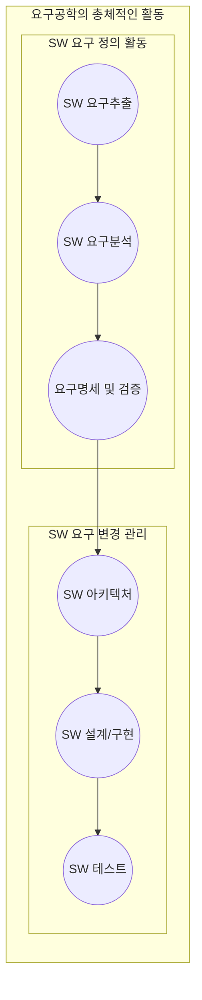

<!-- PDF page: 110 -->

### 01 요구사항 관리

#### 가) 요구사항 관리의 정의

요구사항 공학(Requirements Engineering)은 크게 요구사항 개발과 요구사항 관리로 나눌 수 있다. 무엇을 할 것인가를 정의하는 요구사항 개발과 하기로 정의된 요구사항이 제대로 반영되어 진행되는지를 확인하며, 최초 요구사항 변경에 대한 지속적인 관리를 수행하는 것이 요구사항 관리이다.

#### 나) 요구사항 관리의 중요성

적절한 요구사항 관리는 다양한 이해 관계자 간에 효과적인 의사소통의 수단을 제공하고, 프로젝트 초반부터 체계적인 요구관리로 납기지연 및 예산초과를 방지할 수 있으며, 사용자 요구 명세 수행 및 관리를 가능하게 한다.

#### 다) 요구사항 관리의 목적

요구사항 관리는 고객의 관점에서 고객의 요구를 정확히 파악하여 만족시키며, 제한된 일정과 기간 내에 품질 높은 소프트웨어를 생산하는 것을 목적으로 한다.

#### 라) 요구사항 관리 공정

아래의 그림은 전체 소프트웨어 개발 생명주기 상에서 해당하는 요구사항 관리 활동을 설명하고 있다.

[그림 24] 요구사항 관리활동

아래의 표는 요구사항 관리 공정의 세부 활동과 해당 산출물에 대해 설명하고 있다.

〈표 35〉 요구사항 관리활동 상세

<table>
<tbody>
<tr>
<td>공정</td>
<td>설명</td>
<td>산출물</td>
</tr>
<tr>
<td>요구사항 추출</td>
<td>• 비즈니스 요구사항 정의 • 참여자 식별 • 초기 요구사항 추출</td>
<td>Candidate Requirement</td>
</tr>
<tr>
<td>요구사항 분석</td>
<td>• 후보 요구사항 모델링 • 요구사항 우선순위 선정 • 요구사항 협의</td>
<td>Agreed Requirement</td>
</tr>
</tbody>
</table>
