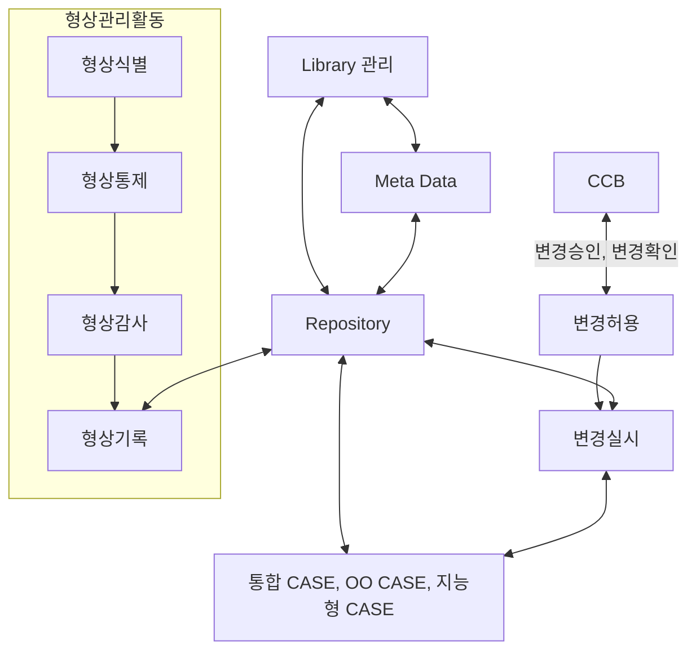

<!-- PDF page: 118 -->

아래의 표는 형상관리가 안될 경우에 발생하는 일반적인 문제점을 설명하고 있다.

〈표 39〉 형상관리 필요 배경

<table>
<tbody>
<tr><th>문제원인</th><th>내용</th></tr>
<tr>
<td>가시성 미흡</td>
<td>소프트웨어는 무형의 산출물이므로 가시성이 없음</td>
</tr>
<tr>
<td>컨트롤 어려움</td>
<td>눈에 보이지 않는 소프트웨어 개발에 대한 컨트롤이 현실적으로 어려움</td>
</tr>
<tr>
<td>추적성 미흡</td>
<td>소프트웨어 개발 전체 과정에 대한 추적의 어려움</td>
</tr>
<tr>
<td>감시의 미비</td>
<td>가시성 미흡 및 추적의 어려움으로 프로젝트 관리를 지속적으로 하기 어려움</td>
</tr>
<tr>
<td>끊임없는 변경</td>
<td>끊임없는 사용자의 요구사항</td>
</tr>
</tbody>
</table>

### 02 형상관리 개념도 및 구성 요소

#### 가) 형상관리의 개념도

아래의 그림은 형상관리의 전체 활동과 상호 관계를 개념적으로 설명하고 있다.

[그림 26] 형상관리 개념도

#### 나) 형상관리의 구성요소

아래 표는 형상관리를 구성하고 있는 주요 항목들을 설명하고 있다.

〈표 40〉 형상관리 구성요소

<table>
<tbody>
<tr><th>구성요소</th><th>내용</th></tr>
<tr>
<td>기준선(Baseline)</td>
<td>각 형상 항목들의 기술적 통제시점, 모든 변화를 통제하는 시점의 기준</td>
</tr>
<tr>
<td>형상항목(Configuration Item)</td>
<td>소프트웨어 생명주기 중 공식적으로 정의되어 기술되는 기본 대상</td>
</tr>
</tbody>
</table>
