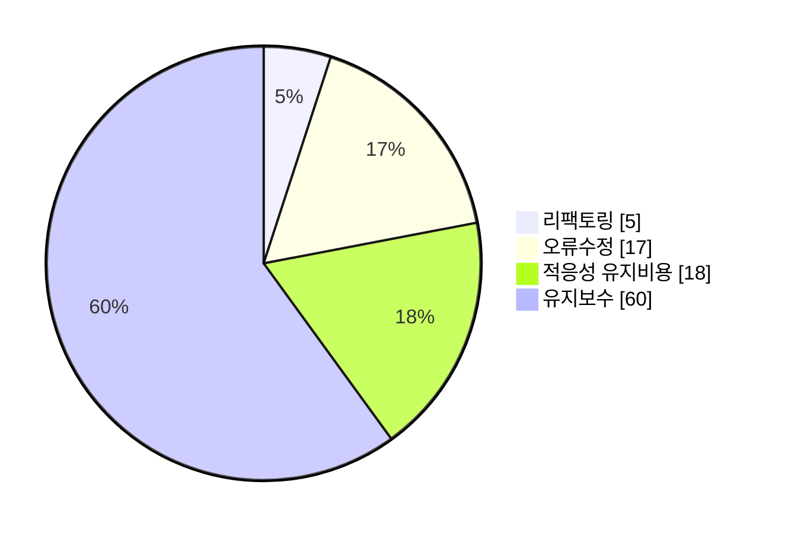

<!-- PDF page: 123 -->

### 실무 미리보기

**소프트웨어 유지보수가 필요하나요?**

전체 소프트웨어 공정 비용 중 60%가 유지보수 비용이고 그중 60%가 기능 강화에 드는 비용이다. 나머지는 17% 오류 수정 , 18%는 다른 플랫폼 지원들을 위해 드는 적응성 유지비용, 그리고 마지막 5%는 리팩토링 비용이라고 한다.

소프트웨어 유지보수는 개발이 완료되어 사용 중에 있는 소프트웨어를 환경적응, 오류수정, 성능향상 등을 위하여 계속하여 수정, 보완하는 것이다. 유지보수를 적게 하기 위해서는 개발 당시의 시스템이 중요하며 환경변화에 유연하게 적응하도록 개발되어야 한다.

소프트웨어를 개발한 후 사용자가 사용하기 시작하면서부터 최종적으로 폐기할 때까지 여러가지 이유로 계속하여 수정하고 보완하는 일이 발생한다. 소프트웨어는 사람들의 의식이나 행동방법과 직결되는 시스템이기 때문에 이를 잘 유지보수하지 않으면 그 생명력을 잃게 되는 즉, 사용할 수 없게 되는 특성이 있다.

따라서 유지보수는 초기의 개발보다 더 중요한 일이며, 소요되는 노력과 비용도 더 많이 든다.

[출처: 두산백과]
