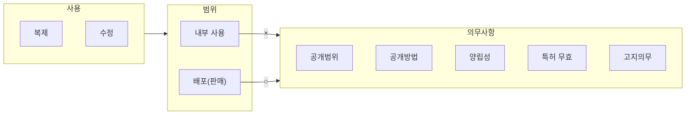

<!-- PDF page: 130 -->

[그림 27] 오픈소스 소프트웨어 라이선스 의무사항

#### 나) 오픈소스 소프트웨어 라이선스 비교

오픈소스 소프트웨어 라이선스는 무료 이용가능, 배포 허용가능, 소스코드 취득 가능, 소스코드 수정가능의 공통적인 특징이 있으며 2차 저작물 재공개 의무와 독점적 소프트웨어와 결합가능여부에는 각각의 라이선스별 차이가 있다.

가장 엄격한 라이선스는 GPL이며 독점적 소프트웨어와의 결합이 불가능한 조건을 명시하고 있다. GPL에서는 독점 소프트웨어 코드와 GPL 코드를 결합한 프로그램을 배포할 경우 해당 독점 소프트웨어 코드도 공개해야 하므로 결합이 불가능하다.

##### ① GPL(GNU General Public License) 2.0

GPL 2.0은 현재 가장 많은 오픈소스 소프트웨어가 채택하고 있는 라이선스이다. 자유소프트웨어재단(Free Software Foundation, FSF)에서 만들고 배포되었으며, 다른 오픈소스 소프트웨어 라이선스에 비해 매우 엄격한 편으로 주요 준수사항은 아래와 같다.

- 소프트웨어 배포 시 저작권 표시와 GPL에 의한 배포와 해당 GPL소프트웨어에 대해서는 보증 책임이 없다는 사실을 명시해야 한다.

- 소프트웨어를 수정하거나 새로운 소프트웨어를 링크(Static과 Dynamic linking 모두)시키는 경우 GPL에 의해 소스코드를 공개해야 한다.

- 자신의 특허를 구현한 프로그램을 GPL로 배포하는 경우에는 그 프로그램을 GPL조건에 따라 이용하는 이용자에게 특허 에 대한 사용료를 받을 수 없다.

##### ② GPL(GNU General Public License) 3.0

기본적인 내용은 GPL 2.0과 비슷하지만 GPL 3.0에서는 DRM(Digital Rights Management, 저작권을 보호하기 위한 기술 및 서비스) 관련 내용, 소프트웨어 특허문제, 양립성 문제 등이 추가되었다. 주요 준수사항은 아래와 같다.

- GPL 3.0의 소스코드를 사용자 제품에 포함시키거나 혹은 그와 함께 배포하는 경우에는 해당 소스에 설치정보를 함께 제공해야 한다.

- DRM과 관련하여 각국의 법률에 의해 보호되는 이익을 포기해야 한다. - 특허와 관련하여 원래의 소스코드를 개선하여 배포한 기여자의 경우 자신이 기여한 부분에 대해서는 비차별적이고 특허 사용료가 없다는 내용의 라이선스를 제공해야 한다.
