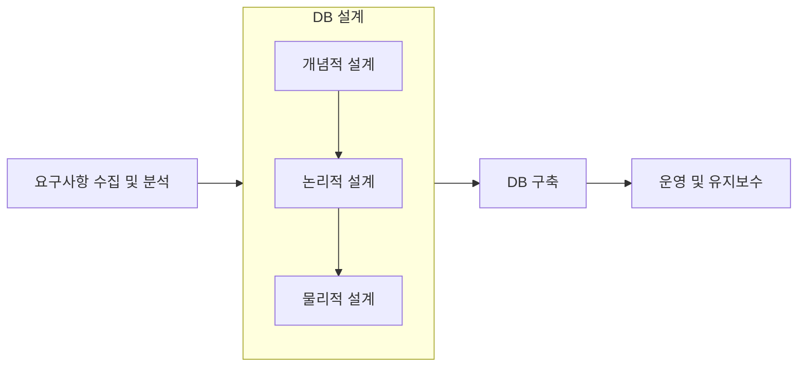
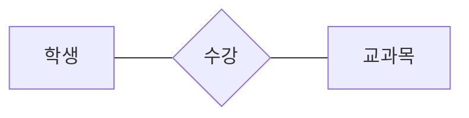
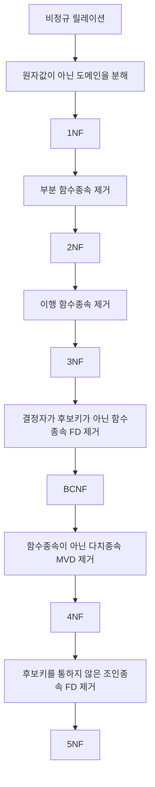
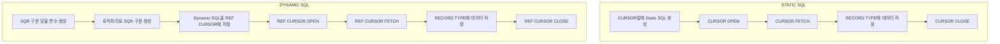
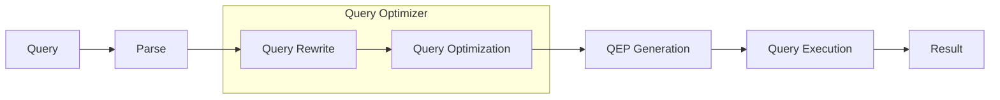

<!-- PDF page: 001 -->

# 데이터 이해와 활용

TOPCIT

ESSENCE Ver. 3

**기술영역**

02 데이터 이해와 활용

<!-- PDF page: 002 -->

<!-- 인쇄 머리말과 꼬리말만 있는 빈 페이지 -->

<!-- PDF page: 003 -->

TOPCIT

ESSENCE Ver. 3

**기술영역**

02 데이터 이해와 활용

<!-- PDF page: 004 -->

TOPCIT 에센스는 TOPCIT을 준비하는 응시생들에게 학습자료를 제공하기 위해 발행되었습니다.
더 나아가 실무중심의 ICT관련 지식을 습득하고자 하는 학습자들이 자기주도적 학습을 위한 자원으로 활용할 수 있기를 바랍니다.

이 책의 내용에 대한 추가 지원과 문의는 TOPCIT 홈페이지 또는 홈페이지에 안내된 이메일을 이용해 주시기 바랍니다.

TOPCIT 에센스의 내용 중 일부는 집필진의 주관적인 의견이 반영되어 있으며, 해당 의견은 TOPCIT 사업단의 공식적인 입장이 아님을 밝혀둡니다.

| 구분 | 기관 |
| --- | --- |
| 주관부처 | 과학기술정보통신부 |
| 주관기관 | 정보통신기획평가원 |
| 참여기관 | 한국생산성본부 |
| 펴낸 곳 | TOPCIT 사업단 |

<!-- 연락처 제외 -->

| 판 | 발행일 |
| --- | --- |
| 1판 발행일 | 2014. 12. 10. |
| 2판 발행일 | 2016. 02. 26. |
| 3판 발행일 | 2020. 02. 26. |

TOPCIT 에센스의 저작권은 과학기술정보통신부에 있으며 모든 내용의 무단전재와 복제를 금합니다.

<!-- PDF page: 005 -->

TOPCIT

ESSENCE Ver. 3

**기술영역**

02 데이터 이해와 활용

<!-- PDF page: 006 -->

TOPCIT

ESSENCE Ver. 3

<!-- PDF page: 007 -->

**기술영역**

02 데이터 이해와 활용

<!-- PDF page: 008 -->

**CONTENTS**

| 목차 | 교재 쪽수 |
| --- | ---: |
| I. 데이터와 데이터베이스의 이해 | 18 |
| 01 데이터의 이해 | 20 |
| 가) 데이터, 정보, 지식에 대한 개념과 특징 | 20 |
| 나) 데이터 처리 유형의 개념과 특징 | 20 |
| 02 데이터베이스의 이해 | 21 |
| 가) 파일처리시스템의 개념과 특징 | [판독 불가] |
| 나) 데이터베이스의 개념과 특징 | 22 |
| 03 데이터베이스 시스템의 이해 | 22 |
| 가) 데이터베이스 시스템(DBS, Database System)의 개념과 구성요소 | 22 |
| 나) 데이터독립성과 ANSI-SPARC의 3-Level Database Architecture | 23 |
| 다) 데이터베이스 관리자(DBA)와 데이터아키텍트(DA)의 정의와 핵심역할 | 25 |
| 라) DBMS(Database Management System)의 개념과 기능 | 26 |
| II. 데이터베이스 종류 이해 | [판독 불가] |
| 01 데이터베이스의 종류 | 30 |
| 가) 데이터베이스의 발전과정 | 30 |
| 나) 주요 데이터베이스 유형 | 30 |
| 02 객체관계 데이터베이스 | [판독 불가] |
| 가) 객체관계 데이터베이스(ORDB) | 32 |
| 03 XML의 이해 | [판독 불가] |
| 가) XML(Extensible Markup Language)의 개념과 특징 | 32 |
| 나) XML의 구성도 및 구성요소 | 33 |

<!-- PDF page: 009 -->

**CONTENTS**

| 목차 | 교재 쪽수 |
| --- | ---: |
| 다) XML 구성 | 33 |
| 라) XML Processor의 구조 및 주요 구성요소 | 34 |
| 매 XML문서 작성 절차 | 34 |
| 바) DTD 개념 및 작성 절차 | 35 |
| 사) XML Schema 개념 및 특징, DTD와 비교 | 35 |
| 0h) ><Quay의 특징 | 36 |
| 자) ><LL 개념 및 특징 | 36 |
| 04 다양한 데이터베이스 종류의 이해 | 36 |
| 가) 멀티미디어 데이터베이스 | 36 |
| 나) 메인 메모리 데이터베이스(MMDB) | [판독 불가] |
| 다) 임베디드 데이터베이스(Embedded DB) | 37 |
| 라) 모바일 데이터베이스(Mobile DB) | [판독 불가] |
| 매 공간 데이터베이스 | 38 |
| 배 칼럼형 데이터베이스(CoIumn-oriented Database) | 38 |
| III. 데이터베이스 설계 및 구축절차 | 41 |
| 01 데이터베이스 설계 및 구축 과정 | 42 |
| 가) 요구사항 수집 및 분석 | 43 |
| 나) DB 설계 | 43 |
| 다) DB 구축 | 44 |
| 라) 운영 및 유지보수 | 44 |
| 02 데이터베이스 설계 고려사항 | 45 |
| 가) 분석 대상 산출물 | 45 |
| 나) 설계 주체 고려사항 | 45 |

<!-- PDF page: 010 -->

**CONTENTS**

| 목차 | 교재 쪽수 |
| --- | ---: |
| 03 프로젝트 라이프사이클에서 데이터베이스 설계 영향도 | 46 |
| Ⅳ. 데이터 모델링 | 48 |
| 01 데이터 모델링의 개념 및 절차 | 50 |
| 가) 요구사항 수집 및 분석 | 50 |
| 나) DB 설계 | 50 |
| 다) 개념적/논리적 모델링에 대한 학계와 산업계의 이해 차이 | 50 |
| 라) 프로세스 모델링의 개념 | 51 |
| 매 상관 모델링의 개념 | 51 |
| 02 데이터 모델링의 절차 | 51 |
| 가) 개념적 모델링 | 51 |
| 나) 논리적 모델링 | 52 |
| 다) 물리적 모델링 | [판독 불가] |
| 03 다양한 ER 표기법 | [판독 불가] |
| 04 Chen 모형기반의 ER 표기법 | 53 |
| 가) 엔터티(Entity) | 53 |
| 나) 관계(ReIatonship) | 54 |
| 다) 속성(Aftribute) | 54 |
| 05 확장 ER(EER: Extended Entity—Relationship) 모델 | 55 |
| 7 h) 일반화/특수화(Generalization/Specialization) | [판독 불가] |
| 나) 집단화(Aggregation) | 56 |
| 06 또 다른 ERD 표기법: Crow's Foot Model | 56 |

<!-- PDF page: 011 -->

**CONTENTS**

| 목차 | 교재 쪽수 |
| --- | ---: |
| 가) 엔터티, 속성, 식별자 | 56 |
| 나) 엔터티의 특징 | 56 |
| 다) 엔터티의 분류 | 57 |
| 라) 속성의 분류 | [판독 불가] |
| 매 관계 | [판독 불가] |
| 배 관계 읽는 방법 | 58 |
| 사) 식별자의 특징 | 58 |
| 아) 식별자의 분류 | [판독 불가] |
| 자) 식별자관계와 비식별자관계 | 60 |
| 차) 슈피타입과 서브타입 | 60 |
| 07 연결함정(Connection Trap) | 61 |
| 가) 부채꼴 함정 | 61 |
| 나) 균열 함정 | 62 |
| 08 객체-관계 매핑(ORM: Object—Relational Mapping) | [판독 불가] |
| 가) 클래스의 변환 | 62 |
| 나) 클래스 관계의 관계형 관계(ReIationaI Relationship)로의 변환 | 63 |
| 09 무결성과 키 | 63 |
| 가) 무결성(lntegrity) | 63 |
| 나) 31(Key) | 64 |
| V. 정규화와 반정규화 | 66 |
| 01 정규화와 이상현상 | 68 |
| 가) 삽입 이상 | 68 |
| 나) 삭제 이상 | 68 |

<!-- PDF page: 012 -->

**CONTENTS**

| 목차 | 교재 쪽수 |
| --- | ---: |
| 다) 수정 이상(갱신 이상) | 68 |
| 02 함수 종속성의 개념과 추론 규칙 | 68 |
| 가) 함수 종속성 | [판독 불가] |
| 나) 암스트롱의 추론 규칙 | [판독 불가] |
| 03 정규화를 적용한 데이터베이스 설계(1차, 2차, 3차, 보이스코드) | [판독 불가] |
| 가) 정규화 수행 과정 | [판독 불가] |
| 나) 정규화 수행의 예 | [판독 불가] |
| 04 정규화를 적용한 데이터베이스 설계-(4차 정규화) | 72 |
| 가) 4차 정규화의 개념 | 72 |
| 나) 4차 정규화의 특징 | 72 |
| 다) 4차 정규화의 대상 | 72 |
| 라) 4차 정규화의 수행 | 73 |
| 05 정규화를 적용한 데이터베이스 설계-(5차 정규화) | [판독 불가] |
| 가) 5차 정규화의 개념 | 74 |
| 나) 5차 정규화의 특징 | 74 |
| 다) 5차 정규화의 수행 | 74 |
| 라) 5차 정규화의 수행 | 75 |
| 06 반(역)정규화 | 76 |
| 가) 반(역)정규화의 개념 및 절차 | 76 |
| 나) 반(역)정규화의 실제 | [판독 불가] |
| 07 성능 설계를 위한 고려 사항 | 80 |

<!-- PDF page: 013 -->

**CONTENTS**

| 목차 | 교재 쪽수 |
| --- | ---: |
| Ⅵ. 데이터베이스 물리설계 | [판독 불가] |
| 01 관계형 테이블 전환 및 테이블 설계 | 84 |
| 가) 물리적 모델링에 대한 학계와 산업계의 이해 차이 | 84 |
| 나) 관계형 테이블 전환 | 84 |
| 다) 테이블 설계 | 85 |
| 02 데이터타입 설계 | 86 |
| 가) 문자형 데이터 타입 | 86 |
| 나) 숫자형 데이터 타입 | 86 |
| 다) 이진형 데이터 타입 | 86 |
| 라) 날짜형 데이터 타입 | 86 |
| 03 인덱스 설계 | 86 |
| 가) 인덱스의 기능 | 86 |
| 나) 인덱스 설계 절차 | [판독 불가] |
| 다) 인덱스 구조의 유형 | [판독 불가] |
| 04 뷰 설계 | [판독 불가] |
| 가) 데이터베이스 뷰의 특징 | [판독 불가] |
| 나) 뷰의 생성 | [판독 불가] |
| 다) 뷰를 통한 데이터 수정 | 88 |
| 라) 기타 고려사항 | 88 |
| 05 분산 데이터베이스 | 88 |
| 가) 분산 데이터베이스의 특징 | 88 |
| 나) 데이터 투명성 | 89 |

<!-- PDF page: 014 -->

**CONTENTS**

| 목차 | 교재 쪽수 |
| --- | ---: |
| VII. 데이터베이스 품질과 표준화 | 91 |
| 01 데이터 품질관리 프레임워크 | 93 |
| 가) 데이터 값 | [판독 불가] |
| 나) 데이터 구조 | 93 |
| 다) 데이터 관리 프로세스 | 94 |
| 라) 데이터 품질관리 성숙모형 | 94 |
| 02 데이터 표준화 | 95 |
| 가) 데이터 표준화 개요 | [판독 불가] |
| 나) 데이터 표준화 필요성 | [판독 불가] |
| 다) 데이터 표준화 구성요소 | [판독 불가] |
| 라) 데이터 표준 정의 | [판독 불가] |
| 매 데이터 표준 확정 | 96 |
| 관계연산(관계대수) | [판독 불가] |
| 01 관계대수의 개념 이해 | 98 |
| 02 일반집합연산 및 순수관계연산 | 98 |
| 가) 일반집합연산 | 98 |
| 나) 순수관계연산 | 98 |
| 03 확장 관계대수 연산 | 99 |
| Ⅸ. 관계 데이터베이스 언어(SQL) | 100 |
| 01 관계 데이터베이스 언어의 종류 | 102 |

<!-- PDF page: 015 -->

**CONTENTS**

| 목차 | 교재 쪽수 |
| --- | ---: |
| 가) DDL, DCL DML | 102 |
| 나) SQL의 변천 및 SQL3의 특징 | 102 |
| 02 데이터 정의어(DDL: Data Definition Language) | 103 |
| 가) 데이터 정의어의 종류 | 103 |
| 03 데이터 제어어(DCL: Data Control Language) | 103 |
| 가) 데이터 제어어의 역할 | 104 |
| 나) 데이터 제어어의 종류 | 104 |
| 04 데이터 조작어(DML: Data Manipulation Language) | 104 |
| 가) DML 기본 연산 | 105 |
| 나) DML 그룹 연산 | 105 |
| 다) DML 고급 조인 연산 | 106 |
| )(. 데이터베이스 질의 응용 | 108 |
| 01 저장 프로시저(Stored Procedure) | 110 |
| 가) 저장 프로시저의 정의 | 110 |
| 나) 저장 프로시저의 장단점 | 110 |
| 02 임베디드(Embedded) SQL | 110 |
| 가) 임베디드 SQL의 정의 | [판독 불가] |
| 나) 임베디드 SQL의 특징 | 110 |
| 다) 임베디드 SQL Cu「㈜「 | 111 |
| 03 동적(Dynamic) SQL | 111 |
| 가) 동적 SQL과 정적 SQL의 비교 | 112 |

<!-- PDF page: 016 -->

**CONTENTS**

| 목차 | 교재 쪽수 |
| --- | ---: |
| 나) 동적 SQL과 정적 SQL의 처리 방식 | [판독 불가] |
| 다) 동적 SQL과 정적 SQL의 코드 예 | 113 |
| 04 질의 최적화(Query Optimization) 및 옵티마이저(Optimizer) | 113 |
| 가) 질의 최적화 과정 | 113 |
| 나) 옵티마0 IXH(Optimizer) | 114 |
| 다) 질의 처리 단계별 옵티마이저의 역할 | 114 |
| 라) 기준에 따른 옵티마이저의 분류 | 114 |
| 05 웹과 데이터베이스 연동 | 115 |
| 가) 서버 확장방식 | 115 |
| 나) 브라우저 확장방식 | 116 |
| XI. 동시성제어 | 117 |
| 01 트랜잭션이란 | 119 |
| 가) 트랜잭션의 개념 | 119 |
| 나) 트랜잭션의 ACID 특징 | 119 |
| 다) 트랜잭션 종료 시 연산 | 119 |
| 라) 트랜잭션 처리 시 고려사항 | [판독 불가] |
| 02 동시성(병행)제어 | 120 |
| 가) 트랜잭션의 직렬가능 스케줄의 정의 | 120 |
| 나) 동시성(병행) 제어의 정의 | 120 |
| 다) 동시성(병행) 제어의 목적 | 120 |
| 라) 동시성(병행) 제어를 하지 않았을 경우 발생하는 문제점 | 120 |
| 마) 동시성(병행) 제어 기법들 | 121 |
| 바) 2PL(2-Phase Lockng) 기법이란 | 121 |

<!-- PDF page: 017 -->

**CONTENTS**

| 목차 | 교재 쪽수 |
| --- | ---: |
| 03 트랜잭션 격리수준(lsolation Level) | [판독 불가] |
| 가) 완료되지 않은 읽기(Read Uncommitted) | 122 |
| 나) 완료된 읽기(Read Committed) | 122 |
| 다) 반복 읽기(Repeatable Read) | 122 |
| 라) 직렬화(SeriaIizabIe Read) | 122 |
| 04 교착상태(Deadlock) | 122 |
| 가) 교착상태(Deadlock) 정의 | 122 |
| 나) 교착상태 발생원인 | 123 |
| 다) 교착상태의 해결 방안 | 123 |
| XII. 데이터베이스 복구 | 125 |
| 01 데이터베이스 장애와 복구 개념 | [판독 불가] |
| 가) 데이터복구(Data Recovery의 정의 | 127 |
| 나) 데이터베이스 장애(실패)의 유형 | 127 |
| 다) 데이터베이스 복구의 기본원리: 정보 중복(Redundancy)의 원리 | 127 |
| 라) 데이터베이스 복구조치 유형 | 127 |
| 02 데이터베이스 장애 복구 방법 | 128 |
| 가) 데이터베이스 복구 기법 | 128 |
| 나) 분산 데이터베이스에서의 복구(회복)와 2단계 완료 프로토콜 | 128 |
| 03 데이터베이스 백업 | 129 |
| 가) 데이터베이스 백업 개요 | 129 |
| 나) 데이터베이스 백업의 요구사항 및 주요 작업사항 | 129 |
| 다) 데이터베이스 백업 방식의 종류와 특징 | 130 |

<!-- PDF page: 018 -->

**CONTENTS**

| 목차 | 교재 쪽수 |
| --- | ---: |
| XIII. 데이터베이스 분석 이해 | 132 |
| 01 데이터웨어하우스(DW: Data Warehouse)의 개념과 특징 | 134 |
| 가) 데이터웨어하우스의 개념 | 134 |
| 나) 데이터웨어하우스의 특징 | 134 |
| 02 데이터웨어하우스 모델링 | 134 |
| 가) 데이터웨어하우스 모델링의 정의 | 134 |
| 나) 데이터웨어하우스 모델링 기법 | 134 |
| 03 ETL(Extraction, Transformation, Loading)의 개념 | 136 |
| 04 OLAP(OnLine Analytical processing)의 개념 및 탐색 기법 | 136 |
| 가) OLAP의 개념 | 136 |
| 나) OLAP의 탐색 기법 | 136 |
| 05 데이터마이닝(Data Mining)의 개념 및 알고리즘 | 137 |
| XIV. 빅데이터 및 NoSQL에 대한 이해 | 138 |
| 01 빅데이터의 개요 | 140 |
| 가) 빅데이터 정의 및 특징 | 140 |
| 나) 빅데이터의 Life Cycle별 세부기술 | 140 |
| 02 빅데이터 관련 기술 | 141 |
| 가) 수집기술 | 141 |
| 나) 빅데이터 저장/처리 기술 | 141 |
| 다) 표현기술 | 142 |

<!-- PDF page: 019 -->

**CONTENTS**

| 목차 | 교재 쪽수 |
| --- | ---: |
| 라) 빅데이터 분석 구분 | 143 |
| 마) 주요 빅데이터 분석 방법 | 143 |
| 바) 데이터과학자 | 144 |
| 03 NoSQL | 144 |
| 가) NoSQL 정의 및 특징 | 144 |
| 나) NoSQL의 BASE 속성 | 145 |
| 다) NoSQL의 저장방식 | 146 |
| 라) NoSQL 데이터 모델의 특징 | 146 |
| 마) NoSQL 데이터 모델의 특징 | 146 |
| XV. 인공지능 이해 | 148 |
| 01 인공지능의 개요 | 150 |
| 가) 인공지능 정의 및 분류 | 150 |
| 나) 인공지능의 역사 | 150 |
| 다) 인공지능의 판별 | 151 |
| 라) 기계학습 | 151 |
| 마)딥러닝 | 153 |

<!-- PDF page: 020 -->

## I. 데이터와 데이터베이스의 이해

### 최근 동향 및 주요 이슈

매년 한국데이터산업진흥원에서 발행하는 데이터 산업 백서에 의하면 국내에서 데이터와 관련된 시장은 꾸준 한 성장세를 나타내고 있다. 이와 더불어 데이터의 다양성과 이용기능성에 대한 관심이 크게 확산되고 있는 추 세를 알 수 있다. 이러한 모습을 통해 국내 전반적인 모든 산업에서 데이터 활용, 데이터베이스 구축, 데이터 솔 루션과 같은 분야가 지속적인 성장세를 유지할 것으로 예측할 수 있다. 동시에 관련된 분야의 인력 수요 또한 크게 증가할 것임이 자명하다. 마찬가지로 데이터 환경을 위한 클라우드 플랫폼 확산, 데이터 품질관리에 대한 관심 증대, 데이터 기반 의사결정 확대와 같은 비즈니스 흐름이 나타나고 있으며 이러한 움직임을 통해 데이터 와 관련된 역량이 더욱 중요해지고 있다는 것을 알 수 있다.

### 학습 목표

1. 정보화시대의 데이터, 정보, 지식에 대한 개념과 특징을 설명할 수 있다. 2 데이터처리 유형의 개념과 특징을 설명할 수 있다. 3. 파일처리 시스템의 개념과 특징을 설명할 수 있다. 4. 데이터베이스의 개념과 특징을 설명할 수 있다. 5. 데이터베이스 시스템의 개념과 구성요소를 설명할 수 있다. 6. ANSI—SPARC의 3-Ievel Database Architecture를 설명할 수 있다. 7. 데이터 독립성에 대하여 설명할 수 있다. 8 데이터베이스 관리자(DBA: Database Administrator)의 역할과 데이터아키텍트(DA: Data Architect)의 개념을 설명할 수 있다. 9. DBMS(Database Management System)의 개념과 기능을 설명할 수 있다.

### 핵심 키워드

데이터, 정보, 지식, 데이터베이스, 일괄처리, 온라인처리, 분산처리, DBMS, 데이터 독립성, ANSI-SPARC 3—level Database Architecture

<!-- PDF page: 021 -->

### 실무 미리보기

데이터베이스를 사용하면서 데이터베이스를 기존의 파일시스템처럼 사용하는 경우가 많으며 데이터베이스에 테이블을 만들지만 실질적으로는 각 테이블이 개별 응용프로그램이나 화면, 보고세Rep에)에 종속적인 시스템 을 만드는 경우가 많이 있다.

예를 들면, 팀별 도서관리 시스템을 개발한다고 할 때, 기존의 엑셀로 관리하던 때처럼 DB로 구현할 때도 팀별 로 도서목록 테이블을 별도로 만드는 것을 생각해볼 수 있다. 테이블 설계를 기존의 엑셀과 동일하게 가져간다 면 데이터베이스의 통합, 저장, 운영, 공유의 장점을 전혀 살릴 수 없게 된다.

또한 이 경우 응용 프로그램의 복잡도가 증가함에 따라 개발비용의 증가, 데이터무결성의 문제발생(데이터중복 에 따른 일관성 결여), 데이터처리 성능저하로 이어지는 심각한 현상을 초래하는 등의 문제가 발생할 수 있다. 따라서 데이터베이스의 정의(통합, 저장, 운영, 공유)와 특징, 데이터베이스의 장점을 이해하여 실무적으로 적용 해야만 이러한 문제를 예방할 수 있고 데이터베이스의 장점을 극대화하여 시스템 개발에 반영할 수 있다.

<!-- PDF page: 022 -->

### 01 데이터의 이해

#### 가) 데이터, 정보, 지식에 대한 개념과 특징

① 데이터

데이터는 현실세계에서 발견, 조사, 수집, 장작을 통한 기초자료인 수집 자원의 형태 그대로의 것을 말한다. 즉, 인간의 가 치와 판단이 들어가 있지 않은 상태로 자연 상태 그대로를 뜻하는 사실(Fact)과 관련이 있다.

② 정보

정보는 다양한 데이터를 목적에 맞게 일정한 규칙에 따라 정리하고 분류하여 체계화한 형태를 의미하며, 데이터를 일정한 양식으로 처리, 가공하면 특정 목적을 달성하는데 필요한 정보가 생산된다.

③ 지식

지식은 수많은 구체화된 정보로부터 일반화된 사항이라고 할수 있으며, 정보화된 데이터의 의미와 관계를 해석하고 연구 하는 과정에서 생성된다. 정보가 지식이 되기 위해서는 정보간의 연관성이 설정되어야 하므로 정보화된 데이터의 의미 부 여와 관계의 해석, 인간의 가치와 판단에 따라 매우 다양할 수 있다. 기업과 기관에서는 의사결정이나 부가가치 창출을 목 적으로 이러한 정보나 지식을 관리한다.

〈표 1〉 데이터, 정보, 지식

<table>
<tr><td>항목</td><td>정의 및 특징</td><td>핵심</td></tr>
<tr><td>사실(Fact)</td><td>현실에서 나타나는 무질서한 상태, 남에게 관찰되지 않은 상태로 존재하고 있는 것</td><td>현상</td></tr>
<tr><td>데이터(Data)</td><td>실제 세상에 너무도 넓게 존재하는 사실적인 자료<br>아직 특정의 목적에 대하여 평가되지 않은 상태의 단순한 여러 사실</td><td>사실적 자료</td></tr>
<tr><td>정보<br>(lnformation)</td><td>데이터가 의미 있는 패턴으로 정리되면 정보가 됨<br>데이터를 일정한 프로그램(양식) 처리 • ,공하여, 특정목적을 달성하는 데 필요한 정보가<br>생산됨</td><td>처리가공</td></tr>
<tr><td>지식<br>(KnowIedge)</td><td>동종의 정보가 집적되어 일반화된 형태로 정리된 것<br>인간의 해석과 의미가 부여된 상태<br>정보가 의사결정이나 창출에 이용되어 부가가치가 발생</td><td>부가가치<br>일반화<br>의사결정</td></tr>
<tr><td>지혜<br>(wsdom)</td><td>개인이 지식을 이해한 상태, 응용 가능한 상태<br>지식을 얻고 이해하고 응용하고, 발전해나가는 정신적인 능력</td><td>내재화된 능력</td></tr>
</table>

#### 나) 데이터 처리 유형의 개념과 특징

정보 시스템의 핵심으로 컴퓨터가 직접 연관되어 있는 데이터 처리 시스템(Data Processng System)은 데이터의 처리 형 태, 즉 데이터가 조직되고 접근되는 방법에 따라 일괄처리, 온라인처리, 분산처리 시스템으로 구분할 수 있다.

① 일괄처리시스템(Batch Processing System)

- 데이터를 일정기간 또는 일정량을 모아서 한꺼번에 처리하는 방식

- 시스템 중심 처리방법(낮은 처리비용과 높은 시스템 성능 요구)

- 사전준비작업 필요(원시데이터 수집, 분류, 정리-파일에 수록)

- 대기시간 필의즉시 처리 불가능)

- 파일이 일괄적으로 처리될 때까지 변동 내용의 수정 절차가 복잡하고 어려움

- 예: 급여처리 시스템, 성적 처리 시스템, 공과금 처리 시스템 등

<!-- PDF page: 023 -->

② 온라인처리시스템(On_ⅱne Processing System)

- 데이터가 컴퓨터로 전송되면 컴퓨터는 즉시 데이터를 처리하는 방식(실시간 처리 시스템)

- 사용자 중심 처리방법(높은 처리비용과 낮은 시스템 성능 요구)

- 사전준비작업 불필요

- 데이터의 현재성 유지

- 유지, 보수, 회복의 어려움

- 예: 항공, 철도 등의 좌석 예약 처리 시스템, 은행 예금 처리 시스템, 증권사 주식 계좌 시스템 등

③ 분산처리시스템

- 지리적으로 분산되어 있는 처리기와 데이터베이스를 네트워크로 연결하여 처리하는 방식

- 클라이언트(Cient)/서ffi(Server) 시스템 형태로 운영

- 연산속도 및 신뢰성 향상

- 자원의 효율적 이용 증대

- 소프트웨어 개발 난이도 보안 수준, 설계 복잡성 등이 상대적으로 높음

### 02 데이터베이스의 이매

#### 가) 파일처리시스템의 개념과 특징

컴퓨터가 출현하기 전에는 종이문서를 저장하고 검색하는 방식을 말했으나 1%0년대 부터 전산화된 기록물을 포함하는 의미를 가지게 되었다. 이러한 파일 시스템은 물리적인 디스크에서 사용자가 기록한 데이터를 배치하고 관리하기 위한 체 계이며 일반적으로 디렉토리 구조의 계층적 파일 시스템이 사용된다. 파일시스템은 각 개별 응용프로그램이 자신이 처리할 개별적인 파일을 접근하여 검색, 입력, 삭제 및 수정을 하는 것을 의 미한다. 예를 들어 어떤 웹서비스 시스템에서 사용자 로그인 이력을 저장하는 경우. 파일 시스템으로 구성하게 되면 로그인 이력 저장 응용프로그램에서는 저장하고자 하는 정보를 어떤 순서로 배치할지, 이러한 정보들은 어떤 단위로 구분이 되는지 응 용프로그램 특성에 맞추니 고유한 형태를 가지게 된다.

① 파일처리시스템의 특징

응용 프로그램은 응용 프로그래머가 생각하는 논리적 파일 구조를 직접 물리적 파일 구조로 구현해야 함 응용 프로그래머는 물리적 데이터구조에 대해 잘 알고 있어야만 데이터에 대한 접근 방법을 응용 프로그램 속에 구현시킬 수 있음

- 각 응용 프로그램마다 각자의 데이터 파일을 가지고 있는 환경하에서 데이터의 공용은 자연히 어렵게 되어 결국 하나의 파일은 하나의 응용만을 위해 존재하게 됨

② 파일처리시스템의 문제점

- 데이터 독립성 보장 미흡-프로그램 의존적

- 데이터 일관성 보장 문제_파일의 시간 의존성(걷어낼 시점별 다른 2값)

- 데이터 무결성 보장 문제_ 의미적으로 같은 값은 동일하게 유지되어야 함

- 공유성, 사용 편의성 저조- 낮은 경제성, 보안관리 저조

<!-- PDF page: 024 -->

#### 나) 데이터베이스의 개념과 특징

① 데이터베이스의 개념

데이터베이스는 통합되고, 운영되고, 저장되고, 공유되는 특징을 가지고 있다. 특히 이전에 종이 등에 기록할 때는 동일한 데이터라도 실시간 공유가 한정적이므로 데이터가 중복되어 저장될 수 밖에 없었다. 또한 파일 시스템의 경우에도 데이터는 여기저기 파일에 중복되어 저장되었다. 데이터베이스는 이렇게 중복된 데이터를 한 군데 집약시켜서 최대한 중복을 배제한 상태에서 관리하게 된다.

〈표 2〉 데이터 분류

| 분류 | 내용 |
| --- | --- |
| 통합 데이터<br>(Integrated Data) | 동일한 데이터가 원칙적으로 중복되어 있지 않다는 것을 의미<br>• 최소의 중복(Minimal Redundancy)<br>• 통제된 중복(Controlled Redundancy) |
| 저장 데이터<br>(Stored Data) | 컴퓨터가 접근 가능한 저장 매체에 저장(테이프, 디스크 등) |
| 운영 데이터<br>(Operational Data) | 한 조직의 고유 기능을 수행하기 위해 필요한 데이터<br>(단순한 입출력 등 작업처리과정의 임시 데이터는 운영데이터가 아님) |
| 공용 데이터<br>(Shared Data) | 한 조직의 여러 응용 프로그램이 공동으로 소유, 유지, 이용하는 데이터 |

② 데이터베이스 특징

공용되는 데이터베이스는 프로그래밍 언어를 통해 실시간 접근이 가능하고 입력, 수정, 삭제를 통해 지속적으로 변화하고 있다. 또한 여러 명의 사용자가 동시에 접근하여 사용이 가능하고 데이터의 내용으로써 참조할 수 있는 특징을 가지고 있다.

〈표 3〉 데이터베이스의 특징

| 구분 | 내용 |
| --- | --- |
| 실시간 접근성<br>(Real-time Accessibilities) | 수시적이고 비정형적인 질의(Query)에 대하여 실시간 응답 |
| 계속적인 변화<br>(Continuous Evolution) | 갱신, 삽입, 삭제: 동적 특성<br>(이러한 변화 속에서 항상 현재의 상태(State)를 정확히 유지) |
| 동시 공용<br>(Concurrent Sharing) | 동일 데이터를 여러 사람이 다른 방법으로 동시(Concurrent)에 공용할 수 있도록 지원 |
| 내용에 의한 참조<br>(Contents Reference) | 위치나 주소가 아닌, 사용자가 요구하는 데이터의 내용(Data Contents),<br>즉 값(value)에 따라 참조 |

### 03 데이터베이스 시스템의 이해

#### 가) 데이터베이스 시스템(DBS, Database System)의 개념과 구성요소

① 데이터베이스 시스템의 정의

데이터베이스 시스템은 데이터를 Database에 저장하고 관리해서 필요한 정보를 생성하는 컴퓨터 중심의 시스템을 말한다.

<!-- PDF page: 025 -->

데이터베이스 시스템(DBS)

사용자(User)

데이터베이스 언어(Database Language)

데이터베이스(DB)

데이터베이스 관리시스템(DBMS)

<!-- 그림 1의 구성요소 상자 배치와 연결선 생략. -->

[그림 1] 데이터베이스 시스템(DBS)

② 데이터베이스 시스템의 구성요소

저장된 데이터베이스를 처리하기 위해서는 이것을 처리하는 사용자와 데이터베이스에서 데이터를 조작 및 읽을 수 있는 언어, 전체 처리를 가능하게 하는 소프트웨어인 DBMS가 존재한다. 즉, 데이터베이스 시스템에는 데이터베이스, 데이터베이스 언어, 사용자, 데이터베이스 관리시스템(DBMS, Database Management System) 네 가지 속성으로 구성된다.

〈표 4〉 DBS 구성요소

<table>
<tr><td>구분</td><td>내용</td></tr>
<tr><td>데이터베이스</td><td>한 조직의 여러 응용시스템이 공용(Shared)하기 위해 최소의 중복으로 통합(Integrated), 저장<br>(Stored)된 운영(Operational) 데이터의 집합</td></tr>
<tr><td>데이터베이스 언어<br>(Database Language)</td><td>사람과 시스템의 인터페이스를 제공하는 도구</td></tr>
<tr><td>사용자</td><td>데이터베이스 관리자(DBA), 데이터베이스 응용 프로그래머, 데이터베이스 사용자</td></tr>
<tr><td>데이터베이스 관리시스템<br>(DBMS)</td><td>데이터베이스를 구축하고 이용하는 기능을 제공하는 시스템 소프트웨어</td></tr>
</table>

#### 나) 데이터독립성과 ANSI—SPARC의 3—Level Database Architecture

① 데이터독립성 개념의 출연배경(필요 이유)

데이터베이스 시스템(DBS)

외부단계

External Schema #1

External Schema #2

External Schema #n

논리적 데이터독립성

개념적단계

ConceptuaI Schema

물리적 데이터독립성

lnternal

내부적단계

Schema

<!-- 그림 2의 외부·개념·내부 스키마 계층 연결선 생략. -->

[그림 2] 데이터베이스 3단계 아키텍처

데이터독립성을 이해하기 위해서는 데이터독립성이라고 하는 개념이 출현하게 된 배경을 이해하는 것이 도움이 된다. 데 이터독립성의 반대말은 데이터종속성 이라고 정의할 수 있는데 여기서 종속의 주체는 보통 응용프로그램을 지칭한다. 응 용(AppIicaton)은 사용자 요구사항을 처리하는 사용자 접점의 인터페이스 오브젝트이다. 데이터독립성은 지속적으로 증가

<!-- PDF page: 026 -->

하는 유지보수비용을 절감하고 데이터복잡도를 낮추며 중복된 데이터를 줄이기 위한 목적이 있다고 말할 수 있다. 또한 끊임없이 요구되는 사용자 요구사항에 대해 화면과 데이터베이스간에 서로 독립성을 유지하기 위한 목적으로 데이터독립 성개념이 출현했다고 할 수 있다. 데이터독립성은 미국 표준 협회(ANSI) 산하의 X3 위원홰컴퓨터 및 정보 처리)의 특별 연구 분과 위원회에서 1978년에 DBMS와 그 인터페이스를 위해 제안한 Three--schema Architecture라고 할 수 있다. DB에 대한 사용자의 View와 DB가 실제 표현되는 View를 분리하여 변경 간섭을 줄이는 것이 핵심 목적이 된다. 데이터독 립성을 확보하게 되면 각 View의 독립성 유지, 계층별 View에 영향을 주지 않고 변경이 가능하며, 단계별 Schema에 따라 데이터 정의어(DDL)와 데이터 조작어(DML)가 다름을 제공한다.

② ANSI—SPARC의 3—LeveI Database Architecture ANSI/SPARC에서 제시한 3단계 구성의 데이터독립성 모델은 외부단계와 개념적 단계, 내부적 단계로 구성된 서로 간섭되 지 않는 모델을 제시하고 있다.

〈표 5〉 외부스키마, 개념스키마, 내부스키마

<table>
<tr><td>항목</td><td>내용</td><td>비고</td></tr>
<tr><td>외부스키마<br>(External<br>Schema)</td><td>• View 단계 여러 개의 사용자 관점으로 구성, 즉 개개 사용자 단계로서 개개<br>사용자가 보는 개인적 DB 스키마<br>DB의 개개 사용자나 응용프로그래머가 접근하는 DB 정의</td><td>사용자 관점<br>접근하는 특성에 따른<br>스키마 구성</td></tr>
<tr><td>개념스키마<br>(conceptual<br>Schema</td><td>• 개념단계 하나의 개념적 스키마로 구성 모든 사용자 관점을 통합한 조직 전체의<br>DB를 |술하는 것<br>• 모든 응용시스템들이나 사용자들이 필요로 하는 데이터를 통합한 조직 전체의 DB<br>를 기술한 것으로 DB에 저장되는 Data와 그들 간의 관계를 표현하는 스키마</td><td>통합관점</td></tr>
<tr><td>내부스키마<br>(lnternal<br>Schema)</td><td>• 내부단계, 내부 스키마로 구성, DB가 물리적으로 저장된 형식<br>물리적 장치에서 Data가 실제적으로 저장되는 방법을 표현하는 스키마</td><td>물리적 저장구조</td></tr>
</table>

③ 두 영역의 데이터독립성

3단계로 개념이 분리가 됨으로 인해 각각의 영역에 대한 독립성을 지정하는 말이 있는데 그것이 바로 논리적인 독립성과 물리적인 독립성이다.

〈표 6〉 독립성의 종류

<table>
<tr><td></td><td>내용</td><td>특징</td></tr>
<tr><td>논리적<br>독립성</td><td>• 개념 스키마가 변경되어도 외부 스키마에는 영향을 미치지 않도록<br>지원하는 것<br>• 논리적 구조가 변경되어도 응용 프로그램에 영향 없음</td><td>사용자 특성에 맞는 변경가능<br>통합 구조 변경가능</td></tr>
<tr><td>물리적<br>독립성</td><td>• 내부스기마가 변경되어도 외부/개념 스키마는 영향을 받지 않도록<br>지원하는 것<br>• 저장장치의 구조변경은 응용 프로그램과 개념스카마에 영향 없음</td><td>물리적 구조 영향 없이 개념구조<br>변경가능<br>개념구조 영향 없이 물리적인 구조<br>변경가능</td></tr>
</table>

④ 사상(Mapping)과 독립성의 관계

Mapping(사상)은 '상호 독립적인 개념을 연결시켜주는 브릿자라고 정의할 수 있고, 데이터독립성에서는 크게 2가지 사상 이 도출된다.

<!-- PDF page: 027 -->

〈표 7〉 사상의 종류

<table>
<tr><td>사상</td><td>내용</td><td></td></tr>
<tr><td>외부적/개념적 사상<br>(논리적 시상)</td><td>외부적 뷰(View)와 개념적 뷰(View)<br>의 상호 관련성을 정의함</td><td>사용자가 접근하는 형식에 따라 다른 타입의 필드를 가질 수<br>있음. 개념적 뷰(View)의 필드 타입은 변화가 없음</td></tr>
<tr><td>개념적/내부적 사상<br>(물리적 시상)</td><td>개념적 뷰(Mew)와 저장된<br>데이터베이스의 상호관련성 정의</td><td>만약 저장된 데이터베이스 구조가 바뀐다면 개념적/내부적<br>사상이 바뀌어야 함. 그래야 개념적 스키마가 그대로 남아있게</td></tr>
</table>

#### 다) 데이터베이스 관리자(DBA)와 데이터아키텍트(DA)의 정의와 핵심역할

① 데이터베이스 관리자(DBA Database Administrator) 데이터베이스 시스템의 원활한 기능을 수행하기 위하여 데이터베이스 구성 및 관리 운영 전반에 대한 책임을 가지는 역할 을 하는 직무이다.

〈표 8〉 DBA의 직무와 역할

<table>
<tr><td>기능직무</td><td>기술내용</td><td>역할</td></tr>
<tr><td>데이터 모델링</td><td>업무에 따른 데이터 모델링<br>저장환경에 따른 물리데이터 모델링<br>반정규화, 성능모델링</td><td>프로젝트 수행 시 분석/설계에 물리<br>모델로 역할</td></tr>
<tr><td>DB 물리설계</td><td>인덱스설계, 스토리지 저장공간설계<br>클러스터링 설계, 파티션 설계 등</td><td>물리적 공간 환경, 서버, DBMS에 따른<br>물리적 설계 진행-설계자 역할</td></tr>
<tr><td>튜닝(성능개선)</td><td>인덱스 분포도, 조인관계, 트랜잭션 성격과 양에 따른<br>성능개선수행</td><td>튜너 역할</td></tr>
<tr><td>DB 구죽</td><td>테이블스페이스, 데이터파일 공간구축<br>데이터베이스 오브젝트 생성<br>파라미터 세팅, 백업구조 지정</td><td>개발자 역할</td></tr>
<tr><td>DB 운영</td><td>백업/복구 수행<br>정기적인 메모리/성능 모니터링 수행</td><td>운영자 역할</td></tr>
<tr><td>DB 표준화</td><td>용어사전, 도메인정의<br>전사적 메타데이터 관리 수행</td><td>DB 또는 데이터 표준화 담당</td></tr>
</table>

② 데이터아카텍트(DA Data Architect)

데이터와 관련된 요소 즉, 데이터, 데이터베이스, 데이터표준, 데이터보안 등에 대해 정책 및 기준을 수립하여 모델링하고 체계화하는 역할 수행자이다

〈표 9〉 데이터아키텍트와 역할

<table>
<tr><td>역할</td><td>역할내용</td><td>핵심역할</td></tr>
<tr><td>데이터 관리체계</td><td>메타데이터, 데이터분산/통합, 데이터생명주기관리(|LM, lnformation<br>LifecycIe Management), 성능용량모니터링체계, 로그관리체계,<br>장애관리체계 등에 대한 체계수립</td><td>데이터에 대한 거버년스 체계를<br>수립</td></tr>
<tr><td>데이터 표준수립</td><td>용어정의, 도메인정의, 데이터사전, 메타데이터표준 등 전체 데이터와<br>관련된 표준 수립</td><td>일관성유지 중요</td></tr>
<tr><td>데이터 모델링<br>수행</td><td>개념적 모델링=〉논리적 모델링=〉물리적 모델링 수행</td><td>전체 데이터 아키텍처의<br>구조에서 중요한 역할</td></tr>
<tr><td>데이터 보안체계</td><td>사용자, 테이블, 뷰 등에 대한 접근제어 및 데이터에 대한 암호화,<br>접근로그, 트랜잭션 추적성 등에 대한 체계 수립</td><td>데이터보안담당</td></tr>
</table>

<!-- PDF page: 028 -->

#### 라) DBMS(Database Management System)의 개념과 기능

① DBMS의 개념

- 파일시스템의 문제점인 종속성과 중복성의 문제를 해결하고자 고안된 시스템

- 응용 프로그램과 데이터 사이의 중재자로서 모든 응용 프로그램들이 데이터베이스를 공용할 수 있게 관리해 주는 소프 트웨어 시스템(Software System)

② DBMS의 기능

DB를 저장하는 파일구조와 이를 처리하기 위한 메모리 및 주요 프로세스들이 DBMS에는 존재한다. 데이터 저장과 개발 및 유지보수 측면에서 중복성의 통제

- 다 사용자 간의 데이터 공유

- 권한 없는 사용자의 데이터 접근 통제

- 다양한 사용자에게 다양한 형태의 인터페이스 제공

- 데이터 사이에 존재하는 복잡한 관련성을 표현

- 데이터베이스의 무결성을 보장

③ DBMS의 개념도와 주요기능

DB를 저장하는 파일구조와 이를 처리하기 위한 메모리 및 주요 프로세스들이 DBMS에는 존재한다.

<!-- 그림 3 DBMS 개념도: 사용자·컴파일러·처리기·관리자·저장소의 다중 연결 도식 생략. -->

[그림 3] DBMS 개념도

<!-- PDF page: 029 -->

〈표 10〉 DBMS 구성요소

<table>
<tr><td>구성요소</td><td>설명</td></tr>
<tr><td>DDL 컴파일러</td><td>• DDL로 명세된 스키마를 내부 형태 즉, 메타데이터로 처리하여 시스템 카탈로그에 저장<br>• 모든 DBMS 모듈들은 필요 시에 이 카탈로그 정보를 접근해서 이용함</td></tr>
<tr><td>질의어 처리기</td><td>일반 사용자가 제출한 고급 질의문을 처리한다. 즉, 이것은 검사하고 파싱(Parsng)해서 컴파일<br>(CompiIing)한다. 그리고 데이터베이스 접근코드를 생성한 뒤, 실행을 위해 런타임 DB 처리기에<br>보내짐</td></tr>
<tr><td>DML 예비 컴파일러</td><td>응용 프로그램에 삽입된 DML명령문을 추출하고, 추출된 DML명령문은 데이터베이스 접근을 위한<br>목적코드로 컴파일 되도록 DML 컴파일러에 보내짐</td></tr>
<tr><td>DML 컴파일러</td><td>넘겨받은 DML 명령어를 파싱(Parsing)하고 컴파일(Compiling)하여 목적 코드를 생성함</td></tr>
<tr><td>런타임 데이터베이스<br>처리기</td><td>실행시간에 데이터베이스 접근을 관리한다. 즉, 검색이나 갱신과 같은 데이터베이스 연산을 저장<br>데이터 관리자를 통해 데이터베이스에 실행시킴</td></tr>
<tr><td>트랜잭션 관리자</td><td>• 데이터베이스에 접근하는 과정에서 무결성 제약조건의 만족여부, 사용자의 권한 검사 등 체크<br>• 트랜잭션의 병행제어나 장애발생 시의 회복작업 등을 수행함</td></tr>
<tr><td>저장 데이터관리자</td><td>디스크에 저장되어 있는 사용자 데이터베이스나 카탈로그 접근을 책임짐(OS의 파일 관리자에게 요청)</td></tr>
</table>

[참고 및 추천 자료]

[1] 이석호, “데이터베이스론”, 서울: 정익사, 201Q

[기 이석호 “데이터베이스론(데이터베이스 관리시스템 part)”, 서울: 정익사 2014.

[3] 한국데이터베이스진흥원, "SQL전문가 가이드(데이터 모델링의 이해 part)”, 한국데이터베이스진홍원, 2013.

[4] 이춘식, “아는 만큼 보이는 데이터베이스 설계와 구축(데이터독립성의 실무적용 part)”, 서울: 한빛미디어, 2008.

<!-- PDF page: 030 -->

## II. 데이터베이스 종류 이해

### 최근 동향 및 주요 이슈

초창기의 파일 시스템을 이용하던 컴퓨터 환경에서 데이터를 보다 효율적으로 관리하고 사용하기 위해 1960년 대 말에 처음 '데이터베이스'란 용어와 개념이 정의된 이래 네트워크 모델로 출발하여 관계형, 객체 지향형, 객 체관계형 등으로 지속적으로 발전하여 왔으며, 현재 시장에서는 객체관계형 모델이 주로 사용되고 있다. 또한 과거에는 데이터베이스에 대해 내부 데이터 모델과 구조가 관심사였으나 디지털 자료의 급격한 증가로 인 해 성능저하문제가 심각해짐에 따라 최근에는 대용량데이터 처리를 위한 데이터베이스의 처리성능에 중요성이 말되었다. 이에 최근에는 데이터 간의 관계성보다는 데이터베이스의 성능, 확장성에 중점을 둔 칼럼(Cdumn) 형 데이터베이스, NoSQL 등의 새로운 형태의 데이터베이스로 기술이 확장되고 있다.

### 학습 목표

1. 유형별 데이터베이스의 데이터 모델과 구조를 설명할 수 있다.

2 객체관계 데이터베이스(ORDB)의 개념과 특징을 설명할 수 있다.

3. XML 문서를 이해하고 작성할 수 있다.

4 다양한 데이터베이스 시스템을 설명할 수 있다.

### 핵심 키워드

계층형DB, 네트워크형DB, 관계형DB(RDB), 객체 지향형DB(OODB), 객체관계형DB(ORDB) XML 멀티미디어 DB, 메인 메모리 DB. 임베디드 DB, 공간 DB, 칼럼형 DB, 그래프 DB

<!-- PDF page: 031 -->

### 실무 미리보기 데이터베이스의 유형을 이해해야 하는 이유

OLTP(Online Transaction Processing) 업무가 주를 이루는 기존의 업무 현장에서는 데이터 간의 정합성이 중요하기 때문에 1970년 E.F.Codd의 정규화 이론에 기반을 둔 관계형 데이터베이스와 객체관계형 데이터베이스를 주로 사용하였으나 최근에는 다양한 형태의 자료에 대한 처리 및 대용량 데이터에 대한 빠른 처리성능 등을 요구하고 있으며, 이를 위해 DBMS벤더에서는 각 데이터베이스 유형의 장점을 서로 도입하여 적용하는 형태로 DBMS 기능을 발전시키고 있다.

따라서 데이터베이스의 발전 배경 및 주요 데이터베이스 유형에 대한 기본적인 개념을 알고 있다면 업무현장에서 다양한 목적으로 사용되는 다양한 DBMS의 기능과 목적을 쉽게 이해할 수 있고, 업무의 성격과 목적에 최적화된 DBMS를 전략적으로 선택하여 사용하는데 도움이 될 수 있다.

<!-- PDF page: 032 -->

### 01 데이터베이스의 종류

#### 가) 데이터베이스의 발전과정

초창기의 데이터베이스는 기존의 어플리케이션에서 사용하던 데이터구조를 확장한 계층형 데이터베이스와 네트워크형 데이터베이스로 시작되었다. 그러나 이들 데이터베이스의 큰 문제점은 데이터베이스의 일관성을 유지하기가 어렵다는 문 제점을 가지고 있어 이러한 문제점을 해결한 방안으로 1970년대에 관계형 데이터베이스가 등장하게 되었고 관계형 데이 터베이스 기술을 중심으로 지속적인 발전이 있었다. 1990년대에 들어서자 사용자 정의 데이터 및 멀티미디어 데이터에 대한 관리가 필요하게 되었으나 기존의 관계형 데이터 모델로는 이러한 복잡한 데이터를 처리할 수 없어 1980년대 중반부터 주목 받기 시작한 객체 지향 기술을 데이터베이스 에 접목한 객체 지향 데이터베이스가 등장하였다. 이후 관계형 데이터베이스와 객체 지향 데이터베이스의 장점을 접목한 객체 지향형 데이터베이스가 등장하여 현재까지 주로 사용되고 있으며, 인터넷환경 발전에 따른 XML데이터베이스 및 빅 데이터 처리 필요에 따른 NoSQL 등 데이터베이스는 IT 시장 및 기술변화에 대응하기 위해 단순업무의 응용에서 대용량의 복잡한 비즈니스 환경을 지원하는 방향으로 발전하고 있다.

<!-- 그림 4 데이터베이스 유형별 시대·응용분야 그래프 생략. -->

[그림 4] 데이터베이스의 시대별 응용분야

#### 나) 주요 데이터베이스 유형

① 계층형 데이터베이스

계층형 데이터베이스는 데이터를 상하 종속적인 관계의 트리 형태로 계층적으로 저장하는 데이터베이스이다. 데이터의 액세스 속도가 빠르고 데이터 사용량을 쉽게 예측할 수 있다는 장점을 가지고 있지만, 변화하는 업무 프로세스에 대한 적 응이 쉽지 않다는 단점을 가지고 있다. 계층형 데이터베이스의 주요 특징은 다음과 같다.

- 계층 구조로 이루어진 가장 오래된 데이터베이스(1960년대)

- 각 계층 구조는 물리적인 포인터로 연결되어 서로 종속적인 관계 유지

- 초기 구축 후 업무 프로세스 변경에 따른 데이터 구조 변경이 어려움

- 예상치 못한 무작위 검색이 어려움

<!-- PDF page: 033 -->

② 네트워크형(망형) 데이터베이스

계층형 데이터베이스의 트리 형태를 망(Network) 형태로 확장하여 데이터를 저장하는 데이터베이스이다. 레코드 사이에 다대다 관계를 유지하고 데이터의 연결을 위하여 포인터를 사용한다. 네트워크형 데이터베이스의 주요 특징은 다음과 같다.

- 계층형 데이터베이스의 문제점 해결 위해 1970년대 초 개발

- 계층 구조 간 연결 고리를 추가하여 빠르고 효과적인 데이터 추출 기능

- 복잡한 형태의 시스템에는 많은 유지보수 비용과 Backlog가 필요

- 프로그래머가 구조를 이해해야만 프로그램이 작성 기능

- 한 레코드는 자식들과 형제 레코드들에 대한 포인터와 계층형 데이터베이스에서는 불가능했던 부모 레코드들에 대한 포인터를 가질 수 있음

③ 관계형 데이터베이스(RDB)

1970년대 EF Codd에 의해서 제안된 관계형 데이터 모델에 기반한 데이터베이스이다. 주요 상용 제품으로는 OracIe. SQL Server. DB2 lnformix, Sybase, lngres 등이 있다 관계형 데이터베이스의 특징

- 모델 자체가 간단함-이차원 구최열, 빵에 문자/숫자/날짜 정보 저장하는 형태임

- 수학적 이론의 바탕 위에 성립됨쮸학의 집합론을 바탕으로 하고 있어 개발할 시스템의 성능을 수학적으로 미리 예측 검증할 수 있으며, 여러 연산을 수학적으로 최적화할 수 있음

- 질의0-l(Query l-anguage) 존재-4GL 형식의 간단한 질의어만 익히면 누구나 원하는 정보를 쉽게 검색할 수 있음

- 시대적 상황에 부응하는 기술의 지속적 지원℃/S 구조, 대규모 병렬 처리의 지원 등

④ 객체 지향 데이터베이스(OODB)

관계형 데이터베이스는 새로운 데이터타입의 생성 및 기존 데이터타입의 확장이 불가능하고 멀티미디어 등의 비정형 복 합 정보의 처리가 곤란하였다 또한 표준 질의어인 SQL이 값에 의해 데이터 관계를 표현하기 때문에 복합 객체 표현 시 상호 관련된 엔터티를 찾아 처리하기 어려웠다. 이에 객체 모델에 기반하여 정보를 저장하고 검색할 수 있는 데이터베이 스가 출현하였는데 이것이 객체 지향 데이터베이스이다. 주요 상용 제품으로는 ObjectStore, 0기 Objectivity, Uni-SQL 등이 있다. 객체 지향 데이터베이스는 다음과 같은 특징을 가진다.

- 사용자정의 데이터타입의 지원 및 상속성의 명세가 가능

- 비정형 복합 정보의 모델링이 기능

- 객체들 사이의 참조 구조를 이용한 네비게이션 기반 정보 접근이 가능 프로그램 내 정보 구조와 데이터베이스 스키마 구조가 거의 유사

하지만, 객체 지향 데이터베이스는 트랜잭션 처리, 동시처리 가능 사용자 수, 백업 및 복구 등 기본적인 데이터베이스 관 리 기능이 취약하고 기업 환경에서 시스템의 안전성과 성능이 검증되지 않았다는 한계가 있어 시장에 많이 확대되지 못했 다.

<!-- PDF page: 034 -->

### 02 객체관계 데이터베이스

#### 가) 객체관계 데이터베이스(ORDB)

① 객체관계 데이터베이스의 개념

새로운 고급 애플리케이션에 대한 관계 데이터베이스의 취약점을 해결하기 위하여 등장한 객체 지향형 데이터베이스는 기업 환경에 사용하기에 한계를 보이게 된다. 이를 극복하기 위하여 기존의 관계형 데이터베이스에 객체 지향 데이터베이 스 개념을 접목하여 그 기능을 확장한 데이터베이스가 객체관계형 데이터베이스이다. 현재 대부분의 상용 데이터베이스 는 객체관계형 데이터베이스. 주요 제품으로는 Oracle의 Oracle9, IBM의 DB2 UDB, VB의 SQL Server 등이 있다.

② 객체관계 데이터베이스의 특징

객체관계 데이터베이스는 다음과 같은 특징을 가지고 있다.

〈표 11〉 객체관계 데이터베이스 특징

<table>
<tr><td>특징</td><td>설명</td></tr>
<tr><td>사용자정의 데이터타입 지원</td><td>기본 데이터 타입 이외에 사용자가 직접 데이터 타입을 정의하고 사용할 수 있음</td></tr>
<tr><td>참조타입 지원</td><td>하나의 객체 레코드가 다른 객체 레코드를 참조함으로씨 참조 구조를 이용한<br>네비게이션 기반 데이터 접근 기능</td></tr>
<tr><td>중첩된 테이블 지원</td><td>테이블 안의 하나의 칼럼이 또 다른 테이블로 구성됨으로씨 복합 구조의 데이터 모델<br>설계 가능</td></tr>
<tr><td>대단위 객체 지원</td><td>이미지, 오디오, 비디오 등의 대단위 비정형 데이터를 위한 LOB(Large Object)를 기본<br>데이터타입으로 지원함</td></tr>
<tr><td>테이블 상속 관계 지원</td><td>테이블 간 상속 관계를 지정함으로씨 객체 지향 데이터베이스의 장점을 수용함</td></tr>
</table>

### 03 HTML의 이해

#### 가) XML(Extensible Markup l-anguage)의 개념과 특징

웹 환경에서 웹 문서를 작성하고 포맷팅하는데 주로 사용하는 HTML(HyperText %rkup l-anguage)는 데이터베이스에서 추출되는 구조화된 데이터를 명세하는 데에는 적절치 않았다. 이에 W3C(World Wde Web Consortium)에서 웹 환경에서 데이터를 구조화하고 교환하기 위하여 표준으로 개발한 확장 기능한 마크업 언어가 XML이다. XML은 다음과 같은 특성을 가진다.

① 단순성: SGML의 간략화(사용되지 않는 기능은 없애고, 주요기능은 수용)

② 개방성: HTML과 더불어 Web에서 함께 사용 기능하고, Meta-data를 주고 받을 수 있음

③ 확장상 자신만의 태그 생성가능, 자체기술(Self-describing)

④ 사람과 기계가 모두 이해할 수 있는 구조: 데이터의 비교와 취합이 용이

⑤ 내용과 표현의 분라 이용자가 원하는 포맷으로 변환기능(재사용성 증가)

⑥ 계층적 구조: 구조검색, 전문검색기능

⑦ 유니코드: 여러 국가 언어 지원

<!-- PDF page: 035 -->

#### 나) XML의 구성도 및 구성요소

XML은 XML을 명세하기 위한 XML DTD(Document Type Definition)과 XML Schema, XML 문서 처리를 위한 XPath, XQuery, XSL(Extensible Stylesheet Language), XLL(XML Linking Language) 등으로 구성된다. XML 문서를 작성하기 위해 서는 XML 구성요소에 대한 이해 및 기본 문법의 숙지가 필요하다.

<!-- 그림 5 XML 구성도: DOM·DTD·Schema·XSL·XQL·XLL·XPath·XPointer·XLink의 연결 도식 생략. -->

[그림 5] XML 구성도

#### 다) XML 구성

① XML의 구성요소

〈표 12〉 XML 구성요소

<table>
<tr><td>구성요소</td><td>설명</td></tr>
<tr><td>XML DTD</td><td>• XML Document Type Definition<br>• XML 문서의 형태를 일관된 구조로 정의하는 문서로서 XML 유효성 검증을 위하여 사용함</td></tr>
<tr><td>XML Schema</td><td>• XML DTD를 대체하기 위하여 개발된 XML 문서 구조를 명세하기 위한 고급 데이터 정의 언어<br>• XML DTD보다 복잡한 데이터타입의 선언이 가능함</td></tr>
<tr><td>XPath</td><td>• XML 경로식에 탐색 조건을 수용할 수 있도록 확장하여 질의를 표현하는 언어</td></tr>
<tr><td>XQuery</td><td>• XML 표준 질의어로서 XML 파일로부터 마치 데이터베이스를 사용하는 것과 같이 원하는 정보를<br>추출할 수 있게 하는 질의 언어</td></tr>
<tr><td>XSL/XSLT</td><td>• XSL(Extensible StyIesheet Language)은 XML의 데이터를 여러 가지 상이한 형태로 표현하기 위한<br>스타일시트를 명세 하는 언어<br>XSLT(Extensible Stylesheet Language Transformation)는 XSL의 일부로서 XML 문서를 다른 일반<br>브라우저도 디스플레이 할 수 있도록 다른 유형의 문서(XML 등)로 변환하는 언어</td></tr>
<tr><td>XLL</td><td>• eXtensible Linking Language로 XML요소간의 연결 및 관계를 표시<br>• XLink: Hyper Link의 인식과 처리<br>• XPointer: XML문서내의 요소에 대한 주소</td></tr>
</table>

<!-- PDF page: 036 -->

#### 라) XML Processor의 구조 및 주요 구성요소

<!-- 그림 6 XML Processor의 구조 및 구성요소: 사용자·처리기·DB 간의 다중 연결 도식 생략. -->

[그림 6] XML Processor의 구조 및 구성요소

〈표 13〉 XML 구성요소

<table>
<tr><td>구성요소</td><td>기능</td></tr>
<tr><td>XML parser</td><td>XML문서의 문법과 구문구조의 점검검사(validation검사)</td></tr>
<tr><td>XML구문분석기</td><td>XML문서의 구문구조를 분석처리(SAX, DOM)</td></tr>
<tr><td>XSL엔진</td><td>XML문서를 표현정보를 갖는 문서형식으로 변환</td></tr>
</table>

#### 마) XML문서 작성 절차

절차

내용

- 제작하고자 하는 문서의 유형을 결정

문서유형 선택

예: 사용자 매뉴얼, 계약서, 카탈로그, 공문서 등

- 문서의 사용 용도 결정

문서분석

- 문서의 논리적인 구조와 요소들을 결정

DTD작성

- DB에 기초적인 스키마를 제공하고 상호 연동이 이루어지도록 함

- DTD에 정의한 태그를 이용하여 XML문서 작성

XML문서작성

- XML문법을 준수하여 작성

- 문서의 외형 및 문서 내의 처리되어질 내용에 대한 절차를 작성

StyleSheet 작성

- XML문서와 독립적으로 작성되고 다른 파일로 관리

[그림 7] XML 작성절차

<!-- PDF page: 037 -->

#### 바) DTD 개념 및 작성 절차

문서의 구조와 콘텐츠를 정의하여 XML문서의 구조를 명시적으로 선언하는 파일로 다음과 같은 선언 종류를 갖는다.

〈표 14〉 DTD의 선언 종류

| 정의 | 선언 | 예 |
| --- | --- | --- |
| 엘리먼트 타입선언 | – element type declaration | `<!ELEMENT element name~>` |
| 애트리뷰트 리스트 선언 | – attribute type declaration | `<!ATTLIST element name~>` |
| 엔티티 선언 | – entity declaration | `<!ENTITY ~>` |
| 표기선언 | – notation declaration<br>– 비xml 데이터처리: 이미지 등 | `<!NOTATION name~>` |

##### DTD 작성 절차

① 1단계: DTD선언 – DTD를 선언하는 과정 기술

```xml
<! DOCTYPE Root_Element[
   <! ELEMENT Root_Element(..)>
   <...>
   <...>
]>
```

```xml
<! DOCTYPE books[
   <! ELEMENT book(title, author))>
   <! ELEMENT title(#PCDATA))>
]>
```

② 2단계: 엘리먼트 타입 선언

| | |
| --- | --- |
| `<!ELEMENT element_name(con tent_model)>` | `<! ELEMENT books(book*)>` |

[참고] * 기호는 엘리먼트가 생략되거나 여러 번 나타날 수 있는 경우

③ 3단계: XML과 DTD의 결합

- DTD를 선언하고 정의하는 부분을 XML 내부 작성 혹은 외부 파일로 저장하여 처리하는 지를 결정
- 내부선언: XML문서 안에 DTD를 정의
- 외부선언: XML문서에는 DTD(Document Type Definition)부분 적용

#### 사) XML Schema 개념 및 특징, DTD와 비교

기존 DTD로는 어떤 정보의 데이터 형이나 범위를 제한하고 확장하는 기능이 없으며, DTD를 기술하는 문법은 XML을 기술하는 문법과 다름에 따라 DTD, XML모두 문법을 알아야 하는 단점이 있다. 그래서 DTD를 대체하기 위해 개발된, 문서를 좀 더 쉽게 처리할 수 있게 하는 데이터 형(Data Type)만들기를 제공하기 위해 XML Schema가 나오게 되었다.

데이터 형 지원: 기존 DTD보다 복잡한 타입 선언이 가능하고 새로운 데이터 형을 생성하여 사용할 수 있음

- 복잡구조정의 지원: 스키마 문서 안에 Schema location 지시자를 이용하여 또 다른 스키마 문서를 포함 할 수 있음
- Name Space를 지원: XML Schema는 Name Space를 지원함

* Namespace: XML 문서타입으로부터 엘리먼트들을 뽑아내어 다른 문서와 결합시킬 때, 여러 개의 문서를 동시에 처리하고 있을 때, 엘리먼트를 구별 할 수 있는 추상적인 존재

〈표 15〉 XML Schema와 DTD의 비교

| 구분 | XML Schema | DTD |
| --- | --- | --- |
| 작성문법 | XML 1.0을 만족 | EBNF + 의사 |
| 구조 | 복잡함 | 상대적으로 간결함 |

<!-- PDF page: 038 -->

<table>
<tr><td>구분</td><td>XML Schema</td><td>DTD</td></tr>
<tr><td>Namespace</td><td>지원함(문서 내 다수 사용가능)</td><td>지원하지 못함(문서 내 단일)</td></tr>
<tr><td>DOM지원</td><td>자연스러우므로 DOM지원 및 이용기능</td><td>못함</td></tr>
<tr><td>동적 스키마지원</td><td>가능(런타임 시에 선택, 상호작용의 결과로 변경될<br>수 있음)</td><td>불가능(DTD는 실제로 읽기만 가능)</td></tr>
<tr><td>데이터 형</td><td>확장적인 데이터 형</td><td>매우 제한적인 데이터 형</td></tr>
<tr><td>확장성</td><td>완전히 객체 지향적인 확장성</td><td>문자열 치환을 통해 확장형</td></tr>
<tr><td>개방성</td><td>개방적, 페쇄적 수정 기능한 컨텐츠모델</td><td>페쇄적 구조</td></tr>
</table>

#### 아) XQuery의 특징

XML 기반의 데이터베이스를 조회하기 위한 쿼리 언어로서, WL 파일들로부터 마치 데이터베이스를 사용하는 것같이 원 하는 정보를 추출해 낼 수 있게 하는 쿼리 언어를 의미한다.

〈표 16〉 XQuery의 특징

<table>
<tr><td>특징</td><td>설명</td></tr>
<tr><td>기술중립적</td><td>W3C기반의 XQuery1.0을 기준으로 표준화된 기술</td></tr>
<tr><td>XML기반의 질의어</td><td>- XML을 통한 데이터 조회 및 저장 기술<br>- QuiIt라는 XML질의어에서 시작된 언어로서 XPath식을 포함<br>- XQuery로 표현된 질의문의 결과는 XML문서가 아니라 트리 구조를 나타내는 노드들의 리스트가 됨</td></tr>
<tr><td>간편하고 쉽게 구현</td><td>For, let, where, return(FLWR)등의 SQL과 유사한 문법으로 쉽게 구현 가능</td></tr>
</table>

#### 자) XLL 개념 및 특징

XLL은 XML문서 간의 연결 및 XML 문서 내의 특정 위치 설정 등 XML 문서에서 링크 기능 수행 표준 언어를 의미한다. HTML기반의 단순한 하이퍼링크의 한계를 극복하고 웹 상의 자원에 대한 다양한 접근 방법이 필요해짐에 따라 등장하게 되었다 XLL은 다양한 하이퍼링크 방법 지원과 또한 링크 자원 간의 씽방향 링크를 지원하며, XPointer나 XPath을 이용하 여 필요한 웹 자원의 일부를 활용할 수 있으며, )&lt;-lnternet 등에서 핵심기술로 활용되고 있다.

- 동일한 문서 내 이동 시 &gt;&lt;Ponter, 서로 다른 page이동시 &gt;&lt;Lnk 등 2가지를 지원

- 리소스간 양방향 링크 제공

- 리소스 로케이팅을 위한 확장 포인터(XPointer)제공

- 링크 형태: SimpIe, Extended, Locator, Group, Document

### 04 다양한 데이터베이스 종류의 이해

#### 가) 멀티미디어 데이터베이스

대용량과 복잡성을 가진 텍스트, 이미지, 오디오, 비디오 등 멀티미디어 비정형 자료를 효율적으로 검색하고 관리하고자 개발된 데이터베이스를 멀티미디어 데이터베이스라고 한다. 비정형/멀티미디어 데이터 증가로 인해 기존 데이터베이스의 한계로 등장하게 되었으며, 다양한 형태의 비정형 형태를 모델링 하기 위해 객체 지향적 접근과 멀티미디어의 동기화된 표현과 시간 의존적인 모델링의 개념이 적용되었다.

<!-- PDF page: 039 -->

〈표 17〉 멀티미디어 데이터베이스의 구축방법

<table>
<tr><td>구축 방법</td><td>주 요 내 용</td></tr>
<tr><td>파일 기반</td><td>단순한 검색 위주의 VOD(Video On Demand) 등에 이용됨<br>Data 동시 접근 권한 회복기능 지원 곤란(DBMS 기능 미사용)</td></tr>
<tr><td>RDBMS 기반</td><td>CLOB(Character Large Object) 필드에 ASCII 텍스트 데이터를 저장<br>BLOB(Binary Large Object) 필드에 이미지/비디오/오디오 저장<br>완전한 멀티미디어 데이터베이스 구축 어려움</td></tr>
<tr><td>OODBMS<br>기반</td><td>사용자 정의 클래스, 사용자 정의 메소드 정의 기능을 이용해 미디어별 클래스를 정의함<br>기존 데이터베이스와 호환성 문제</td></tr>
<tr><td>ORDBMS<br>기반</td><td>모노 미디어 저장을 위한 CLOB, BLOB 필드를 지원함<br>사용자 정의 타입, 함수를 이용해 미디어별 타입을 정의함</td></tr>
</table>

#### 나) 메인 메모리 데이터베이스(MMDB)

일반 상용 데이터베이스가 디스크에 데이터베이스를 저장하는 것과는 달리 데이터베이스를 메모리에 상주시키면서 관리 및 운영하는 데이터베이스를 메인 메모리 데이터베이스라고 한다. 최근 들어 보다 신속한 의사결정을 통한 기업의 경쟁력 확보라는 비즈니스 요구와 64비트 OS 출시, 메모리 가격의 하락 등의 관련 기술의 획기적 발전이 맞물려 메인 메모리 데 이터베이스가 활발히 활용되고 있는 추세이다. 메인 메모리 데이터베이스는 메인 메모리에서 동작하는 특수성으로 인하여 다음과 같은 특징을 가진다.

- 모든 연산을 메인 메모리에서 수행하므로 디스크 I/O 발생하지 않음

- 디스크 기반 데이터베이스의 성능 저해 원인인 디스크 I/O 횟수가 적어 빠른 성능 제공

- 메인 메모리의 휘발성으로 인한 하드웨어 기반의 오류 회복 기법 사용

- 백업 및 로그 생성을 위하여 디스크 이용

- 메모리 환경에 최적화된 Hashing과 T-Tree 인덱싱 알고리즘 사용

- 상용 Main Memory Database의 종류는 [List of in-memory databases]에서 갱신

#### 다) 임베디드 데이터베이스(Embedded DB)

일반적인 상용 데이터베이스는 제한된 메모리와 특수한 성능 목표를 지닌 임베디드 시스템에 부적합하다. 이에 이러한 제 한된 임베디드 환경 하에서 특정 기능을 구현하기 위하여 임베디드 시스템에 적합하도록 개발한 데이터베이스를 임베디 드 데이터베이스라고 한다 이에 임베디드 데이터베이스는 다음과 같은 기술적 특징을 가진다.

- 대부분 최소한의 RAM 및 Disk를 사용하도록 Overhead를 줄인 필수 기능만을 제공

- 중앙 서버의 DB와의 통신 등을 위하여 서로 다른 Device간 통신 지원

- 임베디드 시스템의 다양한 플랫폼에 포팅될 수 있는 이식성 제공

- 임베디드 시스템의 실시간 OS의 성능 조건 만족

- 상용 Embedded Database는 [Embedded database]에서 갱신

#### 라) 모바일 데이터베이스(MobiIe DB)

모바일 기기에 탑재되어 현장 업무에서 발생한 데이터를 가공한 후에 동기화를 위하여 중앙 서버로 전송하는 기능을 제공 하는 모바일 기기 전용 데이터베이스를 의미한다. 모바일 데이터베이스는 모바일 기기에 탑재되는 특수성으로 인하여 다 양한 플랫폼 및 OS에 독립적이면서 장애에 대한 복구가 신속하며 한정된 모바일 환경에 최적화되어야 한다는 요구사항을 충족시켜야 한다 이에 모바일 데이터베이스는 다음과 같은 특징을 가진다.

- 제한된 CPU와 메모리를 제공하는 소용량 장비에 탑재 가능

<!-- PDF page: 040 -->

데이터와 어플리케이션이 통합된 임베디드 형태로 제공

- 기존 서버의 데이터베이스와의 데이터 복제 및 동기화 기능 제공

- 상용 모바일 데이터베이스는 Sybase SQL Anmhere , OracIe Lite. Microsoft SQL Server Compacl SQLite, IBM DB2 EverypIace 등이 존재함

#### 마) 공간 데이터베이스

문자와 숫자 등으로 표현되는 비공간 데이터와 공간 객체의 좌표 값으로 표현되는 공간 데이터의 집합을 공간 데이터베이 스라고 한다. 최초에 유도 미사일의 지리정보를 이용하여 위치를 추적, 정해진 목표를 타격하는 기술의 핵심기술로서 지 리정보 시스템과 같은 “비정형 데이터”의 처리 기술이 필요하게 되어 개발되었으며, 그 이후 GIS시스템, 위치정보 파악 등 지리정보를 이용하여 특정 위치에 대한 값을 보관하고 관리하기 위한 서비스로 시장이 확대됨에 따라 공간 데이터베이스 가 본격적으로 등장하게 되었다. 공간 데이터베이스는 다음과 같은 특징을 가진다.

- 지리객체인 기하(Geometry)와 객체간 공간관계에 대한 위상(Topology)을 포함

- 비정형데이터의 처리 및 대량의 데이터 신속하게 처리

- 공간적(위상적, 기하학적) 특성을 반영

- 정렬이 불가능한 데이터를 위한 새로운 색인, 연산(R-Tree lndex) 사용

- 복잡한 정보를 표현할 수 있는 표현력 있는 데이터 모델

공간 데이터와 비공간 데이터의 결합을 지원

#### 바) 칼럼형 데이터베이스(CoIumn-oriented Database)

칼럼형 데이터베이스는 데이터를 물리적으로 저장 시 칼럼 기반으로 저장하는 데이터베이스를 의미한다. 관계형 데이터 베이스에 대한 데이터 저장방식에 대해 로우기반, 칼럼기반을 규정하고 있지는 않으나 일반적인 관계형 데이터베이스는 로우(ROW) 기반의 물리적 저장구조를 사용하고 있다. 그러나 이 방식으로 저장하는 구조에서는 불필요한 데이터까지 읽 어야 하는 물리적 구조로 인해 대용량 데이터를 빠른 속도로 분석하는 데 있어서 한계점에 도달하게 되었다. 칼럼형 저장 방식에 대한 개념이 최근에 갑자기 등장한 개념은 아니며 1969년 생물학 정보 검색 등을 위해 개발된 TAXIR를 비롯하여 비교적 일찍부터 연구된 개념이며, 최근 대량데이터에 대한 빠른 처리 성능에 대한 요구가 증가함에 따라 2000년 중반부 터 칼럼스토어 인덱스 등 칼럼스토어 개념을 일부 차용한 기능개발 칼럼 스토어형 DBMS. 두 구조를 모두 지원하는 하이 브리드 DBMS 등이 개발되는 등 최근 DBMS 시장에서는 메인메모리 데이터베이스와 더불어 칼럼형 데이터베이스 기술이 활발히 활용되고 있는 추세이다. 칼럼형 데이터베이스는 로우형 데이터베이스(Row_0ⅱented Database)에 비교하여 다음과 같은 구조 및 특징을 갖는다.

<!-- PDF page: 041 -->

〈표 18〉 칼럼형 데이터베이스와 로우형 데이터베이스 비교

<table>
<tr><td>구분</td><td>로우형 데이터베이스<br>(Row-oriented Database)</td><td>칼럼형 데이터베이스<br>(Column—oriented Database)</td></tr>
<tr><td>물리적 저장구조</td><td colspan="2"><!-- Column-store와 Row-store 페이지 저장 배치 그림 생략. --></td></tr>
<tr><td>개념도</td><td><!-- 사번·이름·급여·전화의 로우 저장 배치 그림 생략. --></td><td><!-- 사번·이름 칼럼의 연속 저장 배치 그림 생략. --></td></tr>
<tr><td>구분</td><td>- 로우 단위로 데이터 저장<br>하나의 디스크 페이지(Page)에 여러 레코드가<br>저장되는 구조</td><td>- 칼럼 단위로 데이터 저장<br>하나의 디스크 페이지에 동일한 칼럼 값들이 연속<br>저장되는 구조</td></tr>
<tr><td>트랜잭션 특징</td><td>- 레코드 단위로 추가, 수정, 삭제에 적합</td><td>- 동일한 칼럼에 대해 대량 데이터 처리에 적합</td></tr>
<tr><td>데이터 압축효율</td><td>_ 레코드는 중복이 없이 고유하므로 압축효율이<br>상대적으로 낮음</td><td>_ 칼럼마다 중복된 값이 많을 경우 압축효율이 높음</td></tr>
<tr><td>주로 사용 SQL<br>패턴 예</td><td>SELECT *(또는 많은 수의 칼럼)<br>FROM Table</td><td>SELECT AVG(COLI)(또는 칼럼 연산)<br>FROM Table</td></tr>
<tr><td>적용 DBMS</td><td>일반 OLTP용 RDBMS<br>오라클, DB2, Sybase ASE 등</td><td>분석용 RDBMS<br>Vectorwise, Sybase IQ, SAP HANA 등</td></tr>
</table>

상용 Column—oriented Database List는 [List of column—oriented DBMSes]에서 갱신되고 있음

<!-- PDF page: 042 -->

[참고 및 추천 자료]

[1] 이석회 “데이터베이스 시스템”, 서울: 정익사, 2010.

[기 Jiawei Han, Mlcheline Kamber and Jian Pei, "Data Mining: Concepts and Techniques”, 3e.,

San Francsco: Morgan

Kaufmann. 2011.

[3] 이춘식. 칼럼형 DB는 왜 빠른가?”

2013.

[4] 전혜경, "SQL Server의 칼럼스토어 인덱스가 원가요”

id=206, 2013.

<!-- PDF page: 043 -->

## III. 데이터베이스 설계 및 구축절차

### 최근 동향 및 주요 이슈

과거에는 종이로 만든 데이터를 디지털화 하여 저장하는 Paperless를 위한 데이터베이스 구축이 많았다면 최 근에는 디지털환경에서 디지털환경으로 정교하게 데이터베이스를 구축하는 사례도 증가하고 있다. 단순히 정 해진 형식이나 길이에 대한 데이터를 관리하는 형식에서 데이터의 형식도 정해지지 않고 데이터의 크기도 구애 받지 않는 다양한 형식의 비정형 형식의 데이터까지도 데이터베이스화 하여 처리하는 방식이 증가하고 있다.

### 학습 목표

1 데이터베이스 설계 및 구축 과정을 설명할 수 있다.

2 데이터베이스 설계 시 고려사항을 설명할 수 있다.

### 핵심 키워드

요구분석, 개념적 데이터 모델링, 논리적 데이터 모델링, 물리적 데이터 모델링, 데이터 모델링 주체, 분석대상 산출뭘 설계영향도

<!-- PDF page: 044 -->

### 실무 미리보기

데이터베이스를 사용하면서 데이터베이스를 기존의 파일시스템처럼 사용하는 경우가 많으며 데이터베이스에 테이블을 만들지만, 실질적으로는 각 테이블이 개별 응용프로그램이나 화면, 보고서(Report)에 종속적인 시스템 을 만드는 경우가 많이 있다.

예를 들면, 팀별 도서관리 시스템을 개발한다고 할 때, 기존의 엑셀로 관리하던 때처럼 DB로 구현할 때도 팀별 로 도서목록 테이블을 별도로 만드는 것을 생각해볼 수 있다. 테이블 설계를 기존의 엑셀과 동일하게 가져간다 면 데이터베이스의 통합, 저장, 운영, 공유의 장점을 전혀 살릴 수 없게 된다.

또한 이 경우 응용 프로그램의 복잡도가 증가함에 따라 개발비용의 증가, 데이터 무결성의 문제발생(데이터중 복에 따른 일관성 결여) 데이터처리 성능저하로 이어지는 심각한 현상을 초래하는 등의 문제가 발생할 수 있다. 따라서 데이터베이스의 정의(통합, 저장, 운영, 공유)와 특징, 데이터베이스의 장점을 이해하여 실무적으로 적용해야만 이러한 문제를 예방할 수 있고 데이터베이스의 장점을 극대화하여 시스템 개발에 반영할 수 있다.

### 01 데이터베이스 설계 및 구축 과정

일반적으로 데이터베이스 설계와 구축 프로세스는 요구사항 수집 및 분석, DB 설계, DB 구축, 운영 및 유지보수의 단계로 수 행된다. 특히 분석/설계 단계는 개념적 설계, 논리적 설계, 물리적 설계의 세부 단계로 나누어 수행된다. 세 가지 설계 단계의 세부 내용은 다음 주제인 [데이터 모델링]에서 보다 상세히 소개하도록 한다.



[그림 8] 데이터베이스 설계와 구축 프로세스

<!-- PDF page: 045 -->

#### 가) 요구사항 수집 및 분석

① 사용자가 요구하는 업무 요구사항을 수집하고 분석한다.

② 단계 산출물로 요구 조건 명세서를 작성한다.

③ 정적 구조 요구사항과 동적 구조 요구사항을 모두 파악한다.

- 정적 구조 요구사항 엔터티, 속성, 관계, 제약조건 등

- 동적 구조 요구사항 트랜잭션의 유형, 빈도 등

#### 나) DB 설계

데이터 모델은 데이터베이스를 만들어내는 설계서로서 분명한 목표를 가지고 있다고 할 수 있다. 현실세계에서 데이터베 이스까지 만들어지는 과정은 다음과 같이 시간에 따라 진행되는 과정으로서 추상화 수준에 따라 개념적 데이터 모델, 논 리적 데이터 모델, 물리적 데이터 모델로 정리 될 수 있다.

<!-- 그림 9 현실세계·개념세계·물리세계의 데이터 모델링 대응 도식 생략. -->

[그림 9] 현실세계에서 데이터베이스까지 만들어지는 과정

처음 현실세계에서 추상화 수준이 높은 상위 수준을 형상화하기 위해 개념적 데이터 모델링을 전개한다. 개념적 데이터 모델은 추상화 수준이 높고 업무중심적이고 포괄적인 수준의 모델링을 진행한다. 전사적 데이터 모델링, EA수립시 많이 이용한다. 참고로 EA기반의 전사적인 데이터 모델링을 전개할 때는 더 상위수준의 개괄적인 데이터 모델링을 먼저 수행 하고 이후에 업무영역에 따른 개념적 데이터 모델링을 전개한다 개체(Entity)중심의 상위 수준의 데이터 모델이 완성이 되 면 업무의 구체적인 모습과 흐름에 따른 구체화된 업무중심의 데이터 모델을 만들어 내는데 이것을 논리적인 데이터 모델 링이라고 한다. 또한 데이터베이스의 저장구조에 따른 테이블스페이스 등을 고려한 방식을 물리적인 데이터 모델링 이라 고 한다.

〈표 19〉 데이터 모델링 종류

<table>
<tr><td>데이터 모델링</td><td>내용</td><td>수준</td></tr>
<tr><td>개념적<br>데이터 모델링</td><td>추상화 수준이 높고 업무중심적이고 포괄적인 수준의 모델링 진행. 전사적 데이터<br>모델링, 전사아키텍처(Enterprise ArchItecture)수립 시 많이 이용</td><td rowspan="3">추상적<br>구체적</td></tr>
<tr><td>논리적<br>데이터 모델링</td><td>시스템으로 구축하고자 하는 업무에 대해 Key, 속성, 관계 등을 정확하게 표현,<br>데이터 모델 재사용성이 높음</td></tr>
<tr><td>물리적<br>데이터 모델링</td><td>실제로 데이터베이스에 이식할 수 있도록 성능향상 및 저장의 효율화를 위해<br>물리적인 성격을 고려하여 설계</td></tr>
</table>

<!-- PDF page: 046 -->

① 개념적 데이터 모델링

- 현실 세계에서 나타나는 정보 구조를 추상적으로 개념화하는 것

- 엔터티, 엔터티의 식별자, 엔터티 간 관계, 관계의 대응 수 및 차수, 엔터티의 속성 등이 도출됨

- 일반적으로 개체긘계(Entity-Relationship: ER) 모델로 표현됨

② 논리적 데이터 모델링

- 사람의 이해를 위한 개념적 설계의 결과를 데이터베이스 저장이 용이한 논리적 구조로 변환하는 것

- 관계형, 네트워크형, 계층형, 객체 지향형 모델이 있으며, 이 중 관계형 모델이 가장 일반적으로 사용됨

- 관계형 모델의 경우 논리적 설계 단계에서 테이블명, 기본키(Prmary Key: PK), 외래71(Foreign Key: 「지 등이 결정됨

- 단계 산출물로 논리 스키마가 도출됨

- 요구 수준에 맞춘 정규화가 수행됨

③ 물리적 데이터 모델링

논리적 구조 설계를 통해 생성된 데이터베이스의 물리적 저장 구조 결정

- 열(Cdumn)의 데이터 형식, 제약조건 및 특정 데이터에 접근하기 위한 접근 방법. 접근 경로를 정의함

- 성능 요구사항에 따라 구조를 변환하는 기술이 필요함

- 구체적으로 트랜잭션 분석, 뷰 설계, 인덱스 설계, 용량 설계, 접근방법 설계 등이 수행됨

- 단계 산출물로 물리 스키마가 도출됨

#### 다) DB 구축

① DB 구현, DB 개발 단계 라고도 한다.

② DB 구성에 필요한 SQL 문을 작성하고 이를 실행하여 사용자 요구사항을 수용할 수 있는 데이터베이스를 생성한다.

③ 구축해야 할 데이터를 수집하고 이를 가공한다.

분류, 색인, 초록 등이 작성됨

④ 수집, 기공된 데이터를 입력, 저장한다.

#### 라) 운영 및 유지보수

① 데이터베이스 품질 관리 및 모니터링

② 데이터베이스 복구, 회복에 대한 전략 수립

③ 보안 정책 수립

④ 지속적인 유지보수 및 사후 평가: 분석대상 산출물, 설계 주체, 설계 영향도

<!-- PDF page: 047 -->

### 02 데이터베이스 설계 고려사항

데이터베이스 구축 과정에서 데이터베이스 설계는 가장 핵심이 되는 영역으로 각 단계별로 명확한 정리와 함께 정확한 산출 물이 작성 되어야 다음단계를 진행함에 있어 문제가 발생할 기능성을 최소화 할 수 있다.

#### 가) 분석 대상 산출물

① 개념 모델 설계 단계 고려사항

데이터에 대한 의미와 데이터들 간의 상호관계에 관한 규칙을 정의하는 단계이다. 이 단계에서 주제영역, 핵심 엔터티, 관 계가 정의되어 개념 데이터 모델이 산출물로 작성되어야 한다.

② 논리 모델 설계 단계 고려사항

앞서 작성된 개념 데이터 모델을 기반으로 속성과 카가 정의되고, 이에 따른 엔터티가 상서다 되며, 이력관리가 정의된 형 태로 최종 개체~ 다이어그램이 작성되어야 한다.

③ 물리 모델 설계 단계 고려사항

물리 데이터 모델은 데이터베이스가 구현되기 위한 물리적인 스키마를 구현하는 단계이다. 이 단계에서는 성능을 고려한 반정규화가 수행될 수 있으며 이러한 요건이 반영된 테이블 정의서가 도출된다.

#### 나) 설계 주체 고려사항

데이터베이스 설계 단계는 데이터 아키텍트(DA Data Architect)가 가장 중요한 역할을 수행한다. 데이터 아키텍트는 요구 사항 수집 단계에서부터 직접 관여하며, 데이터 관리 체계 수립 및 데이터 표준을 정의한다. 또한 개념/논리/물리 모델링 으로 수행되는 데이터 모델 전반을 담당한다. 그러나 물리 모델링 단계에서는 사용자 요구사항 구현과 별개로 해당 데이 터베이스가 잘 동작하기 위한 성능 측면이 고려되어야 한다. 에대, 데이터베이스 관리자(DBA)는 인덱스, 파티션, 클러스터 링 저장공간을 비롯한 물리 구조 영역과, 반정규화를 검토하여 반영할 수 있다. 즉, 물리 모델링 단계에서는 효율적이고 안정적인 성능을 위해 데이터 아기텍트와 데이터베이스 관리자가 각자의 관점에 서 최선이라고 판단되는 모델을 상호 협의하여 최종 물리 모델을 결정해야 한다.

<!-- PDF page: 048 -->

### 03 프로젝트 라이프사이클에서 데이터베이스 설계 영향도

프로젝트 라이프사이클에서 데이터 모델링의 위치가 분석과 설계단계로 구분되어 명확하게 정의할 수 있다. 정보공학이나 구 조적 모형에 기반한 방법론에서는 보통 분석단계에서 업무중심의 논리적인 데이터 모델링을 수행하고 설계단계에서 하드웨 어와 성능을 고려한 물리적인 데이터 모델링을 수행하게 된다. 나선형 모델에서는 업무크기에 따라 논리적 데이터 모델과 물 리적 데이터 모델이 분석설계단계에 양쪽에서 수행이 되며 비중은 분석단계에서 논리적인 데이터 모델이 더 많이 수행되는 형태가 된다.

<!-- 그림 10의 데이터베이스 설계·애플리케이션 설계 단계 및 상호 검증 연결 도식 생략. 도식 우측 설명은 아래 보존. -->

설명

- 좌측은 데이터베이스 설계, 구축 분야이고 우측은 어플리케이션 설계구축 분야에 해당함
- 일반적으로 계획 또는 분석단계에서 개념적 데이터 모델링, 분석단계에서 논리적 데이터 모델링, 설계단계에서 물리적 데이터 모델링이 수행됨
- 현실 프로젝트에서는 개념적 데이터 모델이 생략된 개념/논리 데이터 모델링이 분석단계 때 대부분 수행되게 됨

[그림 10] 프로젝트 라이프 사이클과 데이터베이스 설계

데이터 축과 어플리케이션 축으로 구분이 되어 프로젝트가 진행되면서 각각에 도출된 사항은 상호 검증을 지속적으로 수행 하면서 단계별 완성도를 높이게 된다. 단, 객체 지향 개념은 데이터와 프로세스를 한꺼번에 바라보면서 모델링을 전개하므로 데이터 모델링과 프로세스모델링을 구분하지 않고 일체형으로 진행{대표적인 예가 데이터(속성)와 프로세스(Method)가 같이 있는 클래스(Class)}된다.

<!-- PDF page: 049 -->

[참고 및 추천 자료]

[1] 이상구, 장재영, 김한준, 정재헌, “데이터베이스의 이해(데이터베이스 설계 part)", 경가 이한미디어, 2012

[기 이석회 “데이터베이론”, 서울: 정익사, 2014.

[3] 이창한, 안계성, 최영진, 정상원, 이재진, “데이터베이스 구축 방법론(데이터베이스 구축 과정 part)”. 한국데이터베이스

진흥센터, 1998.

[4] 이춘식, “데이터베이스 설계와 구축”, 서울: 한빛미디어, 2005.

[5] 이춘식, “아는 만큼 보이는 데이터베이스 설계와 구축(논리/물리 데이터 모델을 생성하라 pafl)", 서울: 한및미디어, 2008.

<!-- PDF page: 050 -->

## IV. 데이터 모델링

### 최근 동향 및 주요 이슈

개별적인 엔터티와 관계로 표현이 되는 데이터 모델링의 기법이 전통적으로 많이 사용되어 왔다면 최근에는 데 이터 모델링 표현방식에 있어 업무의 구성이나 흐름을 좀 더 정교하게 표현하고자 하는 실무적인 기법이 증가 하고 있다. 이 중 단순히 엔터티와 관계만을 가지고 표현하는 전통적인 데이터 모델의 단점을 보완하여 객체 지 향의 장점을 보완한 특징의 모델이 확장형 데이터 모델이다. 이 모델은 객체 지향의 상속구조를 데이터 모델링 의 슈피타입과 서브타입으로 표현하고 하나의 엔터티에 여러 개의 속성의 값을 가지는 집단화 타입을 지정하기 도 한다. 일반적으로 수행되는 프로젝트를 분석해보면 약 70%가 슈피타입과 서브타입방식으로 데이터 모델링 을 전개해도 그것을 물리적인 데이터 모델로 만들어 낼 때 명확한 기준이 없이 수행하는 경우가 많이 있다. 이 에 대한 정확한 이해와 함께 실무적으로 적용하는 구체적인 데이터 모델링 기술을 습득하여 적용하는 것이 현 장에서 필요로 하는 기술이다. 실제 프로젝트에서 자주 회자되는 아래의 데이터 모델링의 몇 가지 지식과 기술을 알고 있으면 유용하게 활용 할수 있다.

- DB의 출발점인 정규화 규칙을 실무적으로 제대로 알고 적용이 필요함

- 무작정 정규화된 모델은 조회성능이 느리다고 생각하면 안됨(빠른 경우 많음)

- 반(역)정규화의 기술을 제대로 알고 적용해야 함

- 데이터독립성 관점에서 사용자의 독립적인 개념스키마를 데이터 모델링에 적용해야 함

- 식별자 관계와 비 식별자 관계의 의미와 효괴를 알고 적용해야 함

- 슈피타입과 서브타입의 개념을 이해하고 성능을 고려하여 전환해야 함

_ 관계가 누락된 데이터 모델을 만들면 안됨

- 성능을 고려한 이력 데이터 모델링(발생, 변경, 진행을 수행할 수 있어야 함

- 성능을 고려하여 인덱스특징을 고려한 Primary Key를 설정해야 함

### 학습 목표

1. 데이터 모델링(Data Modeling)의 개념을 설명할 수 있다. 2 데이터 모델링 절차대로 설계할 수 있다. 3. 데이터 모델링에서 업무 요건에 따라 엔터티(Entity, 개체), 속성(Attribute), 식별자(Identifier)를 설계할 수 있다. 4. 데이터 모델링에서 업무 요건에 따른 관계(Relationship)를 설계할 수 있다. 5. 연결함정(Connection Trap)의 문제점을 설명하고 해결할 수 있다 6. 객체긘계 매핑(ORtvl• Object—Rdational Mapping) 변환 방법을 설명할 수 있다.

<!-- PDF page: 051 -->

7. 엔터티 관계 다이어그램(ERD: Entity—Relationship Diagram)의 표현방법을 설명할 수 있다. 8. 확장 ER(Extended Entity-Relationship) 유형에 대해 설명할 수 있다 9. 데이터 무결성에 대하여 설명할 수 있다.

10. 기본키(Primary Key)와 외래키(Foreign Key)를 지정할 수 있다.

### 핵심 키워드

데이터 모델링, 엔터티, 속성, 관계, 식별자, 연결함정, ERD, 확장ER

### 실무 미리보기

복잡한 미로와 같은 데이터 모델은 프로젝트를 망치게 되는 경우가 많다. 아래 왼쪽과 같은 복잡한 미로는 빠른 길을 찾아가는데 있어 엄청난 시행착오를 거쳐야 함을 의미한다. 이와 같은 데이터 모델이 업무특성을 고려하 지 않고 물리적인 특성을 고려하지 않은 데이터 모델인데, 이러한 모델은 데이터를 찾아가는 길이 분명하지 않 기 때문에 원하는 결과를 얻기까지는 수많은 시행착오를 겪어야 한다. 또 똑같은 수의 경로를 거친다 할지라도 최적화된 경로를 거치지 않고 부가적인 조건만을 확인하면서 조인을 발생시킨다. 결국 다수의 조인으로 인한 또 다른 성능저하까지 불러일으키는 것이다. 또한 엔터티가 불필요하게 많은 수로 나뉘어 표현되는 경우에는 하나의 테이블에서 읽어와 데이터를 처리하면 원하는 결과를 얻게 해주는 SQL 구문이 여러 개의 테이블을 읽게 되면서 비효율적으로 데이터를 처리하게 된 다.

<!-- 실무 미리보기의 복잡한 미로와 단순한 경로 비교 그림 생략. -->

데이터에 대해서만 확인해 본다면 데이터의 증가와 함께 발생하는 문제는 두 가지로 요약될 수 있다. _ 데이터의 증가→데이터의 중복 발생-데이터 정합성에 문제 발생

- 데이터의 증가—SQL 응답 속도 저하-성능 저하

데이터의 증가에 따라 더욱 중요해지는 이 두 가지 문제는 최적화된 데이터 모델링을 통해 해결할 수 있으며 이 방법이야말로 근본적인 문제를 해결하는 방법일 것이다. 하지만 데이터 모델링은 언제나 할 수 있는 것은 아 니다. 그러므로 데이터 모델링을 재 수행하는 단계에서 최적의 데이터 모델링이 되도록 해야 한다.

<!-- PDF page: 052 -->

### 01 데이터 모델링의 개념 및 절차

데이터 모델링은 현실 세계를 추상화하여 데이터베이스화하는 과정을 의미하며, 요구사항 분석, 개념적 모델링, 논리적 모델 링, 물리적 모델링의 절차에 따라 수행된다. 즉 모델링이란 현실세계를 추상화, 단순화, 명확화 하기 위해 일정한 표기법에 의 해 표현하는 기술을 말한다.

〈표 20〉 모델링 특징

<table>
<tr><td>구분</td><td>내용</td></tr>
<tr><td>추상화</td><td>현실 세계를 일정한 형식에 맞추어 표현</td></tr>
<tr><td>단순화</td><td>현실 세계를 약속된 규약이나 제한된 표71법과 언어로 표현</td></tr>
<tr><td>명확화</td><td>누구나 이해하기 쉽도록 모호함을 제거하고 정확하게 현상을 기술</td></tr>
</table>

#### 가) 요구사항 수집 및 분석

- 업무 요구사항을 수집하고 분석하여 요구사항의 모호성을 제거하는 단계

- 산출물로 요구명세세또는 업무21술세가 도출됨

#### 나) DB 설계

개념 모델링-논리 모델링-물리 모델링 순서로 진행

#### 다) 개념적/논리적 모델링에 대한 학계와 산업계의 이해 차이

① 학계의 이해

- 개념적 모델링은 ERD. 논리적 모델링은 테이블 구조도를 도출하는 단계로 두 단계는 명확하게 구분됨

- 따라서 ERD의 엔터티 및 관계는 개념적 모델링 단계에서, 테이블의 기본키와 외래키는 논리적 모델링 단계에서 도출됨

- 테이블 구조를 다루는 정규화는 논리적 모델링 단계에서 수행함

- 참고로 물리적 모델링은 실제 DBMS에 맞는 테이블을 구축하는 과정을 의미함

- ERD 중 Chen 타입의 ERD를 주로 사용함

ERD에서 관계가 자체 속성을 갖는 경우를 허용함

- 테이블 구조도에 나타나는 모든 정보는 ERD에도 나타남

② 산업계의 이해

- ERD 도출이 논리적 모델링에서 이루어짐

ERD를 더욱 추상화하여 수제영역과 핵심엔터티, 핵심관계, 핵심속성을 포함하여 포괄적 수준으로 요약하는 것을 개념 적 모델링이라고 하며, 이는 학계에서는 다루지 않는 단계임

- ERD 중 Crow's Foot 타입의 ERD를 주로 사용함

- 관계가 자체 속성을 갖는 경우 연결된 엔터티에 속성을 포함하거나 관계엔터티를 도출하여 포함함

- 참고로 물리적 모델링은 ERD를 테이블 구조도로 변환하는 과정을 의미함

- 일반적으로 정규화는 논리적인 데이터 모델링 단계에서 수행이 되고 반정규화는 물리적인 데이터 모델링 단계에서 수 해야

<!-- PDF page: 053 -->

〈표 21〉 데이터 모델링 이해의 차이

<table>
<tr><td></td><td>학계</td><td>산업계</td></tr>
<tr><td>ERD 도출시점</td><td>개념 모델링</td><td>논리 모델링</td></tr>
<tr><td>주 표기법</td><td>Chen 타입</td><td>C℃Ws Fod</td></tr>
<tr><td>정규화 단계</td><td>논리모델링 단계에서 수행</td><td>논리 모델링에서 정규회를 수행하나 성능 목적으로<br>물리 모델링 단계에서 반정규화 수행</td></tr>
<tr><td>관계가 속성을 가지는<br>경우</td><td>관계 자체가 속성을 가지는 것을 허용</td><td>허용하지 않음<br>관계 엔티티로 분리하거나 기존 엔티티 속성으로<br>전환</td></tr>
<tr><td>물리 모델링</td><td>실제 DBMS에 맞는 테이블을 구축하는 과정</td><td>ERD를 테이블 구조로 변환화는 과정</td></tr>
</table>

#### 라) 프로세스 모델링의 개념

규모가 크고 복잡한 업무를 분석할 때, 정하진 기간 범위 안에서 업무를 효율적으로 분석하여 목표시스템에서 요구하는 기능을 만족할 수 있도록 하기 위해 누락되거나 불필요한 업무를 찾는 일을 의미함 또한 분석된 업무를 체계적으로 분류 하여 목표시스템의 메뉴, 프로그램의 체계를 설계하여 품질이 우수한 시스템을 개발하는 일이 무엇보다 중요하게 여겨짐

- 방법론을 사용하여 업무를 분석하면, 업무를 체계적으로 정리하여 누락되거나 불필요한 업무의 대부분이 도출되며, 데 이터 모델을 작성함에 있어 도움이 됨

- 주로 사용되는 프로세스 모델은 프로세스 계층도가 있으며, 업무 프로세스는 크기에 따라 기능영역(Function Area), |능 (Function), 프로세스(Process), 단위 프로세스(Unit Process)로 상서다 수준이 나누어 짐

#### 마) 상관 모델링의 개념

상관 모델링은 정보화 시스템을 구축하기 위해 해당업무에 존재하는 어떤 것(데이터)에 대하여 어떤 일(프로세스)이 발생 하고 있는지, 무슨 일에 의해 어떤 것이 영향을 받는지 분석하는 방법임

- 상관 모델링은 데이터 모델링에서 도출한 엔티티 타입과 프로세스 모델링에서 도출한 단위프로세스를 이용하여 진행됨

- CRUD Matrix를 이용하여 엔티티 타입과 단위 프로세스 사이에서 데이터 발생여부를 검증할 수 있음

- 이를 통해 분석 단계의 데이터 모델과 프로세스 모델에 대한 작업을 검증할 수 있으며 향후 개발 단계의 Test 및 업무 데 이터 교환을 이해하는 데 사용될 수 있음

### 02 데이터 모델링의 절차

#### 가) 개념적 모델링

- 현실 세계에서 나타나는 정보 구조를 추상적으로 개념화여 나타내는 단계

- 개념 모델링은 조직, 사용자의 데이터 요구사항을 분석하고 찾는 것에서 시작하며, 어떤 데이터가 중요하며, 어떠한 형 태로 유지되어야 하는지를 결정하는 것을 포함

- 이와 같은 데이터 요구사항은 뒷 단계에서 진행하는 단계의 기술과 연관성이 낮은 집합인 개념 데이터 모델을 형상화하 고 비즈니스 이해 관계자들과의 초기 요구사항을 논의하기 위해 사용됨

- 핵심 엔터티와 그들 간의 관계를 발견하는 것이 제일 중요하며, 이를 객체관계 다이어 그램으로 표현해야 함

- 엔터티, 엔터티의 식별자, 엔터티 간 관계, 관계의 대응 수 및 차수, 엔터티의 속성 등이 도출됨

<!-- PDF page: 054 -->

#### 나) 논리적 모델링

- 데이터 모델링 과정에서 가장 핵심이 되는 부분이고, 비즈니스 정보의 논리적 구조와 규칙을 명확하게 표현하는 기법 또 는 과정이라 할 수 있음

- 사람의 이해를 위한 개념적 설계의 결과를 데이터베이스 저장이 용이한 논리적 구조로 변환하는 단계

- 데이터를 효율적으로 저장하기 위한 정규화가 수행되는 단계

- 주로 관계형 모델이 사용되며, 개념적 모델링의 산출물 ERD를 테이블 구조도로 변환하는 작업이 이루어짐: 테이블명, 기 본기, 외래키 등이 정의됨

#### 다) 물리적 모델링

- 논리적 데이터 모델링이 데이터 저장소로서 어떻게 컴퓨터 하드웨어 시스템에 표현될 것인가를 다루는 단계

- 물리적 모델링 단계에서는 테이블, 칼럼 등으로 표현되는 물리적인 저장 구조와 사용될 저장 장치, 자료를 추출하기 위 해 사용될 접근 방법 등이 결정됨

- 이 단계에서 가장 중요하게 고려 해야 할 요소 중의 하나가 성능이며 반정규화 검토가 검토되는 단계임

- 열(Cdumn)의 데이터 형식, 제약조건, 인덱스가 정의됨

### 03 다양한 표기법

데이터 모델에 대한 표기법은 1976년 피터&amp;I(Peter Chen)에 의해 Entity-Relationship ModeI(E-R ModeI)이라는 표기법을 만 들었다. 엔터티를 사각형으로 표현하고 관계를 마름모 속성 타원형으로 표현하는 이 표기법은 처음에 만들어져 데이터 모델 링에 대한 이론을 배울 때 많이 활용이 되고 있다. 데이터베이스 설계에 대해서 우리나라 대학에서 배우는 많은 과정 중에는 Chen의 모델 표기법을 통해 배우고 있다고 할 수 있다. 다음은 엔터티와 속성 그리고 관계에 대한 다양한 표기법을 설명한 다.

표기법

설명

Chen

- 대학교재 많이 이용

- 실무적 활용적음

소소

부서

직원

한다

IDEFIX

- 미국 국방부 활용

- ERWin에서 적용

직원

부서

Chen

- 까마귀발 모양의 표기법으로

가장 많이 사용함

포함한다

- ERWn, ERStudio 등 많이

직원

부서

활용됨

소속된다

<!-- PDF page: 055 -->

| 표기법 | 설명 |
| --- | --- |
| Min-Max / ISO<br>부서 — (0,N) 포함한다. / (1,1) 소속된다. — 직원 | 관계명에 서술식을 기술하는 방식<br>활용사례 적음 |
| UML<br>《Entity》 부서 — 《Relationship》 직원을 포함한다 — 《Entity》 직원 | 스테레오타입을 이용하여 엔터티 표현<br>UML로 표현하여 데이터 모델링 할 때 사용 |
| Case * Method<br>부서 — 직원 | Crow's Foot을 적용하면서 관계 표기법 등 일부 다름 (Barker's Notation)<br>DA# |

[그림 11] 데이터 모델 표현방법

<!-- 생략: 그림 11 / 원문 관계선의 세부 기호와 공간 배치 -->

### 04 Chen 모형기반의 ER 표기법

Chen이 제시한 ER 모델은 데이터의 구성과 연관성을 나타내는 데이터 모델링 방식으로 가장 먼저 제시된 모델로서 데이터 모델링의 이론적인 개념을 이해하는 데 좋은 모형이다.

| 요소 | 표기 | 요소 | 표기 | 요소 | 표기 |
| --- | --- | --- | --- | --- | --- |
| 개체 | 사각형 | 속성 | 타원 | 유도속성 | 점선 타원 |
| 약성개체 | 이중 사각형 | 키속성 | 밑줄이 있는 타원 | 복합속성 | 여러 타원이 연결된 타원 |
| 관계 | 마름모 | 부분키속성 | 점선 밑줄이 있는 타원 | | |
| 식별관계 | 이중 마름모 | 다중치속성 | 이중 타원 | | |

[그림 12] ER 모델 표기법

<!-- 그림 12의 도형 표기를 문자로 전사 -->

#### 가) 엔터티(Entity)

① 실세계에 존재하는 의미 있는 하나의 정보 단위를 의미한다.

② 물리적 객체 뿐 아니라 개념적 객체도 포함한다.

- 물리적 객체: 학생, 자동차, 강의실
- 개념적 객체: 프로젝트, 직업, 교과목

<!-- PDF page: 056 -->

③ 일반적으로 엔터티는 자체 식별자(키 속성)를 가지며, 사각형으로 표현한다.

④ 자체 식별자를 갖지 않는 엔터티를 약성 엔터티(Weak Entity)라고 하며, 두 줄 사각형으로 표현한다.

#### 나) 관계(Relationship)

① 엔터티들 사이의 연관성을 나타내며 마름모로 표시한다.

예: [학생]과 [교과목] 사이의 [수강] 관계는 다음과 같이 나타냄



[그림 13] 관계 표기법

② 관계의 차수(Degree)는 관계에 참여하는 엔터티의 수를 나타낸다.

- Unary, Binary, Ternary, …, N-ary

③ 관계의 대응수(Cardinality)는 관계에 참여할 수 있는 관계 인스턴스의 최대 수를 나타낸다.

- 일대일, 일대다, 다대다 관계가 존재함

| 대응수 | 표현 예 |
| --- | --- |
| 일대일(1:1) | 학생 — 1 — 과대표 — 1 — 학과 |
| 일대다(1:N or N:1) | 학생 — N — 전공 — 1 — 학과 |
| 다대다(M:N) | 학생 — M — 수강 — N — 과목 |

[그림 14] 관계의 대응수

④ 약성 엔터티와 식별 엔터티를 연결하는 관계를 식별 관계라고 하며, 두 줄 마름모로 표시하여 일반 관계와 구별한다.

#### 다) 속성(Attribute)

① 엔터티 또는 관계의 본질적 성질을 나타내며 타원으로 표시한다.

② 식별자(키 속성)

- 속성명에 밑줄을 그어 표시함
- 모든 엔터티 집합에서 항상 유일한 값을 갖는 속성 또는 속성 집합(예: 학생의 학번, 자동차의 차량번호 등)
- 여러 속성이 합쳐져서 식별자가 되는 경우, 우선 해당 속성들을 조합하여 복합속성으로 만든 후 밑줄을 그어 표시함
- 식별자가 될 수 있는 속성이 여러 개 있는 경우, 이들 각각에 밑줄을 그어 표시함

<!-- PDF page: 057 -->

③ 약성 엔터티의 구별자(부분키 속성)

약성 엔터티는 식별자를 갖지 않으며 식별 엔터티 역할을 하는 다른 엔터티와 연결되어야 하며, 식별 엔터티의 식별자 와 약성 엔터티의 일부 속성을 조합하여 약성 엔터티의 식별자로 사용함. 이때 사용된 약성 엔터티의 속성을 구별자 또는 부분키 속성이라고 함

④ 다중치 속성

여러 값을 동시에 가질 수 있는 속성을 다중치 속성이라고 하며, 두 줄 타원으로 표시하여 일반 속성(단일값 속성)과 구별함

⑤ 유도 속성

저장된 다른 데이터로부터 유도 가능한 속성을 의미하며, 점선 타원으로 표시하여 일반 속성(저장 속성)과 구별함 예: 각 부서의 인원수는 해당 부서에 속한 사원들의 수를 집계하여 도출할 수 있음

⑥ 복합 속성

둘 이상의 요소로 분해 가능한 속성을 의미하며, 속성들 간의 링크로 표시하여 일반 속성(단순 속성)과 구별함

### 05 확장 ER(EER: Extended Entity-Relationship) 모델

기본적인 ER 모델에 몇 가지 유용한 개념을 추가한 모델을 EER 모델이라고 한다.

#### 가) 일반화/특수화(Generalization/Specialization)

① 일반화: 하나의 엔터티 타입(Super-Type)을 다수의 하위 레벨 엔터티 타입(Sub-Type)으로 분리하는 것을 의미한다.

② 특수화: 다수의 엔터티 타입(Sub-Type)을 하나의 상위 레벨 엔터티 타입(Super-Type)으로 통합하는 것을 의미한다.

③ 일반화와 특수화는 서로 역의 관계에 있으며, 일반화/특수화 관계를 IS-A 관계라고 한다.

④ 상속 개념이 적용된다.

<!-- 일반화/특수화의 학생·남학생·여학생 IS-A 관계 도식 생략. -->

[그림 15] 일반화/특수화

<!-- PDF page: 058 -->

#### 나) 집단화(Aggregation)

① 여러 엔터티의 집합으로 새로운 엔터티를 정의하는 것으로 IS-PART-OF 관계라고 한다.

② 상속 개념이 적용되지 않는다.

컴퓨터

CPU

Memory

1/0

[그림 16] 집단화

### 06 또 다른 ERD 표기법: Crow's Foot Model

앞에서 소개한 Chen 방식의 ERD는 학계에서 주로 사용되는 반면, 산업계에서는 정보공학 표기법(lnformation Engineering Notaton), 일명 Crow's Foot 표기법을 주로 사용한다.

#### 가) 엔터티, 속성, 식별자

① 엔터티명은 직사각형 외부에 기재한다.

② 속성명은 직사각형 내부에 기재한다.

③ 직사각형은 상/하로 구분하며, 식별자 속성은 상단, 일반 속성은 하단에 기재한다.

학번(PK)

이름

연락처

학년

[그림 17] 엔터티, 속성, 식별자의 Crow's Foot 표기법

#### 나) 엔터티의 특징

① 반드시 해당 업무에서 필요하고 관리하고자 하는 정보이어야 한다(예: 환자, 토익 응시 횟수 등).

② 유일한 식별자에 의해 식별이 가능해야 한다.

③ 영속적으로 존재하는 인스턴스의 집합이어야 한다(“한 개”가 아니라 “두 개 이상”).

④ 엔터티는 업무 프로세스에 의해 이용되어야 한다.

⑤ 엔터티는 반드시 속성이 있어야 한다.

⑥ 엔터티는 다른 엔터티와 최소 한 개 이상의 관계가 있어야 한다.

<!-- PDF page: 059 -->

#### 다) 엔터티의 분류

① 유무(有無)형에 따른 분류-일반적으로 엔터티는 유무형에 따라 유형엔터티, 개념엔터티, 사건엔터티으로 구분할 수 있다.

② 발생시점(發生時點)에 따른 분류_엔터티의 발생시점에 따라 기본/키엔터티(Fundamental Entity, Key Entity), 중심엔터티 (Main Entitiy), 행위엔터티(Active Entity)로 구분할 수 있다.

<!-- 그림 18 데이터 모델 표현방법: 유무형·발생시점에 따른 엔터티 분류의 배치 도식 생략. -->

[그림 18] 데이터 모델 표현방법

#### 라) 속성의 분류

속성은 업무분석을 통해 바로 정의한 속성을 기본속성(Basic Attribute)이라 하고 원래 업무상 존재하지는 않지만 설계를 하면서 도출해내는 속성을 설계속성(Designed Attribute)이라 하고 다른 속성으로부터 계산이나 변형이 되어 생성이 되는 속성을 파생속성(Derived Attribute)이라고 한다.

<!-- 그림 19 속성의 분류: 기본·설계·파생 속성의 용기 사례 도식 생략. -->

[그림 19] 속성의 분류

#### 마) 관계

① 식별관계와 비식별관계를 명확히 구분하여 표시한다.

② 필수관계와 선택관계를 명확히 구분하여 표시한다.

③ Chen 표기법과 달리 Crow's Foot 표기법에서는 관계가 가지는 속성을 연결된 엔터티에 포함하거나 별도의 엔터티를 도출 하여 포함한다.

<!-- PDF page: 060 -->

<!-- 그림 20 Crow's Foot 표기법에서의 관계 표시: 1:1·1:N 필수/선택 관계 및 식별/비식별 선 기호 생략. -->

[그림 20] Crow's Foot 표기법에서의 관계 표시

#### 바) 관계 읽는 방법

데이터 모델을 읽는 방법은 먼저 관계에 참여하는 기준 엔터티를 하나의 또는 각(Each)으로 읽고 대상 엔터티의 개수(하 나, 하나이상)를 읽고 관계선택사양과 관계명을 읽도록 한다. 기준(Source) 엔터티를 한 개(One) 또는 각(Each)으로 읽음

- 대상(Target) 엔터티의 관계참여도 즉 개수(하나, 하나이상)를 읽음

- 관계선택사양과 관계명을 읽음

<!-- 그림 21 관계 도출을 위한 질문방법: 사원·부서의 관계 읽기 표와 대응 선 도식 생략. -->

[그림 21] 관계 도출을 위한 질문방법

#### 사) 식별자의 특징

'주식별자'인지 아니면 '외부식별자' 인지 등에 따라 특성에 차이가 있다. 먼저 '주식별자'일 경우 다음과 같은 특징을 갖는다.

<!-- PDF page: 061 -->

〈표 22〉 주식별자의 특징

<table>
<tr><td>특징</td><td>내용</td><td>비고</td></tr>
<tr><td>유일성</td><td>주식별자에 의해 엔터티내에 모든 인스턴스들을<br>유일하게 구분함</td><td>예: 사원번호가 주식별자가 모든 직원들에 대해<br>개인별로 고유하게 부여됨</td></tr>
<tr><td>최소성</td><td>주식별자를 구성하는 속성의 수는 유일성을 만족하는<br>최소의 수가 되어야 함</td><td>예: 사원번호만으로도 고유한 구조인데<br>사원분류코드+사원번호로 식별자가 구성될 경우<br>부적절한 주식별자 구조임</td></tr>
<tr><td>불변성</td><td>주식별자가 한 번 특정 엔티티에 지정되면 그 식별자의<br>값은 변하지 않아야 함</td><td>예: 사원번호의 값이 변한다는 의미는 이전기록이<br>말소가 되고 새로운 기록이 발생되는 개념임</td></tr>
<tr><td>존재성</td><td>주식별자가 지정되면 반드시 데이터 값이 존재(Null<br>안됨)</td><td>예: 사원번호 없는 회사직원은 있을 수 없음</td></tr>
</table>

#### 아) 식별자의 분류

〈표 23〉 식별자의 분류

<table>
<tr><td></td><td>식별자</td><td>설명</td></tr>
<tr><td rowspan="2">대표성여부</td><td>주식별자</td><td>엔터티 내에서 각 어커런스를 구분할 수 있는 구분자이며, 타 엔터티와 참조관계를 연결할<br>수 있는 식별자</td></tr>
<tr><td>보조식별자</td><td>엔터티 내에서 각 어커런스를 구분할 수 있는 구분자이나 대표성을 가지지 못해 참조관계<br>연결을 못함</td></tr>
<tr><td rowspan="2">생성<br>여부</td><td>내부식별자</td><td>엔터티 내부에서 스스로 만들어지는 식별자</td></tr>
<tr><td>외부식별자</td><td>타 엔터티와의 관계를 통해 타 엔터티로부터 받아오는 식별자</td></tr>
<tr><td rowspan="2">속성의 수</td><td>단일식별자</td><td>하나의 속성으로 구성된 식별자</td></tr>
<tr><td>복합식별자</td><td>둘 이상의 속성으로 구성된 식별자</td></tr>
<tr><td rowspan="2">대체<br>여부</td><td>본질식별자</td><td>업무에 의해 만들어지는 식별자</td></tr>
<tr><td>인조식별자</td><td>업무적으로 만들어지지는 않지만 원조식별자가 복잡한 구성을 가지고 있기 때문에<br>인위적으로 만든 식별자</td></tr>
</table>

<!-- 부서·사원·교육이력·구매신청 엔터티의 식별자 분류 도식 생략. -->

[그림 22] 데이터 모델에서 식별자 분류

<!-- PDF page: 062 -->

#### 자) 식별자관계와 비식별자관계

외부식별자(FOREIGN IDENTIFIER)는 자기 자신의 엔터티에서 필요한 속성이 아니라 다른 엔터티와의 관계를 통해 자식 쪽 의 엔터티에 생성되는 속성을 외부식별자라 하며 데이터베이스 생성 시에 FOREIGN KEY역할을 한다. 관계와 속성을 정의 하고 주식별자를 정의하면 논리적인 관계에 의해 자연스럽게 외부식별자가 도출이 되지만 중요하게 고려해야 할 사항이 있다. 엔터티에 주식별자가 지정되고 엔터티 간 관계를 연결하면 부모쪽의 주식별자를 자식 엔터티의 속성으로 내려 보낸 다. 이때 자식 엔터티에서 부모 엔터티로부터 받은 외부식별자를 자신의 주식별자로 이용할 것인지 또는 부모와 연결이 되는 속성으로서만 이용할 것인지를 결정해야 한다.

<!-- 부모·자식 엔터티의 식별자/비식별자 관계 조정 도식 생략. -->

[그림 23] 식별자/비식별자 관계 조정

식별자관계와 비식별자관계를 구분하여 비교 설명하면 다음과 같다.

〈표 24〉 식별자관계 비식별자관계

<table>
<tr><td>항목</td><td>식별자 관계</td><td>비식별자 관계</td></tr>
<tr><td>목적</td><td>강한 연결관계 표현</td><td>약한 연결관계 표현</td></tr>
<tr><td>자식 주식별자 영향</td><td>자식 주식별자의 구성에 포함됨</td><td>자식 일반 속성에 포함됨</td></tr>
<tr><td>표기법</td><td>실선 표현</td><td>점선 표현</td></tr>
<tr><td>연결<br>고려사항</td><td>- 반드시 부모 엔터티 종속<br>- 자식 주식별자 구성에 부모 주식별자 포함 필요<br>_ 상속받은 주식별자 속성을 타 엔터티에 이전필요</td><td>- 약한 종속관계<br>_ 자식 주식별자 구성을 독립적으로 구성<br>- 자식 주식별자 구성에 부모 주식별자 부분 필요<br>- 상속받은 주식별자 속성을 타 엔터티에 차단 필요<br>_ 부모 쪽의 관계참여가 선택관계</td></tr>
</table>

#### 차) 슈퍼타입과 서브타입

① 배타적 서브타입: 슈퍼타입은 최대 하나의 서브타입과 연관된다.([그림 24(a)])

② 포괄적 서브타입: 슈퍼타입은 둘 이상의 서브타입과 연관될 수 있다.([그림 24(b)])

<!-- PDF page: 063 -->

(a) 배타적 서브타입

(b) 포괄적 서브타입

[그림 24] Crow's Foot 표기법에서의 서브타입 표시

### 07 연결함정(Connection Trap)

연결함정이란 데이터 모델에서 관계가 형성되어 있음에도 불구하고 원하는 정보를 정확하게 찾아가지 못하는 현상을 의미하 며, 대표적인 유형으로 부채꼴 함정(Fan Trap)과 균열 함정(Chasm Trap)이 존재한다.

#### 가) 부채꼴 함정

① 엔터티 타입 A B, C가 있고 엔터티 A와 B 사이에 N:I 관계, 엔터티 B와C 사이에 I:N 관계가 형성되어 있을 때 발생할 수 있다.

② 부채꼴 함정의 예는 다음과 같다.

- [그림 25(a)]은 각 지사는 여러 부서로 구성되어 있고, 각 지사에 여러 직원이 소속되어 있는 경우를 나타냄

- 이 경우 각 직원이 어떤 부서에 소속되어 있는지를 파악할 수 없으므로 부채꼴 함정이 발견됨

- 이를 [그림 25(b)]와 같이 수정함으로써 부채꼴 함정을 제거할 수 있음
<!-- 지사·부서·직원의 부채꼴 함정 제거 전후 관계 도식 생략. -->

[그림 25] 부채꼴 함정

<!-- PDF page: 064 -->

#### 나) 균열 함정

① 필수(Mandatory)관계가 아닌 선택(OptionaI)관계가 존재할 때, 정보의 흐름이 끊겨서 원하는 정보를 찾을 수 없는 현상이다.

② 균열 함정의 예([그림 26])는 다음과 같다.

- [그림 26(a)]은 하나의 지사에 여러 차량이 등록되어 있고, 각 차량은 한 명의 직원에게 소유되는 경우를 나타냄

- 이 경우 차량을 소유하고 있는 직원은 차량을 통해서 해당 직원의 소속 지사를 알 수 있지만, 차량을 소유하지 않는 직 원의 소속 지사는 알 수 없음

- 이러한 균열 함정을 제거하기 위해서는 의미상 반드시 필요하지만 누락된 관계를 명시적으로 추가 연결해야 함([그림 26(b)])
<!-- 지사·차량·직원의 균열 함정 제거 전후 관계 도식 생략. -->

[그림 26] 균열 함정

*단 [그림 26] 에서 직원 중에는 차량을 소유하고 있는 직원도 있고, 소유하지 않는 직원도 있음

### 08 객체-관계 매핑(ORM: Object-ReLational Mapping)

객체-관계 매핑은 관계형 데이터베이스의 테이블과 객체 지향 설계에서 사용되는 클래스 간의 대응을 의미한다.

#### 가) 클래스의 변환

① 각 클래스는 테이블에 대응된다.

② 클래스의 인스턴스 객체는 테이블의 레코드에 대응된다.

③ 클래스의 속성(Attribute)은 테이블의 열(CoIumn)에 대응된다.

<!-- PDF page: 065 -->

④ 클래스의 연산(Operation)은 별도로 대응되는 요소가 없으며, 응용프로그램에서 구현된다.

#### 나) 클래스 관계의 관계형 관계(Relational Relationship)로의 변환

① 연관관계(Association)

- 1:M관계-1쪽의 기본키를 M쪽의 외래키로 대응시킴

- 1:1 관계 -접근 빈도가 적은 쪽의 기본키를 많은 쪽의 외래키로 대응시키거나 두 클래스를 하나로 합침

- M:N 관계 -관계에 해당되는 새로운 클래스 생성

② 집약 관계(Aggregation)

외래키를 사용하여 해당 테이블 참조

③ 합성 관계(Compostion)

제약조건(Constraint)으로 구현

④ 일반화(Generalization)

- Super 클래스와 각 Sub 클래스를 별도의 테이블로 매핑

- (또는) Super클래스가 Sub 클래스의 모든 속성을 가짐

- (또는) Sub 클래스가 Super 클래스의 속성을 가짐

### 09 무결성과 키

데이터 무결성이란 데이터의 무효갱신으로부터 데이터를 보호하여 정확성, 유효성, 일관성, 안정성을 유지하려는 성질을 의 미하며, 관점에 따라 3~5가지의 무결성을 정의한다. 엔터티, 참조, 영역 무결성이 3대 무결성에 해당되고 엔터티 무결성을 엔터티 무결성과 키 무결성으로 구분하고 사용자 정의 무결성을 포함시켜 5대 무결성을 정의하기도 한다. 이러한 무결성을 지키기 위해서는 기본키와 외래키를 신중하게 선정하고 사용해야 한다.

#### 가) 무결성(lntegrity)

① 영역 무결성(Domain lntegrity): 테이블에 존재하는 필드의 무결성을 보장하기 위한 것이고, 데이터 타입, NuII 허용 여부등을 정의하여 사용할 수 있다. 속성값은 원자성(Atomicity)을 가지며, 해당 도메인에서 정의된 값이어야 한다.

② 키 무결성(Key lntegrity): 테이블의 모든 레코드는 서로 식별 가능해야 한다.

③ 엔터티 무결성(Entity lntegrity): 모든 테이블은 기본키가 반드시 존재해야 하며 각 기본키는 반드시 유일값을 가지되 NuII이 아니어야 한다.

④ 참조 무결성(ReferentiaI lntegrty): 참고 관계에 있는 두 테이블의 데이터가 항상 일관된 값을 가지도록 유지되는 것을 의미 한다. 외래키는 NuII 값이거나, 외래키가 참조하는 테이블의 기본키에 존재하는 값이어야 하며, 기본키가 참조 되는 외래키가 존재할 경우 데이터는 삭제 또는 변경될 수 없다.

<!-- PDF page: 066 -->

카드

| 카드번호 | 소유자 | 발급일자 |
|---|---|---|
| 9411-1111-2222-3333 | 홍길동 | 2012-11-11 |
| 8723-4999-3999-2999 | 양소유 | 2012-01-02 |
| 5452-0800-0700-0600 | 전우치 | 2013-08-11 |

사용이력

| 카드번호 | 발급일자 | 승인번호 | 금액 |
|---|---|---|---|
| 9411-1111-2222-3333 | 2012-11-11 | LM122 | 24,000 |
| 8723-4999-3999-2999 | 2012-01-02 | IO494 | 36,000 |
| 5452-0800-0700-0600 | 2013-08-11 | OM998 | 12,000 |

FK로 참조되고 있어 Delete 불가

<!-- 그림 27의 카드번호 참조 화살표 및 삭제 금지 아이콘 생략. 예제 표 내용 보존. -->

[그림 27] 참조 무결성

⑤ 사용자 정의 무결성(User Defined lntegrity): 다른 무결성 범주에 속하지 않는 특정 업무 규칙을 정의한다.

#### 나) 키(Key)

① 수퍼키(Super Key): 테이블 내의 필드 전체의 부분집합으로 레코드를 유일하게 식별해 낼 수 있는 속성 또는 속성 집합이다

② 후보키(Candidate Key): 기본키가 될 수 있는 후보를 말하며, 유일성과 최소성을 만족하는 수퍼키이다. 즉 수퍼키 중 어떤 한 속성이라도 제거하면 수퍼키의 성질을 잃는 경우, 이 수퍼키를 후보키라고 한다.

③ 기본키(Primary Key): 테이블에 특정 레코드를 구별하기 위해 후보키 중 선택된 고유한 식별자를 의미하며, 후보키와 마찬 가지로 유일성과 최소성 속성을 가지되, NuII 값은 허용되지 않는다. 여러 후보키가 존재하는 경우 다음 두 가지 사항을 고 려하여 기본키를 선택하는 것이 좋다.

- 값의 변경이 빈번하지 않는 필드를 선택: 기본키로 선택된 필드값이 변경될 때마다 해당 값이 유일한 값인지를 검사해야 하기 때문에 변경이 적은 칼럼이 유리함

- 값이 상대적으로 복잡하지 않은 필드를 선택: 기본키로 선택된 필드가 복잡한 데이터 도메인을 가질 경우 기본키를 비교 할 때 발생하는 비용이 커지므로 상대적으로 짧고 단순한 형태의 도메인을 가지는 필드를 선택하는 것이 유리함

④ 외래키(Foreign Key): 테이블 A가 테이블 B를 참조할 때, 테이블 A의 외래키는 테이블 B의 레코드를 유일하게 식별할 수 있는 키를 말한다. 외래키는 하나의 필드 또는 전체 필드의 부분집합으로 구성되며, 중복 값이나 NuII 을 가질 수 없다. 또 한 테이블 B에서 유일한 값을 가지는 필드를 참조해야 한다.

<!-- PDF page: 067 -->

[참고 및 추천 자료]

[1] Raghu Ramakrishnan, 송병호 역, “데이터베이스 관리 시스템(테이타베이스 설계편 pad)", 경기: 이한출판사, 2001

[기 문송천, “데이터베이스 시스템 총론: 원리와 동향(관계형 데이터베이스 설계 part)”, 경기: 형설출판사, 1998.

[3] 이상구, 장재영, 김한준 정재헌, “데이터베이스의 이해(데이터베이스 설계 part)”, 경기: 이한미디어, 2012.

[4] 이석호 “데이터베이스론(관계데이터베이스 part)". 서울: 정익사, 2010.

[5] 이춘식, “아는 만큼 보이는 데이터베이스 설계와 구축(데이터 무결성의 실무 적용 pad)”, 서울: 한빛미디어, 2008.

[6] 한국데이터베이스진홍원, “데이터 모델링 표기법 이해,” [OnIine]. AvaiIable:  CAccessed: 5

Augud 2014].

[기 Ramez Elmasri and Shamkant B. Navathe, 황규영 외 역, “데이터베이스 시스템(엔티티-관계를 사용한 개념적 데이터

모델링 p제”, 제6판, 서울: 홍릉과학출판사, 2011.

[8] Ramez EImasri and Shamkant B. Navathe. 황규영 외 역, “데이터베이스 시스템(ER-관계 사상에 의한 관계 데이터베

이스 설계 part)", 제6판, 서울: 홍릉과학출판사 2011.

[이 C.J. Date, 박석 역, “데이터베이스 시스템(관계형 모델 part)”, 제7판, 서울: 홍릉과학출판사, 2013.

<!-- PDF page: 068 -->

## V. 정규화와 반정규화

### 최근 동향 및 주요 이슈

시스템을 완성하는데 있어 '정규화' 이론은 가장 근간이 되는 이론으로서 현장에서 시스템을 구축할 때도 알아 야 할 가장 중요한 이른 중 하나이다. 1차 정규화의 이론은 정규화의 출발점으로서 파일시스템으로부터 중복성 을 제거하여 데이터가 안정적으로 처리될 수 있는 구조를 만들게 된다. 실제 프로젝트 현장에서도 자주 만나게 되는 현상으로 내용을 깊이 있게 학습할 필요가 있다. 1차, 2차, 3차, 보이스코드 정규화는 함수종속성에 근거하 여 정규화가 수행되고 4차와 5차 정규화는 속성 사이에 의미상 연관성에 의해 정규화가 수행이 된다. 시스템을 구축하는 데 있어 안정적인 데이터관리는 필수이다. 정규화는 안정적 데이터관리를 제공하는 가장 중요하고 기 본적인 이론이기에 정보시스템이 발전하는 단계에서 누구나 알고 있어야 하는 중요한 이론이라고 할 수 있다.

### 학습 목표

1. 함수 종속성의 개념과 추론규칙을 설명할 수 있다

2 정규화의 이상현상을 설명할 수 있다.

3. 정규화를 적용하여 데이터베이스를 설계할 수 있다.

4. 반(역)정규화를 설명할 수 있다.

5. 성능 설계를 위한 고려사항을 설명할 수 있다.

### 핵심 키워드

정규화는 데이터의 중복성을 제거하여 이상현상을 제거함

반(역)정규화는 조회 성능이 향상되도록 하기 위한 설계적 기법임

<!-- PDF page: 069 -->

### 실무 미리보기 정규화가 실제 프로젝트에서 어떻게 활용이 되어야 하는가?

데이터 모델링을 수행할 때 정규화를 통해서 엔터티를 도출하고 관계를 설정하고 세분화하는 데스크로 진행하 는 경우는 거의 없다. 또한 정규화의 이론을 배울 때처럼 각각의 테이블에 대해 함수적 종속성을 대입하여 이상 현상을 입증하는 사례도 거의 없다. 그렇다면 무엇 때문에 정규화의 이론을 학습해야 하고 이렇게 중요하게 정 규화의 이론을 우리가 기억해야 하는 것일까?

정규화를 배워서 실무적으로 활용하는 부분은 두 가지로 정리될 수 있다. 첫 번째는 정규화의 이론을 정확하게 배운 사람은 비록 정규화의 절차에 따라 모델링을 수행하지 않더라도 그 사상에 입각하여 오브젝트가 도출되고 관계가 설정된다는 것이다. 즉, 데이터 모델링을 수행하는 사람은 비록 정규화의 프로세스로 데이터 모델링을 수행하지 않는다고 하더라도 그 이론을 명확하게 인식하고 있으므로 함수적 종속성이 이미 당연하게 인식이 되어 그러한 관점으로 데이터 모델링을 전개하게 된다. 반대로 정규화에 대한 개념이 없는 사람은 함수의 종속 '경에 대한 명확한 개념이 없기 때문에 1,기3차 정규화에 반하는 모델링을 수행하는 경우가 많이 있다. 이른바 내재화된 내공으로 정규화가 활 용된다고 보면 된다.

두 번째는 완성된 데이터 모델에 대해 정규화 이론을 가지고 그 데이터 모델의 완성도를 검증하는 것이다. 50~기000개 정도의 엔터티와 관계 속성에 대해 전체 데이터 모델이 안정성을 가지고 있는지 검증하는 것은 정말 중요하ch OIC[H 이것을 검증하는 기준이 필요한데 데이터 모델에서 그 기준에 대해 가장 중요한 도구 정규 화의 이론이 되는 것이다. 대략 500개 정도의 엔터티를 가진 프로젝트에서 데이터 모델을 진단해 보면 10~40 개 정도의 정규화를 위반한 사례가 적발될 정도로 많은 프로젝트에서 부지불식간에 정규화를 위반하여 데이터 모델링을 수행하는 경우가 발견이 된다. 인위적인 반정규화 이외에 그 결과를 예측하지 못하고 정규화가 되지 않는 모델이 그렇게 많다는 것이다. 이러한 모델을 그대로 테이블로 만들고 프로젝트를 수행하고 운영환경으로 넘어가기 때문에 데이터의 무결성이 깨지게 되어 그로 인해 비즈니스 데이터의 품질 저하현상으로 이어지게 되 는 것이다. 따라서, 정규화의 이론을 근거로 설계가 완료된 데이터 모델에 대해 완성도를 검증해야 하는 도구로 이용된다 는 부분도 기억해야 한다.

<!-- PDF page: 070 -->

### 01 정규화와 이상현상

데이터 속성들 간의 관계, 특히 속성간 종속성에 대한 엄밀한 고려 없이 잘못 설계된 데이터베이스에서는 데이터 처리 연산 수행 시 각종 이상 현상이 발생할 수 있다. 대표적인 이상 현상으로는 삽입 이상(Insertion Anomaly), 삭제 이상(Deletion Anomaly), 그리고 수정 이상(Update Anomaly)이 있다. 이러한 이상현상은 다음의 〈표 25〉의 테이블을 통해 설명할 수 있다.

〈표 25〉 학생 정보와 학과 정보가 혼재된 테이블(단, 기본키 = '학번')

| 학번 | 이름 | 성별 | 학과명 | 학과사무실 |
| --- | --- | --- | --- | --- |
| 1111 | 홍길동 | 남 | 컴퓨터공학과 | 공학관 |
| 2222 | 유관순 | 여 | 컴퓨터공학과 | 공학관 |
| 3333 | 강감찬 | 남 | 물리학과 | 자연관 |

#### 가) 삽입 이상

① 정의: 어떤 정보를 삽입하고자 할 때, 원하지 않는 정보까지 함께 삽입해야만 하는 현상

예: 〈표 25〉의 테이블에 (학과명='경영정보학과', 학과사무실='경영관')의 정보를 삽입하고자 하는 경우

- 학과명과 학과사무실의 값만 삽입하게 되면 기본키인 '학번'이 NULL이 되므로 엔터티 무결성이 깨짐
- 엔터티 무결성 유지를 위해, 경영정보학과 소속인 학생의 학번과 함께 학과명과 학과사무실의 정보를 삽입해야 함

#### 나) 삭제 이상

① 정의: 어떤 정보를 삭제하고자 할 때, 필요한 정보까지 함께 삭제되어야 하는 현상

예: 〈표 25〉의 테이블에서 (학번='3333')의 정보를 삭제하는 경우

- 이 학생이 '물리학과'에 소속된 유일한 학생이라면, '물리학과'의 학과사무실이 '자연관'이라는 정보도 함께 삭제됨

#### 다) 수정 이상(갱신 이상)

① 정의: 어떤 정보를 수정하고자 할 때, 동일한 내용을 여러 건의 데이터에서 반복 수정해야 하는 현상

예: 〈표 25〉의 테이블에서 '컴퓨터공학과'의 사무실이 '미래관'으로 변경된 경우

- '컴퓨터공학과'에 소속된 학생의 수만큼 수정 연산이 수행되어야 함

### 02 함수 종속성의 개념과 추론 규칙

앞에서 소개한 이상 현상은 각 테이블을 특정 기준에 의해 분해함으로써 방지할 수 있다. 함수 종속성(Functional Dependency)은 이처럼 테이블을 분해할 때 적용될 수 있는 가장 유용한 기준 중 하나이며, 결정자(Determinant)와 종속자(Dependent)와의 관계로 표현된다. 이미 발견된 함수 종속성을 토대로 추가 함수 종속성을 추론해 낼 수 있으며, 이때 암스트롱의 공리(Armstrong's Axioms)가 사용된다.

<!-- PDF page: 071 -->

#### 가) 함수 종속성

① 정의: 테이블 R에서 정의된 필드들의 부분집합 X, Y가 있다. 이 때 임의의 레코드 쌍 t₁와 t₂의 X의 값이 동일하면 항상 이 두 레코드의 Y값도 동일할 때, Y는 X에 함수적으로 종속된다고 한다.

② 표현: X→Y(종속자 Y는 결정자 X에 함수적으로 종속됨)

예: (주민번호) →(이름)

- 사람에 대한 테이블에서 두 레코드의 주민번호가 같다면 이들 두 레코드의 이름도 항상 같음을 의미함

〈표 26〉 함수 종속성의 유형

<table>
<tr><th>유형</th><th>개념</th></tr>
<tr><td>완전 함수 종속</td><td>Full Functional Dependency<br>X′⊂X 이고 X′→Y 를 만족하는 애트리뷰트 X′이 존재하지 않음</td></tr>
<tr><td>부분 함수 종속(2FN)</td><td>Partial Functional Dependency<br>X′⊂X 이고 X′→Y 를 만족하는 애트리뷰트 X′이 존재함
<table><tr><th>사원번호</th><th>사원이름</th><th>빌딩번호</th><th>시작일자</th></tr>
<tr><td>1789</td><td>박지성</td><td>15</td><td>2000 / 07 / 12</td></tr>
<tr><td>1412</td><td>이영표</td><td>23</td><td>1999 / 02 / 19</td></tr>
<tr><td>1789</td><td>박지성</td><td>19</td><td>2000 / 05 / 24</td></tr>
<tr><td>1412</td><td>이영표</td><td>32</td><td>2001 / 04 / 21</td></tr></table>
사원번호 → 사원이름: 부분함수종속<br>사원번호, 빌딩번호 → 시작일자: 완전함수종속<br>〈완전/부분 함수종속–2NF에서 활용〉</td></tr>
<tr><td>이행함수적 종속성(3FN)</td><td>Transitive Dependence<br>릴레이션 R에서 속성 A→X이고 X→Y이면 A→Y임
<table><tr><th>공급자번호</th><th>소재지</th><th>운송거리</th></tr>
<tr><td>S1</td><td>수원</td><td>46</td></tr>
<tr><td>S2</td><td>대전</td><td>164</td></tr>
<tr><td>S3</td><td>대구</td><td>302</td></tr>
<tr><td>S4</td><td>광주</td><td>329</td></tr></table>
공급자번호 → 소재지 → 운송거리<br>공급자번호 → 운송거리<br>〈이행함수종속–3NF에서 활용〉</td></tr>
<tr><td>결정자함수적종속성(BCNF)</td><td>Boyce-code Normalization<br>함수적 종속이 되는 결정자가 후보키가 아닌 경우<br>즉, X→Y에서 X가 후보키가 아님</td></tr>
</table>

#### 나) 암스트롱의 추론 규칙

〈표 27〉 암스트롱 추론 규칙

<table>
<tr><th>구분</th><th>추론</th><th>내용</th></tr>
<tr><td rowspan="3">기본 추론 규칙</td><td>재귀성 규칙</td><td>Y ⊆ X이면 X→Y이다</td></tr>
<tr><td>부가성 규칙</td><td>X→Y 이면, XZ→YZ이다</td></tr>
<tr><td>이행성 규칙</td><td>X→Y이고, Y→Z이면, X→Z이다.</td></tr>
<tr><td rowspan="3">부가 추론 규칙</td><td>연합 규칙</td><td>X→Y이고, Y→Z이면, X→YZ이다</td></tr>
<tr><td>분해 규칙</td><td>X→YZ이면, X→Y이고, X→Z이다.</td></tr>
<tr><td>의사이행 규칙</td><td>X→Y이고, YW→Z이면, XW→Z이다</td></tr>
</table>

<!-- PDF page: 072 -->

### 03 정규화를 적용한 데이터베이스 설계(1차, 2차, 3차, 보이스코드)

정규화를 통해 도출된 테이블을 정규형 테이블이라 하며, 1차 정규형(1NF), 2차 정규형(2NF), 3차 정규형(3NF), 보이스-코드 정규형(BCNF), 4차 정규형(4NF), 5차 정규형(5NF)이 학계 및 실무에서 소개되고 있다. 특히 3차 정규형과 보이스-코드 정규형의 활용도가 높은 것으로 알려져 있다.

#### 가) 정규화 수행 과정



[그림 28] 정규화 수행 과정(1차, 2차, 3차, 보이스-코드 정규형)

#### 나) 정규화 수행의 예

① 1차 정규화

- 좌측 테이블은 비정규 테이블임('수강과목' 필드가 원자값을 갖지 않으므로)
- 속성 '수강과목'을 분해하고 '학번'과 '수강과목'의 복합키를 기본키로 지정함으로써, 우측 테이블과 같은 1차 정규형 테이블을 도출할 수 있음

| 학번 | 이름 | 과목명 |
| --- | --- | --- |
| 1111 | 홍길동 | 데이터베이스, 운영체제 |
| 2222 | 강감찬 | 운영체제, 네트워크, 자료구조 |

→

| 학번 | 이름 | 과목명 |
| --- | --- | --- |
| 1111 | 홍길동 | 데이터베이스 |
| 1111 | 홍길동 | 운영체제 |
| 2222 | 강감찬 | 운영체제 |
| 2222 | 강감찬 | 네트워크 |
| 2222 | 강감찬 | 자료구조 |

[그림 29] 1차 정규화 수행 예

② 2차 정규화

- 좌측 테이블은 2차 정규형이 아님
- (학번, 과목코드)→(과목명)의 함수 종속에서 (과목코드)→(과목명)의 부분 함수 종속이 존재하기 때문
- 이를 우측과 같이 두 개의 테이블로 분할함으로써 2차 정규형 테이블을 도출함

<!-- PDF page: 073 -->

| 학번 | 이름 | 과목코드 | 과목명 | 학점 |
| --- | --- | --- | --- | --- |
| 1111 | 홍길동 | D11 | 데이터베이스 | A |
| 1111 | 홍길동 | O22 | 운영체제 | B |
| 2222 | 강감찬 | O22 | 운영체제 | A |
| 2222 | 강감찬 | N33 | 네트워크 | A |
| 2222 | 강감찬 | D44 | 자료구조 | B |

→

| 학번 | 이름 | 과목코드 | 학점 |
| --- | --- | --- | --- |
| 1111 | 홍길동 | D11 | A |
| 1111 | 홍길동 | O22 | B |
| 2222 | 강감찬 | O22 | A |
| 2222 | 강감찬 | N33 | A |
| 2222 | 강감찬 | D44 | B |

+

| 과목코드 | 과목명 |
| --- | --- |
| D11 | 데이터베이스 |
| O22 | 운영체제 |
| N33 | 네트워크 |
| D44 | 자료구조 |

[그림 30] 2차 정규화 수행 예

③ 3차 정규화

- 좌측 테이블은 3차 정규형이 아님
- (학번)→(학과), (학과)→(학과사무실)의 이행 함수 종속이 존재하기 때문
- 이를 우측과 같이 두 개의 테이블로 분할함으로써 3차 정규형 테이블을 도출함

| 학번 | 이름 | 과목코드 | 학점 |
| --- | --- | --- | --- |
| 1111 | 홍길동 | 컴퓨터공학과 | 공학관 |
| 2222 | 강감찬 | 컴퓨터공학과 | 공학관 |
| 3333 | 유관순 | 물리학과 | 자연관 |

→

| 학번 | 이름 | 학점 |
| --- | --- | --- |
| 1111 | 홍길동 | 컴퓨터공학과 |
| 2222 | 강감찬 | 컴퓨터공학과 |
| 3333 | 유관순 | 물리학과 |

+

| 과목코드 | 과목명 |
| --- | --- |
| 컴퓨터공학과 | 공학관 |
| 물리학과 | 자연관 |

[그림 31] 3차 정규화 수행 예

<!-- 원문 그림 31의 열 제목을 그대로 유지함 -->

④ 보이스-코드 정규화

- 좌측 테이블에서 (교수, 과목명)→(교재명), (교재명)→(과목명)의 함수 종속 관계가 존재한다고 가정
- 이때 좌측 테이블은 보이스-코드 정규형이 아님
- 결정자가 후보키가 아닌 함수 종속(교재명)→(과목명)이 존재하기 때문
- 이를 우측과 같이 두 개의 테이블로 분할함으로써 보이스-코드 정규형 테이블을 도출

| 교수 | 과목명 | 교재명 |
| --- | --- | --- |
| P1 | 자료구조 | Book1 |
| P1 | 네트워크 | Book2 |
| P2 | 네트워크 | Book3 |
| P2 | 프로그래밍 | Book4 |
| P3 | 프로그래밍 | Book4 |

→

| 교수 | 교재명 |
| --- | --- |
| P1 | Book1 |
| P1 | Book2 |
| P2 | Book3 |
| P2 | Book4 |
| P3 | Book4 |

+

| 교재명 | 과목명 |
| --- | --- |
| Book1 | 자료구조 |
| Book2 | 네트워크 |
| Book3 | 네트워크 |
| Book4 | 프로그래밍 |

[그림 32] 보이스-코드 정규화 수행 예

<!-- PDF page: 074 -->

### 04 정규화를 적용한 데이터베이스 설계-(4차 정규화)

#### 가) 4차 정규화의 개념

한 릴레이션에 둘 이상의 다중값 종속(MVD; MuIti-Valued Dependency)발생 시 이를 제거하는 과정이라 한다.

#### 나) 4차 정규화의 특징

① 속성간의 의미적 연관성 제약조건(Constraint)이 있어야 가능하다.

② 모든 속성이 주식별자일 때 성립된다(Primary Key).

③ 연관성 있는 속성이 3개 이상일 때 다중값 종속이 성립될 수 있다.

④ 함수적 종속관계에 의한 연관성이 아닌 의미적인 연관성에 의한 정규화에 해당한다. ⑤ A, B, C 라는 속성이 세 개가 있을 때 다음과 같은 의미적 연관성이 있는데 하나의 테이블로 구성할 때 이상현상이 발생한다.

- A와 B의 관계: A와 B는 연관성이 존재함

- A와 C의 관계: A와 C는 연관성이 존재함

- C와 B의 관계: C와 B는 연관성이 존재하지 않음

#### 다) 4차 정규화의 대상

테이블 설계에 대한 전제조건

- 사원의 보유기술과 지원 프로젝트를 관리하려고 하며, 보유기술과 지원 프로젝트는 무관한 경우 즉, 사원-보유기술관련성 있음(0). 사원-프로젝트 관련성 있음(0). 보유기술과 프로젝트 무관함(X)

- 이러한 업무적인 규칙이 있음에도 불구하고 하나의 테이블로 설계를 하면 다음과 같은 데이터 모델과 데이터 값의 구조 가 도출됨.

데이터 모델

<!-- 그림 33 사원·지원내역·프로젝트·기술의 ER 연결 도식 생략. -->

테이블의 데이터 값의 구조

| 사원번호 | 기술코드 | 프로젝트코드 |
|---|---|---|
| 10 | {MODELING, DBA} | {SI, OO, PA} |
| 20 | {DBA, XML} | {PA} |


[그림 33] 4차 정규화의대상 예]

<!-- PDF page: 075 -->

- 이 사례에서 핵심적인 관심은 관계에 있는 것이 아닌, 지원내역 테이블 내에서 각 값들이 앞쪽의 값에 의해 여러 개 값 들이 나오는 현상(Multi-VaIued Dependency)에 Focus가 되어 있는 것. 이것을 실제로 데이터베이스가 들어가는 테이블 로 표현하면 다음과 같이 표현될 수 있음

| 사원번호 | 기술코드 | 프로젝트코드 |
|---|---|---|
| 10 | MODELING | SI |
| 10 | MODELING | OO |
| 10 | DBA | PA |
| 20 | DBA | PA |
| 20 | XML | PA |

- 4차 정규화를 수행하지 않아도 입력이상, 수정이상, 삭제이상이 발생됨

〈표 28〉 이상 내용 분류

<table>
<tr><td>구분</td><td>이상현상</td></tr>
<tr><td>입력이상</td><td>어떤 사원이 새로운 프로젝트에 투입되면 프로젝트와 관계없이 기술코드를 입력해야 함 이때 사원이<br>지원한 프로젝트가 여러 건일 경우 그 값의 수만큼 입력해야 함</td></tr>
<tr><td>수정이상</td><td>어떤 직원이 경험한 프로젝트 코드를 변경해야 한다면 보유하고 있는 기술의 수만큼 변경을 해야 함</td></tr>
<tr><td>삭제이상</td><td>어떤 직원이 보유한 기술을 삭제하면 투입되었던 프로젝트도 같이 삭제되어 프로젝트 경력을 알 수<br>없음. 또한 삭제할 때 그 프로젝트에서 사용되었던 기술의 수만큼 수정되어야 함</td></tr>
</table>

#### 라) 4차 정규화의 수행

다음과 같이 4차 정규화를 수행할 수 있다.

<!-- 그림 34의 사원·지원내역·프로젝트·보유기술·기술 엔터티 관계선 도식 생략. 도식 안의 데이터 표는 아래에 보존. -->

보유기술

| 사원번호 | 기술코드 |
|---|---|
| 10 | MODELING |
| 10 | DBA |
| 20 | DBA |
| 20 | XML |

지원프로젝트

| 사원번호 | 프로젝트코드 |
|---|---|
| 10 | SI |
| 10 | OO |
| 10 | PA |
| 20 | PA |

[그림 34] 4차 정규화의 수행

<!-- PDF page: 076 -->

〈표 29〉 연관성 규칙

<table>
<tr><td>규칙</td><td>연관성 규칙</td><td>테이블</td></tr>
<tr><td>1</td><td>사원이 어떤 프로젝트를 지원함(A-B연관성 있음)</td><td>생성</td></tr>
<tr><td>2</td><td>사원이 어떤 기술을 가지고 있음(A-C연관성 있음)</td><td>생성</td></tr>
<tr><td>3</td><td>프로젝트에서 사용하는 기술은 정해지지 않음(B-C연관성 없음)</td><td>생성되지 않음</td></tr>
</table>

### 05 정규화를 적용한 데이터베이스 설계-(5차 정규화)

#### 가) 5차 정규화의 개념

릴레이션R에 존재하는 모든 조인 종속(Join Dependency)이 릴레이션R의 후보키를 통해서만 만족되는 경우의 릴레이션R 을 5차 정규형이라 한다.

#### 나) 5차 정규화의 특징

① 주식별자(Primary Key)에서 발생한다.

② 독립된 속성 간 조인 연관성이 있어야 한다.

③ 관계 엔터티(Associative ReIation)로 분리되어 생성된다.

④ A, B, C 라는 속성이 세 개가 있을 때 다음과 같은 의미적 연관성이 있는데 하나의 테이블로 구성할 때 이상현상이 발생한다. A와 B의 관계: A와 B는 연관성이 존재함

- A와 C의 관계: A와 C는 연관성이 존재함

- C와 B의 관계: C와 B는 연관성이 존재함

- C와 B와 C의 관계: A-B-C의 세 개가 한꺼번에 연관된 관계성은 존재하지 않음

#### 다) 5차 정규화의 수행

① 주식별자가 SN, CN, PN인 다음 속성이 있고 이것을 하나의 테이블로 구성이 되면 다음과 같다.

- SN: 공급자의 ID(PK)

- CN: 부품의 ID(PK)

- PN: 프로젝트 ID(PK)

② 각 식별자 간의 연관성 전제조건은 다음과 같다.

- 공급자는 어떤 부품을 공급하는 연관성 있음(A-B연관성 있음)

공급자가 어떤 프로젝트를 지원했는지에 대한 연관성 있음(A-C연관성 있음)

- 어떤 부품이 어떤 프로젝트에 사용되는지에 대한 연관성 있음(B-C연관성 있음)

- 단, 어떤 공급자가 어떤 부품을 이용하여 어떤 프로젝트에 사용되는지에 대한 연관성은 없음(A-B-C연관성 없음)

- 상기 제약조건이 있음에도 불구하고 다음과 같이 하나의 단일 테이블로 설계를 함

<!-- PDF page: 077 -->

| SN | CN | PN |
|---|---|---|
| S1 | C1 | P2 |
| S1 | P2 | P1 |
| S2 | C1 | P1 |
| S1 | C1 | P1 |

<!-- 원본 두 번째 행 CN 값 P2를 그대로 보존. -->

- 이러한 전제조건이 있음에도 불구하고 하나의 테이블로 설계를 하면 5차 정규화를 수행하지 않아도 입력이상, 수정이 상, 삭제이상이 발생함

〈표 30〉 이상현상 분류

<table>
<tr><td>구분</td><td>이상현상</td></tr>
<tr><td>입력이상</td><td>공급자와 부품에 대한 새로운 연관성 정보를 입력하려 하면 공급자와 프로젝트 연관성 및 부품과 프로젝트<br>연관성을 모두 고려하여 추가해야 함</td></tr>
<tr><td>수정이상</td><td>공급자와 부품에 대한 연관성 정보를 수정하려 하면 한 개만 수정하면 되는 것이 아니고 다른 연관성까지<br>고려하여 들어가 있기 때문에 여러 건의 레코드를 수정해야 함</td></tr>
<tr><td>삭제이상</td><td>공급자와 부품에 대한 연관성 정보를 삭제하면 공급자와 프로젝트 연관성 정보도 삭제되고 부품과 프로젝트<br>연관성 정보도 같이 삭제가 됨</td></tr>
</table>

#### 라) 5차 정규화의 수행

- 같은 4개의 의미적 연관성의 전제조건이 있으므로 이것을 분석하여 테이블로 만들면 다음과 같음

〈표 31〉 연관성 규칙 테이블

<table>
<tr><td>규칙</td><td>연관성 규칙</td><td>테이블</td></tr>
<tr><td>1</td><td>공급자는 어떤 부품을 취급함(A_B연관성 있음)</td><td>생성</td></tr>
<tr><td>2</td><td>부품은 어떤 프로젝트에서 사용되었는지 있음(A-C연관성 있음)</td><td>생성</td></tr>
<tr><td>3</td><td>공급자가 어떤 프로젝트를 지원하는지 연관성 있음(B-C연관성 있음)</td><td>생성</td></tr>
<tr><td>4</td><td>공급자가 어떤 부품을 이용하여 어떤 프로젝트에 지원하는지는 주어지지 않음(A-B-C<br>연관성 없음)</td><td>생성되지 않음</td></tr>
</table>

- 위의 전제조건에 의한 5차 정규화는 다음과 같이 조인테이블(관계테이블) 생성을 의미

SPC

| SN | PN | CN |
|---|---|---|
| S1 | P1 | C2 |
| S1 | P2 | C1 |
| S2 | P1 | C1 |
| S1 | P1 | C1 |

5차 정규화 → SP, PC, CS

SP

| SN | PN |
|---|---|
| S1 | P1 |
| S1 | P2 |
| S2 | P1 |

PC

| PN | CN |
|---|---|
| P1 | C2 |
| P2 | C1 |
| P1 | C1 |

CS

| CN | SN |
|---|---|
| C2 | S1 |
| C1 | S1 |
| C1 | S2 |

[그림 35] 5차 정규화의 수행

<!-- PDF page: 078 -->

### 06 반(역)정규화

#### 가) 반(역)정규화의 개념 및 절차

① 정의: 정규화된 엔터티, 속성, 관계에 대해 시스템 성능 향상 및 개발과 운영의 단순화를 위해 데이터 모델을 통합하는 프 로세스

② 고려 사항 데이터의 정합성 및 무결성 - 시스템 성능 및 데이터 모델의 단순성

③ 반(역)정규화의 절차

- 반(역)정규화 대상 조사: 범위처리 빈도수, 대량의 범위 처리, 집계성 프로세스, 테이블 조인 개수

- 다른 방법 유도 검토: 뷰(Ⅵ훼) 생성, 클러스터링 적용, 인덱스 조정, 응용 어플리케이션 개발

- 반(역)정규화 적용 테이블, 칼럼, 관계의 반(역)정규화

〈표 32〉 반(역)정규화 절차 및 방법

<table>
<tr><td>절차</td><td>방법</td><td>설 명</td></tr>
<tr><td rowspan="4">반정규화<br>대상 조사</td><td>범위 처리 빈도수 조사</td><td>자주 사용되는 테이블에 접근하는 프로세스 수가 많고, 항상 일정한 범위만을<br>조회하는 경우</td></tr>
<tr><td>대량의 범위처리 조사</td><td>테이블에 대량의 데이터가 있고 대량의 데이터 범위를 자주 처리하는 경우에<br>처리범위를 일정하게 줄이지 않으면 성능을 보장할 수 없을 경우</td></tr>
<tr><td>통계성 프로세스 조사</td><td>통계성 프로세스에 의해 통계 정보를 필요로 할 때 별도의 통계테이블(반정규화<br>테이블)을 생성</td></tr>
<tr><td>테이블 조인 개수 조사</td><td>테이블에 지나치게 많은 조인(JOIN)이 걸려 데이터를 조회하는 작업이 기술적으로<br>어려울 경우 반정규회를 검토</td></tr>
<tr><td rowspan="4">다른 방법<br>유도 검토</td><td>뷰(Vew) 테이블</td><td>지나치게 많은 조인(J이N)이 걸려 데이터를 조회하는 작업이 기술적으로 어려울<br>경우 뷰(\/IEW)를 사용</td></tr>
<tr><td>클러스터링 적용</td><td>대량의 데이터를 특정 클러스터링 팩트에 의해 저장방식을 다르게 하는 방법(<br>조회중심의 테이블에만 적용가능)</td></tr>
<tr><td>0 IC-HIA 저요</td><td>인덱스를 통해 성능을 충분히 확보할 수 있다면 인덱스를 조정하여 반정규화를<br>회피</td></tr>
<tr><td>응용 애플리케이션</td><td>응용 애플리케이션에서 로직을 구사하는 방법을 변경함으로씨 성능을 향상</td></tr>
<tr><td>반정규화<br>적용</td><td colspan="2">- 테이블 반정규화<br>- 속성의 반정규화<br>_ 관계의 반정규화</td></tr>
</table>

#### 나) 반(역)정규화의 실제

〈표 33〉 반(역)정규화 기법

<table>
<tr><td>구분</td><td>반정규화 기법</td><td>설 명</td></tr>
<tr><td>테이블<br>반정규화</td><td>테이블 병합</td><td>• 조인되는 경우가 많아서 테이블을 합치는 것이 성능향상에 효율적일 경우에 적용<br>• 1•』 관계테이블 병합<br>• I:M 관계테이블 병합<br>• 슈피/서브 타입 관계 테이블 병합</td></tr>
</table>

<!-- PDF page: 079 -->

<table>
<tr><th>구분</th><th>반정규화 기법</th><th>설명</th></tr>
<tr><td></td><td>테이블 분할</td><td>• 테이블에서 특정 속성들만 집중적으로 접근할 경우 분할<br>• 접근 빈도, 잠김 현상, 경합 현상의 감소를 가져오지만 분할된 테이블의 전체 조회 시 union을 사용해야 하므로 성능이 느려짐<br>• 수직 분할: 특정 속성들만 접근이 잦을 경우 칼럼을 쪼개서 테이블을 만듦<br><!-- 생략: 표 33 수직 분할 / 수납 및 수납확인 엔터티의 속성과 선 연결을 포함한 복잡한 ER 도식 --><br>• 수평 분할: 스키마는 동일하지만, 그 데이터 값을 이용하는 방법이 row별로 구분 지어지는 경우 (연도별 이력 조회 등)<br><!-- 생략: 표 33 수평 분할 / 월별 수납이력 엔터티의 속성과 선 연결을 포함한 복잡한 ER 도식 --></td></tr>
<tr><td>테이블 반정규화</td><td>테이블 추가</td><td>• 중복테이블 추가: 다른 업무이거나 서버가 다른 경우 동일한 테이블 구조를 중복하여 원격조인을 제거하여 성능 향상<br>• 통계테이블 추가: SUM, AVG 등을 미리 수행하여 계산함으로써 조회 시 성능 향상<br>• 이력테이블 추가: 마스터 테이블에 존재하는 레코드를 중복하여 이력테이블에 존재하는 방법<br>• 부분테이블 추가: 하나의 테이블에 전체의 칼럼 중 자주 이용하는 집중화된 칼럼들이 있을 때 디스크 I/O를 줄이기 위해 해당 칼럼들을 모아 놓은 별도의 반정규화 된 테이블</td></tr>
</table>

<!-- PDF page: 080 -->

<table>
<tr><th>구분</th><th>반정규화 기법</th><th>설명</th></tr>
<tr><td rowspan="3">칼럼 반정규화</td><td>중복칼럼 추가</td><td>조인에 의한 성능저하를 예방하기 위해 즉, 조인을 감소시키기 위해 중복된 칼럼을 추가<br>자주 사용하는 칼럼 중복<br><!-- 생략: 표 33 중복칼럼 추가 / 지점·영업사원 ER 도식 --><br>• 조회 경로 단축<br><!-- 생략: 표 33 조회 경로 단축 / 고객·주문·주문목록·배송의 다중 관계 ER 도식 --></td></tr>
<tr><td>파생칼럼(Derived Column) 추가</td><td>트랜잭션이 처리되는 시점에 계산에 의해 발생되는 성능저하를 예방하기 위해 미리 값을 계산하여 칼럼에 보관<br><!-- 생략: 표 33 파생칼럼 추가 / 주문·주문목록·제품의 ER 도식 --></td></tr>
<tr><td>이력 테이블 칼럼 추가</td><td>대량의 데이터를 처리할 때 불특정 날 조회나 최근 값을 조회할 때 나타날 수 있는 성능저하를 예방하기 위해 이력테이블에 기능성 칼럼(최근 값 여부, 시작과 종료일자 등을 추가함<br><!-- 생략: 표 33 이력 테이블 칼럼 추가 / 주문목록·주문목록이력의 ER 도식 --></td></tr>
</table>

<!-- PDF page: 081 -->

<table>
<tr><th>구분</th><th>반정규화 기법</th><th>설명</th></tr>
<tr><td rowspan="2">칼럼 반정규화</td><td>PK에 의한 칼럼 추가</td><td>복합의미를 갖는 PK를 단일 속성으로 구성하였을 경우 발생됨. 단일 PK안에서 특정 값을 별도로 조회하는 경우 성능저하가 발생될 수 있음. 이때 이미 PK안에 데이터가 존재하지만 성능향상을 위해 일반속성으로 포함하는 방법이 PK에 의한 칼럼추가<br><!-- 생략: 표 33 PK에 의한 칼럼 추가 / 접수 엔터티의 속성 추가 ER 도식 --></td></tr>
<tr><td>응용시스템 오동작을 위한 칼럼 추가</td><td>업무적으로는 의미가 없지만 사용자가 데이터를 처리하다가 잘못 처리하여 원래 값으로 복구하기 원하는 경우 이전 데이터를 임시적으로 중복하여 보관하는 기법<br><!-- 생략: 표 33 응용시스템 오동작을 위한 칼럼 추가 / 기초공사·지붕공사·중간정산과 공사 속성 도식 --></td></tr>
<tr><td>관계 반정규화</td><td>중복관계 추가</td><td>데이터를 처리하기 위한 여러 경로를 거쳐 조인이 가능하지만 이때 발생할 수 있는 성능저하를 예방하기 위해 추가적인 관계를 맺는 방법<br>고객테이블 정보를 읽을 수 있는 관계가 있음에도 불구하고 접근경로를 단축하기 위해 관계를 중복함<br><!-- 생략: 표 33 중복관계 추가 / 고객·주문·주문목록·배송의 다중 관계 ER 도식 --></td></tr>
</table>

<!-- PDF page: 082 -->

### 07 성능 설계를 위한 고려 사항

① 성능 개선 목표

- 처리 능력(Throughput): 단위 시간당 수행되는 작업량

- 처리 시간(Throughput Tme): 단위 작업을 수행하는 데 소요되는 시간

- 응답 시간(Response Tme): 입력을 위해 사용자가 기를 누른 순간부터 시스템이 응답할 [대까지 소요되는 시간 로드 시간(Load Tme): 데이터베이스에 데이터를 적재하는 데에 소요되는 시간

② 엔터티의 통합 및 분리: 유사한 엔터티를 하나로 통합함

〈표 34〉 엔터티 통합의 장 단점

<table>
<tr><td>엔터티 통합의 주요 장점</td><td>엔터티 통합의 주요 단점</td></tr>
<tr><td>종합적 정보 조회 용이<br>불필요한 조인 제거를 통한 성능 향상<br>비슷한 속성 통합으로 인한 엔터티 간 중복 제거<br>ERD가 간결해짐<br>물리적인 테이블 개수 감소</td><td>업무 변화에 따른 데이터 모델의 확장성 저하<br>데이터 모델을 통한 업무 흐름 이해가 어려움<br>많은 양의 데이터 집약으로 인한 성능 저하 현상이 있을 수 있음</td></tr>
</table>

③ 기본카 조정

- 비즈니스 기(Business Key)가 복잡한 경우 시스템 11(System Key)로 대체

- 비즈니스 카: 주민번회 학번 등 비즈니스적 의미를 갖는 카로 업무 파악에 도움이 됨

- 시스템 카: 인스턴스가 발생하는 순서대로 정해진 규칙에 따라 시스템이 부여한 키

④ 데이터 모델 구조 변경

- 정규화를 통한 성능 개선

- 반(역)정규화를 통한 성능 개선

- 데이터 모델의 단순화를 통한 성능 개선

⑤ 인덱스와 관련된 성능 개선

- 기본키 구성 속성의 효율적 순서 지정

- 외래키 칼럼에 대한 인덱스 생성

- 함수 기반 인덱스(Function—based lndex) 사용

- 채번 방법의 적절한 선정: 차년 테이블 이용, 테이블 최대 사용, 시퀀스 객체 사용

<!-- PDF page: 083 -->

[참고 및 추천 자료]

[1] David K℃enke and DaVld Auer, 김상현 외 역, “핵심 데이터베이스(함수적 종속과 정규화 관계형 모델 part)”, 서울: 한

E|미디어, 2009.

[기 Raghu Ramakrishnan, 송병호 역, “데이터베이스 관리 시스템스기마 정제와 정규형 pat)”, 경기: 이한출판사, 2001.

[3] 이상구, 장재영, 김한준. 정재한 “데이터베이스의 이해(함수적 종속과 정규화 part"), 경가 이한미디어, 2012

[4] 이석호 “데이터베이스론(데이터 종속성과 정규화 part)”, 서울: 정익사, 2010.

[5] 이춘식. “아는 만큼 보이는 데이터베이스 설계와 구축(반정규화를 통한 데이터베이스 성능 향상”, 서울: 한빛미디어,

[6] 이춘식, “아는 만큼 보이는 데이터베이스 설계와 구축(정규화의 실무 적용”, 서울: 한빛미디어, 2008

[기 Ramez Elmasri and Shamkant B. Navathe, 황규영 외 역, “데이터베이스 시스템(데이터베이스 설계 이론: 정규화 알고

리즘 part)”, 제6팬 서울: 홍릉과학출판사, 2011.

<!-- PDF page: 084 -->

## VI. 데이터베이스 물리설계

### 최근 동향 및 주요 이슈

물리 설계는 논리적 데이터 모델을 물리적 구최Schema)로 변환하는 물리적 모델링, 그리고 물리적 모델을 기 반으로 실제 DBMS를 고려한 최적 Object를 생성하는 데이터베이스 설계 과정으로 구성된다. 많은 사람들이 물 리적 모델링을 단순히 데이터의 형태, 길이, 영역 값 등을 정의하는 단계로 오해하고 있으나, 실제로는 데이터 저장 공간, 분산 데이터베이스 구축 여부 등에 대한 결정이 이루어지는 단계이다. 따라서 데이터베이스 운용 성 능과 가장 직결되는 부분이 바로 물리 설계라고 할 수 있다.

### 학습 목표

1. 관계형 테이블 전환의 개념과 과정을 설명할 수 있다.

2 테이블을 설계할 수 있다.

3. 데이터타입을 설계할 수 있다.

4 인덱스(lndex)를 설계할 수 있다.

5. 데이터베이스 뷰(Vi℃w)를 설계할 수 있다.

6. 분산 데이터베이스를 설계할 수 있다.

### 핵심 키워드

B*Tree, 인덱싀 분산DB, 관계형테이블

<!-- PDF page: 085 -->

### 실무 미리보기

데이터베이스 물리 설계 단계에서는 물리 데이터 모델링과 데이터베이스 설계를 수행한다. 물리 데이터 모델링은 논리 데이터 모델을 사용하고자 하는 각 DBMS의 특성을 고려하여 데이터베이스 저장 구최물리 데이터 모델)로 변환하는 것이다.

여기에서 물리 데이터 모델링과 데이터베이스 설계와의 개념을 정리하자면 물리 데이터 모델링은 데이터의 구 조에 관련된 것들을 물리적인 모습까지 설계하는 것이괴 반면에 데이터베이스 설계는 이러한 물리적인 모델 (설계도면)을 DBMS 관점의 오브젝트로 생성하는 최적의 설계를 하는 것이다

데이터베이스 설계의 예로는 오브젝트별 저장공간의 효율적 사용 계획, 오브젝트 파티셔닝 설계, 최적의 인덱 스 설계 등이 여기에 속한다고 할 수 있다. 물리 데이터 모델링을 위해 반정규화, 성능설계를 이해하고, 데이터베이스 설계를 위해 관계형 테이블 전환, 테 이블, 데이터 타입, 인덱스, 데이터베이스 부 분산데이터베이스를 이해하여 적용하는 것이 실무적으로는 물리 적인 설계를 한다고 할 수 있다.

<!-- PDF page: 086 -->

### 01 관계형 테이블 전환 및 테이블 설계

논리적 모델링과 마찬가지로 물리적 모델링의 경우에도 그 범위에 대해 학계와 산업계의 이해가 상이한 부분이 있다. 특히 차이가 발생하는 부분은 ERD에 대응되는 테이블 구조도를 생성하는 과정, 즉 관계형 테이블 전환 과정이고 학계에서는 이 단계를 논리적 모델링으로, 산업계에서는 이 과정을 물리적 모델링으로 이해하고 있다. 이러한 이해의 차이를 파악하고, 두 관점에 따라 각 단계에서 수행해야 할 일을 확인하는 것이 바람직하다.

#### 가) 물리적 모델링에 대한 학계와 산업계의 이해 차이

① 학계의 이해

- 물리적 모델링은 논리적 모델링의 산출물인 테이블 구조도를 실제 DBN/E에 맞게 구현하는 과정을 의미

- 물리적 모델링의 주요 작업: 데이터 타입 정의, 인덱스 설계 등

- 테이블 구조를 다루는 정규화와 역(반)정규화는 논리적 모델링 단계에서 수행햺 다만 역(반)정규화는 성능을 고려하여 수행되며, 물리적 모델링의 요구로 인해 논리적 모델링에서 역(반)정규화가 이루어짐

② 산업계의 이해

- 물리적 모델링은 논리적 모델링의 산출물인 ERD를 테이블 구조도로 전환하는 과정을 의미

- 물리적 모델링의 주요 작업은 테이블 및 칼럼 정의, 기본키와 외래키 정의, 정규화 및 역(반)정규화, 데이터 타입 정의, 인 덱스 설계, 뷰 설계, 분산 설계 등으로 학계에 비해 그 폭이 넓음

#### 나) 관계형 테이블 전환

① 엔터티 타입의 변환

- 각 엔터티 타입 E에 대응되는 릴레이션 R을 생성하고, E의 일반 속성을 모두 R의 칼럼으로 포함

- 복합 속성의 경우 각 하위 컴포넌트만 포함

- E의 키 속성 중 하나를 선택하여 R의 기본키로 선정

② 약성 엔터티의 변환

- 각 약성 엔터티 타입 w에 대응되는 릴레이션 R을 생성하괴 W의 일반 속성을 모두 R의 칼럼으로 포함

- W의 식별 엔터티 타입 E에 대해서, E의 기본키를 R의 외래키로 포함

- R의 기본키는 E의 기본키와 W의 부분기의 조합으로 구성

③ 1•』 관계의 변환

- 관계에 참여하는 두 엔터티 타입을 S, T라고 가정

- T의 기본키를 S의 외래키로 포함

- 관계에 속한 모든 일반 속성을 S에 포함

④ I:N 관계의 변환

- 관계에 참여하는 두 엔터티 타입을 S(N-sde), T(1정de)라고 가정

- T의 기본키를 S의 외래키로 포함

- 관계에 속한 모든 일반 속성을 S에 포함

<!-- PDF page: 087 -->

⑤ M:N 관계의 변환

- 관계에 참여하는 두 엔터티 타입을 S, T라고 가정

- 관계에 대응되는 새로운 릴레이션 R을 생성

- 관계에 속한 모든 일반 속성을 R에 포함

S와 T의 기본키를 R의 외래키로 포함

- R의 기본키는 S에서 온 외래키와 T에서 온 외래키의 조합으로 구성

⑥ 다중치 속성의 변환

- 엔터티 타입 E에 속한 다중치 속성 MA에 대해 릴레이션 R 생성

- MA를 R의 칼럼으로 포함

- E의 기본키 K를 R의 외래키로 포함

R의 기본키는 위 칼럼들의 조합으로 구성

⑦ N-ary 관계의 변환(N 〉 2)

- 각 N-ary 관계에 대해, 새로운 릴레이션 R을 생성

- 관계에 속한 모든 일반 속성을 R의 칼럼으로 포함

- 관계에 참여하는 모든 엔터티의 기본키를 R의 외래키로 포함

- S의 기본키는 모든 외래키의 조합으로 구성(단, 대응수가 1인 관계로부터 가져온 외래키는 기본키의 조합에서 빠짐)

⑧ 일반화 관계의 변환

- 상위 엔터티 타입과 하위 엔터티 타입에 대응되는 테이블을 각각 생성

- 상위 엔터티 타입에 대응되는 테이블의 기본키를 하위 엔터티 타입의 테이블에 포함

#### 다) 테이블 설계

① 테이블의 유형

- Heap-Organized Table: 대부분의 상용 DBMS에서 표준 테이블로 사용하고 있는 테이블 형태로 테이블 내에서 레코드 의 저장 위치는 특정 속성의 값에 기초하지 않고 해당 레코드가 삽입될 때 결정

- Clustered Index Table: 기본키 값이나 인덱스 키 값의 순서로 데이터가 저장되는 테이블

- Partitioned Table: 대용량 데이터에 대해 논리적으로는 하나의 테이블이지만 저장되는 물리적인 테이블은 일정한 기준 (범위, 값 해쉬 등)으로 나누어 저장함으로써 성능 저하를 막고 관리를 수월하게 할 수 있도록 만든 테이블

- External Table: 외부 파일을 데이터베이스 내에 존재하는 일반 테이블 형태로 이용할 수 있도록 만든 데이터베이스 객체

- Temporary Table: 트랜잭션이나 세션별로 데이터를 저장하고 처리할 수 있는 임시 테이블

② 테이블 설계 시 고려사항

- 칼럼 데이터 길이의 합이 1블록(Block) 사이즈보다 큰 경우 수직 분할을 고려

- 특정 칼럼의 사용 빈도 차이가 심한 경우 수직 분할을 고려

- 각기 다른 사용자 그룹이 특정 칼럼만을 사용하는 경우 수직 분할을 고려

- 수직 분할을 고려할 때는 분할되는 테이블이 하나의 트랜잭션에 의해 동시에 처리되는 경우나 조인이 빈번히 발생되는 경우가 없어야 함

<!-- PDF page: 088 -->

### 02 데이터타입 설계

데이터는 문자, 숫자, 날짜, 이미지 등과 같은 다양한 형식으로 데이터베이스에 저장된다. 데이터베이스 설계 단계에서 잘못 선정된 데이터 타입은 응용 프로그램 개발을 어렵게 하거나 성능을 저하시기는 요인이 된다. 따라서 데이터베이스 설계 단계 에서 데이터 타입이나 크기를 신중하게 결정하는 것이 매우 중요하다.

#### 가) 문자형 데이터 타입

① 고정길이 문자형: 정의한 크기만큼 공간을 할당하여 사용하는 데이터 타입

② 가변길이 문자형: 실제 저장되는 데이터 크기만큼 공간을 할당하여 사용하는 타입

③ 문자형 라지 오브젝트(Character Large 05ect): 문자형으로 된 대용량 데이터를 저장하기 위해 만들어진 데이터 타입이며, 크기가 커서 실제 해당 타입의 칼럼을 테이블에 직접 저장하지 않고 테이블 외부에 저장되며, 테이블 칼럼에는 데이터 위 치를 참조하는 주소만 저장한다. 책이나 출판물과 같은 많은 양의 텍스트를 저장할 때 유용하게 사용될 수 있다.

#### 나) 숫자형 데이터 타입

① 실수형: 부동 소수점, 가변 소수점 형태로 실수를 표현할 수 있는 데이터 타입

② 정수형: 최대 크기 범위 안에서 정수를 표현하는 데이터 타입

#### 다) 이진형 데이터 타입

① 고정 길이 이진형 데이터 타입: 정의한 크기만큼 이진데이터를 저장할수 있는 데이터 타입

② 가변 길이 이진형 데이터 타입: 정의한 크기 내에서 실제 저장되는 크기만큼 공간을 할당하여 이진데이터를 저장할 수 있 는 데이터 타입

③ 이진 라지 오브젝트(Binary Large 05ect): 이미지, 영상, 음향과 같이 하나의 커다란 이진형 데이터를 저장할 수 있는 데이 터 타입이며, CLOB과 마찬가지로 테이블 외부에 저장되며 실제 CLOB 칼럼에는 참조 주소가 저장된다.

#### 라) 날짜형 데이터 타입

① 날짜 및 시간 데이터 타입: 시간, 날짜, 시간+날짜 형태의 데이터를 저장할 수 있는 데이터 타입

### 03 인덱스 설계

#### 가) 인덱스의 기능

① 검색 연산을 빠르게 수행하기 위해 데이터베이스 레코드의 정보를 구성하는 데이터 구조이다.

② 인덱스를 이용하면 전체 데이터를 검색하지 않고 원하는 정보를 빠르게 검색할 수 있으며, 레코드 수가 증가하더라도 검 색 속도에 큰 변화가 없다.

③ 인덱스는 인덱스를 생성한 칼럼 값으로 정렬되어 있으며, 테이블 내에 실제 값들이 저장된 위치를 갖고 있다.

④ 인덱스의 가장 중요한 기능은 접근 경로를 단축함으로씨 데이터의 탐색 속도를 향상시카는 것이다.

<!-- PDF page: 089 -->

#### 나) 인덱스 설계 절차

① 인덱스 선정은 테이블에 접근하는 모든 경로를 수집하고, 수집된 결과를 분석하여 종합적인 판단에 의해 이루어져야 한다.

② 일반적으로 다음의 순서에 의해 인덱스 설계가 이루어진다.

- 접근 경로 수집
- 분포도 조사에 의한 후보 칼럼 선정
- 접근 경로 결정
- 칼럼 조합 및 순서 결정

#### 다) 인덱스 구조의 유형

① 트리 기반 인덱스

② 함수 기반 인덱스

③ 비트맵 조인 인덱스

④ 도메인 인덱스

### 04 뷰 설계

#### 가) 데이터베이스 뷰의 특징

① 하나 또는 그 이상의 테이블에서 원하는 데이터만을 모아 가상적으로 만든 테이블이다.

② 자주 사용되는 질의를 정의해 둠으로써 반복되는 데이터 조작을 효율적으로 수행한다.

③ 사용자가 관심을 가지는 데이터에만 초점을 맞출 수 있다.

④ 계산된 정보나 파생된 정보를 보여줄 수도 있다.

⑤ 사용자가 볼 수 있는 데이터를 제한할 수 있다.

#### 나) 뷰의 생성

① CREATE VIEW 문장을 사용하여 기존 테이블로부터 뷰를 생성함

```sql
CREATE VIEW View_name
[(column_name [,column_name...])]
[WITH ENCRYPTION]
AS select_statement [WITH CHECK OPTION]
```

[그림 36] 뷰 생성 구문

② WITH CHECK OPTION

- 뷰에 대해 수행되는 모든 데이터 수정 문장들이 뷰를 정의하는 SELECT문의 조건을 지키도록 함

<!-- PDF page: 090 -->

③ WITH ENCRYPTION

- 뷰를 생성하는 텍스트를 사용자가 볼 수 없도록 함

- 암호화를 해제하려면 뷰를 삭제하고 다시 생성해야 함

④ 제약사항

- 뷰의 사용자는 뷰 정의에서 사용되는 엔터티에 대한 SELECT 권한이 있어야 함

- SELECT INTO 문을 사용 할 수 없음

- 임시 테이블에 대한 뷰를 생성할 수 없음

- 트리거나 색인을 생성할 수 없음

- 최대 250칼럼을 참조할 수 있음

#### 다) 뷰를 통한 데이터 수정

① 뷰는 별도의 데이터 복사본을 가지지 않는다.

② 뷰에 대한 갱신은 항상 원본 테이블에 영향을 미진다.

③ 제약사항

- 뷰에 대한 갱신은 하나 이상의 원본 테이블에 영향을 미칠 수 없고, 단지 하나의 테이블에만 영향을 줄 수 있음

- 계산된 값이나 내장함수, 계산함수를 포함하는 칼럼에 대해서는 뷰를 통한 갱신이 허용 안됨

- NOT NULL 칼럼을 가지는 테이블에 영향을 미치는 경우에는 오류를 유발함

- 입력되지 않는 칼럼들의 경우 디폴트 값이 정의되어 있거나 NULL이 허용되어 있어야 함

#### 라) 기타 고려사항

① 뷰를 정의한 후에 원본 테이블에 새로운 칼럼이 추가되면, 이 칼럼은 뷰에 나타나지 않는다.

② 뷰 자체의 정의를 변경하려면 기존 뷰를 삭제하고 다시 정의해야 한다.

③ 원본 엔터티가 삭제되어도 뷰가 자동으로 삭제되지 않으므로 직접 뷰를 삭제해야 한다.

### 05 분산 데이터베이스

#### 가) 분산 데이터베이스의 특징

① 분산 데이터베이스란 데이터베이스가 네트워크상에서 여러 컴퓨터에 물리적으로 분산되어 있지만, 사용자가 하나의 데이 터베이스처럼 인식할 수 있도록 논리적으로 통합되어 공유되는 데이터베이스를 의미한다.

② 분산 데이터베이스 관리 시스템은 여러 데이터베이스를 하나의 논리적인 데이터베이스로 인식하도록 하기 위해 각 지역 데이터베이스의 정보를 교환하고 관리해 주는 시스템을 의미한다.

<!-- PDF page: 091 -->

<!-- 그림 37 분산 데이터베이스의 구조: 전역·분할·할당·지역 스키마 및 지역 DBMS의 계층 연결 그림 생략. -->

[그림 37] 분산 데이터베이스의 구조

③ 분산 데이터베이스의 장점

- 자신의 데이터를 지역적으로 제어하여 원격 데이터에 대한 의존도 감소

- 단일 서버에서 불가능한 대용량 처리가 가능

- 기존 시스템에 서버를 추가하여 점진적으로 확장 가능

- 한 사이트가 고장 나더라도 해당 사이트의 데이터만 사용하지 못하므로. 신뢰도와 가용성 향상

④ 분산데이터베이스의 단점

분산 처리로 인해 복잡도가 증가하여 소프트웨어 개발 비용이 증가

통제 기능이 취약

분산 처리에 따른 오류 발생 가능성이 증가

- 데이터가 물리적으로 저장된 시스템의 상황에 따라 응답 속도가 불규칙 할 수 있음

- 데이터의 무결성을 완전히 보장하기 어려움

#### 나) 데이터 투명성

① 여러 개의 물리적인 데이터베이스를 논리적인 단일 데이터베이스로 인식하려면, 사용자들이 데이터가 물리적으로 어디에 배치되어 있고 어떻게 접근해야 하는지 알 필요가 없어야 한다.

② 이러한 특성을 데이터 투명성이라고 하며, 분산 데이터베이스 관리 시스템은 분할, 위치, 중복, 장애, 병행 투명성을 제공한 다.

③ 분할 투명성

- 분할 투명성은 사용자에게 전역 스키마가 어떻게 분할되었는지 알려주는 역할 수행

- 사용자가 입력한 전역 질의를 여러 개의 단편 질의로 변환해 주며, 사용자는 전역 스키마가 어떻게 분할되어 있는지 알 필요가 없음

- 수직 분할은 한 릴레이션을 속성들의 부분 집합으로 이루어진 릴레이션들로 나눔

- 수평 분할은 한 릴레이션을 투플들의 부분 집합으로 이루어진 릴레이션들로 나눔

④ 위치 투명성

- 위치 투명성은 사용자나 애플리케이션에서 분산 데이터베이스상에 존재하는 데이터의 물리적인 위치를 알 필요가 없음

<!-- PDF page: 092 -->

- 즉, 사용자는 데이터의 위치나 입력 시스템의 위치와 무관하게 동일한 명령을 사용하여 데이터에 접근할 수 있어야 함

⑤ 중복 투명성

- 중복 투명성은 어떤 데이터가 중복되었는지, 또는 어디에 중복 데이터를 보관하고 있는지 사용자가 알 필요가 없어야 한 다는 것

- 즉, 사용자는 자신이 사용하고 있는 데이터가 논리적으로 유일하다고 생각할 수 있어야 함

⑥ 장애 투명성

- 장애 투명성은 분산되어 있는 각 컴퓨터 시스템이나 네트워크에 장애가 발생하더라도 데이터의 무결성이 보장되어야 함

- 분산 데이터베이스는 그 구성 요소의 장애에 무관하게 트랜잭션의 원자성을 유지해야 함

⑦ 병행 투명성

- 병행 투명성은 다수 트랜잭션이 동시에 수행되어도 결과의 일관성이 유지되는 성질을 의미

- 분산 데이터베이스 관리 시스템은 분산 트랜잭션의 일관성을 유지하기 위해 잠금(Locking)과 타임스탬프(Timestamp)의 두 가지 방법을 주로 사용

[참고 및 추천 자료]

[1] Raghu Ramakrishnan, 송병호 역, “데이터베이스 관리(시스템 데이타베이스 설계 part)”, 경기: 이한출판사, 2001.

[2] 문송천, “데이터베이스 시스템 총론. 원리와 동향(분산 데이터베이스)”, 경기: 형설출판사, 1998.

[3] 이상구, 장재영, 김한준, 정재던, “데이터베이스의 이해(물리적 저장 구조와 인덱스 part)", 경기: 이한미디어, 2012

[4] 이석호 “데이터베이스론(물리적 설계 part)”, 서울: 정익사, 2010.

[5] 이춘식, “아는 만큼 보이는 데이터베이스 설계와 구축(테이블 수직/수평분할에 의한 성능 향상”, 서울: 한빛미디어,

2008.

<!-- PDF page: 093 -->

## VII. 데이터베이스 품질과 표준화

### 최근 동향 및 주요 이슈

전 미연방준비제도 이사회(FRB) 의장 앨런 그린스펀은 “저질 데이터가 월가의 IT 시스템을 무력화하고 있다”고 말하며, 금융 위기의 원인 중 하나가 부적합한 데이터라고 지적했다. 이렇듯 기관과 기업에서 운영하는 정보시 스템의 범위가 확대되고 복잡도가 증가함에 따라, 정확성, 일관성, 적시성 등과 같은 데이터 품질이 매우 중요 한 이슈가 되고 있다. 즉 데이터 품질관리는 정보시스템 운영, 관리의 필수불가결한 요구사항이 되고 있으며, 각 기관은 데이터 품질관리에 대한 관리 프레임워크를 제시하고 그 기준에 따라 데이터 품질관리를 수행하기 위해 노력하고 있다. 따라서 여러 조직에 범용적으로 적용 가능하고 조직의 특성에 맞게 확장할 수 있는 데이터 품질 관리 프레임워크를 정확하게 이해하는 것이 매우 중요하다.

### 학습 목표

1. 데이터 품질 개념을 설명할 수 있다.

2 데이터 표준화 개념을 설명할 수 있다.

3. 사전을 이용하여 표준화된 데이터베이스를 설계할 수 있다.

### 핵심 키워드

데이터품질: 데이터 값, 데이터 구조, 데이터 프로세스 품질

데이터 표준화: 단어, 용어, 코드, 도메인 표준화

사전: 단어사전, 용어사전, 도메인사전

<!-- PDF page: 094 -->

### 실무 미리보기

실무적으로 데이터 품질 저하 시 발생되는 문제점

데이터 품질이 저하되면 아래와 같은 혼돈과 불신을 가져온다.

- 요청부세감독당국 등)에 따라 결과 값이 다른 현상이 발생된다.

- IT에서 제공된 정보를 100% 신뢰하지 않게 된다.

- 부정확한 데이터를 개선하거나 조정하기 위한 시간, 비용이 발생된다.

- 추가적인 예산이 투입됨에도 데이터의 신뢰성이 보장되지 않는다.

- 부정확한 데이터로 인한 의사 결정의 신속성이 저하된다.

- 특정 현황에 대해서 정확한 수치 파악이 곤란해 진다.

데이터 품질 관리의 효과

데이터 품질이 잘 관리된다면 그 효과는 정보시스템을 포함하여 비즈니스 전체에 긍정적인 영향을 줄 수 있다.

- 매출 증대, 생산성 향상, 시장점유율 확대

- 고객 만족도 향상, 서비스 품질 향상, 제품 경쟁력 상승

- 업무 비용 절감, 전산 비용 절감, 재작업 비용 절감

- 사고 예방, 정부 규제 준수, 시장 신뢰 유지

데이터베이스 품질관리와 표준화를 이해하지 못하면?

정보시스템이 점점 대형화하고 복잡성이 증가해짐에 따라, 정보시스템의 근간을 이루는 데이터베이스의 품질 관리 및 표준화에 대한 중요성이 더욱 강조되고 있다. 데이터베이스 품질관리를 명확하게 이해하지 못했을 경 우, 요청부서에 따라 결과 값이 다르게 나타나는 현상으로 인해 IT에서 제공한 정보를 100% 신뢰할 수 없게 된 다. 또한 부정확한 데이터의 개선 및 조정에 많은 시간과 비용이 발생하게 되며, 이로 인해 의사 결정의 신속성 이 저하될 수 있다. 한편 데이터 표준화를 이해하지 못했을 경우 데이터의 중복 및 조직, 업무, 시스템 별 데이 터 불일치 현상이 발생하게 되며, 데이터 의미 파악에 걸리는 시간이 증가하여 정보 제공의 적시성도 떨어지게 된다. 또한 데이터 표준화가 제대로 수행되지 않았을 경우 데이터의 통합, 정보시스템의 변경 및 유지보수 작업 이 매우 어려워진다. 따라서 데이터베이스의 품질관리 및 표준화의 개념과 과정을 이해하는 일은 매우 중요하 다고 할 수 있다.

<!-- PDF page: 095 -->

### 01 데이터 품질관리 프레임워크

데이터 품질관리란 데이터의 품질을 향상시기기 위한 일련의 활동을 의미하며, 데이터 값, 데이터 구조 데이터 관리 프로세 스의 세 가지 대상에 대해 수행될 수 있다.

〈표 35〉 데이터 품질관리 프레임워크

<table>
<tr><td>조직<br>대상</td><td>데이터 값</td><td>데이터 구조</td><td>데이터 관리 프로세스</td></tr>
<tr><td>CIO/EDA<br>(개괄적 관점)</td><td colspan="3">데이터 관리 정책</td></tr>
<tr><td>(개념적 관점)</td><td>표준 데이터</td><td>개념 데이터 모델<br>데이터 참조 모델</td><td>데이터 표준관리<br>요구사항 관리</td></tr>
<tr><td>모델러(ModeIer)<br>(논리적 관점)</td><td>모델 데이터</td><td>논리 데이터 모델</td><td>데이터 모델 관리<br>데이터 흐름 관리</td></tr>
<tr><td>(물리적 관점)</td><td>관리 데이터</td><td>물리 데이터 모델<br>데이터베이스</td><td>DB관리<br>DB보안관리</td></tr>
<tr><td>사용자<br>(운용적 관점)</td><td>업무 데이터</td><td>사용자 뷰</td><td>데이터 활용 관리</td></tr>
</table>

#### 가) 데이터 값

① 표준 데이터: 정보시스템에서 사용하는 용어, 도메인, 코드 및 기타 데이터 관련 요소에 대해 공통된 형식과 내용으로 정의 하여 사용하는 표준 관련 데이터

- 표준 단어(W예d) 사전: 기업이나 기관에서 업무상 사용되며 일정한 의미를 갖는 최소 단위의 단어(W다d)를 정의한 사전

- 표준 도메인(Domain) 사전: 속성에 정의된 조건을 만족시카는 값의 범위

- 표준 용에Term) 사전: 업무에서 빈번하게 사용되며 표준 단어를 조합해 정의한 용0H(Term)

- 표준 코드: 다양하게 나타날 수 있는 데이터 값을 정형화하기 위해, 정의된 기준에 따라 제한된 범위 내의 기호로 대치한

- 데이터 표준 요소: 시스템을 설계하고 구축하는데 필요한 데이터 관련 요소에 대한 표준

② 모델 데이터: 데이터 모델을 운용, 관리하는데 필요한 데이터

- 데이터 참조 모델, 개념 데이터 모델, 논리 데이터 모델, 물리 데이터 모델에 대한 메타 데이터 및 DBMS 객체 정보 등이 포함됨

- 완전성, 일관성, 추적성, 상호연계성, 최신성, 호환성을 관리함

③ 관리 데이터: DB를 효과적으로 운영, 관리하는데 필요한 데이터

- 사용 관리 데이터, 장애 및 보안 관리 데이터, 성능 관리 데이터, 흐름 관리 데이터, 품질관리 데이터 등이 포함됨

④ 업무 데이터: 기관이나 기업의 업무 및 비즈니스를 수행하는데 필요한 데이터

- 데이터 흐름에 따라 소스 데이터, 운영 데이터, 분석 데이터로 구분함

#### 나) 데이터 구조

① 개념 데이터 모델: 업무 요건을 충족하는 데이터의 주제영역, 핵심 엔터티, 핵심 관계를 정의한 모델

② 데이터 참조 모델: 데이터 아키텍처의 구축, 유지관리 및 조직에서 사용하고 있는 데이터 모델의 상호 운영과 타 조직 데이 터 모델의 참쇠 재사용을 목적으로 업무 영역별, 주제 영역별로 표준 데이터 집합과 관리 항목들을 정의한 모델

③ 논리 데이터 모델: 개념 데이터 모델을 상세화하여 논리적인 데이터 집합, 관리 항목, 관계를 정의한 모델

<!-- PDF page: 096 -->

④ 물리 데이터 모델: DBMS의 특성과 성능을 고려하여 논리 데이터 모델을 구체화시킨 모델

⑤ 데이터베이스. 물리 모델을 구현한 결과물이며 구축된 실제 데이터가 저장되는 데이터 저장소

⑥ 사용자 부 데이터를 제공하는 정보시스템상의 화면이나 출력물

#### 다) 데이터 관리 프로세스

① 데이터 표준 관리: 데이터 표준화 원칙에 따라 정의된 표준 단어 사전 및 도메인 사전, 표준 용어 사전, 표준 데이터 관련 요소 표준 등을 기관에 적합한 형태로 정의, 변경 및 관리하고, 데이터 표준의 준수 여부를 체크하여 데이터를 정제 하고 개선하는 활동

② 요구사항 관라 데이터를 비롯하여 관련 애플리케이션 및 시스템 전반에 걸친 사용자의 요구를 수집하고 분류하여 반영하 는 작업

③ 데이터 모델 관라 데이터 요구사항 관리에 의해 변경되는 데이터 구조를 모델에 반영하는 작업 및 DB 시스템 구조와 동 일하게 데이터 모델을 유지하는 작업

④ 데이터 흐름 관라 소스 데이터를 직접 생성하거나 추출, 변환, 적재를 통해 DB에 저장하고 기공하는 과정을 관리하는 자 어

⑤ DB 관리: DB를 안정적으로 운영, 관리하는데 필요한 작업

- 백업, 보안, 튜닝, 모니터링 등의 작업이 포함됨

⑥ DB 보안 관리: DB및 적재된 데이터를 허가되지 않은 일련의 행위로부터 안전하게 보호하는 작업

- 인증, 접근제어, 로그 분석, 감사 등의 작업이 포함됨

⑦ 데이터 활용 관라 측정 대상 데이터와 품질 지표를 선정하여 품질을 측정하고 품질 미충족의 원인을 분석하는 작업

#### 라) 데이터 품질관리 성숙모형

데이터 품질관리에 대한 체계적인 접근을 위해서는 객관적인 기준에 의하여 데이터 품질관리 수준을 측정하고 더 나은 수 준을 확보하기 위해 무엇을 준비해야 하는지에 대한 가이드라인이 절실하다. 데이터 품질관리 성숙모형은 이러한 요간레을 충족시카기 위한 목적에서 개발되었으며, 데이터 품질기준, 데이터 품질관리 프로세스, 데이터 품질관리 성숙수준의 세 가 지 중심 축으로 구성되어 있다.

① 데이터 품질기준

- 데이터 유효성 측면: 정확성, 일관성

- 데이터 활용성 측면: 유용성, 접근성, 적시성, 보안성

② 데이터 품질관리 프로세스

- 정확성, 일관성, 유용성, 접근성, 적시성, 보안성의 품질을 향상시카기 위해 필요한 프로세스를 식별함

- 품질기준과 데이터 품질관리 프로세스는 11로 대응되기도 하지만, 여러 품질기준과 동시에 연관되는 프로세스도 존재함

③ 데이터 품질관리 성숙수준

- 1단계에서부터 5단계로 정의됨

- 성숙수준이 높을수록 체계적이고 정교한 관리가 수행됨을 의미함

<!-- PDF page: 097 -->

### 02 데이터 표준화

데이터 표준화란 데이터 정보 요소에 대해 명칭, 정의, 형식, 규칙에 대한 원칙을 수립하여 이를 전사적으로 적용하는 것을 의 미하며, 의사소통의 명확성 향상 데이터 품질 향상, 데이터 변환 및 정제 비용을 위해 반드시 필요하다.

#### 가) 데이터 표준화 개요

① 최근 데이터가 기업의 전략적 의사결정의 핵심 요소로 대두됨에 따라 데이터 통합 및 데이터 품질에 대한 관심이 증대되 고 있다.

② 데이터 표준화는 시스템별로 산재해 있는 데이터 정보 요소에 대해 명칭, 정의, 형식, 규칙에 대한 원칙을 수립하여 이를 전사적으로 적용하는 것을 의미한다.

③ 데이터 표준화 작업은 데이터의 정확한 의미를 파악할 수 있게 할 뿐만 아니라 데이터에 대한 상반된 시각을 조정하는 역 할을 수행한다.

#### 나) 데이터 표준화 필요성

① 명칭의 통일을 통한 의사소통의 명확성 향상

② 필요한 데이터의 소재 파악에 소요되는 시간 및 노력 감소

③ 일관된 데이터 형식 및 규칙의 적용으로 인한 데이터 품질 향상

④ 정보시스템 간 데이터 인터페이스 설계 시 데이터 변환, 정제 비용 감소

#### 다) 데이터 표준화 구성요소

① 표준화 구성요소: 데이터 표준, 데이터 관리 조직, 데이터 표준화 절차

② 데이터 표준 관리 대상 용어, 단어, 도메인, 코드

③ 관리 기능

- 데이터 표준 관리 기능 단어 관리, 용어 관리, 도메인 관리, 표준 코드 관리, 멀티 표준 관리 데이터 구조 관리 기능 ER 모델 구조 관리, DB 스키마 관리, 가변 속성 관리, 이력 관리, 모델 비교 관리 프로세스 관리 7 |능 표준 등록, 모델 등록

#### 라) 데이터 표준 정의

① 표준 단어의 도출 전체 개요

- 표준 단어는 각 정보시스템별로 혼재되어 사용되고 있는 모든 용어를 단어 단위로 분할하여 도출함

- 표준 단어는 전사적으로 관리하고 있는 엔터티와 속성을 개별 단위로 하여 추출함

- 추출된 단어는 동음이의어와 이음동의어를 정비한 후 논리명을 기준으로 물리명, 유사 용어까지 함께 관리함

- 표준 단어 사전에는 개별 단어 외에도 동의어, 유의어, 반의어 등과 같은 단어 간의 구조도 함께 정의해야 함

② 단어 분할

- 수집된 용어를 업무상 사용되며 일정한 의미를 갖고 있는 최소 단위의 단어로 분할 예: 주민등록번호-주민 + 등록 + 번호

<!-- PDF page: 098 -->

③ 이음동의어 처리

- 의미가 동일한 단어들에 대해 하나의 대표 단어를 표준으로 선정함

최종 도출된 모든 단어들은 한글명과 영문 약어명 모두 유일해야 함

예: 비밀번호, 암호, 패스워드를 비밀번호로 통일

④ 표준 도메인 사전 도출

- 각 속성은 임의의 도메인에 할당되어야 하며, 하나 이상의 도메인에 복수로 할당될 수 없음

- 새로운 속성이 추가될 경우 해당 속성의 도메인을 선정, 등록해야 함 예: (용에주민번호-(도메인 명) 등록번호-(타입) Char(13)

⑤ 표준 코드 사전 도출

- 전사적으로 사용되고 있는 모든 코드들을 수집하여 동일 코드를 파악하고 통합하여 표준 코드를 정의함

- 표준 코드로부터 파생 코드를 정의할 수 있음(예: 색상코드-포장지 색상코드)

⑥ 표준 용어 사전 도출

- 전사적으로 보유하고 있는 엔터티와 속성을 대상으로 추출된 표준 단어를 조합하여 표준 용어를 생성함

- 표준 단어 사전, 표준 도메인 사전, 표준 코드 사전 등을 참조하여 현행 용어에 대한 표준 용어를 도출함

- 표준 용어 사전은 엔터티 용어 사전과 속성 용어 사전으로 구분됨

예: (표준 단에고객, 구분, |D-(표준 용에 고객구분코드, 고객ID

#### 마) 데이터 표준 확정

① 데이터 표준 검토 대상

- 표준 단어 사전, 표준 도메인 사전, 표준 코드 사전, 표준 용어 사전 등

② 데이터 표준에 대한 주요 검증 기준

- 유일성: 각 데이터 표준이 물리적, 의미론적으로 유일한지 획인

- 완전성: 각 데이터 표준 대상의 필수 입력 사항들이 모두 정의되었는지 획인

- 정확성: 각 데이터 표준 대상의 입력 사항이 충실히 입력되었는지 확인

- 범용성: 정의한 데이터 표준이 여러 시스템에서 적용 가능한지 획인

[참고 및 추천 자료]

[1] 이춘식, “아는 만큼 보이는 데이터베이스 설계와 구축(데이터 품질관리의 이해 part)", 서울: 한및미디어, 2008

[기 한국데이터베이스진흥소킨터, 데이터품질관리성숙모형(Ver 1.0), 한국데이터베이스진흥센터, 2006.

[3] 한국데이터베이스진홍소빈터, 데이터 품질관리 지침(Ver 21), 한국데이터베이스진흥센터, 2006.

<!-- PDF page: 099 -->

## VIII. 관계연산(관계대수)

### 최근 동향 및 주요 이슈

관계대수(ReIationaI Algebra)는 관계 데이터베이스의 릴레이션을 처리하기 위한 연산의 집합으로 각 연산의 피 연산자가 모두 릴레이션(ReIation)이며, 연산의 결과도 릴레이션이라는 특징을 가지고 있다 기본적인 관계대수 연산은 보통 일반 집합 연산(Set Operations)과 순수 관계 연산(ReIation Operation)으로 구분된다. SQL 등의 언 어를 통해 관계형 데이터베이스를 효율적으로 사용하기 위해서는 관계대수 연산에 대한 정확한 이해가 필요하 다.

### 학습 목표

1. 관계대수의 개념을 설명할 수 있다.

2 일반집합연산과 순수관계연산을 활용할 수 있다.

3. 확장된 관계대수 연산을 활용할 수 있다.

### 핵심 키워드

관계연산, 관계대수, 관계해석, 일반집합연산, 순수관계연산, 조인, 확장 관계대수

### 실무 미리보기

기업 또는 조직의 정보시스템이 사용하고 있는 대부분의 관계형 데이터베이스는 표준 질의어로 SQL을 사용하 고 있다. 만약 SQL의 이론적 기초가 되는 관계대수에 대한 이해 없이 SQL을 작성하는 경우, 이러한 SQL은 사 용자가 의도한 결과 값을 조회하지 못하거나 성능이 저하되는 문제를 일으킬 수 있다. 따라서, 보다 최적화된 SQL을 작성하기 위해서 사용자가 관계대수에 대하여 충분히 이해하고 SQL을 작성하여야 한다

<!-- PDF page: 100 -->

### 01 관계대수의 개념 이해

관계연산은 크게 관계대수(Relational Algebra)와 관계해석(Relational Calculus)으로 구분된다. 관계해석이 원하는 정보가 무엇 인지를 정의하는 비절차적 언어인 것과 달리, 관계연산은 원하는 정보를 얻기 위해 수행해야 할 연산의 순서를 명시한다는 점에서 절차적 언어라는 특징을 갖는다. 특히 관계대수는 관계형 데이터베이스의 표준 질의어인 SQL의 이론적 기초가 된다 는 점에서 반드시 그 개념과 원리를 명확히 이해할 필요가 있다. 따라서 본 주제에서는 기본 관계대수를 구성하는 일반집합 연산 및 순수관계연산, 그리고 확장된 관계대수 연산을 소개한다.

### 02 일반집합연산 및 순수관계연산

관계대수는 관계 데이터베이스의 릴레이션을 처리하기 위한 연산의 집합으로 각 연산의 피연산자와 연산의 결과는 모두 릴 레이션이다. 기본적인 관계대수 연산은 보통 일반집합연산(Set Operations)과 순수관계연산(Relation Operation)으로 구분된다.

#### 가) 일반집합연산

일반집합 연산자에는 합집합(Union), 교집합(Intersect), 차집합(Difference), 카티션 프로덕트(Cartesian Product)가 있다.

〈표 36〉 일반집합 연산자

<table>
<tr><td>연산자</td><td>기호</td><td>설명</td></tr>
<tr><td>합집합<br>(Union)</td><td>∪</td><td>합병 가능한 두 개의 릴레이션 중 하나 이상의 릴레이션에 속하는 투플(Tuple)로 구성된<br>릴레이션을 만드는 이항 연산</td></tr>
<tr><td>교집합<br>(Intersect)</td><td>∩</td><td>합병 가능한 두 개의 릴레이션에 모두 속하는 투플로 구성된 릴레이션을 만드는 이항 연산</td></tr>
<tr><td>차집합<br>(Difference)</td><td>−</td><td>• 합병 가능한 두 개의 릴레이션이 있을 때 하나의 릴레이션에는 있지만, 다른 릴레이션에는<br>없는 투플로 구성된 릴레이션을 만드는 이항 연산</td></tr>
<tr><td>카티션 프로덕트<br>(Cartesian product)</td><td>×</td><td>두 개의 릴레이션의 투플로 구성 가능한 모든 투플 조합으로 구성된 릴레이션을 만드는<br>이항 연산</td></tr>
</table>

#### 나) 순수관계연산

순수관계 연산자에는 셀렉트(Select), 프로젝트(Project), 조인(Join), 디비전(Division)이 있다.

〈표 37〉 순수관계 연산자

<table>
<tr><td>연산자</td><td>기호</td><td>설명</td></tr>
<tr><td>셀렉트<br>(Select)</td><td>σ</td><td>• 릴레이션에서 조건에 맞는 특정 투플을 분리하는 단항 연산<br>• 하나의 릴레이션에서 수평적 부분집합을 취함</td></tr>
<tr><td>프로젝트<br>(Project)</td><td>π</td><td>• 릴레이션에서 특정 속성(Attribute)을 선택하여 분리하는 단항 연산<br>• 하나의 릴레이션에서 수직적 부분집합을 취함</td></tr>
</table>

<!-- PDF page: 101 -->

<table>
<tr><td>연산자</td><td>기호</td><td>설명</td></tr>
<tr><td>조인<br>(Join)</td><td>⋈</td><td>• 두 개 이상의 릴레이션에서 조인 조건에 맞는 두 릴레이션의 투플을 조합하여 만들어지는 투플로<br>구성된 새로운 릴레이션을 생성하는 연산<br>• 세타조인(Theta Join): 일반적인 조인 조건(=, 〈, ≤, 〉, ≥, ≠)을 가진 조인 연산<br>동등조인(Equi-Join): 조인 조건에 동등 조건(=)만 사용하는 조인으로, 조인에 사용된 공통 속성이<br>중복으로 나타남<br>• 자연조인(Natural Join): 조인 조건에 동등 조건(=)만 사용하는 조인으로. 조인에 사용된 공통 속성은<br>중복 없이 한 번만 나타남</td></tr>
<tr><td>디비전<br>(Division)</td><td>÷</td><td>두 개의 릴레이션 R S가 있을 때, S의 릴레이션의 모든 투플이 존재하는 R의 투플을 분리하여<br>프로젝션하는 연산</td></tr>
</table>

### 03 확장 관계대수 연산

기본 관계대수 연산을 확장하여 유용한 연산을 정의할 수 있다. 일반적으로 외부조인(Outer Join), 세미조인(Semi Join). 외부합집합(Outer Union) 등의 확장 관계대수 연산이 사용된다.

〈표 38〉 확장 관계대수 연산

<table>
<tr><td>연산자</td><td>기호</td><td>설명</td></tr>
<tr><td>세미 조인(Semi Join)</td><td>⋉</td><td>• 조인 속성으로 연산자 뒤 릴레이션을 프로젝트한 결과를 연산자 앞 릴레이션에 자연<br>조인 시키는 연산<br>• 두 개의 릴레이션을 자연 조인한 결과를 연산자 앞 릴레이션의 속성으로<br>프로젝트하는 것과 같음</td></tr>
<tr><td>외부 조인(Outer Join)</td><td>⋈⁺</td><td>• 한 릴레이션에 있는 투플에 대응되는 투플이 상대 릴레이션에 없을 경우, 이를<br>제외시키지 않고 상대를 널(NULL) 투플로 만들어 결과에 포함시키는 연산<br>• 두 조인 릴레이션의 모든 투플들이 결과 릴레이션에 포함됨</td></tr>
<tr><td>외부합집합 (Outer Union)</td><td>∪⁺</td><td>• 완전하게 합병 가능하지 않은 두 릴레이션의 차수를 확장시켜 합집합을 만드는 연산</td></tr>
</table>

[참고 및 추천 자료]

[1] 이석호 데이터베이스 시스템, 서울: 정익사, 2014.

[2] Abraham Silberschatz, Henry F. Korth, S. Sudarshan 저, 김형주 역, 데이터베이스 시스템, McGraw-Hill, 2010.

[3] Ramez Elmasri, Shamkant B. Navathe 저, 황규영, 홍의경, 음두헌 역, 데이터베이스 시스템, 서울: 홍릉과학출판사,

2011.

<!-- PDF page: 102 -->

## IX. 관계 데이터베이스 언어(SQL)

### 최근 동향 및 주요 이슈

데이터베이스는 그 종류가 최근 다양화되기는 하였으나, 기업 또는 조직의 정보시스템의 대부분은 여전히 관계 형 데이터베이스 기반으로 동작하고 있다. 따라서 SW 개발자들이 데이터를 효율적으로 처리하기 위해서는 관 계데이터베이스 언어와 질의어 처리 방법을 숙지하고 이를 능숙하게 사용할 수 있어야 한다. SQL은 IBM에서 1970년대 초에 도널드 D. 챔벌린과 레이먼드 F. 보이스가 처음 개발하였다. 초기에는 SEQUEL(Structured English Query l-anguage, 구조 영어 질의어)이라는 이름으로 시작하였으며 IBM의 준 관 계형 데이터베이스 관리시스템인 시스템 R에 자장된 데이터를 조작하고 수신하기 위해 고안되었다. 최근에는 SQL에 대한 중요성이 더욱 부각됨에 따라 SQL과 관련된 자격증 취득에 대한 관심이 높아지고 있다.

### 학습 목표

1. 데이터 정의어(DDL: Data Definition Language)를 활용할 수 있다 2 데이터 제어에DCL: Data ControI Languace)를 활용할 수 있다. 3. 데이터 조작어(DML: Data ManipuIation Language)의 기본 연산, 그룹 함수, 고급 조인을 활용할 수 있다.

### 핵심 키워드

SQL, 데이터 정의어(DDL), 데이터 제어에DCL), 데이터 조작O-I(DML)

<!-- PDF page: 103 -->

### 실무 미리보기

최근 대부분의 정보시스템은 데이터가 데이터베이스에 저장되는 구조이기 때문에 프로그램을 데이터베이스에 연동하여 값을 처리하기 위해서는 적절한 데이터베이스 처리 언어가 필요하다. 특히 프로젝트에서 접하게 되는 90%이상의 데이터베이스는 대부분 관계형 데이터베이스이므로, 관계 데이터 베이스 언어를 숙지하는 것은 개발자에게 반드시 필요하다고 할 수 있다.

그렇다면 개발자가 알아야 하는 관계 데이터베이스 언어는 어디까지일까?

일부 대형 프로젝트의 경우 전문 DA(Data Architect) 또는 DBA(DataBase Adminstrator)가 있어서 테이블, 뷰 등 의 오브젝트 관리를 수행하지만 대부분의 프로젝트에서는 개발자가 테이블 생성/변경/삭제부터 데이터 처리까 지 모두 담당하는 경우가 비일비재하다.

따라서 이를 원활하게 수행하기 위해서는 개발자가 관계 데이터베이스의 데이터 정의어(DDL), 데이터 제어어 (DCL), 데이터 조작어(DML)를 모두 알고 있는 것이 바람직하다. 즉 관계 데이터베이스 언어는 개발자가 알아야 하는 DB 구축 및 운영 영역의 핵심 중 하나로서, 문법을 자유자 재로 활용하는 수준까지 익히는 것이 좋다.

<!-- PDF page: 104 -->

### 01 관계 데이터베이스 언어의 종류

### 70 DDL, DCL, DML

관계 데이터베이스 언어는 관계형 데이터베이스에 저장된 구조와 값을 처리하기 위한 데이터베이스 처리 언어로 DDL(Data Definition l-anguage), DCL(Data Control Language), DML(Data Manipulation l-anguage)로 분류할 수 있다.

〈표 39〉 관계 데이터베이스 언어의 종류

<table>
<tr><td>분류</td><td>설명</td><td>주요 명령어</td></tr>
<tr><td>데이터 정의어<br>(DDI-: Data<br>Definition<br>Language)</td><td>데이터와 데이터 간의 관계 정의를 위한 언어로, 데이터베이스 내에서 테이블과 같은<br>데이터 구조를 생성, 변경, 삭제하는데 사용됨</td><td>CREATE<br>ALTER<br>DROP<br>RENAME</td></tr>
<tr><td>데이터 제어어<br>(DCI-: Data<br>Control<br>Language)</td><td>데이터베이스에서 데이터에 대한 엑세스(접근)를 제어하기 위한 언어로 데이터 보안,<br>무결성, 병행수행제어에 사용됨<br>0 |중 트랜잭션을 제어하는 Commt, RoIlback을 TC(Transacton Contrd Lancuage)로 별도<br>분리하기도 함</td><td>GRANT<br>REVOKE<br>COMMIT<br>ROLLBACK</td></tr>
<tr><td>데이터 조작어<br>(DMI-: Data<br>ManipuIation<br>Language)</td><td>데이터베이스 사용자 또는 응용 프로그램의 데이터 검색, 등록, 삭제, 갱신 등의 처리를<br>위한 언어</td><td>SELECT<br>FROM<br>WHERE<br>INSERT<br>UPDATE,<br>DELETE</td></tr>
</table>

#### 나) SQL의 변천 및 SQL3의 특징

① SQL의 변천

SQL은 1970년대 초 IBM의 도널드 D. 챔벌린과 레이먼드 F. 보이스에 의해 처음 개발된 이휘 ANSI에 의해 다음과 같이 지 속적으로 표준이 개정되고 있다.

〈표 40〉 SQL의 변천

<table>
<tr><td></td><td>이름</td><td>별칭</td><td>특징</td></tr>
<tr><td>1986</td><td>SQL</td><td>SQL—86</td><td>SQL 최초의 표준</td></tr>
<tr><td>1992</td><td>SQL2</td><td>SQL—92</td><td>대규모 개정(lS09075) FIPS 127-2로 채택<br>관계형 DB</td></tr>
<tr><td>1999</td><td>SQL3</td><td>SQL_1999</td><td>객체 지향형 DB<br>정규 표현식(RequIar Exp「esion), 재귀 쿼리, 트리거 등 추가</td></tr>
<tr><td>2003</td><td>SQL4</td><td>SQL-2003<br>SQL-2006</td><td>WL 관련특성, 윈도우 함수, 표준화된 시퀀스, 자동 생성 값을 가진 g(CoIumn)</td></tr>
<tr><td>진행 중</td><td>SQL/NM</td><td></td><td>메타데이터 레지스트리에 대한 일관성 있는 접근</td></tr>
</table>

② SQL3의 특징

SQL3의 객체 지향적 특징들은 객체관계 DBMS들의 공통적인 특성으로도 볼 수 있다.

<!-- PDF page: 105 -->

〈표 41〉 SQL3의 특징

<table>
<tr><td>특징</td><td>내용</td></tr>
<tr><td>관계적 특징</td><td>새로운 데이터 타입과 조건식의 도입 및 타입 시스템의 강화</td></tr>
<tr><td>객체 지향적 특징</td><td>사용자 정의 타입, 객체, 객체 식별자, 참조 타입. 함수. 메소드 지원</td></tr>
<tr><td>기타 추가 기능</td><td>순환 질의(Recursive Query)와 같은 새로운 개념의 도입<br>트리게Trigger)를 지원하는 능동적(Active) 데이터베이스 기능 제공<br>클라이언트서버 환경 지원<br>보안 및 뷰 갱신 기능의 강화</td></tr>
</table>

### 02 데이터 정의0i(DDL: Data Definition Language)

데이터 정의어는 데이터베이스 스키마를 컴퓨터가 이해할 수 있도록 기술하는데 사용되며, 구체적으로는 테이블 구조의 생 성, 변경, 삭제를 담당한다. 데이터 정의어에 해당되는 주요 명령어는 CREATE, DROP, ALTER RENAME이 있다.

#### 가) 데이터 정의어의 종류

① CREATE: 객체 정의 및 생성

CREATE 구문을 사용하여 테이블. 부 인덱스를 정의하거나 스키마, 함수 등을 정의할 수 있다. 테이블을 생성하는 경우 테이블 생성과 함께 PRMARY KEY와 FOREIGN KEY를 정의할 수 있으며, 객체명은 이미 생성된 다른 객체명과 중복되지 않아야 한다.

② ALTER: 객체의 변경

한 번 생성된 테이블은 그 구조를 그대로 유지하는 것이 최선이다. 하지만 업무적인 요구사항의 변화나 시스템 운영상의 필요로 인해 테이블을 사용하는 도중에 칼럼 및 제약조건에 대한 추가/삭제 등의 변경이 필요한 경우가 발생하며, 이때 ALTER 명령문을 사용하여 테이블의 구조를 변경한다.

③ DROP. 객체의 삭제

테이블을 잘못 만들었거나 더 이상 필요 없을 경우 해당 테이블의 모든 데이터 및 구조의 삭제에 사용된다. 특히, 테이블 을 삭제하기 위해서는 해당 테이블과 관계가 있었던 참조되는 제약조건을 먼저 삭제해야 하며, 오라클의 경우 CASCADE CONSTRAINT 옵션을 사용하면 동시에 삭제가 가능하다.

④ RENAME: 객체명의 변경

테이블 이름의 변경에 사용된다

### 03 데이터 제0i0i(DCL: Data ControL Language)

데이터 제어어는 데이터베이스를 공동으로 사용하기 위한 데이터 제어를 정의하고 기술하기 위해 사용된다. 주요 명령어 로는 GRANT, REVOKE COMMIT, ROLLBACK이 있으며, 이중 트랜잭션을 제어하는 COMMIT과 ROLLBACK만을 분리하여

<!-- PDF page: 106 -->

TCL(Transaction Contrd Language)로 부르기도 한다.

#### 가) 데이터 제어어의 역할

〈표 42〉 데이터 제어어의 역할

<table>
<tr><td>구분</td><td>역할</td></tr>
<tr><td>데이터 보안(Security)</td><td>불법적인 사용자로부터 데이터를 보호</td></tr>
<tr><td>무결성(lntegnty)</td><td>데이터의 정확성 유지</td></tr>
<tr><td>회복(Recovery)</td><td>시스템 장애에 대비</td></tr>
<tr><td>병행수행제어<br>(Concurrency ControI)</td><td>여러 사용자가 DB에 동시 접근 가능(사용)</td></tr>
</table>

#### 나) 데이터 제어어의 종류

① GRANT

사용자에게 객체에 대한 권한을 부여할 때 사용한다

- 예: 사용자 ABC에게 고객 Table조회 권한을 부여하는 경우

- GRANT SELECT ON 고객 TO ABC ,

② REVOKE

사용자에게서 객체에 대한 권한을 회수할 때 사용한다.

- 예: 사용자 ABC로부터 고객 Table조회 권한을 회수 하는 경우

- REVOKE SELECT ON 고객 FROM ABC ,

③ DENY

사용자의 객체에 대한 권한을 거부할 때 사용하며, GRANT와 DENY가 동시에 부여될 경우 DENY가 우선한다.

- 예: 사용자 ABC로부터 고객 Table조회 권한을 거부 하는 경우

- DENY SELECT ON 고객 TO ABC ,

④ COMMIT

트랜잭션을 종료하고 데이터의 변경을 확정할 때 사용한다.

⑤ ROLLBACK

트랜잭션을 취소하고 데이터의 변경을 이전 상태로 복구할 때 사용한다.

### 04 데이터 조작어(DML: Data ManipuLation Language)

데이터 조작어는 데이터베이스에 데이터를 입력, 수정, 삭제, 조회하기 위해 사용된다. 본 절에서는 데이터 조작어를 기본 연 산, 그룹 연산, 고급 조인 연산으로 세분화하여 소개한다.

#### 가) DML 기본 연산

DML 기본 연산은 INSERT, UPDATE, DELETE SELECT, FROM, WHERE 등의 명령어로 구성되며, 입력, 수정, 삭제, 조회 연산에 사용된다. 이 중 FROM과 WHERE는 INSERT, UPDATE DELETE, SELECT와 함께 사용되며, FROM은 대상 테이블 지정, WHEPE는 조건 부여에 사용된다.

<!-- PDF page: 107 -->

〈표 43〉 DML 기본 연산

<table>
<tr><th>명령어</th><th>설명 및 사용 예</th></tr>
<tr><td>SELECT</td><td>테이블에 저장된 데이터 값을 조회할 때 사용<pre>SELECT 칼럼명1, 칼럼명2
FROM 테이블명
WHERE 조건절;</pre></td></tr>
<tr><td>INSERT</td><td>테이블의 전체 칼럼 또는 일부 칼럼에 값을 입력할 때 사용<pre>(전체 칼럼 입력)
INSERT INTO 테이블명 VALUES(입력값1, 입력값2, 입력값3);

(일부 칼럼 입력)
INSERT INTO 테이블명(칼럼명1, 칼럼명3) VALUES(입력값1, 입력값3);

(기존 테이블로부터 입력)
INSERT INTO 테이블명
SELECT 칼럼명1, 칼럼명2
FROM 테이블명
WHERE 조건절;</pre></td></tr>
<tr><td>UPDATE</td><td>테이블에 저장된 데이터 값을 변경할 때 사용<br>조건절을 기술하지 않는 경우 모든 행에 대해서 UPDATE가 수행됨<pre>UPDATE 테이블명 SET 칼럼명1 = 입력값1, 칼럼명2 = 입력값2
WHERE 조건절;</pre></td></tr>
<tr><td>DELETE</td><td>테이블에 저장된 데이터(레코드)를 삭제할 때 사용<br>조건절을 기술하지 않는 경우 모든 행에 대해서 DELETE가 수행됨<pre>DELETE FROM 테이블명
WHERE 조건절;</pre></td></tr>
</table>

#### 나) DML 그룹 연산

DML의 AVG, SUM, COUNT 명령어를 활용하여 그룹 연산을 수행할 수 있다. GROPU BY 절은 SQL문에서 FROM 절과 WHERE 절 뒤에 위치하며, 데이터들을 그룹으로 분류하여 그룹에 대한 항목별 통계 정보를 얻기 위해 사용된다. 일반적으로 그룹 연산은 GROUP BY 절과 함께 사용되지만, 테이블 전체가 하나의 그룹이 되는 경우에는 GROUP BY 절 없이 그룹 연산의 수행이 가능하다. 한편 HAVING 절을 통해 GROUP BY 절의 그룹에 대한 조건을 설정할 수 있다. 또한 같은 값을 하나의 데이터로 간주하고자 하는 경우 DISTINCT 옵션을 사용할 수 있다.

〈표 44〉 DML 그룹 연산

<table>
<tr><th>명령어</th><th>설명 및 사용 예</th></tr>
<tr><td>COUNT</td><td>행의 수를 출력할 때 사용<pre>SELECT COUNT(*) FROM 테이블명</pre></td></tr>
<tr><td>SUM</td><td>NULL 값을 제외한 합계를 출력할 때 사용<pre>SELECT 칼럼명1, SUM(칼럼명2) AS 별칭 FROM 테이블명
GROUP BY 칼럼명1</pre></td></tr>
<tr><td>AVG</td><td>NULL 값을 제외한 평균을 출력할 때 사용<pre>SELECT 칼럼명1, AVG(칼럼명2) AS 별칭 FROM 테이블명
GROUP BY 칼럼명1</pre></td></tr>
</table>

<!-- PDF page: 108 -->

아래의 [직원] Table에서 부서별 직원수, 직원 급여 총합, 평균급여를 구하는 예제

| 부서 | 사번 | 이름 | 계약연봉 | 직급 |
|---|---|---|---|---|
| 재무 | 01144 | 홍길동 | 6000 | 과장 |
| 법무 | 04489 | 이몽룡 | 5400 | 대리 |
| 인사 | 01122 | 맹사성 | 5700 | 부장 |
| … | … | … | … | … |
| 총무 | 07876 | 하원길 | 7700 | 부장 |

<!-- 원본 예제의 연락처 열 제외. -->

```sql
SELECT 부서, COUNT(*) AS 직원수, SUM(계약연봉) AS 급여총합, AVG(계약연봉) AS 평균급여
FROM 직원 GROUP BY 부서;
```

[그림 38] 그룹연산의 활용

#### 다) DML 고급 조인 연산

① NL(Nested Loop) Join

NL Join은 프로그래밍에서 사용하는 중첩된 반복문과 유사한 방식으로 조인을 수행한다. 반복문의 외부에 있는 테이블을 선행 테이블 또는 외부 테이블이라 하고, 반복문 내부의 테이블을 후행 테이블 또는 내부 테이블이라 한다. NL Join은 우선 선행 테이블의 조건을 만족하는 행을 추출하여 후행 테이블을 읽으면서 조인을 수행한다. 이 작업은 선행 테이블의 조건을 만족하는 모든 행의 수만큼 반복된다. 선행 테이블의 조건을 만족하는 행의 수만큼 후행 테이블의 조인 작업은 반복 수행되며, 결과 행의 수가 적은 테이블을 조인 순서상 선행 테이블로 선택하는 것이 성능 면에서 바람직하 다. NL Join은 랜덤 방식으로 데이터를 액세스하기 때문에 처리 범위가 좁은 것이 유리하다.

② Sort Merge Join

Sort Merge Join은 조인 칼럼을 기준으로 데이터를 정렬하여 조인을 수행한다. NL Join과 달리 Sort Merge Join은 주로 스 캔 방식으로 데이터를 읽으므로 넓은 범위의 데이터를 처리할 때 유리하다. 하지만 Sort Merge Join은 정렬할 데이터가 많 아 메모리에서 모든 정렬 작업을 수행하기 어려운 경우에는 성능이 저하된다.

③ Hash Join

Hash Join은 해싱 기법을 이용하여 조인을 수행한다. 조인을 수행할 테이블의 조인 칼럼을 기준으로 해쉬 함수를 수행하 여, 서로 동일한 해쉬 값을 갖는 것들 사이에서 실제 값이 같은지를 비교하면서 조인을 수행한다. Hash Join은 NL Join의 랜덤 액세스의 문제점과 Sort Merge Join의 정렬 작업 부담의 문제점을 해결하기 위한 대안으로 등장하였다.

<!-- PDF page: 109 -->

[참고 및 추천 자료]

[1] 이석호 데이터베이스 시스템, 서울: 정익사 2014.

[기 Abraham SiIberschatz Henry F. Korth, S. Sudarshan 저, 김형주 역, 데이터베이스 시스템, McGraw—HiII, 2010.

[3] Ramez EImasri, Shamkant B. Navathe 저, 황규영, 홍의경, 음두현 역, 데이터베이스 시스템, 서울: 홍릉과학출판사,

2011.

[4] 한국데이터베이스진흥원, SQL 전문가 가이드, 한국데이터베이스진흥원, 2013.

<!-- PDF page: 110 -->

## X. 데이터베이스 질의 응용

### 최근 동향 및 주요 이슈

관계형 데이터베이스에서 가장 중요하고도 강력한 도구가 바로 SQL이다. SQL의 강력한 기능으로 인해 관계형 데이터베이스는 장점이 더욱 말되고 있으며, 이로 인해 관계형 데이터베이스가 객체 지향 DBMS나 타 DBMS 로 쉽게 바뀌지 않고 있다고 해도 과언이 아닐 것이다. SQL이 등장하기 이전에는 단순한 데이터 처리에도 절차 언어인 프로그래밍 언어를 사용하여 매우 긴 프로그램을 작성해야만 했다. SQL이 등장함에 따라 원하는 데이 터가 무엇인지만 지정하게 되면 나머지 처리는 DBMS가 담당하게 되었으며, 이로 인해 데이터베이스 프로그래 밍의 생산성이 혁신적으로 향상되게 되었다.

### 학습 목표

1. 저장 프로시제Sto℃d Procedure)의 개념과 특징을 설명할 수 있다. 2 임베디드(Embedded) SQL의 개념과 특징을 설명할 수 있다. 3. 동적(Dynamic) SQL의 개념과 특징을 설명할 수 있다. 4. 질의 최적화(Query Optimization)의 단계별 특징을 설명할 수 있다. 5. 유형별 옵티마이제Optimizer)의 특징을 설명할 수 있다. 6. 웹과 데이터베이스의 연동기법에 대해 설명할 수 있다.

### 핵심 키워드

저장 프로시저, 임베디드 SQL 동적 SQL 질의 최적화, 옵티마이저, 웹 데이터베이스 연동

<!-- PDF page: 111 -->

### 실무 미리보기

관계형 데이터베이스를 사용하면서 데이터를 처리하기 위해 필수적으로 사용해야 하는 언어가 바로 SQL이다.

과거에는 SQL 문장이 단순하게 데이터를 입력/수정/삭제/조회하는 수준에서 사용되었으나, 지금은 복잡한 계 산, 집계, 조건에 따른 처리 등 그 문장의 구성이 상당히 복잡해지고 있다. 실제로 이처럼 복잡한 과정을 처리하는 SQL 문장은 A4용지 여러 장 분량으로 작성되기도 하며, 제대로 작성되 지 않은 SQL 문장은 성능의 저하를 야기하여 전체 프로젝트에 문제를 유발하기도 한다.

예를 들어 프로그램 내에서 Loop 처리시 반복적으로 SQL 문장을 호출하는 경우, lndex의 특징을 고려하지 않 고 SQL 문장을 작성한 경우, 그리고 무분별한 서브쿼리를 사용하여 과도하게 긴 SQL 문장을 작성한 경우 등은 데이터베이스 시스템 전체의 성능을 저하시킬 우려가 있다. 업무에서 요구하는 특징에 맞게 올바른 SQL 문장을 작성하기 위해서는, 데이터베이스 시스템, 데이터 모델, 인 덱스 구조에 대한 이해뿐 아니라 SQL 구문에 대한 철저한 이해가 필요하다.

<!-- PDF page: 112 -->

### 01 저장 프로시저(Stored Procedure)

#### 가) 저장 프로시저의 정의

저장 프로시저 또는 스토어드 프로시저(Stored Procedure)는 일련의 쿼리를 마치 하나의 함수처럼 실행하기 위한 쿼리의 집합이다. 데이터베이스에 대한 일련의 작업을 정리하여 관계형 데이터베이스 관리 시스템에 저장한 것이고, 영구 저장 모듈(Persistent Storage Module)이라고도 불린다.

#### 나) 저장 프로시저의 장단점

대부분의 DBMS 제조사는 정적, 동적 SQL에 커서 처리 및 제어 구문, 예외 처리 등을 포함한 사양의 확장 언어로 절차를 설명할 수 있는 기능을 제공한다 또한 C 언어 기반으로 컴파일된 외부 모듈(공유 라이브러리) 및 Java 클래스 라이브러리 에서 함수나 클래스 메소드 호출을 통해 외부 프로시저 기능을 구현하기도 한다.

① 저장 프로시저의 장점

- 하나의 요정으로 여러 SQL문을 실행하여 네트워크 부하를 술일 수 있음

- 구문 분석 및 내부 중간 코드 변환을 미리 수행하므로 처리 시간이 단축됨

- 트리)d(Trigger)와 결합하여 복잡한 규칙에 의해 데이터의 참조 무결성이 유지됨

- JAVA 등의 호스트 언어와 SQL 문장이 확실하게 분리되어 소스 코드의 가독성이 향상됨

- 웹 사이트 등 운용 중에도 저장 프로시저의 교체에 의한 수정이 기능하기 때문에 보수성이 뛰어남

② 저장 프로시저의 단점

- 제품간의 호환성이 낮기 때문에 코드 자산으로의 재사용성이 낮음

- 비즈니스 로직의 일부로 사용되는 경우 업무의 변경 시 외부 응용프로그램과 함께 저장 프로시저의 정의가 변경될 필요 가 있음. 즉 변경으로 인한 추가 노력이 필요하며, 변경 과정에서의 실수에 의한 장애가 발생할 기능성이 있음

### 02 임베디드(Embedded) SQL

#### 가) 임베디드 SQL의 정의

데이터를 정의하거나 데이터에 접근하는 SQL 문장이 PASCAL COBOL C, C++, VsuaI Basic, Java 등의 응용 프로그램 내에 포함되어 프로그램 실행 시점에 함께 수행되는 경우, 삽입된 SQL을 임베디드 SQL 응용 프로그램을 호스트 프로그 램이라 한다.

#### 나) 임베디드 SQL의 특징

① 임베디드 SQL문은 실행문이 나타날 수 있는 곳이면 호스트 프로그램의 어느 곳에서나 사용될 수 있다. 일반 SQL문은 실 행 결과로 여러 개의 투플을 반환할 수 있지만, 임베디드 SQL문은 단 하나의 투플만 반환할 수 있다.

② 임베디드 SQL문에 의해 반환되는 투플은 일반 변수를 사용하여 저장할 수 있다.

③ 임베디드 SQL문은 호스트 프로그램의 컴파일 시 선행 처리기(Preprocessor)에 의해 분리되어 컴파일 된다.

<!-- PDF page: 113 -->

<!-- 그림 39 임베디드 SQL 컴파일 개념도: 편집기·프리컴파일러·컴파일러·링커·라이브러리의 처리 흐름 도식 생략. -->

[그림 39] 임베디드 SQL 컴파일 개념도

④ 호스트 프로그램 변수와 데이터베이스 필드의 이름은 같아도 된다.

⑤ 호스트 프로그램 변수의 데이터 타입은 이에 대응하는 데이터베이스 필드의 데이터 타입과 일치해야 한다.

⑥ SQLCODE라는 묵시적 SQL 상태 변수에 성공, 실패, 오류 등의 실행 결과를 문자열(또는 정수) 값으로 전달한다.

#### 다) 임베디드 SQL Cursor

Cursor는 임베디드 SQL문의 실행 결과로 반환되는 테이블의 투플들을 순서대로 가리키기 위한 투플에 대한 포인터를 나 타내며, Cursor를 사용하여 임베디드 SQL문의 실행 결과로 반환될 수 있는 복수개의 투플들에 접근할 수 있다. Cursor의 동작을 위해 사용되는 주요 명령어는 다음과 같다.

① Declare: Cursor 정의 등 Cursor와 관련된 선언을 위한 명령어

② OPEN: Cursor가 질의 결과의 첫 번째 투플을 가리키도록 설정하는 명령어

③ FETCH: 질의 결과의 투플들 중 현재의 다음 투플로 Cursor를 이동시키는 명령어

④ CLOSE: 질의 실행 결과에 대한 처리 종료 시 Cursor를 닫기 위해 사용하는 명령어

### 03 동적(Dynamic) SQL

동적(Dynamic) SQL이란 일반적인 SQL 즉 정적(Dynamic) SQL과 달리 프로그램 로직에 따라 SQL 구문을 동적으로 처리하는 방식을 의미한다. 동적 SQL과 정적 SQL은 성능과 유연성 면에서 Trade-Off가 있으며 개발 환경 및 목적에 따라 적합한 방 식을 택해야 한다.

<!-- PDF page: 114 -->

#### 가) 동적 SQL과 정적 SQL의 비교

〈표 45〉 동적 SQL과 정적 SQL의 특징 비교

<table>
<tr><td>구분</td><td>Static SQL</td><td>Dynamic SQL</td></tr>
<tr><td>개요</td><td>SQL문을 변수에 담지 않고 코드상에 섞어서 기술함<br>CURSOR를 선언하여 SQL 구문을 정적 처리함</td><td>SQL 구문을 String형 변수에 담아 동적 처리함<br>조건에 따라 SQL 구문을 동적으로 변경할 수 있으며,<br>실행 시 사용자로부터 SQL 구문의 일부 또는 전부를<br>입력 받아 실행 가능함</td></tr>
<tr><td>개발 패턴</td><td>Static SQL을 CURSOR절에 선언한 뒤 이를 BEGIN<br>END 절 사이에서 Looping 구조로 데이터를 처리함</td><td>Dynamic SQL은 구문 변경이 가능하므로 NVL()처리가<br>필요 없음</td></tr>
<tr><td>칼럼 구성</td><td>칼럼 및 Where절 변경 불가</td><td>SQL 구문을 변수에 담아서 DBMS를 호출하기 때문에,<br>변수나 열(Column) 등 모든 SQL을 로직으로 자유롭게<br>처리할 수 있음</td></tr>
<tr><td>실행 계획</td><td>Optimizer는 NVL()처리가 되어있는 조건을 처리하기<br>위해 IS NULL, IS NOT NULL로 나누어 실행계획을<br>수립함<br>즉 만약 6개 조건이 있다면 12개의 CONCATENATION<br>으로 실행 계획이 분할되므로 실행 계획 수립을 위한<br>하드 파싱(Parsing)에 장시간이 소요됨</td><td>Optimizer는 NVL()처리된 WHERE 조건이 없기 때문에<br>실행 계획을 나눌 필요가 없으므로 순수 액세스 패스에<br>대하여만 실행 계획을 수립함<br>따라서 하드 파싱(Parsing) 시간이 최소화 됨</td></tr>
<tr><td>장점</td><td>동적 SQL에 비해 실행 속도가 빠름<br>SQL 구문에 대해 개발 시점에 사전 검사가 가능함<br>동적 SQL에 비해 코드가 직관적이므로 코드 가독성이 높음</td><td>Application 내 각 SQL 구문에 대해 가장 최근 시점의<br>통계 정보를 근거로 한 Access Plan 보유<br>SQL 구문이 개발 시가 아닌, 실행 시에 확정되므로,<br>보다 다양하고 유연한 Application 개발이 가능함</td></tr>
<tr><td>단점</td><td>개발 시점에 SQL 구문을 모두 정의해야 함<br>Precompile, Bind 과정이 필요함</td><td>정적 SQL에 비해 처리 속도가 느림<br>실행 전에 SQL 구문의 Type, Syntax, Privilege에 대한<br>체크가 불가능함<br>개발 난이도가높고 개발 시간이 현저히 많이 소요됨</td></tr>
</table>

#### 나) 동적 SQL과 정적 SQL의 처리 방식

〈표 46〉 동적 SQL과 정적 SQL의 처리 방식 비교



<!-- 원본의 SQR 표기를 그대로 보존. -->

<!-- PDF page: 115 -->

#### 다) 동적 SQL과 정적 SQL의 코드 예

① 정적 SQL의 예

```c
Init main()
\{
   Printf("사번을 입력하시오 : ");
   Scanf("%d",&empno);
   EXEC SQL WHENEVER NOT FOUND GOTO notfound;
   EXEC SQL SELECT ENAME INTO :ename
               FROM EMP
               WHERE EMPNO = :empno;
   Printf("사원명 : %s.\n",ename);
Notfound:
   Printf("%d는 존재하지 않는 사번입니다..\n",empno);
\}
```

② 동적 SQL의 예

```c
Int main()
\{
Char select_stmt\[50\] = "SELECT ENAME FROM EMP WHERE EMPNO = :empno";
// scanf("c", &select_stmt) ; ? SQL 문을 동적으로 입력 받을 수도 있음
EXEC SQL PREPARE sql_stmt FROM :select_stmt ;
EXEC SQL DECLARE emp_cursor CURSOR SQL sql_stmt ;
EXEC OPEN emp_cursor USING :empno ;
EXEC FETCH emp_cursor INTO :ename ;
EXEC CLOSE emp_cursor ;
Printf("사원명 : %s.\n", ename);
\}
```

<!-- 원문의 코드 표기·대소문자·역슬래시를 유지함. 실행 가능한 예제로 수정하지 않음. -->

### 04 질의 최적화(Query Optimization) 및 옵티마이저(Optimizer)

질의 최적화(Query Optimization)란 DBMS로 하여금 질의문을 실행하는 여러 전략들을 체계적으로 평가하여 하나의 최적 전략을 선택하도록 하는 과정을 의미하며, 고급 관계 질의어를 지원하는 시스템에서 사용된다.

#### 가) 질의 최적화 과정

① 파서에서 생성된 중간 형태의 질의문을 어떠한 형태의 부표현으로 변환하여 Query Tree로 표현한다.

② 내부 표현을 논리적 변환 규칙을 이용해 효율적인 질의문으로 변환한다. 여러 개의 조건은 하나의 조건으로 통합하고, 가급적 이른 시점에 Projection을 수행하여 불필요한 속성을 제거한다. 또한 Selection도 가능한 이른 시점에 수행한다.

③ 접근 계획을 생성하며, 조인 프로시저, 셀렉션 프로시저 등으로 명세한다.

④ 접근계획을 평가하여 가장 효율적인 것을 선정한다. 평가 기준으로는 디스크 접근 비용, 저장 비용, 계산 비용, 통신 비용 등이 고려된다.

<!-- PDF page: 116 -->

#### 나) 옵티마이저(Optimizer)

옵티마이저(Optimizer)란 사용자의 다양한 요구에 따라 그 때마다 SQL문의 문법적 오류를 확인하고 가장 빠른 데이터 접 근 경로를 작성 및 채택하여 최적의 경로 또는 처리 절차를 찾아주는 역할을 수행하는 DBMS의 핵심 엔진을 의미한다. 관 계형 데이터베이스에서 SQL은 원하는 데이터(What)만 지정하면 데이터를 구하는 방식(How)은 DBMS의 옵티마이저가 자 동적으로 결정하여 처리한다. 즉 데이터베이스의 물리적 데이터 독립성을 보장하고 사용자의 SQL 질의를 효율적으로 수 행하는 방법을 찾아내는 옵티마이저가 관계형 데이터베이스의 상업적 성공에 크게 기여하고 있다고 할 수 있다.

#### 다) 질의 처리 단계별 옵티마이저의 역할

질의 처리는 Parse, Query Rewrite, Query Optimization, QEP Generation, Query Execution의 5단계로 구분되며, 옵티마이 저는 이 가운데 Query Rewrite 단계와 Query Optimization 단계에 작용한다. QEP(Query Execution PIan)란 질의를 실행하 는데 필요한 상세 정보인 질의 실행 계획을 의미한다.



RBO, CBO

[그림 40] 관계형 데이터베이스 질의 처리의 5단계

〈표 47〉 질의 처리 단계별 옵티마이저의 역할

<table>
<tr><td>질의 처리 단계</td><td>처리 내용</td></tr>
<tr><td>질의 변환<br>(Query Rewrite)</td><td>더욱 효과적인 질의 실행 계획이 있는지 그 가능성을 확인하며, 서브 질의와 뷰의 병합 및 OR<br>Expansion 작업을 수행함</td></tr>
<tr><td>비용 산정<br>(Query Optimization)</td><td>질의에 대한 액세스 경로를 결정함</td></tr>
</table>

#### 라) 기준에 따른 옵티마이저의 분류

① 규칙 기준 옵티마이저(RBO: RuIe Base Optimizer)

규칙 기준 옵티마이저는 인덱스 구조나 비교 연산자에 따른 순위 부여를 기준으로 최적의 경로를 설정하며, 판단이 매우 규칙적이고 분명하여 사용자가 경로를 정확히 예측할 수 있다는 장점을 갖는다. 하지만 통계 정보라는 현실적 요소를 반 영하지 않으므로 실행 성능 면에서 판단의 오차가 크게 발생할 수 있다는 한계를 갖는다

② 비용 기준 옵티마이저(CBO: Cost Base Optimizer)

비용 기준 옵티마이저는 처리 방법들에 대한 비용을 산정한 뒤, 그 가운데 가장 적은 비용이 소요되는 방법을 선택한다. 현실을 감안한 판단, 통계 정보 관리를 통한 최적화 제어를 통해 옵티마이저에 대한 깊은 이해가 없더라도 최소한의 성능 을 보장한다는 장점이 있지만, 실행 계획에 대한 예측 및 제어가 어렵다는 한계를 갖는다

<!-- PDF page: 117 -->

### 05 웹과 데이터베이스 연동

웹과 데이터베이스를 연동시카려면 웹 브라우저의 컴포넌트와 DBMS를 연결하는 게이트웨이가 필요하다. 이러한 게이트웨이 를 구현하는 방식에 따라 웹과 데이터베이스 연동 방식은 서버 확장방식과 브라우저 확장방식으로 구별된다.

#### 가) 서버 확장방식

서버 확장방식은 간접방식(State|ess)이라고도 불리며, 웹 서버를 통해 DB와 연결하는데 요구할 때 마다 연결이 이루어진 다. 이 방식에는 CGI 실행파일 방식, CGI 응용서버 방식, 확장 API 방식, 서블릿 방식 등이 있다.

① CGI 실행파일 방식

- CGI 실행파일 방식은 DB 응용 프로그램을 CGI(Common Gateway Interface) 실행파일 형태로 수행하는 방식. CGI가 바로 DBMS에 접근해 데이터를 가져오는 구조로 한번 요청할 때마다 하나의 응용 프로세스를 만듦

- 이 방식의 구조가 단순하며 대부분의 프로그래밍 언어로 구현할 수 있다는 장점이 있음. 또한 다양한 DB 업체가 제공하 는 접속방법 가운데 원하는 형태를 골라 쓸 수 있으며 시스템을 확장할 때 CGI 프로그램만 수정하면 되므로 매우 편리함

- 하지만 이 방법은 웹 클라이언트 요구가 잦거나 웹과 연동할 응용 프로그램이 크면 내용교체 비용이 기하급수적으로 늘 어나고 시스템 자원을 많이 씨야 하며 접속 폭주 시 성능이 크게 떨어진다는 단점이 있음

② CGI 응용서버 방식

- CGI 응용서버 방식은 DB에 접근하는 응용 프로그램을 데몬 형태로 분리하 수행하며, 사용자의 요구를 응용 프로세서 별 로 나누어 전달. CGI 모듈은 작은 실행파일 형태로 구성되며, 웹 서버에서 받은 요구를 응용 서버에 전달하는 역할만을 수행 응용 프로세스에는 포크(Fork), 프리포크(Pre-fork), 멀티스레드(MuItithread) 등의 방식이 있으며, 특히 멀티스레드 방식은 시스템 자원을 가장 효율적으로 활용하여 응답속도가 매우 빠르다는 장점이 있음

- CGI 응용서버 방식은 프로세스의 크기를 줄이고 기존 시스템을 그대로 활용하면서 미들웨어인 CORBA TP모니터 등과 쉽게 연동할 수 있다는 장점이 있지만, 구현이 매우 어렵다는 한계가 있음

③ 확장 API방식

- 확장 API방식은 DB 응용 프로그램을 웹 서버와 연동해 하나의 프로세스로 수행하는 방식이고. 웹 서버가 확장된 기능의 API를 제공함으로써 요구할 때마다 매번 새로운 프로세스를 만들어야 하는 기존 CGI 방식의 문제점을 극복. 이 방식에 는 마이크로소프트의 ISAPI, 넷스케이프의 NSAPI, 오라클의 WRB(Web Request Broker) 등이 있음

- 확장 AP|방식은 웹 서버의 확장 AP로 작성한 루틴을 서버 프로그램의 일부처럼 사용하기 때문에, CGI 방식에 비해 시스 템 자원이 절약되며 시스템 부하가 줄어들고 속도 또한 빠르다는 장점이 있음. 그리나 별도의 확장 API를 사용한 루틴을 작성하기가 어렵고, 특정 웹 서버나 브라우저에 종속된다는 문제가 있음

④ 서블릿 방식

- 서블릿 방식은 확장 API 방식과 비슷하지만 플랫폼이 독립적임. DB와의 연결은 JDBC(Java DataBase ConnectivIty)나 기 타 DB접근 클래스를 통해 이루어짐

- 서블릿 방식은 지속적인 처리와 자바의 멀티스레드를 이용한 빠른 응답속도를 기대할 수 있다는 점에서 많은 자바 개발 자들로부터 크게 각광받고 있음

<!-- PDF page: 118 -->

#### 나) 브라우저 확장방식

브라우저 확장방식은 브라우저에서 직접 DBMS를 연결해 커넥션을 유지한 상태에서 자료를 처리하는 방식으로 직접방식 (State)이라고도 불린다. 이 방식에는 JDBC, ADO(ActiveX Data Object), OLE DB가 있다.

① JDBC

- 자바 애플릿이나 ActiveX 컨트롤에서 DB 서버로 직접 연결하는 방식. 구체적으로는 JDBC, 자바 애플릿, 자바빈즈 등 자바 솔루션에 의한 방식이 있으며, DB 서버와의 지속적 연결을 통해 기간업무시스템과 연동 시 생기는 웹의 한계 극복 가능

- JDBC는 자바에서 제공하는 DB 연동 AP로 DBMS에 비종속적인 자바 응용 프로그램을 구현하도록 고안. 통합 SQL DB 를 이용하며 연동 가능한 드라이버 또는 모듈만 바꾸면 소스 수정 없이 다른 DB와 연결 기능

② ADO

- 마이크로소프트사의 솔루션인 ADO는 DB 인터페이스를 제공하는 ActiveX 컨트롤로서, 인터넷이나 클라이언트 서버 환 경에서 DB와의 연결을 담당

DB

- OLE DB는 관계형 데이터를 포함한 모든 종류의 데이터(ISAM, VSAM, ExceI Data 등)에 대한 접근을 일관된 API로 제공 하지만 MS의 운영체계에 한정된다는 한계가 있음

[참고 및 추천 자료]

[1] 이춘식, 아는 만큼 보이는 데이터베이스 설계와 구축, 서울: 한빛미디어, 2008.

[기 한국데이터베이스진흥원, SQL 전문가 가이드, 한국데이터베이스진흥원, 2013

<!-- PDF page: 119 -->

## XI. 동시성제어

### 최근 동향 및 주요 이슈

오늘날 현장에서 접하게 되는 데이터베이스의 대부분은 다중 사용자 환경으로 여러 트랜잭션들이 데이터베이 스 내에서 동시에 수행될 때 트랜잭션들 간의 상호작용을 제어하여 트랜잭션의 원자성을 보장할 수 있도록 해 야 한다. 이를 위해 동시성 제어기법들이 사용되며 우리가 사용하는 대부분의 DBMS는 이러한 동시성 제어기법 이 적용되어있다. 그래서 DBMS에 적용된 lock 메커니즘과 같은 동시성 제어기법을 이해하지 못하고 트랜잭션 을 잘못 설계할 경우에는 트랜잭션 대기로 인한 처리성능저하, 교착상태 등의 문제를 일으킬 수 있으며, 정보시 스템의 빠른 처리에 익숙해진 사용자들에게는 이러한 서비스 지연이 불만사항으로 이어질 수 있다. 최근의 DBMS는 내부적으로 트랜잭션의 고립성을 보장하고 동시처리성능을 고려한 기법을 사용하거나 교착상 태를 빠른 속도로 발견하고 처리하는 알고리즘을 포함하는 등 여러 향상된 기능을 적용하고 있으나 이는 최소 한의 장치이며 근본적인 해결책이라 할 수 없다. 따라서 다중 사용자 환경에서 성능 좋은 시스템 개발을 위해서 는 트랜잭션과 동시성 제어, 교착상태 등에 대한 정확한 개념 이해가 필요하다.

### 학습 목표

1. 트랜잭션의 개념과 특성에 대해 설명할 수 있다

2 트랜잭션의 완료(Commit) 연산과 트랜잭션 철회(Abort)를 위한 복귀(Rollback) 연산을 설명할 수 있다. 3. 동시성(병행)제어의 목적 및 필요성과 기법들을 설명할 수 있다. 4.2단계 잠금기법(2PL: 2-Phase Locking)을 설명할 수 있다. 5. 트랜잭션 격리수준(lsolation Level)을 설명하고 적용할 수 있다. 6. 트랜잭션간 교착상태(Deadlock)의 발생원인과 해결방안을 설명할 수 있다.

<!-- PDF page: 120 -->

### 핵심 키워드

트랜잭션

ACID 특성: 원자성(Atomicity), 일관성(Consistency), 고립성(lsolation), 지속성(DurabiIity) 완료(CommIt) 연산, 복귀(Rollback) 연산 갱신손실(Lost Update), 오손데이터읽기(Dirty Read), 반복할 수 없는 읽기(UnrepeatabIe Read), 모순성 (lnconsistency), 연쇄복귀(Cascade RoIIback) 직렬가능스케쥴(SeriaIzabIe ScheduIe) 동시성(병행)제어기법: 잠금(로크, Lock) 기반 기법, 낙관적(Optimistic) 또는 검증(Validation) 기반 기법, 타임스탬 프(Timestamp) 기반 기법, 다중버전 기법 트랜잭션 격리수준(Isolation LeveI): 완료되지 않은 읽기(Read Uncommitted), 완료된 읽기(Read Committed), 반복 읽기(Repeatable Read), 직렬화(Serializable) 교착상태의 발생원인: 상호배제(MutuaI ExcIusion), 점유와 대기(Hold &amp; Wait), 비선점(Non Preemption), 환형 대기(CircuIar wait) 교착상태 해결방안: 교착상태 회피(Deadlock Avoidance), 교착상태 예방(Deadlock Prevention), 교착상태 탐지 및 복구(Deadlock Detection &amp; Recovery)

### 실무 미리보기 트랜잭션과 동시성 제어를 이해하지 못했을 때 문제점

데이터베이스에서 실행된 여러 연산들의 집합이 데이터베이스 사용자 관점에서는 하나의 단위로 보이는 경우 가 있다. 예를 들어, 계좌이체의 경우 A계좌에서 B계좌로 돈을 이체하는 것은 얼핏 보면 하나의 단일 연산으로 보일 수 있으나, 내부적으로는 A계좌와 B계좌의 잔고를 변경하는 두 개의 갱신 연산으로 구성되어 있다. 만약 이 연산이 중간에 실패가 나서 A계좌 잔고는 변경되었으나, B계좌 잔고는 변경되지 않았다면 어떻게 될까? 계 좌이체라는 작업은 이 작업을 이루는 연산 전체가 모두 정상적으로 처리되거나 도중에 실패가 난다면 어떠한 연산도 일어나지 않은 상태로 모두 되돌려져야 한다. 이렇듯 하나의 논리적 작업 단위를 이루는 연산들의 집합 을 트랜잭션이라고 부르며, 여기서 중요한 것은 트랜잭션의 모든 연산들이 완전히 실행되거나 또는 오류 발생 시 트랜잭션이 실행되지 않는 상태로 되돌려야 한다는 것이다. 여러 트랜잭션이 동시에 수행되는 데이터베이스 시스템에서 만약 트랜잭션들 간에 공유되는 데이터에 대한 갱 신을 제어하지 못한다면 어떻게 될까? 예를 들어, 잔고가 1,000원인 계좌에서 인터넷 뱅킹으로 1000원을 이체 했는데 동시에 ATM기에서 1,000원을 출금했다면? 이 현상이 현실에서는 불가능하다는 것이 당연하겠지만 이 당연한 것이 실제로는 데이터베이스 시스템에서 제어를 해주었기 때문에 가능한 것이다. 이처럼 데이터베이스 시스템은 반드시 한 트랜잭션이 동시에 수행되는 다른 트랜잭션에 의한 변경에 영향을 받지 않도록 하는 고립 성(lsolation)을 확보하기 위한 동시성 제어 방법을 제공한다. 그러나, 트랜잭션의 격리수준(lsolation level)을 높일 수록 데이터베이스에 대한 동시 접근성(동시성)은 떨어지고 성능에 영향을 줄 수밖에 없기 때문에 트랜잭션의 성격을 판단하여 격리수준을 적절히 선택해야 한다. 실제로 대학 수강신정 시스템에 엄격한 트랜잭션 고립성이 필요한 뱅킹시스템의 격리수준을 적용했다가 수강 신청 대란이 발생했던 사례를 비롯하여 현장에서는 동시성 제어 문제로 인해 발생하는 서비스 장애가 비일비재 하다. 따라서, 개발하고자 하는 시스템과 트랜잭션의 '적정한 고립성 정도를 판단하기 위해서는 트랜잭션과 동 시성 제어에 대한 정확한 개념 이해가 필요하다.

<!-- PDF page: 121 -->

### 01 트랜잭션이란

#### 가) 트랜잭션의 개념

① 하나의 논리적인 작업 단위를 이루는 여러 연산들의 집합으로 데이터베이스의 일관된 상태를 또 다른 일관된 상태로 변환 시킴

② 한 번에 수행되어야 할 데이터베이스의 일련의 읽기(Read)와 쓰기(write) 연산을 수행하는 단위

업무처리의 단위(LOGICAL UNIT OF WORK)

트랜잭션 이란...

트랜잭션 시작

트랜잭션 종료

읽기

수정

삭제

<!-- 그림 41의 트랜잭션 시간축 및 연산 위치 화살표 생략. -->

[그림 41] 트랜잭션 개념도

#### 나) 트랜잭션의 ACID 특징

〈표 48〉 트랜잭션 특징

<table>
<tr><td>특징</td><td>ACID가 깨지는 사례</td></tr>
<tr><td>Atomicity<br>(원자성)</td><td>철수는 10건 데이터를 입력 처리하는 작업을 1개의 트랜잭션으로 처리하는데 9건을 성공적으로 수행되었고 한<br>건은 실패되어 저장되었음<br>- 1개의 트랜잭션에서 모든 데이터는 함께 성공하던지 함께 실패하던지 해야함</td></tr>
<tr><td>Consistency<br>(일관성)</td><td>강희는 SQL의 연산을 칼럼1+칼럼2+칼럼3-칼럼4의 로직으로 실행하는데 실행 때마다 예측된 결과가 나오지<br>않고 다른 결과가 나오는 경우가 있음<br>- 트랜잭션의 실행은 항상 기대되는 값을 정확하게 보여줘야 함 중간에 다른 트랜잭션이 끼어들지 못하게<br>하는 Lock Timestamp, Validation등을 사용하여 제어함</td></tr>
<tr><td>lsolation<br>(고립성)</td><td>영희가 100건의 데이터를 수정하는 작업을 실행하여 데이터베이스에서는 35건째 수정작업이 진행중인데<br>첫번째 수정한 데이터를 철수가 접근하여 재수정을 하였다.<br>- 트랜잭션의 Commit 또는 RoIIback이 발행되기 전에 다른 트랜잭션이 끼어들어서 처리하면 안됨</td></tr>
<tr><td>DurabiIity<br>(영속성)</td><td>철수가 10건의 회원정보를 회원테이블에 저장(Insert)하고 성공적으로 Commit하였으나 전원이 일시적으로<br>나갔다가 들어오면서 데이터가 유실됨<br>- 한번 성공한 트랜잭션은 지속성을 보장해야 함 이와 같은 경우 순방향 복구 알고리즘에 의해 복구되어야 함</td></tr>
</table>

#### 다) 트랜잭션 종료 시 연산

① 트랜잭션 완료(Commit) 연산: 트랜잭션 안에서 수행한 모든 SQL 문장들의 결과를 데이터베이스에 영구적으로 반영하면서 해당 트랜잭션을 종료하는 연산

② 트랜잭션 복귀(RoIIback) 연산: 트랜잭션의 수행 도중에 치명적인 오류가 있어 더 이상 진행할 수 없거나, 사용자에 의해 반 영 취소 명령(rollback)이 수행되었을 때 지금까지 수행해왔던 트랜잭션 안에서 변경된 모든 데이터 값을 트랜잭션 수행 이 전 상태로 되돌리는 연산(즉, 트랜잭션을 철회(abort)하는 연산)

#### 라) 트랜잭션 처리 시 고려사항

① 트랜잭션의 동시성 구현: 트랜잭션의 동시 실행은 트랜잭션의 처리율과 시스템 이용률을 높이고 대기시간을 줄임으로써 동시성을 높일 수 있음

<!-- PDF page: 122 -->

② 트랜잭션 수행시간을 최대한 짧게 수행: 긴 트랜잭션의 경우에는 잠금(Lock) 수행시간이 길어져 충돌현상 및 교착상태를 발생시킬 소지가 높음. 트랜잭션은 직렬성을 보장할 수 있도록 잠금(Lock)을 충분히 오랫동안 유지해야 하지만 동시에 성 능을 저하시키지 않도록 짧게 구성할 필요가 있음

### 02 동시성(병행)제어

#### 가) 트랜잭션의 직렬가능 스케줄의 정의

① 직렬성을 가진 트랜잭션 스케줄이란 각각의 트랜잭션이 동시에 수행되더라도 그 결과가 순차적으로 트랜잭션이 수행된 결과와 같은 경우

② 트랜잭션의 직렬화 수행 보장

<!-- 그림 42 트랜잭션 1·2·3의 직렬화 수행 및 데이터 접근 화살표 도식 생략. -->

[그림 42] 트랜잭션들의 직렬화 수행

#### 나) 동시성(병행) 제어의 정의

① 다중 사용자 환경을 지원하는 데이터베이스 시스템에서 여러 트랜잭션들이 성공적으로 동시에 실행될 수 있도록 지원하 는기능

② 다중 사용자 환경을 지원하는 데이터베이스 시스템의 경우 필수적으로 지원해야 하는 기능으로 동시성(병행)제어라고도 함

#### 다) 동시성(병행) 제어의 목적

① 직렬가능스케쥴(SeriaIizabIe ScheduIe)의 생성 또는 트랜잭션들의 직렬가능성 보장

② 공유도 최대, 응답시간 최소 시스템 활동의 최대 보장

③ 데이터의 무결성 및 일관성 보장

#### 라) 동시성(병행) 제어를 하지 않았을 경우 발생하는 문제점

〈표 49〉 동시성(병행) 제어를 하지 않았을 경우 발생하는 문제점

<table>
<tr><td>구분</td><td>내용</td></tr>
<tr><td>갱신 손실<br>(Lost Update)</td><td>트랜잭션들이 동일 데이터를 동시에 갱신 할 경우 발생<br>이전 트랜잭션이 데이터를 갱신한 후 트랜잭션을 종료하기 전에 나중 트랜잭션이 갱신 값을 덮어쓰는<br>경우 발생</td></tr>
<tr><td>오손 데이터읽기<br>(Dirty Read)</td><td>트랜잭션의 중간 수행결과를 다른 트랜잭션이 참조함으로써 발생하는 오류</td></tr>
</table>

<!-- PDF page: 123 -->

<table>
<tr><td>구분</td><td>내용</td></tr>
<tr><td>모순성<br>(lnconsistency)</td><td>두 트랜잭션이 동시에 실행할 때 DB가 일관성이 없는 상태로 남는 문제</td></tr>
<tr><td>연쇄복귀<br>(Cascading Rollback)</td><td>복수의 트랜잭션이 데이터 공유 시 특정 트랜잭션이 처리를 취소할 경우 다른 트랜잭션이 처리한<br>부분에 대해 취소 불가능</td></tr>
<tr><td>반복할 수 없는 읽기<br>(UnrepeatabIe Read)</td><td>한 트랜잭션 내에서 같은 질의를 두 번 수행했는데, 그 사이에 다른 트랜잭션이 값을 수정 또는<br>삭제하는 경우 두 질의의 결과가 다르게 나타나는 현상</td></tr>
</table>

#### 마) 동시성(병행) 제어 기법들

① 잠금(Lock) 기반 기법

② 타임스탬프 기반 기법

③ 다중버전 기법

④ 검증(낙관적) 기반 기법

#### 바) 2PL(2—Phase Locklng) 기법이란

① 직렬성 보장을 통해 동시성을 제어하는 2단계 잠금(Locking) 기법으로 Lock과 Unlock 연산을 확장단계와 수축단계로 구분 하여 수행하는 2PL 규약을 따른다.

- 확장단계: 트랜잭션은 Lock만 수행할 수 있고 UnIock은 수행할 수 없는 단계 수축단계: 트랜잭션은 UnIock만 수행할 수 있고 Lock은 수행할 수 없는 단계

<!-- 그림 43 확장·수축 단계의 lock/unlock 시간축 그래프 및 차단단계 표시 생략. -->

[그림 43] 2PL 개념도

② 모든 잠금 연산(Read_Iock Write-lock)들이 최초의 unlock 연산보다 앞에 나오는 경우, 그 트랜잭션은 2단계 잠금 프로토 콜을 준수한다.

③ 만일 모든 트랜잭션들이 2단계 잠금 규약을 준수한다면, 모든 트랜잭션들은 직렬성을 보장받게 되나 그 역은 성립하지 않 는다.

④ 직렬가능성을 보장할 수 있는 규약으로 가장 많이 사용된다.

<!-- PDF page: 124 -->

### 03 트랜잭션 격리수준(lsolation Level)

ANSI/SO SQL 표준(SQL92)에서 정의한 4가지 트랜잭션 격리 수준은 다음과 같다.

#### 가) 완료되지 않은 읽기(Read Uncommitted)

트랜잭션에서 처리 중인 아직 완료되지 않은 데이터를 다른 트랜잭션이 읽는 것을 허용한다.

#### 나) 완료된 읽기(Read Commtted)

트랜잭션이 완료되어 확정된 데이터만 다른 트랜잭션이 읽도록 허용한다.

#### 다) 반복 읽기(Repeatable Read)

트랜잭션 내에서 질의를 두 번 이상 수행할 때, 첫 번째 질의에 있던 레코드가 사라지거나 값이 바뀌는 현상을 방지해준 다.

#### 라) 직렬호KSerializable Read)

트랜잭션 내에서 질의를 두 번 이상 수행할 때, 첫 번째 질의에 있던 레코드가 사라지거나 값이 바뀌지 않음은 물론 새로 운 레코드가 나타나지도 않게 한다.

〈표 50〉 트랜잭션 격리수준에 따른 동시성

<table>
<tr><td>lsolation Level</td><td>Dirty Read</td><td>Nonrepeatable Read</td><td>Phantom Read</td></tr>
<tr><td>레벨0 Read Uncommlted</td><td>발생</td><td>발생</td><td>발생</td></tr>
<tr><td>레벨1 Read Committed</td><td></td><td>발생</td><td>발생</td></tr>
<tr><td>레벨2 Repeatable Read</td><td></td><td></td><td>발생</td></tr>
<tr><td>레벨3 Serializable</td><td></td><td></td><td></td></tr>
</table>

### 04 교작상Etl(DeadLock)

#### 가) 교착상태(Deadlock) 정의

① 다중처리 환경 또는 다중 트랜잭션 데이터베이스 시스템에서 다수의 프로세스 또는 트랜잭션이 특정자원의 할당을 무한 정 기다리고 있는 상태이다.

② 교착상태에 있는 트랜잭션들은 결코 실행을 끝낼 수 없으며 시스템 자원이 묶여있어서 다른 작업을 시작하는 것도 불가능 하며 교착상태가 발생하면 반드시 시스템은 두 트랜잭션 중의 하나를 취소시켜야 한다

<!-- PDF page: 125 -->

[그림 44] 교착상태 개념도

③ 모든 트랜잭션들이 실행을 전혀 진전시기지 못하고 무한정 기다리고 있는 상태이다.

- TI은 T2가 데이터 X를 Un|00k하기를 기다림

- 뙤는 데이터 x를 Locking하고 있는 상태

- T2는TI이 데이터 Y를 UnIcck하기를 기다림

TI은 데이터 Y를 Locking하고 있는 상태

〈표 51〉 교착상태와 무한대기의 비교

<table>
<tr><td>구분</td><td>Deadlock(교착상태)</td><td>Starvation(무한대71)</td></tr>
<tr><td>정의</td><td>다수의 프로세스가 아무 일도 못하고 특정사간d<br>무한대기</td><td>특정 프로세스가 자원을 할당 받기 위한 무한정 대기<br>상태</td></tr>
<tr><td>발생원인</td><td>상호배제, 점유와 대기, 비선점, 환형 대기</td><td>자원의 편중된 분배정책</td></tr>
<tr><td>해결방안</td><td>예방, 회피, 발견, 회복</td><td>Aging 기법</td></tr>
</table>

#### 나) 교착상태 발생원인

〈표 52〉 하나의 시스템에서 교착상태가 발생하기 위한 조건(동시 성립 시 발생)

<table>
<tr><td>원인</td><td>상세 내역</td></tr>
<tr><td>상호배제(Mutual Exclusion)</td><td>프로세스들이 자원을 배타적으로 점유하여 다른 프로세스가 그 지원을 사용하지 못함</td></tr>
<tr><td>점유와 대기(BIock &amp; Wait)</td><td>프로세스가 어떤 자원을 할당 받아 점유하고 있으면서 다른 자원을 요구</td></tr>
<tr><td>비선점(Non Preemption)</td><td>프로세스에 할당된 자원은 사용이 끝날 때까지 강제로 빼앗을 수 없으며, 점유하고 있는<br>프로세스 자신만이 해제 가능</td></tr>
<tr><td>환형 대기(Circular wait)</td><td>프로세스간 자원 요구가 하나의 원형을 구성</td></tr>
</table>

#### 다) 교착상태의 해결 방안

〈표 53〉 교착상태 해결방안

<table>
<tr><td>해결방안</td><td>상세 내역</td></tr>
<tr><td>교착상태 예방<br>(Deadlock Preventlon)</td><td>시스템이 교착상태에 빠지지 않도록 보장하는 규약 사용<br>시스템이 교착 상태에 빠질 확률이 상대적으로 높을 때 사용<br>상호배제 예방, 부분할당 예방, 비선점 예방, 환형대기 예방<br>회피기법. 타임스탬프를 사용하는 Wait-Die, wound-wait 기법</td></tr>
<tr><td>교착상태 탐지와 복구<br>(Deadbck detection &amp; Recovery)</td><td>시스템이 교착 상태에 빠질 수 있도록 하고 교착상태 탐지와 복구 기법을 이용하여 교착상태<br>해결<br>Detection: 시스템의 상태 감시를 알고리즘을 통하여 교착상태 검시(Wait 10r Graph reduction.<br>cycle detection, kl℃t detectbn)<br>Recovery: deadbck이 없어질 때까지 프로세스를 순차적으로 KiII하여 제거함{희생자 선택<br>(프로세스 최소 종료 비용 값을 계산), 를백, 기아상태}</td></tr>
</table>

<!-- PDF page: 126 -->

[참고 및 추천 자료]

[1] 이석호 데이터베이스 시스템. 서울: 정익사 2010.

[기 Date, C. J., 데이터베이스 시스템, 7판, 서울: 홍릉과학출판사, 2009.

[3] SiIberschatz A, Korth, H. F., &amp; Sudarshan, S. 데이터베이스 시스템, 6판, 서울: 한국맥그로힐. 2010.

[4] 한국데이터베이스진흥원, "SQL전문가 가이드”, 한국데이터베이스진흥원, 2013.

<!-- PDF page: 127 -->

## XII. 데이터베이스 복구

### 최근 동향 및 주요 이슈

데이터베이스는 한 번 구축되면 실제 업무데이터를 안정적으로 처리해야 하는 속성을 지니고 있다. 또한, 데이 터가 디지털화되어 저장되면서 어떤 문제에 의해 데이터 깨짐(Corrupton) 현상이 발생하는 경우가 있을 수 있 는데, 이 때 안정적으로 데이터베이스를 복구할 수 있는 기술이 아주 중요한 기술이라 할 수 있다. 이 장에서는 데이터베이스의 안정적인 처리와 함께 데이터를 백업하고 복구하는 개념과 기술에 대해서 알아보고자 한다. 최근의 DBMS 들은 안정적인 데이터의 처리를 위해 데이터베이스의 백업정책을 필수적으로 운용하고 있다. 또 한 빠른 속도로 백업을 수행하기 위해 \ffL(VirtuaI Tape Library) 등을 활용하는 등 백업의 방법도 계속 발전되고 있다

### 학습 목표

1. 데이터베이스 장애의 개념 및 유형을 설명할 수 있다

2 데이터베이스 복귀회복)의 개념 및 방법을 설명할 수 있다.

3. 분산 데이터베이스에서의 복귀회복) 방법을 설명할 수 있다.

4 데이터베이스 백업방식의 종류와 특징을 설명하고 이를 적용할 수 있다

### 핵심 키워드

데이터베이스 장애(FaiIure): 트랜잭션 장애, 미디어 장애, 시스템 장애 복귀회복, Recovery), 중복(Redundancy), 재수행(REDO), 취소(UNDO), 로그(L09) 데이터베이스 복귀회복, Recovery) 기법: 로긔L09) 기반 회복기법(지연갱신, 즉시갱신), 검사점(Checkpoint) 회 복기법, 그림자 페이징(Shadow paging) 회복기법 2단계 완료 프로토콜(2 Phase Commit ProtocoI) 데이터베이스 백업 방식: 전체 백업(FuII Backup), 차등 백업(DifferentiaI Backup), 중분 백업(lncremental Backup), 아카이브 로그 백업(Archive Log Backup), 온라인 백업대ot Backup), 오프라인백업(C이d Backup)

<!-- PDF page: 128 -->

### 실무 미리보기 데이터베이스 복구가 필요한 이유

911 WTC 테리 당시, 많은 인명 피해도 있었지만 IT 관련 손실이 약 70억달러로 16%를 차지했다고 한다. 테러로 인해 일부 기업의 경우 데이터의 유실로 인해 큰 피해를 입거나, 데이터 복구에 수 일이 걸려 온라인 업 무를 제CH 재개하지 못해 어려움을 겪는 경우도 있었다. 이렇듯 업무 시스템에 대한 중복된 데이터 및 시스템의 보관이 없는 것은 단순한 시스템의 붕괴에 따른 피해뿐 만이 아닌 기업의 존페와 관계된 가장 중요한 정보들까지도 한 순간에 사라져버리는 피해를 야기한다. 실제로 이 사건을 계기로 각 기업에서는 데이터베이스의 백업과 복구의 중요성에 대해 다시 한번 깨닫게 되었 괴 더 나아가 무중단 복구시스템인 재난복구 시스템을 도입하는 기업들이 많아지게 되었다.

위에 예로 든 테러까지는 아니더라도 현장에서는 시스템의 디스크가 깨지는 등의 HW 고장, 정전, DBMS 소프 트웨어의 결함 등 여러 이유들로 인해 트랜잭션의 원자성(Atomiaty)과 영속성(DurabiIity)을 보장하지 못하는 장 애 상황이 빈번히 발생하고 있다.

따라서, 모든 데이터베이스 시스템에는 트랜잭션의 원자성과 영속성을 유지하기 위한 방법이 필요한데, 데이터 베이스를 고장 상태 이전의 일관성 있는 상태로 되돌리는 복구 기법들은 데이터베이스가 장애로 인해 서비스할 수 없는 시간을 최소화할 수 있도록 높은 가용성을 보장해야 한다.

<!-- PDF page: 129 -->

### 01 데이터베이스 장에와 복구 개념

#### 가) 데이터복귀Data Recovery)의 정의

데이터베이스 운영 도중 예기치 못한 장애(FaiIure)가 발생할 경우 데이터베이스를 장애 발생 이전으로 일관성과 무결성을 복원하는 것

#### 나) 데이터베이스 장애(실패)의 유형

〈표 54〉 데이터베이스 장애(실패)의 유형

<table>
<tr><td>유형</td><td>주요내용</td></tr>
<tr><td>트랜잭션<br>장애</td><td>논리적 오류: 내부적인 오류로 트랜잭션을 완료할 수 없음<br>시스템 오류: Deadlock 등의 오류 조건으로 활성 트랜잭션을 강제로 종료</td></tr>
<tr><td>시스템<br>장애</td><td>전원, 하드웨어, 소프트웨어 등의 고장<br>시스템 장애로 인해 저장 내용이 영향 받지 않도록 무결성 체크</td></tr>
<tr><td>디스크<br>장애</td><td>디스크 스토리지의 일부 또는 전체가 붕괴되는 경우<br>가장 최근의 덤프와 로그를 이용하여 덤프 이후에 완결된 트랜잭션을 재실행(REDO)</td></tr>
<tr><td>사용자 징애</td><td>사용자들의 데이터베이스에 대한 이해 부족으로 발생<br>DBA가 데이터베이스 관리를 하다가 발생시키는 실수</td></tr>
</table>

#### 다) 데이터베이스 복구의 기본원리: 정보 중복(Redundancy)의 원리

① 아카이브(A℃hⅳe) 또는 덤프(Dump): 데이터베이스를 다른 저장 장치에 복사하여 저장하는 것

② 로그(L09) 또는 저널(JournaI): 데이터베이스가 변경될 때마다 변경되는 데이터의 과거 값(이d VaIue)과 갱신 값(New VaIue) 을 별도의 파일에 기록하는 것

#### 라) 데이터베이스 복구조치 유형

① REDO(재수행): 아카이브 사본 + 로그(Log) =〉 완료(Commit) 후 상태

- 데이터베이스 내용 자체가 손상된 경우 가장 최근 복사본을 적재한 후 복사본 이후에 일어난 변경만을 로그를 읽어서 재실행함으로씨 데이터베이스 내용을 복원

- 장애 발생 시점을 기준으로 이미 완료된 트랜잭션에 해당

- 쓰기(Write) 연산을 재실행하여 변경된 값을 디스크에 저장(Foward Recovery)

② IJNDO(취소): 로그(L09) + 후방향(Backward) 취소연산 =〉 시작 상태

- 데이터베이스 내용 자체에 손상이 되지는 않았지만 변경 중이거나 변경된 내용에 대해 신뢰성을 잃어버린 경우에 로그 를 이용하여 모든 변경을 취소함으로씨 원래의 데이터베이스 상태로 복원

- 장애 발생 시점에 진행 중이던 트랜잭션(미완료 트랜잭션)에 해당

- 쓰7 1(Write) 연산을 취소하여 이전 값으로 다시 돌아감(Backward Recovery)

<!-- PDF page: 130 -->

### 02 데이터베이스 장애 복구 방법

#### 가) 데이터베이스 복구 기법

회복기법

로그기반 회복기법

Check Point 회복기법

그림자 페이징 회복기법

즉시 갱신기법

지연 갱신기법

<!-- 그림 45 회복기법 분류의 계층 연결선 생략. -->

[그림 45] 데이터베이스 복구기법의 종류

〈표 55〉 데이터베이스 복구기법 비교

<table>
<tr><td>구분</td><td>개념</td><td>특징</td><td>복구과정</td><td>복구속도</td></tr>
<tr><td>로그 기반 기법</td><td>로그파일을 이용한 복구</td><td>Redo, Undo를 결정하기 위해서<br>로그 전체를 조사<br>시간지연<br>Redo를 할 필요가 없는 트랜잭션<br>또다시 Redo 발생</td><td>Redo, Undo 사용</td><td>느림</td></tr>
<tr><td>검사점<br>(Check point)<br>복구 기법</td><td>로그파일과 검사점을<br>이용한 복구</td><td>로그기반보다 상대적으로<br>복구속도가 빠름</td><td>Undo 사용</td><td>로그보다 빠름</td></tr>
<tr><td>그림자 페이징 기법</td><td>그림자 페이지<br>테이블을 이용한 복구</td><td>Undo가 간단, Redo가 불필요<br>수행속도 빠르고 간편<br>여러 트랜잭션이 병행 수행되는<br>환경에서는 단독 사용이 어려움<br>로그 기반이나 검사점 기법과<br>함께 사용.<br>그림자 페이지 테이블 복사,<br>기록하는데 따른 오버헤드 발생</td><td>그림자 테이블 교체</td><td>복사 및 백업본에서<br>복구하므로 복구<br>속도가 빠름</td></tr>
</table>

#### 나) 분산 데이터베이스에서의 복구(회복)와 2단계 완료 프로토콜

① 분산 데이터베이스 트랜잭션

- 2개 이상의 데이터베이스를 액세스하는 트랜잭션으로 이 때 각각의 DBMS들은 서로 다른 회복 기법과 트랜잭션 관리자 를 사용할 수 있음

- 트랜잭션의 원자성은 다중 데이터베이스 시스템을 구축하는 데 있어서 중요한 문제임

- 어떤 트랜잭션이 두 사이트에 걸쳐서 동작하는 경우 트랜잭션을 잘 설계하지 않으면 한 사이트에서는 완료를 다른 사이 트에서는 취소를 수행하여 불일치(lnconsistent) 상태를 유발할 수 있음

- 다중 데이터베이스 트랜잭션의 원자성을 유지하기 위하여 2단계 완료 프로토콜을 사용

- 모든 참여 데이터베이스가 트랜잭션을 완료하도록 하거나 또는 어느 하나도 완료하지 않도록 함

- 어떤 참여 데이터베이스에 고장이 발생하더라도 트랜잭션이 완료된 상태 또는 철회된 상태로의 회복은 항상 가능

<!-- PDF page: 131 -->

② 2단계 완료 프로토콜(2 Phase Commit Protocol)

분산 데이터베이스 트랜잭션의 원자성 유지를 위해 가장 널리 사용되는 트랜잭션 완료 규약임

〈표 56〉 2단계 완료 프로토콜의 실행

<table>
<tr><td>Phase 1</td><td>Phase 2</td></tr>
<!-- 표 56 조정자와 참여자 A·B 사이의 양방향 메시지 화살표 생략. -->
<tr><td>Commit?<br>Yes<br>조정자<br>Commit?<br>Yes</td><td>Commit<br>조정자<br>Commit</td></tr>
</table>

- 1단계: 트랜잭션 조정자 C에서 시작된 트랜잭션이 있다고 할 때 조정자 C는 A와 B 데이터베이스에 트랜잭션 완료 준비 가 되었는지를 묻는 메시지를 보내고, A와 B는 완료 준비 또는 완료 불가 응답을 회신

- 2단계: 모든 참여 데이타베이스가 “완료 준비”되었으면 조정자는 “완료(Commit)” 신호를 보내거나 하나 이상의 참여 데 이타베이스가 “완료 불가” 신호를 보내면 조정자는 “철회(Abort)” 신호를 보냄

### 03 데이터베이스 백업

#### 가) 데이터베이스 백업 개요

① 데이터베이스 백업 정의

- 장애시 데이터베이스 복구를 위해 데이터베이스의 전체 또는 일부를 중복시켜 보관하는 작업

- 일반적으로 일간/주간/월간 주기로 수행되며, 백업의 단위에 따라 증분(lncremental)/차등(DifferentiaI)/전체(FuIl)로 수행됨

② 백업의 목적

- 데이터 유실 방지: 중복된 데이터를 활용하여 장애 시 데이터베이스를 복구하기 위함

- 비즈니스 연속성 확보: 비즈니스를 처리함에 있어 IT의 장애로 인한 업무 중단을 최소화하기 위함

#### 나) 데이터베이스 백업의 요구사항 및 주요 작업사항

① 데이터베이스 백업 요구사항

〈표 57〉 항목별 요구사항

<table>
<tr><td>항목</td><td>요구사항</td></tr>
<tr><td>업무적 요구사항</td><td>Mean-Time-To-Recovery(MTTR) 정도<br>Mean—Time—Between—FaiIures(MTBF) 정도</td></tr>
<tr><td>운영 요구사항</td><td>서비스(ex) 24x365시간) 운영 요건<br>테스트와 검증차원의 백업 요건</td></tr>
</table>

<!-- PDF page: 132 -->

<table>
<tr><td>항목</td><td>요구사항</td></tr>
<tr><td>기술적 요구사항</td><td>OS에 대한 물리적 이미지 Co하<br>데이터베이스 오브젝트에 대한 논리적인 Copy<br>데이터베이스 구성 백업<br>트랜잭션의 발생 양에 따라 데이터베이스 백업을 얼마나 자주 수행해야 하는지 고려</td></tr>
<tr><td>재난복구 사항</td><td>재해, 재난으로 인해 해당 비즈니스가 얼마나 영향을 받는지 분석<br>지진, 홍수, 화재 등으로 인해 완전히 컴퓨터 장비가 손실되는 경우</td></tr>
</table>

② 데이터베이스 백업관리 내용

〈표 58〉 백업관리 내용

<table>
<tr><td>항모</td><td>내용</td><td>예시</td></tr>
<tr><td>백업정책</td><td>백업주기를 일, 주, 월 단위로 할 것인지 외부 소산까지를<br>고려한 백업을 수행 할 것인지 기술<br>백업에 대한 구체적인 전략, 기술, 장비 등을 언급함<br>복구시간을 최소화하기 위한 백업 전략을 기술</td><td>Daily: DB Archive 정보<br>WeekIy: OS /User Data Backup<br>FuII Backup: DB/AP/CM FulI backup</td></tr>
<tr><td>백업구성</td><td>백업 정책에 따라 효과적으로 백업을 받을 수 있는 기술적<br>백업 아키텍처를 구성함</td><td>디스크, 테이프, T/V 백업방식인지, 내장,<br>LAN, SAN, 미러 백업 등에 대한 기술적용</td></tr>
<tr><td>백업수행 및 이력관리</td><td>백업 수행<br>백업을 수행한 결과는 백업Log에 기록하고 그 결과를<br>정기적으로 분석함</td><td></td></tr>
<tr><td>백업용량산정</td><td>백업 데이터의 양을 산정하여 도입 디스크 양이나 테이프<br>양을 결정하기 위험임<br>백업의 특성이 데이터중복에 있기 때문에 용량산정에 따라<br>원래 데이터크기의 최소 2배 최대 6배까지도 데이터가<br>증가할 수 있음</td><td>원래 데이터 용량이 1,000기가 일 경우 미러<br>백업이면 2,000기가, 디스크백업이면 3000<br>기가, 재난복구면 5,000기가로 예상</td></tr>
</table>

#### 다) 데이터베이스 백업 방식의 종류와 특징

〈표 59〉 백업방식 종류와 특징

<table>
<tr><td></td><td>백업 방식</td><td>설명</td><td>장/단점</td></tr>
<tr><td rowspan="2">서비스<br>중단여부에<br>따른 분류</td><td>오프라인 백업<br>(Cdd Backup)</td><td>• DB를 정지하고 백업 받는 방식</td><td>다수<br>• 백업을 수행하는 동안 DB 사용 불가(서비스<br>중단)</td></tr>
<tr><td>온라인 백업<br>대Ot Backup)</td><td>DB를 운영하면서 백업 받는 방식</td><td>• 서비스 지장 없음<br>CPU/메모리 사용량 증가</td></tr>
<tr><td rowspan="2">백업 범위에<br>따른 분류</td><td>전체 백업<br>(FuII Backup)</td><td>• 데이터베이스 전체를 백업</td><td>• 데이터베이스 전체를 백업<br>• 수행시간이 오래 걸리고 데이터 중복으로<br>인해 백업 비용이 많이 소요됨</td></tr>
<tr><td>차등백업<br>(Differential Backup)</td><td>• 마지막으로 수행한 전체백업<br>이후에 변경된 데이터에 대해서만<br>배어<br>예: 일요일 FuII 백업, 목요일 Diff<br>백업 시 백업 받는 데이터는<br>일요일 백업 이후의 모든<br>변경데이터가 백업됨</td><td>• FuII 백업에 비해 백업용량을 줄일 수 있음<br>• 반드시 FuII 백업이 있어야 함<br>• lncremental 백업에 비해 중복 백업되는<br>데이터가 많아짐<br>• 복구 시 최근 FuII 백업과 마지막 차등<br>백업본만 적용하면 되므로 복구시간 단축</td></tr>
</table>

<!-- PDF page: 133 -->

<table>
<tr><td>구분</td><td>백업 방식</td><td>설명</td><td>장/단점</td></tr>
<tr><td rowspan="2">백업 범위에<br>따른 분류</td><td>증분백업<br>(lncremental Backup)</td><td>• 마지막으로 수행한 증분백업<br>이후에 변경된 데이터에 대해서만<br>백업<br>예: 일요일 FuII백업, 매일 증분백업<br>시, 목요일 백업 받는 데이터는<br>수요일 증분백업 이후의<br>데이터만 백업</td><td>FuII 백업에 비해 백업용량을 줄일 수 있음<br>• Diffe「ential 백업에 비해 중복 백업되는<br>데이터가 적음<br>반드시 FuII 백업이 있어야 함<br>복구 시 최근 FuII 백업과 이후에 수행된<br>모든 lncrement 백업을 모두 적용해야 해서<br>복구시간 증가<br>• 중간에 백업파일이 하나라도 빠지면 복구<br>실패</td></tr>
<tr><td>아카이브 로그 백업<br>(A℃hlve L09 Backup)</td><td>트랜잭션의 수행내용을 2 |록한<br>로그파일 백업</td><td>로그파일의 트랜잭션 2 록을 읽어 재수。H<br>하므로 특정 시점으로 복구가 가능한 장점<br>• 장애발생 시 장애시점 직전까지 복구가<br>기능하므로 데이터 손실을 최소화할 수 있음<br>• 데이터베이스 데이터에 대한 백업이<br>아니므로 데이터베이스 자체의 손상이 있는<br>경우는 반드시 데이터 백업본이 있어야 함</td></tr>
</table>

[참고 및 추천 자료]

[1] 이석호, “데이터베이스 시스템”, 서울: 정익사, 2010.

[기 Date, C. J., “데이터베이스 시스템”, 7판, 서울: 홍릉과학출판사 2002.

[3] SiIberschatz, 시 K0dh, H. F., &amp; Sudarshan, S., “데이터베이스 시스템” 6판, 서울: 한국맥그로힐, 2010.

<!-- PDF page: 134 -->

## XIII. 데이터베이스 분석 이해

### 최근 동향 및 주요 이슈

최근 비즈니스 환경이 판매자 중심에서 구매자 중심으로 급속하게 바뀌면서 보다 신속하고 정확한 의사결정이 기업의 생존과 직결되고 있다. 이에 고객을 포함한 기업 정보를 보다 신속하고 정확하게 분석하기 위한 데이터 의 수집, 저장, 처리, 표현, 활용에 이르는 일련의 분석 프로세스를 지원하는 분석계 시스템이 필요하게 되었다. 특히 장기간 축적된 대량의 기업 정보를 저장하기 위한 데이터웨어하우스(이하 DW), 사용자 관점의 다각적 분 석 및 활용을 위한 OLAP, 새로운 비즈니스 인사이트 도출을 위한 데이터마이닝 등이 도입되었다. 한편, 대용량 데이터 저장 기술의 발달로 부문별로 존재하던 DW가 전사적으로 확장된 EDW(Enterprise DW)로 전환되고 있으며, 데이터 처리 기술의 발달로 준실시간 데이터웨어하우스도 활발히 도입되고 있다. 또한 기업 이 빅데이터 분석을 위한 하둡 시스템이 도입되면서 기존 분석계의 데이터웨어하우스와의 공존이 요구되고 있 다.

### 학습 목표

1. 데이터웨어하우스(DW: Data Warehouse)의 개념과 특징을 설명할 수 있다. 2 데이터웨어하우스 모델링에 대하여 설명할 수 있다. 3. ETL(ETT)에 대하여 설명할 수 있다. 4. 온라인 분석처리(0쏘P: OnIine Analytical Processng)의 개념과 탐색기법을 설명할 수 있다. 5. 데이터마이닝의 개념과 알고리즘을 설명할 수 있다.

### 핵심 키워드

데이터웨어하우스(DW, Data Warehouse), 스타스키마, 스노우플레이킈 타니 ETF, OLAR 탐색기법, 데이터마이 닝, 연관분석, 순차분석, 분류, 군집

<!-- PDF page: 135 -->

### 실무 미리보기 데이터 분석을 이해해야 하는 이유

최근 기업에서는 업무처리뿐만 아니라 축적된 데이터를 여러 관점으로 분석하고, 분석에서 도출된 정보를 기 업의 경영 의사결정 및 영업, 마케팅, 신제품 출시 등 비즈니스에 직접적으로 이용하기 위한 용도로 CRM, SCM 등 다양한 목적을 위해 대부분의 산업분야에서 분석시스템을 이용하고 있다.

실제로 A 마트에서는 개인의 쇼핑내역을 분석하여 개인 맞춤형 쿠폰을 보내줘 추가적인 상품 구매를 유도하고 있으며, 투자증권사에서는 고객의 재산 정도, 나이, 거주지, 투자상품 가입내역 등을 분석하여 '지방에 거주하 는 3,000만 원 정도의 금융자산을 가진 30대가 가장 적극적으로 투자상품에 가입한다'는 정보를 도출하여 회사 마케팅 전략 및 투자상품개발에 이용하는 등 기업 비즈니스의 핵심 시스템으로 중요도가 높아지고 있다.

이와 더불어 시장에서는 데이터 분석시스템 구축 및 운영에 대한 전문인력에 대한 수요가 지속적으로 높아지고 있다.

이렇듯, 최근에는 데이터가 매우 중요한 시대로 데이터로부터 가치 있는 정보를 분석해내기 위해서는 데이터의 전처리, 적재, 분석 등의 과정에 대한 이해와 타니 DW, OLAP에 대한 기술을 이해하는 것이 필요하다.

<!-- PDF page: 136 -->

### 01 데이터웨어하우스(DUJ: Data warehouse)의 개념과 특징

#### 가) 데이터웨어하우스의 개념

수년 간의 기업의 운영계 시스템에서 발생한 내부 데이터와 외부 데이터를 주제별로 통합하여 별도의 프로그래밍 없이 즉 시 여러 관점에서 분석할 수 있도록 하는 통합 시스템 또는 데이터베이스를 의미한다.

#### 나) 데이터웨어하우스의 특징

데이터웨어하우스는 일반적으로 OLTP 시스템을 위한 OLTP의 데이터 저장소와는 달리 다음과 같은 특징을 가지고 있다.

〈표 60〉 데이터웨어하우스 특징

<table>
<tr><td>특징</td><td>설명</td></tr>
<tr><td>주제지향적<br>(SubJect Oriented)</td><td>데이터 업무기능별로 관리되는 다수의 운영계 데이터를 전사 관점에서 의사결정에 필요한 특정 주제의<br>데이터만을 저장하며 그 외의 데이터는 포함하지 않음</td></tr>
<tr><td>통합적<br>(Integrated)</td><td>전사적인 데이터 표준화를 통하여 데이터의 정합성과 물리적 통일성을 갖는 구조<br>운영계로부터 데이터 획득 시 데이터 통합을 위한 일련의 데이터 변환 작업을 수행함</td></tr>
<tr><td>시계열적<br>(Tlme Variant)</td><td>과거와 현재의 경향에 대한 분석 및 미래에 대한 예측을 위하여 데이터를 일련의 Snapshot 형태로<br>오랜 기간 동안 보유함<br>이력 데이터를 통하여 시간 경괴이1 따른 데이터 변화 과정을 파악 가능함</td></tr>
<tr><td>비휘발성<br>(NonvoIatiIe)</td><td>데이터웨어하우스는 운영계 데이터베이스에서 데이터가 한번 적재되면 이후에 삭제 및 수정이<br>불가능한 조회 전용 데이터베이스임<br>운영계 데이터는 수정이 발생하면 기존 데이터가 지워지지만, 데이터웨어하우스의 데이터는 각 시점에<br>있는 데이터의 이력을 모두 저장함</td></tr>
</table>

### 02 데이터웨어하우스 모델렁,

#### 가) 데이터웨어하우스 모델링의 정의

데이터웨어하우스 모델링이란 OLTP 시스템을 위한 일반적인 E-R 모델링과는 달리 대용량 데이터를 다양한 관점에서 빠 른 성능으로 분석할 수 있도록 구성하는 데이터 분석 관점의 데이터 모델링 기법을 의미한다. 일반적으로 최종사용자 또 는 분석가가 정보 분석을 쉽게 할 수 있도록 데이터를 팩트(Fact) 테이블과 차원(Dimension) 테이블 형태로 구성한다. 데이터웨어하우스 모델링의 주요 구성요소는 다음과 같다.

〈표 61〉 데이터웨어하우스 모델링 구성요소

<table>
<tr><td>구분</td><td>설명</td></tr>
<tr><td>팩트(Fact) 테이블</td><td>중심테이블로서 관련성이 높은 Measure들의 집합<br>Measure란 정보 분석 목표를 관찰할 수 있는 측정데이터로서 금액, 건수, 시간 등이 있음</td></tr>
<tr><td>차원(Dimension) 테이블</td><td>부속 테이블로서 각 팩트를 분석하는 관점<br>차원 테이블은 복수의 속성을 가지고 있으며, 이를 통해 다양한 관점의 데이터 분석이 가능해짐</td></tr>
</table>

#### 나) 데이터웨어하우스 모델링 기법

데이터웨어하우스 모델은 정보분석을 쉽게 할 수 있도록 데이터를 팩트(F쬬t) 테이블과 차원(Dimenson) 테이블 형태로 구

<!-- PDF page: 137 -->

성하는데, 여기서 차원 테이블의 정규화 여부에 따라 스타 스키마와 스노우플레이크 스키마 기법으로 나눌 수 있다.

〈표 62〉 데이터웨어하우스 기법

<table>
<tr><td>연산자</td><td>설명</td></tr>
<tr><td>스타 스키마<br>(Star Schema)</td><td>팩트 테이블과 차원 테이블로 데이터를 분리하여 설계하는 모델링 기법<br>차원 테이블의 데이터가 정규화 되어 있지 않아 데이터 중복이 발생함<br>이해하기 쉽고 조인 수가 적기 때문에 질의 성능이 좋지만, 데이터 중복으로 인한 데이터 일관성의<br>문제가 발생할 수 있음<br><!-- 스타 스키마의 매출 사실 테이블과 차원 테이블 연결 그림 생략. -->사실 테이블의 레코드 수는 차원 테이블이 늘어나면 기하급수적으로 증가하며 검색 속도가 저하 됨</td></tr>
<tr><td>스노우플레이크 스키마<br>(SnowfIake Schema)</td><td>스타 스키마의 차원 테이블을 완전 정규화 시키는 모델링 기법<br>차원 테이블의 정규화로 데이터의 중복이 적고 적은 적재 공간을 사용하지만, 스타 스키마에 비해<br>조인 횟수가 늘어나 성능 저하의 우려가 있음<br><!-- 스노우플레이크 스키마의 사실·차원 테이블 연결 그림 생략. --></td></tr>
</table>

<!-- PDF page: 138 -->

### 03 ETL(Extraction, Transformation, Loading)의 개념

ETL은 데이터를 소스 시스템에서 추출하여 정제 및 변환 후 데이터웨어하우스에 적재하는 작업까지의 전 과정을 의미하 며, 데이터웨어하우스를 구성하는 구성요소 간에 데이터 일관성과 통합성을 유지시키는 역할을 수행한다. ETT(Extraction, Transformation. Transportation)라고도 한다

〈표 63〉 ETL의 각 단계별 작업

<table>
<tr><td>단계</td><td>주요 작업</td></tr>
<tr><td>추출<br>(Extraction)</td><td>• 원본 파일 또는 운영계 데이터베이스로부터 데이터웨어하우스에 저장될 데이터를 추출하는 단계<br>• 과거에는 일 단위 또는 월 단위의 주기로 추출하였으나, 최근에는 비즈니스 요건에 따라<br>데이터베이스 로그를 이용하여 실시간으로 데이터를 추출하는 경우도 존재함</td></tr>
<tr><td>변환<br>(Transformation)</td><td>• 추출한 데이터를 정제하고 이를 데이터웨어하우스 데이터 형태에 맞게 변환하는 단계<br>• 데이터 품질에 문제가 있는 데이터의 경우 기준 데이터 또는 업무 규칙에 따라 데이터 정제<br>(Cleansing)를 수행함<br>• 원본 데이터의 형식을 데이터웨어하우스 데이터 형식에 맞게 데이터 변환 가공을 수행함</td></tr>
<tr><td>적재<br>(Loading)</td><td>• 변환 가공된 데이터를 데이터웨어하우스로 전송하여 저장하고, 필요한 인덱스를 생성하는 단계<br>• 전체 갱신 및 부분 갱신 기법이 있음</td></tr>
</table>

### 04 OLAP(OnLine Analytical Processing)의 개념 및 탐색 기법

#### 가) OLAP의 개념

OLAP은 최종 사용자가 다차원 정보에 중간 매개자나 매개체 없이 정보에 직접 접근하여 대화식으로 정보를 분석하고 의 사결정에 활용하는 과정을 의미한다. 즉, 최종 사용자는 ETL을 통해 추출 • 변환된 운영 데이터가 데이터웨어하우스 또는 데이터마트에 저장되면 이를 OLAP을 이용하여 분석하게 된다.

#### 나) OLAP의 탐색 기법

OLAP은 최종 사용자가 데이터를 다양한 관점과 요약 수준에서 분석하기 위해서 다양한 탐색 기법을 제공한다 OLAP의 주요 탐색 기법은 다음과 같다.

〈표 64〉 OLAP 주요 탐색 기법

<table>
<tr><td>탐색 기법</td><td>설명</td></tr>
<tr><td>Drill Down</td><td>특정한 분석 주제에 대하여 높은 요약 수준에서 낮은(상세한) 요약 수준으로 단계적으로 접근하는 탐색<br>기법<br>예: 시간 차원: 년-월-일</td></tr>
<tr><td>Roll Up</td><td>Drill Down과 반대 개념<br>특정한 분석 주제에 대하여 낮은 요약 수준에서 높은 요약 수준으로 단계적으로 접근하는 탐색 기법<br>예: 시간 차원: 일-월-년</td></tr>
<tr><td>Drill Across</td><td>하나의 분석 주제에 대한 특정 분석 관점을 이용하여 다른 분석 주제로 접근하는 탐색 기법</td></tr>
<tr><td>Pivot</td><td>특정한 분석 주제에 대하여 분석 관점의 축을 바꾸는 탐색 기법</td></tr>
<tr><td>Slice</td><td>한 차원의 멤버나 그 이상의 멤버에 대하여 특정한 값을 선택하여 부분 집합을 생성하는 탐색 기법</td></tr>
<tr><td>Dice</td><td>두 개 이상의 차원을 Slice하여 부분집합에 생성하는 탐색 기법</td></tr>
</table>

<!-- PDF page: 139 -->

### 05 데이터마이닝(Data Mining)의 개념 및 알고리즘

데이터마이닝이란 대용량의 데이터 안에서 체계적인 통계적 규칙이나 패턴을 탐색하고 이를 의미 있는 정보로 변환하여 기 업의 의사결정에 적용하는 일련의 과정을 의미한다. 주요 데이터마이닝 알고리즘은 다음과 같다.

〈표 65〉 데이터마이닝 알고리즘

<table>
<tr><td>알고리즘</td><td>설명</td></tr>
<tr><td>연관 분석<br>(Association)</td><td>• 거래 데이터 등에서 관련성이 강한 데이터 조합을 통해 패턴을 발견하는 분석 알고리즘<br>Aprori 알고리즘 등<br>주로 오프라인 판매점에서의 분석을 통한 상품 배치, 온라인 쇼핑몰에서의 자동화된 연관 상품 추천<br>등에 활용됨</td></tr>
<tr><td>순차 분석<br>(Sequence)</td><td>• 연관 분석에 시간의 개념을 첨가하여 시간의 흐름에 따른 항목들의 상호 연관성을 탐색하는 분석<br>알고리즘<br>• 트랜잭션 이력 데이터를 시계열적으로 분석하여 트랜잭션의 향후 발생가능성을 예측<br>• A에0ⅱ 알고리즘, GSP(GeneraIized Sequential Patterns) 등</td></tr>
<tr><td>(Classification)</td><td>• 데이터집합이 주어졌을 때 그 데이터들을 분석하여 특정 속성(범주형)의 값(범주값)을 분류하는 트리<br>형태의 모델을 생성하는 분석 알고리즘<br>• 의사결정나무 알고리즘 등</td></tr>
<tr><td>군집 분석<br>(CIustering)</td><td>주어진 레코드(고객, 상품)들을 여러 가지 속성들을 고려하여 특성이 비슷한 레코드들로 묶어주는 분석<br>알고리즘<br>• K—Means 알고리즘, EM 알고리즘 등</td></tr>
</table>

[참고 및 추천 자료]

[1] 이석호 “데이터베이스 시스템”, 서울: 정익사, 2010.

[기 Jiawei Han, Mlcheline Kamber and Jian Pei, "Data Mining: Concepts and Techniques”, 3e., San FrancIsco: Morgan

Kaufmann, 2011.

[3] 이춘식, 칼럼형 DB는 왜 빠른가?”

2013.

[4] 전혜경, "SQL Server의 칼럼스토어 인덱스가 원가요”

id=206, 2013.

<!-- PDF page: 140 -->

## XIV. 빅데이터 및 NoSQL에 대한 이해

### 최근 동향 및 주요 이슈

빅데이터 분석에 대한 사회적 수요가 증가함에 따라 빅데이터 기술인력(엔지니어, 데이터사이언티스트 등)에 대 한 사회적 수요 및 관련 분야의 기술 이해를 요하고 있어 관련 기술에 대한 이해가 필요하다. 또한 비정형 데이 터 및 대용량 데이터에 대한 빠른 처리 속도에 초점을 맞춘 BASE 속성을 가진 NoSQL을 기업 운영환경에 도입 하는 사례가 늘고 있어 기존 관계형 데이터베이스와 다른 개념의 NoSQL(Nd OnIy SQL) 대한 이해가 요구되고 있다.

### 학습 목표

1. 빅데이터(Bic data)에 대한 개념과 관련기술을 설명할 수 있다. 2 NoSQL에 대한 개념과 특징을 설명할 수 있다.

### 핵심 키워드

빅데이터, 3V, 비정형데이터, 분산파일시스템(DFS), NoSQL, CAP이론

<!-- PDF page: 141 -->

### 실무 미리보기 빅데이터 기술을 이해해야 하는 이유

데이터 분석에 대한 관심이 높아진 가운데 IT 기술의 발달로 멀티미디어, SNS, 센서, 10T 등에서 쏟아내는 수십 PB크기의 비정형성 데이터를 기존의 분석체계로 처리하기에는 기존 시스템 아키텍처와 DBMS의 처리 속도, 성 능의 한계가 발생하였다. 이러한 비정형성(Variaty)의 빠른 속도로(VeIocity) 생성되는 거대 용량(VoIume)의 데이터{빅데이터(Bigdata)로 정 의} 분석에 적합한 솔루션들이 개발되고 있으며, 최근 몇 년 전까지만 해도 걸음마 단계였던 빅데이터 관련 기 술들은 빠른 속도로 발전하여 우리 실생활에 직접적으로 활용되고 있다.

그 활용 사례로 2054년이 배경으로 2002년 개봉했던 '마이너리티 리포트' 영화에서 등장했던 예언자'(이 시기 는 유전체 연구를 위해 '박 데이터에 대한 개념이 조금씩 나오고 있던 시기로 빅데이터 분석을 통한 예측은 전 혀 생각하지 못했을 것이다)에 의한 범죄예측은 2009년 샌프란시스코의 범죄예방 시스템으로 현실화되었고, 흔히 알고 있는 구글의 독감지도, 미국의 대선사례, 자라, DHL 사례, 유통분야 수요 예측 등 빅데이터의 활용사 례는 주위에서 쉽게 찾을 수 있다.

또한 최근 몇 년 전까지만 해도 빅데이터에 대해 정의 정도만 알아도 될 정도로 종사지들에게도 빅데이터 기 술은 생소했으나, 빅데이터 기술의 급속한 발전으로 최근에는 빅데이터의 3V 특성은 물론이고 크롤러, 하둡, 맵 리듀스 R NoSQL 등의 용어가 진숙한 기술용어가 되었고 업무 현장에서도 빅데이터 시스템을 접할 수 있는 기 회가 많아지게 되었다. 따라서 업무현장에 빠르게 적응하기 위해서는 상세한 기술 원리까지는 아니더라도 빅데이터 분석 단계별 기술 용어들에 대한 개념 정도는 알아들 필요가 있다.

<!-- PDF page: 142 -->

### 01 빅데이터의 개요

#### 가) 빅데이터 정의 및 특징

① 빅데이터 정의

빅데이터란 일반적으로 기존 데이터베이스 관리도구의 데이터 수집, 저장 분석하는 역량을 넘어서는 데이터(McKnsey, 2011) 또는 다양한 종류의 대규모 데이터로부터 저렴한 비용으로 가치를 추출하괴 데이터의 빠른 수집, 발굴, 분석을 지원 하도록 고안된 차세대 기술 및 아키텍처(IDC, 2011)를 의미한다.

② 빅데이터의 특징(3Ⅴ)

빅데이터의 특징은 빅데이터 3대 요소(3V)로 설명될 수 있으며, 여기서 3대 요소란 크기(Vdume). 속도(Veloaty). 다양성 (Variety)을 의미하며 각 요소는 다음과 같은 특징을 가진다.

〈표 66〉 빅데이터 3대요소(3V) 특징

<table>
<tr><td>3대 요소</td><td>설명</td></tr>
<tr><td>크기<br>(volume)</td><td>- 데이터의 수집, 저장, 처리에 있어 통상적인 SW의 처리 한계를 넘어서는 수십 테라바이트(terabyte)<br>또는 수십 페타바이트(petabyte) 이상의 데이터를 의미함</td></tr>
<tr><td>속도<br>(velocity)</td><td>- 빅데이터는 매우 빠른 속도로 생성<br>_ 수집, 처리, 저장, 분석을 실시간으로 처리 필요</td></tr>
<tr><td>다양성<br>(variety)</td><td>_ 다양한 종류의 데이터<br>- 정형(Structured), 반정형(Semi-Structured), 비정형(Unstructured) 데이터로 구분</td></tr>
</table>

※ 빅데이터의 6Ⅴ = VoIuma Variety, VeIocity + \/eraaty(진실성), Visualization(시각화), VaIue(가치)을 강조하는 추세임

③ 정형데이터 조. 비정형데이터

〈표 67〉 정형데이터, 반정형데이터, 비정형데이터 설명

<table>
<tr><td>데이터형태</td><td>설명</td></tr>
<tr><td>정형<br>(Structured)</td><td>-고정된 필드에 저장되는 데이터</td></tr>
<tr><td>반정형<br>(Semi—Structured)</td><td>_고정된 필드로 저장되지는 않지만, XML이나 HTML처럼 메타데이터나 스키마 등을 포함하는 데이터<br>—XML, CVS, XLS, RDF 등</td></tr>
<tr><td>비정형<br>(Unstructured)</td><td>-고정된 필드에 저장되어 있지 않은 데이터<br>끌서 데이터, 그림, 동영상, 오디오, 비디오 등</td></tr>
</table>

#### 나) 빅데이터의 Llfe Cycle별 세부기술

〈표 68〉 빅데이터 Life Cycle별 세부기술

<table>
<tr><td>구분</td><td>설명</td><td>세부기술</td></tr>
<tr><td>수집</td><td>- 모든 디바이스 및 시스템에서 나오는 데이터를 수집할<br>수 있는 기술</td><td>- 크롤링(웹 로봇), ETL, CEP(Complex Event<br>Processing) 등</td></tr>
<tr><td>저장/처리</td><td>_ 수집된 대용량 데이터를 저장하며 분산처리 시스템에<br>의해 처리할 수 있는 기술</td><td>_ 분산파일시스템, NoSQL MapReduce,<br>Processing</td></tr>
<tr><td>분석</td><td>- 빅 데이터를 이용해 기업에 도움이 될 수 있고, 생활에<br>도움을 줄 수 있는 분석방법</td><td>- 자연어처리, 머신러닝, 데이터 마이닝<br>알고리즘 등</td></tr>
<tr><td>표현</td><td>- 분석된 결과를 효과적으로 표현할 수 있는 기술</td><td>- R, 그래프, 도면 등 Visualization</td></tr>
</table>

<!-- PDF page: 143 -->

### 02 빅데이터 관련 기술

#### 가) 수집기술

데이터 수집을 위해서는 ETL, 웹 크롤링, RSS Feeding, Open API, CEP(Complex Event Processing) 등의 기술을 이용할 수 있다. 이 중 웹 크롤링은 웹에서 생성되는 각종 문서 및 데이터를 자동으로 수집하는 기술로서 SNS. 블로그, 뉴스 등의 데이터를 수집하는데 이용한다. 수집하고자 하는 URL을 수집한 후 해당 페이지 전체를 복사해오거나 HTML 코드를 분석 하여 특정 태그의 데이터만 수집해온다.

〈표 69〉 빅데이터 수집 솔루션 예

<table>
<tr><td>기술</td><td>설명</td><td>솔루션</td></tr>
<tr><td>DBMS이용 수집</td><td>DBMS의 SQL기능을 이용하여 데이터를 수집함</td><td>Oracle, MariaDB, MS SQL, Tibero 등</td></tr>
<tr><td>센서 이용한 수집</td><td>일정한 조건에 해당할 경우 데이터를 수집함</td><td>CQL Kafka</td></tr>
<tr><td>FTP수집</td><td>파일을 이동할 수 있는 포트를 이용하여 데이터를 수집함</td><td></td></tr>
<tr><td>HTP 수집</td><td>HTML태그를 읽어서 데이터를 수집함</td><td>스크래피</td></tr>
</table>

#### 나) 빅데이터 저장/처리 기술

빠른 속도로 생성되는 대용량의 데이터와 비정형 데이터(즉, 빅데이터)를 경제적이고, 효과적으로 저장/처리하기 위해서 분산파일시스템(DFS), NoSQL Mapreduce 등의 기술이 이용되고 있으며, 최근에는 클라우드 컴퓨팅 환경에서 가상화 기 술을 활용한 클라우드 기반 분산파일시스템이 도입되고 있다.

〈표 70〉 빅데이터 저장/처리 기술 및 솔루션 예

<table>
<tr><td>기술</td><td>설명</td><td>솔루션</td></tr>
<tr><td>분산파일시스템<br>(DFS)</td><td>컴퓨터 네트워크를 통해 공유하는 여러 호스트 컴퓨터의<br>파일에 접근할 수 있게 하는 파일시스템</td><td>GFS(Google FlIe System),<br>HDFS(Hadoop Distributed FlIe system) 등</td></tr>
<tr><td>NoSQL<br>(Not OnIy SQL)</td><td>전통적인 관계형 DB보다 덜 제한적인 일관성 모델을<br>이용(BASE 특성)하는 새로운 형태의 데이터 저장/검색<br>시스템</td><td>HBase, Cassandra, Mongodb,<br>CouchBase, Redis, Ne04J 등</td></tr>
<tr><td>분산 병렬처리<br>(Distributed ParaIIeI<br>Processing)</td><td>대용량의 데이터를 분산된 병렬 컴퓨팅(Parallel<br>Computing) 환경에서 처리하는 기술</td><td>MapReduce</td></tr>
</table>

① 분산파일시스템(DFS)

대용량, 비정형 데이터를 분산 환경에 저장/처리하기 위한 파일시스템 아키텍처로 다음과 같은 특징을 갖는다.

- 가격이 저렴한 서버로 구성

- Scale--Out: 장비가 추가될 때마다 전체 가용량 및 성능이 거의 선형적으로 증가

- 높은 가용성: 일부 서버에 장애가 발생하더라도 전체 시스템 사용성에 영향이 적음

- Throughput에 최적화: 대용량 데이터의 배치 처리에 적합

② MapReduce

MapReduce는 저렴한 머신을 이용하여 빅데이터를 병렬로 분산 처리하기 위한 프로그래밍 모델로서 Map 함수와 Reduce 함수로 구성된 프로그램을 이용하여 대량의 데이터를 병렬로 처리 가능한 모델이다. MapReduce의 여러 머신들

<!-- PDF page: 144 -->

에 분산 저장되어있는 데이터를 가공하여 대규모 데이터에 대한 분석을 가능하게 한다. 기본적으로 MapReduce는 배치 기반의 프로세싱을 수행하며 대규모 데이터를 다루는 프레임이다. 수행 결과는 물리적 장치의 고장을 고려해 데이터를 복제하고 분산하여 안전하게 저장한다.

#### 다) 표현기술

데이터를 사용자가 이해하기 쉽게 분류하고 대규모 데이터를 분석하여 숫자, 통계 및 가치 있는 의미를 직관적으로 전달하여 Insight를 주기 위한 기법이다. 데이터를 직접 일일이 보지 않고도 정보를 명확하고 효과적으로 전달하도록 한다.

〈표 71〉 빅데이터 시각화 방법

| 기술 | 설명 | 예시 |
| --- | --- | --- |
| 시간시각화 | 시간의 흐름을 보여줌 트렌드 유형<br>연속형, 분절형 | <!-- 생략: 표 71 시간시각화 예시 / 원문 그래프 이미지 --> |
| 분포시각화 | 전체와 부분의 관계, 비율을 보여줌<br>Pie, Treemap | <!-- 생략: 표 71 분포시각화 예시 / 원문 원그래프 이미지 --> |
| 관계시각화 | 2개 이상의 변수간 관계를 보여줌<br>버블차트, 히스토그램 | <!-- 생략: 표 71 관계시각화 예시 / 원문 버블차트 이미지 --> |
| 비교시각화 | 공간적 넓이, 양을 등을 직관적으로 보여줌<br>Heatmap, Stars | <!-- 생략: 표 71 비교시각화 예시 / 원문 히트맵 이미지 --> |
| 공간시각화 | 지도상에 정보를 매핑하여 보여줌<br>POI데이터 포함 | <!-- 생략: 표 71 공간시각화 예시 / 원문 지도 이미지 --> |

<!-- PDF page: 145 -->

#### 라) 빅데이터 분석 구분

빅데이터 분석(Bigdata AnaIytics)이란 “빅 데이터로부터 의미 있는 패턴을 발견하는 것” 이다.

〈표 72〉 데이터분석 구분

<table>
<tr><td>구분 기준</td><td>모형화</td><td>내용</td><td>적용기법</td></tr>
<tr><td rowspan="2">활용 목적</td><td>서술적 모형화<br>방법<br>(Descriptive<br>modeling)</td><td>주어진 데이터를 설명하는 패턴을<br>찾아내는 것이 주목적</td><td>연관규칙발견(Associaton RuIe), 군집화<br>(CIusterlng), Database, Segmentation,<br>VI&amp;」alization 등</td></tr>
<tr><td>예측 모형화<br>(predldive<br>modeling)</td><td>주어진 데이터에 근거한 모형을 만들고<br>이 모형을 이용하여 새로운 입력자료들에<br>대한 예측을 목적으로 함</td><td>분류(classfcaton)<br>값예측(Regression, Tme series analyss)<br>인공신경망(NeuraI Nebwork)</td></tr>
<tr><td rowspan="2">목표변수 유무</td><td>Supervised Data</td><td>결과변수(Target)가 정해진 경우</td><td>의사결정나무(Decision Tree)<br>인공신경망(NeuraI Network)<br>사례기반 추론(Case-Based Reasoning)</td></tr>
<tr><td>lJnsupervsed Data</td><td>결과변수(Target)를 가지고 있지는 않음<br>입력 변수들을 중심으로 데이터 사이의<br>연관성이나 유사성 분석</td><td>연관성 규칙발견(Association RuIe<br>Discovay, Market Basket)<br>군집분석(k—Means Clusterng)</td></tr>
</table>

#### 마) 주요 빅데이터 분석 방법

〈표 73〉 빅데이터 분석의 방법

<table>
<tr><td>개념</td><td>설명</td></tr>
<tr><td>로지스틱 회귀분석<br>(Logistic Regression)</td><td>• 독립변수의 선형결합을 이용하여 사건의 발생가능성(발생확률)을 예측하는데 사용되는<br>통계기법</td></tr>
<tr><td>의사결정 트리(Decision Tree)<br>분석</td><td>• 의사결정 규칙(Decision Tree)을 도표화하여 관심대상이 되는 집단을 몇 개의 소집단으로<br>분류(CIassification)하거나 예측(Prediction)을 수행하는 계량적 분석 방법</td></tr>
<tr><td>신경망(NeuraI Network) 분석</td><td>• 인간의 두뇌 자체를 모델로 하여 결정론적 이진 계산 모델에 기반해서 디지털 정보를<br>처리하는 방식이 아니괴 신경 세포들의 네트워크라는 생각이 기반하여 문제를 고도로<br>병렬적 • 분산적 • 확률적인 계산으로 처리하는 분석방법</td></tr>
<tr><td>텍스트 마이닝(Text Mining)</td><td>• 비정형/반정형 데이터에 대하여 자연어처리(NaturaI l-anguage Pro-cessing) 기술과<br>문서처리 기술을 적용하여 유용한 정보를 추출, 가공하는 기술<br>• 문서요약(Summarization), 문서 분류(CIassitication), 문서군집(CIustering), 특성추출(Feature<br>extraction) 등이 텍스트 마이닝의 핵심 기술</td></tr>
<tr><td>SNA(Social Network AnaIyss)</td><td>• SociaI Network는 일반적으로 하나의 사회를 이루는 구성요소들 간의 네트워크를 말함<br>• 사람, 그룹, 조직, 컴퓨터 및 데이터 등 객체 간의 관계 및 네트워크의 특성과 구조를<br>분석하고 시각화하는 분석 방법론</td></tr>
<tr><td>Opinion Mining</td><td>• SNS, 댓글 등에서 대량의 비정형 리뷰로부터 사용자가 원하는 정보를 빠르게 분석하 수괴<br>유의미한 정보를 지능적으로 유추해 내는 기술<br>• 실시간 기반의 ScciaI Nebv&quot;℃rk Senvice의 Hot Topic 추출과 여론의 실시간 흐름<br>• 분석을 통한 기업의 마케팅 정책 흑은 사회여론 분석에 효율적인 사용</td></tr>
<tr><td>자연어처리(NLP)</td><td>• 컴퓨터를 이용하여 사람 언어의 이해, 생성 및 분석을 다루는 인공 지능 기술<br>• 인간의 언어 현상을 기계적으로 분석해서 컴퓨터가 이해할 수 있는 형태로 만드는 자연<br>언어 이해 과정<br>• 흑은 그러한 형태를 다시 인간이 이해할 수 있는 언어로 표현하는 제반 기술<br>• 자연어 처리는 전처리-형태소분석-구문분석-의미분석-담회분석의 방식으로 전개됨</td></tr>
</table>

<!-- PDF page: 146 -->

#### 바) 데이터과학자

데이터과학자는 데이터를 수집, 정리, 조사, 분석, 가시화할 수 있는 전문가이다. 빅데이터와 관련된 다양한 플랫폼 기반, 분석 인프라를 이용하여 데이터의 수집, 분석 및 가치를 발견하여 기업/조직의 의사결정에 필요한 정보를 제공하는 담당 자이다.

〈표 74〉 데이터과학자 역량

<table>
<tr><td>관점</td><td>역 량</td><td>세부 내용</td></tr>
<tr><td rowspan="4">관리<br>수행</td><td>비즈니스</td><td>해당 기업이 속한 비즈니스 이해, 비즈니스 모델로 표현</td></tr>
<tr><td>데이터 관리</td><td>기업 내/외부 데이터를 탐색 및 통합, 정형/비정형 데이터를 조작</td></tr>
<tr><td>데이터 분석</td><td>데이터 마이닝/통계 통한 예측분석, 인지심리, R, 시각화 기법 통한 분석</td></tr>
<tr><td>변화 관리</td><td>데이터 전략 기획 수립 및 의사 소통 능력</td></tr>
<tr><td rowspan="5">기술<br>역량</td><td>통계분석<br>도구이해</td><td>- 통계분석도구 이해 위한 경험 및 교육 필요<br>- R SAS, SPSS</td></tr>
<tr><td>프로그래밍<br>언어</td><td>- 프로그래밍의 전반적 지식 및 경험 필요<br>-C C++, 자바, 루비, 등의 다양한 언어 이해</td></tr>
<tr><td>RDBMS기술</td><td>- SQL 기반의 기, 인덱싱, 쿼리, 정규화, 제약조건, 설계 능력</td></tr>
<tr><td>분산컴퓨팅</td><td>- Hadoop(MapReduce, HDFS), NoSQL(카산드라, BigTable, MongoDB)</td></tr>
<tr><td>수리적 지식</td><td>- 매트릭스 연산, 수치해석에 대한 이해</td></tr>
</table>

### 03 NoSQL

#### 가) NoSQL 정의 및 특징

NoSQL은 기존의 관계형 데이터베이스의 한계를 벗어나 비정형, 초고용량 데이터 처리를 위해 쓰기속도에 중점을 둔 다 수 서버에 데이터 복제 및 분산 저장 등 수평적 확장이 기능한 비-관계형 분산 데이터 저장소로 다음과 같은 특징을 가지 는 가지는 데이터베이스다.

〈표 75〉 NoSQL의 특징

<table>
<tr><td>특징</td><td>설명</td></tr>
<tr><td>대용량 데이터 처리</td><td>- 페타바이트 수준의 데이터 처리 수용 가능한 느슨한 데이터 구조 제공</td></tr>
<tr><td>유연한 스키마 사용</td><td>- 기 정의된 스키마 없이 데이터를 상대적으로 자유롭게 저장함<br>- Key-vaIue 및 Graph, Document 구조의 단순화된 형태로 저장</td></tr>
<tr><td>저렴한 클러스터 구성</td><td>- PC 수준의 상용 하드웨어를 활용 다수 서버를 통한 수평적인 확장 및 데이터 복제 및 분산<br>저장 가능</td></tr>
<tr><td>단순한 CLl(Call Level lnterface)<br>제공</td><td>- 기존의 관계형 데이터베이스의 SQL과 같은 질의 언어를 제공하지 않음<br>_ 간단한 API CaII 또는 HTTP를 통한 단순한 접근 인터페이스를 제공하</td></tr>
<tr><td>높은 가용성 제공</td><td>_ NoSQL은 데이터 항목을 클러스터 환경에 자동적으로 분할하여 적재함</td></tr>
<tr><td>필요한 만큼의 무결성</td><td>_ 관계형 DBMS가 논리적 구조 및 ACID의 보장에 초점을 맞춘 반면, NoSQL은 무결성 모두<br>DBMS에 담당시키기 보다 응용에서 일부 처리함</td></tr>
<tr><td>Schema—less</td><td>데이터 모델링을 위한 고정된 데이터 스키마 없이 키(Key)값을 이용해 다양한 형태의 데이터<br>저장과 접근이 가능한 기능을 이용, 데이터를 저장하는 방식에는 크게 칼럼(CoIumn), 값(Value),<br>문서(Document), 그래프(Graph)의 4가지로 나뉨</td></tr>
</table>

<!-- PDF page: 147 -->

<table>
<tr><td>특징</td><td>설명</td></tr>
<tr><td>탄력성(Elasticity)</td><td>시스템의 일부 장애에도 불구하고 시스템에 접근하는 클라이언트. 응용시스템의 다운타임이<br>없도록 하는 동시에 대용량 데이터의 생성, 업데이트, 질의에 대응할 수 있도록 시스템 규모와<br>성능 확장이 용이하고 입출력의 부하 분산에도 용이한 구조를 갖춤</td></tr>
<tr><td>질의가능(Query)</td><td>수십 대에서 수천 대 규모로 구성된 시스템에서도 데이터의 특성에 맞게 효율적으로 데이터를<br>검색/처리할 수 있는 질의 언어, 관련 처리 기술. API를 제공</td></tr>
<tr><td>캐싱(Caching)</td><td>대규모의 질의에도 고성능 응답속도를 제공할 수 있는 메모리 기반의 ,씽 기술의 적용이 매우<br>중요하고 개발 및 운영에서도 일관되게 적용할 수 있는 구조</td></tr>
<tr><td>높은 확장성</td><td>점진적으로 노드를 추가 할 수 있어야 하고 이는 파티셔닝을 통해서 가능</td></tr>
<tr><td>높은 AvaiIabiIity</td><td>실패의 단일 포인트가 없으며 데이터는 복제되기 때문에 어떤 노드가 죽었을 때도 데이터는<br>이용이 가능</td></tr>
<tr><td>노으 서느</td><td>디스크 대신 메모리 기반으로 결과는 빠르게 리턴되어야하고 이는 논블락킹 write와 낮은<br>복잡성을 가진 알고리즘을 통해서 이를 수 있음</td></tr>
<tr><td>원자성</td><td>각각의 쓰기는 원자성을 가질 필요</td></tr>
<tr><td>일관성</td><td>강한 일관성은 필요 없고 결과적인 일관성만 가지면 됨(Read-Your-Writes: 일관성)</td></tr>
<tr><td>지속성</td><td>데이터는 휘발성 메모리만이 아닌 디스크에서 유지되어야 함</td></tr>
<tr><td>배포의 유연함<br>(FIexibility)</td><td>노드 추가/삭제는 데이터를 분산하고 수동으로 중재할 필요 없이 자동으로 로드되어야 하며<br>분산 파일 시스템이나 공유스토리지 요구 같은 제약이나 특수한 하드웨어 같은 것이 필요<br>없어야 함. 이기종간의 하드웨어 동작 가능해야함</td></tr>
<tr><td>모델링의 유연함<br>(FIexibiIity)</td><td>Key-vaIue쌍, 계층적 데이터, 그래프등 여러가지 타임의 데이터를 간단하게 모델링</td></tr>
<tr><td>쿼리의 유연함</td><td>하나의 호출에서 제공된 카에 대한 값이 묶음을 얻는 다중 G타과 기의 특정 범위 기반한<br>데이터를 얻는 범위 쿼리가 필요함</td></tr>
</table>

#### 나) NoSQL의 BASE 속성

① NoSQL의 BASE 속성

〈표 76〉 NoSQL의 BASE 속성 설명

<table>
<tr><td></td><td>내용</td></tr>
<tr><td>BasicaIIy AvaiIabIe</td><td>- 가용성을 중시, Optimistic Locking 및 큐 사용<br>- 다수의 실패에도 가용성을 보장, 다수의 스토리지에 복사본 저장</td></tr>
<tr><td>Soft—State</td><td>- 노드의 상태는 외부에서 전송된 정보를 통해 결정됨<br>_ 분산 노드 간 업데이트는 데이터가 노드에 도달한 시점에 갱신</td></tr>
<tr><td>EventuaIIy<br>Consistent</td><td>- 일시적으로 비일관적인 상태가 되어도 최적으로는 일관성이 있는 상태가 되는 성질</td></tr>
</table>

② BASE 속성과 ACID 속성의 비교

〈표 77〉 BASE와 ACID 비교

<table>
<tr><td>속성</td><td>BASE</td><td>ACID</td></tr>
<tr><td>적용분야</td><td>NOSQL</td><td>RDBMS</td></tr>
<tr><td>범위</td><td>시스템 전체에 대한 특성</td><td>트랜잭션에 한정</td></tr>
<tr><td>일관성 측면</td><td>약한 일관성</td><td>강한 일관성</td></tr>
<tr><td>중점사항</td><td>&#x27;Availability&#x27;에 집중</td><td>&#x27;Commit&#x27;에 집중</td></tr>
<tr><td>시스템 측면</td><td>&#x27;성능에 초점</td><td>&#x27;엄격한 데이터관리&#x27;에 초점</td></tr>
<tr><td>효율성</td><td>&#x27;쿼리 디자인&#x27;이 중요</td><td>&#x27;테이블 디자인&#x27;이 중요</td></tr>
</table>

<!-- PDF page: 148 -->

#### 다) NoSQL의 저장방식

NoSQL DB는 데이터를 저장하는 데이터 모델의 관점에서 다음과 같이 구분할 수 있다.

〈표 78〉 NoSQL의 종류

<table>
<tr><td>종류</td><td>설명</td></tr>
<tr><td>Key-Value 기반</td><td>• Key-value 기반의 단순하고 빠른 Get, Put, Delete 기능을 제공하는 가장 기초적인<br>NoSQL DB<br>• Dynamo, Redis, MemcacheDB 등</td></tr>
<tr><td>Column Family 기반</td><td>관계형 데이터베이스의 테이블에 대응되는 칼럼 패밀리에 행으로 데이터를 저장하는<br>NoSQL DB<br>• Cassandra HBase, SimpleDB 등</td></tr>
<tr><td>Document 기반</td><td>XML JSON, BSON 등의 문서를 Key-Value 데이터베이스의 value 부분에 저장하는<br>NoSQL DB, MongoDB, CouchDB 등</td></tr>
<tr><td>Graph 기반</td><td>• 관계형 데이터베이스에서 엔트리 속성을 노드로, 관계를 노드간 엣지로 표현하는 NoSQL<br>DB, Neo4J, 플록DB 등</td></tr>
</table>

#### 라) NoSQL 데이터 모델의 특징

〈표 79〉 관계형DB 데이터 모델링과 비교한 NoSQL 데이터 모델링의 특징 비교

<table>
<tr><td>종류</td><td>관계형DB 데이터 모델링</td><td>NoSQL 데이터 모델링</td></tr>
<tr><td>개념도</td><td><!-- 관계형 DB 테이블 관계 도식 생략. --></td><td><!-- NoSQL 노드 관계 도식 생략. --></td></tr>
<tr><td></td><td>• ACID기반 데이터 모델링</td><td>BASE기반 데이터 모델링</td></tr>
<tr><td>방식</td><td>• Minimal Redundancy통한 데이터일관성 확보</td><td>• 데이터중복통한 빠른 조회(Performance) 확보</td></tr>
<tr><td>단계</td><td>• 업무특징에 따른 데이터 모델링(설계) 수행후 개발</td><td>• 화면과 개발로직을 고려한 데이터셋 설계</td></tr>
<tr><td>독립성</td><td>프로그램 독립적 설계(데이터독립성 중요)</td><td>프로그램 종속적 설계(데이터독립성 회피)</td></tr>
<tr><td>특징</td><td>• 일반화된표기법과수행절차가있는데이터구성방식으로<br>논리적인 연결점을 갖는 데이터 모델링 기법</td><td>프로그램에서 처리하기에 용이한 구조의 데이터셋을<br>구성하는 일반적인 데이터 모델링 이라기 보다는<br>파일구조 설계에 더 가까움</td></tr>
</table>

#### 마) NoSQL 데이터 모델의 특징

① CAP Theorem의 정의

대용량 분산 데이터 저장소는 데이터 일관성(Consistency), 가용성(AvaiIabiIity), 단절내성(Partition Tolerance)을 모두 만족 시키는 것이 불가능하므로 두 가지만 전략적으로 선택해야 한다는 이론

<!-- PDF page: 149 -->

② CAP Theorem의 구성과 관리 전략

〈표 80〉 CAP Theorem 구성과 관리 전략

<table>
<tr><td>특성</td><td>설명</td></tr>
<tr><td>구성도</td><td><!-- CAP Theorem의 세 특성과 DB 제품의 분류 배치 도식 생략. --></td></tr>
<tr><td>Consistency</td><td>모든 노드들은 같은 시간에 같은 데이터를 보여줘야 함<br>(각각의 사용자가 항상 동일한 데이터를 조회함)</td></tr>
<tr><td>AvaiIabiIity</td><td>몇몇 노드가 다운되어도 다른 노드들에게 영향을 주지 않아야 함<br>(모든 사용자가 항상 읽고 쓸 수 있음)</td></tr>
<tr><td>Partition Tolerance</td><td>일부 메시지를 손실하더라도 시스템은 정상 동작을 해야 함<br>(물리적 네트워크 분산 환경에서 시스템이 잘 동작함)</td></tr>
<tr><td>C + A</td><td>- 시스템이 죽더라도 메시지 손실은 방지하는 강한 신뢰형<br>- 트랜잭션이 필요한 경우 필수적<br>- 일반 RDBMS</td></tr>
<tr><td>C + P</td><td>- 모든 노드가 함께 퍼포먼스를 내야하는 성능형<br>- 구글의 BigTable, HyperTable, HBase</td></tr>
<tr><td>A + P</td><td>- 비동기화된 스토어 작업에 필수적<br>_ Dynamo, Apache Cassandra, CouchDB, Oracle Coherence</td></tr>
</table>

- NoSQL 시스템들은 A+P, C+P 의 특성을 가지는 분산 시스템들로 구성

[참고 및 추천 자료]

[1] 서상원, 김재홍, 박윤성, 이준섭, 명재석, "Hadoop &amp; NoSQL”, 서울: 길벗, 2013.

[2] 프라모드 사달게이, 마틴 파울리, “빅데이터 세상으로 떠나는 간결한 안내서, NoSQL”, 서울: 인사이트, 2013.

[3] 이춘식, 전혜경, “빅데이터 시대에 관계형 데이터 모델과 빅데이터 데이터 모델 변화 요소 연구”, IT 서비스학회2014.

<!-- PDF page: 150 -->

## XV. 인공지능 이해

### 최근 동향 및 주요 이슈

인간의 지능으로 할 수 있는 사고, 학습, 자기개발 등을 컴퓨터가 할 수 있도록 하는 방법을 연구하는 기술의 인 공지능은 기존에는 컴퓨터 기술로써 인간모방을 접근했다면 최근에는 군사, 항공, 의뢰 제조, 통신, 공공행정, 생활서비스 등 모든 산업분야에서 인공지능의 기술을 적용하고 있다. 인공지능기술은 이제 기술적인 문제 뿐만 아니라 윤리적이고 제도적인 문제까지 고려해야 하는 시대에 와있다.

### 학습 목표

1. 인공지능(ArtIficiaI lntellgence)에 대한 개념과 기계학습(Machine Learning)을 설명할 수 있다. 2 딥러닝(Deep Learning)의 개념과 알고리즘 유형을 설명할 수 있다.

### 핵심 키워드

인공지능, 튜링테스트, 아실로마원칙, 기계학습, 지도학습, 비지도학습, 강화학습, 딥러닝, DNN, RNN, RBN, DBN

<!-- PDF page: 151 -->

### 실무 미리보기 인공지능이 기술과 윤리를 같이 이해해야 하는 이유

트롤리딜레마는 브레이크가 고장난 달리는 기차에서 5명을 살릴거냐 1명을 살릴거나의 문제를 제기하는 유명 한 도덕적 판단의 순간을 이야기 한다. 인공지능을 이용한 시스템에서 드론 조작 병사는 수백 수천 명의 사람을 죽일 수 있는 포탄을 쓸 때도 감성적 판단이 개입할 여지가 없어졌괴 오로지 명령을 수행했을 뿐이라는 데에 윤리적 갈등을 미루어버릴 수 있다.

또한 자율주행 자동차에서 고속이동 차량 앞에 다수의 사람등장(어린아이 포함). 회피 어려우며 회피시 운전자 사망위험 큼. 차량은 전방의 다수의 사람과 운전자중 희생자를 골라야 하는 현상이 발생이 된다.

인공지능분야는 기술에 대한 이해도뿐만 아니라 기술을 적용하여 나타날 수 있는 부작용까지 고려하여 원칙을 만든 아실로마 원칙까지 학습할 필요가 있다.

<!-- PDF page: 152 -->

### 01 인공지능의 개요

#### 가) 인공지능 정의 및 분류

① 인공지능 정의

인공지능이란 인간의 학습능력과 추론능력, 지각능력, 자연언어의 이해능력 등을 컴퓨터 프로그램으로 실현한 기술 이다. 인공지능의 사전적 의미는 철학적인 개념으로 인간이나 지성을 갖춘 존재 또는 시스템에 의해 만들어진 인공적인 지능이 다. 기존에는 컴퓨터가 인간의 지능적인 행동을 모방 할 수 있도록 하는 소프트웨어의 좁은 의미였다면, 최근에는 인간의 지능으로 할 수 있는 사고, 학습, 자기개발 등을 컴퓨터가 할 수 있도록 하는 방법을 연구하는 기술을 포함하고 있다.

② 인공지능의 분류

〈표 81〉 인공지능 분류

<table>
<tr><td>3대</td><td>설명</td><td>사례</td></tr>
<tr><td>약 인공지능<br>(weak Al/Artificial Narrow<br>lntelligence: ANI)</td><td>주어진 조건 아래에서만 작동 가능</td><td>구글맵스, 자율자동차, 구글번역, 페이스북<br>추천</td></tr>
<tr><td>강 인공지능<br>(strong AI/Artificial GeneraI<br>lntelligence: AGI)</td><td>인간과 같은 사고가 가능한 인공지능</td><td>터미네이터, 비서로봇, 공장 로봇 등</td></tr>
<tr><td>초 인공지능<br>(ArtificiaI Super lntelligence: ASI)</td><td>모든 영역에서 인간을 훨씬 뛰어넘는<br>인공지능</td><td>“인류가 앞으로 1000년 동안 쓸 수 있는<br>신 에너지원을 만들어 내 봐.” 와 같은<br>고차원의 명령도 가능</td></tr>
</table>

#### 나) 인공지능의 역사

〈표 82〉 인공지능의 역사

<table>
<tr><td></td><td>설명</td><td>세부기술</td></tr>
<tr><td>1950년</td><td>인공지능의 시작</td><td>튜링은 &#x27;계산 기계와 지능 Computing Machinery and lntelligence&#x27;라는<br>논문에서 기계가 생각할 수 있는지 테스트하는 방법, 지능적 기계의 개발<br>가능성, 학습하는 기계 등에 대해 정의</td></tr>
<tr><td>1956년</td><td>데이터 기반 분석 체계 구성</td><td>다트머스 컬리지에서 10명의 과학자가 모여 6주간 워크샵 인공지능학의<br>시초</td></tr>
<tr><td>1970년대</td><td>AI 겨울(암흑기)</td><td>AI 시스템이 절대로 애초의 기대를 만족시키지 못할 것이라는 인식이 펀딩<br>삭감으로 이어지면서 AI 겨울이 시작</td></tr>
<tr><td>1980년대</td><td>전문가 시스템</td><td>인간 전문가들의 지식을 하나하나 입력해 만든 규칙 기반 시스템<br>수백 개의 시스템이 만들어졌지만 소규모 시스템은 효용이 적었고 대규모<br>시스템은 개발, 유지비가 높았고 사용하기도 어려웠다.<br>1980년대 후반 두 번째 &#x27;AI 겨울&#x27;</td></tr>
<tr><td>1990년대</td><td>자연의 모방<br>뉴럴 네트워크 유전알고리즘</td><td>전통적인 논리주의 패러다임을 대체하여 고차원의 상징 조직에 집중하는<br>새로운 기술이 등장<br>AI에 대한 낙관론</td></tr>
<tr><td>2010년대</td><td>AI의 현재와 미래<br>머신러닝, 딥러닝</td><td>컴퓨터 스스로 자질을 학습해 설계<br>학습할 데이터를 다른 문제에 재활용 가능<br>대량 데이터 처리 빅데이터의 확산, HW적 성능 향상</td></tr>
</table>

<!-- PDF page: 153 -->

#### 다) 인공지능의 판별

① 튜링테스트 정의

- 기계가 인간과 얼마나 비슷하게 대화할 수 있는지를 기준으로 '기계에 지능이 있는지를 판별하고자 하는 테스트

- 주어진 문제 해결적 사고 상황에서 판단자가 기계(컴퓨터)의 출력과 사람의 출력을 구별할 수 없다면, 그 기계는 인간과 같은 사고를 하였다고 규정할 수 있음

② 튜링테스트 원리

기계가 지능을 가질 수 있는지를 판별하고자 하는 일종의 게임 형식

- 사람과 기계는 서로 다른 방에 격리되어 텔레타이프로 교신

- 사람은 질문을 통하여 기계라는 것을 밝히고자 하며, 기계는 답변을 통해 사람으로 하여금 자신이 진짜 인간이라고 믿 게 함

- 기계가 게임에서 이긴다면 그 기계는 인공지능을 가진다고 할 수 있음

#### 라) 기계학습

① 기계학습의 정의

- 새로운 지식을 습득하면서 새로운 상황의 문제를 해결할 수 있는 프로그램

- 환경과의 상호작용에 기반한 경험적인 데이터로부터 스스로 성능을 향상시키는 시스템을 연구하는 과학과 기술

② 기계학습의 분류

〈표 83〉 지도학습, 비지도학습, 강화학습

<table>
<tr><td>분류</td><td>설명</td><td>학습 문제 사례</td></tr>
<tr><td>지도학습</td><td>원하는 결과가 표현된 학습 데이터를 이용한 기계학습 방법<br>입출력의 쌍으로 구성된 학습 예제들로부터 입력을 출력으로 사상하는<br>함수를 학습<br>입력 x와 그에 대한 목표 출력 y를 제시하는 학습 방식</td><td>분류(classification), 회귀분석<br>(regression), 인식, 진단, 예측<br>신경망모델, SVM</td></tr>
<tr><td>비지도학습</td><td>원하는 결과가 표현되지 않는 학습 데이터를 이용한 기계학습 방법<br>성능은 좋지 않으나, 학습 데이터 구축이 용이하므로 군집화 등의 문제에<br>적용<br>학습 예로 입력은 주어지나 대응되는 출력이 없으며, 입력 패턴들의<br>공통적인 특성을 파악하는 것이 학습의 목적임<br>입력 x만 주어지고 그에 대한 목표 출력 y가 제시되지 않는 학습 방식</td><td>군집화(clustering), 밀도함수<br>(density function) 추정, 차원 축소,<br>특징 추출, K—Means</td></tr>
<tr><td>강화학습</td><td>잘한 행동에 대해 칭찬받고 잘못한 행동에 대해 벌을 받는 경험을 통해<br>자신의 지식을 키워나가는 학습법<br>감독 학습과 무감독 학습의 중간형태로서, 입력에 대해 학습자가 행동을<br>선택하고 그 행동에 대해서 교사가 제공하는 보상치에 따라서 학습<br>입력 x와 그에 대한 목표 출력 y대신 출력의 평가치 c만 알려주는 방식</td><td>시행착오 보상 함수,<br>동적프로그래밍<br>Q-Larning<br>DQN</td></tr>
</table>

<!-- PDF page: 154 -->

③ 지도학습

〈표 84〉 지도학습표

| 분류 | 설명 | 학습 문제 사례 |
| --- | --- | --- |
| 신경망<br>(Neural Network) | 입력층 Input Layer, 은닉층 Hidden Layer, 출력층 Output Layer, 은닉마디 Hidden Unit<br>신경망모형의 구조<br><!-- 생략: 표 84 신경망 / 전체 연결선의 공간 배치 --> | 사람의 두뇌를 모델로 하여 여러 정보를 처리하는 데 있어서 두뇌와 비슷한 방식으로 처리하기 위한 알고리즘(뉴럴 네트워크) |
| 은닉 마르코프 모델<br>(HMM) | Start, Rainy, Sunny, Walk, Shop, Clean<br>전이 확률, 은닉변수의 상태 공간, 출력 확률, 관측변수의 상태<br><!-- 생략: 표 84 은닉 마르코프 모델 / 확률값과 다중 연결선의 공간 배치 --> | 전이확률(transition probability)과 발생확률(emission probability)의 곱으로 이뤄진 모델(Hidden Markov Model)<br>– 방향성 그래프, 순차적 데이터 모델링, 확률적 모델, 생성 모델 |
| 의사결정트리 | <!-- 생략: 표 84 의사결정트리 / 문자 없는 도형과 분기선 --> | 트리 구조, 데이터 공간의 순차적 분할, 엔트로피기반 정보획득, 규칙으로 변환 가능 |
| 다층 신경망(MLP) | 입력 신호, 입력층, 첫 번째 은닉층, 두 번째 은닉층, 출력층, 출력 신호<br><!-- 생략: 표 84 다층 신경망 / 전체 연결선의 공간 배치 --> | 층구조, 시그모이드 뉴런, 에러 수정, 잡음에 견고, 이산치/연속치 입력의 사상 |

<!-- PDF page: 155 -->

④ 비지도학습

〈표 85〉 비지도학습 표

| 분류 | 개념도 | 설명 |
| --- | --- | --- |
| 군집화<br>(Clustering) | <!-- 생략: 표 85 군집화 / 원문 산점도와 영역 표시 --> | 군집화란 밀접하게 관련된 데이터들을 계층 기반으로 데이터 집합을 부분 집합이나 군집으로 분류 |
| K-Means | <!-- 생략: 표 85 K-Means / 점 위치와 군집 경계의 단계별 도식 --> | 군집별 중심값에서 데이터의 거리를 측정하여 유사 그룹 데이터를 분류하는 군집화 알고리즘 |
| 계층적 군집화<br>(HC) | 계층적 군집화 실행 모습<br>계층적 군집화 결과 계층도<br><!-- 생략: 표 85 계층적 군집화 / 원문 점·영역·계층도 공간 배치 --> | 전체 데이터를 계층 구조로 분할, 다차원 데이터의 시각화에 유용 |

<!-- PDF page: 156 -->

#### 마) 딥러닝

① 딥러닝의 배경 및 정의

- 사람의 개입이 필요한 기존의 지도학습에 보다 능동적인 비지도 학습이 결합돼 컴퓨터가 사람처럼 스스로 학습할 수 있 는 인공지능 기술

- 심층신경망(DNN, Deep Neural Networks)이론에 기반한 일련의 기계 학습의 집합체로 컴퓨터에게 사람의 사고방식을 가 르치는 알고리즘

<!-- 그림 45 딥러닝 배경: 기존 기계학습의 한계, 딥러닝 주요 알고리즘 및 응용분야의 복잡한 배치 도식 생략. -->

[그림 45] 딥러닝 배경

② 딥러닝의 알고리즘

〈표 86〉 DNN, CNN, RNN, RBM, DBN

<table>
<tr><td>특징</td><td>설명</td></tr>
<tr><td>DNN</td><td>• ANN의 한계를 극복, 복잡하고 표현력 높은 모델을 구축하기 위해 입력계층과 출력계층 사이에<br>복수개의 은닉계층으로 이뤄진 인공신경망<br>• 복수개의 은닉층으로 구성된 인공 신경망 구조<br><!-- DNN 입력·은닉·출력 계층의 노드 및 연결선 그림 생략. -->입력 계층(input layer), 은닉 계층(hidden layers), 출력 계층(output)</td></tr>
</table>

<!-- PDF page: 157 -->

| 특징 | 설명 |
| --- | --- |
| CNN | • Convolutional Neural Networks<br>• 생물의 시신경이 동작하는 원리를 이용하여 이미지데이터의 처리에 적합한 구조로 만들어진 신경망 알고리즘<br>• Convolution layer→Pooling layer→Convolution layer→Pooling layer→Feed forward layer 로 이루어져 있음<br>Input, Feature maps, f.maps, f.maps, Output<br>Convolution, Subsampling, Convolutions, Subsampling, Fully connected<br><!-- 생략: 표 86 CNN / 이미지와 입체적인 신경망 공간 배치 --> |
| RNN | • Recurrent Neural Network<br>• 인공신경망을 구성하는 유닛 사이의 연결이 Directed Cycle을 구성하는 신경망<br>• 하나의 입력값을 넣으면 여러 개의 값이 나오는 관계를 만드는 알고리즘<br>• 과거의 신경망(T-1)과 현재의 신경망(T)을 연결해 주는 역할을 수행하며, 기존 인공 신경망의 학습 알고리즘인 오류역전파(Error back-propagation)를 확장한 BPTT(Back-Propagation Through Time)라는 알고리즘을 통해 학습<br>D, D, D<br><!-- 생략: 표 86 RNN / 원문의 반복 연결선 공간 배치 --> |
| DBN | • 기계학습에서 사용되는 그래프 생성 모형(generative graphical model)<br>• 잠재 변수(latent variable)의 다중계층으로 이루어진 심층 신경망<br>• 볼츠만 머신의 일종인 Restricted Boltzmann Machine(RBM)을 층층이 쌓아 학습하는 deep learning 기법<br>• visible layer와 hidden layer이 따로 존재하는 RBM을 층층이 쌓아 학습하는 구조임<br>Hidden layer 3 (Top layer), Hidden layer 2, Hidden layer 1, Visible layer<br>W₃ᵀ, W₃, W₂ᵀ, W₂, W₁ᵀ, W₁<br><!-- 생략: 표 86 DBN / 전체 연결선의 공간 배치 --> |

<!-- PDF page: 158 -->

[참고 및 추천 자료]

[1] 인지덤(인공지능 지식덤프), 조경미, 아이리포

[기 처음배우는 인공지능, 다다 사토시, 한빛미디어

[3] 인공지능 개론, 마이클 네그네빗스키, 한빛아카데미

<!-- PDF page: 159 -->

<!-- 인쇄 머리말과 꼬리말만 있는 빈 페이지 -->
