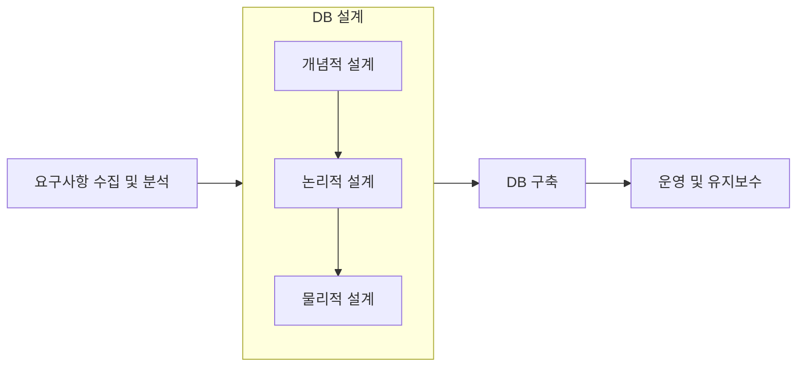

<!-- PDF page: 044 -->

### 실무 미리보기

데이터베이스를 사용하면서 데이터베이스를 기존의 파일시스템처럼 사용하는 경우가 많으며 데이터베이스에 테이블을 만들지만, 실질적으로는 각 테이블이 개별 응용프로그램이나 화면, 보고서(Report)에 종속적인 시스템 을 만드는 경우가 많이 있다.

예를 들면, 팀별 도서관리 시스템을 개발한다고 할 때, 기존의 엑셀로 관리하던 때처럼 DB로 구현할 때도 팀별 로 도서목록 테이블을 별도로 만드는 것을 생각해볼 수 있다. 테이블 설계를 기존의 엑셀과 동일하게 가져간다 면 데이터베이스의 통합, 저장, 운영, 공유의 장점을 전혀 살릴 수 없게 된다.

또한 이 경우 응용 프로그램의 복잡도가 증가함에 따라 개발비용의 증가, 데이터 무결성의 문제발생(데이터중 복에 따른 일관성 결여) 데이터처리 성능저하로 이어지는 심각한 현상을 초래하는 등의 문제가 발생할 수 있다. 따라서 데이터베이스의 정의(통합, 저장, 운영, 공유)와 특징, 데이터베이스의 장점을 이해하여 실무적으로 적용해야만 이러한 문제를 예방할 수 있고 데이터베이스의 장점을 극대화하여 시스템 개발에 반영할 수 있다.

### 01 데이터베이스 설계 및 구축 과정

일반적으로 데이터베이스 설계와 구축 프로세스는 요구사항 수집 및 분석, DB 설계, DB 구축, 운영 및 유지보수의 단계로 수 행된다. 특히 분석/설계 단계는 개념적 설계, 논리적 설계, 물리적 설계의 세부 단계로 나누어 수행된다. 세 가지 설계 단계의 세부 내용은 다음 주제인 [데이터 모델링]에서 보다 상세히 소개하도록 한다.

[그림 8] 데이터베이스 설계와 구축 프로세스
