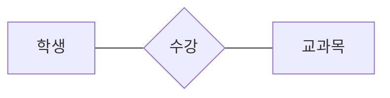

<!-- PDF page: 056 -->

③ 일반적으로 엔터티는 자체 식별자(키 속성)를 가지며, 사각형으로 표현한다.

④ 자체 식별자를 갖지 않는 엔터티를 약성 엔터티(Weak Entity)라고 하며, 두 줄 사각형으로 표현한다.

#### 나) 관계(Relationship)

① 엔터티들 사이의 연관성을 나타내며 마름모로 표시한다.

예: [학생]과 [교과목] 사이의 [수강] 관계는 다음과 같이 나타냄

[그림 13] 관계 표기법

② 관계의 차수(Degree)는 관계에 참여하는 엔터티의 수를 나타낸다.

- Unary, Binary, Ternary, …, N-ary

③ 관계의 대응수(Cardinality)는 관계에 참여할 수 있는 관계 인스턴스의 최대 수를 나타낸다.

- 일대일, 일대다, 다대다 관계가 존재함

| 대응수 | 표현 예 |
| --- | --- |
| 일대일(1:1) | 학생 — 1 — 과대표 — 1 — 학과 |
| 일대다(1:N or N:1) | 학생 — N — 전공 — 1 — 학과 |
| 다대다(M:N) | 학생 — M — 수강 — N — 과목 |

[그림 14] 관계의 대응수

④ 약성 엔터티와 식별 엔터티를 연결하는 관계를 식별 관계라고 하며, 두 줄 마름모로 표시하여 일반 관계와 구별한다.

#### 다) 속성(Attribute)

① 엔터티 또는 관계의 본질적 성질을 나타내며 타원으로 표시한다.

② 식별자(키 속성)

- 속성명에 밑줄을 그어 표시함
- 모든 엔터티 집합에서 항상 유일한 값을 갖는 속성 또는 속성 집합(예: 학생의 학번, 자동차의 차량번호 등)
- 여러 속성이 합쳐져서 식별자가 되는 경우, 우선 해당 속성들을 조합하여 복합속성으로 만든 후 밑줄을 그어 표시함
- 식별자가 될 수 있는 속성이 여러 개 있는 경우, 이들 각각에 밑줄을 그어 표시함
