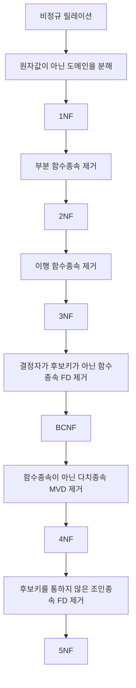

<!-- PDF page: 072 -->

### 03 정규화를 적용한 데이터베이스 설계(1차, 2차, 3차, 보이스코드)

정규화를 통해 도출된 테이블을 정규형 테이블이라 하며, 1차 정규형(1NF), 2차 정규형(2NF), 3차 정규형(3NF), 보이스-코드 정규형(BCNF), 4차 정규형(4NF), 5차 정규형(5NF)이 학계 및 실무에서 소개되고 있다. 특히 3차 정규형과 보이스-코드 정규형의 활용도가 높은 것으로 알려져 있다.

#### 가) 정규화 수행 과정

[그림 28] 정규화 수행 과정(1차, 2차, 3차, 보이스-코드 정규형)

#### 나) 정규화 수행의 예

① 1차 정규화

- 좌측 테이블은 비정규 테이블임('수강과목' 필드가 원자값을 갖지 않으므로)
- 속성 '수강과목'을 분해하고 '학번'과 '수강과목'의 복합키를 기본키로 지정함으로써, 우측 테이블과 같은 1차 정규형 테이블을 도출할 수 있음

| 학번 | 이름 | 과목명 |
| --- | --- | --- |
| 1111 | 홍길동 | 데이터베이스, 운영체제 |
| 2222 | 강감찬 | 운영체제, 네트워크, 자료구조 |

→

| 학번 | 이름 | 과목명 |
| --- | --- | --- |
| 1111 | 홍길동 | 데이터베이스 |
| 1111 | 홍길동 | 운영체제 |
| 2222 | 강감찬 | 운영체제 |
| 2222 | 강감찬 | 네트워크 |
| 2222 | 강감찬 | 자료구조 |

[그림 29] 1차 정규화 수행 예

② 2차 정규화

- 좌측 테이블은 2차 정규형이 아님
- (학번, 과목코드)→(과목명)의 함수 종속에서 (과목코드)→(과목명)의 부분 함수 종속이 존재하기 때문
- 이를 우측과 같이 두 개의 테이블로 분할함으로써 2차 정규형 테이블을 도출함
