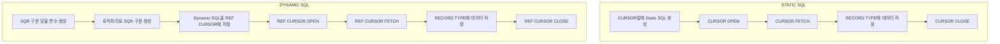

<!-- PDF page: 114 -->

#### 가) 동적 SQL과 정적 SQL의 비교

〈표 45〉 동적 SQL과 정적 SQL의 특징 비교

<table>
<tr><td>구분</td><td>Static SQL</td><td>Dynamic SQL</td></tr>
<tr><td>개요</td><td>SQL문을 변수에 담지 않고 코드상에 섞어서 기술함 CURSOR를 선언하여 SQL 구문을 정적 처리함</td><td>SQL 구문을 String형 변수에 담아 동적 처리함 조건에 따라 SQL 구문을 동적으로 변경할 수 있으며, 실행 시 사용자로부터 SQL 구문의 일부 또는 전부를 입력 받아 실행 가능함</td></tr>
<tr><td>개발 패턴</td><td>Static SQL을 CURSOR절에 선언한 뒤 이를 BEGIN END 절 사이에서 Looping 구조로 데이터를 처리함</td><td>Dynamic SQL은 구문 변경이 가능하므로 NVL()처리가 필요 없음</td></tr>
<tr><td>칼럼 구성</td><td>칼럼 및 Where절 변경 불가</td><td>SQL 구문을 변수에 담아서 DBMS를 호출하기 때문에, 변수나 열(Column) 등 모든 SQL을 로직으로 자유롭게 처리할 수 있음</td></tr>
<tr><td>실행 계획</td><td>Optimizer는 NVL()처리가 되어있는 조건을 처리하기 위해 IS NULL, IS NOT NULL로 나누어 실행계획을 수립함 즉 만약 6개 조건이 있다면 12개의 CONCATENATION 으로 실행 계획이 분할되므로 실행 계획 수립을 위한 하드 파싱(Parsing)에 장시간이 소요됨</td><td>Optimizer는 NVL()처리된 WHERE 조건이 없기 때문에 실행 계획을 나눌 필요가 없으므로 순수 액세스 패스에 대하여만 실행 계획을 수립함 따라서 하드 파싱(Parsing) 시간이 최소화 됨</td></tr>
<tr><td>장점</td><td>동적 SQL에 비해 실행 속도가 빠름 SQL 구문에 대해 개발 시점에 사전 검사가 가능함 동적 SQL에 비해 코드가 직관적이므로 코드 가독성이 높음</td><td>Application 내 각 SQL 구문에 대해 가장 최근 시점의 통계 정보를 근거로 한 Access Plan 보유 SQL 구문이 개발 시가 아닌, 실행 시에 확정되므로, 보다 다양하고 유연한 Application 개발이 가능함</td></tr>
<tr><td>단점</td><td>개발 시점에 SQL 구문을 모두 정의해야 함 Precompile, Bind 과정이 필요함</td><td>정적 SQL에 비해 처리 속도가 느림 실행 전에 SQL 구문의 Type, Syntax, Privilege에 대한 체크가 불가능함 개발 난이도가높고 개발 시간이 현저히 많이 소요됨</td></tr>
</table>

#### 나) 동적 SQL과 정적 SQL의 처리 방식

〈표 46〉 동적 SQL과 정적 SQL의 처리 방식 비교

<!-- 원본의 SQR 표기를 그대로 보존. -->
