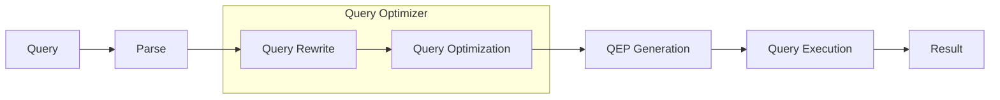

<!-- PDF page: 116 -->

#### 나) 옵티마이저(Optimizer)

옵티마이저(Optimizer)란 사용자의 다양한 요구에 따라 그 때마다 SQL문의 문법적 오류를 확인하고 가장 빠른 데이터 접 근 경로를 작성 및 채택하여 최적의 경로 또는 처리 절차를 찾아주는 역할을 수행하는 DBMS의 핵심 엔진을 의미한다. 관 계형 데이터베이스에서 SQL은 원하는 데이터(What)만 지정하면 데이터를 구하는 방식(How)은 DBMS의 옵티마이저가 자 동적으로 결정하여 처리한다. 즉 데이터베이스의 물리적 데이터 독립성을 보장하고 사용자의 SQL 질의를 효율적으로 수 행하는 방법을 찾아내는 옵티마이저가 관계형 데이터베이스의 상업적 성공에 크게 기여하고 있다고 할 수 있다.

#### 다) 질의 처리 단계별 옵티마이저의 역할

질의 처리는 Parse, Query Rewrite, Query Optimization, QEP Generation, Query Execution의 5단계로 구분되며, 옵티마이 저는 이 가운데 Query Rewrite 단계와 Query Optimization 단계에 작용한다. QEP(Query Execution PIan)란 질의를 실행하 는데 필요한 상세 정보인 질의 실행 계획을 의미한다.

RBO, CBO

[그림 40] 관계형 데이터베이스 질의 처리의 5단계

〈표 47〉 질의 처리 단계별 옵티마이저의 역할

<table>
<tr><td>질의 처리 단계</td><td>처리 내용</td></tr>
<tr><td>질의 변환 (Query Rewrite)</td><td>더욱 효과적인 질의 실행 계획이 있는지 그 가능성을 확인하며, 서브 질의와 뷰의 병합 및 OR Expansion 작업을 수행함</td></tr>
<tr><td>비용 산정 (Query Optimization)</td><td>질의에 대한 액세스 경로를 결정함</td></tr>
</table>

#### 라) 기준에 따른 옵티마이저의 분류

① 규칙 기준 옵티마이저(RBO: RuIe Base Optimizer)

규칙 기준 옵티마이저는 인덱스 구조나 비교 연산자에 따른 순위 부여를 기준으로 최적의 경로를 설정하며, 판단이 매우 규칙적이고 분명하여 사용자가 경로를 정확히 예측할 수 있다는 장점을 갖는다. 하지만 통계 정보라는 현실적 요소를 반 영하지 않으므로 실행 성능 면에서 판단의 오차가 크게 발생할 수 있다는 한계를 갖는다

② 비용 기준 옵티마이저(CBO: Cost Base Optimizer)

비용 기준 옵티마이저는 처리 방법들에 대한 비용을 산정한 뒤, 그 가운데 가장 적은 비용이 소요되는 방법을 선택한다. 현실을 감안한 판단, 통계 정보 관리를 통한 최적화 제어를 통해 옵티마이저에 대한 깊은 이해가 없더라도 최소한의 성능 을 보장한다는 장점이 있지만, 실행 계획에 대한 예측 및 제어가 어렵다는 한계를 갖는다
