<!-- PDF page: 001 -->

# 시스템아키텍처 이해와 활용

TOPCIT ESSENCE

기술 영역

03 시스템아키텍처 이해와 활용

<!-- PDF page: 002 -->

<!-- 원본 빈 페이지: 인쇄 머리말·꼬리말만 제외 -->

<!-- PDF page: 003 -->

TOPCIT ESSENCE Ver. 3

**기술영역**

03 시스템아키텍처 이해와 활용

<!-- PDF page: 004 -->

TOPCIT 에센스는 TOPCIT을 준비하는 응시생들에게 학습자료를 제공하기 위해 발행되었습니다. 더 나아가 실무중심의 ICT 관련 지식을 습득하고자 하는 학습자들이 자기주도적 학습을 위한 자원으로 활용할 수 있기를 바랍니다.

이 책의 내용에 대한 추가 지원과 문의는 TOPCIT 홈페이지 또는 홈페이지에 안내된 이메일을 이용해 주시기 바랍니다.

TOPCIT 에센스의 내용 중 일부는 집필진의 주관적인 의견이 반영되어 있으며, 해당 의견은 TOPCIT 사업단의 공식적인 입장이 아님을 밝혀둡니다.

| 구분 | 내용 |
| --- | --- |
| 주관부처 | 과학기술정보통신부 |
| 주관기관 | 정보통신기획평가원 |
| 참여기관 | 한국생산성본부 |
| 펴낸 곳 | TOPCIT 사업단 |
| 1판 발행일 | 2014. 12. 10. |
| 2판 발행일 | 2016. 02. 26. |
| 3판 발행일 | 2020. 02. 26. |

<!-- 연락처 제외: 프로젝트 지침 -->

TOPCIT 에센스의 저작권은 과학기술정보통신부에 있으며 모든 내용의 무단전재와 복제를 금합니다.

<!-- PDF page: 005 -->

TOPCIT ESSENCE Ver. 3

**기술영역**

03 시스템아키텍처 이해와 활용

<!-- PDF page: 006 -->

TOPCIT ESSENCE Ver. 3

<!-- PDF page: 007 -->

**기술영역**

03 시스템아키텍처 이해와 활용

<!-- PDF page: 008 -->

| 목차 | 책 쪽수 |
| --- | ---: |
| I. 시스템 개념 | 20 |
| 01 시스템아키텍처의 개념 | 22 |
| 가) 시스템아키텍처의 이해 | 22 |
| 나) 정보시스템의 구성요소 | 23 |
| 02 시스템아키텍처 유형 | 26 |
| 가) 시스템아키텍처 유형 | 26 |
| 나) 시스템 배치 방식에 따른 시스템아키텍처 분류 | 26 |
| 다) 응용 프로그램 제공 방식에 따른 분류 | 27 |
| 라) 시스템 계층에 따른 분류 | 28 |
| 03 서버의 스택 구조 | 29 |
| 가) 서버의 스택구조 개념 | 29 |
| 나) 컴퓨터 하드웨어 | 30 |
| II. 네트워크 개념 | 32 |
| 01 프로토콜이란? | 35 |
| 02 OSI 참조 모델과 TCP/IP 프로토콜 계층 구조 | 36 |
| 03 인터넷 주소 체계 | 39 |

<!-- PDF page: 009 -->

| 목차 | 책 쪽수 |
| --- | ---: |
| 04 인터넷 표준 | 40 |
| III. 운영체제 | 42 |
| 01 운영체제(OS, Operating System) | 43 |
| 가) 운영체제의 개요 | 43 |
| 나) 운영체제의 주요 기능 | 44 |
| 다) 주요 운영체제의 종류 | 45 |
| 02 프로세스와 스레드 | 46 |
| 가) 프로세스(Process)의 이해 | 46 |
| 나) 프로세스 관리를 위한 기법 | 46 |
| 다) 스레드(Thread) | 47 |
| 03 프로세스 동기화와 교착상태 | 49 |
| 가) 프로세스 동기화(Process Synchronization)의 개념 | 49 |
| 나) 임계구역(Critical Section) 문제 | 49 |
| 다) 임계구역(Critical Section) 문제 해결법 | 49 |
| 라) 교착상태 | 50 |
| 04 기억장치 관리 | 50 |
| 가) 기억장치 관리의 이해 | 50 |
| 나) 기억장치 관리기법 | 50 |
| 05 스케줄링 | 53 |

<!-- PDF page: 010 -->

| 목차 | 책 쪽수 |
| --- | ---: |
| 가) 스케줄링의 목적 | 53 |
| 나) 스케줄링 알고리즘의 종류 및 특징 | 53 |
| 06 가상 기억장치 | 54 |
| 가) 가상기억장치의 구현 기법 | 54 |
| 나) 가상기억장치의 페이지 교체 기법 | 55 |
| 다) 가상기억장치의 성능에 영향을 미치는 요인 | 56 |
| 07 파일 시스템 | 56 |
| 가) 파일 시스템의 이해 | 56 |
| 나) 파일시스템의 할당 방법 | 57 |
| 다) 운영체제별 파일시스템의 종류 | 59 |
| 라) 유닉스(UNIX)의 i-node | 59 |
| 08 입출력시스템 | 59 |
| IV. 컴퓨터 아키텍처 | 61 |
| 01 컴퓨터의 구조와 아키텍처 | 62 |
| 가) 컴퓨터의 기본 구조 | 62 |
| 나) 컴퓨터 아키텍처의 종류 | 63 |
| 02 중앙처리장치(CPU, Central Processing Unit) | 64 |
| 가) CPU의 정의 | 64 |
| 나) CPU의 수행 동작 | 64 |

<!-- PDF page: 011 -->

| 목차 | 책 쪽수 |
| --- | ---: |
| 다) CPU의 구성요소 | 64 |
| 라) 명령어 사이클(Instruction cycle) | 65 |
| 마) 명령어 집합구조, CISC와 RISC | 66 |
| 03 기억 장치(Memory) | 67 |
| 가) 기억장치의 계층구조 | 67 |
| 나) 기억장치의 성능 평가 요소 | 68 |
| 다) 기억장치의 분류 및 특징 | 68 |
| 라) 주소지정 방식(Addressing Mode) | 68 |
| 마) 지역성(Locality) | 69 |
| 04 입출력 장치 | 69 |
| 가) 입출력 장치의 개념 | 69 |
| 나) I/O제어기의 구조와 주소지정 방식의 종류 | 69 |
| 다) 직접 메모리 접근(DMA) | 70 |
| 05 최신 기술 및 동향 | 72 |
| 가) 뉴로모픽칩 | 72 |
| 나) 양자컴퓨터 | 73 |
| V. 데이터 처리기술 | 75 |
| 01 병렬 처리 시스템(Parallel Processing System) | 76 |
| 가) 병렬 처리 시스템의 개념 | 76 |
| 나) 병렬 처리 시스템의 플린에 의한 분류 | 76 |

<!-- PDF page: 012 -->

| 목차 | 책 쪽수 |
| --- | ---: |
| 다) 메모리 구조에 의한 병렬 처리 시스템 분류 | 78 |
| 라) 병렬 프로세서 기술의 유형 | 79 |
| 마) 병렬 프로그래밍 기술 | 81 |
| 바) 그래픽 처리 프로세싱 기술 | 81 |
| 사) GPU 기반 병렬 프로그래밍 기술 | 82 |
| 02 스토리지 기술 | 83 |
| 가) 저장장치의 개념 | 83 |
| 나) 저장장치와 서버의 연결 | 83 |
| 다) IP-SAN | 85 |
| 라) 스토리지 용량 관리 기술 | 86 |
| 마) 저장장치 디스크 스케줄링 | 87 |
| 03 고가용성 저장장치 | 90 |
| 가) RAID(Redundant Array of Independent Disks) 기술 | 90 |
| 나) 백업 스토리지: LTO, VTL | 93 |
| 04 그래픽 압축 기술 | 94 |
| 가) 영상압축 유형 | 94 |
| 나) 멀티미디어 데이터 | 94 |
| VI. 임베디드 시스템 | 97 |
| 01 임베디드 시스템 개요 | 98 |
| 가) 임베디드 시스템의 정의 | 98 |

<!-- PDF page: 013 -->

| 목차 | 책 쪽수 |
| --- | ---: |
| 나) 임베디드 시스템의 특징 | 99 |
| 다) 임베디드 시스템의 개발 과정 | 100 |
| 02 임베디드 하드웨어 | 101 |
| 가) 임베디드 시스템의 핵심, 마이크로 프로세서 | 101 |
| 나) 임베디드 하드웨어의 기술 동향 | 102 |
| 03 임베디드 소프트웨어 | 103 |
| 가) 임베디드 소프트웨어의 정의 및 기술분야 | 103 |
| 나) 임베디드 소프트웨어의 특징 | 103 |
| 04 임베디드 운영체제 | 104 |
| 가) 임베디드 운영체제의 개념 | 104 |
| 나) 임베디드 운영체제의 구조 및 적용기술 | 104 |
| 다) 임베디드 운영체제의 종류와 동향 | 105 |
| VII. 정보시스템 구축 기술 | 107 |
| 01 정보시스템의 구조 | 108 |
| 가) 정보시스템의 개념 | 108 |
| 나) 정보시스템 구조 | 109 |
| 02 정보시스템 용량 산정 | 112 |
| 가) 규모 산정의 개념 | 113 |
| 나) 규모 산정 대상 | 113 |

<!-- PDF page: 014 -->

| 목차 | 책 쪽수 |
| --- | ---: |
| 다) 규모 산정 참조 아키텍처 | 114 |
| 라) 규모 산정 절차 | 115 |
| 마) 하드웨어 요소별 규모 산정 방식 | 116 |
| 03 정보시스템의 최신기술 및 동향 | 116 |
| VIII. 장애 대응 처리 기술 | 119 |
| 01 고가용성(HA, High Availability) | 120 |
| 가) 고가용성(HA, High Availability) 개념 | 120 |
| 나) HA(High Availability) 구성 유형 | 121 |
| 02 결함 허용 시스템 | 123 |
| 가) 결함 허용 시스템(Fault tolerant system) | 123 |
| 03 재난복구시스템 | 123 |
| 가) 재난복구시스템(DRS, Disaster Recovery System)의 정의 | 123 |
| 나) 재난 복구 목표 | 124 |
| IX. 클라우드 컴퓨팅 기술 | 125 |
| 01 클라우드 컴퓨팅의 정의 | 126 |
| 가) 클라우드 컴퓨팅과 다른 컴퓨팅과의 비교 | 127 |

<!-- PDF page: 015 -->

| 목차 | 책 쪽수 |
| --- | ---: |
| 02 클라우드 컴퓨팅 유형 | 127 |
| 가) 서비스 유형에 따른 분류 | 127 |
| 나) 클라우드 운영 형태에 따른 분류 | 128 |
| 03 서버 가상화 기술 | 129 |
| 가) 하이퍼바이저(Hypervisor) | 129 |
| 나) 하이퍼바이저의 유형 | 129 |
| 다) 서버 가상화 방식의 유형 | 130 |
| 04 스토리지와 네트워크 가상화 기술 | 133 |
| 가) 스토리지 가상화 | 133 |
| 나) 네트워크 가상화 | 133 |
| 05 클라우드 플랫폼 | 133 |
| 가) 클라우드 플랫폼의 정의 | 133 |
| 나) 오픈스택(Openstack) | 133 |
| 다) 클라우드 스택(CloudStack) | 133 |
| 라) 쿠버네티스(Kubernetes) | 134 |
| 마) 메소스(Mesos) | 134 |
| X. 빅데이터 시스템 | 135 |
| 01 빅데이터 시스템의 구조 | 136 |
| 가) 하둡(Hadoop) 생태계 | 136 |

<!-- PDF page: 016 -->

| 목차 | 책 쪽수 |
| --- | ---: |
| 나) 하둡(Hadoop)의 주요기술 요소 | 137 |
| 다) 하둡(Hadoop) 지원 프로그램 | 138 |
| 라) 하둡기반 전문 상용 솔루션 | 139 |
| 02 빅데이터 시스템의 동향 및 전망 | 140 |
| 가) 빅데이터 시스템의 동향 | 140 |
| 나) 빅데이터 시스템의 전망 | 140 |
| XI. 데이터 링크계층 | 142 |
| 01 데이터 링크계층의 개념 | 144 |
| 02 데이터 링크계층 캡슐화 | 144 |
| 가) 데이터 링크계층 캡슐화 | 144 |
| 나) 프레임 헤더와 트레일러 | 144 |
| 03 데이터 링크계층 구성 | 145 |
| 가) 데이터 링크계층 부계층 | 145 |
| 나) 논리 링크 제어(LLC) | 145 |
| 다) 매체 접근 제어(MAC) | 146 |
| 04 MAC 주소 검색 | 146 |
| 가) IP 주소와 MAC주소 변환 프로토콜 | 146 |
| 나) MAC 주소 검색 시나리오 | 147 |

<!-- PDF page: 017 -->

| 목차 | 책 쪽수 |
| --- | ---: |
| 05 데이터 링크계층 오류검출과 오류정정기법 | 147 |
| 가) 오류제어의 개념 | 147 |
| 나) 오류검출과 오류정정 | 148 |
| 06 IEEE 802 표준 | 149 |
| 가) IEEE 802의 개념 | 149 |
| 나) IEEE 802.3 표준 | 150 |
| 다) IEEE 802.11 표준 | 150 |
| 라) IEEE 802.15 표준 | 151 |
| XII. 네트워크층 | 153 |
| 01 네트워크 계층 개요 및 장비 | 155 |
| 가) 네트워크 계층이란? | 155 |
| 나) 네트워크 계층 기능 | 155 |
| 다) 인터네트워킹(Internetworking) 장비 | 155 |
| 라) 라우터(Router)란? | 156 |
| 마) 스위치(Switch)란? | 158 |
| 바) VLAN(Virtual Local Area Network) | 158 |
| 02 네트워크 계층 캡슐화 | 159 |
| 가) 네트워크 계층 캡슐화 | 159 |
| 나) IPv4 헤더 | 160 |
| 03 패킷 스위칭 및 네트워크 계층 프로토콜/명령어 | 160 |

<!-- PDF page: 018 -->

| 목차 | 책 쪽수 |
| --- | ---: |
| 가) 패킷 스위칭 | 160 |
| 나) 네트워크 계층 프로토콜/명령어 | 160 |
| 다) 네트워크 계층 명령어 | 161 |
| 04 네트워크 서비스 품질 | 162 |
| 가) QoS(Quality of Service) 특성 | 162 |
| 나) 품질 구현기법 | 162 |
| 05 라우팅 프로토콜 알고리즘 및 유형 | 163 |
| 가) 라우팅 프로토콜이란? | 163 |
| 나) 라우팅 알고리즘이란? | 163 |
| 다) 라우팅 프로토콜 유형 | 165 |
| 라) 라우팅 프로토콜 종류 | 166 |
| 06 IPv4 개요 | 166 |
| 가) IPv4(Internet Protocol Version 4) 주소란? | 166 |
| 나) IPv4 주소를 사용한 네트워크(예) | 167 |
| 07 IPv4 주소지정체계 및 서브네팅 | 167 |
| 가) IPv4 표현방식 | 167 |
| 나) IPv4 주소지정체계 | 168 |
| 다) 특수 IPv4 주소 | 169 |
| 라) 서브네팅 | 169 |
| 마) CIDR(Classless Inter-Domain Routing) | 170 |
| 바) 슈퍼네팅(Supernetting) | 171 |
| 사) IPv4 주소 할당방식 | 171 |

<!-- PDF page: 019 -->

| 목차 | 책 쪽수 |
| --- | ---: |
| 08 IPv6 개요 | 172 |
| 가) IPv6(Internet Protocol Version 6) 주소란? | 172 |
| 나) IPv6의 등장배경 | 172 |
| 09 IPv6 주소 체계 및 헤더구조 | 172 |
| 가) IPv6의 주소체계 | 172 |
| 나) IPv6의 헤더 구조 | 173 |
| XIV. 전송계층 프로토콜 | 176 |
| 01 전송계층 프로토콜 개념 | 177 |
| 02 TCP | 178 |
| 가) TCP 특징 | 178 |
| 나) 가상의 TCP 동작 시나리오 | 179 |
| 다) TCP 프로토콜 | 180 |
| 03 UDP(User Datagram Protocol) | 185 |
| 가) UDP 특징 | 185 |
| 나) UDP 프로토콜 | 186 |
| 04 SCTP(Stream Control Transmission Protocol) | 186 |
| 가) SCTP 특징 | 186 |
| 나) SCTP 프로토콜 | 187 |

<!-- PDF page: 020 -->

| 목차 | 책 쪽수 |
| --- | ---: |
| XV. 웹 응용을 포함한 응용 계층 기술 | 191 |
| 01 응용 계층 프로토콜이란? | 194 |
| 02 HTTP | 194 |
| 03 파일 전송 프로토콜 | 194 |
| XVI. 이동 통신 및 멀티미디어 통신기술 | 198 |
| 01 멀티미디어 네트워크 | 199 |
| 가) 영상압축 유형 | 199 |
| 나) 멀티미디어 데이터 | 199 |
| 다) QoS(Quality of Service) | 200 |
| 02 인터넷 전화 개념 및 호 신호 프로토콜 | 201 |
| 가) VoIP(Voice over Internet Protocol)란? | 201 |
| 나) VoIP 호(Call) 신호 프로토콜 | 202 |
| 다) H.323 | 203 |
| 라) VoLTE(Voice over LTE) | 203 |
| 03 미디어 전송 프로토콜 | 204 |
| 가) RTP(Real-time Transport Protocol) | 204 |
| 나) RTCP(Real-time Transport Control Protocol) | 205 |

<!-- PDF page: 021 -->

| 목차 | 책 쪽수 |
| --- | ---: |
| 다) RTSP(Real-time Streaming Protocol) | 205 |
| 라) IMS(IP Multimedia Subsystem) | 205 |
| XVII. 최신 기술 | 207 |
| 01 IoT(Internet of Thing) 네트워크 기반 기술 | 209 |
| 가) IoT 개념 | 209 |
| 나) IoT 표준화 동향 | 209 |
| 다) IoT 주요기술 | 210 |
| 라) IoT 주요 프로토콜 | 211 |
| 02 소프트웨어 기반 네트워크 | 213 |
| 가) 기존 통신환경의 한계와 패러다임의 변화 | 213 |
| 나) SDN(Software Defined Network) | 213 |
| 다) NFV(Network Function Virtualization) | 215 |
| 라) SDN과 NFV | 217 |

<!-- PDF page: 022 -->

## I. 시스템 개념

### 최근 동향 및 주요 이슈

빅데이터, 클라우드 컴퓨팅, IoT 등의 신기술들이 주목을 받으면서 시스템아키텍처는 점점 복잡해지고 있다. 과거 서버, 스토리지, 네트워크의 단순한 조합으로 이루어져 있던 시스템아키텍처는 신기술들의 고성능의 컴퓨팅 파워와 고용량의 메모리, 고속의 통신속도를 제공해야만 하는 요구사항에 맞춰 시스템의 요건도 변경되고 있다. 이러한 변화에 맞춰 시스템아키텍처의 중요성도 점점 높아져가고 있다. 시스템아키텍처는 시스템의 구축과 운영을 위한 실무환경에서 꼭 필요한 개념이다.

### 학습 목표

1. 시스템아키텍처의 개념을 이해하고 구성요소를 설명할 수 있다.
2. 시스템의 개념과 시스템 계층에 대해 이해하고 설명할 수 있다.
3. 정보시스템의 서버 유형을 설명할 수 있다.

### 핵심 키워드

시스템아키텍처, 시스템계층, 정보시스템

<!-- PDF page: 023 -->

### 실무 미리보기

“美 유명 서버용 보드에서 ‘중국산 해킹칩’ 발견… 업계 발칵” 2018. 10. 05.

블룸버그는 4일(현지시각) 6명의 미국 정보 당국 고위 관계자의 말을 인용해 유명 서버 제조사 슈퍼마이크로(Supermicro)의 서버용 메인보드에서 설계에 없는 해킹용 마이크로칩이 발견됐으며, 여기에 중국 정부가 개입했다고 보도했다.

(출처: http://it.chosun.com/site/data/html_dir/2018/10/05/2018100502710.html)

<!-- 생략: The Big Hack / 손가락 위의 소형 칩 사진 -->

우리가 생활하고 있는 환경에서 컴퓨터 시스템이 제공하는 서비스를 사용하지 않는 시간은 잠시도 없을 것이다. 스마트폰이 보급되면서 더욱더 많은 시간을 컴퓨터 시스템과 지내게 되었다. 이런 환경에서 중국의 해킹칩은 우리 모두의 생활을 해커에게 노출시킬 수 있다. 이 해킹칩은 컴퓨터 시스템의 보드에서 발견되었다. 소프트웨어 해킹보다 더 강력한 하드웨어 해킹을 통해 미국의 핵심 정보를 탈취한 것이다. 이 좁쌀 크기만한 칩은 컴퓨터의 정보를 네트워크를 통해 탈취할 수 있는 기능을 제공하는 것이다. 어떻게 저렇게 조그마한 칩에 그런 기능을 넣을 수 있었을까? 초창기 컴퓨터인 에니악은 건물 하나의 크기였지만 점점 더 컴퓨터의 크기는 작아지고 요즘 손에 들고다니는 스마트폰의 컴퓨팅 능력이 에니악과는 비교도 되지 않을 정도로 높다. 이러한 컴퓨터 시스템의 개념을 이해하기 위해서는 시스템아키텍처를 이해해야 한다.

<!-- PDF page: 024 -->

### 01 시스템아키텍처의 개념

#### 가) 시스템아키텍처의 이해

##### ① 시스템아키텍처의 개요

IT(정보기술)의 기술을 이용한 시스템을 정보시스템이라 한다. 이 정보시스템은 컴퓨터를 이용하여 서비스를 제공하며 컴퓨터는 하드웨어와 소프트웨어 조합으로 동작된다. 기업내부에서 사용되는 정보시스템이나 사용자에게 서비스로 제공되는 정보시스템을 구축할 경우 소프트웨어 설계와 개발뿐만 아니라 하드웨어와 같은 IT 인프라스트럭처(Infrastructure)에 대한 설계와 구축이 필요하다. 소프트웨어 분야는 소프트웨어 아키텍처를 기반으로 소프트웨어 구성요소와 구성요소 간의 연결과 제약사항 동작원리를 설계한다. 하드웨어 분야에서도 소프트웨어 분야와 마찬가지로 하드웨어 아키텍처를 설계하고 개발하게 된다. 시스템 아키텍처는 하드웨어와 소프트웨어 아키텍처를 기반으로 시스템이 서비스를 제공하기 위한 아키텍처를 말한다. 광의의 정의로서는 정보시스템 구축을 위한 AA, DA, TA 측면의 아키텍처 모두를 말하지만 협의의 의미로서는 서버, 스토리지, 네트워크, 보안 등의 하드웨어 장비와 운영체제, 미들웨어 등의 일정 부분의 소프트웨어들의 구성과 관계를 정의한 문서를 말한다.

##### ② 시스템아키텍처 정의

- 국제 시스템엔지니어링 협회(INCOSE)에서 정의한 시스템아키텍처

시스템 구성항목과 인터페이스, 프로세스, 제약 조건, 동작방법 등의 측면에서 정의된 기초적인 통합 시스템 구조

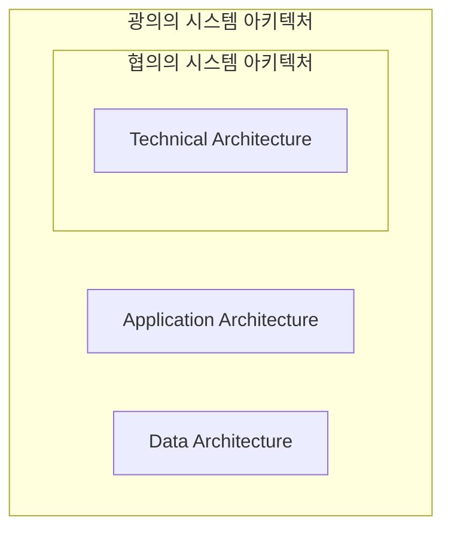

[그림 1] 시스템아키텍처의 정의

<!-- PDF page: 025 -->

- 광의의 시스템아키텍처 정의

시스템아키텍처는 조직의 목표를 달성하기 위한 업무프로세스를 지원하기 위해 제공되는 정보시스템의 구조를 정의한 문서이다. 시스템 아키텍처는 서버, 네트워크, 보안의 하드웨어 구조와 응용 프로그램이 하드웨어 위에서 동작하기 위한 미들웨어의 배포 구조를 정의한 기술 아키텍처(Technical Architecture)와 정보시스템에서 사용되는 데이터의 무결성을 보장하기 위해 정의한 데이터의 구조인 데이터 아키텍처(Data Architecture), 정보시스템의 소프트웨어 컴포넌트의 정의 컴포넌트들 간의 관계 및 제약사항을 정의한 응용 아키텍처(Application Architecture)로 구분된다.

- 협의의 시스템아키텍처 정의

정보시스템의 구조를 말하며, 하드웨어, 소프트웨어, 보안 등 컴포넌트와 컴포넌트의 상호작용과 제약사항을 정의하는 원칙과 지침을 말한다. 즉 기술 아키텍처(Technical Architecture)를 말하며 개발될 시스템의 응용 프로그램을 배포할 DB 서버, WAS 등의 미들웨어와 서버, 스토리지, 네트워크 등의 하드웨어에 대한 배치와 연결방식을 정의한다. 시스템아키텍처에서 정의되는 세부 아키텍처의 종류를 살펴보자.

| 구분 | 내용 |
| --- | --- |
| 서버 디자인 아키텍처 | 서버를 구성하는 자원에 대해 정의한다.<br>− CPU의 클럭 속도와 코어 개수<br>− 메모리 용량, 네트워크 카드(NIC)의 성능과 개수<br>− SSD, SAS 디스크 등 저장장치의 종류와 용량<br>− 랙 마운트형, 블레이드형 등 서버의 타입<br>− 1유닛(Unit)에서 4유닛까지의 서버 크기 |
| 네트워크 디자인 아키텍처 | 서비스를 제공하는 구성요소 간의 네트워크를 정의 한다.<br>− 외부 네트워크의 용량(Bandwidth)<br>− 연결되는 스위치와 라우터 결정<br>− 로드밸런싱을 위한 L4 스위치<br>− DDoS, IPS, 방화벽 등의 보안 장비<br>− 서비스에 사용되는 네트워크 주소(Subnet, IP, Gateway) |
| 스토리지 디자인 아키텍처 | 별도의 네트워크 스토리지에 대해 정의한다.<br>− 스토리지의 용량 및 성능(IOPS, Bandwidth)<br>− 스토리지에 장착되는 SSD, SAS, SATA 미디어의 타입<br>− RAID 구성 유형<br>− SAN, iSCSI, NFS 등 스토리지 연결 네트워크 유형 |

#### 나) 정보시스템의 구성요소

##### ① 정보시스템의 개요

시스템의 구성요소는 정보시스템이 서비스를 제공하기 위한 기능을 제공하는 항목로 구성되어 있다. 정보시스템의 컴퓨팅 파워를 제공하는 서버와 데이터를 저장하는 스토리지, 서버와 스토리지 등 각각의 구성요소 사이의 통신을 제공하는 네트워크, 정보시스템의 기밀성, 무결성, 가용성을 제공하기 위한 보안으로 이루어져 있다. 세부구성요소는 컴퓨터하드웨어, 운영체제, 미들웨어 등의 세부적인 요소들이 물리적인 서버에서 동작되고 있다. 각각의 구성요소의 세부적인 내용을 살펴보자.

<!-- PDF page: 026 -->

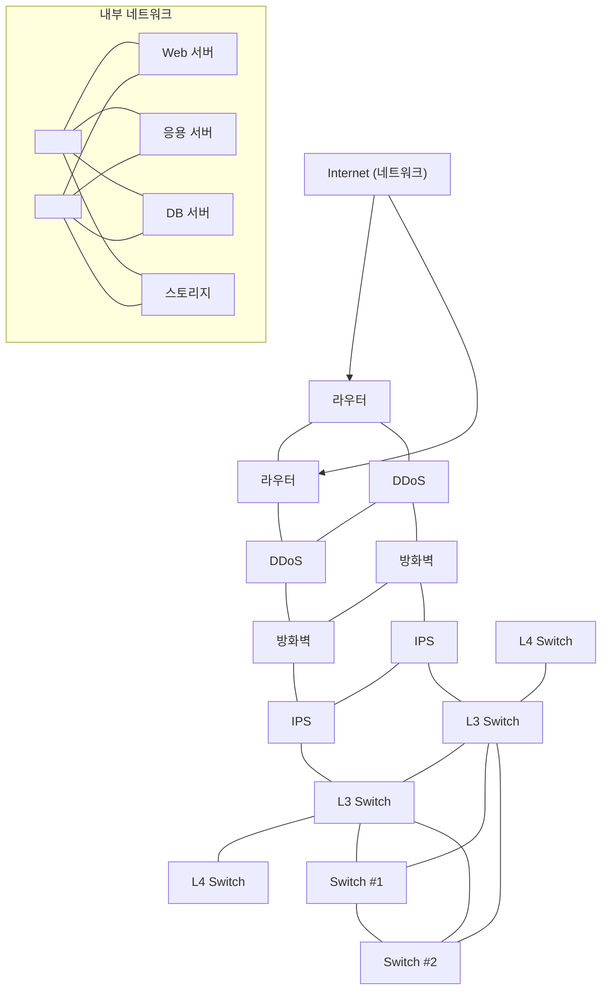

[그림 2] 정보시스템 구성요소

<!-- 하단의 두 공통 연결선을 이름 없는 연결점 두 개로 표현했다. 원본에서 스위치와 하단 선 사이 연결은 표시되지 않아 추가하지 않았다. -->

- 서버

서버는 정보시스템의 계산능력(Computing power)을 제공한다. 이 계산능력을 이용하여 응용 프로그램을 구동시켜 비즈니스 로직을 처리하고 데이터에 대해 처리할 수 있다. 서버는 컴퓨터하드웨어, 운영체제, 미들웨어, 응용프로그램의 스택구조로 구성요소를 나눌 수 있다. 시스템아키텍처의 설계에 따라 서버의 용량, 대수, 배치방식, 역할 등이 정의되고 서버들 사이의 통신은 네트워크를 통해 이루어진다. 최근에 주로 사용되는 서버의 유형으로는 메인프레임, 유닉스 서버, x86 서버가 있으며 클라우드 서비스가 확대됨에 따라 인텔 CPU를 이용하는 x86서버의 사용이 점점 확대되고 있다.

웹 서비스를 하는 정보시스템에서의 각 서버의 역할을 예를 들어 설명하면, 웹브라우저를 통해 사용자 요청에 응답하고 웹 페이지를 구성하고 사용자에게 보여주기 위한 화면을 제공하는 웹서버(Web Server)와 사용자의 요청에 맞게 비즈니스 로직을 처리하고 결과를 저장하기 위한 DB서버로 전달하거나 표현하기 위해 웹서버로 전달하는 응용서버(WAS, Web Application Server), 데이터의 생성, 요청, 수정, 삭제를 처리하는 DB서버(Database Server)로 구성된다

- 네트워크

정보시스템을 구성하는 각 구성요소들 사이의 통신망을 구성해 주는 역할을 수행한다. 서버와 서버들 사이의 통신, 서버와 스토리지 사이의 통신, 회사내부의 네트워크와 외부 네트워크 사이의 통신들 사이에는 네트워크 장비가 역할을 수행한다. 네트워크는 OSI 7계층 표준을 기준으로 장비와 역할이 나뉜다. 대표적으로는 스위치(Switch), 라우터(Router), 로드

<!-- PDF page: 027 -->

밸런서(L4/L7 Load balancer), 브리지(Bridge) 등이 있으며, 무선 네트워크를 위한 AP(Access Point)장비가 있다. 네트워크 영역은 보안영역과 중복되는 영역이 존재한다. 대부분의 보안공격이 네트워크를 통해 침입하기 때문에 외부네트워크(WAN)와 연결되는 내부네트워크(LAN) 게이트(Gate)에는 보안장비를 통해 내부 네트워크를 보호하고 있다.

- 스토리지

정보시스템의 데이터를 저장하기 위한 저장소이다. 스토리지는 저장되는 방식에 따라 3가지 정도로 구분한다. 16KB, 64KB 등의 고정된 블록단위로 데이터를 저장하는 방식을 블록스토리지라고 한다. 블록스토리지는 Microsoft 윈도우나 리눅스, 유닉스 등의 운영체제가 저장되는 곳이 블록스토리지이다. 고정된 블록이 아닌 파일단위로 저장하는 방식을 파일스토리지라고 한다. 파일스토리지는 공유파일 저장소로 많이 사용되는 NAS(Network Attached Storage)가 파일스토리지이다. 저장되는 단위가 블록이나 파일이 아닌 오브젝트 단위로 저장되는 스토리지를 오브젝트 스토리지라고 한다. 오브젝트 스토리지는 대부분의 클라우드 스토리지에서 사용되고 있다. 연결방식으로 스토리지 유형을 나눌 수 있다. 각 서버 내부에 장착되어 있는 DAS(Direct Access Storage)와 네트워크를 통해 연결되는 NAS(Network Attached Storage), 스토리지 전용 네트워크를 통해 연결되는 SAN(Storage Area Network) 등이 있다. DAS는 파일시스템(filesystem)을 만들어야 사용할 수 있으며, 사례로는 IDE, SATA, SAS 등이 있다. SAN은 SAN 네트워크를 통해 운영체제에 제공되며 DAS처럼 사용하기 전에 파일시스템을 만들어야 된다. 사례로는 SAN, iSCSI, FCoE 등이 있다. NAS는 운영체제에 마운트하여 바로 사용할 수 있다. 사례로는 NFS, CIFS, AFS 등이 있다.

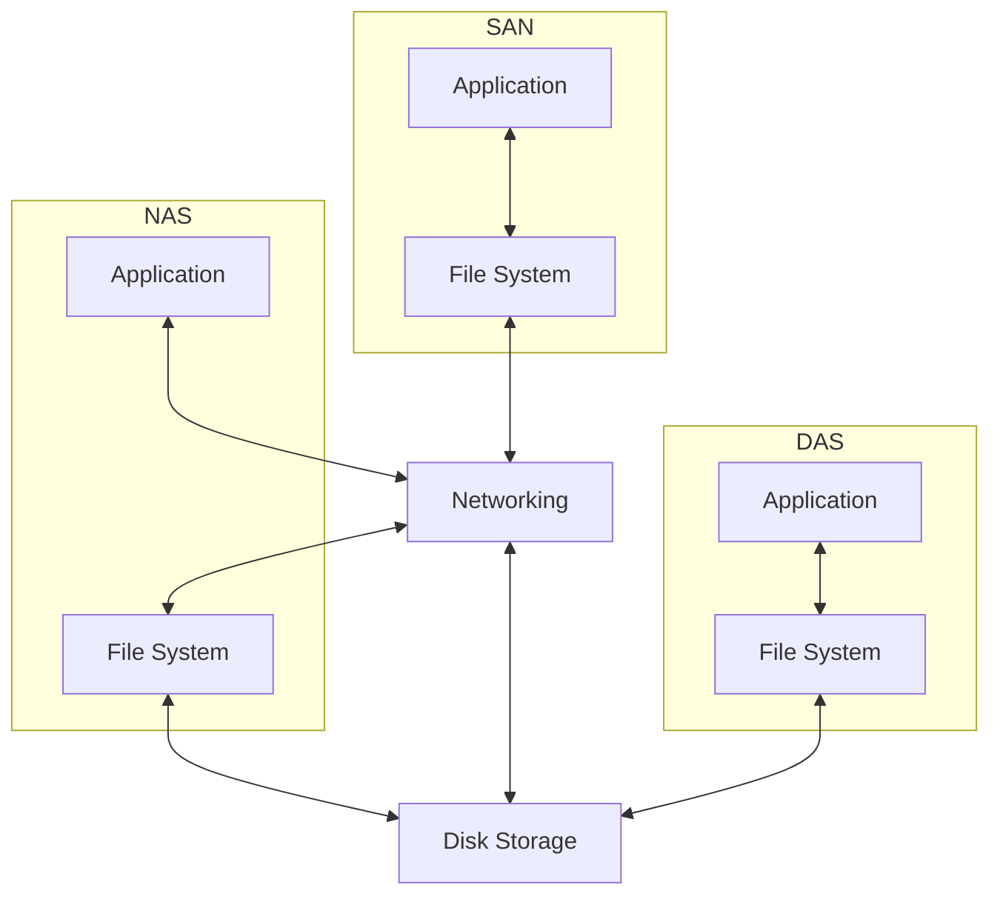

[그림 3] 연결방식에 따른 스토리지 유형

- 보안

정보보호를 네트워크와 연결되어 구성된다. 외부 인터넷 구간과 내부 네트워크 사이에 설치되어 내부의 시스템을 보호하는 장비와 내부 네트워크에 설치되는 장비가 있다. DDoS 공격을 방어하기 위한 DDoS 방어장비, 네트워크 트래픽에 대한 감시, 로깅, 차단을 통해 시스템을 보호하는 방화벽, 이상트래픽이나 오용방지를 위한 IPS/IDS, 웹 서비스 트래픽에 대한 로깅, 감시, 차단을 통해 웹서버를 보호하는 웹방화벽, 서버에 대한 접근을 허가하거나 거부하는 관리 기능을 제공하는 접근제어 솔루션 등이 있다.

<!-- PDF page: 028 -->

### 02 시스템아키텍처 유형

#### 가) 시스템아키텍처 유형

시스템을 구성하는 방식은 다양한 방법으로 제공되고 있다. 시스템 구성은 하드웨어, 소프트웨어들의 기술변화와 사용자 의 환경변화에 따라 다양한 방법으로 변화되고 있다. 최근 들어 스마트폰 등의 모바일 장비의 증가에 따라 대부분의 시스템은 웹서비스 중심의 시스템아키텍처를 기반으로 서비스를 제공 중에 있다. 또한 클라우드 서비스가 점차 확대됨에 따라 시스템의 배치방식도 중앙 집중형 구조로 서비스를 제공하고 있다.

#### 나) 시스템 배치 방식에 따른 시스템아키텍처 분류

정보시스템을 배치하는 방식에 따라 아키텍처 유형을 분류할 수 있다. 모든 시스템을 한 곳에 집중적으로 배치하는 방식 을 중앙 집중형 아키텍처라고 한다. 또한 지역별 시스템 및 응용 시스템을 분산 운영하는 방식을 지역별 분산 아키텍처라 고 한다.

##### ① 중앙 집중형 아키텍처

중앙 집중형 아키텍처는 통합센터에서 시스템과 데이터를 저장하고 운영하는 방식이다. 대용량 서버에 통합 DB를 구성하는 방식으로 구성되며 시스템 구성이 비교적 간단하다. 통합형 DB를 구성함으로써 데이터 무결성 보장이 용이하고 단일 장소에 구축되어 관리와 운영의 편리성이 제공된다. 시스템 장애에 따른 신속한 대응을 할 수 있다. 하지만 통합센터의 장애에는 전 업무 서비스가 중단된다. 또한 업무 집중시간(Peak Time)에 부하가 집중된다.

<!-- 생략: 그림 4 / 통합센터의 Server, DB에서 두 사용자 아이콘으로 향하는 화살표 도식 -->

[그림 4] 중앙 집중형 아키텍처

- 지역별 분산형 시스템 아키텍처

지역별 분산 아키텍처는 지역별로 시스템과 응용시스템을 분산하여 운영하는 방식을 말한다. 지역별로 데이터를 분산하 여 관리하고 중소형 서버를 이용하여 구축한다. 이 구조는 사용자 부하를 분산하여 서버에 대한 부하 분산 효과를 가질 수 있다. 장애발생 시 지역업무에 국한되어 업무서비스가 중단된다. 하지만 DB 구성 시 기준데이터 무결성 관리가 어렵고 시스템 구성과 관리가 복잡해 진다.

<!-- PDF page: 029 -->


<!-- 생략: 그림 5 / 각 지역의 사용자 아이콘 -->

[그림 5] 지역별 분산형 시스템아키텍처

#### 다) 응용 프로그램 제공 방식에 따른 분류

##### ① 클라이언트-서버 아키텍처

업무의 규모나 환경에 따라 시스템의 기능을 서버와 클라이언트에 분리하여 위치시키고 서비스를 사용하도록 구성하는 아키텍처이다. 시스템의 기능인 데이터관리, 비즈니스 프로세스, 프리젠테이션 영역을 어느 곳에 위치시키냐에 따라 서버 와 클라이언트에서 담당하는 역할이 달라진다. 클라이언트에서 응용프로그램을 구동시켜 그래픽 화면 구성을 통해 사용자 인터페이스의 편의성을 제공할 수 있다. 하지만 구성이 복잡하고 서버와 클라이언트로 분리되어 개발과 관리가 어렵다. 서비스 유형으로는 게임, 채팅, 메신저, FTP서버, 터미널 서버 등이 있다.

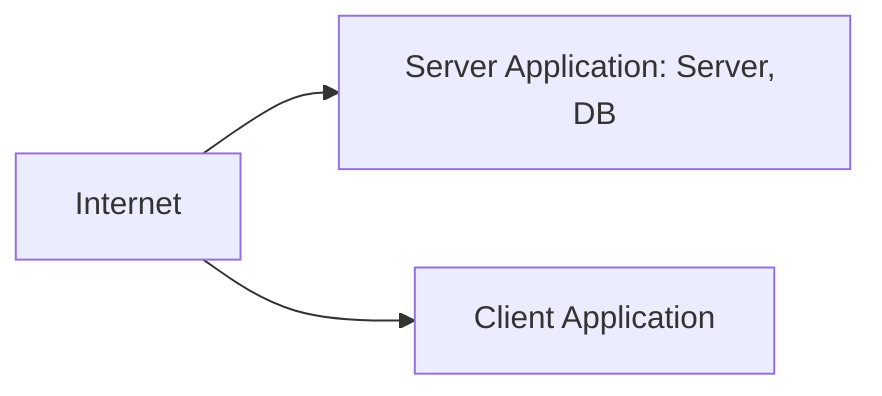

[그림 6] 클라이언트-서버 아키텍처

<!-- PDF page: 030 -->

- 웹 시스템 아키텍처

서버에 응용 프로그램 기능을 모두 구현하고 클라이언트에서는 웹브라우저를 이용하여 서비스를 이용하는 아키텍처이다. 웹서버, 웹응용서버, 데이터베이스 서버로 일반적으로 구성되며 미들웨어를 통해 안정적인 성능을 보장할 수 있으며 프로그램의 재사용성이 높다. 과거에는 정적인 웹화면 위주의 서비스를 제공하는 한계가 있었으나 HTML5의 등장과 PC 환경의 성능변화에 따라 동적이고 화려한 GUI환경으로 서비스를 제공할 수 있다. 최근에 사용되는 대부분의 정보시스템 은 웹 시스템 아키텍처를 이용한다. 클라이언트는 웹브라우저가 구동되는 환경이면 PC환경과 모바일 환경에서 모두 서비스를 이용할 수 있다.

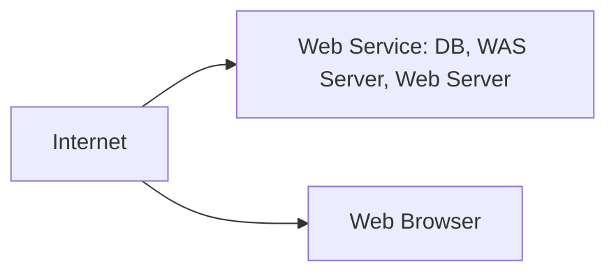

[그림 7] 웹 시스템 아키텍처

#### 라) 시스템 계층에 따른 분류

시스템의 구성요소별 기능과 역할을 티어(Tier)나 레이어(Layer)를 기준으로 나눈다. 일반적으로 많이 듣는 레이어는 네트워크의 구조를 나타내는 OSI 7 레이어이다. 레이어와 티어는 기능과 역할을 티어구조로 나타내는 측면에는 유사한 개념으로 여겨진다. 하지만 가장 보편적으로 나눌 수 있는 차이점은 레이어는 논리적인 관점에서의 구조를 말하며 티어는 물리적인 관점에서의 구조를 말한다. 정보시스템을 레이어로 나눈다면 프리젠테이션 레이어(Presentation Layer), 비즈니스 로직 레이에Business Logic l-ayer), 데이터 레이어(Data Layer)로 구분 지을 수 있다. 이 논리적인 레이어 구조를 물리적인 시스템아키텍처로 N-티어(Tier) 구조로 나눌 수 있다. N-티어 구조에는 대표적으로 2티어 구조와 3티어 구조가 있다.

<table>
<tr><th>구분</th><th>내용</th></tr>
<tr><td>프리젠테이션 레이어</td><td>- 응용 프로그램의 최상위에 위치하고 있으며 사용자에게 서비스의 정보와 인터페이스를 제공한다. 이<br>레이어를 GUI 또는 프론트 엔드(front-end)라고도 부른다. 물리적인 티어 구조에서는 웹서버와 클라이언트의<br>웹브라우저가 이 레이어에 속한다.</td></tr>
<tr><td>비즈니스 로직 레이어</td><td>- 비즈니스의 요구사항에 맞는 프로그램 정보처리 규칙(비즈니스 로직)이 구동되는 레이어이다. 비즈니스<br>로직에 따라 어떤 데이터가 필요한지 결정하고 데이터 티어에 요청한다. 이 레이어를 트랜잭션 티어이라고도<br>한다. 물리적인 티어 구조에서는 웹 응용 서버(WAS) 등의 응용 프로그램 서버가 이 레이어에 속한다.</td></tr>
<tr><td>데이터 레이어</td><td>- 데이터베이스와 같은 데이터 리소스를 접근해서 데이터를 읽거나 쓰는 레이어이다. 일부 자료에서는<br>데이터 레이어는 데이터 접근 레이어(Data Access Layer)와 데이터 저장 레이어(Data Store Layer)로<br>나누기도 한다. 물리적인 티어 구조에서는 DB서버 또는 파일 시스템(File System) 등이 이 레이어에 속한다.</td></tr>
</table>

- 2-티어 아키텍처

2티어 구조는 데이터의 저장과 처리는 서버에서 역할을 가지고 비즈니스 로직과 프리젠테이션 처리는 클라이언트에서 모두 처리한다. 일반적으로 클라이언트-서버 아키텍처 구조와 동일한 구조이다. 클라이언트에서 대부분의 로직을 처리하기 때문에 소규모 사용자의 경우 속도가 빠르고 구현이 쉽다는 장점이 있다. 하지만 사용자가 많아질수록 성능이 좋지 않아 확장성과 재사용성의 자원활용 측면에서 좋지 못하다. 실 사용사례로는 4GL툴인 파워빌더, 비쥬얼베이직, 델파이

<!-- PDF page: 031 -->

등의 도구를 이용하여 구현한 경우, 2티어 구조로 구현된다.

<table>
<tr><th>Layer</th><th>2-계층(Tier)</th><th>3-계층(Tier)</th></tr>
<tr><td>프리젠테이션 레이어 (Presentation Layer)</td><td rowspan="2">클라이언트 (Client)</td><td>클라이언트 (Client)</td></tr>
<tr><td>비즈니스 로직 레이어 (Business Logic Layer)</td><td>응용 서버 (WAS)</td></tr>
<tr><td>데이터 레이어 (Data Layer)</td><td>서버 (Server)</td><td>데이터베이스 (DB)</td></tr>
</table>

<!-- 생략: 그림 8 / 왼쪽 컴퓨터 아이콘, Biz Logic, QUERY, SALE 1~4, Database, Storage의 세부 도식 -->

[그림 8] 정보시스템 티어 구조 유형

- 3-티어 아키텍처

3티어 구조는 2티어 구조의 제한을 극복하기 위해 탄생된 구조로 멀티 티어(Multi-Tier)라고도 부른다. 이 구조는 프리젠테이션 티어와 데이터 티어 사이에 중간 비즈니스 로직을 처리하는 티어를 따로 두어 유연성과 확장성이 용이하도록 했다. 2티어 구조의 문제점으로는 클라이언트에서 네트워크를 통한 DB 접속으로 인한 보안 문제, 사용자의 권한관리의 어려움, 프로그램 변경의 어려움 등이 있다. 3티어 아키텍처에서는 클라이언트에 DB접속정보가 없으며, 응용서버를 통해 DB 객체 참조 권한 관리가 용이해지고, 분리된 프리젠테이션 티어의 배포가 유연해진다는 장점이 있다. 하지만 개발환경이 복잡하고, 미들웨어 도입과 하드웨어의 추가 구입이 필요하여 비용이 증가된다.

### 03 서버의 스택 구조

#### 가) 서버의 스택구조 개념

서버(Server)는 사용자에게 네트워크를 통해 정보나 서비스를 제공하는 컴퓨터나 프로그램을 말한다. 정보시스템에서 서비스를 제공하기 위해 필요한 연산능력(Computing power)은 서버에서 제공한다. 서버는 과거 IBM에서 메인프레임 (Mainframe)이라는 서버를 만들기 시작하면서 탄생되었다. 메인프레임이라는 용어는 중앙처리장치(CPU), 메인메모리(Main memory)를 감싸는 캐비넷 같은 큰 쇳덩이(mainframe)를 지칭하는 용어였다. 메인프레임은 단일 기업이 중앙처리장치부터 운영체제, 개발언어, 응용프로그램을 모두 만들었기 때문에 안정성과 성능은 뛰어났으나 비용이 높았다. 이 메인프레임은 1997년 HP, 썬, 실리콘그래픽스 등의 슈퍼유닉스서버가 주목받으면서 점점 다운사이징되기 시작하였다. 과거에 사용하는 메인프레임 서버를 슈퍼유닉스서버로 대체하는 것을 다운사이징(down-sizing)이라고 한다. 유닉스서버에는 파워CPU가 탑재되어 있었고 1997년 서버시장에서의 또 하나의 특징은 인텔에서 펜티엄 프로세스를 채택한 중대형 서버 출시가 늘어나고 있었다. 인텔 프로세스를 이용한 윈도우NT서버가 급부상하고 있었던 시기도 이때쯤이다. 20년이 지난 2017년에는

<!-- PDF page: 032 -->

인텔 CPU가 탑재된 x86서버가 유닉스 서버의 시장을 양분하고 있다. 현재 서버 시장은 x86서버와 비x86서버로 양분되어 있다. 이러한 양분 구조도 매출액을 기준으로 했을 경우 양분이라고 말할 수 있지만, 판매되는 서버 대수로 비교하자면 70%이상이 x86서버가 차지하고 있다.

이 서버는 스택 구조로 구성되어 있다. 가장 하단에는 중앙처리장치, 메인메모리, 보조기억장치 등으로 구성되어 있는 컴퓨터 하드웨어가 있다. 그 위에는 컴퓨터 하드웨어를 추상화하여 소프트웨어에 서비스를 제공하는 운영체제가 있다. 운영체제 위에는 응용 프로그램의 확장과 축소가 편리한 유연성과 컴퓨터 하드웨어의 독립성을 지원하기 위해 웹서버, WAS 서버 , DBMS 서버 등의 미들웨어가 있다. 이 미들웨어를 이용하여 응용 프로그램을 구성하여 사용자에게 서비스를 제공할 수 있도록 되어 있다.

| 정보시스템 계층 |
| --- |
| 애플리케이션 프로그램 |
| 미들웨어/플랫폼 |
| 운영체제 |
| 컴퓨터 하드웨어 |

<!-- 생략: 그림 9 / Switch와 서버 아이콘의 버스 연결 및 계층을 서버에 대응시키는 화살표 -->

[그림 9] 정보시스템 서버의 스택구조

#### 나) 컴퓨터 하드웨어

컴퓨터의 역사는 고대에 있었던 계산을 돕는 주판을 기원으로 말하기도 하지만, 현대의 컴퓨터의 시초는 1936년 영국의 수학자 앨렌 튜링의 튜링머신이라 할 수 있다. 이 튜링머신은 수학적 개념과 계산 과정을 튜링머신을 통해 증명하였다. 이후 1946년 최초의 프로그래밍 가능한 범용 컴퓨터로 알려진 에니악(ENIAC)이다. 18,000개의 진공관을 이용하여 무게가 30 톤이었고 소위 말하는 집채만한 컴퓨터였다. 이후 존 폰 노이만이 제안한 프로그램을 기억장치에 내장하는 방식의 컴퓨터가 1949년의 EDSAC이 개발되었다. 과거의 컴퓨터는 군사목적으로 많이 사용되었으나 1980년대에 IBM이 개발한 퍼스널 컴퓨터(PC)와 MS사가 개발한 원도 제품이 성공하면서 컴퓨터의 대중화가 시작되었다. 최근에는 스마트폰에 탑재되어 있는 모바일 컴퓨터가 대중화되어 손안의 컴퓨터 시대를 살고 있다.

<!-- PDF page: 033 -->

<!-- 생략: 최초의 전자식 진공관 컴퓨터, 에니악(ENIAC) / 사진 -->

출처 _ WIKIMEDIA

최초의 전자식 진공관 컴퓨터, 에니악(ENIAC)

<!-- PDF page: 034 -->

## II. 네트워크 개념

### 최근 동향 및 주요 이슈

네트워크 기술은 기존의 56kbps급 유선매체를 통한 데이터 통신에서 현재는 수십 Mbps급의 무선 네트워크 및 이동통신으로 발전해오고 있다. 또한 다양한 커넥티드(connected) 단말의 등장으로 더욱 다양한 비즈니스 영역뿐 아니라 생활에서도 사람과 통신은 불가분의 관계가 되어가고 있다. 이에 따라 단말이나 시스템에서 사용되는 소프트웨어는 네트워크와 밀접한 관계를 가지며 상호 통신을 기본으로 하고 있다. 이러한 네트워크 개념을 바탕으로 유기적이고 최적화된 소프트웨어 설계와 개발을 위해서는 네트워크에 사용되는 표준 프로토콜을 이해하고 활용할 수 있어야 할 것이다.

### 학습 목표

1. 인터넷 개념과 계층형 프로토콜에 대하여 설명할 수 있다.
2. 운영체제의 프로세스 관리방법에 대하여 설명할 수 있다.
3. 가상메모리(Virtual memory) 개념과 관리기법을 설명할 수 있다.
4. 저장장치, 파일시스템과 입출력(I/O: Input/Output)시스템에 대하여 설명할 수 있다.
5. 운영체제의 최신기술과 동향에 대하여 설명할 수 있다.

### 핵심 키워드

프로토콜, 인터넷, IETF, 3GPP, 3GPP2, ITU-T, OSI 참조 모델, 응용 계층, 표현 계층, 세션 계층, 전송 계층, 네트워크 계층, 데이터링크 계층, 물리 계층, 인터넷 프로토콜 계층, 응용 계층, 전송 계층, 인터넷 계층, 네트워크 인터페이스 계층, 인터넷 주소 체계, MAC 주소, IP 주소, 포트 번호, IPv4 주소, IPv6 주소, 사설 네트워크, NAT, CIDR, RFC

<!-- PDF page: 035 -->

### 실무 미리보기

**네트워크를 이해하려면?**

<!-- 생략: 그림 10 / 사용자·서버·공유기·라우터의 네트워크 배치 그림. 원문의 주소 표기를 아래에 유지 -->

| 구분 | 원문 표기 |
| --- | --- |
| 유무선 공유기 B | IPv4 주소: 14.32.172.167<br>서브넷 마스크: 255.255.255.0<br>게이트웨이: 14.32.172.254<br>DHCP 서버: 121.138.7.42<br>DNS 서버1: 168.126.63.1<br>DNS 서버2: 168.126.63.2 |
| 사용자 A | IPv4 주소: 192.168.11.5<br>IPv4 서브넷 마스크: 255.255.255.0<br>IPv4 주소: 192.168.11.1<br>IPv4 주소: 192.168.11.1<br>IPv4 주소: 192.168.11.1 |
| 네트워크 | 14.32.172.0<br>192.168.11.0<br>220.17.23.0 |
| 장비 | 라우터 C<br>스위칭허브 D |
| 서버 | my.server.com<br>220.17.23.15 |

[그림 10] 사용자와 서버 간 네트워크

[그림 10]은 사용자 A가 궁금해 하는 자료를 찾기 위해 웹 서버(my.server.com)에 접속하여 컴퓨터를 사용하는 상황에서 가상의 네트워크 연결을 보여주는 그림이다. 이는 집이나 학교, 회사 등 생활 전반에서 빈번하게 접할 수 있는 상황이지만, 많은 사용자들은 자신이 사용하는 컴퓨터 네트워크 정보조차 잘 모르고 사용하고 있다. 아래 예제를 통하여 사용자가 네트워크 서비스를 이용할 때의 상황을 구체적으로 살펴보자.

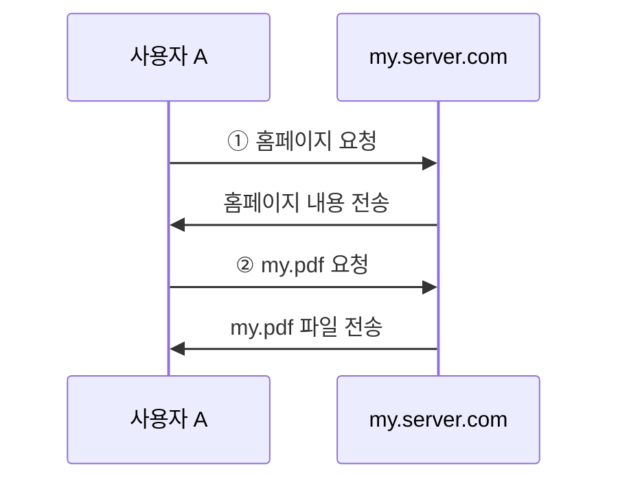

[그림 11] 사용자 A의 웹 사용 상황

<!-- PDF page: 036 -->

[그림 11]는 사용자 A가 웹 서버(my.server.com)에 접속하여 원하는 자료를 찾는 상황을 보여주며, 또한, &lt;표 1&gt;은 [그림 11]이 동작할 때 네트워크에서 어떤 변화가 일어나는지 좀 더 상세하게 단계적으로 설명한 것이다. 각 단계에서 사용된 표준 프로토콜은 괄호 안에 기술하였으며 이들 각각에 대한 개념과 상세한 동작에 대한 설명들은 다음 장에 차례대로 기술할 것이다.

본 사례를 통해, [그림 11]과 같은 간단한 네트워크 서비스가 어떻게 이루어지는지 알아보자.

① ‘홈페이지 요청’에 대한 네트워크 동작 절차

&lt;표 1&gt; 사용자 A의 웹 사용 시나리오

| 단계 | 내용 |
| --- | --- |
| 단계 1 | 사용자 A는 웹 브라우저에 http://my.server.com/을 입력한 후, ‘엔터’ 키를 누른다. |
| 단계 2 | 웹 브라우저는 웹 서버 my.server.com으로 사용자 A의 요청을 보내고 싶으나, my.server.com은 사람이 인식하기 편하게 정한 도메인 이름이어서 요청을 보낼 수 없다. 이 문제를 해결하기 위하여 도메인 이름 서버(DNS)에게 my.server.com에 대한 IP 주소를 요청한다(DNS). |
| 단계 3 | 도메인 이름 서버에게 my.server.com에 대한 IP 주소 220.17.23.15를 받은 웹 브라우저는 이 주소를 사용하여 웹 서버에 접속한 후, 문서 루트에 있는 정보를 요청한다(HTTP). |
| 단계 3-1 | my.server.com으로 요청을 하기 위하여 웹 브라우저는 TCP 프로토콜에게 요청 정보를 넘겨준다. 이 정보는 적절하게 캡슐화되어 my.server.com의 웹 서버 프로그램에 전달된다(TCP). |
| 단계 3-2 | TCP 프로토콜에서 만들어진 정보는 여러 홉의 네트워크를 거쳐 my.server.com이 있는 220.17.23.0 네트워크로 라우팅될 수 있도록 캡슐화된다(IP). |
| 단계 3-3 | 네트워크 간 라우팅을 위한 정보를 포함하여 적절하게 패킷을 만들었지만, 이 패킷은 바로 네트워크 간을 이동할 수 없어 네트워크 내에서 이동할 수 있도록 준비해야 한다. 사용자 A가 있는 컴퓨터의 IPv4 주소는 192.168.11.5로 my.server.com으로 바로 전달될 수 없어 컴퓨터의 게이트웨이인 유무선 공유기 B(192.168.11.1)로 전달하려고 한다. 그러나 IP 주소는 네트워크 안에서 전송하는 목적으로 사용할 수 없으며, 이러한 목적으로 사용되는 MAC 주소를 알아야 한다. 게이트웨이 IP 주소인 192.168.11.1에 대응하는 MAC 주소를 192.168.11.0 네트워크 내에 브로드캐스트하여 알아낸 다음, 패킷을 유무선 공유기 B로 보낸다(ARP, Ethernet, 사설 네트워크, NAT). |

<!-- PDF page: 037 -->

| 단계 | 내용 |
| --- | --- |
| 단계 3-4 | 유무선 공유기 B에서는 사용자 A의 컴퓨터에서 패킷을 받은 후, 자신에게 전송된 패킷이 아니므로 그 패킷이 어디로 전송되는 것인지 살펴본다. IP 헤더를 보면 my.server.com으로 전송되는 패킷임을 알 수 있으며, 유무선 공유기 B가 속한 네트워크 192.168.11.0과 14.32.172.0 어느 쪽에도 속한 것이 아니므로 자신이 속한 라우터 C로 전달한다(라우팅 프로토콜). |
| 단계 3-5 | 패킷을 받은 라우터 C는 자신이 속한 네트워크 220.17.23.0으로 전송되는 패킷임을 알 수 있어, 웹 서버의 IP 주소 220.17.23.15로 패킷을 전송하려고 한다. 단계 3.3에서와 마찬가지로 네트워크 내의 패킷 이동은 my.server.com의 물리 주소인 MAC 주소를 알아야 하므로 네트워크 내에 브로드캐스트하여 my.server.com의 IP 주소 220.17.23.15에 해당하는 MAC 주소를 획득하여 전송한다(ARP). |
| 단계 3-6 | 패킷을 수신한 my.server.com은 IP 주소를 보고 자신에게 온 패킷임을 알 수 있어 IP 주소 등의 헤더 정보를 제거한 후 남은 데이터를 상위 프로토콜 계층으로 올려 보낸다(IP). |
| 단계 3-7 | 웹 서버 my.server.com 내의 어떤 애플리케이션으로 전달해야 하는지 파악한 다음, 필요 없는 정보를 제거하고 해당 애플리케이션인 웹 서버 애플리케이션으로 전달한다(TCP). |
| 단계 3-8 | 웹 서버 애플리케이션에서는 문서 루트에 있는 정보를 요청하는 메시지임을 파악하고, 이에 대한 정보를 송신자인 사용자 A의 컴퓨터로 보낸다. |
| 단계 4 | 웹 서버로부터 문서 루트에 있는 정보를 받은 웹 브라우저는 이를 적절하게 표현하여 사용자 A가 볼 수 있도록 시각적으로 보여준다. 문서 내 원하는 하이퍼링크를 선택하면 동영상도 웹 브라우저에서 보는 것이 가능하다(HTTP, HTML). |

### 01 프로토콜이란?

앞의 &lt;표 1&gt;에서는 ARP, IP, TCP, HTTP, DNS, NAT 등 많은 표준 프로토콜 명칭이 소개되었다. 프로토콜이란 네트워크를 통하여 데이터를 주고 받기 위한 표준화된 통신 규약이다. 일반적으로 우리가 말하는 인터넷은 여러 대의 PC와 서버를 연결해주고 있는 하나의 네트워크가 여러 개 모여서 보다 큰 네트워크를 구성하고 있다.

수만, 수십 만 대의 PC와 서버, 이들을 연결해 주는 라우터들이 데이터를 주고 받기 위해서는 서로 이해할 수 있는 공통의 프로토콜이 필요하며 이러한 프로토콜을 표준화하는 국제 단체가 다수 존재하고 있다.

<!-- PDF page: 038 -->

- IETF(Internet Engineering Task Force)는 주로 인터넷 관련 표준 프로토콜을,
- 3GPP(Third Generation Partnership Project)와 3GPP2는 GSM, CDMA, UMTS, LTE, LTE-A와 같은 무선 통신 프로토콜을,
- ITU-T(International Telecommunication Union Telecommunication Standardization Sector)는 전화와 관련된 표준화를 진행하고 있다.

따라서 네트워크/통신 분야의 소프트웨어를 개발하기 위해서는 이러한 표준화 단체에서 제정한 표준 프로토콜을 이해하고 필요하다면 구현할 수 있는 경쟁력을 보유하고 있어야 한다.

아래 [그림 12]는 위에서 설명한 네트워크 프로토콜 개념을 반영하여 [그림 11]을 상세하게 그린 것이다. 사용자가 웹 브라우저를 통하여 검색을 하는 경우 데이터 요청과 그에 대한 응답 데이터는 네트워크에서 사용자의 컴퓨터, 유무선 공유기, 스위칭 허브, 라우터 등의 관련 프로토콜을 통하여 움직인다. 물리층은 전선, 스위치와 같은 하드웨어로 직접 연결되고 전기 신호로 동작하지만 데이터 링크층 이상의 프로토콜 계층은 소프트웨어적으로 구현되어 동작된다. 얼마나 많은 소프트웨어 컴포넌트가 서로 연결되어 동작하는지 이해할 수 있다면 네트워크를 통한 응용 프로그램 또는 시스템 소프트웨어 개발이 가능할 것이다. 뒷부분에서 단계적으로 [그림 12]에서 보이는 각 프로토콜 계층이 어떻게 연동되어 동작하는지, 보다 상세한 설명이 이루어질 것이다.

<!-- 생략: 그림 12 / 프로토콜 계층 개념을 반영한 가상 네트워크의 공간 배치와 경로 -->

| 원문 위치 | 계층·주소·장비 표기 |
| --- | --- |
| 사용자 A | 응용층, 전송층, 네트워크층, 데이터링크층, 물리층<br>192.168.11.0 |
| 유무선 공유기 B | 네트워크층, 데이터링크층, 물리층<br>14.32.172.0 |
| 라우터 C | 네트워크층, 데이터링크층, 물리층<br>220.17.23.0 |
| 스위칭허브 D | 스위칭허브 D |
| my.server.com | 응용층, 전송층, 네트워크층, 데이터링크층, 물리층<br>220.17.23.15 |

[그림 12] 프로토콜 계층 개념을 반영한 가상 네트워크

### 02 OSI 참조 모델과 TCP/IP 프로토콜 계층 구조

[그림 13]은 ISO/IEC 7498-1:1994(E) 표준 문서에 나오는 릴레이 개방 시스템을 포함한 OSI 참조 모델 통신 개념을 보여준다[8]. 네트워크를 다룰 때 흔히 말하는 ISO의 OSI 참조 모델 또는 OSI 7 계층을 말할 때 많이 나오는 그림이다. 여기서 ISO는 그리스어로 ‘동일함’을 의미하는 ‘[판독 불가]’(로마자 표기: isos)에서 유래된 것으로, 국제 표준화 기구의 영문명 ‘International Organization for Standardization(IOS)’과 혼동할 수 있으므로 유의해야 한다. OSI는 Open Systems Interconnection 즉, 개방 시스템의 상호 연결 구조를 의미한다.

<!-- PDF page: 039 -->

<!-- 생략: 그림 13 / 개방 시스템 간 계층별 연결과 물리 매체의 세부 배치 -->

| 원문 영역 | 원문 표기 |
| --- | --- |
| Open System (양쪽) | Application, Presentation, Session, Transport, Network, Data Link, Physical |
| Relay open system | Network, Data Link, Physical |
| 물리 매체 | Physical media for OSI |
| 도식 식별자 | TISO2930-94/d11 |

[그림 13] 릴레이 개방 시스템을 포함한 OSI 참조 모델 통신 개념

OSI 참조 모델의 각 계층에 해당하는 프로토콜과 기능은 &lt;표 2&gt;에서와 같이 각 계층에서 담당하고 있는 기능이 잘 정의되어 있음을 알 수 있다[1].

&lt;표 2&gt; OSI 참조 모델 각 계층의 프로토콜과 기능

| 계층 | 프로토콜 | 기능 |
| --- | --- | --- |
| 응용계층 | HTTP, SMTP, SNMP, FTP, Telent 등 | 사용자 인터페이스, 전자우편, 데이터베이스 관리 등 서비스를 제공한다. |
| 표현계층 | JPEG, MPEG, XDR 등 | 두 시스템 간 교환되는 정보의 구문(Syntax)과 시맨틱과 관련된 인코딩 변환(Translation)과 암호화(Encryption)를 지원한다. |
| 세션계층 | TLS, SSH, RPC, NetBIOS 등 | 통신 세션을 구성하는 계층으로, 통신장치 간의 상호작용을 설정하고 유지, 동기화 한다. |
| 전송계층 | TCP, UDP, SCTP 등 | 종단 프로세스 간 신뢰성 있는 메시지 전송과 오류 제어 기능을 제공한다. |
| 네트워크계층 | IP, IPX, ICMP, X.25, ARP, OSPF 등 | 발신지로부터 목적지까지 네트워크 간 패킷 전송을 지원한다. |
| 데이터링크계층 | Ethernet, Token Ring, 무선랜 등 | 오류 없이 홉(Hop) 간 프레임(Frame)을 전달하는 기능을 제공한다. |
| 물리계층 | 전파, 광섬유, PSTN 등 | 물리적 매체를 통해 실제로 비트(bit) 흐름을 전송한다 |

인터넷 프로토콜 계층은 [그림 14]에서처럼 OSI 계층 모델보다 먼저 나온 ARPANET 참조 모델에 기반하고 있다([3], [9], [10]). 문서마다 조금씩 계층에 대한 용어 표현이 다른데, 본 장에서는 가장 보편적으로 사용되는 용어를 사용한다.

#### ① 응용 계층(Application Layer)

웹(HTTP), DNS, 텔넷, FTP, 이메일 송수신(SMTP/POP3/IMAP4) 등을 포함하는 응용 프로그램이 다른 계층의 서비스에 대한 접근을 허용한다. OSI 참조 모델에서 응용 계층뿐만 아니라 표현 계층과 세션 계층도 포함하는 개념으로 보면 된다.

<!-- PDF page: 040 -->

#### ② 전송 계층(Transport Layer)

호스트 간 전송 계층(Host-to-host Transport Layer)라고도 하며, TCP, UDP, SCTP 프로토콜과 같이 응용 프로그램에서 관리하는 추상 포트 간 데이터 교환을 담당한다. OSI 참조 모델에서 전송 계층에 해당한다.

#### ③ 인터넷 계층(Internet Layer)

네트워크 계층이라고도 하며, 주소 지정(Addressing)과 라우팅(Routing) 기능을 담당한다. OSI 참조 모델에서 네트워크 계층에 해당한다.

#### ④ 네트워크 인터페이스 계층(Network Interface Layer)

네트워크 접근 계층(Network Access Layer)이라고도 하며, TCP/IP 패킷을 IEEE 802.3 이더넷이나 IEEE 802.11 WiFi 등의 물리 매체(Physical Medium)를 통하여 실질적으로 패킷을 주고 받는 역할을 한다. OSI 참조 모델의 MAC 기능을 담당하는 데이터 링크 계층뿐만 아니라 전기 신호를 정의하는 물리 계층의 기능을 포함하고 있다.

<table>
<tr><th>OSI model layers</th><th>DARPA layers</th><th>TCP/IP Protocol Suite</th></tr>
<tr><td>Application Layer<br>Presentation Layer<br>Session Layer</td><td>Application Layer</td><td>HTTP, FTP, SMTP, DNS, RIP, SNMP</td></tr>
<tr><td>Transport Layer</td><td>Transport Layer</td><td>TCP, UDP</td></tr>
<tr><td>Network Layer</td><td>Internet Layer</td><td>IGMP, ICMP, ARP, IP (IPv4)<br>ND, MLD, ICMPv6, IPv6</td></tr>
<tr><td>Data Link Layer<br>Physical Layer</td><td>Network Interface Layer</td><td>Ethernet<br>802.11 wireless LAN<br>Frame Relay<br>ATM</td></tr>
</table>

<!-- 생략: 그림 14 / 프로토콜 상자들의 세부 포함·배치 관계 -->

[그림 14] TCP/IP 프로토콜 계층: ARPANET 참조 모델 기반 [10]

[그림 13]에서도 표현되었듯이 이들 프로토콜은 네트워크로 연결된 다른 호스트의 동일 프로토콜 계층과의 통신을 규정한다. 일반적으로 통신을 위해서는 동일 계층 프로토콜 간의 정보를 주고 받기 위한 헤더와 바로 위 계층에서 내려 받은 데이터가 필요하다.

[그림 15]에서처럼 응용 계층에서 전송하려는 사용자 데이터는 상대방 호스트와 연결되는 종단 간 프로토콜인 전송계층 프로토콜 TCP(또는 UDP)를 통하여 전송 가능한데, 이때 TCP 헤더(또는 UDP 헤더)가 필요하다.

TCP 헤더를 포함한 사용자 데이터가 전달되기 위해서는 상대방 호스트가 있는 네트워크까지의 라우팅 정보를 가지고 있는 네트워크 계층 프로토콜인 IP를 사용하며, 이러한 정보를 IP 헤더가 가지고 있다.

<!-- PDF page: 041 -->

네트워크 계층에서는 전송층에서 전달받은 TCP 헤더와 사용자 데이터는 모두 데이터로 간주한다. 동일 네트워크 안의 다른 호스트로 물리적 전달을 위해 필요한 정보를 갖는 데이터링크 계층 프로토콜은 이더넷이 주로 사용되며, 이때 필요한 정보를 가진 이더넷 헤더와 네트워크 계층에서 내려 받은 IP 헤더를 포함한(TCP 헤더, 사용자 데이터) 쌍을 데이터로 간주한다. 각 계층별로 주어진 기능에 맞는 자신의 헤더만 사용한다는 점을 기억해야 한다.

| 계층 | 구성 |
| --- | --- |
| 응용계층 | 사용자 데이터 |
| 전송층 | TCP 헤더 / 사용자 데이터 |
| 네트워크층 | IP 헤더 / TCP 헤더 / 사용자 데이터 |
| 데이터링크층 | 이더넷 헤더 / IP 헤더 / TCP 헤더 / 사용자 데이터 |

[그림 15] 네트워크 프로토콜 헤더와 데이터 구성의 예

### 03 인터넷 주소 체계

인터넷을 사용하다 보면 MAC 주소, IP 주소, 포트 번호와 같이 숫자에 관련된 용어들을 많이 접하게 된다. 이런 숫자들을 그냥 외우기 보다는 그 의미를 이해하게 되면 각 계층 프로토콜을 이해하는데 많은 도움이 된다. 인터넷 주소 체계와 다음과 같이 MAC 주소, IP 주소, 포트 번호와 같은 숫자가 있다.

① MAC 주소: 데이터 링크층에서 사용하는 주소 체계인 MAC(Medium Access Control) 주소는 물리적으로 연결되어 있는 노드 간 프레임 전송에 사용된다. 보통 NIC(Network Interface Card)이라 불리는 LAN 확장 카드에 하드웨어적으로 정보가 저장되어 있으며, 물리 주소(Physical Address) 또는 이더넷 하드웨어 주소(EHA; Ethernet Hardware Address)라고도 불린다. 48비트로 구성되어 있으며, 앞의 24비트는 하드웨어 제조업체의 고유 ID, 뒤의 24비트는 NIC 종속 주소이다.

② IP 주소: 네트워크층에서 사용하는 주소 체계인 IP 주소는 두 개의 호스트/라우터 간 데이터그램 전달에 사용된다. 인터넷에 속한 여러 네트워크를 통하여 출발지 노드에서 목적지 노드로 원하는 데이터가 전달될 수 있도록 해준다. MAC 주소가 물리 주소라고 하는 것에 반하여 IP 주소는 논리 주소라고도 한다. 32비트 주소 체계로 되어 있던 기존의 IP 주소 또는 IPv4 주소는 전세계적으로 인터넷 사용이 급증함에 따라서 주소 고갈이 우려되어 128비트로 된 IPv6 주소 체계를 필요로 하게 되나, 아직까지는 IPv4 주소를 주로 사용하고 있다. IP 주소 할당은 예전에 IANA (Internet Assigned Numbers Authority)에서 담당하였으나, 요즘은 ICANN(International Corporation for Assigned Names and Numbers)에서 담당하고 있다.

③ 포트 번호: 두 개의 프로세스(실행 중인 응용 프로그램) 간 메시지 전달에 사용되는 포트 번호는 [그림 10]의 사용자 A 컴퓨터에 있는 웹 브라우저와 웹 서버 my.server.com에 있는 웹 서버 프로그램 간에 연결을 담당하고 있다고 보면 된다. 16비트로 구성되어 있어 최대 65,535개의 응용 프로그램 식별이 가능하다. 0~1023의 포트 번호는 잘 알려진 포트(well-known port)라고 하며, IANA에서 할당한다. 텔넷, 이메일 송수신 등 오랫동안 사용되고 있는 응용 프로그램에서 사용한다. 1024~49,151의 포트 번호는 등록 포트라고 하며, 잘 알려진 포트와 마찬가지로 주로 서버에서 사용된다. 인터넷 채팅 프로

<!-- PDF page: 042 -->

토콜인 IRC(TCP 포트 번호 6667), Git 버전 제어 시스템(TCP 포트 번호 9418) 등이 대표적인 예이다. 49,152~65,535의 포트 번호는 주로 클라이언트에서 임시로 사용하며, 동적 포트 또는 임시 포트라고 한다.

### 04 인터넷 표준

IETF(Internet Engineering Task Force)는 인터넷 관련 표준을 담당하는 대표적인 국제 기구이다. IP, TCP, UDP 등의 인터넷 전송 기본 프로토콜과 함께 HTTP, SSH, FTP, SMTP, POP3, IMAP 등 가장 많이 사용하고 있는 인터넷 응용 계층 프로토콜을 정의하고 있다. 이 외에도 인터넷과 관련된 표준화를 담당하고 있는 국제 기구는 &lt;표 3&gt;과 같다.

&lt;표 3&gt; 인터넷 표준화 기구

| 표준기구 | 내용 | 제정표준(예) |
| --- | --- | --- |
| ISO | 국제표준화기구(International Organization for Standardization)<br>지적 활동이나, 과학, 기술, 경제활동 분야에서 세계 상호 간의 협력을 위해 1946년 설립한 국제기구 | OSI 참조 모델 |
| ITU-T | 국제전기통신연합(International Telecommunications Union-Telecommunication Standards Sector)<br>국제전기통신 표준화부문으로 ITU의 산하기관 | ITU-T G.711 |
| IEEE | 전기전자공학회(Institute of Electrical and Electronics Engineers)<br>미국표준협회(ANSI)에 의해 미국국가표준을 개발하도록 인증 받은 전문기구 | IEEE 802.3<br>IEEE 802.11<br>IEEE 802.15 |
| EIA | 전자산업협회(Electronic Industries Association)<br>미국전자공학회, 전자기계의 치수, 측정법, 표시법 등의 규격 통일을 기획하는 단체 | TIA/EIA-568-B(T568B) |
| W3C | 월드와이드웹 컨소시엄(World Wide Web Consortium)<br>웹 표준을 제정하는 등 웹의 장기적 발전을 위해 1994년에 창립된 인터넷 관련 국제 컨소시엄 | HTML 4.01/5<br>CSS 2/3 |
| OMA | 개방형 모바일 연합(Open Mobile Alliance)<br>모바일 데이터 서비스의 범세계적 활성화를 위해 기술 규격 개발 및 상호 운용성을 검증하기 위한 포럼 | Push-to-talk over Cellular (PoC) |

#### 참고 및 추천 자료

[1] B. A. Forouzan, 이재광, 박동선, 김한규 공역, “데이터통신과 네트워킹”, 4판, 서울: 교보문고, 2007.

[2] B.A. Forouzan, “TCP/IP Protocol Suite”, 4e., NY: McgrawHill, 2010.

[3] K.R. Fall and W.R. Stevens, “TCP/IP Illustrated Vol.1: The Protocols”, 2e., Boston: Addison-Wesley, 2011.

[4] Internet Engineering Task Force (IETF), http://www.ietf.org/.

[5] 3GPP, http://www.3gpp.org/.

[6] 3GPP2, http://www.3gpp2.org/.

[7] ITU Telecommunication Standardization Sector, http://www.itu.int/en/ITU-T/Pages/default.aspx.

[8] ISO/IEC 7498-1:1994(E), 2ed., Information technology - Open Systems Interconnection - Basic Reference Model: The Basic Model, Nov. 15, 1994.

[9] M.A. Padlipsky, “A Perspective on the ARPANET Reference Model”, RFC 871, Sept. 1982.

<!-- PDF page: 043 -->

[10] Microsoft TechNet, Architectural Overview of the TCP/IP Protocol Suite. In TCP/IP Fundamentals for Windows, chapter 2, [Online]. http://technet.microsoft.com/en-us/library/bb726993.aspx, Nov. 2004.

[11] V. Rekhter et al., “Address Allocation for Private Internets”, RFC 1918, Feb. 1996.

[12] R. Hinden and B. Haberman, “Unique Local IPv6 Unicast Addresses”, RFC 4193, Oct. 2005.

[13] V. Fuller, T. Li, J. Yu and K. Varadhan, “Classless Inter-Domain Routing (CIDR): an Address Assignment and Aggregation Strategy”, RFC 1519, Sept. 1993.

[14] V. Fuller and T. Li, “Classless Inter-Domain Routing (CIDR): The Internet Address Assignment and Aggregation Plan”, RFC 4632, Aug. 2006.

[15] K. Egevang and P. Francis, “The IP Network Address Translator (NAT)”, RFC 1631, May 1994.

[16] S. Deering and R. Hinden, “Internet Protocol, Version 6 (IPv6) Specification”, RFC 2460, Dec. 1998.

[17] S. Kent and R. Atkinson, “Security Architecture for the Internet Protocol”, RFC 2401, Nov. 1998.

[18] S. Kent and K. Seo, “Security Architecture for the Internet Protocol”, RFC 4301, Dec. 2005.

<!-- PDF page: 044 -->

## III. 운영체제

### 최근 동향 및 주요 이슈

10년 전만 해도 침대에 누워 누가 웹서핑을 즐기거나 쇼핑을 하거나 영화를 보는 장면을 상상하지 못했다. 이것은 스마트폰의 등장으로 손안의 컴퓨터가 실현되었기 때문이다. 이 손안의 컴퓨터인 스마트폰도 운영체제 위에서 동작되는 하나의 컴퓨터 시스템이다. 최근에 들어 대부분의 모바일 운영체제는 사라지고 IOS와 안드로이드가 스마트폰의 주요 운영체제로 자리잡고 있다. 이 두가지의 운영체제는 여전히 다양한 기능과 편의성을 위해 전쟁 중에 있다. 이 두가지 운영체제를 제공하고 있는 애플과 구글의 시가총액은 전세계에서 10위권 안에 있는 글로벌 기업이다. 과거 스마트폰이 보급되지 않던 시대에는 퍼스널 컴퓨터를 제공하던 마이크로소프트사와 메인프레임이나 유닉스 등의 서버 운영체제를 제공하던 IBM사가 시가총액이 가장 높은 10대 기업이었다. 운영체제는 정보 서비스를 제공하기 위한 컴퓨터 시스템의 기반 플랫폼이다. 이 플랫폼을 독점한다면, 이 플랫폼을 이용하여 엄청난 부가 가치를 얻을 수 있다. 그만큼 시스템 아키텍처를 이해하기 위해서 필수적으로 알아야 할 것이 운영체제이다.

### 학습 목표

1. 운영체제의 개념과 역할에 대하여 설명할 수 있다.

2. 운영체제의 프로세스 관리방법에 대하여 설명할 수 있다.

3. 가상메모리(Virtual memory) 개념과 관리기법을 설명할 수 있다.

4. 저장장치, 파일시스템과 입출력(I/O: Input/Output)시스템에 대하여 설명할 수 있다

5. 운영체제의 최신기술과 동향에 대하여 설명할 수 있다.

### 핵심 키워드

플린의 분류, 병렬프로세싱 기술, 병렬 프로그램 기술, 디스크 스케줄링, SAN, NAS, DAS, LTO, VTL, RAID, GPGPU, 동영상 압축 표준

<!-- PDF page: 045 -->

### 실무 미리보기

컴퓨터 운용의 시작과 끝, 운영체제(Operating System)

2016년 기준 국내 컴퓨터 보급률은 85.7%로, 10명 중 8명 이상이 컴퓨터를 사용하고 있다. 같은 기간 스마트폰의 보급률은 PC보다 훨씬 빠른 속도로 성장하며 88.5%를 기록했다. 모바일 기기의 빠른 확산으로 PC의 보급률은 조금씩 떨어지고 있고, 데스크톱을 대체하는 노트북의 보급률 역시 2014년 처음 30%를 넘은 이후 계속해서 하락세다. 스마트폰과 태블릿PC가 점점 컴퓨터의 자리를 넘겨받고 있는 추세다.

데스크톱이나 노트북, 스마트폰 등의 전자기기를 '컴퓨터'로 통칭할 때, 어떤 컴퓨터든 공통으로 적용되는 것이 있다. 중요 하드웨어와 함께 없어서는 안 될 소프트웨어, 운영체제(Operating System)다. 아무리 좋은 프로세서와 부품들이 조합돼도 운영체제가 없으면 별무소용이다. 운영체제는 제조사가 만든 컴퓨터의 뛰어난 성능을 100%에 가깝게 사용자에게 전달해 주는 매개체다.

CPU, 메인보드, 메모리, 그래픽카드, 저장장치 등 컴퓨터를 구성하는 요소들은 그 자체만으로는 아무런 일을 하지 못한다. 운영체제를 통해 각 하드웨어가 어떤 작업을 수행할지 명령을 내려야 비로소 우리가 워드프로세서로 일도 하고 월드 오브 워크래프트도 즐길 수 있는 것이다.

기기의 작동을 처음부터 끝까지 책임지는 것이 소프트웨어인 운영체제의 역할이다. 전원이 공급되는 것을 인식 하는 순간부터 전원을 끄는 명령을 받아 전원 공급을 차단하는 것까지 운영체제가 해야 할 일이다. 이것이 없다면 구형 제품들처럼 아날로그 방식으로 전원을 직접 넣거나 차단해야 하고, 기기 운용을 위한 명령도 기계식으로 하나의 입력으로는 하나의 기능밖에 수행할 수 없다. 거의 대부분 전자식으로 바뀐 지금의 전자기기들도 볼륨, 전원 버튼 등이 이와 비슷한 형태를 유지하고 있다.

(출처: EPNC, 2018. 05.)

### 01 운영체제(OS, Operating System)

#### 가) 운영체제의 개요

운영체제는 제한된 컴퓨터 하드웨어 자원을 효율적으로 관리하여 사용자나 응용 프로그램에게 컴퓨터 자원의 인터페이스를 제공하는 시스템 소프트웨어이다.

최초의 컴퓨터는 운영체제가 없이 단일목적의 프로그램이 동작되게 되어 있었다. 이 형태는 컴퓨터 자원에 대한 접근을 위한 인터페이스 구현부터 자원의 할당, 회수에 대한 구현을 해야 되기 때문에 프로그램의 속도가 느리고 개발이 어려웠다. 운영체제는 입력, 제어, 기억, 연산, 출력 기능을 구현하여 컴퓨터 자원을 효율적으로 사용할 수 있도록 서비스를 제공한다. 즉, 운영체제는 컴퓨터 자원을 제어하고 사용정책을 구현하여 사용자에게 스케줄링을 통해 자원을 할당한다. 입출력 장치를 통해 데이터를 교환하거나 예외사항이나 에러에 대해 출력한다. 운영체제를 사용하는 목적은 다음과 같다.

<!-- PDF page: 046 -->

- 추상화: 컴퓨터 하드웨어의 복잡성을 추상화시켜 응용 프로그램에게 표준화된 API 제공

- 가상화: 여러 개의 응용프로그램과 여러 명의 사용자가 컴퓨터 자원을 공유하고 가상의 단독 컴퓨터 하드웨어를 사용하도록 제공하는 가상화 기능 제공

- 관리화: 컴퓨터 자원의 제약사항에 만족시키면서 컴퓨터 자원의 성능을 최대화시켜 응용 프로그램에게 제공

#### 나) 운영체제의 주요 기능

운영체제는 컴퓨터 하드웨어를 추상화, 가상화시켜 응용 프로그램에게 리소스를 제공하거나 효율적으로 관리하는 기능을 제공한다. 따라서 컴퓨터 하드웨어의 주요 구성요소를 관리하는 기능으로 나누어서 운영체제를 이해할 수 있다. 아래에서는 운영체제의 주요기능을 살펴 보도록 하자.

##### ① 프로세스 관리

단순히 생각하면 프로세스는 실행중인 프로그램이다. 하지만 단순히 프로그램이라기 보다는 하나의 프로세스는 자신의 업무를 수행하기 위해 중앙처리장치, 기억장치, 파일, 그리고 입출력장치 등의 여러 가지 자원을 할당받고 사용하고 회수하는 시스템 내의 작업 단위이다. 운영체제는 프로세스를 관리하여 다음과 같은 일을 처리한다.

- 사용자 프로세스와 시스템 프로세스의 생성과 폐기

- 프로세스의 중지와 재수행

- 프로세스 통신과 동기화를 위한 기법 제공

- 교착상태 방지를 위한 기법 제공

##### ② 주기억장치 관리

컴퓨터 하드웨어에서 일반적으로 생각하는 저장장치는 하드디스크(HDD)라고 생각할 수 있다. 하지만 주기억장치는 메인메모리이다. 중앙처리장치에서 명령어를 인출하고, 명령어에서 사용할 자료를 인출하는 저장소는 메인메모리이다. 중앙처리장치가 데이터를 직접 접근할 수 있는 모든 주소는 메인메모리의 주소밖에 없다. 중앙처리장치가 하드디스크의 데이터를 가져오려고 해도 메인메모리에 데이터를 저장하지 않으면 중앙처리장치는 데이터를 읽을 수 없다. 주기억장치는 중앙처리장치에 데이터 제공을 위해 다음과 같은 관리기능을 처리해야 한다.

- 기억장치를 사용하고 있는 공간과 사용자를 추적 관리한다.

- 기억공간을 점유할 프로세스를 결정한다.

- 기억공간을 할당하고 회수해야 한다.

##### ③ 파일 관리

운영체제는 여러 가지 물리적인 장치를 통해 정보를 저장할 수 있다. 자기 테이프, 자기 디스크, 광 디스크, 플래시 메모리 등의 물리적으로 특성이 다른 매체를 운영체제가 사용할 수 있도록 추상화시켜야 된다. 이러한 물리적인 특성을 논리적인 저장단위인 파일로 추상화하는 기능을 파일관리에서 제공한다. 파일관리를 위해 다음과 같은 일을 처리한다.

- 파일의 생성과 폐기

- 디렉토리 생성 및 폐기

- 파일과 디렉토리 관리를 위한 프리미티브 제공

- 보조 기억장치에 있는 파일을 운영체제가 이용할 수 있도록 매핑(Mapping)

- 비휘발성 저장 매체에 파일을 저장

##### ④ 입출력 시스템 관리

사용자는 운영체제를 이용하게 되면 장치에 대한 특성을 알지 못해도 장치를 사용할 수 있다. 여기서의 장치는 입출력 장치를 말하며, 마우스, 키보드, 프린터, 모니터, 스피커 등이다. 사용자는 이러한 장치를 사용할 때 운영체제가 제공하는 기능을 통해 쉽게 사용할 수 있다.

<!-- PDF page: 047 -->

##### ⑤ 보조 기억장치 관리

컴퓨터 시스템이 사용하는 데이터는 수 기가바이트(Gigabyte)에서 수 테라바이트(Terabyte)에 이르기까지 점점 커져가고 있다. 하지만 컴퓨터의 중앙처리장치에서 사용할 수 있는 데이터는 주기억장치의 데이터이다. 주기억장치에서 수 기가에서 수 테라바이트의 용량을 제공하지 않는다. 운영체제는 이러한 데이터를 저장하고 관리하기 위해 다음과 같은 보조기억장치 관리 기능을 처리한다.

- 비어 있는 공간 관리

- 저장 장소 할당

- 디스크 스케줄링

##### ⑥ 네트워킹

분산 시스템(distributed system)은 기억장치나 분리되어 있는 프로세서들의 집합이며 네트워크를 통해 각각의 프로세서는 고속으로 통신한다. 네트워크를 통해 분산되어 있는 컴퓨터 자원을 한데 모아 하나의 시스템을 만들어 계산 속도를 증가, 자료 공유, 신뢰성 강화 기능을 제공한다.

##### ⑦ 명령 해석기(Command-Interpreter) 시스템

운영체제의 주요 기능을 사용하기 위해 사용자에게 제공하는 인터페이스로 시스템 프로그램 중에 하나이다. MS-DOS나 UNIX 쉘(shell)에서 사용자가 키보드로 명령문을 입력하면 운영체제의 기능을 수행한다.

#### 다) 주요 운영체제의 종류

〈표 4〉 주요 운영체제의 종류

<table>
<tr><th>구분</th><th>운영체제</th><th>설명</th></tr>
<tr><td rowspan="2">PC운영체제</td><td>윈도우(Windows)</td><td>− Microsoft 개발<br>− 안정적이고 표준적인 GUI<br>− 다수의 3rd Party 프로그램 지원</td></tr>
<tr><td>맥OS(Mac OS)</td><td>− Apple 개발<br>− 자사 하드웨어에 최적화</td></tr>
<tr><td rowspan="2">모바일운영체제</td><td>안드로이드(Android)</td><td>− Google 개발(2005년 안드로이드사 인수)<br>− 개방성이 높음<br>− APK파일을 이용하여 설치 가능</td></tr>
<tr><td>iOS</td><td>− Apple개발<br>− 보안성이 높음<br>− 앱스토어에서만 앱설치 가능</td></tr>
<tr><td rowspan="3">서버운영체제</td><td>유닉스(UNIX)</td><td>− AT&amp;T 개발<br>− 다중사용자 환경 지원<br>− 상용제품 위주로 가격이 비싸며 서버개발사마다 전용 유닉스 운영체제를 개발하여 탑재</td></tr>
<tr><td>리눅스(Linux)</td><td>− 다양한 오픈 소스가 존재하며, 소스코드 공개<br>− 저비용으로 구축가능<br>− UNIX호환<br>− 종류: RedHat, CentOS, Ubuntu, Fedora, Suse 등</td></tr>
<tr><td>윈도우서버(Windows Server)</td><td>− Microsoft 개발<br>− Windows 인터페이스로 PC와 동일한 UI/UX 제공<br>− 지원되는 응용 프로그램이 다양함</td></tr>
</table>

<!-- PDF page: 048 -->

### 02 프로세스와 스레드

#### 가) 프로세스(Process)의 이해

초기의 컴퓨터 시스템은 한번에 하나의 응용 프로그램만 수행할 수 있었다. 즉 하나의 프로그램이 모든 시스템을 점유하고 자원을 점유하여 사용할 수 있었다. 하지만 오늘날의 컴퓨터 시스템들은 다수의 프로그램이 병행 수행된다. 운영체제에서 동작되는 다수의 프로그램이 자원을 공유하고 안정적으로 동작되게 컴퓨터 자원을 관리한다. 프로세스란 수행중인 프로그램을 의미하며 병행 수행이 가능한 오늘날의 멀티테스트 환경에서는 시분할 시스템의 작업 단위이다.

##### ① 프로세스의 상태

프로세스는 [그림 16]과 같이 생명주기 동안 구분된 프로세스 상태를 갖는다.

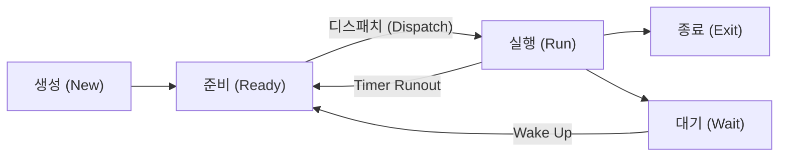

[그림 16] 프로세스의 상태변화

- 생성: 프로세스가 생성되었으나 아직 운영체제에 의해 실행 가능하게 되지 못한 상태

- 준비: 프로세스가 실행을 위해 CPU를 할당 받기를 기다리는 상태

- 실행: 프로세스가 CPU를 차지하고 있는 상태

- 종료: 프로세스의 실행이 끝나고 CPU 할당이 해제된 상태

- 대기: 프로세스가 CPU를 할당 받아 실행되다가 입/출력 완료 등과 같은 어떤 사건이 발생해 주기를 기다리고 있는 상태

##### ② 프로세스제어블록(PCB, Process Control Block)

프로세스제어블록은 운영체제가 프로세스 관리를 위해 필요한 정보를 저장하는 것으로, 프로세스가 생성될 때마다 고유의 PCB가 생성되고 프로세스가 완료되면 PCB는 제거된다. PCB에는 프로세스 식별번호(PID, Process Identification Number), 프로세스 상태, 프로그램 카운터(다음에 실행할 명령어를 가리키는 값), 스케줄링 우선 순위, 레지스터 정보, 주기억장치 관리 정보 등이 포함된다.

#### 나) 프로세스 관리를 위한 기법

##### ① 프로세스 생성(Process Creation)

프로세스는 병행 수행될 수 있어야 하며, 동적으로 생성 제거될 수 있다. 프로세스는 실행 도중에 프로세스 생성을 위한 "fork()” 시스템 호출(System Call)을 통해 여러 개의 새로운 프로세스를 생성할 수 있다. 이때 생성하는 프로세스를 부모 프

<!-- PDF page: 049 -->

로세스라고 하고 새로운 프로세스를 자식 프로세스라 부른다. 자식 프로세스도 또 다른 자식 프로세스를 생성할 수 있으며, 이러한 관계는 [그림 17]과 같이 트리 형태의 구조로 형성된다.

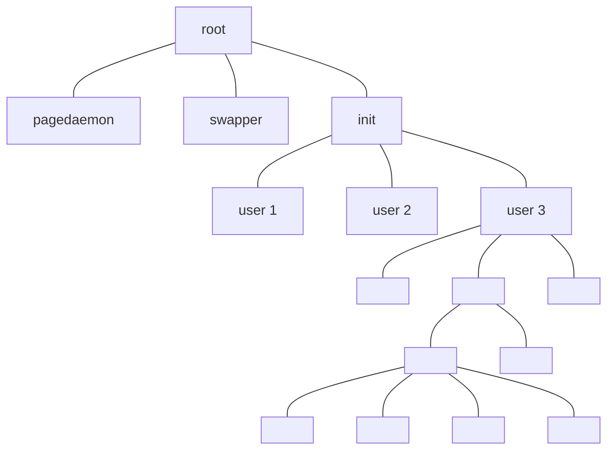

[그림 17] UNIX운영체제의 프로세스 트리구조 (예)

##### ② 프로세스 종료(Process Termination)

프로세스는 [그림 18]과 같이 프로그램의 마지막 코드의 실행을 끝내고 "exit()” 시스템 호출을 사용하여 운영체제에게 프로세스의 삭제를 요청한다. 이 시점에서 자식 프로세스는 "wait()” 시스템 호출을 통해 부모 프로세스에게 자료를 반환하며, 운영체제는 삭제되는 프로세스에 할당된 모든 자원을 회수한다.


[그림 18] UNIX 운영체제의 프로세스 생성과 종료

#### 다) 스레드(Thread)

##### ① 스레드 개념

중앙처리장치(CPU)를 사용하는 기본 단위이며, 경량 프로세스(lightweight process)라고도 한다. [그림 19]와 같이 일반적으

<!-- PDF page: 050 -->

로 프로세스는 최소 하나의 스레드를 갖는다. 스레드는 코드, 데이터, 파일 같은 기억장치를 공유하고 자신만의 레지스터와 스택을 생성한다. 프로세스는 중앙처리장치 사용시간을 문맥 교환에 스레드보다 많은 시간을 사용하지만 스레드는 기억장치를 공유하기 때문에 더욱 경제적인 문맥교환이 가능하다.

| 프로세스 | 정보 |
| --- | --- |
| 프로세스에 속한 모든 스레드에서 접근할 수 있는 정보 | 주소공간<br>기타 전역 프로세스 데이터<br>⋮ |
| 각 스레드에서만 접근할 수 있는 정보 | 레지스터<br>스택<br>마스크<br>TSD |

<!-- 생략: 그림 19 / 세 스레드가 공유 영역에 붙어 있는 공간 배치 -->

[그림 19] 스레드와 프로세스의 관계

##### ② 멀티 스레드

[그림 20]에서 알 수 있듯이 하나의 프로세스에 하나의 스레드가 존재하는 경우는 싱글스레드 프로세스라고 하고 여러 개

의 스레드가 존재하면 멀티 스레드 프로세스라고 한다. 스레드의 동작 방식은 준비, 블록, 수행, 종료의 상태로 동작한다.

중앙처리장치는 한순간에 오직 하나의 스레드만 점유할 수 있다. 즉 하나의 스레드만 수행되며 이때 스레드 상태를 블록되었다고 한다. 하나의 스레드가 블록되면 다른 스레드가 수행가능하다. 그럼 멀티스레드를 사용할 경우의 장점을 살펴보자.

- 하나의 프로세스가 점유한 메모리를 공유하여 멀티스레드에서 같은 메모리 주소로 접근 가능

- 스레드의 생성과 문맥교환 비용은 프로세스보다 경제적임

- 프로세스의 병렬성을 높여 멀티프로세서를 활용 가능

| 원문 구분 | 표시된 영역 |
| --- | --- |
| 싱글 스레드 프로세스 | 코드, 데이터, 파일<br>레지스터, 스택<br>스레드 1개 |
| 멀티 스레드 프로세스 | 코드, 데이터, 파일<br>레지스터, 스택 / 레지스터, 스택 / 레지스터, 스택<br>스레드 3개 |

<!-- 생략: 그림 20 / 스레드를 나타내는 곡선과 공유 메모리 배치 -->

[그림 20] 싱글 스레드와 멀티 스레드

<!-- PDF page: 051 -->

### 03 프로세스 동기화와 교착상태

#### 가) 프로세스 동기화(Process Synchronization)의 개념

두 개 이상의 프로세스가 동시에 처리하는 병행 프로세스가 동일한 자료를 접근하여 변경하거나, 변경하고자 하는 자료의 조작 순서가 실행된 결과에 영향을 줄 때를 경합상태(race condition)라고 한다. 경합상태에서는 하나의 프로세스만 자료를 조작하도록 보호해야 하고, 이러한 보호를 위해 프로세스 동기화가 필요하다.

#### 나) 임계구역(Critical Section) 문제

프로세스 동기화를 위해 각각의 프로세스는 코드의 일부분에 임계구역을 정의하고 이 임계구역에서 다른 프로세스와 공유하는 자료를 변경하는 작업을 수행한다. 동시에 두 개 이상의 프로세스는 그들의 임계구역 안에서 실행될 수 없는 상호 배타적 관계이다. [그림 21]은 임계구역과 잔류구역에 대한 구조를 보여준다.

```text
do {
entry section
critical section   // 임계구역
exit section
remainder section // 잔류 구역
} while (TRUE);
```

[그림 21] 프로세스 코드의 임계구역 구조

임계구역 문제는 프로세스들이 협력할 때 사용할 수 있는 규칙을 정하는 것이다. 각 프로세스는 자신의 임계구역으로 진입하는 경우에도 진입 허가를 요청해야 한다. 이런 요청을 구현하는 코드부분을 진입 구역(Entry Section)라고 하고, 임계구역 뒤에는 퇴출구역(Exit Section)이 있으며 코드의 나머지 부분을 총칭하여 잔류 구역(Remainder Section)이라 한다.

임계구역 문제의 해결 방안은 다음의 세 가지 조건을 충족해야 한다.

- 상호배제(Mutual Exclusion): 프로세스의 임계구역에서 실행된다면, 다른 프로세스들은 그들 자신의 임계구역에서 실행될 수 없다.

- 진행(progress): 임계구역에서 실행되는 프로세스가 없는 상태에서 그 임계구역으로 진입할 수 있는 프로세스는 잔류 구역에서 실행 중이지 않는 프로세스만 선택이 가능하다.

- 한정된 대기(Bounded Waiting): 프로세스가 자기의 임계구역에 진입요청을 한 후부터 임계구역에 진입될 때까지 다른 프로세스들이 임계구역에 진입할 수 있도록 허용하는 시간은 한정적이어야 한다.

#### 다) 임계구역(Critical Section) 문제 해결법

임계구역 문제는 임계구역의 공유되는 자료를 변경하는 동안에는 인터럽트 발생을 허용하지 않는 방법으로 동기화 하드웨어를 구성하는 방법이 있다. 하지만 이러한 하드웨어 방법은 다중 프로세서 환경에서는 시스템의 효율을 감소시켜 사용할 수 없다. 다른 방법은 세마포(Semaphore)를 이용하는 방법이다. 세마포는 동기화 도구로 세마포 S는 정수 변수로써, P연산(wait)과 V연산(signal)만 가능하다. 한 프로세스가 세마포 값을 수정하면 다른 프로세스는 동시에 동일한 세마포 값을 수정할 수 없다. 사용 방법은 프로세스가 임계영역에 진입할 때 세마포 값을 wait로 설정하고 임계영역을 빠져나올 때 signal로 값을 변경한다. 다른 프로세스가 세마포 값을 확인하고 wait일 때는 임계영역을 진입하지 않는 방식으로 임계영역의 공유 자료를 동시에 접근하는 것을 막는다.

<!-- PDF page: 052 -->

#### 라) 교착상태

멀티 프로그래밍 환경에서 여러 개의 프로세스들이 한정된 자원을 사용하려고 서로 경쟁하게 된다. 한 프로세스가 자원을 요청했을 때, 그 자원을 사용할 수 없다면 대기 상태가 된다. 대기중인 프로세스가 요청한 자원이 다른 대기중인 프로세스에 의해 점유되고 있기 때문에 결코 다시 프로세스 상태를 변경시킬 수 없는 경우가 발생한다. 이러한 상태를 교착 상태라고 한다.

교착 상태에 있는 프로세스들은 실행 중인 프로그램을 끝낼 수 없으며, 시스템에서도 자원이 묶여 있어서 다른 작업을 시작하는 것도 불가능하다. 이러한 교착 상태가 발생되는 조건들은 〈표 5〉와 같으며, 상호배제(Mutual exclusion), 점유와 대기(Hold & wait), 비선점(No preemption), 순환 대기(Circular wait)가 있다. 이 네 가지 조건을 모두 만족해야만 교착상태가 발생된다.

〈표 5〉 교착상태의 발생 조건

| 조건 | 내용 |
| --- | --- |
| 상호배제(Mutual Exclusion) | 한 번에 하나의 프로세스만이 공유 자원을 사용할 수 있는 상태 |
| 점유 및 대기(Hold & Wait) | 프로세스들이 현재의 자원을 점유하면서 다른 자원을 요구하는 상태 |
| 비선점(Non-Preemption) | 각 프로세스에 할당된 자원은 사용이 완료될 때까지 강제로 해제할 수 없는 상태 |
| 환형 대기(Circular Wait) | 서로 다른 프로세스 간의 자원요구가 연속적으로 반복 되는 상태 |

아래 〈표 6〉은 이러한 교착상태를 해결하는 방안에 대한 설명이다.

〈표 6〉 교착상태의 해결 방안

| 조건 | 내용 |
| --- | --- |
| 예방(Prevention) | 교착상태의 발생조건을 제거하여 사전에 미리 예방하는 방법 |
| 회피(Avoidance) | 교착상태의 발생조건을 제거하지 않고, 다만 적절하게 피해 나가는 방법 |
| 발견(Detection) | 교착상태의 발생을 허용하고, 발생 시 원인을 찾아 해결하는 방법 |
| 회복(Recovery) | 교착상태에 빠진 프로세스를 재시작하거나 원래 상태로 되돌림으로써 교착상태를 해결하는 방법 |

### 04 기억장치 관리

#### 가) 기억장치 관리의 이해

중앙처리장치는 스케줄링을 이용하여 동시에 여러 개의 프로그램이 공유하는 것처럼 이용률을 향상시켰다. 중앙처리장치는 명령어를 실행시키고 자료를 읽기 위해서 기억장치에 명령어와 자료가 저장되어 있어야 된다. 따라서 여러 개의 프로그램이 동작하기 위해서는 기억장치에 여러 개의 프로세스가 저장되어 있어야 된다. 가상기억장치(Virtual memory)는 프로세스가 기억장치 내에 존재하지 않아도 실행이 가능하도록 하는 기법이다. 또한 이 기법을 이용하면 물리적인 기억장치보다 사용자 프로그램이 커도 실행이 가능하다. 이러한 기억장치를 관리하는 여러 가지 기법들에 대해 살펴보자.

#### 나) 기억장치 관리기법

##### ① 기억장치 할당 기법

프로세스가 새로 사용되어야 할 기억장치를 요구할 때 주기억장치의 가용공간 중 어느 곳에 할당시키는 것이 가장 좋은

<!-- PDF page: 053 -->

결정인지 검색하는 기법이다. 〈표 7〉과 같이 최초 적합(First-fit), 최적 적합(Best-fit), 최악 적합(Worst-fit)은 이용 가능한 가용 공간집합에서 한 가용 공간을 선택하는데 가장 일반적으로 사용되는 기법이다.

〈표 7〉 기억장치 할당 기법

<table>
<tr><th>구분</th><td>설명</td></tr>
<tr><td>최초 적합</td><td>요구된 기억장치의 용량과 비교하여 가용공간 중에서 첫번째로 검색된 충분히 큰 가용공간을 할당시키는<br>방법이다. 이 기법을 사용하면 할당 결정을 빨리 내릴 수 있지만 단편화가 늘어 날 수 있다.</td></tr>
<tr><td>최적 적합</td><td>가용공간 중에서 요구된 기억장치 용량을 만족시킬 수 있는 가장 작은 가용공간에 할당한다. 이<br>기법은 가장 작은 또 다른 가용 공간을 만들어낸다.</td></tr>
<tr><td>최악 적합</td><td>가용공간 중 가장 큰 가용공간을 할당하는 방법이다. 이 방법은 가장 큰 가용공간에 할당하기 때문에<br>최적 적합 기법이 가장 작은 가용공간을 만들어 내는 단편화보다 더 유용하게 가용공간을 사용할 수<br>있다.</td></tr>
</table>

##### ② 단편화 문제

메모리를 요청할 경우 할당하고 다 사용한 후에는 회수하게 된다. 이렇게 할당과 회수를 반복하다보면 사용되지 않고 낭비되는 부분적인 기억공간이 생기는 현상을 말한다. 기억장치 할당 기법인 최초 적합, 최적 적합, 최악 적합 기법을 사용하면 [그림 22]와 같이 외부 단편화(external fragmentation)가 발생한다. 그림은 외부단편화의 사례로 64,500바이트의 가용 공간이 있을 경우 다음 프로세스가 64,450바이트를 요구한다고 가정하자. 이 경우 요구한 가용공간을 할당하고 남으면 50바이트의 가용공간이 남는다. 메모리를 고정크기로 분할하여 프로세스에 여러 개의 고정크기의 가용공간을 제공할 경우 요구된 공간보다 약간 클 수 있다. 이렇게 남는 공간을 [그림 23]과 같이 내부 단편화(internal fragmentation)라고 한다.

| 원문 위치 | 내용 |
| --- | --- |
| 요청 | 64,450 바이트의 가용 공간 요청 |
| 세로 배치 | 운영체제 / 프로세스 1 / 64,500 바이트의 가용 공간 영역 / 프로세스 50 |
| 가용 공간 영역 안 | 단편화 발생 (50바이트) |

<!-- 생략: 그림 22 / 메모리 영역의 면적·요청 화살표 -->

[그림 22] 외부 단편화 발생 사례

<!-- PDF page: 054 -->

| 원문 구분 | 위에서 아래 순서 |
| --- | --- |
| 가용 영역 요청 | 100,000 Byte 요청 / 내부단편화 (30,000 Byte) |
| 100,000 Byte 요청 | 고정 분할 조각 (Fixed Partition) 65,000 Byte / 65,000 Byte 사용영역 / 65,000 Byte 미사용영역 / 65,000 Byte 미사용영역 / 65,000 Byte 사용영역 |
| 100,000 Byte 할당 후 단편화 발생 | 고정 분할 조각 (Fixed Partition) 65,000 Byte / 65,000 Byte 사용영역 / 100,000 Byte 사용 / 내부단편화 (30,000 Byte) / 65,000 Byte 사용영역 |

<!-- 생략: 그림 23 / 메모리 영역의 면적과 할당 화살표 -->

[그림 23] 내부 단편화 발생 사례

##### ③ 단편화 문제 해결방법

- 압축(Compaction) 기법

압축기법은 [그림 24]와 같고 가변크기 메모리 분할 시스템에서 발생되는 외부 단편화를 제거하기 위해 사용되며, 작은 크기의 사용 메모리를 합병하는 방법이다. 구현이 복잡하고 소요시간이 오래 걸릴 수 있는 과부하로 잘 구현되지 않고 있다.

| 압축 전 (위에서 아래) | 압축 후 (위에서 아래) |
| --- | --- |
| 운영체제 / 사용중 / 20KB 미사용 / 사용중 / 10KB 미사용 / 사용중 / 50KB 미사용 | 운영체제 / 사용중 / 사용중 / 사용중 / 80KB 미사용 |

<!-- 생략: 그림 24 / 세 사용중 영역의 압축 이동 화살표 -->

[그림 24] 압축기법을 통한 단편화 문제 해결

<!-- PDF page: 055 -->

- 통합(Coalescing) 기법

통합기법은 [그림 25]와 같으며 사용되지 않고 있는 빈공간 리스트에서 주소가 인접해 있는 공간을 통합해 더 큰 공간을 만들어줌으로써 매우 작은 공간이 여러 개 발생되는 것을 막는 방법이다.

| 원문 구분 | 위에서 아래 순서 |
| --- | --- |
| 반환 전 | 운영체제 / 20KB 미사용 / 사용중 / 10KB 미사용 / 25KB 사용중 / 사용중 |
| 반환 후 | 운영체제 / 20KB 미사용 / 사용중 / 10KB 미사용 / 25KB 미사용 / 사용중 |
| 통합 후 | 운영체제 / 20KB 미사용 / 사용중 / 40KB 미사용 / 사용중 |

<!-- 생략: 그림 25 / 반환·통합 화살표와 메모리 영역의 면적 -->

[그림 25] 통합기법을 통한 단편화 문제 해결

### 05 스케줄링

다중 프로그래밍을 지원하는 운영체제에서 CPU활용의 극대화를 위해 프로세스를 효율적으로 CPU에게 할당하는 것이다.

#### 가) 스케줄링의 목적

- 프로세스의 공정성

- 단위 시간 당 처리량의 최대화

- 반응시간의 최소화

- 예측 가능한 수행 시간

- 시스템의 과부하 방지

- 균형 있는 자원 활용

- 프로세스 수행의 무한정 연기 방지

- 우선 순위 제도 실시 등

#### 나) 스케줄링 알고리즘의 종류 및 특징

스케줄링 알고리즘의 종류와 특징은 〈표 8〉을 참조한다.

- 선점형(Preemption) 스케줄링: 한 프로세스가 CPU(자원)를 점유하고 있을 때 다른 프로세스가 CPU(자원)를 빼앗을 수 있는 방식

- 비선점형 (Non-Preemption) 스케줄링: 일단 한 프로세스에게 CPU(자원)가 할당되면 작업이 완료되기 전까지는 CPU(자원)를 다른 프로세스에 할당할 수 없는 방식

<!-- PDF page: 056 -->

〈표 8〉 스케줄링 알고리즘의 종류와 특징(감리사 참조)

| 종류 | 방법 | 특징 | 구분 |
| --- | --- | --- | --- |
| FIFO (First In First Out) | − 가장 간단한 스케줄링 기법으로 CPU를 요구하는 순서에 따라 CPU를 할당하는 방식<br>− 자원 요청프로세스들의 줄(대기행렬)에 들어온 순서대로 CPU를 할당(=FCFS : First Come First Served) | − 대화형에는 부적합<br>− 간단하고 공평함<br>− 반응 속도를 예측할 수 있음 | 비선정 |
| 우선순위 (Priority) | − 각 프로세스에 우선순위를 부여하여 우선순위가 높은 프로세스에 CPU를 할당하는 방식 | − 고정적 우선순위<br>− 가변적 우선순위<br>− 구입된 우선순위 | 비선정 |
| SJF (Shortest Job First) | − 예상 작업시간이 가장 짧은 프로세스에 먼저 CPU를 할당하는 방식 | − 수행 시간이 짧은 작업에 유리하고, 큰 작업은 상당 시간이 소요됨 | 비선정 |
| SRT(Shortest Remaining Time) | − 수행 도중에 남은 작업시간 추정치가 가장 적은 프로세스에 CPU를 할당하는 방식<br>− 선정형 SJF라 할 수 있음 | − 작업 처리는 SJF와 같으나 이론적으로 가장 적은 대기 시간이 소요됨 | 비선정 |
| R-R(Round Robin) | FIFO처럼 먼저 들어온 프로세스가 먼저 실행되나 각 프로세스는 정해진 시간 동안만 CPU를 사용하는 방식 선정형 FIFO라 할 수 있음<br>시분할 처리(TSS)에 가장 적합한 방식 | − 시분할 방식에 효과적<br>− 할당 시간이 크면 FIFO와 같음<br>− 할당 시간이 작으면 문맥 교환이 자주 일어남 | 선정 |
| 마감시간(Deadline) | − 제한된 시간 내에 프로세스가 반드시 완료되도록 하는 방식 | − 마감시간을 계산해야 하므로 막대한 오버헤드와 복잡성이 발생함 | 비선정 |
| HRN(Hightest Response-ratio Next) | − SJF에서 큰 작업이 시간이 많이 걸리는 점을 보완 | − 우선 순위 = (대기시간 + 수행시간) / 수행시간 | 비선정 |
| MLQ(Multi-Level Queue) | − 서로 다른 작업을 각각의 큐에서 타임 슬라이스에 의해 처리 | − 각각의 큐는 독자적인 스케줄링 알고리즘을 사용 | 선정 |
| MFO(Multi-Level Feedback Queue) | − 하나의 준비상태 큐를 통하여 여러 개의 피드백 큐에 걸쳐 처리 | − CPU와 IO장치의 효율을 높일 수 있음 | 선정 |

### 06 가상 기억장치

운영체제의 제한된 메모리 공간 문제를 해결하기 위한 기법으로 기억 용량이 적은 주기억장치를 많은 여유 공간을 가진 대용량처럼 사용할 수 있도록 한다. 가상기억장치는 물리적으로 실제 존재하는 것이 아니고 논리적인 방법으로 대용량의 보조기억장치를 주기억장치처럼 사용한다. 따라서, 가상기억장치에 저장된 프로그램을 실행하려면 가상기억장치의 주소를 주기억장치의 주소로 매핑하는 작업이 필요하다.

#### 가) 가상기억장치의 구현 기법

가상기억장치는 프로세스에서 참조하는 가상주소(Virtual Address)와 주기억의 실제 사용 가능한 영역을 가리키는 실제주소(Physical Address)가 있다. 시스템은 프로세스가 가상주소에 접근할 때마다 메모리관리장치(MMU, Memory Management Unit)를 통해 이를 실제주소로 빠르게 변환해야 한다. 블록의 구성에 따라 페이징(Paging)기법과 세그먼테이션(Segmentation)기법으로 나뉘며, 두 가지 방법을 결합해 활용하기도 한다([그림 26] 참조).

- 페이징기법: 주기억장치를 '프레임'이라 불리는 동일한 크기로 분할하고, 가상기억장치에 보관되어 있는 처리할 작업도

<!-- PDF page: 057 -->

'페이지'라 불리는 동일한 크기로 분할하여 이를 주기억장치의 프레임에 적재시켜 실행하는 기법

- 세그먼테이션기법: 가상기억장치에 보관되어 있는 처리해야 할 작업을 다양한 크기의 논리적인 단위인 세그먼트로 분할한 후 주기억장치에 적재시켜 실행시키는 기법으로 메모리가 절약됨

| 원문 구분 | 원문 표기 |
| --- | --- |
| 페이징 | 논리 메모리 / 메모리 관리 장치(MMU) / 물리 메모리 / 분산 적재 |
| 세그먼트 메모리 관리 | 논리 메모리 / 메모리 관리 장치(MMU) / 물리 메모리 / 각각의 크기에 따른 분산 적재 |

<!-- 생략: 그림 26 / 메모리 조각의 서로 다른 크기와 물리 메모리로의 분산 적재 위치 -->

[그림 26] 페이징과 세그먼트 메모리 할당 비교

#### 나) 가상기억장치의 페이지 교체 기법

페이징을 하는 가상기억장치에서 페이지가 모두 채워져 있다면 새로운 메모리 페이지를 보조 기억 장치에서 불러 오기 전에 이를 위한 여유 공간을 만들어야 한다. 페이지 교체 기법은 시스템이 교체될 페이지를 선택하는 것으로 시스템의 효율성 및 성능에 영향을 준다.

- 최적화(Optimal)기법: 앞으로 가장 오랫동안 사용되지 않을 페이지를 교체하는 기법으로 최소의 페이지 부재율을 가지는 최적의 교체 기법이나 프로세스의 행동을 예측하기 어려우므로 현실적으로 구현이 불가능함

- 선입선출(FIFO, First In First Out)기법: 주기억장치에 적재된 순서를 추적하여 제일 처음 적재되었던 페이지를 교체하는 기법

- 최소 최근 사용(LRU, Least Recently Used)기법: 가장 오랫동안 사용되지 않은 페이지를 교체하는 기법

- 최소 사용 빈도(LFU, Least Frequently Used)기법: 각 페이지의 사용 빈도에 관심을 갖고, 가장 적게 사용되거나 집중적인 사용이 아닌 페이지가 대체됨

<!-- PDF page: 058 -->

- 최근 미사용(NUR, Not Used Recently)기법: 최근에 사용되지 않은 페이지는 가까운 미래에 사용되지 않을 확률이 높다는 경향에 따라 그것들을 참조되는 페이지와 교체하는 기법

#### 다) 가상기억장치의 성능에 영향을 미치는 요인

- 지역성(Locality, 국부성): 프로세스가 실행되는 동안 일부 페이지만 집중적으로 참조하는 성질로 시간지역성과 공간지역성으로 구분됨
- 워킹 셋(Working Set): 프로세스가 효율적으로 실행되기 위해 일정 시간 동안 자주 참조하는 페이지 리스트의 집합으로, 자주 참조되는 워킹 셋을 주기억장치에 상주시킴으로써 페이지 부재 및 페이지 교체 현상을 줄임
- 스래싱(Thrashing): 프로세스의 처리 시간보다 페이지 교체 시간이 더 많아져 CPU 이용률을 저하시키는 현상으로 스래싱을 방지하기 위해 다중 프로그래밍의 정도를 줄이고, CPU 이용률을 높이거나 워킹셋을 활용함

### 07 파일 시스템

#### 가) 파일 시스템의 이해

파일시스템은 운영체제 자료와 프로그램에 대해 쉽게 찾고 접근할 수 있도록 관련된 정보 자료를 저장하는 체계로서, 실제적인 파일들의 집합체와 시스템 내의 모든 파일에 관한 정보를 제공하는 디렉토리 구조이다.

##### ① 파일의 개념

파일은 작성자에 의해 정의된 정보의 집합체로 이름을 가진 하나의 데이터 집합이며 디스크나 테이프 등의 보조기억장치에 저장된다. 운영체제는 파일을 물리적인 장치들로 사상한다. 즉, 운영체제가 프로그램이나 자료를 파일에 기록하면 비휘발적 성질을 가지고 있는 물리적인 장치에 영구히 보존된다.

##### ② 파일의 속성

파일은 파일을 구분하고 관리하기 위해 여러가지의 속성을 가지고 있다. 대표적인 것이 파일 이름으로 하나의 문자열로 표기한다. 이 파일이름 속성을 이용하여 프로세스나 사용자가 파일을 독립적으로 생성하고 접근하여 사용할 수 있는 것이다. 파일 속성의 유형에 대해서 살펴보자.

- 이름: 사람이 판독할 수 있는 형태로 유지된 정보이어야만 함
- 위치: 파일이 존재하는 장치와 위치에 대한 포인터로 디렉토리 경로가 포함
- 크기: 파일의 현재 크기(바이트, 워드 혹은 블록)와 최대 허용 가능한 크기가 이 속성에 포함
- 보호: 접근 제어 정보는 누가 읽고, 쓰고, 실행 등을 할 수 있는가를 제어
- 시간, 날짜, 사용자 식별: 생성, 최근 정보, 최근 사용 등의 내용들을 기록

##### ③ 디렉토리 개념

파일시스템에서 관리하고 있는 기가(giga) 또는 테라(tera)바이트 단위의 용량이 가질 수 있는 수만 개의 파일을 관리하기 위한 논리적인 구조로 모든 파일들에 대한 정보를 기록한다. 디렉토리상에서 실행되는 동작들을 살펴보자.

- 파일 탐색: 사용자는 특정 파일에 대한 항목을 찾기 위하여 디렉토리 구조에서 탐색 가능
- 파일 생성: 새로운 파일들을 생성하여 디렉토리에 추가
- 파일 삭제: 더 이상 필요하지 않은 파일들을 디렉토리에서 삭제
- 디렉토리 나열: 디렉토리에 있는 파일들을 나열하고, 각 파일에 대한 디렉토리 항목의 내용을 보여줌

<!-- PDF page: 059 -->

- 파일의 재명명: 파일의 이름은 변경할 수 있어야 하고, 재명명된 파일은 변경된 디렉토리 구조 내의 한 지점에 존재해야 함

#### 나) 파일시스템의 할당 방법

명령어 파일들을 디스크의 어떤 공간에 배치하는 것이 디스크 공간을 효율적으로 사용할 수 있고 파일을 빠르게 접근할 수 있는지를 고려해야 된다. 일반적으로 운영체제의 파일시스템에서는 연속할당, 연결할당, 색인할당 방법을 사용한다.

- 연속할당

아래 [그림 27]과 같이 각 파일들을 물리적인 디스크의 연속적인 주소들의 집합으로 배치한다. 저장되는 디스크 주소는 선형적인 순서로 정의된다. 연속되는 주소로 파일이 저장되기 때문에 읽기 속도가 비교적 높다는 장점이 있다. 하지만 외부 단편화의 문제가 발생된다.

디렉토리

| file | start | length |
| --- | --- | --- |
| count | 0 | 2 |
| tr mail | 14 | 3 |
| list f | 19 | 6 |
| | 28 | 4 |
| | 6 | 2 |

<!-- 생략: 그림 27 / 0–31번 디스크 블록의 위치와 할당 영역 -->

[그림 27] 연속할당 방법

- 연결할당

아래 [그림 28]과 같이 파일을 저장할 때 블록단위로 저장하고 각각의 블록은 리스트에 연결하여 관리하는 방법이다. 디렉토리는 파일의 첫 번째와 마지막 블록들의 포인터를 가지고 있다. 그림에서 보듯이 디렉토리는 9와 25의 마지막 블록 포인트를 저장하고 있다. 9번 블록은 16번, 1번, 10번, 25번 순으로 각 블록을 연결하여 관리한다. 이 방식은 연속할당의 외부 단편화 문제는 해결할 수 있다. 하지만 연결할당 방식은 물리적인 디스크에 데이터 블록이 산재해 있어 읽기 속도가 느리고, 포인트를 저장하는 공간이 별도로 필요하다. 또한 연결 포인트 정보가 손실되거나 오류가 있을 경우 읽어오는 데이터의 오류가 발생될 수 있다.

<!-- PDF page: 060 -->

디렉토리

| file | start | end |
| --- | --- | --- |
| jeep | 9 | 25 |


<!-- 생략: 그림 28 / 0–31번 디스크 블록의 물리적 배치 -->

[그림 28] 연결할당 방법

- 색인할당

아래 [그림 29]와 같이 연결할당은 블록에 대한 포인트 주소에 대한 정보가 디스크 전반에 흩어져 있기 때문에 직접 접근을 지원할 수 없으며 손실에 대한 관리가 어려웠다. 색인할당은 파일의 모든 포인트 정보를 하나의 장소인 색인 블록으로 관리함으로써 이 문제를 해결한다. 색인할당은 외부 단편화가 발생하지 않으며, 직접 주소(Direct address)를 제공한다. 하지만 공간에 대한 낭비요소는 연결할당 방법보다 크다.

디렉토리

| 파일 | 인덱스 블럭 |
| --- | --- |
| jeep | 19 |

| 19번 색인 블록 (위에서 아래) |
| --- |
| 9 |
| 16 |
| 1 |
| 10 |
| 25 |
| -1 |
| -1 |
| -1 |

<!-- 생략: 그림 29 / 0–31번 디스크 블록의 물리적 배치와 각 색인 주소에서 해당 블록으로의 화살표 -->

[그림 29] 색인할당 방법

<!-- PDF page: 061 -->

#### 다) 운영체제별 파일시스템의 종류

| 운영체제 | 파일시스템 |
| --- | --- |
| 유닉스 | Boot Block, Super Block, Bitmap Block, i-node, Data Block |
| 리눅스 | 확장파일시스템(ext, ext2, ext3, ext4), ZFS, ResierFS, XFS |
| 솔라리스 | ZFS, UFS |
| 맥 OS | HFS, HFS+ |
| 윈도우 | FAT, NTFS |

#### 라) 유닉스(UNIX)의 i-node

유닉스 시스템에서 i-node는 파일/디렉토리의 정보를 통해 할당, 적용, 생성, 링크, 삭제의 역할을 수행한다.

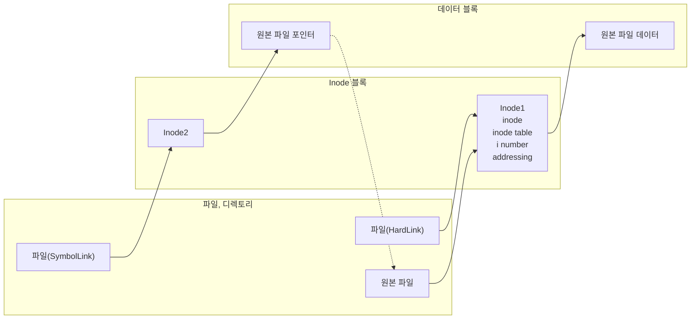

| i-node 구성요소 | 내용 |
| --- | --- |
| inode | − 한 파일이나 디렉터리의 모든 정보 포함<br>− 소유자 정보, 접근 정보, 파일 정보, 링크, 유형 |
| inode table | 한 파일 시스템에서, 파일이나 디렉터리들의 전체 inode를 갖고 있는 테이블 |
| i number | Inode가 i-list에 등록되는 entry number |
| addressing | 블록위치 정보를 13개의 필드로 관리<br>• Direct data block 10개 (0~9): 96kb data<br>• Single indirect data block 1개 (10): 16MB<br>• Double indirect data lock 1개 (11): 32GB<br>• Triple indirect data block 1개 (12): 70TB |

### 08 입출력시스템

입출력시스템은 시스템의 입출력장치와 입출력 모듈(제어기)을 포함한다. 물리적 입출력 장치는 실제 프로세서와 컴퓨터 사용자 간의 자료와 정보에 대한 입출력을 수행하며, 입출력 모듈은 프로세서가 여러 입출력 장치를 쉽게 제어할 수 있도록 입출력 장치의 제어와 타이밍 조정, 프로세서와의 통신, 입출력장치들과의 통신, 데이터 버퍼링, 오류 검출 등의 기능을 제공한다.

<!-- PDF page: 062 -->

#### 참고 및 추천 자료

[1] Harvey M. Deitel, Paul J. Deitel, David R. Choffnes 저, 송경희 역, “운영체제론”, 서울: 한빛미디어, 2015.

[2] 구현회, “운영체제(개정판)”, 서울: 한빛미디어, 2015.

[3] Silberschatz Galvin 저, 김영찬 역, “Operating System Concepts”, 홍릉과학출판사, Fifth Edition, 1999.

[4] 삼성SDS기술사회, “핵심 정보통신 기술 총서-컴퓨터구조”, 한울아카데미, 전면2 개정판. 2014.

<!-- PDF page: 063 -->

## IV. 컴퓨터 아키텍처

### 최근 동향 및 주요 이슈

컴퓨터 구조(computer architecture)는 컴퓨터 공학에서 개념의 설계요, 컴퓨터 시스템의 근간이 되는 운영 구조이다. 컴퓨터의 여러 부분에 대해 설계적으로 이식되는 것들과 요구 사항들(특히 속도와 상호 연결)이 무엇인지 기능적으로 설명되어 있는 청사진이다. 주로 중앙 처리 장치(CPU)가 메모리 주소에 내부적으로 수행하고 접근하는 방법이 집중적으로 설명된다.

현대의 컴퓨터 구조는 폰노이만 아키텍처를 근간으로 하고 있으며, 기본적인 명령어 처리구조는 큰 변화가 없이 병렬처리 등으로 성능적인 향상 노력이 있어왔으나 최근 뉴로모픽칩, 양자컴퓨터 등의 새로운 컨셉의 기술이 소개되고 있다.

### 학습 목표

1. 컴퓨터 구조와 동작원리를 설명할 수 있다.
2. 메모리 계층구조와 동작원리를 설명할 수 있다.
3. 컴퓨터 구조의 최신기술과 동향에 대하여 설명할 수 있다.

### 핵심 키워드

폰노이만 아키텍처, 하버드 아키텍처, CPU, 기억장치, 입출력장치, CISC, RISC, 뉴로모픽칩, 양자컴퓨터

<!-- PDF page: 064 -->

### 실무 미리보기 | 양자컴퓨터 개발 현황

A 기업에 근무하는 김 대리는 올해로 소프트웨어 개발 4년차가 된다. 그동안 주로 사용하는 프로그래밍 언어는 Java언어였는데, 이번에 C언어를 이용하여 프로그래밍을 해야 되는 업무를 맡게 되었다. Java 언어는 자바 가상머신(JVM)이라 불리는 실행환경에서 메모리 관리를 해주었기 때문에 프로그래밍 시점에서는 크게 메모리에 대해 신경을 쓰지 않아도 되었지만, C언어로 개발하게 되면서 메모리 할당, 반납 등 메모리 관리에 대한 개념이 필요하게 되었고 무엇보다 포인터를 통한 메모리 주소체계에 대한 부분도 익혀야 할 필요성이 생겼다. 이와 같이 컴퓨터 구조에 대해 잘 알고 있어야만 보다 효과적인 소프트웨어를 개발할 수 있다. 이번 장에서 컴퓨터 구조에 대해 좀 더 자세히 알아보도록 하자.

자료: 〈사이언스〉 2016. 12. 2

### 01 컴퓨터의 구조와 아키텍처

#### 가) 컴퓨터의 기본 구조

컴퓨터의 기본기능은 프로그램 코드를 정해진 순서대로 실행하는 것이다. 즉, 필요한 데이터를 읽어서(Read), 처리하고(Processing), 저장(Store)한다. 컴퓨터의 주요 구성요소는 [그림 30]과 같다.

- 중앙처리장치(CPU, Central Processing Unit): 프로세서(processor)라고도 하며, ‘프로그램 실행’과 ‘데이터처리’라는 중추적인 기능의 수행을 담당하는 요소
- 기억장치(Memory)
  - 주기억장치(Main Memory): CPU 가까이 위치하며, 반도체 기억장치 칩들로 구성되어 있음. 고속으로 액세스가 가능하며, 영구 저장 능력이 없기 때문에 일시적 저장장치로만 사용함
  - 보조기억장치(auxiliary storage device): 2차 기억장치로, 기계적인 장치가 포함되기 때문에 저속으로 액세스 함. 저장 밀도가 높고 저가임. 디스크, 자기 테이프 등이 해당됨

<!-- PDF page: 065 -->

- 입출력 장치(I/O Device): 입력장치(input device), 출력장치(output device)로 구성되며, 사용자와 컴퓨터 간의 대화를 위한 도구

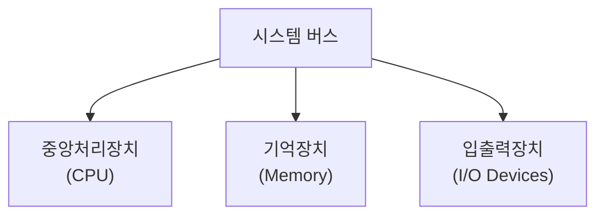

[그림 30] 컴퓨터의 구조

#### 나) 컴퓨터 아키텍처의 종류

컴퓨터 아키텍처의 종류에는 1945년 폰노이만에 의해 발표된 프로그램 내장(Stored-Program)<sup>1</sup> 설계 원리를 적용한 구조인 폰노이만 아키텍처와 명령 메모리와 데이터 메모리를 분리한 하버드 아키텍처가 있다. 두 방식은 [그림 31]과 같이 메모리 형태가 다르며, 각각의 장단점이 있다.

- 폰노이만 아키텍처: CPU는 메모리로부터 명령을 읽고, 메모리로부터 데이터를 읽고 쓰기도 한다. 명령과 데이터는 같은 신호 버스와 메모리를 사용하기 때문에 동시에 발생할 수 없다.
- 하버드 아키텍처: 서로 다른 메모리에 명령어와 데이터를 저장하여 병목현상을 해결하고, 명령어 읽기/쓰기 병행 기능으로 성능이 향상되었으나 버스 시스템의 설계가 복잡하다.

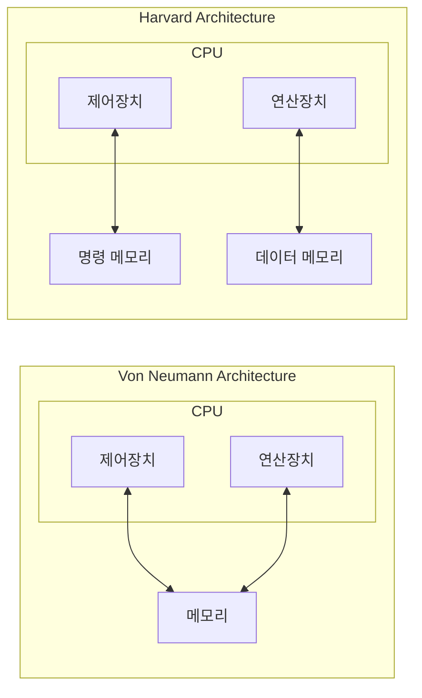

[그림 31] 폰노이만 아키텍처 vs 하버드 아키텍처

폰노이만 아키텍처와 하버드 아키텍처 간에 장단점이 있지만, 최근 고성능의 CPU를 설계할 때는 두가지 아키텍처를 모두

<small>1 CPU 옆에 기억장치(Memory)를 붙이고, 프로그램과 데이터를 기억장치에 저장 해놓았다가 실행 명령에 따라 차례로 불러내어 처리</small>

<!-- PDF page: 066 -->

도입해서 설계한다. 즉, 캐시메모리를 명령용과 데이터용으로 분리하여 [그림 32]와 같이 CPU내부(CPU와 캐시)에서는 하버드 아키텍처를 적용하고, CPU외부(CPU와 메모리)는 폰노이만 아키텍처를 적용한다.

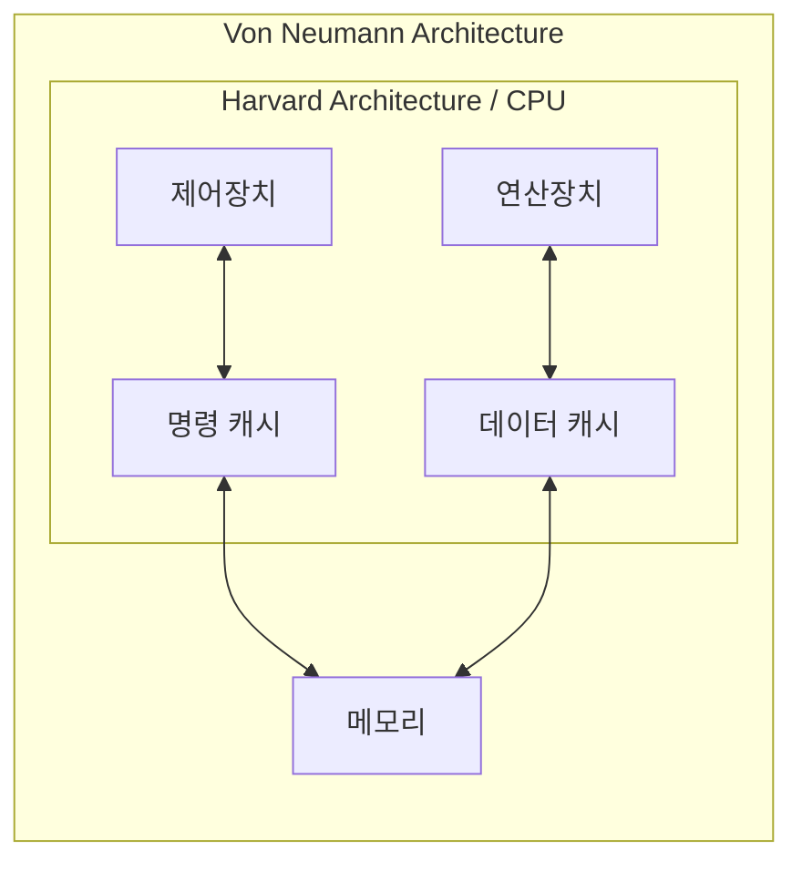

[그림 32] 두가지 아키텍처가 모두 적용된 컴퓨터 아키텍처

### 02 중앙처리장치(CPU, Central Processing Unit)

#### 가) CPU의 정의

중앙처리장치(CPU)는 컴퓨터의 가장 중요한 부분으로서 명령을 해독하고, 산술논리연산이나 데이터 처리를 실행하는 장치이며, 프로그램의 실행과 데이터를 처리하는 중추적 기능의 수행을 담당하는 요소이다.

#### 나) CPU의 수행 동작

CPU는 〈표 9〉에서 보는 바와 같이 모든 명령어들에 대하여 공통적으로 수행하는 기능과 명령어에 따라 필요한 경우에만 수행하는 기능으로 나누어 동작한다.

〈표 9〉 CPU의 수행동작

| 구분 | 세부동작 | 설명 |
| --- | --- | --- |
| 공통적 동작 | 명령어 인출(Instruction Fetch) | 기억장치로부터 명령어를 읽어옴 |
| 공통적 동작 | 명령어 해독(Instruction Decode) | 수행해야 할 동작을 결정하기 위해서 인출된 명령어를 해독 |
| 필요시 수행 | 데이터 인출(Data Fetch) | 명령어 실행을 위하여 데이터가 필요한 경우에는 기억장치 또는 입출력장치로부터 그 데이터를 읽어옴 |
| 필요시 수행 | 데이터 처리(Data Process) | 데이터에 대한 산술적 또는 논리적 연산을 수행 |
| 필요시 수행 | 데이터 쓰기(Data Store) | 실행한 결과를 저장 |

#### 다) CPU의 구성요소

중앙처리장치는 [그림 33]와 같이 제어장치, 연산장치, 레지스터 그리고 이들을 연결하여 데이터를 전달하는 버스로 구성되어 있다.

① 제어유닛(Control Unit): 프로그램 코드(명령어)를 해석하고, 그것을 실행하기 위한 제어신호들(control signals)을 순차적으

<!-- PDF page: 067 -->

로 발생하는 하드웨어 모듈

② 연산장치(ALU, Arithmetic Logic Unit): 중앙처리장치의 핵심 요소로써 산술 연산<sup>2</sup>(Arithmetic Operation)과 논리 연산<sup>3</sup>(Logic Operation)을 수행

레지스터(Register): 중앙처리장치내부에서 처리할 명령어나 연산의 중간 결과값 등을 일시적으로 기억하는 임시 기억 장소로, 레지스터의 종류에는 PC(프로그램 카운터), IR(명령어 레지스터), AC(누산기), MAR(기억장치 주소 레지스터), MBR(기억장치 버퍼 레지스터), SP(스택포인터)가 있다.

③ 버스(Bus): 중앙처리장치, 메모리, I/O 장치 등과 상호 필요한 정보를 교환하기 위해 연결하는 공동의 전송선으로 아래와 같이 구분된다.

- 주소버스: CPU가 외부로 발생하는 주소정보를 전송하는 신호 선들의 집합
- 데이터버스: CPU가 기억장치 혹은 I/O장치와 사이에 데이터를 전송하기 위한 신호선의 집합
- 제어버스: CPU가 시스템 내의 각종 요소들의 동작을 제어하는데 필요한 신호선의 집합

| 원문 위치 | 표기 |
| --- | --- |
| CPU 안 왼쪽 위에서 아래 | PC / ALU / AC |
| CPU 안 오른쪽 위에서 아래 | MAR / 제어 유니트 / IR / MBR |
| CPU 밖 왼쪽에서 오른쪽 | 주소 버스 / 데이터 버스 / 제어 버스 / 기억장치 |

<!-- 생략: 그림 33 / CPU 내부 연결선과 세 버스·기억장치 사이 연결 방향 -->

[그림 33] 중앙처리장치(CPU)의 구조

#### 라) 명령어 사이클(Instruction cycle)

CPU가 한 개의 명령어를 실행하는데 필요한 전체 처리과정으로서, CPU가 프로그램 실행을 시작한 순간부터 전원을 끄거나 회복불가능한 오류가 발생하여 중단될 때까지 반복한다. 명령어 사이클은 [그림 34]와 같이 명령어를 인출하여 연산 완료 시점까지 인출 사이클, 간접 사이클, 실행 사이클, 인터럽트 사이클로 구성된다.

<small>2 산술연산: 덧셈, 뺄셈, 곱셈, 나눗셈</small>

<small>3 논리연산: AND, OR, NOT, XOR 등</small>

<!-- PDF page: 068 -->

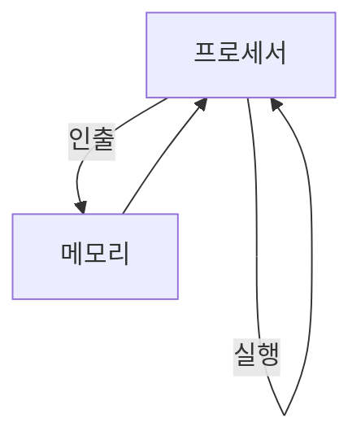

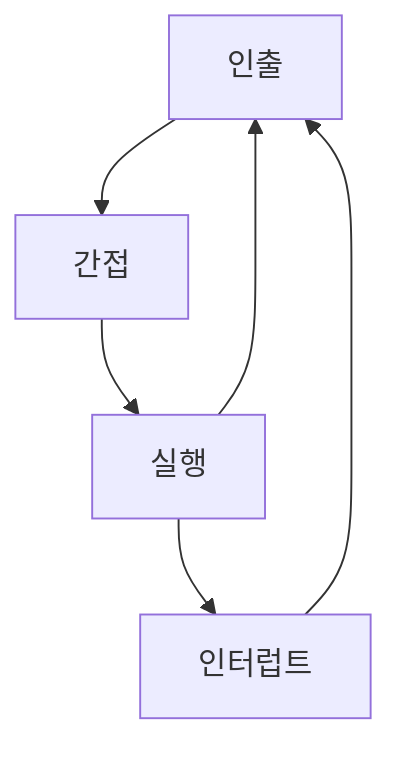

[그림 34] 명령어 사이클 개념도

전체 명령어 사이클은 〈표 10〉과 같으며, 각 사이클마다 관련되는 CPU의 구성요소가 달라진다.

〈표 10〉 명령어 사이클의 종류와 CPU 구성요소의 관계

| 구분 | 세부동작 | 관련 CPU 구성요소 |
| --- | --- | --- |
| 인출 사이클 | 프로그램 카운터(PC)가 가리키는 기억장치 위치로부터 명령어를 인출해옴 | − 레지스터(PC, MAR, MBR, IR)<br>− CPU 내부버스 |
| 실행 사이클 | CPU가 인출된 명령어 코드를 해독(Decode)하고, 그 결과에 따라 필요한 연산을 수행 | − 레지스터(AC)<br>− ALU<br>− 제어유닛 |
| 인터럽트 사이클 | 인터럽트 요구신호를 검사하고, 현재의 PC 내용을 스택에 저장한 다음에 PC에 해당 ISR의 시작주소를 적재하는 과정 | − 레지스터(MBR, PC, MAR, SP) |
| 간접 사이클 | 실행 사이클이 시작되기 전에 그 데이터의 실제 주소를 기억장치로부터 읽어오는 과정 | − 레지스터(MAR, IR, MBR)<br>− CPU 내부버스 |

#### 마) 명령어 집합구조, CISC와 RISC

명령어 집합(Instruction set) 또는 명령어 집합 구조(Instruction set architecture, ISA)는 마이크로프로세서가 인식해서 기능을 이해하고 실행할 수 있는 기계어 명령어를 말한다. 명령어 집합 구조는 자료형, 명령어, 레지스터, 어드레싱 모드, 메모리 구조, 인터럽트, 예외 처리, 외부 입출력을 포함한 프로그래밍 관련 컴퓨터 아키텍처의 일부이다.

대표적인 명령어 집합 구조로는 CISC와 RISC가 있으며, 각 구조의 개념 및 차이는 〈표 11〉과 같다.

- CISC(Complex Instruction Set Computer): 복잡한 명령처리를 하나의 명령어로 실행할 수 있도록 다수의 복잡한 명령어를 H/W화한 복합 명령형 컴퓨터
- RISC(Reduced Instruction Set Computer): 복잡한 명령을 단순한 명령어들의 조합으로 처리할 수 있도록 소수의 단순한 명령어를 H/W화한 축소 명령형 컴퓨터

<!-- PDF page: 069 -->

〈표 11〉 CISC와 RISC의 비교

시스템 구성 — CISC


시스템 구성 — RISC

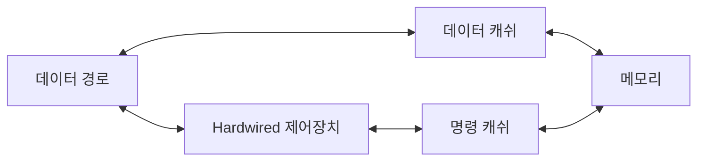

| 구분 | CISC | RISC |
| --- | --- | --- |
| 명령어 구성 | 1 Byte: OP-CODE<br>2 Byte: OP-CODE / OP-CODE<br>2 Byte: OP-CODE / OPERAND<br>3 Byte: OP-CODE / OP-CODE / OPERAND<br>3 Byte: OP-CODE / OPERAND / OPERAND<br>4 Byte: OP-CODE / OP-CODE / OPERAND / OPERAND<br>가변길이 형태로 필요한 정보만을 명령어로 저장하므로 낭비되는 코드를 줄일 수 있으며 이에 따라 프로그램 크기도 작아짐 | OP-CODE / OPERAND / OPERAND2<br>32비트로 고정<br>32비트의 고정된 명령어 길이로 파이프라인 적용이 용이함 |
| 제어장치 | Micro-Program 방식 | Hard-Wired 방식 |
| 컴파일러 | 단순한 구조 | 복잡한 구조 |
| 레지스터 수 | 적은 편 | 많은 편 |
| 활용사례 | Intel 계열(x86) | ARM, MIPS |

### 03 기억 장치(Memory)

#### 가) 기억장치의 계층구조

기억장치는 [그림 35]와 같이 상위층으로 갈수록 비트당 가격이 높아지고, 용량이 감소하며, 액세스 시간은 짧아지고, CPU에 의한 액세스 빈도는 높아진다.

| 계층 (위에서 아래) | 구분 |
| --- | --- |
| 레지스터(Register) | 내부메모리(Internal Memory) |
| 캐쉬메모리(Cache Memory) | 내부메모리(Internal Memory) |
| 주기억장치(Main Memory) | 내부메모리(Internal Memory) |
| 보조기억장치(Auxiliary Memory) | 외부메모리(External Memory) |

| 구분 | 위 | 아래 |
| --- | --- | --- |
| 접근속도 | 빠름 | 느림 |
| 비트당가격 | 고가 | 저가 |
| 저장용량 | 소량 | 대량 |

<!-- 생략: 그림 35 / 계층의 피라미드 면적 표현 -->

[그림 35] 기억장치의 계층구조

<!-- PDF page: 070 -->

#### 나) 기억장치의 성능 평가 요소

- 저장 용량(Capacity)
- 접근 시간(Access time)
- 사이클 시간(Cycle time)
- 저장장치의 대역폭(Bandwidth)
- 데이터 전송률(Transportation)
- 가격(Cost)

#### 다) 기억장치의 분류 및 특징

기억장치는 용도, 물리적 저장방식, 데이터유지, 접근방식, 내용보존 여부에 따라 다양하게 분류될 수 있다.

〈표 12〉 기억장치의 분류

| 분류 기준 | 분류 기준 | 설명 | 종류 |
| --- | --- | --- | --- |
| 용도 | 주기억장치(Main memory device) | 컴퓨터가 처리할 프로그램이나 데이터를 일시적으로 저장하는 기억장치 | RAM, ROM |
| 용도 | 보조기억장치(Auxiliary memory device) | 주기억장치의 저장용량 부족을 보완하며, 비휘발성 특징을 이용해 데이터를 반영구적으로 저장하는 기억장치 | 자기디스크, 광학디스크 등 |
| 물리적 저장 방식 | 자기(magnetic) | 자기성을 유지하여 자속의 방향에 따라서 2가지 정보를 기억하는 장치 | 자기테이프, 하드디스크, 집드라이브 등 |
| 물리적 저장 방식 | 광학(Optical) | 알루미늄 금속성 원판의 표면에 레이저 광선을 이용하여 정보를 기록하는 장치 | CD(Compact Disc), DVD(Digital Versatile Disc), BDA(Blu-Ray Disk) |
| 물리적 저장 방식 | 반도체(Semiconductor) | 직접회로기술(intergratde circuit technology)을 사용하여 아날로그 정보를 저장하는 장치 | RAM, ROM, 플래시 메모리 |
| 전원 단절시 데이터 유지 여부 | 휘발성(Volatile) | 전원이 단절되면 모든 정보가 삭제되는 메모리 | RAM 기반의 SSD(Solid State Disk) |
| 전원 단절시 데이터 유지 여부 | 비휘발성(Non-Volatile) | 전원이 단절되도 기억된 정보가 보존되는 메모리 | ROM, 자기코어, 보조기억장치 |
| 접근방식 | 순차 접근(Sequential access) | 기억 공간의 필요한 위치에 처음부터 순서대로 접근 | 자기테이프 |
| 접근방식 | 직접 접근(Direct access) | 기억 공간의 필요한 위치를 직접 접근 | 디스크, 플래시, 메모리 등 |
| 내용의 보존 여부 | 파괴성(Destructive) | 판독 후 저장된 내용이 파괴되는 메모리 | 자기코어 |
| 내용의 보존 여부 | 비파괴성(Non Destructive) | 판독 후에도 저장된 내용이 그대로 유지되는 메모리 | 자기코어를 제외한 기억장치 |

#### 라) 주소지정 방식(Addressing Mode)

주기억장치에서 자료가 저장된 위치를 주소(Address)라 하며 제한된 명령어 비트들을 적절하게 이용하여 명령어를 지정하고 기억장치의 용량을 효율적으로 사용할 수 있도록 다양한 주소지정 방식을 제공한다.

- 직접 주소지정 방식(Direct Addressing Mode)
- 간접 주소지정 방식(Indirect Addressing Mode)
- 묵시적 주소지정 방식(Implied Addressing Mode)

<!-- PDF page: 071 -->

- 즉시 주소지정 방식(Immediate Addressing Mode)
- 변위 주소지정 방식(Displacement Addressing Mode): 상대 주소지정 방식(Relative Addressing Mode), 인덱스 주소지정 방식(Indexed Addressing Mode), 베이스 레지스터 주소지정 방식(Base-register Addressing Mode)

#### 마) 지역성(Locality)

지역성은 프로그램이 기억장치 내 정보를 균일하게 접근하는 것이 아니라 한 순간에 특정 영역을 집중적으로 참조하는 특성이다.

- 시간적 지역성(temporal locality): 최근에 액세스된 프로그램이나 데이터가 가까운 미래에 다시 액세스될 가능성 높음
- 공간적 지역성(spatial locality): 기억장치 내 인접하여 저장된 데이터들이 연속적으로 액세스될 가능성이 높음
- 순차적 지역성(sequential locality): 분기 하지 않는 한, 명령어들은 기억장치에 저장된 순서대로 인출되어 실행됨(약20%)

### 04 입출력 장치

#### 가) 입출력 장치의 개념

중앙처리장치 내에서 수행할 데이터를 주기억장치 내에 기억시키는 입력동작과 수행한 결과를 주기억 장치에서 출력매체로 이동시키는 출력동작을 수행하는데 필요한 장치이다.

#### 나) I/O제어기의 구조와 주소지정 방식의 종류

입출력 처리를 위해서는 [그림 36]과 같은 I/O제어기가 필요하며, I/O제어기는 다음과 같은 역할을 수행한다.

- I/O 장치의 제어와 타이밍조절
- CPU와의 통신 담당
- I/O 장치와의 통신 담당
- 데이터버퍼링 기능 수행
- 오류검출

| 원문 위치 | 표기 |
| --- | --- |
| 왼쪽 위에서 아래 | 데이터 버스 / 주소 버스 / 제어 신호 |
| 가운데 왼쪽 위에서 아래 | 데이터 레지스터 / 상태/제어 레지스터 / 타이밍 및 제어회로 |
| 가운데 오른쪽 | I/O 제어회로 |
| 오른쪽 신호 위에서 아래 | 데이터 / 상태신호 / 제어신호 |
| 오른쪽 장치 | I/O 장치 |

<!-- 생략: 그림 36 / 버스·레지스터·제어회로 사이의 분기와 연결선 -->

[그림 36] I/O 제어기의 구조

<!-- PDF page: 072 -->

I/O제어를 위해서는 각 장치(Device)마다 2개의 주소(상태/제어 레지스터 주소, 데이터 레지스터 주소)가 필요한데, 이 주소를 할당하는 방식에 따라 Memory Mapped I/O와 I/O Mapped I/O로 구분한다.

- Memory Mapped I/O: 기억장치 주소 영역의 일부분을 I/O 제어기 내의 레지스터들의 주소로 할당하는 방식([그림 37] 참조)으로, 프로그래밍이 용이한 장점이 있으나 기억장치 공간이 감소하는 단점이 있음

| 주소 | 전체 주소 공간 |
| --- | --- |
| 0 ⋮ 511 | 기억장치 주소 공간 |
| 512 ⋮ 1023 | I/O 주소 공간 |

[그림 37] Memory Mapped I/O의 주소 할당

- I/O Mapped I/O: I/O장치 주소공간을 기억장치 주소 공간과는 별도로 할당하는 방식([그림 38] 참조)으로, I/O 주소공간으로 인하여 기억장치 주소공간이 줄어들지 않는 장점이 있으나 프로그래밍이 불편한 단점이 있음

| 기억장치 주소공간 | I/O 주소공간 |
| --- | --- |
| 0 ⋮ 1023 | 0 ⋮ 1023 |

[그림 38] I/O Mapped I/O의 주소할당

#### 다) 직접 메모리 접근(DMA)

##### ① DMA(Direct Memory Access)의 개념

DMA는 CPU의 도움없이 I/O 장치가 직접 메모리에 접근하는 방식으로, DMA컨트롤러가 버스를 제어하고 I/O와 메모리가 정보를 직접 전송한다. [그림 39]는 DMA컨트롤러가 포함된 시스템 구조이다.

DMA를 사용하면 고속의 I/O 장치의 경우 인터럽트로 CPU의 실제적인 프로세스 작업 시간이 감소하는 인터럽트 오버헤드를 최소화하여 시스템의 효율을 높일 수 있다.

<!-- PDF page: 073 -->

| 원문 위치 | 표기 |
| --- | --- |
| 위쪽 공통선 | ADDRESS BUS / ④ |
| 구성요소 왼쪽에서 오른쪽 | CPU / Memory / I/O Interface / DMA Controller (DMAC) |
| CPU 제어 핀 | HOLD: ②, ⑧ / HLDA: ③, ⑨ |
| I/O Interface와 DMAC 사이 | I/O / ①: Interface → DMAC / ⑤: DMAC → Interface |
| I/O Interface 안 | ⑦ |
| 아래 공통선 위에서 아래 | DATA BUS: ⑥ / CONTROL BUS |

<!-- 생략: 그림 39 / 공통 버스와 각 장치 사이 연결선 -->

[그림 39] DMA를 포함한 시스템 구조도

##### ② DMA의 동작순서

① I/O 인터페이스가 DMA 컨트롤러에게 DMA 서비스를 요청 전송

② CPU의 HOLD Pin에 Bus Request가 전송되어 버스에 대한 제어를 DMA가 획득(Active High)

③ CPU의 HLDA(Hold Acknowledge) Pin으로부터 DMAC에 Bus grant가 리턴됨(Active High)

④ DMAC는 Address bus에 Address Register의 Contents를 적재한다.

⑤ DMAC는 I/O Interface에게 데이터를 데이터버스에 적재하도록 DMA Acknowledgement를 전송한다.

⑥ Data Byte가 Address Bus에 의해 식별된 메모리 위치로 전송된다.

⑦ I/O Interface는 데이터를 지속적으로 전송 유지한다(Latch).

⑧ Bus Request 가 Drop되어 HOLD가 Low 상태가 되어 DMAC는 Bus에 대한 사용권을 돌려준다.

⑨ BUS Grant가 Drop되어 HLDA가 Low 상태가 된다.

⑩ 이후, Address Register가 1 증가되고, Byte Count는 1 감소된다.

⑪ Byte Count가 0이 아니면 Step ①로, 0이면 정지

##### ③ DMA의 동작모드

| 구분 | 설명 |
| --- | --- |
| 사이클스틸링(Cycle Stealing) | − DMA컨트롤러와 CPU가 동시에 Bus를 사용하고자 할 때 속도가 빠른 CPU가 속도가 느린 DMA에게 Bus 사용 우선순위를 주어 빠른 입출력이 가능하게 하는 방법<br>− 한번의 DMA동작 중 한 Word정도의 데이터를 전송 시 적용함 |
| 버스트모드(Burst mode) | − 한번의 DMA동작 중 Block 단위의 데이터 전송 시 적용함<br>− 여러 개의 메모리 워드로 구성된 블록이 지속적으로 전송됨<br>− 고속의 입출력 장치를 대상으로 하며 DMA 인터페이스가 버스사용권을 획득하면 데이터 전송이 완료될 때까지 버스사이클 독점 |

<!-- PDF page: 074 -->

### 05 최신 기술 및 동향

#### 가) 뉴로모픽칩

뉴로모픽칩은 뉴로모픽 컴퓨팅의 핵심 기술인 뉴로모픽칩은 사람의 사고 과정과 비슷하게 정보를 처리하는 새로운 반도체로 뇌의 작동방식을 최대한 실리콘에 구현하는 기술이다.

- 반도체 칩 안에는 여러 개의 ‘코어(Core)’들이 존재하며, 코어에는 트랜지스터를 포함한 몇 가지 전자 소자들과 메모리 등이 탑재
- 코어의 일부 소자는 뇌의 신경세포인 뉴런의 역할을 담당하며, 메모리칩은 뉴런과 뉴런 사이를 이어주는 시냅스 기능을 담당
- 인공 뉴런 역할을 하는 코어를 사람의 뇌처럼 병렬로 구성하였기 때문에 적은 전력만으로 많은 양의 데이터 처리가 가능하며, 인간의 뇌처럼 학습하고 연산하는 능력까지 증가

| 원문 구분 | 표기 |
| --- | --- |
| 현재의 컴퓨터 칩 | 중앙처리장치(CPU) / 전송회로(Bus) ← 병목현상 / 저장장치(메모리) |
| 뉴모로픽 반도체 | 뉴런 / 시냅스 / 통신 / 연산·저장·통신 기능 융합(병목 현상 없음) |

<!-- 생략: 그림 40 / 컴퓨터 칩·뉴런·시냅스의 그림과 배치 -->

| 기존 반도체 | | 뉴모로픽 반도체 |
| --- | --- | --- |
| • 셀(저장·연산), 밴드위스(연결) | 구조 | • 뉴런(신경기능), 시냅스(신호전달) |
| • 저장과 연산 | 강점 | • 이미지와 소리 느끼고 패턴 인식 |
| • 각각의 반도체가 정해진 기능만 수행 | 기능 | • 저장과 연산 등을 함께 처리 |
| • 직렬(입출력을 한 번에 하나씩) | 데이터 처리방식 | • 병렬(다양한 데이터 입출력을 동시에) |

[그림 40] 기존 반도체와 뉴로모픽 반도체 비교

뉴로모픽칩 컴퓨터는 기존 반도체칩 기반 컴퓨터들처럼 미리 프로그램된 방식으로만 작동하지 않고, 주변 상황을 감지하여 스스로 학습하는 방식으로 처리 능력이 발전할 수 있으며, 뉴로모픽칩 탑재를 통해 학습 및 연산 능력, 전력효율이 증대되어 IoT, 스마트폰, 로봇, 자동차, 클라우드 컴퓨팅, 슈퍼컴퓨팅에 이르기까지 모든 컴퓨팅에 지능화 적용이 가능해질 수 있다.

하지만 아직은 인간의 신경회로가 어떻게 데이터를 처리하는지 시스템 수준에서의 이해가 여전히 부족한 수준이며, 간단한 수준에서 단일 신경세포들을 모사하는 수준으로 실제 인간의 뇌와 같이 복잡하고 집적도 높은 구조를 가지기 위해서는 기술적 측면에서 해결해야 할 문제가 많다. 다양한 소재 및 구조를 갖는 뉴로모픽 프로세서 연구가 전 세계적으로 진행 중

<!-- PDF page: 075 -->

이며, 현재까지는 독보적 경쟁력을 가진 선두 그룹이 부재한 상황이다.

#### 나) 양자컴퓨터

양자컴퓨터는 양자 역학 고유의 중첩 얽힘 등의 원리에 따라 다수의 정보를 동시에 초고속으로 처리할 수 있는 새로운 개념의 컴퓨터이다.

중첩과 얽힘 등 양자 역학적 현상을 이용하여 다수의 정보를 동시에 연산할 수 있도록 구현된 컴퓨터로 특정 연산에 최적화된 초고속 대용량 컴퓨팅 기술 원리에 기반하며, 양자비트(qubit, 큐비트)를 정보처리의 기본단위로 하는 양자 병렬처리를 바탕으로 정보처리 및 연산 속도가 지수 함수적으로 증가하는 특징이 있다. 〈표 13〉과 같이 기존 컴퓨터 구조와의 차이점이 있다.

〈표 13〉 기존 컴퓨터와 양자컴퓨터의 비교

| 구분 | 기존컴퓨터 | 양자컴퓨터 |
| --- | --- | --- |
| 연산개념도 | 정보를 0이나 1로 표현 / 1개씩 순차적으로 계산 / 많은 시간 소요 | 0과 1을 중첩 / 합쳐서 한번에 계산 / 순식간에 계산 |
| 기본 단위 | Bit(0 또는 1) | Qubit |
| 연산 방법 | 논리 표에 의한 계산 | 행렬 함수에 의한 계산 |
| 외부 잡음 | 오류 정정이 쉬움 | 오류 정정이 어려움 |
| n 비트의 정보량 | 0~2ⁿ−1 중 1개 값만 기억 | 2ⁿ의 모든 값을 기억(중첩) |
| 연산 동작 처리량 | n bit ALU는 1번 연산 동작<br>① 000 / ② 001 / ③ 010 / ④ 011 / ⑤ 100 / ⑥ 101 / ⑦ 110 / ⑧ 111<br>3비트의 경우 정보처리 8회(반복 계산) | n qubit ALU는 2ⁿ 연산 동작<br>0/1, 0/1, 0/1<br>3큐비트의 경우 정보처리 1회(동시 계산) |

<!-- 생략: 표 13 / 연산개념도의 비트열 중첩과 단계별 이진수 도식 -->

양자컴퓨터는 아날로그 방식과 디지털 방식이 있다. 〈표 14〉와 같이 각 방식에 따른 특징 및 차이점이 존재한다.

〈표 14〉 양자컴퓨터의 유형 및 주요 양자컴퓨터 유형별 비교

| 구분 | 방식 | 유형 | 주요특징 |
| --- | --- | --- | --- |
| 아날로그 방식(양자 이징 머신) | 양자 어닐링 방식 | | − 범용성이 낮다(조합 최적화 계산)<br>− 2011년 D-Wave Systems가 상용화 |
| 아날로그 방식(양자 이징 머신) | 레이저 네트워크 방식 | 양자 뉴럴 네트워크(QNN)<br>… | − 범용성이 낮다(조합 최적화 계산)<br>− 상온에서 작동, 비용에 강점 |
| 디지털 방식 | 양자 게이트 방식 | 초전도 큐비트형<br>스핀 큐비트형<br>… | − 범용성이 있다(원리적으로 기존 컴퓨터에 가깝다.) |

<!-- PDF page: 076 -->

| 구분 | 구분 | 양자 어닐링 방식 | 레이저 네트워크 방식 | 양자 게이트 방식 |
| --- | --- | --- | --- | --- |
| 주요 특징 | 응용범위 | 특화형<br>• 조합 최적화/샘플링(인공지능) | 특화형<br>• 조합 최적화/샘플링(인공지능) | 범용형<br>• 인수분해(암호해독), 양자 시뮬레이션(화학) 등 다양 |
| 주요 특징 | 기술적 특징 | • 계산 원리: 해밀턴 단열 변화<br>• HW의 노이즈 내성: 높다<br>• 작동 온도: 극저온(10mk)<br>• 오류 정정 방식: 미확정 | • 계산 원리: 양자 상전이<br>• HW의 노이즈 내성: 높다<br>• 작동 온도: 상온(300k)<br>• 오류 정정 방식: 미확정<br>• 기타: 절전 성능 우수 | • 계산 원리: 상태 벡터의 유니터리 회전<br>• HW의 노이즈 내성: 약하다<br>• 작동 온도: 극저온(10mk)<br>• 오류 정정 방식: 확정 |
| 주요 특징 | 구현상황 | 약 2,000 큐비트<br>• 초전도 | 약 2,048 큐비트<br>• 광자 | 약 20 큐비트(시험 제작은 50 큐비트)<br>• 초전도, 이온, 광자, 양자점 등 |
| 상용화 상황 | 상용화 시기 | • '11년 5월 | • 미정 | • 2020–21년 상용화 예정 |
| 상용화 상황 | 개발기업/조직 | • D-Wave Systems, Google, 美 국가 프로젝트 IARPA QEO<br>• NASA, Denso 등 다수가 운용 테스트 | • 日 내각부 혁신적연구개발 추진 프로그램(ImPACT): NTT, NII(국립정보학연구소), 도쿄 대학<br>• NII-Stanford 대학 | • IBM, Google, Microsoft, Alibaba 등<br>• IBM 기초 연구 컨소시엄에 삼성전자 등 글로벌 기업 및 대학 12곳이 참여('17. 12.) |
| 상용화 상황 | 최근상황 | • D-Wave 2000Q 출시('17. 1.)<br>• 美 IAPRA, 5개 년 프로젝트(QEO) 개시('17.4.)<br>• Google Quantum Annealer Ver. 2 개발 중 | • '17년 11월 27일부터 日 ImPACAAT가 양자 뉴럴 네트워크(QNN)를 클라우드 체험할 수 있는 시스템을 공개 | • IBM이 IBM Q를 클라우드 제공. 이미 5만 4천 명, 100만 건 이상 처리<br>• Google이 '18.3월 72 큐비트 양자 프로세서 공개 |

#### 참고 및 추천 자료

[1] 김종현, “컴퓨터 구조론”, 생능출판사, 2014.

[2] 신종홍, “컴퓨터구조와 원리 2.0”, 서울, 한빛미디어, 2014.

[3] 융합연구정책센터, 융합 Weekly TIP, 두뇌 신경회로 모방 뉴로모픽칩, 2018.

[4] IITP, ICT Spot Issue 양자컴퓨터 개발동향과 시사점, 2018.

<!-- PDF page: 077 -->

## V. 데이터 처리기술

### 최근 동향 및 주요 이슈

시스템 아키텍처에서 최근에 이슈화 되고 있는 기술은 클라우드 컴퓨팅, 인공지능, 빅데이터 분야이다. 이 분야들과 연관되어 있는 학습분야가 데이터 처리기술이다. 인공지능 분야와 밀접한 관계가 있는 학습범위가 병렬처리시스템 분야이다. 빅데이터와 관련된 분야는 스토리지 기술분야이다. 클라우드 분야는 스토리지 기술, 고가용성 저장장치, 그래픽 분야이다.

### 학습 목표

1. 병렬처리 기술과 동작원리를 설명할 수 있다.
2. 스토리지 기술과 원리를 설명할 수 있다.
3. 이미지 및 영상 압축기술과 그래픽 처리기술을 설명할 수 있다.

### 핵심 키워드

플린의 분류, 병렬프로세싱 기술, 병렬 프로그램 기술, 디스크 스케줄링, SAN, NAS, DAS, LTO, VTL, RAID, GPGPU, 동영상 압축 표준

<!-- PDF page: 078 -->

### 실무 미리보기 | “인텔 vs 엔비디아 vs 구글, AI 시장 승자는? - 병렬처리능력·선점시장 기반 공략, 구글은 TPU 활용한 전력 효율성 제고 눈길”

인공지능(AI)가 4차 산업 혁명의 핵심 기술로 부각되면서 병렬처리기술에 대한 경쟁도 심화되고 있다. 기존의 프로그램들은 CPU 기반의 직렬(순차) 처리 방식으로 구현되었지만 GPU 기반의 프로그램들은 여러 개의 명령어를 동시에 처리하는 병렬처리기술을 이용하고 있어 인공지능의 딥러닝을 구현하는데 사용되고 있다. 구글에서도 TPU라는 자체 프로세서를 추가하여 병렬처리 능력을 높이고 있다.

[출처: 월간전자부품 뉴스]

### 01 병렬 처리 시스템(Parallel Processing System)

#### 가) 병렬 처리 시스템의 개념

병렬처리는 하나 또는 하나 이상의 독립된 운영체제가 여러 개의 프로세서를 관리하고 여러 작업을 처리하는 것이다. 병렬처리를 위한 프로그램 개발언어와 문법이 별도로 있다. 병렬로 처리할 경우 처리속도는 빠르며 기억장치를 공유할 수 있다. 여러 개의 프로세서로 동작되게 되어, 일부 하드웨어에서 오류가 발생하더라도 전체 시스템의 동작에는 영향이 적다. 많은 데이터와 반복적인 복잡한 연산으로 구성된 인공지능 분야, 짧은 시간에 정확한 결과를 얻어야 되는 군부대의 장비, 광범위의 데이터에서 검색하고자 하는 데이터를 빠른 시간에 추출하는 검색서비스 등에서 많이 사용되고 있다. 병렬 처리 시스템의 분류는 플린(Flynn’s taxonomy)의 분류, 메모리 구조에 따른 분류가 대표적이다.

#### 나) 병렬 처리 시스템의 플린에 의한 분류

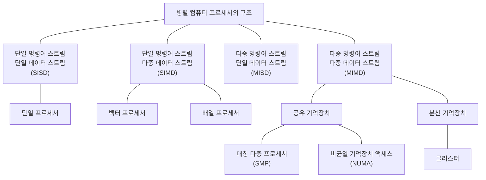

[그림 41] 병렬 컴퓨터 프로세서의 구조

<!-- PDF page: 079 -->

##### ① SISD(단일명령–단일자료, Single Instruction Stream Single Data Stream)

한 번에 한 개씩의 명령어와 데이터를 순서대로 처리하는 단일 프로세서 시스템으로 현재의 일반적인 컴퓨터 구조이며, 폰 노이만 구조에 해당된다. 제어장치가 하나의 명령을 번역한 후 처리기를 작동시켜 명령을 처리할 때 기억장치에서 하나의 자료를 꺼내서 처리한다. 각 데이터를 처리하기 위해서는 매번 명령어를 읽어야 하기 때문에 성능이 떨어진다. 성능 향상을 위해서는 파이프라이닝(Pipelining)과 슈퍼스칼라(Superscalar) 기법과 같은 동시 수행하는 방법을 이용하여 성능을 향상시킬 수 있다.

##### ② SIMD(단일명령–다중자료, Single Instruction Stream Multiple Data Stream)

하나의 명령어로 다수의 데이터들을 동시에 실행하는 구조로 다수의 데이터들에 대하여 동일한 연산을 수행한다. 배열 프로세서(Array Processor)라고도 부르며, 배열 처리기에 의한 동기적 병행 처리가 가능하다. SIMD 구조로 만들어진 인텔의 프로세스는 MMX라는 명령어 세트를 넣은 펜티엄 프로세스이다. 이름은 ‘멀티미디어 가속’인데, 실제로는 자주 쓰이는 부동소수점 연산 처리를 빠르게 처리할 수 있도록 하는 코드다. 명령어 하나로 동시에 여러 개의 연산을 처리하기 때문에 결과적으로 처리 속도가 빨라진다.

```mermaid
flowchart LR
 subgraph sisd[SISD]
 d[Data Pool] --> p[PU]
 i[Instruction Pool] --> p
 end
```

[그림 42] SISD 구조

```mermaid
flowchart LR
 subgraph simd[SIMD]
 d[Data Pool] --> p1[PU] & p2[PU] & p3[PU] & p4[PU]
 i[Instruction Pool] --> p1 & p2 & p3 & p4
 end
```

[그림 43] SIMD 구조

##### ③ MISD(복수명령–단일자료, Multiple Instruction Stream Single Data Stream)

각 프로세싱 유닛들은 서로 다른 명령어를 실행하지만, 처리되는 데이터들은 동일한 데이터를 처리하는 병렬 컴퓨팅 아키텍어이다. 파이프라인 아키텍처가 이 부류에 속한다. 많이 사용되지 않는 아키텍처이다.

##### ④ MIMD(복수명령–복수자료, Multiple Instruction Stream Multiple Data Stream)

다수의 프로세서들이 각각 다른 프로그램과 서로 다른 데이터들을 처리하는 구조로 대부분의 병렬 컴퓨터들이 이 분류에 해당된다. MIMD 구조는 어떻게 메모리를 이용하냐에 따라 공유 메모리모델과 분산 메모리 모델로 나눌 수 있다. 데이터의 상호작용 정도에 따라 공유메모리 모델을 강결합 시스템(Tightly-coupled System)이라고 하고, 분산 메모리 모델을 약결합 시스템(Loosely-coupled System)으로 분류한다.

<!-- PDF page: 080 -->

```mermaid
flowchart LR
 subgraph misd[MISD]
 d[Data Pool] --> p1[PU] & p2[PU]
 i[Instruction Pool] --> p1 & p2
 end
```

[그림 44] MISD 구조

```mermaid
flowchart LR
 subgraph mimd[MIMD]
 d[Data Pool] --> p1[PU] & p2[PU] & p3[PU] & p4[PU] & p5[PU] & p6[PU] & p7[PU] & p8[PU]
 i[Instruction Pool] --> p1 & p2 & p3 & p4 & p5 & p6 & p7 & p8
 end
```

[그림 45] MIMD 구조

#### 다) 메모리 구조에 의한 병렬 처리 시스템 분류

##### ① SMP(대칭형 다중 프로세서, Symmetric Multiprocessor)

모든 프로세서가 메인메모리를 공유메모리로 사용하는 강결합 시스템 구조로 데이터 전달은 공유메모리를 이용할 수 있어 프로그램이 용이하다. 하지만 확장의 어려움이 있고, 내부버스를 이용하여 메인 메모리에 접근하여 데이터를 공유하기 때문에 버스에 병목현상이 발생할 수 있다.

```mermaid
flowchart TB
 p1[CPU / 캐시] --- b[내부 버스]
 p2[CPU / 캐시] --- b
 m[공유 메모리] --- b
```

[그림 46] SMP 구조

##### ② MPP(거대 병렬 프로세서, Massive Parallel Processor)

프로세서 별로 독립된 메인 메모리를 가지는 분산된 메모리방식으로 내부버스나 이더넷과 같은 네트워크를 통해 프로세스 간의 데이터를 교환하는 약결합 시스템 구조이다. 개별 CPU, 메모리, 입출력장치 등의 시스템 자원을 각각 갖는 노드들을 네트워크로 연결하는 구조로 확장성이 좋으나 프로그램의 어려움이 있다.

<!-- PDF page: 081 -->

```mermaid
flowchart TB
 p1[CPU / 캐시] --- m1[메모리]
 p2[CPU / 캐시] --- m2[메모리]
 p1 --- b[내부 버스 or Ethernet]
 p2 --- b
```

[그림 47] MPP 구조

##### ③ NUMA(Non Uniform Memory Access)

프로그램 개발이 용이한 공유메모리 구조인 SMP와 프로세서의 확장성이 좋은 MPP 구조의 장점을 결합한 구조이다. 각 프로세서는 별도의 로컬 메모리를 가지고 있으며 모든 프로세서들이 접근할 수 있는 공유 메모리의 전역주소 공간(글로벌 메모리)를 가지고 있는 구조이다.

```mermaid
flowchart TB
 p1[CPU / 캐시] --- m1[메모리]
 p2[CPU / 캐시] --- m2[메모리]
 p1 --- b[내부 버스 or Ethernet]
 p2 --- b
 b --- gm[글로벌 메모리]
```

[그림 48] NUMA 구조

#### 라) 병렬 프로세서 기술의 유형

##### ① 명령어 파이프라이닝(Pipelining)

하나의 연산처리 과정을 여러 단계로 구분하고 각 단계들을 처리하기 위한 하드웨어 유닛을 별도로 구성하여 동시에 서로 다른 명령어들을 처리하도록 함으로써 중앙처리장치의 성능을 높여주는 기술이다. 즉, 한 번에 하나의 명령어만 실행하는 것이 아니라 하나의 명령어가 실행되는 도중에 다른 명령어 실행을 시작하여 동시에 여러 개의 명령어를 실행한다. 파이프라인의 유형에는 2단계 명령어 파이프라인, 4단계 명령어 파이프라인, 6단계 명령어 파이프라인이 있으며, 대표적으로 4단계 명령어 파이프라인을 살펴보자.

명령어 집합은 2단계로 되어 있으나 파이프라인 단계들의 처리 시간이 동일하지 않아서 발생하는 효율 저하를 방지하기 위해 4단계로 세분화하여 단계들의 처리 시간을 거의 같아지도록 한 것이다.

4단계 명령어 파이프라인은 명령어 인출(IF, Instruction Fetch), 명령어 해독(ID, Instruction Decode), 데이터 인출(OF, Operand Fetch), 실행(EX, Execute) 단계가 있다.

<!-- PDF page: 082 -->

```mermaid
flowchart LR
 s[명령어] --> a[IF] --> b[ID] --> c[OF] --> d[EX] --> e[실행 결과]
```

| 블록주기 | 1 | 2 | 3 | 4 | 5 | 6 | 7 | 8 | 9 |
| --- | --- | --- | --- | --- | --- | --- | --- | --- | --- |
| 명령어 1 | IF | ID | OF | EX | | | | | |
| 명령어 2 | | IF | ID | OF | EX | | | | |
| 명령어 3 | | | IF | ID | OF | EX | | | |
| 명령어 4 | | | | IF | ID | OF | EX | | |
| 명령어 5 | | | | | IF | ID | OF | EX | |
| 명령어 6 | | | | | | IF | ID | OF | EX |

[그림 49] 파이프라이닝

명령어 인출(IF) 단계는 명령어를 기억장치에서 인출하는 과정이다. 프로그램 카운터에서 제시한 기억장치 주소에서 명령어를 인출하여 명령어 레지스터로 이동시킨다. 명령어 해독 (ID)단계는 인출된 명령어를 명령어 해독기(Decoder)를 이용하여 해석한다. 오퍼랜드 인출(OF) 단계는 기억장치에서 피연산자 부분으로 연산에 사용될 변수나 데이터가 되는 오퍼랜드를 인출한다. 실행(EX) 단계는 명령어에 지정된 연산을 수행하는 단계이다.

##### ② 슈퍼스칼라 프로세스

슈퍼스칼라(Super Scalar) 프로세스는 중앙처리장치의 속도록 높이기 위해 다수의 명령어 파이프라인을 포함시킨 구조이다. 여러 파이프라인을 이용해서 독립적으로 명령어들을 실행할 수 있어 명령어들을 순서와 다르게 실행할 수 있다. 슈퍼스칼라 프로세스는 파이프라인으로 구현된 여러 개의 기능 유닛이 명령어들의 병렬 처리를 지원하는 것을 기본 구성으로 하고 있다.

```mermaid
flowchart LR
 s[명령어] --> a[IF] --> b[ID] --> c[EX] --> d[WB] --> e[실행 결과]
```

| 클록주기 | 1 | 2 | 3 | 4 | 5 | 6 |
| --- | --- | --- | --- | --- | --- | --- |
| 명령어 1 | IF | ID | EX | WB | | |
| 명령어 2 | IF | ID | EX | WB | | |
| 명령어 3 | | IF | ID | EX | WB | |
| 명령어 4 | | IF | ID | EX | WB | |
| 명령어 5 | | | IF | ID | EX | WB |
| 명령어 6 | | | IF | ID | EX | WB |

[그림 50] 슈퍼스칼라 프로세스

<!-- PDF page: 083 -->

##### ③ 파이프라인 해저드

파이프라인의 속도가 느려지는 경우가 있는데 이를 파이프라인 해저드(Pipeline Hazard)라고 한다. 파이프라인 해저드에는 데이터 해저드(Data Hazards), 제어 해저드(Control Hazard), 구조적 해저드(Structural Hazard)가 있다.

데이터 해저드는 명령어들의 피연산자 간의 의존성 때문에 이전 명령어의 수행이 완료될 때까지 다음 명령어의 실행을 연기해야 하는 경우에 발생되는 현상이다. 제어 해저드는 명령어 실행 순서를 변경하는 분기 명령어들(branch, jump)에 의해 발생된다. 구조적 해저드는 하드웨어적 제한으로 인한 동일 클럭 사이클에 명령어들을 병렬적으로 수행하지 못하는 경우 발생한다. 즉, 같은 클록 사이클에 실행하기를 원하는 명령어의 조합을 하드웨어가 지원할 수 없다는 것을 의미한다.

#### 마) 병렬 프로그래밍 기술

##### ① 컴파일러 기술–OpenMP

OpenMP는 컴파일러 디렉티브(Directive) 기반의 병렬 프로그래밍 API이다. 여기서 디렉티브 기반이라는 의미는 병렬처리를 생각하지 않고 순차적으로 작성된 프로그램에 디렉티브를 추가함으로써 원하는 부분만 병렬적으로 처리할 수 있다는 것을 의미한다. OpenMP의 수행모델은 fork/join 모델이다. 처음 프로그램은 마스터 쓰레드로 동작하고 디렉티브를 만나게 되면 쓰레드를 생성하여 쓰레드별로 독립적으로 수행하고 그러다가 병렬처리하는 부분이 끝나면(디렉티브로 선택한 영역이 끝나면) 다시 하나의 마스터 쓰레드로 합쳐져서(join) 순차 코드를 수행하는 형태이다.

##### ② 메시지 패싱 병렬프로그래밍 모델

MPI(Message Passing Interface)는 분산 메모리 시스템 구조에 적합한 병렬 프로그래밍 모델이다. MPI는 메모리 공유 방식이 아니기 때문에 노드 간에 서로 네트워크를 통해 메시지를 주고받는 형태로 정보를 공유하게 된다. 따라서 네트워크상의 통신 속도가 성능의 매우 중요한 요소로 작용하며, 고속의 연산처리를 필요로 하는 슈퍼컴퓨터에 많이 사용된다. 메시지 패싱 방식의 병렬 프로그래밍 도구로는 HPF(High Performance Fortran), PVM(Parallel Virtual Machine), MPI(Message Passing interface) 등이 있으며, 이들 중 MPI가 표준으로 자리 잡았다.

##### ③ 부하 균등화(Load balancing) 기술–AMP, SMP, BMP

잡(job)을 코어에 적절히 분배함으로써 멀티코어의 성능을 높이는 기법으로 AMP, SMP, BMP의 멀티 프로세싱 모델이 있다.

- AMP(Asymmetric multiprocessing): 각각의 프로세서 코어에 운영체제들이 독립적으로 수행됨
- SMP(Symmetric multiprocessing): 하나의 운영체제가 모든 프로세서 코어들을 동시에 관리, 응용 프로그램은 어떤 코어에서나 동작 가능함
- BMP(Bound multiprocessing) 모델: 하나의 운영체제가 모든 프로세서 코어들을 동시에 관리 하나 특정 응용 프로그램의 경우 수행할 코어가 정해져 있음

#### 바) 그래픽 처리 프로세싱 기술

##### ① GPU(Graphics Processing Unit)

컴퓨터의 그래픽스 연산을 전문적으로 담당하는 하드웨어로, 3D 그래픽스 렌더링을 하는데 주로 사용된다. GPU는 부동소수점 연산을 하는 소형의 코어 수천 개로 구성되어 있어 병렬로 데이터를 처리하므로, 소수의 코어로 구성된 CPU에 비해 그 성능이 매우 뛰어나다. 대용량 영상 데이터 처리를 위한 GPU는 많은 코어들을 이용한 병렬 작업을 통해 결과를 도출 한다. 최근 GPU는 원래 그래픽 처리 함수 위주로 사용되었으나 프로그램이 가능한 보다 유연한 형태의 GPU로 발전되었다.

<!-- PDF page: 084 -->

##### ② GPGPU(General-Purpose GPU)

GPU가 그래픽 렌더링에 주로 쓰이는 행렬과 벡터 연산에 높은 계산 성능을 보이는 것에서 기인한 것으로, 그래픽스 연산뿐 아니라 일반 컴퓨팅 영역에서도 GPU를 활용하고자 하는 컴퓨팅 체계이다. GPGPU 프로그래밍을 위해 제공되는 여러 프로그래밍 모델들이 등장하게 되었다. 대표적으로는 NVIDIA의 CUDA와 OpenACC, 크로노스 그룹의 OpenCL, 마이크로소프트사의 C++ AMP 등이 있다

| 원문 구분 | 표기 |
| --- | --- |
| CPU | ALU 4개 |
| GPU | 각 행 ALU 11개, 3행 / ⋮ / 1행 |
| CPU와 GPU 사이 | 양방향 화살표 |

<!-- 생략: 그림 51 / ALU 영역의 크기 및 배치 -->

[그림 51] CPU와 GPU의 구조 차이

#### 사) GPU 기반 병렬 프로그래밍 기술

##### ① CUDA(Compute Unified Device Architecture)

2006년 NVIDIA에서는 GPU개발을 위한 툴로 CUDA를 소개했다. CUDA는 병렬 컴퓨팅 플랫폼으로 대량의 GPU 코어로 컴퓨팅 속도를 현격히 향상시킬 수 있는 프로그래밍 모델이다. 이는 C언어 기반의 직관적인 GPI 프로그래밍을 제공하며, 공유 메모리를 사용하여 빠른 연산을 가능하게 한다. CUDA는 CUDA Runtime API와 Driver API 2가지로 구성되어 있다.

Runtime API는 설정을 비롯한 여러 필요한 값들을 자동으로 할당해 놓음으로써 사용자의 편의를 돕고자 제공되는 것이고, 실제로 Runtime API가 동작할 수 있도록 돕는 Driver API는 메모리나 장치 등 직접적인 관리가 필요한 경우, Runtime API 를 사용하지 않고 프로그래밍을 하고자 하는 경우를 위해 제공되는 것이다. 이러한 CUDA는 시뮬레이션과 같이 대량의 연산을 요구하는 다양한 분야의 병렬 처리 연산에 적합한 작업을 수행할 경우에 적용하여 뛰어난 성능 향상을 기대할 수 있다.

##### ② OpenCL(Open Computing Language)

크로노스 그룹(Khronos Group)에서 유지 및 관리되고 있는 OpenCL은 애플, AMD, IBM, 인텔, 그리고 NVIDIA에서 개발한 개방형 범용 병렬 컴퓨팅 프레임워크이다. GPU 뿐만 아니라 CPU와 기타 프로세서로 이루어진 이기종(heterogeneous) 컴퓨터 시스템을 위한 산업 표준 프로그래밍 모델이다. OpenCL은 데이터와 태스크 기반의 병렬 프로그래밍 모델이며, 오픈 스펙의 특징을 가져 GPU, CPU, 그리고 DSP 등도 함께 사용할 수 있다. OpneCL은 크게 OpenCL 컴파일러와 OpenCL 런타임 라이브러리로 구성되어 있다. 연산용 프로세서(가속기)에서 동작하는 프로그램은 OpenCL C언어로 작성하며, 이를 컴파일하여 바이너리 코드로 변환하는 도구가 바로 OpenCL 컴파일러이다. 또한 CPU에서는 연산 프로세서용 프로그램을 실행하거나 관리하기 위한 제어용 프로그램도 개발해야 하는데, 이는 OpenCL 런타임 라이브러리를 통해 C나 C++을 이용하여 작성된다.

<!-- PDF page: 085 -->

##### ③ C++ AMP(C++ Accelerated Massive Parallelism)

마이크로소프트사가 개발한 C++ AMP는 CPU와 GPU를 사용한 이기종 컴퓨팅을 위한 개방형 프로그래밍 언어이다.

Visual Studio 2012에 추가된 기능인 C++ AMP는 GPU를 이용하여 C++ 코드의 실행 속도를 높이고자 하는 목적을 가지고 있다. C++ 기반의 GPU 활용을 가능하게 하는 C++ AMP는 DirectX API에 대한 이해 수준과 응용 능력에 상관 없이 GPU를 활용한 범용 프로그래밍을 돕고자 하였다.

##### ④ Open ACC

CUDA와 같은 플랫폼의 등장으로 GPU 프로그래밍의 개념과 유용성은 널리 알려졌지만, 병렬 컴퓨팅을 잘 활용하여 현격한 성능향상을 얻으며 프로그램을 작성하기란 쉽지 않다. NVIDIA는 이러한 프로그래밍의 어려움을 해결하기 위하여, CUDA를 좀 더 추상화시킨 컴파일러 지시문 (directive) 기반 프로그래밍 모델인 OpenACC를 소개하였다. 지시어 기반의 Open ACC는 개발자에게 비교적 간편한 프로그래밍 환경을 제공하기 때문에 더 높은 생산성을 기대할 수 있는 프로그래밍 모델이다. 앞서 언급한 다른 프로그래밍 모델과 달리 운영체제와 플랫폼에서 Cross-platform의 성격을 가져 의존도가 매우 낮다는 이점 또한 가지고 있다.

### 02 스토리지 기술

#### 가) 저장장치의 개념

컴퓨터 시스템이 데이터를 접근하여 명령을 실행하기 위해 저장장치를 이용한다. 주기억장치는 메인메모리를 이용하지만 보조기억장치를 이용하여 데이터를 영구적으로 저장하고 활용한다. 정보시스템의 웹 서버, WAS, 데이터베이스에서도 모두 영구적인 보조기억장치인 저장장치가 필요하다. 웹 서버와 WAS의 운영체제를 저장하거나 응용 프로그램의 바이너리 파일이 저장되는 저장소가 필요하다. 정보시스템이 활용하는 자료는 데이터베이스를 통해 저장되고 관리되지만, 자료를 파손이나 유실되지 않게 관리하는 장치가 바로 저장장치이다.

#### 나) 저장장치와 서버의 연결

최근 멀티미디어 데이터 등의 대용량 데이터가 사용됨에 따라 컴퓨터 시스템에 저장해야 되는 데이터량이 증가되었다. 데이터 용량이 늘어남에 따라 단일 디스크로 저장할 수 있는 용량을 넘어 별도의 대용량의 스토리지 시스템을 구성해야 된다. 스토리지 시스템은 단일 디스크로 처리할 수 없는 대용량을 저장하기 위해 디스크를 묶어 논리적으로 사용하는 기술 을 말한다. 스토리지 시스템은 컴퓨터에 연결하는 방식에 따라 DAS, NAS, SAN으로 구분한다.

##### ① DAS(Direct Attached Storage)

컴퓨터 시스템과 광케이블(Fiber channel) 또는 SCSI 케이블로 직접 연결하여 스토리지 용량을 사용하고 컴퓨터 시스템에서 직접 파일시스템을 관리하게 되는 스토리지이다. 컴퓨터 시스템과 직접 연결되는 방식으로 빠른 속도의 외장하드디스크와 유사한 개념이다. 별도의 스위치가 없이 구성되며 유지보수 비용이 저렴하다는 장점은 있지만 연결할 수 있는 개수의 제한이 있다. 또한 컴퓨터 시스템과 직접 연결되기 때문에 파일시스템을 공유할 수 없다.

<!-- PDF page: 086 -->

```mermaid
flowchart LR
 s1[Server] ---|SCSI FC| m[통합 저장장치]
 s2[Server] --- m
```

[그림 52] DAS

##### ② NAS(Network Attached Storage)

스토리지 시스템은 별도의 파일시스템 관리 서버(Controller)가 저장매체(HDD, SSD 등)을 관리하는 구조로 되어 있으며, 컴퓨터 시스템은 LAN 또는 WAN과 같은 이더넷 네트워크 인터페이스(Ethernet Network Interface)를 통해 스토리지 시스템과 연결되는 구조이다. 별도의 파일시스템 관리 서버가 있어 데이터 관리의 편의성이 있으며, 다수의 서버가 저장소를 공유하여 사용할 수 있다. 또한 물리적인 위치가 같이 않아도 컴퓨터 시스템과 연결되어 사용이 가능하다. 네트워크를 통해 연결되어 네트워크의 속도에 따라 스토리지의 속도와 용량이 제한된다

```mermaid
flowchart LR
 subgraph lan["LAN, WAN 구간"]
 s1[Server 1] --- n[ATM / FDDI / Ethernet]
 s2[Server 2] --- n
 n --- f[전용파일서버]
 end
 f ---|"SCSI, FC 구간"| st[Storage]
```

[그림 53] NAS

##### ③ SAN(Storage Area Network)

DAS 방식의 단점은 스토리지 수의 제한과 관리의 어려움이 있고 NAS 방식은 네트워크 연결에 따라 속도 지연 현상이 발생되는 문제점을 가지고 있었다. 이러한 단점을 극복하기 위해 만들어진 것이 SAN이다. 별도의 전용 광 채널 스위치 (Fiber Channel Switch)를 이용하여 빠른 속도의 연결이 가능하게 되었으며, 연결되는 서버와 스토리지의 개수의 확장성을 용이하게 했으며 연결되는 네트워크 부하가 낮다. 또한 광 채널을 이용하여 고속(8Gbps~16Gbps) 연결이 가능하다.

하지만 전용 스위치와 고가의 케이블이 필요하여 비용이 상승하고 여러 컴퓨터 시스템이 특정 파일을 공유할 경우 락킹(Locking)되어 일관성의 문제가 발생된다.

<!-- PDF page: 087 -->

| 원문 위치 | 표기 |
| --- | --- |
| 위쪽 네트워크 | Storage Area Network |
| 가운데 스위치 | SAN Switch (e.g.Fiber Channel) |

<!-- 생략: 그림 54 / 이름이 없는 서버 3대와 저장장치 3대 및 연결선 -->

[그림 54] SAN

#### 다) IP-SAN

##### ① IP-SAN의 개념

Fiber(광) 채널이 아닌 기가비트 이더넷의 인터넷 프로토콜(IP)을 사용하는 SAN이다. SAN의 경우 SAN 스위치와 SAN 전용 스토리지가 필요하지만 기존의 이더넷 네트워크를 이용하여 연결할 수 있어 상호 접속성이 증대 된다. IP를 이용할 수 있어 네트워크 관리의 일원화가 되며 SAN의 거리 제약을 탈피할 수 있다. IP-SAN은 FCIP, iFCP, iSCSI가 있으며 이중 iSCSI가 많이 사용된다.

##### ② FCIP(Fiber Channel Over IP)

원격지의 SAN을 연결할 때 사용되며, 원격지의 프레임 전송할 경우 TCP/IP로 캡슐화 하여 상호 연결한다. 이전에 분리되어 있던 SAN들은 거대한 광 채널 패브릭을 생성한다. 여러 SAN들 중에서 하나의 SAN에서 손상이 발생하게 되면 패브릭에 포함되어 있는 다른 지역의 SAN 영향을 미칠 수 있다.

```mermaid
flowchart LR
 s1[SAN] ---|Tunneling| s2[SAN]
```

[그림 55] FCIP

##### ③ iFCP(Internet Fiber Channel Protocol)

iFCP 게이트웨어(Gateway)를 통해 지역 SAN 사이의 고유의 TCP/IP로 연결을 제공한다. FCIP와는 달리 하나의 거대한 패

<!-- PDF page: 088 -->

브릭을 형성하지 않기 때문에 한 지역의 손상이 다른 지역으로 영향을 주지 않는다. 게이트웨이 방식으로 게이트웨이를 이용한 프로토콜 변환방식이며, 인프라 변경없이 구축 가능하므로, 소프트웨어, 하드웨어 모두 높은 상호 접속성을 제공한다.

```mermaid
flowchart LR
 s1[SAN] --- g1[iFCP G/W] --- ip[IP N/W]
 s2[SAN] --- g2[iFCP G/W] --- ip
 s3[SAN] --- g3[iFCP G/W] --- ip
```

[그림 56] iFCP

##### ④ ISCSI(Internet SCSI)

SCSI 명령을 IP 패킷으로 캡슐화하여 I/O 블록 데이터를 TCP/IP를 통해 전달한다. IPSec 등의 기술을 통한 높은 신뢰성을 제공할 수 있다. 기존 네트워크 환경을 그대로 사용할 수 있어 네트워크 스토리지 구축 비용이 절감된다.

```mermaid
flowchart LR
 s1[SAN] --- g1[iSCSI 스위치] --- ip[IP N/W]
 s2[SAN] --- g2[iSCSI 스위치] --- ip
 s3[SAN] --- g3[iSCSI 스위치] --- ip
```

[그림 57] iSCSI

#### 라) 스토리지 용량 관리 기술

##### ① 씬 프로비저닝(Thin Provisioning)

기존 스토리지 기술은 Thick LUN(Logical Unit Number)방식의 고정 할당방식으로 데이터 저장공간을 낭비하였다. 씬 프로비저닝은 실제 데이터의 사용하는 공간을 Thin LUN으로 매핑하여 데이터를 할당하는 스토리지를 가상화한 기술이다. 클라우드컴퓨팅에서 사용자가 요구하는 디스크 공간을 유연하게 확장할 수 있으며 종래의 Thick LUN방식에 비해서 데이터 활용율이 높다.

<!-- PDF page: 089 -->

```mermaid
flowchart BT
 p[공유스토리지 POOL] --> l1["Thin LUN<br>10TB / 4TB"]
 p --> l2["Thin LUN<br>10TB / 2TB"]
 p --> l3["Thin LUN<br>10TB / 5TB"]
 l1 --- v1[VM / VM]
 l2 --- v2[VM / VM]
 l3 --- v3[VM / VM]
```

<!-- 생략: 그림 58 / Thin LUN의 점선 가상 영역과 실제 사용량의 면적 표현 -->

[그림 58] 씬 프로비저닝

##### ② 데이터 디 듀플리케이션(Data De-Duplication)

데이터 저장 시 중복 데이터를 제거하여 디스크의 공간 효율화를 제공한다. 제거방식으로는 스토리지 시스템으로 데이터가 들어가는 순간에 중복된 데이터일 경우 바로 제거하는 인라인 방식과 저장을 우선 완료한 뒤에 저장된 중복 데이터를 제거하는 오프라인 방식이 있다.

#### 마) 저장장치 디스크 스케줄링

##### ① 디스크 스케줄링

데이터를 저장하는 디스크 드라이브는 회전되는 자기 디스크를 이용하는 장치이다. 이 디스크 드라이브에 입출력을 요청하게 되면 어느 요청을 먼저 처리하고 데이터를 읽는 헤드를 어떻게 움직이냐에 따라 시스템의 성능이 크게 좌우된다. 따라서 디스크 스케줄링은 다수의 사용자가 서로 다른 작업을 처리하기 위해 디스크 드라이브에 입출력을 요청할 때, 요청을 효율적으로 처리하기 위한 기법이다. 디스크 스케줄링을 하는 목적은 다음과 같다.

- 단위 시간 동안 서비스 할 수 있는 입출력 요구의 최대화
- 단위 시간당 처리량(Throughput) 극대화
- 평균 응답시간(Mean Response Time) 최소화
- 요청 시간(Response Time)최소화
- 응답 시간 편차(Variation of response time)의 최소화

##### ② 디스크 성능 측정 지표

디스크 스케줄링은 디스크의 성능을 측정하는 지표를 기준으로 비교할 수 있다. 디스크 성능 측정 지표는 접근시간(Access Time), 탐색시간(Seek time), 회전 대기(Rotational delay or rotational latency), 데이터 전송시간(Data Transfer Time) 등이 있다.

<!-- PDF page: 090 -->

| 원문 위치 | 표기 |
| --- | --- |
| 디스크 중심 | 원래 위치 |
| 중심에서 바깥 트랙으로 향하는 화살표 | 탐색시간 |
| 트랙을 따라 이동하는 점선 | 회전대기시간 |
| 트랙 위 점 | 찾고자 하는 데이터 |

<!-- 생략: 그림 59 / 디스크 원형과 헤드 이동 궤적 -->

[그림 59] 디스크 성능 측정 지표

탐색 시간은 현재 위치하고 있는 헤드의 원래 위치에서 데이터가 있는 해당 트랙으로 헤드를 이동시키는데 걸리는 시간이다. 회전 대기 시간은 헤드가 탐색 시간 동안 해당 트랙으로 헤드를 움직인 후부터 디스크가 회전하여 찾고자 하는 데이터가 저장되어 있는 섹터에 이동하는 시간이다. 최근에는 디스크 드라이브에 내부 버퍼를 두고 해당 트랙의 데이터를 다 저장한 후 회전 대기 시간을 최소화하는 기술을 사용한다. 데이터 전송 시간은 읽은 데이터를 주 기억 장치로 전송하는 시간이다. 접근 시간은 탐색 시간, 회전 대기 시간, 데이터 전송 시간을 모두 더한 값이다. 다음에 설명하는 디스크 스케줄링은 탐색 시간, 회전대기시간을 최소화하는 방법으로 접근 시간을 최소화하는 기법들이다.

##### ③ FCFS(First Come First Service) 디스크 스케줄링

요청된 순서대로 서비스하는 방법으로 디스크의 대기 큐에 들어온 요청 트랙 순서대로 헤드의 위치를 움직여 서비스를 제공한다. 프로그램이 간단하고 모든 요청에 대해 공평한 서비스를 제공한다. 하지만 헤드 움직임이 비효율적일 수 있고 이럴 경우 응답시간이 길어지는 경향이 있다. 아무리 높은 우선순위를 가진 요청이 도착해도 실행 순서가 바뀌지 않는다.

| 그림 표기 | 내용 |
| --- | --- |
| 가로 눈금 | 1 / 14 / 37 / 53 / 60 / 120 / 183 / 250 |
| Queue | 53, 120, 183, 37, 60 |
| 초기 헤드위치 | 53 |

<!-- 생략: 그림 60 / 눈금과 정확히 정렬되지 않은 헤드 이동 궤적 -->

[그림 60] FCFS 디스크 스케줄링

##### ④ SSTF(Shortest Seek Time First) 디스크 스케줄링

요청된 서비스 중 큐에서 대기중인 요청 중에서 헤드의 현재 위치에서 가장 가까운 요청을 먼저 서비스하는 스케줄링 기법이다. 디스크 드라이브에서 헤드의 이동시간이 많이 소요된다는 것에 착안하여 헤드의 이동을 최소화하기 위한 스케줄링 기법이다. 큐의 요청을 처리하기 위해 이동거리를 최소화해 단위 시간당 서비스 응답률을 극대화 한다. 요청된 입출력 데이터가 디스크 내 어디에 위치하느냐에 따라 응답 시간의 편차가 커진다. 안쪽과 바깥쪽 실린더의 요청에 대해서는 기

<!-- PDF page: 091 -->

아현상(Starvation)이 발생될 수 있다. FCFS 보다는 처리율이 높으며, 평균 응답시간도 짧다.

| 그림 표기 | 내용 |
| --- | --- |
| 가로 눈금 | 1 / 14 / 37 / 53 / 60 / 120 / 183 / 250 |
| 큐 | 53, 120, 183, 37, 60 |
| 초기 헤드위치 | 53 |

<!-- 생략: 그림 61 / 헤드 이동 궤적 -->

[그림 61] SSTF 디스크 스케줄링

##### ⑤ SCAN 디스크 스케줄링

현재 헤드가 진행중인 방향에서 가장 짧은 탐색 거리에 있는 요청을 먼저 서비스하는 스케줄링 기법이다. SSTF의 응답시간 편차를 줄일 수 있고 일반적으로 단위 시간당 처리량 및 평균 응답시간이 우수하다. 헤드는 진행방향이 결정되면 요청 큐에서 탐색 거리가 가장 짧은 순서에 따라 같은 방향의 모든 요청을 모두 서비스 한 후, 가장 바깥쪽이나 안쪽 실린더에 도달한 후에 탐색 방향을 변경한다. SSTF보다 단위 시간당 처리량과 응답시간을 많이 개선하였으며 기아현상 발생을 해결하였다.

| 그림 표기 | 내용 |
| --- | --- |
| 가로 눈금 | 1 / 14 / 37 / 53 / 60 / 120 / 183 / 250 |
| Queue | 53, 120, 183, 37, 60 |
| 초기 헤드위치 | 53 |

<!-- 생략: 그림 62 / 헤드 이동 궤적 -->

[그림 62] SCAN 디스크 스케줄링

##### ⑥ LOOK 디스크 스케줄링

SCAN 디스크 스케줄링의 기법과 동일하지만 헤드가 실린더의 가장 안쪽과 바깥쪽으로 이동하지 않고 방향을 변경하는 스케줄링 기법이다. 헤드가 진행하는 도중에 대기 큐를 확인했을 때, 진행방향의 요청이 더 이상 없다면 양끝의 실린더까지 헤드가 이동하지 않고 바로 방향을 변경한다.

| 그림 표기 | 내용 |
| --- | --- |
| 가로 눈금 | 1 / 14 / 37 / 53 / 60 / 120 / 183 / 250 |
| Queue | 53, 120, 183, 37, 60 |
| 초기 헤드위치 | 53 |

<!-- 생략: 그림 63 / 헤드 이동 궤적 -->

[그림 63] LOOK 디스크 스케줄링

<!-- PDF page: 092 -->

##### ⑦ C-SCAN(Circular SCAN) 디스크 스케줄링

Look 디스크 스케줄링은 안쪽과 바깥쪽 트랙을 환형(Circular) 모형으로 연결하여 헤드가 움직이도록 하는 SCAN 기법이다. 이 기법은 SCAN 디스크 스케줄링과 동일하게 헤드의 이동 방향의 가장 짧은 거리의 요청을 먼저 처리하면서 진행방향의 모든 요청을 처리한 후에 헤드가 처음 시작 방향으로 이동해 요청을 처리하는 스케줄링 기법이다. 미리 정해진 서비스 방향으로 헤드가 이동하면서 요청에 대해 서비스를 처리한다. SCAN 스케줄링을 개선해 입출력 요청에 균등하게 응답하는 기법으로 응답시간 편차가 매우 적어 응답시간에 대한 예측이 용이하다.

##### ⑧ C-LOOK(Circular LOOK) 디스크 스케줄링

C-SCAN과 유사하게 안쪽과 바깥쪽 트랙을 환형 모형으로 연결하여 헤드가 움직이도록 하는 LOOK 스케줄링 기법이다. 헤드가 끝까지 도착하지 않아도 진행방향의 요청이 없으면 헤드의 처음 시작 위치로 이동해 다음 요청을 처리한다.

### 03 고가용성 저장장치

#### 가) RAID(Redundant Array of Independent Disks) 기술

대용량 스토리지 시스템은 막대한 양의 데이터를 안전하게 저장할 수 있도록 오류 제어장치와 백업 기능을 갖는 것이 일반적이다. RAID 기술은 다수의 디스크를 배열하고 상호간의 결합을 통해 별도의 디스크 유닛을 만들어 장애 발생 요인을 최소화 시키고 접근 성능을 향상시키는 저장장치 기술이다.

RAID의 주요 특징은 가용성 향상, 용량 확장, 속도 향상이 있다. 첫째, 가용성 향상은 디스크 오류로 디스크 교체가 필요할 때 시스템 정지 없이 새로운 디스크를 교체하는 핫 스와프(Hot-Swap) 기능을 제공하고, 교체된 디스크에 원래의 데이터를 복구하는 기능을 온라인 중에 제공할 수 있는 기능이다. 둘째, 용량 확장 기능은 여러 개의 디스크를 하나의 커다란 가상 디스크로 구성해 대용량 저장 디스크로 인식시켜 주는 기능을 한다. 셋째, 속도 향상 기능은 다수의 디스크에 데이터를 분할하여 저장(Write)과 읽기(Read)를 병렬로 전송함으로써 전체적인 데이터 전송 속도를 향상시킨다.

RAID의 구현 방식에는 RAID-0, 1, 2, 3, 4, 5, 6, 10 등이 있다. 이중에 RAID-0, RAID-1, RAID-5, RAID-6, RAID-10(1+0 또는 0+1)이 주로 사용되는 기술이며, RAID-2, RAID-3, RAID-4는 거의 사용되지 않고 있다.

##### ① RAID-0(Striped Disk Array without Fault Tolerance)

최소 2개 이상의 드라이브를 이용하여 구성하며 한번에 여러 디스크에 일정한 크기로 나눠서 저장하는 디스크 스트라이핑(Disk Striping)을 이용하여 입출력 속도를 높이지만 중복성은 없어 데이터 보호는 불가능하다. 저장되는 데이터의 크기를 의미하는 스트라이프(Stripe)는 데이터를 일정한 크기로 나누는 단위이다. RAID-0는 입출력 요청에 대해 병렬 처리가 가능하여 입출력 시간을 감소 시킬 수 있다. 하지만 어느 한 드라이브에서 오류가 발생되면 데이터는 손실된다. 실무 환경에서는 많이 사용되지 않는 기술이지만 장점을 활용하고 단점을 극복하기 위한 RAID-10에서 사용되고 있다.

<!-- PDF page: 093 -->

RAID 0 / Striping

| DISK1 | DISK2 |
| --- | --- |
| BLOCK 1 | BLOCK 2 |
| BLOCK 3 | BLOCK 4 |
| BLOCK 5 | BLOCK 6 |
| BLOCK 7 | BLOCK 8 |

[그림 64] RAID-0

##### ② RAID-1(Mirroring and Duplexing)

데이터를 2개의 드라이브에 중복 저장하는 방법을 이용하는 미러링(Mirroring) 기법을 이용한다. 데이터를 중복으로 저장하기 때문에 1개의 드라이브가 손상되어도 데이터를 복수 할 수 있다. 입출력이 적은 드라이브에서 읽기(Read)작업을 수행하여 읽기 성능을 높일 수 있지만 쓰기(Write)작업은 약간 느리다. 안정성이 높지만 드라이브 1개를 중복 저장용으로 사용하기 때문에 물리적인 용량을 절반만 사용할 수 있어 비용이 높다.

RAID 1 / mirroring

| DISK1 | DISK2 |
| --- | --- |
| BLOCK 1 | BLOCK 1 |
| BLOCK 2 | BLOCK 2 |
| BLOCK 3 | BLOCK 3 |
| BLOCK 4 | BLOCK 4 |

[그림 65] RAID-1

##### ③ RAID-5

RAID-4는 별도의 패리티 드라이브를 두고 데이터 검증과 복구를 위한 패리티들을 모아 저장한다. RAID-5는 RAID-4에서 패리티가 저장되는 드라이브의 부하를 분산 저장하도록 개선한 방법이다. 최소 3개 이상의 드라이브가 필요하며, 드라이브에 분산하여 데이터와 패리티를 저장한다. 가격과 성능 측면에서 효과가 높으며, 최근의 SSD(Solid State Drive)의 경우 RAID-5로 많이 구성한다. 하지만 세개의 드라이브로 구성 시 두 개 이상의 드라이브가 손실될 경우 복구가 불가능해진다.

<!-- PDF page: 094 -->

RAID 5 / Parity across disks

| DISK1 | DISK2 | DISK3 | DISK4 |
| --- | --- | --- | --- |
| BLOCK 1a | BLOCK 2a | BLOCK 3a | parity |
| BLOCK 1b | BLOCK 2b | parity | BLOCK 4a |
| BLOCK 1c | parity | BLOCK 3b | BLOCK 4b |
| parity | BLOCK 2c | BLOCK 3c | BLOCK 4c |

[그림 66] RAID-5

##### ④ RAID-6(Stripe set with dual distributed parity)

RAID-5와 유사한 방식으로 RAID-5는 하나의 패리티를 저장하지만 RAID-6는 두 개의 드라이브에 패리티를 중복하여 저장한다. RAID-5보다 내구성(Durability)이 높아 데이터를 안전하게 저장할 수 있다. RAID-5로 구성할 경우에 드라이브 오류가 발생하여 교체할 경우 교체된 드라이브에 데이터를 복구하는 작업을 리빌드 시간(Rebuild Time)이라고 하며, 저장량이 많은 스토리지 시스템에서는 리빌드 시간이 오래 소요된다. 이 리빌드 시간에 또 다른 드라이브에서 오류가 발생할 경우 데이터의 유실이 될 가능성이 있어 보다 안전한 RAID-6로 구성한다.

RAID 6 / striping with dual parity across drives

| drive 1 | drive 2 | drive 3 | drive 4 |
| --- | --- | --- | --- |
| BLOCK 1a | BLOCK 1b | parity b1 | parity b1 |
| BLOCK 2a | parity b2 | parity b2 | BLOCK 2b |
| parity b3 | parity b3 | BLOCK 3a | BLOCK 3b |
| parity b4 | BLOCK 4a | BLOCK 4b | parity b4 |

[그림 67] RAID-6

##### ⑤ RAID-10(Striping & Mirroring)

최소 4개의 드라이브가 필요하며 입출력 속도의 향상과 데이터의 안정성을 제공하기 위해 RAID-0과 RAID-1 기술의 복합체이다. 이 방법으로 RAID-0의 중요한 단점인 안정성의 불안을 없앨 수 있고, RAID-1의 최대 단점인 퍼포먼스를 대폭 향상 시킬 수 있다. 하지만 많은 비용이 소모된다는 단점이 있다. RAID 1+0은 우선 드라이브 2개씩 미러링으로 구성한 후 2개씩 구성된 RAID-1 구성 드라이브 다시 RAID-0로 구성합니다. RAID 0+1는 구성할 드라이브를 반으로 나누어 RAID-0으로 구성한 후 전체의 1/2개의 드라이브와 나머지 1/2개의 드라이브를 RAID-1로 재구성합니다. RAID-10방식이 더 나은 안정성을 제공하고 일반적으로 RAID-0+1보다 RAID-10을 많이 사용한다.

<!-- PDF page: 095 -->

RAID 10

```mermaid
flowchart TB
 r0[RAID 0] --- r1[RAID 1] & r2[RAID 1]
 r1 --- d1["Disk 1<br>A1 / A3 / A5 / A7"] & d2["Disk 2<br>A1 / A3 / A5 / A7"]
 r2 --- d3["Disk 3<br>A2 / A4 / A6 / A8"] & d4["Disk 4<br>A2 / A4 / A6 / A8"]
```

[그림 68] RAID-10

#### 나) 백업 스토리지: LTO, VTL

##### ① LTO(Linear Tape-Open)

고속 데이터 처리 및 대용량을 지원하는 공개 테이프 드라이브 표준 기술이다. LTO는 각각 물리적 장치와 기술을 의미하지만, 같은 말로 통용되기도 한다. 테이프 백업 장비, 테이프 미디어 장비, LTO 장비, LTO 라이브러리, LTO 등등 혼재돼 불리기도 한다. 2000년에 처음으로 발표된 LTO-1은 용량 100GB 무압축 기준 최대속도 20MB/s의 성능을 제공했다. 현재 적용되고 있는 LTO-8은 용량 12.8TB 무압축 기준 최대속도 427MB/s의 성능을 지원한다. LTO-10은 용량 48TB 무압축 기준 최대속도 1100MB/s의 성능을 제공할 예정이다.

##### ② VTL(virtual tape drives)

기존 테이프 백업장치의 제한된 성능, 확장성, 복구시간 등의 문제점 보완을 위해 디스크스토리지를 에뮬레이션하여 가상의 테이프 장비로 만들어 주는 백업 솔루션이다. 테이프 가상화를 통해 백업이 단순화되고 고속의 백업이 가능하다.

```mermaid
flowchart TB
 subgraph servers[백업대상 서버]
 s1[Server]
 s2[Server]
 s3[Server]
 end
 s1 ---|Fiber Channel| v[VTL Appliance]
 s2 --- v
 s3 --- v
 v ---|1차 백업| vt[Virtual Tape]
 v ---|2차 백업| pt[Physical Tape]
```

| 원문 추가 표기 | 위치 |
| --- | --- |
| Disk Array | Virtual Tape 왼쪽 |
| 복구 ↔ 백업 | 위쪽은 복구, 아래쪽은 백업 |

[그림 69] VTL 개념도

<!-- PDF page: 096 -->

### 04 그래픽 압축 기술

#### 가) 영상압축 유형

멀티미디어 네트워크에서 대부분의 트래픽을 차지하는 영상 데이터의 압축유형은 무손실 압축(가역 압축)과 손실 압축(비가역 압축)으로 나눌 수 있다. 무손실 압축은 가역압축이라고도 하며, 압축된 영상을 복원(Decompress)시 원래의 데이터의 정보손실 없이 복원하는 방식을 말한다. 손실 압축보다 압축률이 낮은 것이 특징이다.

손실 압축은 비가역 압축이라고도 하며, 압축된 데이터를 다시 복원하였을 때 일부의 데이터가 손실되어 압축되기 이전의 원래 데이터와 일치하지 않는 압축 방식을 말한다.

##### ① 무손실 압축(Lossless Compression)

압축과 해제 알고리즘이 서로 정확하게 반대이기 때문에 데이터의 무결성이 보존되는 압축방식으로, 데이터의 어떤 부분도 처리과정에서 손실되지 않는다. 대표적인 무손실 압축방식으로는 반복 길이 부호화 방식, 사전 부호화 방식, 허프만 부호화 방식, 산술 부호화 방식 등이 있다.

〈표 15〉 무손실 압축방법

| 압축방법 | 내용 |
| --- | --- |
| 반복 길이 부호화 | RLE, run-length encoding<br>연속적으로 반복되어 나타나는 심볼들을 그 심볼과 반복된 횟수(run-length)로 표현하는 방식 |
| 사전 부호화 | dictionary coding<br>메시지를 스캔하면서 사전을 생성, 사전에 있는 엔트리 문자열이 메시지에서 발견되면, 그 엔트리의 코드값(인덱스값)을 문자열 대신 보내는 방식 |
| 허프만 부호화 | Huffman coding<br>이진 패턴으로 데이터를 부호화 할 때, 좀더 자주 발생하는 심벌에 짧은 코드를 할당하고, 적게 발생하는 심벌에 긴 코드를 할당하는 방식 |
| 산술 부호화 | Arithmetic coding<br>전체 메시지가 [0,1] 내의 하나의 작은 구간에 매핑되며, 그 다음에 그 작은 구간은 이진 패턴으로 부호화하는 방식 |

##### ② 손실 압축(lossy compression)

손실 압축방식은 압축률을 높이기 위해 약간의 정확도를 희생시켜 압축을 하여, 중복되거나 불필요한 정보가 손실되는 것을 허용하는 압축방식이다. 손실 압축방식에는 예측 부호화 방식과 변환 부호화 방식이 있다. 여기서 예측 부호화 방식은 아날로그 신호를 디지털화 할 때 사용하며 PCM(Pulse Code Modulation) 샘플을 별도로 양자화 하는 대신에 그 차이를 양자화 하는 방식으로 차이 값들은 실제 샘플 값들보다 작아서 더 적은 비트가 필요한 장점이 있다. 변환 부호화 방식은 신호를 하나의 영역(주로 시간 및 공간 영역)에서 다른 영역(주로 주파수 영역)으로 변환한 후 압축하는 방식이다.

#### 나) 멀티미디어 데이터

멀티미디어 데이터에는 텍스트, 이미지, 비디오, 오디오 데이터가 있는데 텍스트는 평문(plain text), 비선형 하이퍼텍스트(hypertext)의 형태를 가지며, 기본 언어는 심볼들을 표현하기 위한 유니코드(Unicode)이며, 무손실 압축방식이다.

멀티미디어에서 이미지는 정지영상으로 불리며 사진, 팩스 페이지, 동영상의 프레임 하나를 말한다. [그림 70]과 같이 이미지는 변환과정, 양자화 과정, 부호화 과정을 거쳐서 2진 데이터로 전송되게 되고, 그 데이터는 반대과정을 거쳐 이미지로 변환되게 된다.

변환과정에서 JPEG의 경우 압축 첫 단계에서 DCT(Discrete Cosine Transform)를 사용하며, 압축 해제 시에는 역 DCT 방식을 사용하게 된다. 변환과 역변환은 8 X 8 블록을 적용한다. 양자화 과정은 DCT 변환 출력의 실수를 정수화하는 과

<!-- PDF page: 097 -->

정으로 일부 값들을 0으로 변환하게 된다. 부호화 과정은 양자화 후, 인코더 입력 전 지그재그 순서로 배열하며 반복 길이 부호화나 산술부호화를 이용하여 무손실 압축이 이루어진다 [1].

```mermaid
flowchart LR
 im[Image] --> t["Transformer<br>(Lossless)"] --> q["Quantizer<br>(Lossy)"] --> e["Encoder<br>(Lossless)"] --> bits[1010101010]
```

```mermaid
flowchart LR
 bits[1010101010] --> d[Decoder] --> q[Dequantizer] --> t[Inverse transformer] --> im[Image]
```

[그림 70] 이미지 데이터 변환 과정

비디오 데이터는 여러 개의 프레임으로 구성되며 각 프레임은 하나의 이미지이므로, 비디오 파일은 높은 전송속도를 요구한다. 비디오를 압축하는 방식에는 공간적 압축과 시간적 압축방식이 있다. 각 프레임의 공간적 압축은 JPEG로 이루어지고, 각 프레임은 독립적으로 압축된다. 시간적 압축은 중복 프레임을 제거하며, 시간적으로 데이터를 압축하기 위해 각 프레임을 독립적인 프레임인 I-프레임, 다른 I-프레임을 참조하는 B-프레임, P-프레임으로 구성한다.

아날로그 오디오 신호는 아날로그–디지털 변환기(ADC)를 이용하여 디지털화되며, 아날로그 디지털 변환기는 샘플링과 양자화라는 2가지 과정으로 구성된다.

##### ① 동영상 압축 표준

MPEG(Moving Picture Experts Group)은 국제표준화 단체로서의 공식 명칭은 ISO/IEC JTC1/SC29/WG11이다. MPEG은 다음과 같은 압축 포맷과 부가 표준을 만들었다.

〈표16〉 압축포맷과 부가표준

| 구분 | 주요특징 | 활용분야 |
| --- | --- | --- |
| MPEG-1 | 오디오 및 비디오 압축/복원 | MP3, 비디오CD |
| MPEG-2 | DTV 방송용 압축/복원 | 디지털 TV, DVD |
| MPEG-4 | 휴대폰 동영상 압축/복원 | IMT2000, 인터넷 방송 |
| AVC/H.264 | MPEG-2 대비 압축률 2배 | HDTV, 휴대폰 영상 |
| MPEG-V | 가상현실 미디어 표현 및 제어 | 4D 영화, 가상현실 |
| MPEG-DASH | 인터넷 기반 동영상 스트리밍 | 인터넷 영상 스트리밍 |
| MMT | MPEG-2 TS 전송 표준을 대체할 차세대 미디어 전송 표준 | UHDTV, 스마트 TV |
| HEVC/H.265 | AVC 대비 압축률 2배 향상 | UHDTV, 스마트 TV |
| 3D Audio | 기존 서라운드 오디오에 차원을 더한 기술 | UHDTV, 스마트 TV |

##### ② AVC(Advanced Video Coding)와 HEVC(High Efficiency Video Coding)

AVC 코덱은 국제표준화 기구인 ITU-T와 ISO에서 공동으로 제안한 비디오 압축기술로서 ITU-T에서 붙인 H.264라는 명칭 외에 ISO에서 붙인 MPEG4 Part10/AVC라는 명칭을 사용한다. HEVC은 ISO/IEC 표준 번호는 ISO/IEC 23008-2, ITU-T 표준 번호는 H.265이다.

<!-- PDF page: 098 -->

#### 참고 및 추천 자료

[1] Silberschatz Galvin 저, 김영찬 역, “Operating System Concepts”, 홍릉과학출판사, Fifth Edition, 1999.

[2] 삼성SDS 기술사회, “핵심 정보통신 기술 총서–컴퓨터구조”, 한울아카데미, 전면2개정판. 2014.

[3] 삼성SDS스토리, “[IT에 한 걸음 더 다가가기] 연산처리의 성능 한계에 도전하는 병렬컴퓨팅 (5편)”

[4] 이광용 외 5인, “멀티코어 기술 및 산업 동향”, 주간기술동향 통권 1295호 2007.

[5]. 이덕용, [시장동향] 성장 어렵지만 줄어들지도 않는다, 컴퓨터월드, 2016.

[6] 이현진 외 2인, “GPGPU 프로그래밍 모델의 기술 동향”, 한국정보처리학회 논문집, 2013.

[7] https://ko.wikipedia.org/wiki/CUDA

<!-- PDF page: 099 -->

## VI. 임베디드 시스템

### 최근 동향 및 주요 이슈

최근 다양한 산업의 기술 혁신으로 대표되는 사물인터넷의 출현과 함께 자동차(혹은 커넥티드카), 의료 분야에서의 수요 증가로 임베디드 시스템 시장이 폭발적으로 성장할 것으로 전망된다.

한 시장조사기관은 글로벌 임베디드 시스템 시장이 2023년까지 연간 5.6%씩 성장하면서 2,587억 달러 규모를 달성할 것으로 예측했다. 이러한 성장 배경에는 최근 출현한 사물인터넷(IoT)에 힘입어 자동차와 의료 분야에서 임베디드 시스템에 대한 수요가 급증할 것으로 전망되기 때문이다.

임베디드 시스템은 현재 정보 가전, 정보 단말, 통신 장비, 항공/군용, 물류/금융, 차량/교통, 사무, 산업/제어, 의료, 게임, 로봇 등의 분야에서 활발하게 활용되고 있다. 그야말로 모든 산업에서 임베디드 시스템은 필수적인 요소가 됐다. 다양한 애플리케이션 중에서도 차량과 의료 분야가 향후 임베디드 시스템 시장의 성장을 견인할 것으로 예상된다.

하지만 기술 혁신으로 임베디드 시스템이 연계되면서 발생할 수 있는 보안 문제는 해결해야 할 과제로 나타났다. 우리 주변의 가전, 교통, 항공, 기계, 의료 장비, 자동차, 통신 장비 등이 대부분 임베디드 시스템에 의해 작동한다. 최근 모든 장비와 기계, 자동차 등은 OS, 웹서버, 리모트 콘트롤, 스마트 기기와 연결되는 추세다. 이러한 장비 중에서 의료 장비나 자동차 등은 보안 취약점을 통해 안전에 큰 영향을 미칠 수 있기 때문에 이에 대한 보안이 매우 중요하다.

허가받지 않은 소프트웨어 및 도난과 데이터 개인정보 보호와 같은 다른 취약점 문제에서 임베디드 시스템을 보호하는 것은 필수적이다. 이에 따라, 도난과 데이터 해커로부터 시스템을 보호하고, 이러한 문제들을 해결하기 위해 지속적인 노력이 이뤄지고 있다.

### 학습 목표

1. 임베디드 시스템의 구조와 특징을 설명할 수 있다.
2. 임베디드 운영체제에 대하여 설명할 수 있다.

### 핵심 키워드

임베디드 하드웨어, 마이크로 프로세서, 마이크로 컨트롤러, 저전력, 경량화, 소형화, RTOS, 임베디드 리눅스, 윈도우즈 CE

<!-- PDF page: 100 -->

### 실무 미리보기

A 기업은 산업용 설비와 가정용 가전제품를 제어하는 임베디드 시스템을 개발하는 전문업체이다. 이처럼 센서, 제어기기, IoT 디바이스 등 다양한 기기에 적용가능한 임베디드 시스템은 시장형성단계부터 필요한 핵심기술이다. 임베디드 시스템이란 어떤 제품이나 솔루션에 추가로 탑재되어 그 제품 안에서 특정한 작업을 수행하도록 하는 솔루션을 말한다. 이러한 시스템을 잘 개발하기 위해서는 소프트웨어 기능 뿐만 아니라 하드웨어 관련 분야까지 폭넓게 알고 있어야 한다. 이번 장에서 임베디드 시스템에 대해 좀더 자세히 알아보기로 하자.

### 01 임베디드 시스템 개요

#### 가) 임베디드 시스템의 정의

임베디드 시스템(embedded system, 내장형 시스템)은 기계나 기타 제어가 필요한 시스템에 대해, 제어를 위한 특정 기능을 수행하는 컴퓨터 시스템으로 장치 내에 존재하는 전자 시스템이다.

좀 더 상세하게 보면 우리 생활에서 쓰이는 각종 전자기기, 가전제품, 제어장치 중에서 단순히 회로로만 구성된 것이 아니라 마이크로 프로세서가 내장되어 있고, 그 마이크로 프로세서를 구동하여 특정한 기능을 수행하도록 프로그램이 내장되어 있는 시스템을 말한다.

임베디드 시스템의 구성을 살펴보면 [그림 71]과 같이 하드웨어와 소프트웨어의 조합으로 이루어져 있다.

- 임베디드 하드웨어: 임베디드 하드웨어는 중앙처리장치(CPU)에 해당하는 마이크로 프로세서/마이크로 컨트롤러, 메모리, 입출력 장치, 네트워크 장치, 센서, 구동기 등으로 구성되어 있다.
- 임베디드 소프트웨어: 임베디드 소프트웨어는 하드웨어를 직접 제어하고 모든 소프트웨어를 관리하는 운영체제, 시스템 소프트웨어 및 응용 소프트웨어로 구성되어 있다. 일반 소프트웨어와 달리 임베디드 소프트웨어의 주된 목적은 물리적 세계에 대한 적절한 반응을 제공하는 것이다. 따라서, 임베디드 소프트웨어는 시간, 에너지, 영속성 등의 물리적 세계의 특성을 가진다.

| H/W | + | S/W |
| --- | --- | --- |
| Micro Processor<br>Memory<br>입출력 장치<br>네트워크 장치 | + | OS - Kernel<br>시스템 소프트웨어<br>응용 소프트웨어 |

[그림 71] 임베디드 시스템의 구성

<!-- PDF page: 101 -->

임베디드 시스템은 오늘날 일상생활에 쓰이는 많은 장치들을 제어하고 있다. 임베디드 시스템의 사용 범위는 〈표 17〉과 같이 휴대용 디지털 시계나 헬스 밴드부터 교통 신호등, 공장 제어 장치, 또는 원자력 발전소 제어 시스템 등의 대형 고정 설비까지 다양하다.

〈표 17〉 임베디드 시스템의 예

| 구분 | 예 |
| --- | --- |
| 사무 | 전화기, 복사기, 팩스, 스캐너, 제단기 |
| 게임 | 아케이드 게임기, 콘솔 게임기 |
| 산업/제어 | 자동화 시스템, 산업재해 진단 시스템, 화재 시스템 |
| 차량/철도/교통 | 엔진 제어, 네비게이터, ITS 제어, 지하철 전기 제어 |
| 물류/금융 | POS, ATM, 환률 표시기, 카드 리더기 |
| 의료 | 당뇨 측정기, 심전도 측정기, MRI 장비 |
| 웨어러블 | 스마트워치, 헬스 밴드 |
| 디지털 광고 | 사이니지 시스템, 디지털 정보 디스플레이(DID<sup>4</sup>) |
| 항공/조선 | 제어 시스템, 신호 시스템, 정보 표시 시스템, 통제 시스템 |
| 로봇/드론 | 산업용 제어, 교육용, 항공 촬영 드론 |

#### 나) 임베디드 시스템의 특징

임베디드 시스템은 특정 임무만 수행시키기 때문에 설계자들이 최적화하여 그 크기와 생산 비용을 줄이고 신뢰성과 성능을 향상시킬 수 있다.

##### ① 저비용

많은 임베디드 시스템이 수백만 개 규모로 양산되기 때문에, 생산 비용을 줄이는 것이 주요 관심사 중 하나일 수밖에 없다. 몇몇 임베디드 시스템들은 대단한 처리 성능과 자원을 필요로 하지 않기 때문에, 그러한 시스템에는 (상대적으로)느린 프로세서와 작은 크기의 메모리를 탑재하여 비용을 절감할 수 있다.

##### ② 저성능

임베디드 시스템의 많은 부품들은 성능이 낮은 것들이다. 여기서 느리다는 것은 단지 클럭 속도만을 뜻하는 것은 아니다. 대개 임베디드 시스템의 전체 구조는 단가를 낮추기 위해 범용 컴퓨터 시스템의 하드웨어에 비해 의도적으로 단순화되어 있다. 예를 들어, 임베디드 시스템은 개인용 컴퓨터에서 쓰이는 일반 주변장치 인터페이스에 비해 10~24배 정도는 느린 직렬 버스 방식으로 제어되는 주변 장치를 사용하는 경우가 많다.

##### ③ 자원 제약성

임베디드 시스템상의 프로그램은 대개 제한된 하드웨어 자원 위에서 실시간(real-time) 제약 조건을 가지고 동작한다. 시스템상에 디스크 드라이브나 운영 체제, 키보드나 화면이 없는 경우도 많다. 파일 시스템을 가지고 있지 않을 수도 있으며, 플래시 드라이브를 저장 매체로 사용할 수도 있다. 사용자 인터페이스가 있다 하더라도 조그마한 키패드거나 LCD 정도일 수 있다.

##### ④ 안정성

<small>4 DID: Digital Information Display</small>

<!-- PDF page: 102 -->

임베디드 시스템은 여러 해에 이르는 오랜 기간 동안 오류 없이 안정적으로 돌아가도록 설계된다. 따라서 펌웨어는 개인용 컴퓨터에서 쓰이는 소프트웨어보다 신중한 개발과 테스트 과정을 거친다. 대부분의 임베디드 시스템은 디스크 드라이브나 스위치, 버튼 등 기계적인 동작으로 손상을 입을 수 있는 부품의 사용을 피하고 대신 플래시 메모리 같은 물리적 손상에서 비교적 자유로운 칩 자재를 사용한다.

##### ⑤ 회복성

임베디드 시스템이 적용되는 분야는 석유 시추공, 우주공간 등 인간이 직접 즉각적인 제어를 하기 어려운 장소일 수 있다. 따라서 임베디드 시스템은 최악의 상황에서도 스스로 다시 기동할 수 있어야 한다. 이러한 응급 복구는 왓치독 타이머<sup>5</sup>(Watchdog Timer)라고 불리는 전자 부품을 통해 이루어진다.

#### 다) 임베디드 시스템의 개발 과정

임베디드 시스템은 [그림 72]와 같은 절차로 개발되며, 일반적인 정보시스템 개발과 달리 하드웨어 개발과정이 포함되는 것이 특징이다.

```mermaid
flowchart TB
 a[시스템 요구 분석] -->|시스템 요구 검사| b[시스템 설계]
 b -->|시스템 설계 검사| h[하드웨어 파트 개발] & i[인터페이스 항목 개발] & s[소프트웨어 항목 개발]
 h & i & s -->|기능적 물리적 검사| t[시스템 통합 및 테스트]
 t -->|품질 검사| e[평가 및 인수 검증]
 e --> m[유지 보수 및 기능 첨가] --> p[임베디드 시스템 생산 및 활용]
```

하드웨어/소프트웨어 공동 설계 모델

<!-- 생략: 그림 72 / 세 개발 항목을 감싼 점선 영역과 인터페이스·소프트웨어 사이의 줄임표 -->

[그림 72] 임베디드 시스템 개발 절차

위 개발 절차에 대한 상세 수행 내용은 아래 〈표 18〉과 같다.

<small>5 와치독 타이머(WDT, Watch Dog Timer): 컴퓨터의 오작동을 탐지하고 복구하기 위해 쓰이는 전자 타이머. 정상 작동 중의 컴퓨터는 시간이 경과하거나 “타임아웃”이 되는 것을 막기 위해, 정기적으로 워치독 타이머를 재가동 시킴</small>

<!-- PDF page: 103 -->

〈표 18〉 임베디드 시스템 개발 상세 수행 내용

| 단계 | 수행내용 | 산출물 |
| --- | --- | --- |
| 제품기획 | − 상업적 타당성 판단(가격, 기술 검토, 마케팅 검토)<br>➜ 제품 대략적 사양 결정 | 세부 사양서, 타이밍 차트 |
| 부품 선정 | − 하드웨어 팀: 각종 H/W 부품 선정(CPU, 메모리, 기타 주변장치)<br>➜ 최저 비용으로 필요 사양 만족 가능한 H/W 부품 선정<br>− 소프트웨어 팀: 운영체제 선정, 개발 제품 운영체제 필요 여부 확인 및 특성에 따른 OS 선택 | 하드웨어 및 OS 사양서 |
| 하드웨어 회로 작성 및 소프트 웨어 구조 설계 | − 하드웨어 팀: 회로도 작성 (H/W 회로도 오류시기 생산 제품 모두 폐기 ➜ 숙련자 주관)<br>− 소프트웨어 팀: 모듈 및 모듈간 인터페이스 설계, 필요 라이브러리 파악 | 하드웨어 회로도 |
| 아트워크 모듈별 코드 설계 | − 하드웨어 팀: 회로도 이용 아트워크 수행<br>− 아트워크: 회로도에 그려진 것을 실제 부품들에 연결할 수 있도록 데이터를 만드는 작업(실제 부품 사이즈, 커넥터 모양, 부품 위치 선정, 배선 연결)<br>− 소프트웨어 팀: 인터페이스 고려 각 모듈별 코드 설계 | 아트워크 결과 코딩 |
| PWB 만들기와 모듈통합 | − 하드웨어 팀: 아트워크 이용 PWB 제작<br>− PWB(Printed Wiring Board 인쇄배선기판): 구리원판을 이용 필요한 부분 외에 다른 부분을 약품으로 녹여 만드는 회로기판, 기계가 아트워크 데이터 이용 구리원판에 그대로 떠내면 PWB 생성<br>− 소프트웨어 팀: 모듈 통합(예를 들어 임베디드 리눅스에서 작업 수행시 부트로더, 리눅스 커널, 응용 APP 통합작업 수행) | PWB |
| 부품 장착 및 하드웨어 테스트 | − 하드웨어 팀: PWB위에 CPU, 메모리등 부품장착<br>− 소프트웨어 팀: 실제 하드웨어 동작 여부 테스트(설계되고 완성된 모든 코드 테스트 불가, 테스트 프로그램 제작 하여 PCB 기판위의 하드웨어 부품 정상동작 확인, CPU 각 포트, 메모리 부분, 각종 입출력 디바이스 테스트 수행) | 테스트 결과 |
| 통합 테스트 및 디버깅 | − 하드웨어 상에 소프트웨어 탑재 (하드웨어 전원 공급 à 부트로더 실행 à 부트로더 운영체제 실행 à 운영체제는 시스템 입력값에 따라 목적행위 수행) | |
| 양산 테스트 | − 대량 생산까지 발생되는 문제 해결<br>− 대량 생산으로 부품 불량율 상승, 부품 단종 등 예상치 못한 사항에 대한 대책 수립 | |
| 품질 검사 | − 기능 안정화 후 진행(양산 테스트 6개월 전부터 수행)<br>− 6개월 정도 다양한 환경에서 수행(고온다습, 영하 환경), 전세계 수출 목적 수행 | |
| EMI, Safety등 규격 검사 | − EMI: 전자파가 다른 전자제품에 미치는 영향 검사(핸드폰 사용시 채널 변경 여부)<br>− Safety: 제품 안정성 Test<br>− 전자파 디버깅 시 회로 설계자는 통합 테스트 및 디버깅 시 EMI팀 자료를 디버깅 회로에 포함 | EMI, Safety 결과 |
| 제품출하 | − 완제품 출하 | |

### 02 임베디드 하드웨어

#### 가) 임베디드 시스템의 핵심, 마이크로 프로세서

임베디드 시스템이 더 많은 기능과 성능을 소화할 수 있는 것은, 그만큼 여기에 사용되는 프로세서가 기기 구동에 요구되는 성능을 내주는 덕분이다. 초기의 마이크로 프로세서(Micro Processor Unit, 이하 MPU)는 하나의 칩에 데이터 처리를 위한 레지스터, 수학적 연산을 위한 ALU(Arithmetic Logic Unit), 결과값을 저장하는 flag 등의 구성이 집적되는 형태로 만들어

<!-- PDF page: 104 -->

졌다. 과거에는 용도와 범용성에 따라 중앙처리장치(CPU)와 MPU로 나눠 지칭했으나, 지금은 그 경계가 약간 모호하다. 이후 하나의 칩에 프로세서와 메모리, 제어 인터페이스까지 내장된 마이크로컨트롤러가 등장하며 실시간 운영체제나 자동 제어에 사용되는 형태로 발전했다.

MPU는 그 사용이나 설정에 사용자가 개입할 여지가 있는 모든 전자기기에 포괄적으로 포함돼 있다고 보면 간단하다. 현재 기자의 주변에 있는 스마트폰, 스마트밴드, 태블릿PC에 사용되고, 다양한 단축키와 키 무한입력 등의 기능을 제공하는 기계식 키보드에도 들어가 있다. TV나 에어컨에도 있고 그 TV와 에어컨을 조작하는 리모컨에도 있다. 게임 콘솔, 자동차의 트립 컴퓨터와 스마트키에도 있다.

컴퓨터용 CPU 하면 인텔과 AMD가 전부라고 할 수 있지만, MPU를 만드는 기업은 이 두 업체 말고도 많다. 브로드컴, 미디어텍, 삼성전자, 애플, 엔비디아, 퀄컴, 텍사스인스트루먼트 등 많은 기업들이 수많은 전자기기에 사용되는 MPU를 만들고 있다.

임베디드 시스템에는 〈표 19〉와 같이 ARM, MIPS, 콜드파이어/68K, PowerPC, x86, PIC 마이크로컨트롤러, 8051 등 8비트에서 64비트에 이르기까지 다양한 종류의 CPU 아키텍처가 사용된다. 이러한 점이 데스크톱 컴퓨터(개인용 컴퓨터) 시장과는 대별되는 점이다.

또한 임베디드 시스템의 주요 흐름 가운데 하나는 특정 분야에 맞는 IC들을 하나의 CPU 칩에 집적시켜 별도의 주변 장치용 칩을 보드 위에 달지 않아도 되는 시스템 온 칩(SoC: System On Chip) 방식을 취한다는 것이다.

〈표 19〉 임베디드 프로세서의 종류

| 프로세서 | 제조사 | 종류 |
| --- | --- | --- |
| 8051계열 | Atmel, Cirrus, intel, TI 등 | 8051 |
| PowerPC계열 | Freescale | MPC860,850,8260 |
| ARM계열 | ARM | ARM7, ARM9, ARM10, ARM11, Cortex |
| INTEL계열 | Inel | strongARM, Xscale(PXA255), Bulverde(PXA270) |
| 삼성계열 | 삼성Korea | S3C2410, S3C2440 등 |
| MIPS계열 | MIPS | MIPS32, MIPS63 등 |

#### 나) 임베디드 하드웨어의 기술 동향

##### ① 커넥티비티 적용 확대

IT 산업과 전통적인 산업 융합화 및 IoT 및 M2M 센서 네트워크 같은 기기간 연동성이 중시되어 모바일 기기 및 서버/PC에 적용되던 WiFi, LTE, BLE, ZigBee와 같은 다양한 디바이스 간의 커넥티비티 기술이 임베디드에 적용하고자 하는 연구가 확대됨

##### ② 저전력 32 비트 프로세서화

임베디드용 프로세서는 8비트 프로세서에서 저전력 32비트 프로세서 체제로 대부분 전환됨. 이에 따라 운영체제를 채택하는 비율이 급격히 증가하였으며 리눅스와 같은 범용 운영체제 채택 비율이 현저히 증가함

##### ③ 경량/범용 운영체제 양극화

웨어러블, IoT 디바이스들을 지원하는 임베디드 운영체제는 경량화 및 저전력화를 요구하고, 반면 전통적인 임베디드 기기들에 적용되던 운영체제는 고기능성 및 안정성 관련 미들웨어와 3D 가속 GUI 및 멀티 미디어와 같은 편의성 기능을 포함하는 등 적용 기술 양극화 양상이 가속됨

<!-- PDF page: 105 -->

### 03 임베디드 소프트웨어

#### 가) 임베디드 소프트웨어의 정의 및 기술분야

임베디드 소프트웨어란 임베디드 시스템에 탑재되는 소프트웨어를 말한다. 임베디드 시스템의 응용 분야가 다양해지면서, 예전에는 단순했던 임베디드 소프트웨어가 점점 더 복잡해지고, 다양한 기능을 처리할 수 있게 되었다

임베디드S/W의 주요기술분야는 〈표 20〉과 같이 임베디드 기본응용, 임베디드 미들웨어, 임베디드 시스템 소프트웨어, 임베디드 시스템 개발도구, 임베디드 소프트웨어 플랫폼 등으로 구분할 수 있다.

〈표 20〉 임베디드 소프트웨어의 주요 기술분야 및 사례

| 기술구분 | 활용사례 |
| --- | --- |
| 임베디드 기본응용 | 멀티미디어 재생기, MAP Viewer, 브라우저, PIMS, 게임, 모바일숍, CNS(GPS, GIS) |
| 임베디드 미들웨어 | − CORBA, COM XML, TMO 등의 분산 미들웨어<br>− JVM, J2ME 등 자바 미들웨어<br>− Jini, UPnP, Havi 등 제어 미들웨어<br>− 스트리밍 및 Codec 등 멀티미디어 미들웨어<br>− WLAN, WPAN 관련 통신 미들웨어 |
| 임베디드 시스템 소프트웨어 | 임베디드 OS, 디바이스 드라이버, 유무선 통신 프로토콜 및 멀티미디어 프로토콜 지원 라이브러리, 임베디드 DBMS |
| 임베디드 시스템 개발도구 | 설계도구, 시험검증도구, IDE, 타겟시스템 재설정 도구, 각종시뮬레이터, 크로스 컴파일러, 실시간 원격모니터, 원격모니터, 디바이스 드라이버 툴킷 |
| 임베디드 소프트웨어 플랫폼 | MS 닷넷 컴팩트 프레임워크, Sun ONE, Brew, WIPI |

#### 나) 임베디드 소프트웨어의 특징

임베디드 소프트웨어는 물리적 실체가 있는 제품 속에 내장되어 물리적 환경과 끊임없이 상호작용 한다. 즉, 물리적 환경으로부터 지속적으로 신호를 받아 처리해야 한다. 경우에 따라서는 사용자의 요구사항을 입력 받아 물리적 환경의 변화까지 고려해서 반응해야 하는 경우도 있다. 또는 컴퓨터나 스마트폰과 같이 사용자의 요구사항에만 대응하는 경우도 있다. 그래서 임베디드 소프트웨어는 반응성(reactivity), 적시성(timeliness), 동시성(concurrency), 이질성(heterogeneity), 생존성(liveness), 자원 및 환경 제약(constraints), 결정성(determinism) 등의 특징을 가지고 있다. 각 특징에 대한 설명은 아래의 〈표 21〉에서 보는 바와 같다.

〈표 21〉 임베디드 소프트웨어의 특징

| 기술구분 | 활용사례 |
| --- | --- |
| 반응성 | 일정 속도로 입력 데이터를 출력 데이터로 변환함으로써 물리적 환경의 변화와 끊임없이 상호작용 해야 함 |
| 적시성 | 입력 데이터를 출력 데이터로 변환하는데 소요되는 시간이 허용 범위, 특히 매우 짧은 시간 내에서 이루어져야 함 |
| 동시성 | 동시 다발적인 물리적 환경 변화로부터 발생하는 입력 데이터를 처리할 수 있어야 함 |
| 이질성 | 다양한 하드웨어 또는 소프트웨어로부터 입력되거나 처리되는 데이터를 효과적으로 다루어야 함 |
| 생존성 | 예상하지 못한 상황까지 포함하여 어떠한 경우에도 동작을 멈추는 일은 없어야 함 |
| 자원 및 환경 제약 | 자원(CPU 처리 속도, 메모리 크기, 사용자 인터페이스 등)과 환경(공급 전력, 프로토콜 일치 여부 등)의 제약 조건을 충족해야 함 |

<!-- PDF page: 106 -->

### 04 임베디드 운영체제

#### 가) 임베디드 운영체제의 개념

임베디드 운영체제는 기계나 기타 제어가 필요한 시스템에 대해, 제어를 위한 특정 기능을 수행하는 컴퓨터 시스템에서 동작하는 응용 프로그램을 수행하기 위하여 최적화된 운영체제로, 마이크로 프로세서가 내장된 하드웨어를 가지고 정해진 목적을 수행하기 위해 특정 시스템에 최적화 되어 있는 운영체제이다. 초창기 임베디드 시스템의 경우 어셈블리를 사용하여 하드웨어를 직접 제어하는 방식으로 별도의 운영체제 없이 동작했다. 그러나 임베디드 시스템의 사용 분야가 다양해지면서 운영체제의 활용이 필요하게 되었다.

#### 나) 임베디드 운영체제의 구조 및 적용기술

임베디드 운영체제는 [그림 73]과 같이 일반적으로 낮은 사양의 프로세서, 제한된 메모리 및 저장 장치, 열악한 동작 환경 조건에서 안정된 응용 프로그램의 수행을 지원하기 위한 구조를 가진다.

| 원문 계층 | 표기 |
| --- | --- |
| User Level (위에서 아래) | 사용자 프로세스 / 최소 용량 표준 라이브러리<br>시스템 호출 인터페이스 |
| Kernel Level 왼쪽 | 실시간 사용자 프로세스 |
| Kernel Level 가운데 위에서 아래 | 네트워크 / 파일 시스템<br>IPC / 메모리 관리 |
| Kernel Level 오른쪽 위에서 아래 | 프로세스 스케줄링 프로세서 관리<br>전원 제어 |
| Kernel Level 아래 | 디바이스 드라이버(하드웨어 제어) |
| Hardware Level | 시스템 호출 인터페이스 |

<!-- 생략: 그림 73 / 계층 사이와 커널 구성요소 사이 연결선 -->

[그림 73] 임베디드 운영체제의 구조

그리고 임베디드 운영체제에 적용된 기술은 〈표 22〉와 같이 실시간, 소형/경량화, 저전력을 지원하는 특징이 있다.

<!-- PDF page: 107 -->

〈표 22〉 임베디드 운영체제 적용기술

| 적용 기술 | 설명 |
| --- | --- |
| 실시간 멀티 태스킹 기술 | 실시간 스케줄링과 함께 실시간 서비스의 보장성과 예측성을 높이기 위한 실시간 동기화메커니즘, 실시간 자원관리 기능 |
| 경량 커널 기술 | 임베디드 시스템의 특성에 따른 제한된 자원을 가지고 특정한 응용을 대상으로 하는 시스템에 적합한 솔루션을 제공하기 위한 커널 기본 지원 기술 |
| 전력 관리 기술 | 유비쿼터스 환경에서 휴대용 정보가전 기기를 포함한 각종 소형 배터리를 이용하여 임베디드 시스템을 위한 전력관리 시스템 |
| 초소형 커널 기술 | 유비쿼터스 환경의 센서 네트워크와 같은 초소형/초저자원 임베디드 시스템을 지원하기 위한 기본 지원 기술 |

#### 다) 임베디드 운영체제의 종류와 동향

임베디드 소프트웨어는 기기의 범위가 매우 넓고 지원 운영체제도 많은 특징이 있지만 크게 정해진 시간안에 동작하는 조건을 만족시켜야 하는 실시간 운영체제와 그렇지 않은 운영체제로 구분된다.

- 실시간 운영체제 (RTOS): 제한 시간에 영향을 받는 응용 프로그램이나 하드웨어 제어에 중점을 둔다. 대표적인 운영체제로 VxWorks, VRTX, QNX, pSOS 등이 있다.
- 비 실시간 운영체제: 개발의 편리성, 확장성, 다양한 동작 환경에 중심을 둔다. 대표적인 운영체제로 리눅스 계열과 Embedded Window XP, Windows CE 등이 있다.

전통적으로 임베디드 OS(Operating System: 운영체제)를 사용했던 이유는 인공위성이나 미사일 제어 등과 같이 오류에 견고한 시스템을 갖추고, 실시간 시스템을 위해 최적화된 운영체제가 필요했기 때문이다. 이러한 경우에는 다양한 목적의 범용적인 운영체제보다는 RTOS(Real Time Operating System: 실시간 운영체제)와 같은 임베디드 운영체제를 많이 사용하였다.

하지만, 임베디드 운영체제 기술 변화의 큰 기조 중 하나는 기존 정보가전 시장과 여타의 임베디드 응용 산업을 주도 하던 전통 임베디드 RTOS들인 VxWorks, pSOS, QNX, VRTX 등에 비해서 리눅스와 무료 실시간 운영체제들이 지속적인 증가를 하고 있는 점이다. ([그림 74] 참조) 리눅스는 전체 임베디드 장비의 약 65%에 탑재되고 있으며 그 증가율도 연평균 17%로 매우 빠르다. 한편 영국의 FreeRTOS는 그 저변을 빠르게 넓혀가고 있다. 시장 점유율이 50% 내외로 사실상 표준이다. FreeRTOS 외에도 최근 일본의 소프트뱅크에 인수된 ARM의 mbed도 그 저변을 빠르게 확산하고 있다. 물론 자동차, 항공기, 철도 등 고도의 안전성이 요구되는 시장에서는 여전히 상용 제품이 주도하고 있다.

<!-- PDF page: 108 -->

2017 (N=619)

Only Operating Systems with 2% or more are shown

| | |
| --- | --- |
| Embedded Linux | 22% |
| FreeRTOS | 20% |
| In-house/custom | 19% |
| Android | 13% |
| Debian(Linux) | 13% |
| Ubuntu | 11% |
| Microsoft(Windows Embedded 7/Standard) | 8% |
| Texas Instruments RTOS | 5% |
| Texas Instruments(DSP/BIOS) | 5% |
| Micrium(uC/OS-III) | 5% |
| Microsoft(Windows 7 Compact or earlier) | 5% |
| Keil(RTX) | 4% |
| Micrium(uC/OS-II) | 4% |
| Wind River(VxWorks) | 4% |
| AnalogDevices(VDK) | 3% |
| Express Logic(ThreadX) | 3% |
| Freescale MQX | 3% |
| Angstrom(Linux) | 3% |
| Green Hills(INTEGRITY) | 2% |

[그림 74] 임베디드 운영체제 사용현황(2017)

#### 참고 및 추천 자료

[1] Insight Report 임베디드 인텔리전스 컴퓨팅, ETRI, 2107.

[2] IITP 소프트웨어 기술 중심사회–시스템 소프트웨어, 2017.

[3] TTAK.KO-11.0088_R1_임베디드 소프트웨어 정의 및 분류 지침, 2011.

[4] TTAK.KO-11.0214_대규모 고신뢰 IoT 임베디드 디바이스를 위한 경량 디바이스용 저전력 운영체제 참조 모델, 2016.

[5] 2017 Embedded Markets Study, AspenCore

[6] 마이크로소프트웨어, 임베디드 시스템에 쓰이는 운영체제, 2003.

[7] IT 기획시리즈, 임베디드 시스템과 Real-Time OS, 진태석

[8] KEIT ISSUE Report, 2018.

[9] 요구성능 높아지는 임베디드 하드웨어, EPNC(2017. 08. 14, 정환용)

[10] 임베디드 시스템, 2023년까지 가파른 성장 전망, 자동차 및 의료가 수요 견인, 첨단뉴스(2016. 06. 02, 김진희)

[11] 임베디드S/W 기술동향 및 산업발전 전망, ETRI, 2000.

<!-- PDF page: 109 -->

## VII. 정보시스템 구축 기술

### 최근 동향 및 주요 이슈

정보화 시대의 도래에 따라 사회적으로 정보시스템 인프라 구축에 대한 관심이 고조되고 있으며, 효율적인 업무 처리, 고객 서비스 개선 등을 위해 다양한 정보시스템이 구축되고 있다. 이러한 정보시스템은 일반적으로 하드웨어, 소프트웨어, 인력 등으로 구성되며, 성공적인 정보시스템을 구축하기 위해서는 정보시스템의 개념, 아키텍처 및 구조를 이해할 필요가 있다.

최근의 정보시스템은 웹기반구조를 다수 채택하는 경향이 있는데, 이와 관련하여 각종 정보화사업의 기획자(공공기관), 구축자(SI사업자 및 장비업체) 등이 하드웨어 자원을 도입하고자 할 경우 정보화 투자효율 제고를 위해 적정 규모의 하드웨어 도입이 중요하다.

일반적으로 정보시스템 인프라를 구축할 때에는 서버, 스토리지, 네트워크(NW) 등의 장비를 각 벤더들로부터 각각 따로 구매하고 이를 통합해 구축한다. 또 여기에 필요한 소프트웨어(SW)까지 설치해 ‘제대로’ 구동하려면 하드웨어(HW)와 궁합이 맞는지에 대해 테스트 및 검증도 필요하다.

이처럼 정보시스템의 인프라 구축에 따른 복잡한 구조와 절차는 필연적으로 구축에 드는 시간과 시스템 관리 측면에서의 비효율을 가져오게 되었고, 이를 보완하기 위해 스토리지, 서버, NW 등의 HW와 가상화 솔루션, 그리고 관리 SW를 모두 단일 제품으로 통합해 미리 사전 검증을 끝내고 고객에게 공급되는 방식의 컨버지드 인프라 방식이 등장하였고, 컨버지드 인프라의 높은 투자비용 부분을 보완한 하이퍼 컨버지드 인프라가 등장하는 등 시스템 구축의 효율성을 높이기 위한 노력이 지속적으로 이루어지고 있다.

### 학습 목표

1. 정보시스템의 구조를 설명할 수 있다.
2. 정보시스템의 용량을 산정할 수 있다.
3. 정보시스템의 최신기술과 동향에 대하여 설명할 수 있다.

### 핵심 키워드

서버, 스토리지, 네트워크장비, Web서버, WAS서버, DB서버, 하드웨어 용량산정, OLTP용량산정, Web/WAS 용량산정, 메모리 용량산정, 디스크용량산정, 스토리지용량산정, 컨버지드 인프라, 하이퍼 컨버지드 인프라

<!-- PDF page: 110 -->

### 실무 미리보기

A 기업은 최근 신규 시스템을 오픈하였으나 서비스를 하는 과정에서 하드웨어 용량이 약 30%정도 부족한 상태로 운영되고 있는 것을 인지하였다. 조사 결과, 일부 서비스에 대한 동시사용자 수 산정이 부정확하여 하드웨어 장비 규모를 제대로 산정하지 못한 것이 드러났다. 이 상태로 시스템 운영을 할 경우에 3~4개월 정도면 인프라가 부족해질 것으로 예상되었고, 결국 A 기업의 기획팀에서 추가 예산을 편성하여 2개월 내 추가 인프라를 확충하기로 하였다. 이처럼 실무적으로는 정보시스템의 구조 설계 및 시스템 구조에 따른 규모산정이 매우 중요하다. 이러한 정보 시스템의 구조와 규모산정에 관해 좀더 자세히 알아보도록 하자.

### 01 정보시스템의 구조

#### 가) 정보시스템의 개념

정보시스템은 기업 같은 조직이 필요한 정보 제공이나 업무처리와 같은 비즈니스 절차들을 수행하도록 정보기술 (IT, InformationTechnology)을 이용한 시스템이다. 정보기술 관련 인력이 하드웨어와 소프트웨어 등의 정보기술 구성요소를 이용하여 정보기술 서비스를 제공할 수 있는 시스템을 만들어 조직의 업무 절차를 수행할 수 있도록 한다. [그림 75]와 같이 정보시스템은 정보기술 기반 구조(IT infrastructure)의 기술 자원을 이용하여 서비스를 제공한다. IT 기반구조는 네트워크, 하드웨어, 소프트웨어와 같은 컴퓨팅 플랫폼과 정보기술 인력, 정보기술 서비스를 포함한다.

```mermaid
flowchart BT
 subgraph base[IT 기반구조]
 people["IT 기술 인력<br>(훈련 및 교육)"] --> svc["IT 서비스<br>(시스템 개발, 보안 및 위험관리, 데이터 관리)"]
 platform["IT 기술 구성요소: 컴퓨터 플랫폼<br>(하드웨어, 소프트웨어, 네트워크)"] --> svc
 end
 base --> is1[정보시스템] & is2[정보시스템] & is3[정보시스템]
```

[그림 75] 정보 시스템과 IT 기반구조

<!-- PDF page: 111 -->

#### 나) 정보시스템 구조

정보시스템을 구성하기 위한 구조는 여러 유형이 있으며 웹 시스템아키텍처, 클라이언트-서버 시스템아키텍처가 대표적이다. 최근 대부분의 정보시스템은 3-계층 기반의 웹 시스템아키텍처로 구성하는 것이 일반적이며, 이러한 정보시스템은 구조적 관점에서 [그림 76]과 같이 물리적 영역(하드웨어)과 프로그램 영역(소프트웨어)으로 구분할 수 있다.

```mermaid
flowchart LR
 c[클라이언트] <-->|HTTP| w[웹서버]
 w <--> a[Application 서버]
 a <-->|JDBD ODBC| db[데이터베이스 서버]
 db <--> data[데이터베이스]
```

| 물리적 영역 | 프로그램 영역 |
| --- | --- |
| 클라이언트 | Web Browser |
| 웹서버 | 웹서비스 / 사용자 I/F / 통신메카니즘 |
| Application 서버 | 통신메카니즘 / 비즈니스 로직 / Transaction처리 / Datebase Handling |
| 데이터베이스 서버 | DBMS |
| 데이터베이스 | 테이블 / 트리거 / Stored procedure |

[그림 76] 3-계층 기반 웹 시스템아키텍처 구조

##### ① 정보시스템 하드웨어 구조(물리적 영역)

정보시스템을 구축하기 위해서는 가장 기본적으로 서버(Server)가 필요하며, 필요에 따라 스토리지(Storage), 백업 디스크 등의 디바이스(Device)를 추가하여 구성한다. 서버는 서버 응용 프로그램을 운영하는 하드웨어 플랫폼으로 아래와 같이 성능, 형태에 따라 다양하게 구분된다.

- 성능에 따른 분류

| 항목 | 내용 |
| --- | --- |
| 엔트리 서버 | 엔트리 서버는 수백만원 정도 가격으로, 주로 웹 서버나 애플리케이션 서버에서 이용된다.<br>보통 소켓 단위로 1~2개의 CPU를 탑재할 수 있는 서버를 가리킨다. |
| 미들레인지 서버 | 미들레인지 서버는 수천만원 정도의 가격으로, 주로 데이터베이스 서버나 엔터프라이즈 서버에서 사용된다.<br>대체로 소켓 단위로 4개 이상의 CPU를 탑재할 수 있는데, 하이엔드 서버에 속하지 않으면 미들레인지 서버라고 부른다. |
| 하이엔드 서버 | 수억~수십억 정도의 고가 서버이다. 주로 데이터베이스 서버나 엔터프라이즈 서버에서 이용된다.<br>소켓 단위로 수십 개 이상의 CPU를 탑재할 수 있는 서버를 가리킨다. |

- 형태에 따른 분류

| 항목 | 내용 |
| --- | --- |
| 랙마운트형 서버 | 서버 또는 네트워크 장비들을 넣어두는 철제 프레임인 랙에 들어가는 서버이다. 데이터센터나 서버 룸과 같이 다수의 서버/네트워크 장비들을 두는 곳에서 사용한다. 랙마운트 서버는 규격이 표준화돼 있다.<br>표준 랙마운트 서버는 일반적으로 19인치 랙에 1U, 2U, 4U 크기의 서버를 장착하게 된다. 별도의 전원과, 네트워크, SAN 스위치 등을 연결한다. |

<!-- PDF page: 112 -->

| 항목 | 내용 |
| --- | --- |
| 타워형 서버 | 사내 서버룸에 설치되거나 사무실 또는 점포 등에 설치되는 서버를 의미한다. 일반 PC와 유사한 형태이며, 사무실이나 점포처럼 사람이 생활하는 공간에 타워형 서버를 설치할 때는, 사무실 설치용으로 개발된 ‘저소음’ 서버를 준비할 수도 있다. |
| 블레이드형 서버 | 블레이드 서버는 서버의 CPU 블레이드 여러 개를 한 Frame에 꽂아 크기를 최소화 하면서 용량을 극대화시킨 서버이다. 한 박스에 서버와 네트워크를 축소시켜 통합하고 운영체제를 사전 설치해 공급된다.<br>블레이드 서버의 가장 큰 장점은 작은 크기다. 같은 공간에서 랙마운트 서버보다 더 고집적 환경을 만들 수 있다. |

스토리지는 처리용량에 따라 엔터프라이즈(Enterprise), 미드레인지(Midrange) 스토리지로 분류하며, 스토리지는 대용량 저장공간을 제공하고 일반적인 디스크 어레이(Array)에 비해 고성능과 고가용성을 제공한다.

아래 [그림 77]은 서버와 각종 디바이스를 이용하여 정보시스템의 하드웨어를 구성한 예시를 보여주는 것으로, 이런 내용은 시스템아키텍처 또는 기술아키텍처 설계서를 통해 기술된다.

| 원문 위치 | 표기 |
| --- | --- |
| 위쪽 왼쪽에서 오른쪽 | 통합DB서버 / EAI서버 / 백업 서버 / 개발 서버 / AP서버 / 시스템 관리서버 |
| 가운데 왼쪽 | SAN스위치 / 백업장치 / 통합디스크 |
| 아래 위쪽 | SSO서버 / 포탈서버 / E-mail서버 |
| 아래 아래쪽 | LDAP 서버 / 웹서버 / 홈페이지서버 |

<!-- 생략: 그림 77 / 이름 없는 네트워크 장치들과 장치·서버 사이의 이중화 연결선 -->

[그림 77] 정보시스템 하드웨어 구성도

##### ② 정보시스템 소프트웨어 구조(프로그램 영역)

- 운영체제(OS): 운영체제는 응용 플랫폼을 운영하고 관리하며, 응용프로그램과 플랫폼간의 인터페이스를 제공하는 시스템 소프트웨어로 정의한다. 서버용 운영 체제는 리눅스, 유닉스(BSD, 솔라리스 등), 윈도우, macOS 등이 있다. 서버용 OS 시장에서는 점유율이 윈도우 중심인 데스크탑 시장과 많이 다르며, 리눅스와 유닉스가 많이 쓰이고, 윈도우 순이다.

<!-- PDF page: 113 -->

메인프레임을 대체한 게 대부분 유닉스 서버이고, 이게 유닉스 유사(Unix-like) OS인 리눅스로 그대로 이어졌다.

- 웹서버(Web Server): 웹서버는 웹 브라우저와 같은 웹 클라이언트(Web Client)에게 HTML과 같은 텍스트나 이미지, 동영상과 같은 미디어 콘텐츠를 제공하는 서버이다. HTTP 프로토콜을 통해 웹브라우저가 정보를 표현할 수 있도록 데이터를 제공한다. 대표적인 제품으로는 Apache, Nginx, IIS 등이 있다([그림 78] 참조).

```mermaid
flowchart LR
 subgraph w[Web server]
 f[Files]
 h[HTTP Server]
 end
 b[Browser] -->|HTTP Request| w
 w -->|HTTP Response| b
```

[그림 78] 웹 서버(Web Server)

- 웹 응용 서버(WAS, Web Application Server)는 웹 클라이언트 요청에 대해 안정적인 트랜잭션 처리를 가능하게 해주고 분산 시스템 개발을 도와주는 역할을 하는 미들웨어이다. 데이터베이스 조회나 비즈니스 로직에 대한 처리를 위한 엔진으로 컴포넌트 개발과 사용, 애플리케이션개발, 웹, 분산 객체, 보안, IED, 시스템관리, 레거시 시스템과의 연동을 지원한다. 대표적인 제품으로는 Tomcat, Jetty, JEUS, JBoss, WebLogic, WebSphere, Node.js 등이 있다([그림 79]참조).

```mermaid
flowchart LR
 w[Web 서버] <--> c[컨테이너]
 subgraph was[Web Application Server]
 c <--> t1[쓰레드]
 c <--> t2[쓰레드]
 c --> s[서블릿]
 end
 c <--> db[DB 서버]
```

<!-- 생략: 그림 79 / 쓰레드와 서블릿 사이의 줄임표 -->

[그림 79] 웹 응용서버 (WAS)

- TP-모니터(Transaction Processing Monitor): 분산트랜잭션 처리를 지원하고, 각종 프로토콜에서 동작하는 세션과 시스템과 데이터베이스 사이의 최소 처리단위인 트랜잭션을 감시하여 일관성 있게 보관 유지하는 역할을 하는 트랜잭션 관리 미들웨어이다. 일반적인 TP 모니터제품들은 UNIX 환경표준화 단체인 X/Open이 정한 DTP(Distributed Transaction

<!-- PDF page: 114 -->

Processing) 모델을 준수한다. 대표적인 제품으로는 Tmax, Tuxedo 등이 있다.

- DB서버(DBMS, Database Management System): 구조적인 데이터의 접근과 수정을 위하여 데이터베이스의 종류와 유형, 데이터베이스 관리기술, 질의 언어를 제공한다. 중복을 최소화하면서 통합된 데이터의 대규모 저장소로 여러 사용자에 의해 동시에 사용된다. 응용프로그램과 데이터 사이의 독립성을 제공하며, 질의를 통해 효율적인 접근 방법을 제공한다. 시스템 카탈로그는 데이터베이스 관리자(DBA)의 도구로서 데이터베이스에 저장되어 있는 모든 데이터 개체들에 대한 정의나 명세에 대한 정보를 수록한 시스템 테이블이다. 데이터베이스의 대표적인 제품으로는 Oracle, MS-SQL, PostgreSQL, Maria DB, Cubrid 등이 있다([그림 80] 참조).

```mermaid
flowchart LR
  A[응용프로그램] <--> B[DBMS]
  B <--> C[사용자]
  B <--> D[(데이터베이스 / 시스템 카탈로그)]
```

<!-- 생략: 그림 80 / 별도 명칭 없는 컴퓨터와 사용자 아이콘 -->

[그림 80] DB서버

### 02 정보시스템 용량 산정

정보시스템 구축 시 하드웨어는 공급자 혹은 시스템 구축자 등에 따라 규모산정 적용 항목 및 적용 비율을 경험적으로 적용하기 때문에 부정확한 규모가 산정되는 경우가 많이 발생한다.

또한 하드웨어 규모는 업무의 성격, 업무 증가율, 사용자 사용 빈도, 구축 기술 등을 전체적으로 고려하여 산정해야 하므로, 정보시스템 구축사업에서 하드웨어 규모 적정성 여부를 판단하기 어렵다.

때문에 정보시스템 구축사업에서 하드웨어가 차지하는 비중이 전체 프로젝트 비용에서 매우 큼에도 불구하고, 그동안 하드웨어 규모산정은 사업자나 하드웨어 공급자에 의존적이었으며, 소프트웨어 개발에 비하여 상대적으로 관심도가 낮은 분야였다. 이로 인해 실제 요구되는 하드웨어의 각 구성요소가 사업자나 하드웨어 공급자에 의해 과다 또는 과소 산정되는 경우가 발생하여도 개선할 수 있는 방법이 없었다.

<!-- PDF page: 115 -->

이에 본 교재에서는 정부에서 권고하는 하드웨어 규모산정 지침의 내용을 반영하여 작성하였다.

#### 가) 규모 산정의 개념

시스템 규모산정은 실제 업무와 응용을 기반으로 수학적인 방법론을 사용하여 도입하고자 하는 시스템의 규모를 추정 혹은 계산하는 것으로 〈표 23〉과 같이 시스템의 아키텍처와 응용 기반을 전제로 성능 요구사항과 성능을 결정하는 용량계획이나 용량 관리의 하위적 개념으로 규정할 수 있다. 또한 규모산정은 특정시스템이나 서버에 대해 일시적으로 이루어지며, 사전 예측적 성격이 있으므로 규모 추정이라고도 한다.

| 구분 | 정의 | 관점 | 시간성 |
| --- | --- | --- | --- |
| 용량관리 | 비즈니스 요구사항을 충족시키기 위한 현재와 미래의 용량 계획을 수립하고 비용(Cost)과 용량(Capacity)의 균형을 맞추는 것 | 조직 | 지속적 |
| 용량계획 | 개략적인 시스템 아키텍처와 응용 업무를 기반으로 시스템에 요구되는 성능 요구사항과 성능을 결정하기 위한 계획 | 조직, 시스템 | 지속적 |
| 규모산정 | 기본적인 용량과 성능 요구사항이 제시되었을 때 그것을 시스템 요구사항으로 변환하는 것 | 시스템 | 일시적 |

〈표 23〉 규모산정 개념 비교

이러한 규모산정은 예측의 문제로 산정의 정확성이 산정 방식에 큰 영향을 받는다. 하드웨어 규모산정 방식은 일반적으로 〈표 24〉와 같이 수식계산법, 참조법, 시뮬레이션법이 있다. 정확한 규모산정을 유도하기 위해서는 적절한 규모산정 방식을 적용하는 것이 필요하며, 본 규모산정 지침에서는 수식계산법을 사용한다. 그러나 산정 결과의 정확성과 객관성을 높이기 위해서는 규모 산정 시 이들 세 가지 방법을 적절하게 활용할 필요가 있다.

| 구분 | 개념 | 장점 | 단점 |
| --- | --- | --- | --- |
| 수식계산법 | 사용자 수 등 규모산정을 위한 요소를 토대로 용량수치를 계산하고, 보정치를 적용하는 방법 | 규모산정의 근거를 명확하게 제시할 수 있으며, 다른 방법에 비해 간단하게 산정할 수 있음 | 보정치가 잘못되었을 경우 원하는 값과 많은 차이가 발생하며, 보정치에 대한 정확한 근거 자료 제시가 어려움 |
| 참조법 | 업무량(사용자 수, DB크기)에 따라, 기본 데이터를 토대로 대략적인 시스템 규모를 비교하여 비슷한 규모를 산정 | 기존 구축되어 있는 업무시스템과 비교가 가능하므로 비교적 안전한 규모산정 가능 | 계산에 의한 방법이 아닌 비교에 의한 것이므로 근거 제시 미약 |
| 시뮬레이션법 | 대상업무에 대한 작업부하를 모델링하고 이를 시뮬레이션하여 규모를 산정 | 상대적으로 정확한 값을 얻을 수 있음 | 시간과 비용이 많이 소요 |

〈표 24〉 하드웨어 규모산정 방법

#### 나) 규모 산정 대상

일반적으로 규모산정에 대한 대상은 하드웨어뿐만 아니라 소프트웨어나 네트워크를 포함하고 있다. 그러나 용량산정 지침에서의 규모산정 대상은 〈표 25〉와 같이 하드웨어로, PC나 기타 주변장비가 아닌 서버장비로 규정하였다. 이러한 하드웨어 구성 분야는 여러 가지가 있지만 시스템 가격 및 성능 측면에서 가장 중요한 CPU, 메모리, 디스크, 그리고 스토리지 등 4가지 분야를 규모산정 분야로 정의한다.

- CPU: 해당 업무를 처리하기 위한 CPU 규모를 계산한 후, 적정한 성능을 지닌 서버기종을 선정
- 메모리: CPU 규모산정에 따른 서버 구성방안에 의거하여, 서버별 시스템 S/W, 응용 프로그램 등의 메모리 사용량을 산정

<!-- PDF page: 116 -->

- 디스크: CPU 규모산정에 따른 서버 구성방안에 의거하여, 서버별 OS, 시스템 S/W, DB의 데이터, DB의 아카이브(Archive) 및 백업 영역 등의 디스크 사용량을 산정
- 스토리지: CPU를 기준으로 산정된 서버 규모에 따라 필요한 스토리지의 규모를 산정

<table>
<thead><tr><th colspan="3" rowspan="2">구분</th><th colspan="2">시스템 유형</th></tr><tr><th>OLTP</th><th>Web/WAS</th></tr></thead>
<tbody>
<tr><th rowspan="4">서버</th><th colspan="2">CPU</th><td>○</td><td>○</td></tr>
<tr><th colspan="2">메모리</th><td colspan="2">○</td></tr>
<tr><th rowspan="2">디스크</th><th>시스템</th><td colspan="2">○</td></tr>
<tr><th>데이터</th><td colspan="2">○</td></tr>
<tr><th colspan="3">스토리지</th><td>○</td><td>○</td></tr>
</tbody></table>

〈표 25〉 규모 산정 대상

그리고 규모 산정 대상별로 [표 26]과 같이 성능 기준치를 적용하여 산정한다.

<table>
<thead><tr><th rowspan="2">구분</th><th colspan="3">CPU</th><th rowspan="2">스토리지</th></tr><tr><th>OLTP 또는 OLTP &amp; 배치 애플리케이션 서버</th><th>WEB서버</th><th>WAS서버</th></tr></thead>
<tbody><tr><th>성능 측정치</th><td>tpmC</td><td colspan="2">ops</td><td>IOPS</td></tr><tr><th>참조 성능 기준</th><td>TPC-C</td><td>SPECWeb2009</td><td>SPECjbb2005</td><td>SPC-1</td></tr></tbody>
</table>

〈표 26〉 CPU 및 스토리지를 위한 적용 성능 기준치

#### 다) 규모 산정 참조 아키텍처

규모산정은 서버단위로 이루어지므로 규모 산정을 수행하는 사람은 구축하고자 하는 시스템에 대한 전체적인 아키텍처의 개념적 모델을 염두에 둘 필요가 있다. 오늘날 대부분의 정보시스템 아키텍처는 [그림 81]과 같이 3-계층(Tier)으로 구성되어 있다.

| 프리젠테이션 | 비즈니스 로직 | 데이터 서비스 |
| --- | --- | --- |
| • 사용자 입력 수집<br>• 표준 인터페이스 제공<br>• 비즈니스 서비스 접근 제공 | • 데이터 처리 규칙 포함<br>• 애플리케이션 비즈니스 로직 정의<br>• 비즈니스 기능을 비즈니스 정의객체상의 동작으로 사상 | • 데이터 저장<br>• 데이터의 오류와 불일치 방지<br>• 메임프레인 데이터 베이스 접근 제공 |

[그림 81] 3-계층(Tier) 아키텍처

정부 표준에서는 규모산정을 위한 기준을 마련하기 위해서 [그림 82]와 같은 3가지 형태의 참조아키텍처를 제안하고 각 아키텍처 형태에 따라 아키텍처내의 계층별 규모산정 방식을 제시한다.

<!-- PDF page: 117 -->

참조모델1 (1-계층): WEB/응용/DB 계층이 물리적으로 단일서버에 존재하는 경우

```mermaid
flowchart LR
 A[WEB / WAS / DB] --- B[인터넷망] --- C[사용자]
```

참조모델2 (2-계층): WEB/응용/DB 계층이 물리적으로 2개서버에 존재하는 경우

```mermaid
flowchart LR
 A[WEB / WAS] --- B[인터넷망] --- C[사용자]
 D[DB서버] --- A
```

참조모델2 (2-계층): WEB/응용/DB 계층이 물리적으로 3개서버(서버1:Web계층, 서버2:응용계층, 서버3:DB계층)에 존재하는 경우

```mermaid
flowchart LR
 A[클라이언트] --- B[Internet] --- C[웹서버] --- D[애플리케이션 서버] --- E[DB서버]
```

<!-- 생략: 그림 82 / 반복된 장비 아이콘 -->

[그림 82] 3-계층의 물리서버 구성 참조모델

#### 라) 규모 산정 절차

```mermaid
flowchart LR
 A[구축방향 및 기초자료 조사] --> B[기초자료 및 업무분석] --> C[참조모델 결정 및 서버 규모산정] --> D[참조모델별 가중치 적용]
```

##### ① 시스템 구축 방향 및 기초 자료 조사

정보화 사업을 위한 H/W 용량 산정의 정확성을 확보하기 위해서는 구축 대상 업무 및 시스템에 대한 기초자료가 필요하며, 정확한 기초 자료의 확보를 위해서는 무엇보다도 사용자와의 협조 관계가 필수적이며, 이들과의 협의를 통해서 기초적인 업무 분석과 구축방향을 설정한다.

##### ② 기초자료 및 업무분석

- 필요시 신규추가 업무량과 각 업무별 연관성 및 복잡도 분석을 수행하며, 기초자료 및 업무분석 결과를 통해서 각 업무별 예상 부하를 결정
- 각 업무별 예상 부하를 합산하여 기준 부하를 산정
- 기초자료 및 업무분석 내용에 대한 검증을 수행

<!-- PDF page: 118 -->

##### ③ 참조모델 결정 및 서버 규모산정

- 산정 대상 시스템의 아키텍처 형태에 따라 적절한 참조모델을 선택

| 아키텍처 형태 | 산정조건 | 산정기준 |
| --- | --- | --- |
| 참조모델1 | 단일서버에서 모든 WEB/응용/DB계층 처리 | 서버1: OLTP |
| 참조모델2 | 서버1에서 WEB/응용계층, 서버2에서 DB계층 혹은 서버1에서 WEB계층, 서버2에서 응용/DB계층 처리 | 서버1: WEB / WAS<br>서버2: OLTP |
| 참조모델3 | 서버1에서 WEB계층, 서버2에서 응용계층, 서버3에서 DB계층 처리 | 서버1: WEB / WAS<br>서버2: WEB / WAS<br>서버2: OLTP |

- ‘단계2’에서 조사된 업무분석 자료를 기반으로 각종 보정계수를 설정
- 참조모델을 구성하는 서버에 대해서 구성 요소별로 규모를 산정

##### ④ 참조모델별 가중치 적용

단계4에서는 단계3에서 서버별로 용량산정 항목에 따라 용량산정이 완료되면, 아키텍처 형태에 따라 서버별 가중치를 적용한다.

#### 마) 하드웨어 요소별 규모 산정 방식

서버를 구성하는 구성요소별 규모를 산정하는 방식을 설명한다. 이미 규모 산정 절차에서 언급한 바와 같이 아키텍처 형태에 따라 서버들을 결정하고 각각의 서버들에 대해서 CPU, 메모리, 디스크, 스토리지에 대한 규모를 산정한다.

각 요소별 세부 규모 산정 방식은 “TTA 정보시스템 하드웨어 규모산정 지침”을 참조할 수 있다.

### 03 정보시스템의 최신기술 및 동향

일반적으로 정보시스템 인프라를 구축할 때에는 서버, 스토리지, 네트워크(NW) 등의 장비를 각 벤더들로부터 각각 따로 구매하고 이를 통합해 구축한다. 또 여기에 필요한 소프트웨어(SW)까지 설치해 ‘제대로’ 구동하려면 하드웨어(HW)와 궁합이 맞는지에 대해 테스트 및 검증도 필요하다. 그러나 이처럼 복잡한 구조와 절차는 필연적으로 구축에 드는 시간과 시스템 관리 측면에서의 비효율을 가져왔다.

컨버지드 인프라(Converged Infrastructure)는 바로 이런 문제에 대한 해결책으로 등장한 개념이다. 각 벤더가 공급하던 스토리지, 서버, NW 등의 HW와 가상화 솔루션, 그리고 관리 SW를 모두 단일 제품으로 통합해 미리 사전 검증을 끝내고 고객에게 공급되는 시스템이 컨버지드 인프라이다([그림 83] 참조).

<!-- PDF page: 119 -->

| 전통적인 IT 인프라 (DIY)<br>Legacy Infra. | Converged Infrastructure (CI) | Hyper Converged Infrastructure (HCI) |
| --- | --- | --- |
| • 전통적인 IT 인프라 유형<br>• 분리된 개별 컴포넌트로 도입 (서버, 스토리지, 네트워킹 및 소프트웨어)<br>• 공급사(Reseller)또는 고객사 IT Staff에 의하여 현장에서 구성 및 통합<br>• 공급업체별 유지보수 및 지원 | • 서버, 스토리지, 네트워킹 및 소프트웨어가 단일 SKUs로 공급 (Reference Architecture의 경우, 별도 개별 SKUs)<br>• 제조사 또는 공급사(Reseller)에 의하여 Facatory에서 통합 구성되어 고객사에 공급<br>• Reference Architecture의 경우 고객사 On-Site에서 구성 | • 새로운 형태의 통합 시스템<br>• 서버 및 Software Defined Storage가 하나의 솔루션 또는 어플라이언스로 공급 (외장 스토리지가 존재하지 않음)<br>• 솔루션에 따라 Software Defined Networking 및 추가 솔루션을 통합 제공<br>• Software Defined 기술을 근간으로 통합된 운영 및 관리체계 제공 |

<!-- 생략: 그림 83 / 서버 제품 사진과 CI·HCI 외곽 점선 -->

[그림 83] 전통적 인프라 vs 컨버지드 인프라

하지만 컨버지드 인프라는 사전 통합 및 검증된 시스템으로 빠른 서비스 구축이 가능하다는 장점에도 불구하고 실제 시장에서는 투입된 자원 대비 성과가 좋지 못해 평가가 엇갈렸다. 서버와 NW, 특히 외장형 스토리지까지 통합된 제품이다 보니 기본적으로 구매 비용이 높았고, 이는 시스템 확장 시에도 문제가 됐다. 특히 고성능의 외장형 스토리지는 비용적으로나 구조적으로나 커다란 부담으로 작용했다.

하이퍼 컨버지드 인프라(Hyper Converged Infrastructure, 이하 HCI)는 이런 CI의 한계를 극복하는 개념으로, 핵심은 비싼 외장 스토리지의 제거다. [그림 84]와 같이 HCI는 범용 x86서버 아래에 위치하는 DAS(Direct Attached Storage)를 IP 기반 NW를 통해 소프트웨어 정의 스토리지(Software-Defined Storage, SDS) 기술로 묶어, SAN(Storage Area Network)과 유사한 스토리지 풀(Storage Pool)로 활용한다는게 가장 큰 특징이다. 외장 스토리지를 없앰으로써 구조적인 복잡성을 제거함과 동시에 확장성을 만족시키고, 무엇보다 비용 절감을 달성한 아키텍처이다.

<!-- PDF page: 120 -->

| 기존 시스템 | 하이퍼 컨버지드 인프라스트럭쳐 |
| --- | --- |
| 스토리지 전용 구성 | 서버의 디스크를 공유스토리지로 구성 |

```mermaid
flowchart LR
 subgraph old[기존 시스템]
  direction TB
  L[LAN Switch] --- S1[ ] & S2[ ] & S3[ ]
  S1 & S2 & S3 --- S[SAN Switch]
  S --- D1[디스크] & D2[디스크] & D3[디스크]
 end
 subgraph new[하이퍼 컨버지드 인프라스트럭쳐]
  direction TB
  N[LAN Switch] --- H1[ ] & H2[ ] & H3[ ]
  subgraph pool[공유 스토리지 / SDS]
   H1 --- E1[디스크]
   H2 --- E2[디스크]
   H3 --- E3[디스크]
  end
 end
 old ==> new
```

<!-- 생략: 그림 84 / 이름 없는 서버 아이콘은 빈 노드로 대체 -->

[그림 84] 컨버지드 인프라 스트럭처 VS 하이퍼 컨버지드 인프라스트럭처

### 참고 및 추천 자료

[1] 인프라 엔지니어의 교과서, 사노 유타카, 길벗, 2014.

[2] 그림으로 공부하는 IT 인프라 구조 야마자키 야스시 외 3인, 제이펍, 2015.

[3] KPC 교육자료, 금융 IT 인프라 혁신, 조용완, 2014.

[4] 교통영향분석자료 DB구축에 따른 정보화전략계획(ISP) 수립 연구, KSIC, 2000.

[5] 컴퓨터월드 [기획특집] 막 오른 국내 하이퍼 컨버지드 시장 경쟁, 2017.

[6] ITFind 주간기술동향 블레이드서버의 개요, 2008.

[7] TTAK.KO-10.0292_R1 정보시스템 하드웨어 규모산정 지침, 2017.

<!-- PDF page: 121 -->

## VIII. 장애 대응 처리 기술

### 학습 목표

1. HA/FT의 기술과 동작원리를 설명할 수 있다.
2. DR의 구성과 활용기술에 대하여 설명할 수 있다.

### 핵심 키워드

SPOF, Hot-Standby, Mutual Takeover, Concurrent Access, Mirror site, Hot site, Warm site, cold site, RPO, RTO, 결함허용 기법

<!-- PDF page: 122 -->

### 실무 미리보기: OO은행 전산장애 오후까지… “월급이체도 안돼”, 한겨레.

정보시스템은 비즈니스의 지원자적인 역할만 하는 것이 아니라 비즈니스를 제공하는 역할을 한다. 은행의 정보시스템의 경우 장애가 발생한다면 여파는 엄청나게 된다. 2014년 OO카드의 IDC 센터 화재 등도 유사한 사례이다. 이렇게 중요한 정보시스템이 안전하게 서비스를 제공하기 위해서는 고가용성(HA)구성이나 DR(재난복구)센터 등을 통해 정보시스템 서비스의 가용성을 높여주어야 된다. 대부분의 중요한 정보시스템은 이중화를 기본적으로 구성한다. 중요한 은행시스템의 경우는 이중화에 또 다른 예비 시스템을 두고 지진이나 화재 등의 재난이 발생할 경우 예비 시스템으로 정보서비스를 제공할 수 있도록 대비해 둔다. 이런 예비 시스템을 제공하는 곳을 DR센터라고 한다. DR센터에는 정보시스템의 중요성에 따라 구성하는 방식이 달라진다. 장애나 재난이 발생할 때 정상적인 서비스를 제공할 수 있도록 복구해야 하는 시간을 복구 목표 시간(RTO, Recovery Time Objective)이라고 한다. 또한 장애나 재난이 발생했을 때 손실되어도 되는 데이터의 정도를 나타내는 것을 복구 목표 지점(RPO, Recovery Point Objective)이라고 한다. DR센터의 구성 방식은 RPO와 RTO를 기준으로 미러(Mirror), 핫(Hot), 웜(WARM), 콜드(COLD) 사이트로 분류 된다. 이러한 정보시스템의 서비스 연속성을 제공하기 위한 기법을 살펴보자.

### 01 고가용성(HA, High Availability)

#### 가) 고가용성(HA, High Availability) 개념

정보시스템에서의 고가용성이란 멈추지 않는 서비스를 제공하는 것이다. 하지만 수많은 부품과 소프트웨어로 구성되어 있는 시스템을 100%기능하게 하는 것은 쉽지 않은 일이다. 멈추지 않은 가용성을 보장하기 위해서는 장애가 발생되지 않거나, 발생되더라도 사용자는 서비스를 계속 사용할 수 있는 상태여야 한다. 일반적으로 시스템은 장애가 발생된다. 따라서 장애를 예방하기보다 장애에 대비하는 방법으로 서비스의 연속성을 보장하기 위한 방법을 사용한다. 고가용성은 대부분 클러스터링을 이용하여 시스템을 2개 이상으로 구성하여 장애에 대해 대비한다.

일반적인 고가용성의 기준은 1년에 비 계획된 서비스 중단 시간이 5분 15초 이하를 나타내는 99.999%{파이브 나인(5 Nines)라고 읽을 수 있다}를 목표로 한다. 이러한 고가용성의 정도를 나타내는 척도는 나인(Nine)의 개수를 기준으로 표기하며 가용성을 계산하는 공식은 시스템에 고장이 생길 때까지 걸리는 평균시간(MTBF, Mean Time Between Failure)을 MTBF와 복구하는데 걸리는 시간(MTTR, Mean Time To Repair)을 더한 값으로 나눈 값이다.

**A = MTBF / (MTBF + MTTR)**

- A = 가용성(Availability)
- MTBF: 시스템에 고장이 생길 때까지 걸리는 평균시간
- MTTR: 복구하는 데 걸리는 시간

[그림 85] 가용성 계산 공식

<!-- PDF page: 123 -->

<table><tr><th colspan="2">MTBF</th><th></th></tr><tr><td>고장 (failure)</td><td>장비 정상가동, 운전</td><td>다음 고장 (failure)</td></tr><tr><td>MTTR</td><td>MTTF</td><td></td></tr></table>

[그림 86] 가용성 계산 지표

#### 나) HA(High Availability) 구성 유형

##### ① 핫 스텐바이(Hot Standby, Active-Standby)

HA 클러스터링 구축 방법 중 가장 단순한 구조로 가동되는 활성 서버 한 개와 평상시에는 대기 상태로 운영중인 대기 서버로 구성되어 있다. 대기 서버는 전원이 켜져 있으며, 운영체제까지 동작되는 상태이다. 경우에 따라서는 대기 서버를 개발 시스템으로 활용하기도 한다. 동작 방식은 활성(Active) 서버에 하드웨어, 네트워크, 프로세스 장애 등으로 서비스를 못하게 되면, 상태 확인 네트워크(Heartbeat Network)를 통해 장애를 감지하고 HA 서비스가 자동으로 대기 서버의 모든 서비스를 기동 시키는 페일오버(Fail-over) 동작을 수행한다.

```mermaid
flowchart LR
 A[업무 1 A / 업무 2 A] --- B[업무 1 S / 업무 2 S]
 A -->|Take over| B
```

<!-- 생략: 그림 87 / 서버 외형 및 장식 원 -->

[그림 87] Hot Standby 구성도

##### ② 상호 전환(Mutual Takeover, Active-Active)

각 서버가 별개의 2개 이상의 시스템이 동작중인 상태에서 한곳에 장애가 생기면 해당 서비스를 지정된 다른 서버로 전환(Takeover)받아 서비스하는 구조이다. 장애발생 시 페일오버(Fail-over)를 대비해 각 서버는 2개의 업무를 동시에 서비스할 수 있는 시스템 용량(Capacity)을 갖추고 있어야 된다.

<!-- PDF page: 124 -->

```mermaid
flowchart LR
 A[업무 1 A / 업무 2 S] --- B[업무 1 S / 업무 2 A]
 A -->|Take over| B
 B -->|Take over| A
```

<!-- 생략: 그림 88 / 서버 외형 및 장식 원 -->

[그림 88] Mutual Takeover 구성도

##### ③ 동시 접속(Concurrent Access)

여러 시스템이 동시에 업무를 나누어 병렬 처리하는 방식으로 가용성을 제공하는 시스템 구조로 전체의 서버가 활성 상태로 업무를 수행한다. 한대의 서버에서 장애가 발생하더라도 페일오버(Fail-over)를 하지 않고 서비스 연속성을 보장할 수 있다. 이 구조에서는 두개 이상의 서버가 동일한 업무를 수행하기 위해 L4 스위치를 이용해 부하 분산(Load Balancing)을 한다.

```mermaid
flowchart TB
 A[업무 1 A / 업무 2 A] --- B[업무 1 A / 업무 2 A]
 A --- C[L4 Switch]
 B --- C
```

<!-- 생략: 그림 89 / 서버 외형 및 장식 원 -->

[그림 89] Concurrent Access 구성도

<!-- PDF page: 125 -->

### 02 결함 허용 시스템

#### 가) 결함 허용 시스템(Fault tolerant system)

시스템을 구성하는 부품의 일부에서 결함(fault) 또는 고장(failure)이 발생하여도 설계상에 명시된 기능을 지속적으로 수행할 수 있는 시스템이다. 결함 허용 시스템은 부품의 고장이 발생하면 부분적인 기능을 사용할 수 없게 되며, 계속적으로 부품의 결함이나 고장이 발생하면 점진적으로 사용할 수 없는 기능이 증가하며, 치명적인 결함이나 고장이 발생하면 시스템이 정지한다.

〈표 27〉 결함 해결 단계

| 기법 | 내용 |
| --- | --- |
| 결함감지 (Fault Detection) | 하드웨어로 구성된 비교기(Compare Logic)를 통하여 어느 모듈이 Fault를 발생시켰는지 분석을 수행함 |
| 결함진단 (Fault Diagnosis) | Fault가 일시적(Transient)인 것인지 영구(Hard)적인 것인지 판단하여 영구적인 경우 해당 모듈을 운영배제 시킴 |
| 결함통제 (Fault Isolation) | 결함으로 인한 오류 파급 차단 |
| 결함복구 (Fault Recovery) | Fault를 유발한 모듈을 시스템에서 제거하여 장애 복구 및 시스템을 재구성 |

〈표 28〉 결함 허용 기법

<table>
<thead><tr><th>기법</th><th>구분</th><th>내용</th></tr></thead>
<tbody>
<tr><th rowspan="2">일반적 결함 허용 기법</th><td>Checkpoint 기법</td><td>장애 발생 가능한 소스코드에 대한 에러 탐지</td></tr>
<tr><td>프로토콜 감시</td><td>프로토콜 모니터링 및 추적에 따른 결함 허용 기법 적용</td></tr>
<tr><th rowspan="5">하드웨어 측면 허용 기법</th><td>Triple modular Redundancy</td><td>하드웨어를 3중화 시켜 3개 이상의 프로세서가 같은 입력에 대하여 동일한 연산 수행</td></tr>
<tr><td>RAID</td><td>디스크 미러링, 패리티 비트 분산 저장을 통해 결함 허용</td></tr>
<tr><td>Duplication with Comparison</td><td>결함감지를 위해 하드웨어를 이중화</td></tr>
<tr><td>Stand by Sparing</td><td>결함감지를 위한 여분의 하드웨어를 사용</td></tr>
<tr><td>Watchdog Timer</td><td>주기적 타이머 가동을 통한 초기화</td></tr>
<tr><th rowspan="4">소프트웨어 측면 허용 기법</th><td>체크포인터</td><td>이상 발생시 체크포인터 시점부터 재수행</td></tr>
<tr><td>Recover Block</td><td>단일 프로세서의 Rollbakck, Retry</td></tr>
<tr><td>Conversation</td><td>복수의 프로세서간 처리</td></tr>
<tr><td>분산 Rollback</td><td>분산 환경에서의 Rollback 기법</td></tr>
</tbody></table>

### 03 재난복구시스템

#### 가) 재난복구시스템(DRS, Disaster Recovery System)의 정의

정보시스템 기반 구조의 전체 또는 일부를 재해가 발생한 곳과 다른 위치에 구축하고 재해가 발생하였을 경우 이를 신속하게 복구하여 비즈니스에 대한 영향을 최소화 하기 위한 제반 계획과 시스템이다.

<!-- PDF page: 126 -->

〈표 29〉 DR 센터의 유형

| 유형 | 내용 | RTO |
| --- | --- | --- |
| Mirrored site | 주 센터와 동일한 수준으로 시설, 전산기기, 네트워크 자원을 원격지에 구축<br>Active-Active 상태 실시간 동시 서비스 제공 | 즉시 |
| Hot site | 주 센터와 동일한 수준으로 시설, 전산기기, 네트워크 자원을 원격지에 구축<br>Standby 상태 유지 (Active-Standby)<br>주 센터 재해 시 원격지 시스템을 Active 상태로 전환 서비스 제공<br>데이터는 동기적 또는 비동기적방식 실시간 미러링을 통해 최신상태유지 | 수 시간(4시간) 이내 |
| Warm site | 중요성 높은 IT 자원만 부분적으로 재해 복구센터에 보유<br>재난 발생 시 주센터의 필수 장비를 재난센터로 이전하여 운용 가능 | 수일~수주 |
| Cold site | 데이터만 원격지에 보관하고 서비스를 위한 IT 자원은 확보하지 않거나 기본 인프라 시설인 전원, 통신, 네트워크 등의 최소 자원만 확보<br>재해 발생 시 전산기기 도입 및 네트워크를 구축하여 대체 가능 | 수주~수개월 |

#### 나) 재난 복구 목표

재해 복구시스템을 구축할 경우 고려해야 할 가장 중요한 요소는 복구목표시간(Recovery Time Objectives, RTO)과 복구목표시점(Recovery Point Objectives, RPO)이다. RTO는 운영 중인 시스템에 재해 및 장애가 발생하였을 때 정상적인 업무로 복귀할 때까지 소요된 시간을 나타내고, RPO는 데이터를 손실할 경우 어디까지 허용할 수 있는가, 즉 손실될 데이터양의 지표를 나타낸다.

〈표 30〉 복구목표시간과 복구목표시점

| 유형 | RTO |
| --- | --- |
| RPO(Recovery Point Objectives) | 재해 발생 시 Data loss 량을 시간으로 환산 |
| RTO(Recovery Time Objectives) | Downtime을 허용할 수 있는 최대시간 |

### 참고 및 추천 자료

[1] 아주대학교, “리눅스 클러스터링을 이용한 결함예측 기반의 고가용도 웹 서버에 관한 연구”, 정보통신연구진흥원, 2002.

[2] https://ko.wikipedia.org/wiki/장애_허용_시스템, 장애허용시스템

[3] http://www.jidum.com/jidums/view.do?jidumId=423, 결함허용기법, 컴지덤

[4] 강현선, “효율적인 재해복구시스템을 위한 고려사항 및 구축방안”, 보안공학연구논문지, 2016.

<!-- PDF page: 127 -->

## IX. 클라우드 컴퓨팅 기술

### 최근 동향 및 주요 이슈

메인프레임과 유닉스 서버로 대표되는 고성능 서버를 근간으로하는 전통적인 IT 환경은 가상화, 즉시성 그리고 선형적 확장성(Scale-out)의 특징을 갖는 클라우드 컴퓨팅 환경으로 빠른 속도로 대체되고 있다. 특히 SNS와 인터넷 서비스의 급성장과 빅데이터 및 IoT가 IT의 특징 키워드로 자리 잡으면서 클라우드의 중요도는 더 커지는 실정이다. 급변하는 비지니스 환경에 신속히 대응하고 지속적인 확장성을 IT 환경에 제공하기 위해서는 클라우드에 대한 이해가 필수적이다.

### 학습 목표

1. 클라우드의 특징, 개념 그리고 유형을 구분하고 설명할 수 있다.
2. 클라우드 컴퓨팅의 근간이 되는 가상화 기술과 구성 요소를 설명할 수 있다.
3. 클라우드 컴퓨팅의 서버 가상화에 대하여 가상화 기술의 유형을 구분하고 차이점을 설명할 수 있다.

### 핵심 키워드

클라우드 컴퓨팅, 클라우드 유형, 가상화, OpenStack, Docker, Linux Container, Mesos, Kubernetes

<!-- PDF page: 128 -->

### 실무 미리보기

해마다 당해 연도의 전략 기술을 발표하는 가트너에서는 2006년부터 ‘가트너의 10대 전략 기술’에 가상화를 포함하기 시작했고, 2009년에는 클라우드 컴퓨팅을 추가했다. AWS는 2006년에 서비스를 시작하여 2014년에는 연 매출 5조원을 달성하고, 매년 엄청난 매출 성장을 일으키는 기염을 토했다. 이제 클라우드 서비스는 선택이 아니라 필수가 되어 가고 있다. 최근의 회자가 되고 있는 인공지능(AI), 빅데이터, 블록체인 등의 대부분의 기술들은 확장성과 신속성을 기본적으로 제공하고 있는 클라우드 서비스를 기반으로 동작하고 있다. 대부분의 클라우드 서비스 제공자들이 신기술들의 플랫폼을 제공하는 이유이다. 서버 가상화의 방식이 변화되고 있다. 기존에는 하이퍼바이저(Hypervisor)를 이용하여 서버 가상화를 했었다. 최근에는 컨테이너(Container)방식의 가상화가 부각되고 있다. 기존 방식보다 가볍고 속도도 빠르기 때문에 빠르게 클라우드 서비스 시장에서 자리를 잡아가고 있다. 대표적인 컨테이너 기술로는 리눅스 컨테이너(LxC), 도커(Docker), 쿠버네티스(Kubernetes), 오픈쉬프트(Openshift) 등이 있다.

### 01 클라우드 컴퓨팅의 정의

클라우드 컴퓨팅은 개별 서버마다 남아도는 기업의 컴퓨터 용량을 효율적으로 활용하고 불확실한 서비스의 수요에 유연하게 대처하기 위한 목적으로 개발되었다. 클라우드 컴퓨팅이 등장하기 전에 컴퓨팅 자원을 사용하기 위해서는 사용자가 직접 자원을 소유하고 관리하는 방식을 취했다면, 최근 클라우드 환경에서 사용자는 자원이 필요할 때 가상화된 형태로 인터넷을 통해 제공되는 컴퓨팅 자원을 사용하는 방식으로 전환되었다.

클라우드(Cloud)의 핵심인 컴퓨터 자원은 네트워크에 쌓여 안이 보이지 않는 상태로 제공되기 때문에 사용자는 복잡한 내부를 몰라도 어디에서나 자기가 원하는 컴퓨터 자원을 사용하여 작업이 가능하다는 것에 있다. 2008년 전후에 인터넷상에서 컴퓨팅 자원을 활용할 수 있는 다양한 서비스가 출시되었고 이를 포괄하는 용어로 “클라우드 컴퓨팅”이 사용되기 시작했다. 사용자들은 지원하는 기술 인프라스트럭처에 대한 전문 지식 없이도 인터넷으로부터 원하는 서비스를 이용할 수 있게 되었다.

클라우드 서비스를 도입할 경우 기대효과는 다음과 같다.

- 비용: CAPEX<sup>6</sup> 감소, OPEX<sup>7</sup>증가, TCO<sup>8</sup> 감소
- 기간: 개발 기간 단축, 제품 개발주기 단축
- 운영: 운영 인력 감소, 자원 효율성 강화
- 제품: 제품 집중도 향상

“클라우드 서비스”와 “클라우드 컴퓨팅은” 일반적으로 혼재되어 사용되고 있으나, 한국정보통신협회(TTA)는 두 용어를 다

---

6 CAPEX[Capital expenditures]: 미래의 이윤을 창출하기 위해 지출된 비용

7 OPEX[Operating Expenditure]: 운영비용

8 TCO[Total Cost of Ownership]: 시스템 도입 및 유지보수 비용까지 포함한 전체 비용

<!-- PDF page: 129 -->

음과 같이 정의하고 있다.

〈표 31〉 “클라우드 컴퓨팅”과 “클라우드 서비스” 정의

| 용어 | 정의 |
| --- | --- |
| 클라우드 서비스 | 사용자 중심으로 클라우드 컴퓨팅 환경을 제공하는 주문형 아웃소싱 IT 서비스 |
| 클라우드 컴퓨팅 | 가상화와 분산처리 기술을 기반으로 인터넷을 통해서 IT 자원을 임대하고 사용한 만큼 요금을 지불하는 컴퓨팅 환경 |

#### 가) 클라우드 컴퓨팅과 다른 컴퓨팅과의 비교

##### ① 그리드 컴퓨팅과 클라우드 컴퓨팅

그리드 컴퓨팅은 “네트워크상에서 컴퓨터나 데이터등의 리소스를 가상화해서 통합하고 필요에 따라서 가상 컴퓨터를 동적으로 생성하기 위한 구조”라고 정의 한다. 그리드 컴퓨팅과 클라우드 컴퓨팅은 분산 컴퓨팅 구조를 사용하고 가상화된 컴퓨팅 자원을 제공한다는 것은 유사하지만 그리드 컴퓨팅은 인터넷상의 모든 컴퓨터 자원을 사용하지만, 클라우드는 사업자 사유 컴퓨팅만을 사용한다는 것이 차이점이다.

〈표 32〉 그리드 컴퓨팅과 클라우드 컴퓨팅의 차별성

| | 그리드 컴퓨팅 | 클라우드 컴퓨팅 |
| --- | --- | --- |
| 컴퓨터의 위치 | 지리적으로 분산되어 있고 각기 다른 조직이 관리 | 지리적으로 분산되어 있지만, 중앙에서 단일 조직이 관리 |
| 컴퓨터 구성 | 이기종 혼재 | 동일한 기종이 대다수 |
| 표준화 단체 | 존재 | 없음 |
| 기술표준 | 리소스 관리, 스케줄링, 데이터 관리 보안 등 표준이 있음 | 없음 |
| 상호 접속성 | 중시 | 고려하지 않음 |
| 용도 | 과학 기술적 계산, 대규모 연산 등 병렬성이 높은 애플리케이션 | 웹 애플리케이션 등 범용적인 용도로 사용 |

##### ② 유틸리티 컴퓨팅과 클라우드 컴퓨팅

유틸리티 컴퓨팅은 컴퓨팅 자원을 사용하고 사용한 만큼 과금하는 형태로 컴퓨팅 자원을 제공하는 방식이다. 유틸리티 컴퓨팅과 클라우드 컴퓨팅은 사용한 자원에 대한 과금을 한다는 측면에서 유사성을 갖는다. 유틸리티 컴퓨팅을 바탕으로 컴퓨팅 자원에 대한 추상화를 발전시킨 것이 클라우드 컴퓨팅이라고 할 수 있다.

### 02 클라우드 컴퓨팅 유형

#### 가) 서비스 유형에 따른 분류

클라우드 서비스는 서비스 유형에 따라 IaaS(Infrastructure as a Service), PaaS(Platform as a Service), SaaS(Software as a Service)로 구분할 수 있다.

##### ① IaaS (Infrastructure as a Service)

IaaS는 인터넷 네트워크를 경유하여 인프라 자원(서버, 스토리지, 네트워크)을 서비스로 제공하는 형태를 말한다. 일반적으로 IaaS에서 제공하는 인프라 자원은 가상화 환경을 통해서 제공되지만 가상화 환경이 IaaS의 필수 요건은 아니다. 가상화되지 않는 물리적인 인프라 자원을 제공하는 형태를 베어메탈(Bare-metal) 클라우드라고 한다. IaaS 사용자는 운영체제 이

<!-- PDF page: 130 -->

상의 영역을 직접 관리해야 한다. 사용자 입장에서는 기존의 서비스 업체에서 서버를 호스팅 받는 것과 유사한 방식이다.

##### ② PaaS(Platform as a Service)

PaaS는 개발 환경에 SaaS의 개념을 적용한 형태의 서비스 방식으로 개발 및 운영 환경을 구축할 필요 없이 필요한 개발 및 운영 환경을 서비스 형태로 사용하는 방식이다. PaaS는 애플리케이션 개발 환경부터 서비스 배포 및 운영 환경을 서비스 범위로 한다. PaaS는 네트워크 인프라부터 애플리케이션 실행을 위한 런타임까지 제공하며 사용자의 관리 범위는 애플리케이션 런타임 위에 올라가는 애플리케이션과 데이터이다.

예를 들어서 데이터베이스로 MySQL을 사용하는 새로운 자바 웹 애플리케이션을 개발해야 할때 MySQL과 Apache Tomcat을 제공하는 PaaS 서비스를 사용함으로써 신속한 개발/운영 환경 준비와 신속한 애플리케이션 개발/서비스가 가능하다.

##### ③ SaaS(Software as a Service)

SaaS는 소프트웨어를 제공하는 서비스로, 중앙에서 서비스되는 소프트웨어를 웹 브라우저 등의 클라이언트를 통해서 사용자에게 전달하는 모델이다. SaaS 사용자는 자신이 사용하는 소프트웨어가 어디에 위치하는지 어떤 운영체제를 사용하고 어떤 언어로 개발되었는지 알 필요 없이 필요한 기능을 사용하면 된다. SaaS의 대표적인 사례로 구글 Docs와 SalesForce.com이 있다. 일반적인 SaaS 서비스는 다음과 같은 특징을 갖는다.

- 웹브라우저로 접근: 설치형 소프트웨어가 아닌 웹 브라우저로 접근
- 사용량 기반 비용: 소프트웨어를 사용한 만큼 비용 지불
- 온디멘드: 필요한 소프트웨어는 즉시 사용 가능
- IT 수요 최적화: IT 인프라스트럭처에 대한 관리 및 확장 이슈가 없음

IaaS, PaaS 그리고 SaaS 사용자와 서비스 제공자의 관리 범위는 [그림 90]과 같다.

| | 자체 인프라 | IaaS | PaaS | SaaS |
| --- | --- | --- | --- | --- |
| 데이터 | 사용자 관리 영역 | 사용자 관리 영역 | 사용자 관리 영역 | 서비스 제공 영역 |
| 애플리케이션 | 사용자 관리 영역 | 사용자 관리 영역 | 사용자 관리 영역 | 서비스 제공 영역 |
| 런타임 | 사용자 관리 영역 | 사용자 관리 영역 | 서비스 제공 영역 | 서비스 제공 영역 |
| 미들웨어 | 사용자 관리 영역 | 사용자 관리 영역 | 서비스 제공 영역 | 서비스 제공 영역 |
| 운영체제 | 사용자 관리 영역 | 사용자 관리 영역 | 서비스 제공 영역 | 서비스 제공 영역 |
| 가상화 | 사용자 관리 영역 | 서비스 제공 영역 | 서비스 제공 영역 | 서비스 제공 영역 |
| 서버 | 사용자 관리 영역 | 서비스 제공 영역 | 서비스 제공 영역 | 서비스 제공 영역 |
| 스토리지 | 사용자 관리 영역 | 서비스 제공 영역 | 서비스 제공 영역 | 서비스 제공 영역 |
| 네트워크 | 사용자 관리 영역 | 서비스 제공 영역 | 서비스 제공 영역 | 서비스 제공 영역 |

[그림 90] 클라우드 서비스 유형별 사용자 관리 범위

#### 나) 클라우드 운영 형태에 따른 분류

클라우드 서비스는 서비스 운영 형태와 공개범위를 기준으로 3가지로 분류될 수 있다. 그 분류는 다음과 같다.

<!-- PDF page: 131 -->

〈표 33〉 공개 범위를 기준으로 한 클라우드 서비스 유형

| 클라우드 서비스 | 설명 |
| --- | --- |
| 퍼블릭 클라우드 | 인터넷 상에 불특정 다수에게 공개된 클라우드 서비스로 인터넷만으로 접근 가능한 클라우드 서비스 |
| 프라이빗 클라우드 | 기업 및 기관에서 폐쇄 네트워크 망에 클라우드 서비스를 구축하여 제한된 사용자에게만 접근을 허용하는 클라우드 서비스 |
| 하이브리드 클라우드 | 퍼블릭 클라우드와 프라이빗 클라우드의 결합된 형태로 외부에 공개된 클라우드 서비스와 폐쇄된 클라우드 서비스를 모두 사용하는 형태<br>퍼블릭 클라우드에 배포한 서비스를 프라이빗 클라우드 영역으로 이동하고 반대로 프라이빗 클라우드 영역의 서비스를 퍼블릭으로 보낼수 있는 호환성이 매우 중요함 |

### 03 서버 가상화 기술

기존의 컴퓨팅 환경은 단일 H/W에 종속적인 1개의 운영체제가 설치되고 그 운영체제 위에서 애플리케이션이 구동하는 것이 일반적이다. 가상화란 컴퓨터 자원을 추상화하는 방식으로 여러 대의 컴퓨터 자원을 하나의 서버처럼 보이게 하거나, 하나의 컴퓨터 자원을 복수의 컴퓨터 자원인 것처럼 보이게 하는 기술을 의미한다. 서버 가상화 기술을 이용하면 1개의 컴퓨터에서 동시에 1개 이상의 운영체제를 가동 시키는 것이 가능하기 때문에 컴퓨터 자원의 활용률(Utilization rate)과 관리 효율성을 극대화 할 수 있다. 일반적으로 클라우드 서비스는 가상화 기술을 사용하여 추상화된 컴퓨터 자원을 사용자에게 제공한다. 특히 x86 가상화 기술은 기술과 시장의 성숙을 바탕으로 급속도로 확산되어 물리적인 한계를 넘어 논리적으로 컴퓨팅 자원의 공유와 분배를 위한 클라우드 컴퓨팅 환경의 근간을 이루고 있다.

#### 가) 하이퍼바이저(Hypervisor)

서버 가상화에서 물리적으로 존재하는 서버를 호스트 OS라고 하고 가상으로 제공되는 서버를 가상서버(Guest OS)라고 한다. 가상 서버가 물리적인 서버와 같이 보일 수 있도록 물리적 자원을 할당하는 방식에 따라서 서버 가상화 기술을 구분할 수 있다. 물리적인 서버를 가상화하는 기술을 하이퍼바이저(Hypervisor)라고 한다. 하이퍼바이저는 서버 가상화를 위한 논리적 플랫폼이다. 하이퍼바이저를 가상 머신 모니터(Virtual Machine Monitor)라고도 한다. 하이퍼바이저는 설치방식과 가상화 방식으로 분류될 수 있다.

#### 나) 하이퍼바이저의 유형

하이퍼바이저는 설치 방식에 따라 Native 방식과 Hosted 방식으로 분류된다. Native 방식은 하드웨어에 직접 설치되고 Hosted방식[그림 91]은 일반 프로그램처럼 운영체제 위에 설치된다.

##### ① Native 방식

가상머신모니터(VMM, Virtual Machine Monitor)를 물리적 하드웨어에 직접 설치하는 방식으로 호스트 OS가 필요없는 방식이다. 호스트 OS가 필요없기 때문에 호스트 OS가 필요한 가상화 방식에 비교하여 자원이 절약된다. Native 방식을 Type1이라고도 한다. Native 방식의 가상화 기술로는 Xen, Citrix의 XenServer, VMWare의 ESXServer, IBM의 Power 하이퍼바이저, 마이크로소프트의 Hyper-V, KVM 등이 있다.

<!-- PDF page: 132 -->

<table><tr><td>APP1</td><td>APP2</td><td>…</td><td>APP1</td><td>APP2</td><td>…</td><td></td></tr><tr><td colspan="3">운영체제 1</td><td colspan="3">운영체제 1</td><td>…</td></tr><tr><td colspan="7">하이퍼바이저</td></tr><tr><td colspan="7">하드웨어</td></tr></table>

[그림 91] Native방식 하이퍼바이저

##### ② Hosted방식

Hosted 방식의 하이퍼바이저([그림 92]참조)는 기존의 운영체제 위에 설치되는 소프트웨어이다. 이러한 유형의 하이퍼바이저로는 마이크로소프트의 Virtual PC나 VMWare의 Workstation, 오라클의 VirtualBox등이 있다.

<table><tr><td colspan="2"></td><td>APP1</td><td>APP2</td><td>APP1</td><td></td><td></td></tr><tr><td colspan="2"></td><td colspan="2">OS 1(Guest OS)</td><td colspan="2">OS 2(Guest OS)</td><td>…</td></tr><tr><td>APP1</td><td>APP2</td><td colspan="5">하이퍼바이저</td></tr><tr><td colspan="7">운영체제(Host OS)</td></tr><tr><td colspan="7">하드웨어</td></tr></table>

[그림 92] Hosted방식 하이퍼바이저

#### 다) 서버 가상화 방식의 유형

서버 가상화 기술은 가상화 방식에 따라서 전가상화(Full Virtualization), 반가상화(Para-Virtualization), OS레벨 가상화(OS-level Virtualization)로 구분될 수 있다.

##### ① 전가상화(Full Virtualization)

하드웨어를 완전하게 가상화하는 방식으로 게스트 OS(Guest OS)는 하드웨어를 직접 소유하고 접근하는 것으로 인식하지만, 사실 가상 서버는 하이퍼바이저가 하드웨어를 에뮬레이션한 자원을 사용하는 것이다. 게스트 OS가 하드웨어를 독점하려 할 경우, 하이퍼바이저는 이러한 명령을 별도로 처리해야 한다. CPU를 제외한 하드웨어 자원을 완전히 에뮬레이션하기 위해서는 가상화를 지원하는 CPU(인텔의 VT, AMD-V)가 필요하다. CPU에 포함된 하이퍼바이저가 빠른 속도로 처리하기 때문에 성능이 매우 향상되었다. CPU에서 전가상화를 처리하기 때문에 게스트 OS를 수정할 필요가 없다. 따라서 게스트 OS에 대한 제약이 없다. 리눅스 기반 게스트 OS와 윈도우즈 게스트 OS를 동시에 운영할 수 있다. 일반적으로 Native

<!-- PDF page: 133 -->

방식 하이퍼바이저가 전가상화에 해당된다.

<table><tr><td>APP1 ↓</td><td>APP2</td><td></td><td>APP2 ↓</td><td></td></tr><tr><td colspan="2">게스트 OS</td><td colspan="2"></td><td>…</td></tr><tr><td colspan="5">가상화 소프트웨어</td></tr><tr><td colspan="5">하이퍼바이저(Hypervisor)<br>CPU (Intel VT-X, AMD-V)</td></tr></table>

<!-- 그림 93: APP1과 오른쪽 APP2의 화살표는 게스트 OS·가상화 소프트웨어를 통과하여 CPU 내 하이퍼바이저까지 이어짐 -->

[그림 93] 전가상화 개념도

##### ② 반가상화(Para Virtualization)

반가상화는 하드웨어를 완전히 가상화하지 않으며 게스트 OS가 하드웨어 자원을 접근하기 위해서는 하이퍼바이저를 경유해야 한다. 하드웨어 에뮬레이션 없이 하이퍼바이저 API를 이용하는 방식이다. 게스트 OS의 운영체제는 하이퍼바이저 API를 사용하도록 OS의 커널을 일부분 수정해야 한다.

하드웨어 에뮬레이션을 하지 않고 하이퍼바이저를 통해서 제어하기 때문에 높은 성능을 제공할 수 있다는 장점과 함께 게스트 OS의 커널을 일부분 수정해야 하기 때문에 오픈 소스 운영체제만을 게스트 OS로 사용 할 수 있다는 단점이 있다.

<table><tr><td>APP1</td><td>APP2</td><td></td><td>APP1</td><td></td></tr><tr><td colspan="2">게스트 OS</td><td colspan="2">게스트 OS ↓</td><td>…</td></tr><tr><td colspan="5">하이퍼바이저 / Hypercall ↓</td></tr><tr><td colspan="5">하드웨어</td></tr></table>

[그림 94] 반가상화 개념도

##### ③ OS레벨 가상화(OS-level virtualization)

OS상에서 같은 OS를 하나 더 사용하는 것처럼 꾸며주는 가상화 기술이다. 하이퍼바이저를 사용하지 않고 OS에 포함된 가상화 기술을 사용한다. 운영체제에 포함된 자원을 할당하고 격리하는 컨테이너 기술이 주목 받고 있다. 대표적인 기술로는 Solaris Containers, FreeBSD Jails, Linux Docker가 있다. 하이퍼바이저를 사용하지 않고 OS의 컨테이너 기능을 사용하기 때문에 게스트 OS는 호스트 OS와 동일해야 한다. OS에 올라가는 컨테이너는 메모리, 스토리지, 네트워크 등의 자원을 기본적으로 할당 받으며 이는 각 컨테이너 간 독립적으로 운영된다.

<!-- PDF page: 134 -->

<table><tr><td>Application 2<br>Application 1<br>컨테이너</td><td>Application 2<br>Application 1<br>컨테이너</td></tr><tr><td colspan="2">Host OS</td></tr><tr><td colspan="2">하드웨어</td></tr></table>

[그림 95] OS레벨 가상화

컨테이너형 가상화 기술은 기존의 가상화 기술에 비교하여 가볍고 이식성이 뛰어난 특징을 갖는다. LXC(Linux Containers)에서 OS의 내부에는 물리적 자원을 관리하는 “커널 공간”과 사용자 프로세스를 실행하는 “사용자 공간”이 있다. 컨테이너형 가상화 기술은 사용자 공간을 분할하여 열 개로 나누고 각각의 사용자 프로세스에서 보이는 자원을 제한하는 방식으로 운영된다.

〈표 34〉 Hypervisor 가상화와 OS레벨 가상화 비교

| 항목 | Hypervisor 가상화 | OS-Level 가상화 |
| --- | --- | --- |
| 하드웨어 독립성 | VM내에서 완전 독립 | 호스트 OS 사용 |
| OS 독립성 | Host OS와 완전 독립 | 호스트 OS와 게스트 OS 동일 |
| 성능 | 높은 Overhead발생<br>성능 향상을 위한 H/W가상화 적용 | Overhead 발생 없음 |
| 관리 | VM별로 별도 관리 | 공통 S/W 중앙 집중식 관리 |
| 응용분야 | 이기종 통합<br>리눅스&윈도우 혼합 | 단일 OS 환경 자원 통합 |
| 가상화 기술 | Xen, MS Virtual Server, KVM | Solaris, LXC(Linux Container), Docker |

OS레벨 가상화(컨테이너 가상화)의 강점은 다음과 같다.

- 빠른 시작과 종료: 하이퍼바이저 기반 가상화에 비교하여 매우 빠름
- 높은 집적도: 여러 컨테이너를 운영 시 OS는 1개이므로 소비 자원 최소화
- 낮은 오버헤드: 에뮬레이션 없이 사용자 공간 격리
- 애플리케이션 컨테이너 지원: 애플리케이션별 컨테이너 구성 지원

OS레벨 가상화의 단점은 다음과 같다.

- Host OS에 종속적
- 컨테이너별 커널 구성이 불가능

<!-- PDF page: 135 -->

### 04 스토리지와 네트워크 가상화 기술

#### 가) 스토리지 가상화

필요로 하는 스토리지 공간 대신 Thin-Provisioning이라는 기술을 통해서 초기 필요한 최소 공간만을 가상으로 할당하여 서비스 구현이 가능하도록 한다. 추가로 이기종 스토리지 시스템 통합을 사용하는 환경을 제공한다.

#### 나) 네트워크 가상화

하드웨어 어플라이언스 형태로 존재하던 L2, L3 L7스위치, 네트워크 방화벽, 보안 장비들을 가상머신으로 구현하고, 네트워킹 자원들이 하나의 공유된 물리적인 환경에서도 내부적으로 가상화를 통해 분리되어 조작하게 한다.

### 05 클라우드 플랫폼

#### 가) 클라우드 플랫폼의 정의

클라우드 플랫폼은 서버, 스토리지, 네트워크, 가상화기술등과 같은 리소스들을 모으고 이들을 제어하고 운영하기 위한 Cloud Operation System이다.

#### 나) 오픈스택(Openstack)

퍼블릭 및 프라이빗 클라우드 컴퓨팅 플랫폼을 구축하는데 필요한 모든 소프트웨어 블록을 개발하는 오픈소스 프로젝트이다. 또 다른 의미로는 오픈소스 기반으로 클라우드를 구축하고 운용하고자 하는 오픈소스 개발자, 회사, 사용자들로 이루어진 커뮤니티를 말한다. 또한 오픈스택은 장비의 종류나 밴더의 구현 기술에 독립적인 클라우드 컴퓨팅 플랫폼 산업 표준을 수립한다.

##### ① 오픈스택 주요 프로젝트

- Nova: 대규모 가상 컴퓨터 인스턴스 자동제어, 운영, Core컴포넌트
- Swift: 대규모 신뢰성있는 클라우드 오브젝트 스토리지서비스 구현
- Glance: 가상디스크 이미지파일 관리 저장/등록/관리/전달
- Keystone: 통합인증 및 권한 시스템
- Cinder: 볼륨 복제 및 스냅샷지원, 블록스토리지
- Ceilometer: 미터링 지원
- Horizone: 셀프서비스 포털
- Heat: 복구 및 시스템 복원
- Neutron: NW서비스
- Trove: 데이터베이스 서비스 제공
- Sahara: 스파크 및 데이터프로세스 지원, 하둡지원

#### 다) 클라우드 스택(CloudStack)

- Cloud.com에 의해 개발되고 citrix에 의해 아파치 재단에서 관리 개발하고 있는 클라우드 컴퓨팅 오픈소스 프로젝트이다.

<!-- PDF page: 136 -->

#### 라) 쿠버네티스(Kubernetes)

구글이 자사 서비스를 위해 개발했던 운영 노하우를 공개한 것으로 컨테이너의 관리와 운영을 위한 오케스트레이션 플랫폼이다. 선언형 프로그래밍 형식으로 노드에서 여러 컨테이너를 관리하고 예약할 수 있습니다. 쿠버네티스 컨트롤 플레인(Kubernetes Control Plane)을 통해 특정 구성을 지정하면 쿠버네티스가 그 상태를 자동으로 유지합니다.

#### 마) 메소스(Mesos)

클라우드 인프라 자원과 컴퓨팅 엔진들의 자원을 통합적으로 관리할 수 있도록 만든 자원관리 프로젝트이다. 네트워크로 연결되어 있는 분산 컴퓨팅 자원을 하나로 묶어서 리소스 풀(Resource Pool)을 만들고 하나의 컴퓨팅 자원처럼 보이게 해주는 기능을 제공한다. 사용자가 응용 프로그램 실행을 요청하면, 인스턴스를 할당하고 응용 프로그램을 실행할 수 있게 해준다. 메소스는 마라톤(Marathon)과 크로노스(Chronos) 프레임워크로 구성되어 있다. 마라톤은 자원할당과 잡(Job)을 만드는 역할을 하고, 크로노스는 스케줄링을 담당한다.

### 참고 및 추천 자료

[1] 강남규, “프라이빗 클라우드 서비스: 기획에서 구축과 운영까지” 제이펍, 2016.

[2] 민옥기, “클라우드 컴퓨팅 기술 동향” 전자통신동향분석 제24권 제4호, 2009.

[3] “https://en.wikipedia.org/wiki/Cloud_computing”, 위키피디아

[4] “https://en.wikipedia.org/wiki/Virtualization”, 위키피디아

[5] 사코타 마코토, “클라우드의 충격”, Jpub, 2009.

[6] 오픈스택, https://ko.wikipedia.org/wiki/오픈스택

<!-- PDF page: 137 -->

## X. 빅데이터 시스템

### 최근 동향 및 주요 이슈

현대 사회는 바야흐로 빅데이터의 양적 폭발이 일어났던 빅데이터 1.0시대를 지나 빅데이터로부터 실질적 가치를 창출하는 빅데이터 2.0시대로 진입하고 있다.

빅데이터 공급 측면에서는 Hadoop 2.2의 등장으로 빅데이터 기술이 정교해지고 빅데이터 벤더들의 프로페셔널 서비스가 다양해지는 가운데 빅데이터 전문 기업이 부상하고 있으며, 수요측면에서는 대기업의 빅데이터 도입이 빠르게 확산되는 가운데 미디어, 금융, 서비스 산업을 중심으로 빅데이터 수요가 급증하고 있는 추세이다.

빅데이터 도입 기업들은 빅데이터를 단순히 정보수집의 용도로 활용하는 수준을 넘어 파일럿 테스트 등을 통해 빅데이터를 업무에 실질적으로 활용하는 단계에 있으며, 각 국가들은 정부차원에서 R&D 및 인력양성, 산학연 거버넌스 구축, 공공 데이터 개방 등의 정책을 추진하고 있다.

물론 빅데이터의 확대에 따른 개인 프라이버시 침해, 개인 프로파일링 등 부작용도 증가하기 때문에 개인 데이터 사용에 대한 새로운 개념 정립을 통해 데이터 활용의 유연성을 강화할 필요가 있으며, 빅데이터 생태계가 본격적으로 구축되어 진화하기 위해서는 사회 환경, 시장 환경을 반영한 종합적인 정책적 지원이 필요하다.

### 학습 목표

1. 빅데이터 시스템의 개념을 설명할 수 있다.
2. 빅데이터 시스템의 구조와 기술요소를 설명할 수 있다.
3. 빅데이터 시스템의 최근 동향을 알 수 있다.

### 핵심 키워드

데이터 수집, 저장, 처리, 분석, 표현, 하둡 생태계(Hadoop Ecosystem), HDFS, 맵리듀스(Map Reduce), 하둡 지원 프로그램

<!-- PDF page: 138 -->

### 실무 미리보기

A 기업은 국내 온라인 유통 회사이다. 최근까지 국내 시장에서 1~2위를 다투었지만 점차 중국 등 해외 업체의 온라인을 통한 국내 진출의 영향으로 매출이 예년에 비해 감소함에 따라 새로운 경쟁력을 확보해야 하는 상황에 이르렀다. 우선 고객 데이터를 수집하여 분석함으로써 새로운 마케팅 전략을 수립하고자 한다. 이를 위해 기존 데이터베이스 기반이 아닌 빅데이터를 수집할 수 있는 인프라를 확충하고 데이터를 분석할 수 있는 분석전문가를 외부에서 채용하고자 한다. 이처럼 최근 다수의 기관, 기업에서 빅데이터를 수집, 저장, 분석, 활용하기 위한 방법을 모색하고 있다. 본 장에서는 빅데이터 시스템에 대해 좀더 자세히 알아보고자 한다.

### 01 빅데이터 시스템의 구조

#### 가) 하둡(Hadoop) 생태계

빅데이터 시스템의 구조에 대한 이해는 결국 하둡(Hadoop) 생태계를 이해하는 것에서 출발한다. 하둡(Hadoop)은 High-Availability Distributed Object-Oriented Platform의 약자로, 대용량의 데이터를 여러 개의 분산 저장소에서 분산 처리하는 방식의 자바기반 프레임워크이다. 하둡은 초기 솔루션으로 하둡 분산파일시스템(HDFS, Hadoop Distributed File System)과 맵리듀스(Map Reduce)로 구성되어 있다. 하지만 위 두 모듈은 오픈소스로서 비전문가들이 빅데이터를 활용하기에는 어려움이 많았으며, 이의 해결을 위해서 [그림 96]과 같이 다양한 주변 모듈들이 구현되어 패키징되었다. 이런 주변 모듈들은 데이터의 통합, 이동, 애플리케이션 매니지먼트, 시스템 매니지먼트 등을 위한 지원 소프트웨어(SW)들이며, 하둡 프로젝트의 일환으로 개발되었다.

<table><tr><td>MAPREDUCE<br>(Processing using different languages)</td><td>HIVE &amp; DRILL<br>(Analytical SQL-on-Hadoop)</td><td rowspan="2">MAHOUT &amp; SPARK MLlib<br>(Machine learning)</td><td>PIG<br>(Scripting)</td><td>HBASE<br>(NoSQL Database)</td><td rowspan="4">ZOOKEEPER &amp; AMBARI<br>(Management &amp; Coordination)</td></tr><tr><td>SPARK (In-Memory, Data Flow Engine)</td><td>KAFKA &amp; STORM<br>(Streaming)</td><td>SOLR &amp; LUCENE<br>(Searching &amp; Indexing)</td><td>OOZIE<br>(Scheduling)</td></tr><tr><td>Resource Management</td><td colspan="4">YARN</td></tr><tr><td>Storage</td><td colspan="4">HDFS</td></tr></table>

```mermaid
flowchart BT
 A[Unstructured / Semi-structured Data] -->|Flume| B[HDFS]
 C[Structured Data] <-->|Sqoop| B
```

<!-- 생략: 그림 96 / 소프트웨어 로고와 장식 아이콘 -->

[그림 96] 하둡 생태계(Hadoop Eco System)

<!-- PDF page: 139 -->

#### 나) 하둡(Hadoop)의 주요기술 요소

##### ① 하둡 분산형 파일 시스템(HDFS)

하둡 분산형 파일시스템(이하 HDFS)은 하둡 네트워크에 연결된 기기에 데이터를 저장하는 분산형 파일시스템이다.

- HDFS는 데이터를 저장하면, 다수의 노드에 복제 데이터도 함께 저장해서 데이터 유실을 방지한다.
- HDFS에 파일을 저장하거나, 저장된 파일을 조회하려면 스트리밍 방식으로 데이터에 접근해야 한다.
- 한번 저장한 데이터는 수정할 수 없고, 읽기만 가능하게 해서 데이터 무결성을 유지한다(2.0 버전부터는 저장된 파일에 append가 가능하게 되었다).
- 데이터 수정은 불가능 하지만 파일이동, 삭제, 복사할 수 있는 인터페이스를 제공한다.

HDFS에는 [그림 97]과 같이 마스터 역할을 하는 네임노드(NameNode) 서버 한 대와, 슬레이브 역할을 하는 데이터노드 서버가 여러 대로 구성된다. 네임 노드는 HDFS의 모든 메타데이터(블록들이 저장되는 디렉토리의 이름, 파일명 등)를 관리하고, 클라이언트가 이를 이용하여 HDFS에 저장된 파일에 접근할 수 있다. 하둡 애플리케이션은 HDFS에 파일을 저장하거나, 저장된 파일을 읽기 위해 HDFS 클라이언트를 사용하며, 클라이언트는 API형태로 사용자에게 제공된다. 데이터 노드는 주기적으로 네임노드에서 블록 리포트(노드에 저장되어 있는 블록의 정보)를 전송하고 이를 통해 네임노드는 데이터 노드가 정상 동작하는지 확인할 수 있으며, 이로써 클라이언트는 네임노드에 접속해서 원하는 파일이 저장된 블록의 위치를 확인하고 해당 블록이 저장된 데이터 노드에서 직접 데이터를 조회할 수 있다.

```mermaid
flowchart LR
 C[Client] --> A[Active Name Node]
 A -->|변경사항 저장| J[공유저장소 / Journal Node]
 J -->|변경사항 읽기| S[Stand By Name Node]
 A ==>|Name Node Failover| S
 D1[Data Node] --> A & S
 D2[Data Node] --> A & S
 D3[Data Node] --> A & S
```

[그림 97] 하둡 분산파일 시스템(HDFS)의 아키텍처

##### ② 맵리듀스(Map Reduce)

맵리듀스는 대용량의 데이터 처리를 위한 분산 프로그래밍 모델, 소프트웨어 프레임워크로, 맵리듀스 프레임워크를 이용하면 대규모 분산 컴퓨팅 환경에서, 대량의 데이터를 병렬로 분석 가능하다. 맵리듀스는 프로그래머가 직접 작성하는 맵(Map)과 리듀스(Reduce) 라는 두 개의 메소드로 구성된다.

- 맵(Map): 흩어져 있는 데이터를 연관성 있는 데이터들로 분류하는 작업이다(key, value의 형태).
- 리듀스(Reduce): Map에서 출력된 데이터를 중복 데이터를 제거하고 원하는 데이터를 추출하는 작업이다.

아래 [그림 98]과 같이 문자열 단어에 포함된 단어의 빈도수를 출력해주는 사례를 통해 맵리듀스의 처리과정을 알 수 있

<!-- PDF page: 140 -->

다. 전체 과정은 문자열 데이터를 라인별로 나누고(Splitting)→라인별로 문자열을 입력받아 〈Key, Value〉형태로 출력하고(Mapping)→같은 Key를 가지는 데이터끼리 분류하고(Shuffling)→각 Key별로 빈도수를 합산해서 출력하고(Reducing)→출력데이터를 합쳐서 하둡파일 시스템에 저장(Final Result)한다.

```mermaid
flowchart LR
 I["DOG CAT RAT<br>CAR CAR RAT<br>DOG CAR CAT"] --> S1[DOG CAT RAT] & S2[CAR CAR RAT] & S3[DOG CAR CAT]
 S1 -.-> M1["DOG,1<br>CAT,1<br>RAT,1"]
 S2 -.-> M2["CAR,1<br>CAR,1<br>RAT,1"]
 S3 -.-> M3["DOG,1<br>CAR,1<br>CAT,1"]
 M1 --> G1["DOG,1<br>DOG,1"] & G3["CAT,1<br>CAT,1"] & G4["RAT,1<br>RAT,1"]
 M2 --> G2["CAR,1<br>CAR,1<br>CAR,1"] & G4
 M3 --> G1 & G2 & G3
 G1 -.-> R1["DOG,2"]
 G2 -.-> R2["CAR,3"]
 G3 -.-> R3["CAT,2"]
 G4 -.-> R4["RAT,2"]
 R1 & R2 & R3 & R4 --> F["CAR,3<br>CAT,2<br>DOG,2<br>RAT,2"]
```

[그림 98] 맵리듀스를 통해 문자열 단어에 포함된 단어의 빈도수를 출력해주는 과정

#### 다) 하둡(Hadoop) 지원 프로그램

하둡 지원 서비스 프로그램은 〈표 35〉와 같이 빅데이터의 수집, 저장·활용, 처리, 관리 등을 데이터 처리와 관련된 모든 영역을 대상으로 개발 진행 중이다.

〈표 35〉 하둡 지원 서비스 프로그램

<table><thead><tr><th>빅데이터 구분</th><th>주요 기술</th><th>기술별 주요 기능</th></tr></thead><tbody>
<tr><th rowspan="3">스트리밍 데이터 수집</th><td>Flume</td><td>비정형 데이터 수집<br>클라우드데라에서 개발됐으며, 현재 아파치 인큐베이션에 포함됨</td></tr>
<tr><td>Scribe</td><td>비정형 데이터 수집 플랫폼<br>중앙 집중 서버로 전송하는 방식으로, 페이스북에서 개발</td></tr>
<tr><td>Chuckwa</td><td>비정형 데이터 수집 플랫폼으로 HDFS에 분산데이터를 저장</td></tr>
<tr><th rowspan="2">정형 데이터 수집</th><td>Sqoop</td><td>정형 데이터 수집<br>관계형 DB로부터 데이터 가져오기<br>HDFS, NoSQL등 다양한 저장소의 전송 지원</td></tr>
<tr><td>Hiho</td><td>대용량 정형 데이터 수집 및 전송 솔루션</td></tr>
<tr><th rowspan="2">분산 데이터 베이스</th><td>Hbase</td><td>분산 데이터베이스<br>HDFS기반의 컬럼 기반 NoSQL 데이터베이스, 구글의 BigTable 논문을 기반으로 개발됨<br>야후, 트위터 등이 사용하며, 국내 NHN도 라인에 적용</td></tr>
<tr><td>Cassandra</td><td>오픈소스 분산 데이터베이스 관리 시스템<br>컬럼 중심 DB와 행 중심 DB의 복합형<br>NoSQL의 하나</td></tr>
<tr><th>실시간 SQL 질의</th><td>Impala</td><td>하둡 기반의 실시간 SQL 질의 시스템<br>클라우드데라에서 개발<br>맵리듀스로 처리하지 않고, 자체 개발한 엔진 사용</td></tr>
</tbody></table>

<!-- PDF page: 141 -->

<table><thead><tr><th>빅데이터 구분</th><th>주요 기술</th><th>기술별 주요 기능</th></tr></thead><tbody>
<tr><th>메타 데이터관리</th><td>HCatalog</td><td>빅데이터 메타 정보 관리</td></tr>
<tr><th rowspan="2">데이터 분석</th><td>Hive</td><td>하둡 기반의 데이터웨어하우징용 솔루션<br>유사 SQL 기반 빅데이터 처리<br>페이스북에서 개발하여, 오픈 소스로 공개</td></tr>
<tr><td>Pig</td><td>데이터 분석<br>MapReduce 대신 자체 언어 Pig Latin 제공</td></tr>
<tr><th>인메모리 처리</th><td>Spark</td><td>오픈소스 클러스터 컴퓨팅 프레임워크<br>UC 버클리 AMPLab에서 처음 개발함</td></tr>
<tr><th>데이터 마이닝</th><td>Mahout</td><td>데이터 마이닝<br>하둡 기반의 오픈 소스</td></tr>
<tr><th>워크 플로우관리</th><td>Oozie</td><td>빅데이터 처리 과정 관리<br>하둡 작업을 관리</td></tr>
<tr><th>분산 코디네이터</th><td>Zookeeper</td><td>빅데이터 서버 시스템 관리<br>분산 환경 서버들 간의 상호 조정 서비스</td></tr>
<tr><th>직렬화</th><td>Avro</td><td>RPC(Remote Procedure Call)와 데이터 직렬화를 지원하는 프레임워크</td></tr>
<tr><th>리소스 매니져</th><td>YARN</td><td>리소스 관리 플랫폼<br>분산 컴퓨팅 환경 제공<br>클러스터내 컴퓨팅 자원 관리<br>사용자의 애플리케이션 스케줄링 사용 관리</td></tr>
</tbody></table>

#### 라) 하둡기반 전문 상용 솔루션

오픈 소스 하둡을 전문적으로 개발해 상용 솔루션으로 배포하는 전문 기업들로는 클라우데라와 호튼웍스, 맵알(Map R) 이 대표적이다. 이들 업체들은 하둡을 기반으로 한 자체 플랫폼을 만들고 이를 기존 DB, DW, BI 솔루션 업체와의 전략적 제휴를 통해 배포하고 있다.<sup>9</sup>

| 하둡상용버전 | 특징 |
| --- | --- |
| CDH, Cloudera Manager | CDH: 하둡, 하이브, 마훗, 우지, 피그, 주키퍼, 휴와 다른 오픈 소스 도구 포함, 고유 제품 포함하지 않음<br>클라우데라 매니저: CDH 환경 관리 도구(CDH 배포 및 모니터링을 지원, 무료와 엔터프라이즈 버전)<br>• 프리 에디션: CDH 포함, 최대 50개 노드 클러스터 지원, 하둡 인프라 서비스 및 설정 관리 외 부가기능 제한<br>• 엔터프라이즈 에디션: CDH 포함, 무제한의 노드 클러스터 지원, 능동적 모니터, 추가 데이터 분석도구 결합 |
| 호튼웍스 데이터 플랫폼 (HDP) | 하둡, 하이브, 마훗, 우지, 피그, 주키퍼, 휴와 다른 오픈 소스 도구 포함, 업체 고유 제품 포함하지 않음<br>모든 소프트웨어 무료 제공, 교육과 지원 프로그램 통해 수익 |
| M3, M5, M7 | 하둡, 하이브, 마훗, 우지, 주키퍼, 휴와 다른 오픈 소스 도구 포함<br>M3: 무료 버전, NFS access, 통합 관리UI, 향상된 확장성 등 제공<br>M5: 유료 버전(서브스크립션), no single points of failure, mirroring, snapshots, NFS HA, data placement control 등의 기능 제공<br>M7: HBase 개선, 속도, 확장성과 안정성 향상 |

---

9 클라우데라와 호튼웍스는 2018.10.03 합병됨

<!-- PDF page: 142 -->

### 02 빅데이터 시스템의 동향 및 전망

#### 가) 빅데이터 시스템의 동향

##### ① 기업별 강점기반 시스템 생태계 형성

빅데이터 시스템 서비스 기업들은 빅데이터가 극복해야 하는 실시간 처리, 메모리기반 처리, 쿼리의 용이성, 다양한 파일 시스템 접근성 등의 문제점을 해결하는 전략을 추진하며 기업 생태계를 형성하고 있다.

- 아마존 등 클라우드 역량을 확보하였던 기업들은 자사의 클라우드와 오픈소스 기반 빅데이터 솔루션을 연계하여 차별화된 플랫폼 구축 노력 진행 중
- 기존 기업정보화를 지향하던 IBM, Microsoft 등은 빅데이터로 전략을 수정하여 기존 역량을 활용
- 구글, 애플 등 모바일 기반의 신흥 기업들은 자사 서비스 제공을 위해 구축된 서버와 사용자 데이터 정보를 기반으로 빅데이터 분석 체계 구축 중

##### ② 빅데이터 서비스 제공영역 차별화

빅데이터 시스템을 구현하는 기업은 같이 토털솔루션을 제공하는 경우와 특정 영역의 솔루션 중심으로 제공하는 경우로 구분된다.

- 아마존, IBM, 구글 등은 빅데이터 분석의 전과정을 지원하는 자체적인 플랫폼을 구성하고, 이를 기반으로 기업에게 컨설팅을 제공하여 수익을 창출
- 테라데이터, 굳데이터 등과 같이 구축된 빅데이터에 대해 분석, 시각화 등의 기능을 구현하는 솔루션 기업들도 있으며 차별화된 성능을 구축하고자 노력

#### 나) 빅데이터 시스템의 전망

##### ① 빅데이터 시스템의 여전히 낮은 범용성

빅데이터를 대표하는 기술인 하둡은 현재 하둡 생태계를 이룰 정도로 유관 기술 개발이 적극적으로 진행되고 있으나, 비엔지니어들이 하둡 자체를 활용하기에 기술적 난이도가 있어 활용에 어려움이 있으며 엔지니어의 역할이 중요한 비중을 차지하고 있다.

##### ② 오픈소스 기반의 빅데이터 시스템 성장 확대

오픈소스 기반의 기술 성장으로 전통적인 클라우드 기업뿐만 아니라 수요자 중심의 맞춤형 SW를 제공하는 중소벤처기업들도 시장에서 성장할 수 있는 경쟁 구도가 되고 있다.

##### ③ 인공지능과의 연계 강화

IBM 왓슨, 구글 알파고를 시작으로 산업 측면에서 인공지능의 활용성에 대한 기대가 높아지는 상황이며, 전통적인 클라우드 기업들은 자사의 인프라와 인공지능을 연계하여 소비자를 겨냥하며, 경쟁업체 간에도 협력을 통한 새로운 확장 생태계 구현 중이다.

<!-- PDF page: 143 -->

### 참고 및 추천 자료

[1] 4차 산업혁명 현장 전문가가 알려주는 빅데이터 분석과 활용, 제이펍, 강남규외, 2018.

[2] 빅데이터 분석을 위한 비용효과적 오픈 소스 시스템 설계, 이종화, 이현규, 2018.

[3] KISDI 빅데이터2.0시대 주요이슈와 정책적 시사점, 2014.

[4] ‘하둡’ 아성에 도전하는 빅데이터 슈퍼루키 3선, CIO Biz, 2018.

[5] K-ICT Big Data Monthly, 2018.

[6] 빅데이터 전문 1-2위 합병…‘클라우데라-호튼웍스’ 통합, ZDnet 2018.

[7] IT 기획시리즈, 빅데이터의 핵심플랫폼, 기업용 하둡 동향, 2013.

[8] Insight Report, 빅데이터 플랫폼 현황 및 이슈분석, ETRI, 2017.

[9] “http://over153cm.tistory.com/entry/”하둡-에코시스템 HadoopEcosystem이란

[10] KISTEP 기술동향브리프 2018-11호 빅데이터

<!-- PDF page: 144 -->

## XI. 데이터 링크계층

### 최근 동향 및 주요 이슈

다양한 데이터들이 송수신되는 통신은 실제로 물리적인 매체를 통해서 전기적 신호 또는 광 신호를 통해 데이터가 전달되어 이루어지게 된다. OSI 7계층 중에서 가장 하위에는 물리계층이 있으며 이 물리계층에 어떤 매체들과 표준들이 있는지를 학습함으로써 네트워크 하부에서 이루어지는 매커니즘에 대해 이해 할 수 있다. 또한 그 물리적인 매체 및 표준들과 상위계층들을 연결하는 데이터 링크계층을 이해하고 나아가 매체 접근제어 방식과 논리적 링크제어 방식도 학습이 필요하다

### 학습 목표

1. 데이터 링크계층의 부계층(데이터 링크 제어, 매체 접근 제어)에 대해 설명할 수 있다.
2. 데이터 링크계층의 오류검출과 오류정정기법을 설명할 수 있다.

### 핵심 키워드

LLC, 토폴로지, CSMA/CD, CSMA/CA, ARP, RARP, 전진오류수정, 후진오류수정, Turbo 코드, 콘볼루션 코드, BCH, 해밍코드, Reed-solomon, Parity검사, 블럭합검사(Checksum), 순환중복검사(CRC), 정지-대기 ARQ, Go-Back-N, Selective-repeat, 적응형 ARQ, H-ARQ, VRC, LRC, 광케이블, IEEE 802.11, DSSS, OFDM, MIMO, 256-QAM, FHSS, 빔포밍, UHD, IEEE 802.15, WPAN, ZigBee, Bluetooth, UWB

<!-- PDF page: 145 -->

### 실무미리보기: 데이터 링크계층의 동작 경로

**[단계 3-3]** ‘네트워크 간 라우팅을 위한 정보’를 포함하여 적절하게 패킷을 만들었지만 이 패킷은 바로 네트워크 간을 이동할 수 없어 네트워크 내에서 이동할 수 있도록 준비해야 한다. 사용자 A가 있는 컴퓨터의 IPv4 주소는 192.168.11.5로 my.server.com으로 바로 전달될 수 없어 컴퓨터의 게이트웨이인 유무선 공유기 B(192.168.11.1)로 전달하려고 한다. 그러나 IP 주소는 네트워크 안에서 전송하는 목적으로 사용할 수 없으며, 이러한 목적으로 사용되는 MAC 주소를 알아야 한다. 게이트웨이 IP 주소인 192.168.11.1에 대응하는 MAC 주소를 192.168.11.0 네트워크 내에 브로드캐스트하여 알아낸 다음, 패킷을 유무선 공유기 B로 보낸다.

**[단계 3-5]** 패킷을 받은 라우터 C는 자신이 속한 네트워크 220.17.23.0으로 전송되는 패킷임을 알 수 있어 웹서버의 IP 주소 220.17.23.15로 패킷을 전송하려고 한다.

**[단계 3-3]** 에서와 마찬가지로 네트워크 내의 패킷 이동은 my.server.com의 물리 주소인 MAC 주소를 알아야 하므로 네트워크 내에 브로드캐스트하여 my.server.com의 IP 주소 220.17.23.15에 해당하는 MAC 주소를 획득하여 전송한다.

```mermaid
flowchart LR
 A[사용자 A] --- N1[192.168.11.0] --- B[유무선 공유기 B]
 B --- N2[14.32.172.0] --- C[라우터 C]
 C --- N3[220.17.23.0] --- D[스위칭허브 D] --- S[my.server.com 220.17.23.15]
```

| 장치 | 계층 |
| --- | --- |
| 사용자 A | 응용층 / 전송층 / 네트워크층 / 데이터링크층 / 물리층 |
| 유무선 공유기 B | 네트워크층 / 데이터링크층 / 물리층 |
| 라우터 C | 네트워크층 / 데이터링크층 / 물리층 |
| 스위칭허브 D | 데이터링크층 / 물리층 |
| my.server.com | 응용층 / 전송층 / 네트워크층 / 데이터링크층 / 물리층 |

<!-- 생략: 그림 99 / 이름 없는 외부 라우터, 장비 아이콘, 계층 간 곡선 화살표 -->

[그림 99] 데이터 링크계층의 동작 경로

<!-- PDF page: 146 -->

### 01 데이터 링크계층의 개념

데이터 링크계층은 장치 간 신호를 전달하는 물리계층을 이용하여 네트워크상의 주변 장치들 간의 데이터를 전송하는 계층이며, 주소할당과 오류감지 2가지 기능을 담당한다. 주소 할당기능은 물리계층으로부터 받은 신호들이 네트워크상의 장치에 올바르게 안착할 수 있게 하며 오류 감지기능은 신호가 전달되는 동안 오류가 포함되는지 감지한다.

응용 소프트웨어 개발자의 경우는 데이터 링크계층과 물리계층에 대한 이해 없이도 프로그래밍을 하는데 크게 문제가 없다. 하지만 네트워크 제품과 연관된 경우라면, 실제 네트워크에 접속이 되지 않거나 데이터에 오류가 있는 경우에 대해서 디버깅이 필요한 경우가 있을 수 있고, 다양한 물리적 매체 접근 제어(MAC) 계층을 활용하는 경우라면 각각에 대한 표준 프로토콜을 이해해야 하는 경우가 발생한다. 또한 임베디드 소프트웨어를 개발하는 경우는 드라이버까지 직접 개발이 필요할 수 있기에 기본적인 이해를 필요로 한다. 임베디드 소프트웨어가 하드웨어 개발자가 준비한 테스트 환경에 프로그램을 포팅 후에 정상적으로 동작하지 않는다면, 기본적으로 하드웨어의 문제인지 프로그램의 문제인지를 판단하기 위한 디버깅을 수행해야 한다. JTAG등을 이용하여 디버깅을 하거나, 네트워크 환경인 경우에는 실제 물리적으로 전달되는 비트 및 데이터 링크계층에서 에러가 발생하는지도 확인해야 한다. 최근에는 Bluetooth, ZigBee 등 근거리 무선통신 기술이 활성화 되면서 더더욱 데이터 링크계층에 대한 이해를 필요로 한다.

### 02 데이터 링크계층 캡슐화

#### 가) 데이터 링크계층 캡슐화

다음 그림과 같이 데이터 링크계층의 프레임은 네트워크 계층 패킷에 **헤더**(Header)와 **트레일러**(Trailer)가 추가되어 구성된다. 이런 과정을 데이터 링크계층의 **캡슐화**라고 하고, 수신 측에서는 그 과정이 역으로 수행되어 **디캡슐화**라고 한다.

```mermaid
flowchart TB
 A[네트워크계층 / L3 Data] --> B[데이터 링크계층 / 헤더 · L3 Data · 트레일러]
 B --> C[물리계층 / L2 Data]
```

[그림 100] 데이터 링크계층의 캡슐화

#### 나) 프레임 헤더와 트레일러

프레임 헤더에는 호스트 간 비트 동기화를 위한 **프리앰블**(Preamble)과 프레임의 시작을 알리는 필드인 **SFD**(Start of Frame Delimiter)가 있으며 물리적 주소인 Destination address, Source address 등이 있다. 물리적 주소는 48bit 주소체계를 가지며 논리적 주소인 IP 주소와는 달리 각 장비 별로 고유한 값을 가진다. 2계층 이하의 장비 간 위치 확인을 위해서는 3계층에서 사용되는 IP 주소를 사용할 수 없으며 물리적 주소를 사용해야 한다. 트레일러는 전송 시 에러를 체크하기 위한 FCS(Frame Check Sequence)가 있다.

<!-- PDF page: 147 -->

### 03 데이터 링크계층 구성

#### 가) 데이터 링크계층 부계층

데이터 링크계층은 2개의 부계층(Sub-layer)로 구성되며, 각각은 **LLC**(Logical Link Control), **MAC**(Media Access Control)이라고 한다. LLC 부계층은 MAC 부계층과 망계층(Layer 3) 간의 접속을 담당한다. 하위의 MAC 부계층은 물리계층 상의 토폴로지나 기타 특성에 맞추어 주는 제어를 담당한다.

<table><tr><th>OSI 참조 모델</th><th></th></tr><tr><td>네트워크 계층</td><td></td></tr><tr><td rowspan="2">데이터 링크 계층</td><td>Logical Link Control (LLC)</td></tr><tr><td>Media Access Control (MAC)</td></tr><tr><td>물리 계층</td><td></td></tr></table>

[그림 101] 데이터 링크계층의 부계층(sub-layer)

#### 나) 논리 링크 제어(LLC)

##### ① 논리 링크 제어(LLC)의 개념

<table><tr><td>7</td><td>1</td><td>6</td><td>6</td><td>2</td><td>1</td><td>1</td><td>1 or 2</td><td>Variable</td><td>4</td></tr><tr><td>Preamble</td><td>SFD</td><td>Destination Address</td><td>Source Address</td><td>Length</td><td>DSAP</td><td>SSAP</td><td>Ctrl</td><td>DATA</td><td>FCS</td></tr><tr><td colspan="5">802.3</td><td colspan="3">802.2</td><td></td><td>802.3</td></tr></table>

[그림 102] IEEE 802.3 프레임 구조

데이터 링크계층의 하위계층 중 윗부분에 있는 계층으로, IEEE 802.2이다. 데이터 링크 계층의 네트워크 두 인접 노드 사이의 데이터 전송을 책임진다. 이때 인접 노드는 LLC 계층 안에 목적지 서비스 접속점(DSAP)과 출발지 서비스 접속점(SSAP) 주소를 가진다. LLC 계층은 여러 상이한 MAC 부계층 프로토콜을 사용할 수 있도록 하여 망의 토폴로지(Topology)에 관계없는 통신이 가능하도록 한다.

##### ② 논리 링크 제어 서비스 옵션

논리 링크 제어 서비스의 옵션에는 Type 1, Type 2, Type 3가 있는데. Type 1은 비확인 데이터 그램 서비스라고 하며, 수신 도착 확인 메시지가 필요 없는 서비스로 무연결 서비스라고도 한다. Type 2는 가상 회로 접근 방식이며, TCP 서비스와 비슷하게 가상 세션을 연결 후 데이터를 전송하는 방식이다. Type 3는 확인식 데이터 그램 서비스라고 하며, 수신 통지가 있는 데이터 그램을 포인트 투 포인트 방식으로 제공한다.

<!-- PDF page: 148 -->

#### 다) 매체 접근 제어(MAC)

매체 접근 제어(MAC)는 물리적 매개체를 통하여 데이터를 어떻게 보낼 것인가를 책임지고 있는 계층이다.

매체 접근 제어(MAC)는 아래 그림과 같이 송수신 시스템에 대한 MAC 주소를 포함하고 있다. MAC 주소는 크게 2개의 주소로 나누어지며, 앞 2<sup>24</sup>는 **OUI**(Organizationally Unique Identifier)라는 제조회사 식별코드, 나머지 2<sup>24</sup>는 제조회사에서 생산한 **NIC**의 일련 번호이다.

```mermaid
flowchart TB
 D[도착지 MAC] --- O["2²⁴ / OUI: 제조업체 번호"] & P["2²⁴ / PID: 제품 일련 번호"]
 S[출발지 MAC]
```

[그림 103] MAC 주소 구성

표준화된 주요 매체 접근 제어 프로토콜에는 유선LAN에서 CSMA/CD 방식의 IEEE 802.3, Token Bus 방식의 IEEE 802.4, Token Ring 방식의 802.5 등이 있다. 무선LAN에서 CSMA/CA 방식의 IEEE 802.11 MAC 부계층이 있다.

### 04 MAC 주소 검색

#### 가) IP 주소와 MAC주소 변환 프로토콜

다른 호스트에 패킷을 보내기 위해서는 그 호스트의 MAC 주소를 알아야 하는데, 이것은 **ARP**(Address Resolution Protocol) 프로토콜을 통해 이루어진다. IP 주소와 MAC 주소를 변환하는 프로토콜에는 ARP와 **RARP**(Reverse Address Resolution Protocol)가 있다. 아래 그림과 같은 구조를 가지는 ARP는 IP 주소를 통해 MAC 주소를 확인하는 프로토콜이며, RARP는 MAC 주소를 통해 IP 주소로 확인하는 역주소 변환 프로토콜이다.

<table><tr><th colspan="4">32 bits</th></tr><tr><td>8</td><td>8</td><td>8</td><td>8</td></tr><tr><td colspan="2">Hardware Type</td><td colspan="2">Protocol Type</td></tr><tr><td>Hardware Address Length</td><td>Protocol Address Length</td><td colspan="2">Operation</td></tr><tr><td colspan="4">Sender Hardware Address (OCTETS 0–3)</td></tr><tr><td colspan="2">Sender Hardware Address (OCTETS 4–5)</td><td colspan="2">Sender IP Address (OCTETS 0–1)</td></tr><tr><td colspan="2">Sender IP Address (OCTETS 2–3)</td><td colspan="2">Target Hardware Address (OCTETS 0–1)</td></tr><tr><td colspan="4">Target Hardware Address (OCTETS 2–5)</td></tr><tr><td colspan="4">Target IP Address</td></tr></table>

[그림 104] ARP 패킷 구조

<!-- PDF page: 149 -->

ARP 패킷은 6바이트의 Destination MAC address, 6바이트의 Source MAC address, 2바이트 Ethernet Protocol type, 2바이트 Hardware Type, 2바이트 Protocol Type, 1바이트 Hardware Address Length, 1바이트 Protocol Address Length, 2바이트 Operation Code, 6 바이트 Sender Hardware Address, 4바이트 Sender Protocol Address, 6바이트 Target Hardware Address, 4 바이트 Target Protocol Address, 18 바이트 Padding 등으로 이루어져 있다.

#### 나) MAC 주소 검색 시나리오

[그림 99]에서 사용자 A가 있는 컴퓨터와 라우터 C는 같은 네트워크 구간에 있기 때문에 통신을 하기 위해서는 MAC 주소를 알아야 한다. 이런 경우에 사용자 A가 있는 컴퓨터는 브로드캐스트를 통해 같은 네트워크 구간 내 모든 시스템에게 ARP 요청을 하게 되며, ARP 요청 시 전달되는 프레임 내 데이터 부분에 [그림 104]와 같은 ARP 패킷이 포함되어 전달된다. 응답을 받은 라우터 C는 자신의 MAC 주소를 ARP 패킷에 포함시켜 유니캐스트를 통해 사용자 A가 있는 컴퓨터로 전달하여 상호간의 MAC 주소를 알게 되고, 그 MAC 주소는 각 시스템의 캐시 메모리에 저장된다. 이때, 유무선 공유기 B는 자신의 포트에 연결된 시스템들에 대한 포트-MAC주소 테이블을 캐시 메모리에 관리한다.

### 05 데이터 링크계층 오류검출과 오류정정기법

#### 가) 오류제어의 개념

데이터 링크계층을 통해 프레임 전달 시 네트워크 상태나 송수신 장비의 동작에 따라 여러 오류가 발생할 수 있다. 오류의 종류에는 데이터 부분 중 한 비트만 변경된 오류를 가진 단일 비트 오류(Single-bit error), 데이터 단위에서 2개 이상의 비연속적인 비트들이 변경되는 다중 비트 오류(Multi-bit error), 데이터 부분의 2개 또는 그 이상의 연속적인 비트가 변경되는 오류인 집단 오류(Burst error)가 있다.

송신한 데이터가 제대로 도달되지 않거나 전송 도중 오류가 발생할 때, 검출하고 오류를 수정하는 기능을 오류제어라고 한다. 오류를 제어하는 방법은 다음 그림과 같이 크게 2가지로 구분될 수 있는데, 전진 오류 수정(Forward Error Correction, FEC)은 수신 측에서 오류를 스스로 검출/복원할 수 있는 방법으로 송신 시 오류복구를 위한 잉여 비트를 추가하여 전송하는 방식이다. 후진 오류 수정(Backward Error Correction, BEC)은 전송된 데이터에 오류가 발생된 경우, 송신 측에 오류 사실을 알려서 재전송하여 복원하는 방식이다.

<!-- PDF page: 150 -->

```mermaid
flowchart TB
 E["오류 제어(Error Contol)"] --- F[전진 오류 수정] & B[후진 오류 수정]
 F --- N[비블럭 코드] & K[블럭 코드]
 N --- T[Turbo 코드] --- C[콘볼루션 코드]
 K --- H[BCH] --- M[해밍 코드] --- R[Reed-Solomon]
 B --- D[검출 방식] & A[수정 방식]
 D --- P[Parity 검사] --- S[블럭합 검사] --- Q[순환 중복 검사]
 A --- A1[정지-대기 ARQ] --- A2[Go-Back-N] --- A3[Selective-Repeat] --- A4[적응형 ARQ] --- A5[H-ARQ]
```

[그림 105] 오류제어 방식 유형

#### 나) 오류검출과 오류정정

##### ① 오류검출

오류검출은 목적지에서 오류를 검출하기 위해서 여분의 비트를 추가하는 중복(잉여) 개념을 이용한 방법을 말한다. 오류검출방법에는 VRC(Vertical Redundancy Check, 수직 중복 검사), LRC(Longitudinal Redundancy Check, 세로 중복 검사), CRC(Cyclic Redundancy Check, 순환 중복 검사), Checksum 등이 있다. 각 검출방법에 대한 상세 내용은 〈표 36〉과 같다.

〈표 36〉 오류검출 방법

| 검출방법 | 내용 |
| --- | --- |
| VRC | Vertical Redundancy Check, 수직 중복 검사<br>오류검출에 가장 널리 사용되며, 패리티 검사(parity check) |
| LRC | Longitudinal Redundancy Check, 세로 중복 검사<br>모든 바이트의 짝수 패리티를 모아서 데이터 단위를 만들어서 데이터 블록의 맨 마지막에 추가하는 방식 |
| CRC | Cyclic redundancy check, 순환 중복 검사<br>2진 나눗셈을 이용하는 검출방식 |
| Checksum | 상위 계층 프로토콜에서 사용되는 방식이며, 중복(VRC, LRC, CRC 등) 개념을 기반으로 하는 방식 |

##### ② 오류정정

오류정정에는 수신자가 송신자에게 전체 데이터 재전송을 요구하거나, 수신자가 오류 교정 코드를 이용하여 자동으로 수

<!-- PDF page: 151 -->

행하는 방식이 있다.

〈표 37〉 오류정정 방법

| 정정방법 | 내용 |
| --- | --- |
| 단일 비트 오류 정정 | 오류 교정 원리는 잘못된 비트의 위치를 알아내는 것으로 패리티 비트임<br>ASCII 코드는 3비트 잉여코드가 필요함 |
| 중복 비트 오류 정정 | 주어진 데이터 비트의 수를 정정하기 위해 요구되는 중복 비트 수를 계산하기 위해, 데이터 비트 수와 중복 비트 수 사이의 관계를 확인하는 방식 |
| 해밍 코드 | 해밍 코드에서 중복 비트의 위치를 알아내는 방식 |
| 다중 비트 오류 정정 | 데이터 비트의 집합을 중복하여 계산되는 중복 비트를 다중 비트 오류를 정정하는데 사용 |

##### ③ 재전송 알고리즘(ARQ: Automatic Repeat Request)

오류가 발생할 경우 수신 측에서 송신 측으로 오류 발생 사실을 알리고, 송신 측은 오류가 발생한 프레임을 재전송하여 오류를 수정하는 알고리즘이다. 대표적인 ARQ 방식은 정지-대기(Stop and Wait) ARQ, Go-back-N ARQ, 적응형 ARQ 등이 있다. 각 재전송 알고리즘 유형별 세부내역은 〈표 38〉과 같다.

〈표 38〉 재전송 알고리즘 유형

| 재전송 알고리즘 | 내용 |
| --- | --- |
| 정지-대기 ARQ | 송신 측에서 1개의 프레임을 수신 측으로 전송하고, 수신 측에서는 수신된 프레임의 오류 유무에 따라 송신 측으로 ACK나 NAC 신호를 전송 |
| Go-back-N ARQ | 정지 대기 ARQ방식의 전송효율에 대한 단점을 극복하기 위하여 연속적으로 프레임을 전송하는 방식으로, 송신 측에서 윈도우 크기만큼의 프레임 순서번호를 부여하여 일정한 단위로 연속해서 전송 |
| Selective-repeat ARQ | Go-back N ARQ와 비슷하지만, 오류가 발생된 프레임만을 재전송하는 방식<br>송수신 버퍼가 커야 함 |
| 적응형 ARQ | 통신회선의 에러 발생률을 감지하여 가장 적절한 프레임의 길이를 동적으로 변경하여 전송하는 방식 |
| Hybrid-ARQ | 전진오류제어방식과 후진오류제어방식을 절충한 방식<br>평상시에는 FEC 방식에 의한 에러제어 기능수행으로 망의 효율성을 유지하다가, 오류발생 시에는 후진오류 제어기능을 수행함으로써 신뢰성을 향상시키는 방식 |

### 06 IEEE 802 표준

#### 가) IEEE 802의 개념

IEEE 위원회에서 정의한 계층별 서비스들은 [그림 110]과 같다. 각 계층별로 나눠보면 논리적 링크 제어(LLC) 계층에서는 Type 1(비확인식 데이터그램 서비스), Type 2 가상 회로 서비스, Type 3 확인식 데이터그램 서비스가 있다.

물리적 매체 접근 제어(MAC) 계층에서는 IEEE 802.3 CDMA/CD 매체접근제어, IEEE 802.4 토큰 버스 매체 접근 제어, IEEE 802.5 토큰링 매체 접근 제어가 있다.

<!-- PDF page: 152 -->

<table><tr><th>논리적 링크 제어 (LLC)</th><td colspan="6">TYPE 1(비확인식 데이터그램 서비스)<br>TYPE 2(가상 회로 서비스)<br>TYPE 3(확인식 데이터그램 서비스)</td></tr><tr><th>물리적 매체 접근 제어(MAC)</th><td rowspan="2">802.3</td><td>CSMA/CD매체 접근 제어</td><td rowspan="2">802.4</td><td>토큰버스 매체 접근 제어</td><td rowspan="2">802.5</td><td>토큰링 매체 접근 제어</td></tr><tr><th>물리적 매체</th><td>• 기준대역동축: 1, 10Mbps<br>• 기준대역트위스트페어: 10Mbps<br>• 광대역동축: 100Mbps 이상</td><td>• 광대역동축: 1, 5, 10Mbps<br>• 광섬유: 5, 10, 20Mbps</td><td>차폐형 트위스트페어: 1, 4Mbps</td></tr></table>

[그림 106] 계층별 서비스

#### 나) IEEE 802.3 표준

IEEE 802 표준 중에서 가장 많이 사용되는 IEEE 802.3 프로토콜 스택에서는 데이터 링크계층의 LLC 계층에 해당하는 IEEE 802.2가 있으며, MAC 계층과 물리계층을 포함하는 IEEE 802.3, IEEE 802.5 Token Ring, FDDI 등이 있다.

<table><tr><th colspan="2">OSI 참조 모델</th><th colspan="3">LAN 프로토콜</th></tr><tr><td colspan="2">Network Layer</td><td colspan="3"></td></tr><tr><td rowspan="2">Data Link Layer</td><td>LLC Sublayer</td><td colspan="3">IEEE 802.2</td></tr><tr><td>MAC Sublayer</td><td rowspan="2">IEEE 802.3</td><td rowspan="2">Token Ring / 802.5</td><td rowspan="2">FDDI</td></tr><tr><td colspan="2">Physical Layer</td></tr></table>

[그림 107] IEEE 802.3 프로토콜 스택

#### 다) IEEE 802.11 표준

IEEE 802.11은 무선 LAN, 와이파이(Wi-Fi)로 불리는 무선 근거리 통신망을 위한 무선통신 표준화 위원회의 명칭이며 유선 LAN 형태의 이더넷의 단점을 보완하기 위해 배선작업과 유지관리 비용 최소화를 목적으로 한다. 일반적으로는 최고 전송속도 11Mbps에 DSSS 변조방식을 사용하는 IEEE 802.11b, 5GHz 대역의 주파수 사용과 OFDM 변조방식 사용으로 최고 54Mbps의 속도를 지원하는 IEEE 802.11a, 2.4GHz 대역의 주파수를 사용하면서 54Mbps 속도를 지원하는 802.11g가 있다.

IEEE 802.11n은 2.4GHz 대역과 5GHz 대역을 사용하며 MIMO(Multiple-Input Multiple-Output)를 지원하여 최대 600Mbps까지 전송속도를 높일 수 있다. 가장 최근에는 Gbps의 속도를 지원하는 무선 AP 제품이 출시되고 있다. IEEE 802.11ac는 80/160MHz의 대역폭과 다중 사용자 MIMO/다중 공간 스트림 MIMO, 256-QAM 변조방식과 빔포밍(Beamforming)의 기

<!-- PDF page: 153 -->

술을 적용하여 이론상 최대 6.93Gbps의 속도를 지원한다. IEEE 802.11ad는 60GHz 대역폭에서 다양한 기술을 적용하여 Gbps의 속도를 지원하도록 하는 표준이며, UHD급의 영상 전송과 폭발적으로 증가하는 무선 데이터를 고속으로 전송하기 위한 기가비트 무선 LAN 기술에 대한 표준화는 계속 진행 중이다.

〈표 39〉 IEEE 802.11 프로토콜 표준

| 802.11 프로토콜 | 주파수 (GHz) | 대역폭 (MHz) | 스트림 당 속도 (Mbps) | MIMO 스트림 | 변조방식 |
| --- | --- | --- | --- | --- | --- |
| — | 2.4 | 20 | 1,2 | 1 | DSSS, FHSS |
| a | 5 | 20 | 6,9,12,18,24,36,48,54 | 1 | OFDM |
| b | 2.4 | 20 | 1,2,5.5,11 | 1 | DSSS |
| g | 2.4 | 20 | 6,9,12,18,24,36,48,54 | 1 | OFDM, DSSS |
| n | 2.4 / 5 | 20 | 7.2,14.4,21.7,28.9,43.3,57.8,65,72.2 | 4 | OFDM |
| | | 40 | 15,30,45,60,90,120,135,150 | | |
| ac | 5 | 20 | 87.6 | 8 | OFDM |
| | | 40 | 200 | | |
| | | 80 | 433.3 | | |
| | | 160 | 866.7 | | |

#### 라) IEEE 802.15 표준

IEEE 802.15는 무선 LAN의 표준화를 진행하는 IEEE 802.11에서 분리된 근거리 무선통신 표준화 위원회의 명칭이며 가정 내 이동체 통신기나 PC, 기타 주변기기의 무선망 구축을 목적으로 한다. 하부 조직으로는 최대 전송속도가 1Mbps인 WPAN(Wireless Personal Area Network) 연구 그룹과 최대 전송속도 20Mbps의 WPAN HSRC(WPAN High Rate Study Group) 등이 있다.

또한, IEEE 802.15 표준에 해당되는 WPAN 기술의 대표적인 것으로는 IEEE 802.15.1 **Bluetooth**, IEEE 802.15.3 **UWB**, IEEE 802.15.4 **ZigBee**가 있다.

IEEE 802.15.1 Bluetooth는 휴대폰, 노트북 등 휴대기기를 서로 연결해 정보를 교환하는 근거리 무선 기술 표준이며, IEEE 802.15.3 UWB는 초광대역, 단거리 구간에서 저전력으로 넓은 스펙트럼 주파수를 통해 많은 양의 디지털 데이터를 전송하는 무선기술이다. IEEE 802.15.4 ZigBee는 저속 전송속도를 갖는 홈오토메이션과 데이터 네트워크를 위한 표준 기술이다.

〈표 40〉 IEEE 802.15 프로토콜

| WPAN | 블루투스 | UWB | ZigBee |
| --- | --- | --- | --- |
| 표준 | IEEE 802.15.1 | IEEE 802.15.3 | IEEE 802.15.4 |
| 주파수 | 2.4GHz | 3.1~10.6GHz | 868MHz |
| 전송속도 | 버전별 상이 | 480Mbps | 20/40/250Kbps |
| 전송거리 | 10~100m | 10m | 10~75m |
| 활용 | 음성, 파일전송 등 | 멀티미디어 등 | 센서 통신 등 |

임베디드 소프트웨어 개발자는 ZigBee, Bluetooth 등의 사양서를 보고 어떤 칩셋을 선정해야 하는지, 칩셋을 제어하기 위한 통신은 어떤 방식인지, 개발 툴은 어떤 것이 지원되는지를 확인 할 수 있어야 하며, 이를 통해 전체적인 칩셋을 이해할 수 있어야 한다.

일반적으로 칩셋에 대한 사양서가 담고 있는 내용 중에서 소프트웨어 개발자가 반드시 확인해야 하는 것은 다음과 같다.

<!-- PDF page: 154 -->

- 블록도: 해당 칩셋의 전체 구성과 흐름을 이해
- 통신방식: SPI, I2C 등, 칩셋 제어 방식
- 메모리: RAM, ROM과 개발자가 사용할 수 있는 메모리 크기, 주소방식 등
- GPIO: 외부신호의 입력 및 출력 제어를 위한 포트의 종류 및 설정 방법
- 개발 툴: 해당 칩셋으로 개발하기 위해 필요한 툴 등

임베디드 제품을 개발하고자 하는 응용분야에 따라 하드웨어 개발자가 초기 칩셋을 검토하고, 해당 칩셋을 통한 전체 회로 구성에 대한 검토를 수행한다. 하드웨어 개발자는 하드웨어 측면에서 전기적인 특성, 신뢰성, 회로 구성 시 복잡도, 기구 디자인에 따른 칩셋의 패키지, 비용 측면에서 칩셋을 검토한다. 소프트웨어 개발자는 해당 칩셋으로 표준을 만족하는지, 제어방식은 편리한지, 기존 제어방식을 재활용 가능한지, 메모리 용량은 적절한지, 목표제품에서 요구하는 입출력 제어를 위한 포트는 충분한지, 다른 칩셋과 별도 분리된 것이 좋은지, 하나의 칩셋에 다양한 기능이 있는 것이 좋은지 등에 대해서 검토하고 하드웨어 개발자와 충분한 협의를 진행하여 최적의 칩셋을 선정하도록 해야 한다.

### 참고 및 추천 자료

[1] Behrouz A. Forouzan, “TCP/IP Protocol Suite” 4e., NY: McgrawHill, 2009.

[2] Behrouz A. Forouzan, “Data Communications and Networking”, NY: McgrawHill, 2012.

[3] Internet Engineering Task Force (IETF), http://www.ietf.org/

[4] ITU Telecommunication Standardization Sector, http://www.itu.int/en/ITU-T/Pages/default.aspx

[5] IEEE STANDARDS ASSOCIATION, et al. “IEEE Std. 802.11-2012.”, Piscataway, USA, 2012.

[6] IEEE STANDARDS ASSOCIATION, et al. “IEEE Std. 802.11ac-2013.”, Piscataway, USA, 2013.

[7] INSTRUMENTS, Texas. “CC2520 datasheet 2.4 GHz IEEE 802.15. 4/ZigBee RF transceiver”, SWRS068, 2007.

[8] Calhoun, P., M. Montemurro, and D. Stanley, “Control and Provisioning of Wireless Access Points(CAPWAP) Protocol Binding for IEEE 802”, RFC5416, 2009.

[9] IEEE 802.11 Working Group. “Official IEEE 802.11 Working Group Project Timelines.”, 2010.

<!-- PDF page: 155 -->

## XII. 네트워크층

### 최근 동향 및 주요 이슈

네트워크 표준 계층 중에서 데이터 전달과 가장 밀접하며, 효율적인 데이터 전송에 중요한 역할을 담당하는 계층은 네트워크 계층이다. 이 장을 통해 IP 기반으로 어떻게 패킷들이 만들어지며, 인터넷 네트워크에서 어떻게 패킷이 효율적으로 전달되는지 네트워크의 데이터 이동과 처리방법 등에 대해 전체적인 이해를 할 수 있을 것이다. 본 장에서는 네트워크 계층의 장비인 라우터의 기본적인 구조와 패킷 라우팅을 수행하는 라우팅의 원리 및 라우팅 알고리즘과 실제 구현된 라우팅 프로토콜에 대해서 알아본다.

### 학습 목표

1. 네트워크 계층의 프로토콜 개념과 장비에 대해 설명할 수 있다.
2. 라우팅 프로토콜 개념, 유형 및 알고리즘을 설명할 수 있다.
3. IPv4 주소지정체계를 이해하고 서브네팅 할 수 있다.

### 핵심 키워드

라우터, 라우팅 테이블, 패킷, PDU, 데이터그램 방식, 가상회선 방식, APIPA, segment, metrics, MTU, STP, ARP, RARP, ICMP, IGMP, QoS, 대역폭, IntServ, RSVP, DiffServ, 라우팅 알고리즘, 라우팅 프로토콜, EGP, IGP, Distance Vector, Link State, BGP, RIP, IGRP, OSPF, IPv4, 서브네팅, 슈퍼네팅, APIPA, CIDR, DHCP, NAT

<!-- PDF page: 156 -->

### 실무 미리보기: 네트워크 계층과 라우팅 프로토콜

**네트워크 계층의 동작 경로**

```mermaid
flowchart LR
 A[사용자 A] --- N1[192.168.11.0] --- B[유무선 공유기 B]
 B --- N2[14.32.172.0] --- C[라우터 C]
 C --- N3[220.17.23.0] --- D[스위칭허브 D] --- S[my.server.com 220.17.23.15]
```

| 장치 | 계층 |
| --- | --- |
| 사용자 A | 응용층 / 전송층 / 네트워크층 / 데이터링크층 / 물리층 |
| 유무선 공유기 B | 네트워크층 / 데이터링크층 / 물리층 |
| 라우터 C | 네트워크층 / 데이터링크층 / 물리층 |
| 스위칭허브 D | 데이터링크층 / 물리층 |
| my.server.com | 응용층 / 전송층 / 네트워크층 / 데이터링크층 / 물리층 |

<!-- 생략: 그림 108 / 이름 없는 외부 라우터, 장비 아이콘, 네트워크 계층 간 곡선 화살표 -->

[그림 108] 라우터 개념도

앞의 내용들을 통해서 [그림 108]과 같은 네트워크 계층 동작과 관련된 시나리오를 여러 가지로 설명했다.

**[단계 3-2]** TCP 프로토콜에서 만들어진 정보는 여러 홉의 네트워크를 거쳐 my.server.com이 있는 220.17.23.0 네트워크로 라우팅될 수 있도록 캡슐화된다.

**[단계 3-3]** 네트워크 간 라우팅을 위한 정보를 포함하여 적절하게 패킷을 만들었지만, 이 패킷은 바로 네트워크 간을 이동할 수 없어 네트워크 내에서 이동할 수 있도록 준비해야 한다. 사용자 A가 있는 컴퓨터의 IPv4 주소는 192.168.11.5로 my.server.com으로 바로 전달될 수 없어 컴퓨터의 게이트웨이인 유무선 공유기 B(192.168.11.1)로 전달하려고 한다. 그러나 IP 주소는 네트워크 안에서 전송하는 목적으로 사용할 수 없으며, 이러한 목적으로 사용되는 MAC 주소를 알아야 한다. 게이트웨이 IP 주소인 192.168.11.1에 대응하는 MAC 주소를 192.168.11.0 네트워크 내에 브로드캐스트하여 알아낸 다음, 패킷을 유무선 공유기 B로 보낸다.

**[단계 3-4]** 유무선 공유기 B에서는 사용자 A의 컴퓨터에서 패킷을 받은 후, 자신에게 전송된 패킷이 아니므로 그 패킷이 어디로 전송되는 것인지 살펴본다. IP 헤더를 보면 my.server.com으로 전송되는 패킷임을 알 수 있으며, 유무선 공유기 B가 속한 네트워크 192.168.11.0과 14.32.172.0 어느 쪽에도 속한 것이 아니므로 자신이 속한 라우터 C로 전달한다.

**[단계 3-6]** 패킷을 수신한 my.server.com은 IP 주소를 보고 자신에게 온 패킷임을 알 수 있어 IP 주소 등의 헤더 정보를 제거한 후 남은 데이터를 윗단으로 올려 보낸다.

<!-- PDF page: 157 -->

### 01 네트워크 계층 개요 및 장비

#### 가) 네트워크 계층이란?

네트워크 계층은 OSI 7 모델 및 TCP/IP의 3번째 계층이며, 패킷을 송신 측에서 수신 측으로 전송하는 기능을 한다. 네트워크 계층은 전송계층으로부터 **세그먼트**(Segment)를 받아서 **캡슐화**하고 데이터링크 계층으로 전달한다.

<table><tr><td colspan="2">Transport Layer</td><td></td></tr><tr><td>Routing Protocol<br>Routing Table</td><td>IP Protocol<br>ICMP Protocol</td><td>Letwork Layer</td></tr><tr><td colspan="2">Link Layer</td><td></td></tr><tr><td colspan="2">Physical Layer</td><td></td></tr></table>

[그림 109] TCP/IP 계층에서 네트워크 계층

#### 나) 네트워크 계층 기능

네트워크 계층의 송신 측에서는 페이로드 캡슐화를 수행하고 수신 측에서는 페이로드 캡슐제거 기능을 수행한다. 데이터 전달 시 페이로드의 변경이 없도록 책임을 담당하는 **패킷화 기능**과 패킷이 전달될 수 있는 경로를 찾아주는 **라우팅 기능**, 라우터상의 하나의 인터페이스로 패킷이 도착했을 때 라우터가 실행하는 **포워딩 기능**이 있다. 포워딩을 수행할 때 라우터는 의사결정 테이블을 만들기 위해 라우팅 규칙을 적용한다. 의사결정 테이블은 포워딩이나 **라우팅 테이블**이라고도 한다.

〈표 41〉 네트워크 계층 기능

| 기능 | 내용 |
| --- | --- |
| 패킷화 (Packetized) | 송신 측에서 페이로드 캡슐화, 수신 측에서 페이로드 캡슐 제거<br>송신 측에서 수신 측까지 페이로드의 변경 없는 전달을 책임짐 |
| 라우팅 (Routing) | 송신 측에서 수신 측까지 패킷이 전달될 수 있는 경로를 찾기 수행 |
| 포워딩 (Forwarding) | 라우터의 하나의 인터페이스로 패킷이 도착했을 때 라우터가 실행하는 기능<br>라우터의 의사결정 테이블을 만들기 위해 라우팅 규칙을 적용함<br>※ 의사결정 테이블은 라우팅 테이블이라고 함 |

#### 다) 인터네트워킹(Internetworking) 장비

인터네트워킹은 네트워크와 네트워크의 연결을 말하며, 대표적인 장비로는 **리피터(Repeater), 브리지(Bridge), 스위치(Switch), 라우터(Router)** 등이 있다.

<!-- PDF page: 158 -->

〈표 42〉 인터네트워킹 장비

| 장비 | 설명 |
| --- | --- |
| 리피터 | AN 접속점 사이의 신호를 강화(증폭, 신호 재생)시켜주는 기능 수행하는 장치 |
| 브리지 | 2개의 LAN을 연결해주고, 통역과 포맷 변환 등으로 하나처럼 보이게 하는 장치 |
| 스위치 | 다중 포트 브리지 개념을 가지는 MAC 주소 기반 네트워크 분리 장치 |
| 라우터 | 이종 네트워크 연결 시 최적의 통신경로를 찾아서 데이터를 전송하는 장치 |

인터네트워킹 장비들이 OSI 7계층과 TCP/IP 4계층에서 각각 어떤 계층의 기능을 담당하는지 알아보자. 먼저 라우터는 네트워크 계층에서 IP 주소를 통해 패킷 라우팅을 수행한다. 브리지와 스위치는 데이터링크 계층에서 프레임의 전달을 담당하며, 허브와 리피터는 물리 계층에서 단순하게 물리적인 신호를 전달한다. 각 장비들의 기능을 프로토콜 계층과 비교해 보면 〈표 43〉과 같다.

〈표 43〉 프로토콜 계층과 계층별 장비

<table><thead><tr><th>OSI 7계층</th><th>TCP/IP 4계층</th><th>장비</th></tr></thead><tbody><tr><td>Application</td><td rowspan="3">Application</td><td rowspan="4">Gateway</td></tr><tr><td>Presentation</td></tr><tr><td>Session</td></tr><tr><td>Transport</td><td>Transport</td></tr><tr><td>Network</td><td>Internet</td><td>Router</td></tr><tr><td>Data Link</td><td rowspan="2">Network Access</td><td>Bridge, Switch</td></tr><tr><td>Physical</td><td>Hub, Repeater</td></tr></tbody></table>

#### 라) 라우터(Router)란?

라우터는 하나 이상의 메트릭을 사용해 네트워크 트래픽을 포워딩하며, 최적 경로를 결정하는 장치이다. 다시 말하면, 네트워크 계층 정보를 기초로 하나의 네트워크에서 다른 네트워크로 패킷을 포워딩하는 역할을 한다.

##### ① 라우터의 구조

라우터는 [그림 110]과 같이 대부분 **제어면(Router Control Plane)**과 **전달면(Forwarding Plane)**으로 구성되는데, 제어면은 라우터에서 소프트웨어적으로 구현되며, 라우터로 입력된 패킷을 어디로 보내야 할지에 대한 처리과정과 그 처리에 필요한 테이블들로 구성된다. 전달면에서는 제어면에서 만들어진 요구사항에 따라 실제로 패킷을 전송하게 된다.

<!-- PDF page: 159 -->

Management Functions: … / router manager / CLI / SNMP

```mermaid
flowchart TB
 subgraph U[Unicast Routing]
 B[BGP 4+]
 O[OSPF]
 R[RIP]
 I[IS-IS]
 end
 B <--> T[RIB]
 O & R & I --> T
 subgraph M[Multicast Routing]
 P[PIM-SM]
 G[IGMP/MLD]
 G --> P
 end
 T --> P
 P --> F[FEA]
 F <--> G
 F <--> W[Forwarding Plane]
```

RIB = routing information base　FEA = forwarding engine abstraction

<!-- 생략: 그림 110 / 전달면 내부 미세 블록 그림 및 중복 병렬 화살표 -->

[그림 110] 라우터 개념도 [1]

라우터의 모양은 〈표 44〉와 같다. Cisco 2500은 소규모 네트워크에서 사용되며, Cisco 7300은 중형이상 네트워크에서 사용된다.

〈표 44〉 라우터 형태 [2]

| Cisco 7300 | Cisco 2500 |
| --- | --- |
| <!-- 생략: Cisco 7300 제품 사진 --> | <!-- 생략: Cisco 2500 제품 사진 --> |

##### ② 라우터 메트릭(Metrics)

라우터가 경로를 지날 때 주어진 시간에 수집하는 데이터를 의미하는 것으로 메트릭의 종류는 〈표 45〉와 같다.

〈표 45〉 라우팅 메트릭 [3]

| Metric | 설명 |
| --- | --- |
| 홉(Hop)횟수 | 목적지까지 거쳐 가는 라우터의 수를 말하며, 적을수록 처리 속도 빠름 |
| MTU | Maximum Transmission Unit, 프로토콜이 전송할 수 있는 최대 데이터 |
| 비용(Cost) | 전송 시간, 링크 신뢰성, 밴드의 특성에 따른 비용 결정, 높을수록 효율 낮음 |
| 지연(Latency) | 라우터 사이 전송 과정에서 패킷의 지연 기록 관리, 병목 현상 등을 판단 |

<!-- PDF page: 160 -->

##### ③ 라우팅 테이블(Routing Table)

**라우팅 테이블**은 라우터가 목적지 네트워크별 출력 인터페이스와 다음 홉 IP 주소를 저장해 놓은 데이터베이스를 말한다.

```mermaid
flowchart LR
 N1[1.0.0.0] ---|E0| R1[R1]
 R1 ---|S0 / 2.0.0.0 / S0| R2[R2]
 R2 ---|S1 / 3.0.0.0 / S1| R3[R3]
 R3 ---|E0| N4[4.0.0.0]
```

<table><tr><th colspan="3">R1 라우팅 테이블</th><th colspan="3">R2 라우팅 테이블</th><th colspan="3">R3 라우팅 테이블</th></tr><tr><td>1.0.0.0</td><td>E0</td><td>0</td><td>2.0.0.0</td><td>S0</td><td>0</td><td>3.0.0.0</td><td>S0</td><td>0</td></tr><tr><td>2.0.0.0</td><td>S0</td><td>0</td><td>3.0.0.0</td><td>S1</td><td>0</td><td>4.0.0.0</td><td>E0</td><td>0</td></tr><tr><td>3.0.0.0</td><td>S0</td><td>1</td><td>1.0.0.0</td><td>S0</td><td>1</td><td>2.0.0.0</td><td>S1</td><td>1</td></tr><tr><td>4.0.0.0</td><td>S0</td><td>2</td><td>4.0.0.0</td><td>S1</td><td>1</td><td>1.0.0.0</td><td>S1</td><td>2</td></tr></table>

[그림 111] 라우팅 테이블

#### 마) 스위치(Switch)란?

**스위치**는 네트워크 단위들을 연결하는 장비이다. 스위치 장비는 **MAC 주소학습, 필터링, 루프 방지** 등과 같은 중요한 역할을 한다. 그 외 스위치 기능으로는 포트 미러링과 VLAN 기능이 있다. **포트 미러링(Port Mirroring)**은 포트 모니터링이라고도 하며, 특정 포트로 전달되는 데이터의 복사본을 미러링된 포트로 보내는 기능이다. 포트 미러링은 관리자가 미러링된 포트를 통해 네트워크 트래픽을 모니터링하기 위해 사용되는 중요한 기능이다.

〈표 46〉 스위치의 주요 기능

| 기능 | 내용 |
| --- | --- |
| 주소 학습 | 포트에 연결된 모든 시스템에 대한 MAC 주소 학습 |
| 필터링 | MAC 주소를 이용하여 해당 포트 데이터 트래픽 필터 |
| 루프 방지 | 목적지 시스템과 다중 경로 생성 시 네트워크 루프 발생 방지<br>시스템에서는 네트워크 루프 방지를 위해서 STP(Spanning Tree Protocol) 사용 |

#### 바) VLAN(Virtual Local Area Network)

**VLAN**은 기존 네트워크의 물리적, 지역적 제한을 극복하고 사용자가 원하는 논리적인 네트워크를 구성하는 방식이다. 즉 공간적, 지리적 위치로 네트워크를 구분하는 것이 아니라, IP 단위, 프로토콜 단위, MAC 주소, 접속 포트 등을 이용하여 논리적인 네트워크를 구성하는 방식이다. 스위치의 VLAN 관련 프로토콜에는 **ISL, 802.1Q, VTP** 등이 있다. ISL과 802.1Q는 VLAN 태깅 프로토콜(Tagging Protocol)이며, VTP는 VLAN 관리 프로토콜이다.

<!-- PDF page: 161 -->

| | Sales VLAN | Marketing VLAN |
| --- | --- | --- |
| Switch 1 | B, C, E | A, D, F |
| Switch 2 | G, H, L | I, J, K |

<!-- 생략: 그림 112 / 컴퓨터와 스위치 포트 아이콘. 각 A–L 장치의 VLAN 소속은 위 표에 전사 -->

[그림 112] VLAN 구성 [4]

〈표 47〉 스위치와 라우터의 비교

| 비교항목 | 스위치 | 라우터 |
| --- | --- | --- |
| 참조 테이블 | MAC 주소 테이블 | 라우팅 테이블 |
| 참조 PDU | 이더넷 프레임 | IP 패킷 |
| 참조 필드 | 목적지 MAC 주소 | 목적지 IP 주소 |
| 사용 프레임 | 이더넷 | 이더넷, 프레임 릴레이, PPP 등 |
| 2계층 헤더 | 변동 없음 | 새로운 헤더로 교체 |

### 02 네트워크 계층 캡슐화

#### 가) 네트워크 계층 캡슐화

[그림 113]에서 보는 것과 같이 네트워크 계층의 패킷은 전송계층의 세그먼트에 헤더(header)를 추가하여 구성된다. 이런 과정을 네트워크 계층의 **캡슐화(Encapsulation)**라고 하며 수신 측에서는 그 과정이 역으로 수행되는데 이는 **디캡슐화(Decapsulation)**라고 한다.

```mermaid
flowchart TB
 A[전송 계층 / L4 Data] --> B[네트워크 계층 / 헤더 · L4 Data]
 B --> C[데이터 링크 계층 / L3 Data]
```

[그림 113] 네트워크 계층의 캡슐화

<!-- PDF page: 162 -->

#### 나) IPv4 헤더

```text
 0                   1                   2                   3
 0 1 2 3 4 5 6 7 8 9 0 1 2 3 4 5 6 7 8 9 0 1 2 3 4 5 6 7 8 9 0 1
+-+-+-+-+-+-+-+-+-+-+-+-+-+-+-+-+-+-+-+-+-+-+-+-+-+-+-+-+-+-+-+-+
|Version|  IHL  |Type of Service|          Total Length           |
+-+-+-+-+-+-+-+-+-+-+-+-+-+-+-+-+-+-+-+-+-+-+-+-+-+-+-+-+-+-+-+-+
|         Identification        |Flags|      Fragment Offset    |
+-+-+-+-+-+-+-+-+-+-+-+-+-+-+-+-+-+-+-+-+-+-+-+-+-+-+-+-+-+-+-+-+
|  Time to Live |    Protocol   |         Header Checksum        |
+-+-+-+-+-+-+-+-+-+-+-+-+-+-+-+-+-+-+-+-+-+-+-+-+-+-+-+-+-+-+-+-+
|                       Source Address                          |
+-+-+-+-+-+-+-+-+-+-+-+-+-+-+-+-+-+-+-+-+-+-+-+-+-+-+-+-+-+-+-+-+
|                    Destination Address                        |
+-+-+-+-+-+-+-+-+-+-+-+-+-+-+-+-+-+-+-+-+-+-+-+-+-+-+-+-+-+-+-+-+
|                    Options                    |    Padding    |
+-+-+-+-+-+-+-+-+-+-+-+-+-+-+-+-+-+-+-+-+-+-+-+-+-+-+-+-+-+-+-+-+
```

[그림 114] 네트워크 패킷 구조 [5]

위 [그림 114]에서 Version은 데이터그램이 속한 프로토콜 버전을 나타내며, IHL은 헤더의 길이, Type of Service는 호스트가 서브넷에서 어떤 종류의 서비스를 원하는지를 나타낸다. 또한, Total length는 데이터그램 내의 헤더와 데이터의 길이를 합한 값, Time to live는 패킷 수명 제한, Protocol은 네트워크 계층에서 데이터그램 재조합을 위해 TCP, UDP를 알려주기 위해 사용된다. Source address와 Destination address는 32비트로 데이터그램을 보내는 송신지 주소와 목적지 주소를 나타낸다.

### 03 패킷 스위칭 및 네트워크 계층 프로토콜/명령어

#### 가) 패킷 스위칭

패킷 교환 네트워크에서 패킷의 경로를 찾는 방법으로 **데이터그램 방식(Datagram Approach)**과 **가상 회선 방식(Virtual Circuit Approach)**이 있다. 데이터그램 방식은 비연결 서비스로서 모든 패킷을 독립적으로 처리하는 방식이다. 패킷들은 다른 경로로 전달될 수 있으며, 포워딩 결정은 패킷의 목적지 주소에 의해 결정된다. 한편, 가상 회선 방식은 연결 지향형 서비스로서 전송 전 데이터그램을 위한 가상의 경로가 설정되며, 연결 설정 후 데이터그램은 모두 같은 경로로 전송된다. 포워딩 결정은 **패킷의 레이블(가상회선 식별자)**에 의해 결정된다.

#### 나) 네트워크 계층 프로토콜/명령어

네트워크 계층 프로토콜 중 IP 주소와 MAC 주소 간의 변환 프로토콜에는 IP 주소를 MAC 주소로 변환시켜주는 **ARP(Address Resolution Protocol)**와 MAC 주소를 IP 주소로 변환시켜주는 역주소 변환 프로토콜에는 **RARP(Reverse Address Resolution Protocol)**가 있다. **ICMP(Internet Control Message Protocol)**는 네트워크 오류에 관한 정보를 전송하기 위해 사용하는 프로토콜이며, IP 멀티캐스트 전송을 위한 **IGMP(Internet Group Management Protocol)**가 있다.

<!-- PDF page: 163 -->

<table><tr><th></th><th colspan="6"></th><th></th></tr><tr><td>Application</td><td>FTP<br>21</td><td>TEL NET<br>23</td><td>SMTP<br>25</td><td>DNS<br>53</td><td>TFTP<br>69</td><td>SNMP<br>161</td><td>Application<br>Presentation<br>Session</td></tr><tr><td>Transport</td><td colspan="3">TCP</td><td colspan="3">UDP</td><td>Transport</td></tr><tr><td>Internet</td><td colspan="6">IP / ICMP / ARP / RARP</td><td>Network</td></tr><tr><td>Network Interface</td><td colspan="6">Network Interface (Ethernet)</td><td>Data Link<br>Physical</td></tr></table>

[그림 115] 네트워크 계층 프로토콜

〈표 48〉 네트워크 계층 프로토콜

| 프로토콜 | 내용 |
| --- | --- |
| ARP | Address Resolution Protocol(RFC 826)<br>IP 주소를 MAC 주소로 변환시켜주는 프로토콜 |
| RARP | Reverse Address Resolution Protocol(RFC 903)<br>MAC 주소를 IP 주소로 변환시켜주는 역주소 변환 프로토콜 |
| ICMP | Internet Control Message Protocol(RFC 792)<br>네트워크 오류에 관한 정보를 전송하기 위해 사용되는 프로토콜 |
| IGMP | Internet Group Management Protocol(RFC 1112)<br>IP 멀티캐스트를 실현하기 위한 프로토콜 |

#### 다) 네트워크 계층 명령어

네트워크 계층의 상태정보 또는 특정 동작을 위한 명령어들은 〈표 49〉와 같다.

〈표 49〉 네트워크 계층 관련 명령어

| 명령어 | 내용 |
| --- | --- |
| Ping | ICMP 메시지를 이용해 네트워크 계층까지 연결성을 테스트하는 명령어<br>ICMP 메시지 중 echo request와 reply 메시지를 사용 |
| Tracert/Traceroute | 원하는 목적지까지의 경로를 출력해 주는 명령어<br>특정 사이트에 접속되지 않을 경우, 어떤 네트워크 구간에서 병목이 발생했는지 알아보는 명령어 |
| Route | 수동으로 라우팅 테이블의 내용을 수정하게 허용하는 명령어 |
| Ipconfig/Ifconfig | 컴퓨터의 TCP/IP 네트워크 설정 값을 확인하기 위한 명령어<br>DHCP와 DNS 설정을 확인 및 갱신하는데 사용하는 명령어 |
| Netstat | 네트워크 연결, 라우팅 테이블, 네트워크 인터페이스 상태 등 종합적으로 확인 할 수 있는 명령어 |
| Arp | 로컬 ARP 캐쉬의 내용을 변경하거나 보여주는 명령어 |

<!-- PDF page: 164 -->

### 04 네트워크 서비스 품질

#### 가) QoS(Quality of Service) 특성

QoS는 다양한 통신 서비스에 대한 서비스 품질과 성능을 일정 수준으로 보장하여 사용자 요구를 만족시키는 기술이다. QoS를 결정하는 주요 특성으로는 〈표 50〉과 같이 신뢰성, 지연, 지터, 대역폭이 있다.

〈표 50〉 QoS 측정요소

| 특성 | 내용 |
| --- | --- |
| 신뢰성 | 한 흐름이 목적지까지 패킷을 안전하게 전달하기 위해 필요로 하는 특성 |
| 지연 | 송신 측에서 수신 측까지의 패킷 전달 시 지연되는 특성 |
| 지터 | 같은 흐름에 속하는 패킷들에 대한 지연의 변이 |
| 대역폭 | 통신에서 이용 가능한 최대 전송 속도, 즉 정보를 전송할 수 있는 능력 |

#### 나) 품질 구현기법

##### ① 스케줄링

인터넷에서 패킷의 처리는 라우터에서 담당하며, 스케줄링에 따라서 패킷의 흐름은 달라질 수 있다.

〈표 51〉 패킷 스케줄링 방법

| 스케줄링 방법 | 내용 |
| --- | --- |
| FIFO 큐잉(FIFO Queuing) | 인터넷의 기본 스케줄링 방법이며, 패킷이 도착하는 순서대로 전달하는 방식 |
| 우선순위 큐잉 (Priority Queuing) | 전송되는 패킷에 우선순위 등급을 할당하여 가장 높은 우선순위의 큐에 있는 패킷이 먼저 처리되는 방식 |
| 가중공정 큐잉 (Weighted Fair Queuing) | 패킷에 우선순위 등급이 부여되고, 각 우선순위 큐에 패킷을 할당<br>각 큐를 라운드로빈 형태로 선택하여 해당 큐에 있는 패킷이 전달되며, 큐의 가중치에 따라서 전달되는 패킷의 수가 달라지는 방식 |

##### ② 트래픽 성형(Traffic Shaping) 및 트래픽 감시(Traffic Policing)

트래픽의 속도와 양을 제어하는 것으로 **트래픽 성형**은 트래픽이 네트워크를 떠날 때, **트래픽 감시**는 네트워크로 트래픽이 들어올 때 사용된다.

〈표 52〉 트래픽 성형 및 감시 방식

| 트래픽 성형/감시 | 내용 |
| --- | --- |
| 리키 버킷 (Leaky-bucket) | 버스트(burst) 입력되는 패킷은 버킷에 저장되고, 평균 속도로 출력되는 방식<br>입력 패킷이 버킷 사이즈를 초과할 경우 패킷은 폐기 가능 |
| 토큰 버킷 (Token bucket) | 트래픽 성형과 트래픽 감시에서 사용하는 기본 알고리즘 |

##### ③ 자원 예약(Resource Reservation)

서비스 품질을 위해 데이터 흐름에 필요한 버퍼, 대역폭, CPU, 시간 등의 자원을 특정 서비스를 위해서 예약하는 방법이다

.

##### ④ 수락 제어(Admission Control)

어떤 접속 요구에 대해 수락할지 여부를 결정하기 위해 통신망 노드의 제어부 내에서 사용되는 절차이다.

<!-- PDF page: 165 -->

##### ⑤ 서비스 품질 모델 및 프로토콜

서비스 품질 모델에는 통합 서비스(IntServ) 모델, 차등 서비스(DiffServ) 모델이 있으며, 서비스 품질 프로토콜에는 자원 예약 프로토콜(RSVP)이 있다.

〈표 53〉 서비스 품질 모델 및 프로토콜 [6]

| 서비스 품질모델 | 내용 |
| --- | --- |
| 통합서비스 (IntServ) | 대역폭과 같은 자원들을 주어진 데이터 흐름을 위해 명확하게 예약하는 흐름기반 품질 모델 |
| 자원 예약 프로토콜(RSVP) | 단말 간 응용프로그램에서 필요로 하는 대역을 예약/확보하기 위해 표준화한 프로토콜(RFC 2110) |
| 차등서비스(DiffServ) | 패킷을 전송할 때마다 필요로 하는 서비스 종류를 지정하여, 패킷 우선순위에 따라 동작하는 등급기반 서비스 품질 모델 |

### 05 라우팅 프로토콜 알고리즘 및 유형

#### 가) 라우팅 프로토콜이란?

**라우팅 프로토콜(Routing Protocol)**은 라우팅 테이블의 효율적인 설정과 갱신을 위해 라우터 상호 간에 교환하는 메시지의 종류, 교환 절차, 메시지 수신 시의 행위를 규정하는 규약이다.

#### 나) 라우팅 알고리즘이란?

**라우팅 알고리즘(Routing Algorithm)**은 라우터 간에 비용을 가지는 링크로 연결한 그래프 형태의 네트워크에서 출발지 라우터와 목적지 라우터 간의 최소 비용 경로를 찾는 알고리즘이다. 최소 비용 경로는 출발지에서 목적지까지 가능한 모든 경로상의 링크 비용 총합 중 최소값의 경로를 말한다. 라우팅 알고리즘의 종류는 〈표 54〉와 같다.

〈표 54〉 라우팅 알고리즘 종류

| 알고리즘 | 내용 |
| --- | --- |
| 링크 상태 라우팅 | Link State Routing Algorithm<br>각 라우터가 전체 네트워크의 구성과 링크 상태 정보를 가지고 모든 목적지까지 최소 비용 경로를 계산하는 알고리즘 |
| 거리 벡터 라우팅 | Distance Vector Routing Algorithm<br>각 라우터는 모든 목적지 라우터에 대한 최소 경로 비용 테이블(Vector)를 유지<br>초기 라우터 경로 비용 테이블은 자신이 직접 연결된 라우터에 대한 비용 정보만 유지하며 자신의 경로 비용 정보를 이웃 라우터들에게 알림 |

##### ① 다익스트라 알고리즘(Dijkstra Algorithm)

링크상태 라우팅 알고리즘 중에서 대표적인 **다익스트라 알고리즘(Dijkstra Algorithm)**에 대한 의사코드는 [그림 116]과 같다.

<!-- PDF page: 166 -->

```text
Dijkstra's Algorithm()
{
  // Initialization
  Tree = {root}              //Tree is made only of the root
  for (y=1 to N)             // N is the number of nodes
  {
    if (y is the root)
      D[y] = 0               // D[y] is shortest distance from root to node y
    else if (y is a neighbor)
      D[y] = c[root][y]       // c[x][y] is cost between nodes x and y in LSDB
    else
      D[y] = ∞
  }
  // Calculation
  repeat
  {
    find a node w, with D[w]
    Tree = Tree U {w}        // Add w to tree
    // Update distances for all neighbors of w
    for (every node x, which is a neighbor of w and not in the Tree)
    {
      D[x] = min{D[x], (D[w] + c[w][x]}
    }
  } until (all nodes included in the Tree)
} //End of Dijkstra
```

[그림 116] Dijkstra’s Algorithm의 Pseudo-code

##### ② 벨만포드 알고리즘(Dijkstra Algorithm)

거리 벡터 라우팅 방식 알고리즘 중에서는 벨만포드 알고리즘이 대표적이다.

최단경로 문제의 optimal substructure를 확장하면 최단경로를 다음과 같이 분해(decompostion)할 수 있다. 시작노드 s에서 v에 이르는 최단경로는 s에서 u까지의 최단경로에 u에서 v 사이의 가중치(거리)를 더한 값이다.

**D(s, v) = D(s, u) + w(u, v)**

벨만포드 알고리즘은 s, u 사이의 최단경로를 구할 때 그래프 내 모든 엣지에 대해 edge relaxation을 수행한다. 그러면 이를 몇 번 수행해야 할까? 생각해 보면 s, u 사이의 최단경로는 s와 u뿐일 수 있고, u를 제외한 그래프의 모든 노드(|V|-1개)가 s,u 사이의 최단경로를 구성할 수도 있다. 따라서 벨만포드 알고리즘은 모든 엣지에 대한 edge-relaxation을 |V|-1회 수행한다.

<!-- PDF page: 167 -->

[그림 117]은 벨만포드 알고리즘의 Pseudo-code를 나타낸다.

```text
BELLMAN-FORD (G, w, s)
INIT-SINGLE-SOURCE (G, s)
for i = 1 to |G.V| -1
    for each edge (u,v) ∈ G.E
        Relax (u, v, w)
for each edge (u, v) ∈ G.E
    if v.d > u.d + w(u, v)
        return FALSE
return TRUE
```

[그림 117] 벨만포드 알고리즘의 Pseudo-code

#### 다) 라우팅 프로토콜 유형

라우팅 프로토콜의 유형은 [그림 118]과 같이 라우팅 방식에 따라서 **Static Routing**과 **Dynamic Routing**으로 구분된다. Dynamic Routing 방식은 AS(Autonomous System)의 구분에 따라 **EGP(Exterior Gateway Protocol)** 방식과 **IGP(Interior Gateway Protocol)**방식으로 구분되며, IGP(Interior Gateway Protocol)방식은 다시 라우팅 설정방식에 따라 **Distance Vector 방식, Link State 방식, Hybrid 방식**으로 구분된다.

```mermaid
flowchart TB
 R[라우팅 프로토콜] --- S[Static Routing] & D[Dynamic Routing]
 D --- E[EGP] & I[IGP]
 E --- B[BGP]
 I --- V[Distance Vector] & L[Link State] & H[Hybrid]
 V --- P[RIP] --- G[IGRP]
 L --- O[OSPF] --- IS[IS-IS]
 H --- EI[EIGRP]
```

[그림 118] 라우팅 프로토콜 분류

라우팅 프로토콜의 유형은 AS(Autonomous System, 자치 시스템)를 기준으로 내부 라우터 프로토콜과 외부 라우터 프로토콜로 나눌 수도 있는데, 여기에서 **AS(Autonomous System)**는 독자적인 관리체계와 동일한 운영 정책을 가지는 네트워크의 집합을 말한다.

AS를 기준으로 라우팅 프로토콜을 분류했을 때, AS 내 라우팅 프로토콜을 **IGP(Inter Gateway Protocol)**라고 하며 대표적인 프로토콜로는 거리벡터 라우팅 알고리즘을 사용하는 **RIP(Routing Information Protocol)**, 링크상태 라우팅 알고리즘을 사용하는 **OSPF(Open Shortest Path First)**가 있다. 또한, AS 간 라우팅 프로토콜은 **EGP(Exterior Gateway Protocol)**라

<!-- PDF page: 168 -->

고 하며 대표적인 프로토콜로 Path vector 라우팅 알고리즘을 사용하는 **BGP(Border Gateway Protocol)**가 있다.

#### 라) 라우팅 프로토콜 종류

라우팅 프로토콜에는 거리벡터 라우팅 알고리즘을 사용하며 라우팅 테이블을 매 30초마다 브로드캐스팅을 통해 상호 정보를 전달하는 RIP, RIP의 문제점을 일부 개선하여 네트워크 상태(대역폭, 지연시간, 부하량 등) 등을 고려한 프로토콜인 IGRP, 링크상태 라우팅 알고리즘을 사용하는 OSPF, AS 간을 연결할 때 사용하는 BGP가 있다. 세부적인 내용은 〈표 55〉와 같다.

〈표 55〉 라우팅 프로토콜 종류

| 프로토콜 | 내용 |
| --- | --- |
| RIP (RFC 1058) | 거리벡터 라우팅 알고리즘을 사용하며, 라우팅 테이블은 매 30초마다 브로드캐스팅을 통해 상호 정보 전달<br>Hop수 제한(최대 16hop), VLSM 지원불가, 로드 밸런싱(Load Balancing) 불가<br>네트워크의 상태(대역폭, 지연시간, 부하량 등)는 고려하지 않음 |
| IGRP | RIP의 문제점을 일부 개선한 방식<br>네트워크의 상태(대역폭, 지연시간, 부하량 등)를 고려<br>Hop수 증가(최대 255Hop), VLSM 지원불가, 로드 밸런싱 가능 |
| OSPF (RFC 2328, RFC 1247) | 링크상태 라우팅 알고리즘을 사용<br>사용자 지정경로, 가장 경제적인 경로, 복수 경로 등 변화의 발생에 관한 정보가 RIP에 비하여 빨리 전파<br>토폴로지에 관한 정보가 전체 라우터에서 동일하게 유지, VLSM 및 로드 밸런싱 |
| BGP (RFC 4271) | AS 간을 연결하는 EGP 방식, 규모가 큰 네트워크를 상호 연결<br>TCP 기법을 사용하며, Path Vector 라우팅에 기반함 |

### 06 IPv4 개요

#### 가) IPv4(Internet Protocol Version 4) 주소란?

**IPv4 주소**는 [그림 119]와 같이 IP 계층에서 사용되는 32비트 주소로 라우터나 호스트의 인터넷 연결을 범용적이고 유일하게 만들어주는 식별자이다.

<table><tr><th colspan="4">32 bit</th></tr><tr><td>8 bit</td><td>8 bit</td><td>8 bit</td><td>8 bit</td></tr></table>

[그림 119] IPv4 주소 구조

IPv4 주소의 요소로는 인터넷에 연결된 모든 통신망과 그 통신망에 연결된 컴퓨터에 부여되는 고유의 식별 주소인 IP 주소, 동일한 물리적 네트워크에 존재하는 TCP/IP 호스트를 구분하는 네트워크 ID, 네트워크에서 TCP/IP 호스트를 구분하는 호스트 ID, 호스트 이름으로부터의 IP 주소지에 대한 네트워크 이름을 규정하는 것으로 32비트 크기로 만들어지는 서브넷 마스크 등이 있다. IPv4 주소를 표현하는 방식에는 IP 주소 할당 방법의 하나로 기존 8비트 단위로 네트워크 부분과 호스트 부분을 구획하지 않는 방법인 **CIDR(Classless Inter-Domain Routing, RFC 1519)**이 있다. 또한, IPv4 주소의 네트워크

<!-- PDF page: 169 -->

ID를 고정된 8비트 단위로 구분하지 않고, 네트워크에서 요구하는 IP의 수에 따라 유연하게 네트워크 및 호스트 IP를 표현할 수 있는 서브네팅과 슈퍼네팅이 있다. 여기서 **서브네팅(Subnetting)**은 주어진 IP 주소를 네트워크 환경에 맞게 작은 서브넷으로 나누는 것을 말하며, **슈퍼네팅(Supernetting)**은 여러 개의 네트워크 ID를 하나의 네트워크 ID로 합하는 것을 말한다.

#### 나) IPv4 주소를 사용한 네트워크(예)

```mermaid
flowchart LR
 A[223.1.1.1] --- L[223.1.1.4]
 B[223.1.1.2] --- L
 C[223.1.1.3] --- L
 subgraph router[ ]
 L --- R[223.1.2.9]
 L --- D[223.1.3.27]
 end
 R --- E[223.1.2.1] & F[223.1.2.2]
 D --- G[223.1.3.1] & H[223.1.3.2]
```

<!-- 그림 120: 빈 외곽 그룹은 원본의 이름 없는 중앙 라우터 -->

223.1.1.1 = 11011111 00000001 00000001 00000001

| 11011111 | 00000001 | 00000001 | 00000001 |
| --- | --- | --- | --- |
| 223 | 1 | 1 | 1 |

[그림 120] IPv4를 사용한 네트워크

### 07 IPv4 주소지정체계 및 서브네팅

#### 가) IPv4 표현방식

| 10000000 | 00001011 | 00000011 | 00011111 |
| --- | --- | --- | --- |
| 128 | 11 | 3 | 31 |

128.11.3.31

- 2진 표기법: 01110101 10010101 00011101 00000010
- Dotted decimal notation(점-10진 표기법)

<!-- PDF page: 170 -->

#### 나) IPv4 주소지정체계

<table><tr><th>클래식 A</th><td>네트워크</td><td>호스트</td><td>호스트</td><td>호스트</td></tr><tr><td></td><td colspan="4">1.0.0.0 ~ 126.255.255.255</td></tr><tr><th>클래식 B</th><td>네트워크</td><td>네트워크</td><td>호스트</td><td>호스트</td></tr><tr><td></td><td colspan="4">128.0.0.0 ~ 191.255.255.255</td></tr><tr><th>클래식 C</th><td>네트워크</td><td>네트워크</td><td>네트워크</td><td>호스트</td></tr><tr><td></td><td colspan="4">192.0.0.0 ~ 223.255.255.255</td></tr><tr><th>클래식 D</th><td colspan="4">멀티캐스트</td></tr><tr><td></td><td colspan="4">224.0.0.0 ~ 239.255.255.255</td></tr><tr><th>클래식 E</th><td colspan="4">연구 개발</td></tr><tr><td></td><td colspan="4">240.0.0.0 ~ 255.255.255.255</td></tr></table>

[그림 121] IPv4 주소지정체계

IPv4 주소지정체계는 인터넷 주소자원 관리기관에서 부여한 네트워크 주소와 네트워크상의 개별 호스트를 식별하기 위하여 네트워크 관리자가 부여한 호스트 주소로 구성된다.

네트워크의 크기나 호스트 수에 따라 〈표 56〉과 같이 A, B, C, D, E 클래스로 나누어지는데 A, B, C 클래스는 일반 사용자에게 부여하는 네트워크 구성용, D 클래스는 멀티캐스트용, E 클래스는 향후 사용을 위하여 예약된 주소이다.

〈표 56〉 IPv4 주소지정체계 [7]

| 클래스 | 주소 | 내용 |
| --- | --- | --- |
| A | 1.0.0.0 ~ 126.0.0.0 | 네트워크 ID: 최초 octet<br>호스트 ID: 마지막 3개 octet<br>디폴트 서브넷 마스크: 255.0.0.0 |
| B | 128.0.0.0 ~ 191.255.0.0 | 네트워크 ID: 처음 2개 octet<br>호스트 ID: 마지막 2개 octet<br>디폴트 서브넷 마스크: 255.255.0.0 |
| C | 192.0.0.0 ~ 223.255.255.0 | 네트워크 ID: 처음 3개 octet<br>호스트 ID: 마지막 1개 octet<br>디폴트 서브넷 마스크: 255.255.255.0 |
| D | 224.0.0.0 ~ 239.0.0.0 | 다중 전송 주소 |
| E | 240.0.0.0 ~ 255.0.0.0 | 실험적으로 사용 |

IPv4 주소지정 방식에서 **서브네팅(Subnetting)**은 하나의 네트워크 ID를 여러 개의 네트워크 ID로 분리하고자 할 때 사용하는 주소 분할 방식이며, 반대로 **슈퍼네팅(Supernetting)**은 작은 여러 개의 네트워크를 하나의 큰 네트워크로 통합하는 것을 말한다.

169.254.0.0 네트워크 대역은 자동 생성 IP 주소(Automatic Private IP Addressing)를 위해 예비로 사용되며 윈도우 2000 이후의 버전에서는 DHCP에서 IPv4 주소를 설정하기 위해 자동으로 생성되고 인터넷에서 라우팅할 수 없다. 이런 주소체계를 APIPA(Automatic Private IP Addressing)라고 한다.

<!-- PDF page: 171 -->

#### 다) 특수 IPv4 주소

IPv4에서는 일반적인 A, B, C 클래스 주소체계와는 다른 형태의 주소체계가 있는데 이런 주소들을 특수 IPv4 주소라고 하며, 아래 〈표 57〉과 같다.

〈표 57〉 특수 IPv4 주소[7]

<table>
<tr><th>Network ID</th><th>Host ID</th><th>주소 이름</th><th>용도</th></tr>
<tr><td>specific</td><td>All 0</td><td>Network address</td><td>• 네트워크 주소를 의미</td></tr>
<tr><td>specific</td><td>All 1</td><td>Net-directed broadcast to netid</td><td>• 특정 네트워크 모든 단말들에게 브로드캐스트할 때 사용</td></tr>
<tr><td>All 0</td><td>specific</td><td>Specific host on this network</td><td>• 연결된 망 내부에 특정 단말을 지시<br>• 라우터 통과 못함</td></tr>
<tr><td colspan="2">127.X.X.X</td><td>Local loopback address</td><td>• 시스템 내부에서 루프백되는 목적지 주소로 사용</td></tr>
<tr><td colspan="2">255.255.255.255</td><td>Limited broadcast</td><td>• 라우터 내부 망의 모든 단말에게 브로드캐스트시 사용<br>• 라우터 통과못함</td></tr>
<tr><td colspan="2">0.0.0.0</td><td>This host on this network</td><td>• 단말 자신의 IP 주소 모를 때 자기 자신을 의미하기 위해 사용<br>• 라우터 통과 못함</td></tr>
<tr><td>10. ~</td><td>Any</td><td>Class A용 사설주소<br>(10.0.0.0 ~ 10.255.255.255)</td><td rowspan="3">• 공인승인 없이 사용 가능한 사설망 주소</td></tr>
<tr><td>172.16~172.31</td><td>Any</td><td>Class B용 사설주소<br>(172.16.0.0 ~ 172.31.255.255)</td></tr>
<tr><td>192.168.0 ~ 192.168.255</td><td>Any</td><td>Class C용 사설주소<br>(192.168.0.0 ~ 192.168.255.255)</td></tr>
</table>

#### 라) 서브네팅

① 서브네팅의 개념

**서브네팅(Subnettting)**은 하나의 네트워크 주소를 여러 개의 작은 네트워크로 나누어 사용하는 방식이다. 서브넷 마스크(Subnet mask)는 IP 주소 중에 네트워크 주소 부분을 구분하기 위한 마스크를 말한다[8].

| 구분 | 비트 표현 | subnet mask |
|---|---|---|
| 일반적인 클래식 C 주소 | 11111111 11111111 11111111 00000000 | 255.255.255.0 |
| 서브네팅으로 2비트를 사용 | 11111111 11111111 11111111 11000000 | 255.255.255.192 |

[그림 122] 서브네팅을 적용한 IP 주소

② 서브넷 사용 형태

서브 네트워크의 추가는 IP 주소에서 중간 레벨의 계층을 생성하게 되며, 사이트, 서브네트, 호스트의 3개 레벨로 구분된다.

<!-- PDF page: 172 -->

| 원본 그림의 표기 | 주소 구성 |
|---|---|
| 서브네팅으로 적용 | Netid: 141·14 / Hostid: 192·2 |
| 서브네팅으로 미적용 | Site: 141·14 / Subnetid: 192 / Hostid: 192 |

<!-- 원본 그림 123의 적용·미적용 라벨과 숫자를 인쇄된 그대로 보존. -->

[그림 123] 서브네팅 적용과 미적용 주소형태

③ 서브넷 활용(C 클래스 IP 주소에서 2비트 또는 3비트를 이용한 서브네팅 결과)

〈표 58〉 서브네팅 결과

| 구분 | 서브네팅 주소로 사용한 비트 수: 나누지 않음 | 2비트 사용 | 3비트 사용 |
|---|---|---|---|
| 서브넷 마스크(Subnet mask) | 255.255.255.0 | 255.255.255.192 | 255.255.255.254 |
| 서브네트의 수 | 1 | 4 | 8 |
| 각 서브네트 내 호스트 수 | 256−2 = 254 | 64−2 = 62 | 32−2 = 30 |
| 배정 가능한 총 IP 주소 수 | 254 | 4×62 = 248 | 8×30=240 |

<!-- 3비트 사용 마스크 255.255.255.254는 원문 수치 그대로 보존. -->

#### 마) CIDR(Classless Inter-Domain Routing)

① CIDR의 개념

CIDR은 여러 개의 C 클래스 주소 범위를 하나의 네트워크에 결합시키기 위한 방법으로, 이 방법을 통해 라우팅 테이블의 크기를 줄이고 다양한 서브넷 형태의 IP 주소를 사용할 수 있다.

② CIDR의 역할

- A, B, C 클래스 별로 IP 주소를 구분하지 않고, 네트워크 식별자 범위를 자유롭게 지정할 수 있도록 하여 IP 주소 운영의 융통성 제공
- 네트워크 주소를 자유롭게 설정할 수 있기 때문에 IP 주소 낭비 방지 및 효과적인 네트워크 구성 가능
- 도메인 간의 라우팅에 사용되는 IP 주소를 효과적으로 관리 가능

③ CIDR 표현형태

IP 주소의 서브넷 부분은 임의의 길이를 가지며, 주소형식은 a.b.c.d/x이다. 주소형식에서 x는 주소의 서브넷 부분이다.

`11001000 00010111 00010000 00000000`

`200.23.16.0 / 23`

<!-- 원본 그림 124의 subnet part, host part 구간 화살표는 생략. 비트와 주소 표기는 보존. -->

[그림 124] CIDR 표현형태

<!-- PDF page: 173 -->

#### 바) 슈퍼네팅(Supernetting)

① 슈퍼네팅의 개념

슈퍼네팅은 서브네팅의 반대로서, 작은 여러 개의 네트워크를 하나의 큰 네트워크로 통합하는 것을 말한다. 연속적인 클래스 주소 블록을 한 기관에 할당하여 외부에서는 하나의 주소 블록처럼 라우팅이 가능하게 하는 주소 배정 기법이다[9].

② 슈퍼네팅 방식

- 여러 개의 C 클래스 주소를 묶어 하나의 네트워크로 구성

- 네트워크 식별자 중 일부를 호스트 식별자로 사용

- 통합하는 C 클래스 주소 개수는 2의 지수승이어야 하며 순차적인 주소로 구성

| 구분 | 네트워크 식별자 / 호스트 식별자 |
|---|---|
| 슈퍼네팅 이전 C 클래스 | 호스트 식별자 | 구분 | 네트워크 식별자 / 호스트 식별자 |
|---|---|
| 슈퍼네팅 이전 C 클래스 | 호스트 식별자 | 구분 | 네트워크 식별자 / 호스트 식별자 |
|---|---|
| 슈퍼네팅 이전 C 클래스 | 호스트 식별자 8비트: 254개의 호스트 가능 |
| 슈퍼네팅 이후 | 호스트 식별자 11비트: 8190개의 호스트 가능 |

슈퍼넷 마스크 255.255.248.0 (11111111.11111111.11111000.00000000)

<!-- 그림 125의 구간 도형은 표로 전사. 11비트: 8190개는 원본 수치 보존. -->

[그림 125] 슈퍼네팅 방식

#### 사) IPv4 주소 할당방식

① DHCP(Dynamic Host Configuration Protocol)

DHCP은 DHCP 서버를 사용하여 IP 주소 및 관련된 기타 구성 세부 정보를 네트워크의 DHCP 사용 클라이언트에게 동적으로 할당하는 방법을 제공하는 프로토콜이다.

DHCP 서버는 IP 주소, 서브넷 마스크 외에도 DHCP 옵션으로 디폴트 게이트웨이, DNS 서버 주소, 로컬 라우터, 리스 기간, 도메인 이름 등을 부여할 수 있다.

IPv4 DHCP 리스 과정은 4개의 UDP 메시지 교환을 통해서 이루어진다. 4개의 UDP 메시지는 DHCPDISCOVER, DHCPOFFER, DHCPREQUEST, DHCPACK이며, 세부 내용은 〈표 59〉와 같다.

〈표 59〉 DHCP 메시지 [10]

<table>
<tr><td>메시지</td><td>내용</td></tr>
<tr><td>DHCPDISCOVER</td><td>클라이언트에서 보내지는 IP 주소이며, 255.255.255.255의 주소 값</td></tr>
<tr><td>DHCPOFFER</td><td>DHCP서버에서 IP 주소, 서브넷 마스크, 디폴트 게이트웨이, 리스 기한 등 정보 전달</td></tr>
<tr><td>DHCPREQUEST</td><td>클라이언트에서 서버로 DHCPREQUEST를 보내며, 클라이언트가 리스 관련 정보를 선택했다는 것이 포함</td></tr>
<tr><td>DHCPACK</td><td>DHCP서버에서 클라이언트로 DHCPACK 메시지를 보내어 IP 주소 사용을 허가</td></tr>
</table>

② NAT(Network Address Translation)

NAT는 사설 네트워크에 위치하는 단말이 인터넷과 같은 공용 네트워크와 통신이 가능하도록 상호 간에 연결시켜주는 기

<!-- PDF page: 174 -->

능으로 RFC 3022, RFC 2663에 정의되어 있다.

NAT를 사용하는 목적은 IP 주소의 부족을 해결하면서 동시에 내부 IP를 숨김으로써 외부 공격으로부터 방어하기 위한 것이다. NAPT(Network Address Port Translation)는 Basic NAT에서 기능이 확장된 것으로 패킷 내에 소스 포트 번호를 변환하는 것이다. NAPT를 사용하는 이유는 하나의 IP 주소를 가지고 여러 개의 내부 호스트에 접속할 수 있기 때문이다.

NAPT는 이론적으로 공인 IP 주소 하나로 최대 65,535개의 내부 호스트 통신을 처리할 수 있다.

〈표 60〉 NAT 유형 [11]

<table>
<tr><th>유형</th><th>내용</th></tr>
<tr><td>Basic NAT</td><td>− Private IP 주소를 가지는 단말 개수만큼 Public IP 주소를 가지고 인터넷과 연결하는 NAT</td></tr>
<tr><td>NAPT</td><td>− Public IP 주소 절약을 목적으로, Private IP 주소를 가지는 여러 대의 단말이 하나의 Public IP 주소를 통해 인터넷과<br>연결되는 NAT</td></tr>
</table>

### 08 IPv6 개요

#### 가) IPv6(Internet Protocol Version 6) 주소란?

현재 IPv4가 가지고 있는 주소고갈, 보안성, 이동성 지원 등의 문제점을 해결하기 위해서 개발된 128bit 주소체계를 갖는 차세대 인터넷 프로토콜

#### 나) IPv6의 등장배경

기존의 IPv4는 네트워크에 연결된 호스트와 단말이 급증하면서 IP 주소 공간 부족과 함께 취약한 인터넷 보안 문제가 발생하였다. 이러한 문제점을 해결하고자 90년대 중반에 IPv6 프로토콜[16]이 개발되었다. 기존의 IPv4에 비하여 IPv6의 가장 큰 특징은 주소 공간이 32비트에 128비트로 늘어나면서 대략 3.4 x 1032 개의 주소가 사용 가능해져 주소 부족 문제를 근본적으로 해결하였다. 또한 IPv4에서 자주 사용하지 않는 헤더 필드를 제거하여 헤더 포맷을 단순하게 하였으며 효과적인 QoS 서비스를 지원한다. IPv4에서는 보안 기능이 포함되어 있지 않아서 IPsec(Internet Protocol Security)[17][18]이라는 보안 프로토콜을 별도로 설치해야 했으나, IPv6에서는 이러한 문제점을 해결하고자 보안과 개인 보호 기능을 추가하여 종단간 암호화 기능을 제공한다.

### 09 IPv6 주소 체계 및 헤더구조

#### 가) IPv6의 주소체계

IPv6 주소는 128비트 길이로 IPv4 주소 길이의 4배이며 각 숫자는 16진수로 표기한다. 주소 형태를 기술하는 필드인 포맷 접두사(FP: Format Prefix)와 순수한 주소를 나타내는 주소 필드로 구성된다. 긴 주소를 읽기 쉽게 하기 위해서 16비트씩 콜론으로 나누고 각 필드를 16진수로 표현하는 방법을 사용한다. IPv6 주소 네트워크 접두사(prefix)의 표기법은 IPv4의 CIDR 표기법과 유사하며 IPv6의 주소 뒤에 “/”를 표기하고 네트워크 접두사의 길이를 10진수로 적는다. 아래 〈표 61〉은 IPv6 주소 포맷 접두사의 대표적인 예이다.

<!-- IPv6 주소 수 3.4 x 1032는 원문 인쇄값을 보존. -->

<!-- IPv6 주소 수 3.4 x 1032는 원문 인쇄값을 보존. -->

<!-- IPv6 주소 수 3.4 x 1032는 원문 인쇄값을 보존. -->

<!-- PDF page: 175 -->

〈표 61〉 IPv6 주소 포맷 접두사

| 포맷 접두사(FP) | 설명 |
|---|---|
| 0000 001 | NSAP(Network Service Access Point) 할당을 위해 예약 |
| 0000 010 | IPX(Internetwork Packet Exchange) 할당을 위해 예약 |
| 001 | 통합 글로벌 유니캐스트 주소 |
| 1111 1110 10 | 링크 로컬 주소 |
| 1111 1110 11 | 사이트 로컬 주소 |
| 1111 1111 | 멀티캐스트 주소 |

IPv6 주소는 용도에 따라서 링크 로컬, 유니캐스트, 멀티캐스트, 애니캐스트(anycast) 주소로 구분하며 〈표 62〉는 이러한 IPv6 주소 표기 방식을 정리한 것이다.

〈표 62〉 IPv6 주소 표기 방식

| 주소형식 | 내용 |
|---|---|
| 링크 로컬 주소 | • 내부 네트워크 내에서만 사용할 수 있는 주소<br>• 한 네트워크 안에서만 통용되는 주소로, 그 네트워크 안에서만 구분하기 위해 사용<br>FE80:0000:0000:0000:2CDA:D834:CBA2<br>10bit Prefic / 64bit까지 0으로 채움 / EUI-64 ID |
| 글로벌 유니캐스트 주소 | • 링크 로컬 주소는 내부에서만 사용할 수 있는 주소인 반면, 글로벌 유니캐스트 주소는 외부로 사용할 수 있는 주소<br>2001:DB8:131F:0000:0000:070D:126A:140B / 64<br>② Network Address / ③ Interface ID / ① Prefix |
| 멀티캐스트 주소 | • 패킷을 해당 멀티캐스트 그룹에 등록되어 있는 모든 인터페이스에 전달<br>• FP가 8비트로 FF이며, 이어서 4비트의 플래그(flag)와 4비트의 범위(scope), 112비트 그룹 ID로 구성<br>• 4비트 플래그 중 상위 3비트는 사용되지 않고 마지막 비트가 '0'이면 잘 알려진(well-known) 멀티캐스트 주소이며, '1'이면 일시적으로 사용되는 멀티캐스트 주소를 의미함 |
| 애니캐스트 주소 | • 다수의 인터페이스를 지정한다는 점에서 멀티캐스트 주소와 유사하지만, 해당 그룹에 속한 모든 호스트로 패킷이 전달되는 것이 아니라 가장 가까운 거리에 있는 인터페이스에게만 패킷이 전달된다. n 비트의 FP와 (128−n) 비트의 '0'으로 표시한다. |

<!-- 표 62 내부의 주소 구간 도형은 라벨·주소 텍스트로 전사. -->

#### 나) IPv6의 헤더 구조

IPv6의 기본 헤더구조 및 구성요소 설명은 〈표 63〉과 같으며, IPv6의 기본헤더 외에 여러 확장헤더를 붙일 수 있다.

| 원본 헤더 행 | 구성 |
|---|---|
| 1 | Version(4), Traffic class(8), Flow label(20) |
| 2 | Payload length(16), Next header(8), Hop limit(8) |
| 3 | Source address(128 bits) |
| 4 | Destination address(128 bits) |

<!-- PDF page: 176 -->

〈표 63〉 IPv6의 기본 헤더구조와 구성요소

| 구성요소 | Size | 설명 |
|---|---|---|
| Version | 4 bit | IP Version 표시(version 4 or 6) |
| Traffic Class | 8 bit | 송신장치에 송신 우선순위를 요청하는 기능 |
| Flow Label | 20 bit | QoS를 위한 서비스별 구분 표시 |
| Payload Length | 16 bit | 데이터의 길이 표시 |
| Next Header | 8 bit | IP 헤더 다음에 나타나는 헤더의 유형을 정의 |
| Hop Limit | 8 bit | 패킷 전송시 포워딩 제한 표시 |
| Source Address | 128 bit | 송신지 주소를 표시 |
| Destination Address | 128 bit | 수신지 주소를 표시 |

IPv6의 확장 헤더는 개당 64bit에 맞추어지며, 데이지 체인 방식으로 구성된다. 확장 헤더의 구조 및 헤더의 종류는 〈표 64〉와 같다.

<!-- 원본 IPv6 확장 헤더 도형 생략. 위에서 아래로 IPv6 basic header(40 octets), Any number of extension headers, Data(for example TCP or UDP). 확대 구획: Next Header, Extension Header Length / Extension Header Data. -->

〈표 64〉 IPv6의 확장헤더 구조 및 구성요소

| 헤더종류 | 설명 |
|---|---|
| Hop-by-Hop | 경로상의 모든 통신장비에서 패킷 처리 시 필요한 정보 |
| Destination | 최종 목적지의 통신장비에서 패킷 처리 시 필요한 정보 |
| Routing | 송신자에 의한 라우팅 경로 목록 정보 |
| Fragmentation | 전송길이 확대에 따른 패킷 분할 및 재조합 정보 |
| Authentication | 데이터 무결성 및 송신자 인증 정보 |
| Encapsulation Security | 패킷 payload 영역의 암호화 |

### 참고 및 추천 자료

[1] cisco systems, Inc, Available: http://www.cisco.com/c/en/us/support/docs/routers/7200-series-routers/5810-arch-7200-5810.html

[2] cisco systems, Inc, Available: http://www.cisco.com/c/en/us/products/routers/7300-series-routers/index.html, http://www.cisco.com/c/en/us/products/wireless/2500-series-wireless-controllers/index.html

<!-- PDF page: 177 -->

[3] Internet Engineering Task Force(IETF), Available: https://www.ietf.org/assignments/rpl-routing-metric-constraint/rpl-routing-metric-constraint.xml, RFC6551

[4] Glen E. Clarke, ComTIA Network+ Certification Study Guide, Fifth Edition, 2014.

[5] INTERNET PROTOCOL DARPA INTERNET PROGRAM PROTOCOL SEPCIFICATION, September 1981, Available: https://www.ietf.org/rfc/rfc791#section-3.1

[6] Policy Quality of Service (QoS) Information Model, Available: https://www.ietf.org/rfc/rfc3644

[7] Classless Inter-domain Routing(CIDR): The Internet Address Assignment and Aggregation Plan, Available: https://www.ietf.org/rfc//rfc4632

[8] Special Use IPv4 Addresses, Available: https://www.ietf.org/rfc/rfc5735

[9] Variable Length Subnet Table For IPv4, Available: https://www.ietf.org/rfc/rfc1878

[10] Supernetting : an Address Assignment and Aggregation Strategy, Available: https://www.ietf.org/rfc/rfc1338

[11] Dynamic Host Configuration Protocol, Available: https://www.ietf.org/rfc/rfc2131.txt

[12] Internet Engineering Task Force (IETF), Available: https://www.ietf.org/rfc/rfc3022.txt

[13] Internet Engineering Task Force (IETF), Available: http://www.ietf.org/

[14] ITU Telecommunication Standardization Sector, Available: http://www.itu.int/en/ITU-T/Pages/default.aspx

[15] Behrouz A. Forouzan, TCP/IP Protocol Suite 4e., NY: McgrawHill, 2009.

[16] Behrouz A. Forouzan, Data Communications and Networking, NY: McgrawHill, 2012.

<!-- PDF page: 178 -->

## XIV. 전송계층 프로토콜

### 최근 동향 및 주요 이슈

4G 무선통신 서비스가 활성화되면서 음성 통신도 VoIP 같은 데이터 통신으로 구현되는 것처럼 많은 애플리케이션들이 인터넷에 기반하고 있는 추세이다. 이러한 애플리케이션과 직접적으로 연관이 있는 프로토콜 계층이 전송계층이며, 애플리케이션의 특성에 따라서 적절한 전송계층 프로토콜을 선택하여 사용해야만 효과적으로 네트워크를 사용할 수 있다.

### 학습 목표

1. 전송계층 프로토콜의 목적과 기능을 이해하고 활용할 수 있다.
2. TCP 개념과 서비스, 제어기법을 이해하고 활용할 수 있다.
3. UDP 개념과 서비스, 제어기법을 이해하고 활용할 수 있다.
4. SCTP 개념과 기본적인 동작 방식을 설명할 수 있다.

### 핵심 키워드

TCP, UDP, SCTP, 흐름제어, 오류제어, 혼잡제어, Slow Start, SNMP, 멀티캐스팅, NTP, DHCP, Kerberos, 멀티홈잉(multi-homing)

<!-- PDF page: 179 -->

### 실무 미리보기 전송계층 프로토콜의 동작 경로

전송계층 프로토콜은 사용자 A의 컴퓨터와 자료를 요청한 웹 서버 my.server.com 사이, 즉 서비스를 하는 종단 간(end-to-end)에 동작함을 알 수 있다. 클라이언트와 서버 사이에 많은 홉(hop)을 거쳐 데이터 패킷이 전달되 는데, 유무선 공유기나 라우터와 같이 종단 간 연결 시 중간에 위치하는 노드들은 전송계층 프로토콜의 동작에 관여하지 않는다. TCP[1], UDP[2], SCTP[3]는 대표적으로 사용되는 전송계층 프로토콜이라 할 수 있다.

<!-- 원본 그림 126의 네트워크 연결도 생략. 사용자 A(192.168.11.0), 유무선 공유기, 라우터(14.32.172.0), 스위칭허브(220.17.23.0), my.server.com(220.17.23.15). 사용자와 서버의 계층: 응용층, 전송층, 네트워크층, 데이터링크층, 물리층. 중간 노드: 네트워크층, 데이터링크층, 물리층. -->

[그림 126] 전송계층 프로토콜의 동작 경로

### 01 전송계층 프로토콜 개념

전송계층 프로토콜은 종단 호스트 (End-point host) 간 애플리케이션 데이터를 전송해 주는 역할을 한다. 서버 측에서 실행되 는 서버 애플리케이션은 클라이언트 측으로부터 오는 요청을 받아서 처리한 후 그에 대한 응답을 클라이언트로 보내준다. 클라이언트 측에서는 사용자가 자신이 원하는 서비스를 받기 위하여 적절한 애플리케이션을 선택하여 서버로 요청을 하고 그 에 대한 응답을 받아 사용자에게 보여준다. 이와 같이 전통적으로 네트워크를 이용하는 애플리케이션은 클라이언트-서버 구 조로 동작하며 클라이언트 애플리케이션과 서버 애플리케이션을 이어주는 최하위 프로토콜이 전송계층 프로토콜이다.

전통적으로 많이 사용되어온 전송계층 프로토콜은 TCP(Transmission Control Protocol)[1]와 UDP(User Datagram Protocol)[2] 이며, TCP와 UDP의 장점을 조합한 SCTP(Stream Control Transmission Protocol)[3]가 2000년 이후 새로 등장하였다. 본 장

에서는 현재 많이 사용되는 TCP와 UDP에 초점을 맞추고 있다.

<!-- PDF page: 180 -->

UDP를 이야기할 때 보통 비연결 서비스(Connectionless Service)라고 하는데, 연결 없이 서비스가 이루어진다는 것이 아니라 연결을 위한 사전 설정 과정이 생략되고 바로 데이터를 주고 받는 것이 가능하다는 것을 의미한다. 이에 반하여 TCP는 연결 지향 서비스(Connection-Oriented Service)로서 데이터를 주고 받기 전 연결을 위한 사전 설정 과정이 필요하며 데이터 송수 신이 완료되면 연결을 종료하여 클라이언트와 서버 간 서비스를 끝내도록 한다.

TCP와 UDP를 언급할 때 연결/비연결 지향 개념과 함께 나오는 것이 신뢰성 여부인데, 흔히 UDP는 비신뢰성 프로토콜이라 고 하며 TCP는 신뢰성이 있는 프로세스 간 통신을 제공한다고 말한다. TCP는 전송한 데이터가 수신 측에서 제대로 수신하였 는지 확인하기 위한 순서번호(Sequence Number)와 확인 응답번호(Acknowledge Number)를 사용하는 확인 응답 기법을 사 용한다.

### 02 TCP

#### 가) TCP 특징

TCP는 TCP/IP 모델에서 응용계층과 네트워크 계층 사이에 위치하며, 두 응용계층 사이의 프로세스 간 통신을 제공한다.

TCP는 스트림 기반 프로토콜로 데이터를 송수신하기 위한 송신 버퍼와 수신 버퍼를 가진다. TCP 프로토콜의 아래 층에 있는 IP는 스트림 형태가 아닌 패킷 형태로 데이터를 전송하고, 이를 위하여 TCP는 하나의 전체 데이터를 여러 개의 세그먼트(Segment)로 나누어 처리한다. 데이터를 신뢰성 있게 전달할 수 있도록 흐름 제어, 오류 제어, 혼잡 제어 기법을 정의 하고 있다. TCP는 바이트 단위로 번호를 매기는데, 바이트에 번호가 매겨지면 세그먼트에는 하나의 순서 번호(Sequence Number)가 부여된다. 헤더 안에 각 패킷의 순서번호를 포함하기 위해서는 최대값이 설정되어야 하는데 만일 패킷의 헤더 에 순서 번호를 위해서 m비트가 설정된다면, 순서번호는 0에서 2ᵐ−1 값의 범위를 가진다. 순서번호는 모듈러 2ᵐ이다.

① 흐름 제어

데이터 패킷을 전송할 때 수신 한도를 넘는 과도한 패킷의 입력으로 패킷 분실이 발생하지 않도록 패킷의 흐름 양을 조절 하는 것을 흐름 제어라 한다. 흐름 제어 구현은 송신 측과 수신 측에서 패킷을 저장할 수 있는 송신/수신 버퍼를 사용하며, 송신/수신 버퍼의 크기는 리눅스 시스템의 경우 각각 /proc/sys/net/core/wmem_max, /proc/sys/net/core/rmem_max 파 일을 보면 알 수 있다.

② 오류 제어

전송 도중 발생한 부호 오류를 검출하고, 정확한 정보를 재현하는 기술을 오류 제어라고 하며, 훼손된 패킷의 감지 및 폐기, 손실되거나 제거된 패킷을 추적하고 재전송, 중복 수신 패킷을 확인하고 폐기하는 기능을 수행한다.

③ 혼잡 제어

단위 시간당 네트워크로 전송되는 패킷의 수를 나타내는 네트워크 부하(load)가 단위 시간당 네트워크에서 처리할 수 있 는 패킷의 수를 나타내는 네트워크 용량(capacity)을 초과하는 경우에는 혼잡이 발생한다. TCP에서는 이러한 종단 간 혼잡 을 제어하고 네트워크 대역폭보다 부하가 적게 걸리도록 하기 위하여 혼잡 제어를 한다.

다음 표는 TCP를 사용하는 서비스 중 많이 사용되는 서비스에 대한 잘 알려진 포트(well—known port)이다. 파일 전송을 위한 FTP, 보안 원격 로그인을 위한 SSH, 이메일 송수신을 위한 SMTP, POP3, IMAP4, 웹 서비스를 위한 HTTP 등 현재 많

이 사용하고 있는 인터넷 서비스들이 모두 여기에 해당한다.

<!-- PDF page: 181 -->

〈표 65〉 잘 알려진 TCP 포트

<table>
<tr><td>서비스</td><td>TCP 포트</td><td>서비스</td><td>TCP 포트</td></tr>
<tr><td>FTP[4]</td><td>21(제어용), 20(데이터용)</td><td>DNS [8]</td><td>53(UDP 53번 포트도 사용)</td></tr>
<tr><td>SSH [5]</td><td>22</td><td>HTTP [9]</td><td>TCP 80</td></tr>
<tr><td>Telnet [6]</td><td>23</td><td>POP3 [10]</td><td>110</td></tr>
<tr><td>SMTP [7]</td><td>25</td><td>IMAP4 [11]</td><td>143</td></tr>
</table>

#### 나) 가상의 TCP 동작 시나리오

아래 그림은 사용자 A가 my.server.com 홈페이지에 들어가서 my.pdf 파일을 다운로드 받을 때 TCP 프로토콜 단에서 송 수신하는 상황을 보여준다. 응용 계층 프로그램인 웹 브라우저와 웹 서버 Httpd에 의해 주고 받는 요청과 응답이 전송계층 프로토콜인 TCP에 의해 전달된다. 여기서는 TCP 프로토콜의 동작을 중점적으로 설명하고자 한다.

```mermaid
sequenceDiagram
participant B as 웹 브라우저
participant C as 전송층(클라이언트)
participant S as 전송층(서버)
participant H as Httpd@my.server.com
B->>C: 1.1 웹 서버 연결 요청
C->>S: ① 연결 요청
B->>C: 1.2 GET/HTTP/1.1 전송
C->>S: ② GET/HTTP/1.1
S->>H: 홈페이지 요청
H->>S: 홈페이지
S->>C: ③ HTTP/1.1 200 OK(text/html)
C->>B: 200 응답 수신
S->>C: ④ 연결 종료
B->>C: 2.1 웹 서버 연결 요청
C->>S: ⑤ SYN
S->>C: ⑥ SYN+ACK
C->>S: ⑦ ACK
B->>C: 2.2 GET/my.pdf... 전송
C->>S: ⑧ GET/my.pdf HTTP/1.1
S->>H: my.pdf 일부 요청
H->>S: my.pdf(1/m)
S->>C: ⑨ my.pdf 데이터 세그먼트 1
loop 반복
H->>S: my.pdf(m/m)
S->>C: ⑩ my.pdf 데이터 세그먼트 m(m: not fixed)
end
C->>B: 206 응답 수신
S->>C: ⑪ FIN
C->>S: ⑫ ACK
C->>S: ⑬ FIN
S->>C: ⑭ ACK
```

[그림 127] 가상의 TCP 동작 시나리오

단계 ①의 연결 요청은 실제로는 단계 ⑤~⑦을 간단하게 그린 것이며, 단계 ④의 연결 종료 역시 단계 ⑪~⑭를 간단하게 그린 것이다. 단계 ②~③, ⑧~⑩은 TCP 헤더 바로 뒤에 붙는 응용 계층 데이터이다. 이 데이터는 HTTP 프로토콜에 따라서 사용자 A의 컴퓨터에 있는 웹 브라우저와 my.server.com 웹 서버 프로그램이 생성하게 된다. 이제 TCP 프로토콜을 좀 더 상세하고 알아보고, 해당되는 단계를 살펴보자.

특히 단계 ⑧~⑩과 같이 PDF 파일과 같이 많은 양의 데이터가 한번에 전송되는 경우에는 여러 네트워크 경로로 IP 패킷

<!-- PDF page: 182 -->

이 전달될 수 있어 TCP 흐름 제어가 중요하며, 네트워크 경로상의 호스트나 인터넷 선로에 의해 발생하는 전송 오류에 대 처하기 위한 오류 제어가 중요하다. 또한 네트워크에서 단위 시간에 처리 가능한 용량(capacity)보다 많은 패킷이 전송될 때 이를 제어하기 위한 혼잡 제어 역시 TCP 성능에 많은 영향을 미치므로 이런 상황을 이해하기 위한 노력이 필요하다.

#### 다) TCP 프로토콜

TCP 프로토콜에서 사용하는 헤더 포맷은 다음 그림과 같다[1].

옵션 추가 시 항상 4바이트 단위에 맞게 패딩 바이트를 추가해 주어야 한다. TCP 헤더는 옵션이 없을 때 20바이트로 IP 헤더의 크기와 동일하다. 따라서 TCP/IP 헤더는 총 40 바이트로 사용자 데이터를 한 바이트 보내더라도 반드시 보내야 한 다. 따라서 응용 계층 프로그램에서 효과적인 네트워크 전송을 위해서는 적정 크기 이상의 데이터를 전송계층으로 보내주 어야 한다.

〈표 66〉 TCP 프로토콜 헤더 구성 요소

<table>
<tr><th>구분</th><th>내용</th></tr>
<tr><td>소스 포트 주소</td><td>세그먼트를 송신하는 호스트 응용 프로그램 포트번호 정의(16비트)<br>UDP 헤더에 있는 소스 포트번호와 동일한 목적 수행</td></tr>
<tr><td>목적지 포트 주소</td><td>세그먼트를 수신하는 호스트 응용 프로그램 포트번호를 정의(16비트)<br>UDP 헤더에 있는 목적지 포트번호와 동일한 목적 수행</td></tr>
<tr><td>순서번호/<br>일련번호</td><td>세그먼트에 포함된 첫 번째 데이터 바이트에 할당된 번호를 정의(32비트)</td></tr>
<tr><td>확인응답 번호<br>(ACK 번호)</td><td>세그먼트의 송신자가 받기를 기대하는 바이트 번호(32비트)</td></tr>
<tr><td>헤더 길이</td><td>TCP 헤더를 4바이트 단위의 개수로 나타낸 것(4비트)<br>(헤더 길이: 20 ~ 60바이트)</td></tr>
<tr><td>제어(control)</td><td>6개의 다른 제어필드 또는 플래그 비트 정의</td></tr>
<tr><td>윈도 크기<br>(window size)</td><td>상대방이 반드시 유지해야 하는 바이트 단위의 윈도 크기<br>필드의 길이 16비트, 윈도 최대 크기는 65,536바이트<br>세그먼트에 보낼 수 있는 데이터 크기, 윈도우 메커니즘에서 사용<br>버퍼크기</td></tr>
<tr><td>검사 합<br>(checksum)</td><td>검사 합, 세그먼트 전체에 대한 에러탐지 수행(16비트)</td></tr>
<tr><td>긴급 지시자<br>(urgent pointer)</td><td>긴급 플래그(urgent flag) 값이 설정되었을 때만 유효(16비트)<br>세그먼트가 긴급 데이터를 포함하고 있을 때 사용</td></tr>
</table>

순서 번호 SEQ(sequence number)는 각 8비트 옥텟(octet)별로 1씩 증가하며 무부호 모듈로(unsigned module) 2³² 연산을 한다. 따라서 0 → 2³² − 1 → 0 → … 이 되는 방식으로 SEQ 값이 변하게 된다.

제어를 위한 6개의 플래그 의미는 다음과 같다. SYN, ACK, FIN 제어 플래그는 TCP 프로토콜에서 많이 사용되는 것이므로 알아두면 유용하다.

- URG 긴급 포인터 필드가 의미 있음

- ACK 확인 응답 필드가 의미 있음

- PSH 푸쉬 (push) 기능

- RST: 연결 리셋

- SYN 순서 번호를 동기화

- FIN. 송신자로부터 더 이상 데이터가 없음

① TCP 연결 설정

<!-- PDF page: 183 -->

TCP 연결을 설정하는 기본 방법이 세 방향 핸드쉐이크 절차(three—way handshake procedure)이다. 이 절차는 [그림 128] 의 2번째 단계와 같이 하나의 TCP 종단(end-point)에서 다른 TCP 종단으로 순서 번호(SEQ)가 100인 SYN 세그먼트를 보 냄으로써 시작되며, SYN 세그먼트는 TCP 헤더의 SYN 제어 플래그가 1로 설정된 것을 의미한다. ACK 세그먼트는 ACK 제 어 플래그가 1로 설정된 것이며, SYN, ACK 세그먼트는 SYN 제어 플래그와 ACK 제어 플래그가 모두 1로 설정되었음을 의 미한다.

SYN 세그먼트를 수신한 TCP B는 이에 대한 응답으로 확인 응답 번호(ACK) 101¹⁰과 함께 TCP B에서도 TCP A로 연결 설 정을 요청하는 SYN 제어 플래그(SEQ=300)를 설정하여 SYN, ACK 세그먼트를 [그림 128]의 단계 3과 같이 보낸다. 이를 수신한 TCP A는 ACK 제어 플래그와 ACK=101을 확인하여 연결 요청이 제대로 전달된 것을 알 수 있다.

또한, SYN 제어 플래그가 같이 설정되어 있어 TCP B에서 연결 요청이 왔음을 알 수 있어 이에 대한 ACK 세그먼트 (ACK=301)를 TCP B로 보냄으로써 세 방향 핸드쉐이크가 완성되어 TCP A와 TCP B 간에 양 방향 연결이 설정되었음을 알 수 있다.

이와 같이 TCP 연결 설정을 위한 세 방향 핸드쉐이크는 TCP 종단 간에 SYN 세그먼트, SYN, ACK 세그먼트, ACK 세그먼트가 오가는 것을 알 수 있다. 이 때 각TCP 종단에서 주고 받은 순서 번호(SEQ)는 송수신될 데이터 스트림이 바이트 단위로 제대로 오가는지 확인하는 흐름 제어 및 오류 제어에 중요한 역할을 한다.

| 단계 | TCP A | 메시지 / 방향 | TCP B |
|---|---|---|---|
| 1 | CLOSED | | LISTEN |
| 2 | SYN-SENT | A → B: SEQ=100, CTL=SYN | SYN-RECEIVED |
| 3 | ESTABLISHED | B → A: SEQ=300, ACK=101, CTL=SYN,ACK | SYN-RECEIVED |
| 4 | ESTABLISHED | A → B: SEQ=101, ACK=301, CTL=ACK | ESTABLISHED |
| 5 | ESTABLISHED | A → B: SEQ=101, ACK=301, CTL=ACK, DATA | ESTABLISHED |

[그림 128] 연결 설정을 위한 삼 방향 핸드쉐이크 [1]

TCP에서는 연결 설정을 위하여 SYN 세그먼트를 받으면 시스템 자원인 TCB(Transmission Control Block)를 할당하여 TCP 연결을 관리한다. 이를 악의적으로 이용하여 SYN 세그먼트를 짧은 시간에 많이 보내면 이를 수신한 TCP 종단 호스트에서 는 TCB를 더 이상 할당할 수 없는 상황이 되어 서비스 불가 상태가 될 수 있다. 이러한 공격을 SYN 플러딩(SYN flooding)

이라 하며, 서비스 거부 공격(Denial-of-Service attack)의 한 유형이라 할 수 있다.

② TCP 연결 종료

TCP 연결 종료는 다음의 순서로 이루어진다. 연결 종료를 원하는 종단 TCP A에서 FIN 세그먼트(SEQ=100, ACK=300)를 단계 2와 같이 TCP B로 보낸다. 여기서는 이전 전송에 대한 확인 응답으로 ACK 제어 플래그를 같이 설정하여 보내고 있 다. 이를 수신한 TCP B에서는 단계 3과 같이 이에 대한 ACK 세그먼트(SEQ=300, ACK=101)를 응답으로 보낸다. FIN 세그먼트의 SEQ=100에 대한 응답으로 ACK는 1 증가한 101이 전송된다

이제 TCP B는 단계 4에서처럼 연결 종료를 위하여 FIN 세그먼트(SEQ=300, ACK=101)를 TCP A로 보낸다. 단계 2에서와 마찬가지로 이전 데이터 전송에 대한 확인 응답을 위하여 ACK를 같이 보내고 있다. 그러면 TCP A는 단계 5와 같이 이에 대한 ACK 세그먼트(SEQ=101, ACK=301)를 보내어 TCP 연결을 완전히 종료하게 된다.

10 TCP 흐름 제어 기법에 의해서 다음에 받기 원하는 바이트 순서 번호 101을 확인 응답 번호로 보내줌

<!-- PDF page: 184 -->

| 단계 | TCP A | 메시지 / 방향 | TCP B |
|---|---|---|---|
| 1 | ESTABLISHED | | ESTABLISHED |
| 2 | (Close), FIN-WAIT-1 | A → B: SEQ=100, ACK=300, CTL=FIN,ACK | CLOSE-WAIT |
| 3 | FIN-WAIT-2 | B → A: SEQ=300, ACK=101, CTL=ACK | CLOSE-WAIT |
| 4 | TIME-WAIT | B → A: SEQ=300, ACK=101, CTL=FIN,ACK | (Close), LAST-ACK |
| 5 | TIME-WAIT | A → B: SEQ=101, ACK=301, CTL=ACK | CLOSED |
| 6 | (2 MSL), CLOSED | | |

[그림 129] 일반적인 종료 순서 [1]

[그림 129]의 TCP 동작 가상 시나리오에서 단계 ④와 단계 ⑪~⑭가 TCP 연결 종료에 해당한다.

③ 흐름 제어

흐름 제어는 데이터를 만드는 속도와 데이터를 사용하는 속도의 균형을 맞추는 것으로 TCP에서는 **슬라이딩 윈도우 프로토콜(sliding window protocol)**을 사용한다. 수신 TCP는 자신이 준비해 놓은 Octet(1 Byte)수를 지정하여 알린다. 송신 TCP는 이를 참조하여, 슬라이딩 윈도우 수를 조절할 수 있다. 이 필드의 길이가 16bit이므로 윈도우의 최대 크기는 65,535바이트이다.

| 송신 Sender | 수신 Receiver |
|---|---|
| Window size = 3, Send 1 | ACK 2, Window size = 3 |
| Window size = 3, Send 2 | |
| Window size = 3, Send 3 | Packet 3 is Dropped; ACK 3, Window size = 2 |
| Window size = 3, Send 3 | |
| Window size = 3, Send 4 | ACK 5, Window size = 2 |

Window Filed

<!-- 그림 130의 패킷 화살표 위치는 생략하고 원문 송수신 항목을 순서대로 전사. -->

[그림 130] 슬라이딩 윈도우 프로토콜에 의한 패킷 송수신 예

<!-- PDF page: 185 -->

… / n−1 / n / n+1 / … / m−1 / m / m+1 / … 슬라이딩 윈도우: n부터 m까지. 닫힘: 왼쪽 경계가 오른쪽으로 이동. 열림: 오른쪽 경계가 오른쪽으로 이동.

[그림 131] 슬라이딩 윈도우 프로토콜 개념

〈표 67〉 슬라이딩 윈도우 프로토콜 열림/닫힘 동작

| 동작 | 내용 |
|---|---|
| 열림 동작 | 수신 측으로부터 ACK가 도착하여, 윈도우의 오른쪽 경계가 오른쪽으로 이동함을 의미<br>늘어난 만큼 더 많은 데이터의 전송 가능 |
| 닫힘 동작 | 데이터(바이트)가 전송되어, 윈도우의 왼쪽 경계가 오른쪽으로 이동함을 의미<br>전송 측은 이 데이터에 대해 더 이상 관여할 필요가 없음 |

수신 윈도우(rwnd, receiver window)와 혼잡 윈도우(cwnd, congestion window)를 사용한다. 윈도우 크기는 수신 측 윈도우 크기와 혼잡 윈도우 크기 중 최소값이다.

〈표 68〉 수신 윈도우(rwnd)와 혼잡 윈도우(cwnd)

| 구분 | 내용 |
|---|---|
| 수신 윈도우, rwnd | 송신 측에서 수신 측으로 데이터 전송 시, 데이터 손실 없이 한번에 받을 수 있는 패킷의 크기<br>ACK를 포함하고 있는 세그먼트를 사용하여 상대방에게 알려줌 |
| 혼잡 윈도우, cwnd | 네트워크 혼잡 정도에 따라 한번에 전송 가능한 패킷의 크기<br>네트워크 혼잡 정도가 높아지면 전송 시 데이터 손실이 많이 발생하므로, 혼잡 윈도우는 작아지며, 혼잡 정도가 낮으면 커짐 |

④ 오류 제어

전송된 세그먼트가 손실되었거나, 훼손된 경우, 순서가 어긋나는 경우, 또는 중복되는 경우에 이에 대한 처리 기능을 수행하는 것이다.

〈표 69〉 TCP 오류 제어 수단

| 도구 | 내용 |
|---|---|
| 검사합 | 각 세그먼트에 검사합 필드가 있으며, 세그먼트가 훼손 되었는지를 검사 |
| 확인응답 | 데이터 세그먼트의 수신을 확인해주기 위해 확인응답 사용 |
| 재전송 | 오류 제어 메커니즘의 핵심. 세그먼트는 확인 응답되기 전까지 버퍼에 저장 |

⑤ 혼잡 제어

네트워크로 유입되는 사용자 트래픽의 양이 네트워크 용량을 초과하지 않도록 유지시키는 메커니즘과 기술이다. TCP는 **느린 시작(Slow start)** 알고리즘과 **혼잡 회피(Congestion Avoidance)** 알고리즘을 기반으로 혼잡제어를 수행한다.

느린 시작 알고리즘(Slow start algorithm)은 혼잡제어를 위한 윈도우의 크기(Congestion Window)가 한계치에 도달할 때까지 지수적으로 증가시키는 방법이다.

<!-- PDF page: 186 -->

| RTT 진행 | Client 혼잡윈도우 |
|---|---:|
| 1 | 1 |
| 2 | 2 |
| 3 | 4 |
| 4 | 8 |

<!-- 원본 그림 132의 Client→Server Segment, Server→Client ACK 교환과 Time 축 화살표는 생략. 혼잡윈도우 증가값 보존. -->

[그림 132] 느린 시작(slow start) 개념

혼잡회피 알고리즘(Congestion Avoidance Algorithm)은 혼잡윈도우의 크기(Congestion Window)를 혼잡상태가 감지될 때까지 하나씩(additively) 증가시키는 방법이다.

| RTT 진행 | Client cwnd 혼잡윈도우 |
|---|---|
| 1 | i = 2 |
| 2 | i + 1 |
| 3 | i + 2 |
| 4 | i + 3 |

<!-- 원본 그림 133의 Client→Server Segment, Server→Client ACK 교환과 Time 축 화살표는 생략. 혼잡윈도우 증가값 보존. -->

[그림 133] 혼잡 회피 동작 개념

<!-- PDF page: 187 -->

⑥ TCP 타이머

TCP의 동작을 순조롭게 수행하기 위하여 대부분 TCP 구현은 4개의 타이머를 이용한다.

〈표 70〉 TCP 타이머 종류

<table>
<tr><td>타이머 종류</td><td>내용</td></tr>
<tr><td>재전송<br>(retransmission)</td><td>손실된 세그먼트의 재전송을 위하여 한 세그먼트에 대한 확인응답을 기다리는 시간인 재전송 타임아웃<br>(RTO, retransmission time-out) 값으로 설정되는 재전송 타이머</td></tr>
<tr><td>지속<br>(persistence)</td><td>수신 TCP와 송신 TCP 간의 교착상태(deadlock)를 해결하기 위해 각 TCP 연결마다 지속 타이머<br>(persistence timer)를 사용</td></tr>
<tr><td>킵얼라이브<br>(keepalive)</td><td>TCP 설정된 연결이 오랜 기간 휴지 상태에 있는 것을 방지하기 위해 사용되는 타이머</td></tr>
<tr><td>시간-기다림<br>(TIME-WAIT)</td><td>연결 종료 동안 사용되며, TCP가 활동적인 닫기를 수행하고 마지막 ACK를 보낼 때 시간-기다림<br>타이머가 작동</td></tr>
</table>

### 03 UDP(User Datagram Protocol)

#### 가) UDP 특징

사용자 데이터그램 프로토콜(UDP)은 연결을 위한 사전 설정과정 없이 바로 데이터를 주고 받는 비연결 서비스를 제공하 며 TCP와 달리 전송계층 수준의 신뢰성이 보장되지 않는 프로토콜이다.

UDP의 각 사용자 데이터그램은 독립된 데이터그램으로 TCP와 달리 번호가 부여되지 않는다. UDP는 매우 단순한 프로토콜로 흐름 제어(Flow Control)가 없고 따라서 윈도 메커니즘이 없어 패킷 오버플로(Overflow)가 발생할 수도 있다. 오류 제 어(Error Control) 역시 검사합(Checksum)을 제외하고 다른 오류제어 메커니즘이 없다. 수신자가 검사합(Checksum)을 통 해 오류를 검출하였을 때는 사용자 데이터그램은 제거되며 혼잡 제어(Congestion Control)를 제공하지 않는다. 이런 UDP 전송 프로토콜의 특징 때문에 필요 시 응용 계층에서 직접 흐름 제어와 오류 제어 기능 등을 정의하고 구현해야 할 경우 도 발생 가능하다. 이와 같이 수신 확인 및 재전송 기능 등이 없어 일부 패킷 손실이 발생하더라도 지속적인 최소 전송률 을 가지는 UDP의 특징상 영상 재생 서비스 등에 적합하여 최선형 서비스(Best Effort Service)를 제공한다고 할 수 있다. 특 히 실시간으로 전송되는 영상을 재생하기 위해서는 송신 측에서는 별도로 영상 프레임 순서를 데이터 내에 포함하고 수신 측에서는 프레임 순서에 따라 별도의 버퍼에 저장해서 순서대로 처리하도록 해야 한다. 다운로드 방식이 아닌 스트리밍 방식의 경우는 일정 시간 이상 지연되거나, 프레임을 수신하지 못한 상태에서 B, P 프레임만 수신한 경우는 데이터를 파 기하여 실시간성을 유지하도록 응용 계층에서의 처리가 필요하다.

UDP 프로토콜은 주로 아래와 같은 용도로 사용한다.

- 흐름 및 오류제어를 하지 않는 간단한 요청-응답 통신을 요구하는 프로세스

- 내부 흐름 및 오류제어 기법을 가진 프로세스

- 멀티캐스팅 전송기술

- SNMP와 같은 관리 프로세스

- 라우팅 정보 프로토콜(RIP)과 같은 경로 갱신 프로토콜

<!-- PDF page: 188 -->

아래 표는 UDP를 사용하는 서비스 중 많이 사용되는 서비스에 대해 잘 알려진 포트(well-known port)이다. 네트워크를 통 하여 호스트 시간을 보정하는 NTP 서비스, 네트워크 IP 관리 프로토콜인 BOOTP와 DHCP, FTP보다 단순한 TFTP, 라우팅 프로토콜인 RIP와 OLSR, 컴퓨터 네트워크 인증 프로토콜인 Kerberos 등을 지원한다.

〈표 71〉 잘 알려진 UDP 포트

| 서비스 | TCP 포트 | 서비스 | TCP 포트 |
|---|---|---|---|
| NTP [12,13] | 123 | Syslog | 514 |
| BOOTP Server, DHCP Server [14,15] | 67 | RIP [18] | 520 |
| BOOTP Client, DHCP Client [14,15] | 68 | RIPng | 521 |
| TFTP [16] | 69 | Timed (Time Server) | 525 |
| Kerberos [7] | 88 | OLSR [19] | 698 |

<!-- 표 71의 열 제목 TCP 포트는 원문 그대로 보존. -->

#### 나) UDP 프로토콜

사용자 데이터그램(User Datagram)이라고 부르는 UDP 패킷은 아래 표와 같이 각각 2바이트(16비트)인 4개의 필드로 만들어진 고정된 크기의 8바이트 헤더를 가지고 있다. UDP 헤더의 각 필드는 〈표 72〉와 같은 목적으로 사용된다.

〈표 72〉 사용자 데이터그램 헤더 필드

| 필드 이름 | 길이 | 내용 |
|---|---|---|
| Source Port | 2Bytes | 소스 포트 패킷의 출발지 포트 번호. 0~65,535 값 중 하나 |
| Destination Port | 2Bytes | 목적지 패킷의 목적지 포트 번호 |
| Length | 2Bytes | UDP 헤더와 데이터 필드를 포함한 전체 패킷의 길이 |
| Checksum | 2Bytes | 데이터 오류 검출을 위한 값 |
| Data octets | 가변 | 전송하고자 하는 데이터를 저장 |


출발지 포트(Source port)는 전송하는 프로세스의 포트를 의미하며, 목적지 포트(Destination port)는 특정 목적지 호스트의

포트 번호를 의미한다. 길이(length)는 UDP 헤더(최소 8)와 데이터 크기를 합친 것이다. 검사합(Checksum)은 의사(Pseudo)

IP 헤더와 UDP 헤더, 그리고 데이터에 대하여 16비트 1의 보수 더하기를 한 결과이다. 계산하기 전 검사합 필드는 0으로 채워진다.

전술하였듯이 UDP 프로토콜은 TCP와 달리 데이터를 응용 계층으로부터 받아서 IP 계층으로 내려 보내주고 IP 계층으로 부터 수신 받은 UDP 사용자 데이터그램을 분석하여 적합한 응용 프로그램으로 전달해 주면 되므로 구현이 간단하다.

### 04 SCTP(Stream Control Transmission Protocol)

#### 가) SCTP 특징

스트림 제어 전송 프로토콜(SCTP)은 멀티미디어 통신을 위해 UDP와 TCP의 일부 장점을 결합하여 설계된 새로운 전송계층 프로토콜이다[3]. SCTP 프로토콜의 서비스 특징은 아래 표와 같다. 종단 간 TCP 연결(connection)과 달리 SCTP 결합 (association)은 더 큰 개념으로 보면 된다. SCTP 결합에서는 각 단점(end—point)에 한 개 이상의 IP 주소가 연결될 수 있 다. 이를 멀티 홈잉(multi—homing)이라고 하며 네트워크 수준의 고장 허용(network—level fault tolerance)을 가능하게 한다.

SCTP는 멀티홈잉(multi-homing)을 강조하기 위해 결합이라고 한다. TCP에서는 종단 간 연결에 하나의 스트림이 송수신되

지만, SCTP에서는 하나의 결합(association)당 다중 스트림(multiple streams) 송수신이 가능하다.

<!-- PDF page: 189 -->

〈표 73〉 SCTP 서비스 특징

<table>
<tr><td>특징</td><td>내용</td></tr>
<tr><td>프로세스 대 프로세스 통신</td><td>프로세스 대 프로세스 통신 제공</td></tr>
<tr><td>다중 스트림</td><td>결합(association)이라고 하는 다중 스트림 서비스(multi stream service)를 각 연결에 허용</td></tr>
<tr><td>멀티 홈잉<br>(multi—homing)</td><td>송신/수신 호스트는 결합을 위해 각 종단에 다수의 IP 주소 정의<br>IP 주소 중 하나만이 우선 주소(primary address), 나머지는 대체 주소</td></tr>
<tr><td>전이중 통신</td><td>동시에 양방향으로 데이터를 전달 할 수 있는 전이 중 서비스</td></tr>
<tr><td>연결지향</td><td>연결지향 프로토콜이며, 결합(association)이라고 함</td></tr>
<tr><td>신뢰성</td><td>신뢰성 있는 전송 프로토콜. 도착여부 확인하기 위해 확인응답 사용</td></tr>
</table>

SCTP에서 사용되는 번호 체계는 전송 순서 번호 TSN(Transmission Sequence Number), 스트림 식별자 SI(Stream Identifier), 스트림 순서 번호 SSN(Stream Sequence Number)이 있다. TCP의 데이터 단위가 바이트였는데 반해 SCTP 는 데이터 청크(data chunk)가 데이터 단위이다. 데이터 청크를 번호화하기 위하여 전송 순서 번호 TSN(Transmission Sequence Number)을 사용한다. SCTP의 TSN은 TCP의 순서 번호(sequence number)와 비슷한 역할을 한다. 또한 SCTP 결합 당 다중 스트림이 존재할 수 있으므로 이를 구분하기 위하여 0부터 시작하는 16비트 스트림 식별자 SI(Stream Identifier)를 사용한다. 동일한 스트림에 속하는 데이터 청크들을 구분하기 위해서는 스트림 순서 번호 SSN(Stream Sequence Number)를 사용한다.

#### 나) SCTP 프로토콜

본 장에서는 SCTP의 모든 내용을 다루기 어려우므로 아래 그림을 통해 SCTP 전송 서비스의 기능들을 간략하게 살펴볼 것이다. SCTP의 기능은 크게 아래와 같이 8가지로 분류할 수 있다.

- 결합 시작과 종료

- 스트림 내 순서화된 전달(Sequenced delivery)

- 사용자 데이터 단편화(Fragmentation)

- 확인 응답(Acknowledgement)

- 혼잡 회피(Congestion avoidance)

- 청크 묶음(Chunk bundling)

- 패킷 인증(Packet validation)

- 경로 관리(Path management)

① 결합 시작과 종료

결합(Association)은 SCTP 사용자의 요청에 의해서 시작된다. SYN 공격(Synchronization attack)을 방지하기 위하여 종단 (end-point) A에서 종단 Z로 INIT 청크를 보내면 종단 Z에서 쿠키 정보를 가진 INIT ACK 청크를 보낸다. 이를 수신한 종단 A에서는 수신한 쿠키를 복사하여 다시 종단 Z로 COOKIE ECHO 청크를 보내어 제대로 수신하였음을 알리고 이에 대하여 종단 Z에서 다시 COOKIE-ACK 청크를 보냄으로써 네 방향 핸드쉐이크가 완성된다. 종단 Z에서 정상적인 COOKIE ECHO 청크를 받아야만 시스템의 주요 자원인 TCB(Transmission Control Block)를 생성하도록 함으로써 TCP 연결 설정 시 SYN 세그먼트를 받자마자 TCB를 생성하여 발생하였던 SYN 공격으로 인한 서비스 거부(DoS) 문제를 해결하였다.

② 스트림 내 순서화된 전달(Sequenced delivery)

SCTP에서 스트림(Stream)은 일련의 사용자 메시지를 의미한다. SCTP 사용자는 결합 설정 시 지원 가능한 스트림의 수를 설정할 수 있으며 이들 스트림은 스트림 식별자 SI로 구분한다. 또한 스트림 내 사용자 메시지는 스트림 순서 번호 SSN을

부여함으로써 정상적인 순서로 데이터 청크가 전달될 수 있게 한다. 하나의 스트림이 다음 순서의 사용자 메시지를 전달

<!-- PDF page: 190 -->

하기 위해 봉쇄(block)되어 있더라도 다른 스트림은 전송 가능하다.

③ 사용자 데이터 단편화(Fragmentation)

TCP와 마찬가지로 SCTP는 사용자 메시지는 경로 MTU(path Maximum Transmission Unit)에 제한 받게 되는데, 이를 위한 단편화(Fragmentation) 기법을 제공한다. 나누어져 전송된 각각의 단편들은 SCTP 층에서 다시 재조합(Reassembly)되어 하나의 사용자 메시지가 된다.

④ 확인 응답(Acknowledgement)과 혼잡 회피(Congestion Avoidance)

SCTP는 스트림에 관계없이 데이터 청크에 전송 순서 번호 TSN을 부여하여 전송한다. 수신 측에서는 수신한 모든 TSN에 대한 확인 응답(ACK)을 함으로써 순서화된 스트림 전송과는 별도로 전송의 신뢰성을 확보한다. 확인 응답과 혼잡 제어 기 능은 확인 응답이 주어진 시간 안에 수신되지 않았을 경우 패킷 재전송과 관련 있다. 패킷 재전송은 TCP 혼잡 제어와 유 사한 혼잡 회피 절차에 따라서 이루어진다.

⑤ 청크 묶음(Chunk Bundling)

SCTP 패킷을 구성하는 공통 헤더(Common Header) 뒤에 여러 개의 사용자 데이터나 SCTP 제어 정보를 가지는 청크가 올 수 있다. SCTP 사용자는 하나의 SCTP 패킷 안에 여러 개의 사용자 메시지를 묶는 요청을 할 수 있다. SCTP 청크 묶음 (Chunk Bundling) 기능은 여러 청크를 하나의 SCTP 패킷으로 조합하고 분해하는 책임을 진다.

⑥ 패킷 인증(Packet Validation)

SCTP 공통 헤더에는 검증 태그(Verification Tag)와 32비트 검사합(Checksum) 필드가 있다. 검증 태그 VT는 결합 설정 시 각 종단에서 선택되는 값이다. 설정된 결합 동안 동일한 검증 태그를 사용하여 SCTP 패킷을 전송해야 하며, 틀린 검증 태 그를 가지는 SCTP 패킷을 수신하며 폐기(Discard)한다. 이와 더불어 CRC32c 검사합을 생성하여 SCTP 패킷을 전송함으 로써 네트워크에서의 데이터 변형(Corruption)을 방지한다.

⑦ 경로 관리(Path Management)

송신 SCTP 사용자는 SCTP 패킷의 목적지에서 사용되는 전송 주소(Transport Address)SCTP 포트 번호와 IP 주소를 조 작(Manipulate)하는 경로 관리(Path Management) 기능을 사용할 수 있다. 결합 설정 시 각 SCTP 종단에 대한 주 경로 (Primary Path)는 정의되어 SCTP 패킷을 주고 받는데 사용된다. 그러나 현재 사용 중인 경로에 문제가 발생할 경우 이를 멀티 홈잉(Multi-homing)에 의해 정의된 여러 전송 주소 중 사용 가능한 전송 주소를 지정하여 사용 가능하다. 경로 관리와 검증 태그와 검사합을 사용하는 패킷 검증(Packet Verification)은 동시에 이루어진다.

SCTP 패킷은 일반헤더와 청크로 불리는 블록 집합들을 가진다. 청크에는 제어 청크와 데이터 청크 2가지 형태가 있으며, 제어 청크는 데이터 청크 전에 전달된다.

일반 헤더는 패킷이 속하는 각 결합의 끝 지점을 정의하며, 특정한 결합에 속하는 패킷을 보장하고 헤더 자체를 포함하는 패킷 내용에 대한 무결성을 보존한다

〈표 74〉 SCTP 공통 헤더 구성 요소

<table>
<tr><th>구분</th><th>내용</th></tr>
<tr><td>소스 포트번호</td><td>TCP, UDP와 동일</td></tr>
<tr><td>목적지 포트번호</td><td>TCP, UDP와 동일</td></tr>
<tr><td>확인 태그<br>(Verification Tag)</td><td>결합을 위한 식별자로 사용, 결합 동안에 모든 패킷에서 반복</td></tr>
</table>

<!-- PDF page: 191 -->

| 구분 | 내용 |
|---|---|
| 검사합(checksum) | 검사합 크기는 CRC-32 검사합 사용이 가능하도록 32비트<br>(UDP, TCP, IP에서는 16비트 검사합 연산) |

제어정보와 사용자 데이터는 청크로 운반되며, Type, Flag, Length 3개 필드는 모든 청크에 공통이다. 정보필드는 청크의 유형을 나타내고, 유형필드는 청크의 256바이트까지 정의되지만, 일부만 정의되고 나머지는 미래 사용을 위해 유보되어 있다. 플래그 필드는 특별한 청크가 필요할 수 있는 특수한 플래그를 정의한다.

청크 유형(Chunk Type)에 따라서 데이터 청크에 제어 청크로 구분된다. 대표적인 청크 유형은 다음과 같다.

〈표 75〉 청크 유형

| ID값 | 청크 유형 | ID값 | 청크 유형 |
|---|---|---|---|
| 0 | 페이로드 데이터(DATA) | 6 | 중지(ABORT) |
| 1 | 초기화(INIT) | 7 | 셧다운(SHUTDOWN) |
| 2 | 초기화 응답(INIT ACK) | 8 | 셧다운 응답(SHUTDOWN ACK) |
| 3 | 선택적 응답(SACK) | 9 | 오퍼레이션 오류(ERROR) |
| 4 | 하트비트 요청(HEARTBEAT) | 10 | 상태 쿠키(COOKIE ECHO) |
| 5 | 하트비트 응답(HEARTBEAT ACK) | 11 | 쿠키 응답(COOKIE ACK) |

### 참고 및 추천 자료

[1] Information Sciences Institute, "Transmission Control Protocol: DARPA Internet Program Protocol Specification”, RFC

793, Sept. 1981.

[2] J. Postel, "User Datagram Protocol”, RFC 768, Aug, 1980.

[3] R Stewart, Ed., "Stream Control Transmission Protocol”, RFC 4960 Sept. 2007.

[4] J. Postel and J. Reynolds, "File Transfer Protocol (FTP)”, RFC 959, Oct. 1985.

[5] T. Ylonen and C. Lonvick, Ed, "The Secure Shell (SSH) Transport Layer Protocol”, RFC 4253, Jan. 2006.

[6] J. Postel and J. Reynolds, "Telnet Protocol Specification”, RFC 854, May 1983.

[7] J. Klensin, "Simple Mail Transfer Protocol”, RFC 5321, Oct. 2008. ㈜ RFC 821(Aug. 1982)을 RFC 2821(Apr. 2001)가

대체했으며, 이를 다시 RFC 5321이 대체함.

[8] P. Mockapetris, "Domain Names— Implementation and Specification”, RFC 1035, Nov. 1987.

[9] R Fielding, J. Gettys, J. Mogul, H. Frystyk, L Masinter, P. Leach and T. Berners—Lee. "Hypertext Transfer Protocol -

HTTP/1.1”, RFC 2616, June 1999.

[10] J. Myers and M. Rose, "Post Office Protocol- Version 3”, RFC 1939, May 1996.

[11] M. Crispin, "Internet Message Access Protocol-Version 4rev1”, RFC 3501, March 2003.

[12] D.L Mills, "Network Time Protocol (Version 3) Specification, Implementation and Analysis”, RFC 1305. March 1992

[13] D. Mills. U. Delaware and J. Martin. Ed., "Network Time Protocol Version 4: Protocol and Algorithms Specification”,

RFC 5905, June 2010.

[14] B. Croft and J. Gilmore, "Bootstrap Protocol (BOOTP)”, RFC 951, Sept. 1985.

[15] R Droms, "Dynamic Host Configuration Protocol”, RFC 2131, March 1997.

[16] K. Sollins. "The TFTP Protocol (Revision 2)”, RFC 1350, July 1992.

[17] C. Neuman, T. Yu, S. Hartman and K Raeburn, "The Kerberos Network Authentication Service (V5)”, RFC 4120,

July 2005

<!-- PDF page: 192 -->

[18] G. Malkin, "RIP Version 2", RFC 2453, Nov. 1998.

[19] T. Clausen and P. Jacquet, Ed., "Optimized Link State Routing Protocol (OLSR)", RFC 3626, Oct. 2003.

[20] 윤성우, "TCP/IP 소켓 프로그래밍", 프리렉, 부천, 2003.

<!-- PDF page: 193 -->

## XV. 웹 응용을 포함한 응용 계층 기술

### 최근 동향 및 주요 이슈

2000년대 중반 이후 안드로이드, 아이폰과 같은 모바일 플랫폼이 등장하면서 모바일 시대로 사회가 급격하게 변화하면서 업무와 개인 여가 생활에 유용한 수많은 응용 프로그램이 등장하고 있다. 이 중에는 SMTP, POP3, IMAP, FTP 등과 같은 표준 응용 계층 프로토콜을 사용하는 프로그램들도 있으며, 카카오톡, 라인, 페이스북 등 의 SNS 앱들과 같이 자체 응용 계층 프로토콜을 사용하는 경우도 있다. 이와 같이 전송계층 프로토콜 위에서 동작하는 응용 계층 프로토콜의 개념과 동작 방식을 이해할 수 있어야 사용자에게 편리한 좋은 응용 프로그램 개발이 가능하다.

### 학습 목표

1. 응용 계층 프로토콜의 의미를 이해하고 이를 설계 또는 활용할 수 있다.

2. 클라이언트와 웹 서버 간 데이터를 주고 받기 위한 HTTP 프로토콜을 이해하고 활용할 수 있다.

3. 서버와 파일 교환을 할 수 있는 FTP 프로토콜을 이해하고 프로그램 개발에 활용할 수 있다. 또한 오픈 소스

라이브러리를 활용하여 응용 프로그램 개발의 생산성을 높일 수 있다.

4. 웹 응용 프로그램 개발을 위한 JSP 기반의 서버 프로그래밍 기술과 클라이언트 프로그래밍 기술을 이해하고

관련 기술을 활용하여 소프트웨어 개발을 할 수 있다.

### 핵심 키워드

응용 계층 프로토콜, HTTP, GET 메소드, POST 메소드, FTP, 제어 연결, 데이터 연결, 일반 전송 모드 수동 전송 모드, 아파치 2.0 라이선스, 웹 응용프로그램, 서버 프로그래밍 기술, 클라이언트 프로그래밍 기술, JSP, HTML.

JavaScript, AJAX, 스크립틀릿 표현식, 스크립틀릿, 지시어, 표준 액션, 표현식 언어, 태그 확장

<!-- PDF page: 194 -->

### 실무 미리보기

[그림 134]는 인터넷에서 응용 프로그램의 동작 경로를 보여준다. 전송계층 프로토콜과 함께 응용 계층 프로그

램들은 서비스를 하는 종단 간(end—to-end)에 동작함을 알 수 있다 즉, TCP와 같은 전송계층 프로토콜과 마찬 가지로 유무선 공유기나 라우터와 같이 종단 간 연결 시 중간에 위치하는 노드들은 전송계층 프로토콜의 동작 에 영향을 미치지 않는다. 사용자가 원하는 대로 데이터를 생성하여 주고 받을 수도 있지만 많이 사용되는 응용 프로그램의 경우 상호 호환성 등의 문제로 인하여 국제적으로 인정받는 표준 응용 계층 프로토콜을 사용하는 경향이 있다.

<!-- 원본 그림 134의 네트워크 연결도 생략. 사용자 A(192.168.11.0), 유무선 공유기 B, 라우터 C(14.32.172.0), 스위칭허브 D(220.17.23.0), my.server.com(220.17.23.15). 사용자와 서버 계층: 응용층, 전송층, 네트워크층, 데이터링크층, 물리층. 중간 노드: 네트워크층, 데이터링크층, 물리층. -->

[그림 134] 응용 계층 프로토콜의 동작 경로

[그림 135]는 '네트워크 개념'에서 보았던 사용자 A의 웹 사용 시나리오에 따라서 응용 계층 프로토콜과 전송계

층 프로토콜 간 동작 절차를 그린 것이다. 사용자 A가 웹 서버 my.server.com/ 홈페이지에 들어가서 my.pdf 파일을 다운로드 하는 과정을 보여준다. 여기서는 응용 계층 프로토콜인 HTTP의 동작에 중점을 두어 설명하지

만 이해를 돕기 위하여 전송계층 프로토콜과 상호 작용하는 과정을 같이 보여주고 있다.

<!-- PDF page: 195 -->

<!-- 원본 그림 135의 5열 메시지 시퀀스는 표로 전사. -->

| 사용자 A / 웹 브라우저 | 전송층 간 교환 | Httpd@my.server.com |
|---|---|---|
| 1. 홈페이지 요청; 1.1 웹 서버 연결 요청 | 연결 요청 → | |
| 1.2 GET / HTTP / 1.1 전송 | GET / HTTP / 1.1 → | 홈페이지 요청 → |
| 200 응답 수신; 홈페이지 보여주기 | ← HTTP / 1.1 200 OK(text/html) | ← 홈페이지 |
| | ← 연결 종료 | |
| 2. my.pdf 요청; 2.1 웹 서버 연결 요청 | SYN →; ← SYN+ACK; ACK → | |
| 2.2 GET/my.pdf... 전송 | GET /my.pdf HTTP / 1.1 → | my.pdf 일부 요청 → |
| | ← my.pdf 데이터 세그먼트 1 | ← my.pdf(1/m) |
| 206 응답 수신; my.pdf 보여주기 | ← my.pdf 데이터 세그먼트 m(m: not fixed) | ← my.pdf(m/m), 반복 |
| | ← FIN; ACK →; FIN →; ← ACK | |

[그림 135] 응용 계층 동작 가상 시나리오

'네트워크 개념'장에서 사용자 A의 웹 사용 시나리오 ①에 대한 네트워크 동작 절차 중 [단계 1], [단계 3-4] 에 서 HTTP 프로토콜과 관련된 부분에 대하여 설명하려고 한다. 응용 프로그램인 '웹 브라우저는 TCP 연결을 통 하여 웹 서버 프로그램인 httpd와 연결되어 사용자 A가 원하는 웹 콘텐츠를 가져와 사용자가 보기 편한 형태로 바꾸어 보여주는 역할을 한다. 이때 웹 브라우저는 웹 서버와 통신을 위한 프로토콜로 HTTP/1.1 프로토콜을 사 용한다. HTTP/1.1 프로토콜은 응용 계층 프로토콜로 텍스트 기반으로 되어 있다[8]. HTTP/1.1 프로토콜에 따라 서 만들어진 텍스트 데이터는 전송계층 프로토콜을 통하여 상대방 응용 계층 프로그램에 전달된다.

응용 계층 프로그램에서 전송계층을 통하여 사용자 데이터를 송수신하기 위해서는 소켓 프로그래밍을 사용한 다. 소켓 프로그래밍은 응용 계층 프로토콜을 구현하기 위하여 반드시 필요한 프로그래밍 기법이나, 본 서의 내

용 범위를 벗어나므로 더 상세한 내용은 다른 책들을 참조하기 바란다.

<!-- PDF page: 196 -->

### 01 응용 계층 프로토콜이란?

네트워크와 관련 있는 시스템을 운용하거나 네트워크 응용 프로그램을 개발하면서 많이 접하게 되는 것이 응용 계층 기술이 다. 응용 계층 기술에 적용되는 응용 계층 프로토콜은 응용 프로그램들 간에 필요한 정보를 주고 받기 위해 사용하는 프로토콜이라 할 수 있다. 응용계층의 대표적인 프로토콜인 파일 전송에 사용되는 FTP[1], 터미널 연결에 사용되는 TELNET[2], 이메 일 송신 및 접근에 사용되는 SMTP[3], POP3[4], IMAP[5] 등이 있으며, 호스트 이름과 IP 주소를 매핑하는 DNS[6]와 네트워크 관리에 사용되는 SNMP 프로토콜[7]이 있다. 웹 클라이언트와 웹 서버 간 데이터 전송을 위해 사용되는 HTTP[8] 역시 응용 계층 프로토콜이다. 기존의 일반적인 통신방식인 네트워크 인프라에 접속하는 방식이 아닌, 단말 대 단말 통신인 P2P 프로토콜 중에서 많이 알려진 비트 토렌트(BitTorrent) 프로토콜 또한 많이 사용되는 응용 계층 프로토콜이라 할 수 있다.

### 02 HTTP

HTTP(Hypertext Transfer Protocol)는 텍스트를 동영상 음성 파일과 연결시키는 하이퍼미디어 정보 시스템을 위한 응용 계층 프로토콜로 90년대 초반부터 사용된 월드 와이드 웹 콘텐츠를 전송하기 위한 목적으로 사용되고 있다[8]. 첫 번째 버전인 HTTP/0.9는 인터넷을 통하여 저수준 데이터 전송을 위한 간단한 프로토콜이나 HTTP/1.0(RFC 1945)부터는 MIME 형태의 메 시지를 정의하여 사용하였다. HTTP/1.1은 현재 사용 중인 버전으로 HTTP/1.0에 비해 좀 더 신뢰성 있게 설계되었다.

HTTP 프로토콜은 대부분의 표준 응용 프로토콜과 마찬가지로 클라이언트-서버 환경에 맞게 요청/응답 프로토콜을 구현한 다. 마이크로소프트사의 인터넷 익스플로러, 구글 크롬 브라우저, 모질라 파이어폭스 같은 웹 브라우저와 아파치 HTTP 서버 같은 웹 서버에서 HTTP 프로토콜을 구현하므로 일반 사용자는 HTTP 프로토콜이 어떻게 구현되는지 몰라도 웹을 사용하는 데 아무런 어려움이 없을 것이다. 그러나 인터넷 응용 프로그램이나 새로운 응용 프로토콜을 만들 때 HTTP와 같은 텍스트 형 태의 응용 계층 프로토콜을 참조하면 쉽게 설계 및 구현이 가능하므로 알아두면 좋을 것이다.

HTTP 프로토콜은 요청/응답 프로토콜을 사용한다. 클라이언트는 서버로 〈요청 메소드, URI, 프로토콜 버전, MIME 형태 정보 메시지〉 형태의 요청 메시지를 보내며, 서버는 이에 대한 응답으로 상태 줄(status line: 프로토콜 버전, 성공 또는 오류 코드, MIME 형태 서버 정보 등을 클라이언트에게 응답 메시지로 보낸다. 여기서 프로토콜 버전은 현재 사용중인 “HTTP/1.1”이 주 로 사용된다.

HTTP 요청 메시지의 Request-Line에서 지정하는 메소드는 HTTP 프로토콜의 동작을 지정한다. 8개의 메소드에 대한 정의가 RFC 2616에 되어 있으나, 확장하는 것도 가능하다. 이 중 많이 사용되는 메소드는 GET과 POST이다. GET 메소드는 주로 홈 페이지 접근 시 서버에 있는 콘텐츠를 검색할 때에 사용된다. POST 메소드는 폼(form)과 같이 사용자가 입력한 정보를 웹 서 버로 전달할 때 주로 사용한다.

HTTP 응답 메시지의 보다 상세한 내용은 RFC 2616을 참조하면 된다. 특히 Status-Line의 Status-Code 정보는 HTTP 요청 메 시지 처리가 어떻게 되었는지 알려준다. 200(OK)이나 206(Partial Content)같이 2로 시작하는 코드는 요청 처리가 성공적임을 알려주는 것이며, 4로 시작하는 코드는 클라이언트 오류, 5로 시작하는 코드는 서버 오류임을 나타낸다.

### 03 파일 전송 프로토콜

<!-- PDF page: 197 -->

FTP는 한 파일이나 파일의 일부분을 한 시스템에서 다른 시스템으로 전송하기 위한 규약[1]으로. 다른 응용 계층 프로토콜과 다르게 두 개의 연결을 가진다. 이는 제어 연결(Control Connection)과 데이터 연결(Data Connection)이라 하며, 각기 21번 포트와 20번 포트를 사용한다. 제어 연결은 클라이언트가 종료되거나 FTP 세션이 끝날 때까지 유지된다. 데이터 연결은 각각 의 파일 전송이 시작될 때마다 TCP 연결 설정을 하여 사용되며, 데이터 포트는 사용되는 방식에 따라서 20번 포트 외에도 다

른 포트 번호가 사용될 수 있다.

FTP 연결은 크게 일반 전송 모드와 수동 전송 모드(PASV, passive transfer)로 구분한다. 여기서 일반 전송 모드는 데이터 연 결 설정을 위해 서버가 클라이언트에게 연결을 요청하며, 방화벽(firewall)과 같은 시스템을 경유하여 외부에 있는 서버 시스템 과 연결을 할 때 문제가 발생한다. 이에 비해 수동 전송 모드는 클라이언트가 기본 데이터 채널이 아닌 다른 채널을 통해 서버와의 연결을 먼저 요청한다. 클라이언트가 FTP 연결 설정을 요청하기 때문에 방화벽 통과가 가능하다. 클라이언트 네트워크가 프록시 서버를 사용하고 있어 외부에서 클라이언트의 IP가 보이지 않는 경우에도 적용 가능하다.

〈표 76〉 일반 전송 모드와 수동 전송 모드 비교

<table>
<tr><td>구분</td><td>일반 전송 모드</td><td>수동 전송 모드</td></tr>
<tr><td>개념</td><td>서버에서 클라이언트의 특정포트에 접속하여 데이터<br>전송</td><td>클라이언트에서 서버의 특정포트에 접속하여 데이터<br>전송</td></tr>
<tr><td>목적</td><td>일반적인 FTP 사용 방식</td><td>보안 설정된 클라이언트에서 FTP 사용</td></tr>
<tr><td>적용</td><td>일반 FTP 도구 Active, Passive 지원</td><td>웹 브라우저에서 FTP 연결 시</td></tr>
<tr><td>사용포트</td><td>제어 포트. 21번<br>데이터 포트: 20번</td><td>제어 포트: 21번<br>데이터 포트: 1024번 포트 이후</td></tr>

</table>

FTP 명령어 처리 과정과 사용 가능한 FTP 명령어는 다음과 같다.

FTP 명령어 처리 과정 FTP는 제어 연결을 설정하여 서버 제어 프로세스와 클라이언트 제어 프로세스가 통신을 하게 된다.

| 제어 연결 | 메시지 |
|---|---|
| 클라이언트 → 서버: 명령 메시지 | 명령어 / SP / 매개변수 / CR / LF |
| 서버 → 클라이언트: 응답 메시지 | 응답코드 / SP / 의미 / CR / LF |

- 대화형으로 처리되며, 사용자가 서버에 내리는 명령(command)과 그에 대한 응답(response)으로 구분된다.

FTP 명령 메시지에 포함된 명령어 종류

<table>
<tr><td>명령어 유형</td><td>명령어 종류</td></tr>
<tr><td>접근 명령어</td><td>USER, PASS, ACCT, REIN, QUIT, ABOR</td></tr>
<tr><td>파일 관리 명령어</td><td>CWD, CDUP, DELE, LIST, NLST, MKD, PWD, RMD, RNFR, RNTO, SMNT</td></tr>
<tr><td>데이터 형식화 명령어</td><td>TYPE, STRU, MODE</td></tr>
<tr><td>포트 정의 명령어</td><td>PORT, PASV</td></tr>
<tr><td>파일 전송 명령어</td><td>GET, PUT, MGET, MPUT, RETR, STOR, APPE, STOU, ALLO, REST, STAT</td></tr>
<tr><td>기타 명령어</td><td>HELP, NOOP, SITE, SYST</td></tr>
</table>

<!-- PDF page: 198 -->

일반 전송 모드와 수동 전송 모드는 아래 그림과 같이 시간 순서에 따라서 동작한다.

**일반 전송 모드 동작**

```mermaid
sequenceDiagram
participant S20 as FTP Server 20 DATA
participant S21 as FTP Server 21 COMMAND
participant C50 as FTP Client 5150
participant C51 as FTP Client 5151
C50->>S21: ① PORT 5151
S21->>C50: ② OK
S20->>C51: ③ DATA CHANNEL
C51->>S20: ④ OK
```

1) 클라이언트에서 서버의 21번 포트로 접속 후 클라이언트가 사용할 두 번째 포트를 서버에 알려준다.
2) 서버는 이에 대해 ack로 응답한다.
3) 서버의 20번 포트는 클라이언트가 알려준 두 번째 포트로 접속을 시도한다.
4) 클라이언트가 ack로 응답한다.

<!-- PDF page: 199 -->

**Passive FTP 모드 동작**

<!-- 원본 Passive FTP 연결도는 포트·메시지·방향 텍스트로 전사. 서버의 새 포트는 도형에서 3267, OK 메시지에서 32567로 서로 다르게 인쇄되어 그대로 보존. -->

| 방향 | 원문 메시지 |
|---|---|
| FTP Client 5150 → FTP Server 21 COMMAND | ① PASV |
| FTP Server 21 → FTP Client 5150 | ② OK 32567 |
| FTP Client 5151 → FTP Server 3267 | ③ DATA CHANNEL |
| FTP Server 3267 → FTP Client 5151 | ④ OK |

FTP Server: 20 DATA, 21 COMMAND. FTP Client: 5150, 5151.

1) 클라이언트가 command 포트로 접속을 시도한다.

2) 서버에서는 서버가 사용할 두 번째 포트를 알려준다.

3) 클라이언트는 다른 포트를 열어 서버가 알려준 이 포트로 접속을 시도한다.

4) 서버는 ack로 응답한다.

### 참고 및 추천 자료

[1] J. Postel and J. Reynolds. "File Transfer Protocol (FTP)”, RFC 959, Oct. 1985.

[2] J. Postel and J. Reynolds, "Telnet Protocol Specification”, RFC 854, May 1983.

[3] J. Klensin, "Simple Mail Transfer Protocol”, RFC 5321, Oct. 2008. ㈜ RFC 821(Aug. 1982)을 RFC 2821(Apr. 2001)가

대체했으며, 이를 다시 RFC 5321이 대체함.

[4] J. Myers and M. Rose, "Post Office Protocol-Version 3”, RFC 1939, May 1996.

[5] M. Crispin, "Internet Message Access Protocol—Version 4rev1”, RFC 3501, March 2003.

[6] P. Mockapetris, "Domain Names—Implementation and Specification”, RFC 1035, Nov. 1987.

[7] D. Harrington, R Presuhn and B. Wijnen, "An Architecture for Describing Simple Network Management Protocol

(SNMP) Management Frameworks”, RFC 3411, Dec. 2002.

[8] R Fielding, J. Gettys, J. Mogul, H. Frystyk L Masinter, P. Leach and T. Berners—Lee, "Hypertext Transfer Protocol—

HTTP/1.1”, RFC 2616, June 1999.

[9] Apache Commons Net - Overview, https://commons.apache.org/proper/commons—net/.

[10] Apache License, Version 2.0, http://www.apache.org/licenses/LICENSE-2.0.

<!-- PDF page: 200 -->

## XVI. 이동 통신 및 멀티미디어 통신기술

### 최근 동향 및 주요 이슈

고속의 데이터 전송이 가능해지고, 다양한 융합 기술들이 등장하면서 네트워크 분야에도 최신기술들이 등장하 고 있다. 인터넷 네트워크에서 트래픽 품질을 보장하는 기술의 등장으로 멀티미디어와 인터넷 전화 서비스들이 개시되었다. 최근에는 IoT(Internet of Thing) 네트워크 기반기술이 표준화 단체 및 기구와 함께 확대되고 있다. 그 리고, 기존의 네트워크 구조와는 차별화된 소프트웨어 기반 네트워크가 도입되고 있다. 이번 장에서는 최근 네트워크 동향과 주요 이슈에 대해서 알아본다

### 학습 목표

1. 멀티미디어 네트워크와 인터넷 전화의 개념을 이해하고 관련 프로토콜을 설명할 수 있다

2. IoT(Internet of Thing) 네트워크 기반 기술을 설명할 수 있다

3. 소프트웨어 기반 네트워크 개념을 설명할 수 있다.

### 핵심 키워드

무손실 압축, 손실압축, QoS, SIP, H.323, RTP, RTSP, RTCP, IMS, CSCF, HSS, 3GPP, SDN, 오픈플로우, 제어 플

레인, 데이터 플레인, NFV, 가상화 기능, MQTT, CoAP

<!-- PDF page: 201 -->

### 01 멀티미디어 네트워크

#### 가) 영상압축 유형

멀티미디어 네트워크에서 대부분의 트래픽을 차지하는 영상 데이터의 압축유형은 무손실 압축(가역 압축)과 손실 압축(비 가역 압축)으로 나눌 수 있다. 무손실 압축은 가역압축이라고도 하며, 압축된 영상을 복원(Decompress) 시 원래의 데이터 의 정보손실 없이 복원하는 방식을 말한다. 손실 압축보다 압축률이 낮은 것이 특징이다.

손실 압축은 비가역 압축이라고도 하며, 압축된 데이터를 다시 복원하였을 때 일부의 데이터가 손실되어 압축되기 이전의 원래 데이터와 일치하지 않는 압축 방식을 말한다.

① 무손실 압축(Lossless Compression)

압축과 해제 알고리즘이 서로 정확하게 반대이기 때문에 데이터의 무결성이 보존되는 압축방식으로. 데이터의 어떤 부분 도 처리과정에서 손실되지 않는다. 대표적인 무손실 압축방식으로는 반복 길이 부호화 방식, 사전 부호화 방식, 허프만 부 호화 방식, 산술 부호화 방식 등이 있다.

〈표 77〉 무손실 압축방법

<table>
<tr><td>압축방법</td><td>내용</td></tr>
<tr><td>반복 길이 부호화</td><td>RLE, run—length encoding<br>연속적으로 반복되어 나타나는 심볼들을 그 심볼과 반복된 횟수(run—length)로 표현하는 방식</td></tr>
<tr><td>사전 부호화</td><td>dictionary coding<br>메시지를 스캔하면서 사전을 생성, 사전에 있는 엔트리 문자열이 메시지에서 발견되면, 그 엔트리의 코드값<br>(인덱스값)을 문자열 대신 보내는 방식</td></tr>
<tr><td>허프만 부호화</td><td>Huffman coding<br>이진 패턴으로 데이터를 부호화할 때, 좀 더 자주 발생하는 심벌에 짧은 코드를 할당하고, 적게 발생하는<br>심벌에 긴 코드를 할당하는 방식</td></tr>
<tr><td>산술 부호화</td><td>Arithmetic coding<br>전체 메시지가 [0,1] 내의 하나의 작은 구간에 매핑되며, 그 다음에 그 작은 구간은 이진 패턴으로 부호화하는<br>방식</td></tr>
</table>

② 손실압축(lossy compression)

손실 압축방식은 압축률을 높이기 위해 약간의 정확도를 희생시켜 압축을 하여, 중복되거나 불필요한 정보가 손실되는 것 을 허용하는 압축방식이다. 손실 압축 방식에는 예측 부호화 방식과 변환 부호화 방식이 있다. 여기서 예측 부호화 방식은 아날로그 신호를 디지털화할 때 사용하며 PCM(Pulse Code Modulation) 샘플을 별도로 양자화하는 대신에 그 차이를 양 자화하는 방식으로 차이 값들은 실제 샘플 값들보다 작아서 더 적은 비트가 필요한 장점이 있다. 변환 부호화 방식은 신호 하나의 영역(주로 시간 및 공간 영역)에서 다른 영역(주로 주파수 영역)으로 변환한 후 압축하는 방식이다.

#### 나) 멀티미디어 데이터

멀티미디어 데이터에는 텍스트, 이미지, 비디오, 오디오 데이터가 있는데 텍스트는 평문(plain text), 비선형 하이퍼텍스트 (hypertext)의 형태를 가지며, 기본 언어는 심볼들을 표현하기 위한 유니코드(Unicode)이며, 무손실 압축방식이다.

멀티미디어에서 이미지는 정지영상으로 불리며 사진, 팩스 페이지, 동영상의 프레임 하나를 말한다. [그림 136]과 같이 이 미지는 변환과정, 양자화 과정, 부호화 과정을 거쳐서 2진 데이터로 전송되게 되고, 그 데이터는 반대과정을 거쳐 이미지 로 변환되게 된다.

변환과정에서 JPEG의 경우 압축 첫 단계에서 DCT(Discrete Cosine Transform)를 사용하며, 압축 해제 시에는 역 DCT

방식을 사용하게 된다. 변환과 역변환은 8 Ⅹ 8 블록을 적용한다 양자화 과정은 DCT 변환 출력의 실수를 정수화하는 과

<!-- PDF page: 202 -->

정으로 일부 값들을 0으로 변환하게 된다. 부호화 과정은 양자화 후, 인코더 입력 전 지그재그 순서로 배열하며 반복 길이 부호화나 산술부호화를 이용하여 무손실 압축이 이루어진다[1].

```mermaid
flowchart LR
A["Image"] --> B["Transformer (Lossless)"] --> C["Quantizer (Lossy)"] --> D["Encoder (Lossless)"] --> E["1010101010"]
F["1010101010"] --> G["Decoder"] --> H["Dequantizer"] --> I["Inverse transformer"] --> J["Image"]
```

[그림 136] 이미지 데이터 변환 과정

비디오 데이터는 여러 개의 프레임으로 구성되며 각 프레임은 하나의 이미지이며, 비디오 파일은 높은 전송속도를 요구 한다. 비디오를 압축하는 방식에는 공간적 압축과 시간적 압축방식이 있다. 각 프레임의 공간적 압축은 JPEG로 이루어지 고, 각 프레임은 독립적으로 압축된다. 시간적 압축은 중복 프레임을 제거하며, 시간적으로 데이터를 압축하기 위해 각 프 레임을 독립적인 프레임인 I-프레임, 다른 I-프레임을 참조하는 B-프레임, P-프레임으로 구성한다.

아날로그 오디오 신호는 아날로그-디지털 변환기(ADC)를 이용하여 디지털화되며, 아날로그 디지털 변환기는 샘플링과 양자화라는 2가지 과정으로 구성된다.

#### 다) QoS(Quality of Service)

멀티미디어 네트워크에서 QoS를 보장하기 위한 방법으로 RSVP(Resource reservation protocol, 자원예약프로토콜)와 TOS 필드 활용이 있다. RSVP 방식은 [그림 137]과 같이 송신지에서 수신지까지 데이터 전달을 위해 네트워크 대역폭을 고정적으로 할당 받아서 우선적으로 처리하는 방식이며, TOS 필드는 패킷에 포함되어 있는 TOS 필드 등급을 패킷마다

지정하여 처리 우선 순위를 결정하는 방식이다.

<!-- 원본 그림 137의 전화·네트워크 노드 도형 생략. 송신→수신: RSVP PATH Messages. 수신→송신: RSVP RESV Messages. End Points Send Unicast Signaling Messages(RSVP PATH + RESV). RSVP가 지원되지 않으면 Best Effort로 delivery. -->

[그림 137] RSVP를 활용한 QoS

RSVP는 IETF 시그널링 프로토콜의 하나로 데이터 흐름은 End-to-end(양단 간)까지 시그널링에 의해 정적 대역폭을 할 당 받는다. 기본적으로 큐(queue) 공간을 예약하는 방법을 사용한다[2]. RSVP의 메시지에는 송신기로부터 출발하여 경로

상의 모든 수신기에게 전달되며, 수신기를 위해 필요한 정보를 저장하는 Path 메시지와 Path 메시지를 받은 수신기가 보

<!-- PDF page: 203 -->

내는 메시지이며, 송신기 방향(upstream)으로 이동하여 RSVP를 지원하는 라우터의 자원을 예약하는 Resv 메시지가 있다.

경로상 라우터가 RSVP를 지원하지 않으면, 최선 노력(best—effort) 전달방법을 기반으로 패킷 전달한다.

IP 데이터그램의 TOS 필드를 이용한 우선순위 방법은 [그림 140]과 같이 1바이트의 TOS(Type Of Service) 필드를 검사하 여 설정된 값에 따라 처리 우선 순위를 결정한다. TOS Class는 0에서 7까지 8단계로 구분되며 숫자가 높을수록 처리 우선 순위가 높다.

첫 번째 필드인 PRECEDENCE는 해당 패킷의 우선순위 또는 중요도를 나타내며, TOS 필드는 네트워크에서 처리량, 지연, 신뢰성, 비용 간에 균형을 유지하는지를 나타낸다. 마지막 MBZ(must be zero) 필드는 현재 사용되지 않는 필드이다.

TOS 필드는 4비트의 이진수로 표현되며 각 값들은 〈표 78〉과 같은 의미를 가진다.

〈표 78〉 TOS 필드 값

<table>
<tr><td>이진수 값</td><td>의미</td></tr>
<tr><td>1000</td><td>지연 최소화를 가장 우선</td></tr>
<tr><td>0100</td><td>처리량을 가장 우선</td></tr>
<tr><td>0010</td><td>신뢰성을 가장 우선</td></tr>
<tr><td>0001</td><td>비용 최소화를 가장 우선</td></tr>
<tr><td>0000</td><td>일반적인 서비스</td></tr>
</table>

### 02 인터넷 전화 개념 및 호 신호 프로토콜

#### 가) VoIP(Voice over Internet Protocol)란?

VoIP는 IP 네트워크를 기반으로 패킷 데이터를 통해 음성통화를 구현하는 통신기술이다. VoIP 시스템의 구조는 [그림 138] 과 같으며 주요 서비스 구성요소는 미디어 게이트웨이(Media Gateway)와 시그널링 게이트웨이(Signaling Gateway)가 있다. 미디어 게이트웨이는 멀티미디어 데이터 간의 교환 작업을 수행하고, 변경한 데이터를 해당 네트워크에 전달하는 기능을 수행하며, MGCP(Media Gateway Control Protocol)를 통해 제어를 한다. 시그널링 게이트웨이는 H.323, SIP, MGCP, MEGACO 등과 같은 프로토콜을 사용하여 콜 시그널링을 수행하며 PSTN과 IP 네트워크의 시그널들을 서로 사용할 수 있 도록 변환하는 기능을 수행한다.

<!-- 원본 그림 138의 VoIP 네트워크 연결도 생략. 구성 라벨: PSTN, SSP, SS7, Signaling Gateway, Media Gateway, IP Device, IP network. 연결 프로토콜 라벨: H.323, SIP, SIGTran, MGCP/MEGACO, RTP/RTCP. -->

[그림 138]

과 같으며 주요 서비스 구성요소는 미디어 게이트웨이(Media Gateway)와 시그널링 게이트웨이(Signaling Gateway)가 있다. 미디어 게이트웨이는 멀티미디어 데이터 간의 교환 작업을 수행하고, 변경한 데이터를 해당 네트워크에 전달하는 기능을 수행하며, MGCP(Media Gateway Control Protocol)를 통해 제어를 한다. 시그널링 게이트웨이는 H.323, SIP, MGCP, MEGACO 등과 같은 프로토콜을 사용하여 콜 시그널링을 수행하며 PSTN과 IP 네트워크의 시그널들을 서로 사용할 수 있 도록 변환하는 기능을 수행한다.

IP Device SignaIing Gateway H.323,SlP PSTN PSTN RTP/RTCP SS7 H.323,SlP $7 SSP SSP SlGTran MGCP/ MEGACO 0 0 RTP / RTCP IP network Media Gateway

[그림 138] VoIP 시스템 구조

<!-- PDF page: 204 -->

#### 나) VoIP 호(Call) 신호 프로토콜

VoIP 호 신호 프로토콜에는 SIP(Session Initiation Protocol)와 H.323이 있다. SIP 프로토콜은 인터넷상에서 통신하고자 하는 지능형 단말들이 서로를 식별하여 그 위치를 찾고, 그들 상호 간에 멀티미디어 통신 세션을 생성하거나 삭제 변경하 기 위한 절차를 명시한 응용계층 시그널링 프로토콜이다. H.323 프로토콜은 품질이 보장되지 않은 랜(LAN)상에서 음성, 데이터, 영상 서비스를 제공하기 위한 ITU-T 표준으로, 기존 네트워크의 하부 구조 변경 없이 쉽게 멀티미디어 서비스 제 공이 가능하여 초기 VoIP 사업자가 많이 사용한 프로토콜이다.

① SIP(Session Initiation Protocol)

SIP는 멀티미디어 세션의 설정, 수정, 종료를 위해 사용하는 응용 계층 시그널링 프로토콜이다. 하위 계층 전송 프로토콜 과 독립적으로 동작하며, HTTP 텍스트 기반 프로토콜로 확장성을 가진다.

패킷 교환 네트워크에서 회선 교환망 방식의 호 제어가 가능하도록 세션을 제어하며, 패킷 네트워크인 인터넷상에서 멀티 미디어 애플리케이션이 가능하게 하고, URL 및 E-mail 형식의 텍스트 기반 어드레싱 방법, 메시지 파싱이나 확장이 용이 하다.

SIP 프로토콜 스택은 [그림 139]와 같으며, 전송계층 프로토콜인 TCP와 UDP 상단에 위치한다. SIP 프로토콜의 구성요소들 은 〈표 79〉와 같다.

| 스택 구획 | 구성 |
|---|---|
| 최상위 | SIP API |
| 시그널링 | SIP, SDP → TCP / UDP |
| 미디어 | Audio Codec, Video Codec → RTP / RTCP → UDP |
| 공통 하위 | IP → Physical |

[그림 139] SIP 프로토콜 스택

〈표 79〉 SIP 프로토콜 구성

<table>
<tr><td>구분</td><td>내용</td></tr>
<tr><td>SIP</td><td>RFC 3261, SIP 기본 내용 정의</td></tr>
<tr><td>SDP</td><td>Session Description Protocol, RFC 4566/3264<br>• 멀티미디어 세션 파라미터(parameter) 설정</td></tr>
<tr><td>Audio Codec</td><td>• G.711A, G.723.1, G.729A<br>• 음성코딩 담당, 다양한 시스템과 호환을 위해 여러 규격 존재</td></tr>
<tr><td>Video Codec</td><td>• H.263, MPEG—4, H.264<br>• 비디오 코딩, H.263이 공통으로 사용되며, H.264 최신 버전</td></tr>
<tr><td>RTP/RTCP</td><td>• Realtime Transport (Control) Protocol, RFC 3550, RFC 3551<br>• 실시간 통신 프로토콜</td></tr>
</table>

<!-- PDF page: 205 -->

② SIP 메시지 구조

SIP는 사용자들을 구분하기 위해 이메일 주소와 비슷한 SIP URI(Uniform Resource Identifier)을 사용하여 IP 주소에 종속되 지 않고 서비스 제공이 가능하다. SIP 메시지 요소로는 요청할 메소드(method) 종류와 SIP URI를 기술하는 START LINE, 세션을 제어하기 위한 값을 설정하는 HEADER Content-Type에 설정된 타입의 내용이 있는 BODY, HEADER와 BODY 사 이의 공백인 CR/LF 등이 있다.

#### 다) H.323

H.323은 품질이 보장되지 않는 랜상에서 음성, 데이터, 영상 서비스를 제공하기 위한 ITU-T 표준이다. 기존 네트워크의 하 부구조 변경 없이 쉽게 멀티미디어 서비스 제공이 가능하여 초기 VoIP 사업자가 많이 사용하는 프로토콜이다.

H.323 네트워크의 아키텍처는 [그림 140]과 같으며, 서비스 구성요소로는 일반전화, 팩스 멀티미디어 장비를 갖춘 PC 등 실제 사용자에 의해 사용되는 장치인 Terminal, E.164와 IP 주소 간의 변환, 리다이렉션 작업과 콜에 대한 인증 작업을 수 행하고, 콜 시그널링, 구성요소와 대역폭 관리를 수행하는 게이트키퍼(Gatekeeper), 서로 다른 네트워크(IP network, PSTN, ISDN, ATM 등) 간의 논리적인 연결(인코딩, 프로토콜, 콜 제어) 매핑 기능을 수행하는 게이트웨이(Gateway)로 구성된다.

<!-- 원본 그림 140의 H.323 네트워크 아키텍처 생략. 중앙 IP LAN. 연결 라벨: H.323 endpoint, H.450 Call Deflection, IP-based Voice Mail Server, MCU, Gate-Keeper, H.225.0 Annex G Inter-Domain, H.323 Annex E UDP Signaling, Firewall Server, Egress Router, ISP, Voice Fax GW, H.320 GW, CO, PBX, PSTN/ISDN, H.323 Annex D(T.38 Fax), H.323 Annex F(Simple Endpoint Types). -->

[그림 140] H.323 네트워크 아키텍처

#### 라) VoLTE(Voice over LTE)

VoLTE는 데이터뿐만 아니라 음성까지도 LTE망을 통해 제공되는 기술로 차세대 무선 브로드밴드 네트워크 기술인 LTE 환경에서 제공되는 음성서비스이다

VoLTE는 음성서비스 영역을 가리키지만, LTE 기술은 All-IP 기반의 데이터 전용 네트워크이기 때문에 실제로 제공되는 VoLTE 서비스는 디지털 데이터의 형태로 구현된다. 따라서 음성, 문자, 영상 채팅, 멀티미디어 콘텐츠를 인터넷전화의 주 요 통화솔루션인 SIP(session initiation protocol) 방식으로 전송하게 되며, IMS(IP Multimedia Subsystem) 아키텍처를 통해서 데이터로 존재하는 음성 및 문자와 같은 서비스를 전송한다.

이러한 VoLTE 기술 솔루션이 처음부터 완벽하게 구현되지는 못한다. 그 이유는 아직 LTE 인프라가 충분히 갖추어져 있 지 않고 음성서비스가 WCDMA/GSM 망을 넘나드는 전송 기능이 자유롭지 못하기 때문이다 즉, 끊김 없는 통신서비스를 제공하기 위해서는 LTE 및 3G 네트워크 간에 로밍 및 상호접속이 필요하지만, 이러한 신구 네트워크 간 로밍 및 상호접속 합의가 쉽게 이루어지고 있지 않다는 데에 문제가 있다. 이러한 상황을 해결하는 과정으로 다음의 2가지 단계를 생각해 볼 수 있다.

첫째, 서킷폴백(circuit switched fallback) 솔루션으로 호가 WCDMA/GSM 서킷 망에서 주로 이루어지며, LTE 터미널 벤더

및 이동통신사들이 최소한의 로밍을 해주는 형식이다. 그러나 이러한 단계에서는 멀티미디어 커뮤니케이션 서비스가 구

<!-- PDF page: 206 -->

현되지 않는다

둘째, LTE 네트워크 구축의 초기 단계를 지나 커버리지가 어느 정도 갖추게 되면 3GPP MMTel(Multimedia Telephony)와 같은 적절한 솔루션을 통해서 멀티미디어 커뮤니케이션 서비스를 구현하는 단계로 진화된다.

[그림 141]은 3G네트워크상에서 VoLTE 서비스가 구현되는 방식을 보여주고 있다

<!-- 원본 그림 141 VoLTE 개념도 생략. 두 휴대단말/무선망과 2G/3G CS core(서킷스위치 코어), Evolved packet core(진화한 패킷코어), IMS(IP멀티미디어 서브시스템), IMS voice, SCC AS, MMTel(멀티미디어 텔레포니) 연결 구성. -->

자료: 에릭슨 화이트 페이퍼 (2010. 12)

[그림 141] 3G네트워크상에서 VoLTE 서비스 모형도

### 03 미디어 전송 프로토콜

미디어 전송 프로토콜에는 RTP(Real Time Transport Protocol), RTCP(Real Time Control Protocol), RTSP(Real Time Streaming Protocol)가 있다. RTP는 인터넷상에서 실시간 트래픽을 처리하기 위해 설계되었으며, 주로 인터넷을 통해 실시간 으로 비디오 또는 오디오 데이터를 전송하기 위해 사용하는 프로토콜이다. RTCP는 인터넷을 통한 영상이나 음성의 스트리밍 용 프로토콜인 RTP(Real-time Transport Protocol)를 제어하기 위한 프로토콜이다. IETF 표준문서 RFC 1889에 RTP와 함께 규 정되어 있다. RTSP는 스트리밍 미디어 서버를 제어하기 위해 엔터테인먼트 및 통신 시스템에 사용하도록 설계된 프로토콜이 다. RTP는 엔드 포인트 간의 미디어 세션을 설정하고 제어하는 데 사용되며, 실제 미디어 스트리밍 데이터를 전송하지는 않 는다. 대부분의 RTSP 서버는 RTP 규약을 사용해서 전송 계층으로 실제 오디오/비디오 데이터를 전송한다.

#### 가) RTP(Real-time Transport Protocol)

실시간 전송 프로토콜(RTP, Real-time Transport Protocol)은 인터넷상에서 실시간 트래픽을 처리하기 위해 설계되었으 며, 주로 인터넷을 통해 실시간으로 비디오 또는 오디오 데이터를 전송하기 위해 사용하는 프로토콜이다. RTP는 전송계층 의 UDP(User Datagram Protocol)상에서 수행된다.

RTP 프로토콜에서 미디어 파일을 보내는 송신 측은 코덱으로 압축된 미디어 단위 데이터를 RTP 패킷으로 만든 뒤 UDP 를 이용해 수신 측으로 보낸다. UDP를 이용해 전송되기 때문에 RTP는 정해진 시간 내 패킷이 전달과 패킷이 손실되지 않

는 것을 보장하지 못한다 따라서, 비디오 및 오디오 애플리케이션에서 RTP 패킷의 헤더에 포함된 각종 정보들을 이용해

<!-- PDF page: 207 -->

적절하게 처리해 주어야 한다. RTCP를 이용해 RTP의 QoS를 유지하고 미디어 스트림이 동기화되도록 할 수 있다.

#### 나) RTCP(Real-time Transport Control Protocol)

RTCP는 인터넷을 통한 영상이나 음성의 스트리밍용 프로토콜인 RTP를 제어하기 위한 프로토콜이며, RFC 1889에 RTP 와 함께 규정되어 있는 IETF 표준이다. RTCP 패킷 유형으로는 송신자 보고 패킷(Sender Report Packet), 수신자 보고 패 킷(Receiver Report Packet), 소스 기술 패킷(Source Description Message), 종료 패킷(Bye Message), 응용 지정 패킷 (Application Specific Packet)이 있다.

#### 다) RTSP(Real-time Streaming Protocol)

RTSP는 리얼타임 미디어 전송을 행하는 애플리케이션 계층의 프로토콜로 IETF가 1998년에 개발한 통신 규약으로 RFC 2326에 정의되어 있다. 실시간으로 음성이나 동화를 송수신하기 위한 통신 규약이며, 인터넷상에서 스트리밍 데이터를 제 어하는 방법에 대한 표준 프로코톨이다. 미디어 서버를 원격으로 제어할 때 쓰이고 명령어는 "PLAY”, "PAUSE” 같이 VCR 동작하고 비슷하며 시간 정보를 바탕으로 서버에 접근을 한다

#### 라) IMS(IP Multimedia Subsystem)

IMS(IP Multimedia Subsystem)는 무선통신분야의 국제표준을 개발하는 3GPP(3rd Generation Partnership Project) 그룹에 서 처음 제기하였다. IP Multimedia 서비스 제공을 위한 기반구조이며, SIP 프로토콜 기반의 호 제어를 핵심기술로 사용한 다.

① IMS 개념

IMS는 SIP 프로토콜 기반으로 멀티미디어 세션 제어 및 서비스 제공을 목적으로 표준화 기구인 3GPP에서 정의한 통신 플 랫폼이며, 유무선 다중접속 네트워크 환경에서 통합 서비스를 제공하기 위한 코어 네트워크이다.

② IMS 서비스 목표

IP 프로토콜을 기반으로 음성, 오디오, 비디오 및 데이터 등의 멀티미디어를 복합적으로 제공하고, 신속한 서비스 개발 및 변경을 목표로 한다. 범용적인 인터넷 기반 기술을 사용함으로써 서비스의 가격 경쟁력 향상과 함께, 효율적인 세션관리 기능을 기반으로 다양한 3rd party 애플리케이션과 손쉬운 연동을 가능케 하며, 서비스 간 글로벌 연동을 통해 사업 영역 의 확장을 가능하게 한다.

③ IMS 네트워크 구조

All IP망의 논리적인 구조는 무선망 도메인(radio network domain), GPRS 기반의 패킷 교환 서비스 도메인(GPRS packet switched service domain), IP 멀티미디어 서비스 도메인(IP multimedia service domain)으로 구분된다. GPRS 기반 의 패킷 교환 서비스 도메인은 3GPP 범위를 벗어나서 패킷 라우터에 의한 IP 네트워크로 대체 가능하며, 무선 도메인은 3GPP를 벗어난 Wibro, Mobile-LAN 등 다른 무선망 액세스 도메인 및 데이터망 액세스 도메인으로 대체 가능한 구조이 다. IMS 서비스 도메인은 IETF의 SIP 프로토콜을 이용한 등록 및 멀티미디어 호처리 기능을 담당하는 CSCF(Call Session Control Function), 기존 이동 네트워크(legacy mobile network)의 HLR(Home Location Register) 기능에 IP 멀티미디어 사용 자의 이동성 관리 및 인증을 위한 기능이 통합된 HSS(Home Subscriber Server)로 구성된다.

④ 컨버전스 관점에서 IMS의 역할

- IMS 인프라를 활용해서 컨버전스 환경의 ID 및 인증 체계 구현

- 서비스 제어를 위한 양방향 채널 제공

<!-- PDF page: 208 -->

- 독립적인 서비스 인프라를 통한 서비스 세션 연결

### 참고 및 추천 자료

[1] Digital compression and coding of continuous-tone still images: JPEG File Interchange Format(JFIF), ISO/IEC 10918-5:2013(en)

[2] Policy Quality of Service (QoS) Information Model, Available: https://www.ietf.org/rfc/rfc3644

[3] Resource Reservation Protocol (RSVP) Message Formats for Label Switched Path(LSP) Attribute Objects, Available: https://tools.ietf.org/html/rfc6510

[4] Type of Service in the Internet Protocol Suite, Available: https://www.ietf.org/rfc/rfc1349

[5] SIP : Session Initiation Protocol, Available: https://www.ietf.org/rfc/rfc3261.txt

[6] Telecommunication standardization sector of ITU, H.323(12/2009), Series H: AUDIOVISUAL AND MULTIMEDIA SYSTEMS

[7] RTP: A Transport Protocol for Real-Time Applications, Available: https://tools.ietf.org/html/rfc3550

[8] RTP: A Transport Protocol for Real-Time Applications, Available: https://www.ietf.org/rfc/rfc1889.txt

[9] IP Multimedia Subsystem(IMS) Stage 2(3GPP TS 23.228 version 12.9.0 Release 12), ETSI TS 123 228 V12.9.0(2015-07)

[10] 이운영, “유무선 통합 IMS 플랫폼 기술”, KT플랫폼연구소

[11] Behrouz A. Forouzan, TCP/IP Protocol Suite, 4e., NY: McgrawHill, 2009.

[12] Behrouz A. Forouzan, Data Communications and Networking, 4e., NY: McgrawHill, 2012.

[13] Internet Engineering Task Force(IETF), Available: http://www.ietf.org/

[14] ITU Telecommunication Standardization Sector, Available: http://www.itu.int/en/ITU-T/Pages/default.aspx

[15] 3GPP TS 23.203: Policy and charging control architecture

[16] 3GPP TS 23.228: IP Multimedia Subsystem (IMS), Signaling flows for the IP Multimedia call control protocol based on Session Initiation Protocol(SIP) and Session Description Protocol(SDP)

[17] 3GPP TS 23.229: Internet Protocol(IP) multimedia call control protocol based on Session Initiation Protocol(SIP) and Session Description Protocol(SDP)

<!-- PDF page: 209 -->

## XVII. 최신 기술

### 최근 동향 및 주요 이슈

고속의 데이터 전송이 가능해지고, 다양한 융합 기술들이 등장하면서 네트워크 분야에도 최신기술들이 등장하 고 있다. 인터넷 네트워크에서 트래픽 품질을 보장하는 기술의 등장으로 멀티미디어와 인터넷 전화 서비스들이 개시되었다. 최근에는 IoT(Internet of Thing) 네트워크 기반기술이 표준화 단체 및 기구와 함께 확대되고 있다. 그 리고, 기존의 네트워크 구조와는 차별화된 소프트웨어 기반 네트워크가 도입되고 있다. 이번 장에서는 최근 네트워크 동향과 주요 이슈에 대해서 알아본다

### 학습 목표

1. IoT(Internet of Thing) 네트워크 기반 기술을 설명할 수 있다.

2. 소프트웨어 기반 네트워크 개념을 설명할 수 있다

### 핵심 키워드

무손실 압축, 손실압축, QoS, SIP, H.323, RTP, RTCP, IMS, CSCF, HSS, 3GPP, SDN, 오픈플로우, 제어 플레인,

데이터 플레인, NFV, 가상화 기능, MQTT, CoAP

<!-- PDF page: 210 -->

### 실무 미리보기

네트워크 기술도 IoT, 인공지능(AI), 클라우드 컴퓨팅 등의 신기술과 함께 변화하고 있다. 최근 네트워크 신기술 에 화두가 되고 있는 것은 소프트웨어 정의 네트워크(SDN, Software Defined Network)이다. SDN은 기존의 하드 웨어 제조사에 종속적인 소프트웨어를 표준화하고 유연한 네트워크 서비스를 제공하기 위한 기술이다. SDN 기 술은 소프트웨어 정의 데이터 센터(SDDC, Software Defined Data Center)의 핵심 기술이다. SDDC의 또다른 핵 심 기술인 클라우드 컴퓨팅이다. 네트워크는 이렇듯 신기술의 기반 기술이며 신기술의 핵심 기술이다. AI에서도 네트워크의 성능이 AI의 성능을 좌우한다. 그렇기 때문에 AI에서는 네트워크는 인피니밴드(InfiniBand)를 사용한 다. 인피니밴드는 무한 대역폭의 줄임말이다. 기존 네트워크인 이더넷(Ethernet)은 한 번에 하나의 장비와 통신 할 수 있지만, 인피니밴드는 여러 장비 간 통신을 동시 다발적으로 처리할 수 있다. 일부의 장비에서 문제가 생

겨도 안정적으로 작동할 수 있다 최근 화두가 되고 있는 네트워크 신기술들을 한번 살펴보자.

<!-- PDF page: 211 -->

### 01 IoT(Internet of Thing) 네트워크 기반 기술

#### 가) IoT 개념

IoT(Internet of Things)는 각종 사물에 센서와 통신기능을 내장하여 인터넷에 연결하는 개념으로 인간의 명시적인 개입 없이 상호 협력적으로 센싱, 네트워킹, 정보 처리를 수행할 수 있는 기술을 의미한다. 동시에 어디에나 존재하고 편재하는 개념으로 시간과 장소에 구애받지 않고 정보통신망에 접속할 수 있도록 하는 기술인 유비쿼터스(Ubiquitous)기술과 사물과 사물 간에 지능통신을 할 수 있도록 하는 M2M(Machine To Machine)기술이 더 진화하여 사람과 사물의 경계 없이 모든 것들이 인터넷을 통해 정보를 교환할 수 있도록 하는 것이 IoT이다.

[그림 142] IoT의 활용방안

<!-- 복잡한 활용 이미지 생략. 원본의 영역별 라벨을 아래에 전사했다. -->

| 영역 | 라벨 |
| --- | --- |
| HOME | Entertainment, Security, Utilities and Appliances, Health |
| TRANSPORT | Traffic, Parking, Logistics, Emergency Services, Highways |
| COMMUNITY | Retail, Environment, Factory, Surveillance, Business Intelligence, Smart Metering |
| NATIONAL | Utilities, Infrastructure, Smart Grid, Defense, Remote monitoring |
| 사용자 | Doctor/Care giver, Home/Personal User, Policy Makers, Industrialists |

Internet of Things — Sensing, Analytics and Visualization tools — Anytime, Anything, Anywhere

#### 나) IoT 표준화 동향

이동통신 기반 IoT 관련 표준들은 3GPP와 ETSI를 중심으로 제정되어 왔으나 2012년부터 oneM2M이라는 국제 협의체 구성을 통해 표준을 주도하고 있다. 수많은 장치들을 관리하기 위한 OMA(Open Mobile Alliance)에서는 LWM2M(Lightweight M2M) 프로토콜 제정을 통해 서버-클라이언트 구조 기반의 통신 방법을 제시하였다. oneM2M에서는 전송방법으로 CoAP(Constrained Application Protocol)와 HTTP를 적용한 LWM2M을 최신 표준으로 릴리즈하였다.

<!-- PDF page: 212 -->

[그림 143]은 표준화 기관별 표준범위를 프로토콜 계층 기준으로 보여준다.

[그림 143] 사물인터넷 표준기관별 표준범위 [10]

<!-- 복합 계층·표준 범위 그림 생략. 원본 라벨을 전사했다. Networt는 원문 표기다. -->

- 양쪽 계층(M2M Device / Gateway, M2M Platform): Application, Presentation, Session, Transport, Networt, Link, Physical
- 표준 범위: ETSI, IEEE, 3GPP, IETF
- 네트워크: Wireless Access Network, Wireless Core Network, Core network (IP network)
- 연결 장치: AP, BS, ASN-GW, Node BS, RNC, SGSN, GGSN

#### 다) IoT 주요기술

IoT의 주요 기술은 센싱 기술, 유무선 통신 및 네트워크 인프라 기술, IoT 서비스 및 인터페이스 기술이다.

① 센싱 기술

사물에서 얻을 수 있는 정보는 다양한 센서를 통해서 수집된다. 사물의 주변 상황 정보를 얻기 위해 온도, 습도, 열, 가스, 조도, 초음파 등 다양한 센서가 사물 내에 장착된다. 센서는 장시간 동안 동작을 할 수 있도록 전력소모를 최소화하는 것이 필요하다. 물리적인 센서는 표준화된 인터페이스와 정보처리 능력을 내장한 스마트 센서로 발전하고 있으며 센싱한 데이터로부터 특정 정보를 추출하는 가상 센싱 기능도 포함하고 있다. 센서 단에서 해야 할 역할이 늘어나면서 OSHW(Open Source HardWare)를 이용하여 다양한 센서와 제어, 통신을 손쉽게 엮을 수 있도록 한 하드웨어 플랫폼 시장도 발전하고 있다.

② 유무선 통신 및 네트워크 인프라 기술

사물들이 인터넷에 접속하기 위해서는 일반적으로는 이더넷이나 PLC(Power Line Communication)와 같은 유선을 이용하거나, 설치 편의성과 이동성을 고려하면 무선통신이 더 효율적이다. WLAN, Bluetooth, Zigbee, UWB 등의 근거리 무선통신과 3G, LTE 등의 이동통신이 적용될 수 있다. 또한 센서 네트워킹을 위한 새로운 기술들도 지속적으로 제시되고 있다.

- BLE(Bluetooth Low Energy): Bluetooth Smart라고도 불리며, 기존 Bluetooth와는 호환되지 않으며 Bluetooth 4.0과는 호환이 되는 저전력 근거리 무선통신
- Z-Wave: 지능형 매시 네트워크 토폴로지를 사용하고 마스터 노드를 가지지 않으며, 저전력과 저대역폭을 요구하는 장치를 위한 프로토콜

③ IoT 서비스 및 인터페이스 기술

사물의 센서에서 수집된 많은 데이터들을 자동으로 분석하고 공유하기 위해서는 온톨로지 기반의 Semantic Web 기술과 대규모 분산 처리를 위한 클라우드 컴퓨팅, 그리고 다양한 서비스 접근을 위한 Open API의 사용이 필요하다.

<!-- PDF page: 213 -->

#### 라) IoT 주요 프로토콜

IoT를 위한 프로토콜은 경량화에 대한 요구가 가장 크며, 기존에도 일반적으로 사용되고 있어 호환성과 확장성에 유리한 프로토콜이 많이 거론되고 있다. 특히 CoAP와 MQTT는 IoT 특성상 소형 단말들이 인터넷으로 쉽게 연결되어 데이터를 전송하는데 적합하여 다양한 아키텍처에 통신 프로토콜로 제시되고 있다.

① CoAP

CoAP(Constrained Application Protocol)는 IETF CORE 워킹그룹에서 개발한 사물 간 통신용 경량 응용계층 프로토콜이다. IP 계층 위의 UDP 트랜스포트 계층을 사용하도록 하고 있지만 하위계층과 독립적으로 설계되어 다른 네트워크 및 전송 계층에서도 동작할 수 있다. 엔드포인트의 부하를 줄이기 위해 메시지 크기를 작게 하고 인코딩과 디코딩을 쉽게 하기 위해 바이너리 인코딩 방식을 사용한다.

[그림 144] CoAP 개념도

<!-- 계층별 범위 화살표를 포함한 그림 생략. 원본의 계층과 라벨을 전사했다. -->

| 계층(위에서 아래) | 관련 범위 |
| --- | --- |
| Application Layer | CoRE WG |
| Transport Layer (TCP/UDP) | CoRE WG |
| Network Layer (IPv4/IPv6) | IETF Standard |
| Adaptation Layer | 6LoWPAN WG |
| MAC | IEEE 802.15.4 |
| PHY | IEEE 802.15.4 |

오른쪽 구성(위에서 아래): Application, CoAP REST, CoAP Transactions, UDP.

CoAP이 IoT의 주요 프로토콜로 주목 받는 것은 빠르고 안정적인 이더넷이나 Wi-Fi와 같은 통신보다도 Zigbee와 같은 통신을 이용해서 엔드포인트와 통신하는 경우가 많기 때문이다.

② MQTT

MQTT(Message Queue Telemetry Transport)는 Publish-Subscribe 기반으로 높은 지연과 비신뢰 네트워크에서 저속으로 경량화된 메시지를 전달하기 위한 프로토콜이다.

<!-- PDF page: 214 -->

[그림 145] MQTT 적용 사례

```mermaid
flowchart LR
 C["Camera Image Sensor"] -->|"Publish: Topic Intrusion image Meta data"| B["MQTT Broker"]
 A["Arduino Pressure Sensor"] -->|"Publish: Topic Open Door"| B
 B -->|"Subscribe: Topic Open Door / Topic Intrusion image Meta data"| X["Access Control System"]
 B -->|"Subscribe: Topic Intrusion image Meta data / Topic Open Door"| V["Video Management System"]
 B -->|"Subscribe: Topic Open Door"| E["Building Energy Management System"]
```

MQTT는 다수의 엔드포인트와 다수의 서버들 간에 유연한 데이터 전달을 위한 모델로 필요한 토픽(Topic)을 발행하고 구독하는 방식으로 동작하게 된다. [그림 145]는 아두이노를 이용한 압력 센서 정보를 출입통제 시스템, 영상보안 시스템, 빌딩 에너지 제어 시스템으로 문 개폐에 대한 토픽을 전송하고, 카메라의 이미지 센서에서 생성된 메타데이터 토픽을 여러 시스템에 MQTT를 이용하여 전달하는 개념도이다.

현재 표준화 단체에서는 CoAP과 HTTP 기반의 프로토콜이 대세이나 MQTT와 REST 프로토콜을 이용한 아키텍처도 여전히 제시되고 있다. OASIS에서는 MQTT에 대한 표준을 지속적으로 업데이트 하고 있다[14].

〈표 80〉 MQTT와 CoAP 비교

| 구분 | MQTT | CoAP |
| --- | --- | --- |
| 목적 | IoT를 위한 메시지 프로토콜 | IoT를 위한 메시지 프로토콜 |
| 토폴로지 | N:M 방식 | 1:1 방식 |
| 구성 | 브로커와 다수의 클라이언트 | 서버, 클라이언트 |
| 동작방식 | 발행과 구독 | 요구 및 응답 |
| 정보 | 이벤트 | 상태정보 |
| 전송프로토콜 | TCP 위주 | UDP 위주 |
| 표준 | OASIS 표준 | IETF CoRE 표준 |

<!-- PDF page: 215 -->

### 02 소프트웨어 기반 네트워크

최근 네트워크 분야에서 가장 관심을 받는 기술은 소프트웨어 정의 네트워크(SDN)와 네트워크 기능 가상화(NFV)이다. 네트워크 개방화 및 가상화 기술로 특정 대형 장비업체가 전 세계 네트워크 장비시장을 독점하던 시대를 바꾸고, 3rd party 소프트웨어 장비업체들의 시장진입을 확대시키는 효과를 가져올 것으로 예상된다.

국내에서는 2012년부터 SDN 및 NFV 기술을 핵심으로 하는 스마트 인터넷 관련 연구개발 및 표준화 과제를 기획하여 ETRI를 중심으로 국가 SDN 기술경쟁력 제고에 나서고 있다. TTA 미래인터넷 프로젝트 그룹(PG220), 스마트인터넷 기술표준화 협의체 등의 적극적인 활동을 통해 국내 기술의 국내 표준개발 및 국제 표준 반영을 추진 중이다.

#### 가) 기존 통신환경의 한계와 패러다임의 변화

① 트래픽 패턴의 변화

현재의 애플리케이션들은 데이터를 사용자에게 제공하기 전에 다양한 애플리케이션 서버와 DB들을 액세스하면서 대량의 트래픽을 만들어낸다. 이와 같이 한정된 클라이언트와 서버 간에 일어나던 통신환경에서 다양한 시스템들 간의 액세스 과정이 발생하는 환경으로 변화하고 있다.

② 가상화 기술 활성화

가상화 기술로 인해 네트워크에 연결된 서버의 수가 급증하였고, 호스트의 물리적 위치에 대한 가정을 근본적으로 바꾸어 놓았다.

③ 갈수록 복잡해지는 네트워크

대량의 컴퓨터들이 이산적인 프로토콜들의 집합으로 구성되어 갈수록 네트워크 구조가 복잡해지고 있다.

④ 네트워크 설계 및 관리의 어려움

초기 설계 시에는 예상되는 트래픽 패턴과 동시 접속자 수를 고려한 링크 초과가입(Oversubscription)방식을 사용하고 있는데. 최근 트래픽 패턴이 동적으로 변하면서 네트워크 규모 예측이 어려워지고 있다.

⑤ 장비 제조사 의존성 확대

특히 코어 네트워크는 특정 메이저 장비 제조사 중심으로 통신시장이 형성되어 새로운 서비스나 기술 도입에 어려움이 있다.

#### 나) SDN(Software Defined Network)

**SDN**은 소프트웨어 프로그래밍을 통해 네트워크 경로 설정과 제어 및 복잡한 운영관리를 처리할 수 있는 차세대 네트워크 기술이다. ONF의 오픈플로우(OpenFlow) 기술을 중심으로 주목을 받게 되었고, 국제 표준화 기구인 IETF, ITU-T 등에서도 SDN 관련 핵심 기술의 표준개발이 본격화되면서 관련 산업체들 간에 SDN 기술표준의 주도권 확보경쟁이 치열해지고 있다.

① SDN의 등장

SDN은 2010년 10월 스탠포드 대학에서 SDN과 오픈플로우를 전문적으로 다루는 컨퍼런스인 ‘오픈 네트워크 서밋’이 개최되면서 제안되기 시작했다. SDN과 오픈플로우는 네트워크를 마치 컴퓨터처럼 프로그래밍하여 구성하거나 또는 조작하는 기술로서 새로운 혁신적인 통신 환경 기술로 관심을 받고 있다. 2011년 3월 오픈플로우와 SDN의 도입 촉진과 표준화를 목적으로 하는 **ONF(Open Networking Foundation)**가 결성되었다.

<!-- PDF page: 216 -->

② SDN의 개념

SDN은 [그림 146]과 같이 **제어 플레인**(네트워크에 무엇이 어디로 이동할지 알려주는 역할)을 **데이터 플레인**(특정 목적지로 패킷을 보냄)과 분리하여 네트워크를 프로그래밍 할 수 있도록 한다. SDN의 기반은 오픈플로우와 같은 산업 표준 제어 프로토콜을 사용하고 SDN 컨트롤러를 통해 프로그래밍할 수 있는 스위치이다.

[그림 146] SDN 아키텍처 [5]

```mermaid
flowchart TB
 subgraph A["APPLICATION LAYER"]
  B["Business Applications"]
 end
 subgraph C["CONTROL LAYER"]
  D["SDN Control Software / Network Services"]
 end
 subgraph I["INFRASTRUCTURE LAYER"]
  N["Network Device × 5"]
 end
 B <-->|"API"| D
 D <-->|"Control Data Plane interface (e.g., OpenFlow)"| N
```

③ 오픈플로우(Openflow) 기술

**오픈플로우** 기술은 [그림 147]과 같이 패킷을 제어하는 기능과 전달하는 기능을 분리하고 프로그래밍을 통해 네트워크를 제어하는 기술이다. 오픈플로우는 **컨트롤러**와 **스위치**로 구성된다. 컨트롤러는 스위치에 명령을 내리고, 스위치는 그 명령에 따라 패킷을 목적지로 전송하거나 수정하는 등의 데이터 흐름과 관련된 일을 수행한다.

[그림 147] 오픈플로우 스위치 주요 컴포넌트 [6]

```mermaid
flowchart TB
 C["Controller"] <-->|"OpenFlow Protocol"| O
 subgraph S["OpenFlow Switch"]
  O["OpenFlow Channel"]
  G["Group Table"]
  F1["Flow Table"] -->|"Pipeline …"| F2["Flow Table"]
 end
```

<!-- PDF page: 217 -->

④ SDN 적용사례

SDN은 [그림 148]과 같이 지금까지 네트워크 장비들은 제어 플레인과 데이터 플레인이 하나의 장비에 구현이 되어 있었다. 그러나, SDN이 적용되면서 컨트롤러에서 각 네트워크 장비의 제어 플레인 기능을 수행하게 되며, 실제 물리적인 네트워크 장비에는 데이터 플레인 기능만이 남게 된다.

여기에서 오픈플로우는 SDN 동작을 위한 인터페이스 표준기술로서 역할을 수행한다.

[그림 148] SDN 적용 전/후의 네트워크 구조

```mermaid
flowchart LR
 subgraph Before["적용 전"]
  A["Control Plane / Data Plane"] --- B["Control Plane / Data Plane"]
  B --- C["Control Plane / Data Plane"]
 end
 subgraph After["적용 후"]
  X["Controller"] -.- D["Data Plane"]
  X -.- E["Data Plane"]
  X -.- F["Data Plane"]
  D --- E
  E --- F
 end
 Before --> After
```

예를 들면, 중 대형 라우터 여러 모듈 중에서 연산처리를 수행하는 부분을 제거하고, 단순한 스위칭 기능만을 남겨두는 것을 말하며, 각 라우터는 컨트롤러에서 내리는 명령에 따라 단순히 동작을 수행하게 된다.

#### 다) NFV(Network Function Virtualization)

NFV는 네트워크 사업자의 높은 관심에 힘입어 새로운 화두로 떠오르고 있다. 또한, NFV 그룹에서는 주요 통신사업자 및 장비업체들을 위한 규격을 준비하고 있으며, 기술의 실현가능성을 점검하는 PoC(Proof of Concept)를 추진하고 있다.

① NFV 도입배경

네트워크 속도의 증가 및 다양한 서비스의 등장에 따라, 현재 인터넷 서비스 제공 사업자에게는 급증하는 네트워크 장비들을 수용할 수 있는 공간과 전력을 확보하는 것이 심각한 문제가 되고 있다. 또한, 네트워크 장비의 수명은 짧아져 신규 장비 도입 후 수익을 확보하는 것이 갈수록 어려워지고 있다. NFV는 가상화 기술을 통해 이런 문제점들을 해결하기 위한 방법으로 도입되었다.

② NFV의 개념

**NFV**는 고성능 x86 플랫폼에서 실행되며, 사용자가 필요에 따라 필요한 네트워크 기능을 활성화할 수 있다. 구현방식은 **VM(Virtual Machine)** 또는 **서비스 프로파일**을 만들고 x86의 성능을 활용해서 네트워크 위에서 가상화를 구현한다.

③ NFV 아키텍처 프레임워크 구조

NFV 아키텍처 프레임워크는 〈표 81〉과 같이 3개 기능 그룹으로 구성되는데, VNF그룹, NFV인프라, 관리 및 전달(Management and Orchestration)이다.

<!-- PDF page: 218 -->

[그림 149] NFV 아키텍처 프레임워크(5개 VNF 인터페이스 타입) [7]

<!-- 복잡한 인터페이스·참조점 연결 그림 생략. 원본의 구성 및 인터페이스 라벨을 아래에 전사했다. -->

- CSS/BSS
- EM1, EM2, EM3 / VNF1, VNF2, VNF3
- NFVI: Virtual Computing, Virtual Storage, Virtual Network / VirtualisationLayer / Hardwareresources: Computing Hardware, Storage Hardware, Network Hardware
- NFV Managam ent and Orchestration: NFV Orchestrator, VNF Manager(s), Service, VNF and Infrastructure Description, Virtualised Infrastructure Manager(s)
- 인터페이스: Os-Ma, Or-Vnfm, Ve-Vnfm, Vn-Nf, Vi-Vnfm, Nf-Vi, Or-Vi, Vl-Ha, SWA-1, SWA-2, SWA-3, SWA-4, SWA-5
- 범례: Execution reference points, Other reference points, Main NFV reference points

〈표 81〉 NFV 아키텍처 프레임워크 구성

| 구분 | 내용 |
| --- | --- |
| VNFs | Virtual Network Functions<br>여러 응용 프로그램을 지원하기 위한 네트워크 기능 집합 소프트웨어 |
| NFVI | NFV Infrastructure<br>컴퓨팅, 저장소, 네트워크 기능을 지원하는 물리적 하드웨어 자원, 가상화 지원 기능 및 VNF 실행을 지원하는 기능을 제공 |
| Management & Orchestration | 하드웨어적, 소프트웨어적 자원관리, 전달, VFN 관리기능 제공 |

④ NFV의 적용사례

NFV는 가상화 기능을 이용한 네트워크 장비구현 방식으로, 특화된 장비에서만 동작하는 기능이 아니라, [그림 150]과 같이 일반적인 고성능의 x86서버 플랫폼에서 네트워크 장비의 기능을 구현한다.

[그림 150] NFV 구현방식

```mermaid
flowchart TB
 V["Virtual Network Functions: DPI, Firewall, PE Router, UTM, GG SN"] --> H["Common Hardware (Servers & Switches)"]
```

<!-- PDF page: 219 -->

#### 라) SDN과 NFV

초기에 SDN은 연구자와 데이터센터 설계자를 중심으로 개발되었고, NFV는 인터넷 서비스 제공자들(ISP, Internet Service Provider)에 의해 개발되었다. 그러나, SDN과 NFV 기술은 상호보완적으로, 현재 인터넷 서비스 제공자들은 두 기술을 결합하여 네트워크에 적용하고 있는 추세이다.

① NFV와 SDN 관계

[그림 151] NFV와 SDN의 관계 [8]

<!-- 세 원이 겹치는 벤 다이어그램 생략. 원본 원의 라벨과 설명을 전사했다. -->

| 라벨 | 설명 |
| --- | --- |
| Open Innovation | Creates competitive supply of innovative applications by third parties |
| Software Defined Networks | Creates network abstractions to enable faster innovation |
| Network Functions Virtualisation | Reduces CAPEX, OPEX, Space & Power Consumption |

SDN은 추상화된 네트워크를 만들어 보다 빠른 변화를 가능하게 하고, NFV는 CAPEX(Capital expenditures), OPEX(Operating expenditures), 공간과 자원의 소모를 줄여준다. NFV와 SDN은 상호 보완적인 관계로 독립적으로 구성하는 것이 가능하다.

② NFV와 SDN 비교

| 항목 | SDN | NFV |
| --- | --- | --- |
| 기술목적 | 컨트롤과 데이터 분리와 네트워크 컨트롤 중앙화를 통해 네트워크 기능을 소프트웨어적으로 구현 | VM(Virtual Machine)과 고성능 x86서버 플랫폼을 활용하여 기존 네트워크 전용 장치의 기능을 구현 |
| 대상위치 | 캠퍼스, 데이터센터 및 클라우드 중심으로 시작되었으나, 최근에는 통신사업자에서도 활용 | 초기부터 통신사업자 네트워크 장비를 대상으로 함 |
| 대상장치 | 중대형 라우터, 스위치 등 네트워크 장비 | 중대형 라우터, 스위치 등 네트워크 장비 |
| 구현기능 | 클라우드 오케스트레이션 및 네트워킹 | 라우터, 방화벽, 게이트웨이, CDN, WAN 가속기, SLA 보장 |
| 프로토콜 | 오픈플로우 중심 | 없음 |
| 주도기관 | 오픈 네트워킹 포럼(ONF) | ETSI NFV 워킹그룹 |

<!-- PDF page: 220 -->

[참고 및 추천 자료]

[1] 오승훈 외 “이동통신 기반 IoT 장치관리 표준 프로토콜 동향”, 전자통신동향분석, vol. 30, no. 1, 2015.

[2] Editor of IoT Standards Roadmap. (2015, July 20). “IoT Standards Roadmap” [Online], Available: http://www.itu.int/en/ITU-T/jca/iot/Documents/deliverables/Free-download-IoT-roadmap.doc

[3] International Telecommunications Union, ITU Internet Reports 2005: “The Internet of Things. Executive Summary”, [Online], Available: http://www.itu.int/osg/spu/publications/internetofthings/InternetofThings_summary.pdf

[4] Banks, A., and R. Gupta. “MQTT Version 3.1. 1.” OASIS Standard, Oct. 2014.

[5] OPEN NETWORKING FOUNCATION, Software-Defined Networking: The New Norm for Networks, April 13, 2012.

[6] OPEN NETWORKING FOUNCATION, OpenFlow Switch Specification Version 1.4.0(Wire Protocol 0x05) October 14, 2013, ONF TS-012

[7] Network Functions Virtualization(NFV); Virtual Network Functions Architecture, ETSI GS NFV-SWA 001 V1.1.1 (2014-12)

[8] Network Functions Virtualisation – Introductory White Paper

[9] Behrouz A. Forouzan, TCP/IP Protocol Suite, 4e., NY: McgrawHill, 2009.

[10] Behrouz A. Forouzan, Data Communications and Networking, 4e., NY: McgrawHill, 2012.

[11] Internet Engineering Task Force(IETF), Available: http://www.ietf.org/

[12] ITU Telecommunication Standardization Sector, Available: http://www.itu.int/en/ITU-T/Pages/default.aspx

[13] 3GPP TS 23.203: Policy and charging control architecture

[14] Network Functions Virtualization, Introductory White Paper, ETSI, Oct. 2012.

[15] Open Networking Foundation, Available: https://www.opennetworking.org

[16] OpenFlow switch specification version 1.0, Available: https://www.opennetworking.org

<!-- PDF page: 221 -->

<!-- 원본 빈 페이지: 인쇄 머리말·꼬리말만 제외 -->
