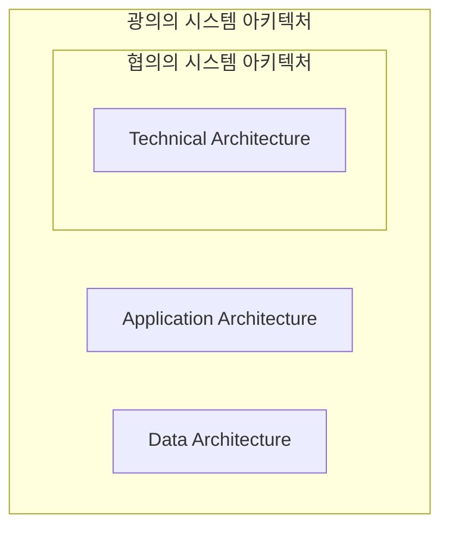

<!-- PDF page: 024 -->

### 01 시스템아키텍처의 개념

#### 가) 시스템아키텍처의 이해

##### ① 시스템아키텍처의 개요

IT(정보기술)의 기술을 이용한 시스템을 정보시스템이라 한다. 이 정보시스템은 컴퓨터를 이용하여 서비스를 제공하며 컴퓨터는 하드웨어와 소프트웨어 조합으로 동작된다. 기업내부에서 사용되는 정보시스템이나 사용자에게 서비스로 제공되는 정보시스템을 구축할 경우 소프트웨어 설계와 개발뿐만 아니라 하드웨어와 같은 IT 인프라스트럭처(Infrastructure)에 대한 설계와 구축이 필요하다. 소프트웨어 분야는 소프트웨어 아키텍처를 기반으로 소프트웨어 구성요소와 구성요소 간의 연결과 제약사항 동작원리를 설계한다. 하드웨어 분야에서도 소프트웨어 분야와 마찬가지로 하드웨어 아키텍처를 설계하고 개발하게 된다. 시스템 아키텍처는 하드웨어와 소프트웨어 아키텍처를 기반으로 시스템이 서비스를 제공하기 위한 아키텍처를 말한다. 광의의 정의로서는 정보시스템 구축을 위한 AA, DA, TA 측면의 아키텍처 모두를 말하지만 협의의 의미로서는 서버, 스토리지, 네트워크, 보안 등의 하드웨어 장비와 운영체제, 미들웨어 등의 일정 부분의 소프트웨어들의 구성과 관계를 정의한 문서를 말한다.

##### ② 시스템아키텍처 정의

- 국제 시스템엔지니어링 협회(INCOSE)에서 정의한 시스템아키텍처

시스템 구성항목과 인터페이스, 프로세스, 제약 조건, 동작방법 등의 측면에서 정의된 기초적인 통합 시스템 구조

[그림 1] 시스템아키텍처의 정의
