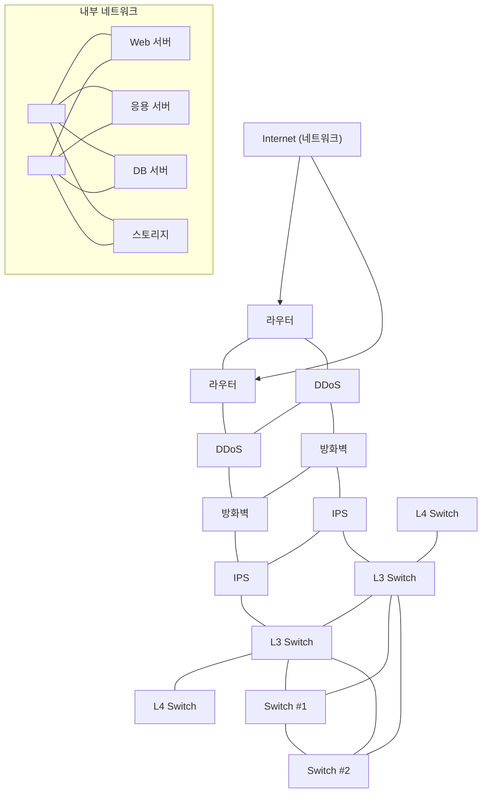

<!-- PDF page: 026 -->

[그림 2] 정보시스템 구성요소

<!-- 하단의 두 공통 연결선을 이름 없는 연결점 두 개로 표현했다. 원본에서 스위치와 하단 선 사이 연결은 표시되지 않아 추가하지 않았다. -->

- 서버

서버는 정보시스템의 계산능력(Computing power)을 제공한다. 이 계산능력을 이용하여 응용 프로그램을 구동시켜 비즈니스 로직을 처리하고 데이터에 대해 처리할 수 있다. 서버는 컴퓨터하드웨어, 운영체제, 미들웨어, 응용프로그램의 스택구조로 구성요소를 나눌 수 있다. 시스템아키텍처의 설계에 따라 서버의 용량, 대수, 배치방식, 역할 등이 정의되고 서버들 사이의 통신은 네트워크를 통해 이루어진다. 최근에 주로 사용되는 서버의 유형으로는 메인프레임, 유닉스 서버, x86 서버가 있으며 클라우드 서비스가 확대됨에 따라 인텔 CPU를 이용하는 x86서버의 사용이 점점 확대되고 있다.

웹 서비스를 하는 정보시스템에서의 각 서버의 역할을 예를 들어 설명하면, 웹브라우저를 통해 사용자 요청에 응답하고 웹 페이지를 구성하고 사용자에게 보여주기 위한 화면을 제공하는 웹서버(Web Server)와 사용자의 요청에 맞게 비즈니스 로직을 처리하고 결과를 저장하기 위한 DB서버로 전달하거나 표현하기 위해 웹서버로 전달하는 응용서버(WAS, Web Application Server), 데이터의 생성, 요청, 수정, 삭제를 처리하는 DB서버(Database Server)로 구성된다

- 네트워크

정보시스템을 구성하는 각 구성요소들 사이의 통신망을 구성해 주는 역할을 수행한다. 서버와 서버들 사이의 통신, 서버와 스토리지 사이의 통신, 회사내부의 네트워크와 외부 네트워크 사이의 통신들 사이에는 네트워크 장비가 역할을 수행한다. 네트워크는 OSI 7계층 표준을 기준으로 장비와 역할이 나뉜다. 대표적으로는 스위치(Switch), 라우터(Router), 로드
