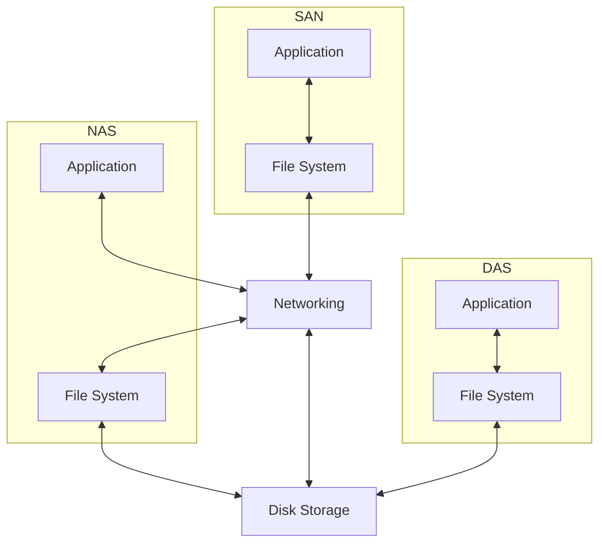

<!-- PDF page: 027 -->

밸런서(L4/L7 Load balancer), 브리지(Bridge) 등이 있으며, 무선 네트워크를 위한 AP(Access Point)장비가 있다. 네트워크 영역은 보안영역과 중복되는 영역이 존재한다. 대부분의 보안공격이 네트워크를 통해 침입하기 때문에 외부네트워크(WAN)와 연결되는 내부네트워크(LAN) 게이트(Gate)에는 보안장비를 통해 내부 네트워크를 보호하고 있다.

- 스토리지

정보시스템의 데이터를 저장하기 위한 저장소이다. 스토리지는 저장되는 방식에 따라 3가지 정도로 구분한다. 16KB, 64KB 등의 고정된 블록단위로 데이터를 저장하는 방식을 블록스토리지라고 한다. 블록스토리지는 Microsoft 윈도우나 리눅스, 유닉스 등의 운영체제가 저장되는 곳이 블록스토리지이다. 고정된 블록이 아닌 파일단위로 저장하는 방식을 파일스토리지라고 한다. 파일스토리지는 공유파일 저장소로 많이 사용되는 NAS(Network Attached Storage)가 파일스토리지이다. 저장되는 단위가 블록이나 파일이 아닌 오브젝트 단위로 저장되는 스토리지를 오브젝트 스토리지라고 한다. 오브젝트 스토리지는 대부분의 클라우드 스토리지에서 사용되고 있다. 연결방식으로 스토리지 유형을 나눌 수 있다. 각 서버 내부에 장착되어 있는 DAS(Direct Access Storage)와 네트워크를 통해 연결되는 NAS(Network Attached Storage), 스토리지 전용 네트워크를 통해 연결되는 SAN(Storage Area Network) 등이 있다. DAS는 파일시스템(filesystem)을 만들어야 사용할 수 있으며, 사례로는 IDE, SATA, SAS 등이 있다. SAN은 SAN 네트워크를 통해 운영체제에 제공되며 DAS처럼 사용하기 전에 파일시스템을 만들어야 된다. 사례로는 SAN, iSCSI, FCoE 등이 있다. NAS는 운영체제에 마운트하여 바로 사용할 수 있다. 사례로는 NFS, CIFS, AFS 등이 있다.

[그림 3] 연결방식에 따른 스토리지 유형

- 보안

정보보호를 네트워크와 연결되어 구성된다. 외부 인터넷 구간과 내부 네트워크 사이에 설치되어 내부의 시스템을 보호하는 장비와 내부 네트워크에 설치되는 장비가 있다. DDoS 공격을 방어하기 위한 DDoS 방어장비, 네트워크 트래픽에 대한 감시, 로깅, 차단을 통해 시스템을 보호하는 방화벽, 이상트래픽이나 오용방지를 위한 IPS/IDS, 웹 서비스 트래픽에 대한 로깅, 감시, 차단을 통해 웹서버를 보호하는 웹방화벽, 서버에 대한 접근을 허가하거나 거부하는 관리 기능을 제공하는 접근제어 솔루션 등이 있다.
