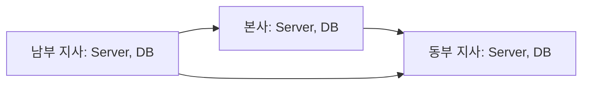
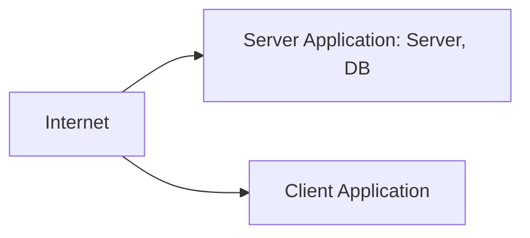

<!-- PDF page: 029 -->

<!-- 생략: 그림 5 / 각 지역의 사용자 아이콘 -->

[그림 5] 지역별 분산형 시스템아키텍처

#### 다) 응용 프로그램 제공 방식에 따른 분류

##### ① 클라이언트-서버 아키텍처

업무의 규모나 환경에 따라 시스템의 기능을 서버와 클라이언트에 분리하여 위치시키고 서비스를 사용하도록 구성하는 아키텍처이다. 시스템의 기능인 데이터관리, 비즈니스 프로세스, 프리젠테이션 영역을 어느 곳에 위치시키냐에 따라 서버 와 클라이언트에서 담당하는 역할이 달라진다. 클라이언트에서 응용프로그램을 구동시켜 그래픽 화면 구성을 통해 사용자 인터페이스의 편의성을 제공할 수 있다. 하지만 구성이 복잡하고 서버와 클라이언트로 분리되어 개발과 관리가 어렵다. 서비스 유형으로는 게임, 채팅, 메신저, FTP서버, 터미널 서버 등이 있다.

[그림 6] 클라이언트-서버 아키텍처
