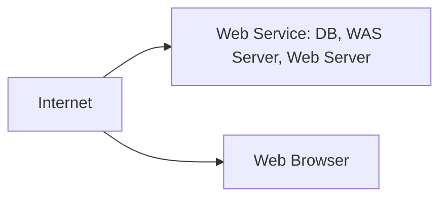

<!-- PDF page: 030 -->

- 웹 시스템 아키텍처

서버에 응용 프로그램 기능을 모두 구현하고 클라이언트에서는 웹브라우저를 이용하여 서비스를 이용하는 아키텍처이다. 웹서버, 웹응용서버, 데이터베이스 서버로 일반적으로 구성되며 미들웨어를 통해 안정적인 성능을 보장할 수 있으며 프로그램의 재사용성이 높다. 과거에는 정적인 웹화면 위주의 서비스를 제공하는 한계가 있었으나 HTML5의 등장과 PC 환경의 성능변화에 따라 동적이고 화려한 GUI환경으로 서비스를 제공할 수 있다. 최근에 사용되는 대부분의 정보시스템 은 웹 시스템 아키텍처를 이용한다. 클라이언트는 웹브라우저가 구동되는 환경이면 PC환경과 모바일 환경에서 모두 서비스를 이용할 수 있다.

[그림 7] 웹 시스템 아키텍처

#### 라) 시스템 계층에 따른 분류

시스템의 구성요소별 기능과 역할을 티어(Tier)나 레이어(Layer)를 기준으로 나눈다. 일반적으로 많이 듣는 레이어는 네트워크의 구조를 나타내는 OSI 7 레이어이다. 레이어와 티어는 기능과 역할을 티어구조로 나타내는 측면에는 유사한 개념으로 여겨진다. 하지만 가장 보편적으로 나눌 수 있는 차이점은 레이어는 논리적인 관점에서의 구조를 말하며 티어는 물리적인 관점에서의 구조를 말한다. 정보시스템을 레이어로 나눈다면 프리젠테이션 레이어(Presentation Layer), 비즈니스 로직 레이에Business Logic l-ayer), 데이터 레이어(Data Layer)로 구분 지을 수 있다. 이 논리적인 레이어 구조를 물리적인 시스템아키텍처로 N-티어(Tier) 구조로 나눌 수 있다. N-티어 구조에는 대표적으로 2티어 구조와 3티어 구조가 있다.

<table>
<tr><th>구분</th><th>내용</th></tr>
<tr><td>프리젠테이션 레이어</td><td>- 응용 프로그램의 최상위에 위치하고 있으며 사용자에게 서비스의 정보와 인터페이스를 제공한다. 이 레이어를 GUI 또는 프론트 엔드(front-end)라고도 부른다. 물리적인 티어 구조에서는 웹서버와 클라이언트의 웹브라우저가 이 레이어에 속한다.</td></tr>
<tr><td>비즈니스 로직 레이어</td><td>- 비즈니스의 요구사항에 맞는 프로그램 정보처리 규칙(비즈니스 로직)이 구동되는 레이어이다. 비즈니스 로직에 따라 어떤 데이터가 필요한지 결정하고 데이터 티어에 요청한다. 이 레이어를 트랜잭션 티어이라고도 한다. 물리적인 티어 구조에서는 웹 응용 서버(WAS) 등의 응용 프로그램 서버가 이 레이어에 속한다.</td></tr>
<tr><td>데이터 레이어</td><td>- 데이터베이스와 같은 데이터 리소스를 접근해서 데이터를 읽거나 쓰는 레이어이다. 일부 자료에서는 데이터 레이어는 데이터 접근 레이어(Data Access Layer)와 데이터 저장 레이어(Data Store Layer)로 나누기도 한다. 물리적인 티어 구조에서는 DB서버 또는 파일 시스템(File System) 등이 이 레이어에 속한다.</td></tr>
</table>

- 2-티어 아키텍처

2티어 구조는 데이터의 저장과 처리는 서버에서 역할을 가지고 비즈니스 로직과 프리젠테이션 처리는 클라이언트에서 모두 처리한다. 일반적으로 클라이언트-서버 아키텍처 구조와 동일한 구조이다. 클라이언트에서 대부분의 로직을 처리하기 때문에 소규모 사용자의 경우 속도가 빠르고 구현이 쉽다는 장점이 있다. 하지만 사용자가 많아질수록 성능이 좋지 않아 확장성과 재사용성의 자원활용 측면에서 좋지 못하다. 실 사용사례로는 4GL툴인 파워빌더, 비쥬얼베이직, 델파이
