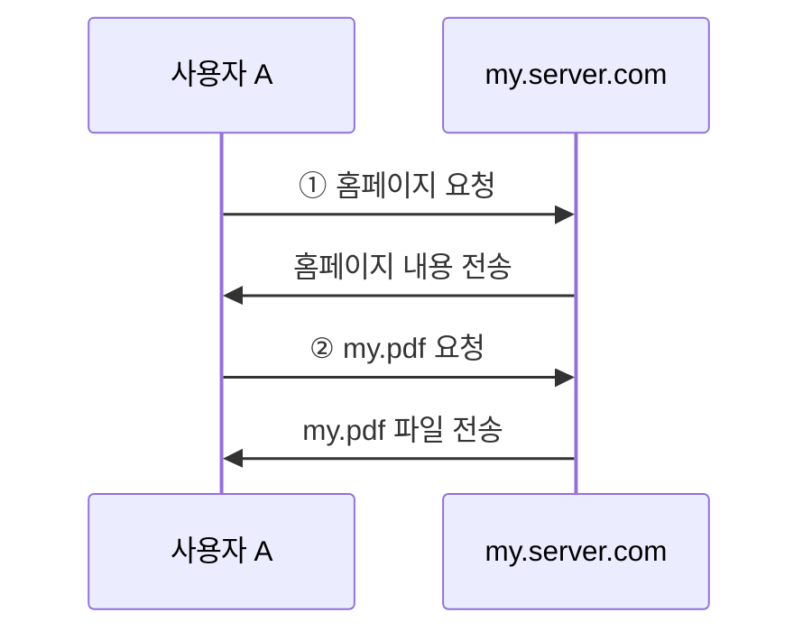

<!-- PDF page: 035 -->

### 실무 미리보기

**네트워크를 이해하려면?**

<!-- 생략: 그림 10 / 사용자·서버·공유기·라우터의 네트워크 배치 그림. 원문의 주소 표기를 아래에 유지 -->

| 구분 | 원문 표기 |
| --- | --- |
| 유무선 공유기 B | IPv4 주소: 14.32.172.167 서브넷 마스크: 255.255.255.0 게이트웨이: 14.32.172.254 DHCP 서버: 121.138.7.42 DNS 서버1: 168.126.63.1 DNS 서버2: 168.126.63.2 |
| 사용자 A | IPv4 주소: 192.168.11.5 IPv4 서브넷 마스크: 255.255.255.0 IPv4 주소: 192.168.11.1 IPv4 주소: 192.168.11.1 IPv4 주소: 192.168.11.1 |
| 네트워크 | 14.32.172.0 192.168.11.0 220.17.23.0 |
| 장비 | 라우터 C 스위칭허브 D |
| 서버 | my.server.com 220.17.23.15 |

[그림 10] 사용자와 서버 간 네트워크

[그림 10]은 사용자 A가 궁금해 하는 자료를 찾기 위해 웹 서버(my.server.com)에 접속하여 컴퓨터를 사용하는 상황에서 가상의 네트워크 연결을 보여주는 그림이다. 이는 집이나 학교, 회사 등 생활 전반에서 빈번하게 접할 수 있는 상황이지만, 많은 사용자들은 자신이 사용하는 컴퓨터 네트워크 정보조차 잘 모르고 사용하고 있다. 아래 예제를 통하여 사용자가 네트워크 서비스를 이용할 때의 상황을 구체적으로 살펴보자.

[그림 11] 사용자 A의 웹 사용 상황
