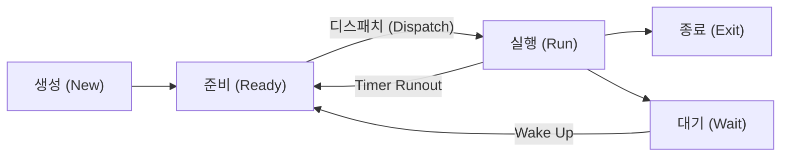

<!-- PDF page: 048 -->

### 02 프로세스와 스레드

#### 가) 프로세스(Process)의 이해

초기의 컴퓨터 시스템은 한번에 하나의 응용 프로그램만 수행할 수 있었다. 즉 하나의 프로그램이 모든 시스템을 점유하고 자원을 점유하여 사용할 수 있었다. 하지만 오늘날의 컴퓨터 시스템들은 다수의 프로그램이 병행 수행된다. 운영체제에서 동작되는 다수의 프로그램이 자원을 공유하고 안정적으로 동작되게 컴퓨터 자원을 관리한다. 프로세스란 수행중인 프로그램을 의미하며 병행 수행이 가능한 오늘날의 멀티테스트 환경에서는 시분할 시스템의 작업 단위이다.

##### ① 프로세스의 상태

프로세스는 [그림 16]과 같이 생명주기 동안 구분된 프로세스 상태를 갖는다.

[그림 16] 프로세스의 상태변화

- 생성: 프로세스가 생성되었으나 아직 운영체제에 의해 실행 가능하게 되지 못한 상태

- 준비: 프로세스가 실행을 위해 CPU를 할당 받기를 기다리는 상태

- 실행: 프로세스가 CPU를 차지하고 있는 상태

- 종료: 프로세스의 실행이 끝나고 CPU 할당이 해제된 상태

- 대기: 프로세스가 CPU를 할당 받아 실행되다가 입/출력 완료 등과 같은 어떤 사건이 발생해 주기를 기다리고 있는 상태

##### ② 프로세스제어블록(PCB, Process Control Block)

프로세스제어블록은 운영체제가 프로세스 관리를 위해 필요한 정보를 저장하는 것으로, 프로세스가 생성될 때마다 고유의 PCB가 생성되고 프로세스가 완료되면 PCB는 제거된다. PCB에는 프로세스 식별번호(PID, Process Identification Number), 프로세스 상태, 프로그램 카운터(다음에 실행할 명령어를 가리키는 값), 스케줄링 우선 순위, 레지스터 정보, 주기억장치 관리 정보 등이 포함된다.

#### 나) 프로세스 관리를 위한 기법

##### ① 프로세스 생성(Process Creation)

프로세스는 병행 수행될 수 있어야 하며, 동적으로 생성 제거될 수 있다. 프로세스는 실행 도중에 프로세스 생성을 위한 "fork()” 시스템 호출(System Call)을 통해 여러 개의 새로운 프로세스를 생성할 수 있다. 이때 생성하는 프로세스를 부모 프
