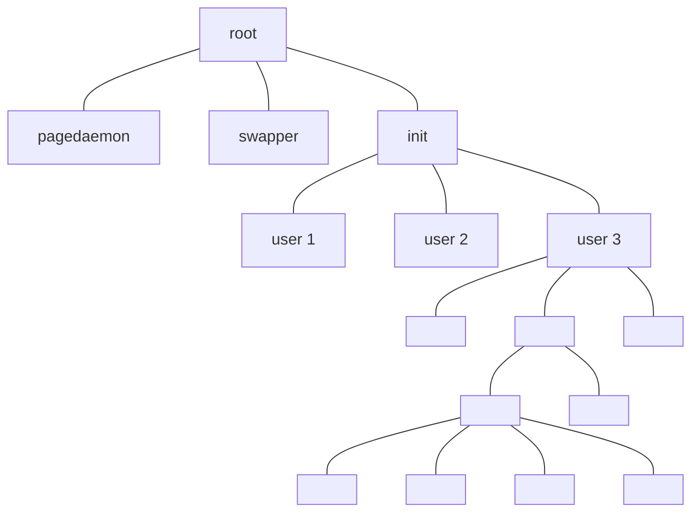
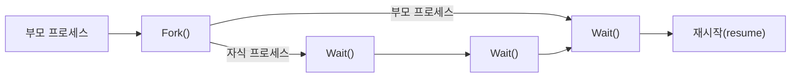

<!-- PDF page: 049 -->

로세스라고 하고 새로운 프로세스를 자식 프로세스라 부른다. 자식 프로세스도 또 다른 자식 프로세스를 생성할 수 있으며, 이러한 관계는 [그림 17]과 같이 트리 형태의 구조로 형성된다.

[그림 17] UNIX운영체제의 프로세스 트리구조 (예)

##### ② 프로세스 종료(Process Termination)

프로세스는 [그림 18]과 같이 프로그램의 마지막 코드의 실행을 끝내고 "exit()” 시스템 호출을 사용하여 운영체제에게 프로세스의 삭제를 요청한다. 이 시점에서 자식 프로세스는 "wait()” 시스템 호출을 통해 부모 프로세스에게 자료를 반환하며, 운영체제는 삭제되는 프로세스에 할당된 모든 자원을 회수한다.

[그림 18] UNIX 운영체제의 프로세스 생성과 종료

#### 다) 스레드(Thread)

##### ① 스레드 개념

중앙처리장치(CPU)를 사용하는 기본 단위이며, 경량 프로세스(lightweight process)라고도 한다. [그림 19]와 같이 일반적으
