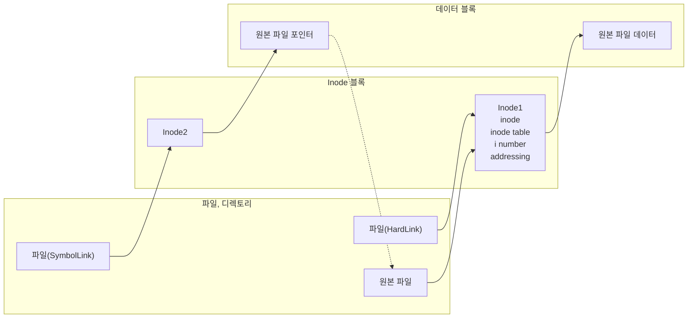

<!-- PDF page: 061 -->

#### 다) 운영체제별 파일시스템의 종류

| 운영체제 | 파일시스템 |
| --- | --- |
| 유닉스 | Boot Block, Super Block, Bitmap Block, i-node, Data Block |
| 리눅스 | 확장파일시스템(ext, ext2, ext3, ext4), ZFS, ResierFS, XFS |
| 솔라리스 | ZFS, UFS |
| 맥 OS | HFS, HFS+ |
| 윈도우 | FAT, NTFS |

#### 라) 유닉스(UNIX)의 i-node

유닉스 시스템에서 i-node는 파일/디렉토리의 정보를 통해 할당, 적용, 생성, 링크, 삭제의 역할을 수행한다.

| i-node 구성요소 | 내용 |
| --- | --- |
| inode | − 한 파일이나 디렉터리의 모든 정보 포함 − 소유자 정보, 접근 정보, 파일 정보, 링크, 유형 |
| inode table | 한 파일 시스템에서, 파일이나 디렉터리들의 전체 inode를 갖고 있는 테이블 |
| i number | Inode가 i-list에 등록되는 entry number |
| addressing | 블록위치 정보를 13개의 필드로 관리 • Direct data block 10개 (0~9): 96kb data • Single indirect data block 1개 (10): 16MB • Double indirect data lock 1개 (11): 32GB • Triple indirect data block 1개 (12): 70TB |

### 08 입출력시스템

입출력시스템은 시스템의 입출력장치와 입출력 모듈(제어기)을 포함한다. 물리적 입출력 장치는 실제 프로세서와 컴퓨터 사용자 간의 자료와 정보에 대한 입출력을 수행하며, 입출력 모듈은 프로세서가 여러 입출력 장치를 쉽게 제어할 수 있도록 입출력 장치의 제어와 타이밍 조정, 프로세서와의 통신, 입출력장치들과의 통신, 데이터 버퍼링, 오류 검출 등의 기능을 제공한다.
