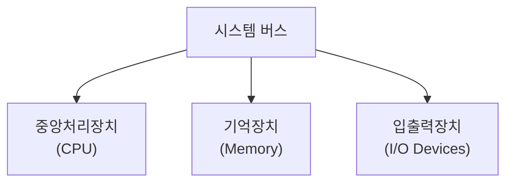
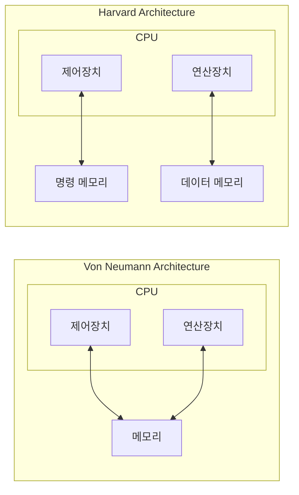

<!-- PDF page: 065 -->

- 입출력 장치(I/O Device): 입력장치(input device), 출력장치(output device)로 구성되며, 사용자와 컴퓨터 간의 대화를 위한 도구

[그림 30] 컴퓨터의 구조

#### 나) 컴퓨터 아키텍처의 종류

컴퓨터 아키텍처의 종류에는 1945년 폰노이만에 의해 발표된 프로그램 내장(Stored-Program)1 설계 원리를 적용한 구조인 폰노이만 아키텍처와 명령 메모리와 데이터 메모리를 분리한 하버드 아키텍처가 있다. 두 방식은 [그림 31]과 같이 메모리 형태가 다르며, 각각의 장단점이 있다.

- 폰노이만 아키텍처: CPU는 메모리로부터 명령을 읽고, 메모리로부터 데이터를 읽고 쓰기도 한다. 명령과 데이터는 같은 신호 버스와 메모리를 사용하기 때문에 동시에 발생할 수 없다.
- 하버드 아키텍처: 서로 다른 메모리에 명령어와 데이터를 저장하여 병목현상을 해결하고, 명령어 읽기/쓰기 병행 기능으로 성능이 향상되었으나 버스 시스템의 설계가 복잡하다.

[그림 31] 폰노이만 아키텍처 vs 하버드 아키텍처

폰노이만 아키텍처와 하버드 아키텍처 간에 장단점이 있지만, 최근 고성능의 CPU를 설계할 때는 두가지 아키텍처를 모두

<small>1 CPU 옆에 기억장치(Memory)를 붙이고, 프로그램과 데이터를 기억장치에 저장 해놓았다가 실행 명령에 따라 차례로 불러내어 처리</small>
