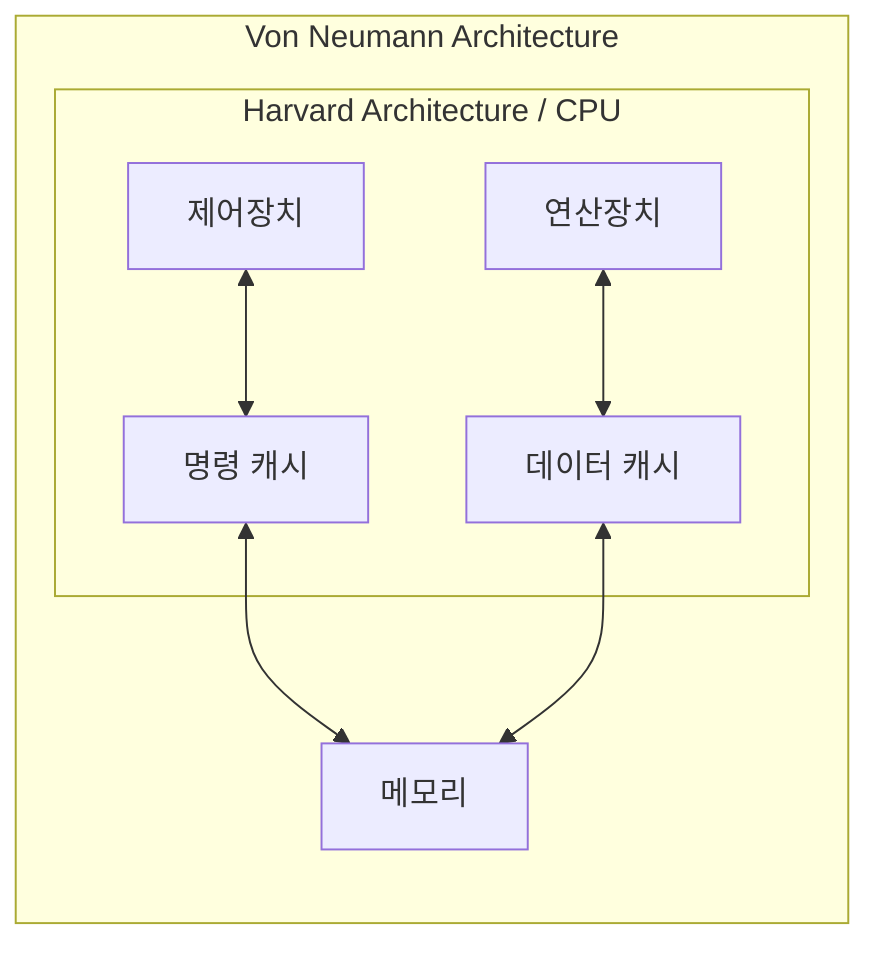

<!-- PDF page: 066 -->

도입해서 설계한다. 즉, 캐시메모리를 명령용과 데이터용으로 분리하여 [그림 32]와 같이 CPU내부(CPU와 캐시)에서는 하버드 아키텍처를 적용하고, CPU외부(CPU와 메모리)는 폰노이만 아키텍처를 적용한다.

[그림 32] 두가지 아키텍처가 모두 적용된 컴퓨터 아키텍처

### 02 중앙처리장치(CPU, Central Processing Unit)

#### 가) CPU의 정의

중앙처리장치(CPU)는 컴퓨터의 가장 중요한 부분으로서 명령을 해독하고, 산술논리연산이나 데이터 처리를 실행하는 장치이며, 프로그램의 실행과 데이터를 처리하는 중추적 기능의 수행을 담당하는 요소이다.

#### 나) CPU의 수행 동작

CPU는 〈표 9〉에서 보는 바와 같이 모든 명령어들에 대하여 공통적으로 수행하는 기능과 명령어에 따라 필요한 경우에만 수행하는 기능으로 나누어 동작한다.

〈표 9〉 CPU의 수행동작

| 구분 | 세부동작 | 설명 |
| --- | --- | --- |
| 공통적 동작 | 명령어 인출(Instruction Fetch) | 기억장치로부터 명령어를 읽어옴 |
| 공통적 동작 | 명령어 해독(Instruction Decode) | 수행해야 할 동작을 결정하기 위해서 인출된 명령어를 해독 |
| 필요시 수행 | 데이터 인출(Data Fetch) | 명령어 실행을 위하여 데이터가 필요한 경우에는 기억장치 또는 입출력장치로부터 그 데이터를 읽어옴 |
| 필요시 수행 | 데이터 처리(Data Process) | 데이터에 대한 산술적 또는 논리적 연산을 수행 |
| 필요시 수행 | 데이터 쓰기(Data Store) | 실행한 결과를 저장 |

#### 다) CPU의 구성요소

중앙처리장치는 [그림 33]와 같이 제어장치, 연산장치, 레지스터 그리고 이들을 연결하여 데이터를 전달하는 버스로 구성되어 있다.

① 제어유닛(Control Unit): 프로그램 코드(명령어)를 해석하고, 그것을 실행하기 위한 제어신호들(control signals)을 순차적으
