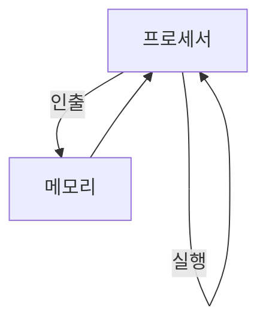
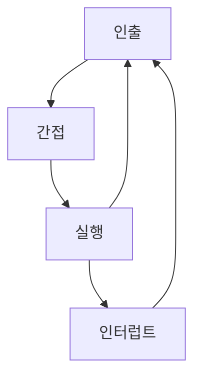

<!-- PDF page: 068 -->

[그림 34] 명령어 사이클 개념도

전체 명령어 사이클은 〈표 10〉과 같으며, 각 사이클마다 관련되는 CPU의 구성요소가 달라진다.

〈표 10〉 명령어 사이클의 종류와 CPU 구성요소의 관계

| 구분 | 세부동작 | 관련 CPU 구성요소 |
| --- | --- | --- |
| 인출 사이클 | 프로그램 카운터(PC)가 가리키는 기억장치 위치로부터 명령어를 인출해옴 | − 레지스터(PC, MAR, MBR, IR) − CPU 내부버스 |
| 실행 사이클 | CPU가 인출된 명령어 코드를 해독(Decode)하고, 그 결과에 따라 필요한 연산을 수행 | − 레지스터(AC) − ALU − 제어유닛 |
| 인터럽트 사이클 | 인터럽트 요구신호를 검사하고, 현재의 PC 내용을 스택에 저장한 다음에 PC에 해당 ISR의 시작주소를 적재하는 과정 | − 레지스터(MBR, PC, MAR, SP) |
| 간접 사이클 | 실행 사이클이 시작되기 전에 그 데이터의 실제 주소를 기억장치로부터 읽어오는 과정 | − 레지스터(MAR, IR, MBR) − CPU 내부버스 |

#### 마) 명령어 집합구조, CISC와 RISC

명령어 집합(Instruction set) 또는 명령어 집합 구조(Instruction set architecture, ISA)는 마이크로프로세서가 인식해서 기능을 이해하고 실행할 수 있는 기계어 명령어를 말한다. 명령어 집합 구조는 자료형, 명령어, 레지스터, 어드레싱 모드, 메모리 구조, 인터럽트, 예외 처리, 외부 입출력을 포함한 프로그래밍 관련 컴퓨터 아키텍처의 일부이다.

대표적인 명령어 집합 구조로는 CISC와 RISC가 있으며, 각 구조의 개념 및 차이는 〈표 11〉과 같다.

- CISC(Complex Instruction Set Computer): 복잡한 명령처리를 하나의 명령어로 실행할 수 있도록 다수의 복잡한 명령어를 H/W화한 복합 명령형 컴퓨터
- RISC(Reduced Instruction Set Computer): 복잡한 명령을 단순한 명령어들의 조합으로 처리할 수 있도록 소수의 단순한 명령어를 H/W화한 축소 명령형 컴퓨터
