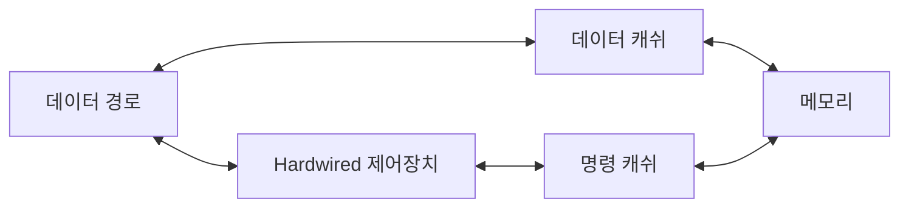

<!-- PDF page: 069 -->

〈표 11〉 CISC와 RISC의 비교

시스템 구성 — CISC

시스템 구성 — RISC

| 구분 | CISC | RISC |
| --- | --- | --- |
| 명령어 구성 | 1 Byte: OP-CODE 2 Byte: OP-CODE / OP-CODE 2 Byte: OP-CODE / OPERAND 3 Byte: OP-CODE / OP-CODE / OPERAND 3 Byte: OP-CODE / OPERAND / OPERAND 4 Byte: OP-CODE / OP-CODE / OPERAND / OPERAND 가변길이 형태로 필요한 정보만을 명령어로 저장하므로 낭비되는 코드를 줄일 수 있으며 이에 따라 프로그램 크기도 작아짐 | OP-CODE / OPERAND / OPERAND2 32비트로 고정 32비트의 고정된 명령어 길이로 파이프라인 적용이 용이함 |
| 제어장치 | Micro-Program 방식 | Hard-Wired 방식 |
| 컴파일러 | 단순한 구조 | 복잡한 구조 |
| 레지스터 수 | 적은 편 | 많은 편 |
| 활용사례 | Intel 계열(x86) | ARM, MIPS |

### 03 기억 장치(Memory)

#### 가) 기억장치의 계층구조

기억장치는 [그림 35]와 같이 상위층으로 갈수록 비트당 가격이 높아지고, 용량이 감소하며, 액세스 시간은 짧아지고, CPU에 의한 액세스 빈도는 높아진다.

| 계층 (위에서 아래) | 구분 |
| --- | --- |
| 레지스터(Register) | 내부메모리(Internal Memory) |
| 캐쉬메모리(Cache Memory) | 내부메모리(Internal Memory) |
| 주기억장치(Main Memory) | 내부메모리(Internal Memory) |
| 보조기억장치(Auxiliary Memory) | 외부메모리(External Memory) |

| 구분 | 위 | 아래 |
| --- | --- | --- |
| 접근속도 | 빠름 | 느림 |
| 비트당가격 | 고가 | 저가 |
| 저장용량 | 소량 | 대량 |

<!-- 생략: 그림 35 / 계층의 피라미드 면적 표현 -->

[그림 35] 기억장치의 계층구조
