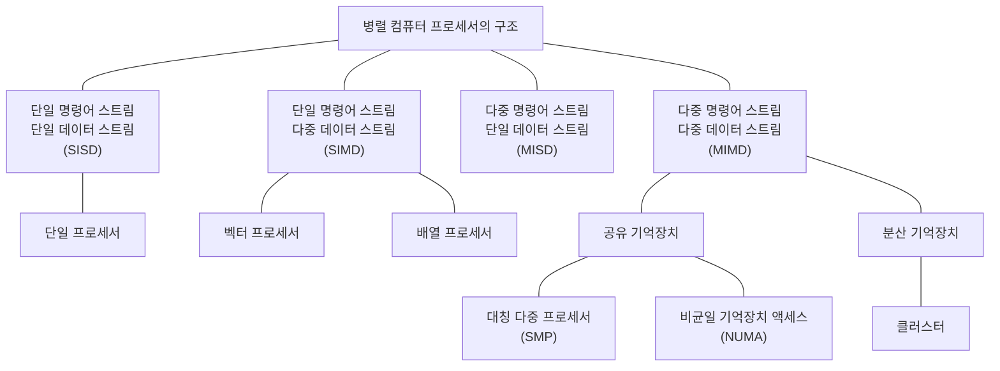

<!-- PDF page: 078 -->

### 실무 미리보기 | “인텔 vs 엔비디아 vs 구글, AI 시장 승자는? - 병렬처리능력·선점시장 기반 공략, 구글은 TPU 활용한 전력 효율성 제고 눈길”

인공지능(AI)가 4차 산업 혁명의 핵심 기술로 부각되면서 병렬처리기술에 대한 경쟁도 심화되고 있다. 기존의 프로그램들은 CPU 기반의 직렬(순차) 처리 방식으로 구현되었지만 GPU 기반의 프로그램들은 여러 개의 명령어를 동시에 처리하는 병렬처리기술을 이용하고 있어 인공지능의 딥러닝을 구현하는데 사용되고 있다. 구글에서도 TPU라는 자체 프로세서를 추가하여 병렬처리 능력을 높이고 있다.

[출처: 월간전자부품 뉴스]

### 01 병렬 처리 시스템(Parallel Processing System)

#### 가) 병렬 처리 시스템의 개념

병렬처리는 하나 또는 하나 이상의 독립된 운영체제가 여러 개의 프로세서를 관리하고 여러 작업을 처리하는 것이다. 병렬처리를 위한 프로그램 개발언어와 문법이 별도로 있다. 병렬로 처리할 경우 처리속도는 빠르며 기억장치를 공유할 수 있다. 여러 개의 프로세서로 동작되게 되어, 일부 하드웨어에서 오류가 발생하더라도 전체 시스템의 동작에는 영향이 적다. 많은 데이터와 반복적인 복잡한 연산으로 구성된 인공지능 분야, 짧은 시간에 정확한 결과를 얻어야 되는 군부대의 장비, 광범위의 데이터에서 검색하고자 하는 데이터를 빠른 시간에 추출하는 검색서비스 등에서 많이 사용되고 있다. 병렬 처리 시스템의 분류는 플린(Flynn’s taxonomy)의 분류, 메모리 구조에 따른 분류가 대표적이다.

#### 나) 병렬 처리 시스템의 플린에 의한 분류

[그림 41] 병렬 컴퓨터 프로세서의 구조
