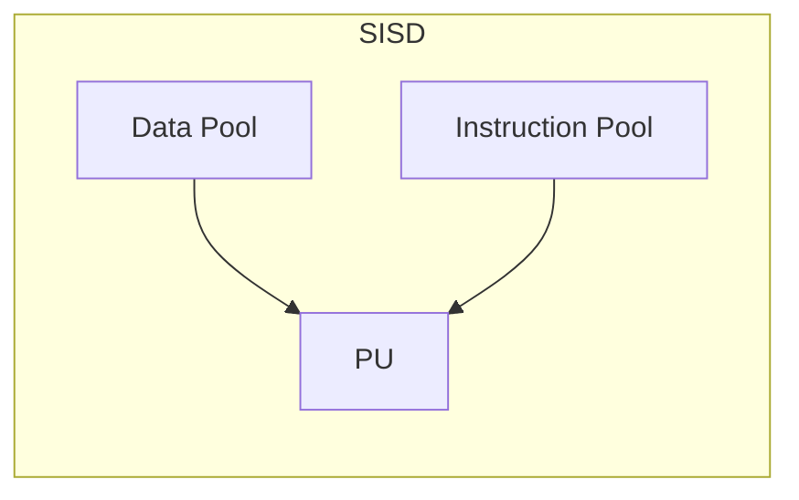
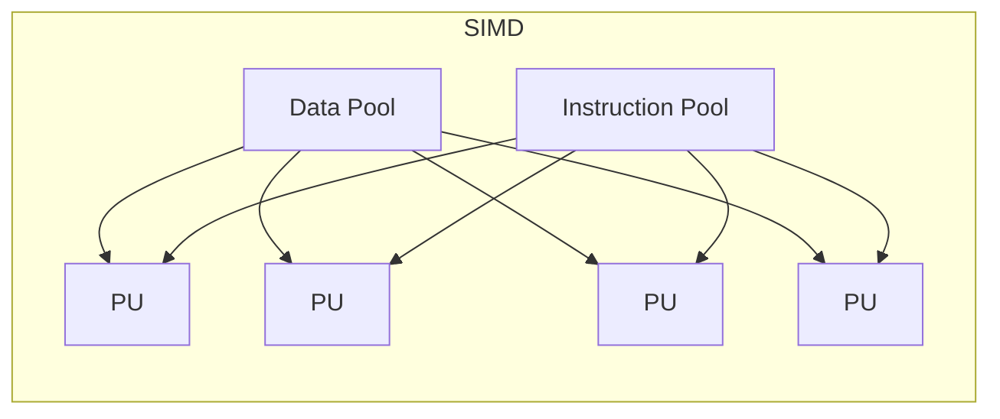

<!-- PDF page: 079 -->

##### ① SISD(단일명령–단일자료, Single Instruction Stream Single Data Stream)

한 번에 한 개씩의 명령어와 데이터를 순서대로 처리하는 단일 프로세서 시스템으로 현재의 일반적인 컴퓨터 구조이며, 폰 노이만 구조에 해당된다. 제어장치가 하나의 명령을 번역한 후 처리기를 작동시켜 명령을 처리할 때 기억장치에서 하나의 자료를 꺼내서 처리한다. 각 데이터를 처리하기 위해서는 매번 명령어를 읽어야 하기 때문에 성능이 떨어진다. 성능 향상을 위해서는 파이프라이닝(Pipelining)과 슈퍼스칼라(Superscalar) 기법과 같은 동시 수행하는 방법을 이용하여 성능을 향상시킬 수 있다.

##### ② SIMD(단일명령–다중자료, Single Instruction Stream Multiple Data Stream)

하나의 명령어로 다수의 데이터들을 동시에 실행하는 구조로 다수의 데이터들에 대하여 동일한 연산을 수행한다. 배열 프로세서(Array Processor)라고도 부르며, 배열 처리기에 의한 동기적 병행 처리가 가능하다. SIMD 구조로 만들어진 인텔의 프로세스는 MMX라는 명령어 세트를 넣은 펜티엄 프로세스이다. 이름은 ‘멀티미디어 가속’인데, 실제로는 자주 쓰이는 부동소수점 연산 처리를 빠르게 처리할 수 있도록 하는 코드다. 명령어 하나로 동시에 여러 개의 연산을 처리하기 때문에 결과적으로 처리 속도가 빨라진다.

[그림 42] SISD 구조

[그림 43] SIMD 구조

##### ③ MISD(복수명령–단일자료, Multiple Instruction Stream Single Data Stream)

각 프로세싱 유닛들은 서로 다른 명령어를 실행하지만, 처리되는 데이터들은 동일한 데이터를 처리하는 병렬 컴퓨팅 아키텍어이다. 파이프라인 아키텍처가 이 부류에 속한다. 많이 사용되지 않는 아키텍처이다.

##### ④ MIMD(복수명령–복수자료, Multiple Instruction Stream Multiple Data Stream)

다수의 프로세서들이 각각 다른 프로그램과 서로 다른 데이터들을 처리하는 구조로 대부분의 병렬 컴퓨터들이 이 분류에 해당된다. MIMD 구조는 어떻게 메모리를 이용하냐에 따라 공유 메모리모델과 분산 메모리 모델로 나눌 수 있다. 데이터의 상호작용 정도에 따라 공유메모리 모델을 강결합 시스템(Tightly-coupled System)이라고 하고, 분산 메모리 모델을 약결합 시스템(Loosely-coupled System)으로 분류한다.
