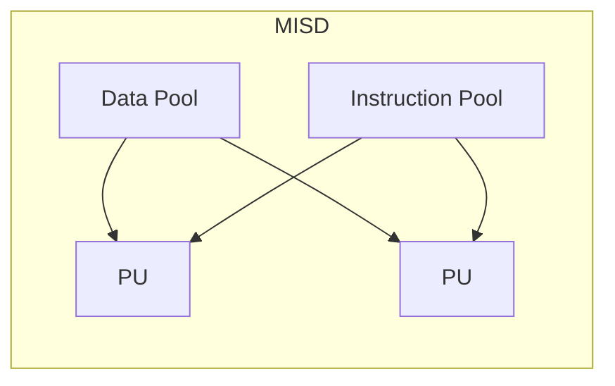
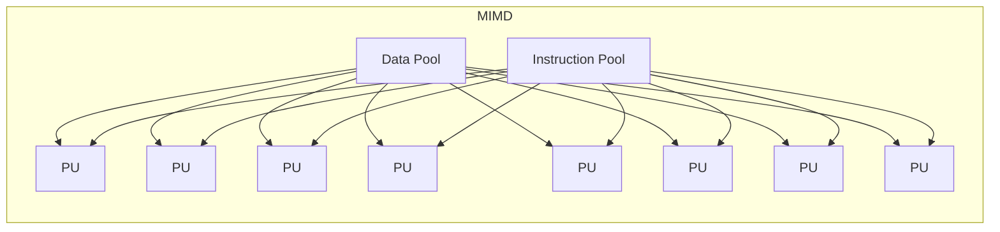

<!-- PDF page: 080 -->

[그림 44] MISD 구조

[그림 45] MIMD 구조

#### 다) 메모리 구조에 의한 병렬 처리 시스템 분류

##### ① SMP(대칭형 다중 프로세서, Symmetric Multiprocessor)

모든 프로세서가 메인메모리를 공유메모리로 사용하는 강결합 시스템 구조로 데이터 전달은 공유메모리를 이용할 수 있어 프로그램이 용이하다. 하지만 확장의 어려움이 있고, 내부버스를 이용하여 메인 메모리에 접근하여 데이터를 공유하기 때문에 버스에 병목현상이 발생할 수 있다.

[그림 46] SMP 구조

##### ② MPP(거대 병렬 프로세서, Massive Parallel Processor)

프로세서 별로 독립된 메인 메모리를 가지는 분산된 메모리방식으로 내부버스나 이더넷과 같은 네트워크를 통해 프로세스 간의 데이터를 교환하는 약결합 시스템 구조이다. 개별 CPU, 메모리, 입출력장치 등의 시스템 자원을 각각 갖는 노드들을 네트워크로 연결하는 구조로 확장성이 좋으나 프로그램의 어려움이 있다.
